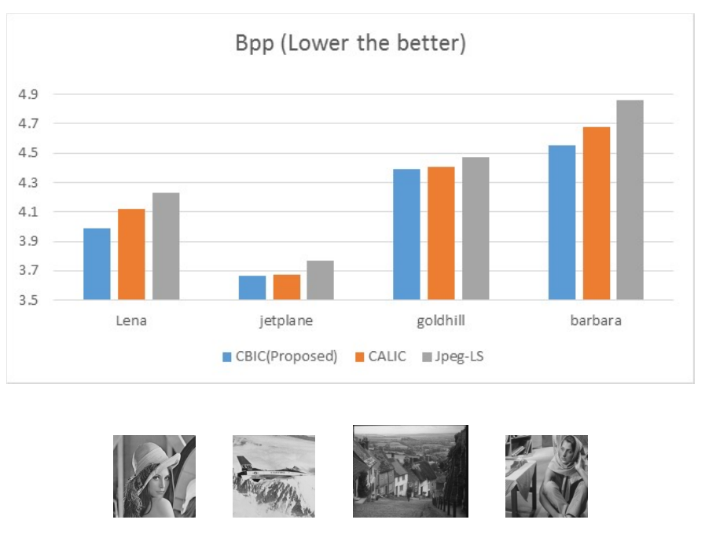
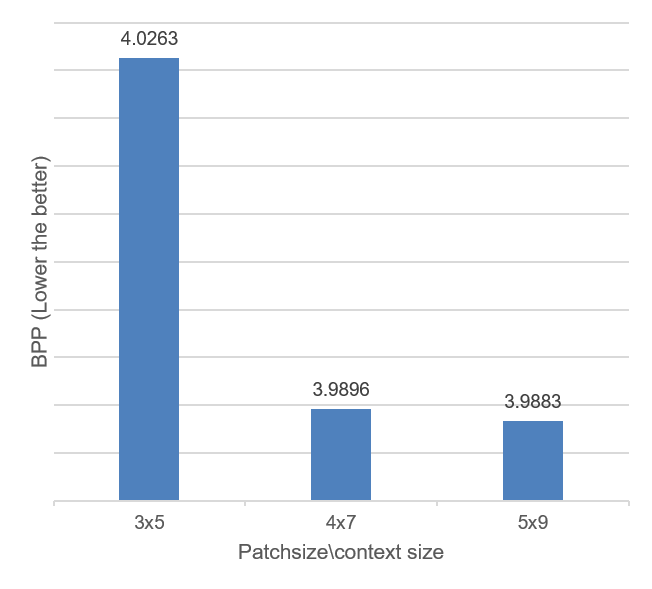

# Toward the Maximum Compression Rate

---
#### Wei-Ying Wang and Stuart Geman, 2017

We developed a lossless image compression algorithm that have analytic guarantee. When context size is getting bigger, our algorithm will reach the optimal compression rate a.e. under very light assumptions. We actually don’t need a lot of context size to outperform CALIC algorithm, one of the best scheme so far. In the following plot we compare the bits-per-pixel results of our algorithm to those of CALIC and Jpeg-LS on 4 different test images (the images is shown in the bottom).

	

The idea is to utilize external library: nowadays we have almost infinite images, and we harness them to build an image model suitable for lossless image compression. The key idea is the re-usability of small patches. That is, if you look closely on an image to pixel level, usually you will find out repetitions between image patches.

Almost all the lossless compression algorithm are similar: build a predictive model base on the context. So do we; the difference is that we can approximate the true probability analytically (Note that to prove it requires immense amount of studying... which spent us the most time), rendering a better bits-per-pixel result.

Also, the algorithm we built is context-scalable; i.e. we can setup the context size to be 2x3, 4x7, 5x9... to predict our target pixel value. In particular, we built a library as large as 80 million 5x9 image patches, which needs parallel computing (Amazon EC2) to carry out the implementation. The following plot compares our algorithm with different context size setting. One would expect larger context should provide better prediction, as shown in the plot. However, in the plot we also see the diminishing of returns, result of using 4x7 is not far from result of using 5x9.

| 
Compression result: Different context size 
 | 
 Target image
 | 
---|---
| 
 
|
 

As you might be wondering, isn't this too computational intensive to use? Yes you are right. However, people invented deep learning in 1960s and it shines when computer is catching up, nearly 60 years after. Our algorithm may not be immediately useful but the idea behind it will be applicable in 50 year, hopefully.