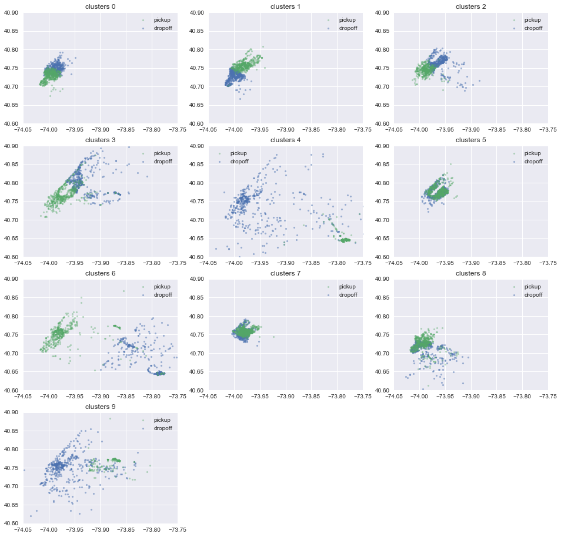
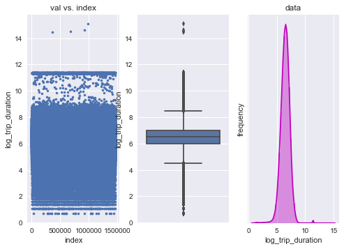
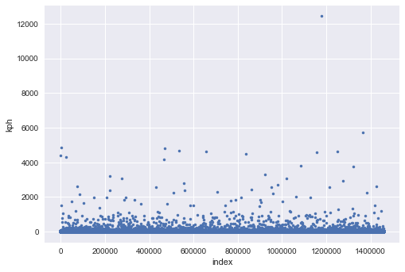
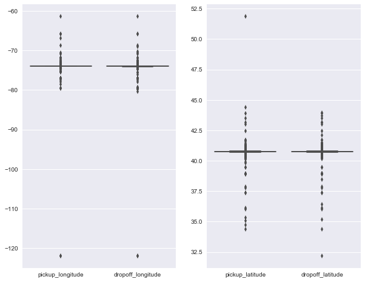
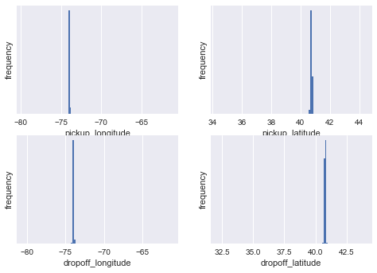
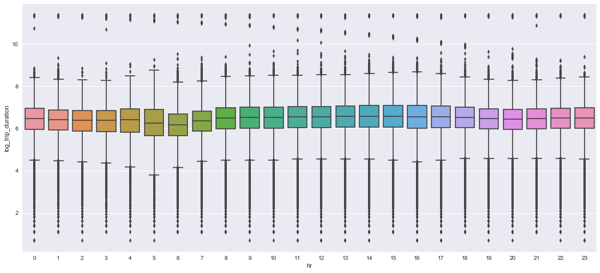
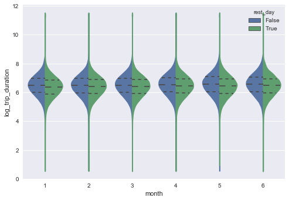
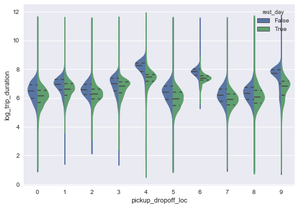
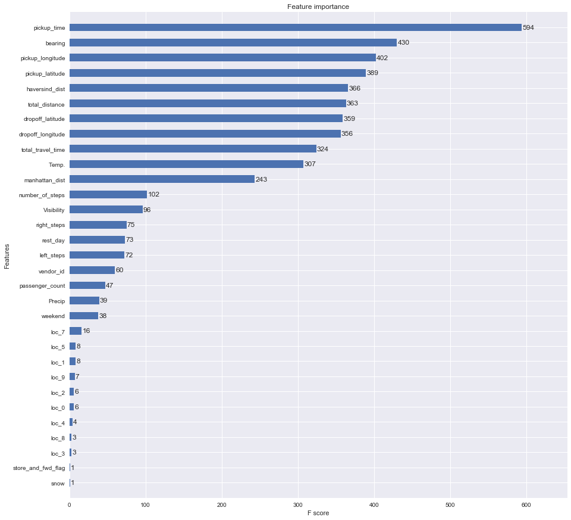

# A Practical Guide to NY Taxi Data (0.379)
### 2017/8/13 Weiying Wang

The guide is aimed to assist beginners to understand the basic workflow of building a predictive model. Also I add descriptions to each steps that may save you some searching time. Hope you will find it helpful! I am welcome for any comment and suggestion that can help this kernel better.

So far this competetion aroses lots of discussions and great analysis (the best analysis, I think, is probably [Heads or Tails](https://www.kaggle.com/headsortails/nyc-taxi-eda-update-the-fast-the-curious)). The data provides a great opportunity of learning and applying things we learned at school.

One must understand that 90% of the work is **clean-up the data** and **acquire the relevent features**, which is essential of getting a good analysis.

There are already a lot of great kernels out there. Some of my features is from (Thanks for their dedication and great kernels!)

1. [beluga](https://www.kaggle.com/gaborfodor/from-eda-to-the-top-lb-0-367)
2. [Oscarleo](https://www.kaggle.com/oscarleo/new-york-city-taxi-with-osrm)
3. [Heads or Tails](https://www.kaggle.com/headsortails/nyc-taxi-eda-update-the-fast-the-curious)

This notebook is also available at my [Github](https://github.com/wayinone/NYtaxi/blob/master/IpthonNotebook/NYtaxi.ipynb).


## Table of Content
### 0. [Import Modules and Data](#Import Modules and Data)
### 1. [Features](#Features)
 
 - 1.1 [Pickup Time and Weekend Features](#Pickup Time and Weekend Features)
 - 1.2 [Distance Features](#Distance Features)
     - 1.2.1[OSRM Features](#OSRM Features)
     - 1.2.2[Appendix:Google Map API](#Google Map API)
     - 1.2.2[Other Distance Features](#Other Distance Features)
 - 1.3 [Location Features: K-means Clustering](#Location Features: K-means Clustering)
 - 1.4 [Weather Features](#Weather Features)
 
### 2. [Outliers](#Outliers)
 - 2.1 [Outliers from 'trip_duration'](#Outliers from trip_duration)
 - 2.2 [Outliers from Locations](#Outliers from Locations)
 
### 3. [Analysis of Features](#Analysis of Features)
### 4. [XGB Model: the Prediction of `trip_duration`](#XGB Model)

 - 4.1 [Using XGBoost Module](#Using XGBoost Module)
 - 4.2 [The Submission](#The Submission)
 - 4.3 [Importance for each Feature](#Importance for each Feature)


## 0. Import Modules and Data<a id='Import Modules and Data'></a>
A standard way to import .csv data is through pandas. 


```python
#from importlib import reload
import pandas as pd
import numpy as np
import matplotlib.pyplot as plt
import matplotlib
matplotlib.rcParams['figure.figsize']=(10,18)
%matplotlib inline
from datetime import datetime
from datetime import date
import xgboost as xgb
from sklearn.cluster import MiniBatchKMeans
import seaborn as sns # plot beautiful charts
sns.set()
#warnings.filterwarnings('ignore')
```

    C:\WinPython-64bit-3.6.0.1Qt5\python-3.6.0.amd64\lib\site-packages\sklearn\cross_validation.py:44: DeprecationWarning: This module was deprecated in version 0.18 in favor of the model_selection module into which all the refactored classes and functions are moved. Also note that the interface of the new CV iterators are different from that of this module. This module will be removed in 0.20.
      "This module will be removed in 0.20.", DeprecationWarning)
    


```python
data = pd.read_csv('../input/nyc-taxi-trip-duration/train.csv', parse_dates=['pickup_datetime'])# `parse_dates` will recognize the column is date time
test = pd.read_csv('../input/nyc-taxi-trip-duration/test.csv', parse_dates=['pickup_datetime'])
data.head(3)
```


<div>
<table border="1" class="dataframe">
  <thead>
    <tr style="text-align: right;">
      <th></th>
      <th>id</th>
      <th>vendor_id</th>
      <th>pickup_datetime</th>
      <th>dropoff_datetime</th>
      <th>passenger_count</th>
      <th>pickup_longitude</th>
      <th>pickup_latitude</th>
      <th>dropoff_longitude</th>
      <th>dropoff_latitude</th>
      <th>store_and_fwd_flag</th>
      <th>trip_duration</th>
    </tr>
  </thead>
  <tbody>
    <tr>
      <th>0</th>
      <td>id2875421</td>
      <td>2</td>
      <td>2016-03-14 17:24:55</td>
      <td>2016-03-14 17:32:30</td>
      <td>1</td>
      <td>-73.982155</td>
      <td>40.767937</td>
      <td>-73.964630</td>
      <td>40.765602</td>
      <td>N</td>
      <td>455</td>
    </tr>
    <tr>
      <th>1</th>
      <td>id2377394</td>
      <td>1</td>
      <td>2016-06-12 00:43:35</td>
      <td>2016-06-12 00:54:38</td>
      <td>1</td>
      <td>-73.980415</td>
      <td>40.738564</td>
      <td>-73.999481</td>
      <td>40.731152</td>
      <td>N</td>
      <td>663</td>
    </tr>
    <tr>
      <th>2</th>
      <td>id3858529</td>
      <td>2</td>
      <td>2016-01-19 11:35:24</td>
      <td>2016-01-19 12:10:48</td>
      <td>1</td>
      <td>-73.979027</td>
      <td>40.763939</td>
      <td>-74.005333</td>
      <td>40.710087</td>
      <td>N</td>
      <td>2124</td>
    </tr>
  </tbody>
</table>
</div>


```python
data.info()
```

    <class 'pandas.core.frame.DataFrame'>
    RangeIndex: 1458644 entries, 0 to 1458643
    Data columns (total 11 columns):
    id                    1458644 non-null object
    vendor_id             1458644 non-null int64
    pickup_datetime       1458644 non-null datetime64[ns]
    dropoff_datetime      1458644 non-null object
    passenger_count       1458644 non-null int64
    pickup_longitude      1458644 non-null float64
    pickup_latitude       1458644 non-null float64
    dropoff_longitude     1458644 non-null float64
    dropoff_latitude      1458644 non-null float64
    store_and_fwd_flag    1458644 non-null object
    trip_duration         1458644 non-null int64
    dtypes: datetime64[ns](1), float64(4), int64(3), object(3)
    memory usage: 122.4+ MB
    

Let's do a little clean up: starting by converting `pickup_datetime` to `year`, `month`, `day`, `hr`, `minute`. 
 1. `year`:int value
 2. `month`: int value 1,2,...,6. (Note that the data observe from Jan to June (1~6) here). The month when pickup occurred
 3. `day`:int value


```python
for df in (data,test):
    df['year']  = df['pickup_datetime'].dt.year
    df['month'] = df['pickup_datetime'].dt.month
    df['day']   = df['pickup_datetime'].dt.day
    df['hr']    = df['pickup_datetime'].dt.hour
    df['minute']= df['pickup_datetime'].dt.minute
    df['store_and_fwd_flag'] = 1 * (df.store_and_fwd_flag.values == 'Y')
```


```python
test.head(3)
```


<div>
<table border="1" class="dataframe">
  <thead>
    <tr style="text-align: right;">
      <th></th>
      <th>id</th>
      <th>vendor_id</th>
      <th>pickup_datetime</th>
      <th>passenger_count</th>
      <th>pickup_longitude</th>
      <th>pickup_latitude</th>
      <th>dropoff_longitude</th>
      <th>dropoff_latitude</th>
      <th>store_and_fwd_flag</th>
      <th>year</th>
      <th>month</th>
      <th>day</th>
      <th>hr</th>
      <th>minute</th>
    </tr>
  </thead>
  <tbody>
    <tr>
      <th>0</th>
      <td>id3004672</td>
      <td>1</td>
      <td>2016-06-30 23:59:58</td>
      <td>1</td>
      <td>-73.988129</td>
      <td>40.732029</td>
      <td>-73.990173</td>
      <td>40.756680</td>
      <td>0</td>
      <td>2016</td>
      <td>6</td>
      <td>30</td>
      <td>23</td>
      <td>59</td>
    </tr>
    <tr>
      <th>1</th>
      <td>id3505355</td>
      <td>1</td>
      <td>2016-06-30 23:59:53</td>
      <td>1</td>
      <td>-73.964203</td>
      <td>40.679993</td>
      <td>-73.959808</td>
      <td>40.655403</td>
      <td>0</td>
      <td>2016</td>
      <td>6</td>
      <td>30</td>
      <td>23</td>
      <td>59</td>
    </tr>
    <tr>
      <th>2</th>
      <td>id1217141</td>
      <td>1</td>
      <td>2016-06-30 23:59:47</td>
      <td>1</td>
      <td>-73.997437</td>
      <td>40.737583</td>
      <td>-73.986160</td>
      <td>40.729523</td>
      <td>0</td>
      <td>2016</td>
      <td>6</td>
      <td>30</td>
      <td>23</td>
      <td>59</td>
    </tr>
  </tbody>
</table>
</div>


Since we will use RMSLE as the metric of our score, let's transform the `trip_duration` in to the log form:
$$\text{log_trip_duration}=\log(\text{trip_duration}+1)$$

If there is an outlier in `trip_duration` (as we will see), the transform help mitigate the effect. If the value is still enormously big after the log transform, we can tell it is a true outliers with more confidence.


```python
data = data.assign(log_trip_duration = np.log(data.trip_duration+1))
```

# 1. Features<a id='Features'></a>

I think two of the most important features should be:

1. the pickup time (rush hour should cause longer trip duration.)
2. the trip distance
3. the pickup location

Others are subsidiary. When select features, one needs to put the analysis model into the consideration. I plan to use everyone's favorate **Gradient Boost Tree** in the end, which does not care much about irrelevent information. Since it will choose the most relevent feature to partition the data in every iteration. Also we don't need to care about multicolliearity. So, in theory we can just put as much features as we want. However, considering the time it will take, let's just put the features that possibly matter. But if you have time to spend, you should put as much as you can.

Oh, another good thing about Gradient Boost, it doesn't care about missing values since it is a tree-based algorithm.

## 1.1 Pickup Time and Weekend Features<a id='Pickup Time and Weekend Features'></a>

As one can imagine that these should be big factors, since rush hour will result in longer travel time, and work day should render different results.

Also note that we don't need features `dropoff_datetime` since the training data uses it to generate the response `trip_duration`. (Take a look at test set, of course both columns are not there; we are trying to predict `trip_duration` here!)

We will generate, from `pickup_datetime`, the following features:

1. `rest_day`: boolean value `True` if it is a rest day; `False` if not. 
2. `weekend` :boolean value `True` if it is a weekend; `False` if not.
3. `pickup_time`: float value. E.g. 7.5 means 7:30 am. E.g. 18.75 means 6:45 pm


```python
from datetime import datetime
holiday = pd.read_csv('../input/nyc2016holidays/NYC_2016Holidays.csv',sep=';')
holiday['Date'] = holiday['Date'].apply(lambda x: x + ' 2016')
holidays = [datetime.strptime(holiday.loc[i,'Date'], '%B %d %Y').date() for i in range(len(holiday))]
```


```python
time_data = pd.DataFrame(index = range(len(data)))
time_test = pd.DataFrame(index = range(len(test)))
```


```python
from datetime import date
def restday(yr,month,day,holidays):
    '''
    Output:
        is_rest: a list of Boolean variable indicating if the sample occurred in the rest day.
        is_weekend: a list of Boolean variable indicating if the sample occurred in the weekend.
    '''
    is_rest    = [None]*len(yr)
    is_weekend = [None]*len(yr)
    i=0
    for yy,mm,dd in zip(yr,month,day):        
        is_weekend[i] = date(yy,mm,dd).isoweekday() in (6,7)
        is_rest[i]    = is_weekend[i] or date(yy,mm,dd) in holidays 
        i+=1
    return is_rest,is_weekend
```


```python
rest_day,weekend = restday(data.year,data.month,data.day,holidays)
time_data = time_data.assign(rest_day=rest_day)
time_data = time_data.assign(weekend=weekend)

rest_day,weekend = restday(test.year,test.month,test.day,holidays)
time_test = time_test.assign(rest_day=rest_day)
time_test = time_test.assign(weekend=weekend)
```


```python
time_data = time_data.assign(pickup_time = data.hr+data.minute/60)#float value. E.g. 7.5 means 7:30 am
time_test = time_test.assign(pickup_time = test.hr+test.minute/60)
```

Use the following code to save the features:
```
time_data.to_csv('../features/time_data.csv',index=False)
time_test.to_csv('../features/time_test.csv',index=False) ```


```python
time_data.head()
```


<div>
<table border="1" class="dataframe">
  <thead>
    <tr style="text-align: right;">
      <th></th>
      <th>rest_day</th>
      <th>weekend</th>
      <th>pickup_time</th>
    </tr>
  </thead>
  <tbody>
    <tr>
      <th>0</th>
      <td>False</td>
      <td>False</td>
      <td>17.400000</td>
    </tr>
    <tr>
      <th>1</th>
      <td>True</td>
      <td>True</td>
      <td>0.716667</td>
    </tr>
    <tr>
      <th>2</th>
      <td>False</td>
      <td>False</td>
      <td>11.583333</td>
    </tr>
    <tr>
      <th>3</th>
      <td>False</td>
      <td>False</td>
      <td>19.533333</td>
    </tr>
    <tr>
      <th>4</th>
      <td>True</td>
      <td>True</td>
      <td>13.500000</td>
    </tr>
  </tbody>
</table>
</div>


## 1.2 Distance Features<a id='Distance Features'></a>

### 1.2.1 OSRM Features<a id='OSRM Features'></a>
The first thing comes to mind is using the GPS location to aquire the real distance between pickup point and dropoff one, as you will see in Subsection [Other Distance Features](#Other Distance Features). However, **travel distance** should be more relevent here. The difficault part is to aquire this feature. Thanks to [Oscarleo](https://www.kaggle.com/oscarleo/new-york-city-taxi-with-osrm) who manage to pull it off from [OSRM](http://project-osrm.org/). Let's put together the most relative columns.


```python
fastrout1 = pd.read_csv('../input/new-york-city-taxi-with-osrm/fastest_routes_train_part_1.csv',
                        usecols=['id', 'total_distance', 'total_travel_time',  'number_of_steps','step_direction'])
fastrout2 = pd.read_csv('../input/new-york-city-taxi-with-osrm/fastest_routes_train_part_2.csv',
                        usecols=['id', 'total_distance', 'total_travel_time',  'number_of_steps','step_direction'])
fastrout = pd.concat((fastrout1,fastrout2))
fastrout.head()
```


<div>
<table border="1" class="dataframe">
  <thead>
    <tr style="text-align: right;">
      <th></th>
      <th>id</th>
      <th>total_distance</th>
      <th>total_travel_time</th>
      <th>number_of_steps</th>
      <th>step_direction</th>
    </tr>
  </thead>
  <tbody>
    <tr>
      <th>0</th>
      <td>id2875421</td>
      <td>2009.1</td>
      <td>164.9</td>
      <td>5</td>
      <td>left|straight|right|straight|arrive</td>
    </tr>
    <tr>
      <th>1</th>
      <td>id2377394</td>
      <td>2513.2</td>
      <td>332.0</td>
      <td>6</td>
      <td>none|right|left|right|left|arrive</td>
    </tr>
    <tr>
      <th>2</th>
      <td>id3504673</td>
      <td>1779.4</td>
      <td>235.8</td>
      <td>4</td>
      <td>left|left|right|arrive</td>
    </tr>
    <tr>
      <th>3</th>
      <td>id2181028</td>
      <td>1614.9</td>
      <td>140.1</td>
      <td>5</td>
      <td>right|left|right|left|arrive</td>
    </tr>
    <tr>
      <th>4</th>
      <td>id0801584</td>
      <td>1393.5</td>
      <td>189.4</td>
      <td>5</td>
      <td>right|right|right|left|arrive</td>
    </tr>
  </tbody>
</table>
</div>


Generate a feature for number of right turns and left turns. Note that I didn't count 'slight right' and 'slight left'.


```python
right_turn = []
left_turn = []
right_turn+= list(map(lambda x:x.count('right')-x.count('slight right'),fastrout.step_direction))
left_turn += list(map(lambda x:x.count('left')-x.count('slight left'),fastrout.step_direction))
```

Let's combine the features that seems to be relevent to `trip_duration`


```python
osrm_data = fastrout[['id','total_distance','total_travel_time','number_of_steps']]
osrm_data = osrm_data.assign(right_steps=right_turn)
osrm_data = osrm_data.assign(left_steps=left_turn)
osrm_data.head(3)
```


<div>
<table border="1" class="dataframe">
  <thead>
    <tr style="text-align: right;">
      <th></th>
      <th>id</th>
      <th>total_distance</th>
      <th>total_travel_time</th>
      <th>number_of_steps</th>
      <th>right_steps</th>
      <th>left_steps</th>
    </tr>
  </thead>
  <tbody>
    <tr>
      <th>0</th>
      <td>id2875421</td>
      <td>2009.1</td>
      <td>164.9</td>
      <td>5</td>
      <td>1</td>
      <td>1</td>
    </tr>
    <tr>
      <th>1</th>
      <td>id2377394</td>
      <td>2513.2</td>
      <td>332.0</td>
      <td>6</td>
      <td>2</td>
      <td>2</td>
    </tr>
    <tr>
      <th>2</th>
      <td>id3504673</td>
      <td>1779.4</td>
      <td>235.8</td>
      <td>4</td>
      <td>1</td>
      <td>2</td>
    </tr>
  </tbody>
</table>
</div>


On thing to be careful is that the data from Oscarleo has different order from the original data. Also sample size are different : `len(data)=1458644`;`len(df_oscarleo)=1458643` . So if you want to use them, you have to use something like 'join on ...' (in SQL)


```python
data = data.join(osrm_data.set_index('id'), on='id')
data.head(3)
```


<div>
<table border="1" class="dataframe">
  <thead>
    <tr style="text-align: right;">
      <th></th>
      <th>id</th>
      <th>vendor_id</th>
      <th>pickup_datetime</th>
      <th>dropoff_datetime</th>
      <th>passenger_count</th>
      <th>pickup_longitude</th>
      <th>pickup_latitude</th>
      <th>dropoff_longitude</th>
      <th>dropoff_latitude</th>
      <th>store_and_fwd_flag</th>
      <th>...</th>
      <th>month</th>
      <th>day</th>
      <th>hr</th>
      <th>minute</th>
      <th>log_trip_duration</th>
      <th>total_distance</th>
      <th>total_travel_time</th>
      <th>number_of_steps</th>
      <th>right_steps</th>
      <th>left_steps</th>
    </tr>
  </thead>
  <tbody>
    <tr>
      <th>0</th>
      <td>id2875421</td>
      <td>2</td>
      <td>2016-03-14 17:24:55</td>
      <td>2016-03-14 17:32:30</td>
      <td>1</td>
      <td>-73.982155</td>
      <td>40.767937</td>
      <td>-73.964630</td>
      <td>40.765602</td>
      <td>0</td>
      <td>...</td>
      <td>3</td>
      <td>14</td>
      <td>17</td>
      <td>24</td>
      <td>6.122493</td>
      <td>2009.1</td>
      <td>164.9</td>
      <td>5.0</td>
      <td>1.0</td>
      <td>1.0</td>
    </tr>
    <tr>
      <th>1</th>
      <td>id2377394</td>
      <td>1</td>
      <td>2016-06-12 00:43:35</td>
      <td>2016-06-12 00:54:38</td>
      <td>1</td>
      <td>-73.980415</td>
      <td>40.738564</td>
      <td>-73.999481</td>
      <td>40.731152</td>
      <td>0</td>
      <td>...</td>
      <td>6</td>
      <td>12</td>
      <td>0</td>
      <td>43</td>
      <td>6.498282</td>
      <td>2513.2</td>
      <td>332.0</td>
      <td>6.0</td>
      <td>2.0</td>
      <td>2.0</td>
    </tr>
    <tr>
      <th>2</th>
      <td>id3858529</td>
      <td>2</td>
      <td>2016-01-19 11:35:24</td>
      <td>2016-01-19 12:10:48</td>
      <td>1</td>
      <td>-73.979027</td>
      <td>40.763939</td>
      <td>-74.005333</td>
      <td>40.710087</td>
      <td>0</td>
      <td>...</td>
      <td>1</td>
      <td>19</td>
      <td>11</td>
      <td>35</td>
      <td>7.661527</td>
      <td>11060.8</td>
      <td>767.6</td>
      <td>16.0</td>
      <td>5.0</td>
      <td>4.0</td>
    </tr>
  </tbody>
</table>
<p>3 rows × 22 columns</p>
</div>


Let's do the same thing to test data:


```python
osrm_test = pd.read_csv('../input/new-york-city-taxi-with-osrm/fastest_routes_test.csv')
right_turn= list(map(lambda x:x.count('right')-x.count('slight right'),osrm_test.step_direction))
left_turn = list(map(lambda x:x.count('left')-x.count('slight left'),osrm_test.step_direction))

osrm_test = osrm_test[['id','total_distance','total_travel_time','number_of_steps']]
osrm_test = osrm_test.assign(right_steps=right_turn)
osrm_test = osrm_test.assign(left_steps=left_turn)
osrm_test.head(3)
```


<div>
<table border="1" class="dataframe">
  <thead>
    <tr style="text-align: right;">
      <th></th>
      <th>id</th>
      <th>total_distance</th>
      <th>total_travel_time</th>
      <th>number_of_steps</th>
      <th>right_steps</th>
      <th>left_steps</th>
    </tr>
  </thead>
  <tbody>
    <tr>
      <th>0</th>
      <td>id3004672</td>
      <td>3795.9</td>
      <td>424.6</td>
      <td>4</td>
      <td>1</td>
      <td>1</td>
    </tr>
    <tr>
      <th>1</th>
      <td>id3505355</td>
      <td>2904.5</td>
      <td>200.0</td>
      <td>4</td>
      <td>1</td>
      <td>1</td>
    </tr>
    <tr>
      <th>2</th>
      <td>id1217141</td>
      <td>1499.5</td>
      <td>193.2</td>
      <td>4</td>
      <td>1</td>
      <td>1</td>
    </tr>
  </tbody>
</table>
</div>


```python
test = test.join(osrm_test.set_index('id'), on='id')
```


```python
osrm_test.head()
```


<div>
<table border="1" class="dataframe">
  <thead>
    <tr style="text-align: right;">
      <th></th>
      <th>id</th>
      <th>total_distance</th>
      <th>total_travel_time</th>
      <th>number_of_steps</th>
      <th>right_steps</th>
      <th>left_steps</th>
    </tr>
  </thead>
  <tbody>
    <tr>
      <th>0</th>
      <td>id3004672</td>
      <td>3795.9</td>
      <td>424.6</td>
      <td>4</td>
      <td>1</td>
      <td>1</td>
    </tr>
    <tr>
      <th>1</th>
      <td>id3505355</td>
      <td>2904.5</td>
      <td>200.0</td>
      <td>4</td>
      <td>1</td>
      <td>1</td>
    </tr>
    <tr>
      <th>2</th>
      <td>id1217141</td>
      <td>1499.5</td>
      <td>193.2</td>
      <td>4</td>
      <td>1</td>
      <td>1</td>
    </tr>
    <tr>
      <th>3</th>
      <td>id1598245</td>
      <td>1108.2</td>
      <td>103.2</td>
      <td>4</td>
      <td>1</td>
      <td>2</td>
    </tr>
    <tr>
      <th>4</th>
      <td>id0898117</td>
      <td>3786.2</td>
      <td>489.2</td>
      <td>12</td>
      <td>5</td>
      <td>2</td>
    </tr>
  </tbody>
</table>
</div>


```python
osrm_data = data[['total_distance','total_travel_time','number_of_steps','right_steps','left_steps']]
osrm_test = test[['total_distance','total_travel_time','number_of_steps','right_steps','left_steps']]
```

Use the following code to save the features:
```
data.to_csv('../features/osrm_data.csv',index=False,
            columns = ['total_distance','total_travel_time','number_of_steps','right_steps','left_steps'])
test.to_csv('../features/osrm_test.csv',index=False,
            columns = ['total_distance','total_travel_time','number_of_steps','right_steps','left_steps'])```

### Appendix: Google Map API<a id='Google Map API'></a>

Here is a way to using google map API to aquire travel distance and time without asking a key. I found the code from [here](https://stackoverflow.com/questions/36500331/putting-latitudes-and-longitudes-into-a-distance-matrix-google-map-api-in-pytho) and modified it to Python 3.

There is quota limit for the request so the is much harder to get than OSRM. 

So far Kaggle cannot run it in the kernel, so I just put here:
```
import urllib, json
def google(lato, lono, latd, lond):
    url = """http://maps.googleapis.com/maps/api/distancematrix/json?origins=%s,%s"""%(lato, lono)+  \
    """&destinations=%s,%s&mode=driving&language=en-EN&sensor=false"""% (latd, lond)
    response = urllib.request.urlopen(url)
    obj = json.load(response)
    try:
        minutes =   obj['rows'][0]['elements'][0]['duration']['value']/60
        kilometers = (obj['rows'][0]['elements'][0]['distance']['value']/1000) #kilometers
        return minutes, kilometers
    except IndexError:
        return None,None
        
orig_lat = 40.767937;orig_lng = -73.982155
dest_lat = 40.765602;dest_lng = -73.964630
time,dist = google(orig_lat,orig_lng,dest_lat,dest_lng)
print('It takes %1.2f min to arrive the destiny with distance %1.3f km.'%(time,dist))
```

### 1.2.2 Other Distance Features<a id='Other Distance Features'></a>

The distance functions are from [beluga](https://www.kaggle.com/gaborfodor/from-eda-to-the-top-lb-0-367).
 
 1. Haversine distance: the direct distance of two GPS location, taking into account that the earth is round.
 2. Manhattan distance: the usual L1 distance, here the haversine distance is used to calculate each coordinate of distance.
 3. Bearing: The direction of the trip. Using radian as unit. (I must admit that I am not fully understand the formula. I have starring at it for a long time but can't come up anything. If anyone can help explain that will do me a big favor.)


```python
def haversine_array(lat1, lng1, lat2, lng2):
    lat1, lng1, lat2, lng2 = map(np.radians, (lat1, lng1, lat2, lng2))
    AVG_EARTH_RADIUS = 6371  # in km
    lat = lat2 - lat1
    lng = lng2 - lng1
    d = np.sin(lat * 0.5) ** 2 + np.cos(lat1) * np.cos(lat2) * np.sin(lng * 0.5) ** 2
    h = 2 * AVG_EARTH_RADIUS * np.arcsin(np.sqrt(d))
    return h

def dummy_manhattan_distance(lat1, lng1, lat2, lng2):
    a = haversine_array(lat1, lng1, lat1, lng2)
    b = haversine_array(lat1, lng1, lat2, lng1)
    return a + b

def bearing_array(lat1, lng1, lat2, lng2):
    lng_delta_rad = np.radians(lng2 - lng1)
    lat1, lng1, lat2, lng2 = map(np.radians, (lat1, lng1, lat2, lng2))
    y = np.sin(lng_delta_rad) * np.cos(lat2)
    x = np.cos(lat1) * np.sin(lat2) - np.sin(lat1) * np.cos(lat2) * np.cos(lng_delta_rad)
    return np.degrees(np.arctan2(y, x))
```


```python
List_dist = []
for df in (data,test):
    lat1, lng1, lat2, lng2 = (df['pickup_latitude'].values, df['pickup_longitude'].values, 
                              df['dropoff_latitude'].values,df['dropoff_longitude'].values)
    dist = pd.DataFrame(index=range(len(df)))
    dist = dist.assign(haversind_dist = haversine_array(lat1, lng1, lat2, lng2))
    dist = dist.assign(manhattan_dist = dummy_manhattan_distance(lat1, lng1, lat2, lng2))
    dist = dist.assign(bearing = bearing_array(lat1, lng1, lat2, lng2))
    List_dist.append(dist)
Other_dist_data,Other_dist_test = List_dist
```

Use the following code to save it to your features.
```
Other_dist_data.to_csv('../features/Other_dist_data.csv',index=False)
Other_dist_test.to_csv('../features/Other_dist_test.csv',index=False)```

## 1.3 Location Features: K-means Clustering<a id='Location Features: K-means Clustering'></a>

Besides of keeping entire list of latitude and longitute, I would like to distinguish them with few approximately locations. It might be helpful our xgboost since it will take 4 branches of tree (remember I will use a tree-based algorithm) to specify a square region. The best way, I guess, is to separate these points by the town of the location, which requires some geological information from google API or OSRM. Besides OSRM, you can acquire googlemap information from Googlemap API.

I setup 10 kmeans clusters for our data set. The kmeans method is performed on 4-d data 
```['pickup_latitude', 'pickup_longitude','dropoff_latitude', 'dropoff_longitude']```

Note that the resulting feature is categorical value between 0,1,2,...,10. To use this feature in `xgboost`, you have to transform it to 20 dummy variables, otherwise the module will treat it as numerical.


```python
coord_pickup = np.vstack((data[['pickup_latitude', 'pickup_longitude']].values,                  
                          test[['pickup_latitude', 'pickup_longitude']].values))
coord_dropoff = np.vstack((data[['dropoff_latitude', 'dropoff_longitude']].values,                  
                           test[['dropoff_latitude', 'dropoff_longitude']].values))
```


```python
coords = np.hstack((coord_pickup,coord_dropoff))# 4 dimensional data
sample_ind = np.random.permutation(len(coords))[:500000]
kmeans = MiniBatchKMeans(n_clusters=10, batch_size=10000).fit(coords[sample_ind])
for df in (data,test):
    df.loc[:, 'pickup_dropoff_loc'] = kmeans.predict(df[['pickup_latitude', 'pickup_longitude',
                                                         'dropoff_latitude','dropoff_longitude']])
```


```python
kmean10_data = data[['pickup_dropoff_loc']]
kmean10_test = test[['pickup_dropoff_loc']]
```

Use the following code to save the data.
```
data.to_csv('../features/kmean10_data.csv',index=False,columns = ['pickup_dropoff_loc'])
test.to_csv('../features/kmean10_test.csv',index=False,columns = ['pickup_dropoff_loc'])```

<a id='KmeansPlot'></a> Let's take a look at our kmeans clusters. Remember that each cluster is represented by a 4d point (longitude/latitude of pickup location and logitude/latitude of dropoff location). I will drow first 500 points of each clusters, and each plot have two locations, pickup and dropoff.


```python
plt.figure(figsize=(16,16))
N = 500
for i in range(10):
    plt.subplot(4,3,i+1)
    tmp_data = data[data.pickup_dropoff_loc==i]
    drop = plt.scatter(tmp_data['dropoff_longitude'][:N], tmp_data['dropoff_latitude'][:N], s=10, lw=0, alpha=0.5,label='dropoff')
    pick = plt.scatter(tmp_data['pickup_longitude'][:N], tmp_data['pickup_latitude'][:N], s=10, lw=0, alpha=0.4,label='pickup')    
    plt.xlim([-74.05,-73.75]);plt.ylim([40.6,40.9])
    plt.legend(handles = [pick,drop])
    plt.title('clusters %d'%i)
#plt.axes().set_aspect('equal')
```





Some interesting facts:

 1. The short trips are clustered to the same clusters.
 2. Pickup location is more concentrated than dropoff one. This might just because the taxi driver doesn't want to reach out too far to pickup. Or there are more convenient way (like train) for people to go to the city.

## 1.4 Weather Features<a id='Weather Features'></a>
The weather data is obtained [here](https://www.kaggle.com/cabaki/knycmetars2016).


```python
weather = pd.read_csv('../input/knycmetars2016/KNYC_Metars.csv', parse_dates=['Time'])
weather.head(3)
```


<div>
<table border="1" class="dataframe">
  <thead>
    <tr style="text-align: right;">
      <th></th>
      <th>Time</th>
      <th>Temp.</th>
      <th>Windchill</th>
      <th>Heat Index</th>
      <th>Humidity</th>
      <th>Pressure</th>
      <th>Dew Point</th>
      <th>Visibility</th>
      <th>Wind Dir</th>
      <th>Wind Speed</th>
      <th>Gust Speed</th>
      <th>Precip</th>
      <th>Events</th>
      <th>Conditions</th>
    </tr>
  </thead>
  <tbody>
    <tr>
      <th>0</th>
      <td>2015-12-31 02:00:00</td>
      <td>7.8</td>
      <td>7.1</td>
      <td>NaN</td>
      <td>0.89</td>
      <td>1017.0</td>
      <td>6.1</td>
      <td>8.0</td>
      <td>NNE</td>
      <td>5.6</td>
      <td>0.0</td>
      <td>0.8</td>
      <td>None</td>
      <td>Overcast</td>
    </tr>
    <tr>
      <th>1</th>
      <td>2015-12-31 03:00:00</td>
      <td>7.2</td>
      <td>5.9</td>
      <td>NaN</td>
      <td>0.90</td>
      <td>1016.5</td>
      <td>5.6</td>
      <td>12.9</td>
      <td>Variable</td>
      <td>7.4</td>
      <td>0.0</td>
      <td>0.3</td>
      <td>None</td>
      <td>Overcast</td>
    </tr>
    <tr>
      <th>2</th>
      <td>2015-12-31 04:00:00</td>
      <td>7.2</td>
      <td>NaN</td>
      <td>NaN</td>
      <td>0.90</td>
      <td>1016.7</td>
      <td>5.6</td>
      <td>12.9</td>
      <td>Calm</td>
      <td>0.0</td>
      <td>0.0</td>
      <td>0.0</td>
      <td>None</td>
      <td>Overcast</td>
    </tr>
  </tbody>
</table>
</div>


```python
print('The Events has values {}.'.format(str(set(weather.Events))))
```

    The Events has values {'Rain', 'Fog\n\t,\nSnow', 'None', 'Fog\n\t,\nRain', 'Snow', 'Fog'}.
    


```python
weather['snow']= 1*(weather.Events=='Snow') + 1*(weather.Events=='Fog\n\t,\nSnow')
weather['year'] = weather['Time'].dt.year
weather['month'] = weather['Time'].dt.month
weather['day'] = weather['Time'].dt.day
weather['hr'] = weather['Time'].dt.hour
weather = weather[weather['year'] == 2016][['month','day','hr','Temp.','Precip','snow','Visibility']]
```


```python
weather.head()
```


<div>
<table border="1" class="dataframe">
  <thead>
    <tr style="text-align: right;">
      <th></th>
      <th>month</th>
      <th>day</th>
      <th>hr</th>
      <th>Temp.</th>
      <th>Precip</th>
      <th>snow</th>
      <th>Visibility</th>
    </tr>
  </thead>
  <tbody>
    <tr>
      <th>22</th>
      <td>1</td>
      <td>1</td>
      <td>0</td>
      <td>5.6</td>
      <td>0.0</td>
      <td>0</td>
      <td>16.1</td>
    </tr>
    <tr>
      <th>23</th>
      <td>1</td>
      <td>1</td>
      <td>1</td>
      <td>5.6</td>
      <td>0.0</td>
      <td>0</td>
      <td>16.1</td>
    </tr>
    <tr>
      <th>24</th>
      <td>1</td>
      <td>1</td>
      <td>2</td>
      <td>5.6</td>
      <td>0.0</td>
      <td>0</td>
      <td>16.1</td>
    </tr>
    <tr>
      <th>25</th>
      <td>1</td>
      <td>1</td>
      <td>3</td>
      <td>5.0</td>
      <td>0.0</td>
      <td>0</td>
      <td>16.1</td>
    </tr>
    <tr>
      <th>26</th>
      <td>1</td>
      <td>1</td>
      <td>4</td>
      <td>5.0</td>
      <td>0.0</td>
      <td>0</td>
      <td>16.1</td>
    </tr>
  </tbody>
</table>
</div>


Merge the snow infomation to our data set.


```python
data = pd.merge(data, weather, on = ['month', 'day', 'hr'], how = 'left')
test = pd.merge(test, weather, on = ['month', 'day', 'hr'], how = 'left')
```


```python
weather_data = data[['Temp.','Precip','snow','Visibility']]
weather_test = test[['Temp.','Precip','snow','Visibility']]
```

Use the following code to save the features.
```
weather_data.to_csv('../features/weather_data.csv',index=False)
weather_test.to_csv('../features/weather_test.csv',index=False)```


```python
weather_data.head()
```


<div>
<table border="1" class="dataframe">
  <thead>
    <tr style="text-align: right;">
      <th></th>
      <th>Temp.</th>
      <th>Precip</th>
      <th>snow</th>
      <th>Visibility</th>
    </tr>
  </thead>
  <tbody>
    <tr>
      <th>0</th>
      <td>4.4</td>
      <td>0.3</td>
      <td>0.0</td>
      <td>8.0</td>
    </tr>
    <tr>
      <th>1</th>
      <td>28.9</td>
      <td>0.0</td>
      <td>0.0</td>
      <td>16.1</td>
    </tr>
    <tr>
      <th>2</th>
      <td>-6.7</td>
      <td>0.0</td>
      <td>0.0</td>
      <td>16.1</td>
    </tr>
    <tr>
      <th>3</th>
      <td>7.2</td>
      <td>0.0</td>
      <td>0.0</td>
      <td>16.1</td>
    </tr>
    <tr>
      <th>4</th>
      <td>9.4</td>
      <td>0.0</td>
      <td>0.0</td>
      <td>16.1</td>
    </tr>
  </tbody>
</table>
</div>


# 2. Outliers<a id='Outliers'></a>

As I said, we are using score as RMSLE, which cares less about outliers. **You should be able to completely skip this section without sacrifice your score**. Actually, if you specify too much outliers, like 500 of the data, you might run into problem: You will see the validation error is small but the submission score is bad. So proceed with caution here. Keep in mind in the competition we want to minimize the score of test set, which is randomly drawn from original set, so mistakes (if there is a lot) in your training set are much likely to be in your test set.

That being said, if the task is to predict the new data, I will remove more unresonable data points. Here I will just remove very tiny portion (7 of them) of our training set, which does not affect your model to a noticible decimal. **I create this section is just to show you how bizzard our real world data is, and how to identify and treat them properly**.

A better way to treat outliers (instead of deleting them right away) is to add a column with boolean value `True`(this sample is an outlier) or `False`.


```python
outliers=np.array([False]*len(data))
```

First let's check the missing value. Let's hope there is not many of it.


```python
print('There are %d rows that have missing values'%sum(data.isnull().any(axis=1)))
```

    There are 56598 rows that have missing values
    

You can check the missing value using the above command on any dataframeyou have.

Note that the data from oscarleo (Subsection 1.2) has 1 missing values, since his data has 1 less row to the original data.

Unfortunately there is a lot of missing valuethe weather feature. However, as long as we stick to the plan of using gradient boost, we will be fine with this. Actually all the tree methods will be fine with this.

## 2.1 Outliers from 'trip_duration'<a id='Outliers from trip_duration'></a>

### `trip_duration` too big

Note that for column 'trip_duration', the unit is second. There are some samples that have ridiculus 100 days ride; that's the outliers. There are several tools to help you detect them: "run sequence plot", and "boxplot".


```python
y = np.array(data.log_trip_duration)
plt.subplot(131)
plt.plot(range(len(y)),y,'.');plt.ylabel('log_trip_duration');plt.xlabel('index');plt.title('val vs. index')
plt.subplot(132)
sns.boxplot(y=data.log_trip_duration)
plt.subplot(133)
sns.distplot(y,bins=50, color="m");plt.yticks([]);plt.xlabel('log_trip_duration');plt.title('data');plt.ylabel('frequency')
#plt.hist(y,bins=50);
```


    <matplotlib.text.Text at 0x20cde238320>





Looks like there are just 4 points that really far off. Also, there are a lot of `trip duration` in 
$$\exp(11.37)-1\approx86400,$$
which is 24 hrs. Well, I think it is still a possible thing, sometimes you take a taxi to a certain place then come back, and the clock just reset for every day, or simply they just forgot to turn off... That is the story I imagine. We can not treat them as outliers, despite how outliers they are, since it will happened in test set also. But for the 4 points, I think cast them to outliers is wise.


```python
outliers[y>12]=True
print('There are %d entries that have trip duration too long'% sum(outliers))
```

    There are 4 entries that have trip duration too long
    

There are several tests to decide the threshold of outliers. 

### `trip_duration` too small
I notice there are some rides only consists with 1 sec and have several miles on `total_distance`. I don't think teleportational taxi exist right now, thus it should be considered as outliers. I will calculate the km/hr using 

$$ \text{kph} = \frac{\text{total_distance}/1000}{\text{trip_duration}}\cdot3600 $$

Notice that several of the rides has 1 second `trip_duration` and nearly 0 `total_distance`. I think this might be a normal condition since the passenger can just walk off the taxi simply because he changes his mind.
 
Let's first make the run sequence plot to see how absurb those value is:


```python
kph = osrm_data.total_distance/1000/data.trip_duration*3600
plt.plot(range(len(kph)),kph,'.');plt.ylabel('kph');plt.xlabel('index');plt.show()
```





As you can see, there are a lot of taxi drive beyond 1000 km/hr; there is a lot of recording error. If I am predict new values I will remove it. For this competition I simply keep all of them. If you still can't tolerant this error, you can use the following code to cast them to outliers.

```
kph = np.array(kph)
kph[np.isnan(kph)]=0.0
dist = np.array(osrm_data.total_distance) #note this is in meters
dist[np.isnan(dist)]=0.0
outliers_speeding = np.array([False]*len(kph))
outliers_speeding = outliers_speeding | ((kph>300) & (dist>1000))
outliers_speeding = outliers_speeding | ((kph>180)  & (dist<=1000))                                         
outliers_speeding = outliers_speeding | ((kph>100)  & (dist<=100))                                         
outliers_speeding = outliers_speeding | ((kph>80)  & (dist<=20))
print('There are %d speeding outliers'%sum(outliers_speeding))   
outliers = outliers|outliers_speeding```

## 2.2 Outliers from Locations<a id='Outliers from Locations'></a>
There are two locations, pickup and dropoff location. To find out if there is any outliers, I combine them and plot the boxplot.


```python
fig=plt.figure(figsize=(10, 8))
for i,loc in enumerate((['pickup_longitude','dropoff_longitude'],['pickup_latitude','dropoff_latitude'])):
    plt.subplot(1,2,i+1)
    sns.boxplot(data=data[outliers==False],order=loc);#plt.title(loc)
```





Both of the longtitudes has one points that is pretty far off the center(median). I will simply remove them.


```python
outliers[data.pickup_longitude<-110]=True
outliers[data.dropoff_longitude<-110]=True
outliers[data.pickup_latitude>45]=True
print('There are total %d entries of ouliers'% sum(outliers))
```

    There are total 7 entries of ouliers
    

As you can see the locations are pretty clump up, as the following plots indicates.


```python
for i,feature in enumerate(['pickup_longitude', 'pickup_latitude','dropoff_longitude', 'dropoff_latitude']):
    plt.subplot(2,2,i+1)
    data[outliers==False][feature].hist(bins=100)
    plt.xlabel(feature);plt.ylabel('frequency');plt.yticks([])
#plt.show();plt.close()
```





Let's plot some locations on the map with a very cool `folium` module, to get some ideas.


```python
import folium # goelogical map
map_1 = folium.Map(location=[40.767937,-73.982155 ],tiles='OpenStreetMap',
 zoom_start=12)
#tile: 'OpenStreetMap','Stamen Terrain','Mapbox Bright','Mapbox Control room'
for each in data[:1000].iterrows():
    folium.CircleMarker([each[1]['pickup_latitude'],each[1]['pickup_longitude']],
                        radius=3,
                        color='red',
                        popup=str(each[1]['pickup_latitude'])+','+str(each[1]['pickup_longitude']),
                        fill_color='#FD8A6C'
                        ).add_to(map_1)
map_1
```


<div style="width:100%;"><div style="position:relative;width:100%;height:0;padding-bottom:60%;"><iframe src="data:text/html;charset=utf-8;base64,PCFET0NUWVBFIGh0bWw+CjxoZWFkPiAgICAKICAgIDxtZXRhIGh0dHAtZXF1aXY9ImNvbnRlbnQtdHlwZSIgY29udGVudD0idGV4dC9odG1sOyBjaGFyc2V0PVVURi04IiAvPgogICAgPHNjcmlwdD5MX1BSRUZFUl9DQU5WQVMgPSBmYWxzZTsgTF9OT19UT1VDSCA9IGZhbHNlOyBMX0RJU0FCTEVfM0QgPSBmYWxzZTs8L3NjcmlwdD4KICAgIDxzY3JpcHQgc3JjPSJodHRwczovL3VucGtnLmNvbS9sZWFmbGV0QDEuMC4xL2Rpc3QvbGVhZmxldC5qcyI+PC9zY3JpcHQ+CiAgICA8c2NyaXB0IHNyYz0iaHR0cHM6Ly9hamF4Lmdvb2dsZWFwaXMuY29tL2FqYXgvbGlicy9qcXVlcnkvMS4xMS4xL2pxdWVyeS5taW4uanMiPjwvc2NyaXB0PgogICAgPHNjcmlwdCBzcmM9Imh0dHBzOi8vbWF4Y2RuLmJvb3RzdHJhcGNkbi5jb20vYm9vdHN0cmFwLzMuMi4wL2pzL2Jvb3RzdHJhcC5taW4uanMiPjwvc2NyaXB0PgogICAgPHNjcmlwdCBzcmM9Imh0dHBzOi8vY2RuanMuY2xvdWRmbGFyZS5jb20vYWpheC9saWJzL0xlYWZsZXQuYXdlc29tZS1tYXJrZXJzLzIuMC4yL2xlYWZsZXQuYXdlc29tZS1tYXJrZXJzLmpzIj48L3NjcmlwdD4KICAgIDxzY3JpcHQgc3JjPSJodHRwczovL2NkbmpzLmNsb3VkZmxhcmUuY29tL2FqYXgvbGlicy9sZWFmbGV0Lm1hcmtlcmNsdXN0ZXIvMS4wLjAvbGVhZmxldC5tYXJrZXJjbHVzdGVyLXNyYy5qcyI+PC9zY3JpcHQ+CiAgICA8c2NyaXB0IHNyYz0iaHR0cHM6Ly9jZG5qcy5jbG91ZGZsYXJlLmNvbS9hamF4L2xpYnMvbGVhZmxldC5tYXJrZXJjbHVzdGVyLzEuMC4wL2xlYWZsZXQubWFya2VyY2x1c3Rlci5qcyI+PC9zY3JpcHQ+CiAgICA8bGluayByZWw9InN0eWxlc2hlZXQiIGhyZWY9Imh0dHBzOi8vdW5wa2cuY29tL2xlYWZsZXRAMS4wLjEvZGlzdC9sZWFmbGV0LmNzcyIgLz4KICAgIDxsaW5rIHJlbD0ic3R5bGVzaGVldCIgaHJlZj0iaHR0cHM6Ly9tYXhjZG4uYm9vdHN0cmFwY2RuLmNvbS9ib290c3RyYXAvMy4yLjAvY3NzL2Jvb3RzdHJhcC5taW4uY3NzIiAvPgogICAgPGxpbmsgcmVsPSJzdHlsZXNoZWV0IiBocmVmPSJodHRwczovL21heGNkbi5ib290c3RyYXBjZG4uY29tL2Jvb3RzdHJhcC8zLjIuMC9jc3MvYm9vdHN0cmFwLXRoZW1lLm1pbi5jc3MiIC8+CiAgICA8bGluayByZWw9InN0eWxlc2hlZXQiIGhyZWY9Imh0dHBzOi8vbWF4Y2RuLmJvb3RzdHJhcGNkbi5jb20vZm9udC1hd2Vzb21lLzQuNi4zL2Nzcy9mb250LWF3ZXNvbWUubWluLmNzcyIgLz4KICAgIDxsaW5rIHJlbD0ic3R5bGVzaGVldCIgaHJlZj0iaHR0cHM6Ly9jZG5qcy5jbG91ZGZsYXJlLmNvbS9hamF4L2xpYnMvTGVhZmxldC5hd2Vzb21lLW1hcmtlcnMvMi4wLjIvbGVhZmxldC5hd2Vzb21lLW1hcmtlcnMuY3NzIiAvPgogICAgPGxpbmsgcmVsPSJzdHlsZXNoZWV0IiBocmVmPSJodHRwczovL2NkbmpzLmNsb3VkZmxhcmUuY29tL2FqYXgvbGlicy9sZWFmbGV0Lm1hcmtlcmNsdXN0ZXIvMS4wLjAvTWFya2VyQ2x1c3Rlci5EZWZhdWx0LmNzcyIgLz4KICAgIDxsaW5rIHJlbD0ic3R5bGVzaGVldCIgaHJlZj0iaHR0cHM6Ly9jZG5qcy5jbG91ZGZsYXJlLmNvbS9hamF4L2xpYnMvbGVhZmxldC5tYXJrZXJjbHVzdGVyLzEuMC4wL01hcmtlckNsdXN0ZXIuY3NzIiAvPgogICAgPGxpbmsgcmVsPSJzdHlsZXNoZWV0IiBocmVmPSJodHRwczovL3Jhd2dpdC5jb20vcHl0aG9uLXZpc3VhbGl6YXRpb24vZm9saXVtL21hc3Rlci9mb2xpdW0vdGVtcGxhdGVzL2xlYWZsZXQuYXdlc29tZS5yb3RhdGUuY3NzIiAvPgogICAgPHN0eWxlPmh0bWwsIGJvZHkge3dpZHRoOiAxMDAlO2hlaWdodDogMTAwJTttYXJnaW46IDA7cGFkZGluZzogMDt9PC9zdHlsZT4KICAgIDxzdHlsZT4jbWFwIHtwb3NpdGlvbjphYnNvbHV0ZTt0b3A6MDtib3R0b206MDtyaWdodDowO2xlZnQ6MDt9PC9zdHlsZT4KICAgIAogICAgICAgICAgICA8c3R5bGU+ICNtYXBfMDNiYTMxNjFiZWE4NDAyZjllNTNhYzRkYTYxYTI5YjYgewogICAgICAgICAgICAgICAgcG9zaXRpb24gOiByZWxhdGl2ZTsKICAgICAgICAgICAgICAgIHdpZHRoIDogMTAwLjAlOwogICAgICAgICAgICAgICAgaGVpZ2h0OiAxMDAuMCU7CiAgICAgICAgICAgICAgICBsZWZ0OiAwLjAlOwogICAgICAgICAgICAgICAgdG9wOiAwLjAlOwogICAgICAgICAgICAgICAgfQogICAgICAgICAgICA8L3N0eWxlPgogICAgICAgIAo8L2hlYWQ+Cjxib2R5PiAgICAKICAgIAogICAgICAgICAgICA8ZGl2IGNsYXNzPSJmb2xpdW0tbWFwIiBpZD0ibWFwXzAzYmEzMTYxYmVhODQwMmY5ZTUzYWM0ZGE2MWEyOWI2IiA+PC9kaXY+CiAgICAgICAgCjwvYm9keT4KPHNjcmlwdD4gICAgCiAgICAKCiAgICAgICAgICAgIAogICAgICAgICAgICAgICAgdmFyIHNvdXRoV2VzdCA9IEwubGF0TG5nKC05MCwgLTE4MCk7CiAgICAgICAgICAgICAgICB2YXIgbm9ydGhFYXN0ID0gTC5sYXRMbmcoOTAsIDE4MCk7CiAgICAgICAgICAgICAgICB2YXIgYm91bmRzID0gTC5sYXRMbmdCb3VuZHMoc291dGhXZXN0LCBub3J0aEVhc3QpOwogICAgICAgICAgICAKCiAgICAgICAgICAgIHZhciBtYXBfMDNiYTMxNjFiZWE4NDAyZjllNTNhYzRkYTYxYTI5YjYgPSBMLm1hcCgKICAgICAgICAgICAgICAgICAgICAgICAgICAgICAgICAgICdtYXBfMDNiYTMxNjFiZWE4NDAyZjllNTNhYzRkYTYxYTI5YjYnLAogICAgICAgICAgICAgICAgICAgICAgICAgICAgICAgICAge2NlbnRlcjogWzQwLjc2NzkzNywtNzMuOTgyMTU1XSwKICAgICAgICAgICAgICAgICAgICAgICAgICAgICAgICAgIHpvb206IDEyLAogICAgICAgICAgICAgICAgICAgICAgICAgICAgICAgICAgbWF4Qm91bmRzOiBib3VuZHMsCiAgICAgICAgICAgICAgICAgICAgICAgICAgICAgICAgICBsYXllcnM6IFtdLAogICAgICAgICAgICAgICAgICAgICAgICAgICAgICAgICAgd29ybGRDb3B5SnVtcDogZmFsc2UsCiAgICAgICAgICAgICAgICAgICAgICAgICAgICAgICAgICBjcnM6IEwuQ1JTLkVQU0czODU3CiAgICAgICAgICAgICAgICAgICAgICAgICAgICAgICAgIH0pOwogICAgICAgICAgICAKICAgICAgICAKICAgIAogICAgICAgICAgICB2YXIgdGlsZV9sYXllcl9hNmQyMWRhNGY2NTQ0MGQwYjJiYTkwZjZiZTliY2M3MCA9IEwudGlsZUxheWVyKAogICAgICAgICAgICAgICAgJ2h0dHBzOi8ve3N9LnRpbGUub3BlbnN0cmVldG1hcC5vcmcve3p9L3t4fS97eX0ucG5nJywKICAgICAgICAgICAgICAgIHsKICAgICAgICAgICAgICAgICAgICBtYXhab29tOiAxOCwKICAgICAgICAgICAgICAgICAgICBtaW5ab29tOiAxLAogICAgICAgICAgICAgICAgICAgIGNvbnRpbnVvdXNXb3JsZDogZmFsc2UsCiAgICAgICAgICAgICAgICAgICAgbm9XcmFwOiBmYWxzZSwKICAgICAgICAgICAgICAgICAgICBhdHRyaWJ1dGlvbjogJ0RhdGEgYnkgPGEgaHJlZj0iaHR0cDovL29wZW5zdHJlZXRtYXAub3JnIj5PcGVuU3RyZWV0TWFwPC9hPiwgdW5kZXIgPGEgaHJlZj0iaHR0cDovL3d3dy5vcGVuc3RyZWV0bWFwLm9yZy9jb3B5cmlnaHQiPk9EYkw8L2E+LicsCiAgICAgICAgICAgICAgICAgICAgZGV0ZWN0UmV0aW5hOiBmYWxzZQogICAgICAgICAgICAgICAgICAgIH0KICAgICAgICAgICAgICAgICkuYWRkVG8obWFwXzAzYmEzMTYxYmVhODQwMmY5ZTUzYWM0ZGE2MWEyOWI2KTsKCiAgICAgICAgCiAgICAKCiAgICAgICAgICAgIHZhciBjaXJjbGVfbWFya2VyXzQwYTU3ZjgwMGQ2MDQxZjE4OWQzMDUxNmMyMDY1ODY0ID0gTC5jaXJjbGVNYXJrZXIoCiAgICAgICAgICAgICAgICBbNDAuNzY3OTM2NzA2NTQyOTcsLTczLjk4MjE1NDg0NjE5MTM5XSwKICAgICAgICAgICAgICAgIHsKICAgICAgICAgICAgICAgICAgICBjb2xvcjogJ3JlZCcsCiAgICAgICAgICAgICAgICAgICAgd2VpZ2h0OiAyLAogICAgICAgICAgICAgICAgICAgIGZpbGxDb2xvcjogJyNGRDhBNkMnLAogICAgICAgICAgICAgICAgICAgIGZpbGxPcGFjaXR5OiAwLjYKICAgICAgICAgICAgICAgICAgICB9CiAgICAgICAgICAgICAgICApCiAgICAgICAgICAgICAgICAuc2V0UmFkaXVzKDMpCiAgICAgICAgICAgICAgICAuYWRkVG8obWFwXzAzYmEzMTYxYmVhODQwMmY5ZTUzYWM0ZGE2MWEyOWI2KTsKICAgICAgICAgICAgCiAgICAKICAgICAgICAgICAgdmFyIHBvcHVwXzMwYmM5ZmVhNDViYTQ0MjZiN2ZhYzY3ZTA1NjNhNzhhID0gTC5wb3B1cCh7bWF4V2lkdGg6ICczMDAnfSk7CgogICAgICAgICAgICAKICAgICAgICAgICAgICAgIHZhciBodG1sXzJmOWU3MGQwMjg0NTQ1MGI5YzFmNTYxYmVhMDc5NDllID0gJCgnPGRpdiBpZD0iaHRtbF8yZjllNzBkMDI4NDU0NTBiOWMxZjU2MWJlYTA3OTQ5ZSIgc3R5bGU9IndpZHRoOiAxMDAuMCU7IGhlaWdodDogMTAwLjAlOyI+NDAuNzY3OTM2NzA2NTQyOTcsLTczLjk4MjE1NDg0NjE5MTM5PC9kaXY+JylbMF07CiAgICAgICAgICAgICAgICBwb3B1cF8zMGJjOWZlYTQ1YmE0NDI2YjdmYWM2N2UwNTYzYTc4YS5zZXRDb250ZW50KGh0bWxfMmY5ZTcwZDAyODQ1NDUwYjljMWY1NjFiZWEwNzk0OWUpOwogICAgICAgICAgICAKCiAgICAgICAgICAgIGNpcmNsZV9tYXJrZXJfNDBhNTdmODAwZDYwNDFmMTg5ZDMwNTE2YzIwNjU4NjQuYmluZFBvcHVwKHBvcHVwXzMwYmM5ZmVhNDViYTQ0MjZiN2ZhYzY3ZTA1NjNhNzhhKTsKCiAgICAgICAgICAgIAogICAgICAgIAogICAgCgogICAgICAgICAgICB2YXIgY2lyY2xlX21hcmtlcl81MjAwMGJlMTUxNzY0ZmE2Yjg0YjM4ZGYwYWU0NzI5ZCA9IEwuY2lyY2xlTWFya2VyKAogICAgICAgICAgICAgICAgWzQwLjczODU2MzUzNzU5NzY1NiwtNzMuOTgwNDE1MzQ0MjM4MjddLAogICAgICAgICAgICAgICAgewogICAgICAgICAgICAgICAgICAgIGNvbG9yOiAncmVkJywKICAgICAgICAgICAgICAgICAgICB3ZWlnaHQ6IDIsCiAgICAgICAgICAgICAgICAgICAgZmlsbENvbG9yOiAnI0ZEOEE2QycsCiAgICAgICAgICAgICAgICAgICAgZmlsbE9wYWNpdHk6IDAuNgogICAgICAgICAgICAgICAgICAgIH0KICAgICAgICAgICAgICAgICkKICAgICAgICAgICAgICAgIC5zZXRSYWRpdXMoMykKICAgICAgICAgICAgICAgIC5hZGRUbyhtYXBfMDNiYTMxNjFiZWE4NDAyZjllNTNhYzRkYTYxYTI5YjYpOwogICAgICAgICAgICAKICAgIAogICAgICAgICAgICB2YXIgcG9wdXBfZjQyNDUxYzFkZTdiNDMwYmI0MDk4YWMxMmQ2Y2IzM2IgPSBMLnBvcHVwKHttYXhXaWR0aDogJzMwMCd9KTsKCiAgICAgICAgICAgIAogICAgICAgICAgICAgICAgdmFyIGh0bWxfMmM3ZTQzODYwMjcxNGYwNzlhM2JjZTMyNjhjODYzZDggPSAkKCc8ZGl2IGlkPSJodG1sXzJjN2U0Mzg2MDI3MTRmMDc5YTNiY2UzMjY4Yzg2M2Q4IiBzdHlsZT0id2lkdGg6IDEwMC4wJTsgaGVpZ2h0OiAxMDAuMCU7Ij40MC43Mzg1NjM1Mzc1OTc2NTYsLTczLjk4MDQxNTM0NDIzODI3PC9kaXY+JylbMF07CiAgICAgICAgICAgICAgICBwb3B1cF9mNDI0NTFjMWRlN2I0MzBiYjQwOThhYzEyZDZjYjMzYi5zZXRDb250ZW50KGh0bWxfMmM3ZTQzODYwMjcxNGYwNzlhM2JjZTMyNjhjODYzZDgpOwogICAgICAgICAgICAKCiAgICAgICAgICAgIGNpcmNsZV9tYXJrZXJfNTIwMDBiZTE1MTc2NGZhNmI4NGIzOGRmMGFlNDcyOWQuYmluZFBvcHVwKHBvcHVwX2Y0MjQ1MWMxZGU3YjQzMGJiNDA5OGFjMTJkNmNiMzNiKTsKCiAgICAgICAgICAgIAogICAgICAgIAogICAgCgogICAgICAgICAgICB2YXIgY2lyY2xlX21hcmtlcl8xYjE3ZmY5ZGNkNGM0MzQzYTQ5MjBkNTcxYjA2ODUxNSA9IEwuY2lyY2xlTWFya2VyKAogICAgICAgICAgICAgICAgWzQwLjc2MzkzODkwMzgwODU5NCwtNzMuOTc5MDI2Nzk0NDMzNThdLAogICAgICAgICAgICAgICAgewogICAgICAgICAgICAgICAgICAgIGNvbG9yOiAncmVkJywKICAgICAgICAgICAgICAgICAgICB3ZWlnaHQ6IDIsCiAgICAgICAgICAgICAgICAgICAgZmlsbENvbG9yOiAnI0ZEOEE2QycsCiAgICAgICAgICAgICAgICAgICAgZmlsbE9wYWNpdHk6IDAuNgogICAgICAgICAgICAgICAgICAgIH0KICAgICAgICAgICAgICAgICkKICAgICAgICAgICAgICAgIC5zZXRSYWRpdXMoMykKICAgICAgICAgICAgICAgIC5hZGRUbyhtYXBfMDNiYTMxNjFiZWE4NDAyZjllNTNhYzRkYTYxYTI5YjYpOwogICAgICAgICAgICAKICAgIAogICAgICAgICAgICB2YXIgcG9wdXBfYTJmMjZhODE4YTlhNGFhZWJjZDgwZDI2MGY5OTNmMTAgPSBMLnBvcHVwKHttYXhXaWR0aDogJzMwMCd9KTsKCiAgICAgICAgICAgIAogICAgICAgICAgICAgICAgdmFyIGh0bWxfYjU4MzUzMWE0ZTcyNDhmMWI3ZDdiN2EzMzFiODJmYjEgPSAkKCc8ZGl2IGlkPSJodG1sX2I1ODM1MzFhNGU3MjQ4ZjFiN2Q3YjdhMzMxYjgyZmIxIiBzdHlsZT0id2lkdGg6IDEwMC4wJTsgaGVpZ2h0OiAxMDAuMCU7Ij40MC43NjM5Mzg5MDM4MDg1OTQsLTczLjk3OTAyNjc5NDQzMzU4PC9kaXY+JylbMF07CiAgICAgICAgICAgICAgICBwb3B1cF9hMmYyNmE4MThhOWE0YWFlYmNkODBkMjYwZjk5M2YxMC5zZXRDb250ZW50KGh0bWxfYjU4MzUzMWE0ZTcyNDhmMWI3ZDdiN2EzMzFiODJmYjEpOwogICAgICAgICAgICAKCiAgICAgICAgICAgIGNpcmNsZV9tYXJrZXJfMWIxN2ZmOWRjZDRjNDM0M2E0OTIwZDU3MWIwNjg1MTUuYmluZFBvcHVwKHBvcHVwX2EyZjI2YTgxOGE5YTRhYWViY2Q4MGQyNjBmOTkzZjEwKTsKCiAgICAgICAgICAgIAogICAgICAgIAogICAgCgogICAgICAgICAgICB2YXIgY2lyY2xlX21hcmtlcl82NTlhZmVkNDA2ZTU0NjZkYTJmNGJlNzFlN2VlYWIxZCA9IEwuY2lyY2xlTWFya2VyKAogICAgICAgICAgICAgICAgWzQwLjcxOTk3MDcwMzEyNSwtNzQuMDEwMDQwMjgzMjAzMTJdLAogICAgICAgICAgICAgICAgewogICAgICAgICAgICAgICAgICAgIGNvbG9yOiAncmVkJywKICAgICAgICAgICAgICAgICAgICB3ZWlnaHQ6IDIsCiAgICAgICAgICAgICAgICAgICAgZmlsbENvbG9yOiAnI0ZEOEE2QycsCiAgICAgICAgICAgICAgICAgICAgZmlsbE9wYWNpdHk6IDAuNgogICAgICAgICAgICAgICAgICAgIH0KICAgICAgICAgICAgICAgICkKICAgICAgICAgICAgICAgIC5zZXRSYWRpdXMoMykKICAgICAgICAgICAgICAgIC5hZGRUbyhtYXBfMDNiYTMxNjFiZWE4NDAyZjllNTNhYzRkYTYxYTI5YjYpOwogICAgICAgICAgICAKICAgIAogICAgICAgICAgICB2YXIgcG9wdXBfNmM1M2Y1YzIzMzRlNDQ5OTkxYmFjZDMxYzUwYzkyY2MgPSBMLnBvcHVwKHttYXhXaWR0aDogJzMwMCd9KTsKCiAgICAgICAgICAgIAogICAgICAgICAgICAgICAgdmFyIGh0bWxfOTdhMGY1MmQ3YTRhNDMyYjk0ZmI3NzIxZTM1NGVhNDAgPSAkKCc8ZGl2IGlkPSJodG1sXzk3YTBmNTJkN2E0YTQzMmI5NGZiNzcyMWUzNTRlYTQwIiBzdHlsZT0id2lkdGg6IDEwMC4wJTsgaGVpZ2h0OiAxMDAuMCU7Ij40MC43MTk5NzA3MDMxMjUsLTc0LjAxMDA0MDI4MzIwMzEyPC9kaXY+JylbMF07CiAgICAgICAgICAgICAgICBwb3B1cF82YzUzZjVjMjMzNGU0NDk5OTFiYWNkMzFjNTBjOTJjYy5zZXRDb250ZW50KGh0bWxfOTdhMGY1MmQ3YTRhNDMyYjk0ZmI3NzIxZTM1NGVhNDApOwogICAgICAgICAgICAKCiAgICAgICAgICAgIGNpcmNsZV9tYXJrZXJfNjU5YWZlZDQwNmU1NDY2ZGEyZjRiZTcxZTdlZWFiMWQuYmluZFBvcHVwKHBvcHVwXzZjNTNmNWMyMzM0ZTQ0OTk5MWJhY2QzMWM1MGM5MmNjKTsKCiAgICAgICAgICAgIAogICAgICAgIAogICAgCgogICAgICAgICAgICB2YXIgY2lyY2xlX21hcmtlcl8yNTI5Yzk1ZWI1MWM0MzhhOTUxN2IzMjk5MGQ2YmNlNiA9IEwuY2lyY2xlTWFya2VyKAogICAgICAgICAgICAgICAgWzQwLjc5MzIwOTA3NTkyNzczLC03My45NzMwNTI5Nzg1MTU2Ml0sCiAgICAgICAgICAgICAgICB7CiAgICAgICAgICAgICAgICAgICAgY29sb3I6ICdyZWQnLAogICAgICAgICAgICAgICAgICAgIHdlaWdodDogMiwKICAgICAgICAgICAgICAgICAgICBmaWxsQ29sb3I6ICcjRkQ4QTZDJywKICAgICAgICAgICAgICAgICAgICBmaWxsT3BhY2l0eTogMC42CiAgICAgICAgICAgICAgICAgICAgfQogICAgICAgICAgICAgICAgKQogICAgICAgICAgICAgICAgLnNldFJhZGl1cygzKQogICAgICAgICAgICAgICAgLmFkZFRvKG1hcF8wM2JhMzE2MWJlYTg0MDJmOWU1M2FjNGRhNjFhMjliNik7CiAgICAgICAgICAgIAogICAgCiAgICAgICAgICAgIHZhciBwb3B1cF9iZjMxMDFjY2EyODg0M2IxYTBmOTMwYWQzMzlmYTM0NSA9IEwucG9wdXAoe21heFdpZHRoOiAnMzAwJ30pOwoKICAgICAgICAgICAgCiAgICAgICAgICAgICAgICB2YXIgaHRtbF81ODZmMzBlNmJkZmM0NTNkYTdhOTk3NjFhOGYyMzQyNCA9ICQoJzxkaXYgaWQ9Imh0bWxfNTg2ZjMwZTZiZGZjNDUzZGE3YTk5NzYxYThmMjM0MjQiIHN0eWxlPSJ3aWR0aDogMTAwLjAlOyBoZWlnaHQ6IDEwMC4wJTsiPjQwLjc5MzIwOTA3NTkyNzczLC03My45NzMwNTI5Nzg1MTU2MjwvZGl2PicpWzBdOwogICAgICAgICAgICAgICAgcG9wdXBfYmYzMTAxY2NhMjg4NDNiMWEwZjkzMGFkMzM5ZmEzNDUuc2V0Q29udGVudChodG1sXzU4NmYzMGU2YmRmYzQ1M2RhN2E5OTc2MWE4ZjIzNDI0KTsKICAgICAgICAgICAgCgogICAgICAgICAgICBjaXJjbGVfbWFya2VyXzI1MjljOTVlYjUxYzQzOGE5NTE3YjMyOTkwZDZiY2U2LmJpbmRQb3B1cChwb3B1cF9iZjMxMDFjY2EyODg0M2IxYTBmOTMwYWQzMzlmYTM0NSk7CgogICAgICAgICAgICAKICAgICAgICAKICAgIAoKICAgICAgICAgICAgdmFyIGNpcmNsZV9tYXJrZXJfNTNiOWU2MzBlN2I3NDRmYTlmNDVmNGY4M2VkZWUzY2EgPSBMLmNpcmNsZU1hcmtlcigKICAgICAgICAgICAgICAgIFs0MC43NDIxOTUxMjkzOTQ1MywtNzMuOTgyODU2NzUwNDg4M10sCiAgICAgICAgICAgICAgICB7CiAgICAgICAgICAgICAgICAgICAgY29sb3I6ICdyZWQnLAogICAgICAgICAgICAgICAgICAgIHdlaWdodDogMiwKICAgICAgICAgICAgICAgICAgICBmaWxsQ29sb3I6ICcjRkQ4QTZDJywKICAgICAgICAgICAgICAgICAgICBmaWxsT3BhY2l0eTogMC42CiAgICAgICAgICAgICAgICAgICAgfQogICAgICAgICAgICAgICAgKQogICAgICAgICAgICAgICAgLnNldFJhZGl1cygzKQogICAgICAgICAgICAgICAgLmFkZFRvKG1hcF8wM2JhMzE2MWJlYTg0MDJmOWU1M2FjNGRhNjFhMjliNik7CiAgICAgICAgICAgIAogICAgCiAgICAgICAgICAgIHZhciBwb3B1cF82MjZlMGNkNzA4ZTI0Y2I2OWI4Yzk3MTE5MGU0ZjcwMyA9IEwucG9wdXAoe21heFdpZHRoOiAnMzAwJ30pOwoKICAgICAgICAgICAgCiAgICAgICAgICAgICAgICB2YXIgaHRtbF81MWYwNzcxYzM1ZWQ0MmNlOTZjNzczZDFiNDkyNTZmNiA9ICQoJzxkaXYgaWQ9Imh0bWxfNTFmMDc3MWMzNWVkNDJjZTk2Yzc3M2QxYjQ5MjU2ZjYiIHN0eWxlPSJ3aWR0aDogMTAwLjAlOyBoZWlnaHQ6IDEwMC4wJTsiPjQwLjc0MjE5NTEyOTM5NDUzLC03My45ODI4NTY3NTA0ODgzPC9kaXY+JylbMF07CiAgICAgICAgICAgICAgICBwb3B1cF82MjZlMGNkNzA4ZTI0Y2I2OWI4Yzk3MTE5MGU0ZjcwMy5zZXRDb250ZW50KGh0bWxfNTFmMDc3MWMzNWVkNDJjZTk2Yzc3M2QxYjQ5MjU2ZjYpOwogICAgICAgICAgICAKCiAgICAgICAgICAgIGNpcmNsZV9tYXJrZXJfNTNiOWU2MzBlN2I3NDRmYTlmNDVmNGY4M2VkZWUzY2EuYmluZFBvcHVwKHBvcHVwXzYyNmUwY2Q3MDhlMjRjYjY5YjhjOTcxMTkwZTRmNzAzKTsKCiAgICAgICAgICAgIAogICAgICAgIAogICAgCgogICAgICAgICAgICB2YXIgY2lyY2xlX21hcmtlcl9mZTU4MzJlNWE0MGI0Njg1OGFlNjIyZTYzZTkxM2VhMSA9IEwuY2lyY2xlTWFya2VyKAogICAgICAgICAgICAgICAgWzQwLjc1NzgzOTIwMjg4MDg1LC03My45NjkwMTcwMjg4MDg2XSwKICAgICAgICAgICAgICAgIHsKICAgICAgICAgICAgICAgICAgICBjb2xvcjogJ3JlZCcsCiAgICAgICAgICAgICAgICAgICAgd2VpZ2h0OiAyLAogICAgICAgICAgICAgICAgICAgIGZpbGxDb2xvcjogJyNGRDhBNkMnLAogICAgICAgICAgICAgICAgICAgIGZpbGxPcGFjaXR5OiAwLjYKICAgICAgICAgICAgICAgICAgICB9CiAgICAgICAgICAgICAgICApCiAgICAgICAgICAgICAgICAuc2V0UmFkaXVzKDMpCiAgICAgICAgICAgICAgICAuYWRkVG8obWFwXzAzYmEzMTYxYmVhODQwMmY5ZTUzYWM0ZGE2MWEyOWI2KTsKICAgICAgICAgICAgCiAgICAKICAgICAgICAgICAgdmFyIHBvcHVwXzViNjQ2ZmUzYmE2MTQ5OGZhNTY2NWNlMTc3M2VjZTU5ID0gTC5wb3B1cCh7bWF4V2lkdGg6ICczMDAnfSk7CgogICAgICAgICAgICAKICAgICAgICAgICAgICAgIHZhciBodG1sXzI2ZTlkOTJjYjg2MDRiZjliYWVjODk3ZjE1NDEyZjU4ID0gJCgnPGRpdiBpZD0iaHRtbF8yNmU5ZDkyY2I4NjA0YmY5YmFlYzg5N2YxNTQxMmY1OCIgc3R5bGU9IndpZHRoOiAxMDAuMCU7IGhlaWdodDogMTAwLjAlOyI+NDAuNzU3ODM5MjAyODgwODUsLTczLjk2OTAxNzAyODgwODY8L2Rpdj4nKVswXTsKICAgICAgICAgICAgICAgIHBvcHVwXzViNjQ2ZmUzYmE2MTQ5OGZhNTY2NWNlMTc3M2VjZTU5LnNldENvbnRlbnQoaHRtbF8yNmU5ZDkyY2I4NjA0YmY5YmFlYzg5N2YxNTQxMmY1OCk7CiAgICAgICAgICAgIAoKICAgICAgICAgICAgY2lyY2xlX21hcmtlcl9mZTU4MzJlNWE0MGI0Njg1OGFlNjIyZTYzZTkxM2VhMS5iaW5kUG9wdXAocG9wdXBfNWI2NDZmZTNiYTYxNDk4ZmE1NjY1Y2UxNzczZWNlNTkpOwoKICAgICAgICAgICAgCiAgICAgICAgCiAgICAKCiAgICAgICAgICAgIHZhciBjaXJjbGVfbWFya2VyX2E4N2M3YjFjZmM5NjQwYTg4NWE4ZDM0M2RhNWRlMTUwID0gTC5jaXJjbGVNYXJrZXIoCiAgICAgICAgICAgICAgICBbNDAuNzk3Nzc5MDgzMjUxOTUsLTczLjk2OTI3NjQyODIyMjY2XSwKICAgICAgICAgICAgICAgIHsKICAgICAgICAgICAgICAgICAgICBjb2xvcjogJ3JlZCcsCiAgICAgICAgICAgICAgICAgICAgd2VpZ2h0OiAyLAogICAgICAgICAgICAgICAgICAgIGZpbGxDb2xvcjogJyNGRDhBNkMnLAogICAgICAgICAgICAgICAgICAgIGZpbGxPcGFjaXR5OiAwLjYKICAgICAgICAgICAgICAgICAgICB9CiAgICAgICAgICAgICAgICApCiAgICAgICAgICAgICAgICAuc2V0UmFkaXVzKDMpCiAgICAgICAgICAgICAgICAuYWRkVG8obWFwXzAzYmEzMTYxYmVhODQwMmY5ZTUzYWM0ZGE2MWEyOWI2KTsKICAgICAgICAgICAgCiAgICAKICAgICAgICAgICAgdmFyIHBvcHVwXzU3YmQyODA5ZDI3ODQ5OGRhMTBlNDdkMjEzMTliODYwID0gTC5wb3B1cCh7bWF4V2lkdGg6ICczMDAnfSk7CgogICAgICAgICAgICAKICAgICAgICAgICAgICAgIHZhciBodG1sXzc4ZWQ2NmQ1MTUzNTQ5OGE5OWU5NGQ2OWIwZTQzY2MwID0gJCgnPGRpdiBpZD0iaHRtbF83OGVkNjZkNTE1MzU0OThhOTllOTRkNjliMGU0M2NjMCIgc3R5bGU9IndpZHRoOiAxMDAuMCU7IGhlaWdodDogMTAwLjAlOyI+NDAuNzk3Nzc5MDgzMjUxOTUsLTczLjk2OTI3NjQyODIyMjY2PC9kaXY+JylbMF07CiAgICAgICAgICAgICAgICBwb3B1cF81N2JkMjgwOWQyNzg0OThkYTEwZTQ3ZDIxMzE5Yjg2MC5zZXRDb250ZW50KGh0bWxfNzhlZDY2ZDUxNTM1NDk4YTk5ZTk0ZDY5YjBlNDNjYzApOwogICAgICAgICAgICAKCiAgICAgICAgICAgIGNpcmNsZV9tYXJrZXJfYTg3YzdiMWNmYzk2NDBhODg1YThkMzQzZGE1ZGUxNTAuYmluZFBvcHVwKHBvcHVwXzU3YmQyODA5ZDI3ODQ5OGRhMTBlNDdkMjEzMTliODYwKTsKCiAgICAgICAgICAgIAogICAgICAgIAogICAgCgogICAgICAgICAgICB2YXIgY2lyY2xlX21hcmtlcl9hZmZlOGJhMTI2NmU0ZWQ4OWIzZTgxN2YyZDYyYzk3ZiA9IEwuY2lyY2xlTWFya2VyKAogICAgICAgICAgICAgICAgWzQwLjczODM5OTUwNTYxNTIzLC03My45OTk0ODEyMDExNzE4OF0sCiAgICAgICAgICAgICAgICB7CiAgICAgICAgICAgICAgICAgICAgY29sb3I6ICdyZWQnLAogICAgICAgICAgICAgICAgICAgIHdlaWdodDogMiwKICAgICAgICAgICAgICAgICAgICBmaWxsQ29sb3I6ICcjRkQ4QTZDJywKICAgICAgICAgICAgICAgICAgICBmaWxsT3BhY2l0eTogMC42CiAgICAgICAgICAgICAgICAgICAgfQogICAgICAgICAgICAgICAgKQogICAgICAgICAgICAgICAgLnNldFJhZGl1cygzKQogICAgICAgICAgICAgICAgLmFkZFRvKG1hcF8wM2JhMzE2MWJlYTg0MDJmOWU1M2FjNGRhNjFhMjliNik7CiAgICAgICAgICAgIAogICAgCiAgICAgICAgICAgIHZhciBwb3B1cF8yMDBlZGFlZWE5NTQ0MGZmOTY1Y2E5NTBlYzZjOWM1MSA9IEwucG9wdXAoe21heFdpZHRoOiAnMzAwJ30pOwoKICAgICAgICAgICAgCiAgICAgICAgICAgICAgICB2YXIgaHRtbF8yY2U1NjYzMjAzOWU0ZjdhOWJiYWI5NWEwMzA5ODJmOSA9ICQoJzxkaXYgaWQ9Imh0bWxfMmNlNTY2MzIwMzllNGY3YTliYmFiOTVhMDMwOTgyZjkiIHN0eWxlPSJ3aWR0aDogMTAwLjAlOyBoZWlnaHQ6IDEwMC4wJTsiPjQwLjczODM5OTUwNTYxNTIzLC03My45OTk0ODEyMDExNzE4ODwvZGl2PicpWzBdOwogICAgICAgICAgICAgICAgcG9wdXBfMjAwZWRhZWVhOTU0NDBmZjk2NWNhOTUwZWM2YzljNTEuc2V0Q29udGVudChodG1sXzJjZTU2NjMyMDM5ZTRmN2E5YmJhYjk1YTAzMDk4MmY5KTsKICAgICAgICAgICAgCgogICAgICAgICAgICBjaXJjbGVfbWFya2VyX2FmZmU4YmExMjY2ZTRlZDg5YjNlODE3ZjJkNjJjOTdmLmJpbmRQb3B1cChwb3B1cF8yMDBlZGFlZWE5NTQ0MGZmOTY1Y2E5NTBlYzZjOWM1MSk7CgogICAgICAgICAgICAKICAgICAgICAKICAgIAoKICAgICAgICAgICAgdmFyIGNpcmNsZV9tYXJrZXJfNmU3ZGQzM2FhMGRiNDNjODg3ZmNiMWU2NDFkNjJhN2EgPSBMLmNpcmNsZU1hcmtlcigKICAgICAgICAgICAgICAgIFs0MC43NDQzMzg5ODkyNTc4MSwtNzMuOTgxMDQ4NTgzOTg0MzhdLAogICAgICAgICAgICAgICAgewogICAgICAgICAgICAgICAgICAgIGNvbG9yOiAncmVkJywKICAgICAgICAgICAgICAgICAgICB3ZWlnaHQ6IDIsCiAgICAgICAgICAgICAgICAgICAgZmlsbENvbG9yOiAnI0ZEOEE2QycsCiAgICAgICAgICAgICAgICAgICAgZmlsbE9wYWNpdHk6IDAuNgogICAgICAgICAgICAgICAgICAgIH0KICAgICAgICAgICAgICAgICkKICAgICAgICAgICAgICAgIC5zZXRSYWRpdXMoMykKICAgICAgICAgICAgICAgIC5hZGRUbyhtYXBfMDNiYTMxNjFiZWE4NDAyZjllNTNhYzRkYTYxYTI5YjYpOwogICAgICAgICAgICAKICAgIAogICAgICAgICAgICB2YXIgcG9wdXBfMGYyNjI1Yjg4NTMwNDVkMGEwOGU3ODI2ZWE5ODcxMWQgPSBMLnBvcHVwKHttYXhXaWR0aDogJzMwMCd9KTsKCiAgICAgICAgICAgIAogICAgICAgICAgICAgICAgdmFyIGh0bWxfYTQ4MDA1YjRiNGE3NDAxZmFlNWIzZDI3MDA2ZmRjMmMgPSAkKCc8ZGl2IGlkPSJodG1sX2E0ODAwNWI0YjRhNzQwMWZhZTViM2QyNzAwNmZkYzJjIiBzdHlsZT0id2lkdGg6IDEwMC4wJTsgaGVpZ2h0OiAxMDAuMCU7Ij40MC43NDQzMzg5ODkyNTc4MSwtNzMuOTgxMDQ4NTgzOTg0Mzg8L2Rpdj4nKVswXTsKICAgICAgICAgICAgICAgIHBvcHVwXzBmMjYyNWI4ODUzMDQ1ZDBhMDhlNzgyNmVhOTg3MTFkLnNldENvbnRlbnQoaHRtbF9hNDgwMDViNGI0YTc0MDFmYWU1YjNkMjcwMDZmZGMyYyk7CiAgICAgICAgICAgIAoKICAgICAgICAgICAgY2lyY2xlX21hcmtlcl82ZTdkZDMzYWEwZGI0M2M4ODdmY2IxZTY0MWQ2MmE3YS5iaW5kUG9wdXAocG9wdXBfMGYyNjI1Yjg4NTMwNDVkMGEwOGU3ODI2ZWE5ODcxMWQpOwoKICAgICAgICAgICAgCiAgICAgICAgCiAgICAKCiAgICAgICAgICAgIHZhciBjaXJjbGVfbWFya2VyXzM2YWNhZTExMGM5ODRmNzdiMjUxOGM5NWE1YTMzZTZlID0gTC5jaXJjbGVNYXJrZXIoCiAgICAgICAgICAgICAgICBbNDAuNzYzODM5NzIxNjc5NjksLTczLjk4MjY1MDc1NjgzNTk0XSwKICAgICAgICAgICAgICAgIHsKICAgICAgICAgICAgICAgICAgICBjb2xvcjogJ3JlZCcsCiAgICAgICAgICAgICAgICAgICAgd2VpZ2h0OiAyLAogICAgICAgICAgICAgICAgICAgIGZpbGxDb2xvcjogJyNGRDhBNkMnLAogICAgICAgICAgICAgICAgICAgIGZpbGxPcGFjaXR5OiAwLjYKICAgICAgICAgICAgICAgICAgICB9CiAgICAgICAgICAgICAgICApCiAgICAgICAgICAgICAgICAuc2V0UmFkaXVzKDMpCiAgICAgICAgICAgICAgICAuYWRkVG8obWFwXzAzYmEzMTYxYmVhODQwMmY5ZTUzYWM0ZGE2MWEyOWI2KTsKICAgICAgICAgICAgCiAgICAKICAgICAgICAgICAgdmFyIHBvcHVwXzg4OWI2MmFjNzliNTRhZjg5MjdlM2NhOTEwZWRiOWVmID0gTC5wb3B1cCh7bWF4V2lkdGg6ICczMDAnfSk7CgogICAgICAgICAgICAKICAgICAgICAgICAgICAgIHZhciBodG1sX2I4ODVjYTZhYmQyZDRlNDBhYTk1YThkNzE2ZjNmYWQwID0gJCgnPGRpdiBpZD0iaHRtbF9iODg1Y2E2YWJkMmQ0ZTQwYWE5NWE4ZDcxNmYzZmFkMCIgc3R5bGU9IndpZHRoOiAxMDAuMCU7IGhlaWdodDogMTAwLjAlOyI+NDAuNzYzODM5NzIxNjc5NjksLTczLjk4MjY1MDc1NjgzNTk0PC9kaXY+JylbMF07CiAgICAgICAgICAgICAgICBwb3B1cF84ODliNjJhYzc5YjU0YWY4OTI3ZTNjYTkxMGVkYjllZi5zZXRDb250ZW50KGh0bWxfYjg4NWNhNmFiZDJkNGU0MGFhOTVhOGQ3MTZmM2ZhZDApOwogICAgICAgICAgICAKCiAgICAgICAgICAgIGNpcmNsZV9tYXJrZXJfMzZhY2FlMTEwYzk4NGY3N2IyNTE4Yzk1YTVhMzNlNmUuYmluZFBvcHVwKHBvcHVwXzg4OWI2MmFjNzliNTRhZjg5MjdlM2NhOTEwZWRiOWVmKTsKCiAgICAgICAgICAgIAogICAgICAgIAogICAgCgogICAgICAgICAgICB2YXIgY2lyY2xlX21hcmtlcl83NTljZWJjMmM1YTk0ZTNjODI5Mjg0MjA0MGNiYTk5YyA9IEwuY2lyY2xlTWFya2VyKAogICAgICAgICAgICAgICAgWzQwLjc0OTQzOTIzOTUwMTk1LC03My45OTE1MzEzNzIwNzAzXSwKICAgICAgICAgICAgICAgIHsKICAgICAgICAgICAgICAgICAgICBjb2xvcjogJ3JlZCcsCiAgICAgICAgICAgICAgICAgICAgd2VpZ2h0OiAyLAogICAgICAgICAgICAgICAgICAgIGZpbGxDb2xvcjogJyNGRDhBNkMnLAogICAgICAgICAgICAgICAgICAgIGZpbGxPcGFjaXR5OiAwLjYKICAgICAgICAgICAgICAgICAgICB9CiAgICAgICAgICAgICAgICApCiAgICAgICAgICAgICAgICAuc2V0UmFkaXVzKDMpCiAgICAgICAgICAgICAgICAuYWRkVG8obWFwXzAzYmEzMTYxYmVhODQwMmY5ZTUzYWM0ZGE2MWEyOWI2KTsKICAgICAgICAgICAgCiAgICAKICAgICAgICAgICAgdmFyIHBvcHVwXzNmMTdkMWY0MDdjNTQxM2ZhYzZkMmQ1OGEyNWYyMzM0ID0gTC5wb3B1cCh7bWF4V2lkdGg6ICczMDAnfSk7CgogICAgICAgICAgICAKICAgICAgICAgICAgICAgIHZhciBodG1sX2E1NWMxNzEyNDM3MDQzYjliZmQ3YjkxODgyOWE0MzEzID0gJCgnPGRpdiBpZD0iaHRtbF9hNTVjMTcxMjQzNzA0M2I5YmZkN2I5MTg4MjlhNDMxMyIgc3R5bGU9IndpZHRoOiAxMDAuMCU7IGhlaWdodDogMTAwLjAlOyI+NDAuNzQ5NDM5MjM5NTAxOTUsLTczLjk5MTUzMTM3MjA3MDM8L2Rpdj4nKVswXTsKICAgICAgICAgICAgICAgIHBvcHVwXzNmMTdkMWY0MDdjNTQxM2ZhYzZkMmQ1OGEyNWYyMzM0LnNldENvbnRlbnQoaHRtbF9hNTVjMTcxMjQzNzA0M2I5YmZkN2I5MTg4MjlhNDMxMyk7CiAgICAgICAgICAgIAoKICAgICAgICAgICAgY2lyY2xlX21hcmtlcl83NTljZWJjMmM1YTk0ZTNjODI5Mjg0MjA0MGNiYTk5Yy5iaW5kUG9wdXAocG9wdXBfM2YxN2QxZjQwN2M1NDEzZmFjNmQyZDU4YTI1ZjIzMzQpOwoKICAgICAgICAgICAgCiAgICAgICAgCiAgICAKCiAgICAgICAgICAgIHZhciBjaXJjbGVfbWFya2VyXzNmOTIwODMzZWI3YTQ1NmFiNmQ3MGNlNDVjNzYxODZlID0gTC5jaXJjbGVNYXJrZXIoCiAgICAgICAgICAgICAgICBbNDAuNzU2Njc5NTM0OTEyMSwtNzMuOTYyOTgyMTc3NzM0MzhdLAogICAgICAgICAgICAgICAgewogICAgICAgICAgICAgICAgICAgIGNvbG9yOiAncmVkJywKICAgICAgICAgICAgICAgICAgICB3ZWlnaHQ6IDIsCiAgICAgICAgICAgICAgICAgICAgZmlsbENvbG9yOiAnI0ZEOEE2QycsCiAgICAgICAgICAgICAgICAgICAgZmlsbE9wYWNpdHk6IDAuNgogICAgICAgICAgICAgICAgICAgIH0KICAgICAgICAgICAgICAgICkKICAgICAgICAgICAgICAgIC5zZXRSYWRpdXMoMykKICAgICAgICAgICAgICAgIC5hZGRUbyhtYXBfMDNiYTMxNjFiZWE4NDAyZjllNTNhYzRkYTYxYTI5YjYpOwogICAgICAgICAgICAKICAgIAogICAgICAgICAgICB2YXIgcG9wdXBfM2EyZWY0YmI0ZmNlNDdhOWE2NTUzNTgwNWZjMzBkMDYgPSBMLnBvcHVwKHttYXhXaWR0aDogJzMwMCd9KTsKCiAgICAgICAgICAgIAogICAgICAgICAgICAgICAgdmFyIGh0bWxfZmYxNmM5NGE5YWE2NDkwZGE1Y2I0NWUzNWJlMjkyZGQgPSAkKCc8ZGl2IGlkPSJodG1sX2ZmMTZjOTRhOWFhNjQ5MGRhNWNiNDVlMzViZTI5MmRkIiBzdHlsZT0id2lkdGg6IDEwMC4wJTsgaGVpZ2h0OiAxMDAuMCU7Ij40MC43NTY2Nzk1MzQ5MTIxLC03My45NjI5ODIxNzc3MzQzODwvZGl2PicpWzBdOwogICAgICAgICAgICAgICAgcG9wdXBfM2EyZWY0YmI0ZmNlNDdhOWE2NTUzNTgwNWZjMzBkMDYuc2V0Q29udGVudChodG1sX2ZmMTZjOTRhOWFhNjQ5MGRhNWNiNDVlMzViZTI5MmRkKTsKICAgICAgICAgICAgCgogICAgICAgICAgICBjaXJjbGVfbWFya2VyXzNmOTIwODMzZWI3YTQ1NmFiNmQ3MGNlNDVjNzYxODZlLmJpbmRQb3B1cChwb3B1cF8zYTJlZjRiYjRmY2U0N2E5YTY1NTM1ODA1ZmMzMGQwNik7CgogICAgICAgICAgICAKICAgICAgICAKICAgIAoKICAgICAgICAgICAgdmFyIGNpcmNsZV9tYXJrZXJfNjU4NzdmMTgwMTllNGY4OGI5MTlhNDFjNzBhYmRhYzQgPSBMLmNpcmNsZU1hcmtlcigKICAgICAgICAgICAgICAgIFs0MC43Njc5NDA1MjEyNDAyNCwtNzMuOTU2MzA2NDU3NTE5NTVdLAogICAgICAgICAgICAgICAgewogICAgICAgICAgICAgICAgICAgIGNvbG9yOiAncmVkJywKICAgICAgICAgICAgICAgICAgICB3ZWlnaHQ6IDIsCiAgICAgICAgICAgICAgICAgICAgZmlsbENvbG9yOiAnI0ZEOEE2QycsCiAgICAgICAgICAgICAgICAgICAgZmlsbE9wYWNpdHk6IDAuNgogICAgICAgICAgICAgICAgICAgIH0KICAgICAgICAgICAgICAgICkKICAgICAgICAgICAgICAgIC5zZXRSYWRpdXMoMykKICAgICAgICAgICAgICAgIC5hZGRUbyhtYXBfMDNiYTMxNjFiZWE4NDAyZjllNTNhYzRkYTYxYTI5YjYpOwogICAgICAgICAgICAKICAgIAogICAgICAgICAgICB2YXIgcG9wdXBfMTgxY2QxMzA1ZGIzNGI3YzkxZWQ4M2RlODM4ZjRmMmQgPSBMLnBvcHVwKHttYXhXaWR0aDogJzMwMCd9KTsKCiAgICAgICAgICAgIAogICAgICAgICAgICAgICAgdmFyIGh0bWxfYjRmNmRhMzk5MWY1NDdiYTkyYzY4OGQ5YjczMzllZWIgPSAkKCc8ZGl2IGlkPSJodG1sX2I0ZjZkYTM5OTFmNTQ3YmE5MmM2ODhkOWI3MzM5ZWViIiBzdHlsZT0id2lkdGg6IDEwMC4wJTsgaGVpZ2h0OiAxMDAuMCU7Ij40MC43Njc5NDA1MjEyNDAyNCwtNzMuOTU2MzA2NDU3NTE5NTU8L2Rpdj4nKVswXTsKICAgICAgICAgICAgICAgIHBvcHVwXzE4MWNkMTMwNWRiMzRiN2M5MWVkODNkZTgzOGY0ZjJkLnNldENvbnRlbnQoaHRtbF9iNGY2ZGEzOTkxZjU0N2JhOTJjNjg4ZDliNzMzOWVlYik7CiAgICAgICAgICAgIAoKICAgICAgICAgICAgY2lyY2xlX21hcmtlcl82NTg3N2YxODAxOWU0Zjg4YjkxOWE0MWM3MGFiZGFjNC5iaW5kUG9wdXAocG9wdXBfMTgxY2QxMzA1ZGIzNGI3YzkxZWQ4M2RlODM4ZjRmMmQpOwoKICAgICAgICAgICAgCiAgICAgICAgCiAgICAKCiAgICAgICAgICAgIHZhciBjaXJjbGVfbWFya2VyX2RjMTg1YzQwZjQyNjQ0M2M4NDg4MGQ4OTFmZDQ1MDMwID0gTC5jaXJjbGVNYXJrZXIoCiAgICAgICAgICAgICAgICBbNDAuNzI3MjI2MjU3MzI0MjIsLTczLjk5MjE5NTEyOTM5NDUzXSwKICAgICAgICAgICAgICAgIHsKICAgICAgICAgICAgICAgICAgICBjb2xvcjogJ3JlZCcsCiAgICAgICAgICAgICAgICAgICAgd2VpZ2h0OiAyLAogICAgICAgICAgICAgICAgICAgIGZpbGxDb2xvcjogJyNGRDhBNkMnLAogICAgICAgICAgICAgICAgICAgIGZpbGxPcGFjaXR5OiAwLjYKICAgICAgICAgICAgICAgICAgICB9CiAgICAgICAgICAgICAgICApCiAgICAgICAgICAgICAgICAuc2V0UmFkaXVzKDMpCiAgICAgICAgICAgICAgICAuYWRkVG8obWFwXzAzYmEzMTYxYmVhODQwMmY5ZTUzYWM0ZGE2MWEyOWI2KTsKICAgICAgICAgICAgCiAgICAKICAgICAgICAgICAgdmFyIHBvcHVwXzJmYWY3MGVhZTkzOTQ3ZjJhMWYxYTFkZGNjMjAzMDE0ID0gTC5wb3B1cCh7bWF4V2lkdGg6ICczMDAnfSk7CgogICAgICAgICAgICAKICAgICAgICAgICAgICAgIHZhciBodG1sXzM1NDJmNmZjNDgxMDQ5NGM4OGQ3ZjI1ODE2MTFiYTBkID0gJCgnPGRpdiBpZD0iaHRtbF8zNTQyZjZmYzQ4MTA0OTRjODhkN2YyNTgxNjExYmEwZCIgc3R5bGU9IndpZHRoOiAxMDAuMCU7IGhlaWdodDogMTAwLjAlOyI+NDAuNzI3MjI2MjU3MzI0MjIsLTczLjk5MjE5NTEyOTM5NDUzPC9kaXY+JylbMF07CiAgICAgICAgICAgICAgICBwb3B1cF8yZmFmNzBlYWU5Mzk0N2YyYTFmMWExZGRjYzIwMzAxNC5zZXRDb250ZW50KGh0bWxfMzU0MmY2ZmM0ODEwNDk0Yzg4ZDdmMjU4MTYxMWJhMGQpOwogICAgICAgICAgICAKCiAgICAgICAgICAgIGNpcmNsZV9tYXJrZXJfZGMxODVjNDBmNDI2NDQzYzg0ODgwZDg5MWZkNDUwMzAuYmluZFBvcHVwKHBvcHVwXzJmYWY3MGVhZTkzOTQ3ZjJhMWYxYTFkZGNjMjAzMDE0KTsKCiAgICAgICAgICAgIAogICAgICAgIAogICAgCgogICAgICAgICAgICB2YXIgY2lyY2xlX21hcmtlcl85YjFlNDQ4ODdjMzg0ZDdiODBhNGU4NjViODgxMjExOCA9IEwuY2lyY2xlTWFya2VyKAogICAgICAgICAgICAgICAgWzQwLjc2ODU5MjgzNDQ3MjY1NiwtNzMuOTU1NTEzMDAwNDg4M10sCiAgICAgICAgICAgICAgICB7CiAgICAgICAgICAgICAgICAgICAgY29sb3I6ICdyZWQnLAogICAgICAgICAgICAgICAgICAgIHdlaWdodDogMiwKICAgICAgICAgICAgICAgICAgICBmaWxsQ29sb3I6ICcjRkQ4QTZDJywKICAgICAgICAgICAgICAgICAgICBmaWxsT3BhY2l0eTogMC42CiAgICAgICAgICAgICAgICAgICAgfQogICAgICAgICAgICAgICAgKQogICAgICAgICAgICAgICAgLnNldFJhZGl1cygzKQogICAgICAgICAgICAgICAgLmFkZFRvKG1hcF8wM2JhMzE2MWJlYTg0MDJmOWU1M2FjNGRhNjFhMjliNik7CiAgICAgICAgICAgIAogICAgCiAgICAgICAgICAgIHZhciBwb3B1cF81YWQ4NzBlN2IxNDg0ZjQ0ODFmNTU0MmMwMjVlY2VlMSA9IEwucG9wdXAoe21heFdpZHRoOiAnMzAwJ30pOwoKICAgICAgICAgICAgCiAgICAgICAgICAgICAgICB2YXIgaHRtbF83MjM2ZjI5OGNlMjg0Mzk4YjlhOGQyZmQ2ZDIzMDgyMCA9ICQoJzxkaXYgaWQ9Imh0bWxfNzIzNmYyOThjZTI4NDM5OGI5YThkMmZkNmQyMzA4MjAiIHN0eWxlPSJ3aWR0aDogMTAwLjAlOyBoZWlnaHQ6IDEwMC4wJTsiPjQwLjc2ODU5MjgzNDQ3MjY1NiwtNzMuOTU1NTEzMDAwNDg4MzwvZGl2PicpWzBdOwogICAgICAgICAgICAgICAgcG9wdXBfNWFkODcwZTdiMTQ4NGY0NDgxZjU1NDJjMDI1ZWNlZTEuc2V0Q29udGVudChodG1sXzcyMzZmMjk4Y2UyODQzOThiOWE4ZDJmZDZkMjMwODIwKTsKICAgICAgICAgICAgCgogICAgICAgICAgICBjaXJjbGVfbWFya2VyXzliMWU0NDg4N2MzODRkN2I4MGE0ZTg2NWI4ODEyMTE4LmJpbmRQb3B1cChwb3B1cF81YWQ4NzBlN2IxNDg0ZjQ0ODFmNTU0MmMwMjVlY2VlMSk7CgogICAgICAgICAgICAKICAgICAgICAKICAgIAoKICAgICAgICAgICAgdmFyIGNpcmNsZV9tYXJrZXJfNTQxMDgzM2M4ZDJjNDJhZTkyNDk4NGRjY2M4MmMzNzkgPSBMLmNpcmNsZU1hcmtlcigKICAgICAgICAgICAgICAgIFs0MC43NTU1NjE4Mjg2MTMyOCwtNzMuOTkxMTY1MTYxMTMyODFdLAogICAgICAgICAgICAgICAgewogICAgICAgICAgICAgICAgICAgIGNvbG9yOiAncmVkJywKICAgICAgICAgICAgICAgICAgICB3ZWlnaHQ6IDIsCiAgICAgICAgICAgICAgICAgICAgZmlsbENvbG9yOiAnI0ZEOEE2QycsCiAgICAgICAgICAgICAgICAgICAgZmlsbE9wYWNpdHk6IDAuNgogICAgICAgICAgICAgICAgICAgIH0KICAgICAgICAgICAgICAgICkKICAgICAgICAgICAgICAgIC5zZXRSYWRpdXMoMykKICAgICAgICAgICAgICAgIC5hZGRUbyhtYXBfMDNiYTMxNjFiZWE4NDAyZjllNTNhYzRkYTYxYTI5YjYpOwogICAgICAgICAgICAKICAgIAogICAgICAgICAgICB2YXIgcG9wdXBfYTg1ZTI5NDZjZTA2NDM3N2I3NmQ1YjMxZTZmNGRmYWEgPSBMLnBvcHVwKHttYXhXaWR0aDogJzMwMCd9KTsKCiAgICAgICAgICAgIAogICAgICAgICAgICAgICAgdmFyIGh0bWxfOTE3M2EyODJkNjkyNGVhNTg0NzlkMjhmYjFlZWUwYTUgPSAkKCc8ZGl2IGlkPSJodG1sXzkxNzNhMjgyZDY5MjRlYTU4NDc5ZDI4ZmIxZWVlMGE1IiBzdHlsZT0id2lkdGg6IDEwMC4wJTsgaGVpZ2h0OiAxMDAuMCU7Ij40MC43NTU1NjE4Mjg2MTMyOCwtNzMuOTkxMTY1MTYxMTMyODE8L2Rpdj4nKVswXTsKICAgICAgICAgICAgICAgIHBvcHVwX2E4NWUyOTQ2Y2UwNjQzNzdiNzZkNWIzMWU2ZjRkZmFhLnNldENvbnRlbnQoaHRtbF85MTczYTI4MmQ2OTI0ZWE1ODQ3OWQyOGZiMWVlZTBhNSk7CiAgICAgICAgICAgIAoKICAgICAgICAgICAgY2lyY2xlX21hcmtlcl81NDEwODMzYzhkMmM0MmFlOTI0OTg0ZGNjYzgyYzM3OS5iaW5kUG9wdXAocG9wdXBfYTg1ZTI5NDZjZTA2NDM3N2I3NmQ1YjMxZTZmNGRmYWEpOwoKICAgICAgICAgICAgCiAgICAgICAgCiAgICAKCiAgICAgICAgICAgIHZhciBjaXJjbGVfbWFya2VyXzZlNDdkNDk4NGVlMjRlNGNhZDg3NDk0M2EyOTFmYjFkID0gTC5jaXJjbGVNYXJrZXIoCiAgICAgICAgICAgICAgICBbNDAuNzQ1ODAzODMzMDA3ODEsLTczLjk5NDI1NTA2NTkxNzk3XSwKICAgICAgICAgICAgICAgIHsKICAgICAgICAgICAgICAgICAgICBjb2xvcjogJ3JlZCcsCiAgICAgICAgICAgICAgICAgICAgd2VpZ2h0OiAyLAogICAgICAgICAgICAgICAgICAgIGZpbGxDb2xvcjogJyNGRDhBNkMnLAogICAgICAgICAgICAgICAgICAgIGZpbGxPcGFjaXR5OiAwLjYKICAgICAgICAgICAgICAgICAgICB9CiAgICAgICAgICAgICAgICApCiAgICAgICAgICAgICAgICAuc2V0UmFkaXVzKDMpCiAgICAgICAgICAgICAgICAuYWRkVG8obWFwXzAzYmEzMTYxYmVhODQwMmY5ZTUzYWM0ZGE2MWEyOWI2KTsKICAgICAgICAgICAgCiAgICAKICAgICAgICAgICAgdmFyIHBvcHVwXzgzN2FlMTk0ODRmNzQxYzRhOGY3NzYyZjYyYTU0N2MxID0gTC5wb3B1cCh7bWF4V2lkdGg6ICczMDAnfSk7CgogICAgICAgICAgICAKICAgICAgICAgICAgICAgIHZhciBodG1sX2MyNDYxYTc0Njk1YTQ2M2Y5MTIxYWU1N2YyM2FmMTQ4ID0gJCgnPGRpdiBpZD0iaHRtbF9jMjQ2MWE3NDY5NWE0NjNmOTEyMWFlNTdmMjNhZjE0OCIgc3R5bGU9IndpZHRoOiAxMDAuMCU7IGhlaWdodDogMTAwLjAlOyI+NDAuNzQ1ODAzODMzMDA3ODEsLTczLjk5NDI1NTA2NTkxNzk3PC9kaXY+JylbMF07CiAgICAgICAgICAgICAgICBwb3B1cF84MzdhZTE5NDg0Zjc0MWM0YThmNzc2MmY2MmE1NDdjMS5zZXRDb250ZW50KGh0bWxfYzI0NjFhNzQ2OTVhNDYzZjkxMjFhZTU3ZjIzYWYxNDgpOwogICAgICAgICAgICAKCiAgICAgICAgICAgIGNpcmNsZV9tYXJrZXJfNmU0N2Q0OTg0ZWUyNGU0Y2FkODc0OTQzYTI5MWZiMWQuYmluZFBvcHVwKHBvcHVwXzgzN2FlMTk0ODRmNzQxYzRhOGY3NzYyZjYyYTU0N2MxKTsKCiAgICAgICAgICAgIAogICAgICAgIAogICAgCgogICAgICAgICAgICB2YXIgY2lyY2xlX21hcmtlcl8zNzIzOGI3MmJlZmM0YjQwYTlmNzQzZTE2YTdjMTNkNCA9IEwuY2lyY2xlTWFya2VyKAogICAgICAgICAgICAgICAgWzQwLjcxMzAxMjY5NTMxMjUsLTc0LjAwMzk4MjU0Mzk0NTMxXSwKICAgICAgICAgICAgICAgIHsKICAgICAgICAgICAgICAgICAgICBjb2xvcjogJ3JlZCcsCiAgICAgICAgICAgICAgICAgICAgd2VpZ2h0OiAyLAogICAgICAgICAgICAgICAgICAgIGZpbGxDb2xvcjogJyNGRDhBNkMnLAogICAgICAgICAgICAgICAgICAgIGZpbGxPcGFjaXR5OiAwLjYKICAgICAgICAgICAgICAgICAgICB9CiAgICAgICAgICAgICAgICApCiAgICAgICAgICAgICAgICAuc2V0UmFkaXVzKDMpCiAgICAgICAgICAgICAgICAuYWRkVG8obWFwXzAzYmEzMTYxYmVhODQwMmY5ZTUzYWM0ZGE2MWEyOWI2KTsKICAgICAgICAgICAgCiAgICAKICAgICAgICAgICAgdmFyIHBvcHVwXzgyMjVhNmY3YTQ5MDRiN2M4YTUyMzQ5Yzk1NjMyMGRjID0gTC5wb3B1cCh7bWF4V2lkdGg6ICczMDAnfSk7CgogICAgICAgICAgICAKICAgICAgICAgICAgICAgIHZhciBodG1sXzE3Njk5YzM3MDUwZjQ0YWI4YTg0OGRiN2UzNmVkM2MyID0gJCgnPGRpdiBpZD0iaHRtbF8xNzY5OWMzNzA1MGY0NGFiOGE4NDhkYjdlMzZlZDNjMiIgc3R5bGU9IndpZHRoOiAxMDAuMCU7IGhlaWdodDogMTAwLjAlOyI+NDAuNzEzMDEyNjk1MzEyNSwtNzQuMDAzOTgyNTQzOTQ1MzE8L2Rpdj4nKVswXTsKICAgICAgICAgICAgICAgIHBvcHVwXzgyMjVhNmY3YTQ5MDRiN2M4YTUyMzQ5Yzk1NjMyMGRjLnNldENvbnRlbnQoaHRtbF8xNzY5OWMzNzA1MGY0NGFiOGE4NDhkYjdlMzZlZDNjMik7CiAgICAgICAgICAgIAoKICAgICAgICAgICAgY2lyY2xlX21hcmtlcl8zNzIzOGI3MmJlZmM0YjQwYTlmNzQzZTE2YTdjMTNkNC5iaW5kUG9wdXAocG9wdXBfODIyNWE2ZjdhNDkwNGI3YzhhNTIzNDljOTU2MzIwZGMpOwoKICAgICAgICAgICAgCiAgICAgICAgCiAgICAKCiAgICAgICAgICAgIHZhciBjaXJjbGVfbWFya2VyXzA0YjBhNGY5YWNlNjRkZDhhNzQwMTQ4N2QwMWM5ODg5ID0gTC5jaXJjbGVNYXJrZXIoCiAgICAgICAgICAgICAgICBbNDAuNzM4MTk3MzI2NjYwMTU2LC03My45ODM4ODY3MTg3NV0sCiAgICAgICAgICAgICAgICB7CiAgICAgICAgICAgICAgICAgICAgY29sb3I6ICdyZWQnLAogICAgICAgICAgICAgICAgICAgIHdlaWdodDogMiwKICAgICAgICAgICAgICAgICAgICBmaWxsQ29sb3I6ICcjRkQ4QTZDJywKICAgICAgICAgICAgICAgICAgICBmaWxsT3BhY2l0eTogMC42CiAgICAgICAgICAgICAgICAgICAgfQogICAgICAgICAgICAgICAgKQogICAgICAgICAgICAgICAgLnNldFJhZGl1cygzKQogICAgICAgICAgICAgICAgLmFkZFRvKG1hcF8wM2JhMzE2MWJlYTg0MDJmOWU1M2FjNGRhNjFhMjliNik7CiAgICAgICAgICAgIAogICAgCiAgICAgICAgICAgIHZhciBwb3B1cF82ODVkOGNhYzc0M2Y0MzgyOWI1ZTE1ZGNmNjljMjg0NiA9IEwucG9wdXAoe21heFdpZHRoOiAnMzAwJ30pOwoKICAgICAgICAgICAgCiAgICAgICAgICAgICAgICB2YXIgaHRtbF9kN2NlZDFhYTRiMzg0YTUxOGIzMzg5NzE1N2VhYjAyMyA9ICQoJzxkaXYgaWQ9Imh0bWxfZDdjZWQxYWE0YjM4NGE1MThiMzM4OTcxNTdlYWIwMjMiIHN0eWxlPSJ3aWR0aDogMTAwLjAlOyBoZWlnaHQ6IDEwMC4wJTsiPjQwLjczODE5NzMyNjY2MDE1NiwtNzMuOTgzODg2NzE4NzU8L2Rpdj4nKVswXTsKICAgICAgICAgICAgICAgIHBvcHVwXzY4NWQ4Y2FjNzQzZjQzODI5YjVlMTVkY2Y2OWMyODQ2LnNldENvbnRlbnQoaHRtbF9kN2NlZDFhYTRiMzg0YTUxOGIzMzg5NzE1N2VhYjAyMyk7CiAgICAgICAgICAgIAoKICAgICAgICAgICAgY2lyY2xlX21hcmtlcl8wNGIwYTRmOWFjZTY0ZGQ4YTc0MDE0ODdkMDFjOTg4OS5iaW5kUG9wdXAocG9wdXBfNjg1ZDhjYWM3NDNmNDM4MjliNWUxNWRjZjY5YzI4NDYpOwoKICAgICAgICAgICAgCiAgICAgICAgCiAgICAKCiAgICAgICAgICAgIHZhciBjaXJjbGVfbWFya2VyX2E0ZDczODhhYmMzNjQ4OTRiMmNkYThjMWIyZTc1MDUyID0gTC5jaXJjbGVNYXJrZXIoCiAgICAgICAgICAgICAgICBbNDAuNzQyNDIwMTk2NTMzMiwtNzMuOTgwMzY5NTY3ODcxMV0sCiAgICAgICAgICAgICAgICB7CiAgICAgICAgICAgICAgICAgICAgY29sb3I6ICdyZWQnLAogICAgICAgICAgICAgICAgICAgIHdlaWdodDogMiwKICAgICAgICAgICAgICAgICAgICBmaWxsQ29sb3I6ICcjRkQ4QTZDJywKICAgICAgICAgICAgICAgICAgICBmaWxsT3BhY2l0eTogMC42CiAgICAgICAgICAgICAgICAgICAgfQogICAgICAgICAgICAgICAgKQogICAgICAgICAgICAgICAgLnNldFJhZGl1cygzKQogICAgICAgICAgICAgICAgLmFkZFRvKG1hcF8wM2JhMzE2MWJlYTg0MDJmOWU1M2FjNGRhNjFhMjliNik7CiAgICAgICAgICAgIAogICAgCiAgICAgICAgICAgIHZhciBwb3B1cF9lZDJhYTRhMmQyMjM0ODU1YWFjYzM3ODU3MDYyODU2YSA9IEwucG9wdXAoe21heFdpZHRoOiAnMzAwJ30pOwoKICAgICAgICAgICAgCiAgICAgICAgICAgICAgICB2YXIgaHRtbF9hNmI5OTlhZjQ0OGI0ODI2OTI1MDhmODFmNGIwYWU0YyA9ICQoJzxkaXYgaWQ9Imh0bWxfYTZiOTk5YWY0NDhiNDgyNjkyNTA4ZjgxZjRiMGFlNGMiIHN0eWxlPSJ3aWR0aDogMTAwLjAlOyBoZWlnaHQ6IDEwMC4wJTsiPjQwLjc0MjQyMDE5NjUzMzIsLTczLjk4MDM2OTU2Nzg3MTE8L2Rpdj4nKVswXTsKICAgICAgICAgICAgICAgIHBvcHVwX2VkMmFhNGEyZDIyMzQ4NTVhYWNjMzc4NTcwNjI4NTZhLnNldENvbnRlbnQoaHRtbF9hNmI5OTlhZjQ0OGI0ODI2OTI1MDhmODFmNGIwYWU0Yyk7CiAgICAgICAgICAgIAoKICAgICAgICAgICAgY2lyY2xlX21hcmtlcl9hNGQ3Mzg4YWJjMzY0ODk0YjJjZGE4YzFiMmU3NTA1Mi5iaW5kUG9wdXAocG9wdXBfZWQyYWE0YTJkMjIzNDg1NWFhY2MzNzg1NzA2Mjg1NmEpOwoKICAgICAgICAgICAgCiAgICAgICAgCiAgICAKCiAgICAgICAgICAgIHZhciBjaXJjbGVfbWFya2VyXzY0Nzg1OGMwODA3MDRlZWU5M2JmZWE4MjhlYWY3YTE3ID0gTC5jaXJjbGVNYXJrZXIoCiAgICAgICAgICAgICAgICBbNDAuNzUzMzYwNzQ4MjkxMDE2LC03My45Nzk1Mzc5NjM4NjcyXSwKICAgICAgICAgICAgICAgIHsKICAgICAgICAgICAgICAgICAgICBjb2xvcjogJ3JlZCcsCiAgICAgICAgICAgICAgICAgICAgd2VpZ2h0OiAyLAogICAgICAgICAgICAgICAgICAgIGZpbGxDb2xvcjogJyNGRDhBNkMnLAogICAgICAgICAgICAgICAgICAgIGZpbGxPcGFjaXR5OiAwLjYKICAgICAgICAgICAgICAgICAgICB9CiAgICAgICAgICAgICAgICApCiAgICAgICAgICAgICAgICAuc2V0UmFkaXVzKDMpCiAgICAgICAgICAgICAgICAuYWRkVG8obWFwXzAzYmEzMTYxYmVhODQwMmY5ZTUzYWM0ZGE2MWEyOWI2KTsKICAgICAgICAgICAgCiAgICAKICAgICAgICAgICAgdmFyIHBvcHVwXzQyNGNkMDFkNmExZjRkNzJhY2IyYzJlOGU1ZmNjN2IyID0gTC5wb3B1cCh7bWF4V2lkdGg6ICczMDAnfSk7CgogICAgICAgICAgICAKICAgICAgICAgICAgICAgIHZhciBodG1sXzU5NThmZWVkNWRhMjQxYWJiMGZhMTgzMjE4MjYyNTljID0gJCgnPGRpdiBpZD0iaHRtbF81OTU4ZmVlZDVkYTI0MWFiYjBmYTE4MzIxODI2MjU5YyIgc3R5bGU9IndpZHRoOiAxMDAuMCU7IGhlaWdodDogMTAwLjAlOyI+NDAuNzUzMzYwNzQ4MjkxMDE2LC03My45Nzk1Mzc5NjM4NjcyPC9kaXY+JylbMF07CiAgICAgICAgICAgICAgICBwb3B1cF80MjRjZDAxZDZhMWY0ZDcyYWNiMmMyZThlNWZjYzdiMi5zZXRDb250ZW50KGh0bWxfNTk1OGZlZWQ1ZGEyNDFhYmIwZmExODMyMTgyNjI1OWMpOwogICAgICAgICAgICAKCiAgICAgICAgICAgIGNpcmNsZV9tYXJrZXJfNjQ3ODU4YzA4MDcwNGVlZTkzYmZlYTgyOGVhZjdhMTcuYmluZFBvcHVwKHBvcHVwXzQyNGNkMDFkNmExZjRkNzJhY2IyYzJlOGU1ZmNjN2IyKTsKCiAgICAgICAgICAgIAogICAgICAgIAogICAgCgogICAgICAgICAgICB2YXIgY2lyY2xlX21hcmtlcl83ZTkzNDQxMmYwNTY0MzVhOGZhN2EwNzU4ZmMyMThiMCA9IEwuY2lyY2xlTWFya2VyKAogICAgICAgICAgICAgICAgWzQwLjc1ODgxMTk1MDY4MzYsLTczLjk5NTg2NDg2ODE2NDA2XSwKICAgICAgICAgICAgICAgIHsKICAgICAgICAgICAgICAgICAgICBjb2xvcjogJ3JlZCcsCiAgICAgICAgICAgICAgICAgICAgd2VpZ2h0OiAyLAogICAgICAgICAgICAgICAgICAgIGZpbGxDb2xvcjogJyNGRDhBNkMnLAogICAgICAgICAgICAgICAgICAgIGZpbGxPcGFjaXR5OiAwLjYKICAgICAgICAgICAgICAgICAgICB9CiAgICAgICAgICAgICAgICApCiAgICAgICAgICAgICAgICAuc2V0UmFkaXVzKDMpCiAgICAgICAgICAgICAgICAuYWRkVG8obWFwXzAzYmEzMTYxYmVhODQwMmY5ZTUzYWM0ZGE2MWEyOWI2KTsKICAgICAgICAgICAgCiAgICAKICAgICAgICAgICAgdmFyIHBvcHVwXzFjMzQ1NzIxMjRkODRmOWViNmY3OWVkNDZmOWE3Y2FlID0gTC5wb3B1cCh7bWF4V2lkdGg6ICczMDAnfSk7CgogICAgICAgICAgICAKICAgICAgICAgICAgICAgIHZhciBodG1sXzRjZTAzYmMzOTk0MzQ5OWI5ODFiZGRhYTljYzkyMGYzID0gJCgnPGRpdiBpZD0iaHRtbF80Y2UwM2JjMzk5NDM0OTliOTgxYmRkYWE5Y2M5MjBmMyIgc3R5bGU9IndpZHRoOiAxMDAuMCU7IGhlaWdodDogMTAwLjAlOyI+NDAuNzU4ODExOTUwNjgzNiwtNzMuOTk1ODY0ODY4MTY0MDY8L2Rpdj4nKVswXTsKICAgICAgICAgICAgICAgIHBvcHVwXzFjMzQ1NzIxMjRkODRmOWViNmY3OWVkNDZmOWE3Y2FlLnNldENvbnRlbnQoaHRtbF80Y2UwM2JjMzk5NDM0OTliOTgxYmRkYWE5Y2M5MjBmMyk7CiAgICAgICAgICAgIAoKICAgICAgICAgICAgY2lyY2xlX21hcmtlcl83ZTkzNDQxMmYwNTY0MzVhOGZhN2EwNzU4ZmMyMThiMC5iaW5kUG9wdXAocG9wdXBfMWMzNDU3MjEyNGQ4NGY5ZWI2Zjc5ZWQ0NmY5YTdjYWUpOwoKICAgICAgICAgICAgCiAgICAgICAgCiAgICAKCiAgICAgICAgICAgIHZhciBjaXJjbGVfbWFya2VyXzNiMGJmOWU0NWJkMjRmNDdiNjNlYzJlMDY5YmM1MGNmID0gTC5jaXJjbGVNYXJrZXIoCiAgICAgICAgICAgICAgICBbNDAuNzQ3MTczMzA5MzI2MTcsLTczLjk5MzU1MzE2MTYyMTFdLAogICAgICAgICAgICAgICAgewogICAgICAgICAgICAgICAgICAgIGNvbG9yOiAncmVkJywKICAgICAgICAgICAgICAgICAgICB3ZWlnaHQ6IDIsCiAgICAgICAgICAgICAgICAgICAgZmlsbENvbG9yOiAnI0ZEOEE2QycsCiAgICAgICAgICAgICAgICAgICAgZmlsbE9wYWNpdHk6IDAuNgogICAgICAgICAgICAgICAgICAgIH0KICAgICAgICAgICAgICAgICkKICAgICAgICAgICAgICAgIC5zZXRSYWRpdXMoMykKICAgICAgICAgICAgICAgIC5hZGRUbyhtYXBfMDNiYTMxNjFiZWE4NDAyZjllNTNhYzRkYTYxYTI5YjYpOwogICAgICAgICAgICAKICAgIAogICAgICAgICAgICB2YXIgcG9wdXBfMzA0ZmIyNWMwNWViNGJiNmJkYzcyNDUzMmVlOGM4N2QgPSBMLnBvcHVwKHttYXhXaWR0aDogJzMwMCd9KTsKCiAgICAgICAgICAgIAogICAgICAgICAgICAgICAgdmFyIGh0bWxfYTUyYjhjNDQ2NTNiNGM4NTk5MzM0MzdkNjE1NzAzY2EgPSAkKCc8ZGl2IGlkPSJodG1sX2E1MmI4YzQ0NjUzYjRjODU5OTMzNDM3ZDYxNTcwM2NhIiBzdHlsZT0id2lkdGg6IDEwMC4wJTsgaGVpZ2h0OiAxMDAuMCU7Ij40MC43NDcxNzMzMDkzMjYxNywtNzMuOTkzNTUzMTYxNjIxMTwvZGl2PicpWzBdOwogICAgICAgICAgICAgICAgcG9wdXBfMzA0ZmIyNWMwNWViNGJiNmJkYzcyNDUzMmVlOGM4N2Quc2V0Q29udGVudChodG1sX2E1MmI4YzQ0NjUzYjRjODU5OTMzNDM3ZDYxNTcwM2NhKTsKICAgICAgICAgICAgCgogICAgICAgICAgICBjaXJjbGVfbWFya2VyXzNiMGJmOWU0NWJkMjRmNDdiNjNlYzJlMDY5YmM1MGNmLmJpbmRQb3B1cChwb3B1cF8zMDRmYjI1YzA1ZWI0YmI2YmRjNzI0NTMyZWU4Yzg3ZCk7CgogICAgICAgICAgICAKICAgICAgICAKICAgIAoKICAgICAgICAgICAgdmFyIGNpcmNsZV9tYXJrZXJfYWQ2MjMxZTM1MmJjNDI2MDhjZTcxMmVlMWNhZDQxMjggPSBMLmNpcmNsZU1hcmtlcigKICAgICAgICAgICAgICAgIFs0MC43NzcxMzM5NDE2NTAzOSwtNzMuOTU1MjMwNzEyODkwNjJdLAogICAgICAgICAgICAgICAgewogICAgICAgICAgICAgICAgICAgIGNvbG9yOiAncmVkJywKICAgICAgICAgICAgICAgICAgICB3ZWlnaHQ6IDIsCiAgICAgICAgICAgICAgICAgICAgZmlsbENvbG9yOiAnI0ZEOEE2QycsCiAgICAgICAgICAgICAgICAgICAgZmlsbE9wYWNpdHk6IDAuNgogICAgICAgICAgICAgICAgICAgIH0KICAgICAgICAgICAgICAgICkKICAgICAgICAgICAgICAgIC5zZXRSYWRpdXMoMykKICAgICAgICAgICAgICAgIC5hZGRUbyhtYXBfMDNiYTMxNjFiZWE4NDAyZjllNTNhYzRkYTYxYTI5YjYpOwogICAgICAgICAgICAKICAgIAogICAgICAgICAgICB2YXIgcG9wdXBfNWI4Yzk1ODkzZDUxNGZjMTg4ZjI3NTY5ODA0NGEzMjkgPSBMLnBvcHVwKHttYXhXaWR0aDogJzMwMCd9KTsKCiAgICAgICAgICAgIAogICAgICAgICAgICAgICAgdmFyIGh0bWxfYzNiNDkzY2Y2MjJhNGUxOWI4Mjg5OWQ3YzNmODcxY2QgPSAkKCc8ZGl2IGlkPSJodG1sX2MzYjQ5M2NmNjIyYTRlMTliODI4OTlkN2MzZjg3MWNkIiBzdHlsZT0id2lkdGg6IDEwMC4wJTsgaGVpZ2h0OiAxMDAuMCU7Ij40MC43NzcxMzM5NDE2NTAzOSwtNzMuOTU1MjMwNzEyODkwNjI8L2Rpdj4nKVswXTsKICAgICAgICAgICAgICAgIHBvcHVwXzViOGM5NTg5M2Q1MTRmYzE4OGYyNzU2OTgwNDRhMzI5LnNldENvbnRlbnQoaHRtbF9jM2I0OTNjZjYyMmE0ZTE5YjgyODk5ZDdjM2Y4NzFjZCk7CiAgICAgICAgICAgIAoKICAgICAgICAgICAgY2lyY2xlX21hcmtlcl9hZDYyMzFlMzUyYmM0MjYwOGNlNzEyZWUxY2FkNDEyOC5iaW5kUG9wdXAocG9wdXBfNWI4Yzk1ODkzZDUxNGZjMTg4ZjI3NTY5ODA0NGEzMjkpOwoKICAgICAgICAgICAgCiAgICAgICAgCiAgICAKCiAgICAgICAgICAgIHZhciBjaXJjbGVfbWFya2VyXzZhNWNjY2UzMzM3ZTQzMjg5M2UwMDljMDIxOTQ1NDhmID0gTC5jaXJjbGVNYXJrZXIoCiAgICAgICAgICAgICAgICBbNDAuNzcxMzU4NDg5OTkwMjQsLTczLjk1NjU4MTExNTcyMjY2XSwKICAgICAgICAgICAgICAgIHsKICAgICAgICAgICAgICAgICAgICBjb2xvcjogJ3JlZCcsCiAgICAgICAgICAgICAgICAgICAgd2VpZ2h0OiAyLAogICAgICAgICAgICAgICAgICAgIGZpbGxDb2xvcjogJyNGRDhBNkMnLAogICAgICAgICAgICAgICAgICAgIGZpbGxPcGFjaXR5OiAwLjYKICAgICAgICAgICAgICAgICAgICB9CiAgICAgICAgICAgICAgICApCiAgICAgICAgICAgICAgICAuc2V0UmFkaXVzKDMpCiAgICAgICAgICAgICAgICAuYWRkVG8obWFwXzAzYmEzMTYxYmVhODQwMmY5ZTUzYWM0ZGE2MWEyOWI2KTsKICAgICAgICAgICAgCiAgICAKICAgICAgICAgICAgdmFyIHBvcHVwX2IwZDljZGU1NDg1NDRiMWQ5NjgzOTk1NzQ4YTZjMjZlID0gTC5wb3B1cCh7bWF4V2lkdGg6ICczMDAnfSk7CgogICAgICAgICAgICAKICAgICAgICAgICAgICAgIHZhciBodG1sXzFmMDM1ZmI5YzI4NDRiMTRhOTBkZTI0NjEzMTU3ZGE3ID0gJCgnPGRpdiBpZD0iaHRtbF8xZjAzNWZiOWMyODQ0YjE0YTkwZGUyNDYxMzE1N2RhNyIgc3R5bGU9IndpZHRoOiAxMDAuMCU7IGhlaWdodDogMTAwLjAlOyI+NDAuNzcxMzU4NDg5OTkwMjQsLTczLjk1NjU4MTExNTcyMjY2PC9kaXY+JylbMF07CiAgICAgICAgICAgICAgICBwb3B1cF9iMGQ5Y2RlNTQ4NTQ0YjFkOTY4Mzk5NTc0OGE2YzI2ZS5zZXRDb250ZW50KGh0bWxfMWYwMzVmYjljMjg0NGIxNGE5MGRlMjQ2MTMxNTdkYTcpOwogICAgICAgICAgICAKCiAgICAgICAgICAgIGNpcmNsZV9tYXJrZXJfNmE1Y2NjZTMzMzdlNDMyODkzZTAwOWMwMjE5NDU0OGYuYmluZFBvcHVwKHBvcHVwX2IwZDljZGU1NDg1NDRiMWQ5NjgzOTk1NzQ4YTZjMjZlKTsKCiAgICAgICAgICAgIAogICAgICAgIAogICAgCgogICAgICAgICAgICB2YXIgY2lyY2xlX21hcmtlcl84YTE1Mzk2NTg1MTg0MzY4OGQ2MTA5NzgwMWI2NzY5NSA9IEwuY2lyY2xlTWFya2VyKAogICAgICAgICAgICAgICAgWzQwLjc0OTg3NDExNDk5MDI0LC03My45ODM3NjQ2NDg0Mzc1XSwKICAgICAgICAgICAgICAgIHsKICAgICAgICAgICAgICAgICAgICBjb2xvcjogJ3JlZCcsCiAgICAgICAgICAgICAgICAgICAgd2VpZ2h0OiAyLAogICAgICAgICAgICAgICAgICAgIGZpbGxDb2xvcjogJyNGRDhBNkMnLAogICAgICAgICAgICAgICAgICAgIGZpbGxPcGFjaXR5OiAwLjYKICAgICAgICAgICAgICAgICAgICB9CiAgICAgICAgICAgICAgICApCiAgICAgICAgICAgICAgICAuc2V0UmFkaXVzKDMpCiAgICAgICAgICAgICAgICAuYWRkVG8obWFwXzAzYmEzMTYxYmVhODQwMmY5ZTUzYWM0ZGE2MWEyOWI2KTsKICAgICAgICAgICAgCiAgICAKICAgICAgICAgICAgdmFyIHBvcHVwXzU1YTBmOWU1NTk1NzRiY2I5ZTY2ZTdiZjc0OWJhODVkID0gTC5wb3B1cCh7bWF4V2lkdGg6ICczMDAnfSk7CgogICAgICAgICAgICAKICAgICAgICAgICAgICAgIHZhciBodG1sXzVlZjEyZjU3MDQ2MzRiYTA5NGM3NGY0MTBmYmJhYTcwID0gJCgnPGRpdiBpZD0iaHRtbF81ZWYxMmY1NzA0NjM0YmEwOTRjNzRmNDEwZmJiYWE3MCIgc3R5bGU9IndpZHRoOiAxMDAuMCU7IGhlaWdodDogMTAwLjAlOyI+NDAuNzQ5ODc0MTE0OTkwMjQsLTczLjk4Mzc2NDY0ODQzNzU8L2Rpdj4nKVswXTsKICAgICAgICAgICAgICAgIHBvcHVwXzU1YTBmOWU1NTk1NzRiY2I5ZTY2ZTdiZjc0OWJhODVkLnNldENvbnRlbnQoaHRtbF81ZWYxMmY1NzA0NjM0YmEwOTRjNzRmNDEwZmJiYWE3MCk7CiAgICAgICAgICAgIAoKICAgICAgICAgICAgY2lyY2xlX21hcmtlcl84YTE1Mzk2NTg1MTg0MzY4OGQ2MTA5NzgwMWI2NzY5NS5iaW5kUG9wdXAocG9wdXBfNTVhMGY5ZTU1OTU3NGJjYjllNjZlN2JmNzQ5YmE4NWQpOwoKICAgICAgICAgICAgCiAgICAgICAgCiAgICAKCiAgICAgICAgICAgIHZhciBjaXJjbGVfbWFya2VyXzgxNjE2OTg2MDBiNzQ2ODA5ZWRhNWVlNzY3MjM1MzQzID0gTC5jaXJjbGVNYXJrZXIoCiAgICAgICAgICAgICAgICBbNDAuNzEzMTkxOTg2MDgzOTg0LC03My45NTg0MzUwNTg1OTM3NV0sCiAgICAgICAgICAgICAgICB7CiAgICAgICAgICAgICAgICAgICAgY29sb3I6ICdyZWQnLAogICAgICAgICAgICAgICAgICAgIHdlaWdodDogMiwKICAgICAgICAgICAgICAgICAgICBmaWxsQ29sb3I6ICcjRkQ4QTZDJywKICAgICAgICAgICAgICAgICAgICBmaWxsT3BhY2l0eTogMC42CiAgICAgICAgICAgICAgICAgICAgfQogICAgICAgICAgICAgICAgKQogICAgICAgICAgICAgICAgLnNldFJhZGl1cygzKQogICAgICAgICAgICAgICAgLmFkZFRvKG1hcF8wM2JhMzE2MWJlYTg0MDJmOWU1M2FjNGRhNjFhMjliNik7CiAgICAgICAgICAgIAogICAgCiAgICAgICAgICAgIHZhciBwb3B1cF9jYjM2Njg5MzdhYTU0YjY1ODdkNTlkOGZiMGRmNzZhMCA9IEwucG9wdXAoe21heFdpZHRoOiAnMzAwJ30pOwoKICAgICAgICAgICAgCiAgICAgICAgICAgICAgICB2YXIgaHRtbF8zODE1ZGVkYzUyZTQ0MDZiOWUyMzllNTNhMTMyZDA0MyA9ICQoJzxkaXYgaWQ9Imh0bWxfMzgxNWRlZGM1MmU0NDA2YjllMjM5ZTUzYTEzMmQwNDMiIHN0eWxlPSJ3aWR0aDogMTAwLjAlOyBoZWlnaHQ6IDEwMC4wJTsiPjQwLjcxMzE5MTk4NjA4Mzk4NCwtNzMuOTU4NDM1MDU4NTkzNzU8L2Rpdj4nKVswXTsKICAgICAgICAgICAgICAgIHBvcHVwX2NiMzY2ODkzN2FhNTRiNjU4N2Q1OWQ4ZmIwZGY3NmEwLnNldENvbnRlbnQoaHRtbF8zODE1ZGVkYzUyZTQ0MDZiOWUyMzllNTNhMTMyZDA0Myk7CiAgICAgICAgICAgIAoKICAgICAgICAgICAgY2lyY2xlX21hcmtlcl84MTYxNjk4NjAwYjc0NjgwOWVkYTVlZTc2NzIzNTM0My5iaW5kUG9wdXAocG9wdXBfY2IzNjY4OTM3YWE1NGI2NTg3ZDU5ZDhmYjBkZjc2YTApOwoKICAgICAgICAgICAgCiAgICAgICAgCiAgICAKCiAgICAgICAgICAgIHZhciBjaXJjbGVfbWFya2VyXzI2NTNhYzlkMGRjNDQ5NmViM2FkY2MxNGI3MTY5OWEwID0gTC5jaXJjbGVNYXJrZXIoCiAgICAgICAgICAgICAgICBbNDAuNzEzMzA2NDI3MDAxOTUsLTczLjk5NDIxNjkxODk0NTMxXSwKICAgICAgICAgICAgICAgIHsKICAgICAgICAgICAgICAgICAgICBjb2xvcjogJ3JlZCcsCiAgICAgICAgICAgICAgICAgICAgd2VpZ2h0OiAyLAogICAgICAgICAgICAgICAgICAgIGZpbGxDb2xvcjogJyNGRDhBNkMnLAogICAgICAgICAgICAgICAgICAgIGZpbGxPcGFjaXR5OiAwLjYKICAgICAgICAgICAgICAgICAgICB9CiAgICAgICAgICAgICAgICApCiAgICAgICAgICAgICAgICAuc2V0UmFkaXVzKDMpCiAgICAgICAgICAgICAgICAuYWRkVG8obWFwXzAzYmEzMTYxYmVhODQwMmY5ZTUzYWM0ZGE2MWEyOWI2KTsKICAgICAgICAgICAgCiAgICAKICAgICAgICAgICAgdmFyIHBvcHVwX2JkM2VlODM0YjNmNDQ5NDJhMTNmOTBkMThkYTRjZTgxID0gTC5wb3B1cCh7bWF4V2lkdGg6ICczMDAnfSk7CgogICAgICAgICAgICAKICAgICAgICAgICAgICAgIHZhciBodG1sXzhkNDBhNWMyZWNlMjQ0OTk5YjZkYTk0ODYyY2YzZmZkID0gJCgnPGRpdiBpZD0iaHRtbF84ZDQwYTVjMmVjZTI0NDk5OWI2ZGE5NDg2MmNmM2ZmZCIgc3R5bGU9IndpZHRoOiAxMDAuMCU7IGhlaWdodDogMTAwLjAlOyI+NDAuNzEzMzA2NDI3MDAxOTUsLTczLjk5NDIxNjkxODk0NTMxPC9kaXY+JylbMF07CiAgICAgICAgICAgICAgICBwb3B1cF9iZDNlZTgzNGIzZjQ0OTQyYTEzZjkwZDE4ZGE0Y2U4MS5zZXRDb250ZW50KGh0bWxfOGQ0MGE1YzJlY2UyNDQ5OTliNmRhOTQ4NjJjZjNmZmQpOwogICAgICAgICAgICAKCiAgICAgICAgICAgIGNpcmNsZV9tYXJrZXJfMjY1M2FjOWQwZGM0NDk2ZWIzYWRjYzE0YjcxNjk5YTAuYmluZFBvcHVwKHBvcHVwX2JkM2VlODM0YjNmNDQ5NDJhMTNmOTBkMThkYTRjZTgxKTsKCiAgICAgICAgICAgIAogICAgICAgIAogICAgCgogICAgICAgICAgICB2YXIgY2lyY2xlX21hcmtlcl9jMzk1YjAzNjdmNDg0Y2UxYjU4OGJkZTRkOTA4YWMyOSA9IEwuY2lyY2xlTWFya2VyKAogICAgICAgICAgICAgICAgWzQwLjc1NjM1MTQ3MDk0NzI3LC03My45ODIxMTY2OTkyMTg3NV0sCiAgICAgICAgICAgICAgICB7CiAgICAgICAgICAgICAgICAgICAgY29sb3I6ICdyZWQnLAogICAgICAgICAgICAgICAgICAgIHdlaWdodDogMiwKICAgICAgICAgICAgICAgICAgICBmaWxsQ29sb3I6ICcjRkQ4QTZDJywKICAgICAgICAgICAgICAgICAgICBmaWxsT3BhY2l0eTogMC42CiAgICAgICAgICAgICAgICAgICAgfQogICAgICAgICAgICAgICAgKQogICAgICAgICAgICAgICAgLnNldFJhZGl1cygzKQogICAgICAgICAgICAgICAgLmFkZFRvKG1hcF8wM2JhMzE2MWJlYTg0MDJmOWU1M2FjNGRhNjFhMjliNik7CiAgICAgICAgICAgIAogICAgCiAgICAgICAgICAgIHZhciBwb3B1cF9hMDNmYzVkMjk3OWY0ZTNlOGVlNmJmZDI2ZTIxMmQxNyA9IEwucG9wdXAoe21heFdpZHRoOiAnMzAwJ30pOwoKICAgICAgICAgICAgCiAgICAgICAgICAgICAgICB2YXIgaHRtbF82YzgxOGQ1YTgwNzU0MjI5OGJmMDVmODNmOGNlNjliMyA9ICQoJzxkaXYgaWQ9Imh0bWxfNmM4MThkNWE4MDc1NDIyOThiZjA1ZjgzZjhjZTY5YjMiIHN0eWxlPSJ3aWR0aDogMTAwLjAlOyBoZWlnaHQ6IDEwMC4wJTsiPjQwLjc1NjM1MTQ3MDk0NzI3LC03My45ODIxMTY2OTkyMTg3NTwvZGl2PicpWzBdOwogICAgICAgICAgICAgICAgcG9wdXBfYTAzZmM1ZDI5NzlmNGUzZThlZTZiZmQyNmUyMTJkMTcuc2V0Q29udGVudChodG1sXzZjODE4ZDVhODA3NTQyMjk4YmYwNWY4M2Y4Y2U2OWIzKTsKICAgICAgICAgICAgCgogICAgICAgICAgICBjaXJjbGVfbWFya2VyX2MzOTViMDM2N2Y0ODRjZTFiNTg4YmRlNGQ5MDhhYzI5LmJpbmRQb3B1cChwb3B1cF9hMDNmYzVkMjk3OWY0ZTNlOGVlNmJmZDI2ZTIxMmQxNyk7CgogICAgICAgICAgICAKICAgICAgICAKICAgIAoKICAgICAgICAgICAgdmFyIGNpcmNsZV9tYXJrZXJfZWVlODJkMDI0NTkxNDA1MjkxYzYzMTBhYmZhYjNkZTkgPSBMLmNpcmNsZU1hcmtlcigKICAgICAgICAgICAgICAgIFs0MC43NjE2NjkxNTg5MzU1NSwtNzMuOTcwOTM5NjM2MjMwNDhdLAogICAgICAgICAgICAgICAgewogICAgICAgICAgICAgICAgICAgIGNvbG9yOiAncmVkJywKICAgICAgICAgICAgICAgICAgICB3ZWlnaHQ6IDIsCiAgICAgICAgICAgICAgICAgICAgZmlsbENvbG9yOiAnI0ZEOEE2QycsCiAgICAgICAgICAgICAgICAgICAgZmlsbE9wYWNpdHk6IDAuNgogICAgICAgICAgICAgICAgICAgIH0KICAgICAgICAgICAgICAgICkKICAgICAgICAgICAgICAgIC5zZXRSYWRpdXMoMykKICAgICAgICAgICAgICAgIC5hZGRUbyhtYXBfMDNiYTMxNjFiZWE4NDAyZjllNTNhYzRkYTYxYTI5YjYpOwogICAgICAgICAgICAKICAgIAogICAgICAgICAgICB2YXIgcG9wdXBfZTQ3OWEzZjIwNDE4NDc5MWE4NWQ3YTRhYWE0YjkwMzMgPSBMLnBvcHVwKHttYXhXaWR0aDogJzMwMCd9KTsKCiAgICAgICAgICAgIAogICAgICAgICAgICAgICAgdmFyIGh0bWxfZDJjYzNkYzFhOTU0NDdmNDlmYjVhNGFmNzRhOWQ2OGIgPSAkKCc8ZGl2IGlkPSJodG1sX2QyY2MzZGMxYTk1NDQ3ZjQ5ZmI1YTRhZjc0YTlkNjhiIiBzdHlsZT0id2lkdGg6IDEwMC4wJTsgaGVpZ2h0OiAxMDAuMCU7Ij40MC43NjE2NjkxNTg5MzU1NSwtNzMuOTcwOTM5NjM2MjMwNDg8L2Rpdj4nKVswXTsKICAgICAgICAgICAgICAgIHBvcHVwX2U0NzlhM2YyMDQxODQ3OTFhODVkN2E0YWFhNGI5MDMzLnNldENvbnRlbnQoaHRtbF9kMmNjM2RjMWE5NTQ0N2Y0OWZiNWE0YWY3NGE5ZDY4Yik7CiAgICAgICAgICAgIAoKICAgICAgICAgICAgY2lyY2xlX21hcmtlcl9lZWU4MmQwMjQ1OTE0MDUyOTFjNjMxMGFiZmFiM2RlOS5iaW5kUG9wdXAocG9wdXBfZTQ3OWEzZjIwNDE4NDc5MWE4NWQ3YTRhYWE0YjkwMzMpOwoKICAgICAgICAgICAgCiAgICAgICAgCiAgICAKCiAgICAgICAgICAgIHZhciBjaXJjbGVfbWFya2VyX2YxZmQyMjJkOWZjNTRlYjE4YjRkZjZiZmZkZGE0M2Y1ID0gTC5jaXJjbGVNYXJrZXIoCiAgICAgICAgICAgICAgICBbNDAuNzIwMDM5MzY3Njc1Nzc0LC03My45OTgyNjgxMjc0NDE0XSwKICAgICAgICAgICAgICAgIHsKICAgICAgICAgICAgICAgICAgICBjb2xvcjogJ3JlZCcsCiAgICAgICAgICAgICAgICAgICAgd2VpZ2h0OiAyLAogICAgICAgICAgICAgICAgICAgIGZpbGxDb2xvcjogJyNGRDhBNkMnLAogICAgICAgICAgICAgICAgICAgIGZpbGxPcGFjaXR5OiAwLjYKICAgICAgICAgICAgICAgICAgICB9CiAgICAgICAgICAgICAgICApCiAgICAgICAgICAgICAgICAuc2V0UmFkaXVzKDMpCiAgICAgICAgICAgICAgICAuYWRkVG8obWFwXzAzYmEzMTYxYmVhODQwMmY5ZTUzYWM0ZGE2MWEyOWI2KTsKICAgICAgICAgICAgCiAgICAKICAgICAgICAgICAgdmFyIHBvcHVwX2I5MDg2OWIzMWMzZDQyZDZiNjU2MjQ1NDRlNjg1NjlhID0gTC5wb3B1cCh7bWF4V2lkdGg6ICczMDAnfSk7CgogICAgICAgICAgICAKICAgICAgICAgICAgICAgIHZhciBodG1sXzM5NTNlMWM4MGQwZTQ4MTRiZjEwNzg5NTRmYjQyZDUzID0gJCgnPGRpdiBpZD0iaHRtbF8zOTUzZTFjODBkMGU0ODE0YmYxMDc4OTU0ZmI0MmQ1MyIgc3R5bGU9IndpZHRoOiAxMDAuMCU7IGhlaWdodDogMTAwLjAlOyI+NDAuNzIwMDM5MzY3Njc1Nzc0LC03My45OTgyNjgxMjc0NDE0PC9kaXY+JylbMF07CiAgICAgICAgICAgICAgICBwb3B1cF9iOTA4NjliMzFjM2Q0MmQ2YjY1NjI0NTQ0ZTY4NTY5YS5zZXRDb250ZW50KGh0bWxfMzk1M2UxYzgwZDBlNDgxNGJmMTA3ODk1NGZiNDJkNTMpOwogICAgICAgICAgICAKCiAgICAgICAgICAgIGNpcmNsZV9tYXJrZXJfZjFmZDIyMmQ5ZmM1NGViMThiNGRmNmJmZmRkYTQzZjUuYmluZFBvcHVwKHBvcHVwX2I5MDg2OWIzMWMzZDQyZDZiNjU2MjQ1NDRlNjg1NjlhKTsKCiAgICAgICAgICAgIAogICAgICAgIAogICAgCgogICAgICAgICAgICB2YXIgY2lyY2xlX21hcmtlcl8wMTgwZTVkNDA1NmY0Y2I1YmEzYjI3Zjk2M2UyOTM5ZCA9IEwuY2lyY2xlTWFya2VyKAogICAgICAgICAgICAgICAgWzQwLjcwNjU4ODc0NTExNzE5LC03NC4wMDU1MDA3OTM0NTcwMl0sCiAgICAgICAgICAgICAgICB7CiAgICAgICAgICAgICAgICAgICAgY29sb3I6ICdyZWQnLAogICAgICAgICAgICAgICAgICAgIHdlaWdodDogMiwKICAgICAgICAgICAgICAgICAgICBmaWxsQ29sb3I6ICcjRkQ4QTZDJywKICAgICAgICAgICAgICAgICAgICBmaWxsT3BhY2l0eTogMC42CiAgICAgICAgICAgICAgICAgICAgfQogICAgICAgICAgICAgICAgKQogICAgICAgICAgICAgICAgLnNldFJhZGl1cygzKQogICAgICAgICAgICAgICAgLmFkZFRvKG1hcF8wM2JhMzE2MWJlYTg0MDJmOWU1M2FjNGRhNjFhMjliNik7CiAgICAgICAgICAgIAogICAgCiAgICAgICAgICAgIHZhciBwb3B1cF9iY2YyNTBmMmIzMTQ0OWJiYjQ5NWNkYjk4YWM1ZmFmOSA9IEwucG9wdXAoe21heFdpZHRoOiAnMzAwJ30pOwoKICAgICAgICAgICAgCiAgICAgICAgICAgICAgICB2YXIgaHRtbF85OTI5NTQ5NDQ2NDE0ZWE4OTA3ODQ3N2Y1YTMyNTgwMSA9ICQoJzxkaXYgaWQ9Imh0bWxfOTkyOTU0OTQ0NjQxNGVhODkwNzg0NzdmNWEzMjU4MDEiIHN0eWxlPSJ3aWR0aDogMTAwLjAlOyBoZWlnaHQ6IDEwMC4wJTsiPjQwLjcwNjU4ODc0NTExNzE5LC03NC4wMDU1MDA3OTM0NTcwMjwvZGl2PicpWzBdOwogICAgICAgICAgICAgICAgcG9wdXBfYmNmMjUwZjJiMzE0NDliYmI0OTVjZGI5OGFjNWZhZjkuc2V0Q29udGVudChodG1sXzk5Mjk1NDk0NDY0MTRlYTg5MDc4NDc3ZjVhMzI1ODAxKTsKICAgICAgICAgICAgCgogICAgICAgICAgICBjaXJjbGVfbWFya2VyXzAxODBlNWQ0MDU2ZjRjYjViYTNiMjdmOTYzZTI5MzlkLmJpbmRQb3B1cChwb3B1cF9iY2YyNTBmMmIzMTQ0OWJiYjQ5NWNkYjk4YWM1ZmFmOSk7CgogICAgICAgICAgICAKICAgICAgICAKICAgIAoKICAgICAgICAgICAgdmFyIGNpcmNsZV9tYXJrZXJfMmU1ZTAyODhjMzM0NGJjZTk3N2ZiMTJkMTkzMTEwZWYgPSBMLmNpcmNsZU1hcmtlcigKICAgICAgICAgICAgICAgIFs0MC43NTY1ODAzNTI3ODMyLC03My45OTAzMTA2Njg5NDUzMV0sCiAgICAgICAgICAgICAgICB7CiAgICAgICAgICAgICAgICAgICAgY29sb3I6ICdyZWQnLAogICAgICAgICAgICAgICAgICAgIHdlaWdodDogMiwKICAgICAgICAgICAgICAgICAgICBmaWxsQ29sb3I6ICcjRkQ4QTZDJywKICAgICAgICAgICAgICAgICAgICBmaWxsT3BhY2l0eTogMC42CiAgICAgICAgICAgICAgICAgICAgfQogICAgICAgICAgICAgICAgKQogICAgICAgICAgICAgICAgLnNldFJhZGl1cygzKQogICAgICAgICAgICAgICAgLmFkZFRvKG1hcF8wM2JhMzE2MWJlYTg0MDJmOWU1M2FjNGRhNjFhMjliNik7CiAgICAgICAgICAgIAogICAgCiAgICAgICAgICAgIHZhciBwb3B1cF9jOTJkNTRmYWY2OGU0NGVkOWYzYzJiZWE3M2YzYzg3YSA9IEwucG9wdXAoe21heFdpZHRoOiAnMzAwJ30pOwoKICAgICAgICAgICAgCiAgICAgICAgICAgICAgICB2YXIgaHRtbF8yZDQ2YjFlMWZlZmY0NjJlYWY5MTk1ZWQ1OTMzYWViNSA9ICQoJzxkaXYgaWQ9Imh0bWxfMmQ0NmIxZTFmZWZmNDYyZWFmOTE5NWVkNTkzM2FlYjUiIHN0eWxlPSJ3aWR0aDogMTAwLjAlOyBoZWlnaHQ6IDEwMC4wJTsiPjQwLjc1NjU4MDM1Mjc4MzIsLTczLjk5MDMxMDY2ODk0NTMxPC9kaXY+JylbMF07CiAgICAgICAgICAgICAgICBwb3B1cF9jOTJkNTRmYWY2OGU0NGVkOWYzYzJiZWE3M2YzYzg3YS5zZXRDb250ZW50KGh0bWxfMmQ0NmIxZTFmZWZmNDYyZWFmOTE5NWVkNTkzM2FlYjUpOwogICAgICAgICAgICAKCiAgICAgICAgICAgIGNpcmNsZV9tYXJrZXJfMmU1ZTAyODhjMzM0NGJjZTk3N2ZiMTJkMTkzMTEwZWYuYmluZFBvcHVwKHBvcHVwX2M5MmQ1NGZhZjY4ZTQ0ZWQ5ZjNjMmJlYTczZjNjODdhKTsKCiAgICAgICAgICAgIAogICAgICAgIAogICAgCgogICAgICAgICAgICB2YXIgY2lyY2xlX21hcmtlcl84MGRjMTI5YTZkYTc0OTA4YjEyMjA0YjViMDIzNDE2OCA9IEwuY2lyY2xlTWFya2VyKAogICAgICAgICAgICAgICAgWzQwLjcxMjU4OTI2MzkxNjAxNiwtNzQuMDA4OTk1MDU2MTUyMzRdLAogICAgICAgICAgICAgICAgewogICAgICAgICAgICAgICAgICAgIGNvbG9yOiAncmVkJywKICAgICAgICAgICAgICAgICAgICB3ZWlnaHQ6IDIsCiAgICAgICAgICAgICAgICAgICAgZmlsbENvbG9yOiAnI0ZEOEE2QycsCiAgICAgICAgICAgICAgICAgICAgZmlsbE9wYWNpdHk6IDAuNgogICAgICAgICAgICAgICAgICAgIH0KICAgICAgICAgICAgICAgICkKICAgICAgICAgICAgICAgIC5zZXRSYWRpdXMoMykKICAgICAgICAgICAgICAgIC5hZGRUbyhtYXBfMDNiYTMxNjFiZWE4NDAyZjllNTNhYzRkYTYxYTI5YjYpOwogICAgICAgICAgICAKICAgIAogICAgICAgICAgICB2YXIgcG9wdXBfYjM0Mzg4NDE3M2FlNDRjMGFlZTM0YzhhZDE1NTYzMjUgPSBMLnBvcHVwKHttYXhXaWR0aDogJzMwMCd9KTsKCiAgICAgICAgICAgIAogICAgICAgICAgICAgICAgdmFyIGh0bWxfYzQxZThjZjlmNDM5NDQwNWE2ZmIzNTE3NTY0NTIxODggPSAkKCc8ZGl2IGlkPSJodG1sX2M0MWU4Y2Y5ZjQzOTQ0MDVhNmZiMzUxNzU2NDUyMTg4IiBzdHlsZT0id2lkdGg6IDEwMC4wJTsgaGVpZ2h0OiAxMDAuMCU7Ij40MC43MTI1ODkyNjM5MTYwMTYsLTc0LjAwODk5NTA1NjE1MjM0PC9kaXY+JylbMF07CiAgICAgICAgICAgICAgICBwb3B1cF9iMzQzODg0MTczYWU0NGMwYWVlMzRjOGFkMTU1NjMyNS5zZXRDb250ZW50KGh0bWxfYzQxZThjZjlmNDM5NDQwNWE2ZmIzNTE3NTY0NTIxODgpOwogICAgICAgICAgICAKCiAgICAgICAgICAgIGNpcmNsZV9tYXJrZXJfODBkYzEyOWE2ZGE3NDkwOGIxMjIwNGI1YjAyMzQxNjguYmluZFBvcHVwKHBvcHVwX2IzNDM4ODQxNzNhZTQ0YzBhZWUzNGM4YWQxNTU2MzI1KTsKCiAgICAgICAgICAgIAogICAgICAgIAogICAgCgogICAgICAgICAgICB2YXIgY2lyY2xlX21hcmtlcl83YWNmYTYxN2RlYmU0YjMxYTZjZThmOTgzMjgzNjg2ZCA9IEwuY2lyY2xlTWFya2VyKAogICAgICAgICAgICAgICAgWzQwLjc1MDUyNjQyODIyMjY1NiwtNzMuOTk0NTYwMjQxNjk5MjNdLAogICAgICAgICAgICAgICAgewogICAgICAgICAgICAgICAgICAgIGNvbG9yOiAncmVkJywKICAgICAgICAgICAgICAgICAgICB3ZWlnaHQ6IDIsCiAgICAgICAgICAgICAgICAgICAgZmlsbENvbG9yOiAnI0ZEOEE2QycsCiAgICAgICAgICAgICAgICAgICAgZmlsbE9wYWNpdHk6IDAuNgogICAgICAgICAgICAgICAgICAgIH0KICAgICAgICAgICAgICAgICkKICAgICAgICAgICAgICAgIC5zZXRSYWRpdXMoMykKICAgICAgICAgICAgICAgIC5hZGRUbyhtYXBfMDNiYTMxNjFiZWE4NDAyZjllNTNhYzRkYTYxYTI5YjYpOwogICAgICAgICAgICAKICAgIAogICAgICAgICAgICB2YXIgcG9wdXBfYzZmYjAwNzIwNjZkNGE0NTljYmMxZDY5Mzk4YWE5NGEgPSBMLnBvcHVwKHttYXhXaWR0aDogJzMwMCd9KTsKCiAgICAgICAgICAgIAogICAgICAgICAgICAgICAgdmFyIGh0bWxfNjc4OWJhMTkyOTkxNGU2Yzk1ZDk3YTdjYTA1ZmQ1ZGUgPSAkKCc8ZGl2IGlkPSJodG1sXzY3ODliYTE5Mjk5MTRlNmM5NWQ5N2E3Y2EwNWZkNWRlIiBzdHlsZT0id2lkdGg6IDEwMC4wJTsgaGVpZ2h0OiAxMDAuMCU7Ij40MC43NTA1MjY0MjgyMjI2NTYsLTczLjk5NDU2MDI0MTY5OTIzPC9kaXY+JylbMF07CiAgICAgICAgICAgICAgICBwb3B1cF9jNmZiMDA3MjA2NmQ0YTQ1OWNiYzFkNjkzOThhYTk0YS5zZXRDb250ZW50KGh0bWxfNjc4OWJhMTkyOTkxNGU2Yzk1ZDk3YTdjYTA1ZmQ1ZGUpOwogICAgICAgICAgICAKCiAgICAgICAgICAgIGNpcmNsZV9tYXJrZXJfN2FjZmE2MTdkZWJlNGIzMWE2Y2U4Zjk4MzI4MzY4NmQuYmluZFBvcHVwKHBvcHVwX2M2ZmIwMDcyMDY2ZDRhNDU5Y2JjMWQ2OTM5OGFhOTRhKTsKCiAgICAgICAgICAgIAogICAgICAgIAogICAgCgogICAgICAgICAgICB2YXIgY2lyY2xlX21hcmtlcl8zODdkOGNhYmNlOTI0ZmQyOGU0ZjZlZmI3YzYxMTlkOSA9IEwuY2lyY2xlTWFya2VyKAogICAgICAgICAgICAgICAgWzQwLjc3MDI0ODQxMzA4NTk0LC03My45NTE1MTUxOTc3NTM5XSwKICAgICAgICAgICAgICAgIHsKICAgICAgICAgICAgICAgICAgICBjb2xvcjogJ3JlZCcsCiAgICAgICAgICAgICAgICAgICAgd2VpZ2h0OiAyLAogICAgICAgICAgICAgICAgICAgIGZpbGxDb2xvcjogJyNGRDhBNkMnLAogICAgICAgICAgICAgICAgICAgIGZpbGxPcGFjaXR5OiAwLjYKICAgICAgICAgICAgICAgICAgICB9CiAgICAgICAgICAgICAgICApCiAgICAgICAgICAgICAgICAuc2V0UmFkaXVzKDMpCiAgICAgICAgICAgICAgICAuYWRkVG8obWFwXzAzYmEzMTYxYmVhODQwMmY5ZTUzYWM0ZGE2MWEyOWI2KTsKICAgICAgICAgICAgCiAgICAKICAgICAgICAgICAgdmFyIHBvcHVwX2VlMzc2M2Y1MmM2ODQwZjE5MjQ3ZTIwY2QyNTJjZDlkID0gTC5wb3B1cCh7bWF4V2lkdGg6ICczMDAnfSk7CgogICAgICAgICAgICAKICAgICAgICAgICAgICAgIHZhciBodG1sXzYyNTI0NWNjNDZhMjRjMzBhMGU0YjU0OWYyZDgxNjRhID0gJCgnPGRpdiBpZD0iaHRtbF82MjUyNDVjYzQ2YTI0YzMwYTBlNGI1NDlmMmQ4MTY0YSIgc3R5bGU9IndpZHRoOiAxMDAuMCU7IGhlaWdodDogMTAwLjAlOyI+NDAuNzcwMjQ4NDEzMDg1OTQsLTczLjk1MTUxNTE5Nzc1Mzk8L2Rpdj4nKVswXTsKICAgICAgICAgICAgICAgIHBvcHVwX2VlMzc2M2Y1MmM2ODQwZjE5MjQ3ZTIwY2QyNTJjZDlkLnNldENvbnRlbnQoaHRtbF82MjUyNDVjYzQ2YTI0YzMwYTBlNGI1NDlmMmQ4MTY0YSk7CiAgICAgICAgICAgIAoKICAgICAgICAgICAgY2lyY2xlX21hcmtlcl8zODdkOGNhYmNlOTI0ZmQyOGU0ZjZlZmI3YzYxMTlkOS5iaW5kUG9wdXAocG9wdXBfZWUzNzYzZjUyYzY4NDBmMTkyNDdlMjBjZDI1MmNkOWQpOwoKICAgICAgICAgICAgCiAgICAgICAgCiAgICAKCiAgICAgICAgICAgIHZhciBjaXJjbGVfbWFya2VyXzQ4YmFlYjkxZDIzODQxYTJiNWIwZmMxMDM5ODhiN2UwID0gTC5jaXJjbGVNYXJrZXIoCiAgICAgICAgICAgICAgICBbNDAuNzI4MDgwNzQ5NTExNzIsLTczLjk4ODA2NzYyNjk1MzEyXSwKICAgICAgICAgICAgICAgIHsKICAgICAgICAgICAgICAgICAgICBjb2xvcjogJ3JlZCcsCiAgICAgICAgICAgICAgICAgICAgd2VpZ2h0OiAyLAogICAgICAgICAgICAgICAgICAgIGZpbGxDb2xvcjogJyNGRDhBNkMnLAogICAgICAgICAgICAgICAgICAgIGZpbGxPcGFjaXR5OiAwLjYKICAgICAgICAgICAgICAgICAgICB9CiAgICAgICAgICAgICAgICApCiAgICAgICAgICAgICAgICAuc2V0UmFkaXVzKDMpCiAgICAgICAgICAgICAgICAuYWRkVG8obWFwXzAzYmEzMTYxYmVhODQwMmY5ZTUzYWM0ZGE2MWEyOWI2KTsKICAgICAgICAgICAgCiAgICAKICAgICAgICAgICAgdmFyIHBvcHVwXzYxM2RkZmNkOTc5ZTQ0NTY4MmIxZWRiMzU5NGIxYjA2ID0gTC5wb3B1cCh7bWF4V2lkdGg6ICczMDAnfSk7CgogICAgICAgICAgICAKICAgICAgICAgICAgICAgIHZhciBodG1sXzMxZjA4NGJmNjVkYzQxYWJhNDFlZjFlOWY5NDFiZGU2ID0gJCgnPGRpdiBpZD0iaHRtbF8zMWYwODRiZjY1ZGM0MWFiYTQxZWYxZTlmOTQxYmRlNiIgc3R5bGU9IndpZHRoOiAxMDAuMCU7IGhlaWdodDogMTAwLjAlOyI+NDAuNzI4MDgwNzQ5NTExNzIsLTczLjk4ODA2NzYyNjk1MzEyPC9kaXY+JylbMF07CiAgICAgICAgICAgICAgICBwb3B1cF82MTNkZGZjZDk3OWU0NDU2ODJiMWVkYjM1OTRiMWIwNi5zZXRDb250ZW50KGh0bWxfMzFmMDg0YmY2NWRjNDFhYmE0MWVmMWU5Zjk0MWJkZTYpOwogICAgICAgICAgICAKCiAgICAgICAgICAgIGNpcmNsZV9tYXJrZXJfNDhiYWViOTFkMjM4NDFhMmI1YjBmYzEwMzk4OGI3ZTAuYmluZFBvcHVwKHBvcHVwXzYxM2RkZmNkOTc5ZTQ0NTY4MmIxZWRiMzU5NGIxYjA2KTsKCiAgICAgICAgICAgIAogICAgICAgIAogICAgCgogICAgICAgICAgICB2YXIgY2lyY2xlX21hcmtlcl82ZDgxYjlmYWYzNmU0MzBkODVhNDQxNDBlN2Y3OTlmMiA9IEwuY2lyY2xlTWFya2VyKAogICAgICAgICAgICAgICAgWzQwLjc1ODM0Mjc0MjkxOTkyLC03My45NzgxMjY1MjU4Nzg5XSwKICAgICAgICAgICAgICAgIHsKICAgICAgICAgICAgICAgICAgICBjb2xvcjogJ3JlZCcsCiAgICAgICAgICAgICAgICAgICAgd2VpZ2h0OiAyLAogICAgICAgICAgICAgICAgICAgIGZpbGxDb2xvcjogJyNGRDhBNkMnLAogICAgICAgICAgICAgICAgICAgIGZpbGxPcGFjaXR5OiAwLjYKICAgICAgICAgICAgICAgICAgICB9CiAgICAgICAgICAgICAgICApCiAgICAgICAgICAgICAgICAuc2V0UmFkaXVzKDMpCiAgICAgICAgICAgICAgICAuYWRkVG8obWFwXzAzYmEzMTYxYmVhODQwMmY5ZTUzYWM0ZGE2MWEyOWI2KTsKICAgICAgICAgICAgCiAgICAKICAgICAgICAgICAgdmFyIHBvcHVwXzAwODVlZDdjMzQzMzRlODM4OTMyZmI1MzIxNTU1MzQ3ID0gTC5wb3B1cCh7bWF4V2lkdGg6ICczMDAnfSk7CgogICAgICAgICAgICAKICAgICAgICAgICAgICAgIHZhciBodG1sX2QyZDA4MzVjMTc4YTRiZjU5OGVjNzBlMzUxMGQwZjdiID0gJCgnPGRpdiBpZD0iaHRtbF9kMmQwODM1YzE3OGE0YmY1OThlYzcwZTM1MTBkMGY3YiIgc3R5bGU9IndpZHRoOiAxMDAuMCU7IGhlaWdodDogMTAwLjAlOyI+NDAuNzU4MzQyNzQyOTE5OTIsLTczLjk3ODEyNjUyNTg3ODk8L2Rpdj4nKVswXTsKICAgICAgICAgICAgICAgIHBvcHVwXzAwODVlZDdjMzQzMzRlODM4OTMyZmI1MzIxNTU1MzQ3LnNldENvbnRlbnQoaHRtbF9kMmQwODM1YzE3OGE0YmY1OThlYzcwZTM1MTBkMGY3Yik7CiAgICAgICAgICAgIAoKICAgICAgICAgICAgY2lyY2xlX21hcmtlcl82ZDgxYjlmYWYzNmU0MzBkODVhNDQxNDBlN2Y3OTlmMi5iaW5kUG9wdXAocG9wdXBfMDA4NWVkN2MzNDMzNGU4Mzg5MzJmYjUzMjE1NTUzNDcpOwoKICAgICAgICAgICAgCiAgICAgICAgCiAgICAKCiAgICAgICAgICAgIHZhciBjaXJjbGVfbWFya2VyXzJmYzhjMjdiNjExYjQ4YWJhZjRkYzNhNTQ3MzMxNjg1ID0gTC5jaXJjbGVNYXJrZXIoCiAgICAgICAgICAgICAgICBbNDAuNzc0MDc4MzY5MTQwNjMsLTczLjk3Nzc2Nzk0NDMzNTk0XSwKICAgICAgICAgICAgICAgIHsKICAgICAgICAgICAgICAgICAgICBjb2xvcjogJ3JlZCcsCiAgICAgICAgICAgICAgICAgICAgd2VpZ2h0OiAyLAogICAgICAgICAgICAgICAgICAgIGZpbGxDb2xvcjogJyNGRDhBNkMnLAogICAgICAgICAgICAgICAgICAgIGZpbGxPcGFjaXR5OiAwLjYKICAgICAgICAgICAgICAgICAgICB9CiAgICAgICAgICAgICAgICApCiAgICAgICAgICAgICAgICAuc2V0UmFkaXVzKDMpCiAgICAgICAgICAgICAgICAuYWRkVG8obWFwXzAzYmEzMTYxYmVhODQwMmY5ZTUzYWM0ZGE2MWEyOWI2KTsKICAgICAgICAgICAgCiAgICAKICAgICAgICAgICAgdmFyIHBvcHVwX2VhNWRiOWMzMzA3YTRlNGU4Nzk2YTVlYjM0NzljMzQwID0gTC5wb3B1cCh7bWF4V2lkdGg6ICczMDAnfSk7CgogICAgICAgICAgICAKICAgICAgICAgICAgICAgIHZhciBodG1sXzNlOTMxNmQ5NjI5NTRhNzc5Y2JlZjcxOGNkOWU1MjUyID0gJCgnPGRpdiBpZD0iaHRtbF8zZTkzMTZkOTYyOTU0YTc3OWNiZWY3MThjZDllNTI1MiIgc3R5bGU9IndpZHRoOiAxMDAuMCU7IGhlaWdodDogMTAwLjAlOyI+NDAuNzc0MDc4MzY5MTQwNjMsLTczLjk3Nzc2Nzk0NDMzNTk0PC9kaXY+JylbMF07CiAgICAgICAgICAgICAgICBwb3B1cF9lYTVkYjljMzMwN2E0ZTRlODc5NmE1ZWIzNDc5YzM0MC5zZXRDb250ZW50KGh0bWxfM2U5MzE2ZDk2Mjk1NGE3NzljYmVmNzE4Y2Q5ZTUyNTIpOwogICAgICAgICAgICAKCiAgICAgICAgICAgIGNpcmNsZV9tYXJrZXJfMmZjOGMyN2I2MTFiNDhhYmFmNGRjM2E1NDczMzE2ODUuYmluZFBvcHVwKHBvcHVwX2VhNWRiOWMzMzA3YTRlNGU4Nzk2YTVlYjM0NzljMzQwKTsKCiAgICAgICAgICAgIAogICAgICAgIAogICAgCgogICAgICAgICAgICB2YXIgY2lyY2xlX21hcmtlcl82YjM4YzE0YmZmYmM0N2IyOGE5MGUzYWZhY2UzYTY2MiA9IEwuY2lyY2xlTWFya2VyKAogICAgICAgICAgICAgICAgWzQwLjc0NTk3OTMwOTA4MjAzLC03My45ODg1NDgyNzg4MDg2XSwKICAgICAgICAgICAgICAgIHsKICAgICAgICAgICAgICAgICAgICBjb2xvcjogJ3JlZCcsCiAgICAgICAgICAgICAgICAgICAgd2VpZ2h0OiAyLAogICAgICAgICAgICAgICAgICAgIGZpbGxDb2xvcjogJyNGRDhBNkMnLAogICAgICAgICAgICAgICAgICAgIGZpbGxPcGFjaXR5OiAwLjYKICAgICAgICAgICAgICAgICAgICB9CiAgICAgICAgICAgICAgICApCiAgICAgICAgICAgICAgICAuc2V0UmFkaXVzKDMpCiAgICAgICAgICAgICAgICAuYWRkVG8obWFwXzAzYmEzMTYxYmVhODQwMmY5ZTUzYWM0ZGE2MWEyOWI2KTsKICAgICAgICAgICAgCiAgICAKICAgICAgICAgICAgdmFyIHBvcHVwXzRjYjgwOTA0Nzg1NzQwY2JhYTlkNDEwZmQ2ZjAyYzc5ID0gTC5wb3B1cCh7bWF4V2lkdGg6ICczMDAnfSk7CgogICAgICAgICAgICAKICAgICAgICAgICAgICAgIHZhciBodG1sX2FkNjI4NWY5NzA4YTRjYmE5ZDg5YTZjMjQyODQ4MTg2ID0gJCgnPGRpdiBpZD0iaHRtbF9hZDYyODVmOTcwOGE0Y2JhOWQ4OWE2YzI0Mjg0ODE4NiIgc3R5bGU9IndpZHRoOiAxMDAuMCU7IGhlaWdodDogMTAwLjAlOyI+NDAuNzQ1OTc5MzA5MDgyMDMsLTczLjk4ODU0ODI3ODgwODY8L2Rpdj4nKVswXTsKICAgICAgICAgICAgICAgIHBvcHVwXzRjYjgwOTA0Nzg1NzQwY2JhYTlkNDEwZmQ2ZjAyYzc5LnNldENvbnRlbnQoaHRtbF9hZDYyODVmOTcwOGE0Y2JhOWQ4OWE2YzI0Mjg0ODE4Nik7CiAgICAgICAgICAgIAoKICAgICAgICAgICAgY2lyY2xlX21hcmtlcl82YjM4YzE0YmZmYmM0N2IyOGE5MGUzYWZhY2UzYTY2Mi5iaW5kUG9wdXAocG9wdXBfNGNiODA5MDQ3ODU3NDBjYmFhOWQ0MTBmZDZmMDJjNzkpOwoKICAgICAgICAgICAgCiAgICAgICAgCiAgICAKCiAgICAgICAgICAgIHZhciBjaXJjbGVfbWFya2VyXzQxZTA3YzQxYjQzNjQ1NzdiZjk5ZTBhYzM1YjFjY2YwID0gTC5jaXJjbGVNYXJrZXIoCiAgICAgICAgICAgICAgICBbNDAuNzUxMTM2Nzc5Nzg1MTU2LC03My45NzQ3MjM4MTU5MTc5N10sCiAgICAgICAgICAgICAgICB7CiAgICAgICAgICAgICAgICAgICAgY29sb3I6ICdyZWQnLAogICAgICAgICAgICAgICAgICAgIHdlaWdodDogMiwKICAgICAgICAgICAgICAgICAgICBmaWxsQ29sb3I6ICcjRkQ4QTZDJywKICAgICAgICAgICAgICAgICAgICBmaWxsT3BhY2l0eTogMC42CiAgICAgICAgICAgICAgICAgICAgfQogICAgICAgICAgICAgICAgKQogICAgICAgICAgICAgICAgLnNldFJhZGl1cygzKQogICAgICAgICAgICAgICAgLmFkZFRvKG1hcF8wM2JhMzE2MWJlYTg0MDJmOWU1M2FjNGRhNjFhMjliNik7CiAgICAgICAgICAgIAogICAgCiAgICAgICAgICAgIHZhciBwb3B1cF80M2MzMTc0NTlhYzE0ZTgzODg0YjVhZGViNWI3M2U0NCA9IEwucG9wdXAoe21heFdpZHRoOiAnMzAwJ30pOwoKICAgICAgICAgICAgCiAgICAgICAgICAgICAgICB2YXIgaHRtbF85MWUxMzI4NzgzMWQ0MzZhOGE5OTRlZjZlMGE4NTc2ZCA9ICQoJzxkaXYgaWQ9Imh0bWxfOTFlMTMyODc4MzFkNDM2YThhOTk0ZWY2ZTBhODU3NmQiIHN0eWxlPSJ3aWR0aDogMTAwLjAlOyBoZWlnaHQ6IDEwMC4wJTsiPjQwLjc1MTEzNjc3OTc4NTE1NiwtNzMuOTc0NzIzODE1OTE3OTc8L2Rpdj4nKVswXTsKICAgICAgICAgICAgICAgIHBvcHVwXzQzYzMxNzQ1OWFjMTRlODM4ODRiNWFkZWI1YjczZTQ0LnNldENvbnRlbnQoaHRtbF85MWUxMzI4NzgzMWQ0MzZhOGE5OTRlZjZlMGE4NTc2ZCk7CiAgICAgICAgICAgIAoKICAgICAgICAgICAgY2lyY2xlX21hcmtlcl80MWUwN2M0MWI0MzY0NTc3YmY5OWUwYWMzNWIxY2NmMC5iaW5kUG9wdXAocG9wdXBfNDNjMzE3NDU5YWMxNGU4Mzg4NGI1YWRlYjViNzNlNDQpOwoKICAgICAgICAgICAgCiAgICAgICAgCiAgICAKCiAgICAgICAgICAgIHZhciBjaXJjbGVfbWFya2VyX2MyZGExODViN2ZmZTQxYjBiYTA4OWM4Mzc5NGY0MjExID0gTC5jaXJjbGVNYXJrZXIoCiAgICAgICAgICAgICAgICBbNDAuNzU4NzY2MTc0MzE2NDA2LC03My45NzUwOTAwMjY4NTU0N10sCiAgICAgICAgICAgICAgICB7CiAgICAgICAgICAgICAgICAgICAgY29sb3I6ICdyZWQnLAogICAgICAgICAgICAgICAgICAgIHdlaWdodDogMiwKICAgICAgICAgICAgICAgICAgICBmaWxsQ29sb3I6ICcjRkQ4QTZDJywKICAgICAgICAgICAgICAgICAgICBmaWxsT3BhY2l0eTogMC42CiAgICAgICAgICAgICAgICAgICAgfQogICAgICAgICAgICAgICAgKQogICAgICAgICAgICAgICAgLnNldFJhZGl1cygzKQogICAgICAgICAgICAgICAgLmFkZFRvKG1hcF8wM2JhMzE2MWJlYTg0MDJmOWU1M2FjNGRhNjFhMjliNik7CiAgICAgICAgICAgIAogICAgCiAgICAgICAgICAgIHZhciBwb3B1cF9iZDBlNDJjMTFkZTY0YjUyYWQzNGFjMTg3MzBkODg1MyA9IEwucG9wdXAoe21heFdpZHRoOiAnMzAwJ30pOwoKICAgICAgICAgICAgCiAgICAgICAgICAgICAgICB2YXIgaHRtbF80YmMzYzU3Y2EwMGI0NWVhOTIzYjM2NzRkYzA4YTNmMSA9ICQoJzxkaXYgaWQ9Imh0bWxfNGJjM2M1N2NhMDBiNDVlYTkyM2IzNjc0ZGMwOGEzZjEiIHN0eWxlPSJ3aWR0aDogMTAwLjAlOyBoZWlnaHQ6IDEwMC4wJTsiPjQwLjc1ODc2NjE3NDMxNjQwNiwtNzMuOTc1MDkwMDI2ODU1NDc8L2Rpdj4nKVswXTsKICAgICAgICAgICAgICAgIHBvcHVwX2JkMGU0MmMxMWRlNjRiNTJhZDM0YWMxODczMGQ4ODUzLnNldENvbnRlbnQoaHRtbF80YmMzYzU3Y2EwMGI0NWVhOTIzYjM2NzRkYzA4YTNmMSk7CiAgICAgICAgICAgIAoKICAgICAgICAgICAgY2lyY2xlX21hcmtlcl9jMmRhMTg1YjdmZmU0MWIwYmEwODljODM3OTRmNDIxMS5iaW5kUG9wdXAocG9wdXBfYmQwZTQyYzExZGU2NGI1MmFkMzRhYzE4NzMwZDg4NTMpOwoKICAgICAgICAgICAgCiAgICAgICAgCiAgICAKCiAgICAgICAgICAgIHZhciBjaXJjbGVfbWFya2VyX2ZhMDk2ZmEyZDI4MTQ3YjQ5MGRmMTAwMmEzZWU5NjcxID0gTC5jaXJjbGVNYXJrZXIoCiAgICAgICAgICAgICAgICBbNDAuNzM5NzgwNDI2MDI1MzksLTczLjk3NjQ3MDk0NzI2NTYyXSwKICAgICAgICAgICAgICAgIHsKICAgICAgICAgICAgICAgICAgICBjb2xvcjogJ3JlZCcsCiAgICAgICAgICAgICAgICAgICAgd2VpZ2h0OiAyLAogICAgICAgICAgICAgICAgICAgIGZpbGxDb2xvcjogJyNGRDhBNkMnLAogICAgICAgICAgICAgICAgICAgIGZpbGxPcGFjaXR5OiAwLjYKICAgICAgICAgICAgICAgICAgICB9CiAgICAgICAgICAgICAgICApCiAgICAgICAgICAgICAgICAuc2V0UmFkaXVzKDMpCiAgICAgICAgICAgICAgICAuYWRkVG8obWFwXzAzYmEzMTYxYmVhODQwMmY5ZTUzYWM0ZGE2MWEyOWI2KTsKICAgICAgICAgICAgCiAgICAKICAgICAgICAgICAgdmFyIHBvcHVwXzg4ODY3ZTQ0YTkzYzRhZjFhNzZhOGJiNjdlMTZjM2VkID0gTC5wb3B1cCh7bWF4V2lkdGg6ICczMDAnfSk7CgogICAgICAgICAgICAKICAgICAgICAgICAgICAgIHZhciBodG1sXzdkYzU2OGM3NGMxNTQ5NGNhY2Q3YzFlNjMyNjIwMDA3ID0gJCgnPGRpdiBpZD0iaHRtbF83ZGM1NjhjNzRjMTU0OTRjYWNkN2MxZTYzMjYyMDAwNyIgc3R5bGU9IndpZHRoOiAxMDAuMCU7IGhlaWdodDogMTAwLjAlOyI+NDAuNzM5NzgwNDI2MDI1MzksLTczLjk3NjQ3MDk0NzI2NTYyPC9kaXY+JylbMF07CiAgICAgICAgICAgICAgICBwb3B1cF84ODg2N2U0NGE5M2M0YWYxYTc2YThiYjY3ZTE2YzNlZC5zZXRDb250ZW50KGh0bWxfN2RjNTY4Yzc0YzE1NDk0Y2FjZDdjMWU2MzI2MjAwMDcpOwogICAgICAgICAgICAKCiAgICAgICAgICAgIGNpcmNsZV9tYXJrZXJfZmEwOTZmYTJkMjgxNDdiNDkwZGYxMDAyYTNlZTk2NzEuYmluZFBvcHVwKHBvcHVwXzg4ODY3ZTQ0YTkzYzRhZjFhNzZhOGJiNjdlMTZjM2VkKTsKCiAgICAgICAgICAgIAogICAgICAgIAogICAgCgogICAgICAgICAgICB2YXIgY2lyY2xlX21hcmtlcl81OTFhNTc2YzdjMjM0YjJjODBlNmM1NTBiMmYzNzQyMSA9IEwuY2lyY2xlTWFya2VyKAogICAgICAgICAgICAgICAgWzQwLjczOTYzMTY1MjgzMjAzLC03My45Nzk2NDQ3NzUzOTA2Ml0sCiAgICAgICAgICAgICAgICB7CiAgICAgICAgICAgICAgICAgICAgY29sb3I6ICdyZWQnLAogICAgICAgICAgICAgICAgICAgIHdlaWdodDogMiwKICAgICAgICAgICAgICAgICAgICBmaWxsQ29sb3I6ICcjRkQ4QTZDJywKICAgICAgICAgICAgICAgICAgICBmaWxsT3BhY2l0eTogMC42CiAgICAgICAgICAgICAgICAgICAgfQogICAgICAgICAgICAgICAgKQogICAgICAgICAgICAgICAgLnNldFJhZGl1cygzKQogICAgICAgICAgICAgICAgLmFkZFRvKG1hcF8wM2JhMzE2MWJlYTg0MDJmOWU1M2FjNGRhNjFhMjliNik7CiAgICAgICAgICAgIAogICAgCiAgICAgICAgICAgIHZhciBwb3B1cF9jMDc5ODM5NjJjOGE0NTAzODA4MDBjOWRjM2FlZTdmZiA9IEwucG9wdXAoe21heFdpZHRoOiAnMzAwJ30pOwoKICAgICAgICAgICAgCiAgICAgICAgICAgICAgICB2YXIgaHRtbF9iZGQ3NDU2MDEyYjg0ZTkyYjFhYmVjMDI4MzNmNDQ0NyA9ICQoJzxkaXYgaWQ9Imh0bWxfYmRkNzQ1NjAxMmI4NGU5MmIxYWJlYzAyODMzZjQ0NDciIHN0eWxlPSJ3aWR0aDogMTAwLjAlOyBoZWlnaHQ6IDEwMC4wJTsiPjQwLjczOTYzMTY1MjgzMjAzLC03My45Nzk2NDQ3NzUzOTA2MjwvZGl2PicpWzBdOwogICAgICAgICAgICAgICAgcG9wdXBfYzA3OTgzOTYyYzhhNDUwMzgwODAwYzlkYzNhZWU3ZmYuc2V0Q29udGVudChodG1sX2JkZDc0NTYwMTJiODRlOTJiMWFiZWMwMjgzM2Y0NDQ3KTsKICAgICAgICAgICAgCgogICAgICAgICAgICBjaXJjbGVfbWFya2VyXzU5MWE1NzZjN2MyMzRiMmM4MGU2YzU1MGIyZjM3NDIxLmJpbmRQb3B1cChwb3B1cF9jMDc5ODM5NjJjOGE0NTAzODA4MDBjOWRjM2FlZTdmZik7CgogICAgICAgICAgICAKICAgICAgICAKICAgIAoKICAgICAgICAgICAgdmFyIGNpcmNsZV9tYXJrZXJfMjNmMjViMWQ3NmM4NDJhZDk5Njc5OTBjYmZmN2JkNDQgPSBMLmNpcmNsZU1hcmtlcigKICAgICAgICAgICAgICAgIFs0MC43MDQ5OTAzODY5NjI4OSwtNzQuMDE2MzI2OTA0Mjk2ODZdLAogICAgICAgICAgICAgICAgewogICAgICAgICAgICAgICAgICAgIGNvbG9yOiAncmVkJywKICAgICAgICAgICAgICAgICAgICB3ZWlnaHQ6IDIsCiAgICAgICAgICAgICAgICAgICAgZmlsbENvbG9yOiAnI0ZEOEE2QycsCiAgICAgICAgICAgICAgICAgICAgZmlsbE9wYWNpdHk6IDAuNgogICAgICAgICAgICAgICAgICAgIH0KICAgICAgICAgICAgICAgICkKICAgICAgICAgICAgICAgIC5zZXRSYWRpdXMoMykKICAgICAgICAgICAgICAgIC5hZGRUbyhtYXBfMDNiYTMxNjFiZWE4NDAyZjllNTNhYzRkYTYxYTI5YjYpOwogICAgICAgICAgICAKICAgIAogICAgICAgICAgICB2YXIgcG9wdXBfODU3MWQ1ODUwMGY5NGFmMmI5MzZiODIzODYwNjZkODUgPSBMLnBvcHVwKHttYXhXaWR0aDogJzMwMCd9KTsKCiAgICAgICAgICAgIAogICAgICAgICAgICAgICAgdmFyIGh0bWxfMmJmNjEyZGVmZmJmNGU1OWExNmQ4MTcxMDI0NzYxYzYgPSAkKCc8ZGl2IGlkPSJodG1sXzJiZjYxMmRlZmZiZjRlNTlhMTZkODE3MTAyNDc2MWM2IiBzdHlsZT0id2lkdGg6IDEwMC4wJTsgaGVpZ2h0OiAxMDAuMCU7Ij40MC43MDQ5OTAzODY5NjI4OSwtNzQuMDE2MzI2OTA0Mjk2ODY8L2Rpdj4nKVswXTsKICAgICAgICAgICAgICAgIHBvcHVwXzg1NzFkNTg1MDBmOTRhZjJiOTM2YjgyMzg2MDY2ZDg1LnNldENvbnRlbnQoaHRtbF8yYmY2MTJkZWZmYmY0ZTU5YTE2ZDgxNzEwMjQ3NjFjNik7CiAgICAgICAgICAgIAoKICAgICAgICAgICAgY2lyY2xlX21hcmtlcl8yM2YyNWIxZDc2Yzg0MmFkOTk2Nzk5MGNiZmY3YmQ0NC5iaW5kUG9wdXAocG9wdXBfODU3MWQ1ODUwMGY5NGFmMmI5MzZiODIzODYwNjZkODUpOwoKICAgICAgICAgICAgCiAgICAgICAgCiAgICAKCiAgICAgICAgICAgIHZhciBjaXJjbGVfbWFya2VyXzJlNTQ1NWFmMmI3MjQzYWViZWU5NjM5ZTFmYjFmMWU5ID0gTC5jaXJjbGVNYXJrZXIoCiAgICAgICAgICAgICAgICBbNDAuNzMyMTkyOTkzMTY0MDYsLTczLjk4NTEzNzkzOTQ1MzEyXSwKICAgICAgICAgICAgICAgIHsKICAgICAgICAgICAgICAgICAgICBjb2xvcjogJ3JlZCcsCiAgICAgICAgICAgICAgICAgICAgd2VpZ2h0OiAyLAogICAgICAgICAgICAgICAgICAgIGZpbGxDb2xvcjogJyNGRDhBNkMnLAogICAgICAgICAgICAgICAgICAgIGZpbGxPcGFjaXR5OiAwLjYKICAgICAgICAgICAgICAgICAgICB9CiAgICAgICAgICAgICAgICApCiAgICAgICAgICAgICAgICAuc2V0UmFkaXVzKDMpCiAgICAgICAgICAgICAgICAuYWRkVG8obWFwXzAzYmEzMTYxYmVhODQwMmY5ZTUzYWM0ZGE2MWEyOWI2KTsKICAgICAgICAgICAgCiAgICAKICAgICAgICAgICAgdmFyIHBvcHVwX2NkMGU3YTM1Mjg0NzQzNjU5MDNhODdmNWQ4MDcwNzM4ID0gTC5wb3B1cCh7bWF4V2lkdGg6ICczMDAnfSk7CgogICAgICAgICAgICAKICAgICAgICAgICAgICAgIHZhciBodG1sX2ZhYTlkYTU5NjM5MzQ0ODE4MjM3MzY5MTE3MTM0NGZjID0gJCgnPGRpdiBpZD0iaHRtbF9mYWE5ZGE1OTYzOTM0NDgxODIzNzM2OTExNzEzNDRmYyIgc3R5bGU9IndpZHRoOiAxMDAuMCU7IGhlaWdodDogMTAwLjAlOyI+NDAuNzMyMTkyOTkzMTY0MDYsLTczLjk4NTEzNzkzOTQ1MzEyPC9kaXY+JylbMF07CiAgICAgICAgICAgICAgICBwb3B1cF9jZDBlN2EzNTI4NDc0MzY1OTAzYTg3ZjVkODA3MDczOC5zZXRDb250ZW50KGh0bWxfZmFhOWRhNTk2MzkzNDQ4MTgyMzczNjkxMTcxMzQ0ZmMpOwogICAgICAgICAgICAKCiAgICAgICAgICAgIGNpcmNsZV9tYXJrZXJfMmU1NDU1YWYyYjcyNDNhZWJlZTk2MzllMWZiMWYxZTkuYmluZFBvcHVwKHBvcHVwX2NkMGU3YTM1Mjg0NzQzNjU5MDNhODdmNWQ4MDcwNzM4KTsKCiAgICAgICAgICAgIAogICAgICAgIAogICAgCgogICAgICAgICAgICB2YXIgY2lyY2xlX21hcmtlcl9jMGEyMzczMzBjZDI0Yzc1YWJhY2YxMDVkNmVlYWEzZSA9IEwuY2lyY2xlTWFya2VyKAogICAgICAgICAgICAgICAgWzQwLjc3ODk3MjYyNTczMjQxNSwtNzMuOTgxNjU4OTM1NTQ2ODZdLAogICAgICAgICAgICAgICAgewogICAgICAgICAgICAgICAgICAgIGNvbG9yOiAncmVkJywKICAgICAgICAgICAgICAgICAgICB3ZWlnaHQ6IDIsCiAgICAgICAgICAgICAgICAgICAgZmlsbENvbG9yOiAnI0ZEOEE2QycsCiAgICAgICAgICAgICAgICAgICAgZmlsbE9wYWNpdHk6IDAuNgogICAgICAgICAgICAgICAgICAgIH0KICAgICAgICAgICAgICAgICkKICAgICAgICAgICAgICAgIC5zZXRSYWRpdXMoMykKICAgICAgICAgICAgICAgIC5hZGRUbyhtYXBfMDNiYTMxNjFiZWE4NDAyZjllNTNhYzRkYTYxYTI5YjYpOwogICAgICAgICAgICAKICAgIAogICAgICAgICAgICB2YXIgcG9wdXBfMGQzOWJhNmZhNmNhNGIxOThkZTk2YWNlZjEwYWEyNjQgPSBMLnBvcHVwKHttYXhXaWR0aDogJzMwMCd9KTsKCiAgICAgICAgICAgIAogICAgICAgICAgICAgICAgdmFyIGh0bWxfZDJhNTNkZDM3OTU2NDRhNjkyYzNmYmU3OWY0NzFjOWQgPSAkKCc8ZGl2IGlkPSJodG1sX2QyYTUzZGQzNzk1NjQ0YTY5MmMzZmJlNzlmNDcxYzlkIiBzdHlsZT0id2lkdGg6IDEwMC4wJTsgaGVpZ2h0OiAxMDAuMCU7Ij40MC43Nzg5NzI2MjU3MzI0MTUsLTczLjk4MTY1ODkzNTU0Njg2PC9kaXY+JylbMF07CiAgICAgICAgICAgICAgICBwb3B1cF8wZDM5YmE2ZmE2Y2E0YjE5OGRlOTZhY2VmMTBhYTI2NC5zZXRDb250ZW50KGh0bWxfZDJhNTNkZDM3OTU2NDRhNjkyYzNmYmU3OWY0NzFjOWQpOwogICAgICAgICAgICAKCiAgICAgICAgICAgIGNpcmNsZV9tYXJrZXJfYzBhMjM3MzMwY2QyNGM3NWFiYWNmMTA1ZDZlZWFhM2UuYmluZFBvcHVwKHBvcHVwXzBkMzliYTZmYTZjYTRiMTk4ZGU5NmFjZWYxMGFhMjY0KTsKCiAgICAgICAgICAgIAogICAgICAgIAogICAgCgogICAgICAgICAgICB2YXIgY2lyY2xlX21hcmtlcl8zNjNkODE4MjcwM2M0N2U0OTk0NzMwNTFiMjcwYmY4MyA9IEwuY2lyY2xlTWFya2VyKAogICAgICAgICAgICAgICAgWzQwLjc2NjkxNDM2NzY3NTc3NCwtNzMuOTY2MTYzNjM1MjUzOV0sCiAgICAgICAgICAgICAgICB7CiAgICAgICAgICAgICAgICAgICAgY29sb3I6ICdyZWQnLAogICAgICAgICAgICAgICAgICAgIHdlaWdodDogMiwKICAgICAgICAgICAgICAgICAgICBmaWxsQ29sb3I6ICcjRkQ4QTZDJywKICAgICAgICAgICAgICAgICAgICBmaWxsT3BhY2l0eTogMC42CiAgICAgICAgICAgICAgICAgICAgfQogICAgICAgICAgICAgICAgKQogICAgICAgICAgICAgICAgLnNldFJhZGl1cygzKQogICAgICAgICAgICAgICAgLmFkZFRvKG1hcF8wM2JhMzE2MWJlYTg0MDJmOWU1M2FjNGRhNjFhMjliNik7CiAgICAgICAgICAgIAogICAgCiAgICAgICAgICAgIHZhciBwb3B1cF9mYWRmYWE3OGE0MTM0NzU0YjU5M2NkNzhlZjQ4Njg4ZiA9IEwucG9wdXAoe21heFdpZHRoOiAnMzAwJ30pOwoKICAgICAgICAgICAgCiAgICAgICAgICAgICAgICB2YXIgaHRtbF9iYjM0NDZiZDZhNGY0MjhiYTE4MTJkMzM0OTFlMDViMiA9ICQoJzxkaXYgaWQ9Imh0bWxfYmIzNDQ2YmQ2YTRmNDI4YmExODEyZDMzNDkxZTA1YjIiIHN0eWxlPSJ3aWR0aDogMTAwLjAlOyBoZWlnaHQ6IDEwMC4wJTsiPjQwLjc2NjkxNDM2NzY3NTc3NCwtNzMuOTY2MTYzNjM1MjUzOTwvZGl2PicpWzBdOwogICAgICAgICAgICAgICAgcG9wdXBfZmFkZmFhNzhhNDEzNDc1NGI1OTNjZDc4ZWY0ODY4OGYuc2V0Q29udGVudChodG1sX2JiMzQ0NmJkNmE0ZjQyOGJhMTgxMmQzMzQ5MWUwNWIyKTsKICAgICAgICAgICAgCgogICAgICAgICAgICBjaXJjbGVfbWFya2VyXzM2M2Q4MTgyNzAzYzQ3ZTQ5OTQ3MzA1MWIyNzBiZjgzLmJpbmRQb3B1cChwb3B1cF9mYWRmYWE3OGE0MTM0NzU0YjU5M2NkNzhlZjQ4Njg4Zik7CgogICAgICAgICAgICAKICAgICAgICAKICAgIAoKICAgICAgICAgICAgdmFyIGNpcmNsZV9tYXJrZXJfOTg2ZDJjYWJkYzY2NDZmZDg4NWZkMDA1Y2ZhMzRlNjAgPSBMLmNpcmNsZU1hcmtlcigKICAgICAgICAgICAgICAgIFs0MC43NjU4NDYyNTI0NDE0MDYsLTczLjk2NTQ2OTM2MDM1MTU1XSwKICAgICAgICAgICAgICAgIHsKICAgICAgICAgICAgICAgICAgICBjb2xvcjogJ3JlZCcsCiAgICAgICAgICAgICAgICAgICAgd2VpZ2h0OiAyLAogICAgICAgICAgICAgICAgICAgIGZpbGxDb2xvcjogJyNGRDhBNkMnLAogICAgICAgICAgICAgICAgICAgIGZpbGxPcGFjaXR5OiAwLjYKICAgICAgICAgICAgICAgICAgICB9CiAgICAgICAgICAgICAgICApCiAgICAgICAgICAgICAgICAuc2V0UmFkaXVzKDMpCiAgICAgICAgICAgICAgICAuYWRkVG8obWFwXzAzYmEzMTYxYmVhODQwMmY5ZTUzYWM0ZGE2MWEyOWI2KTsKICAgICAgICAgICAgCiAgICAKICAgICAgICAgICAgdmFyIHBvcHVwXzY2ZDk2M2UwNjY1MzQ5ZWZiMDA2YTM5MjMwMWE2OGQ4ID0gTC5wb3B1cCh7bWF4V2lkdGg6ICczMDAnfSk7CgogICAgICAgICAgICAKICAgICAgICAgICAgICAgIHZhciBodG1sX2NmZWRkN2ZkZmU2NzQzYmI5Y2RlZmI1ZTYzZDM2NGMxID0gJCgnPGRpdiBpZD0iaHRtbF9jZmVkZDdmZGZlNjc0M2JiOWNkZWZiNWU2M2QzNjRjMSIgc3R5bGU9IndpZHRoOiAxMDAuMCU7IGhlaWdodDogMTAwLjAlOyI+NDAuNzY1ODQ2MjUyNDQxNDA2LC03My45NjU0NjkzNjAzNTE1NTwvZGl2PicpWzBdOwogICAgICAgICAgICAgICAgcG9wdXBfNjZkOTYzZTA2NjUzNDllZmIwMDZhMzkyMzAxYTY4ZDguc2V0Q29udGVudChodG1sX2NmZWRkN2ZkZmU2NzQzYmI5Y2RlZmI1ZTYzZDM2NGMxKTsKICAgICAgICAgICAgCgogICAgICAgICAgICBjaXJjbGVfbWFya2VyXzk4NmQyY2FiZGM2NjQ2ZmQ4ODVmZDAwNWNmYTM0ZTYwLmJpbmRQb3B1cChwb3B1cF82NmQ5NjNlMDY2NTM0OWVmYjAwNmEzOTIzMDFhNjhkOCk7CgogICAgICAgICAgICAKICAgICAgICAKICAgIAoKICAgICAgICAgICAgdmFyIGNpcmNsZV9tYXJrZXJfNmZmYjBiOTI1NDYzNDg5ZjllYWMxNjMwMDJiNWRlMDkgPSBMLmNpcmNsZU1hcmtlcigKICAgICAgICAgICAgICAgIFs0MC43NTI4NjEwMjI5NDkyMiwtNzMuOTk2ODE4NTQyNDgwNDhdLAogICAgICAgICAgICAgICAgewogICAgICAgICAgICAgICAgICAgIGNvbG9yOiAncmVkJywKICAgICAgICAgICAgICAgICAgICB3ZWlnaHQ6IDIsCiAgICAgICAgICAgICAgICAgICAgZmlsbENvbG9yOiAnI0ZEOEE2QycsCiAgICAgICAgICAgICAgICAgICAgZmlsbE9wYWNpdHk6IDAuNgogICAgICAgICAgICAgICAgICAgIH0KICAgICAgICAgICAgICAgICkKICAgICAgICAgICAgICAgIC5zZXRSYWRpdXMoMykKICAgICAgICAgICAgICAgIC5hZGRUbyhtYXBfMDNiYTMxNjFiZWE4NDAyZjllNTNhYzRkYTYxYTI5YjYpOwogICAgICAgICAgICAKICAgIAogICAgICAgICAgICB2YXIgcG9wdXBfYWM0MGZlMzI1Y2I2NDQ2YWIwNmMzZjNiZDQ1YWJjYTUgPSBMLnBvcHVwKHttYXhXaWR0aDogJzMwMCd9KTsKCiAgICAgICAgICAgIAogICAgICAgICAgICAgICAgdmFyIGh0bWxfYWNjYWUwMTY0Y2JmNDEzM2FhNjg2MzJhNzdkYmM3NjQgPSAkKCc8ZGl2IGlkPSJodG1sX2FjY2FlMDE2NGNiZjQxMzNhYTY4NjMyYTc3ZGJjNzY0IiBzdHlsZT0id2lkdGg6IDEwMC4wJTsgaGVpZ2h0OiAxMDAuMCU7Ij40MC43NTI4NjEwMjI5NDkyMiwtNzMuOTk2ODE4NTQyNDgwNDg8L2Rpdj4nKVswXTsKICAgICAgICAgICAgICAgIHBvcHVwX2FjNDBmZTMyNWNiNjQ0NmFiMDZjM2YzYmQ0NWFiY2E1LnNldENvbnRlbnQoaHRtbF9hY2NhZTAxNjRjYmY0MTMzYWE2ODYzMmE3N2RiYzc2NCk7CiAgICAgICAgICAgIAoKICAgICAgICAgICAgY2lyY2xlX21hcmtlcl82ZmZiMGI5MjU0NjM0ODlmOWVhYzE2MzAwMmI1ZGUwOS5iaW5kUG9wdXAocG9wdXBfYWM0MGZlMzI1Y2I2NDQ2YWIwNmMzZjNiZDQ1YWJjYTUpOwoKICAgICAgICAgICAgCiAgICAgICAgCiAgICAKCiAgICAgICAgICAgIHZhciBjaXJjbGVfbWFya2VyX2NlOTRiOWMzYzFiYzQxMzhiMDA3ODYzOTFhYjVhZDI0ID0gTC5jaXJjbGVNYXJrZXIoCiAgICAgICAgICAgICAgICBbNDAuNzc0MjQ2MjE1ODIwMzEsLTczLjk3NzI1Njc3NDkwMjM0XSwKICAgICAgICAgICAgICAgIHsKICAgICAgICAgICAgICAgICAgICBjb2xvcjogJ3JlZCcsCiAgICAgICAgICAgICAgICAgICAgd2VpZ2h0OiAyLAogICAgICAgICAgICAgICAgICAgIGZpbGxDb2xvcjogJyNGRDhBNkMnLAogICAgICAgICAgICAgICAgICAgIGZpbGxPcGFjaXR5OiAwLjYKICAgICAgICAgICAgICAgICAgICB9CiAgICAgICAgICAgICAgICApCiAgICAgICAgICAgICAgICAuc2V0UmFkaXVzKDMpCiAgICAgICAgICAgICAgICAuYWRkVG8obWFwXzAzYmEzMTYxYmVhODQwMmY5ZTUzYWM0ZGE2MWEyOWI2KTsKICAgICAgICAgICAgCiAgICAKICAgICAgICAgICAgdmFyIHBvcHVwXzY4MTYzN2JjZTNhODQzYmRhNmM5NzUwZWI1OTE5OGNkID0gTC5wb3B1cCh7bWF4V2lkdGg6ICczMDAnfSk7CgogICAgICAgICAgICAKICAgICAgICAgICAgICAgIHZhciBodG1sX2YzZmRkOGMyZmYyYTQ2MzhiY2I2NGQxZDc3MWE5YmJkID0gJCgnPGRpdiBpZD0iaHRtbF9mM2ZkZDhjMmZmMmE0NjM4YmNiNjRkMWQ3NzFhOWJiZCIgc3R5bGU9IndpZHRoOiAxMDAuMCU7IGhlaWdodDogMTAwLjAlOyI+NDAuNzc0MjQ2MjE1ODIwMzEsLTczLjk3NzI1Njc3NDkwMjM0PC9kaXY+JylbMF07CiAgICAgICAgICAgICAgICBwb3B1cF82ODE2MzdiY2UzYTg0M2JkYTZjOTc1MGViNTkxOThjZC5zZXRDb250ZW50KGh0bWxfZjNmZGQ4YzJmZjJhNDYzOGJjYjY0ZDFkNzcxYTliYmQpOwogICAgICAgICAgICAKCiAgICAgICAgICAgIGNpcmNsZV9tYXJrZXJfY2U5NGI5YzNjMWJjNDEzOGIwMDc4NjM5MWFiNWFkMjQuYmluZFBvcHVwKHBvcHVwXzY4MTYzN2JjZTNhODQzYmRhNmM5NzUwZWI1OTE5OGNkKTsKCiAgICAgICAgICAgIAogICAgICAgIAogICAgCgogICAgICAgICAgICB2YXIgY2lyY2xlX21hcmtlcl8xYTEyMjE1Y2FmMTE0ODA2YjA0ZTQ5MTE0MDFjZjNkNyA9IEwuY2lyY2xlTWFya2VyKAogICAgICAgICAgICAgICAgWzQwLjc1NDYzMTA0MjQ4MDQ3LC03My45Nzc3NTI2ODU1NDY4Nl0sCiAgICAgICAgICAgICAgICB7CiAgICAgICAgICAgICAgICAgICAgY29sb3I6ICdyZWQnLAogICAgICAgICAgICAgICAgICAgIHdlaWdodDogMiwKICAgICAgICAgICAgICAgICAgICBmaWxsQ29sb3I6ICcjRkQ4QTZDJywKICAgICAgICAgICAgICAgICAgICBmaWxsT3BhY2l0eTogMC42CiAgICAgICAgICAgICAgICAgICAgfQogICAgICAgICAgICAgICAgKQogICAgICAgICAgICAgICAgLnNldFJhZGl1cygzKQogICAgICAgICAgICAgICAgLmFkZFRvKG1hcF8wM2JhMzE2MWJlYTg0MDJmOWU1M2FjNGRhNjFhMjliNik7CiAgICAgICAgICAgIAogICAgCiAgICAgICAgICAgIHZhciBwb3B1cF81ZmNiMDgzMjE5MDc0NDNmYjJmMDBmNThkNDZhNTQ3MCA9IEwucG9wdXAoe21heFdpZHRoOiAnMzAwJ30pOwoKICAgICAgICAgICAgCiAgICAgICAgICAgICAgICB2YXIgaHRtbF81NWQ2NjNhYzY5MGU0YTVjYjcwZDEwM2UxMDZkZDM4MiA9ICQoJzxkaXYgaWQ9Imh0bWxfNTVkNjYzYWM2OTBlNGE1Y2I3MGQxMDNlMTA2ZGQzODIiIHN0eWxlPSJ3aWR0aDogMTAwLjAlOyBoZWlnaHQ6IDEwMC4wJTsiPjQwLjc1NDYzMTA0MjQ4MDQ3LC03My45Nzc3NTI2ODU1NDY4NjwvZGl2PicpWzBdOwogICAgICAgICAgICAgICAgcG9wdXBfNWZjYjA4MzIxOTA3NDQzZmIyZjAwZjU4ZDQ2YTU0NzAuc2V0Q29udGVudChodG1sXzU1ZDY2M2FjNjkwZTRhNWNiNzBkMTAzZTEwNmRkMzgyKTsKICAgICAgICAgICAgCgogICAgICAgICAgICBjaXJjbGVfbWFya2VyXzFhMTIyMTVjYWYxMTQ4MDZiMDRlNDkxMTQwMWNmM2Q3LmJpbmRQb3B1cChwb3B1cF81ZmNiMDgzMjE5MDc0NDNmYjJmMDBmNThkNDZhNTQ3MCk7CgogICAgICAgICAgICAKICAgICAgICAKICAgIAoKICAgICAgICAgICAgdmFyIGNpcmNsZV9tYXJrZXJfZjhmYjA1YTI1NzcyNDMzNGI3YTUxOWY1OGY4Njc3ZjEgPSBMLmNpcmNsZU1hcmtlcigKICAgICAgICAgICAgICAgIFs0MC43ODY0Mzc5ODgyODEyNSwtNzMuOTY4NzI3MTExODE2NF0sCiAgICAgICAgICAgICAgICB7CiAgICAgICAgICAgICAgICAgICAgY29sb3I6ICdyZWQnLAogICAgICAgICAgICAgICAgICAgIHdlaWdodDogMiwKICAgICAgICAgICAgICAgICAgICBmaWxsQ29sb3I6ICcjRkQ4QTZDJywKICAgICAgICAgICAgICAgICAgICBmaWxsT3BhY2l0eTogMC42CiAgICAgICAgICAgICAgICAgICAgfQogICAgICAgICAgICAgICAgKQogICAgICAgICAgICAgICAgLnNldFJhZGl1cygzKQogICAgICAgICAgICAgICAgLmFkZFRvKG1hcF8wM2JhMzE2MWJlYTg0MDJmOWU1M2FjNGRhNjFhMjliNik7CiAgICAgICAgICAgIAogICAgCiAgICAgICAgICAgIHZhciBwb3B1cF9hMWM2Y2FmMjc4MDk0NTk4YTlkNTM5ODU2MDUxNTQxZSA9IEwucG9wdXAoe21heFdpZHRoOiAnMzAwJ30pOwoKICAgICAgICAgICAgCiAgICAgICAgICAgICAgICB2YXIgaHRtbF82YmViYzEwZTE1OTk0ZDc1OTE3M2VhNDkyYzdjZWRlYSA9ICQoJzxkaXYgaWQ9Imh0bWxfNmJlYmMxMGUxNTk5NGQ3NTkxNzNlYTQ5MmM3Y2VkZWEiIHN0eWxlPSJ3aWR0aDogMTAwLjAlOyBoZWlnaHQ6IDEwMC4wJTsiPjQwLjc4NjQzNzk4ODI4MTI1LC03My45Njg3MjcxMTE4MTY0PC9kaXY+JylbMF07CiAgICAgICAgICAgICAgICBwb3B1cF9hMWM2Y2FmMjc4MDk0NTk4YTlkNTM5ODU2MDUxNTQxZS5zZXRDb250ZW50KGh0bWxfNmJlYmMxMGUxNTk5NGQ3NTkxNzNlYTQ5MmM3Y2VkZWEpOwogICAgICAgICAgICAKCiAgICAgICAgICAgIGNpcmNsZV9tYXJrZXJfZjhmYjA1YTI1NzcyNDMzNGI3YTUxOWY1OGY4Njc3ZjEuYmluZFBvcHVwKHBvcHVwX2ExYzZjYWYyNzgwOTQ1OThhOWQ1Mzk4NTYwNTE1NDFlKTsKCiAgICAgICAgICAgIAogICAgICAgIAogICAgCgogICAgICAgICAgICB2YXIgY2lyY2xlX21hcmtlcl85ZTE3NGFmNzBlYWY0NjVkYjY1NjYxNjk5MzQ1MTYxMiA9IEwuY2lyY2xlTWFya2VyKAogICAgICAgICAgICAgICAgWzQwLjgwMTAxMDEzMTgzNTk0LC03My45MzQ4ODMxMTc2NzU3OF0sCiAgICAgICAgICAgICAgICB7CiAgICAgICAgICAgICAgICAgICAgY29sb3I6ICdyZWQnLAogICAgICAgICAgICAgICAgICAgIHdlaWdodDogMiwKICAgICAgICAgICAgICAgICAgICBmaWxsQ29sb3I6ICcjRkQ4QTZDJywKICAgICAgICAgICAgICAgICAgICBmaWxsT3BhY2l0eTogMC42CiAgICAgICAgICAgICAgICAgICAgfQogICAgICAgICAgICAgICAgKQogICAgICAgICAgICAgICAgLnNldFJhZGl1cygzKQogICAgICAgICAgICAgICAgLmFkZFRvKG1hcF8wM2JhMzE2MWJlYTg0MDJmOWU1M2FjNGRhNjFhMjliNik7CiAgICAgICAgICAgIAogICAgCiAgICAgICAgICAgIHZhciBwb3B1cF82MjliNmRjNGRkMzQ0NWE1YWZiMzMyYWQwNWJlN2JkOSA9IEwucG9wdXAoe21heFdpZHRoOiAnMzAwJ30pOwoKICAgICAgICAgICAgCiAgICAgICAgICAgICAgICB2YXIgaHRtbF8wMDBjZWRmZGZjMDM0YWExYTZhYzE0NjZjYTMwMmY2ZSA9ICQoJzxkaXYgaWQ9Imh0bWxfMDAwY2VkZmRmYzAzNGFhMWE2YWMxNDY2Y2EzMDJmNmUiIHN0eWxlPSJ3aWR0aDogMTAwLjAlOyBoZWlnaHQ6IDEwMC4wJTsiPjQwLjgwMTAxMDEzMTgzNTk0LC03My45MzQ4ODMxMTc2NzU3ODwvZGl2PicpWzBdOwogICAgICAgICAgICAgICAgcG9wdXBfNjI5YjZkYzRkZDM0NDVhNWFmYjMzMmFkMDViZTdiZDkuc2V0Q29udGVudChodG1sXzAwMGNlZGZkZmMwMzRhYTFhNmFjMTQ2NmNhMzAyZjZlKTsKICAgICAgICAgICAgCgogICAgICAgICAgICBjaXJjbGVfbWFya2VyXzllMTc0YWY3MGVhZjQ2NWRiNjU2NjE2OTkzNDUxNjEyLmJpbmRQb3B1cChwb3B1cF82MjliNmRjNGRkMzQ0NWE1YWZiMzMyYWQwNWJlN2JkOSk7CgogICAgICAgICAgICAKICAgICAgICAKICAgIAoKICAgICAgICAgICAgdmFyIGNpcmNsZV9tYXJrZXJfNDFkYTA0YzNhMDI0NGExNjk2MjBiNzI1NzcyM2VhODUgPSBMLmNpcmNsZU1hcmtlcigKICAgICAgICAgICAgICAgIFs0MC42NTc4Nzg4NzU3MzI0MTUsLTczLjc5Mjg5MjQ1NjA1NDY5XSwKICAgICAgICAgICAgICAgIHsKICAgICAgICAgICAgICAgICAgICBjb2xvcjogJ3JlZCcsCiAgICAgICAgICAgICAgICAgICAgd2VpZ2h0OiAyLAogICAgICAgICAgICAgICAgICAgIGZpbGxDb2xvcjogJyNGRDhBNkMnLAogICAgICAgICAgICAgICAgICAgIGZpbGxPcGFjaXR5OiAwLjYKICAgICAgICAgICAgICAgICAgICB9CiAgICAgICAgICAgICAgICApCiAgICAgICAgICAgICAgICAuc2V0UmFkaXVzKDMpCiAgICAgICAgICAgICAgICAuYWRkVG8obWFwXzAzYmEzMTYxYmVhODQwMmY5ZTUzYWM0ZGE2MWEyOWI2KTsKICAgICAgICAgICAgCiAgICAKICAgICAgICAgICAgdmFyIHBvcHVwX2I4ZTQzYmEyNTc4MzRkZmRiOWM3MDBkZTYyOTM5ZjczID0gTC5wb3B1cCh7bWF4V2lkdGg6ICczMDAnfSk7CgogICAgICAgICAgICAKICAgICAgICAgICAgICAgIHZhciBodG1sX2I4MTAzNGE0N2M0YjRkZTA4YzcyYjFjMjNkNDBhMTIyID0gJCgnPGRpdiBpZD0iaHRtbF9iODEwMzRhNDdjNGI0ZGUwOGM3MmIxYzIzZDQwYTEyMiIgc3R5bGU9IndpZHRoOiAxMDAuMCU7IGhlaWdodDogMTAwLjAlOyI+NDAuNjU3ODc4ODc1NzMyNDE1LC03My43OTI4OTI0NTYwNTQ2OTwvZGl2PicpWzBdOwogICAgICAgICAgICAgICAgcG9wdXBfYjhlNDNiYTI1NzgzNGRmZGI5YzcwMGRlNjI5MzlmNzMuc2V0Q29udGVudChodG1sX2I4MTAzNGE0N2M0YjRkZTA4YzcyYjFjMjNkNDBhMTIyKTsKICAgICAgICAgICAgCgogICAgICAgICAgICBjaXJjbGVfbWFya2VyXzQxZGEwNGMzYTAyNDRhMTY5NjIwYjcyNTc3MjNlYTg1LmJpbmRQb3B1cChwb3B1cF9iOGU0M2JhMjU3ODM0ZGZkYjljNzAwZGU2MjkzOWY3Myk7CgogICAgICAgICAgICAKICAgICAgICAKICAgIAoKICAgICAgICAgICAgdmFyIGNpcmNsZV9tYXJrZXJfYmI1NmU4ZGZlYzk3NDVkY2E3YTkyMDM2Mjg4MmQyM2EgPSBMLmNpcmNsZU1hcmtlcigKICAgICAgICAgICAgICAgIFs0MC43NjI4MDk3NTM0MTc5NywtNzMuOTgyMzM3OTUxNjYwMTRdLAogICAgICAgICAgICAgICAgewogICAgICAgICAgICAgICAgICAgIGNvbG9yOiAncmVkJywKICAgICAgICAgICAgICAgICAgICB3ZWlnaHQ6IDIsCiAgICAgICAgICAgICAgICAgICAgZmlsbENvbG9yOiAnI0ZEOEE2QycsCiAgICAgICAgICAgICAgICAgICAgZmlsbE9wYWNpdHk6IDAuNgogICAgICAgICAgICAgICAgICAgIH0KICAgICAgICAgICAgICAgICkKICAgICAgICAgICAgICAgIC5zZXRSYWRpdXMoMykKICAgICAgICAgICAgICAgIC5hZGRUbyhtYXBfMDNiYTMxNjFiZWE4NDAyZjllNTNhYzRkYTYxYTI5YjYpOwogICAgICAgICAgICAKICAgIAogICAgICAgICAgICB2YXIgcG9wdXBfNjAyMTAzZTNhYjlhNDYyZDllNDBhOTMxZGM5N2ViMjYgPSBMLnBvcHVwKHttYXhXaWR0aDogJzMwMCd9KTsKCiAgICAgICAgICAgIAogICAgICAgICAgICAgICAgdmFyIGh0bWxfYTFlZmNhMTllMGQ1NDA0ZGFjMjA1MmZhY2VlNjBmMDEgPSAkKCc8ZGl2IGlkPSJodG1sX2ExZWZjYTE5ZTBkNTQwNGRhYzIwNTJmYWNlZTYwZjAxIiBzdHlsZT0id2lkdGg6IDEwMC4wJTsgaGVpZ2h0OiAxMDAuMCU7Ij40MC43NjI4MDk3NTM0MTc5NywtNzMuOTgyMzM3OTUxNjYwMTQ8L2Rpdj4nKVswXTsKICAgICAgICAgICAgICAgIHBvcHVwXzYwMjEwM2UzYWI5YTQ2MmQ5ZTQwYTkzMWRjOTdlYjI2LnNldENvbnRlbnQoaHRtbF9hMWVmY2ExOWUwZDU0MDRkYWMyMDUyZmFjZWU2MGYwMSk7CiAgICAgICAgICAgIAoKICAgICAgICAgICAgY2lyY2xlX21hcmtlcl9iYjU2ZThkZmVjOTc0NWRjYTdhOTIwMzYyODgyZDIzYS5iaW5kUG9wdXAocG9wdXBfNjAyMTAzZTNhYjlhNDYyZDllNDBhOTMxZGM5N2ViMjYpOwoKICAgICAgICAgICAgCiAgICAgICAgCiAgICAKCiAgICAgICAgICAgIHZhciBjaXJjbGVfbWFya2VyXzI3NzA5ZmM1MWFkYjQ0NTViYWY0NGE2NWFjMjgzODE5ID0gTC5jaXJjbGVNYXJrZXIoCiAgICAgICAgICAgICAgICBbNDAuNzE4NzgwNTE3NTc4MTMsLTczLjk5NDg1MDE1ODY5MTM5XSwKICAgICAgICAgICAgICAgIHsKICAgICAgICAgICAgICAgICAgICBjb2xvcjogJ3JlZCcsCiAgICAgICAgICAgICAgICAgICAgd2VpZ2h0OiAyLAogICAgICAgICAgICAgICAgICAgIGZpbGxDb2xvcjogJyNGRDhBNkMnLAogICAgICAgICAgICAgICAgICAgIGZpbGxPcGFjaXR5OiAwLjYKICAgICAgICAgICAgICAgICAgICB9CiAgICAgICAgICAgICAgICApCiAgICAgICAgICAgICAgICAuc2V0UmFkaXVzKDMpCiAgICAgICAgICAgICAgICAuYWRkVG8obWFwXzAzYmEzMTYxYmVhODQwMmY5ZTUzYWM0ZGE2MWEyOWI2KTsKICAgICAgICAgICAgCiAgICAKICAgICAgICAgICAgdmFyIHBvcHVwXzE1MTA2Y2MzZmViNDRhNGViNWNkOWJhY2FlZmE3MzY5ID0gTC5wb3B1cCh7bWF4V2lkdGg6ICczMDAnfSk7CgogICAgICAgICAgICAKICAgICAgICAgICAgICAgIHZhciBodG1sX2I5ZjNhY2QxN2FiYzRjZDI5MDg0MDcyNmQxMmVhNGIwID0gJCgnPGRpdiBpZD0iaHRtbF9iOWYzYWNkMTdhYmM0Y2QyOTA4NDA3MjZkMTJlYTRiMCIgc3R5bGU9IndpZHRoOiAxMDAuMCU7IGhlaWdodDogMTAwLjAlOyI+NDAuNzE4NzgwNTE3NTc4MTMsLTczLjk5NDg1MDE1ODY5MTM5PC9kaXY+JylbMF07CiAgICAgICAgICAgICAgICBwb3B1cF8xNTEwNmNjM2ZlYjQ0YTRlYjVjZDliYWNhZWZhNzM2OS5zZXRDb250ZW50KGh0bWxfYjlmM2FjZDE3YWJjNGNkMjkwODQwNzI2ZDEyZWE0YjApOwogICAgICAgICAgICAKCiAgICAgICAgICAgIGNpcmNsZV9tYXJrZXJfMjc3MDlmYzUxYWRiNDQ1NWJhZjQ0YTY1YWMyODM4MTkuYmluZFBvcHVwKHBvcHVwXzE1MTA2Y2MzZmViNDRhNGViNWNkOWJhY2FlZmE3MzY5KTsKCiAgICAgICAgICAgIAogICAgICAgIAogICAgCgogICAgICAgICAgICB2YXIgY2lyY2xlX21hcmtlcl82Y2I4NTM1MzY2Yzg0ZWFkODFhYjY2NzBjMzlmNDM4MSA9IEwuY2lyY2xlTWFya2VyKAogICAgICAgICAgICAgICAgWzQwLjc0NTA4NjY2OTkyMTg4LC03My45OTQ0ODM5NDc3NTM5XSwKICAgICAgICAgICAgICAgIHsKICAgICAgICAgICAgICAgICAgICBjb2xvcjogJ3JlZCcsCiAgICAgICAgICAgICAgICAgICAgd2VpZ2h0OiAyLAogICAgICAgICAgICAgICAgICAgIGZpbGxDb2xvcjogJyNGRDhBNkMnLAogICAgICAgICAgICAgICAgICAgIGZpbGxPcGFjaXR5OiAwLjYKICAgICAgICAgICAgICAgICAgICB9CiAgICAgICAgICAgICAgICApCiAgICAgICAgICAgICAgICAuc2V0UmFkaXVzKDMpCiAgICAgICAgICAgICAgICAuYWRkVG8obWFwXzAzYmEzMTYxYmVhODQwMmY5ZTUzYWM0ZGE2MWEyOWI2KTsKICAgICAgICAgICAgCiAgICAKICAgICAgICAgICAgdmFyIHBvcHVwX2Q4M2M0MzY3ZGJjYjRlODY5YWM5MGY5ZWUwZDE0ODk4ID0gTC5wb3B1cCh7bWF4V2lkdGg6ICczMDAnfSk7CgogICAgICAgICAgICAKICAgICAgICAgICAgICAgIHZhciBodG1sXzBkZjNiNDAxNzdlZDQ5NzZiZWVhYzljYWU0ZDI4YTI1ID0gJCgnPGRpdiBpZD0iaHRtbF8wZGYzYjQwMTc3ZWQ0OTc2YmVlYWM5Y2FlNGQyOGEyNSIgc3R5bGU9IndpZHRoOiAxMDAuMCU7IGhlaWdodDogMTAwLjAlOyI+NDAuNzQ1MDg2NjY5OTIxODgsLTczLjk5NDQ4Mzk0Nzc1Mzk8L2Rpdj4nKVswXTsKICAgICAgICAgICAgICAgIHBvcHVwX2Q4M2M0MzY3ZGJjYjRlODY5YWM5MGY5ZWUwZDE0ODk4LnNldENvbnRlbnQoaHRtbF8wZGYzYjQwMTc3ZWQ0OTc2YmVlYWM5Y2FlNGQyOGEyNSk7CiAgICAgICAgICAgIAoKICAgICAgICAgICAgY2lyY2xlX21hcmtlcl82Y2I4NTM1MzY2Yzg0ZWFkODFhYjY2NzBjMzlmNDM4MS5iaW5kUG9wdXAocG9wdXBfZDgzYzQzNjdkYmNiNGU4NjlhYzkwZjllZTBkMTQ4OTgpOwoKICAgICAgICAgICAgCiAgICAgICAgCiAgICAKCiAgICAgICAgICAgIHZhciBjaXJjbGVfbWFya2VyXzNiNzhlMjEyZjQ3ZTRiOWU4YTc0ZTY5ZGYxYThlNmIwID0gTC5jaXJjbGVNYXJrZXIoCiAgICAgICAgICAgICAgICBbNDAuNzY3NjU4MjMzNjQyNTgsLTczLjk1MzQyMjU0NjM4NjcyXSwKICAgICAgICAgICAgICAgIHsKICAgICAgICAgICAgICAgICAgICBjb2xvcjogJ3JlZCcsCiAgICAgICAgICAgICAgICAgICAgd2VpZ2h0OiAyLAogICAgICAgICAgICAgICAgICAgIGZpbGxDb2xvcjogJyNGRDhBNkMnLAogICAgICAgICAgICAgICAgICAgIGZpbGxPcGFjaXR5OiAwLjYKICAgICAgICAgICAgICAgICAgICB9CiAgICAgICAgICAgICAgICApCiAgICAgICAgICAgICAgICAuc2V0UmFkaXVzKDMpCiAgICAgICAgICAgICAgICAuYWRkVG8obWFwXzAzYmEzMTYxYmVhODQwMmY5ZTUzYWM0ZGE2MWEyOWI2KTsKICAgICAgICAgICAgCiAgICAKICAgICAgICAgICAgdmFyIHBvcHVwXzUxNjg1YjVlM2YzMzQ3NzA5N2FmMmZmYTFmM2I5ODc0ID0gTC5wb3B1cCh7bWF4V2lkdGg6ICczMDAnfSk7CgogICAgICAgICAgICAKICAgICAgICAgICAgICAgIHZhciBodG1sXzI4ZjA5ODZhZjA4MDQ4MDc4ZjJjOTQ1NDRiYmQyNjc0ID0gJCgnPGRpdiBpZD0iaHRtbF8yOGYwOTg2YWYwODA0ODA3OGYyYzk0NTQ0YmJkMjY3NCIgc3R5bGU9IndpZHRoOiAxMDAuMCU7IGhlaWdodDogMTAwLjAlOyI+NDAuNzY3NjU4MjMzNjQyNTgsLTczLjk1MzQyMjU0NjM4NjcyPC9kaXY+JylbMF07CiAgICAgICAgICAgICAgICBwb3B1cF81MTY4NWI1ZTNmMzM0NzcwOTdhZjJmZmExZjNiOTg3NC5zZXRDb250ZW50KGh0bWxfMjhmMDk4NmFmMDgwNDgwNzhmMmM5NDU0NGJiZDI2NzQpOwogICAgICAgICAgICAKCiAgICAgICAgICAgIGNpcmNsZV9tYXJrZXJfM2I3OGUyMTJmNDdlNGI5ZThhNzRlNjlkZjFhOGU2YjAuYmluZFBvcHVwKHBvcHVwXzUxNjg1YjVlM2YzMzQ3NzA5N2FmMmZmYTFmM2I5ODc0KTsKCiAgICAgICAgICAgIAogICAgICAgIAogICAgCgogICAgICAgICAgICB2YXIgY2lyY2xlX21hcmtlcl8yZWY3ZGI4MWJmNTI0ZDQyYmVmMzBhYTYzYTY0MWUwOCA9IEwuY2lyY2xlTWFya2VyKAogICAgICAgICAgICAgICAgWzQwLjcxNDA2OTM2NjQ1NTA4LC03My45NTE4NTA4OTExMTMyOF0sCiAgICAgICAgICAgICAgICB7CiAgICAgICAgICAgICAgICAgICAgY29sb3I6ICdyZWQnLAogICAgICAgICAgICAgICAgICAgIHdlaWdodDogMiwKICAgICAgICAgICAgICAgICAgICBmaWxsQ29sb3I6ICcjRkQ4QTZDJywKICAgICAgICAgICAgICAgICAgICBmaWxsT3BhY2l0eTogMC42CiAgICAgICAgICAgICAgICAgICAgfQogICAgICAgICAgICAgICAgKQogICAgICAgICAgICAgICAgLnNldFJhZGl1cygzKQogICAgICAgICAgICAgICAgLmFkZFRvKG1hcF8wM2JhMzE2MWJlYTg0MDJmOWU1M2FjNGRhNjFhMjliNik7CiAgICAgICAgICAgIAogICAgCiAgICAgICAgICAgIHZhciBwb3B1cF84ODNiNjRlOTEwOGQ0OTJhODBmZjVlODllYzZiZDk1ZSA9IEwucG9wdXAoe21heFdpZHRoOiAnMzAwJ30pOwoKICAgICAgICAgICAgCiAgICAgICAgICAgICAgICB2YXIgaHRtbF9lMzQ4NTlhMzBmNWM0ZDZkYTRlMjljZDU4YjdmMjkwMiA9ICQoJzxkaXYgaWQ9Imh0bWxfZTM0ODU5YTMwZjVjNGQ2ZGE0ZTI5Y2Q1OGI3ZjI5MDIiIHN0eWxlPSJ3aWR0aDogMTAwLjAlOyBoZWlnaHQ6IDEwMC4wJTsiPjQwLjcxNDA2OTM2NjQ1NTA4LC03My45NTE4NTA4OTExMTMyODwvZGl2PicpWzBdOwogICAgICAgICAgICAgICAgcG9wdXBfODgzYjY0ZTkxMDhkNDkyYTgwZmY1ZTg5ZWM2YmQ5NWUuc2V0Q29udGVudChodG1sX2UzNDg1OWEzMGY1YzRkNmRhNGUyOWNkNThiN2YyOTAyKTsKICAgICAgICAgICAgCgogICAgICAgICAgICBjaXJjbGVfbWFya2VyXzJlZjdkYjgxYmY1MjRkNDJiZWYzMGFhNjNhNjQxZTA4LmJpbmRQb3B1cChwb3B1cF84ODNiNjRlOTEwOGQ0OTJhODBmZjVlODllYzZiZDk1ZSk7CgogICAgICAgICAgICAKICAgICAgICAKICAgIAoKICAgICAgICAgICAgdmFyIGNpcmNsZV9tYXJrZXJfNDRmM2ZkMzQyNjgwNDI0M2I1YWE5YzU2YTIzMzAxYzQgPSBMLmNpcmNsZU1hcmtlcigKICAgICAgICAgICAgICAgIFs0MC43NTIwMjE3ODk1NTA3OCwtNzMuOTc2OTUxNTk5MTIxMV0sCiAgICAgICAgICAgICAgICB7CiAgICAgICAgICAgICAgICAgICAgY29sb3I6ICdyZWQnLAogICAgICAgICAgICAgICAgICAgIHdlaWdodDogMiwKICAgICAgICAgICAgICAgICAgICBmaWxsQ29sb3I6ICcjRkQ4QTZDJywKICAgICAgICAgICAgICAgICAgICBmaWxsT3BhY2l0eTogMC42CiAgICAgICAgICAgICAgICAgICAgfQogICAgICAgICAgICAgICAgKQogICAgICAgICAgICAgICAgLnNldFJhZGl1cygzKQogICAgICAgICAgICAgICAgLmFkZFRvKG1hcF8wM2JhMzE2MWJlYTg0MDJmOWU1M2FjNGRhNjFhMjliNik7CiAgICAgICAgICAgIAogICAgCiAgICAgICAgICAgIHZhciBwb3B1cF80ODBkZmRiMTU3YzI0NjMzOWYzM2FiNGNmNjMzOWI0YSA9IEwucG9wdXAoe21heFdpZHRoOiAnMzAwJ30pOwoKICAgICAgICAgICAgCiAgICAgICAgICAgICAgICB2YXIgaHRtbF8wYTQ2NjM2NzhmNTc0MTAwYWIyOTQ3OTZiMjRiYzEzNyA9ICQoJzxkaXYgaWQ9Imh0bWxfMGE0NjYzNjc4ZjU3NDEwMGFiMjk0Nzk2YjI0YmMxMzciIHN0eWxlPSJ3aWR0aDogMTAwLjAlOyBoZWlnaHQ6IDEwMC4wJTsiPjQwLjc1MjAyMTc4OTU1MDc4LC03My45NzY5NTE1OTkxMjExPC9kaXY+JylbMF07CiAgICAgICAgICAgICAgICBwb3B1cF80ODBkZmRiMTU3YzI0NjMzOWYzM2FiNGNmNjMzOWI0YS5zZXRDb250ZW50KGh0bWxfMGE0NjYzNjc4ZjU3NDEwMGFiMjk0Nzk2YjI0YmMxMzcpOwogICAgICAgICAgICAKCiAgICAgICAgICAgIGNpcmNsZV9tYXJrZXJfNDRmM2ZkMzQyNjgwNDI0M2I1YWE5YzU2YTIzMzAxYzQuYmluZFBvcHVwKHBvcHVwXzQ4MGRmZGIxNTdjMjQ2MzM5ZjMzYWI0Y2Y2MzM5YjRhKTsKCiAgICAgICAgICAgIAogICAgICAgIAogICAgCgogICAgICAgICAgICB2YXIgY2lyY2xlX21hcmtlcl84OWZlNDY5MzNkNzI0NDc3YmU5ZGU5Nzg1NDAwNWQyYiA9IEwuY2lyY2xlTWFya2VyKAogICAgICAgICAgICAgICAgWzQwLjcyNjEzNTI1MzkwNjI1LC03NC4wMDE4MDA1MzcxMDkzOF0sCiAgICAgICAgICAgICAgICB7CiAgICAgICAgICAgICAgICAgICAgY29sb3I6ICdyZWQnLAogICAgICAgICAgICAgICAgICAgIHdlaWdodDogMiwKICAgICAgICAgICAgICAgICAgICBmaWxsQ29sb3I6ICcjRkQ4QTZDJywKICAgICAgICAgICAgICAgICAgICBmaWxsT3BhY2l0eTogMC42CiAgICAgICAgICAgICAgICAgICAgfQogICAgICAgICAgICAgICAgKQogICAgICAgICAgICAgICAgLnNldFJhZGl1cygzKQogICAgICAgICAgICAgICAgLmFkZFRvKG1hcF8wM2JhMzE2MWJlYTg0MDJmOWU1M2FjNGRhNjFhMjliNik7CiAgICAgICAgICAgIAogICAgCiAgICAgICAgICAgIHZhciBwb3B1cF84NDk3ZTMxODIxZjc0ZWNmODZhYzRiZTA4MDFlMzMyZiA9IEwucG9wdXAoe21heFdpZHRoOiAnMzAwJ30pOwoKICAgICAgICAgICAgCiAgICAgICAgICAgICAgICB2YXIgaHRtbF82NGZiYjllYzY0MDU0NWNjOGM5YjlkNTZiYjYxOGFiYyA9ICQoJzxkaXYgaWQ9Imh0bWxfNjRmYmI5ZWM2NDA1NDVjYzhjOWI5ZDU2YmI2MThhYmMiIHN0eWxlPSJ3aWR0aDogMTAwLjAlOyBoZWlnaHQ6IDEwMC4wJTsiPjQwLjcyNjEzNTI1MzkwNjI1LC03NC4wMDE4MDA1MzcxMDkzODwvZGl2PicpWzBdOwogICAgICAgICAgICAgICAgcG9wdXBfODQ5N2UzMTgyMWY3NGVjZjg2YWM0YmUwODAxZTMzMmYuc2V0Q29udGVudChodG1sXzY0ZmJiOWVjNjQwNTQ1Y2M4YzliOWQ1NmJiNjE4YWJjKTsKICAgICAgICAgICAgCgogICAgICAgICAgICBjaXJjbGVfbWFya2VyXzg5ZmU0NjkzM2Q3MjQ0NzdiZTlkZTk3ODU0MDA1ZDJiLmJpbmRQb3B1cChwb3B1cF84NDk3ZTMxODIxZjc0ZWNmODZhYzRiZTA4MDFlMzMyZik7CgogICAgICAgICAgICAKICAgICAgICAKICAgIAoKICAgICAgICAgICAgdmFyIGNpcmNsZV9tYXJrZXJfZDQ4MmY5NDViNDBmNGZjNTliOTYxNjM4MTVjMjhjMTMgPSBMLmNpcmNsZU1hcmtlcigKICAgICAgICAgICAgICAgIFs0MC43NjE1NTA5MDMzMjAzMSwtNzMuOTk0MDk0ODQ4NjMyODFdLAogICAgICAgICAgICAgICAgewogICAgICAgICAgICAgICAgICAgIGNvbG9yOiAncmVkJywKICAgICAgICAgICAgICAgICAgICB3ZWlnaHQ6IDIsCiAgICAgICAgICAgICAgICAgICAgZmlsbENvbG9yOiAnI0ZEOEE2QycsCiAgICAgICAgICAgICAgICAgICAgZmlsbE9wYWNpdHk6IDAuNgogICAgICAgICAgICAgICAgICAgIH0KICAgICAgICAgICAgICAgICkKICAgICAgICAgICAgICAgIC5zZXRSYWRpdXMoMykKICAgICAgICAgICAgICAgIC5hZGRUbyhtYXBfMDNiYTMxNjFiZWE4NDAyZjllNTNhYzRkYTYxYTI5YjYpOwogICAgICAgICAgICAKICAgIAogICAgICAgICAgICB2YXIgcG9wdXBfM2MyMGE4N2QwYWYwNDkwMTg5YWIxMDJmNWQ3YjA1MDcgPSBMLnBvcHVwKHttYXhXaWR0aDogJzMwMCd9KTsKCiAgICAgICAgICAgIAogICAgICAgICAgICAgICAgdmFyIGh0bWxfYzFkZDMwNWNlYTFiNDM0YWEyYWMyNzNlYzQ0MjA3Y2EgPSAkKCc8ZGl2IGlkPSJodG1sX2MxZGQzMDVjZWExYjQzNGFhMmFjMjczZWM0NDIwN2NhIiBzdHlsZT0id2lkdGg6IDEwMC4wJTsgaGVpZ2h0OiAxMDAuMCU7Ij40MC43NjE1NTA5MDMzMjAzMSwtNzMuOTk0MDk0ODQ4NjMyODE8L2Rpdj4nKVswXTsKICAgICAgICAgICAgICAgIHBvcHVwXzNjMjBhODdkMGFmMDQ5MDE4OWFiMTAyZjVkN2IwNTA3LnNldENvbnRlbnQoaHRtbF9jMWRkMzA1Y2VhMWI0MzRhYTJhYzI3M2VjNDQyMDdjYSk7CiAgICAgICAgICAgIAoKICAgICAgICAgICAgY2lyY2xlX21hcmtlcl9kNDgyZjk0NWI0MGY0ZmM1OWI5NjE2MzgxNWMyOGMxMy5iaW5kUG9wdXAocG9wdXBfM2MyMGE4N2QwYWYwNDkwMTg5YWIxMDJmNWQ3YjA1MDcpOwoKICAgICAgICAgICAgCiAgICAgICAgCiAgICAKCiAgICAgICAgICAgIHZhciBjaXJjbGVfbWFya2VyXzYxMTM4OWI5MGRlNjQ3ZjBiNGRkNjViN2M2N2NjMzcxID0gTC5jaXJjbGVNYXJrZXIoCiAgICAgICAgICAgICAgICBbNDAuNzMzMzkwODA4MTA1NDcsLTc0LjAwNjMyNDc2ODA2NjRdLAogICAgICAgICAgICAgICAgewogICAgICAgICAgICAgICAgICAgIGNvbG9yOiAncmVkJywKICAgICAgICAgICAgICAgICAgICB3ZWlnaHQ6IDIsCiAgICAgICAgICAgICAgICAgICAgZmlsbENvbG9yOiAnI0ZEOEE2QycsCiAgICAgICAgICAgICAgICAgICAgZmlsbE9wYWNpdHk6IDAuNgogICAgICAgICAgICAgICAgICAgIH0KICAgICAgICAgICAgICAgICkKICAgICAgICAgICAgICAgIC5zZXRSYWRpdXMoMykKICAgICAgICAgICAgICAgIC5hZGRUbyhtYXBfMDNiYTMxNjFiZWE4NDAyZjllNTNhYzRkYTYxYTI5YjYpOwogICAgICAgICAgICAKICAgIAogICAgICAgICAgICB2YXIgcG9wdXBfZjRhYmQ0ODZkYjNhNDAyYTk1Nzk4MDIxZDY4ZTJhNzAgPSBMLnBvcHVwKHttYXhXaWR0aDogJzMwMCd9KTsKCiAgICAgICAgICAgIAogICAgICAgICAgICAgICAgdmFyIGh0bWxfZGQ1ZDdlNTBjM2JkNDdmOTgwYjA3ODc0YzQ0Zjk1MzAgPSAkKCc8ZGl2IGlkPSJodG1sX2RkNWQ3ZTUwYzNiZDQ3Zjk4MGIwNzg3NGM0NGY5NTMwIiBzdHlsZT0id2lkdGg6IDEwMC4wJTsgaGVpZ2h0OiAxMDAuMCU7Ij40MC43MzMzOTA4MDgxMDU0NywtNzQuMDA2MzI0NzY4MDY2NDwvZGl2PicpWzBdOwogICAgICAgICAgICAgICAgcG9wdXBfZjRhYmQ0ODZkYjNhNDAyYTk1Nzk4MDIxZDY4ZTJhNzAuc2V0Q29udGVudChodG1sX2RkNWQ3ZTUwYzNiZDQ3Zjk4MGIwNzg3NGM0NGY5NTMwKTsKICAgICAgICAgICAgCgogICAgICAgICAgICBjaXJjbGVfbWFya2VyXzYxMTM4OWI5MGRlNjQ3ZjBiNGRkNjViN2M2N2NjMzcxLmJpbmRQb3B1cChwb3B1cF9mNGFiZDQ4NmRiM2E0MDJhOTU3OTgwMjFkNjhlMmE3MCk7CgogICAgICAgICAgICAKICAgICAgICAKICAgIAoKICAgICAgICAgICAgdmFyIGNpcmNsZV9tYXJrZXJfMjIyNTAwZjlkZDAxNDkyMGI0YzAwNzllNWI5MGJhZGMgPSBMLmNpcmNsZU1hcmtlcigKICAgICAgICAgICAgICAgIFs0MC43MzkzMTEyMTgyNjE3MiwtNzQuMDAyNTcxMTA1OTU3MDJdLAogICAgICAgICAgICAgICAgewogICAgICAgICAgICAgICAgICAgIGNvbG9yOiAncmVkJywKICAgICAgICAgICAgICAgICAgICB3ZWlnaHQ6IDIsCiAgICAgICAgICAgICAgICAgICAgZmlsbENvbG9yOiAnI0ZEOEE2QycsCiAgICAgICAgICAgICAgICAgICAgZmlsbE9wYWNpdHk6IDAuNgogICAgICAgICAgICAgICAgICAgIH0KICAgICAgICAgICAgICAgICkKICAgICAgICAgICAgICAgIC5zZXRSYWRpdXMoMykKICAgICAgICAgICAgICAgIC5hZGRUbyhtYXBfMDNiYTMxNjFiZWE4NDAyZjllNTNhYzRkYTYxYTI5YjYpOwogICAgICAgICAgICAKICAgIAogICAgICAgICAgICB2YXIgcG9wdXBfM2MxMDhjMmZhOWU5NGQwZGJiNzNmYTg4MGQzNTVlZDAgPSBMLnBvcHVwKHttYXhXaWR0aDogJzMwMCd9KTsKCiAgICAgICAgICAgIAogICAgICAgICAgICAgICAgdmFyIGh0bWxfMzY2MmIzMWRiNGQxNGNiOWE0NDkwZjRkYzM0MmY5NDYgPSAkKCc8ZGl2IGlkPSJodG1sXzM2NjJiMzFkYjRkMTRjYjlhNDQ5MGY0ZGMzNDJmOTQ2IiBzdHlsZT0id2lkdGg6IDEwMC4wJTsgaGVpZ2h0OiAxMDAuMCU7Ij40MC43MzkzMTEyMTgyNjE3MiwtNzQuMDAyNTcxMTA1OTU3MDI8L2Rpdj4nKVswXTsKICAgICAgICAgICAgICAgIHBvcHVwXzNjMTA4YzJmYTllOTRkMGRiYjczZmE4ODBkMzU1ZWQwLnNldENvbnRlbnQoaHRtbF8zNjYyYjMxZGI0ZDE0Y2I5YTQ0OTBmNGRjMzQyZjk0Nik7CiAgICAgICAgICAgIAoKICAgICAgICAgICAgY2lyY2xlX21hcmtlcl8yMjI1MDBmOWRkMDE0OTIwYjRjMDA3OWU1YjkwYmFkYy5iaW5kUG9wdXAocG9wdXBfM2MxMDhjMmZhOWU5NGQwZGJiNzNmYTg4MGQzNTVlZDApOwoKICAgICAgICAgICAgCiAgICAgICAgCiAgICAKCiAgICAgICAgICAgIHZhciBjaXJjbGVfbWFya2VyXzgwNmIwNzllZmJjYTRkYWZiOGFkMzY3ZjcyMzA0NDgzID0gTC5jaXJjbGVNYXJrZXIoCiAgICAgICAgICAgICAgICBbNDAuNzc0NDM2OTUwNjgzNiwtNzMuOTQ4MzAzMjIyNjU2MjVdLAogICAgICAgICAgICAgICAgewogICAgICAgICAgICAgICAgICAgIGNvbG9yOiAncmVkJywKICAgICAgICAgICAgICAgICAgICB3ZWlnaHQ6IDIsCiAgICAgICAgICAgICAgICAgICAgZmlsbENvbG9yOiAnI0ZEOEE2QycsCiAgICAgICAgICAgICAgICAgICAgZmlsbE9wYWNpdHk6IDAuNgogICAgICAgICAgICAgICAgICAgIH0KICAgICAgICAgICAgICAgICkKICAgICAgICAgICAgICAgIC5zZXRSYWRpdXMoMykKICAgICAgICAgICAgICAgIC5hZGRUbyhtYXBfMDNiYTMxNjFiZWE4NDAyZjllNTNhYzRkYTYxYTI5YjYpOwogICAgICAgICAgICAKICAgIAogICAgICAgICAgICB2YXIgcG9wdXBfOGI0ZTViOTQ5NTE3NDJhZjgxOTFkYjcwM2ZjMThjNGQgPSBMLnBvcHVwKHttYXhXaWR0aDogJzMwMCd9KTsKCiAgICAgICAgICAgIAogICAgICAgICAgICAgICAgdmFyIGh0bWxfMDI0ODkxNDZlYjA0NDcxZGI1YjBkMzFjNzZlOGVhZTMgPSAkKCc8ZGl2IGlkPSJodG1sXzAyNDg5MTQ2ZWIwNDQ3MWRiNWIwZDMxYzc2ZThlYWUzIiBzdHlsZT0id2lkdGg6IDEwMC4wJTsgaGVpZ2h0OiAxMDAuMCU7Ij40MC43NzQ0MzY5NTA2ODM2LC03My45NDgzMDMyMjI2NTYyNTwvZGl2PicpWzBdOwogICAgICAgICAgICAgICAgcG9wdXBfOGI0ZTViOTQ5NTE3NDJhZjgxOTFkYjcwM2ZjMThjNGQuc2V0Q29udGVudChodG1sXzAyNDg5MTQ2ZWIwNDQ3MWRiNWIwZDMxYzc2ZThlYWUzKTsKICAgICAgICAgICAgCgogICAgICAgICAgICBjaXJjbGVfbWFya2VyXzgwNmIwNzllZmJjYTRkYWZiOGFkMzY3ZjcyMzA0NDgzLmJpbmRQb3B1cChwb3B1cF84YjRlNWI5NDk1MTc0MmFmODE5MWRiNzAzZmMxOGM0ZCk7CgogICAgICAgICAgICAKICAgICAgICAKICAgIAoKICAgICAgICAgICAgdmFyIGNpcmNsZV9tYXJrZXJfOWI1ZmQ5YmQ1MzhkNDA4YzgyY2VmZWZkMDBiNGExNjcgPSBMLmNpcmNsZU1hcmtlcigKICAgICAgICAgICAgICAgIFs0MC43NjE0MzI2NDc3MDUwOCwtNzQuMDAxNDExNDM3OTg4M10sCiAgICAgICAgICAgICAgICB7CiAgICAgICAgICAgICAgICAgICAgY29sb3I6ICdyZWQnLAogICAgICAgICAgICAgICAgICAgIHdlaWdodDogMiwKICAgICAgICAgICAgICAgICAgICBmaWxsQ29sb3I6ICcjRkQ4QTZDJywKICAgICAgICAgICAgICAgICAgICBmaWxsT3BhY2l0eTogMC42CiAgICAgICAgICAgICAgICAgICAgfQogICAgICAgICAgICAgICAgKQogICAgICAgICAgICAgICAgLnNldFJhZGl1cygzKQogICAgICAgICAgICAgICAgLmFkZFRvKG1hcF8wM2JhMzE2MWJlYTg0MDJmOWU1M2FjNGRhNjFhMjliNik7CiAgICAgICAgICAgIAogICAgCiAgICAgICAgICAgIHZhciBwb3B1cF80MTlmYTlmMjMxYmY0ODJlODJjYjU4NjA2MmJjYmQyZiA9IEwucG9wdXAoe21heFdpZHRoOiAnMzAwJ30pOwoKICAgICAgICAgICAgCiAgICAgICAgICAgICAgICB2YXIgaHRtbF85Y2YwMGU0NTJmYmU0NmMwOWFjYTEwYjJiZWRkZGNkMSA9ICQoJzxkaXYgaWQ9Imh0bWxfOWNmMDBlNDUyZmJlNDZjMDlhY2ExMGIyYmVkZGRjZDEiIHN0eWxlPSJ3aWR0aDogMTAwLjAlOyBoZWlnaHQ6IDEwMC4wJTsiPjQwLjc2MTQzMjY0NzcwNTA4LC03NC4wMDE0MTE0Mzc5ODgzPC9kaXY+JylbMF07CiAgICAgICAgICAgICAgICBwb3B1cF80MTlmYTlmMjMxYmY0ODJlODJjYjU4NjA2MmJjYmQyZi5zZXRDb250ZW50KGh0bWxfOWNmMDBlNDUyZmJlNDZjMDlhY2ExMGIyYmVkZGRjZDEpOwogICAgICAgICAgICAKCiAgICAgICAgICAgIGNpcmNsZV9tYXJrZXJfOWI1ZmQ5YmQ1MzhkNDA4YzgyY2VmZWZkMDBiNGExNjcuYmluZFBvcHVwKHBvcHVwXzQxOWZhOWYyMzFiZjQ4MmU4MmNiNTg2MDYyYmNiZDJmKTsKCiAgICAgICAgICAgIAogICAgICAgIAogICAgCgogICAgICAgICAgICB2YXIgY2lyY2xlX21hcmtlcl82MTAzNmZlNzZlNjQ0NDdiYmI5MmY4MTQxODFiZmYxYyA9IEwuY2lyY2xlTWFya2VyKAogICAgICAgICAgICAgICAgWzQwLjcyMzMxMjM3NzkyOTY5LC03NC4wMDI5ODMwOTMyNjE3M10sCiAgICAgICAgICAgICAgICB7CiAgICAgICAgICAgICAgICAgICAgY29sb3I6ICdyZWQnLAogICAgICAgICAgICAgICAgICAgIHdlaWdodDogMiwKICAgICAgICAgICAgICAgICAgICBmaWxsQ29sb3I6ICcjRkQ4QTZDJywKICAgICAgICAgICAgICAgICAgICBmaWxsT3BhY2l0eTogMC42CiAgICAgICAgICAgICAgICAgICAgfQogICAgICAgICAgICAgICAgKQogICAgICAgICAgICAgICAgLnNldFJhZGl1cygzKQogICAgICAgICAgICAgICAgLmFkZFRvKG1hcF8wM2JhMzE2MWJlYTg0MDJmOWU1M2FjNGRhNjFhMjliNik7CiAgICAgICAgICAgIAogICAgCiAgICAgICAgICAgIHZhciBwb3B1cF85N2VhNWFlMWIzMTM0MDJhYjI0OTI5Nzc3OGM0ODYyYiA9IEwucG9wdXAoe21heFdpZHRoOiAnMzAwJ30pOwoKICAgICAgICAgICAgCiAgICAgICAgICAgICAgICB2YXIgaHRtbF9jZjk0YzRiYTlmYzE0YTFjYjQzOWE4OTRiYjczY2U5ZCA9ICQoJzxkaXYgaWQ9Imh0bWxfY2Y5NGM0YmE5ZmMxNGExY2I0MzlhODk0YmI3M2NlOWQiIHN0eWxlPSJ3aWR0aDogMTAwLjAlOyBoZWlnaHQ6IDEwMC4wJTsiPjQwLjcyMzMxMjM3NzkyOTY5LC03NC4wMDI5ODMwOTMyNjE3MzwvZGl2PicpWzBdOwogICAgICAgICAgICAgICAgcG9wdXBfOTdlYTVhZTFiMzEzNDAyYWIyNDkyOTc3NzhjNDg2MmIuc2V0Q29udGVudChodG1sX2NmOTRjNGJhOWZjMTRhMWNiNDM5YTg5NGJiNzNjZTlkKTsKICAgICAgICAgICAgCgogICAgICAgICAgICBjaXJjbGVfbWFya2VyXzYxMDM2ZmU3NmU2NDQ0N2JiYjkyZjgxNDE4MWJmZjFjLmJpbmRQb3B1cChwb3B1cF85N2VhNWFlMWIzMTM0MDJhYjI0OTI5Nzc3OGM0ODYyYik7CgogICAgICAgICAgICAKICAgICAgICAKICAgIAoKICAgICAgICAgICAgdmFyIGNpcmNsZV9tYXJrZXJfZjVhYmVlMDk4YzMxNGQ1OThhMDA5ZTdiZGMyMTViM2EgPSBMLmNpcmNsZU1hcmtlcigKICAgICAgICAgICAgICAgIFs0MC43NTQwNzAyODE5ODI0MTUsLTczLjk3ODMzMjUxOTUzMTI1XSwKICAgICAgICAgICAgICAgIHsKICAgICAgICAgICAgICAgICAgICBjb2xvcjogJ3JlZCcsCiAgICAgICAgICAgICAgICAgICAgd2VpZ2h0OiAyLAogICAgICAgICAgICAgICAgICAgIGZpbGxDb2xvcjogJyNGRDhBNkMnLAogICAgICAgICAgICAgICAgICAgIGZpbGxPcGFjaXR5OiAwLjYKICAgICAgICAgICAgICAgICAgICB9CiAgICAgICAgICAgICAgICApCiAgICAgICAgICAgICAgICAuc2V0UmFkaXVzKDMpCiAgICAgICAgICAgICAgICAuYWRkVG8obWFwXzAzYmEzMTYxYmVhODQwMmY5ZTUzYWM0ZGE2MWEyOWI2KTsKICAgICAgICAgICAgCiAgICAKICAgICAgICAgICAgdmFyIHBvcHVwXzAwZTBmNDAyMWJjNzQ2YjliZjViMTEwYTNkMTVhZTU4ID0gTC5wb3B1cCh7bWF4V2lkdGg6ICczMDAnfSk7CgogICAgICAgICAgICAKICAgICAgICAgICAgICAgIHZhciBodG1sX2I1NjYwYjgwMTIyOTRhNGQ4NDAwYTk0MDkxM2ExNTllID0gJCgnPGRpdiBpZD0iaHRtbF9iNTY2MGI4MDEyMjk0YTRkODQwMGE5NDA5MTNhMTU5ZSIgc3R5bGU9IndpZHRoOiAxMDAuMCU7IGhlaWdodDogMTAwLjAlOyI+NDAuNzU0MDcwMjgxOTgyNDE1LC03My45NzgzMzI1MTk1MzEyNTwvZGl2PicpWzBdOwogICAgICAgICAgICAgICAgcG9wdXBfMDBlMGY0MDIxYmM3NDZiOWJmNWIxMTBhM2QxNWFlNTguc2V0Q29udGVudChodG1sX2I1NjYwYjgwMTIyOTRhNGQ4NDAwYTk0MDkxM2ExNTllKTsKICAgICAgICAgICAgCgogICAgICAgICAgICBjaXJjbGVfbWFya2VyX2Y1YWJlZTA5OGMzMTRkNTk4YTAwOWU3YmRjMjE1YjNhLmJpbmRQb3B1cChwb3B1cF8wMGUwZjQwMjFiYzc0NmI5YmY1YjExMGEzZDE1YWU1OCk7CgogICAgICAgICAgICAKICAgICAgICAKICAgIAoKICAgICAgICAgICAgdmFyIGNpcmNsZV9tYXJrZXJfMGJjYzhhMjczNGI4NGFmYmE1NDQ4YjAyYTRiYjFmODUgPSBMLmNpcmNsZU1hcmtlcigKICAgICAgICAgICAgICAgIFs0MC43Njk4ODk4MzE1NDI5NywtNzMuODYzMzgwNDMyMTI4OV0sCiAgICAgICAgICAgICAgICB7CiAgICAgICAgICAgICAgICAgICAgY29sb3I6ICdyZWQnLAogICAgICAgICAgICAgICAgICAgIHdlaWdodDogMiwKICAgICAgICAgICAgICAgICAgICBmaWxsQ29sb3I6ICcjRkQ4QTZDJywKICAgICAgICAgICAgICAgICAgICBmaWxsT3BhY2l0eTogMC42CiAgICAgICAgICAgICAgICAgICAgfQogICAgICAgICAgICAgICAgKQogICAgICAgICAgICAgICAgLnNldFJhZGl1cygzKQogICAgICAgICAgICAgICAgLmFkZFRvKG1hcF8wM2JhMzE2MWJlYTg0MDJmOWU1M2FjNGRhNjFhMjliNik7CiAgICAgICAgICAgIAogICAgCiAgICAgICAgICAgIHZhciBwb3B1cF9lOGU3OTgzMTBmODc0MGMxYjBhYWNkMzA1N2RkNDUwMSA9IEwucG9wdXAoe21heFdpZHRoOiAnMzAwJ30pOwoKICAgICAgICAgICAgCiAgICAgICAgICAgICAgICB2YXIgaHRtbF9kODQ4YWIxN2U4YmQ0MmYwYTZhZjExMzNhODNmYzFhOSA9ICQoJzxkaXYgaWQ9Imh0bWxfZDg0OGFiMTdlOGJkNDJmMGE2YWYxMTMzYTgzZmMxYTkiIHN0eWxlPSJ3aWR0aDogMTAwLjAlOyBoZWlnaHQ6IDEwMC4wJTsiPjQwLjc2OTg4OTgzMTU0Mjk3LC03My44NjMzODA0MzIxMjg5PC9kaXY+JylbMF07CiAgICAgICAgICAgICAgICBwb3B1cF9lOGU3OTgzMTBmODc0MGMxYjBhYWNkMzA1N2RkNDUwMS5zZXRDb250ZW50KGh0bWxfZDg0OGFiMTdlOGJkNDJmMGE2YWYxMTMzYTgzZmMxYTkpOwogICAgICAgICAgICAKCiAgICAgICAgICAgIGNpcmNsZV9tYXJrZXJfMGJjYzhhMjczNGI4NGFmYmE1NDQ4YjAyYTRiYjFmODUuYmluZFBvcHVwKHBvcHVwX2U4ZTc5ODMxMGY4NzQwYzFiMGFhY2QzMDU3ZGQ0NTAxKTsKCiAgICAgICAgICAgIAogICAgICAgIAogICAgCgogICAgICAgICAgICB2YXIgY2lyY2xlX21hcmtlcl9lYWUzMDRlYWI2MmE0NTM4YjRmYjI5Nzk4OTM2MjQ5YSA9IEwuY2lyY2xlTWFya2VyKAogICAgICAgICAgICAgICAgWzQwLjcxNzk2MDM1NzY2NjAxNiwtNzMuOTk3MjUzNDE3OTY4NzVdLAogICAgICAgICAgICAgICAgewogICAgICAgICAgICAgICAgICAgIGNvbG9yOiAncmVkJywKICAgICAgICAgICAgICAgICAgICB3ZWlnaHQ6IDIsCiAgICAgICAgICAgICAgICAgICAgZmlsbENvbG9yOiAnI0ZEOEE2QycsCiAgICAgICAgICAgICAgICAgICAgZmlsbE9wYWNpdHk6IDAuNgogICAgICAgICAgICAgICAgICAgIH0KICAgICAgICAgICAgICAgICkKICAgICAgICAgICAgICAgIC5zZXRSYWRpdXMoMykKICAgICAgICAgICAgICAgIC5hZGRUbyhtYXBfMDNiYTMxNjFiZWE4NDAyZjllNTNhYzRkYTYxYTI5YjYpOwogICAgICAgICAgICAKICAgIAogICAgICAgICAgICB2YXIgcG9wdXBfZWE2M2JjZmI3ODRhNDM1NWI3MjBjMDkwNDEwZjNhYTIgPSBMLnBvcHVwKHttYXhXaWR0aDogJzMwMCd9KTsKCiAgICAgICAgICAgIAogICAgICAgICAgICAgICAgdmFyIGh0bWxfZDI4ODU0YzMzN2YxNDQ4YWEzMDE3YzU5MTMxMGZiYWUgPSAkKCc8ZGl2IGlkPSJodG1sX2QyODg1NGMzMzdmMTQ0OGFhMzAxN2M1OTEzMTBmYmFlIiBzdHlsZT0id2lkdGg6IDEwMC4wJTsgaGVpZ2h0OiAxMDAuMCU7Ij40MC43MTc5NjAzNTc2NjYwMTYsLTczLjk5NzI1MzQxNzk2ODc1PC9kaXY+JylbMF07CiAgICAgICAgICAgICAgICBwb3B1cF9lYTYzYmNmYjc4NGE0MzU1YjcyMGMwOTA0MTBmM2FhMi5zZXRDb250ZW50KGh0bWxfZDI4ODU0YzMzN2YxNDQ4YWEzMDE3YzU5MTMxMGZiYWUpOwogICAgICAgICAgICAKCiAgICAgICAgICAgIGNpcmNsZV9tYXJrZXJfZWFlMzA0ZWFiNjJhNDUzOGI0ZmIyOTc5ODkzNjI0OWEuYmluZFBvcHVwKHBvcHVwX2VhNjNiY2ZiNzg0YTQzNTViNzIwYzA5MDQxMGYzYWEyKTsKCiAgICAgICAgICAgIAogICAgICAgIAogICAgCgogICAgICAgICAgICB2YXIgY2lyY2xlX21hcmtlcl8xMWE0MGI1NTQ0YWM0ZWMyOGQzYjRiYjdmNGFlMWU2MiA9IEwuY2lyY2xlTWFya2VyKAogICAgICAgICAgICAgICAgWzQwLjc3MjYyODc4NDE3OTY5LC03My45NTgzOTY5MTE2MjExXSwKICAgICAgICAgICAgICAgIHsKICAgICAgICAgICAgICAgICAgICBjb2xvcjogJ3JlZCcsCiAgICAgICAgICAgICAgICAgICAgd2VpZ2h0OiAyLAogICAgICAgICAgICAgICAgICAgIGZpbGxDb2xvcjogJyNGRDhBNkMnLAogICAgICAgICAgICAgICAgICAgIGZpbGxPcGFjaXR5OiAwLjYKICAgICAgICAgICAgICAgICAgICB9CiAgICAgICAgICAgICAgICApCiAgICAgICAgICAgICAgICAuc2V0UmFkaXVzKDMpCiAgICAgICAgICAgICAgICAuYWRkVG8obWFwXzAzYmEzMTYxYmVhODQwMmY5ZTUzYWM0ZGE2MWEyOWI2KTsKICAgICAgICAgICAgCiAgICAKICAgICAgICAgICAgdmFyIHBvcHVwXzUzMWNjOGZmNzE4NjQ0YWRiZWI5ODVjNWQ3YzZiNWNlID0gTC5wb3B1cCh7bWF4V2lkdGg6ICczMDAnfSk7CgogICAgICAgICAgICAKICAgICAgICAgICAgICAgIHZhciBodG1sXzJmY2VmMWZhMDZiZTRmOGU4NDUyNmE5ZTY5NTg2NmFlID0gJCgnPGRpdiBpZD0iaHRtbF8yZmNlZjFmYTA2YmU0ZjhlODQ1MjZhOWU2OTU4NjZhZSIgc3R5bGU9IndpZHRoOiAxMDAuMCU7IGhlaWdodDogMTAwLjAlOyI+NDAuNzcyNjI4Nzg0MTc5NjksLTczLjk1ODM5NjkxMTYyMTE8L2Rpdj4nKVswXTsKICAgICAgICAgICAgICAgIHBvcHVwXzUzMWNjOGZmNzE4NjQ0YWRiZWI5ODVjNWQ3YzZiNWNlLnNldENvbnRlbnQoaHRtbF8yZmNlZjFmYTA2YmU0ZjhlODQ1MjZhOWU2OTU4NjZhZSk7CiAgICAgICAgICAgIAoKICAgICAgICAgICAgY2lyY2xlX21hcmtlcl8xMWE0MGI1NTQ0YWM0ZWMyOGQzYjRiYjdmNGFlMWU2Mi5iaW5kUG9wdXAocG9wdXBfNTMxY2M4ZmY3MTg2NDRhZGJlYjk4NWM1ZDdjNmI1Y2UpOwoKICAgICAgICAgICAgCiAgICAgICAgCiAgICAKCiAgICAgICAgICAgIHZhciBjaXJjbGVfbWFya2VyXzBjYWI2OGZjY2Y3YTRjZDJhYmU1OWM1MTdiODBkZTg4ID0gTC5jaXJjbGVNYXJrZXIoCiAgICAgICAgICAgICAgICBbNDAuNzQ5NTUzNjgwNDE5OTIsLTczLjk5MTIwMzMwODEwNTQ3XSwKICAgICAgICAgICAgICAgIHsKICAgICAgICAgICAgICAgICAgICBjb2xvcjogJ3JlZCcsCiAgICAgICAgICAgICAgICAgICAgd2VpZ2h0OiAyLAogICAgICAgICAgICAgICAgICAgIGZpbGxDb2xvcjogJyNGRDhBNkMnLAogICAgICAgICAgICAgICAgICAgIGZpbGxPcGFjaXR5OiAwLjYKICAgICAgICAgICAgICAgICAgICB9CiAgICAgICAgICAgICAgICApCiAgICAgICAgICAgICAgICAuc2V0UmFkaXVzKDMpCiAgICAgICAgICAgICAgICAuYWRkVG8obWFwXzAzYmEzMTYxYmVhODQwMmY5ZTUzYWM0ZGE2MWEyOWI2KTsKICAgICAgICAgICAgCiAgICAKICAgICAgICAgICAgdmFyIHBvcHVwXzEzNjRmZGUwM2M4MzQ5ZTc4YTZkNzIzYTJhYmNjMTY5ID0gTC5wb3B1cCh7bWF4V2lkdGg6ICczMDAnfSk7CgogICAgICAgICAgICAKICAgICAgICAgICAgICAgIHZhciBodG1sX2Y3MzM2ODc2MGE2NTQzZGM5Nzc4YmZmNjAyOGUxNmU0ID0gJCgnPGRpdiBpZD0iaHRtbF9mNzMzNjg3NjBhNjU0M2RjOTc3OGJmZjYwMjhlMTZlNCIgc3R5bGU9IndpZHRoOiAxMDAuMCU7IGhlaWdodDogMTAwLjAlOyI+NDAuNzQ5NTUzNjgwNDE5OTIsLTczLjk5MTIwMzMwODEwNTQ3PC9kaXY+JylbMF07CiAgICAgICAgICAgICAgICBwb3B1cF8xMzY0ZmRlMDNjODM0OWU3OGE2ZDcyM2EyYWJjYzE2OS5zZXRDb250ZW50KGh0bWxfZjczMzY4NzYwYTY1NDNkYzk3NzhiZmY2MDI4ZTE2ZTQpOwogICAgICAgICAgICAKCiAgICAgICAgICAgIGNpcmNsZV9tYXJrZXJfMGNhYjY4ZmNjZjdhNGNkMmFiZTU5YzUxN2I4MGRlODguYmluZFBvcHVwKHBvcHVwXzEzNjRmZGUwM2M4MzQ5ZTc4YTZkNzIzYTJhYmNjMTY5KTsKCiAgICAgICAgICAgIAogICAgICAgIAogICAgCgogICAgICAgICAgICB2YXIgY2lyY2xlX21hcmtlcl85NDk4MzQ3MTU3Nzk0NzAxODQyYTE4ZGIyNWU2MGI3NiA9IEwuY2lyY2xlTWFya2VyKAogICAgICAgICAgICAgICAgWzQwLjczMDcyMDUyMDAxOTUzLC03My45OTIzMjQ4MjkxMDE1Nl0sCiAgICAgICAgICAgICAgICB7CiAgICAgICAgICAgICAgICAgICAgY29sb3I6ICdyZWQnLAogICAgICAgICAgICAgICAgICAgIHdlaWdodDogMiwKICAgICAgICAgICAgICAgICAgICBmaWxsQ29sb3I6ICcjRkQ4QTZDJywKICAgICAgICAgICAgICAgICAgICBmaWxsT3BhY2l0eTogMC42CiAgICAgICAgICAgICAgICAgICAgfQogICAgICAgICAgICAgICAgKQogICAgICAgICAgICAgICAgLnNldFJhZGl1cygzKQogICAgICAgICAgICAgICAgLmFkZFRvKG1hcF8wM2JhMzE2MWJlYTg0MDJmOWU1M2FjNGRhNjFhMjliNik7CiAgICAgICAgICAgIAogICAgCiAgICAgICAgICAgIHZhciBwb3B1cF9kZjFmMjEyZTg1ZjU0M2QxYjEwN2JkN2Y0Y2Y2NTlhOCA9IEwucG9wdXAoe21heFdpZHRoOiAnMzAwJ30pOwoKICAgICAgICAgICAgCiAgICAgICAgICAgICAgICB2YXIgaHRtbF9jOWU0YTc0ODRjNmE0ZDc0YmNjNmVjOTc4YzJjOTcyOCA9ICQoJzxkaXYgaWQ9Imh0bWxfYzllNGE3NDg0YzZhNGQ3NGJjYzZlYzk3OGMyYzk3MjgiIHN0eWxlPSJ3aWR0aDogMTAwLjAlOyBoZWlnaHQ6IDEwMC4wJTsiPjQwLjczMDcyMDUyMDAxOTUzLC03My45OTIzMjQ4MjkxMDE1NjwvZGl2PicpWzBdOwogICAgICAgICAgICAgICAgcG9wdXBfZGYxZjIxMmU4NWY1NDNkMWIxMDdiZDdmNGNmNjU5YTguc2V0Q29udGVudChodG1sX2M5ZTRhNzQ4NGM2YTRkNzRiY2M2ZWM5NzhjMmM5NzI4KTsKICAgICAgICAgICAgCgogICAgICAgICAgICBjaXJjbGVfbWFya2VyXzk0OTgzNDcxNTc3OTQ3MDE4NDJhMThkYjI1ZTYwYjc2LmJpbmRQb3B1cChwb3B1cF9kZjFmMjEyZTg1ZjU0M2QxYjEwN2JkN2Y0Y2Y2NTlhOCk7CgogICAgICAgICAgICAKICAgICAgICAKICAgIAoKICAgICAgICAgICAgdmFyIGNpcmNsZV9tYXJrZXJfMjU2NzViMmY5MzJkNGFlMmIxOGNkZDI4MWMwZjFkYjAgPSBMLmNpcmNsZU1hcmtlcigKICAgICAgICAgICAgICAgIFs0MC43Njg5MDE4MjQ5NTExNywtNzMuOTg4ODM4MTk1ODAwNzhdLAogICAgICAgICAgICAgICAgewogICAgICAgICAgICAgICAgICAgIGNvbG9yOiAncmVkJywKICAgICAgICAgICAgICAgICAgICB3ZWlnaHQ6IDIsCiAgICAgICAgICAgICAgICAgICAgZmlsbENvbG9yOiAnI0ZEOEE2QycsCiAgICAgICAgICAgICAgICAgICAgZmlsbE9wYWNpdHk6IDAuNgogICAgICAgICAgICAgICAgICAgIH0KICAgICAgICAgICAgICAgICkKICAgICAgICAgICAgICAgIC5zZXRSYWRpdXMoMykKICAgICAgICAgICAgICAgIC5hZGRUbyhtYXBfMDNiYTMxNjFiZWE4NDAyZjllNTNhYzRkYTYxYTI5YjYpOwogICAgICAgICAgICAKICAgIAogICAgICAgICAgICB2YXIgcG9wdXBfMjYxMWNhMmIzZjk3NDRmNWIxOWY3M2IyZWZkZjJmNzYgPSBMLnBvcHVwKHttYXhXaWR0aDogJzMwMCd9KTsKCiAgICAgICAgICAgIAogICAgICAgICAgICAgICAgdmFyIGh0bWxfYjI0Y2EzNDdhMTllNDM1MWJkMDYxZTdkOTkxYzVmMmQgPSAkKCc8ZGl2IGlkPSJodG1sX2IyNGNhMzQ3YTE5ZTQzNTFiZDA2MWU3ZDk5MWM1ZjJkIiBzdHlsZT0id2lkdGg6IDEwMC4wJTsgaGVpZ2h0OiAxMDAuMCU7Ij40MC43Njg5MDE4MjQ5NTExNywtNzMuOTg4ODM4MTk1ODAwNzg8L2Rpdj4nKVswXTsKICAgICAgICAgICAgICAgIHBvcHVwXzI2MTFjYTJiM2Y5NzQ0ZjViMTlmNzNiMmVmZGYyZjc2LnNldENvbnRlbnQoaHRtbF9iMjRjYTM0N2ExOWU0MzUxYmQwNjFlN2Q5OTFjNWYyZCk7CiAgICAgICAgICAgIAoKICAgICAgICAgICAgY2lyY2xlX21hcmtlcl8yNTY3NWIyZjkzMmQ0YWUyYjE4Y2RkMjgxYzBmMWRiMC5iaW5kUG9wdXAocG9wdXBfMjYxMWNhMmIzZjk3NDRmNWIxOWY3M2IyZWZkZjJmNzYpOwoKICAgICAgICAgICAgCiAgICAgICAgCiAgICAKCiAgICAgICAgICAgIHZhciBjaXJjbGVfbWFya2VyXzNlYzAxMjExZTc0ZjRmOTQ5NjNhMDc2MTdiMDc1MWMzID0gTC5jaXJjbGVNYXJrZXIoCiAgICAgICAgICAgICAgICBbNDAuODA2NjA2MjkyNzI0NjEsLTczLjk2NDcyMTY3OTY4NzVdLAogICAgICAgICAgICAgICAgewogICAgICAgICAgICAgICAgICAgIGNvbG9yOiAncmVkJywKICAgICAgICAgICAgICAgICAgICB3ZWlnaHQ6IDIsCiAgICAgICAgICAgICAgICAgICAgZmlsbENvbG9yOiAnI0ZEOEE2QycsCiAgICAgICAgICAgICAgICAgICAgZmlsbE9wYWNpdHk6IDAuNgogICAgICAgICAgICAgICAgICAgIH0KICAgICAgICAgICAgICAgICkKICAgICAgICAgICAgICAgIC5zZXRSYWRpdXMoMykKICAgICAgICAgICAgICAgIC5hZGRUbyhtYXBfMDNiYTMxNjFiZWE4NDAyZjllNTNhYzRkYTYxYTI5YjYpOwogICAgICAgICAgICAKICAgIAogICAgICAgICAgICB2YXIgcG9wdXBfZmFhZTk0ODFiZDA2NGRlM2FlMjNhNDM3NDIyZjJlMjAgPSBMLnBvcHVwKHttYXhXaWR0aDogJzMwMCd9KTsKCiAgICAgICAgICAgIAogICAgICAgICAgICAgICAgdmFyIGh0bWxfZDg5ODgwNTI0N2JlNDA1OWI2M2NlZDI4NjY2OTBlMjUgPSAkKCc8ZGl2IGlkPSJodG1sX2Q4OTg4MDUyNDdiZTQwNTliNjNjZWQyODY2NjkwZTI1IiBzdHlsZT0id2lkdGg6IDEwMC4wJTsgaGVpZ2h0OiAxMDAuMCU7Ij40MC44MDY2MDYyOTI3MjQ2MSwtNzMuOTY0NzIxNjc5Njg3NTwvZGl2PicpWzBdOwogICAgICAgICAgICAgICAgcG9wdXBfZmFhZTk0ODFiZDA2NGRlM2FlMjNhNDM3NDIyZjJlMjAuc2V0Q29udGVudChodG1sX2Q4OTg4MDUyNDdiZTQwNTliNjNjZWQyODY2NjkwZTI1KTsKICAgICAgICAgICAgCgogICAgICAgICAgICBjaXJjbGVfbWFya2VyXzNlYzAxMjExZTc0ZjRmOTQ5NjNhMDc2MTdiMDc1MWMzLmJpbmRQb3B1cChwb3B1cF9mYWFlOTQ4MWJkMDY0ZGUzYWUyM2E0Mzc0MjJmMmUyMCk7CgogICAgICAgICAgICAKICAgICAgICAKICAgIAoKICAgICAgICAgICAgdmFyIGNpcmNsZV9tYXJrZXJfYjdiNDk4OWY4ZmYwNDIxMDgzYTU3MDJiMzkyZTg0ZjIgPSBMLmNpcmNsZU1hcmtlcigKICAgICAgICAgICAgICAgIFs0MC43ODk2MzA4ODk4OTI1OCwtNzMuOTQzMTQ1NzUxOTUzMTJdLAogICAgICAgICAgICAgICAgewogICAgICAgICAgICAgICAgICAgIGNvbG9yOiAncmVkJywKICAgICAgICAgICAgICAgICAgICB3ZWlnaHQ6IDIsCiAgICAgICAgICAgICAgICAgICAgZmlsbENvbG9yOiAnI0ZEOEE2QycsCiAgICAgICAgICAgICAgICAgICAgZmlsbE9wYWNpdHk6IDAuNgogICAgICAgICAgICAgICAgICAgIH0KICAgICAgICAgICAgICAgICkKICAgICAgICAgICAgICAgIC5zZXRSYWRpdXMoMykKICAgICAgICAgICAgICAgIC5hZGRUbyhtYXBfMDNiYTMxNjFiZWE4NDAyZjllNTNhYzRkYTYxYTI5YjYpOwogICAgICAgICAgICAKICAgIAogICAgICAgICAgICB2YXIgcG9wdXBfMGM2ZmMyYzQxZTAyNGM4YThmYTIzNzIxODI3ZGZlMTggPSBMLnBvcHVwKHttYXhXaWR0aDogJzMwMCd9KTsKCiAgICAgICAgICAgIAogICAgICAgICAgICAgICAgdmFyIGh0bWxfMmM1ZWY1NzU5NjJmNDgxMmIzMTA5ZGYzN2RjMDdlMDQgPSAkKCc8ZGl2IGlkPSJodG1sXzJjNWVmNTc1OTYyZjQ4MTJiMzEwOWRmMzdkYzA3ZTA0IiBzdHlsZT0id2lkdGg6IDEwMC4wJTsgaGVpZ2h0OiAxMDAuMCU7Ij40MC43ODk2MzA4ODk4OTI1OCwtNzMuOTQzMTQ1NzUxOTUzMTI8L2Rpdj4nKVswXTsKICAgICAgICAgICAgICAgIHBvcHVwXzBjNmZjMmM0MWUwMjRjOGE4ZmEyMzcyMTgyN2RmZTE4LnNldENvbnRlbnQoaHRtbF8yYzVlZjU3NTk2MmY0ODEyYjMxMDlkZjM3ZGMwN2UwNCk7CiAgICAgICAgICAgIAoKICAgICAgICAgICAgY2lyY2xlX21hcmtlcl9iN2I0OTg5ZjhmZjA0MjEwODNhNTcwMmIzOTJlODRmMi5iaW5kUG9wdXAocG9wdXBfMGM2ZmMyYzQxZTAyNGM4YThmYTIzNzIxODI3ZGZlMTgpOwoKICAgICAgICAgICAgCiAgICAgICAgCiAgICAKCiAgICAgICAgICAgIHZhciBjaXJjbGVfbWFya2VyXzllZGY2Y2U3OWE3MDRmYjhiMjM4MTVhNjIyZDUyMzk3ID0gTC5jaXJjbGVNYXJrZXIoCiAgICAgICAgICAgICAgICBbNDAuNzAzNjA1NjUxODU1NDcsLTc0LjAxMTE2OTQzMzU5Mzc1XSwKICAgICAgICAgICAgICAgIHsKICAgICAgICAgICAgICAgICAgICBjb2xvcjogJ3JlZCcsCiAgICAgICAgICAgICAgICAgICAgd2VpZ2h0OiAyLAogICAgICAgICAgICAgICAgICAgIGZpbGxDb2xvcjogJyNGRDhBNkMnLAogICAgICAgICAgICAgICAgICAgIGZpbGxPcGFjaXR5OiAwLjYKICAgICAgICAgICAgICAgICAgICB9CiAgICAgICAgICAgICAgICApCiAgICAgICAgICAgICAgICAuc2V0UmFkaXVzKDMpCiAgICAgICAgICAgICAgICAuYWRkVG8obWFwXzAzYmEzMTYxYmVhODQwMmY5ZTUzYWM0ZGE2MWEyOWI2KTsKICAgICAgICAgICAgCiAgICAKICAgICAgICAgICAgdmFyIHBvcHVwX2UxOTZkMjE5ZjRhNDQxN2M4MzVkYjJmMmEyNjkwNmYxID0gTC5wb3B1cCh7bWF4V2lkdGg6ICczMDAnfSk7CgogICAgICAgICAgICAKICAgICAgICAgICAgICAgIHZhciBodG1sXzdhZjQwMTcwOWIwZjQ3YmViMWUyOGZiNTJhYzAwNmY1ID0gJCgnPGRpdiBpZD0iaHRtbF83YWY0MDE3MDliMGY0N2JlYjFlMjhmYjUyYWMwMDZmNSIgc3R5bGU9IndpZHRoOiAxMDAuMCU7IGhlaWdodDogMTAwLjAlOyI+NDAuNzAzNjA1NjUxODU1NDcsLTc0LjAxMTE2OTQzMzU5Mzc1PC9kaXY+JylbMF07CiAgICAgICAgICAgICAgICBwb3B1cF9lMTk2ZDIxOWY0YTQ0MTdjODM1ZGIyZjJhMjY5MDZmMS5zZXRDb250ZW50KGh0bWxfN2FmNDAxNzA5YjBmNDdiZWIxZTI4ZmI1MmFjMDA2ZjUpOwogICAgICAgICAgICAKCiAgICAgICAgICAgIGNpcmNsZV9tYXJrZXJfOWVkZjZjZTc5YTcwNGZiOGIyMzgxNWE2MjJkNTIzOTcuYmluZFBvcHVwKHBvcHVwX2UxOTZkMjE5ZjRhNDQxN2M4MzVkYjJmMmEyNjkwNmYxKTsKCiAgICAgICAgICAgIAogICAgICAgIAogICAgCgogICAgICAgICAgICB2YXIgY2lyY2xlX21hcmtlcl8xZjk3NWRmNmJjOTE0ZDE4OTBlNjI0MzEwMzE2NjI4ZSA9IEwuY2lyY2xlTWFya2VyKAogICAgICAgICAgICAgICAgWzQwLjc1ODg1MDA5NzY1NjI1LC03My45ODAzMTYxNjIxMDkzOF0sCiAgICAgICAgICAgICAgICB7CiAgICAgICAgICAgICAgICAgICAgY29sb3I6ICdyZWQnLAogICAgICAgICAgICAgICAgICAgIHdlaWdodDogMiwKICAgICAgICAgICAgICAgICAgICBmaWxsQ29sb3I6ICcjRkQ4QTZDJywKICAgICAgICAgICAgICAgICAgICBmaWxsT3BhY2l0eTogMC42CiAgICAgICAgICAgICAgICAgICAgfQogICAgICAgICAgICAgICAgKQogICAgICAgICAgICAgICAgLnNldFJhZGl1cygzKQogICAgICAgICAgICAgICAgLmFkZFRvKG1hcF8wM2JhMzE2MWJlYTg0MDJmOWU1M2FjNGRhNjFhMjliNik7CiAgICAgICAgICAgIAogICAgCiAgICAgICAgICAgIHZhciBwb3B1cF83ZjVlZmRlYzg5Mzk0YzdlODJmZTVjY2I3MGFiNzFkYyA9IEwucG9wdXAoe21heFdpZHRoOiAnMzAwJ30pOwoKICAgICAgICAgICAgCiAgICAgICAgICAgICAgICB2YXIgaHRtbF9iODIzNzIzMTU2ZjQ0ODE0YTYyNWJlMjg0NmM5NTI2MiA9ICQoJzxkaXYgaWQ9Imh0bWxfYjgyMzcyMzE1NmY0NDgxNGE2MjViZTI4NDZjOTUyNjIiIHN0eWxlPSJ3aWR0aDogMTAwLjAlOyBoZWlnaHQ6IDEwMC4wJTsiPjQwLjc1ODg1MDA5NzY1NjI1LC03My45ODAzMTYxNjIxMDkzODwvZGl2PicpWzBdOwogICAgICAgICAgICAgICAgcG9wdXBfN2Y1ZWZkZWM4OTM5NGM3ZTgyZmU1Y2NiNzBhYjcxZGMuc2V0Q29udGVudChodG1sX2I4MjM3MjMxNTZmNDQ4MTRhNjI1YmUyODQ2Yzk1MjYyKTsKICAgICAgICAgICAgCgogICAgICAgICAgICBjaXJjbGVfbWFya2VyXzFmOTc1ZGY2YmM5MTRkMTg5MGU2MjQzMTAzMTY2MjhlLmJpbmRQb3B1cChwb3B1cF83ZjVlZmRlYzg5Mzk0YzdlODJmZTVjY2I3MGFiNzFkYyk7CgogICAgICAgICAgICAKICAgICAgICAKICAgIAoKICAgICAgICAgICAgdmFyIGNpcmNsZV9tYXJrZXJfNjk1ZGY1ZDYzMjM5NDY3Nzg0NzlkNGUxNTA0NzMyNTcgPSBMLmNpcmNsZU1hcmtlcigKICAgICAgICAgICAgICAgIFs0MC43NzEyNjY5MzcyNTU4NSwtNzMuOTUwNDkyODU4ODg2NzJdLAogICAgICAgICAgICAgICAgewogICAgICAgICAgICAgICAgICAgIGNvbG9yOiAncmVkJywKICAgICAgICAgICAgICAgICAgICB3ZWlnaHQ6IDIsCiAgICAgICAgICAgICAgICAgICAgZmlsbENvbG9yOiAnI0ZEOEE2QycsCiAgICAgICAgICAgICAgICAgICAgZmlsbE9wYWNpdHk6IDAuNgogICAgICAgICAgICAgICAgICAgIH0KICAgICAgICAgICAgICAgICkKICAgICAgICAgICAgICAgIC5zZXRSYWRpdXMoMykKICAgICAgICAgICAgICAgIC5hZGRUbyhtYXBfMDNiYTMxNjFiZWE4NDAyZjllNTNhYzRkYTYxYTI5YjYpOwogICAgICAgICAgICAKICAgIAogICAgICAgICAgICB2YXIgcG9wdXBfYjZjOTQ4OTBlMmI5NDAzNjgzMjMyNjg3NzNiNmJiYjcgPSBMLnBvcHVwKHttYXhXaWR0aDogJzMwMCd9KTsKCiAgICAgICAgICAgIAogICAgICAgICAgICAgICAgdmFyIGh0bWxfODk3M2Q4MmE4OWYzNDJkZDgxOTE2MmY4ZDRhYWE3N2MgPSAkKCc8ZGl2IGlkPSJodG1sXzg5NzNkODJhODlmMzQyZGQ4MTkxNjJmOGQ0YWFhNzdjIiBzdHlsZT0id2lkdGg6IDEwMC4wJTsgaGVpZ2h0OiAxMDAuMCU7Ij40MC43NzEyNjY5MzcyNTU4NSwtNzMuOTUwNDkyODU4ODg2NzI8L2Rpdj4nKVswXTsKICAgICAgICAgICAgICAgIHBvcHVwX2I2Yzk0ODkwZTJiOTQwMzY4MzIzMjY4NzczYjZiYmI3LnNldENvbnRlbnQoaHRtbF84OTczZDgyYTg5ZjM0MmRkODE5MTYyZjhkNGFhYTc3Yyk7CiAgICAgICAgICAgIAoKICAgICAgICAgICAgY2lyY2xlX21hcmtlcl82OTVkZjVkNjMyMzk0Njc3ODQ3OWQ0ZTE1MDQ3MzI1Ny5iaW5kUG9wdXAocG9wdXBfYjZjOTQ4OTBlMmI5NDAzNjgzMjMyNjg3NzNiNmJiYjcpOwoKICAgICAgICAgICAgCiAgICAgICAgCiAgICAKCiAgICAgICAgICAgIHZhciBjaXJjbGVfbWFya2VyX2U4M2ZjMzFjODQ5ZTQwMzk4ZTYzMTgyNDIwOTgzYWE3ID0gTC5jaXJjbGVNYXJrZXIoCiAgICAgICAgICAgICAgICBbNDAuNzY4NDc0NTc4ODU3NDIsLTczLjk4NzEyMTU4MjAzMTI1XSwKICAgICAgICAgICAgICAgIHsKICAgICAgICAgICAgICAgICAgICBjb2xvcjogJ3JlZCcsCiAgICAgICAgICAgICAgICAgICAgd2VpZ2h0OiAyLAogICAgICAgICAgICAgICAgICAgIGZpbGxDb2xvcjogJyNGRDhBNkMnLAogICAgICAgICAgICAgICAgICAgIGZpbGxPcGFjaXR5OiAwLjYKICAgICAgICAgICAgICAgICAgICB9CiAgICAgICAgICAgICAgICApCiAgICAgICAgICAgICAgICAuc2V0UmFkaXVzKDMpCiAgICAgICAgICAgICAgICAuYWRkVG8obWFwXzAzYmEzMTYxYmVhODQwMmY5ZTUzYWM0ZGE2MWEyOWI2KTsKICAgICAgICAgICAgCiAgICAKICAgICAgICAgICAgdmFyIHBvcHVwX2JkYjNhMzJlOWQ3MzQ4NDFhNmFkZjBiNjA5YTEyMmJjID0gTC5wb3B1cCh7bWF4V2lkdGg6ICczMDAnfSk7CgogICAgICAgICAgICAKICAgICAgICAgICAgICAgIHZhciBodG1sXzc2MmRkY2JhMGExZDQyN2U4YWRhMTM4M2U1YTczMzFjID0gJCgnPGRpdiBpZD0iaHRtbF83NjJkZGNiYTBhMWQ0MjdlOGFkYTEzODNlNWE3MzMxYyIgc3R5bGU9IndpZHRoOiAxMDAuMCU7IGhlaWdodDogMTAwLjAlOyI+NDAuNzY4NDc0NTc4ODU3NDIsLTczLjk4NzEyMTU4MjAzMTI1PC9kaXY+JylbMF07CiAgICAgICAgICAgICAgICBwb3B1cF9iZGIzYTMyZTlkNzM0ODQxYTZhZGYwYjYwOWExMjJiYy5zZXRDb250ZW50KGh0bWxfNzYyZGRjYmEwYTFkNDI3ZThhZGExMzgzZTVhNzMzMWMpOwogICAgICAgICAgICAKCiAgICAgICAgICAgIGNpcmNsZV9tYXJrZXJfZTgzZmMzMWM4NDllNDAzOThlNjMxODI0MjA5ODNhYTcuYmluZFBvcHVwKHBvcHVwX2JkYjNhMzJlOWQ3MzQ4NDFhNmFkZjBiNjA5YTEyMmJjKTsKCiAgICAgICAgICAgIAogICAgICAgIAogICAgCgogICAgICAgICAgICB2YXIgY2lyY2xlX21hcmtlcl84MjIwYTA3Y2JjMzg0ZWUxODcwY2I3OGNhODM5MWU4ZCA9IEwuY2lyY2xlTWFya2VyKAogICAgICAgICAgICAgICAgWzQwLjc1NjYxNDY4NTA1ODU5NCwtNzMuOTg2Mzg5MTYwMTU2MjVdLAogICAgICAgICAgICAgICAgewogICAgICAgICAgICAgICAgICAgIGNvbG9yOiAncmVkJywKICAgICAgICAgICAgICAgICAgICB3ZWlnaHQ6IDIsCiAgICAgICAgICAgICAgICAgICAgZmlsbENvbG9yOiAnI0ZEOEE2QycsCiAgICAgICAgICAgICAgICAgICAgZmlsbE9wYWNpdHk6IDAuNgogICAgICAgICAgICAgICAgICAgIH0KICAgICAgICAgICAgICAgICkKICAgICAgICAgICAgICAgIC5zZXRSYWRpdXMoMykKICAgICAgICAgICAgICAgIC5hZGRUbyhtYXBfMDNiYTMxNjFiZWE4NDAyZjllNTNhYzRkYTYxYTI5YjYpOwogICAgICAgICAgICAKICAgIAogICAgICAgICAgICB2YXIgcG9wdXBfYTFmY2MzYTYzNzlmNDU1ZDliOWIzYjBhNTI5MzQwZGUgPSBMLnBvcHVwKHttYXhXaWR0aDogJzMwMCd9KTsKCiAgICAgICAgICAgIAogICAgICAgICAgICAgICAgdmFyIGh0bWxfZmMzMGM1YWU4ZDYwNGViOWI3ZTE0YTY2ZTVjMjQ2NWUgPSAkKCc8ZGl2IGlkPSJodG1sX2ZjMzBjNWFlOGQ2MDRlYjliN2UxNGE2NmU1YzI0NjVlIiBzdHlsZT0id2lkdGg6IDEwMC4wJTsgaGVpZ2h0OiAxMDAuMCU7Ij40MC43NTY2MTQ2ODUwNTg1OTQsLTczLjk4NjM4OTE2MDE1NjI1PC9kaXY+JylbMF07CiAgICAgICAgICAgICAgICBwb3B1cF9hMWZjYzNhNjM3OWY0NTVkOWI5YjNiMGE1MjkzNDBkZS5zZXRDb250ZW50KGh0bWxfZmMzMGM1YWU4ZDYwNGViOWI3ZTE0YTY2ZTVjMjQ2NWUpOwogICAgICAgICAgICAKCiAgICAgICAgICAgIGNpcmNsZV9tYXJrZXJfODIyMGEwN2NiYzM4NGVlMTg3MGNiNzhjYTgzOTFlOGQuYmluZFBvcHVwKHBvcHVwX2ExZmNjM2E2Mzc5ZjQ1NWQ5YjliM2IwYTUyOTM0MGRlKTsKCiAgICAgICAgICAgIAogICAgICAgIAogICAgCgogICAgICAgICAgICB2YXIgY2lyY2xlX21hcmtlcl84ZGMzNjkxOWE2Mjc0MDEyYjY3ZDI2YTE2YThjOWM5NyA9IEwuY2lyY2xlTWFya2VyKAogICAgICAgICAgICAgICAgWzQwLjc1ODgyNzIwOTQ3MjY1NiwtNzMuOTYyNjA4MzM3NDAyMzRdLAogICAgICAgICAgICAgICAgewogICAgICAgICAgICAgICAgICAgIGNvbG9yOiAncmVkJywKICAgICAgICAgICAgICAgICAgICB3ZWlnaHQ6IDIsCiAgICAgICAgICAgICAgICAgICAgZmlsbENvbG9yOiAnI0ZEOEE2QycsCiAgICAgICAgICAgICAgICAgICAgZmlsbE9wYWNpdHk6IDAuNgogICAgICAgICAgICAgICAgICAgIH0KICAgICAgICAgICAgICAgICkKICAgICAgICAgICAgICAgIC5zZXRSYWRpdXMoMykKICAgICAgICAgICAgICAgIC5hZGRUbyhtYXBfMDNiYTMxNjFiZWE4NDAyZjllNTNhYzRkYTYxYTI5YjYpOwogICAgICAgICAgICAKICAgIAogICAgICAgICAgICB2YXIgcG9wdXBfNGZmNWQ1MjI1ZTAzNDM4YTg4ODQzMjA2YjRiZWRhNGUgPSBMLnBvcHVwKHttYXhXaWR0aDogJzMwMCd9KTsKCiAgICAgICAgICAgIAogICAgICAgICAgICAgICAgdmFyIGh0bWxfMzRhM2RkZDU2ZGY2NDA1YmI0ZDkzN2VhMzhiN2FjM2IgPSAkKCc8ZGl2IGlkPSJodG1sXzM0YTNkZGQ1NmRmNjQwNWJiNGQ5MzdlYTM4YjdhYzNiIiBzdHlsZT0id2lkdGg6IDEwMC4wJTsgaGVpZ2h0OiAxMDAuMCU7Ij40MC43NTg4MjcyMDk0NzI2NTYsLTczLjk2MjYwODMzNzQwMjM0PC9kaXY+JylbMF07CiAgICAgICAgICAgICAgICBwb3B1cF80ZmY1ZDUyMjVlMDM0MzhhODg4NDMyMDZiNGJlZGE0ZS5zZXRDb250ZW50KGh0bWxfMzRhM2RkZDU2ZGY2NDA1YmI0ZDkzN2VhMzhiN2FjM2IpOwogICAgICAgICAgICAKCiAgICAgICAgICAgIGNpcmNsZV9tYXJrZXJfOGRjMzY5MTlhNjI3NDAxMmI2N2QyNmExNmE4YzljOTcuYmluZFBvcHVwKHBvcHVwXzRmZjVkNTIyNWUwMzQzOGE4ODg0MzIwNmI0YmVkYTRlKTsKCiAgICAgICAgICAgIAogICAgICAgIAogICAgCgogICAgICAgICAgICB2YXIgY2lyY2xlX21hcmtlcl80ZWI5YWE5NGRiMzE0Njk0ODEzNDA0NmYwMjk0YTgxYyA9IEwuY2lyY2xlTWFya2VyKAogICAgICAgICAgICAgICAgWzQwLjc1Njg4MTcxMzg2NzE5LC03My45OTA0MTc0ODA0Njg3NV0sCiAgICAgICAgICAgICAgICB7CiAgICAgICAgICAgICAgICAgICAgY29sb3I6ICdyZWQnLAogICAgICAgICAgICAgICAgICAgIHdlaWdodDogMiwKICAgICAgICAgICAgICAgICAgICBmaWxsQ29sb3I6ICcjRkQ4QTZDJywKICAgICAgICAgICAgICAgICAgICBmaWxsT3BhY2l0eTogMC42CiAgICAgICAgICAgICAgICAgICAgfQogICAgICAgICAgICAgICAgKQogICAgICAgICAgICAgICAgLnNldFJhZGl1cygzKQogICAgICAgICAgICAgICAgLmFkZFRvKG1hcF8wM2JhMzE2MWJlYTg0MDJmOWU1M2FjNGRhNjFhMjliNik7CiAgICAgICAgICAgIAogICAgCiAgICAgICAgICAgIHZhciBwb3B1cF9iOTc2ZDA2NTE4NzI0MjMzOTk2ZjQ0ZDI0MjZjMDU2ZCA9IEwucG9wdXAoe21heFdpZHRoOiAnMzAwJ30pOwoKICAgICAgICAgICAgCiAgICAgICAgICAgICAgICB2YXIgaHRtbF81ZTA4NjcyZGI4OGE0MjRjYmNkODAwOGRhNDU5MThkNyA9ICQoJzxkaXYgaWQ9Imh0bWxfNWUwODY3MmRiODhhNDI0Y2JjZDgwMDhkYTQ1OTE4ZDciIHN0eWxlPSJ3aWR0aDogMTAwLjAlOyBoZWlnaHQ6IDEwMC4wJTsiPjQwLjc1Njg4MTcxMzg2NzE5LC03My45OTA0MTc0ODA0Njg3NTwvZGl2PicpWzBdOwogICAgICAgICAgICAgICAgcG9wdXBfYjk3NmQwNjUxODcyNDIzMzk5NmY0NGQyNDI2YzA1NmQuc2V0Q29udGVudChodG1sXzVlMDg2NzJkYjg4YTQyNGNiY2Q4MDA4ZGE0NTkxOGQ3KTsKICAgICAgICAgICAgCgogICAgICAgICAgICBjaXJjbGVfbWFya2VyXzRlYjlhYTk0ZGIzMTQ2OTQ4MTM0MDQ2ZjAyOTRhODFjLmJpbmRQb3B1cChwb3B1cF9iOTc2ZDA2NTE4NzI0MjMzOTk2ZjQ0ZDI0MjZjMDU2ZCk7CgogICAgICAgICAgICAKICAgICAgICAKICAgIAoKICAgICAgICAgICAgdmFyIGNpcmNsZV9tYXJrZXJfYzQ2OTFhMDA1MjUzNDRmYTkwMmJlM2RjMTE1NTM0ZWYgPSBMLmNpcmNsZU1hcmtlcigKICAgICAgICAgICAgICAgIFs0MC43MzQyMTg1OTc0MTIxLC03My45OTM2MzcwODQ5NjA5NF0sCiAgICAgICAgICAgICAgICB7CiAgICAgICAgICAgICAgICAgICAgY29sb3I6ICdyZWQnLAogICAgICAgICAgICAgICAgICAgIHdlaWdodDogMiwKICAgICAgICAgICAgICAgICAgICBmaWxsQ29sb3I6ICcjRkQ4QTZDJywKICAgICAgICAgICAgICAgICAgICBmaWxsT3BhY2l0eTogMC42CiAgICAgICAgICAgICAgICAgICAgfQogICAgICAgICAgICAgICAgKQogICAgICAgICAgICAgICAgLnNldFJhZGl1cygzKQogICAgICAgICAgICAgICAgLmFkZFRvKG1hcF8wM2JhMzE2MWJlYTg0MDJmOWU1M2FjNGRhNjFhMjliNik7CiAgICAgICAgICAgIAogICAgCiAgICAgICAgICAgIHZhciBwb3B1cF9hZWFlMzdiZTc4ZGQ0NjgxOWEwMTA0ZGJhOTE0ZmM0YSA9IEwucG9wdXAoe21heFdpZHRoOiAnMzAwJ30pOwoKICAgICAgICAgICAgCiAgICAgICAgICAgICAgICB2YXIgaHRtbF85NTlkYmJhZTAyNzQ0YjcyOTZjZjNmYzIzYWY0NDFhZiA9ICQoJzxkaXYgaWQ9Imh0bWxfOTU5ZGJiYWUwMjc0NGI3Mjk2Y2YzZmMyM2FmNDQxYWYiIHN0eWxlPSJ3aWR0aDogMTAwLjAlOyBoZWlnaHQ6IDEwMC4wJTsiPjQwLjczNDIxODU5NzQxMjEsLTczLjk5MzYzNzA4NDk2MDk0PC9kaXY+JylbMF07CiAgICAgICAgICAgICAgICBwb3B1cF9hZWFlMzdiZTc4ZGQ0NjgxOWEwMTA0ZGJhOTE0ZmM0YS5zZXRDb250ZW50KGh0bWxfOTU5ZGJiYWUwMjc0NGI3Mjk2Y2YzZmMyM2FmNDQxYWYpOwogICAgICAgICAgICAKCiAgICAgICAgICAgIGNpcmNsZV9tYXJrZXJfYzQ2OTFhMDA1MjUzNDRmYTkwMmJlM2RjMTE1NTM0ZWYuYmluZFBvcHVwKHBvcHVwX2FlYWUzN2JlNzhkZDQ2ODE5YTAxMDRkYmE5MTRmYzRhKTsKCiAgICAgICAgICAgIAogICAgICAgIAogICAgCgogICAgICAgICAgICB2YXIgY2lyY2xlX21hcmtlcl8zYmY3ODY1MDU2ZjA0MTliOGM3ODQ0NjE3YWU4ODYwZiA9IEwuY2lyY2xlTWFya2VyKAogICAgICAgICAgICAgICAgWzQwLjY0NDY0NTY5MDkxNzk3LC03My43ODI0NzgzMzI1MTk1NV0sCiAgICAgICAgICAgICAgICB7CiAgICAgICAgICAgICAgICAgICAgY29sb3I6ICdyZWQnLAogICAgICAgICAgICAgICAgICAgIHdlaWdodDogMiwKICAgICAgICAgICAgICAgICAgICBmaWxsQ29sb3I6ICcjRkQ4QTZDJywKICAgICAgICAgICAgICAgICAgICBmaWxsT3BhY2l0eTogMC42CiAgICAgICAgICAgICAgICAgICAgfQogICAgICAgICAgICAgICAgKQogICAgICAgICAgICAgICAgLnNldFJhZGl1cygzKQogICAgICAgICAgICAgICAgLmFkZFRvKG1hcF8wM2JhMzE2MWJlYTg0MDJmOWU1M2FjNGRhNjFhMjliNik7CiAgICAgICAgICAgIAogICAgCiAgICAgICAgICAgIHZhciBwb3B1cF81YjZiYzE4ODQ3ZTU0ZjdhYWQxNTYwZmQ4ZDRiM2M5YiA9IEwucG9wdXAoe21heFdpZHRoOiAnMzAwJ30pOwoKICAgICAgICAgICAgCiAgICAgICAgICAgICAgICB2YXIgaHRtbF9lOTFhZDBiZThmMDg0MzFlOTRhZGZiZjgzZTQ1ZmIwYiA9ICQoJzxkaXYgaWQ9Imh0bWxfZTkxYWQwYmU4ZjA4NDMxZTk0YWRmYmY4M2U0NWZiMGIiIHN0eWxlPSJ3aWR0aDogMTAwLjAlOyBoZWlnaHQ6IDEwMC4wJTsiPjQwLjY0NDY0NTY5MDkxNzk3LC03My43ODI0NzgzMzI1MTk1NTwvZGl2PicpWzBdOwogICAgICAgICAgICAgICAgcG9wdXBfNWI2YmMxODg0N2U1NGY3YWFkMTU2MGZkOGQ0YjNjOWIuc2V0Q29udGVudChodG1sX2U5MWFkMGJlOGYwODQzMWU5NGFkZmJmODNlNDVmYjBiKTsKICAgICAgICAgICAgCgogICAgICAgICAgICBjaXJjbGVfbWFya2VyXzNiZjc4NjUwNTZmMDQxOWI4Yzc4NDQ2MTdhZTg4NjBmLmJpbmRQb3B1cChwb3B1cF81YjZiYzE4ODQ3ZTU0ZjdhYWQxNTYwZmQ4ZDRiM2M5Yik7CgogICAgICAgICAgICAKICAgICAgICAKICAgIAoKICAgICAgICAgICAgdmFyIGNpcmNsZV9tYXJrZXJfM2Y1ZWJkMmFlMWRhNGU0OWJhYzQ2MDEwZGFkMmI1MDUgPSBMLmNpcmNsZU1hcmtlcigKICAgICAgICAgICAgICAgIFs0MC43MTI4MzM0MDQ1NDEwMTYsLTc0LjAxMzk1NDE2MjU5NzY2XSwKICAgICAgICAgICAgICAgIHsKICAgICAgICAgICAgICAgICAgICBjb2xvcjogJ3JlZCcsCiAgICAgICAgICAgICAgICAgICAgd2VpZ2h0OiAyLAogICAgICAgICAgICAgICAgICAgIGZpbGxDb2xvcjogJyNGRDhBNkMnLAogICAgICAgICAgICAgICAgICAgIGZpbGxPcGFjaXR5OiAwLjYKICAgICAgICAgICAgICAgICAgICB9CiAgICAgICAgICAgICAgICApCiAgICAgICAgICAgICAgICAuc2V0UmFkaXVzKDMpCiAgICAgICAgICAgICAgICAuYWRkVG8obWFwXzAzYmEzMTYxYmVhODQwMmY5ZTUzYWM0ZGE2MWEyOWI2KTsKICAgICAgICAgICAgCiAgICAKICAgICAgICAgICAgdmFyIHBvcHVwXzQyYzNhZDEyN2UxMjQxZmE4OWExMDc3YmJlMWI2ZDQzID0gTC5wb3B1cCh7bWF4V2lkdGg6ICczMDAnfSk7CgogICAgICAgICAgICAKICAgICAgICAgICAgICAgIHZhciBodG1sXzhiODBmYmI0NTFmNjRiMmZhZjM4MjI4ZmEwZjU0NDM1ID0gJCgnPGRpdiBpZD0iaHRtbF84YjgwZmJiNDUxZjY0YjJmYWYzODIyOGZhMGY1NDQzNSIgc3R5bGU9IndpZHRoOiAxMDAuMCU7IGhlaWdodDogMTAwLjAlOyI+NDAuNzEyODMzNDA0NTQxMDE2LC03NC4wMTM5NTQxNjI1OTc2NjwvZGl2PicpWzBdOwogICAgICAgICAgICAgICAgcG9wdXBfNDJjM2FkMTI3ZTEyNDFmYTg5YTEwNzdiYmUxYjZkNDMuc2V0Q29udGVudChodG1sXzhiODBmYmI0NTFmNjRiMmZhZjM4MjI4ZmEwZjU0NDM1KTsKICAgICAgICAgICAgCgogICAgICAgICAgICBjaXJjbGVfbWFya2VyXzNmNWViZDJhZTFkYTRlNDliYWM0NjAxMGRhZDJiNTA1LmJpbmRQb3B1cChwb3B1cF80MmMzYWQxMjdlMTI0MWZhODlhMTA3N2JiZTFiNmQ0Myk7CgogICAgICAgICAgICAKICAgICAgICAKICAgIAoKICAgICAgICAgICAgdmFyIGNpcmNsZV9tYXJrZXJfNWVlMTlmMjc1MDQ1NDdkNzk3YTA2ODE5MjE0NzMxNjUgPSBMLmNpcmNsZU1hcmtlcigKICAgICAgICAgICAgICAgIFs0MC43NTQxOTYxNjY5OTIxOSwtNzMuOTY4ODI2MjkzOTQ1MzFdLAogICAgICAgICAgICAgICAgewogICAgICAgICAgICAgICAgICAgIGNvbG9yOiAncmVkJywKICAgICAgICAgICAgICAgICAgICB3ZWlnaHQ6IDIsCiAgICAgICAgICAgICAgICAgICAgZmlsbENvbG9yOiAnI0ZEOEE2QycsCiAgICAgICAgICAgICAgICAgICAgZmlsbE9wYWNpdHk6IDAuNgogICAgICAgICAgICAgICAgICAgIH0KICAgICAgICAgICAgICAgICkKICAgICAgICAgICAgICAgIC5zZXRSYWRpdXMoMykKICAgICAgICAgICAgICAgIC5hZGRUbyhtYXBfMDNiYTMxNjFiZWE4NDAyZjllNTNhYzRkYTYxYTI5YjYpOwogICAgICAgICAgICAKICAgIAogICAgICAgICAgICB2YXIgcG9wdXBfMzNlYTdkMTMwZTlmNDU4ZjhiN2ZmYjFlNWJmNWY1MzQgPSBMLnBvcHVwKHttYXhXaWR0aDogJzMwMCd9KTsKCiAgICAgICAgICAgIAogICAgICAgICAgICAgICAgdmFyIGh0bWxfZmJiYzJlOGUyNWUzNDlhNTk3MmIwZjEzZjI3Yzg5YjIgPSAkKCc8ZGl2IGlkPSJodG1sX2ZiYmMyZThlMjVlMzQ5YTU5NzJiMGYxM2YyN2M4OWIyIiBzdHlsZT0id2lkdGg6IDEwMC4wJTsgaGVpZ2h0OiAxMDAuMCU7Ij40MC43NTQxOTYxNjY5OTIxOSwtNzMuOTY4ODI2MjkzOTQ1MzE8L2Rpdj4nKVswXTsKICAgICAgICAgICAgICAgIHBvcHVwXzMzZWE3ZDEzMGU5ZjQ1OGY4YjdmZmIxZTViZjVmNTM0LnNldENvbnRlbnQoaHRtbF9mYmJjMmU4ZTI1ZTM0OWE1OTcyYjBmMTNmMjdjODliMik7CiAgICAgICAgICAgIAoKICAgICAgICAgICAgY2lyY2xlX21hcmtlcl81ZWUxOWYyNzUwNDU0N2Q3OTdhMDY4MTkyMTQ3MzE2NS5iaW5kUG9wdXAocG9wdXBfMzNlYTdkMTMwZTlmNDU4ZjhiN2ZmYjFlNWJmNWY1MzQpOwoKICAgICAgICAgICAgCiAgICAgICAgCiAgICAKCiAgICAgICAgICAgIHZhciBjaXJjbGVfbWFya2VyX2YwMTI4MGNmNTVjMDRhZTBiN2QxMzZmOTVlM2Y4YWQ0ID0gTC5jaXJjbGVNYXJrZXIoCiAgICAgICAgICAgICAgICBbNDAuNzI2OTcwNjcyNjA3NDIsLTc0LjAwMzI4ODI2OTA0Mjk4XSwKICAgICAgICAgICAgICAgIHsKICAgICAgICAgICAgICAgICAgICBjb2xvcjogJ3JlZCcsCiAgICAgICAgICAgICAgICAgICAgd2VpZ2h0OiAyLAogICAgICAgICAgICAgICAgICAgIGZpbGxDb2xvcjogJyNGRDhBNkMnLAogICAgICAgICAgICAgICAgICAgIGZpbGxPcGFjaXR5OiAwLjYKICAgICAgICAgICAgICAgICAgICB9CiAgICAgICAgICAgICAgICApCiAgICAgICAgICAgICAgICAuc2V0UmFkaXVzKDMpCiAgICAgICAgICAgICAgICAuYWRkVG8obWFwXzAzYmEzMTYxYmVhODQwMmY5ZTUzYWM0ZGE2MWEyOWI2KTsKICAgICAgICAgICAgCiAgICAKICAgICAgICAgICAgdmFyIHBvcHVwX2RhOWE2ZWE4YWI0ZDQ4NWI5ZTdlMDIxOGNiNjg5ZTU0ID0gTC5wb3B1cCh7bWF4V2lkdGg6ICczMDAnfSk7CgogICAgICAgICAgICAKICAgICAgICAgICAgICAgIHZhciBodG1sXzc2OTlhYWMyZjE1ZjQwMmQ4OTMyZTAyZjQwZTJkOWVmID0gJCgnPGRpdiBpZD0iaHRtbF83Njk5YWFjMmYxNWY0MDJkODkzMmUwMmY0MGUyZDllZiIgc3R5bGU9IndpZHRoOiAxMDAuMCU7IGhlaWdodDogMTAwLjAlOyI+NDAuNzI2OTcwNjcyNjA3NDIsLTc0LjAwMzI4ODI2OTA0Mjk4PC9kaXY+JylbMF07CiAgICAgICAgICAgICAgICBwb3B1cF9kYTlhNmVhOGFiNGQ0ODViOWU3ZTAyMThjYjY4OWU1NC5zZXRDb250ZW50KGh0bWxfNzY5OWFhYzJmMTVmNDAyZDg5MzJlMDJmNDBlMmQ5ZWYpOwogICAgICAgICAgICAKCiAgICAgICAgICAgIGNpcmNsZV9tYXJrZXJfZjAxMjgwY2Y1NWMwNGFlMGI3ZDEzNmY5NWUzZjhhZDQuYmluZFBvcHVwKHBvcHVwX2RhOWE2ZWE4YWI0ZDQ4NWI5ZTdlMDIxOGNiNjg5ZTU0KTsKCiAgICAgICAgICAgIAogICAgICAgIAogICAgCgogICAgICAgICAgICB2YXIgY2lyY2xlX21hcmtlcl83ODBlYTYzMTk2MmY0OTY1YmVlODljMzdkMGFiNTk2NiA9IEwuY2lyY2xlTWFya2VyKAogICAgICAgICAgICAgICAgWzQwLjczOTU3MDYxNzY3NTc3NCwtNzMuOTkxMDU4MzQ5NjA5MzhdLAogICAgICAgICAgICAgICAgewogICAgICAgICAgICAgICAgICAgIGNvbG9yOiAncmVkJywKICAgICAgICAgICAgICAgICAgICB3ZWlnaHQ6IDIsCiAgICAgICAgICAgICAgICAgICAgZmlsbENvbG9yOiAnI0ZEOEE2QycsCiAgICAgICAgICAgICAgICAgICAgZmlsbE9wYWNpdHk6IDAuNgogICAgICAgICAgICAgICAgICAgIH0KICAgICAgICAgICAgICAgICkKICAgICAgICAgICAgICAgIC5zZXRSYWRpdXMoMykKICAgICAgICAgICAgICAgIC5hZGRUbyhtYXBfMDNiYTMxNjFiZWE4NDAyZjllNTNhYzRkYTYxYTI5YjYpOwogICAgICAgICAgICAKICAgIAogICAgICAgICAgICB2YXIgcG9wdXBfN2Q4MWVkNDMwMDE0NDRmMDg1MTY4MDQwMjUyMTYzNmEgPSBMLnBvcHVwKHttYXhXaWR0aDogJzMwMCd9KTsKCiAgICAgICAgICAgIAogICAgICAgICAgICAgICAgdmFyIGh0bWxfNDhmN2IzNDllYTMzNDFlOTlmZmU0NzgyMjc5ZmIwYjQgPSAkKCc8ZGl2IGlkPSJodG1sXzQ4ZjdiMzQ5ZWEzMzQxZTk5ZmZlNDc4MjI3OWZiMGI0IiBzdHlsZT0id2lkdGg6IDEwMC4wJTsgaGVpZ2h0OiAxMDAuMCU7Ij40MC43Mzk1NzA2MTc2NzU3NzQsLTczLjk5MTA1ODM0OTYwOTM4PC9kaXY+JylbMF07CiAgICAgICAgICAgICAgICBwb3B1cF83ZDgxZWQ0MzAwMTQ0NGYwODUxNjgwNDAyNTIxNjM2YS5zZXRDb250ZW50KGh0bWxfNDhmN2IzNDllYTMzNDFlOTlmZmU0NzgyMjc5ZmIwYjQpOwogICAgICAgICAgICAKCiAgICAgICAgICAgIGNpcmNsZV9tYXJrZXJfNzgwZWE2MzE5NjJmNDk2NWJlZTg5YzM3ZDBhYjU5NjYuYmluZFBvcHVwKHBvcHVwXzdkODFlZDQzMDAxNDQ0ZjA4NTE2ODA0MDI1MjE2MzZhKTsKCiAgICAgICAgICAgIAogICAgICAgIAogICAgCgogICAgICAgICAgICB2YXIgY2lyY2xlX21hcmtlcl9jMDQwYmVjMDIwMjI0MDVhOTFiMDg3ODAwNWMzMmQzNiA9IEwuY2lyY2xlTWFya2VyKAogICAgICAgICAgICAgICAgWzQwLjc4ODY4MTAzMDI3MzQ0LC03My45NjY4ODA3OTgzMzk4NF0sCiAgICAgICAgICAgICAgICB7CiAgICAgICAgICAgICAgICAgICAgY29sb3I6ICdyZWQnLAogICAgICAgICAgICAgICAgICAgIHdlaWdodDogMiwKICAgICAgICAgICAgICAgICAgICBmaWxsQ29sb3I6ICcjRkQ4QTZDJywKICAgICAgICAgICAgICAgICAgICBmaWxsT3BhY2l0eTogMC42CiAgICAgICAgICAgICAgICAgICAgfQogICAgICAgICAgICAgICAgKQogICAgICAgICAgICAgICAgLnNldFJhZGl1cygzKQogICAgICAgICAgICAgICAgLmFkZFRvKG1hcF8wM2JhMzE2MWJlYTg0MDJmOWU1M2FjNGRhNjFhMjliNik7CiAgICAgICAgICAgIAogICAgCiAgICAgICAgICAgIHZhciBwb3B1cF9hYzUzMTUyODUzYzM0OWU3YmViNWU3ZmJlOWQ4NDE3NiA9IEwucG9wdXAoe21heFdpZHRoOiAnMzAwJ30pOwoKICAgICAgICAgICAgCiAgICAgICAgICAgICAgICB2YXIgaHRtbF9kYWQ0YzkxZTFiZmI0NTMwYjUwMjdiOWFiMjAxZGRjZCA9ICQoJzxkaXYgaWQ9Imh0bWxfZGFkNGM5MWUxYmZiNDUzMGI1MDI3YjlhYjIwMWRkY2QiIHN0eWxlPSJ3aWR0aDogMTAwLjAlOyBoZWlnaHQ6IDEwMC4wJTsiPjQwLjc4ODY4MTAzMDI3MzQ0LC03My45NjY4ODA3OTgzMzk4NDwvZGl2PicpWzBdOwogICAgICAgICAgICAgICAgcG9wdXBfYWM1MzE1Mjg1M2MzNDllN2JlYjVlN2ZiZTlkODQxNzYuc2V0Q29udGVudChodG1sX2RhZDRjOTFlMWJmYjQ1MzBiNTAyN2I5YWIyMDFkZGNkKTsKICAgICAgICAgICAgCgogICAgICAgICAgICBjaXJjbGVfbWFya2VyX2MwNDBiZWMwMjAyMjQwNWE5MWIwODc4MDA1YzMyZDM2LmJpbmRQb3B1cChwb3B1cF9hYzUzMTUyODUzYzM0OWU3YmViNWU3ZmJlOWQ4NDE3Nik7CgogICAgICAgICAgICAKICAgICAgICAKICAgIAoKICAgICAgICAgICAgdmFyIGNpcmNsZV9tYXJrZXJfZTY2ZWIzOWUwNDllNDNlY2JiNTg2ZWU5YjMyZTQ2MmEgPSBMLmNpcmNsZU1hcmtlcigKICAgICAgICAgICAgICAgIFs0MC43NzU5NjY2NDQyODcxMSwtNzMuOTYxNjc3NTUxMjY5NTVdLAogICAgICAgICAgICAgICAgewogICAgICAgICAgICAgICAgICAgIGNvbG9yOiAncmVkJywKICAgICAgICAgICAgICAgICAgICB3ZWlnaHQ6IDIsCiAgICAgICAgICAgICAgICAgICAgZmlsbENvbG9yOiAnI0ZEOEE2QycsCiAgICAgICAgICAgICAgICAgICAgZmlsbE9wYWNpdHk6IDAuNgogICAgICAgICAgICAgICAgICAgIH0KICAgICAgICAgICAgICAgICkKICAgICAgICAgICAgICAgIC5zZXRSYWRpdXMoMykKICAgICAgICAgICAgICAgIC5hZGRUbyhtYXBfMDNiYTMxNjFiZWE4NDAyZjllNTNhYzRkYTYxYTI5YjYpOwogICAgICAgICAgICAKICAgIAogICAgICAgICAgICB2YXIgcG9wdXBfZjUwMDAzYzYwZjllNGQ4M2FiYWRkMzRiYWI2ZTlmNzMgPSBMLnBvcHVwKHttYXhXaWR0aDogJzMwMCd9KTsKCiAgICAgICAgICAgIAogICAgICAgICAgICAgICAgdmFyIGh0bWxfMzliNWYzZTIyNjQ0NDJkYmIxZmFlY2VkOTZmZWQwYjkgPSAkKCc8ZGl2IGlkPSJodG1sXzM5YjVmM2UyMjY0NDQyZGJiMWZhZWNlZDk2ZmVkMGI5IiBzdHlsZT0id2lkdGg6IDEwMC4wJTsgaGVpZ2h0OiAxMDAuMCU7Ij40MC43NzU5NjY2NDQyODcxMSwtNzMuOTYxNjc3NTUxMjY5NTU8L2Rpdj4nKVswXTsKICAgICAgICAgICAgICAgIHBvcHVwX2Y1MDAwM2M2MGY5ZTRkODNhYmFkZDM0YmFiNmU5ZjczLnNldENvbnRlbnQoaHRtbF8zOWI1ZjNlMjI2NDQ0MmRiYjFmYWVjZWQ5NmZlZDBiOSk7CiAgICAgICAgICAgIAoKICAgICAgICAgICAgY2lyY2xlX21hcmtlcl9lNjZlYjM5ZTA0OWU0M2VjYmI1ODZlZTliMzJlNDYyYS5iaW5kUG9wdXAocG9wdXBfZjUwMDAzYzYwZjllNGQ4M2FiYWRkMzRiYWI2ZTlmNzMpOwoKICAgICAgICAgICAgCiAgICAgICAgCiAgICAKCiAgICAgICAgICAgIHZhciBjaXJjbGVfbWFya2VyX2M2ODc4ZDYwNTNkZjQxY2JiZmM3OTgzNjY4ZTQ5NmJmID0gTC5jaXJjbGVNYXJrZXIoCiAgICAgICAgICAgICAgICBbNDAuNzY5ODI4Nzk2Mzg2NzIsLTczLjg2NDMxODg0NzY1NjI1XSwKICAgICAgICAgICAgICAgIHsKICAgICAgICAgICAgICAgICAgICBjb2xvcjogJ3JlZCcsCiAgICAgICAgICAgICAgICAgICAgd2VpZ2h0OiAyLAogICAgICAgICAgICAgICAgICAgIGZpbGxDb2xvcjogJyNGRDhBNkMnLAogICAgICAgICAgICAgICAgICAgIGZpbGxPcGFjaXR5OiAwLjYKICAgICAgICAgICAgICAgICAgICB9CiAgICAgICAgICAgICAgICApCiAgICAgICAgICAgICAgICAuc2V0UmFkaXVzKDMpCiAgICAgICAgICAgICAgICAuYWRkVG8obWFwXzAzYmEzMTYxYmVhODQwMmY5ZTUzYWM0ZGE2MWEyOWI2KTsKICAgICAgICAgICAgCiAgICAKICAgICAgICAgICAgdmFyIHBvcHVwXzFlODE5MjJmN2Q3ZDQ5NTI4NDAwYzVhNzRkZTllMWI5ID0gTC5wb3B1cCh7bWF4V2lkdGg6ICczMDAnfSk7CgogICAgICAgICAgICAKICAgICAgICAgICAgICAgIHZhciBodG1sX2ViNGM5MjRmOTk0ODRjZDU5N2EyOGM4YzY0YzQwYWQ4ID0gJCgnPGRpdiBpZD0iaHRtbF9lYjRjOTI0Zjk5NDg0Y2Q1OTdhMjhjOGM2NGM0MGFkOCIgc3R5bGU9IndpZHRoOiAxMDAuMCU7IGhlaWdodDogMTAwLjAlOyI+NDAuNzY5ODI4Nzk2Mzg2NzIsLTczLjg2NDMxODg0NzY1NjI1PC9kaXY+JylbMF07CiAgICAgICAgICAgICAgICBwb3B1cF8xZTgxOTIyZjdkN2Q0OTUyODQwMGM1YTc0ZGU5ZTFiOS5zZXRDb250ZW50KGh0bWxfZWI0YzkyNGY5OTQ4NGNkNTk3YTI4YzhjNjRjNDBhZDgpOwogICAgICAgICAgICAKCiAgICAgICAgICAgIGNpcmNsZV9tYXJrZXJfYzY4NzhkNjA1M2RmNDFjYmJmYzc5ODM2NjhlNDk2YmYuYmluZFBvcHVwKHBvcHVwXzFlODE5MjJmN2Q3ZDQ5NTI4NDAwYzVhNzRkZTllMWI5KTsKCiAgICAgICAgICAgIAogICAgICAgIAogICAgCgogICAgICAgICAgICB2YXIgY2lyY2xlX21hcmtlcl9mZDQ3NTkyY2M3M2Q0MGMxYjRlYzUxMDBiNDk3YzA3MCA9IEwuY2lyY2xlTWFya2VyKAogICAgICAgICAgICAgICAgWzQwLjc0NDI4MTc2ODc5ODgzLC03My45OTIyMzMyNzYzNjcyXSwKICAgICAgICAgICAgICAgIHsKICAgICAgICAgICAgICAgICAgICBjb2xvcjogJ3JlZCcsCiAgICAgICAgICAgICAgICAgICAgd2VpZ2h0OiAyLAogICAgICAgICAgICAgICAgICAgIGZpbGxDb2xvcjogJyNGRDhBNkMnLAogICAgICAgICAgICAgICAgICAgIGZpbGxPcGFjaXR5OiAwLjYKICAgICAgICAgICAgICAgICAgICB9CiAgICAgICAgICAgICAgICApCiAgICAgICAgICAgICAgICAuc2V0UmFkaXVzKDMpCiAgICAgICAgICAgICAgICAuYWRkVG8obWFwXzAzYmEzMTYxYmVhODQwMmY5ZTUzYWM0ZGE2MWEyOWI2KTsKICAgICAgICAgICAgCiAgICAKICAgICAgICAgICAgdmFyIHBvcHVwXzVhZTQxYTRkN2YxYTRlZjhiMzhhYzgwZjY5NjI4OGQxID0gTC5wb3B1cCh7bWF4V2lkdGg6ICczMDAnfSk7CgogICAgICAgICAgICAKICAgICAgICAgICAgICAgIHZhciBodG1sXzdkODQ5NTZjZjQ5YzRjNTY5OTFjZWM4M2RhNmM3NWZhID0gJCgnPGRpdiBpZD0iaHRtbF83ZDg0OTU2Y2Y0OWM0YzU2OTkxY2VjODNkYTZjNzVmYSIgc3R5bGU9IndpZHRoOiAxMDAuMCU7IGhlaWdodDogMTAwLjAlOyI+NDAuNzQ0MjgxNzY4Nzk4ODMsLTczLjk5MjIzMzI3NjM2NzI8L2Rpdj4nKVswXTsKICAgICAgICAgICAgICAgIHBvcHVwXzVhZTQxYTRkN2YxYTRlZjhiMzhhYzgwZjY5NjI4OGQxLnNldENvbnRlbnQoaHRtbF83ZDg0OTU2Y2Y0OWM0YzU2OTkxY2VjODNkYTZjNzVmYSk7CiAgICAgICAgICAgIAoKICAgICAgICAgICAgY2lyY2xlX21hcmtlcl9mZDQ3NTkyY2M3M2Q0MGMxYjRlYzUxMDBiNDk3YzA3MC5iaW5kUG9wdXAocG9wdXBfNWFlNDFhNGQ3ZjFhNGVmOGIzOGFjODBmNjk2Mjg4ZDEpOwoKICAgICAgICAgICAgCiAgICAgICAgCiAgICAKCiAgICAgICAgICAgIHZhciBjaXJjbGVfbWFya2VyX2MxOGRjMzgyYWVhNjQ0MDRiYTU4YmM3ZmY2NjA4OWI5ID0gTC5jaXJjbGVNYXJrZXIoCiAgICAgICAgICAgICAgICBbNDAuNzUwMzAxMzYxMDgzOTg0LC03My45NzY5ODIxMTY2OTkyM10sCiAgICAgICAgICAgICAgICB7CiAgICAgICAgICAgICAgICAgICAgY29sb3I6ICdyZWQnLAogICAgICAgICAgICAgICAgICAgIHdlaWdodDogMiwKICAgICAgICAgICAgICAgICAgICBmaWxsQ29sb3I6ICcjRkQ4QTZDJywKICAgICAgICAgICAgICAgICAgICBmaWxsT3BhY2l0eTogMC42CiAgICAgICAgICAgICAgICAgICAgfQogICAgICAgICAgICAgICAgKQogICAgICAgICAgICAgICAgLnNldFJhZGl1cygzKQogICAgICAgICAgICAgICAgLmFkZFRvKG1hcF8wM2JhMzE2MWJlYTg0MDJmOWU1M2FjNGRhNjFhMjliNik7CiAgICAgICAgICAgIAogICAgCiAgICAgICAgICAgIHZhciBwb3B1cF83YjI0NzFjMTgxYzY0Mjc0YmE2ODk4NjE3YzNlODk0YSA9IEwucG9wdXAoe21heFdpZHRoOiAnMzAwJ30pOwoKICAgICAgICAgICAgCiAgICAgICAgICAgICAgICB2YXIgaHRtbF81NGZmNWI0MTFkYmY0YzcwYTU1NjgxODQzNWM4NTdhZiA9ICQoJzxkaXYgaWQ9Imh0bWxfNTRmZjViNDExZGJmNGM3MGE1NTY4MTg0MzVjODU3YWYiIHN0eWxlPSJ3aWR0aDogMTAwLjAlOyBoZWlnaHQ6IDEwMC4wJTsiPjQwLjc1MDMwMTM2MTA4Mzk4NCwtNzMuOTc2OTgyMTE2Njk5MjM8L2Rpdj4nKVswXTsKICAgICAgICAgICAgICAgIHBvcHVwXzdiMjQ3MWMxODFjNjQyNzRiYTY4OTg2MTdjM2U4OTRhLnNldENvbnRlbnQoaHRtbF81NGZmNWI0MTFkYmY0YzcwYTU1NjgxODQzNWM4NTdhZik7CiAgICAgICAgICAgIAoKICAgICAgICAgICAgY2lyY2xlX21hcmtlcl9jMThkYzM4MmFlYTY0NDA0YmE1OGJjN2ZmNjYwODliOS5iaW5kUG9wdXAocG9wdXBfN2IyNDcxYzE4MWM2NDI3NGJhNjg5ODYxN2MzZTg5NGEpOwoKICAgICAgICAgICAgCiAgICAgICAgCiAgICAKCiAgICAgICAgICAgIHZhciBjaXJjbGVfbWFya2VyXzFmZTY0ZjgwZmM1NTQwNWZiMjQ1NjI2NDUwZGMyN2Y1ID0gTC5jaXJjbGVNYXJrZXIoCiAgICAgICAgICAgICAgICBbNDAuNzU1MjI5OTQ5OTUxMTcsLTczLjk3MzQ2NDk2NTgyMDNdLAogICAgICAgICAgICAgICAgewogICAgICAgICAgICAgICAgICAgIGNvbG9yOiAncmVkJywKICAgICAgICAgICAgICAgICAgICB3ZWlnaHQ6IDIsCiAgICAgICAgICAgICAgICAgICAgZmlsbENvbG9yOiAnI0ZEOEE2QycsCiAgICAgICAgICAgICAgICAgICAgZmlsbE9wYWNpdHk6IDAuNgogICAgICAgICAgICAgICAgICAgIH0KICAgICAgICAgICAgICAgICkKICAgICAgICAgICAgICAgIC5zZXRSYWRpdXMoMykKICAgICAgICAgICAgICAgIC5hZGRUbyhtYXBfMDNiYTMxNjFiZWE4NDAyZjllNTNhYzRkYTYxYTI5YjYpOwogICAgICAgICAgICAKICAgIAogICAgICAgICAgICB2YXIgcG9wdXBfNDMxYWJkNGY3ODY0NDViMDgzNTNlY2I4NjNlYTYwNmEgPSBMLnBvcHVwKHttYXhXaWR0aDogJzMwMCd9KTsKCiAgICAgICAgICAgIAogICAgICAgICAgICAgICAgdmFyIGh0bWxfMmM3ZGVhYzVhYzkzNGQ5YjhlZDQ0MWZjMjE5NzFjOTEgPSAkKCc8ZGl2IGlkPSJodG1sXzJjN2RlYWM1YWM5MzRkOWI4ZWQ0NDFmYzIxOTcxYzkxIiBzdHlsZT0id2lkdGg6IDEwMC4wJTsgaGVpZ2h0OiAxMDAuMCU7Ij40MC43NTUyMjk5NDk5NTExNywtNzMuOTczNDY0OTY1ODIwMzwvZGl2PicpWzBdOwogICAgICAgICAgICAgICAgcG9wdXBfNDMxYWJkNGY3ODY0NDViMDgzNTNlY2I4NjNlYTYwNmEuc2V0Q29udGVudChodG1sXzJjN2RlYWM1YWM5MzRkOWI4ZWQ0NDFmYzIxOTcxYzkxKTsKICAgICAgICAgICAgCgogICAgICAgICAgICBjaXJjbGVfbWFya2VyXzFmZTY0ZjgwZmM1NTQwNWZiMjQ1NjI2NDUwZGMyN2Y1LmJpbmRQb3B1cChwb3B1cF80MzFhYmQ0Zjc4NjQ0NWIwODM1M2VjYjg2M2VhNjA2YSk7CgogICAgICAgICAgICAKICAgICAgICAKICAgIAoKICAgICAgICAgICAgdmFyIGNpcmNsZV9tYXJrZXJfYTg1MzExMjBjYTFlNGNmOGE0NzFjMmNhYzZjMDM4Y2YgPSBMLmNpcmNsZU1hcmtlcigKICAgICAgICAgICAgICAgIFs0MC43NTg3NzM4MDM3MTA5NCwtNzMuOTgxODY0OTI5MTk5MjNdLAogICAgICAgICAgICAgICAgewogICAgICAgICAgICAgICAgICAgIGNvbG9yOiAncmVkJywKICAgICAgICAgICAgICAgICAgICB3ZWlnaHQ6IDIsCiAgICAgICAgICAgICAgICAgICAgZmlsbENvbG9yOiAnI0ZEOEE2QycsCiAgICAgICAgICAgICAgICAgICAgZmlsbE9wYWNpdHk6IDAuNgogICAgICAgICAgICAgICAgICAgIH0KICAgICAgICAgICAgICAgICkKICAgICAgICAgICAgICAgIC5zZXRSYWRpdXMoMykKICAgICAgICAgICAgICAgIC5hZGRUbyhtYXBfMDNiYTMxNjFiZWE4NDAyZjllNTNhYzRkYTYxYTI5YjYpOwogICAgICAgICAgICAKICAgIAogICAgICAgICAgICB2YXIgcG9wdXBfZWFhZjdhNTUxOTEzNDYyZjgyMmNkN2FjY2ExNjkxNjQgPSBMLnBvcHVwKHttYXhXaWR0aDogJzMwMCd9KTsKCiAgICAgICAgICAgIAogICAgICAgICAgICAgICAgdmFyIGh0bWxfYzExNmRhMjIyMTNkNGFlNmFlMTQwYTMwOTdiY2RjNjkgPSAkKCc8ZGl2IGlkPSJodG1sX2MxMTZkYTIyMjEzZDRhZTZhZTE0MGEzMDk3YmNkYzY5IiBzdHlsZT0id2lkdGg6IDEwMC4wJTsgaGVpZ2h0OiAxMDAuMCU7Ij40MC43NTg3NzM4MDM3MTA5NCwtNzMuOTgxODY0OTI5MTk5MjM8L2Rpdj4nKVswXTsKICAgICAgICAgICAgICAgIHBvcHVwX2VhYWY3YTU1MTkxMzQ2MmY4MjJjZDdhY2NhMTY5MTY0LnNldENvbnRlbnQoaHRtbF9jMTE2ZGEyMjIxM2Q0YWU2YWUxNDBhMzA5N2JjZGM2OSk7CiAgICAgICAgICAgIAoKICAgICAgICAgICAgY2lyY2xlX21hcmtlcl9hODUzMTEyMGNhMWU0Y2Y4YTQ3MWMyY2FjNmMwMzhjZi5iaW5kUG9wdXAocG9wdXBfZWFhZjdhNTUxOTEzNDYyZjgyMmNkN2FjY2ExNjkxNjQpOwoKICAgICAgICAgICAgCiAgICAgICAgCiAgICAKCiAgICAgICAgICAgIHZhciBjaXJjbGVfbWFya2VyXzRlNDNhOWI4ZTM3NDRkYzNiOTM1OGNjOTg2MzZmN2ZiID0gTC5jaXJjbGVNYXJrZXIoCiAgICAgICAgICAgICAgICBbNDAuNjQzNTU4NTAyMTk3MjcsLTczLjc4OTg0MDY5ODI0MjE5XSwKICAgICAgICAgICAgICAgIHsKICAgICAgICAgICAgICAgICAgICBjb2xvcjogJ3JlZCcsCiAgICAgICAgICAgICAgICAgICAgd2VpZ2h0OiAyLAogICAgICAgICAgICAgICAgICAgIGZpbGxDb2xvcjogJyNGRDhBNkMnLAogICAgICAgICAgICAgICAgICAgIGZpbGxPcGFjaXR5OiAwLjYKICAgICAgICAgICAgICAgICAgICB9CiAgICAgICAgICAgICAgICApCiAgICAgICAgICAgICAgICAuc2V0UmFkaXVzKDMpCiAgICAgICAgICAgICAgICAuYWRkVG8obWFwXzAzYmEzMTYxYmVhODQwMmY5ZTUzYWM0ZGE2MWEyOWI2KTsKICAgICAgICAgICAgCiAgICAKICAgICAgICAgICAgdmFyIHBvcHVwX2VjMzM3YjNhZjkzNjRkMTU4NjU1ZjZlOGI1NDI0ZDE2ID0gTC5wb3B1cCh7bWF4V2lkdGg6ICczMDAnfSk7CgogICAgICAgICAgICAKICAgICAgICAgICAgICAgIHZhciBodG1sXzg4MTQwZGM2ODFlOTRjOWI4MDlhNDUzMmY3NDg3YzI5ID0gJCgnPGRpdiBpZD0iaHRtbF84ODE0MGRjNjgxZTk0YzliODA5YTQ1MzJmNzQ4N2MyOSIgc3R5bGU9IndpZHRoOiAxMDAuMCU7IGhlaWdodDogMTAwLjAlOyI+NDAuNjQzNTU4NTAyMTk3MjcsLTczLjc4OTg0MDY5ODI0MjE5PC9kaXY+JylbMF07CiAgICAgICAgICAgICAgICBwb3B1cF9lYzMzN2IzYWY5MzY0ZDE1ODY1NWY2ZThiNTQyNGQxNi5zZXRDb250ZW50KGh0bWxfODgxNDBkYzY4MWU5NGM5YjgwOWE0NTMyZjc0ODdjMjkpOwogICAgICAgICAgICAKCiAgICAgICAgICAgIGNpcmNsZV9tYXJrZXJfNGU0M2E5YjhlMzc0NGRjM2I5MzU4Y2M5ODYzNmY3ZmIuYmluZFBvcHVwKHBvcHVwX2VjMzM3YjNhZjkzNjRkMTU4NjU1ZjZlOGI1NDI0ZDE2KTsKCiAgICAgICAgICAgIAogICAgICAgIAogICAgCgogICAgICAgICAgICB2YXIgY2lyY2xlX21hcmtlcl9lZTFiMTM5MDE2MzI0YWU0YTRiOGY3M2FiMmI0YWIxZCA9IEwuY2lyY2xlTWFya2VyKAogICAgICAgICAgICAgICAgWzQwLjc0OTk5NjE4NTMwMjczNCwtNzMuOTkxOTczODc2OTUzMTJdLAogICAgICAgICAgICAgICAgewogICAgICAgICAgICAgICAgICAgIGNvbG9yOiAncmVkJywKICAgICAgICAgICAgICAgICAgICB3ZWlnaHQ6IDIsCiAgICAgICAgICAgICAgICAgICAgZmlsbENvbG9yOiAnI0ZEOEE2QycsCiAgICAgICAgICAgICAgICAgICAgZmlsbE9wYWNpdHk6IDAuNgogICAgICAgICAgICAgICAgICAgIH0KICAgICAgICAgICAgICAgICkKICAgICAgICAgICAgICAgIC5zZXRSYWRpdXMoMykKICAgICAgICAgICAgICAgIC5hZGRUbyhtYXBfMDNiYTMxNjFiZWE4NDAyZjllNTNhYzRkYTYxYTI5YjYpOwogICAgICAgICAgICAKICAgIAogICAgICAgICAgICB2YXIgcG9wdXBfYjBjZmYxMTVlMzU3NDY2MGFmOWE1ODU2ODQzNmVhNzQgPSBMLnBvcHVwKHttYXhXaWR0aDogJzMwMCd9KTsKCiAgICAgICAgICAgIAogICAgICAgICAgICAgICAgdmFyIGh0bWxfNmMyYjhkYTFjYzAxNGFiMGE1OTExOTYyZDU0YWRiYWMgPSAkKCc8ZGl2IGlkPSJodG1sXzZjMmI4ZGExY2MwMTRhYjBhNTkxMTk2MmQ1NGFkYmFjIiBzdHlsZT0id2lkdGg6IDEwMC4wJTsgaGVpZ2h0OiAxMDAuMCU7Ij40MC43NDk5OTYxODUzMDI3MzQsLTczLjk5MTk3Mzg3Njk1MzEyPC9kaXY+JylbMF07CiAgICAgICAgICAgICAgICBwb3B1cF9iMGNmZjExNWUzNTc0NjYwYWY5YTU4NTY4NDM2ZWE3NC5zZXRDb250ZW50KGh0bWxfNmMyYjhkYTFjYzAxNGFiMGE1OTExOTYyZDU0YWRiYWMpOwogICAgICAgICAgICAKCiAgICAgICAgICAgIGNpcmNsZV9tYXJrZXJfZWUxYjEzOTAxNjMyNGFlNGE0YjhmNzNhYjJiNGFiMWQuYmluZFBvcHVwKHBvcHVwX2IwY2ZmMTE1ZTM1NzQ2NjBhZjlhNTg1Njg0MzZlYTc0KTsKCiAgICAgICAgICAgIAogICAgICAgIAogICAgCgogICAgICAgICAgICB2YXIgY2lyY2xlX21hcmtlcl8zZWU1NWFiMThkZGQ0NTkwOWQ4ZDI4N2JlNjc0ZGFkNyA9IEwuY2lyY2xlTWFya2VyKAogICAgICAgICAgICAgICAgWzQwLjc0NjQ1MjMzMTU0Mjk3LC03NC4wMDUwMjc3NzA5OTYxXSwKICAgICAgICAgICAgICAgIHsKICAgICAgICAgICAgICAgICAgICBjb2xvcjogJ3JlZCcsCiAgICAgICAgICAgICAgICAgICAgd2VpZ2h0OiAyLAogICAgICAgICAgICAgICAgICAgIGZpbGxDb2xvcjogJyNGRDhBNkMnLAogICAgICAgICAgICAgICAgICAgIGZpbGxPcGFjaXR5OiAwLjYKICAgICAgICAgICAgICAgICAgICB9CiAgICAgICAgICAgICAgICApCiAgICAgICAgICAgICAgICAuc2V0UmFkaXVzKDMpCiAgICAgICAgICAgICAgICAuYWRkVG8obWFwXzAzYmEzMTYxYmVhODQwMmY5ZTUzYWM0ZGE2MWEyOWI2KTsKICAgICAgICAgICAgCiAgICAKICAgICAgICAgICAgdmFyIHBvcHVwXzUyNmJmYjY3NzgzNDQ5ODNhZDBkM2IwOTM5MjljMzA3ID0gTC5wb3B1cCh7bWF4V2lkdGg6ICczMDAnfSk7CgogICAgICAgICAgICAKICAgICAgICAgICAgICAgIHZhciBodG1sX2E4MGRlNjg2YmNmODQzNGQ4ZWY4NWFiYzEzNWIzNWJmID0gJCgnPGRpdiBpZD0iaHRtbF9hODBkZTY4NmJjZjg0MzRkOGVmODVhYmMxMzViMzViZiIgc3R5bGU9IndpZHRoOiAxMDAuMCU7IGhlaWdodDogMTAwLjAlOyI+NDAuNzQ2NDUyMzMxNTQyOTcsLTc0LjAwNTAyNzc3MDk5NjE8L2Rpdj4nKVswXTsKICAgICAgICAgICAgICAgIHBvcHVwXzUyNmJmYjY3NzgzNDQ5ODNhZDBkM2IwOTM5MjljMzA3LnNldENvbnRlbnQoaHRtbF9hODBkZTY4NmJjZjg0MzRkOGVmODVhYmMxMzViMzViZik7CiAgICAgICAgICAgIAoKICAgICAgICAgICAgY2lyY2xlX21hcmtlcl8zZWU1NWFiMThkZGQ0NTkwOWQ4ZDI4N2JlNjc0ZGFkNy5iaW5kUG9wdXAocG9wdXBfNTI2YmZiNjc3ODM0NDk4M2FkMGQzYjA5MzkyOWMzMDcpOwoKICAgICAgICAgICAgCiAgICAgICAgCiAgICAKCiAgICAgICAgICAgIHZhciBjaXJjbGVfbWFya2VyX2ZhNzQzMjcxMzI0MDQxNzFiNTRkODg0NTgzMGUwODRiID0gTC5jaXJjbGVNYXJrZXIoCiAgICAgICAgICAgICAgICBbNDAuNzU2NzMyOTQwNjczODMsLTczLjk4MTQxNDc5NDkyMTg4XSwKICAgICAgICAgICAgICAgIHsKICAgICAgICAgICAgICAgICAgICBjb2xvcjogJ3JlZCcsCiAgICAgICAgICAgICAgICAgICAgd2VpZ2h0OiAyLAogICAgICAgICAgICAgICAgICAgIGZpbGxDb2xvcjogJyNGRDhBNkMnLAogICAgICAgICAgICAgICAgICAgIGZpbGxPcGFjaXR5OiAwLjYKICAgICAgICAgICAgICAgICAgICB9CiAgICAgICAgICAgICAgICApCiAgICAgICAgICAgICAgICAuc2V0UmFkaXVzKDMpCiAgICAgICAgICAgICAgICAuYWRkVG8obWFwXzAzYmEzMTYxYmVhODQwMmY5ZTUzYWM0ZGE2MWEyOWI2KTsKICAgICAgICAgICAgCiAgICAKICAgICAgICAgICAgdmFyIHBvcHVwXzExNzVkOTc5ZjFlNjRkYjc5OTM5Yzk1ZTU1MjUyMjhhID0gTC5wb3B1cCh7bWF4V2lkdGg6ICczMDAnfSk7CgogICAgICAgICAgICAKICAgICAgICAgICAgICAgIHZhciBodG1sX2Y2ZDYxZTU5NmNjNDQ1MWRiY2U2MGM5YjA4MTBiZjhhID0gJCgnPGRpdiBpZD0iaHRtbF9mNmQ2MWU1OTZjYzQ0NTFkYmNlNjBjOWIwODEwYmY4YSIgc3R5bGU9IndpZHRoOiAxMDAuMCU7IGhlaWdodDogMTAwLjAlOyI+NDAuNzU2NzMyOTQwNjczODMsLTczLjk4MTQxNDc5NDkyMTg4PC9kaXY+JylbMF07CiAgICAgICAgICAgICAgICBwb3B1cF8xMTc1ZDk3OWYxZTY0ZGI3OTkzOWM5NWU1NTI1MjI4YS5zZXRDb250ZW50KGh0bWxfZjZkNjFlNTk2Y2M0NDUxZGJjZTYwYzliMDgxMGJmOGEpOwogICAgICAgICAgICAKCiAgICAgICAgICAgIGNpcmNsZV9tYXJrZXJfZmE3NDMyNzEzMjQwNDE3MWI1NGQ4ODQ1ODMwZTA4NGIuYmluZFBvcHVwKHBvcHVwXzExNzVkOTc5ZjFlNjRkYjc5OTM5Yzk1ZTU1MjUyMjhhKTsKCiAgICAgICAgICAgIAogICAgICAgIAogICAgCgogICAgICAgICAgICB2YXIgY2lyY2xlX21hcmtlcl9lOWI3MzVkZDI5MWI0Y2UxODIwN2FhMjRlZWIxZDliMiA9IEwuY2lyY2xlTWFya2VyKAogICAgICAgICAgICAgICAgWzQwLjY0MzcwNzI3NTM5MDYzLC03My43ODk3MTg2Mjc5Mjk3XSwKICAgICAgICAgICAgICAgIHsKICAgICAgICAgICAgICAgICAgICBjb2xvcjogJ3JlZCcsCiAgICAgICAgICAgICAgICAgICAgd2VpZ2h0OiAyLAogICAgICAgICAgICAgICAgICAgIGZpbGxDb2xvcjogJyNGRDhBNkMnLAogICAgICAgICAgICAgICAgICAgIGZpbGxPcGFjaXR5OiAwLjYKICAgICAgICAgICAgICAgICAgICB9CiAgICAgICAgICAgICAgICApCiAgICAgICAgICAgICAgICAuc2V0UmFkaXVzKDMpCiAgICAgICAgICAgICAgICAuYWRkVG8obWFwXzAzYmEzMTYxYmVhODQwMmY5ZTUzYWM0ZGE2MWEyOWI2KTsKICAgICAgICAgICAgCiAgICAKICAgICAgICAgICAgdmFyIHBvcHVwX2QxMTZmMTA3MTc4MDRlYTdhZWNjOGNmM2UwNzcyZGUzID0gTC5wb3B1cCh7bWF4V2lkdGg6ICczMDAnfSk7CgogICAgICAgICAgICAKICAgICAgICAgICAgICAgIHZhciBodG1sXzI3NDBhNjA3NDQxZDQwNThiNjRhY2IxYjUzOGZlZTZlID0gJCgnPGRpdiBpZD0iaHRtbF8yNzQwYTYwNzQ0MWQ0MDU4YjY0YWNiMWI1MzhmZWU2ZSIgc3R5bGU9IndpZHRoOiAxMDAuMCU7IGhlaWdodDogMTAwLjAlOyI+NDAuNjQzNzA3Mjc1MzkwNjMsLTczLjc4OTcxODYyNzkyOTc8L2Rpdj4nKVswXTsKICAgICAgICAgICAgICAgIHBvcHVwX2QxMTZmMTA3MTc4MDRlYTdhZWNjOGNmM2UwNzcyZGUzLnNldENvbnRlbnQoaHRtbF8yNzQwYTYwNzQ0MWQ0MDU4YjY0YWNiMWI1MzhmZWU2ZSk7CiAgICAgICAgICAgIAoKICAgICAgICAgICAgY2lyY2xlX21hcmtlcl9lOWI3MzVkZDI5MWI0Y2UxODIwN2FhMjRlZWIxZDliMi5iaW5kUG9wdXAocG9wdXBfZDExNmYxMDcxNzgwNGVhN2FlY2M4Y2YzZTA3NzJkZTMpOwoKICAgICAgICAgICAgCiAgICAgICAgCiAgICAKCiAgICAgICAgICAgIHZhciBjaXJjbGVfbWFya2VyXzg1M2Q1YjQ5ZjkwNTQ1MzBiMWI5ZmYyNDZlM2FhZGUyID0gTC5jaXJjbGVNYXJrZXIoCiAgICAgICAgICAgICAgICBbNDAuNzU3MTUyNTU3MzczMDUsLTczLjk3NDAxNDI4MjIyNjU2XSwKICAgICAgICAgICAgICAgIHsKICAgICAgICAgICAgICAgICAgICBjb2xvcjogJ3JlZCcsCiAgICAgICAgICAgICAgICAgICAgd2VpZ2h0OiAyLAogICAgICAgICAgICAgICAgICAgIGZpbGxDb2xvcjogJyNGRDhBNkMnLAogICAgICAgICAgICAgICAgICAgIGZpbGxPcGFjaXR5OiAwLjYKICAgICAgICAgICAgICAgICAgICB9CiAgICAgICAgICAgICAgICApCiAgICAgICAgICAgICAgICAuc2V0UmFkaXVzKDMpCiAgICAgICAgICAgICAgICAuYWRkVG8obWFwXzAzYmEzMTYxYmVhODQwMmY5ZTUzYWM0ZGE2MWEyOWI2KTsKICAgICAgICAgICAgCiAgICAKICAgICAgICAgICAgdmFyIHBvcHVwX2JlNjcwOGZjZDIyMzQ1NmM4YzAzZWJhNDJmMjJiOWQ5ID0gTC5wb3B1cCh7bWF4V2lkdGg6ICczMDAnfSk7CgogICAgICAgICAgICAKICAgICAgICAgICAgICAgIHZhciBodG1sXzc0M2Q2YzVkNTlmMTQ5NjZhZmU2ZTc1OTBjMDQyYjQyID0gJCgnPGRpdiBpZD0iaHRtbF83NDNkNmM1ZDU5ZjE0OTY2YWZlNmU3NTkwYzA0MmI0MiIgc3R5bGU9IndpZHRoOiAxMDAuMCU7IGhlaWdodDogMTAwLjAlOyI+NDAuNzU3MTUyNTU3MzczMDUsLTczLjk3NDAxNDI4MjIyNjU2PC9kaXY+JylbMF07CiAgICAgICAgICAgICAgICBwb3B1cF9iZTY3MDhmY2QyMjM0NTZjOGMwM2ViYTQyZjIyYjlkOS5zZXRDb250ZW50KGh0bWxfNzQzZDZjNWQ1OWYxNDk2NmFmZTZlNzU5MGMwNDJiNDIpOwogICAgICAgICAgICAKCiAgICAgICAgICAgIGNpcmNsZV9tYXJrZXJfODUzZDViNDlmOTA1NDUzMGIxYjlmZjI0NmUzYWFkZTIuYmluZFBvcHVwKHBvcHVwX2JlNjcwOGZjZDIyMzQ1NmM4YzAzZWJhNDJmMjJiOWQ5KTsKCiAgICAgICAgICAgIAogICAgICAgIAogICAgCgogICAgICAgICAgICB2YXIgY2lyY2xlX21hcmtlcl84MzE2MjY2ZjY5OTU0Y2Y1OTk5NGNiMzZkZjNjZDAwZCA9IEwuY2lyY2xlTWFya2VyKAogICAgICAgICAgICAgICAgWzQwLjY0MTQ2MDQxODcwMTE3LC03My43ODgxMzE3MTM4NjcyXSwKICAgICAgICAgICAgICAgIHsKICAgICAgICAgICAgICAgICAgICBjb2xvcjogJ3JlZCcsCiAgICAgICAgICAgICAgICAgICAgd2VpZ2h0OiAyLAogICAgICAgICAgICAgICAgICAgIGZpbGxDb2xvcjogJyNGRDhBNkMnLAogICAgICAgICAgICAgICAgICAgIGZpbGxPcGFjaXR5OiAwLjYKICAgICAgICAgICAgICAgICAgICB9CiAgICAgICAgICAgICAgICApCiAgICAgICAgICAgICAgICAuc2V0UmFkaXVzKDMpCiAgICAgICAgICAgICAgICAuYWRkVG8obWFwXzAzYmEzMTYxYmVhODQwMmY5ZTUzYWM0ZGE2MWEyOWI2KTsKICAgICAgICAgICAgCiAgICAKICAgICAgICAgICAgdmFyIHBvcHVwXzczZmJhODJjYjMzNzQ3N2Y5ODYwYTY2YzMwNGViOGI5ID0gTC5wb3B1cCh7bWF4V2lkdGg6ICczMDAnfSk7CgogICAgICAgICAgICAKICAgICAgICAgICAgICAgIHZhciBodG1sX2YxZWNlY2Y3NGFjMTRlMzdiYzc5M2YxY2UzYWNkMzYxID0gJCgnPGRpdiBpZD0iaHRtbF9mMWVjZWNmNzRhYzE0ZTM3YmM3OTNmMWNlM2FjZDM2MSIgc3R5bGU9IndpZHRoOiAxMDAuMCU7IGhlaWdodDogMTAwLjAlOyI+NDAuNjQxNDYwNDE4NzAxMTcsLTczLjc4ODEzMTcxMzg2NzI8L2Rpdj4nKVswXTsKICAgICAgICAgICAgICAgIHBvcHVwXzczZmJhODJjYjMzNzQ3N2Y5ODYwYTY2YzMwNGViOGI5LnNldENvbnRlbnQoaHRtbF9mMWVjZWNmNzRhYzE0ZTM3YmM3OTNmMWNlM2FjZDM2MSk7CiAgICAgICAgICAgIAoKICAgICAgICAgICAgY2lyY2xlX21hcmtlcl84MzE2MjY2ZjY5OTU0Y2Y1OTk5NGNiMzZkZjNjZDAwZC5iaW5kUG9wdXAocG9wdXBfNzNmYmE4MmNiMzM3NDc3Zjk4NjBhNjZjMzA0ZWI4YjkpOwoKICAgICAgICAgICAgCiAgICAgICAgCiAgICAKCiAgICAgICAgICAgIHZhciBjaXJjbGVfbWFya2VyX2FiNWI1NjNmYmNlMjQxZTM4NDU0ZDk5NjYwOWVhZGM0ID0gTC5jaXJjbGVNYXJrZXIoCiAgICAgICAgICAgICAgICBbNDAuNzY3NjA4NjQyNTc4MTMsLTczLjk1NjAzOTQyODcxMDk0XSwKICAgICAgICAgICAgICAgIHsKICAgICAgICAgICAgICAgICAgICBjb2xvcjogJ3JlZCcsCiAgICAgICAgICAgICAgICAgICAgd2VpZ2h0OiAyLAogICAgICAgICAgICAgICAgICAgIGZpbGxDb2xvcjogJyNGRDhBNkMnLAogICAgICAgICAgICAgICAgICAgIGZpbGxPcGFjaXR5OiAwLjYKICAgICAgICAgICAgICAgICAgICB9CiAgICAgICAgICAgICAgICApCiAgICAgICAgICAgICAgICAuc2V0UmFkaXVzKDMpCiAgICAgICAgICAgICAgICAuYWRkVG8obWFwXzAzYmEzMTYxYmVhODQwMmY5ZTUzYWM0ZGE2MWEyOWI2KTsKICAgICAgICAgICAgCiAgICAKICAgICAgICAgICAgdmFyIHBvcHVwX2NlMjBkZDM4Y2ZhNTQ3OGVhZWM0OGU2MjkzMzlmZTliID0gTC5wb3B1cCh7bWF4V2lkdGg6ICczMDAnfSk7CgogICAgICAgICAgICAKICAgICAgICAgICAgICAgIHZhciBodG1sX2U4MTBhMTA4NDBjMDQyN2JhNDkxYWUxMjMwNDlhZDg3ID0gJCgnPGRpdiBpZD0iaHRtbF9lODEwYTEwODQwYzA0MjdiYTQ5MWFlMTIzMDQ5YWQ4NyIgc3R5bGU9IndpZHRoOiAxMDAuMCU7IGhlaWdodDogMTAwLjAlOyI+NDAuNzY3NjA4NjQyNTc4MTMsLTczLjk1NjAzOTQyODcxMDk0PC9kaXY+JylbMF07CiAgICAgICAgICAgICAgICBwb3B1cF9jZTIwZGQzOGNmYTU0NzhlYWVjNDhlNjI5MzM5ZmU5Yi5zZXRDb250ZW50KGh0bWxfZTgxMGExMDg0MGMwNDI3YmE0OTFhZTEyMzA0OWFkODcpOwogICAgICAgICAgICAKCiAgICAgICAgICAgIGNpcmNsZV9tYXJrZXJfYWI1YjU2M2ZiY2UyNDFlMzg0NTRkOTk2NjA5ZWFkYzQuYmluZFBvcHVwKHBvcHVwX2NlMjBkZDM4Y2ZhNTQ3OGVhZWM0OGU2MjkzMzlmZTliKTsKCiAgICAgICAgICAgIAogICAgICAgIAogICAgCgogICAgICAgICAgICB2YXIgY2lyY2xlX21hcmtlcl83ODAzOWYyNTZmYWE0YjM0OGYxZDA3MWMwYThiNDgzZiA9IEwuY2lyY2xlTWFya2VyKAogICAgICAgICAgICAgICAgWzQwLjc1NTY5OTE1NzcxNDg1LC03My45NzMxNjc0MTk0MzM1OF0sCiAgICAgICAgICAgICAgICB7CiAgICAgICAgICAgICAgICAgICAgY29sb3I6ICdyZWQnLAogICAgICAgICAgICAgICAgICAgIHdlaWdodDogMiwKICAgICAgICAgICAgICAgICAgICBmaWxsQ29sb3I6ICcjRkQ4QTZDJywKICAgICAgICAgICAgICAgICAgICBmaWxsT3BhY2l0eTogMC42CiAgICAgICAgICAgICAgICAgICAgfQogICAgICAgICAgICAgICAgKQogICAgICAgICAgICAgICAgLnNldFJhZGl1cygzKQogICAgICAgICAgICAgICAgLmFkZFRvKG1hcF8wM2JhMzE2MWJlYTg0MDJmOWU1M2FjNGRhNjFhMjliNik7CiAgICAgICAgICAgIAogICAgCiAgICAgICAgICAgIHZhciBwb3B1cF84NDZlYjhmYmI3MDc0ZWM0YmRmNmNhZDhkNTkxZmZkYyA9IEwucG9wdXAoe21heFdpZHRoOiAnMzAwJ30pOwoKICAgICAgICAgICAgCiAgICAgICAgICAgICAgICB2YXIgaHRtbF83YzE0NTQ4YzVhZjA0YzViOTYxNTRmM2QzZDY4ZGY5NyA9ICQoJzxkaXYgaWQ9Imh0bWxfN2MxNDU0OGM1YWYwNGM1Yjk2MTU0ZjNkM2Q2OGRmOTciIHN0eWxlPSJ3aWR0aDogMTAwLjAlOyBoZWlnaHQ6IDEwMC4wJTsiPjQwLjc1NTY5OTE1NzcxNDg1LC03My45NzMxNjc0MTk0MzM1ODwvZGl2PicpWzBdOwogICAgICAgICAgICAgICAgcG9wdXBfODQ2ZWI4ZmJiNzA3NGVjNGJkZjZjYWQ4ZDU5MWZmZGMuc2V0Q29udGVudChodG1sXzdjMTQ1NDhjNWFmMDRjNWI5NjE1NGYzZDNkNjhkZjk3KTsKICAgICAgICAgICAgCgogICAgICAgICAgICBjaXJjbGVfbWFya2VyXzc4MDM5ZjI1NmZhYTRiMzQ4ZjFkMDcxYzBhOGI0ODNmLmJpbmRQb3B1cChwb3B1cF84NDZlYjhmYmI3MDc0ZWM0YmRmNmNhZDhkNTkxZmZkYyk7CgogICAgICAgICAgICAKICAgICAgICAKICAgIAoKICAgICAgICAgICAgdmFyIGNpcmNsZV9tYXJrZXJfNWU1OTkyMDIzZGM2NGY1MmFiY2I5NDM1MzdhZGYwOWIgPSBMLmNpcmNsZU1hcmtlcigKICAgICAgICAgICAgICAgIFs0MC43NjA2Mjc3NDY1ODIwMywtNzMuOTc1ODA3MTg5OTQxNF0sCiAgICAgICAgICAgICAgICB7CiAgICAgICAgICAgICAgICAgICAgY29sb3I6ICdyZWQnLAogICAgICAgICAgICAgICAgICAgIHdlaWdodDogMiwKICAgICAgICAgICAgICAgICAgICBmaWxsQ29sb3I6ICcjRkQ4QTZDJywKICAgICAgICAgICAgICAgICAgICBmaWxsT3BhY2l0eTogMC42CiAgICAgICAgICAgICAgICAgICAgfQogICAgICAgICAgICAgICAgKQogICAgICAgICAgICAgICAgLnNldFJhZGl1cygzKQogICAgICAgICAgICAgICAgLmFkZFRvKG1hcF8wM2JhMzE2MWJlYTg0MDJmOWU1M2FjNGRhNjFhMjliNik7CiAgICAgICAgICAgIAogICAgCiAgICAgICAgICAgIHZhciBwb3B1cF85MDdmNjFlZjU2NDk0YWQ5OWM3NjM5NGQ5YTU5NDc4NiA9IEwucG9wdXAoe21heFdpZHRoOiAnMzAwJ30pOwoKICAgICAgICAgICAgCiAgICAgICAgICAgICAgICB2YXIgaHRtbF8yNmE1ZjgxZmZlYzc0MTA4ODZmMTlmZTY4YWIyY2JjNSA9ICQoJzxkaXYgaWQ9Imh0bWxfMjZhNWY4MWZmZWM3NDEwODg2ZjE5ZmU2OGFiMmNiYzUiIHN0eWxlPSJ3aWR0aDogMTAwLjAlOyBoZWlnaHQ6IDEwMC4wJTsiPjQwLjc2MDYyNzc0NjU4MjAzLC03My45NzU4MDcxODk5NDE0PC9kaXY+JylbMF07CiAgICAgICAgICAgICAgICBwb3B1cF85MDdmNjFlZjU2NDk0YWQ5OWM3NjM5NGQ5YTU5NDc4Ni5zZXRDb250ZW50KGh0bWxfMjZhNWY4MWZmZWM3NDEwODg2ZjE5ZmU2OGFiMmNiYzUpOwogICAgICAgICAgICAKCiAgICAgICAgICAgIGNpcmNsZV9tYXJrZXJfNWU1OTkyMDIzZGM2NGY1MmFiY2I5NDM1MzdhZGYwOWIuYmluZFBvcHVwKHBvcHVwXzkwN2Y2MWVmNTY0OTRhZDk5Yzc2Mzk0ZDlhNTk0Nzg2KTsKCiAgICAgICAgICAgIAogICAgICAgIAogICAgCgogICAgICAgICAgICB2YXIgY2lyY2xlX21hcmtlcl80MjM5NGEwNWEwMzQ0OWU3YjMxMjhmMjIyMzMzYTY5OSA9IEwuY2lyY2xlTWFya2VyKAogICAgICAgICAgICAgICAgWzQwLjc2Mjg0MDI3MDk5NjA5NCwtNzMuOTY1ODgxMzQ3NjU2MjVdLAogICAgICAgICAgICAgICAgewogICAgICAgICAgICAgICAgICAgIGNvbG9yOiAncmVkJywKICAgICAgICAgICAgICAgICAgICB3ZWlnaHQ6IDIsCiAgICAgICAgICAgICAgICAgICAgZmlsbENvbG9yOiAnI0ZEOEE2QycsCiAgICAgICAgICAgICAgICAgICAgZmlsbE9wYWNpdHk6IDAuNgogICAgICAgICAgICAgICAgICAgIH0KICAgICAgICAgICAgICAgICkKICAgICAgICAgICAgICAgIC5zZXRSYWRpdXMoMykKICAgICAgICAgICAgICAgIC5hZGRUbyhtYXBfMDNiYTMxNjFiZWE4NDAyZjllNTNhYzRkYTYxYTI5YjYpOwogICAgICAgICAgICAKICAgIAogICAgICAgICAgICB2YXIgcG9wdXBfMGE3NTJjMDk2NzI4NDU0MmEyZTM2NjhkZjI1NjU4NmUgPSBMLnBvcHVwKHttYXhXaWR0aDogJzMwMCd9KTsKCiAgICAgICAgICAgIAogICAgICAgICAgICAgICAgdmFyIGh0bWxfNDFjY2E2MmZjZmU3NGM1NTg3Yjk1NzhiZGVmOGI3NjIgPSAkKCc8ZGl2IGlkPSJodG1sXzQxY2NhNjJmY2ZlNzRjNTU4N2I5NTc4YmRlZjhiNzYyIiBzdHlsZT0id2lkdGg6IDEwMC4wJTsgaGVpZ2h0OiAxMDAuMCU7Ij40MC43NjI4NDAyNzA5OTYwOTQsLTczLjk2NTg4MTM0NzY1NjI1PC9kaXY+JylbMF07CiAgICAgICAgICAgICAgICBwb3B1cF8wYTc1MmMwOTY3Mjg0NTQyYTJlMzY2OGRmMjU2NTg2ZS5zZXRDb250ZW50KGh0bWxfNDFjY2E2MmZjZmU3NGM1NTg3Yjk1NzhiZGVmOGI3NjIpOwogICAgICAgICAgICAKCiAgICAgICAgICAgIGNpcmNsZV9tYXJrZXJfNDIzOTRhMDVhMDM0NDllN2IzMTI4ZjIyMjMzM2E2OTkuYmluZFBvcHVwKHBvcHVwXzBhNzUyYzA5NjcyODQ1NDJhMmUzNjY4ZGYyNTY1ODZlKTsKCiAgICAgICAgICAgIAogICAgICAgIAogICAgCgogICAgICAgICAgICB2YXIgY2lyY2xlX21hcmtlcl8wMWUyYzgzODdjOTI0OGRlYTNmNGM4NDY3ZDIzZGY4YyA9IEwuY2lyY2xlTWFya2VyKAogICAgICAgICAgICAgICAgWzQwLjc1NjQ4ODgwMDA0ODgzLC03My45ODkyNzMwNzEyODkwNl0sCiAgICAgICAgICAgICAgICB7CiAgICAgICAgICAgICAgICAgICAgY29sb3I6ICdyZWQnLAogICAgICAgICAgICAgICAgICAgIHdlaWdodDogMiwKICAgICAgICAgICAgICAgICAgICBmaWxsQ29sb3I6ICcjRkQ4QTZDJywKICAgICAgICAgICAgICAgICAgICBmaWxsT3BhY2l0eTogMC42CiAgICAgICAgICAgICAgICAgICAgfQogICAgICAgICAgICAgICAgKQogICAgICAgICAgICAgICAgLnNldFJhZGl1cygzKQogICAgICAgICAgICAgICAgLmFkZFRvKG1hcF8wM2JhMzE2MWJlYTg0MDJmOWU1M2FjNGRhNjFhMjliNik7CiAgICAgICAgICAgIAogICAgCiAgICAgICAgICAgIHZhciBwb3B1cF82Njk4MDE3OTM2NzQ0YmFlYjM5ODRjNDc1NjAyNDViZiA9IEwucG9wdXAoe21heFdpZHRoOiAnMzAwJ30pOwoKICAgICAgICAgICAgCiAgICAgICAgICAgICAgICB2YXIgaHRtbF8zMjlmODUwN2Q0YmU0YTE4ODA0ZGI3Njg2ZjY0MTQ3MiA9ICQoJzxkaXYgaWQ9Imh0bWxfMzI5Zjg1MDdkNGJlNGExODgwNGRiNzY4NmY2NDE0NzIiIHN0eWxlPSJ3aWR0aDogMTAwLjAlOyBoZWlnaHQ6IDEwMC4wJTsiPjQwLjc1NjQ4ODgwMDA0ODgzLC03My45ODkyNzMwNzEyODkwNjwvZGl2PicpWzBdOwogICAgICAgICAgICAgICAgcG9wdXBfNjY5ODAxNzkzNjc0NGJhZWIzOTg0YzQ3NTYwMjQ1YmYuc2V0Q29udGVudChodG1sXzMyOWY4NTA3ZDRiZTRhMTg4MDRkYjc2ODZmNjQxNDcyKTsKICAgICAgICAgICAgCgogICAgICAgICAgICBjaXJjbGVfbWFya2VyXzAxZTJjODM4N2M5MjQ4ZGVhM2Y0Yzg0NjdkMjNkZjhjLmJpbmRQb3B1cChwb3B1cF82Njk4MDE3OTM2NzQ0YmFlYjM5ODRjNDc1NjAyNDViZik7CgogICAgICAgICAgICAKICAgICAgICAKICAgIAoKICAgICAgICAgICAgdmFyIGNpcmNsZV9tYXJrZXJfOWQ4MWUyYWFhMGI3NGFlMTllZjMyMzhiZmM4NWVkN2IgPSBMLmNpcmNsZU1hcmtlcigKICAgICAgICAgICAgICAgIFs0MC43NzM2ODE2NDA2MjUsLTczLjk0NTc1NTAwNDg4MjgxXSwKICAgICAgICAgICAgICAgIHsKICAgICAgICAgICAgICAgICAgICBjb2xvcjogJ3JlZCcsCiAgICAgICAgICAgICAgICAgICAgd2VpZ2h0OiAyLAogICAgICAgICAgICAgICAgICAgIGZpbGxDb2xvcjogJyNGRDhBNkMnLAogICAgICAgICAgICAgICAgICAgIGZpbGxPcGFjaXR5OiAwLjYKICAgICAgICAgICAgICAgICAgICB9CiAgICAgICAgICAgICAgICApCiAgICAgICAgICAgICAgICAuc2V0UmFkaXVzKDMpCiAgICAgICAgICAgICAgICAuYWRkVG8obWFwXzAzYmEzMTYxYmVhODQwMmY5ZTUzYWM0ZGE2MWEyOWI2KTsKICAgICAgICAgICAgCiAgICAKICAgICAgICAgICAgdmFyIHBvcHVwX2RlZWUyYmRlNjJlMTQ2YzA5ZTQ2ODFjYWFjMTJhZDE5ID0gTC5wb3B1cCh7bWF4V2lkdGg6ICczMDAnfSk7CgogICAgICAgICAgICAKICAgICAgICAgICAgICAgIHZhciBodG1sX2M1Mzk5MThlM2U0NjRjNDU4MGQ0MTdiY2VmZTEzNmM4ID0gJCgnPGRpdiBpZD0iaHRtbF9jNTM5OTE4ZTNlNDY0YzQ1ODBkNDE3YmNlZmUxMzZjOCIgc3R5bGU9IndpZHRoOiAxMDAuMCU7IGhlaWdodDogMTAwLjAlOyI+NDAuNzczNjgxNjQwNjI1LC03My45NDU3NTUwMDQ4ODI4MTwvZGl2PicpWzBdOwogICAgICAgICAgICAgICAgcG9wdXBfZGVlZTJiZGU2MmUxNDZjMDllNDY4MWNhYWMxMmFkMTkuc2V0Q29udGVudChodG1sX2M1Mzk5MThlM2U0NjRjNDU4MGQ0MTdiY2VmZTEzNmM4KTsKICAgICAgICAgICAgCgogICAgICAgICAgICBjaXJjbGVfbWFya2VyXzlkODFlMmFhYTBiNzRhZTE5ZWYzMjM4YmZjODVlZDdiLmJpbmRQb3B1cChwb3B1cF9kZWVlMmJkZTYyZTE0NmMwOWU0NjgxY2FhYzEyYWQxOSk7CgogICAgICAgICAgICAKICAgICAgICAKICAgIAoKICAgICAgICAgICAgdmFyIGNpcmNsZV9tYXJrZXJfM2MwZmU2Y2U1YjJkNDdkYzk0MTJmOTMzNGNjOGI3N2MgPSBMLmNpcmNsZU1hcmtlcigKICAgICAgICAgICAgICAgIFs0MC43Njk3NzE1NzU5Mjc3MywtNzMuODYzNjc3OTc4NTE1NjJdLAogICAgICAgICAgICAgICAgewogICAgICAgICAgICAgICAgICAgIGNvbG9yOiAncmVkJywKICAgICAgICAgICAgICAgICAgICB3ZWlnaHQ6IDIsCiAgICAgICAgICAgICAgICAgICAgZmlsbENvbG9yOiAnI0ZEOEE2QycsCiAgICAgICAgICAgICAgICAgICAgZmlsbE9wYWNpdHk6IDAuNgogICAgICAgICAgICAgICAgICAgIH0KICAgICAgICAgICAgICAgICkKICAgICAgICAgICAgICAgIC5zZXRSYWRpdXMoMykKICAgICAgICAgICAgICAgIC5hZGRUbyhtYXBfMDNiYTMxNjFiZWE4NDAyZjllNTNhYzRkYTYxYTI5YjYpOwogICAgICAgICAgICAKICAgIAogICAgICAgICAgICB2YXIgcG9wdXBfZTQ1OTg5MTJlMTEyNDAyNmExZjM1MTBmMzUxZjJmNTYgPSBMLnBvcHVwKHttYXhXaWR0aDogJzMwMCd9KTsKCiAgICAgICAgICAgIAogICAgICAgICAgICAgICAgdmFyIGh0bWxfODMxNWE4MmJhN2VkNGI0MjkxMjkyOGJlNTgyZmY0NGIgPSAkKCc8ZGl2IGlkPSJodG1sXzgzMTVhODJiYTdlZDRiNDI5MTI5MjhiZTU4MmZmNDRiIiBzdHlsZT0id2lkdGg6IDEwMC4wJTsgaGVpZ2h0OiAxMDAuMCU7Ij40MC43Njk3NzE1NzU5Mjc3MywtNzMuODYzNjc3OTc4NTE1NjI8L2Rpdj4nKVswXTsKICAgICAgICAgICAgICAgIHBvcHVwX2U0NTk4OTEyZTExMjQwMjZhMWYzNTEwZjM1MWYyZjU2LnNldENvbnRlbnQoaHRtbF84MzE1YTgyYmE3ZWQ0YjQyOTEyOTI4YmU1ODJmZjQ0Yik7CiAgICAgICAgICAgIAoKICAgICAgICAgICAgY2lyY2xlX21hcmtlcl8zYzBmZTZjZTViMmQ0N2RjOTQxMmY5MzM0Y2M4Yjc3Yy5iaW5kUG9wdXAocG9wdXBfZTQ1OTg5MTJlMTEyNDAyNmExZjM1MTBmMzUxZjJmNTYpOwoKICAgICAgICAgICAgCiAgICAgICAgCiAgICAKCiAgICAgICAgICAgIHZhciBjaXJjbGVfbWFya2VyXzY3YjdlMjY1OTY0NTRjMWU4NWVjNzZkYTg3YzVmODEwID0gTC5jaXJjbGVNYXJrZXIoCiAgICAgICAgICAgICAgICBbNDAuNzQ3MzUyNjAwMDk3NjU2LC03NC4wMDgyNDczNzU0ODgzXSwKICAgICAgICAgICAgICAgIHsKICAgICAgICAgICAgICAgICAgICBjb2xvcjogJ3JlZCcsCiAgICAgICAgICAgICAgICAgICAgd2VpZ2h0OiAyLAogICAgICAgICAgICAgICAgICAgIGZpbGxDb2xvcjogJyNGRDhBNkMnLAogICAgICAgICAgICAgICAgICAgIGZpbGxPcGFjaXR5OiAwLjYKICAgICAgICAgICAgICAgICAgICB9CiAgICAgICAgICAgICAgICApCiAgICAgICAgICAgICAgICAuc2V0UmFkaXVzKDMpCiAgICAgICAgICAgICAgICAuYWRkVG8obWFwXzAzYmEzMTYxYmVhODQwMmY5ZTUzYWM0ZGE2MWEyOWI2KTsKICAgICAgICAgICAgCiAgICAKICAgICAgICAgICAgdmFyIHBvcHVwXzFjOGY2MTg2OTZiNjRlNDc4NjdlOTUwYTRkZGFjOWI3ID0gTC5wb3B1cCh7bWF4V2lkdGg6ICczMDAnfSk7CgogICAgICAgICAgICAKICAgICAgICAgICAgICAgIHZhciBodG1sX2QzNmFiZWQxZDVjNTRiZjZhNDc3YzA5MTQ5MjY3NWJkID0gJCgnPGRpdiBpZD0iaHRtbF9kMzZhYmVkMWQ1YzU0YmY2YTQ3N2MwOTE0OTI2NzViZCIgc3R5bGU9IndpZHRoOiAxMDAuMCU7IGhlaWdodDogMTAwLjAlOyI+NDAuNzQ3MzUyNjAwMDk3NjU2LC03NC4wMDgyNDczNzU0ODgzPC9kaXY+JylbMF07CiAgICAgICAgICAgICAgICBwb3B1cF8xYzhmNjE4Njk2YjY0ZTQ3ODY3ZTk1MGE0ZGRhYzliNy5zZXRDb250ZW50KGh0bWxfZDM2YWJlZDFkNWM1NGJmNmE0NzdjMDkxNDkyNjc1YmQpOwogICAgICAgICAgICAKCiAgICAgICAgICAgIGNpcmNsZV9tYXJrZXJfNjdiN2UyNjU5NjQ1NGMxZTg1ZWM3NmRhODdjNWY4MTAuYmluZFBvcHVwKHBvcHVwXzFjOGY2MTg2OTZiNjRlNDc4NjdlOTUwYTRkZGFjOWI3KTsKCiAgICAgICAgICAgIAogICAgICAgIAogICAgCgogICAgICAgICAgICB2YXIgY2lyY2xlX21hcmtlcl8zZDdjN2Y3MzY3OGU0MjY5ODI0NTMwYmY5NWVmNDVkZSA9IEwuY2lyY2xlTWFya2VyKAogICAgICAgICAgICAgICAgWzQwLjcwNjA3Mzc2MDk4NjMzLC03NC4wMDY3OTc3OTA1MjczNF0sCiAgICAgICAgICAgICAgICB7CiAgICAgICAgICAgICAgICAgICAgY29sb3I6ICdyZWQnLAogICAgICAgICAgICAgICAgICAgIHdlaWdodDogMiwKICAgICAgICAgICAgICAgICAgICBmaWxsQ29sb3I6ICcjRkQ4QTZDJywKICAgICAgICAgICAgICAgICAgICBmaWxsT3BhY2l0eTogMC42CiAgICAgICAgICAgICAgICAgICAgfQogICAgICAgICAgICAgICAgKQogICAgICAgICAgICAgICAgLnNldFJhZGl1cygzKQogICAgICAgICAgICAgICAgLmFkZFRvKG1hcF8wM2JhMzE2MWJlYTg0MDJmOWU1M2FjNGRhNjFhMjliNik7CiAgICAgICAgICAgIAogICAgCiAgICAgICAgICAgIHZhciBwb3B1cF8zYjg2NmNhNGM4MDk0MGQ1OWYyM2NmZGI2MGY0ZDU2OSA9IEwucG9wdXAoe21heFdpZHRoOiAnMzAwJ30pOwoKICAgICAgICAgICAgCiAgICAgICAgICAgICAgICB2YXIgaHRtbF84MjA2YWUwNmZlOWU0MzQ4OTA4ODViNTZhZGY4MTA2NyA9ICQoJzxkaXYgaWQ9Imh0bWxfODIwNmFlMDZmZTllNDM0ODkwODg1YjU2YWRmODEwNjciIHN0eWxlPSJ3aWR0aDogMTAwLjAlOyBoZWlnaHQ6IDEwMC4wJTsiPjQwLjcwNjA3Mzc2MDk4NjMzLC03NC4wMDY3OTc3OTA1MjczNDwvZGl2PicpWzBdOwogICAgICAgICAgICAgICAgcG9wdXBfM2I4NjZjYTRjODA5NDBkNTlmMjNjZmRiNjBmNGQ1Njkuc2V0Q29udGVudChodG1sXzgyMDZhZTA2ZmU5ZTQzNDg5MDg4NWI1NmFkZjgxMDY3KTsKICAgICAgICAgICAgCgogICAgICAgICAgICBjaXJjbGVfbWFya2VyXzNkN2M3ZjczNjc4ZTQyNjk4MjQ1MzBiZjk1ZWY0NWRlLmJpbmRQb3B1cChwb3B1cF8zYjg2NmNhNGM4MDk0MGQ1OWYyM2NmZGI2MGY0ZDU2OSk7CgogICAgICAgICAgICAKICAgICAgICAKICAgIAoKICAgICAgICAgICAgdmFyIGNpcmNsZV9tYXJrZXJfMDdkMGFlZGU0ZGJiNDdkMWJjMWUxNWU4ZTI0NDdmZWQgPSBMLmNpcmNsZU1hcmtlcigKICAgICAgICAgICAgICAgIFs0MC43NTczNTA5MjE2MzA4NSwtNzMuOTc3MjcyMDMzNjkxMzldLAogICAgICAgICAgICAgICAgewogICAgICAgICAgICAgICAgICAgIGNvbG9yOiAncmVkJywKICAgICAgICAgICAgICAgICAgICB3ZWlnaHQ6IDIsCiAgICAgICAgICAgICAgICAgICAgZmlsbENvbG9yOiAnI0ZEOEE2QycsCiAgICAgICAgICAgICAgICAgICAgZmlsbE9wYWNpdHk6IDAuNgogICAgICAgICAgICAgICAgICAgIH0KICAgICAgICAgICAgICAgICkKICAgICAgICAgICAgICAgIC5zZXRSYWRpdXMoMykKICAgICAgICAgICAgICAgIC5hZGRUbyhtYXBfMDNiYTMxNjFiZWE4NDAyZjllNTNhYzRkYTYxYTI5YjYpOwogICAgICAgICAgICAKICAgIAogICAgICAgICAgICB2YXIgcG9wdXBfN2U2ZTI2NjJjNTM0NGIxMjlhYTEzNGYxOWNhZjNlODQgPSBMLnBvcHVwKHttYXhXaWR0aDogJzMwMCd9KTsKCiAgICAgICAgICAgIAogICAgICAgICAgICAgICAgdmFyIGh0bWxfYTE3N2VmMzczN2VmNGM3MTg1MzUzNWVhZThkZDk3OTYgPSAkKCc8ZGl2IGlkPSJodG1sX2ExNzdlZjM3MzdlZjRjNzE4NTM1MzVlYWU4ZGQ5Nzk2IiBzdHlsZT0id2lkdGg6IDEwMC4wJTsgaGVpZ2h0OiAxMDAuMCU7Ij40MC43NTczNTA5MjE2MzA4NSwtNzMuOTc3MjcyMDMzNjkxMzk8L2Rpdj4nKVswXTsKICAgICAgICAgICAgICAgIHBvcHVwXzdlNmUyNjYyYzUzNDRiMTI5YWExMzRmMTljYWYzZTg0LnNldENvbnRlbnQoaHRtbF9hMTc3ZWYzNzM3ZWY0YzcxODUzNTM1ZWFlOGRkOTc5Nik7CiAgICAgICAgICAgIAoKICAgICAgICAgICAgY2lyY2xlX21hcmtlcl8wN2QwYWVkZTRkYmI0N2QxYmMxZTE1ZThlMjQ0N2ZlZC5iaW5kUG9wdXAocG9wdXBfN2U2ZTI2NjJjNTM0NGIxMjlhYTEzNGYxOWNhZjNlODQpOwoKICAgICAgICAgICAgCiAgICAgICAgCiAgICAKCiAgICAgICAgICAgIHZhciBjaXJjbGVfbWFya2VyXzZiNGM3MGI4ZjE0YTRkZTg5Zjc3ZTgyZjc1NGRjMzliID0gTC5jaXJjbGVNYXJrZXIoCiAgICAgICAgICAgICAgICBbNDAuNzczNzM4ODYxMDgzOTg0LC03My44NzA4MTkwOTE3OTY4Nl0sCiAgICAgICAgICAgICAgICB7CiAgICAgICAgICAgICAgICAgICAgY29sb3I6ICdyZWQnLAogICAgICAgICAgICAgICAgICAgIHdlaWdodDogMiwKICAgICAgICAgICAgICAgICAgICBmaWxsQ29sb3I6ICcjRkQ4QTZDJywKICAgICAgICAgICAgICAgICAgICBmaWxsT3BhY2l0eTogMC42CiAgICAgICAgICAgICAgICAgICAgfQogICAgICAgICAgICAgICAgKQogICAgICAgICAgICAgICAgLnNldFJhZGl1cygzKQogICAgICAgICAgICAgICAgLmFkZFRvKG1hcF8wM2JhMzE2MWJlYTg0MDJmOWU1M2FjNGRhNjFhMjliNik7CiAgICAgICAgICAgIAogICAgCiAgICAgICAgICAgIHZhciBwb3B1cF9kNTc0MTc2M2FkZDQ0ZTIzOGRjN2RkOTNjMWE4ODMxZSA9IEwucG9wdXAoe21heFdpZHRoOiAnMzAwJ30pOwoKICAgICAgICAgICAgCiAgICAgICAgICAgICAgICB2YXIgaHRtbF84MThiNmRmNzY4ZDg0MGE1YWRhNGE1MGE2YWFmMzgxNSA9ICQoJzxkaXYgaWQ9Imh0bWxfODE4YjZkZjc2OGQ4NDBhNWFkYTRhNTBhNmFhZjM4MTUiIHN0eWxlPSJ3aWR0aDogMTAwLjAlOyBoZWlnaHQ6IDEwMC4wJTsiPjQwLjc3MzczODg2MTA4Mzk4NCwtNzMuODcwODE5MDkxNzk2ODY8L2Rpdj4nKVswXTsKICAgICAgICAgICAgICAgIHBvcHVwX2Q1NzQxNzYzYWRkNDRlMjM4ZGM3ZGQ5M2MxYTg4MzFlLnNldENvbnRlbnQoaHRtbF84MThiNmRmNzY4ZDg0MGE1YWRhNGE1MGE2YWFmMzgxNSk7CiAgICAgICAgICAgIAoKICAgICAgICAgICAgY2lyY2xlX21hcmtlcl82YjRjNzBiOGYxNGE0ZGU4OWY3N2U4MmY3NTRkYzM5Yi5iaW5kUG9wdXAocG9wdXBfZDU3NDE3NjNhZGQ0NGUyMzhkYzdkZDkzYzFhODgzMWUpOwoKICAgICAgICAgICAgCiAgICAgICAgCiAgICAKCiAgICAgICAgICAgIHZhciBjaXJjbGVfbWFya2VyX2JkNDYyYjM2YjlhNTQzNGRhOGQzZDg0MDk4MzAwMGFkID0gTC5jaXJjbGVNYXJrZXIoCiAgICAgICAgICAgICAgICBbNDAuNzQ1NDkxMDI3ODMyMDMsLTczLjk5OTA5MjEwMjA1MDc4XSwKICAgICAgICAgICAgICAgIHsKICAgICAgICAgICAgICAgICAgICBjb2xvcjogJ3JlZCcsCiAgICAgICAgICAgICAgICAgICAgd2VpZ2h0OiAyLAogICAgICAgICAgICAgICAgICAgIGZpbGxDb2xvcjogJyNGRDhBNkMnLAogICAgICAgICAgICAgICAgICAgIGZpbGxPcGFjaXR5OiAwLjYKICAgICAgICAgICAgICAgICAgICB9CiAgICAgICAgICAgICAgICApCiAgICAgICAgICAgICAgICAuc2V0UmFkaXVzKDMpCiAgICAgICAgICAgICAgICAuYWRkVG8obWFwXzAzYmEzMTYxYmVhODQwMmY5ZTUzYWM0ZGE2MWEyOWI2KTsKICAgICAgICAgICAgCiAgICAKICAgICAgICAgICAgdmFyIHBvcHVwXzJjNjhiOTdiMTRhMjQ2OTQ5NDdhMDg1ZjRmZGI0ZTYwID0gTC5wb3B1cCh7bWF4V2lkdGg6ICczMDAnfSk7CgogICAgICAgICAgICAKICAgICAgICAgICAgICAgIHZhciBodG1sXzY5MDUxNmZmZjNkZjRjYWI4MjYyNGMzMWUyZDI3NGNmID0gJCgnPGRpdiBpZD0iaHRtbF82OTA1MTZmZmYzZGY0Y2FiODI2MjRjMzFlMmQyNzRjZiIgc3R5bGU9IndpZHRoOiAxMDAuMCU7IGhlaWdodDogMTAwLjAlOyI+NDAuNzQ1NDkxMDI3ODMyMDMsLTczLjk5OTA5MjEwMjA1MDc4PC9kaXY+JylbMF07CiAgICAgICAgICAgICAgICBwb3B1cF8yYzY4Yjk3YjE0YTI0Njk0OTQ3YTA4NWY0ZmRiNGU2MC5zZXRDb250ZW50KGh0bWxfNjkwNTE2ZmZmM2RmNGNhYjgyNjI0YzMxZTJkMjc0Y2YpOwogICAgICAgICAgICAKCiAgICAgICAgICAgIGNpcmNsZV9tYXJrZXJfYmQ0NjJiMzZiOWE1NDM0ZGE4ZDNkODQwOTgzMDAwYWQuYmluZFBvcHVwKHBvcHVwXzJjNjhiOTdiMTRhMjQ2OTQ5NDdhMDg1ZjRmZGI0ZTYwKTsKCiAgICAgICAgICAgIAogICAgICAgIAogICAgCgogICAgICAgICAgICB2YXIgY2lyY2xlX21hcmtlcl8yYjQ1NGY0MmM2NDI0ZWRhOWRjNTViODRmOWYyNDkxNiA9IEwuY2lyY2xlTWFya2VyKAogICAgICAgICAgICAgICAgWzQwLjc0MjcxMDExMzUyNTM5LC03My45ODQzNTk3NDEyMTA5NF0sCiAgICAgICAgICAgICAgICB7CiAgICAgICAgICAgICAgICAgICAgY29sb3I6ICdyZWQnLAogICAgICAgICAgICAgICAgICAgIHdlaWdodDogMiwKICAgICAgICAgICAgICAgICAgICBmaWxsQ29sb3I6ICcjRkQ4QTZDJywKICAgICAgICAgICAgICAgICAgICBmaWxsT3BhY2l0eTogMC42CiAgICAgICAgICAgICAgICAgICAgfQogICAgICAgICAgICAgICAgKQogICAgICAgICAgICAgICAgLnNldFJhZGl1cygzKQogICAgICAgICAgICAgICAgLmFkZFRvKG1hcF8wM2JhMzE2MWJlYTg0MDJmOWU1M2FjNGRhNjFhMjliNik7CiAgICAgICAgICAgIAogICAgCiAgICAgICAgICAgIHZhciBwb3B1cF83ZTA5NTU1MzI0YTM0ZTIzYTkyMDU4ZTFiNTJiYTUzMSA9IEwucG9wdXAoe21heFdpZHRoOiAnMzAwJ30pOwoKICAgICAgICAgICAgCiAgICAgICAgICAgICAgICB2YXIgaHRtbF9kNjMwMGI5NzYzZTM0ZDFiYmQ4MzYyNmVhN2M1ZmQ3YSA9ICQoJzxkaXYgaWQ9Imh0bWxfZDYzMDBiOTc2M2UzNGQxYmJkODM2MjZlYTdjNWZkN2EiIHN0eWxlPSJ3aWR0aDogMTAwLjAlOyBoZWlnaHQ6IDEwMC4wJTsiPjQwLjc0MjcxMDExMzUyNTM5LC03My45ODQzNTk3NDEyMTA5NDwvZGl2PicpWzBdOwogICAgICAgICAgICAgICAgcG9wdXBfN2UwOTU1NTMyNGEzNGUyM2E5MjA1OGUxYjUyYmE1MzEuc2V0Q29udGVudChodG1sX2Q2MzAwYjk3NjNlMzRkMWJiZDgzNjI2ZWE3YzVmZDdhKTsKICAgICAgICAgICAgCgogICAgICAgICAgICBjaXJjbGVfbWFya2VyXzJiNDU0ZjQyYzY0MjRlZGE5ZGM1NWI4NGY5ZjI0OTE2LmJpbmRQb3B1cChwb3B1cF83ZTA5NTU1MzI0YTM0ZTIzYTkyMDU4ZTFiNTJiYTUzMSk7CgogICAgICAgICAgICAKICAgICAgICAKICAgIAoKICAgICAgICAgICAgdmFyIGNpcmNsZV9tYXJrZXJfYTA1MzFmZDA0NmFhNDZkYWE5MGQwOTQ4ZWNhMTgyYTggPSBMLmNpcmNsZU1hcmtlcigKICAgICAgICAgICAgICAgIFs0MC43NzExNzkxOTkyMTg3NSwtNzMuOTYxNjc3NTUxMjY5NTVdLAogICAgICAgICAgICAgICAgewogICAgICAgICAgICAgICAgICAgIGNvbG9yOiAncmVkJywKICAgICAgICAgICAgICAgICAgICB3ZWlnaHQ6IDIsCiAgICAgICAgICAgICAgICAgICAgZmlsbENvbG9yOiAnI0ZEOEE2QycsCiAgICAgICAgICAgICAgICAgICAgZmlsbE9wYWNpdHk6IDAuNgogICAgICAgICAgICAgICAgICAgIH0KICAgICAgICAgICAgICAgICkKICAgICAgICAgICAgICAgIC5zZXRSYWRpdXMoMykKICAgICAgICAgICAgICAgIC5hZGRUbyhtYXBfMDNiYTMxNjFiZWE4NDAyZjllNTNhYzRkYTYxYTI5YjYpOwogICAgICAgICAgICAKICAgIAogICAgICAgICAgICB2YXIgcG9wdXBfYjBiYTQ0M2U5OGM3NGU2ZmJlNTVjNDQ2ZTAzODIwMjYgPSBMLnBvcHVwKHttYXhXaWR0aDogJzMwMCd9KTsKCiAgICAgICAgICAgIAogICAgICAgICAgICAgICAgdmFyIGh0bWxfYmRhNTE5OTAyNjIwNGI5Y2I2YmQzNjQxMDgzNDM1ZTggPSAkKCc8ZGl2IGlkPSJodG1sX2JkYTUxOTkwMjYyMDRiOWNiNmJkMzY0MTA4MzQzNWU4IiBzdHlsZT0id2lkdGg6IDEwMC4wJTsgaGVpZ2h0OiAxMDAuMCU7Ij40MC43NzExNzkxOTkyMTg3NSwtNzMuOTYxNjc3NTUxMjY5NTU8L2Rpdj4nKVswXTsKICAgICAgICAgICAgICAgIHBvcHVwX2IwYmE0NDNlOThjNzRlNmZiZTU1YzQ0NmUwMzgyMDI2LnNldENvbnRlbnQoaHRtbF9iZGE1MTk5MDI2MjA0YjljYjZiZDM2NDEwODM0MzVlOCk7CiAgICAgICAgICAgIAoKICAgICAgICAgICAgY2lyY2xlX21hcmtlcl9hMDUzMWZkMDQ2YWE0NmRhYTkwZDA5NDhlY2ExODJhOC5iaW5kUG9wdXAocG9wdXBfYjBiYTQ0M2U5OGM3NGU2ZmJlNTVjNDQ2ZTAzODIwMjYpOwoKICAgICAgICAgICAgCiAgICAgICAgCiAgICAKCiAgICAgICAgICAgIHZhciBjaXJjbGVfbWFya2VyX2Y4ZjAwZDE0ZjNiMzRjOTNhZjY1NDVkYjk5NDk2MzQ0ID0gTC5jaXJjbGVNYXJrZXIoCiAgICAgICAgICAgICAgICBbNDAuNzM1Nzk3ODgyMDgwMDgsLTczLjk5Mzg1ODMzNzQwMjM0XSwKICAgICAgICAgICAgICAgIHsKICAgICAgICAgICAgICAgICAgICBjb2xvcjogJ3JlZCcsCiAgICAgICAgICAgICAgICAgICAgd2VpZ2h0OiAyLAogICAgICAgICAgICAgICAgICAgIGZpbGxDb2xvcjogJyNGRDhBNkMnLAogICAgICAgICAgICAgICAgICAgIGZpbGxPcGFjaXR5OiAwLjYKICAgICAgICAgICAgICAgICAgICB9CiAgICAgICAgICAgICAgICApCiAgICAgICAgICAgICAgICAuc2V0UmFkaXVzKDMpCiAgICAgICAgICAgICAgICAuYWRkVG8obWFwXzAzYmEzMTYxYmVhODQwMmY5ZTUzYWM0ZGE2MWEyOWI2KTsKICAgICAgICAgICAgCiAgICAKICAgICAgICAgICAgdmFyIHBvcHVwXzQ1MmZmMjU4YmJlNTRkM2NiYTI1ODY3MDE0MjQ3Nzc5ID0gTC5wb3B1cCh7bWF4V2lkdGg6ICczMDAnfSk7CgogICAgICAgICAgICAKICAgICAgICAgICAgICAgIHZhciBodG1sX2QzYmY1NjNlN2Y1ODQ3MGZiZDc5Mjk1NDI4OWU4ZGVmID0gJCgnPGRpdiBpZD0iaHRtbF9kM2JmNTYzZTdmNTg0NzBmYmQ3OTI5NTQyODllOGRlZiIgc3R5bGU9IndpZHRoOiAxMDAuMCU7IGhlaWdodDogMTAwLjAlOyI+NDAuNzM1Nzk3ODgyMDgwMDgsLTczLjk5Mzg1ODMzNzQwMjM0PC9kaXY+JylbMF07CiAgICAgICAgICAgICAgICBwb3B1cF80NTJmZjI1OGJiZTU0ZDNjYmEyNTg2NzAxNDI0Nzc3OS5zZXRDb250ZW50KGh0bWxfZDNiZjU2M2U3ZjU4NDcwZmJkNzkyOTU0Mjg5ZThkZWYpOwogICAgICAgICAgICAKCiAgICAgICAgICAgIGNpcmNsZV9tYXJrZXJfZjhmMDBkMTRmM2IzNGM5M2FmNjU0NWRiOTk0OTYzNDQuYmluZFBvcHVwKHBvcHVwXzQ1MmZmMjU4YmJlNTRkM2NiYTI1ODY3MDE0MjQ3Nzc5KTsKCiAgICAgICAgICAgIAogICAgICAgIAogICAgCgogICAgICAgICAgICB2YXIgY2lyY2xlX21hcmtlcl8yOGQ2ODBlZDQ2Yzc0MDI0YWVhNDVlMjUwN2JhMjE3MyA9IEwuY2lyY2xlTWFya2VyKAogICAgICAgICAgICAgICAgWzQwLjc4MDA4NjUxNzMzMzk4NCwtNzMuOTUwMTI2NjQ3OTQ5MjNdLAogICAgICAgICAgICAgICAgewogICAgICAgICAgICAgICAgICAgIGNvbG9yOiAncmVkJywKICAgICAgICAgICAgICAgICAgICB3ZWlnaHQ6IDIsCiAgICAgICAgICAgICAgICAgICAgZmlsbENvbG9yOiAnI0ZEOEE2QycsCiAgICAgICAgICAgICAgICAgICAgZmlsbE9wYWNpdHk6IDAuNgogICAgICAgICAgICAgICAgICAgIH0KICAgICAgICAgICAgICAgICkKICAgICAgICAgICAgICAgIC5zZXRSYWRpdXMoMykKICAgICAgICAgICAgICAgIC5hZGRUbyhtYXBfMDNiYTMxNjFiZWE4NDAyZjllNTNhYzRkYTYxYTI5YjYpOwogICAgICAgICAgICAKICAgIAogICAgICAgICAgICB2YXIgcG9wdXBfNWE2ZWI4ODg0MmZjNGU3MjgxYzc1MmQ1MWRjYWY4NGIgPSBMLnBvcHVwKHttYXhXaWR0aDogJzMwMCd9KTsKCiAgICAgICAgICAgIAogICAgICAgICAgICAgICAgdmFyIGh0bWxfMjMzMjc3ZTEyZWEzNDg5NTkxNjY4MmY5ZGI3YjBhNmQgPSAkKCc8ZGl2IGlkPSJodG1sXzIzMzI3N2UxMmVhMzQ4OTU5MTY2ODJmOWRiN2IwYTZkIiBzdHlsZT0id2lkdGg6IDEwMC4wJTsgaGVpZ2h0OiAxMDAuMCU7Ij40MC43ODAwODY1MTczMzM5ODQsLTczLjk1MDEyNjY0Nzk0OTIzPC9kaXY+JylbMF07CiAgICAgICAgICAgICAgICBwb3B1cF81YTZlYjg4ODQyZmM0ZTcyODFjNzUyZDUxZGNhZjg0Yi5zZXRDb250ZW50KGh0bWxfMjMzMjc3ZTEyZWEzNDg5NTkxNjY4MmY5ZGI3YjBhNmQpOwogICAgICAgICAgICAKCiAgICAgICAgICAgIGNpcmNsZV9tYXJrZXJfMjhkNjgwZWQ0NmM3NDAyNGFlYTQ1ZTI1MDdiYTIxNzMuYmluZFBvcHVwKHBvcHVwXzVhNmViODg4NDJmYzRlNzI4MWM3NTJkNTFkY2FmODRiKTsKCiAgICAgICAgICAgIAogICAgICAgIAogICAgCgogICAgICAgICAgICB2YXIgY2lyY2xlX21hcmtlcl9iZTNkOWRiNWFmYjY0NTRlOThjMjgyZjYzZTkzZmRmMCA9IEwuY2lyY2xlTWFya2VyKAogICAgICAgICAgICAgICAgWzQwLjc2NjQ2ODA0ODA5NTY5NiwtNzMuOTUxNTc2MjMyOTEwMTRdLAogICAgICAgICAgICAgICAgewogICAgICAgICAgICAgICAgICAgIGNvbG9yOiAncmVkJywKICAgICAgICAgICAgICAgICAgICB3ZWlnaHQ6IDIsCiAgICAgICAgICAgICAgICAgICAgZmlsbENvbG9yOiAnI0ZEOEE2QycsCiAgICAgICAgICAgICAgICAgICAgZmlsbE9wYWNpdHk6IDAuNgogICAgICAgICAgICAgICAgICAgIH0KICAgICAgICAgICAgICAgICkKICAgICAgICAgICAgICAgIC5zZXRSYWRpdXMoMykKICAgICAgICAgICAgICAgIC5hZGRUbyhtYXBfMDNiYTMxNjFiZWE4NDAyZjllNTNhYzRkYTYxYTI5YjYpOwogICAgICAgICAgICAKICAgIAogICAgICAgICAgICB2YXIgcG9wdXBfNjI1OWQ4NWE0ZDZlNGMyZmI5YzAzODg4ZWExZTkyMzcgPSBMLnBvcHVwKHttYXhXaWR0aDogJzMwMCd9KTsKCiAgICAgICAgICAgIAogICAgICAgICAgICAgICAgdmFyIGh0bWxfM2ZkN2IzOGRkMjdmNGViZGIyMWFhZmVmOTAyY2MyNzggPSAkKCc8ZGl2IGlkPSJodG1sXzNmZDdiMzhkZDI3ZjRlYmRiMjFhYWZlZjkwMmNjMjc4IiBzdHlsZT0id2lkdGg6IDEwMC4wJTsgaGVpZ2h0OiAxMDAuMCU7Ij40MC43NjY0NjgwNDgwOTU2OTYsLTczLjk1MTU3NjIzMjkxMDE0PC9kaXY+JylbMF07CiAgICAgICAgICAgICAgICBwb3B1cF82MjU5ZDg1YTRkNmU0YzJmYjljMDM4ODhlYTFlOTIzNy5zZXRDb250ZW50KGh0bWxfM2ZkN2IzOGRkMjdmNGViZGIyMWFhZmVmOTAyY2MyNzgpOwogICAgICAgICAgICAKCiAgICAgICAgICAgIGNpcmNsZV9tYXJrZXJfYmUzZDlkYjVhZmI2NDU0ZTk4YzI4MmY2M2U5M2ZkZjAuYmluZFBvcHVwKHBvcHVwXzYyNTlkODVhNGQ2ZTRjMmZiOWMwMzg4OGVhMWU5MjM3KTsKCiAgICAgICAgICAgIAogICAgICAgIAogICAgCgogICAgICAgICAgICB2YXIgY2lyY2xlX21hcmtlcl9iYmJjOGFkN2M0Y2Y0NDdiYTI4ZTBhNDkzM2QyZWJkOSA9IEwuY2lyY2xlTWFya2VyKAogICAgICAgICAgICAgICAgWzQwLjc0OTUzNDYwNjkzMzYsLTczLjk5OTI5ODA5NTcwMzEyXSwKICAgICAgICAgICAgICAgIHsKICAgICAgICAgICAgICAgICAgICBjb2xvcjogJ3JlZCcsCiAgICAgICAgICAgICAgICAgICAgd2VpZ2h0OiAyLAogICAgICAgICAgICAgICAgICAgIGZpbGxDb2xvcjogJyNGRDhBNkMnLAogICAgICAgICAgICAgICAgICAgIGZpbGxPcGFjaXR5OiAwLjYKICAgICAgICAgICAgICAgICAgICB9CiAgICAgICAgICAgICAgICApCiAgICAgICAgICAgICAgICAuc2V0UmFkaXVzKDMpCiAgICAgICAgICAgICAgICAuYWRkVG8obWFwXzAzYmEzMTYxYmVhODQwMmY5ZTUzYWM0ZGE2MWEyOWI2KTsKICAgICAgICAgICAgCiAgICAKICAgICAgICAgICAgdmFyIHBvcHVwXzA3YjQyMmI0NTQ2MDRjM2U5ODJmNjE1Y2MxN2E4ZTU4ID0gTC5wb3B1cCh7bWF4V2lkdGg6ICczMDAnfSk7CgogICAgICAgICAgICAKICAgICAgICAgICAgICAgIHZhciBodG1sXzQ0MDYzN2YwNjRjNTQ2NDI4MzE4Zjc0MmQ2YWUwMWM1ID0gJCgnPGRpdiBpZD0iaHRtbF80NDA2MzdmMDY0YzU0NjQyODMxOGY3NDJkNmFlMDFjNSIgc3R5bGU9IndpZHRoOiAxMDAuMCU7IGhlaWdodDogMTAwLjAlOyI+NDAuNzQ5NTM0NjA2OTMzNiwtNzMuOTk5Mjk4MDk1NzAzMTI8L2Rpdj4nKVswXTsKICAgICAgICAgICAgICAgIHBvcHVwXzA3YjQyMmI0NTQ2MDRjM2U5ODJmNjE1Y2MxN2E4ZTU4LnNldENvbnRlbnQoaHRtbF80NDA2MzdmMDY0YzU0NjQyODMxOGY3NDJkNmFlMDFjNSk7CiAgICAgICAgICAgIAoKICAgICAgICAgICAgY2lyY2xlX21hcmtlcl9iYmJjOGFkN2M0Y2Y0NDdiYTI4ZTBhNDkzM2QyZWJkOS5iaW5kUG9wdXAocG9wdXBfMDdiNDIyYjQ1NDYwNGMzZTk4MmY2MTVjYzE3YThlNTgpOwoKICAgICAgICAgICAgCiAgICAgICAgCiAgICAKCiAgICAgICAgICAgIHZhciBjaXJjbGVfbWFya2VyX2JiZjE2YTVkMzA3MDQzOGM5NTA5YjFiZTA1NzgzMzk0ID0gTC5jaXJjbGVNYXJrZXIoCiAgICAgICAgICAgICAgICBbNDAuNzc1Mjk1MjU3NTY4MzYsLTczLjk1MzcyMDA5Mjc3MzQ0XSwKICAgICAgICAgICAgICAgIHsKICAgICAgICAgICAgICAgICAgICBjb2xvcjogJ3JlZCcsCiAgICAgICAgICAgICAgICAgICAgd2VpZ2h0OiAyLAogICAgICAgICAgICAgICAgICAgIGZpbGxDb2xvcjogJyNGRDhBNkMnLAogICAgICAgICAgICAgICAgICAgIGZpbGxPcGFjaXR5OiAwLjYKICAgICAgICAgICAgICAgICAgICB9CiAgICAgICAgICAgICAgICApCiAgICAgICAgICAgICAgICAuc2V0UmFkaXVzKDMpCiAgICAgICAgICAgICAgICAuYWRkVG8obWFwXzAzYmEzMTYxYmVhODQwMmY5ZTUzYWM0ZGE2MWEyOWI2KTsKICAgICAgICAgICAgCiAgICAKICAgICAgICAgICAgdmFyIHBvcHVwXzZiNGNmNzc0MTU2NzQ2ZDA4NGQwNzI2ODI4NTQxOWQwID0gTC5wb3B1cCh7bWF4V2lkdGg6ICczMDAnfSk7CgogICAgICAgICAgICAKICAgICAgICAgICAgICAgIHZhciBodG1sXzNjMTBhZmFmOWU2MTRhZTBiYmJmMzkwNzU2ZjRkMDVmID0gJCgnPGRpdiBpZD0iaHRtbF8zYzEwYWZhZjllNjE0YWUwYmJiZjM5MDc1NmY0ZDA1ZiIgc3R5bGU9IndpZHRoOiAxMDAuMCU7IGhlaWdodDogMTAwLjAlOyI+NDAuNzc1Mjk1MjU3NTY4MzYsLTczLjk1MzcyMDA5Mjc3MzQ0PC9kaXY+JylbMF07CiAgICAgICAgICAgICAgICBwb3B1cF82YjRjZjc3NDE1Njc0NmQwODRkMDcyNjgyODU0MTlkMC5zZXRDb250ZW50KGh0bWxfM2MxMGFmYWY5ZTYxNGFlMGJiYmYzOTA3NTZmNGQwNWYpOwogICAgICAgICAgICAKCiAgICAgICAgICAgIGNpcmNsZV9tYXJrZXJfYmJmMTZhNWQzMDcwNDM4Yzk1MDliMWJlMDU3ODMzOTQuYmluZFBvcHVwKHBvcHVwXzZiNGNmNzc0MTU2NzQ2ZDA4NGQwNzI2ODI4NTQxOWQwKTsKCiAgICAgICAgICAgIAogICAgICAgIAogICAgCgogICAgICAgICAgICB2YXIgY2lyY2xlX21hcmtlcl8yMDdlM2I1NWUxNGM0ZTZmOWI4NDE1MGY2ODU5OTU1NCA9IEwuY2lyY2xlTWFya2VyKAogICAgICAgICAgICAgICAgWzQwLjc0OTk1MDQwODkzNTU1LC03My45NzY3OTkwMTEyMzA0OF0sCiAgICAgICAgICAgICAgICB7CiAgICAgICAgICAgICAgICAgICAgY29sb3I6ICdyZWQnLAogICAgICAgICAgICAgICAgICAgIHdlaWdodDogMiwKICAgICAgICAgICAgICAgICAgICBmaWxsQ29sb3I6ICcjRkQ4QTZDJywKICAgICAgICAgICAgICAgICAgICBmaWxsT3BhY2l0eTogMC42CiAgICAgICAgICAgICAgICAgICAgfQogICAgICAgICAgICAgICAgKQogICAgICAgICAgICAgICAgLnNldFJhZGl1cygzKQogICAgICAgICAgICAgICAgLmFkZFRvKG1hcF8wM2JhMzE2MWJlYTg0MDJmOWU1M2FjNGRhNjFhMjliNik7CiAgICAgICAgICAgIAogICAgCiAgICAgICAgICAgIHZhciBwb3B1cF8yYmQwNWI2NWFhNTM0YjhiYjRjYzFjOGJjY2FiZWVlNCA9IEwucG9wdXAoe21heFdpZHRoOiAnMzAwJ30pOwoKICAgICAgICAgICAgCiAgICAgICAgICAgICAgICB2YXIgaHRtbF9iY2RmYzVjOGNhZGU0ZTEzOGY3NDFlZGY0NmZmZTQyYyA9ICQoJzxkaXYgaWQ9Imh0bWxfYmNkZmM1YzhjYWRlNGUxMzhmNzQxZWRmNDZmZmU0MmMiIHN0eWxlPSJ3aWR0aDogMTAwLjAlOyBoZWlnaHQ6IDEwMC4wJTsiPjQwLjc0OTk1MDQwODkzNTU1LC03My45NzY3OTkwMTEyMzA0ODwvZGl2PicpWzBdOwogICAgICAgICAgICAgICAgcG9wdXBfMmJkMDViNjVhYTUzNGI4YmI0Y2MxYzhiY2NhYmVlZTQuc2V0Q29udGVudChodG1sX2JjZGZjNWM4Y2FkZTRlMTM4Zjc0MWVkZjQ2ZmZlNDJjKTsKICAgICAgICAgICAgCgogICAgICAgICAgICBjaXJjbGVfbWFya2VyXzIwN2UzYjU1ZTE0YzRlNmY5Yjg0MTUwZjY4NTk5NTU0LmJpbmRQb3B1cChwb3B1cF8yYmQwNWI2NWFhNTM0YjhiYjRjYzFjOGJjY2FiZWVlNCk7CgogICAgICAgICAgICAKICAgICAgICAKICAgIAoKICAgICAgICAgICAgdmFyIGNpcmNsZV9tYXJrZXJfYzhlNTBhOWM2OTM4NDAzZjliYzFhNTRhZGRjM2M4MjAgPSBMLmNpcmNsZU1hcmtlcigKICAgICAgICAgICAgICAgIFs0MC44MDA0NDU1NTY2NDA2MywtNzMuOTYxOTUyMjA5NDcyNjZdLAogICAgICAgICAgICAgICAgewogICAgICAgICAgICAgICAgICAgIGNvbG9yOiAncmVkJywKICAgICAgICAgICAgICAgICAgICB3ZWlnaHQ6IDIsCiAgICAgICAgICAgICAgICAgICAgZmlsbENvbG9yOiAnI0ZEOEE2QycsCiAgICAgICAgICAgICAgICAgICAgZmlsbE9wYWNpdHk6IDAuNgogICAgICAgICAgICAgICAgICAgIH0KICAgICAgICAgICAgICAgICkKICAgICAgICAgICAgICAgIC5zZXRSYWRpdXMoMykKICAgICAgICAgICAgICAgIC5hZGRUbyhtYXBfMDNiYTMxNjFiZWE4NDAyZjllNTNhYzRkYTYxYTI5YjYpOwogICAgICAgICAgICAKICAgIAogICAgICAgICAgICB2YXIgcG9wdXBfZWY0YWY3NmQzMzk4NGNlZTk2NDM5Zjg0ZTI3NTI4ZmIgPSBMLnBvcHVwKHttYXhXaWR0aDogJzMwMCd9KTsKCiAgICAgICAgICAgIAogICAgICAgICAgICAgICAgdmFyIGh0bWxfZTAzNjhiZmMxMjRiNGNlY2E2NGMyNmM5ZmVmMGY4YjkgPSAkKCc8ZGl2IGlkPSJodG1sX2UwMzY4YmZjMTI0YjRjZWNhNjRjMjZjOWZlZjBmOGI5IiBzdHlsZT0id2lkdGg6IDEwMC4wJTsgaGVpZ2h0OiAxMDAuMCU7Ij40MC44MDA0NDU1NTY2NDA2MywtNzMuOTYxOTUyMjA5NDcyNjY8L2Rpdj4nKVswXTsKICAgICAgICAgICAgICAgIHBvcHVwX2VmNGFmNzZkMzM5ODRjZWU5NjQzOWY4NGUyNzUyOGZiLnNldENvbnRlbnQoaHRtbF9lMDM2OGJmYzEyNGI0Y2VjYTY0YzI2YzlmZWYwZjhiOSk7CiAgICAgICAgICAgIAoKICAgICAgICAgICAgY2lyY2xlX21hcmtlcl9jOGU1MGE5YzY5Mzg0MDNmOWJjMWE1NGFkZGMzYzgyMC5iaW5kUG9wdXAocG9wdXBfZWY0YWY3NmQzMzk4NGNlZTk2NDM5Zjg0ZTI3NTI4ZmIpOwoKICAgICAgICAgICAgCiAgICAgICAgCiAgICAKCiAgICAgICAgICAgIHZhciBjaXJjbGVfbWFya2VyX2MyZDQ0Yjc5MmNmOTRiZmY4MzBlZDQyYzYzMTFkMTdlID0gTC5jaXJjbGVNYXJrZXIoCiAgICAgICAgICAgICAgICBbNDAuNzczNjUxMTIzMDQ2ODgsLTczLjk2Mzg5MDA3NTY4MzU4XSwKICAgICAgICAgICAgICAgIHsKICAgICAgICAgICAgICAgICAgICBjb2xvcjogJ3JlZCcsCiAgICAgICAgICAgICAgICAgICAgd2VpZ2h0OiAyLAogICAgICAgICAgICAgICAgICAgIGZpbGxDb2xvcjogJyNGRDhBNkMnLAogICAgICAgICAgICAgICAgICAgIGZpbGxPcGFjaXR5OiAwLjYKICAgICAgICAgICAgICAgICAgICB9CiAgICAgICAgICAgICAgICApCiAgICAgICAgICAgICAgICAuc2V0UmFkaXVzKDMpCiAgICAgICAgICAgICAgICAuYWRkVG8obWFwXzAzYmEzMTYxYmVhODQwMmY5ZTUzYWM0ZGE2MWEyOWI2KTsKICAgICAgICAgICAgCiAgICAKICAgICAgICAgICAgdmFyIHBvcHVwX2JiMmE1NmVkYTc4ZjRmMTY4Y2QzNjQ2ZWZmNGZiZTE3ID0gTC5wb3B1cCh7bWF4V2lkdGg6ICczMDAnfSk7CgogICAgICAgICAgICAKICAgICAgICAgICAgICAgIHZhciBodG1sXzEyYzQ3NWZiZGQwNjQ2ODg4MzQ3MjcwMzhiY2MwODAxID0gJCgnPGRpdiBpZD0iaHRtbF8xMmM0NzVmYmRkMDY0Njg4ODM0NzI3MDM4YmNjMDgwMSIgc3R5bGU9IndpZHRoOiAxMDAuMCU7IGhlaWdodDogMTAwLjAlOyI+NDAuNzczNjUxMTIzMDQ2ODgsLTczLjk2Mzg5MDA3NTY4MzU4PC9kaXY+JylbMF07CiAgICAgICAgICAgICAgICBwb3B1cF9iYjJhNTZlZGE3OGY0ZjE2OGNkMzY0NmVmZjRmYmUxNy5zZXRDb250ZW50KGh0bWxfMTJjNDc1ZmJkZDA2NDY4ODgzNDcyNzAzOGJjYzA4MDEpOwogICAgICAgICAgICAKCiAgICAgICAgICAgIGNpcmNsZV9tYXJrZXJfYzJkNDRiNzkyY2Y5NGJmZjgzMGVkNDJjNjMxMWQxN2UuYmluZFBvcHVwKHBvcHVwX2JiMmE1NmVkYTc4ZjRmMTY4Y2QzNjQ2ZWZmNGZiZTE3KTsKCiAgICAgICAgICAgIAogICAgICAgIAogICAgCgogICAgICAgICAgICB2YXIgY2lyY2xlX21hcmtlcl84NWIxMjA0YjI0NGQ0YWFhYTViYWYwY2RlM2NiNWZlMiA9IEwuY2lyY2xlTWFya2VyKAogICAgICAgICAgICAgICAgWzQwLjczMDM2MTkzODQ3NjU2LC03NC4wMDY5MTIyMzE0NDUzMV0sCiAgICAgICAgICAgICAgICB7CiAgICAgICAgICAgICAgICAgICAgY29sb3I6ICdyZWQnLAogICAgICAgICAgICAgICAgICAgIHdlaWdodDogMiwKICAgICAgICAgICAgICAgICAgICBmaWxsQ29sb3I6ICcjRkQ4QTZDJywKICAgICAgICAgICAgICAgICAgICBmaWxsT3BhY2l0eTogMC42CiAgICAgICAgICAgICAgICAgICAgfQogICAgICAgICAgICAgICAgKQogICAgICAgICAgICAgICAgLnNldFJhZGl1cygzKQogICAgICAgICAgICAgICAgLmFkZFRvKG1hcF8wM2JhMzE2MWJlYTg0MDJmOWU1M2FjNGRhNjFhMjliNik7CiAgICAgICAgICAgIAogICAgCiAgICAgICAgICAgIHZhciBwb3B1cF8zNzdmZWI3ZjBmZGY0MDQ2YTQ3MTUyZWIzOGJiYmVhNSA9IEwucG9wdXAoe21heFdpZHRoOiAnMzAwJ30pOwoKICAgICAgICAgICAgCiAgICAgICAgICAgICAgICB2YXIgaHRtbF82MGNkM2QyYTMxOTY0YTdiYmIxMjFiYTI0MGYyMWE5NyA9ICQoJzxkaXYgaWQ9Imh0bWxfNjBjZDNkMmEzMTk2NGE3YmJiMTIxYmEyNDBmMjFhOTciIHN0eWxlPSJ3aWR0aDogMTAwLjAlOyBoZWlnaHQ6IDEwMC4wJTsiPjQwLjczMDM2MTkzODQ3NjU2LC03NC4wMDY5MTIyMzE0NDUzMTwvZGl2PicpWzBdOwogICAgICAgICAgICAgICAgcG9wdXBfMzc3ZmViN2YwZmRmNDA0NmE0NzE1MmViMzhiYmJlYTUuc2V0Q29udGVudChodG1sXzYwY2QzZDJhMzE5NjRhN2JiYjEyMWJhMjQwZjIxYTk3KTsKICAgICAgICAgICAgCgogICAgICAgICAgICBjaXJjbGVfbWFya2VyXzg1YjEyMDRiMjQ0ZDRhYWFhNWJhZjBjZGUzY2I1ZmUyLmJpbmRQb3B1cChwb3B1cF8zNzdmZWI3ZjBmZGY0MDQ2YTQ3MTUyZWIzOGJiYmVhNSk7CgogICAgICAgICAgICAKICAgICAgICAKICAgIAoKICAgICAgICAgICAgdmFyIGNpcmNsZV9tYXJrZXJfMjIyYjc5OGJhYjM2NDZhMTgwY2JiZDhjN2M0OTA0M2QgPSBMLmNpcmNsZU1hcmtlcigKICAgICAgICAgICAgICAgIFs0MC43NDgwMzU0MzA5MDgyLC03My45Nzg2NDUzMjQ3MDcwMl0sCiAgICAgICAgICAgICAgICB7CiAgICAgICAgICAgICAgICAgICAgY29sb3I6ICdyZWQnLAogICAgICAgICAgICAgICAgICAgIHdlaWdodDogMiwKICAgICAgICAgICAgICAgICAgICBmaWxsQ29sb3I6ICcjRkQ4QTZDJywKICAgICAgICAgICAgICAgICAgICBmaWxsT3BhY2l0eTogMC42CiAgICAgICAgICAgICAgICAgICAgfQogICAgICAgICAgICAgICAgKQogICAgICAgICAgICAgICAgLnNldFJhZGl1cygzKQogICAgICAgICAgICAgICAgLmFkZFRvKG1hcF8wM2JhMzE2MWJlYTg0MDJmOWU1M2FjNGRhNjFhMjliNik7CiAgICAgICAgICAgIAogICAgCiAgICAgICAgICAgIHZhciBwb3B1cF81MjhkZmZmZDllZmE0NDcwODZkMTExZDZmYmU3MTYxNyA9IEwucG9wdXAoe21heFdpZHRoOiAnMzAwJ30pOwoKICAgICAgICAgICAgCiAgICAgICAgICAgICAgICB2YXIgaHRtbF80ZTg2OGRlZDQxYTI0MmE3ODRhZWQ1YzI1N2FhNTc5NSA9ICQoJzxkaXYgaWQ9Imh0bWxfNGU4NjhkZWQ0MWEyNDJhNzg0YWVkNWMyNTdhYTU3OTUiIHN0eWxlPSJ3aWR0aDogMTAwLjAlOyBoZWlnaHQ6IDEwMC4wJTsiPjQwLjc0ODAzNTQzMDkwODIsLTczLjk3ODY0NTMyNDcwNzAyPC9kaXY+JylbMF07CiAgICAgICAgICAgICAgICBwb3B1cF81MjhkZmZmZDllZmE0NDcwODZkMTExZDZmYmU3MTYxNy5zZXRDb250ZW50KGh0bWxfNGU4NjhkZWQ0MWEyNDJhNzg0YWVkNWMyNTdhYTU3OTUpOwogICAgICAgICAgICAKCiAgICAgICAgICAgIGNpcmNsZV9tYXJrZXJfMjIyYjc5OGJhYjM2NDZhMTgwY2JiZDhjN2M0OTA0M2QuYmluZFBvcHVwKHBvcHVwXzUyOGRmZmZkOWVmYTQ0NzA4NmQxMTFkNmZiZTcxNjE3KTsKCiAgICAgICAgICAgIAogICAgICAgIAogICAgCgogICAgICAgICAgICB2YXIgY2lyY2xlX21hcmtlcl80ZGJmYjVlYWE5NTQ0ZGJiOTY1YjllYWNmZjU0YjI5NiA9IEwuY2lyY2xlTWFya2VyKAogICAgICAgICAgICAgICAgWzQwLjc4ODIxMTgyMjUwOTc3LC03My45NzY4Mjk1Mjg4MDg2XSwKICAgICAgICAgICAgICAgIHsKICAgICAgICAgICAgICAgICAgICBjb2xvcjogJ3JlZCcsCiAgICAgICAgICAgICAgICAgICAgd2VpZ2h0OiAyLAogICAgICAgICAgICAgICAgICAgIGZpbGxDb2xvcjogJyNGRDhBNkMnLAogICAgICAgICAgICAgICAgICAgIGZpbGxPcGFjaXR5OiAwLjYKICAgICAgICAgICAgICAgICAgICB9CiAgICAgICAgICAgICAgICApCiAgICAgICAgICAgICAgICAuc2V0UmFkaXVzKDMpCiAgICAgICAgICAgICAgICAuYWRkVG8obWFwXzAzYmEzMTYxYmVhODQwMmY5ZTUzYWM0ZGE2MWEyOWI2KTsKICAgICAgICAgICAgCiAgICAKICAgICAgICAgICAgdmFyIHBvcHVwX2M3Mzg1NzI3NzkzMTQ0YTdhYWM2MTQ5NjQwMTQwYzFiID0gTC5wb3B1cCh7bWF4V2lkdGg6ICczMDAnfSk7CgogICAgICAgICAgICAKICAgICAgICAgICAgICAgIHZhciBodG1sXzNhMDNlNWFjZWU4NDQ3M2FiYzRiNWM4OGUzZDdmNzk0ID0gJCgnPGRpdiBpZD0iaHRtbF8zYTAzZTVhY2VlODQ0NzNhYmM0YjVjODhlM2Q3Zjc5NCIgc3R5bGU9IndpZHRoOiAxMDAuMCU7IGhlaWdodDogMTAwLjAlOyI+NDAuNzg4MjExODIyNTA5NzcsLTczLjk3NjgyOTUyODgwODY8L2Rpdj4nKVswXTsKICAgICAgICAgICAgICAgIHBvcHVwX2M3Mzg1NzI3NzkzMTQ0YTdhYWM2MTQ5NjQwMTQwYzFiLnNldENvbnRlbnQoaHRtbF8zYTAzZTVhY2VlODQ0NzNhYmM0YjVjODhlM2Q3Zjc5NCk7CiAgICAgICAgICAgIAoKICAgICAgICAgICAgY2lyY2xlX21hcmtlcl80ZGJmYjVlYWE5NTQ0ZGJiOTY1YjllYWNmZjU0YjI5Ni5iaW5kUG9wdXAocG9wdXBfYzczODU3Mjc3OTMxNDRhN2FhYzYxNDk2NDAxNDBjMWIpOwoKICAgICAgICAgICAgCiAgICAgICAgCiAgICAKCiAgICAgICAgICAgIHZhciBjaXJjbGVfbWFya2VyXzA1YTA2OGNjY2ZkMjQ3ZWY5MGQ4N2Q4NTJkZjBiOGQ5ID0gTC5jaXJjbGVNYXJrZXIoCiAgICAgICAgICAgICAgICBbNDAuNzk4MjMzMDMyMjI2NTYsLTczLjkzNjk0MzA1NDE5OTIzXSwKICAgICAgICAgICAgICAgIHsKICAgICAgICAgICAgICAgICAgICBjb2xvcjogJ3JlZCcsCiAgICAgICAgICAgICAgICAgICAgd2VpZ2h0OiAyLAogICAgICAgICAgICAgICAgICAgIGZpbGxDb2xvcjogJyNGRDhBNkMnLAogICAgICAgICAgICAgICAgICAgIGZpbGxPcGFjaXR5OiAwLjYKICAgICAgICAgICAgICAgICAgICB9CiAgICAgICAgICAgICAgICApCiAgICAgICAgICAgICAgICAuc2V0UmFkaXVzKDMpCiAgICAgICAgICAgICAgICAuYWRkVG8obWFwXzAzYmEzMTYxYmVhODQwMmY5ZTUzYWM0ZGE2MWEyOWI2KTsKICAgICAgICAgICAgCiAgICAKICAgICAgICAgICAgdmFyIHBvcHVwX2Y2MGIwYzE5YTgzODRkZjM4OGMwMGFhNmNmMWUwYTJmID0gTC5wb3B1cCh7bWF4V2lkdGg6ICczMDAnfSk7CgogICAgICAgICAgICAKICAgICAgICAgICAgICAgIHZhciBodG1sXzIxN2ZiNTIzOWRhYzQwODM4ZmUxNmFmYmExNTU4NzcxID0gJCgnPGRpdiBpZD0iaHRtbF8yMTdmYjUyMzlkYWM0MDgzOGZlMTZhZmJhMTU1ODc3MSIgc3R5bGU9IndpZHRoOiAxMDAuMCU7IGhlaWdodDogMTAwLjAlOyI+NDAuNzk4MjMzMDMyMjI2NTYsLTczLjkzNjk0MzA1NDE5OTIzPC9kaXY+JylbMF07CiAgICAgICAgICAgICAgICBwb3B1cF9mNjBiMGMxOWE4Mzg0ZGYzODhjMDBhYTZjZjFlMGEyZi5zZXRDb250ZW50KGh0bWxfMjE3ZmI1MjM5ZGFjNDA4MzhmZTE2YWZiYTE1NTg3NzEpOwogICAgICAgICAgICAKCiAgICAgICAgICAgIGNpcmNsZV9tYXJrZXJfMDVhMDY4Y2NjZmQyNDdlZjkwZDg3ZDg1MmRmMGI4ZDkuYmluZFBvcHVwKHBvcHVwX2Y2MGIwYzE5YTgzODRkZjM4OGMwMGFhNmNmMWUwYTJmKTsKCiAgICAgICAgICAgIAogICAgICAgIAogICAgCgogICAgICAgICAgICB2YXIgY2lyY2xlX21hcmtlcl83YWE2NzE5M2Y3Mjc0MDYxOWRhNDlmNjczMDVmY2EyMSA9IEwuY2lyY2xlTWFya2VyKAogICAgICAgICAgICAgICAgWzQwLjczODAxMDQwNjQ5NDE1LC03My45OTAwNTEyNjk1MzEyNV0sCiAgICAgICAgICAgICAgICB7CiAgICAgICAgICAgICAgICAgICAgY29sb3I6ICdyZWQnLAogICAgICAgICAgICAgICAgICAgIHdlaWdodDogMiwKICAgICAgICAgICAgICAgICAgICBmaWxsQ29sb3I6ICcjRkQ4QTZDJywKICAgICAgICAgICAgICAgICAgICBmaWxsT3BhY2l0eTogMC42CiAgICAgICAgICAgICAgICAgICAgfQogICAgICAgICAgICAgICAgKQogICAgICAgICAgICAgICAgLnNldFJhZGl1cygzKQogICAgICAgICAgICAgICAgLmFkZFRvKG1hcF8wM2JhMzE2MWJlYTg0MDJmOWU1M2FjNGRhNjFhMjliNik7CiAgICAgICAgICAgIAogICAgCiAgICAgICAgICAgIHZhciBwb3B1cF9jYjRmNTY1NGIwOTI0MmRmOGU1ODMyYjJlMGY0MjRjNyA9IEwucG9wdXAoe21heFdpZHRoOiAnMzAwJ30pOwoKICAgICAgICAgICAgCiAgICAgICAgICAgICAgICB2YXIgaHRtbF8zYzUzNjlkYTgzNzI0MTk4OWJlMTRmNThmN2I1N2M2NSA9ICQoJzxkaXYgaWQ9Imh0bWxfM2M1MzY5ZGE4MzcyNDE5ODliZTE0ZjU4ZjdiNTdjNjUiIHN0eWxlPSJ3aWR0aDogMTAwLjAlOyBoZWlnaHQ6IDEwMC4wJTsiPjQwLjczODAxMDQwNjQ5NDE1LC03My45OTAwNTEyNjk1MzEyNTwvZGl2PicpWzBdOwogICAgICAgICAgICAgICAgcG9wdXBfY2I0ZjU2NTRiMDkyNDJkZjhlNTgzMmIyZTBmNDI0Yzcuc2V0Q29udGVudChodG1sXzNjNTM2OWRhODM3MjQxOTg5YmUxNGY1OGY3YjU3YzY1KTsKICAgICAgICAgICAgCgogICAgICAgICAgICBjaXJjbGVfbWFya2VyXzdhYTY3MTkzZjcyNzQwNjE5ZGE0OWY2NzMwNWZjYTIxLmJpbmRQb3B1cChwb3B1cF9jYjRmNTY1NGIwOTI0MmRmOGU1ODMyYjJlMGY0MjRjNyk7CgogICAgICAgICAgICAKICAgICAgICAKICAgIAoKICAgICAgICAgICAgdmFyIGNpcmNsZV9tYXJrZXJfMTMyMWJiOWVhYmNhNDljYTljMjY3MTBmODEwMDEyZDkgPSBMLmNpcmNsZU1hcmtlcigKICAgICAgICAgICAgICAgIFs0MC43NTI4MDM4MDI0OTAyNCwtNzMuOTc4ODI4NDMwMTc1NzhdLAogICAgICAgICAgICAgICAgewogICAgICAgICAgICAgICAgICAgIGNvbG9yOiAncmVkJywKICAgICAgICAgICAgICAgICAgICB3ZWlnaHQ6IDIsCiAgICAgICAgICAgICAgICAgICAgZmlsbENvbG9yOiAnI0ZEOEE2QycsCiAgICAgICAgICAgICAgICAgICAgZmlsbE9wYWNpdHk6IDAuNgogICAgICAgICAgICAgICAgICAgIH0KICAgICAgICAgICAgICAgICkKICAgICAgICAgICAgICAgIC5zZXRSYWRpdXMoMykKICAgICAgICAgICAgICAgIC5hZGRUbyhtYXBfMDNiYTMxNjFiZWE4NDAyZjllNTNhYzRkYTYxYTI5YjYpOwogICAgICAgICAgICAKICAgIAogICAgICAgICAgICB2YXIgcG9wdXBfYjgwMzU1NGFhNTM1NGIzMzk2ZGNmYTk4NzBkYTM0MzUgPSBMLnBvcHVwKHttYXhXaWR0aDogJzMwMCd9KTsKCiAgICAgICAgICAgIAogICAgICAgICAgICAgICAgdmFyIGh0bWxfZDkzMzg3ZDYyNDVjNGI2MTk1ODgzMjFhYmQ3MGMyYWQgPSAkKCc8ZGl2IGlkPSJodG1sX2Q5MzM4N2Q2MjQ1YzRiNjE5NTg4MzIxYWJkNzBjMmFkIiBzdHlsZT0id2lkdGg6IDEwMC4wJTsgaGVpZ2h0OiAxMDAuMCU7Ij40MC43NTI4MDM4MDI0OTAyNCwtNzMuOTc4ODI4NDMwMTc1Nzg8L2Rpdj4nKVswXTsKICAgICAgICAgICAgICAgIHBvcHVwX2I4MDM1NTRhYTUzNTRiMzM5NmRjZmE5ODcwZGEzNDM1LnNldENvbnRlbnQoaHRtbF9kOTMzODdkNjI0NWM0YjYxOTU4ODMyMWFiZDcwYzJhZCk7CiAgICAgICAgICAgIAoKICAgICAgICAgICAgY2lyY2xlX21hcmtlcl8xMzIxYmI5ZWFiY2E0OWNhOWMyNjcxMGY4MTAwMTJkOS5iaW5kUG9wdXAocG9wdXBfYjgwMzU1NGFhNTM1NGIzMzk2ZGNmYTk4NzBkYTM0MzUpOwoKICAgICAgICAgICAgCiAgICAgICAgCiAgICAKCiAgICAgICAgICAgIHZhciBjaXJjbGVfbWFya2VyXzVjYWVkZjlmMzlkMDQyMzZiZjczNjA4NGZmYzRjNGNkID0gTC5jaXJjbGVNYXJrZXIoCiAgICAgICAgICAgICAgICBbNDAuNzU1NTYxODI4NjEzMjgsLTczLjk4MzU2NjI4NDE3OTY5XSwKICAgICAgICAgICAgICAgIHsKICAgICAgICAgICAgICAgICAgICBjb2xvcjogJ3JlZCcsCiAgICAgICAgICAgICAgICAgICAgd2VpZ2h0OiAyLAogICAgICAgICAgICAgICAgICAgIGZpbGxDb2xvcjogJyNGRDhBNkMnLAogICAgICAgICAgICAgICAgICAgIGZpbGxPcGFjaXR5OiAwLjYKICAgICAgICAgICAgICAgICAgICB9CiAgICAgICAgICAgICAgICApCiAgICAgICAgICAgICAgICAuc2V0UmFkaXVzKDMpCiAgICAgICAgICAgICAgICAuYWRkVG8obWFwXzAzYmEzMTYxYmVhODQwMmY5ZTUzYWM0ZGE2MWEyOWI2KTsKICAgICAgICAgICAgCiAgICAKICAgICAgICAgICAgdmFyIHBvcHVwXzcwYWViNTY5MzA3MzQ2MTNhMzI1YmRiMGJmZjMwYjc0ID0gTC5wb3B1cCh7bWF4V2lkdGg6ICczMDAnfSk7CgogICAgICAgICAgICAKICAgICAgICAgICAgICAgIHZhciBodG1sXzU3NjNkMmExZDZmZDQzNjFhMjljNjMxOTBhZWE4NjA5ID0gJCgnPGRpdiBpZD0iaHRtbF81NzYzZDJhMWQ2ZmQ0MzYxYTI5YzYzMTkwYWVhODYwOSIgc3R5bGU9IndpZHRoOiAxMDAuMCU7IGhlaWdodDogMTAwLjAlOyI+NDAuNzU1NTYxODI4NjEzMjgsLTczLjk4MzU2NjI4NDE3OTY5PC9kaXY+JylbMF07CiAgICAgICAgICAgICAgICBwb3B1cF83MGFlYjU2OTMwNzM0NjEzYTMyNWJkYjBiZmYzMGI3NC5zZXRDb250ZW50KGh0bWxfNTc2M2QyYTFkNmZkNDM2MWEyOWM2MzE5MGFlYTg2MDkpOwogICAgICAgICAgICAKCiAgICAgICAgICAgIGNpcmNsZV9tYXJrZXJfNWNhZWRmOWYzOWQwNDIzNmJmNzM2MDg0ZmZjNGM0Y2QuYmluZFBvcHVwKHBvcHVwXzcwYWViNTY5MzA3MzQ2MTNhMzI1YmRiMGJmZjMwYjc0KTsKCiAgICAgICAgICAgIAogICAgICAgIAogICAgCgogICAgICAgICAgICB2YXIgY2lyY2xlX21hcmtlcl80MTI2YThmNGY3MTE0NzUxYWNjMzgyODkwOTBmMzg1MiA9IEwuY2lyY2xlTWFya2VyKAogICAgICAgICAgICAgICAgWzQwLjc1ODk2MDcyMzg3Njk1LC03My45ODg0MTA5NDk3MDcwMl0sCiAgICAgICAgICAgICAgICB7CiAgICAgICAgICAgICAgICAgICAgY29sb3I6ICdyZWQnLAogICAgICAgICAgICAgICAgICAgIHdlaWdodDogMiwKICAgICAgICAgICAgICAgICAgICBmaWxsQ29sb3I6ICcjRkQ4QTZDJywKICAgICAgICAgICAgICAgICAgICBmaWxsT3BhY2l0eTogMC42CiAgICAgICAgICAgICAgICAgICAgfQogICAgICAgICAgICAgICAgKQogICAgICAgICAgICAgICAgLnNldFJhZGl1cygzKQogICAgICAgICAgICAgICAgLmFkZFRvKG1hcF8wM2JhMzE2MWJlYTg0MDJmOWU1M2FjNGRhNjFhMjliNik7CiAgICAgICAgICAgIAogICAgCiAgICAgICAgICAgIHZhciBwb3B1cF9hNjBjNzg2MWVmN2Q0YWEwOTEzOTVjZDJlZmQ5ODcyZiA9IEwucG9wdXAoe21heFdpZHRoOiAnMzAwJ30pOwoKICAgICAgICAgICAgCiAgICAgICAgICAgICAgICB2YXIgaHRtbF8wYzRiYmFjNThjM2Q0MmM5YWM2MDk1MzY5Y2FjMTVkMyA9ICQoJzxkaXYgaWQ9Imh0bWxfMGM0YmJhYzU4YzNkNDJjOWFjNjA5NTM2OWNhYzE1ZDMiIHN0eWxlPSJ3aWR0aDogMTAwLjAlOyBoZWlnaHQ6IDEwMC4wJTsiPjQwLjc1ODk2MDcyMzg3Njk1LC03My45ODg0MTA5NDk3MDcwMjwvZGl2PicpWzBdOwogICAgICAgICAgICAgICAgcG9wdXBfYTYwYzc4NjFlZjdkNGFhMDkxMzk1Y2QyZWZkOTg3MmYuc2V0Q29udGVudChodG1sXzBjNGJiYWM1OGMzZDQyYzlhYzYwOTUzNjljYWMxNWQzKTsKICAgICAgICAgICAgCgogICAgICAgICAgICBjaXJjbGVfbWFya2VyXzQxMjZhOGY0ZjcxMTQ3NTFhY2MzODI4OTA5MGYzODUyLmJpbmRQb3B1cChwb3B1cF9hNjBjNzg2MWVmN2Q0YWEwOTEzOTVjZDJlZmQ5ODcyZik7CgogICAgICAgICAgICAKICAgICAgICAKICAgIAoKICAgICAgICAgICAgdmFyIGNpcmNsZV9tYXJrZXJfMjBmYjU5Yzk0NWU1NDg3N2IwZWM5ZWYyM2M0M2RkNmUgPSBMLmNpcmNsZU1hcmtlcigKICAgICAgICAgICAgICAgIFs0MC43NjIyMjk5MTk0MzM2LC03My45NjAyMzU1OTU3MDMxMl0sCiAgICAgICAgICAgICAgICB7CiAgICAgICAgICAgICAgICAgICAgY29sb3I6ICdyZWQnLAogICAgICAgICAgICAgICAgICAgIHdlaWdodDogMiwKICAgICAgICAgICAgICAgICAgICBmaWxsQ29sb3I6ICcjRkQ4QTZDJywKICAgICAgICAgICAgICAgICAgICBmaWxsT3BhY2l0eTogMC42CiAgICAgICAgICAgICAgICAgICAgfQogICAgICAgICAgICAgICAgKQogICAgICAgICAgICAgICAgLnNldFJhZGl1cygzKQogICAgICAgICAgICAgICAgLmFkZFRvKG1hcF8wM2JhMzE2MWJlYTg0MDJmOWU1M2FjNGRhNjFhMjliNik7CiAgICAgICAgICAgIAogICAgCiAgICAgICAgICAgIHZhciBwb3B1cF85NTQ4OWJiYTUzYTE0NWIzOTU2MGJlMTcwZmIzNDljYyA9IEwucG9wdXAoe21heFdpZHRoOiAnMzAwJ30pOwoKICAgICAgICAgICAgCiAgICAgICAgICAgICAgICB2YXIgaHRtbF80MTIzZmExZmZmNjg0NmZjOTRjZGMzZTcxNjA3OGY5YSA9ICQoJzxkaXYgaWQ9Imh0bWxfNDEyM2ZhMWZmZjY4NDZmYzk0Y2RjM2U3MTYwNzhmOWEiIHN0eWxlPSJ3aWR0aDogMTAwLjAlOyBoZWlnaHQ6IDEwMC4wJTsiPjQwLjc2MjIyOTkxOTQzMzYsLTczLjk2MDIzNTU5NTcwMzEyPC9kaXY+JylbMF07CiAgICAgICAgICAgICAgICBwb3B1cF85NTQ4OWJiYTUzYTE0NWIzOTU2MGJlMTcwZmIzNDljYy5zZXRDb250ZW50KGh0bWxfNDEyM2ZhMWZmZjY4NDZmYzk0Y2RjM2U3MTYwNzhmOWEpOwogICAgICAgICAgICAKCiAgICAgICAgICAgIGNpcmNsZV9tYXJrZXJfMjBmYjU5Yzk0NWU1NDg3N2IwZWM5ZWYyM2M0M2RkNmUuYmluZFBvcHVwKHBvcHVwXzk1NDg5YmJhNTNhMTQ1YjM5NTYwYmUxNzBmYjM0OWNjKTsKCiAgICAgICAgICAgIAogICAgICAgIAogICAgCgogICAgICAgICAgICB2YXIgY2lyY2xlX21hcmtlcl9iMjI3ODcxMDEwYzk0ZjgyOTYxNjYwMzE2NDUzNTNhYSA9IEwuY2lyY2xlTWFya2VyKAogICAgICAgICAgICAgICAgWzQwLjc2NDgzMTU0Mjk2ODc1LC03My45NzAyODM1MDgzMDA3OF0sCiAgICAgICAgICAgICAgICB7CiAgICAgICAgICAgICAgICAgICAgY29sb3I6ICdyZWQnLAogICAgICAgICAgICAgICAgICAgIHdlaWdodDogMiwKICAgICAgICAgICAgICAgICAgICBmaWxsQ29sb3I6ICcjRkQ4QTZDJywKICAgICAgICAgICAgICAgICAgICBmaWxsT3BhY2l0eTogMC42CiAgICAgICAgICAgICAgICAgICAgfQogICAgICAgICAgICAgICAgKQogICAgICAgICAgICAgICAgLnNldFJhZGl1cygzKQogICAgICAgICAgICAgICAgLmFkZFRvKG1hcF8wM2JhMzE2MWJlYTg0MDJmOWU1M2FjNGRhNjFhMjliNik7CiAgICAgICAgICAgIAogICAgCiAgICAgICAgICAgIHZhciBwb3B1cF9mODk5NWUwMjYyNWU0OWY5OTc1MGRjNmFjYmQ5OGI2YSA9IEwucG9wdXAoe21heFdpZHRoOiAnMzAwJ30pOwoKICAgICAgICAgICAgCiAgICAgICAgICAgICAgICB2YXIgaHRtbF83NzhkMjI3NWMyODE0ZjllYjY5ZjA3Yzc5YTAyZTZkMSA9ICQoJzxkaXYgaWQ9Imh0bWxfNzc4ZDIyNzVjMjgxNGY5ZWI2OWYwN2M3OWEwMmU2ZDEiIHN0eWxlPSJ3aWR0aDogMTAwLjAlOyBoZWlnaHQ6IDEwMC4wJTsiPjQwLjc2NDgzMTU0Mjk2ODc1LC03My45NzAyODM1MDgzMDA3ODwvZGl2PicpWzBdOwogICAgICAgICAgICAgICAgcG9wdXBfZjg5OTVlMDI2MjVlNDlmOTk3NTBkYzZhY2JkOThiNmEuc2V0Q29udGVudChodG1sXzc3OGQyMjc1YzI4MTRmOWViNjlmMDdjNzlhMDJlNmQxKTsKICAgICAgICAgICAgCgogICAgICAgICAgICBjaXJjbGVfbWFya2VyX2IyMjc4NzEwMTBjOTRmODI5NjE2NjAzMTY0NTM1M2FhLmJpbmRQb3B1cChwb3B1cF9mODk5NWUwMjYyNWU0OWY5OTc1MGRjNmFjYmQ5OGI2YSk7CgogICAgICAgICAgICAKICAgICAgICAKICAgIAoKICAgICAgICAgICAgdmFyIGNpcmNsZV9tYXJrZXJfNDZhMjcxY2I4MzhkNDE0ZjllY2I1NzQyNDFiMzU1OTAgPSBMLmNpcmNsZU1hcmtlcigKICAgICAgICAgICAgICAgIFs0MC43NjQ1MDcyOTM3MDExNywtNzMuOTY4NjU4NDQ3MjY1NjJdLAogICAgICAgICAgICAgICAgewogICAgICAgICAgICAgICAgICAgIGNvbG9yOiAncmVkJywKICAgICAgICAgICAgICAgICAgICB3ZWlnaHQ6IDIsCiAgICAgICAgICAgICAgICAgICAgZmlsbENvbG9yOiAnI0ZEOEE2QycsCiAgICAgICAgICAgICAgICAgICAgZmlsbE9wYWNpdHk6IDAuNgogICAgICAgICAgICAgICAgICAgIH0KICAgICAgICAgICAgICAgICkKICAgICAgICAgICAgICAgIC5zZXRSYWRpdXMoMykKICAgICAgICAgICAgICAgIC5hZGRUbyhtYXBfMDNiYTMxNjFiZWE4NDAyZjllNTNhYzRkYTYxYTI5YjYpOwogICAgICAgICAgICAKICAgIAogICAgICAgICAgICB2YXIgcG9wdXBfYWQ0ZTZhMzMwNmRmNGRjZWEwZmUyMzY2MjYyM2NkNWIgPSBMLnBvcHVwKHttYXhXaWR0aDogJzMwMCd9KTsKCiAgICAgICAgICAgIAogICAgICAgICAgICAgICAgdmFyIGh0bWxfMTNlZDMzMWUzNmFhNDA5NWIyNmZkNzM1MGEyZTU5M2EgPSAkKCc8ZGl2IGlkPSJodG1sXzEzZWQzMzFlMzZhYTQwOTViMjZmZDczNTBhMmU1OTNhIiBzdHlsZT0id2lkdGg6IDEwMC4wJTsgaGVpZ2h0OiAxMDAuMCU7Ij40MC43NjQ1MDcyOTM3MDExNywtNzMuOTY4NjU4NDQ3MjY1NjI8L2Rpdj4nKVswXTsKICAgICAgICAgICAgICAgIHBvcHVwX2FkNGU2YTMzMDZkZjRkY2VhMGZlMjM2NjI2MjNjZDViLnNldENvbnRlbnQoaHRtbF8xM2VkMzMxZTM2YWE0MDk1YjI2ZmQ3MzUwYTJlNTkzYSk7CiAgICAgICAgICAgIAoKICAgICAgICAgICAgY2lyY2xlX21hcmtlcl80NmEyNzFjYjgzOGQ0MTRmOWVjYjU3NDI0MWIzNTU5MC5iaW5kUG9wdXAocG9wdXBfYWQ0ZTZhMzMwNmRmNGRjZWEwZmUyMzY2MjYyM2NkNWIpOwoKICAgICAgICAgICAgCiAgICAgICAgCiAgICAKCiAgICAgICAgICAgIHZhciBjaXJjbGVfbWFya2VyXzk2NmVlN2FjNDEwOTQwMjliZTMwZWQwNjNlNWYzYjY0ID0gTC5jaXJjbGVNYXJrZXIoCiAgICAgICAgICAgICAgICBbNDAuNzQwMjM0Mzc1LC03My45OTQ1MzczNTM1MTU2Ml0sCiAgICAgICAgICAgICAgICB7CiAgICAgICAgICAgICAgICAgICAgY29sb3I6ICdyZWQnLAogICAgICAgICAgICAgICAgICAgIHdlaWdodDogMiwKICAgICAgICAgICAgICAgICAgICBmaWxsQ29sb3I6ICcjRkQ4QTZDJywKICAgICAgICAgICAgICAgICAgICBmaWxsT3BhY2l0eTogMC42CiAgICAgICAgICAgICAgICAgICAgfQogICAgICAgICAgICAgICAgKQogICAgICAgICAgICAgICAgLnNldFJhZGl1cygzKQogICAgICAgICAgICAgICAgLmFkZFRvKG1hcF8wM2JhMzE2MWJlYTg0MDJmOWU1M2FjNGRhNjFhMjliNik7CiAgICAgICAgICAgIAogICAgCiAgICAgICAgICAgIHZhciBwb3B1cF82NWEyOWEyMGRjZGE0NzJlOTNlODdkNjE1ODEzNmZhNiA9IEwucG9wdXAoe21heFdpZHRoOiAnMzAwJ30pOwoKICAgICAgICAgICAgCiAgICAgICAgICAgICAgICB2YXIgaHRtbF82ZDgyYWM1OGQxNDU0YjE0ODI3YzlkMmNlNGZjNDVmYiA9ICQoJzxkaXYgaWQ9Imh0bWxfNmQ4MmFjNThkMTQ1NGIxNDgyN2M5ZDJjZTRmYzQ1ZmIiIHN0eWxlPSJ3aWR0aDogMTAwLjAlOyBoZWlnaHQ6IDEwMC4wJTsiPjQwLjc0MDIzNDM3NSwtNzMuOTk0NTM3MzUzNTE1NjI8L2Rpdj4nKVswXTsKICAgICAgICAgICAgICAgIHBvcHVwXzY1YTI5YTIwZGNkYTQ3MmU5M2U4N2Q2MTU4MTM2ZmE2LnNldENvbnRlbnQoaHRtbF82ZDgyYWM1OGQxNDU0YjE0ODI3YzlkMmNlNGZjNDVmYik7CiAgICAgICAgICAgIAoKICAgICAgICAgICAgY2lyY2xlX21hcmtlcl85NjZlZTdhYzQxMDk0MDI5YmUzMGVkMDYzZTVmM2I2NC5iaW5kUG9wdXAocG9wdXBfNjVhMjlhMjBkY2RhNDcyZTkzZTg3ZDYxNTgxMzZmYTYpOwoKICAgICAgICAgICAgCiAgICAgICAgCiAgICAKCiAgICAgICAgICAgIHZhciBjaXJjbGVfbWFya2VyXzM3NTdjZjVkNDAzOTQyNTQ4NWYyZGUyNzkwNzJkNTYzID0gTC5jaXJjbGVNYXJrZXIoCiAgICAgICAgICAgICAgICBbNDAuNzY4NzI2MzQ4ODc2OTUsLTczLjk4NTExNTA1MTI2OTU1XSwKICAgICAgICAgICAgICAgIHsKICAgICAgICAgICAgICAgICAgICBjb2xvcjogJ3JlZCcsCiAgICAgICAgICAgICAgICAgICAgd2VpZ2h0OiAyLAogICAgICAgICAgICAgICAgICAgIGZpbGxDb2xvcjogJyNGRDhBNkMnLAogICAgICAgICAgICAgICAgICAgIGZpbGxPcGFjaXR5OiAwLjYKICAgICAgICAgICAgICAgICAgICB9CiAgICAgICAgICAgICAgICApCiAgICAgICAgICAgICAgICAuc2V0UmFkaXVzKDMpCiAgICAgICAgICAgICAgICAuYWRkVG8obWFwXzAzYmEzMTYxYmVhODQwMmY5ZTUzYWM0ZGE2MWEyOWI2KTsKICAgICAgICAgICAgCiAgICAKICAgICAgICAgICAgdmFyIHBvcHVwXzczOWZmMzc0MTk1MjQ0MzY5NTZmMmY3ODIxZjUxZmMwID0gTC5wb3B1cCh7bWF4V2lkdGg6ICczMDAnfSk7CgogICAgICAgICAgICAKICAgICAgICAgICAgICAgIHZhciBodG1sX2RlNzAzM2VmYzhiYzRlNDE4NWYwNDI1OWRjMWI3NGQ4ID0gJCgnPGRpdiBpZD0iaHRtbF9kZTcwMzNlZmM4YmM0ZTQxODVmMDQyNTlkYzFiNzRkOCIgc3R5bGU9IndpZHRoOiAxMDAuMCU7IGhlaWdodDogMTAwLjAlOyI+NDAuNzY4NzI2MzQ4ODc2OTUsLTczLjk4NTExNTA1MTI2OTU1PC9kaXY+JylbMF07CiAgICAgICAgICAgICAgICBwb3B1cF83MzlmZjM3NDE5NTI0NDM2OTU2ZjJmNzgyMWY1MWZjMC5zZXRDb250ZW50KGh0bWxfZGU3MDMzZWZjOGJjNGU0MTg1ZjA0MjU5ZGMxYjc0ZDgpOwogICAgICAgICAgICAKCiAgICAgICAgICAgIGNpcmNsZV9tYXJrZXJfMzc1N2NmNWQ0MDM5NDI1NDg1ZjJkZTI3OTA3MmQ1NjMuYmluZFBvcHVwKHBvcHVwXzczOWZmMzc0MTk1MjQ0MzY5NTZmMmY3ODIxZjUxZmMwKTsKCiAgICAgICAgICAgIAogICAgICAgIAogICAgCgogICAgICAgICAgICB2YXIgY2lyY2xlX21hcmtlcl80NzhhZGVlNDgzNjE0NDM5OWI3ZjA0MmFiODg1ZTYzMiA9IEwuY2lyY2xlTWFya2VyKAogICAgICAgICAgICAgICAgWzQwLjc1MTg1Nzc1NzU2ODM2LC03My45ODQ5Mzk1NzUxOTUzMV0sCiAgICAgICAgICAgICAgICB7CiAgICAgICAgICAgICAgICAgICAgY29sb3I6ICdyZWQnLAogICAgICAgICAgICAgICAgICAgIHdlaWdodDogMiwKICAgICAgICAgICAgICAgICAgICBmaWxsQ29sb3I6ICcjRkQ4QTZDJywKICAgICAgICAgICAgICAgICAgICBmaWxsT3BhY2l0eTogMC42CiAgICAgICAgICAgICAgICAgICAgfQogICAgICAgICAgICAgICAgKQogICAgICAgICAgICAgICAgLnNldFJhZGl1cygzKQogICAgICAgICAgICAgICAgLmFkZFRvKG1hcF8wM2JhMzE2MWJlYTg0MDJmOWU1M2FjNGRhNjFhMjliNik7CiAgICAgICAgICAgIAogICAgCiAgICAgICAgICAgIHZhciBwb3B1cF8wYzM3YThkMGViNDE0YWU5OGNlYzlhMGIwZDMyYTdmYiA9IEwucG9wdXAoe21heFdpZHRoOiAnMzAwJ30pOwoKICAgICAgICAgICAgCiAgICAgICAgICAgICAgICB2YXIgaHRtbF9lNWI3ODljZDJjZDU0YmRkYjUxY2M1ZDgxMjQ4M2Y0MSA9ICQoJzxkaXYgaWQ9Imh0bWxfZTViNzg5Y2QyY2Q1NGJkZGI1MWNjNWQ4MTI0ODNmNDEiIHN0eWxlPSJ3aWR0aDogMTAwLjAlOyBoZWlnaHQ6IDEwMC4wJTsiPjQwLjc1MTg1Nzc1NzU2ODM2LC03My45ODQ5Mzk1NzUxOTUzMTwvZGl2PicpWzBdOwogICAgICAgICAgICAgICAgcG9wdXBfMGMzN2E4ZDBlYjQxNGFlOThjZWM5YTBiMGQzMmE3ZmIuc2V0Q29udGVudChodG1sX2U1Yjc4OWNkMmNkNTRiZGRiNTFjYzVkODEyNDgzZjQxKTsKICAgICAgICAgICAgCgogICAgICAgICAgICBjaXJjbGVfbWFya2VyXzQ3OGFkZWU0ODM2MTQ0Mzk5YjdmMDQyYWI4ODVlNjMyLmJpbmRQb3B1cChwb3B1cF8wYzM3YThkMGViNDE0YWU5OGNlYzlhMGIwZDMyYTdmYik7CgogICAgICAgICAgICAKICAgICAgICAKICAgIAoKICAgICAgICAgICAgdmFyIGNpcmNsZV9tYXJrZXJfMWRlMzA3MGRhODdiNDEzMWFmODJmOTU0ZDhlOTMxZDYgPSBMLmNpcmNsZU1hcmtlcigKICAgICAgICAgICAgICAgIFs0MC43MzE3ODEwMDU4NTkzNzUsLTc0LjAwMTAwNzA4MDA3ODExXSwKICAgICAgICAgICAgICAgIHsKICAgICAgICAgICAgICAgICAgICBjb2xvcjogJ3JlZCcsCiAgICAgICAgICAgICAgICAgICAgd2VpZ2h0OiAyLAogICAgICAgICAgICAgICAgICAgIGZpbGxDb2xvcjogJyNGRDhBNkMnLAogICAgICAgICAgICAgICAgICAgIGZpbGxPcGFjaXR5OiAwLjYKICAgICAgICAgICAgICAgICAgICB9CiAgICAgICAgICAgICAgICApCiAgICAgICAgICAgICAgICAuc2V0UmFkaXVzKDMpCiAgICAgICAgICAgICAgICAuYWRkVG8obWFwXzAzYmEzMTYxYmVhODQwMmY5ZTUzYWM0ZGE2MWEyOWI2KTsKICAgICAgICAgICAgCiAgICAKICAgICAgICAgICAgdmFyIHBvcHVwXzYwMGIzMWU3OGI2NTQ2NzFiNjFlYmIwZjM5OTk5Yjc4ID0gTC5wb3B1cCh7bWF4V2lkdGg6ICczMDAnfSk7CgogICAgICAgICAgICAKICAgICAgICAgICAgICAgIHZhciBodG1sXzQ2ZmFjZTVlNDc5YzRkMjQ4OWRmNTUxMjFlNzMxOGEwID0gJCgnPGRpdiBpZD0iaHRtbF80NmZhY2U1ZTQ3OWM0ZDI0ODlkZjU1MTIxZTczMThhMCIgc3R5bGU9IndpZHRoOiAxMDAuMCU7IGhlaWdodDogMTAwLjAlOyI+NDAuNzMxNzgxMDA1ODU5Mzc1LC03NC4wMDEwMDcwODAwNzgxMTwvZGl2PicpWzBdOwogICAgICAgICAgICAgICAgcG9wdXBfNjAwYjMxZTc4YjY1NDY3MWI2MWViYjBmMzk5OTliNzguc2V0Q29udGVudChodG1sXzQ2ZmFjZTVlNDc5YzRkMjQ4OWRmNTUxMjFlNzMxOGEwKTsKICAgICAgICAgICAgCgogICAgICAgICAgICBjaXJjbGVfbWFya2VyXzFkZTMwNzBkYTg3YjQxMzFhZjgyZjk1NGQ4ZTkzMWQ2LmJpbmRQb3B1cChwb3B1cF82MDBiMzFlNzhiNjU0NjcxYjYxZWJiMGYzOTk5OWI3OCk7CgogICAgICAgICAgICAKICAgICAgICAKICAgIAoKICAgICAgICAgICAgdmFyIGNpcmNsZV9tYXJrZXJfZjBiZmJiNjU3Y2E2NDhmMTliZGViODExMGYyNmRmNTEgPSBMLmNpcmNsZU1hcmtlcigKICAgICAgICAgICAgICAgIFs0MC43NjQ0MDA0ODIxNzc3MywtNzMuOTcyODU0NjE0MjU3ODFdLAogICAgICAgICAgICAgICAgewogICAgICAgICAgICAgICAgICAgIGNvbG9yOiAncmVkJywKICAgICAgICAgICAgICAgICAgICB3ZWlnaHQ6IDIsCiAgICAgICAgICAgICAgICAgICAgZmlsbENvbG9yOiAnI0ZEOEE2QycsCiAgICAgICAgICAgICAgICAgICAgZmlsbE9wYWNpdHk6IDAuNgogICAgICAgICAgICAgICAgICAgIH0KICAgICAgICAgICAgICAgICkKICAgICAgICAgICAgICAgIC5zZXRSYWRpdXMoMykKICAgICAgICAgICAgICAgIC5hZGRUbyhtYXBfMDNiYTMxNjFiZWE4NDAyZjllNTNhYzRkYTYxYTI5YjYpOwogICAgICAgICAgICAKICAgIAogICAgICAgICAgICB2YXIgcG9wdXBfYjUyYWY2YzFlYWE2NDY3ZWIyYjE0ODZmYmNkY2M3NjUgPSBMLnBvcHVwKHttYXhXaWR0aDogJzMwMCd9KTsKCiAgICAgICAgICAgIAogICAgICAgICAgICAgICAgdmFyIGh0bWxfNTExNzFiYmI5Mzg2NDVkY2E3ZTVkNzRlZGVjMjM2NGYgPSAkKCc8ZGl2IGlkPSJodG1sXzUxMTcxYmJiOTM4NjQ1ZGNhN2U1ZDc0ZWRlYzIzNjRmIiBzdHlsZT0id2lkdGg6IDEwMC4wJTsgaGVpZ2h0OiAxMDAuMCU7Ij40MC43NjQ0MDA0ODIxNzc3MywtNzMuOTcyODU0NjE0MjU3ODE8L2Rpdj4nKVswXTsKICAgICAgICAgICAgICAgIHBvcHVwX2I1MmFmNmMxZWFhNjQ2N2ViMmIxNDg2ZmJjZGNjNzY1LnNldENvbnRlbnQoaHRtbF81MTE3MWJiYjkzODY0NWRjYTdlNWQ3NGVkZWMyMzY0Zik7CiAgICAgICAgICAgIAoKICAgICAgICAgICAgY2lyY2xlX21hcmtlcl9mMGJmYmI2NTdjYTY0OGYxOWJkZWI4MTEwZjI2ZGY1MS5iaW5kUG9wdXAocG9wdXBfYjUyYWY2YzFlYWE2NDY3ZWIyYjE0ODZmYmNkY2M3NjUpOwoKICAgICAgICAgICAgCiAgICAgICAgCiAgICAKCiAgICAgICAgICAgIHZhciBjaXJjbGVfbWFya2VyX2UxNjU2MTY5YzBjMTRmZWI4MzMxNDc0MmQ0MzU1MDUyID0gTC5jaXJjbGVNYXJrZXIoCiAgICAgICAgICAgICAgICBbNDAuNzIwNjM4Mjc1MTQ2NDgsLTczLjk5NzA3Nzk0MTg5NDUzXSwKICAgICAgICAgICAgICAgIHsKICAgICAgICAgICAgICAgICAgICBjb2xvcjogJ3JlZCcsCiAgICAgICAgICAgICAgICAgICAgd2VpZ2h0OiAyLAogICAgICAgICAgICAgICAgICAgIGZpbGxDb2xvcjogJyNGRDhBNkMnLAogICAgICAgICAgICAgICAgICAgIGZpbGxPcGFjaXR5OiAwLjYKICAgICAgICAgICAgICAgICAgICB9CiAgICAgICAgICAgICAgICApCiAgICAgICAgICAgICAgICAuc2V0UmFkaXVzKDMpCiAgICAgICAgICAgICAgICAuYWRkVG8obWFwXzAzYmEzMTYxYmVhODQwMmY5ZTUzYWM0ZGE2MWEyOWI2KTsKICAgICAgICAgICAgCiAgICAKICAgICAgICAgICAgdmFyIHBvcHVwXzBlNTI4YmQwZWU1NjQwODJhYjdiZjYzNzgyOTBkN2RmID0gTC5wb3B1cCh7bWF4V2lkdGg6ICczMDAnfSk7CgogICAgICAgICAgICAKICAgICAgICAgICAgICAgIHZhciBodG1sXzc3ZTE1NWQyYWI3YTRmYzc5MTM0ZTcxYzQwZmI4ZDk3ID0gJCgnPGRpdiBpZD0iaHRtbF83N2UxNTVkMmFiN2E0ZmM3OTEzNGU3MWM0MGZiOGQ5NyIgc3R5bGU9IndpZHRoOiAxMDAuMCU7IGhlaWdodDogMTAwLjAlOyI+NDAuNzIwNjM4Mjc1MTQ2NDgsLTczLjk5NzA3Nzk0MTg5NDUzPC9kaXY+JylbMF07CiAgICAgICAgICAgICAgICBwb3B1cF8wZTUyOGJkMGVlNTY0MDgyYWI3YmY2Mzc4MjkwZDdkZi5zZXRDb250ZW50KGh0bWxfNzdlMTU1ZDJhYjdhNGZjNzkxMzRlNzFjNDBmYjhkOTcpOwogICAgICAgICAgICAKCiAgICAgICAgICAgIGNpcmNsZV9tYXJrZXJfZTE2NTYxNjljMGMxNGZlYjgzMzE0NzQyZDQzNTUwNTIuYmluZFBvcHVwKHBvcHVwXzBlNTI4YmQwZWU1NjQwODJhYjdiZjYzNzgyOTBkN2RmKTsKCiAgICAgICAgICAgIAogICAgICAgIAogICAgCgogICAgICAgICAgICB2YXIgY2lyY2xlX21hcmtlcl8wMWE5MzRlMzFlNDY0ZTA3YjM5YzcyMzQ0NzkzYzY4OSA9IEwuY2lyY2xlTWFya2VyKAogICAgICAgICAgICAgICAgWzQwLjc5NDAxNzc5MTc0ODA1LC03My45NzI1NDk0Mzg0NzY1Nl0sCiAgICAgICAgICAgICAgICB7CiAgICAgICAgICAgICAgICAgICAgY29sb3I6ICdyZWQnLAogICAgICAgICAgICAgICAgICAgIHdlaWdodDogMiwKICAgICAgICAgICAgICAgICAgICBmaWxsQ29sb3I6ICcjRkQ4QTZDJywKICAgICAgICAgICAgICAgICAgICBmaWxsT3BhY2l0eTogMC42CiAgICAgICAgICAgICAgICAgICAgfQogICAgICAgICAgICAgICAgKQogICAgICAgICAgICAgICAgLnNldFJhZGl1cygzKQogICAgICAgICAgICAgICAgLmFkZFRvKG1hcF8wM2JhMzE2MWJlYTg0MDJmOWU1M2FjNGRhNjFhMjliNik7CiAgICAgICAgICAgIAogICAgCiAgICAgICAgICAgIHZhciBwb3B1cF80ZjFmZWY5MTI2Mjk0OGIwYmUyYmVmZDIyODQ0NWMyZiA9IEwucG9wdXAoe21heFdpZHRoOiAnMzAwJ30pOwoKICAgICAgICAgICAgCiAgICAgICAgICAgICAgICB2YXIgaHRtbF9jZTdlNTU2Y2MyMzI0ZDY1YTkyNDliNmE2NjE1YTg2NyA9ICQoJzxkaXYgaWQ9Imh0bWxfY2U3ZTU1NmNjMjMyNGQ2NWE5MjQ5YjZhNjYxNWE4NjciIHN0eWxlPSJ3aWR0aDogMTAwLjAlOyBoZWlnaHQ6IDEwMC4wJTsiPjQwLjc5NDAxNzc5MTc0ODA1LC03My45NzI1NDk0Mzg0NzY1NjwvZGl2PicpWzBdOwogICAgICAgICAgICAgICAgcG9wdXBfNGYxZmVmOTEyNjI5NDhiMGJlMmJlZmQyMjg0NDVjMmYuc2V0Q29udGVudChodG1sX2NlN2U1NTZjYzIzMjRkNjVhOTI0OWI2YTY2MTVhODY3KTsKICAgICAgICAgICAgCgogICAgICAgICAgICBjaXJjbGVfbWFya2VyXzAxYTkzNGUzMWU0NjRlMDdiMzljNzIzNDQ3OTNjNjg5LmJpbmRQb3B1cChwb3B1cF80ZjFmZWY5MTI2Mjk0OGIwYmUyYmVmZDIyODQ0NWMyZik7CgogICAgICAgICAgICAKICAgICAgICAKICAgIAoKICAgICAgICAgICAgdmFyIGNpcmNsZV9tYXJrZXJfZDE3YmFkOTJlNDUzNDQ4Y2JmMDNhOWVkODA3MjgyZTYgPSBMLmNpcmNsZU1hcmtlcigKICAgICAgICAgICAgICAgIFs0MC43MTA1NzEyODkwNjI1LC03My45ODQ3NzE3Mjg1MTU2Ml0sCiAgICAgICAgICAgICAgICB7CiAgICAgICAgICAgICAgICAgICAgY29sb3I6ICdyZWQnLAogICAgICAgICAgICAgICAgICAgIHdlaWdodDogMiwKICAgICAgICAgICAgICAgICAgICBmaWxsQ29sb3I6ICcjRkQ4QTZDJywKICAgICAgICAgICAgICAgICAgICBmaWxsT3BhY2l0eTogMC42CiAgICAgICAgICAgICAgICAgICAgfQogICAgICAgICAgICAgICAgKQogICAgICAgICAgICAgICAgLnNldFJhZGl1cygzKQogICAgICAgICAgICAgICAgLmFkZFRvKG1hcF8wM2JhMzE2MWJlYTg0MDJmOWU1M2FjNGRhNjFhMjliNik7CiAgICAgICAgICAgIAogICAgCiAgICAgICAgICAgIHZhciBwb3B1cF9iMjc3ZWJmYTczODk0NGEyYjBjYjEyMjkzMGY2YThkMiA9IEwucG9wdXAoe21heFdpZHRoOiAnMzAwJ30pOwoKICAgICAgICAgICAgCiAgICAgICAgICAgICAgICB2YXIgaHRtbF85OTZmYzNmZmExMTc0MjhlYjczYzI4OThmMzYxYmZkNiA9ICQoJzxkaXYgaWQ9Imh0bWxfOTk2ZmMzZmZhMTE3NDI4ZWI3M2MyODk4ZjM2MWJmZDYiIHN0eWxlPSJ3aWR0aDogMTAwLjAlOyBoZWlnaHQ6IDEwMC4wJTsiPjQwLjcxMDU3MTI4OTA2MjUsLTczLjk4NDc3MTcyODUxNTYyPC9kaXY+JylbMF07CiAgICAgICAgICAgICAgICBwb3B1cF9iMjc3ZWJmYTczODk0NGEyYjBjYjEyMjkzMGY2YThkMi5zZXRDb250ZW50KGh0bWxfOTk2ZmMzZmZhMTE3NDI4ZWI3M2MyODk4ZjM2MWJmZDYpOwogICAgICAgICAgICAKCiAgICAgICAgICAgIGNpcmNsZV9tYXJrZXJfZDE3YmFkOTJlNDUzNDQ4Y2JmMDNhOWVkODA3MjgyZTYuYmluZFBvcHVwKHBvcHVwX2IyNzdlYmZhNzM4OTQ0YTJiMGNiMTIyOTMwZjZhOGQyKTsKCiAgICAgICAgICAgIAogICAgICAgIAogICAgCgogICAgICAgICAgICB2YXIgY2lyY2xlX21hcmtlcl9iZjcyNjE1MWY0ODY0NjA5OWQwNGNhOWY5OGM0YWNlNCA9IEwuY2lyY2xlTWFya2VyKAogICAgICAgICAgICAgICAgWzQwLjc0MzAxNTI4OTMwNjY0LC03My45ODQ3ODY5ODczMDQ2N10sCiAgICAgICAgICAgICAgICB7CiAgICAgICAgICAgICAgICAgICAgY29sb3I6ICdyZWQnLAogICAgICAgICAgICAgICAgICAgIHdlaWdodDogMiwKICAgICAgICAgICAgICAgICAgICBmaWxsQ29sb3I6ICcjRkQ4QTZDJywKICAgICAgICAgICAgICAgICAgICBmaWxsT3BhY2l0eTogMC42CiAgICAgICAgICAgICAgICAgICAgfQogICAgICAgICAgICAgICAgKQogICAgICAgICAgICAgICAgLnNldFJhZGl1cygzKQogICAgICAgICAgICAgICAgLmFkZFRvKG1hcF8wM2JhMzE2MWJlYTg0MDJmOWU1M2FjNGRhNjFhMjliNik7CiAgICAgICAgICAgIAogICAgCiAgICAgICAgICAgIHZhciBwb3B1cF8zOGRiMDU2YjhiZTQ0ZGU4OTZjMzAwMTE0OTVlNjY0OSA9IEwucG9wdXAoe21heFdpZHRoOiAnMzAwJ30pOwoKICAgICAgICAgICAgCiAgICAgICAgICAgICAgICB2YXIgaHRtbF9mZTViZjkyNDVlOWE0ZjljOTA3Y2U3ZWFmMTkzYjk3ZSA9ICQoJzxkaXYgaWQ9Imh0bWxfZmU1YmY5MjQ1ZTlhNGY5YzkwN2NlN2VhZjE5M2I5N2UiIHN0eWxlPSJ3aWR0aDogMTAwLjAlOyBoZWlnaHQ6IDEwMC4wJTsiPjQwLjc0MzAxNTI4OTMwNjY0LC03My45ODQ3ODY5ODczMDQ2NzwvZGl2PicpWzBdOwogICAgICAgICAgICAgICAgcG9wdXBfMzhkYjA1NmI4YmU0NGRlODk2YzMwMDExNDk1ZTY2NDkuc2V0Q29udGVudChodG1sX2ZlNWJmOTI0NWU5YTRmOWM5MDdjZTdlYWYxOTNiOTdlKTsKICAgICAgICAgICAgCgogICAgICAgICAgICBjaXJjbGVfbWFya2VyX2JmNzI2MTUxZjQ4NjQ2MDk5ZDA0Y2E5Zjk4YzRhY2U0LmJpbmRQb3B1cChwb3B1cF8zOGRiMDU2YjhiZTQ0ZGU4OTZjMzAwMTE0OTVlNjY0OSk7CgogICAgICAgICAgICAKICAgICAgICAKICAgIAoKICAgICAgICAgICAgdmFyIGNpcmNsZV9tYXJrZXJfOTM5MmJmYzZmZmRhNGU0Y2E2OTZjNzEwN2QwNWYwNzQgPSBMLmNpcmNsZU1hcmtlcigKICAgICAgICAgICAgICAgIFs0MC43NTAwNzYyOTM5NDUzMSwtNzMuOTkxODIxMjg5MDYyNV0sCiAgICAgICAgICAgICAgICB7CiAgICAgICAgICAgICAgICAgICAgY29sb3I6ICdyZWQnLAogICAgICAgICAgICAgICAgICAgIHdlaWdodDogMiwKICAgICAgICAgICAgICAgICAgICBmaWxsQ29sb3I6ICcjRkQ4QTZDJywKICAgICAgICAgICAgICAgICAgICBmaWxsT3BhY2l0eTogMC42CiAgICAgICAgICAgICAgICAgICAgfQogICAgICAgICAgICAgICAgKQogICAgICAgICAgICAgICAgLnNldFJhZGl1cygzKQogICAgICAgICAgICAgICAgLmFkZFRvKG1hcF8wM2JhMzE2MWJlYTg0MDJmOWU1M2FjNGRhNjFhMjliNik7CiAgICAgICAgICAgIAogICAgCiAgICAgICAgICAgIHZhciBwb3B1cF9mYzEzMTQyMmViMjM0NmVhOWQwNjhiMWVmYzQwMzI2NCA9IEwucG9wdXAoe21heFdpZHRoOiAnMzAwJ30pOwoKICAgICAgICAgICAgCiAgICAgICAgICAgICAgICB2YXIgaHRtbF82NjQ3MDcwMTFkZGI0Yjg2OWE3YmE0MmQwZjRmNmI2OSA9ICQoJzxkaXYgaWQ9Imh0bWxfNjY0NzA3MDExZGRiNGI4NjlhN2JhNDJkMGY0ZjZiNjkiIHN0eWxlPSJ3aWR0aDogMTAwLjAlOyBoZWlnaHQ6IDEwMC4wJTsiPjQwLjc1MDA3NjI5Mzk0NTMxLC03My45OTE4MjEyODkwNjI1PC9kaXY+JylbMF07CiAgICAgICAgICAgICAgICBwb3B1cF9mYzEzMTQyMmViMjM0NmVhOWQwNjhiMWVmYzQwMzI2NC5zZXRDb250ZW50KGh0bWxfNjY0NzA3MDExZGRiNGI4NjlhN2JhNDJkMGY0ZjZiNjkpOwogICAgICAgICAgICAKCiAgICAgICAgICAgIGNpcmNsZV9tYXJrZXJfOTM5MmJmYzZmZmRhNGU0Y2E2OTZjNzEwN2QwNWYwNzQuYmluZFBvcHVwKHBvcHVwX2ZjMTMxNDIyZWIyMzQ2ZWE5ZDA2OGIxZWZjNDAzMjY0KTsKCiAgICAgICAgICAgIAogICAgICAgIAogICAgCgogICAgICAgICAgICB2YXIgY2lyY2xlX21hcmtlcl84N2UzNTVkMTFlNjY0OTMxYWU3ZTFkMzVkZTAyYTlmYSA9IEwuY2lyY2xlTWFya2VyKAogICAgICAgICAgICAgICAgWzQwLjc0ODU4MDkzMjYxNzE5LC03My45ODQ5ODUzNTE1NjI1XSwKICAgICAgICAgICAgICAgIHsKICAgICAgICAgICAgICAgICAgICBjb2xvcjogJ3JlZCcsCiAgICAgICAgICAgICAgICAgICAgd2VpZ2h0OiAyLAogICAgICAgICAgICAgICAgICAgIGZpbGxDb2xvcjogJyNGRDhBNkMnLAogICAgICAgICAgICAgICAgICAgIGZpbGxPcGFjaXR5OiAwLjYKICAgICAgICAgICAgICAgICAgICB9CiAgICAgICAgICAgICAgICApCiAgICAgICAgICAgICAgICAuc2V0UmFkaXVzKDMpCiAgICAgICAgICAgICAgICAuYWRkVG8obWFwXzAzYmEzMTYxYmVhODQwMmY5ZTUzYWM0ZGE2MWEyOWI2KTsKICAgICAgICAgICAgCiAgICAKICAgICAgICAgICAgdmFyIHBvcHVwX2U1OGIzYzA2OWZlNjQ3NDliOTUyY2MyMTZmN2I0NTJiID0gTC5wb3B1cCh7bWF4V2lkdGg6ICczMDAnfSk7CgogICAgICAgICAgICAKICAgICAgICAgICAgICAgIHZhciBodG1sX2ZjYWI3MmU1NDIwMTQ5N2NiMTgyOTJkZTg0ZDMwZWFiID0gJCgnPGRpdiBpZD0iaHRtbF9mY2FiNzJlNTQyMDE0OTdjYjE4MjkyZGU4NGQzMGVhYiIgc3R5bGU9IndpZHRoOiAxMDAuMCU7IGhlaWdodDogMTAwLjAlOyI+NDAuNzQ4NTgwOTMyNjE3MTksLTczLjk4NDk4NTM1MTU2MjU8L2Rpdj4nKVswXTsKICAgICAgICAgICAgICAgIHBvcHVwX2U1OGIzYzA2OWZlNjQ3NDliOTUyY2MyMTZmN2I0NTJiLnNldENvbnRlbnQoaHRtbF9mY2FiNzJlNTQyMDE0OTdjYjE4MjkyZGU4NGQzMGVhYik7CiAgICAgICAgICAgIAoKICAgICAgICAgICAgY2lyY2xlX21hcmtlcl84N2UzNTVkMTFlNjY0OTMxYWU3ZTFkMzVkZTAyYTlmYS5iaW5kUG9wdXAocG9wdXBfZTU4YjNjMDY5ZmU2NDc0OWI5NTJjYzIxNmY3YjQ1MmIpOwoKICAgICAgICAgICAgCiAgICAgICAgCiAgICAKCiAgICAgICAgICAgIHZhciBjaXJjbGVfbWFya2VyX2UxMTIwYTM2NDI5ODRiOTFiMjFiNTk4ZDJiMTliYTg2ID0gTC5jaXJjbGVNYXJrZXIoCiAgICAgICAgICAgICAgICBbNDAuNzQxODc4NTA5NTIxNDksLTczLjk5MzY2NzYwMjUzOTA2XSwKICAgICAgICAgICAgICAgIHsKICAgICAgICAgICAgICAgICAgICBjb2xvcjogJ3JlZCcsCiAgICAgICAgICAgICAgICAgICAgd2VpZ2h0OiAyLAogICAgICAgICAgICAgICAgICAgIGZpbGxDb2xvcjogJyNGRDhBNkMnLAogICAgICAgICAgICAgICAgICAgIGZpbGxPcGFjaXR5OiAwLjYKICAgICAgICAgICAgICAgICAgICB9CiAgICAgICAgICAgICAgICApCiAgICAgICAgICAgICAgICAuc2V0UmFkaXVzKDMpCiAgICAgICAgICAgICAgICAuYWRkVG8obWFwXzAzYmEzMTYxYmVhODQwMmY5ZTUzYWM0ZGE2MWEyOWI2KTsKICAgICAgICAgICAgCiAgICAKICAgICAgICAgICAgdmFyIHBvcHVwXzYyNWJjNDUwOGNhMDRmNjM4MjE0YTI2ZTJjODcwOTFjID0gTC5wb3B1cCh7bWF4V2lkdGg6ICczMDAnfSk7CgogICAgICAgICAgICAKICAgICAgICAgICAgICAgIHZhciBodG1sXzkzNzBkYmM3ZTU5YjQ5YzA5OTczNDQyOGIzMDlmY2IzID0gJCgnPGRpdiBpZD0iaHRtbF85MzcwZGJjN2U1OWI0OWMwOTk3MzQ0MjhiMzA5ZmNiMyIgc3R5bGU9IndpZHRoOiAxMDAuMCU7IGhlaWdodDogMTAwLjAlOyI+NDAuNzQxODc4NTA5NTIxNDksLTczLjk5MzY2NzYwMjUzOTA2PC9kaXY+JylbMF07CiAgICAgICAgICAgICAgICBwb3B1cF82MjViYzQ1MDhjYTA0ZjYzODIxNGEyNmUyYzg3MDkxYy5zZXRDb250ZW50KGh0bWxfOTM3MGRiYzdlNTliNDljMDk5NzM0NDI4YjMwOWZjYjMpOwogICAgICAgICAgICAKCiAgICAgICAgICAgIGNpcmNsZV9tYXJrZXJfZTExMjBhMzY0Mjk4NGI5MWIyMWI1OThkMmIxOWJhODYuYmluZFBvcHVwKHBvcHVwXzYyNWJjNDUwOGNhMDRmNjM4MjE0YTI2ZTJjODcwOTFjKTsKCiAgICAgICAgICAgIAogICAgICAgIAogICAgCgogICAgICAgICAgICB2YXIgY2lyY2xlX21hcmtlcl9iOGY2YWM1NDdmZTI0ZTBkOWI3OWYxMzY3OWRiYmZmNyA9IEwuY2lyY2xlTWFya2VyKAogICAgICAgICAgICAgICAgWzQwLjc2OTE2NTAzOTA2MjUsLTczLjk2OTU2NjM0NTIxNDg0XSwKICAgICAgICAgICAgICAgIHsKICAgICAgICAgICAgICAgICAgICBjb2xvcjogJ3JlZCcsCiAgICAgICAgICAgICAgICAgICAgd2VpZ2h0OiAyLAogICAgICAgICAgICAgICAgICAgIGZpbGxDb2xvcjogJyNGRDhBNkMnLAogICAgICAgICAgICAgICAgICAgIGZpbGxPcGFjaXR5OiAwLjYKICAgICAgICAgICAgICAgICAgICB9CiAgICAgICAgICAgICAgICApCiAgICAgICAgICAgICAgICAuc2V0UmFkaXVzKDMpCiAgICAgICAgICAgICAgICAuYWRkVG8obWFwXzAzYmEzMTYxYmVhODQwMmY5ZTUzYWM0ZGE2MWEyOWI2KTsKICAgICAgICAgICAgCiAgICAKICAgICAgICAgICAgdmFyIHBvcHVwXzZjZjI2MjM3NGQzMDRlZWY5NjMyOGRkODMwYTVmZjEyID0gTC5wb3B1cCh7bWF4V2lkdGg6ICczMDAnfSk7CgogICAgICAgICAgICAKICAgICAgICAgICAgICAgIHZhciBodG1sXzUzNzViNzAyOTk4YzQ1MzM4NmZmNzYxMTJlYzQ5MGQwID0gJCgnPGRpdiBpZD0iaHRtbF81Mzc1YjcwMjk5OGM0NTMzODZmZjc2MTEyZWM0OTBkMCIgc3R5bGU9IndpZHRoOiAxMDAuMCU7IGhlaWdodDogMTAwLjAlOyI+NDAuNzY5MTY1MDM5MDYyNSwtNzMuOTY5NTY2MzQ1MjE0ODQ8L2Rpdj4nKVswXTsKICAgICAgICAgICAgICAgIHBvcHVwXzZjZjI2MjM3NGQzMDRlZWY5NjMyOGRkODMwYTVmZjEyLnNldENvbnRlbnQoaHRtbF81Mzc1YjcwMjk5OGM0NTMzODZmZjc2MTEyZWM0OTBkMCk7CiAgICAgICAgICAgIAoKICAgICAgICAgICAgY2lyY2xlX21hcmtlcl9iOGY2YWM1NDdmZTI0ZTBkOWI3OWYxMzY3OWRiYmZmNy5iaW5kUG9wdXAocG9wdXBfNmNmMjYyMzc0ZDMwNGVlZjk2MzI4ZGQ4MzBhNWZmMTIpOwoKICAgICAgICAgICAgCiAgICAgICAgCiAgICAKCiAgICAgICAgICAgIHZhciBjaXJjbGVfbWFya2VyXzVkOTVlMzdmOWU1ZjQ3YjQ4M2M4OWI3OTE5M2UyODlhID0gTC5jaXJjbGVNYXJrZXIoCiAgICAgICAgICAgICAgICBbNDAuNzQxMDgxMjM3NzkyOTcsLTczLjk4OTk1OTcxNjc5Njg2XSwKICAgICAgICAgICAgICAgIHsKICAgICAgICAgICAgICAgICAgICBjb2xvcjogJ3JlZCcsCiAgICAgICAgICAgICAgICAgICAgd2VpZ2h0OiAyLAogICAgICAgICAgICAgICAgICAgIGZpbGxDb2xvcjogJyNGRDhBNkMnLAogICAgICAgICAgICAgICAgICAgIGZpbGxPcGFjaXR5OiAwLjYKICAgICAgICAgICAgICAgICAgICB9CiAgICAgICAgICAgICAgICApCiAgICAgICAgICAgICAgICAuc2V0UmFkaXVzKDMpCiAgICAgICAgICAgICAgICAuYWRkVG8obWFwXzAzYmEzMTYxYmVhODQwMmY5ZTUzYWM0ZGE2MWEyOWI2KTsKICAgICAgICAgICAgCiAgICAKICAgICAgICAgICAgdmFyIHBvcHVwX2E2NjkxMTQ4ODRhZDQzMDJiYjBjY2U3M2YyMGVkNWUwID0gTC5wb3B1cCh7bWF4V2lkdGg6ICczMDAnfSk7CgogICAgICAgICAgICAKICAgICAgICAgICAgICAgIHZhciBodG1sXzFmYTk2YzdkMTNlMjRkZDZhYzNlODcyYzhjZGIxZDQyID0gJCgnPGRpdiBpZD0iaHRtbF8xZmE5NmM3ZDEzZTI0ZGQ2YWMzZTg3MmM4Y2RiMWQ0MiIgc3R5bGU9IndpZHRoOiAxMDAuMCU7IGhlaWdodDogMTAwLjAlOyI+NDAuNzQxMDgxMjM3NzkyOTcsLTczLjk4OTk1OTcxNjc5Njg2PC9kaXY+JylbMF07CiAgICAgICAgICAgICAgICBwb3B1cF9hNjY5MTE0ODg0YWQ0MzAyYmIwY2NlNzNmMjBlZDVlMC5zZXRDb250ZW50KGh0bWxfMWZhOTZjN2QxM2UyNGRkNmFjM2U4NzJjOGNkYjFkNDIpOwogICAgICAgICAgICAKCiAgICAgICAgICAgIGNpcmNsZV9tYXJrZXJfNWQ5NWUzN2Y5ZTVmNDdiNDgzYzg5Yjc5MTkzZTI4OWEuYmluZFBvcHVwKHBvcHVwX2E2NjkxMTQ4ODRhZDQzMDJiYjBjY2U3M2YyMGVkNWUwKTsKCiAgICAgICAgICAgIAogICAgICAgIAogICAgCgogICAgICAgICAgICB2YXIgY2lyY2xlX21hcmtlcl83NmIwN2YyYjI2Mjk0NjQ3YThhZGI5MjgwZWMyZWNlMyA9IEwuY2lyY2xlTWFya2VyKAogICAgICAgICAgICAgICAgWzQwLjc3NTAyMDU5OTM2NTIzLC03My45ODkxMzU3NDIxODc1XSwKICAgICAgICAgICAgICAgIHsKICAgICAgICAgICAgICAgICAgICBjb2xvcjogJ3JlZCcsCiAgICAgICAgICAgICAgICAgICAgd2VpZ2h0OiAyLAogICAgICAgICAgICAgICAgICAgIGZpbGxDb2xvcjogJyNGRDhBNkMnLAogICAgICAgICAgICAgICAgICAgIGZpbGxPcGFjaXR5OiAwLjYKICAgICAgICAgICAgICAgICAgICB9CiAgICAgICAgICAgICAgICApCiAgICAgICAgICAgICAgICAuc2V0UmFkaXVzKDMpCiAgICAgICAgICAgICAgICAuYWRkVG8obWFwXzAzYmEzMTYxYmVhODQwMmY5ZTUzYWM0ZGE2MWEyOWI2KTsKICAgICAgICAgICAgCiAgICAKICAgICAgICAgICAgdmFyIHBvcHVwX2EzMWMwMmY3ZDIxOTRjYWJiMDY0ZjMzYzUyNmFjOTlhID0gTC5wb3B1cCh7bWF4V2lkdGg6ICczMDAnfSk7CgogICAgICAgICAgICAKICAgICAgICAgICAgICAgIHZhciBodG1sXzliYzU2ZWQ4NzkwZDQ4YTA5MTUxMGQ0M2IzMjA4NWEyID0gJCgnPGRpdiBpZD0iaHRtbF85YmM1NmVkODc5MGQ0OGEwOTE1MTBkNDNiMzIwODVhMiIgc3R5bGU9IndpZHRoOiAxMDAuMCU7IGhlaWdodDogMTAwLjAlOyI+NDAuNzc1MDIwNTk5MzY1MjMsLTczLjk4OTEzNTc0MjE4NzU8L2Rpdj4nKVswXTsKICAgICAgICAgICAgICAgIHBvcHVwX2EzMWMwMmY3ZDIxOTRjYWJiMDY0ZjMzYzUyNmFjOTlhLnNldENvbnRlbnQoaHRtbF85YmM1NmVkODc5MGQ0OGEwOTE1MTBkNDNiMzIwODVhMik7CiAgICAgICAgICAgIAoKICAgICAgICAgICAgY2lyY2xlX21hcmtlcl83NmIwN2YyYjI2Mjk0NjQ3YThhZGI5MjgwZWMyZWNlMy5iaW5kUG9wdXAocG9wdXBfYTMxYzAyZjdkMjE5NGNhYmIwNjRmMzNjNTI2YWM5OWEpOwoKICAgICAgICAgICAgCiAgICAgICAgCiAgICAKCiAgICAgICAgICAgIHZhciBjaXJjbGVfbWFya2VyXzdkZTdkM2FjYmMzNzRkNjlhNDUyYzY4N2U3YjY1NmJiID0gTC5jaXJjbGVNYXJrZXIoCiAgICAgICAgICAgICAgICBbNDAuNzU5ODExNDAxMzY3MTksLTczLjk2Nzg4MDI0OTAyMzQyXSwKICAgICAgICAgICAgICAgIHsKICAgICAgICAgICAgICAgICAgICBjb2xvcjogJ3JlZCcsCiAgICAgICAgICAgICAgICAgICAgd2VpZ2h0OiAyLAogICAgICAgICAgICAgICAgICAgIGZpbGxDb2xvcjogJyNGRDhBNkMnLAogICAgICAgICAgICAgICAgICAgIGZpbGxPcGFjaXR5OiAwLjYKICAgICAgICAgICAgICAgICAgICB9CiAgICAgICAgICAgICAgICApCiAgICAgICAgICAgICAgICAuc2V0UmFkaXVzKDMpCiAgICAgICAgICAgICAgICAuYWRkVG8obWFwXzAzYmEzMTYxYmVhODQwMmY5ZTUzYWM0ZGE2MWEyOWI2KTsKICAgICAgICAgICAgCiAgICAKICAgICAgICAgICAgdmFyIHBvcHVwXzkyMzk0MWExMjM2YzQyNWNhNGY3MGFlZGViZWVjZjZhID0gTC5wb3B1cCh7bWF4V2lkdGg6ICczMDAnfSk7CgogICAgICAgICAgICAKICAgICAgICAgICAgICAgIHZhciBodG1sX2FhMjVkMDQ5MGI5ZDQwMDI5MjQzMGUxNzQwYjIyODE5ID0gJCgnPGRpdiBpZD0iaHRtbF9hYTI1ZDA0OTBiOWQ0MDAyOTI0MzBlMTc0MGIyMjgxOSIgc3R5bGU9IndpZHRoOiAxMDAuMCU7IGhlaWdodDogMTAwLjAlOyI+NDAuNzU5ODExNDAxMzY3MTksLTczLjk2Nzg4MDI0OTAyMzQyPC9kaXY+JylbMF07CiAgICAgICAgICAgICAgICBwb3B1cF85MjM5NDFhMTIzNmM0MjVjYTRmNzBhZWRlYmVlY2Y2YS5zZXRDb250ZW50KGh0bWxfYWEyNWQwNDkwYjlkNDAwMjkyNDMwZTE3NDBiMjI4MTkpOwogICAgICAgICAgICAKCiAgICAgICAgICAgIGNpcmNsZV9tYXJrZXJfN2RlN2QzYWNiYzM3NGQ2OWE0NTJjNjg3ZTdiNjU2YmIuYmluZFBvcHVwKHBvcHVwXzkyMzk0MWExMjM2YzQyNWNhNGY3MGFlZGViZWVjZjZhKTsKCiAgICAgICAgICAgIAogICAgICAgIAogICAgCgogICAgICAgICAgICB2YXIgY2lyY2xlX21hcmtlcl9iZWVhMjZlYjc1NjQ0NTQxODkyODM0YzYwNTdmYjIxYyA9IEwuY2lyY2xlTWFya2VyKAogICAgICAgICAgICAgICAgWzQwLjcwNTU1NDk2MjE1ODIsLTc0LjAwNjcwNjIzNzc5Mjk4XSwKICAgICAgICAgICAgICAgIHsKICAgICAgICAgICAgICAgICAgICBjb2xvcjogJ3JlZCcsCiAgICAgICAgICAgICAgICAgICAgd2VpZ2h0OiAyLAogICAgICAgICAgICAgICAgICAgIGZpbGxDb2xvcjogJyNGRDhBNkMnLAogICAgICAgICAgICAgICAgICAgIGZpbGxPcGFjaXR5OiAwLjYKICAgICAgICAgICAgICAgICAgICB9CiAgICAgICAgICAgICAgICApCiAgICAgICAgICAgICAgICAuc2V0UmFkaXVzKDMpCiAgICAgICAgICAgICAgICAuYWRkVG8obWFwXzAzYmEzMTYxYmVhODQwMmY5ZTUzYWM0ZGE2MWEyOWI2KTsKICAgICAgICAgICAgCiAgICAKICAgICAgICAgICAgdmFyIHBvcHVwXzRjNWMyMGViYzM4ZDQzNjk5NjZhMDRmMDJiOThiMjY0ID0gTC5wb3B1cCh7bWF4V2lkdGg6ICczMDAnfSk7CgogICAgICAgICAgICAKICAgICAgICAgICAgICAgIHZhciBodG1sXzM2M2E0YjVlMTg2MDQ3ZDlhNTgxOWNlYzhmZGQ3ZDRjID0gJCgnPGRpdiBpZD0iaHRtbF8zNjNhNGI1ZTE4NjA0N2Q5YTU4MTljZWM4ZmRkN2Q0YyIgc3R5bGU9IndpZHRoOiAxMDAuMCU7IGhlaWdodDogMTAwLjAlOyI+NDAuNzA1NTU0OTYyMTU4MiwtNzQuMDA2NzA2MjM3NzkyOTg8L2Rpdj4nKVswXTsKICAgICAgICAgICAgICAgIHBvcHVwXzRjNWMyMGViYzM4ZDQzNjk5NjZhMDRmMDJiOThiMjY0LnNldENvbnRlbnQoaHRtbF8zNjNhNGI1ZTE4NjA0N2Q5YTU4MTljZWM4ZmRkN2Q0Yyk7CiAgICAgICAgICAgIAoKICAgICAgICAgICAgY2lyY2xlX21hcmtlcl9iZWVhMjZlYjc1NjQ0NTQxODkyODM0YzYwNTdmYjIxYy5iaW5kUG9wdXAocG9wdXBfNGM1YzIwZWJjMzhkNDM2OTk2NmEwNGYwMmI5OGIyNjQpOwoKICAgICAgICAgICAgCiAgICAgICAgCiAgICAKCiAgICAgICAgICAgIHZhciBjaXJjbGVfbWFya2VyX2Y1OWMzYWQwYmRkMzRjYzZhMDJkOTVmNWE0ZjNjMThiID0gTC5jaXJjbGVNYXJrZXIoCiAgICAgICAgICAgICAgICBbNDAuNzQ5ODUxMjI2ODA2NjQsLTczLjk5NjI2OTIyNjA3NDIyXSwKICAgICAgICAgICAgICAgIHsKICAgICAgICAgICAgICAgICAgICBjb2xvcjogJ3JlZCcsCiAgICAgICAgICAgICAgICAgICAgd2VpZ2h0OiAyLAogICAgICAgICAgICAgICAgICAgIGZpbGxDb2xvcjogJyNGRDhBNkMnLAogICAgICAgICAgICAgICAgICAgIGZpbGxPcGFjaXR5OiAwLjYKICAgICAgICAgICAgICAgICAgICB9CiAgICAgICAgICAgICAgICApCiAgICAgICAgICAgICAgICAuc2V0UmFkaXVzKDMpCiAgICAgICAgICAgICAgICAuYWRkVG8obWFwXzAzYmEzMTYxYmVhODQwMmY5ZTUzYWM0ZGE2MWEyOWI2KTsKICAgICAgICAgICAgCiAgICAKICAgICAgICAgICAgdmFyIHBvcHVwXzRjMGYzMmNiODhhNjQ5OWI5MDljYzAwYjU5YWRlZWIxID0gTC5wb3B1cCh7bWF4V2lkdGg6ICczMDAnfSk7CgogICAgICAgICAgICAKICAgICAgICAgICAgICAgIHZhciBodG1sXzU4MzAzOGFkYjllNzQ5NmM4NWNlNjMzNmFmZmY3OGZhID0gJCgnPGRpdiBpZD0iaHRtbF81ODMwMzhhZGI5ZTc0OTZjODVjZTYzMzZhZmZmNzhmYSIgc3R5bGU9IndpZHRoOiAxMDAuMCU7IGhlaWdodDogMTAwLjAlOyI+NDAuNzQ5ODUxMjI2ODA2NjQsLTczLjk5NjI2OTIyNjA3NDIyPC9kaXY+JylbMF07CiAgICAgICAgICAgICAgICBwb3B1cF80YzBmMzJjYjg4YTY0OTliOTA5Y2MwMGI1OWFkZWViMS5zZXRDb250ZW50KGh0bWxfNTgzMDM4YWRiOWU3NDk2Yzg1Y2U2MzM2YWZmZjc4ZmEpOwogICAgICAgICAgICAKCiAgICAgICAgICAgIGNpcmNsZV9tYXJrZXJfZjU5YzNhZDBiZGQzNGNjNmEwMmQ5NWY1YTRmM2MxOGIuYmluZFBvcHVwKHBvcHVwXzRjMGYzMmNiODhhNjQ5OWI5MDljYzAwYjU5YWRlZWIxKTsKCiAgICAgICAgICAgIAogICAgICAgIAogICAgCgogICAgICAgICAgICB2YXIgY2lyY2xlX21hcmtlcl9jYTM0ZjQzNDYzMGE0MmE4ODU1MWU5MzBjOWI0MjJiMyA9IEwuY2lyY2xlTWFya2VyKAogICAgICAgICAgICAgICAgWzQwLjc1MDY0MDg2OTE0MDYzLC03My45ODczMTk5NDYyODkwNl0sCiAgICAgICAgICAgICAgICB7CiAgICAgICAgICAgICAgICAgICAgY29sb3I6ICdyZWQnLAogICAgICAgICAgICAgICAgICAgIHdlaWdodDogMiwKICAgICAgICAgICAgICAgICAgICBmaWxsQ29sb3I6ICcjRkQ4QTZDJywKICAgICAgICAgICAgICAgICAgICBmaWxsT3BhY2l0eTogMC42CiAgICAgICAgICAgICAgICAgICAgfQogICAgICAgICAgICAgICAgKQogICAgICAgICAgICAgICAgLnNldFJhZGl1cygzKQogICAgICAgICAgICAgICAgLmFkZFRvKG1hcF8wM2JhMzE2MWJlYTg0MDJmOWU1M2FjNGRhNjFhMjliNik7CiAgICAgICAgICAgIAogICAgCiAgICAgICAgICAgIHZhciBwb3B1cF85OTU3ZjgxNDhlM2Q0NDc3YTk3NTAyY2ZmYTlkNDM1OCA9IEwucG9wdXAoe21heFdpZHRoOiAnMzAwJ30pOwoKICAgICAgICAgICAgCiAgICAgICAgICAgICAgICB2YXIgaHRtbF8xZDE1MDZmZDVkM2M0YjEzOTcyYTQ1NGQ4MDZhN2VhZiA9ICQoJzxkaXYgaWQ9Imh0bWxfMWQxNTA2ZmQ1ZDNjNGIxMzk3MmE0NTRkODA2YTdlYWYiIHN0eWxlPSJ3aWR0aDogMTAwLjAlOyBoZWlnaHQ6IDEwMC4wJTsiPjQwLjc1MDY0MDg2OTE0MDYzLC03My45ODczMTk5NDYyODkwNjwvZGl2PicpWzBdOwogICAgICAgICAgICAgICAgcG9wdXBfOTk1N2Y4MTQ4ZTNkNDQ3N2E5NzUwMmNmZmE5ZDQzNTguc2V0Q29udGVudChodG1sXzFkMTUwNmZkNWQzYzRiMTM5NzJhNDU0ZDgwNmE3ZWFmKTsKICAgICAgICAgICAgCgogICAgICAgICAgICBjaXJjbGVfbWFya2VyX2NhMzRmNDM0NjMwYTQyYTg4NTUxZTkzMGM5YjQyMmIzLmJpbmRQb3B1cChwb3B1cF85OTU3ZjgxNDhlM2Q0NDc3YTk3NTAyY2ZmYTlkNDM1OCk7CgogICAgICAgICAgICAKICAgICAgICAKICAgIAoKICAgICAgICAgICAgdmFyIGNpcmNsZV9tYXJrZXJfMTI2NDQ5MTEzYThjNGNlODg2MTUwY2E2NzdkYTk0MTMgPSBMLmNpcmNsZU1hcmtlcigKICAgICAgICAgICAgICAgIFs0MC43NTIxMzI0MTU3NzE0OSwtNzMuOTc1NDMzMzQ5NjA5MzhdLAogICAgICAgICAgICAgICAgewogICAgICAgICAgICAgICAgICAgIGNvbG9yOiAncmVkJywKICAgICAgICAgICAgICAgICAgICB3ZWlnaHQ6IDIsCiAgICAgICAgICAgICAgICAgICAgZmlsbENvbG9yOiAnI0ZEOEE2QycsCiAgICAgICAgICAgICAgICAgICAgZmlsbE9wYWNpdHk6IDAuNgogICAgICAgICAgICAgICAgICAgIH0KICAgICAgICAgICAgICAgICkKICAgICAgICAgICAgICAgIC5zZXRSYWRpdXMoMykKICAgICAgICAgICAgICAgIC5hZGRUbyhtYXBfMDNiYTMxNjFiZWE4NDAyZjllNTNhYzRkYTYxYTI5YjYpOwogICAgICAgICAgICAKICAgIAogICAgICAgICAgICB2YXIgcG9wdXBfMGExNjEzMGFiYzlkNGI4NThlOGM2YTQ2MDJlZDI4MDEgPSBMLnBvcHVwKHttYXhXaWR0aDogJzMwMCd9KTsKCiAgICAgICAgICAgIAogICAgICAgICAgICAgICAgdmFyIGh0bWxfZTI4YzdiY2E3YTRjNDIyYTk4YTViYjVhYWExZmQ5ZjkgPSAkKCc8ZGl2IGlkPSJodG1sX2UyOGM3YmNhN2E0YzQyMmE5OGE1YmI1YWFhMWZkOWY5IiBzdHlsZT0id2lkdGg6IDEwMC4wJTsgaGVpZ2h0OiAxMDAuMCU7Ij40MC43NTIxMzI0MTU3NzE0OSwtNzMuOTc1NDMzMzQ5NjA5Mzg8L2Rpdj4nKVswXTsKICAgICAgICAgICAgICAgIHBvcHVwXzBhMTYxMzBhYmM5ZDRiODU4ZThjNmE0NjAyZWQyODAxLnNldENvbnRlbnQoaHRtbF9lMjhjN2JjYTdhNGM0MjJhOThhNWJiNWFhYTFmZDlmOSk7CiAgICAgICAgICAgIAoKICAgICAgICAgICAgY2lyY2xlX21hcmtlcl8xMjY0NDkxMTNhOGM0Y2U4ODYxNTBjYTY3N2RhOTQxMy5iaW5kUG9wdXAocG9wdXBfMGExNjEzMGFiYzlkNGI4NThlOGM2YTQ2MDJlZDI4MDEpOwoKICAgICAgICAgICAgCiAgICAgICAgCiAgICAKCiAgICAgICAgICAgIHZhciBjaXJjbGVfbWFya2VyXzUwZDJmZDE5MTgyYjRjNTg5Y2ZjMDRmNThmMDI2NjY2ID0gTC5jaXJjbGVNYXJrZXIoCiAgICAgICAgICAgICAgICBbNDAuNzM3ODQ2Mzc0NTExNzIsLTc0LjAwMDIwNTk5MzY1MjM0XSwKICAgICAgICAgICAgICAgIHsKICAgICAgICAgICAgICAgICAgICBjb2xvcjogJ3JlZCcsCiAgICAgICAgICAgICAgICAgICAgd2VpZ2h0OiAyLAogICAgICAgICAgICAgICAgICAgIGZpbGxDb2xvcjogJyNGRDhBNkMnLAogICAgICAgICAgICAgICAgICAgIGZpbGxPcGFjaXR5OiAwLjYKICAgICAgICAgICAgICAgICAgICB9CiAgICAgICAgICAgICAgICApCiAgICAgICAgICAgICAgICAuc2V0UmFkaXVzKDMpCiAgICAgICAgICAgICAgICAuYWRkVG8obWFwXzAzYmEzMTYxYmVhODQwMmY5ZTUzYWM0ZGE2MWEyOWI2KTsKICAgICAgICAgICAgCiAgICAKICAgICAgICAgICAgdmFyIHBvcHVwXzNhMDhmNTY3NzRhMTRiMTI5YzU1YTkwZDdlMzUxM2IyID0gTC5wb3B1cCh7bWF4V2lkdGg6ICczMDAnfSk7CgogICAgICAgICAgICAKICAgICAgICAgICAgICAgIHZhciBodG1sXzEzMTMyYjJkYjRiZTRjMGZiOThlZmY1NWY3NmMyMGU1ID0gJCgnPGRpdiBpZD0iaHRtbF8xMzEzMmIyZGI0YmU0YzBmYjk4ZWZmNTVmNzZjMjBlNSIgc3R5bGU9IndpZHRoOiAxMDAuMCU7IGhlaWdodDogMTAwLjAlOyI+NDAuNzM3ODQ2Mzc0NTExNzIsLTc0LjAwMDIwNTk5MzY1MjM0PC9kaXY+JylbMF07CiAgICAgICAgICAgICAgICBwb3B1cF8zYTA4ZjU2Nzc0YTE0YjEyOWM1NWE5MGQ3ZTM1MTNiMi5zZXRDb250ZW50KGh0bWxfMTMxMzJiMmRiNGJlNGMwZmI5OGVmZjU1Zjc2YzIwZTUpOwogICAgICAgICAgICAKCiAgICAgICAgICAgIGNpcmNsZV9tYXJrZXJfNTBkMmZkMTkxODJiNGM1ODljZmMwNGY1OGYwMjY2NjYuYmluZFBvcHVwKHBvcHVwXzNhMDhmNTY3NzRhMTRiMTI5YzU1YTkwZDdlMzUxM2IyKTsKCiAgICAgICAgICAgIAogICAgICAgIAogICAgCgogICAgICAgICAgICB2YXIgY2lyY2xlX21hcmtlcl9lYTk4ZWFjZDk4NDI0ZmE0ODM0ODFkMThjMGMxMDgyMSA9IEwuY2lyY2xlTWFya2VyKAogICAgICAgICAgICAgICAgWzQwLjc2NzMwNzI4MTQ5NDE1LC03My45NTU0NTk1OTQ3MjY1Nl0sCiAgICAgICAgICAgICAgICB7CiAgICAgICAgICAgICAgICAgICAgY29sb3I6ICdyZWQnLAogICAgICAgICAgICAgICAgICAgIHdlaWdodDogMiwKICAgICAgICAgICAgICAgICAgICBmaWxsQ29sb3I6ICcjRkQ4QTZDJywKICAgICAgICAgICAgICAgICAgICBmaWxsT3BhY2l0eTogMC42CiAgICAgICAgICAgICAgICAgICAgfQogICAgICAgICAgICAgICAgKQogICAgICAgICAgICAgICAgLnNldFJhZGl1cygzKQogICAgICAgICAgICAgICAgLmFkZFRvKG1hcF8wM2JhMzE2MWJlYTg0MDJmOWU1M2FjNGRhNjFhMjliNik7CiAgICAgICAgICAgIAogICAgCiAgICAgICAgICAgIHZhciBwb3B1cF83ODA1MmM0NzA5NWM0MjM4YjRlODJhYmE3NWI3MTBiYSA9IEwucG9wdXAoe21heFdpZHRoOiAnMzAwJ30pOwoKICAgICAgICAgICAgCiAgICAgICAgICAgICAgICB2YXIgaHRtbF9mM2MxYWE2YzI1ZGI0NzBmYThiMjc4OTAxY2JmOGQ4OCA9ICQoJzxkaXYgaWQ9Imh0bWxfZjNjMWFhNmMyNWRiNDcwZmE4YjI3ODkwMWNiZjhkODgiIHN0eWxlPSJ3aWR0aDogMTAwLjAlOyBoZWlnaHQ6IDEwMC4wJTsiPjQwLjc2NzMwNzI4MTQ5NDE1LC03My45NTU0NTk1OTQ3MjY1NjwvZGl2PicpWzBdOwogICAgICAgICAgICAgICAgcG9wdXBfNzgwNTJjNDcwOTVjNDIzOGI0ZTgyYWJhNzViNzEwYmEuc2V0Q29udGVudChodG1sX2YzYzFhYTZjMjVkYjQ3MGZhOGIyNzg5MDFjYmY4ZDg4KTsKICAgICAgICAgICAgCgogICAgICAgICAgICBjaXJjbGVfbWFya2VyX2VhOThlYWNkOTg0MjRmYTQ4MzQ4MWQxOGMwYzEwODIxLmJpbmRQb3B1cChwb3B1cF83ODA1MmM0NzA5NWM0MjM4YjRlODJhYmE3NWI3MTBiYSk7CgogICAgICAgICAgICAKICAgICAgICAKICAgIAoKICAgICAgICAgICAgdmFyIGNpcmNsZV9tYXJrZXJfYjdlNzBkMTFkM2NjNDRhNDg1ZjZlODNiNTNkYjg0ZWYgPSBMLmNpcmNsZU1hcmtlcigKICAgICAgICAgICAgICAgIFs0MC43NTU3OTA3MTA0NDkyMiwtNzMuOTY0ODY2NjM4MTgzNThdLAogICAgICAgICAgICAgICAgewogICAgICAgICAgICAgICAgICAgIGNvbG9yOiAncmVkJywKICAgICAgICAgICAgICAgICAgICB3ZWlnaHQ6IDIsCiAgICAgICAgICAgICAgICAgICAgZmlsbENvbG9yOiAnI0ZEOEE2QycsCiAgICAgICAgICAgICAgICAgICAgZmlsbE9wYWNpdHk6IDAuNgogICAgICAgICAgICAgICAgICAgIH0KICAgICAgICAgICAgICAgICkKICAgICAgICAgICAgICAgIC5zZXRSYWRpdXMoMykKICAgICAgICAgICAgICAgIC5hZGRUbyhtYXBfMDNiYTMxNjFiZWE4NDAyZjllNTNhYzRkYTYxYTI5YjYpOwogICAgICAgICAgICAKICAgIAogICAgICAgICAgICB2YXIgcG9wdXBfMTRiNmIzMDIxYzEyNDU0NDk4ZGYyMjUzZWJlZWNhMGIgPSBMLnBvcHVwKHttYXhXaWR0aDogJzMwMCd9KTsKCiAgICAgICAgICAgIAogICAgICAgICAgICAgICAgdmFyIGh0bWxfZTczNTk5MWRhMmYxNGNlZmE4MDI5M2JkM2I1N2NjMGMgPSAkKCc8ZGl2IGlkPSJodG1sX2U3MzU5OTFkYTJmMTRjZWZhODAyOTNiZDNiNTdjYzBjIiBzdHlsZT0id2lkdGg6IDEwMC4wJTsgaGVpZ2h0OiAxMDAuMCU7Ij40MC43NTU3OTA3MTA0NDkyMiwtNzMuOTY0ODY2NjM4MTgzNTg8L2Rpdj4nKVswXTsKICAgICAgICAgICAgICAgIHBvcHVwXzE0YjZiMzAyMWMxMjQ1NDQ5OGRmMjI1M2ViZWVjYTBiLnNldENvbnRlbnQoaHRtbF9lNzM1OTkxZGEyZjE0Y2VmYTgwMjkzYmQzYjU3Y2MwYyk7CiAgICAgICAgICAgIAoKICAgICAgICAgICAgY2lyY2xlX21hcmtlcl9iN2U3MGQxMWQzY2M0NGE0ODVmNmU4M2I1M2RiODRlZi5iaW5kUG9wdXAocG9wdXBfMTRiNmIzMDIxYzEyNDU0NDk4ZGYyMjUzZWJlZWNhMGIpOwoKICAgICAgICAgICAgCiAgICAgICAgCiAgICAKCiAgICAgICAgICAgIHZhciBjaXJjbGVfbWFya2VyXzRjNTgxMWM0MDIxNDQ1MzM4N2UyNzg0YzQ5MmYyODE1ID0gTC5jaXJjbGVNYXJrZXIoCiAgICAgICAgICAgICAgICBbNDAuNzQ0MzY5NTA2ODM1OTQsLTczLjk5OTE2MDc2NjYwMTU2XSwKICAgICAgICAgICAgICAgIHsKICAgICAgICAgICAgICAgICAgICBjb2xvcjogJ3JlZCcsCiAgICAgICAgICAgICAgICAgICAgd2VpZ2h0OiAyLAogICAgICAgICAgICAgICAgICAgIGZpbGxDb2xvcjogJyNGRDhBNkMnLAogICAgICAgICAgICAgICAgICAgIGZpbGxPcGFjaXR5OiAwLjYKICAgICAgICAgICAgICAgICAgICB9CiAgICAgICAgICAgICAgICApCiAgICAgICAgICAgICAgICAuc2V0UmFkaXVzKDMpCiAgICAgICAgICAgICAgICAuYWRkVG8obWFwXzAzYmEzMTYxYmVhODQwMmY5ZTUzYWM0ZGE2MWEyOWI2KTsKICAgICAgICAgICAgCiAgICAKICAgICAgICAgICAgdmFyIHBvcHVwXzBmYTkzM2M3N2IyYjQ5NWRhN2M2YTU3NzUzZmE1ZWFhID0gTC5wb3B1cCh7bWF4V2lkdGg6ICczMDAnfSk7CgogICAgICAgICAgICAKICAgICAgICAgICAgICAgIHZhciBodG1sX2ZmMGFiOWU2YTc4ZTRjNDBiMjI0YTA5OGFiY2M2MzQxID0gJCgnPGRpdiBpZD0iaHRtbF9mZjBhYjllNmE3OGU0YzQwYjIyNGEwOThhYmNjNjM0MSIgc3R5bGU9IndpZHRoOiAxMDAuMCU7IGhlaWdodDogMTAwLjAlOyI+NDAuNzQ0MzY5NTA2ODM1OTQsLTczLjk5OTE2MDc2NjYwMTU2PC9kaXY+JylbMF07CiAgICAgICAgICAgICAgICBwb3B1cF8wZmE5MzNjNzdiMmI0OTVkYTdjNmE1Nzc1M2ZhNWVhYS5zZXRDb250ZW50KGh0bWxfZmYwYWI5ZTZhNzhlNGM0MGIyMjRhMDk4YWJjYzYzNDEpOwogICAgICAgICAgICAKCiAgICAgICAgICAgIGNpcmNsZV9tYXJrZXJfNGM1ODExYzQwMjE0NDUzMzg3ZTI3ODRjNDkyZjI4MTUuYmluZFBvcHVwKHBvcHVwXzBmYTkzM2M3N2IyYjQ5NWRhN2M2YTU3NzUzZmE1ZWFhKTsKCiAgICAgICAgICAgIAogICAgICAgIAogICAgCgogICAgICAgICAgICB2YXIgY2lyY2xlX21hcmtlcl83M2YyMjMzZTY3NTU0YmI0OWFlMDMwOWQzMDdlYjI2MCA9IEwuY2lyY2xlTWFya2VyKAogICAgICAgICAgICAgICAgWzQwLjc2MzU3MjY5Mjg3MTA5NCwtNzMuOTc3NjE1MzU2NDQ1MzFdLAogICAgICAgICAgICAgICAgewogICAgICAgICAgICAgICAgICAgIGNvbG9yOiAncmVkJywKICAgICAgICAgICAgICAgICAgICB3ZWlnaHQ6IDIsCiAgICAgICAgICAgICAgICAgICAgZmlsbENvbG9yOiAnI0ZEOEE2QycsCiAgICAgICAgICAgICAgICAgICAgZmlsbE9wYWNpdHk6IDAuNgogICAgICAgICAgICAgICAgICAgIH0KICAgICAgICAgICAgICAgICkKICAgICAgICAgICAgICAgIC5zZXRSYWRpdXMoMykKICAgICAgICAgICAgICAgIC5hZGRUbyhtYXBfMDNiYTMxNjFiZWE4NDAyZjllNTNhYzRkYTYxYTI5YjYpOwogICAgICAgICAgICAKICAgIAogICAgICAgICAgICB2YXIgcG9wdXBfZjU3YjVhZGEwMDJiNGU4MDk3Mjk0M2E5MzdjMTMzOWMgPSBMLnBvcHVwKHttYXhXaWR0aDogJzMwMCd9KTsKCiAgICAgICAgICAgIAogICAgICAgICAgICAgICAgdmFyIGh0bWxfZmYyNGQ1NmU1NDQxNDg3NGI1NDkwODUyZTg0MjNkMTEgPSAkKCc8ZGl2IGlkPSJodG1sX2ZmMjRkNTZlNTQ0MTQ4NzRiNTQ5MDg1MmU4NDIzZDExIiBzdHlsZT0id2lkdGg6IDEwMC4wJTsgaGVpZ2h0OiAxMDAuMCU7Ij40MC43NjM1NzI2OTI4NzEwOTQsLTczLjk3NzYxNTM1NjQ0NTMxPC9kaXY+JylbMF07CiAgICAgICAgICAgICAgICBwb3B1cF9mNTdiNWFkYTAwMmI0ZTgwOTcyOTQzYTkzN2MxMzM5Yy5zZXRDb250ZW50KGh0bWxfZmYyNGQ1NmU1NDQxNDg3NGI1NDkwODUyZTg0MjNkMTEpOwogICAgICAgICAgICAKCiAgICAgICAgICAgIGNpcmNsZV9tYXJrZXJfNzNmMjIzM2U2NzU1NGJiNDlhZTAzMDlkMzA3ZWIyNjAuYmluZFBvcHVwKHBvcHVwX2Y1N2I1YWRhMDAyYjRlODA5NzI5NDNhOTM3YzEzMzljKTsKCiAgICAgICAgICAgIAogICAgICAgIAogICAgCgogICAgICAgICAgICB2YXIgY2lyY2xlX21hcmtlcl9jOWM2N2Y2OGU1ZTY0N2M4YjgxNDJmOTJmODlmZTMxMSA9IEwuY2lyY2xlTWFya2VyKAogICAgICAgICAgICAgICAgWzQwLjc3MTgwMDk5NDg3MzA1LC03My45NTMxMTczNzA2MDU0N10sCiAgICAgICAgICAgICAgICB7CiAgICAgICAgICAgICAgICAgICAgY29sb3I6ICdyZWQnLAogICAgICAgICAgICAgICAgICAgIHdlaWdodDogMiwKICAgICAgICAgICAgICAgICAgICBmaWxsQ29sb3I6ICcjRkQ4QTZDJywKICAgICAgICAgICAgICAgICAgICBmaWxsT3BhY2l0eTogMC42CiAgICAgICAgICAgICAgICAgICAgfQogICAgICAgICAgICAgICAgKQogICAgICAgICAgICAgICAgLnNldFJhZGl1cygzKQogICAgICAgICAgICAgICAgLmFkZFRvKG1hcF8wM2JhMzE2MWJlYTg0MDJmOWU1M2FjNGRhNjFhMjliNik7CiAgICAgICAgICAgIAogICAgCiAgICAgICAgICAgIHZhciBwb3B1cF8zZjMwMTY0OTEyOWU0MDQzOTRlYzY4ZTY4NTczOWM1NSA9IEwucG9wdXAoe21heFdpZHRoOiAnMzAwJ30pOwoKICAgICAgICAgICAgCiAgICAgICAgICAgICAgICB2YXIgaHRtbF84MmQ3ZGI5ODA2MmE0YjNlODI2MjYwZDU3NjhiY2ZiNCA9ICQoJzxkaXYgaWQ9Imh0bWxfODJkN2RiOTgwNjJhNGIzZTgyNjI2MGQ1NzY4YmNmYjQiIHN0eWxlPSJ3aWR0aDogMTAwLjAlOyBoZWlnaHQ6IDEwMC4wJTsiPjQwLjc3MTgwMDk5NDg3MzA1LC03My45NTMxMTczNzA2MDU0NzwvZGl2PicpWzBdOwogICAgICAgICAgICAgICAgcG9wdXBfM2YzMDE2NDkxMjllNDA0Mzk0ZWM2OGU2ODU3MzljNTUuc2V0Q29udGVudChodG1sXzgyZDdkYjk4MDYyYTRiM2U4MjYyNjBkNTc2OGJjZmI0KTsKICAgICAgICAgICAgCgogICAgICAgICAgICBjaXJjbGVfbWFya2VyX2M5YzY3ZjY4ZTVlNjQ3YzhiODE0MmY5MmY4OWZlMzExLmJpbmRQb3B1cChwb3B1cF8zZjMwMTY0OTEyOWU0MDQzOTRlYzY4ZTY4NTczOWM1NSk7CgogICAgICAgICAgICAKICAgICAgICAKICAgIAoKICAgICAgICAgICAgdmFyIGNpcmNsZV9tYXJrZXJfZDIyYzc2YmJiZDQyNDdhZTlhNmFkZTQ0NGYxZDExZGEgPSBMLmNpcmNsZU1hcmtlcigKICAgICAgICAgICAgICAgIFs0MC43NDA4MTAzOTQyODcxMSwtNzQuMDAxNjA5ODAyMjQ2MV0sCiAgICAgICAgICAgICAgICB7CiAgICAgICAgICAgICAgICAgICAgY29sb3I6ICdyZWQnLAogICAgICAgICAgICAgICAgICAgIHdlaWdodDogMiwKICAgICAgICAgICAgICAgICAgICBmaWxsQ29sb3I6ICcjRkQ4QTZDJywKICAgICAgICAgICAgICAgICAgICBmaWxsT3BhY2l0eTogMC42CiAgICAgICAgICAgICAgICAgICAgfQogICAgICAgICAgICAgICAgKQogICAgICAgICAgICAgICAgLnNldFJhZGl1cygzKQogICAgICAgICAgICAgICAgLmFkZFRvKG1hcF8wM2JhMzE2MWJlYTg0MDJmOWU1M2FjNGRhNjFhMjliNik7CiAgICAgICAgICAgIAogICAgCiAgICAgICAgICAgIHZhciBwb3B1cF8xYWVmN2Y3OTVhMjM0MWU3OWZhNjEwZjdhNTAzYjdlNiA9IEwucG9wdXAoe21heFdpZHRoOiAnMzAwJ30pOwoKICAgICAgICAgICAgCiAgICAgICAgICAgICAgICB2YXIgaHRtbF9jNTIyNGNlZTY0OGI0YTcwYjkzNGE1ZTQ0MzlkM2RjMyA9ICQoJzxkaXYgaWQ9Imh0bWxfYzUyMjRjZWU2NDhiNGE3MGI5MzRhNWU0NDM5ZDNkYzMiIHN0eWxlPSJ3aWR0aDogMTAwLjAlOyBoZWlnaHQ6IDEwMC4wJTsiPjQwLjc0MDgxMDM5NDI4NzExLC03NC4wMDE2MDk4MDIyNDYxPC9kaXY+JylbMF07CiAgICAgICAgICAgICAgICBwb3B1cF8xYWVmN2Y3OTVhMjM0MWU3OWZhNjEwZjdhNTAzYjdlNi5zZXRDb250ZW50KGh0bWxfYzUyMjRjZWU2NDhiNGE3MGI5MzRhNWU0NDM5ZDNkYzMpOwogICAgICAgICAgICAKCiAgICAgICAgICAgIGNpcmNsZV9tYXJrZXJfZDIyYzc2YmJiZDQyNDdhZTlhNmFkZTQ0NGYxZDExZGEuYmluZFBvcHVwKHBvcHVwXzFhZWY3Zjc5NWEyMzQxZTc5ZmE2MTBmN2E1MDNiN2U2KTsKCiAgICAgICAgICAgIAogICAgICAgIAogICAgCgogICAgICAgICAgICB2YXIgY2lyY2xlX21hcmtlcl8yY2Y5YTA4OGFlMTM0NjdkOGJiODdhOTZjMDE2YmY2OSA9IEwuY2lyY2xlTWFya2VyKAogICAgICAgICAgICAgICAgWzQwLjgxMDcyNjE2NTc3MTQ5LC03My45NjIxODEwOTEzMDg2XSwKICAgICAgICAgICAgICAgIHsKICAgICAgICAgICAgICAgICAgICBjb2xvcjogJ3JlZCcsCiAgICAgICAgICAgICAgICAgICAgd2VpZ2h0OiAyLAogICAgICAgICAgICAgICAgICAgIGZpbGxDb2xvcjogJyNGRDhBNkMnLAogICAgICAgICAgICAgICAgICAgIGZpbGxPcGFjaXR5OiAwLjYKICAgICAgICAgICAgICAgICAgICB9CiAgICAgICAgICAgICAgICApCiAgICAgICAgICAgICAgICAuc2V0UmFkaXVzKDMpCiAgICAgICAgICAgICAgICAuYWRkVG8obWFwXzAzYmEzMTYxYmVhODQwMmY5ZTUzYWM0ZGE2MWEyOWI2KTsKICAgICAgICAgICAgCiAgICAKICAgICAgICAgICAgdmFyIHBvcHVwXzFjODI2MTk0MmZjNjQyMzA5ZDk3MjNiMTZjNDkyYjA3ID0gTC5wb3B1cCh7bWF4V2lkdGg6ICczMDAnfSk7CgogICAgICAgICAgICAKICAgICAgICAgICAgICAgIHZhciBodG1sX2FhYmU0MTE2OGMwZTQ4YWZiM2EzMWE1MDI3YzBjZTA2ID0gJCgnPGRpdiBpZD0iaHRtbF9hYWJlNDExNjhjMGU0OGFmYjNhMzFhNTAyN2MwY2UwNiIgc3R5bGU9IndpZHRoOiAxMDAuMCU7IGhlaWdodDogMTAwLjAlOyI+NDAuODEwNzI2MTY1NzcxNDksLTczLjk2MjE4MTA5MTMwODY8L2Rpdj4nKVswXTsKICAgICAgICAgICAgICAgIHBvcHVwXzFjODI2MTk0MmZjNjQyMzA5ZDk3MjNiMTZjNDkyYjA3LnNldENvbnRlbnQoaHRtbF9hYWJlNDExNjhjMGU0OGFmYjNhMzFhNTAyN2MwY2UwNik7CiAgICAgICAgICAgIAoKICAgICAgICAgICAgY2lyY2xlX21hcmtlcl8yY2Y5YTA4OGFlMTM0NjdkOGJiODdhOTZjMDE2YmY2OS5iaW5kUG9wdXAocG9wdXBfMWM4MjYxOTQyZmM2NDIzMDlkOTcyM2IxNmM0OTJiMDcpOwoKICAgICAgICAgICAgCiAgICAgICAgCiAgICAKCiAgICAgICAgICAgIHZhciBjaXJjbGVfbWFya2VyXzdiNzcwZTAyZDZkMzQwZWNiYjZkMDE2ODdmODIwZTlkID0gTC5jaXJjbGVNYXJrZXIoCiAgICAgICAgICAgICAgICBbNDAuNzQyODUxMjU3MzI0MjIsLTczLjk4Njk2ODk5NDE0MDYyXSwKICAgICAgICAgICAgICAgIHsKICAgICAgICAgICAgICAgICAgICBjb2xvcjogJ3JlZCcsCiAgICAgICAgICAgICAgICAgICAgd2VpZ2h0OiAyLAogICAgICAgICAgICAgICAgICAgIGZpbGxDb2xvcjogJyNGRDhBNkMnLAogICAgICAgICAgICAgICAgICAgIGZpbGxPcGFjaXR5OiAwLjYKICAgICAgICAgICAgICAgICAgICB9CiAgICAgICAgICAgICAgICApCiAgICAgICAgICAgICAgICAuc2V0UmFkaXVzKDMpCiAgICAgICAgICAgICAgICAuYWRkVG8obWFwXzAzYmEzMTYxYmVhODQwMmY5ZTUzYWM0ZGE2MWEyOWI2KTsKICAgICAgICAgICAgCiAgICAKICAgICAgICAgICAgdmFyIHBvcHVwXzE2MTUwNWZkMzAxZjRlMDc5ZGU1NDY4NmNiNGFmYjMyID0gTC5wb3B1cCh7bWF4V2lkdGg6ICczMDAnfSk7CgogICAgICAgICAgICAKICAgICAgICAgICAgICAgIHZhciBodG1sXzcwMGNhMzQ5N2RhYzQ0NDU5ZjRiY2M2NDMxNjBlN2U1ID0gJCgnPGRpdiBpZD0iaHRtbF83MDBjYTM0OTdkYWM0NDQ1OWY0YmNjNjQzMTYwZTdlNSIgc3R5bGU9IndpZHRoOiAxMDAuMCU7IGhlaWdodDogMTAwLjAlOyI+NDAuNzQyODUxMjU3MzI0MjIsLTczLjk4Njk2ODk5NDE0MDYyPC9kaXY+JylbMF07CiAgICAgICAgICAgICAgICBwb3B1cF8xNjE1MDVmZDMwMWY0ZTA3OWRlNTQ2ODZjYjRhZmIzMi5zZXRDb250ZW50KGh0bWxfNzAwY2EzNDk3ZGFjNDQ0NTlmNGJjYzY0MzE2MGU3ZTUpOwogICAgICAgICAgICAKCiAgICAgICAgICAgIGNpcmNsZV9tYXJrZXJfN2I3NzBlMDJkNmQzNDBlY2JiNmQwMTY4N2Y4MjBlOWQuYmluZFBvcHVwKHBvcHVwXzE2MTUwNWZkMzAxZjRlMDc5ZGU1NDY4NmNiNGFmYjMyKTsKCiAgICAgICAgICAgIAogICAgICAgIAogICAgCgogICAgICAgICAgICB2YXIgY2lyY2xlX21hcmtlcl9iNzM1MzQ4NDEwYzI0ZTQwOTFjMzIwMDAwYmQzYmQ2MSA9IEwuY2lyY2xlTWFya2VyKAogICAgICAgICAgICAgICAgWzQwLjc1MDYyOTQyNTA0ODgzLC03My45NzE1NTc2MTcxODc1XSwKICAgICAgICAgICAgICAgIHsKICAgICAgICAgICAgICAgICAgICBjb2xvcjogJ3JlZCcsCiAgICAgICAgICAgICAgICAgICAgd2VpZ2h0OiAyLAogICAgICAgICAgICAgICAgICAgIGZpbGxDb2xvcjogJyNGRDhBNkMnLAogICAgICAgICAgICAgICAgICAgIGZpbGxPcGFjaXR5OiAwLjYKICAgICAgICAgICAgICAgICAgICB9CiAgICAgICAgICAgICAgICApCiAgICAgICAgICAgICAgICAuc2V0UmFkaXVzKDMpCiAgICAgICAgICAgICAgICAuYWRkVG8obWFwXzAzYmEzMTYxYmVhODQwMmY5ZTUzYWM0ZGE2MWEyOWI2KTsKICAgICAgICAgICAgCiAgICAKICAgICAgICAgICAgdmFyIHBvcHVwXzU5N2QxNzE0OTc4NTRlNTdiNjFhMzM5YzQ2MTU4MGM1ID0gTC5wb3B1cCh7bWF4V2lkdGg6ICczMDAnfSk7CgogICAgICAgICAgICAKICAgICAgICAgICAgICAgIHZhciBodG1sXzI1NzBiZDQ1MmU3MjRmZDJiNzdiNDI4ODdjMTE4Y2NkID0gJCgnPGRpdiBpZD0iaHRtbF8yNTcwYmQ0NTJlNzI0ZmQyYjc3YjQyODg3YzExOGNjZCIgc3R5bGU9IndpZHRoOiAxMDAuMCU7IGhlaWdodDogMTAwLjAlOyI+NDAuNzUwNjI5NDI1MDQ4ODMsLTczLjk3MTU1NzYxNzE4NzU8L2Rpdj4nKVswXTsKICAgICAgICAgICAgICAgIHBvcHVwXzU5N2QxNzE0OTc4NTRlNTdiNjFhMzM5YzQ2MTU4MGM1LnNldENvbnRlbnQoaHRtbF8yNTcwYmQ0NTJlNzI0ZmQyYjc3YjQyODg3YzExOGNjZCk7CiAgICAgICAgICAgIAoKICAgICAgICAgICAgY2lyY2xlX21hcmtlcl9iNzM1MzQ4NDEwYzI0ZTQwOTFjMzIwMDAwYmQzYmQ2MS5iaW5kUG9wdXAocG9wdXBfNTk3ZDE3MTQ5Nzg1NGU1N2I2MWEzMzljNDYxNTgwYzUpOwoKICAgICAgICAgICAgCiAgICAgICAgCiAgICAKCiAgICAgICAgICAgIHZhciBjaXJjbGVfbWFya2VyX2ZiMDFmYjJkYWY5ZjRiNTM4ZGExMTZkOGZmZjkzZTVlID0gTC5jaXJjbGVNYXJrZXIoCiAgICAgICAgICAgICAgICBbNDAuNzc0ODcxODI2MTcxODgsLTczLjk1Njg3ODY2MjEwOTM4XSwKICAgICAgICAgICAgICAgIHsKICAgICAgICAgICAgICAgICAgICBjb2xvcjogJ3JlZCcsCiAgICAgICAgICAgICAgICAgICAgd2VpZ2h0OiAyLAogICAgICAgICAgICAgICAgICAgIGZpbGxDb2xvcjogJyNGRDhBNkMnLAogICAgICAgICAgICAgICAgICAgIGZpbGxPcGFjaXR5OiAwLjYKICAgICAgICAgICAgICAgICAgICB9CiAgICAgICAgICAgICAgICApCiAgICAgICAgICAgICAgICAuc2V0UmFkaXVzKDMpCiAgICAgICAgICAgICAgICAuYWRkVG8obWFwXzAzYmEzMTYxYmVhODQwMmY5ZTUzYWM0ZGE2MWEyOWI2KTsKICAgICAgICAgICAgCiAgICAKICAgICAgICAgICAgdmFyIHBvcHVwXzZhYzlhYjU0YmUzYzQ5MzZhMmU5ZTJhZDU1NDJlYjZiID0gTC5wb3B1cCh7bWF4V2lkdGg6ICczMDAnfSk7CgogICAgICAgICAgICAKICAgICAgICAgICAgICAgIHZhciBodG1sXzBlMTI4N2NkY2QzMjQwMzdiZTAxOWE4MmViZjI3MzE4ID0gJCgnPGRpdiBpZD0iaHRtbF8wZTEyODdjZGNkMzI0MDM3YmUwMTlhODJlYmYyNzMxOCIgc3R5bGU9IndpZHRoOiAxMDAuMCU7IGhlaWdodDogMTAwLjAlOyI+NDAuNzc0ODcxODI2MTcxODgsLTczLjk1Njg3ODY2MjEwOTM4PC9kaXY+JylbMF07CiAgICAgICAgICAgICAgICBwb3B1cF82YWM5YWI1NGJlM2M0OTM2YTJlOWUyYWQ1NTQyZWI2Yi5zZXRDb250ZW50KGh0bWxfMGUxMjg3Y2RjZDMyNDAzN2JlMDE5YTgyZWJmMjczMTgpOwogICAgICAgICAgICAKCiAgICAgICAgICAgIGNpcmNsZV9tYXJrZXJfZmIwMWZiMmRhZjlmNGI1MzhkYTExNmQ4ZmZmOTNlNWUuYmluZFBvcHVwKHBvcHVwXzZhYzlhYjU0YmUzYzQ5MzZhMmU5ZTJhZDU1NDJlYjZiKTsKCiAgICAgICAgICAgIAogICAgICAgIAogICAgCgogICAgICAgICAgICB2YXIgY2lyY2xlX21hcmtlcl9mOGE5NGQxYmFhMDU0YWFmOWVjYjk3OWQ0ZWZkYzg0ZSA9IEwuY2lyY2xlTWFya2VyKAogICAgICAgICAgICAgICAgWzQwLjcxNDQ4ODk4MzE1NDMsLTczLjk0NDM1ODgyNTY4MzU4XSwKICAgICAgICAgICAgICAgIHsKICAgICAgICAgICAgICAgICAgICBjb2xvcjogJ3JlZCcsCiAgICAgICAgICAgICAgICAgICAgd2VpZ2h0OiAyLAogICAgICAgICAgICAgICAgICAgIGZpbGxDb2xvcjogJyNGRDhBNkMnLAogICAgICAgICAgICAgICAgICAgIGZpbGxPcGFjaXR5OiAwLjYKICAgICAgICAgICAgICAgICAgICB9CiAgICAgICAgICAgICAgICApCiAgICAgICAgICAgICAgICAuc2V0UmFkaXVzKDMpCiAgICAgICAgICAgICAgICAuYWRkVG8obWFwXzAzYmEzMTYxYmVhODQwMmY5ZTUzYWM0ZGE2MWEyOWI2KTsKICAgICAgICAgICAgCiAgICAKICAgICAgICAgICAgdmFyIHBvcHVwX2UyYWM2ZjhjZGQ5ZTQ4MTQ4ZGRlNmM1ODA3OTZmM2RhID0gTC5wb3B1cCh7bWF4V2lkdGg6ICczMDAnfSk7CgogICAgICAgICAgICAKICAgICAgICAgICAgICAgIHZhciBodG1sXzYzZjhiYzI2MmI5OTQ3YTE4NzUxM2RjYjQ4N2Y4ZjUyID0gJCgnPGRpdiBpZD0iaHRtbF82M2Y4YmMyNjJiOTk0N2ExODc1MTNkY2I0ODdmOGY1MiIgc3R5bGU9IndpZHRoOiAxMDAuMCU7IGhlaWdodDogMTAwLjAlOyI+NDAuNzE0NDg4OTgzMTU0MywtNzMuOTQ0MzU4ODI1NjgzNTg8L2Rpdj4nKVswXTsKICAgICAgICAgICAgICAgIHBvcHVwX2UyYWM2ZjhjZGQ5ZTQ4MTQ4ZGRlNmM1ODA3OTZmM2RhLnNldENvbnRlbnQoaHRtbF82M2Y4YmMyNjJiOTk0N2ExODc1MTNkY2I0ODdmOGY1Mik7CiAgICAgICAgICAgIAoKICAgICAgICAgICAgY2lyY2xlX21hcmtlcl9mOGE5NGQxYmFhMDU0YWFmOWVjYjk3OWQ0ZWZkYzg0ZS5iaW5kUG9wdXAocG9wdXBfZTJhYzZmOGNkZDllNDgxNDhkZGU2YzU4MDc5NmYzZGEpOwoKICAgICAgICAgICAgCiAgICAgICAgCiAgICAKCiAgICAgICAgICAgIHZhciBjaXJjbGVfbWFya2VyXzk4NjI3NGU1NTRlODQ0MjJhZTc2OGIxNmY0MmM4Yjc1ID0gTC5jaXJjbGVNYXJrZXIoCiAgICAgICAgICAgICAgICBbNDAuNzU1NTk2MTYwODg4NjcsLTczLjk3Mjc5MzU3OTEwMTU2XSwKICAgICAgICAgICAgICAgIHsKICAgICAgICAgICAgICAgICAgICBjb2xvcjogJ3JlZCcsCiAgICAgICAgICAgICAgICAgICAgd2VpZ2h0OiAyLAogICAgICAgICAgICAgICAgICAgIGZpbGxDb2xvcjogJyNGRDhBNkMnLAogICAgICAgICAgICAgICAgICAgIGZpbGxPcGFjaXR5OiAwLjYKICAgICAgICAgICAgICAgICAgICB9CiAgICAgICAgICAgICAgICApCiAgICAgICAgICAgICAgICAuc2V0UmFkaXVzKDMpCiAgICAgICAgICAgICAgICAuYWRkVG8obWFwXzAzYmEzMTYxYmVhODQwMmY5ZTUzYWM0ZGE2MWEyOWI2KTsKICAgICAgICAgICAgCiAgICAKICAgICAgICAgICAgdmFyIHBvcHVwXzI1YzJkNmZhNmVmZTRkNTI4YjY0M2I2NWUwNzBmM2IxID0gTC5wb3B1cCh7bWF4V2lkdGg6ICczMDAnfSk7CgogICAgICAgICAgICAKICAgICAgICAgICAgICAgIHZhciBodG1sXzZkMTJjYzUzZWVlYTQzZWVhYWIyMTNmNDUyYzBlODMzID0gJCgnPGRpdiBpZD0iaHRtbF82ZDEyY2M1M2VlZWE0M2VlYWFiMjEzZjQ1MmMwZTgzMyIgc3R5bGU9IndpZHRoOiAxMDAuMCU7IGhlaWdodDogMTAwLjAlOyI+NDAuNzU1NTk2MTYwODg4NjcsLTczLjk3Mjc5MzU3OTEwMTU2PC9kaXY+JylbMF07CiAgICAgICAgICAgICAgICBwb3B1cF8yNWMyZDZmYTZlZmU0ZDUyOGI2NDNiNjVlMDcwZjNiMS5zZXRDb250ZW50KGh0bWxfNmQxMmNjNTNlZWVhNDNlZWFhYjIxM2Y0NTJjMGU4MzMpOwogICAgICAgICAgICAKCiAgICAgICAgICAgIGNpcmNsZV9tYXJrZXJfOTg2Mjc0ZTU1NGU4NDQyMmFlNzY4YjE2ZjQyYzhiNzUuYmluZFBvcHVwKHBvcHVwXzI1YzJkNmZhNmVmZTRkNTI4YjY0M2I2NWUwNzBmM2IxKTsKCiAgICAgICAgICAgIAogICAgICAgIAogICAgCgogICAgICAgICAgICB2YXIgY2lyY2xlX21hcmtlcl83ZjEwZWQxMDViOTc0MzhjOWNjODZjYmJkYWUzOTc3YSA9IEwuY2lyY2xlTWFya2VyKAogICAgICAgICAgICAgICAgWzQwLjcwOTI2Mjg0NzkwMDM5LC03NC4wMDU1NDY1Njk4MjQyMl0sCiAgICAgICAgICAgICAgICB7CiAgICAgICAgICAgICAgICAgICAgY29sb3I6ICdyZWQnLAogICAgICAgICAgICAgICAgICAgIHdlaWdodDogMiwKICAgICAgICAgICAgICAgICAgICBmaWxsQ29sb3I6ICcjRkQ4QTZDJywKICAgICAgICAgICAgICAgICAgICBmaWxsT3BhY2l0eTogMC42CiAgICAgICAgICAgICAgICAgICAgfQogICAgICAgICAgICAgICAgKQogICAgICAgICAgICAgICAgLnNldFJhZGl1cygzKQogICAgICAgICAgICAgICAgLmFkZFRvKG1hcF8wM2JhMzE2MWJlYTg0MDJmOWU1M2FjNGRhNjFhMjliNik7CiAgICAgICAgICAgIAogICAgCiAgICAgICAgICAgIHZhciBwb3B1cF8zZWFhODQxNTBhODI0YmY4YmEwMDVmMzU4YWI0ZjYyMSA9IEwucG9wdXAoe21heFdpZHRoOiAnMzAwJ30pOwoKICAgICAgICAgICAgCiAgICAgICAgICAgICAgICB2YXIgaHRtbF82N2UzZGUzNTUwNDI0NjMzYmJkMGIyNzE5ZWRhMDVhZCA9ICQoJzxkaXYgaWQ9Imh0bWxfNjdlM2RlMzU1MDQyNDYzM2JiZDBiMjcxOWVkYTA1YWQiIHN0eWxlPSJ3aWR0aDogMTAwLjAlOyBoZWlnaHQ6IDEwMC4wJTsiPjQwLjcwOTI2Mjg0NzkwMDM5LC03NC4wMDU1NDY1Njk4MjQyMjwvZGl2PicpWzBdOwogICAgICAgICAgICAgICAgcG9wdXBfM2VhYTg0MTUwYTgyNGJmOGJhMDA1ZjM1OGFiNGY2MjEuc2V0Q29udGVudChodG1sXzY3ZTNkZTM1NTA0MjQ2MzNiYmQwYjI3MTllZGEwNWFkKTsKICAgICAgICAgICAgCgogICAgICAgICAgICBjaXJjbGVfbWFya2VyXzdmMTBlZDEwNWI5NzQzOGM5Y2M4NmNiYmRhZTM5NzdhLmJpbmRQb3B1cChwb3B1cF8zZWFhODQxNTBhODI0YmY4YmEwMDVmMzU4YWI0ZjYyMSk7CgogICAgICAgICAgICAKICAgICAgICAKICAgIAoKICAgICAgICAgICAgdmFyIGNpcmNsZV9tYXJrZXJfYTE4ODcyMWNjNDhiNDhjZGI2NGIzYzFlZDU4YmE1NmMgPSBMLmNpcmNsZU1hcmtlcigKICAgICAgICAgICAgICAgIFs0MC43NDU5NzkzMDkwODIwMywtNzMuOTg0NjQ5NjU4MjAzMTJdLAogICAgICAgICAgICAgICAgewogICAgICAgICAgICAgICAgICAgIGNvbG9yOiAncmVkJywKICAgICAgICAgICAgICAgICAgICB3ZWlnaHQ6IDIsCiAgICAgICAgICAgICAgICAgICAgZmlsbENvbG9yOiAnI0ZEOEE2QycsCiAgICAgICAgICAgICAgICAgICAgZmlsbE9wYWNpdHk6IDAuNgogICAgICAgICAgICAgICAgICAgIH0KICAgICAgICAgICAgICAgICkKICAgICAgICAgICAgICAgIC5zZXRSYWRpdXMoMykKICAgICAgICAgICAgICAgIC5hZGRUbyhtYXBfMDNiYTMxNjFiZWE4NDAyZjllNTNhYzRkYTYxYTI5YjYpOwogICAgICAgICAgICAKICAgIAogICAgICAgICAgICB2YXIgcG9wdXBfNmU5MDQwMmFlYTZmNDYwN2I1YWI3ODhjN2E1OGU3NWEgPSBMLnBvcHVwKHttYXhXaWR0aDogJzMwMCd9KTsKCiAgICAgICAgICAgIAogICAgICAgICAgICAgICAgdmFyIGh0bWxfZTg1YjZmZTExMDE1NDczOWE5Mjc5YTJkNWNmYWM1M2EgPSAkKCc8ZGl2IGlkPSJodG1sX2U4NWI2ZmUxMTAxNTQ3MzlhOTI3OWEyZDVjZmFjNTNhIiBzdHlsZT0id2lkdGg6IDEwMC4wJTsgaGVpZ2h0OiAxMDAuMCU7Ij40MC43NDU5NzkzMDkwODIwMywtNzMuOTg0NjQ5NjU4MjAzMTI8L2Rpdj4nKVswXTsKICAgICAgICAgICAgICAgIHBvcHVwXzZlOTA0MDJhZWE2ZjQ2MDdiNWFiNzg4YzdhNThlNzVhLnNldENvbnRlbnQoaHRtbF9lODViNmZlMTEwMTU0NzM5YTkyNzlhMmQ1Y2ZhYzUzYSk7CiAgICAgICAgICAgIAoKICAgICAgICAgICAgY2lyY2xlX21hcmtlcl9hMTg4NzIxY2M0OGI0OGNkYjY0YjNjMWVkNThiYTU2Yy5iaW5kUG9wdXAocG9wdXBfNmU5MDQwMmFlYTZmNDYwN2I1YWI3ODhjN2E1OGU3NWEpOwoKICAgICAgICAgICAgCiAgICAgICAgCiAgICAKCiAgICAgICAgICAgIHZhciBjaXJjbGVfbWFya2VyX2E5ZTIzMDM3MWMxMjRkNDI5NWJiNTc5NDg2ZjcyMThlID0gTC5jaXJjbGVNYXJrZXIoCiAgICAgICAgICAgICAgICBbNDAuNzcwMDgwNTY2NDA2MjUsLTczLjk2MTk2NzQ2ODI2MTczXSwKICAgICAgICAgICAgICAgIHsKICAgICAgICAgICAgICAgICAgICBjb2xvcjogJ3JlZCcsCiAgICAgICAgICAgICAgICAgICAgd2VpZ2h0OiAyLAogICAgICAgICAgICAgICAgICAgIGZpbGxDb2xvcjogJyNGRDhBNkMnLAogICAgICAgICAgICAgICAgICAgIGZpbGxPcGFjaXR5OiAwLjYKICAgICAgICAgICAgICAgICAgICB9CiAgICAgICAgICAgICAgICApCiAgICAgICAgICAgICAgICAuc2V0UmFkaXVzKDMpCiAgICAgICAgICAgICAgICAuYWRkVG8obWFwXzAzYmEzMTYxYmVhODQwMmY5ZTUzYWM0ZGE2MWEyOWI2KTsKICAgICAgICAgICAgCiAgICAKICAgICAgICAgICAgdmFyIHBvcHVwXzczYWVmZWJhMDljODRhYmViNTZlMzg2Nzc3YmY4MDhjID0gTC5wb3B1cCh7bWF4V2lkdGg6ICczMDAnfSk7CgogICAgICAgICAgICAKICAgICAgICAgICAgICAgIHZhciBodG1sXzFhZGE2MTg3MWQwZTQ1Y2E5MGU3N2JlODFiNjFjMTI2ID0gJCgnPGRpdiBpZD0iaHRtbF8xYWRhNjE4NzFkMGU0NWNhOTBlNzdiZTgxYjYxYzEyNiIgc3R5bGU9IndpZHRoOiAxMDAuMCU7IGhlaWdodDogMTAwLjAlOyI+NDAuNzcwMDgwNTY2NDA2MjUsLTczLjk2MTk2NzQ2ODI2MTczPC9kaXY+JylbMF07CiAgICAgICAgICAgICAgICBwb3B1cF83M2FlZmViYTA5Yzg0YWJlYjU2ZTM4Njc3N2JmODA4Yy5zZXRDb250ZW50KGh0bWxfMWFkYTYxODcxZDBlNDVjYTkwZTc3YmU4MWI2MWMxMjYpOwogICAgICAgICAgICAKCiAgICAgICAgICAgIGNpcmNsZV9tYXJrZXJfYTllMjMwMzcxYzEyNGQ0Mjk1YmI1Nzk0ODZmNzIxOGUuYmluZFBvcHVwKHBvcHVwXzczYWVmZWJhMDljODRhYmViNTZlMzg2Nzc3YmY4MDhjKTsKCiAgICAgICAgICAgIAogICAgICAgIAogICAgCgogICAgICAgICAgICB2YXIgY2lyY2xlX21hcmtlcl80MzQwMjlkZTg2Mzg0OTU1YjhmNzU4ZjBkNjU5ZGYzZSA9IEwuY2lyY2xlTWFya2VyKAogICAgICAgICAgICAgICAgWzQwLjgwMDAzMzU2OTMzNTk0LC03My45Njk0MjEzODY3MTg3NV0sCiAgICAgICAgICAgICAgICB7CiAgICAgICAgICAgICAgICAgICAgY29sb3I6ICdyZWQnLAogICAgICAgICAgICAgICAgICAgIHdlaWdodDogMiwKICAgICAgICAgICAgICAgICAgICBmaWxsQ29sb3I6ICcjRkQ4QTZDJywKICAgICAgICAgICAgICAgICAgICBmaWxsT3BhY2l0eTogMC42CiAgICAgICAgICAgICAgICAgICAgfQogICAgICAgICAgICAgICAgKQogICAgICAgICAgICAgICAgLnNldFJhZGl1cygzKQogICAgICAgICAgICAgICAgLmFkZFRvKG1hcF8wM2JhMzE2MWJlYTg0MDJmOWU1M2FjNGRhNjFhMjliNik7CiAgICAgICAgICAgIAogICAgCiAgICAgICAgICAgIHZhciBwb3B1cF81OTQ1NDIzNTA4NmE0YjQ5ODAwMTg0NmIxYTZiN2Y2MyA9IEwucG9wdXAoe21heFdpZHRoOiAnMzAwJ30pOwoKICAgICAgICAgICAgCiAgICAgICAgICAgICAgICB2YXIgaHRtbF85Njc3ZDE3NWI3ODU0Yjc0OTE4YzY4NmQ3MGUyZjI4NSA9ICQoJzxkaXYgaWQ9Imh0bWxfOTY3N2QxNzViNzg1NGI3NDkxOGM2ODZkNzBlMmYyODUiIHN0eWxlPSJ3aWR0aDogMTAwLjAlOyBoZWlnaHQ6IDEwMC4wJTsiPjQwLjgwMDAzMzU2OTMzNTk0LC03My45Njk0MjEzODY3MTg3NTwvZGl2PicpWzBdOwogICAgICAgICAgICAgICAgcG9wdXBfNTk0NTQyMzUwODZhNGI0OTgwMDE4NDZiMWE2YjdmNjMuc2V0Q29udGVudChodG1sXzk2NzdkMTc1Yjc4NTRiNzQ5MThjNjg2ZDcwZTJmMjg1KTsKICAgICAgICAgICAgCgogICAgICAgICAgICBjaXJjbGVfbWFya2VyXzQzNDAyOWRlODYzODQ5NTViOGY3NThmMGQ2NTlkZjNlLmJpbmRQb3B1cChwb3B1cF81OTQ1NDIzNTA4NmE0YjQ5ODAwMTg0NmIxYTZiN2Y2Myk7CgogICAgICAgICAgICAKICAgICAgICAKICAgIAoKICAgICAgICAgICAgdmFyIGNpcmNsZV9tYXJrZXJfMzRlMjdjMDE3ZTFmNGZiYWFmOGIxZWE2OGE0ZTY2MWQgPSBMLmNpcmNsZU1hcmtlcigKICAgICAgICAgICAgICAgIFs0MC43NjIxMTE2NjM4MTgzNiwtNzMuOTgyNjI3ODY4NjUyMzRdLAogICAgICAgICAgICAgICAgewogICAgICAgICAgICAgICAgICAgIGNvbG9yOiAncmVkJywKICAgICAgICAgICAgICAgICAgICB3ZWlnaHQ6IDIsCiAgICAgICAgICAgICAgICAgICAgZmlsbENvbG9yOiAnI0ZEOEE2QycsCiAgICAgICAgICAgICAgICAgICAgZmlsbE9wYWNpdHk6IDAuNgogICAgICAgICAgICAgICAgICAgIH0KICAgICAgICAgICAgICAgICkKICAgICAgICAgICAgICAgIC5zZXRSYWRpdXMoMykKICAgICAgICAgICAgICAgIC5hZGRUbyhtYXBfMDNiYTMxNjFiZWE4NDAyZjllNTNhYzRkYTYxYTI5YjYpOwogICAgICAgICAgICAKICAgIAogICAgICAgICAgICB2YXIgcG9wdXBfMmIxZTNkOTI1MGViNDgzMWFkNTUwYzI2NWIyZTU4NDggPSBMLnBvcHVwKHttYXhXaWR0aDogJzMwMCd9KTsKCiAgICAgICAgICAgIAogICAgICAgICAgICAgICAgdmFyIGh0bWxfODdmZTQwOWFlOTMzNDRhYmJiMTExMzIzZDViOWRlMGYgPSAkKCc8ZGl2IGlkPSJodG1sXzg3ZmU0MDlhZTkzMzQ0YWJiYjExMTMyM2Q1YjlkZTBmIiBzdHlsZT0id2lkdGg6IDEwMC4wJTsgaGVpZ2h0OiAxMDAuMCU7Ij40MC43NjIxMTE2NjM4MTgzNiwtNzMuOTgyNjI3ODY4NjUyMzQ8L2Rpdj4nKVswXTsKICAgICAgICAgICAgICAgIHBvcHVwXzJiMWUzZDkyNTBlYjQ4MzFhZDU1MGMyNjViMmU1ODQ4LnNldENvbnRlbnQoaHRtbF84N2ZlNDA5YWU5MzM0NGFiYmIxMTEzMjNkNWI5ZGUwZik7CiAgICAgICAgICAgIAoKICAgICAgICAgICAgY2lyY2xlX21hcmtlcl8zNGUyN2MwMTdlMWY0ZmJhYWY4YjFlYTY4YTRlNjYxZC5iaW5kUG9wdXAocG9wdXBfMmIxZTNkOTI1MGViNDgzMWFkNTUwYzI2NWIyZTU4NDgpOwoKICAgICAgICAgICAgCiAgICAgICAgCiAgICAKCiAgICAgICAgICAgIHZhciBjaXJjbGVfbWFya2VyXzM1Nzc4MjIyM2IxNjRlMDE4YWRmYTJjZjk2ZjMwNTI2ID0gTC5jaXJjbGVNYXJrZXIoCiAgICAgICAgICAgICAgICBbNDAuNzQyNTY4OTY5NzI2NTYsLTczLjk5NTc3MzMxNTQyOTddLAogICAgICAgICAgICAgICAgewogICAgICAgICAgICAgICAgICAgIGNvbG9yOiAncmVkJywKICAgICAgICAgICAgICAgICAgICB3ZWlnaHQ6IDIsCiAgICAgICAgICAgICAgICAgICAgZmlsbENvbG9yOiAnI0ZEOEE2QycsCiAgICAgICAgICAgICAgICAgICAgZmlsbE9wYWNpdHk6IDAuNgogICAgICAgICAgICAgICAgICAgIH0KICAgICAgICAgICAgICAgICkKICAgICAgICAgICAgICAgIC5zZXRSYWRpdXMoMykKICAgICAgICAgICAgICAgIC5hZGRUbyhtYXBfMDNiYTMxNjFiZWE4NDAyZjllNTNhYzRkYTYxYTI5YjYpOwogICAgICAgICAgICAKICAgIAogICAgICAgICAgICB2YXIgcG9wdXBfMTdiN2Y3ZDFjNDEzNGJjZWFkMDIzNGM4NDIwZWNkMDMgPSBMLnBvcHVwKHttYXhXaWR0aDogJzMwMCd9KTsKCiAgICAgICAgICAgIAogICAgICAgICAgICAgICAgdmFyIGh0bWxfNTRjYTI0MDc5OWJhNGI0YzhhODM5OWE3ZDFiZDdkYWMgPSAkKCc8ZGl2IGlkPSJodG1sXzU0Y2EyNDA3OTliYTRiNGM4YTgzOTlhN2QxYmQ3ZGFjIiBzdHlsZT0id2lkdGg6IDEwMC4wJTsgaGVpZ2h0OiAxMDAuMCU7Ij40MC43NDI1Njg5Njk3MjY1NiwtNzMuOTk1NzczMzE1NDI5NzwvZGl2PicpWzBdOwogICAgICAgICAgICAgICAgcG9wdXBfMTdiN2Y3ZDFjNDEzNGJjZWFkMDIzNGM4NDIwZWNkMDMuc2V0Q29udGVudChodG1sXzU0Y2EyNDA3OTliYTRiNGM4YTgzOTlhN2QxYmQ3ZGFjKTsKICAgICAgICAgICAgCgogICAgICAgICAgICBjaXJjbGVfbWFya2VyXzM1Nzc4MjIyM2IxNjRlMDE4YWRmYTJjZjk2ZjMwNTI2LmJpbmRQb3B1cChwb3B1cF8xN2I3ZjdkMWM0MTM0YmNlYWQwMjM0Yzg0MjBlY2QwMyk7CgogICAgICAgICAgICAKICAgICAgICAKICAgIAoKICAgICAgICAgICAgdmFyIGNpcmNsZV9tYXJrZXJfM2Q1OWM3ZmQwZTM5NGRjMTlhNjNlZTkyZGE0YzI2OWIgPSBMLmNpcmNsZU1hcmtlcigKICAgICAgICAgICAgICAgIFs0MC43NDgyOTg2NDUwMTk1MywtNzQuMDAwMDc2MjkzOTQ1MzFdLAogICAgICAgICAgICAgICAgewogICAgICAgICAgICAgICAgICAgIGNvbG9yOiAncmVkJywKICAgICAgICAgICAgICAgICAgICB3ZWlnaHQ6IDIsCiAgICAgICAgICAgICAgICAgICAgZmlsbENvbG9yOiAnI0ZEOEE2QycsCiAgICAgICAgICAgICAgICAgICAgZmlsbE9wYWNpdHk6IDAuNgogICAgICAgICAgICAgICAgICAgIH0KICAgICAgICAgICAgICAgICkKICAgICAgICAgICAgICAgIC5zZXRSYWRpdXMoMykKICAgICAgICAgICAgICAgIC5hZGRUbyhtYXBfMDNiYTMxNjFiZWE4NDAyZjllNTNhYzRkYTYxYTI5YjYpOwogICAgICAgICAgICAKICAgIAogICAgICAgICAgICB2YXIgcG9wdXBfOTk3M2NhNWQ3ZTRiNGM1YTg1OWNlZTk5MzJiYmQxZWEgPSBMLnBvcHVwKHttYXhXaWR0aDogJzMwMCd9KTsKCiAgICAgICAgICAgIAogICAgICAgICAgICAgICAgdmFyIGh0bWxfZDE4NjgwODViMGI1NDg4OWE2MmRlODRlOGRiNjU4MTQgPSAkKCc8ZGl2IGlkPSJodG1sX2QxODY4MDg1YjBiNTQ4ODlhNjJkZTg0ZThkYjY1ODE0IiBzdHlsZT0id2lkdGg6IDEwMC4wJTsgaGVpZ2h0OiAxMDAuMCU7Ij40MC43NDgyOTg2NDUwMTk1MywtNzQuMDAwMDc2MjkzOTQ1MzE8L2Rpdj4nKVswXTsKICAgICAgICAgICAgICAgIHBvcHVwXzk5NzNjYTVkN2U0YjRjNWE4NTljZWU5OTMyYmJkMWVhLnNldENvbnRlbnQoaHRtbF9kMTg2ODA4NWIwYjU0ODg5YTYyZGU4NGU4ZGI2NTgxNCk7CiAgICAgICAgICAgIAoKICAgICAgICAgICAgY2lyY2xlX21hcmtlcl8zZDU5YzdmZDBlMzk0ZGMxOWE2M2VlOTJkYTRjMjY5Yi5iaW5kUG9wdXAocG9wdXBfOTk3M2NhNWQ3ZTRiNGM1YTg1OWNlZTk5MzJiYmQxZWEpOwoKICAgICAgICAgICAgCiAgICAgICAgCiAgICAKCiAgICAgICAgICAgIHZhciBjaXJjbGVfbWFya2VyX2E0MGRhODkwOTI4YjRiZmRhNjU1ZDM1NzIxZTllNTYzID0gTC5jaXJjbGVNYXJrZXIoCiAgICAgICAgICAgICAgICBbNDAuNzM0MjMzODU2MjAxMTcsLTczLjk5OTE2ODM5NTk5NjFdLAogICAgICAgICAgICAgICAgewogICAgICAgICAgICAgICAgICAgIGNvbG9yOiAncmVkJywKICAgICAgICAgICAgICAgICAgICB3ZWlnaHQ6IDIsCiAgICAgICAgICAgICAgICAgICAgZmlsbENvbG9yOiAnI0ZEOEE2QycsCiAgICAgICAgICAgICAgICAgICAgZmlsbE9wYWNpdHk6IDAuNgogICAgICAgICAgICAgICAgICAgIH0KICAgICAgICAgICAgICAgICkKICAgICAgICAgICAgICAgIC5zZXRSYWRpdXMoMykKICAgICAgICAgICAgICAgIC5hZGRUbyhtYXBfMDNiYTMxNjFiZWE4NDAyZjllNTNhYzRkYTYxYTI5YjYpOwogICAgICAgICAgICAKICAgIAogICAgICAgICAgICB2YXIgcG9wdXBfZWJmZGNlODQxNWQyNGRhOThjZWNiOWZjZWY0NTg4ZDUgPSBMLnBvcHVwKHttYXhXaWR0aDogJzMwMCd9KTsKCiAgICAgICAgICAgIAogICAgICAgICAgICAgICAgdmFyIGh0bWxfZjIyZTZjYzg3NzE2NGJjOGIyMWIzZmUzMmJhNjNhMGEgPSAkKCc8ZGl2IGlkPSJodG1sX2YyMmU2Y2M4NzcxNjRiYzhiMjFiM2ZlMzJiYTYzYTBhIiBzdHlsZT0id2lkdGg6IDEwMC4wJTsgaGVpZ2h0OiAxMDAuMCU7Ij40MC43MzQyMzM4NTYyMDExNywtNzMuOTk5MTY4Mzk1OTk2MTwvZGl2PicpWzBdOwogICAgICAgICAgICAgICAgcG9wdXBfZWJmZGNlODQxNWQyNGRhOThjZWNiOWZjZWY0NTg4ZDUuc2V0Q29udGVudChodG1sX2YyMmU2Y2M4NzcxNjRiYzhiMjFiM2ZlMzJiYTYzYTBhKTsKICAgICAgICAgICAgCgogICAgICAgICAgICBjaXJjbGVfbWFya2VyX2E0MGRhODkwOTI4YjRiZmRhNjU1ZDM1NzIxZTllNTYzLmJpbmRQb3B1cChwb3B1cF9lYmZkY2U4NDE1ZDI0ZGE5OGNlY2I5ZmNlZjQ1ODhkNSk7CgogICAgICAgICAgICAKICAgICAgICAKICAgIAoKICAgICAgICAgICAgdmFyIGNpcmNsZV9tYXJrZXJfMzMyN2JjMjFjZThjNGYyOTg0ZjA4YmZlN2I4ZjFiZGUgPSBMLmNpcmNsZU1hcmtlcigKICAgICAgICAgICAgICAgIFs0MC43MTM5MTI5NjM4NjcxOSwtNzQuMDE0MjUxNzA4OTg0MzhdLAogICAgICAgICAgICAgICAgewogICAgICAgICAgICAgICAgICAgIGNvbG9yOiAncmVkJywKICAgICAgICAgICAgICAgICAgICB3ZWlnaHQ6IDIsCiAgICAgICAgICAgICAgICAgICAgZmlsbENvbG9yOiAnI0ZEOEE2QycsCiAgICAgICAgICAgICAgICAgICAgZmlsbE9wYWNpdHk6IDAuNgogICAgICAgICAgICAgICAgICAgIH0KICAgICAgICAgICAgICAgICkKICAgICAgICAgICAgICAgIC5zZXRSYWRpdXMoMykKICAgICAgICAgICAgICAgIC5hZGRUbyhtYXBfMDNiYTMxNjFiZWE4NDAyZjllNTNhYzRkYTYxYTI5YjYpOwogICAgICAgICAgICAKICAgIAogICAgICAgICAgICB2YXIgcG9wdXBfZmY2YTg2MTA0MDJmNDliNGI4NzUxNzc2MDkyMDEyYTYgPSBMLnBvcHVwKHttYXhXaWR0aDogJzMwMCd9KTsKCiAgICAgICAgICAgIAogICAgICAgICAgICAgICAgdmFyIGh0bWxfZDgxYTEwOWFjYmQ4NDI0NGEzZmRhNDRiYTQ5OWYyMzQgPSAkKCc8ZGl2IGlkPSJodG1sX2Q4MWExMDlhY2JkODQyNDRhM2ZkYTQ0YmE0OTlmMjM0IiBzdHlsZT0id2lkdGg6IDEwMC4wJTsgaGVpZ2h0OiAxMDAuMCU7Ij40MC43MTM5MTI5NjM4NjcxOSwtNzQuMDE0MjUxNzA4OTg0Mzg8L2Rpdj4nKVswXTsKICAgICAgICAgICAgICAgIHBvcHVwX2ZmNmE4NjEwNDAyZjQ5YjRiODc1MTc3NjA5MjAxMmE2LnNldENvbnRlbnQoaHRtbF9kODFhMTA5YWNiZDg0MjQ0YTNmZGE0NGJhNDk5ZjIzNCk7CiAgICAgICAgICAgIAoKICAgICAgICAgICAgY2lyY2xlX21hcmtlcl8zMzI3YmMyMWNlOGM0ZjI5ODRmMDhiZmU3YjhmMWJkZS5iaW5kUG9wdXAocG9wdXBfZmY2YTg2MTA0MDJmNDliNGI4NzUxNzc2MDkyMDEyYTYpOwoKICAgICAgICAgICAgCiAgICAgICAgCiAgICAKCiAgICAgICAgICAgIHZhciBjaXJjbGVfbWFya2VyX2RmNzAzYzU0ZWUwNTQ5MGU4NTU2YjA5MjZiYzZhMDgwID0gTC5jaXJjbGVNYXJrZXIoCiAgICAgICAgICAgICAgICBbNDAuNzUwNjYzNzU3MzI0MjIsLTczLjk5MDg5ODEzMjMyNDIyXSwKICAgICAgICAgICAgICAgIHsKICAgICAgICAgICAgICAgICAgICBjb2xvcjogJ3JlZCcsCiAgICAgICAgICAgICAgICAgICAgd2VpZ2h0OiAyLAogICAgICAgICAgICAgICAgICAgIGZpbGxDb2xvcjogJyNGRDhBNkMnLAogICAgICAgICAgICAgICAgICAgIGZpbGxPcGFjaXR5OiAwLjYKICAgICAgICAgICAgICAgICAgICB9CiAgICAgICAgICAgICAgICApCiAgICAgICAgICAgICAgICAuc2V0UmFkaXVzKDMpCiAgICAgICAgICAgICAgICAuYWRkVG8obWFwXzAzYmEzMTYxYmVhODQwMmY5ZTUzYWM0ZGE2MWEyOWI2KTsKICAgICAgICAgICAgCiAgICAKICAgICAgICAgICAgdmFyIHBvcHVwXzEzMzc5Y2JhYmI0YjRjNjhhNmE3NzNiMWY5ZTQzOTIxID0gTC5wb3B1cCh7bWF4V2lkdGg6ICczMDAnfSk7CgogICAgICAgICAgICAKICAgICAgICAgICAgICAgIHZhciBodG1sXzNiMWE2ZmU4ZjQ2NDRiMjRhOWZkYzgzYzdlNzhjMmU3ID0gJCgnPGRpdiBpZD0iaHRtbF8zYjFhNmZlOGY0NjQ0YjI0YTlmZGM4M2M3ZTc4YzJlNyIgc3R5bGU9IndpZHRoOiAxMDAuMCU7IGhlaWdodDogMTAwLjAlOyI+NDAuNzUwNjYzNzU3MzI0MjIsLTczLjk5MDg5ODEzMjMyNDIyPC9kaXY+JylbMF07CiAgICAgICAgICAgICAgICBwb3B1cF8xMzM3OWNiYWJiNGI0YzY4YTZhNzczYjFmOWU0MzkyMS5zZXRDb250ZW50KGh0bWxfM2IxYTZmZThmNDY0NGIyNGE5ZmRjODNjN2U3OGMyZTcpOwogICAgICAgICAgICAKCiAgICAgICAgICAgIGNpcmNsZV9tYXJrZXJfZGY3MDNjNTRlZTA1NDkwZTg1NTZiMDkyNmJjNmEwODAuYmluZFBvcHVwKHBvcHVwXzEzMzc5Y2JhYmI0YjRjNjhhNmE3NzNiMWY5ZTQzOTIxKTsKCiAgICAgICAgICAgIAogICAgICAgIAogICAgCgogICAgICAgICAgICB2YXIgY2lyY2xlX21hcmtlcl85NDI4MjU5ZmEzZDk0ZTg0YWUyYTZmODBiMjQzMjFiZCA9IEwuY2lyY2xlTWFya2VyKAogICAgICAgICAgICAgICAgWzQwLjc1NTY5MTUyODMyMDMxLC03My45NzUxMDUyODU2NDQ1M10sCiAgICAgICAgICAgICAgICB7CiAgICAgICAgICAgICAgICAgICAgY29sb3I6ICdyZWQnLAogICAgICAgICAgICAgICAgICAgIHdlaWdodDogMiwKICAgICAgICAgICAgICAgICAgICBmaWxsQ29sb3I6ICcjRkQ4QTZDJywKICAgICAgICAgICAgICAgICAgICBmaWxsT3BhY2l0eTogMC42CiAgICAgICAgICAgICAgICAgICAgfQogICAgICAgICAgICAgICAgKQogICAgICAgICAgICAgICAgLnNldFJhZGl1cygzKQogICAgICAgICAgICAgICAgLmFkZFRvKG1hcF8wM2JhMzE2MWJlYTg0MDJmOWU1M2FjNGRhNjFhMjliNik7CiAgICAgICAgICAgIAogICAgCiAgICAgICAgICAgIHZhciBwb3B1cF82MTFhZjM5MTc0YmI0ODFkOWRlZThlOTczNDBmZGI4YiA9IEwucG9wdXAoe21heFdpZHRoOiAnMzAwJ30pOwoKICAgICAgICAgICAgCiAgICAgICAgICAgICAgICB2YXIgaHRtbF9iYzk2MThjOTMxNDk0ODY0OWMyYjNjZWU1Y2I4ZmU2YyA9ICQoJzxkaXYgaWQ9Imh0bWxfYmM5NjE4YzkzMTQ5NDg2NDljMmIzY2VlNWNiOGZlNmMiIHN0eWxlPSJ3aWR0aDogMTAwLjAlOyBoZWlnaHQ6IDEwMC4wJTsiPjQwLjc1NTY5MTUyODMyMDMxLC03My45NzUxMDUyODU2NDQ1MzwvZGl2PicpWzBdOwogICAgICAgICAgICAgICAgcG9wdXBfNjExYWYzOTE3NGJiNDgxZDlkZWU4ZTk3MzQwZmRiOGIuc2V0Q29udGVudChodG1sX2JjOTYxOGM5MzE0OTQ4NjQ5YzJiM2NlZTVjYjhmZTZjKTsKICAgICAgICAgICAgCgogICAgICAgICAgICBjaXJjbGVfbWFya2VyXzk0MjgyNTlmYTNkOTRlODRhZTJhNmY4MGIyNDMyMWJkLmJpbmRQb3B1cChwb3B1cF82MTFhZjM5MTc0YmI0ODFkOWRlZThlOTczNDBmZGI4Yik7CgogICAgICAgICAgICAKICAgICAgICAKICAgIAoKICAgICAgICAgICAgdmFyIGNpcmNsZV9tYXJrZXJfMjExNjQ3N2YwM2JkNDdlMzkxMDM2YzE2ZjY1NTA1ZTIgPSBMLmNpcmNsZU1hcmtlcigKICAgICAgICAgICAgICAgIFs0MC43NTkzNDk4MjI5OTgwNSwtNzMuOTY3NDM3NzQ0MTQwNjJdLAogICAgICAgICAgICAgICAgewogICAgICAgICAgICAgICAgICAgIGNvbG9yOiAncmVkJywKICAgICAgICAgICAgICAgICAgICB3ZWlnaHQ6IDIsCiAgICAgICAgICAgICAgICAgICAgZmlsbENvbG9yOiAnI0ZEOEE2QycsCiAgICAgICAgICAgICAgICAgICAgZmlsbE9wYWNpdHk6IDAuNgogICAgICAgICAgICAgICAgICAgIH0KICAgICAgICAgICAgICAgICkKICAgICAgICAgICAgICAgIC5zZXRSYWRpdXMoMykKICAgICAgICAgICAgICAgIC5hZGRUbyhtYXBfMDNiYTMxNjFiZWE4NDAyZjllNTNhYzRkYTYxYTI5YjYpOwogICAgICAgICAgICAKICAgIAogICAgICAgICAgICB2YXIgcG9wdXBfNGJiNzk5NTNiMGY1NDU1MDlmMDRmYzRlMGY5ZDBlZmMgPSBMLnBvcHVwKHttYXhXaWR0aDogJzMwMCd9KTsKCiAgICAgICAgICAgIAogICAgICAgICAgICAgICAgdmFyIGh0bWxfMTNhYWRhZTAzNjIwNGI2Mjk2MDFkOGI1MDhhOTU4Y2QgPSAkKCc8ZGl2IGlkPSJodG1sXzEzYWFkYWUwMzYyMDRiNjI5NjAxZDhiNTA4YTk1OGNkIiBzdHlsZT0id2lkdGg6IDEwMC4wJTsgaGVpZ2h0OiAxMDAuMCU7Ij40MC43NTkzNDk4MjI5OTgwNSwtNzMuOTY3NDM3NzQ0MTQwNjI8L2Rpdj4nKVswXTsKICAgICAgICAgICAgICAgIHBvcHVwXzRiYjc5OTUzYjBmNTQ1NTA5ZjA0ZmM0ZTBmOWQwZWZjLnNldENvbnRlbnQoaHRtbF8xM2FhZGFlMDM2MjA0YjYyOTYwMWQ4YjUwOGE5NThjZCk7CiAgICAgICAgICAgIAoKICAgICAgICAgICAgY2lyY2xlX21hcmtlcl8yMTE2NDc3ZjAzYmQ0N2UzOTEwMzZjMTZmNjU1MDVlMi5iaW5kUG9wdXAocG9wdXBfNGJiNzk5NTNiMGY1NDU1MDlmMDRmYzRlMGY5ZDBlZmMpOwoKICAgICAgICAgICAgCiAgICAgICAgCiAgICAKCiAgICAgICAgICAgIHZhciBjaXJjbGVfbWFya2VyX2JlNjNiNjYyMWQxNTQ4ODQ5MWViNTU1NDQzY2EwZTMxID0gTC5jaXJjbGVNYXJrZXIoCiAgICAgICAgICAgICAgICBbNDAuNzUxMTM2Nzc5Nzg1MTU2LC03My45NzU5OTc5MjQ4MDQ2N10sCiAgICAgICAgICAgICAgICB7CiAgICAgICAgICAgICAgICAgICAgY29sb3I6ICdyZWQnLAogICAgICAgICAgICAgICAgICAgIHdlaWdodDogMiwKICAgICAgICAgICAgICAgICAgICBmaWxsQ29sb3I6ICcjRkQ4QTZDJywKICAgICAgICAgICAgICAgICAgICBmaWxsT3BhY2l0eTogMC42CiAgICAgICAgICAgICAgICAgICAgfQogICAgICAgICAgICAgICAgKQogICAgICAgICAgICAgICAgLnNldFJhZGl1cygzKQogICAgICAgICAgICAgICAgLmFkZFRvKG1hcF8wM2JhMzE2MWJlYTg0MDJmOWU1M2FjNGRhNjFhMjliNik7CiAgICAgICAgICAgIAogICAgCiAgICAgICAgICAgIHZhciBwb3B1cF8wYTY0ZjFlODk3YmY0NzgwYWVjMzQwNDQyYWUyMWRkYiA9IEwucG9wdXAoe21heFdpZHRoOiAnMzAwJ30pOwoKICAgICAgICAgICAgCiAgICAgICAgICAgICAgICB2YXIgaHRtbF82MDFiMzIwOGJiYTA0MjZmYjE5Y2YyMmIxMjFhN2E2NSA9ICQoJzxkaXYgaWQ9Imh0bWxfNjAxYjMyMDhiYmEwNDI2ZmIxOWNmMjJiMTIxYTdhNjUiIHN0eWxlPSJ3aWR0aDogMTAwLjAlOyBoZWlnaHQ6IDEwMC4wJTsiPjQwLjc1MTEzNjc3OTc4NTE1NiwtNzMuOTc1OTk3OTI0ODA0Njc8L2Rpdj4nKVswXTsKICAgICAgICAgICAgICAgIHBvcHVwXzBhNjRmMWU4OTdiZjQ3ODBhZWMzNDA0NDJhZTIxZGRiLnNldENvbnRlbnQoaHRtbF82MDFiMzIwOGJiYTA0MjZmYjE5Y2YyMmIxMjFhN2E2NSk7CiAgICAgICAgICAgIAoKICAgICAgICAgICAgY2lyY2xlX21hcmtlcl9iZTYzYjY2MjFkMTU0ODg0OTFlYjU1NTQ0M2NhMGUzMS5iaW5kUG9wdXAocG9wdXBfMGE2NGYxZTg5N2JmNDc4MGFlYzM0MDQ0MmFlMjFkZGIpOwoKICAgICAgICAgICAgCiAgICAgICAgCiAgICAKCiAgICAgICAgICAgIHZhciBjaXJjbGVfbWFya2VyX2VmN2Q0OGUyZDA3MjQxYjNiYjBjNWMxZTcwNDIzNTdmID0gTC5jaXJjbGVNYXJrZXIoCiAgICAgICAgICAgICAgICBbNDAuNzUwOTMwNzg2MTMyODEsLTczLjk3ODk1MDUwMDQ4ODNdLAogICAgICAgICAgICAgICAgewogICAgICAgICAgICAgICAgICAgIGNvbG9yOiAncmVkJywKICAgICAgICAgICAgICAgICAgICB3ZWlnaHQ6IDIsCiAgICAgICAgICAgICAgICAgICAgZmlsbENvbG9yOiAnI0ZEOEE2QycsCiAgICAgICAgICAgICAgICAgICAgZmlsbE9wYWNpdHk6IDAuNgogICAgICAgICAgICAgICAgICAgIH0KICAgICAgICAgICAgICAgICkKICAgICAgICAgICAgICAgIC5zZXRSYWRpdXMoMykKICAgICAgICAgICAgICAgIC5hZGRUbyhtYXBfMDNiYTMxNjFiZWE4NDAyZjllNTNhYzRkYTYxYTI5YjYpOwogICAgICAgICAgICAKICAgIAogICAgICAgICAgICB2YXIgcG9wdXBfY2QyMzE1ZmM0YzNkNGI0ZjlkYTg5NDA3ODVhMDk4YzEgPSBMLnBvcHVwKHttYXhXaWR0aDogJzMwMCd9KTsKCiAgICAgICAgICAgIAogICAgICAgICAgICAgICAgdmFyIGh0bWxfODQwY2Q5YzUwNWJkNGVmZjgyYjQzNmY2ZmJjMDQ3MDAgPSAkKCc8ZGl2IGlkPSJodG1sXzg0MGNkOWM1MDViZDRlZmY4MmI0MzZmNmZiYzA0NzAwIiBzdHlsZT0id2lkdGg6IDEwMC4wJTsgaGVpZ2h0OiAxMDAuMCU7Ij40MC43NTA5MzA3ODYxMzI4MSwtNzMuOTc4OTUwNTAwNDg4MzwvZGl2PicpWzBdOwogICAgICAgICAgICAgICAgcG9wdXBfY2QyMzE1ZmM0YzNkNGI0ZjlkYTg5NDA3ODVhMDk4YzEuc2V0Q29udGVudChodG1sXzg0MGNkOWM1MDViZDRlZmY4MmI0MzZmNmZiYzA0NzAwKTsKICAgICAgICAgICAgCgogICAgICAgICAgICBjaXJjbGVfbWFya2VyX2VmN2Q0OGUyZDA3MjQxYjNiYjBjNWMxZTcwNDIzNTdmLmJpbmRQb3B1cChwb3B1cF9jZDIzMTVmYzRjM2Q0YjRmOWRhODk0MDc4NWEwOThjMSk7CgogICAgICAgICAgICAKICAgICAgICAKICAgIAoKICAgICAgICAgICAgdmFyIGNpcmNsZV9tYXJrZXJfMjg1NzExODQxYWYyNDhkMGEyNDJkYWZmM2M4ZWQ1MGYgPSBMLmNpcmNsZU1hcmtlcigKICAgICAgICAgICAgICAgIFs0MC43ODEyNjUyNTg3ODkwNTUsLTczLjk3OTc4OTczMzg4NjcyXSwKICAgICAgICAgICAgICAgIHsKICAgICAgICAgICAgICAgICAgICBjb2xvcjogJ3JlZCcsCiAgICAgICAgICAgICAgICAgICAgd2VpZ2h0OiAyLAogICAgICAgICAgICAgICAgICAgIGZpbGxDb2xvcjogJyNGRDhBNkMnLAogICAgICAgICAgICAgICAgICAgIGZpbGxPcGFjaXR5OiAwLjYKICAgICAgICAgICAgICAgICAgICB9CiAgICAgICAgICAgICAgICApCiAgICAgICAgICAgICAgICAuc2V0UmFkaXVzKDMpCiAgICAgICAgICAgICAgICAuYWRkVG8obWFwXzAzYmEzMTYxYmVhODQwMmY5ZTUzYWM0ZGE2MWEyOWI2KTsKICAgICAgICAgICAgCiAgICAKICAgICAgICAgICAgdmFyIHBvcHVwX2QxNmY2NWE3MGRmMTQ2OWM4MWRmNjc0OGQ1MDY3ZThkID0gTC5wb3B1cCh7bWF4V2lkdGg6ICczMDAnfSk7CgogICAgICAgICAgICAKICAgICAgICAgICAgICAgIHZhciBodG1sX2FkMDFjNzdlOWZhODQxYjlhNDZmOWE4YTA4NmUwYzAzID0gJCgnPGRpdiBpZD0iaHRtbF9hZDAxYzc3ZTlmYTg0MWI5YTQ2ZjlhOGEwODZlMGMwMyIgc3R5bGU9IndpZHRoOiAxMDAuMCU7IGhlaWdodDogMTAwLjAlOyI+NDAuNzgxMjY1MjU4Nzg5MDU1LC03My45Nzk3ODk3MzM4ODY3MjwvZGl2PicpWzBdOwogICAgICAgICAgICAgICAgcG9wdXBfZDE2ZjY1YTcwZGYxNDY5YzgxZGY2NzQ4ZDUwNjdlOGQuc2V0Q29udGVudChodG1sX2FkMDFjNzdlOWZhODQxYjlhNDZmOWE4YTA4NmUwYzAzKTsKICAgICAgICAgICAgCgogICAgICAgICAgICBjaXJjbGVfbWFya2VyXzI4NTcxMTg0MWFmMjQ4ZDBhMjQyZGFmZjNjOGVkNTBmLmJpbmRQb3B1cChwb3B1cF9kMTZmNjVhNzBkZjE0NjljODFkZjY3NDhkNTA2N2U4ZCk7CgogICAgICAgICAgICAKICAgICAgICAKICAgIAoKICAgICAgICAgICAgdmFyIGNpcmNsZV9tYXJrZXJfMDMwM2IzNmMxODRmNDIzNDgxZGE2ZmExOGVjMzgxZmYgPSBMLmNpcmNsZU1hcmtlcigKICAgICAgICAgICAgICAgIFs0MC43NTA5NjEzMDM3MTA5NCwtNzMuOTg2ODYyMTgyNjE3MTldLAogICAgICAgICAgICAgICAgewogICAgICAgICAgICAgICAgICAgIGNvbG9yOiAncmVkJywKICAgICAgICAgICAgICAgICAgICB3ZWlnaHQ6IDIsCiAgICAgICAgICAgICAgICAgICAgZmlsbENvbG9yOiAnI0ZEOEE2QycsCiAgICAgICAgICAgICAgICAgICAgZmlsbE9wYWNpdHk6IDAuNgogICAgICAgICAgICAgICAgICAgIH0KICAgICAgICAgICAgICAgICkKICAgICAgICAgICAgICAgIC5zZXRSYWRpdXMoMykKICAgICAgICAgICAgICAgIC5hZGRUbyhtYXBfMDNiYTMxNjFiZWE4NDAyZjllNTNhYzRkYTYxYTI5YjYpOwogICAgICAgICAgICAKICAgIAogICAgICAgICAgICB2YXIgcG9wdXBfNWNhYzcxNGJhNGQ0NGEwYmI0M2UwZGEyZjM2N2U1NzEgPSBMLnBvcHVwKHttYXhXaWR0aDogJzMwMCd9KTsKCiAgICAgICAgICAgIAogICAgICAgICAgICAgICAgdmFyIGh0bWxfMjkyMzI0NDRhYTA0NDNlMThhM2RlNDljN2EyZTliZDQgPSAkKCc8ZGl2IGlkPSJodG1sXzI5MjMyNDQ0YWEwNDQzZTE4YTNkZTQ5YzdhMmU5YmQ0IiBzdHlsZT0id2lkdGg6IDEwMC4wJTsgaGVpZ2h0OiAxMDAuMCU7Ij40MC43NTA5NjEzMDM3MTA5NCwtNzMuOTg2ODYyMTgyNjE3MTk8L2Rpdj4nKVswXTsKICAgICAgICAgICAgICAgIHBvcHVwXzVjYWM3MTRiYTRkNDRhMGJiNDNlMGRhMmYzNjdlNTcxLnNldENvbnRlbnQoaHRtbF8yOTIzMjQ0NGFhMDQ0M2UxOGEzZGU0OWM3YTJlOWJkNCk7CiAgICAgICAgICAgIAoKICAgICAgICAgICAgY2lyY2xlX21hcmtlcl8wMzAzYjM2YzE4NGY0MjM0ODFkYTZmYTE4ZWMzODFmZi5iaW5kUG9wdXAocG9wdXBfNWNhYzcxNGJhNGQ0NGEwYmI0M2UwZGEyZjM2N2U1NzEpOwoKICAgICAgICAgICAgCiAgICAgICAgCiAgICAKCiAgICAgICAgICAgIHZhciBjaXJjbGVfbWFya2VyX2Y2NzM2ZjA3MDhiODQ3NWI5ZTdlYmY0M2U5MWFkYjVlID0gTC5jaXJjbGVNYXJrZXIoCiAgICAgICAgICAgICAgICBbNDAuNzUzMDA1OTgxNDQ1MzEsLTczLjk2NzAxODEyNzQ0MTRdLAogICAgICAgICAgICAgICAgewogICAgICAgICAgICAgICAgICAgIGNvbG9yOiAncmVkJywKICAgICAgICAgICAgICAgICAgICB3ZWlnaHQ6IDIsCiAgICAgICAgICAgICAgICAgICAgZmlsbENvbG9yOiAnI0ZEOEE2QycsCiAgICAgICAgICAgICAgICAgICAgZmlsbE9wYWNpdHk6IDAuNgogICAgICAgICAgICAgICAgICAgIH0KICAgICAgICAgICAgICAgICkKICAgICAgICAgICAgICAgIC5zZXRSYWRpdXMoMykKICAgICAgICAgICAgICAgIC5hZGRUbyhtYXBfMDNiYTMxNjFiZWE4NDAyZjllNTNhYzRkYTYxYTI5YjYpOwogICAgICAgICAgICAKICAgIAogICAgICAgICAgICB2YXIgcG9wdXBfZTliNWUyYTRjYTA5NGEwMGE4NjkyZTExZTczODNiOGIgPSBMLnBvcHVwKHttYXhXaWR0aDogJzMwMCd9KTsKCiAgICAgICAgICAgIAogICAgICAgICAgICAgICAgdmFyIGh0bWxfZWNjNDI1ZTViOTJmNDAxMTk1OWQ3MWZjZTlmMmY1ODAgPSAkKCc8ZGl2IGlkPSJodG1sX2VjYzQyNWU1YjkyZjQwMTE5NTlkNzFmY2U5ZjJmNTgwIiBzdHlsZT0id2lkdGg6IDEwMC4wJTsgaGVpZ2h0OiAxMDAuMCU7Ij40MC43NTMwMDU5ODE0NDUzMSwtNzMuOTY3MDE4MTI3NDQxNDwvZGl2PicpWzBdOwogICAgICAgICAgICAgICAgcG9wdXBfZTliNWUyYTRjYTA5NGEwMGE4NjkyZTExZTczODNiOGIuc2V0Q29udGVudChodG1sX2VjYzQyNWU1YjkyZjQwMTE5NTlkNzFmY2U5ZjJmNTgwKTsKICAgICAgICAgICAgCgogICAgICAgICAgICBjaXJjbGVfbWFya2VyX2Y2NzM2ZjA3MDhiODQ3NWI5ZTdlYmY0M2U5MWFkYjVlLmJpbmRQb3B1cChwb3B1cF9lOWI1ZTJhNGNhMDk0YTAwYTg2OTJlMTFlNzM4M2I4Yik7CgogICAgICAgICAgICAKICAgICAgICAKICAgIAoKICAgICAgICAgICAgdmFyIGNpcmNsZV9tYXJrZXJfNjgyMTA2NWYyYzVkNGZlMmFjMTRmNWYxYWYyODlkMTQgPSBMLmNpcmNsZU1hcmtlcigKICAgICAgICAgICAgICAgIFs0MC43NjQ5OTE3NjAyNTM5MDYsLTczLjk3MDM4MjY5MDQyOTddLAogICAgICAgICAgICAgICAgewogICAgICAgICAgICAgICAgICAgIGNvbG9yOiAncmVkJywKICAgICAgICAgICAgICAgICAgICB3ZWlnaHQ6IDIsCiAgICAgICAgICAgICAgICAgICAgZmlsbENvbG9yOiAnI0ZEOEE2QycsCiAgICAgICAgICAgICAgICAgICAgZmlsbE9wYWNpdHk6IDAuNgogICAgICAgICAgICAgICAgICAgIH0KICAgICAgICAgICAgICAgICkKICAgICAgICAgICAgICAgIC5zZXRSYWRpdXMoMykKICAgICAgICAgICAgICAgIC5hZGRUbyhtYXBfMDNiYTMxNjFiZWE4NDAyZjllNTNhYzRkYTYxYTI5YjYpOwogICAgICAgICAgICAKICAgIAogICAgICAgICAgICB2YXIgcG9wdXBfMjc5MDgzZWIyYmIwNGMwOWIxNmIwZTkwMzQ4ZDhlYzIgPSBMLnBvcHVwKHttYXhXaWR0aDogJzMwMCd9KTsKCiAgICAgICAgICAgIAogICAgICAgICAgICAgICAgdmFyIGh0bWxfYmY1OWVlNDA3NDgwNDIzYzk4MjIyMmVjOGE2MGE1MmYgPSAkKCc8ZGl2IGlkPSJodG1sX2JmNTllZTQwNzQ4MDQyM2M5ODIyMjJlYzhhNjBhNTJmIiBzdHlsZT0id2lkdGg6IDEwMC4wJTsgaGVpZ2h0OiAxMDAuMCU7Ij40MC43NjQ5OTE3NjAyNTM5MDYsLTczLjk3MDM4MjY5MDQyOTc8L2Rpdj4nKVswXTsKICAgICAgICAgICAgICAgIHBvcHVwXzI3OTA4M2ViMmJiMDRjMDliMTZiMGU5MDM0OGQ4ZWMyLnNldENvbnRlbnQoaHRtbF9iZjU5ZWU0MDc0ODA0MjNjOTgyMjIyZWM4YTYwYTUyZik7CiAgICAgICAgICAgIAoKICAgICAgICAgICAgY2lyY2xlX21hcmtlcl82ODIxMDY1ZjJjNWQ0ZmUyYWMxNGY1ZjFhZjI4OWQxNC5iaW5kUG9wdXAocG9wdXBfMjc5MDgzZWIyYmIwNGMwOWIxNmIwZTkwMzQ4ZDhlYzIpOwoKICAgICAgICAgICAgCiAgICAgICAgCiAgICAKCiAgICAgICAgICAgIHZhciBjaXJjbGVfbWFya2VyX2UzMTkwN2NkNzdlMjQ5OWU5MWEyMDhlY2M4ZjNjM2ZlID0gTC5jaXJjbGVNYXJrZXIoCiAgICAgICAgICAgICAgICBbNDAuNzE3MTY2OTAwNjM0NzcsLTc0LjAwMjQzMzc3Njg1NTQ3XSwKICAgICAgICAgICAgICAgIHsKICAgICAgICAgICAgICAgICAgICBjb2xvcjogJ3JlZCcsCiAgICAgICAgICAgICAgICAgICAgd2VpZ2h0OiAyLAogICAgICAgICAgICAgICAgICAgIGZpbGxDb2xvcjogJyNGRDhBNkMnLAogICAgICAgICAgICAgICAgICAgIGZpbGxPcGFjaXR5OiAwLjYKICAgICAgICAgICAgICAgICAgICB9CiAgICAgICAgICAgICAgICApCiAgICAgICAgICAgICAgICAuc2V0UmFkaXVzKDMpCiAgICAgICAgICAgICAgICAuYWRkVG8obWFwXzAzYmEzMTYxYmVhODQwMmY5ZTUzYWM0ZGE2MWEyOWI2KTsKICAgICAgICAgICAgCiAgICAKICAgICAgICAgICAgdmFyIHBvcHVwX2UyY2JjOGVkZmViODQ1NmNiMjNlNmEzYzg2MmY5MTA3ID0gTC5wb3B1cCh7bWF4V2lkdGg6ICczMDAnfSk7CgogICAgICAgICAgICAKICAgICAgICAgICAgICAgIHZhciBodG1sXzM1ZGM4ODY1YjVlMTQ5NjQ5YTEwMThlMDQ3MWUxMmI3ID0gJCgnPGRpdiBpZD0iaHRtbF8zNWRjODg2NWI1ZTE0OTY0OWExMDE4ZTA0NzFlMTJiNyIgc3R5bGU9IndpZHRoOiAxMDAuMCU7IGhlaWdodDogMTAwLjAlOyI+NDAuNzE3MTY2OTAwNjM0NzcsLTc0LjAwMjQzMzc3Njg1NTQ3PC9kaXY+JylbMF07CiAgICAgICAgICAgICAgICBwb3B1cF9lMmNiYzhlZGZlYjg0NTZjYjIzZTZhM2M4NjJmOTEwNy5zZXRDb250ZW50KGh0bWxfMzVkYzg4NjViNWUxNDk2NDlhMTAxOGUwNDcxZTEyYjcpOwogICAgICAgICAgICAKCiAgICAgICAgICAgIGNpcmNsZV9tYXJrZXJfZTMxOTA3Y2Q3N2UyNDk5ZTkxYTIwOGVjYzhmM2MzZmUuYmluZFBvcHVwKHBvcHVwX2UyY2JjOGVkZmViODQ1NmNiMjNlNmEzYzg2MmY5MTA3KTsKCiAgICAgICAgICAgIAogICAgICAgIAogICAgCgogICAgICAgICAgICB2YXIgY2lyY2xlX21hcmtlcl81YzEwYmM1MjNjNWM0YmQzYWFiNzczYjAyOTk5ZjNhMiA9IEwuY2lyY2xlTWFya2VyKAogICAgICAgICAgICAgICAgWzQwLjc0MDk1MTUzODA4NTk0LC03NC4wMDc0OTk2OTQ4MjQyMl0sCiAgICAgICAgICAgICAgICB7CiAgICAgICAgICAgICAgICAgICAgY29sb3I6ICdyZWQnLAogICAgICAgICAgICAgICAgICAgIHdlaWdodDogMiwKICAgICAgICAgICAgICAgICAgICBmaWxsQ29sb3I6ICcjRkQ4QTZDJywKICAgICAgICAgICAgICAgICAgICBmaWxsT3BhY2l0eTogMC42CiAgICAgICAgICAgICAgICAgICAgfQogICAgICAgICAgICAgICAgKQogICAgICAgICAgICAgICAgLnNldFJhZGl1cygzKQogICAgICAgICAgICAgICAgLmFkZFRvKG1hcF8wM2JhMzE2MWJlYTg0MDJmOWU1M2FjNGRhNjFhMjliNik7CiAgICAgICAgICAgIAogICAgCiAgICAgICAgICAgIHZhciBwb3B1cF9iNjhlMzA5NjJhNmM0ZmZhOTFhYzk2M2IxN2RhMDcxZSA9IEwucG9wdXAoe21heFdpZHRoOiAnMzAwJ30pOwoKICAgICAgICAgICAgCiAgICAgICAgICAgICAgICB2YXIgaHRtbF85ZWE0ODQxY2QwZTQ0ZDM4YmVhZjJlMDljZGY2YjdiMCA9ICQoJzxkaXYgaWQ9Imh0bWxfOWVhNDg0MWNkMGU0NGQzOGJlYWYyZTA5Y2RmNmI3YjAiIHN0eWxlPSJ3aWR0aDogMTAwLjAlOyBoZWlnaHQ6IDEwMC4wJTsiPjQwLjc0MDk1MTUzODA4NTk0LC03NC4wMDc0OTk2OTQ4MjQyMjwvZGl2PicpWzBdOwogICAgICAgICAgICAgICAgcG9wdXBfYjY4ZTMwOTYyYTZjNGZmYTkxYWM5NjNiMTdkYTA3MWUuc2V0Q29udGVudChodG1sXzllYTQ4NDFjZDBlNDRkMzhiZWFmMmUwOWNkZjZiN2IwKTsKICAgICAgICAgICAgCgogICAgICAgICAgICBjaXJjbGVfbWFya2VyXzVjMTBiYzUyM2M1YzRiZDNhYWI3NzNiMDI5OTlmM2EyLmJpbmRQb3B1cChwb3B1cF9iNjhlMzA5NjJhNmM0ZmZhOTFhYzk2M2IxN2RhMDcxZSk7CgogICAgICAgICAgICAKICAgICAgICAKICAgIAoKICAgICAgICAgICAgdmFyIGNpcmNsZV9tYXJrZXJfNDIxMmNhM2E2NzBiNDgxMjkxMjRjZWRmZDkyYWFlZTEgPSBMLmNpcmNsZU1hcmtlcigKICAgICAgICAgICAgICAgIFs0MC43NDkyOTgwOTU3MDMxMywtNzMuOTk1Mzg0MjE2MzA4Nl0sCiAgICAgICAgICAgICAgICB7CiAgICAgICAgICAgICAgICAgICAgY29sb3I6ICdyZWQnLAogICAgICAgICAgICAgICAgICAgIHdlaWdodDogMiwKICAgICAgICAgICAgICAgICAgICBmaWxsQ29sb3I6ICcjRkQ4QTZDJywKICAgICAgICAgICAgICAgICAgICBmaWxsT3BhY2l0eTogMC42CiAgICAgICAgICAgICAgICAgICAgfQogICAgICAgICAgICAgICAgKQogICAgICAgICAgICAgICAgLnNldFJhZGl1cygzKQogICAgICAgICAgICAgICAgLmFkZFRvKG1hcF8wM2JhMzE2MWJlYTg0MDJmOWU1M2FjNGRhNjFhMjliNik7CiAgICAgICAgICAgIAogICAgCiAgICAgICAgICAgIHZhciBwb3B1cF9hYWIzNmU5ZWVhNzM0MDYwYTQ2NWMyNDNhM2VhYzc5MSA9IEwucG9wdXAoe21heFdpZHRoOiAnMzAwJ30pOwoKICAgICAgICAgICAgCiAgICAgICAgICAgICAgICB2YXIgaHRtbF85ZTlkNGQ2MjlhYTk0NjUzYTI2ZDA1MmVjMzliODI5OCA9ICQoJzxkaXYgaWQ9Imh0bWxfOWU5ZDRkNjI5YWE5NDY1M2EyNmQwNTJlYzM5YjgyOTgiIHN0eWxlPSJ3aWR0aDogMTAwLjAlOyBoZWlnaHQ6IDEwMC4wJTsiPjQwLjc0OTI5ODA5NTcwMzEzLC03My45OTUzODQyMTYzMDg2PC9kaXY+JylbMF07CiAgICAgICAgICAgICAgICBwb3B1cF9hYWIzNmU5ZWVhNzM0MDYwYTQ2NWMyNDNhM2VhYzc5MS5zZXRDb250ZW50KGh0bWxfOWU5ZDRkNjI5YWE5NDY1M2EyNmQwNTJlYzM5YjgyOTgpOwogICAgICAgICAgICAKCiAgICAgICAgICAgIGNpcmNsZV9tYXJrZXJfNDIxMmNhM2E2NzBiNDgxMjkxMjRjZWRmZDkyYWFlZTEuYmluZFBvcHVwKHBvcHVwX2FhYjM2ZTllZWE3MzQwNjBhNDY1YzI0M2EzZWFjNzkxKTsKCiAgICAgICAgICAgIAogICAgICAgIAogICAgCgogICAgICAgICAgICB2YXIgY2lyY2xlX21hcmtlcl9mNWNkNDkwN2JhYzQ0ZjkyOWViNzVjYzQ4YzBhODUyZCA9IEwuY2lyY2xlTWFya2VyKAogICAgICAgICAgICAgICAgWzQwLjcyNTg0OTE1MTYxMTMzLC03My45ODY2NzkwNzcxNDg0NV0sCiAgICAgICAgICAgICAgICB7CiAgICAgICAgICAgICAgICAgICAgY29sb3I6ICdyZWQnLAogICAgICAgICAgICAgICAgICAgIHdlaWdodDogMiwKICAgICAgICAgICAgICAgICAgICBmaWxsQ29sb3I6ICcjRkQ4QTZDJywKICAgICAgICAgICAgICAgICAgICBmaWxsT3BhY2l0eTogMC42CiAgICAgICAgICAgICAgICAgICAgfQogICAgICAgICAgICAgICAgKQogICAgICAgICAgICAgICAgLnNldFJhZGl1cygzKQogICAgICAgICAgICAgICAgLmFkZFRvKG1hcF8wM2JhMzE2MWJlYTg0MDJmOWU1M2FjNGRhNjFhMjliNik7CiAgICAgICAgICAgIAogICAgCiAgICAgICAgICAgIHZhciBwb3B1cF8wMDBhNDYyZTA0ZWI0YjFlYTVmZGZiMTBkMTA4NDI3NyA9IEwucG9wdXAoe21heFdpZHRoOiAnMzAwJ30pOwoKICAgICAgICAgICAgCiAgICAgICAgICAgICAgICB2YXIgaHRtbF9hZjVkZTBhMzg2NjI0MmNkOTU4MmViYzY2NjJiMzRhMSA9ICQoJzxkaXYgaWQ9Imh0bWxfYWY1ZGUwYTM4NjYyNDJjZDk1ODJlYmM2NjYyYjM0YTEiIHN0eWxlPSJ3aWR0aDogMTAwLjAlOyBoZWlnaHQ6IDEwMC4wJTsiPjQwLjcyNTg0OTE1MTYxMTMzLC03My45ODY2NzkwNzcxNDg0NTwvZGl2PicpWzBdOwogICAgICAgICAgICAgICAgcG9wdXBfMDAwYTQ2MmUwNGViNGIxZWE1ZmRmYjEwZDEwODQyNzcuc2V0Q29udGVudChodG1sX2FmNWRlMGEzODY2MjQyY2Q5NTgyZWJjNjY2MmIzNGExKTsKICAgICAgICAgICAgCgogICAgICAgICAgICBjaXJjbGVfbWFya2VyX2Y1Y2Q0OTA3YmFjNDRmOTI5ZWI3NWNjNDhjMGE4NTJkLmJpbmRQb3B1cChwb3B1cF8wMDBhNDYyZTA0ZWI0YjFlYTVmZGZiMTBkMTA4NDI3Nyk7CgogICAgICAgICAgICAKICAgICAgICAKICAgIAoKICAgICAgICAgICAgdmFyIGNpcmNsZV9tYXJrZXJfMjY1NTExZTJkYzI5NGQwNDg5ODI5ZjIyMmM3Zjk2ZDIgPSBMLmNpcmNsZU1hcmtlcigKICAgICAgICAgICAgICAgIFs0MC43NjU5NjgzMjI3NTM5MDYsLTczLjk4MDAyNjI0NTExNzE5XSwKICAgICAgICAgICAgICAgIHsKICAgICAgICAgICAgICAgICAgICBjb2xvcjogJ3JlZCcsCiAgICAgICAgICAgICAgICAgICAgd2VpZ2h0OiAyLAogICAgICAgICAgICAgICAgICAgIGZpbGxDb2xvcjogJyNGRDhBNkMnLAogICAgICAgICAgICAgICAgICAgIGZpbGxPcGFjaXR5OiAwLjYKICAgICAgICAgICAgICAgICAgICB9CiAgICAgICAgICAgICAgICApCiAgICAgICAgICAgICAgICAuc2V0UmFkaXVzKDMpCiAgICAgICAgICAgICAgICAuYWRkVG8obWFwXzAzYmEzMTYxYmVhODQwMmY5ZTUzYWM0ZGE2MWEyOWI2KTsKICAgICAgICAgICAgCiAgICAKICAgICAgICAgICAgdmFyIHBvcHVwX2U0NjJmODI0MmUxNTRmODZhYjczNjU1MmFlZmE1NGNhID0gTC5wb3B1cCh7bWF4V2lkdGg6ICczMDAnfSk7CgogICAgICAgICAgICAKICAgICAgICAgICAgICAgIHZhciBodG1sX2RkODQ1ZDBlNzIyYjRlNzliMmQ4YWRjN2E3ODU3OTJlID0gJCgnPGRpdiBpZD0iaHRtbF9kZDg0NWQwZTcyMmI0ZTc5YjJkOGFkYzdhNzg1NzkyZSIgc3R5bGU9IndpZHRoOiAxMDAuMCU7IGhlaWdodDogMTAwLjAlOyI+NDAuNzY1OTY4MzIyNzUzOTA2LC03My45ODAwMjYyNDUxMTcxOTwvZGl2PicpWzBdOwogICAgICAgICAgICAgICAgcG9wdXBfZTQ2MmY4MjQyZTE1NGY4NmFiNzM2NTUyYWVmYTU0Y2Euc2V0Q29udGVudChodG1sX2RkODQ1ZDBlNzIyYjRlNzliMmQ4YWRjN2E3ODU3OTJlKTsKICAgICAgICAgICAgCgogICAgICAgICAgICBjaXJjbGVfbWFya2VyXzI2NTUxMWUyZGMyOTRkMDQ4OTgyOWYyMjJjN2Y5NmQyLmJpbmRQb3B1cChwb3B1cF9lNDYyZjgyNDJlMTU0Zjg2YWI3MzY1NTJhZWZhNTRjYSk7CgogICAgICAgICAgICAKICAgICAgICAKICAgIAoKICAgICAgICAgICAgdmFyIGNpcmNsZV9tYXJrZXJfZDkyNzQ5NzBiMjk4NGIwMTgxYzZmNzYyZGI3ZWI4MTMgPSBMLmNpcmNsZU1hcmtlcigKICAgICAgICAgICAgICAgIFs0MC43NjY4MDc1NTYxNTIzNCwtNzMuOTU0NDk4MjkxMDE1NjJdLAogICAgICAgICAgICAgICAgewogICAgICAgICAgICAgICAgICAgIGNvbG9yOiAncmVkJywKICAgICAgICAgICAgICAgICAgICB3ZWlnaHQ6IDIsCiAgICAgICAgICAgICAgICAgICAgZmlsbENvbG9yOiAnI0ZEOEE2QycsCiAgICAgICAgICAgICAgICAgICAgZmlsbE9wYWNpdHk6IDAuNgogICAgICAgICAgICAgICAgICAgIH0KICAgICAgICAgICAgICAgICkKICAgICAgICAgICAgICAgIC5zZXRSYWRpdXMoMykKICAgICAgICAgICAgICAgIC5hZGRUbyhtYXBfMDNiYTMxNjFiZWE4NDAyZjllNTNhYzRkYTYxYTI5YjYpOwogICAgICAgICAgICAKICAgIAogICAgICAgICAgICB2YXIgcG9wdXBfMzkyZDY5NjM3MjBhNDVhNjkwODJlN2MzM2JiODI4MTAgPSBMLnBvcHVwKHttYXhXaWR0aDogJzMwMCd9KTsKCiAgICAgICAgICAgIAogICAgICAgICAgICAgICAgdmFyIGh0bWxfZjg4NzI4MDA3YmExNDEyZjgxYWNlYzQzNTViMDAxNzEgPSAkKCc8ZGl2IGlkPSJodG1sX2Y4ODcyODAwN2JhMTQxMmY4MWFjZWM0MzU1YjAwMTcxIiBzdHlsZT0id2lkdGg6IDEwMC4wJTsgaGVpZ2h0OiAxMDAuMCU7Ij40MC43NjY4MDc1NTYxNTIzNCwtNzMuOTU0NDk4MjkxMDE1NjI8L2Rpdj4nKVswXTsKICAgICAgICAgICAgICAgIHBvcHVwXzM5MmQ2OTYzNzIwYTQ1YTY5MDgyZTdjMzNiYjgyODEwLnNldENvbnRlbnQoaHRtbF9mODg3MjgwMDdiYTE0MTJmODFhY2VjNDM1NWIwMDE3MSk7CiAgICAgICAgICAgIAoKICAgICAgICAgICAgY2lyY2xlX21hcmtlcl9kOTI3NDk3MGIyOTg0YjAxODFjNmY3NjJkYjdlYjgxMy5iaW5kUG9wdXAocG9wdXBfMzkyZDY5NjM3MjBhNDVhNjkwODJlN2MzM2JiODI4MTApOwoKICAgICAgICAgICAgCiAgICAgICAgCiAgICAKCiAgICAgICAgICAgIHZhciBjaXJjbGVfbWFya2VyXzMyMDgzZjlmOTNiZDRjOTY5N2I2Y2I4NTIzNTI5ZjYwID0gTC5jaXJjbGVNYXJrZXIoCiAgICAgICAgICAgICAgICBbNDAuNzQwNjA4MjE1MzMyMDMsLTc0LjAwNzcyODU3NjY2MDE0XSwKICAgICAgICAgICAgICAgIHsKICAgICAgICAgICAgICAgICAgICBjb2xvcjogJ3JlZCcsCiAgICAgICAgICAgICAgICAgICAgd2VpZ2h0OiAyLAogICAgICAgICAgICAgICAgICAgIGZpbGxDb2xvcjogJyNGRDhBNkMnLAogICAgICAgICAgICAgICAgICAgIGZpbGxPcGFjaXR5OiAwLjYKICAgICAgICAgICAgICAgICAgICB9CiAgICAgICAgICAgICAgICApCiAgICAgICAgICAgICAgICAuc2V0UmFkaXVzKDMpCiAgICAgICAgICAgICAgICAuYWRkVG8obWFwXzAzYmEzMTYxYmVhODQwMmY5ZTUzYWM0ZGE2MWEyOWI2KTsKICAgICAgICAgICAgCiAgICAKICAgICAgICAgICAgdmFyIHBvcHVwXzllZmJkZWVjZDA4YjQyMzM4YTYyZjRkOTM0MDI3ZDk1ID0gTC5wb3B1cCh7bWF4V2lkdGg6ICczMDAnfSk7CgogICAgICAgICAgICAKICAgICAgICAgICAgICAgIHZhciBodG1sX2MzZjJhYjA5ZWI5YjRiZjdhZTY4N2U5MzM2YzJlZDRkID0gJCgnPGRpdiBpZD0iaHRtbF9jM2YyYWIwOWViOWI0YmY3YWU2ODdlOTMzNmMyZWQ0ZCIgc3R5bGU9IndpZHRoOiAxMDAuMCU7IGhlaWdodDogMTAwLjAlOyI+NDAuNzQwNjA4MjE1MzMyMDMsLTc0LjAwNzcyODU3NjY2MDE0PC9kaXY+JylbMF07CiAgICAgICAgICAgICAgICBwb3B1cF85ZWZiZGVlY2QwOGI0MjMzOGE2MmY0ZDkzNDAyN2Q5NS5zZXRDb250ZW50KGh0bWxfYzNmMmFiMDllYjliNGJmN2FlNjg3ZTkzMzZjMmVkNGQpOwogICAgICAgICAgICAKCiAgICAgICAgICAgIGNpcmNsZV9tYXJrZXJfMzIwODNmOWY5M2JkNGM5Njk3YjZjYjg1MjM1MjlmNjAuYmluZFBvcHVwKHBvcHVwXzllZmJkZWVjZDA4YjQyMzM4YTYyZjRkOTM0MDI3ZDk1KTsKCiAgICAgICAgICAgIAogICAgICAgIAogICAgCgogICAgICAgICAgICB2YXIgY2lyY2xlX21hcmtlcl8wYTIxZGZkNDc5MzA0Mzg2OTFhZjdjMDA3ZDYxNjk1ZiA9IEwuY2lyY2xlTWFya2VyKAogICAgICAgICAgICAgICAgWzQwLjczMTA3MTQ3MjE2Nzk3LC03NC4wMDY3OTc3OTA1MjczNF0sCiAgICAgICAgICAgICAgICB7CiAgICAgICAgICAgICAgICAgICAgY29sb3I6ICdyZWQnLAogICAgICAgICAgICAgICAgICAgIHdlaWdodDogMiwKICAgICAgICAgICAgICAgICAgICBmaWxsQ29sb3I6ICcjRkQ4QTZDJywKICAgICAgICAgICAgICAgICAgICBmaWxsT3BhY2l0eTogMC42CiAgICAgICAgICAgICAgICAgICAgfQogICAgICAgICAgICAgICAgKQogICAgICAgICAgICAgICAgLnNldFJhZGl1cygzKQogICAgICAgICAgICAgICAgLmFkZFRvKG1hcF8wM2JhMzE2MWJlYTg0MDJmOWU1M2FjNGRhNjFhMjliNik7CiAgICAgICAgICAgIAogICAgCiAgICAgICAgICAgIHZhciBwb3B1cF9kYzA5YzIzMDVmMDI0ZGIxOThkYjlkNjAwODJkMDkxZCA9IEwucG9wdXAoe21heFdpZHRoOiAnMzAwJ30pOwoKICAgICAgICAgICAgCiAgICAgICAgICAgICAgICB2YXIgaHRtbF9iZjJjMjRlNDMxNDE0NzQ0YjUwMjY5MDZiMjZiMjYzMSA9ICQoJzxkaXYgaWQ9Imh0bWxfYmYyYzI0ZTQzMTQxNDc0NGI1MDI2OTA2YjI2YjI2MzEiIHN0eWxlPSJ3aWR0aDogMTAwLjAlOyBoZWlnaHQ6IDEwMC4wJTsiPjQwLjczMTA3MTQ3MjE2Nzk3LC03NC4wMDY3OTc3OTA1MjczNDwvZGl2PicpWzBdOwogICAgICAgICAgICAgICAgcG9wdXBfZGMwOWMyMzA1ZjAyNGRiMTk4ZGI5ZDYwMDgyZDA5MWQuc2V0Q29udGVudChodG1sX2JmMmMyNGU0MzE0MTQ3NDRiNTAyNjkwNmIyNmIyNjMxKTsKICAgICAgICAgICAgCgogICAgICAgICAgICBjaXJjbGVfbWFya2VyXzBhMjFkZmQ0NzkzMDQzODY5MWFmN2MwMDdkNjE2OTVmLmJpbmRQb3B1cChwb3B1cF9kYzA5YzIzMDVmMDI0ZGIxOThkYjlkNjAwODJkMDkxZCk7CgogICAgICAgICAgICAKICAgICAgICAKICAgIAoKICAgICAgICAgICAgdmFyIGNpcmNsZV9tYXJrZXJfYTk1ZDgwYmIxNGY2NDg5NDk5NWEzNmY5YjkxMmM1MjMgPSBMLmNpcmNsZU1hcmtlcigKICAgICAgICAgICAgICAgIFs0MC43NTUyNDEzOTQwNDI5NywtNzMuOTgwOTI2NTEzNjcxODhdLAogICAgICAgICAgICAgICAgewogICAgICAgICAgICAgICAgICAgIGNvbG9yOiAncmVkJywKICAgICAgICAgICAgICAgICAgICB3ZWlnaHQ6IDIsCiAgICAgICAgICAgICAgICAgICAgZmlsbENvbG9yOiAnI0ZEOEE2QycsCiAgICAgICAgICAgICAgICAgICAgZmlsbE9wYWNpdHk6IDAuNgogICAgICAgICAgICAgICAgICAgIH0KICAgICAgICAgICAgICAgICkKICAgICAgICAgICAgICAgIC5zZXRSYWRpdXMoMykKICAgICAgICAgICAgICAgIC5hZGRUbyhtYXBfMDNiYTMxNjFiZWE4NDAyZjllNTNhYzRkYTYxYTI5YjYpOwogICAgICAgICAgICAKICAgIAogICAgICAgICAgICB2YXIgcG9wdXBfZGY0NzE2MWM4ZTQ0NDYxYjg5YjQ0MTAzMGQ5M2ZmZmQgPSBMLnBvcHVwKHttYXhXaWR0aDogJzMwMCd9KTsKCiAgICAgICAgICAgIAogICAgICAgICAgICAgICAgdmFyIGh0bWxfOTRlMmRmMWY4MmFjNGY1NWI5YWFiOWI0NzA1ZDMzNTAgPSAkKCc8ZGl2IGlkPSJodG1sXzk0ZTJkZjFmODJhYzRmNTViOWFhYjliNDcwNWQzMzUwIiBzdHlsZT0id2lkdGg6IDEwMC4wJTsgaGVpZ2h0OiAxMDAuMCU7Ij40MC43NTUyNDEzOTQwNDI5NywtNzMuOTgwOTI2NTEzNjcxODg8L2Rpdj4nKVswXTsKICAgICAgICAgICAgICAgIHBvcHVwX2RmNDcxNjFjOGU0NDQ2MWI4OWI0NDEwMzBkOTNmZmZkLnNldENvbnRlbnQoaHRtbF85NGUyZGYxZjgyYWM0ZjU1YjlhYWI5YjQ3MDVkMzM1MCk7CiAgICAgICAgICAgIAoKICAgICAgICAgICAgY2lyY2xlX21hcmtlcl9hOTVkODBiYjE0ZjY0ODk0OTk1YTM2ZjliOTEyYzUyMy5iaW5kUG9wdXAocG9wdXBfZGY0NzE2MWM4ZTQ0NDYxYjg5YjQ0MTAzMGQ5M2ZmZmQpOwoKICAgICAgICAgICAgCiAgICAgICAgCiAgICAKCiAgICAgICAgICAgIHZhciBjaXJjbGVfbWFya2VyX2FmMDM4ZWYyOGFhZTQ0YWNhYWMyNTA2Y2Q3ZjNmNDg0ID0gTC5jaXJjbGVNYXJrZXIoCiAgICAgICAgICAgICAgICBbNDAuNzY5MzEzODEyMjU1ODUsLTczLjg2Mjc3NzcwOTk2MDk0XSwKICAgICAgICAgICAgICAgIHsKICAgICAgICAgICAgICAgICAgICBjb2xvcjogJ3JlZCcsCiAgICAgICAgICAgICAgICAgICAgd2VpZ2h0OiAyLAogICAgICAgICAgICAgICAgICAgIGZpbGxDb2xvcjogJyNGRDhBNkMnLAogICAgICAgICAgICAgICAgICAgIGZpbGxPcGFjaXR5OiAwLjYKICAgICAgICAgICAgICAgICAgICB9CiAgICAgICAgICAgICAgICApCiAgICAgICAgICAgICAgICAuc2V0UmFkaXVzKDMpCiAgICAgICAgICAgICAgICAuYWRkVG8obWFwXzAzYmEzMTYxYmVhODQwMmY5ZTUzYWM0ZGE2MWEyOWI2KTsKICAgICAgICAgICAgCiAgICAKICAgICAgICAgICAgdmFyIHBvcHVwXzQ4YjdiZWYyNmVlOTQyMmQ5NjQzYmZhZTM0MzUwZDM1ID0gTC5wb3B1cCh7bWF4V2lkdGg6ICczMDAnfSk7CgogICAgICAgICAgICAKICAgICAgICAgICAgICAgIHZhciBodG1sXzYxYWUwOWNhZTZlYjQyM2ZhMTIxMTE0YzFlZGJhNjIzID0gJCgnPGRpdiBpZD0iaHRtbF82MWFlMDljYWU2ZWI0MjNmYTEyMTExNGMxZWRiYTYyMyIgc3R5bGU9IndpZHRoOiAxMDAuMCU7IGhlaWdodDogMTAwLjAlOyI+NDAuNzY5MzEzODEyMjU1ODUsLTczLjg2Mjc3NzcwOTk2MDk0PC9kaXY+JylbMF07CiAgICAgICAgICAgICAgICBwb3B1cF80OGI3YmVmMjZlZTk0MjJkOTY0M2JmYWUzNDM1MGQzNS5zZXRDb250ZW50KGh0bWxfNjFhZTA5Y2FlNmViNDIzZmExMjExMTRjMWVkYmE2MjMpOwogICAgICAgICAgICAKCiAgICAgICAgICAgIGNpcmNsZV9tYXJrZXJfYWYwMzhlZjI4YWFlNDRhY2FhYzI1MDZjZDdmM2Y0ODQuYmluZFBvcHVwKHBvcHVwXzQ4YjdiZWYyNmVlOTQyMmQ5NjQzYmZhZTM0MzUwZDM1KTsKCiAgICAgICAgICAgIAogICAgICAgIAogICAgCgogICAgICAgICAgICB2YXIgY2lyY2xlX21hcmtlcl9iNmNlOTYzZWQ5ZTk0ZTVlOGY1N2UzNjA5YWQ2OTkwOSA9IEwuY2lyY2xlTWFya2VyKAogICAgICAgICAgICAgICAgWzQwLjc2NTA5ODU3MTc3NzM0NCwtNzMuOTg3ODY5MjYyNjk1MzFdLAogICAgICAgICAgICAgICAgewogICAgICAgICAgICAgICAgICAgIGNvbG9yOiAncmVkJywKICAgICAgICAgICAgICAgICAgICB3ZWlnaHQ6IDIsCiAgICAgICAgICAgICAgICAgICAgZmlsbENvbG9yOiAnI0ZEOEE2QycsCiAgICAgICAgICAgICAgICAgICAgZmlsbE9wYWNpdHk6IDAuNgogICAgICAgICAgICAgICAgICAgIH0KICAgICAgICAgICAgICAgICkKICAgICAgICAgICAgICAgIC5zZXRSYWRpdXMoMykKICAgICAgICAgICAgICAgIC5hZGRUbyhtYXBfMDNiYTMxNjFiZWE4NDAyZjllNTNhYzRkYTYxYTI5YjYpOwogICAgICAgICAgICAKICAgIAogICAgICAgICAgICB2YXIgcG9wdXBfYmFiYzE0Mzg4YWU3NGQ3Mjg3ZmI3MjZiNDgyMWZhZWIgPSBMLnBvcHVwKHttYXhXaWR0aDogJzMwMCd9KTsKCiAgICAgICAgICAgIAogICAgICAgICAgICAgICAgdmFyIGh0bWxfYjc3OWNkNzcwYTcyNGM5ZWIxNTU5ZDMzNzQ1YzBiZGUgPSAkKCc8ZGl2IGlkPSJodG1sX2I3NzljZDc3MGE3MjRjOWViMTU1OWQzMzc0NWMwYmRlIiBzdHlsZT0id2lkdGg6IDEwMC4wJTsgaGVpZ2h0OiAxMDAuMCU7Ij40MC43NjUwOTg1NzE3NzczNDQsLTczLjk4Nzg2OTI2MjY5NTMxPC9kaXY+JylbMF07CiAgICAgICAgICAgICAgICBwb3B1cF9iYWJjMTQzODhhZTc0ZDcyODdmYjcyNmI0ODIxZmFlYi5zZXRDb250ZW50KGh0bWxfYjc3OWNkNzcwYTcyNGM5ZWIxNTU5ZDMzNzQ1YzBiZGUpOwogICAgICAgICAgICAKCiAgICAgICAgICAgIGNpcmNsZV9tYXJrZXJfYjZjZTk2M2VkOWU5NGU1ZThmNTdlMzYwOWFkNjk5MDkuYmluZFBvcHVwKHBvcHVwX2JhYmMxNDM4OGFlNzRkNzI4N2ZiNzI2YjQ4MjFmYWViKTsKCiAgICAgICAgICAgIAogICAgICAgIAogICAgCgogICAgICAgICAgICB2YXIgY2lyY2xlX21hcmtlcl8zMjJlOWQ4ZmI0ZjI0YWE5ODcyNTBjNTAzMzBjMjg0NSA9IEwuY2lyY2xlTWFya2VyKAogICAgICAgICAgICAgICAgWzQwLjc3NDc4NDA4ODEzNDc3LC03My45NTQxMzIwODAwNzgxMV0sCiAgICAgICAgICAgICAgICB7CiAgICAgICAgICAgICAgICAgICAgY29sb3I6ICdyZWQnLAogICAgICAgICAgICAgICAgICAgIHdlaWdodDogMiwKICAgICAgICAgICAgICAgICAgICBmaWxsQ29sb3I6ICcjRkQ4QTZDJywKICAgICAgICAgICAgICAgICAgICBmaWxsT3BhY2l0eTogMC42CiAgICAgICAgICAgICAgICAgICAgfQogICAgICAgICAgICAgICAgKQogICAgICAgICAgICAgICAgLnNldFJhZGl1cygzKQogICAgICAgICAgICAgICAgLmFkZFRvKG1hcF8wM2JhMzE2MWJlYTg0MDJmOWU1M2FjNGRhNjFhMjliNik7CiAgICAgICAgICAgIAogICAgCiAgICAgICAgICAgIHZhciBwb3B1cF9kMjBiYjJmOTIwMjU0MzFkYjQ3NTFhNGNkNDdhNjZlYiA9IEwucG9wdXAoe21heFdpZHRoOiAnMzAwJ30pOwoKICAgICAgICAgICAgCiAgICAgICAgICAgICAgICB2YXIgaHRtbF8xN2M1Mzc3MThlNDI0NThmODUwNTE5NjZlNTAxMDA3ZSA9ICQoJzxkaXYgaWQ9Imh0bWxfMTdjNTM3NzE4ZTQyNDU4Zjg1MDUxOTY2ZTUwMTAwN2UiIHN0eWxlPSJ3aWR0aDogMTAwLjAlOyBoZWlnaHQ6IDEwMC4wJTsiPjQwLjc3NDc4NDA4ODEzNDc3LC03My45NTQxMzIwODAwNzgxMTwvZGl2PicpWzBdOwogICAgICAgICAgICAgICAgcG9wdXBfZDIwYmIyZjkyMDI1NDMxZGI0NzUxYTRjZDQ3YTY2ZWIuc2V0Q29udGVudChodG1sXzE3YzUzNzcxOGU0MjQ1OGY4NTA1MTk2NmU1MDEwMDdlKTsKICAgICAgICAgICAgCgogICAgICAgICAgICBjaXJjbGVfbWFya2VyXzMyMmU5ZDhmYjRmMjRhYTk4NzI1MGM1MDMzMGMyODQ1LmJpbmRQb3B1cChwb3B1cF9kMjBiYjJmOTIwMjU0MzFkYjQ3NTFhNGNkNDdhNjZlYik7CgogICAgICAgICAgICAKICAgICAgICAKICAgIAoKICAgICAgICAgICAgdmFyIGNpcmNsZV9tYXJrZXJfNGVhZTc1ZTRkZDM0NDA2ODgxYjNmYjQ2Y2JjYTE1NDcgPSBMLmNpcmNsZU1hcmtlcigKICAgICAgICAgICAgICAgIFs0MC43ODIyMDc0ODkwMTM2NywtNzMuOTcyMDk5MzA0MTk5MjNdLAogICAgICAgICAgICAgICAgewogICAgICAgICAgICAgICAgICAgIGNvbG9yOiAncmVkJywKICAgICAgICAgICAgICAgICAgICB3ZWlnaHQ6IDIsCiAgICAgICAgICAgICAgICAgICAgZmlsbENvbG9yOiAnI0ZEOEE2QycsCiAgICAgICAgICAgICAgICAgICAgZmlsbE9wYWNpdHk6IDAuNgogICAgICAgICAgICAgICAgICAgIH0KICAgICAgICAgICAgICAgICkKICAgICAgICAgICAgICAgIC5zZXRSYWRpdXMoMykKICAgICAgICAgICAgICAgIC5hZGRUbyhtYXBfMDNiYTMxNjFiZWE4NDAyZjllNTNhYzRkYTYxYTI5YjYpOwogICAgICAgICAgICAKICAgIAogICAgICAgICAgICB2YXIgcG9wdXBfMTYzYzQ0ZjVjMDVkNGU1NzlkYzU2MDVlNjAzNTkxNWIgPSBMLnBvcHVwKHttYXhXaWR0aDogJzMwMCd9KTsKCiAgICAgICAgICAgIAogICAgICAgICAgICAgICAgdmFyIGh0bWxfODM4MjM1MDZiM2Y0NDk2Nzg4YzM5M2FmMmRiY2ZkMWEgPSAkKCc8ZGl2IGlkPSJodG1sXzgzODIzNTA2YjNmNDQ5Njc4OGMzOTNhZjJkYmNmZDFhIiBzdHlsZT0id2lkdGg6IDEwMC4wJTsgaGVpZ2h0OiAxMDAuMCU7Ij40MC43ODIyMDc0ODkwMTM2NywtNzMuOTcyMDk5MzA0MTk5MjM8L2Rpdj4nKVswXTsKICAgICAgICAgICAgICAgIHBvcHVwXzE2M2M0NGY1YzA1ZDRlNTc5ZGM1NjA1ZTYwMzU5MTViLnNldENvbnRlbnQoaHRtbF84MzgyMzUwNmIzZjQ0OTY3ODhjMzkzYWYyZGJjZmQxYSk7CiAgICAgICAgICAgIAoKICAgICAgICAgICAgY2lyY2xlX21hcmtlcl80ZWFlNzVlNGRkMzQ0MDY4ODFiM2ZiNDZjYmNhMTU0Ny5iaW5kUG9wdXAocG9wdXBfMTYzYzQ0ZjVjMDVkNGU1NzlkYzU2MDVlNjAzNTkxNWIpOwoKICAgICAgICAgICAgCiAgICAgICAgCiAgICAKCiAgICAgICAgICAgIHZhciBjaXJjbGVfbWFya2VyX2E3ZDg3M2IxZjA4ZTRhNGY5YmE5NzQ4ZWU1ZWI2M2E3ID0gTC5jaXJjbGVNYXJrZXIoCiAgICAgICAgICAgICAgICBbNDAuNzc3MTYwNjQ0NTMxMjUsLTczLjk3ODIxMDQ0OTIxODc1XSwKICAgICAgICAgICAgICAgIHsKICAgICAgICAgICAgICAgICAgICBjb2xvcjogJ3JlZCcsCiAgICAgICAgICAgICAgICAgICAgd2VpZ2h0OiAyLAogICAgICAgICAgICAgICAgICAgIGZpbGxDb2xvcjogJyNGRDhBNkMnLAogICAgICAgICAgICAgICAgICAgIGZpbGxPcGFjaXR5OiAwLjYKICAgICAgICAgICAgICAgICAgICB9CiAgICAgICAgICAgICAgICApCiAgICAgICAgICAgICAgICAuc2V0UmFkaXVzKDMpCiAgICAgICAgICAgICAgICAuYWRkVG8obWFwXzAzYmEzMTYxYmVhODQwMmY5ZTUzYWM0ZGE2MWEyOWI2KTsKICAgICAgICAgICAgCiAgICAKICAgICAgICAgICAgdmFyIHBvcHVwX2IxMWNjNGExYjZiZjQ4ZWVhMDY2ZjEzNGQ1ZjBjMzJiID0gTC5wb3B1cCh7bWF4V2lkdGg6ICczMDAnfSk7CgogICAgICAgICAgICAKICAgICAgICAgICAgICAgIHZhciBodG1sXzhhMTIwM2E0YTc4MDRlMjBiODJmMjZiYTU5YThlN2JkID0gJCgnPGRpdiBpZD0iaHRtbF84YTEyMDNhNGE3ODA0ZTIwYjgyZjI2YmE1OWE4ZTdiZCIgc3R5bGU9IndpZHRoOiAxMDAuMCU7IGhlaWdodDogMTAwLjAlOyI+NDAuNzc3MTYwNjQ0NTMxMjUsLTczLjk3ODIxMDQ0OTIxODc1PC9kaXY+JylbMF07CiAgICAgICAgICAgICAgICBwb3B1cF9iMTFjYzRhMWI2YmY0OGVlYTA2NmYxMzRkNWYwYzMyYi5zZXRDb250ZW50KGh0bWxfOGExMjAzYTRhNzgwNGUyMGI4MmYyNmJhNTlhOGU3YmQpOwogICAgICAgICAgICAKCiAgICAgICAgICAgIGNpcmNsZV9tYXJrZXJfYTdkODczYjFmMDhlNGE0ZjliYTk3NDhlZTVlYjYzYTcuYmluZFBvcHVwKHBvcHVwX2IxMWNjNGExYjZiZjQ4ZWVhMDY2ZjEzNGQ1ZjBjMzJiKTsKCiAgICAgICAgICAgIAogICAgICAgIAogICAgCgogICAgICAgICAgICB2YXIgY2lyY2xlX21hcmtlcl9kYTEyMTcyZTBkMWQ0NWY4ODI4Nzk1NmI0NjE2NDZkMCA9IEwuY2lyY2xlTWFya2VyKAogICAgICAgICAgICAgICAgWzQwLjczODQxODU3OTEwMTU2LC03My45ODM1NzM5MTM1NzQyMl0sCiAgICAgICAgICAgICAgICB7CiAgICAgICAgICAgICAgICAgICAgY29sb3I6ICdyZWQnLAogICAgICAgICAgICAgICAgICAgIHdlaWdodDogMiwKICAgICAgICAgICAgICAgICAgICBmaWxsQ29sb3I6ICcjRkQ4QTZDJywKICAgICAgICAgICAgICAgICAgICBmaWxsT3BhY2l0eTogMC42CiAgICAgICAgICAgICAgICAgICAgfQogICAgICAgICAgICAgICAgKQogICAgICAgICAgICAgICAgLnNldFJhZGl1cygzKQogICAgICAgICAgICAgICAgLmFkZFRvKG1hcF8wM2JhMzE2MWJlYTg0MDJmOWU1M2FjNGRhNjFhMjliNik7CiAgICAgICAgICAgIAogICAgCiAgICAgICAgICAgIHZhciBwb3B1cF8wMzY5YzkwOTIzZjU0ZTY4YTBiZDc5ZWJkNGE2MTk5ZCA9IEwucG9wdXAoe21heFdpZHRoOiAnMzAwJ30pOwoKICAgICAgICAgICAgCiAgICAgICAgICAgICAgICB2YXIgaHRtbF82MjJjODBiMmQyYTc0MDI1OWQ2OTg5NTg1NjY1Y2M3ZSA9ICQoJzxkaXYgaWQ9Imh0bWxfNjIyYzgwYjJkMmE3NDAyNTlkNjk4OTU4NTY2NWNjN2UiIHN0eWxlPSJ3aWR0aDogMTAwLjAlOyBoZWlnaHQ6IDEwMC4wJTsiPjQwLjczODQxODU3OTEwMTU2LC03My45ODM1NzM5MTM1NzQyMjwvZGl2PicpWzBdOwogICAgICAgICAgICAgICAgcG9wdXBfMDM2OWM5MDkyM2Y1NGU2OGEwYmQ3OWViZDRhNjE5OWQuc2V0Q29udGVudChodG1sXzYyMmM4MGIyZDJhNzQwMjU5ZDY5ODk1ODU2NjVjYzdlKTsKICAgICAgICAgICAgCgogICAgICAgICAgICBjaXJjbGVfbWFya2VyX2RhMTIxNzJlMGQxZDQ1Zjg4Mjg3OTU2YjQ2MTY0NmQwLmJpbmRQb3B1cChwb3B1cF8wMzY5YzkwOTIzZjU0ZTY4YTBiZDc5ZWJkNGE2MTk5ZCk7CgogICAgICAgICAgICAKICAgICAgICAKICAgIAoKICAgICAgICAgICAgdmFyIGNpcmNsZV9tYXJrZXJfYWE0ZGY4ZjNmZDg2NDgyNGFhZjY1ODJhNzg1ZDcyNTUgPSBMLmNpcmNsZU1hcmtlcigKICAgICAgICAgICAgICAgIFs0MC43NjAxODE0MjcwMDE5NSwtNzMuOTg0NzEwNjkzMzU5MzhdLAogICAgICAgICAgICAgICAgewogICAgICAgICAgICAgICAgICAgIGNvbG9yOiAncmVkJywKICAgICAgICAgICAgICAgICAgICB3ZWlnaHQ6IDIsCiAgICAgICAgICAgICAgICAgICAgZmlsbENvbG9yOiAnI0ZEOEE2QycsCiAgICAgICAgICAgICAgICAgICAgZmlsbE9wYWNpdHk6IDAuNgogICAgICAgICAgICAgICAgICAgIH0KICAgICAgICAgICAgICAgICkKICAgICAgICAgICAgICAgIC5zZXRSYWRpdXMoMykKICAgICAgICAgICAgICAgIC5hZGRUbyhtYXBfMDNiYTMxNjFiZWE4NDAyZjllNTNhYzRkYTYxYTI5YjYpOwogICAgICAgICAgICAKICAgIAogICAgICAgICAgICB2YXIgcG9wdXBfNTJiOTc4OWQ0MDcxNGQyMmJhNDc5NmQ5MWM4OGMxZjIgPSBMLnBvcHVwKHttYXhXaWR0aDogJzMwMCd9KTsKCiAgICAgICAgICAgIAogICAgICAgICAgICAgICAgdmFyIGh0bWxfZmU0ZjIwNzI0MTJiNGNjZWJkYWYzYzRhMGU0ZDk2YTUgPSAkKCc8ZGl2IGlkPSJodG1sX2ZlNGYyMDcyNDEyYjRjY2ViZGFmM2M0YTBlNGQ5NmE1IiBzdHlsZT0id2lkdGg6IDEwMC4wJTsgaGVpZ2h0OiAxMDAuMCU7Ij40MC43NjAxODE0MjcwMDE5NSwtNzMuOTg0NzEwNjkzMzU5Mzg8L2Rpdj4nKVswXTsKICAgICAgICAgICAgICAgIHBvcHVwXzUyYjk3ODlkNDA3MTRkMjJiYTQ3OTZkOTFjODhjMWYyLnNldENvbnRlbnQoaHRtbF9mZTRmMjA3MjQxMmI0Y2NlYmRhZjNjNGEwZTRkOTZhNSk7CiAgICAgICAgICAgIAoKICAgICAgICAgICAgY2lyY2xlX21hcmtlcl9hYTRkZjhmM2ZkODY0ODI0YWFmNjU4MmE3ODVkNzI1NS5iaW5kUG9wdXAocG9wdXBfNTJiOTc4OWQ0MDcxNGQyMmJhNDc5NmQ5MWM4OGMxZjIpOwoKICAgICAgICAgICAgCiAgICAgICAgCiAgICAKCiAgICAgICAgICAgIHZhciBjaXJjbGVfbWFya2VyXzMyZDRkMTc0OGE0NDQwZWE4ZDJmYWQ1Y2NiZTEzNmJlID0gTC5jaXJjbGVNYXJrZXIoCiAgICAgICAgICAgICAgICBbNDAuNzQ3MTU4MDUwNTM3MTEsLTczLjk4OTg5MTA1MjI0NjFdLAogICAgICAgICAgICAgICAgewogICAgICAgICAgICAgICAgICAgIGNvbG9yOiAncmVkJywKICAgICAgICAgICAgICAgICAgICB3ZWlnaHQ6IDIsCiAgICAgICAgICAgICAgICAgICAgZmlsbENvbG9yOiAnI0ZEOEE2QycsCiAgICAgICAgICAgICAgICAgICAgZmlsbE9wYWNpdHk6IDAuNgogICAgICAgICAgICAgICAgICAgIH0KICAgICAgICAgICAgICAgICkKICAgICAgICAgICAgICAgIC5zZXRSYWRpdXMoMykKICAgICAgICAgICAgICAgIC5hZGRUbyhtYXBfMDNiYTMxNjFiZWE4NDAyZjllNTNhYzRkYTYxYTI5YjYpOwogICAgICAgICAgICAKICAgIAogICAgICAgICAgICB2YXIgcG9wdXBfM2RiMGZmZTdmY2JiNGUyMWIzNjVlNWQwY2M4OWYxNjUgPSBMLnBvcHVwKHttYXhXaWR0aDogJzMwMCd9KTsKCiAgICAgICAgICAgIAogICAgICAgICAgICAgICAgdmFyIGh0bWxfZmI3ZDFhYmE4YzRhNGU2ZWFlYTAzOGI1NzBmOTJiZWEgPSAkKCc8ZGl2IGlkPSJodG1sX2ZiN2QxYWJhOGM0YTRlNmVhZWEwMzhiNTcwZjkyYmVhIiBzdHlsZT0id2lkdGg6IDEwMC4wJTsgaGVpZ2h0OiAxMDAuMCU7Ij40MC43NDcxNTgwNTA1MzcxMSwtNzMuOTg5ODkxMDUyMjQ2MTwvZGl2PicpWzBdOwogICAgICAgICAgICAgICAgcG9wdXBfM2RiMGZmZTdmY2JiNGUyMWIzNjVlNWQwY2M4OWYxNjUuc2V0Q29udGVudChodG1sX2ZiN2QxYWJhOGM0YTRlNmVhZWEwMzhiNTcwZjkyYmVhKTsKICAgICAgICAgICAgCgogICAgICAgICAgICBjaXJjbGVfbWFya2VyXzMyZDRkMTc0OGE0NDQwZWE4ZDJmYWQ1Y2NiZTEzNmJlLmJpbmRQb3B1cChwb3B1cF8zZGIwZmZlN2ZjYmI0ZTIxYjM2NWU1ZDBjYzg5ZjE2NSk7CgogICAgICAgICAgICAKICAgICAgICAKICAgIAoKICAgICAgICAgICAgdmFyIGNpcmNsZV9tYXJrZXJfNmMwZjBhMzkwMTA0NGQ0OGJiMzU4MjgzMjgxMTllMjggPSBMLmNpcmNsZU1hcmtlcigKICAgICAgICAgICAgICAgIFs0MC43Njk4MTczNTIyOTQ5MiwtNzMuODYzNDcxOTg0ODYzMjhdLAogICAgICAgICAgICAgICAgewogICAgICAgICAgICAgICAgICAgIGNvbG9yOiAncmVkJywKICAgICAgICAgICAgICAgICAgICB3ZWlnaHQ6IDIsCiAgICAgICAgICAgICAgICAgICAgZmlsbENvbG9yOiAnI0ZEOEE2QycsCiAgICAgICAgICAgICAgICAgICAgZmlsbE9wYWNpdHk6IDAuNgogICAgICAgICAgICAgICAgICAgIH0KICAgICAgICAgICAgICAgICkKICAgICAgICAgICAgICAgIC5zZXRSYWRpdXMoMykKICAgICAgICAgICAgICAgIC5hZGRUbyhtYXBfMDNiYTMxNjFiZWE4NDAyZjllNTNhYzRkYTYxYTI5YjYpOwogICAgICAgICAgICAKICAgIAogICAgICAgICAgICB2YXIgcG9wdXBfNzU0Y2I5NGUzM2QzNDk4ZjkyZWE1YjliYzFmMjRjZWUgPSBMLnBvcHVwKHttYXhXaWR0aDogJzMwMCd9KTsKCiAgICAgICAgICAgIAogICAgICAgICAgICAgICAgdmFyIGh0bWxfN2YxYjY2MzY2YjU1NGI3MGEyYzNlNWY3NmJkOWZjMDMgPSAkKCc8ZGl2IGlkPSJodG1sXzdmMWI2NjM2NmI1NTRiNzBhMmMzZTVmNzZiZDlmYzAzIiBzdHlsZT0id2lkdGg6IDEwMC4wJTsgaGVpZ2h0OiAxMDAuMCU7Ij40MC43Njk4MTczNTIyOTQ5MiwtNzMuODYzNDcxOTg0ODYzMjg8L2Rpdj4nKVswXTsKICAgICAgICAgICAgICAgIHBvcHVwXzc1NGNiOTRlMzNkMzQ5OGY5MmVhNWI5YmMxZjI0Y2VlLnNldENvbnRlbnQoaHRtbF83ZjFiNjYzNjZiNTU0YjcwYTJjM2U1Zjc2YmQ5ZmMwMyk7CiAgICAgICAgICAgIAoKICAgICAgICAgICAgY2lyY2xlX21hcmtlcl82YzBmMGEzOTAxMDQ0ZDQ4YmIzNTgyODMyODExOWUyOC5iaW5kUG9wdXAocG9wdXBfNzU0Y2I5NGUzM2QzNDk4ZjkyZWE1YjliYzFmMjRjZWUpOwoKICAgICAgICAgICAgCiAgICAgICAgCiAgICAKCiAgICAgICAgICAgIHZhciBjaXJjbGVfbWFya2VyX2IyNjE4NjY5NWI1NDRlMTg5ZTk0ZTMzNzdhNWRjYjNjID0gTC5jaXJjbGVNYXJrZXIoCiAgICAgICAgICAgICAgICBbNDAuNzU3MjQwMjk1NDEwMTU2LC03My45NzU4NjA1OTU3MDMxMl0sCiAgICAgICAgICAgICAgICB7CiAgICAgICAgICAgICAgICAgICAgY29sb3I6ICdyZWQnLAogICAgICAgICAgICAgICAgICAgIHdlaWdodDogMiwKICAgICAgICAgICAgICAgICAgICBmaWxsQ29sb3I6ICcjRkQ4QTZDJywKICAgICAgICAgICAgICAgICAgICBmaWxsT3BhY2l0eTogMC42CiAgICAgICAgICAgICAgICAgICAgfQogICAgICAgICAgICAgICAgKQogICAgICAgICAgICAgICAgLnNldFJhZGl1cygzKQogICAgICAgICAgICAgICAgLmFkZFRvKG1hcF8wM2JhMzE2MWJlYTg0MDJmOWU1M2FjNGRhNjFhMjliNik7CiAgICAgICAgICAgIAogICAgCiAgICAgICAgICAgIHZhciBwb3B1cF9mODdhODE4MzZkMmM0OTNiYTllMmI1M2Y1YzgxNWMxZCA9IEwucG9wdXAoe21heFdpZHRoOiAnMzAwJ30pOwoKICAgICAgICAgICAgCiAgICAgICAgICAgICAgICB2YXIgaHRtbF80OGZmNzQ4OTAwMzk0YzM1YjA2N2E3OTVkM2JhMzk2YiA9ICQoJzxkaXYgaWQ9Imh0bWxfNDhmZjc0ODkwMDM5NGMzNWIwNjdhNzk1ZDNiYTM5NmIiIHN0eWxlPSJ3aWR0aDogMTAwLjAlOyBoZWlnaHQ6IDEwMC4wJTsiPjQwLjc1NzI0MDI5NTQxMDE1NiwtNzMuOTc1ODYwNTk1NzAzMTI8L2Rpdj4nKVswXTsKICAgICAgICAgICAgICAgIHBvcHVwX2Y4N2E4MTgzNmQyYzQ5M2JhOWUyYjUzZjVjODE1YzFkLnNldENvbnRlbnQoaHRtbF80OGZmNzQ4OTAwMzk0YzM1YjA2N2E3OTVkM2JhMzk2Yik7CiAgICAgICAgICAgIAoKICAgICAgICAgICAgY2lyY2xlX21hcmtlcl9iMjYxODY2OTViNTQ0ZTE4OWU5NGUzMzc3YTVkY2IzYy5iaW5kUG9wdXAocG9wdXBfZjg3YTgxODM2ZDJjNDkzYmE5ZTJiNTNmNWM4MTVjMWQpOwoKICAgICAgICAgICAgCiAgICAgICAgCiAgICAKCiAgICAgICAgICAgIHZhciBjaXJjbGVfbWFya2VyXzE1YmU5ZjU5YTNjOTQ2OGE4MjliMjA5NDk5MTU1ZWYwID0gTC5jaXJjbGVNYXJrZXIoCiAgICAgICAgICAgICAgICBbNDAuNzgwNzY5MzQ4MTQ0NTMsLTczLjk1NjY1NzQwOTY2Nzk4XSwKICAgICAgICAgICAgICAgIHsKICAgICAgICAgICAgICAgICAgICBjb2xvcjogJ3JlZCcsCiAgICAgICAgICAgICAgICAgICAgd2VpZ2h0OiAyLAogICAgICAgICAgICAgICAgICAgIGZpbGxDb2xvcjogJyNGRDhBNkMnLAogICAgICAgICAgICAgICAgICAgIGZpbGxPcGFjaXR5OiAwLjYKICAgICAgICAgICAgICAgICAgICB9CiAgICAgICAgICAgICAgICApCiAgICAgICAgICAgICAgICAuc2V0UmFkaXVzKDMpCiAgICAgICAgICAgICAgICAuYWRkVG8obWFwXzAzYmEzMTYxYmVhODQwMmY5ZTUzYWM0ZGE2MWEyOWI2KTsKICAgICAgICAgICAgCiAgICAKICAgICAgICAgICAgdmFyIHBvcHVwXzQwZDZhMTNmMmFmZTQzNjZiYjZhODNmNDNkYmZiMTdkID0gTC5wb3B1cCh7bWF4V2lkdGg6ICczMDAnfSk7CgogICAgICAgICAgICAKICAgICAgICAgICAgICAgIHZhciBodG1sXzNjOTFkODdkODA2OTRhZGRhZjcxMWNlMmViOWMyNTUxID0gJCgnPGRpdiBpZD0iaHRtbF8zYzkxZDg3ZDgwNjk0YWRkYWY3MTFjZTJlYjljMjU1MSIgc3R5bGU9IndpZHRoOiAxMDAuMCU7IGhlaWdodDogMTAwLjAlOyI+NDAuNzgwNzY5MzQ4MTQ0NTMsLTczLjk1NjY1NzQwOTY2Nzk4PC9kaXY+JylbMF07CiAgICAgICAgICAgICAgICBwb3B1cF80MGQ2YTEzZjJhZmU0MzY2YmI2YTgzZjQzZGJmYjE3ZC5zZXRDb250ZW50KGh0bWxfM2M5MWQ4N2Q4MDY5NGFkZGFmNzExY2UyZWI5YzI1NTEpOwogICAgICAgICAgICAKCiAgICAgICAgICAgIGNpcmNsZV9tYXJrZXJfMTViZTlmNTlhM2M5NDY4YTgyOWIyMDk0OTkxNTVlZjAuYmluZFBvcHVwKHBvcHVwXzQwZDZhMTNmMmFmZTQzNjZiYjZhODNmNDNkYmZiMTdkKTsKCiAgICAgICAgICAgIAogICAgICAgIAogICAgCgogICAgICAgICAgICB2YXIgY2lyY2xlX21hcmtlcl8wODM5ZDcyNGRiOWM0Y2ZiYmJkZmU0YjQ4N2IzN2E1OCA9IEwuY2lyY2xlTWFya2VyKAogICAgICAgICAgICAgICAgWzQwLjc3NDEyMDMzMDgxMDU1LC03My44NzMwMDg3MjgwMjczNF0sCiAgICAgICAgICAgICAgICB7CiAgICAgICAgICAgICAgICAgICAgY29sb3I6ICdyZWQnLAogICAgICAgICAgICAgICAgICAgIHdlaWdodDogMiwKICAgICAgICAgICAgICAgICAgICBmaWxsQ29sb3I6ICcjRkQ4QTZDJywKICAgICAgICAgICAgICAgICAgICBmaWxsT3BhY2l0eTogMC42CiAgICAgICAgICAgICAgICAgICAgfQogICAgICAgICAgICAgICAgKQogICAgICAgICAgICAgICAgLnNldFJhZGl1cygzKQogICAgICAgICAgICAgICAgLmFkZFRvKG1hcF8wM2JhMzE2MWJlYTg0MDJmOWU1M2FjNGRhNjFhMjliNik7CiAgICAgICAgICAgIAogICAgCiAgICAgICAgICAgIHZhciBwb3B1cF82ZjAxNDM5NjA2ZmM0YmE2ODgxNjQ5YWEwNGRjZTc4OCA9IEwucG9wdXAoe21heFdpZHRoOiAnMzAwJ30pOwoKICAgICAgICAgICAgCiAgICAgICAgICAgICAgICB2YXIgaHRtbF8zMWYzNTJhYzFkMTA0ODllYmNjZTExZjE3M2E2MDhmNiA9ICQoJzxkaXYgaWQ9Imh0bWxfMzFmMzUyYWMxZDEwNDg5ZWJjY2UxMWYxNzNhNjA4ZjYiIHN0eWxlPSJ3aWR0aDogMTAwLjAlOyBoZWlnaHQ6IDEwMC4wJTsiPjQwLjc3NDEyMDMzMDgxMDU1LC03My44NzMwMDg3MjgwMjczNDwvZGl2PicpWzBdOwogICAgICAgICAgICAgICAgcG9wdXBfNmYwMTQzOTYwNmZjNGJhNjg4MTY0OWFhMDRkY2U3ODguc2V0Q29udGVudChodG1sXzMxZjM1MmFjMWQxMDQ4OWViY2NlMTFmMTczYTYwOGY2KTsKICAgICAgICAgICAgCgogICAgICAgICAgICBjaXJjbGVfbWFya2VyXzA4MzlkNzI0ZGI5YzRjZmJiYmRmZTRiNDg3YjM3YTU4LmJpbmRQb3B1cChwb3B1cF82ZjAxNDM5NjA2ZmM0YmE2ODgxNjQ5YWEwNGRjZTc4OCk7CgogICAgICAgICAgICAKICAgICAgICAKICAgIAoKICAgICAgICAgICAgdmFyIGNpcmNsZV9tYXJrZXJfZmJhYTdjODk2ZDE0NDk1ZThiNjljYjIzZjRhNzU2M2YgPSBMLmNpcmNsZU1hcmtlcigKICAgICAgICAgICAgICAgIFs0MC43ODE5NjMzNDgzODg2NywtNzMuOTcxNjMzOTExMTMyODFdLAogICAgICAgICAgICAgICAgewogICAgICAgICAgICAgICAgICAgIGNvbG9yOiAncmVkJywKICAgICAgICAgICAgICAgICAgICB3ZWlnaHQ6IDIsCiAgICAgICAgICAgICAgICAgICAgZmlsbENvbG9yOiAnI0ZEOEE2QycsCiAgICAgICAgICAgICAgICAgICAgZmlsbE9wYWNpdHk6IDAuNgogICAgICAgICAgICAgICAgICAgIH0KICAgICAgICAgICAgICAgICkKICAgICAgICAgICAgICAgIC5zZXRSYWRpdXMoMykKICAgICAgICAgICAgICAgIC5hZGRUbyhtYXBfMDNiYTMxNjFiZWE4NDAyZjllNTNhYzRkYTYxYTI5YjYpOwogICAgICAgICAgICAKICAgIAogICAgICAgICAgICB2YXIgcG9wdXBfZDMyMTQ5YjQwMDI3NDBkYmI2YTYyYjZlZDdjYjIxNDMgPSBMLnBvcHVwKHttYXhXaWR0aDogJzMwMCd9KTsKCiAgICAgICAgICAgIAogICAgICAgICAgICAgICAgdmFyIGh0bWxfZjBlNGVhYzdiOTRiNGIzM2E4ODViMjU1MDU2N2JlOGIgPSAkKCc8ZGl2IGlkPSJodG1sX2YwZTRlYWM3Yjk0YjRiMzNhODg1YjI1NTA1NjdiZThiIiBzdHlsZT0id2lkdGg6IDEwMC4wJTsgaGVpZ2h0OiAxMDAuMCU7Ij40MC43ODE5NjMzNDgzODg2NywtNzMuOTcxNjMzOTExMTMyODE8L2Rpdj4nKVswXTsKICAgICAgICAgICAgICAgIHBvcHVwX2QzMjE0OWI0MDAyNzQwZGJiNmE2MmI2ZWQ3Y2IyMTQzLnNldENvbnRlbnQoaHRtbF9mMGU0ZWFjN2I5NGI0YjMzYTg4NWIyNTUwNTY3YmU4Yik7CiAgICAgICAgICAgIAoKICAgICAgICAgICAgY2lyY2xlX21hcmtlcl9mYmFhN2M4OTZkMTQ0OTVlOGI2OWNiMjNmNGE3NTYzZi5iaW5kUG9wdXAocG9wdXBfZDMyMTQ5YjQwMDI3NDBkYmI2YTYyYjZlZDdjYjIxNDMpOwoKICAgICAgICAgICAgCiAgICAgICAgCiAgICAKCiAgICAgICAgICAgIHZhciBjaXJjbGVfbWFya2VyXzM3ZjJiYzYzYTQ5ZjQ0OWI5MWM1YjAyNGY0NzdhMzgxID0gTC5jaXJjbGVNYXJrZXIoCiAgICAgICAgICAgICAgICBbNDAuNzQ4OTg1MjkwNTI3MzQ0LC03My45ODQzNTk3NDEyMTA5NF0sCiAgICAgICAgICAgICAgICB7CiAgICAgICAgICAgICAgICAgICAgY29sb3I6ICdyZWQnLAogICAgICAgICAgICAgICAgICAgIHdlaWdodDogMiwKICAgICAgICAgICAgICAgICAgICBmaWxsQ29sb3I6ICcjRkQ4QTZDJywKICAgICAgICAgICAgICAgICAgICBmaWxsT3BhY2l0eTogMC42CiAgICAgICAgICAgICAgICAgICAgfQogICAgICAgICAgICAgICAgKQogICAgICAgICAgICAgICAgLnNldFJhZGl1cygzKQogICAgICAgICAgICAgICAgLmFkZFRvKG1hcF8wM2JhMzE2MWJlYTg0MDJmOWU1M2FjNGRhNjFhMjliNik7CiAgICAgICAgICAgIAogICAgCiAgICAgICAgICAgIHZhciBwb3B1cF8zZTdjOTg0MjJiMzM0ZGY5YjEzMjUyYTQwNmQyODAzOCA9IEwucG9wdXAoe21heFdpZHRoOiAnMzAwJ30pOwoKICAgICAgICAgICAgCiAgICAgICAgICAgICAgICB2YXIgaHRtbF8xNTA1MjZjODE4YmE0MGMzOWRmNTFiNDVmYzY2MjE2MCA9ICQoJzxkaXYgaWQ9Imh0bWxfMTUwNTI2YzgxOGJhNDBjMzlkZjUxYjQ1ZmM2NjIxNjAiIHN0eWxlPSJ3aWR0aDogMTAwLjAlOyBoZWlnaHQ6IDEwMC4wJTsiPjQwLjc0ODk4NTI5MDUyNzM0NCwtNzMuOTg0MzU5NzQxMjEwOTQ8L2Rpdj4nKVswXTsKICAgICAgICAgICAgICAgIHBvcHVwXzNlN2M5ODQyMmIzMzRkZjliMTMyNTJhNDA2ZDI4MDM4LnNldENvbnRlbnQoaHRtbF8xNTA1MjZjODE4YmE0MGMzOWRmNTFiNDVmYzY2MjE2MCk7CiAgICAgICAgICAgIAoKICAgICAgICAgICAgY2lyY2xlX21hcmtlcl8zN2YyYmM2M2E0OWY0NDliOTFjNWIwMjRmNDc3YTM4MS5iaW5kUG9wdXAocG9wdXBfM2U3Yzk4NDIyYjMzNGRmOWIxMzI1MmE0MDZkMjgwMzgpOwoKICAgICAgICAgICAgCiAgICAgICAgCiAgICAKCiAgICAgICAgICAgIHZhciBjaXJjbGVfbWFya2VyX2MxNjRkNjIwZTY2ODRjZmNiZjE5Y2QyMjNhNTgxYzY2ID0gTC5jaXJjbGVNYXJrZXIoCiAgICAgICAgICAgICAgICBbNDAuNzY0MTI1ODIzOTc0NjEsLTczLjk3MDk3MDE1MzgwODZdLAogICAgICAgICAgICAgICAgewogICAgICAgICAgICAgICAgICAgIGNvbG9yOiAncmVkJywKICAgICAgICAgICAgICAgICAgICB3ZWlnaHQ6IDIsCiAgICAgICAgICAgICAgICAgICAgZmlsbENvbG9yOiAnI0ZEOEE2QycsCiAgICAgICAgICAgICAgICAgICAgZmlsbE9wYWNpdHk6IDAuNgogICAgICAgICAgICAgICAgICAgIH0KICAgICAgICAgICAgICAgICkKICAgICAgICAgICAgICAgIC5zZXRSYWRpdXMoMykKICAgICAgICAgICAgICAgIC5hZGRUbyhtYXBfMDNiYTMxNjFiZWE4NDAyZjllNTNhYzRkYTYxYTI5YjYpOwogICAgICAgICAgICAKICAgIAogICAgICAgICAgICB2YXIgcG9wdXBfZDQ5NzA2MDU5NDY1NGQ2ODhmNzhlOGY5MzgwZDI3MjYgPSBMLnBvcHVwKHttYXhXaWR0aDogJzMwMCd9KTsKCiAgICAgICAgICAgIAogICAgICAgICAgICAgICAgdmFyIGh0bWxfZjU0N2FmNGY5NDgwNDRmMzliOWU0Y2M2YzM5NmM5NzEgPSAkKCc8ZGl2IGlkPSJodG1sX2Y1NDdhZjRmOTQ4MDQ0ZjM5YjllNGNjNmMzOTZjOTcxIiBzdHlsZT0id2lkdGg6IDEwMC4wJTsgaGVpZ2h0OiAxMDAuMCU7Ij40MC43NjQxMjU4MjM5NzQ2MSwtNzMuOTcwOTcwMTUzODA4NjwvZGl2PicpWzBdOwogICAgICAgICAgICAgICAgcG9wdXBfZDQ5NzA2MDU5NDY1NGQ2ODhmNzhlOGY5MzgwZDI3MjYuc2V0Q29udGVudChodG1sX2Y1NDdhZjRmOTQ4MDQ0ZjM5YjllNGNjNmMzOTZjOTcxKTsKICAgICAgICAgICAgCgogICAgICAgICAgICBjaXJjbGVfbWFya2VyX2MxNjRkNjIwZTY2ODRjZmNiZjE5Y2QyMjNhNTgxYzY2LmJpbmRQb3B1cChwb3B1cF9kNDk3MDYwNTk0NjU0ZDY4OGY3OGU4ZjkzODBkMjcyNik7CgogICAgICAgICAgICAKICAgICAgICAKICAgIAoKICAgICAgICAgICAgdmFyIGNpcmNsZV9tYXJrZXJfMzI5MjBjN2I1NzA5NDkwZGI5OThmOTU2ZTRhNGQ0MDkgPSBMLmNpcmNsZU1hcmtlcigKICAgICAgICAgICAgICAgIFs0MC43NzE4NzcyODg4MTgzNiwtNzMuODY2OTEyODQxNzk2ODZdLAogICAgICAgICAgICAgICAgewogICAgICAgICAgICAgICAgICAgIGNvbG9yOiAncmVkJywKICAgICAgICAgICAgICAgICAgICB3ZWlnaHQ6IDIsCiAgICAgICAgICAgICAgICAgICAgZmlsbENvbG9yOiAnI0ZEOEE2QycsCiAgICAgICAgICAgICAgICAgICAgZmlsbE9wYWNpdHk6IDAuNgogICAgICAgICAgICAgICAgICAgIH0KICAgICAgICAgICAgICAgICkKICAgICAgICAgICAgICAgIC5zZXRSYWRpdXMoMykKICAgICAgICAgICAgICAgIC5hZGRUbyhtYXBfMDNiYTMxNjFiZWE4NDAyZjllNTNhYzRkYTYxYTI5YjYpOwogICAgICAgICAgICAKICAgIAogICAgICAgICAgICB2YXIgcG9wdXBfZTBhNWZmZDYwYmJjNDJkYWEwOGY4Yjg4Njk0YWI1MDMgPSBMLnBvcHVwKHttYXhXaWR0aDogJzMwMCd9KTsKCiAgICAgICAgICAgIAogICAgICAgICAgICAgICAgdmFyIGh0bWxfZWU1ZjlkMGJkYjYxNGQ3NGFlM2YwNjhmMWI5MWEwZGEgPSAkKCc8ZGl2IGlkPSJodG1sX2VlNWY5ZDBiZGI2MTRkNzRhZTNmMDY4ZjFiOTFhMGRhIiBzdHlsZT0id2lkdGg6IDEwMC4wJTsgaGVpZ2h0OiAxMDAuMCU7Ij40MC43NzE4NzcyODg4MTgzNiwtNzMuODY2OTEyODQxNzk2ODY8L2Rpdj4nKVswXTsKICAgICAgICAgICAgICAgIHBvcHVwX2UwYTVmZmQ2MGJiYzQyZGFhMDhmOGI4ODY5NGFiNTAzLnNldENvbnRlbnQoaHRtbF9lZTVmOWQwYmRiNjE0ZDc0YWUzZjA2OGYxYjkxYTBkYSk7CiAgICAgICAgICAgIAoKICAgICAgICAgICAgY2lyY2xlX21hcmtlcl8zMjkyMGM3YjU3MDk0OTBkYjk5OGY5NTZlNGE0ZDQwOS5iaW5kUG9wdXAocG9wdXBfZTBhNWZmZDYwYmJjNDJkYWEwOGY4Yjg4Njk0YWI1MDMpOwoKICAgICAgICAgICAgCiAgICAgICAgCiAgICAKCiAgICAgICAgICAgIHZhciBjaXJjbGVfbWFya2VyX2ZmNTMyZWFiMzc4NDRiOTJiNzdlMDY2MDFiYTU0NzE2ID0gTC5jaXJjbGVNYXJrZXIoCiAgICAgICAgICAgICAgICBbNDAuNzgwMjQ2NzM0NjE5MTMsLTczLjk1NTIxNTQ1NDEwMTU2XSwKICAgICAgICAgICAgICAgIHsKICAgICAgICAgICAgICAgICAgICBjb2xvcjogJ3JlZCcsCiAgICAgICAgICAgICAgICAgICAgd2VpZ2h0OiAyLAogICAgICAgICAgICAgICAgICAgIGZpbGxDb2xvcjogJyNGRDhBNkMnLAogICAgICAgICAgICAgICAgICAgIGZpbGxPcGFjaXR5OiAwLjYKICAgICAgICAgICAgICAgICAgICB9CiAgICAgICAgICAgICAgICApCiAgICAgICAgICAgICAgICAuc2V0UmFkaXVzKDMpCiAgICAgICAgICAgICAgICAuYWRkVG8obWFwXzAzYmEzMTYxYmVhODQwMmY5ZTUzYWM0ZGE2MWEyOWI2KTsKICAgICAgICAgICAgCiAgICAKICAgICAgICAgICAgdmFyIHBvcHVwXzE1YmViMDRhYTE5NzQ3YTRhZGQ5MjE3YmNhZjY3ZjU5ID0gTC5wb3B1cCh7bWF4V2lkdGg6ICczMDAnfSk7CgogICAgICAgICAgICAKICAgICAgICAgICAgICAgIHZhciBodG1sXzgxZmFjN2M1NGY2ODRmNmY4ODc1YWIyODUyMDg2N2JmID0gJCgnPGRpdiBpZD0iaHRtbF84MWZhYzdjNTRmNjg0ZjZmODg3NWFiMjg1MjA4NjdiZiIgc3R5bGU9IndpZHRoOiAxMDAuMCU7IGhlaWdodDogMTAwLjAlOyI+NDAuNzgwMjQ2NzM0NjE5MTMsLTczLjk1NTIxNTQ1NDEwMTU2PC9kaXY+JylbMF07CiAgICAgICAgICAgICAgICBwb3B1cF8xNWJlYjA0YWExOTc0N2E0YWRkOTIxN2JjYWY2N2Y1OS5zZXRDb250ZW50KGh0bWxfODFmYWM3YzU0ZjY4NGY2Zjg4NzVhYjI4NTIwODY3YmYpOwogICAgICAgICAgICAKCiAgICAgICAgICAgIGNpcmNsZV9tYXJrZXJfZmY1MzJlYWIzNzg0NGI5MmI3N2UwNjYwMWJhNTQ3MTYuYmluZFBvcHVwKHBvcHVwXzE1YmViMDRhYTE5NzQ3YTRhZGQ5MjE3YmNhZjY3ZjU5KTsKCiAgICAgICAgICAgIAogICAgICAgIAogICAgCgogICAgICAgICAgICB2YXIgY2lyY2xlX21hcmtlcl9kYWYwY2EzYWZmNTU0MTE3OGVhZTRjNGNjOWZjZGE2YyA9IEwuY2lyY2xlTWFya2VyKAogICAgICAgICAgICAgICAgWzQwLjc3MjI1ODc1ODU0NDkyLC03My45NTI3NDM1MzAyNzM0NF0sCiAgICAgICAgICAgICAgICB7CiAgICAgICAgICAgICAgICAgICAgY29sb3I6ICdyZWQnLAogICAgICAgICAgICAgICAgICAgIHdlaWdodDogMiwKICAgICAgICAgICAgICAgICAgICBmaWxsQ29sb3I6ICcjRkQ4QTZDJywKICAgICAgICAgICAgICAgICAgICBmaWxsT3BhY2l0eTogMC42CiAgICAgICAgICAgICAgICAgICAgfQogICAgICAgICAgICAgICAgKQogICAgICAgICAgICAgICAgLnNldFJhZGl1cygzKQogICAgICAgICAgICAgICAgLmFkZFRvKG1hcF8wM2JhMzE2MWJlYTg0MDJmOWU1M2FjNGRhNjFhMjliNik7CiAgICAgICAgICAgIAogICAgCiAgICAgICAgICAgIHZhciBwb3B1cF9jYmIzNzdmNmYyMTM0NTI4OGU1YTJlYzRmMzJmYTIwMiA9IEwucG9wdXAoe21heFdpZHRoOiAnMzAwJ30pOwoKICAgICAgICAgICAgCiAgICAgICAgICAgICAgICB2YXIgaHRtbF81MzgyMTQyNTkwZWE0MDM2OWFjNWFmODcwNDAwODg5NCA9ICQoJzxkaXYgaWQ9Imh0bWxfNTM4MjE0MjU5MGVhNDAzNjlhYzVhZjg3MDQwMDg4OTQiIHN0eWxlPSJ3aWR0aDogMTAwLjAlOyBoZWlnaHQ6IDEwMC4wJTsiPjQwLjc3MjI1ODc1ODU0NDkyLC03My45NTI3NDM1MzAyNzM0NDwvZGl2PicpWzBdOwogICAgICAgICAgICAgICAgcG9wdXBfY2JiMzc3ZjZmMjEzNDUyODhlNWEyZWM0ZjMyZmEyMDIuc2V0Q29udGVudChodG1sXzUzODIxNDI1OTBlYTQwMzY5YWM1YWY4NzA0MDA4ODk0KTsKICAgICAgICAgICAgCgogICAgICAgICAgICBjaXJjbGVfbWFya2VyX2RhZjBjYTNhZmY1NTQxMTc4ZWFlNGM0Y2M5ZmNkYTZjLmJpbmRQb3B1cChwb3B1cF9jYmIzNzdmNmYyMTM0NTI4OGU1YTJlYzRmMzJmYTIwMik7CgogICAgICAgICAgICAKICAgICAgICAKICAgIAoKICAgICAgICAgICAgdmFyIGNpcmNsZV9tYXJrZXJfNjlmMzI3OGE0Zjc1NDBiNjlkMWMyOTEzNWUxMmQxMWEgPSBMLmNpcmNsZU1hcmtlcigKICAgICAgICAgICAgICAgIFs0MC43NDg5MDUxODE4ODQ3NywtNzMuOTcyNTc5OTU2MDU0NjldLAogICAgICAgICAgICAgICAgewogICAgICAgICAgICAgICAgICAgIGNvbG9yOiAncmVkJywKICAgICAgICAgICAgICAgICAgICB3ZWlnaHQ6IDIsCiAgICAgICAgICAgICAgICAgICAgZmlsbENvbG9yOiAnI0ZEOEE2QycsCiAgICAgICAgICAgICAgICAgICAgZmlsbE9wYWNpdHk6IDAuNgogICAgICAgICAgICAgICAgICAgIH0KICAgICAgICAgICAgICAgICkKICAgICAgICAgICAgICAgIC5zZXRSYWRpdXMoMykKICAgICAgICAgICAgICAgIC5hZGRUbyhtYXBfMDNiYTMxNjFiZWE4NDAyZjllNTNhYzRkYTYxYTI5YjYpOwogICAgICAgICAgICAKICAgIAogICAgICAgICAgICB2YXIgcG9wdXBfYTAzZjdiYWJjNzc4NDFjY2JmMjIyMmRjZGNhMWU2NGEgPSBMLnBvcHVwKHttYXhXaWR0aDogJzMwMCd9KTsKCiAgICAgICAgICAgIAogICAgICAgICAgICAgICAgdmFyIGh0bWxfYjJlMTI3ODg3MjkxNDVhYWI0YjQyZjJiYTczODZkMzkgPSAkKCc8ZGl2IGlkPSJodG1sX2IyZTEyNzg4NzI5MTQ1YWFiNGI0MmYyYmE3Mzg2ZDM5IiBzdHlsZT0id2lkdGg6IDEwMC4wJTsgaGVpZ2h0OiAxMDAuMCU7Ij40MC43NDg5MDUxODE4ODQ3NywtNzMuOTcyNTc5OTU2MDU0Njk8L2Rpdj4nKVswXTsKICAgICAgICAgICAgICAgIHBvcHVwX2EwM2Y3YmFiYzc3ODQxY2NiZjIyMjJkY2RjYTFlNjRhLnNldENvbnRlbnQoaHRtbF9iMmUxMjc4ODcyOTE0NWFhYjRiNDJmMmJhNzM4NmQzOSk7CiAgICAgICAgICAgIAoKICAgICAgICAgICAgY2lyY2xlX21hcmtlcl82OWYzMjc4YTRmNzU0MGI2OWQxYzI5MTM1ZTEyZDExYS5iaW5kUG9wdXAocG9wdXBfYTAzZjdiYWJjNzc4NDFjY2JmMjIyMmRjZGNhMWU2NGEpOwoKICAgICAgICAgICAgCiAgICAgICAgCiAgICAKCiAgICAgICAgICAgIHZhciBjaXJjbGVfbWFya2VyX2VhZDFlODIxNzczYzRhMDQ4NTQzMDFmYWM4NmY4OGU1ID0gTC5jaXJjbGVNYXJrZXIoCiAgICAgICAgICAgICAgICBbNDAuNzgwMjQyOTE5OTIxODgsLTczLjk1NTI2MTIzMDQ2ODc1XSwKICAgICAgICAgICAgICAgIHsKICAgICAgICAgICAgICAgICAgICBjb2xvcjogJ3JlZCcsCiAgICAgICAgICAgICAgICAgICAgd2VpZ2h0OiAyLAogICAgICAgICAgICAgICAgICAgIGZpbGxDb2xvcjogJyNGRDhBNkMnLAogICAgICAgICAgICAgICAgICAgIGZpbGxPcGFjaXR5OiAwLjYKICAgICAgICAgICAgICAgICAgICB9CiAgICAgICAgICAgICAgICApCiAgICAgICAgICAgICAgICAuc2V0UmFkaXVzKDMpCiAgICAgICAgICAgICAgICAuYWRkVG8obWFwXzAzYmEzMTYxYmVhODQwMmY5ZTUzYWM0ZGE2MWEyOWI2KTsKICAgICAgICAgICAgCiAgICAKICAgICAgICAgICAgdmFyIHBvcHVwX2RlNmY2MzNhYWY3ZTQxMTViNTIyNGZkY2U2MWQ2MTUwID0gTC5wb3B1cCh7bWF4V2lkdGg6ICczMDAnfSk7CgogICAgICAgICAgICAKICAgICAgICAgICAgICAgIHZhciBodG1sXzQzMGRiZWYwYzU4MDRlZmE5ZWZiZmE1MWM3ZjE4NGRlID0gJCgnPGRpdiBpZD0iaHRtbF80MzBkYmVmMGM1ODA0ZWZhOWVmYmZhNTFjN2YxODRkZSIgc3R5bGU9IndpZHRoOiAxMDAuMCU7IGhlaWdodDogMTAwLjAlOyI+NDAuNzgwMjQyOTE5OTIxODgsLTczLjk1NTI2MTIzMDQ2ODc1PC9kaXY+JylbMF07CiAgICAgICAgICAgICAgICBwb3B1cF9kZTZmNjMzYWFmN2U0MTE1YjUyMjRmZGNlNjFkNjE1MC5zZXRDb250ZW50KGh0bWxfNDMwZGJlZjBjNTgwNGVmYTllZmJmYTUxYzdmMTg0ZGUpOwogICAgICAgICAgICAKCiAgICAgICAgICAgIGNpcmNsZV9tYXJrZXJfZWFkMWU4MjE3NzNjNGEwNDg1NDMwMWZhYzg2Zjg4ZTUuYmluZFBvcHVwKHBvcHVwX2RlNmY2MzNhYWY3ZTQxMTViNTIyNGZkY2U2MWQ2MTUwKTsKCiAgICAgICAgICAgIAogICAgICAgIAogICAgCgogICAgICAgICAgICB2YXIgY2lyY2xlX21hcmtlcl9kMzVhZGM2NjQ1ZTM0ODU1OWYzMzNlYmJhZDQzZDcwZSA9IEwuY2lyY2xlTWFya2VyKAogICAgICAgICAgICAgICAgWzQwLjc2MDM2MDcxNzc3MzQ0LC03NC4wMDI4MzgxMzQ3NjU2Ml0sCiAgICAgICAgICAgICAgICB7CiAgICAgICAgICAgICAgICAgICAgY29sb3I6ICdyZWQnLAogICAgICAgICAgICAgICAgICAgIHdlaWdodDogMiwKICAgICAgICAgICAgICAgICAgICBmaWxsQ29sb3I6ICcjRkQ4QTZDJywKICAgICAgICAgICAgICAgICAgICBmaWxsT3BhY2l0eTogMC42CiAgICAgICAgICAgICAgICAgICAgfQogICAgICAgICAgICAgICAgKQogICAgICAgICAgICAgICAgLnNldFJhZGl1cygzKQogICAgICAgICAgICAgICAgLmFkZFRvKG1hcF8wM2JhMzE2MWJlYTg0MDJmOWU1M2FjNGRhNjFhMjliNik7CiAgICAgICAgICAgIAogICAgCiAgICAgICAgICAgIHZhciBwb3B1cF83YWRlNWYxMDI1ZTk0YzdlYjQxNjk2YzIzZWIxNTRiZCA9IEwucG9wdXAoe21heFdpZHRoOiAnMzAwJ30pOwoKICAgICAgICAgICAgCiAgICAgICAgICAgICAgICB2YXIgaHRtbF8zZmZlM2Q5YzBiNzA0ZjEyYTFmMzkzZDY0MzdmMmY3MyA9ICQoJzxkaXYgaWQ9Imh0bWxfM2ZmZTNkOWMwYjcwNGYxMmExZjM5M2Q2NDM3ZjJmNzMiIHN0eWxlPSJ3aWR0aDogMTAwLjAlOyBoZWlnaHQ6IDEwMC4wJTsiPjQwLjc2MDM2MDcxNzc3MzQ0LC03NC4wMDI4MzgxMzQ3NjU2MjwvZGl2PicpWzBdOwogICAgICAgICAgICAgICAgcG9wdXBfN2FkZTVmMTAyNWU5NGM3ZWI0MTY5NmMyM2ViMTU0YmQuc2V0Q29udGVudChodG1sXzNmZmUzZDljMGI3MDRmMTJhMWYzOTNkNjQzN2YyZjczKTsKICAgICAgICAgICAgCgogICAgICAgICAgICBjaXJjbGVfbWFya2VyX2QzNWFkYzY2NDVlMzQ4NTU5ZjMzM2ViYmFkNDNkNzBlLmJpbmRQb3B1cChwb3B1cF83YWRlNWYxMDI1ZTk0YzdlYjQxNjk2YzIzZWIxNTRiZCk7CgogICAgICAgICAgICAKICAgICAgICAKICAgIAoKICAgICAgICAgICAgdmFyIGNpcmNsZV9tYXJrZXJfNzlmNWEyMTI0ZjIyNGQ3MmI2ZmNjMjY4ZDYxMjdiZTAgPSBMLmNpcmNsZU1hcmtlcigKICAgICAgICAgICAgICAgIFs0MC43NTE5MzQwNTE1MTM2NywtNzMuOTkwMDY2NTI4MzIwM10sCiAgICAgICAgICAgICAgICB7CiAgICAgICAgICAgICAgICAgICAgY29sb3I6ICdyZWQnLAogICAgICAgICAgICAgICAgICAgIHdlaWdodDogMiwKICAgICAgICAgICAgICAgICAgICBmaWxsQ29sb3I6ICcjRkQ4QTZDJywKICAgICAgICAgICAgICAgICAgICBmaWxsT3BhY2l0eTogMC42CiAgICAgICAgICAgICAgICAgICAgfQogICAgICAgICAgICAgICAgKQogICAgICAgICAgICAgICAgLnNldFJhZGl1cygzKQogICAgICAgICAgICAgICAgLmFkZFRvKG1hcF8wM2JhMzE2MWJlYTg0MDJmOWU1M2FjNGRhNjFhMjliNik7CiAgICAgICAgICAgIAogICAgCiAgICAgICAgICAgIHZhciBwb3B1cF80OTFkZTdlMDViYmQ0MTJlYmJiM2JmNTczZjQxODQ2NyA9IEwucG9wdXAoe21heFdpZHRoOiAnMzAwJ30pOwoKICAgICAgICAgICAgCiAgICAgICAgICAgICAgICB2YXIgaHRtbF81MjdlYzdiMWVlMmQ0ZWU5YjJjYzAwMzNhNGFjNDQ3ZSA9ICQoJzxkaXYgaWQ9Imh0bWxfNTI3ZWM3YjFlZTJkNGVlOWIyY2MwMDMzYTRhYzQ0N2UiIHN0eWxlPSJ3aWR0aDogMTAwLjAlOyBoZWlnaHQ6IDEwMC4wJTsiPjQwLjc1MTkzNDA1MTUxMzY3LC03My45OTAwNjY1MjgzMjAzPC9kaXY+JylbMF07CiAgICAgICAgICAgICAgICBwb3B1cF80OTFkZTdlMDViYmQ0MTJlYmJiM2JmNTczZjQxODQ2Ny5zZXRDb250ZW50KGh0bWxfNTI3ZWM3YjFlZTJkNGVlOWIyY2MwMDMzYTRhYzQ0N2UpOwogICAgICAgICAgICAKCiAgICAgICAgICAgIGNpcmNsZV9tYXJrZXJfNzlmNWEyMTI0ZjIyNGQ3MmI2ZmNjMjY4ZDYxMjdiZTAuYmluZFBvcHVwKHBvcHVwXzQ5MWRlN2UwNWJiZDQxMmViYmIzYmY1NzNmNDE4NDY3KTsKCiAgICAgICAgICAgIAogICAgICAgIAogICAgCgogICAgICAgICAgICB2YXIgY2lyY2xlX21hcmtlcl9kNTVkMjFmY2RkOGQ0ZTcxOTI3ZmI5NGQxYTFhZmJlZCA9IEwuY2lyY2xlTWFya2VyKAogICAgICAgICAgICAgICAgWzQwLjc1NjczNjc1NTM3MTA5NCwtNzMuOTkwMDgxNzg3MTA5MzhdLAogICAgICAgICAgICAgICAgewogICAgICAgICAgICAgICAgICAgIGNvbG9yOiAncmVkJywKICAgICAgICAgICAgICAgICAgICB3ZWlnaHQ6IDIsCiAgICAgICAgICAgICAgICAgICAgZmlsbENvbG9yOiAnI0ZEOEE2QycsCiAgICAgICAgICAgICAgICAgICAgZmlsbE9wYWNpdHk6IDAuNgogICAgICAgICAgICAgICAgICAgIH0KICAgICAgICAgICAgICAgICkKICAgICAgICAgICAgICAgIC5zZXRSYWRpdXMoMykKICAgICAgICAgICAgICAgIC5hZGRUbyhtYXBfMDNiYTMxNjFiZWE4NDAyZjllNTNhYzRkYTYxYTI5YjYpOwogICAgICAgICAgICAKICAgIAogICAgICAgICAgICB2YXIgcG9wdXBfNDBlMDIzYTY3M2E2NDhiM2E1MTdlYjliMThlMGNmZWEgPSBMLnBvcHVwKHttYXhXaWR0aDogJzMwMCd9KTsKCiAgICAgICAgICAgIAogICAgICAgICAgICAgICAgdmFyIGh0bWxfNmQzMzdiYjcxMTk2NGEyZGFhMzA1NmM3OTU5ZGU3MTIgPSAkKCc8ZGl2IGlkPSJodG1sXzZkMzM3YmI3MTE5NjRhMmRhYTMwNTZjNzk1OWRlNzEyIiBzdHlsZT0id2lkdGg6IDEwMC4wJTsgaGVpZ2h0OiAxMDAuMCU7Ij40MC43NTY3MzY3NTUzNzEwOTQsLTczLjk5MDA4MTc4NzEwOTM4PC9kaXY+JylbMF07CiAgICAgICAgICAgICAgICBwb3B1cF80MGUwMjNhNjczYTY0OGIzYTUxN2ViOWIxOGUwY2ZlYS5zZXRDb250ZW50KGh0bWxfNmQzMzdiYjcxMTk2NGEyZGFhMzA1NmM3OTU5ZGU3MTIpOwogICAgICAgICAgICAKCiAgICAgICAgICAgIGNpcmNsZV9tYXJrZXJfZDU1ZDIxZmNkZDhkNGU3MTkyN2ZiOTRkMWExYWZiZWQuYmluZFBvcHVwKHBvcHVwXzQwZTAyM2E2NzNhNjQ4YjNhNTE3ZWI5YjE4ZTBjZmVhKTsKCiAgICAgICAgICAgIAogICAgICAgIAogICAgCgogICAgICAgICAgICB2YXIgY2lyY2xlX21hcmtlcl9mYjVmZTZiYzc0MmY0OGJkOGEwOGViMmVjYmUxY2RkOCA9IEwuY2lyY2xlTWFya2VyKAogICAgICAgICAgICAgICAgWzQwLjc3NjYxMTMyODEyNSwtNzMuOTQ5NTIzOTI1NzgxMjVdLAogICAgICAgICAgICAgICAgewogICAgICAgICAgICAgICAgICAgIGNvbG9yOiAncmVkJywKICAgICAgICAgICAgICAgICAgICB3ZWlnaHQ6IDIsCiAgICAgICAgICAgICAgICAgICAgZmlsbENvbG9yOiAnI0ZEOEE2QycsCiAgICAgICAgICAgICAgICAgICAgZmlsbE9wYWNpdHk6IDAuNgogICAgICAgICAgICAgICAgICAgIH0KICAgICAgICAgICAgICAgICkKICAgICAgICAgICAgICAgIC5zZXRSYWRpdXMoMykKICAgICAgICAgICAgICAgIC5hZGRUbyhtYXBfMDNiYTMxNjFiZWE4NDAyZjllNTNhYzRkYTYxYTI5YjYpOwogICAgICAgICAgICAKICAgIAogICAgICAgICAgICB2YXIgcG9wdXBfYjk4OTM5NjgzZDcxNGY0ZDliYWQ3ZWNiMmUxOWU0YmMgPSBMLnBvcHVwKHttYXhXaWR0aDogJzMwMCd9KTsKCiAgICAgICAgICAgIAogICAgICAgICAgICAgICAgdmFyIGh0bWxfNWE2NGEwODVlNDdhNGU2YWFjYjk0Y2RmMWRjMjllM2YgPSAkKCc8ZGl2IGlkPSJodG1sXzVhNjRhMDg1ZTQ3YTRlNmFhY2I5NGNkZjFkYzI5ZTNmIiBzdHlsZT0id2lkdGg6IDEwMC4wJTsgaGVpZ2h0OiAxMDAuMCU7Ij40MC43NzY2MTEzMjgxMjUsLTczLjk0OTUyMzkyNTc4MTI1PC9kaXY+JylbMF07CiAgICAgICAgICAgICAgICBwb3B1cF9iOTg5Mzk2ODNkNzE0ZjRkOWJhZDdlY2IyZTE5ZTRiYy5zZXRDb250ZW50KGh0bWxfNWE2NGEwODVlNDdhNGU2YWFjYjk0Y2RmMWRjMjllM2YpOwogICAgICAgICAgICAKCiAgICAgICAgICAgIGNpcmNsZV9tYXJrZXJfZmI1ZmU2YmM3NDJmNDhiZDhhMDhlYjJlY2JlMWNkZDguYmluZFBvcHVwKHBvcHVwX2I5ODkzOTY4M2Q3MTRmNGQ5YmFkN2VjYjJlMTllNGJjKTsKCiAgICAgICAgICAgIAogICAgICAgIAogICAgCgogICAgICAgICAgICB2YXIgY2lyY2xlX21hcmtlcl9hYmU1N2U0NWViMDE0MDU0OTk2ODBiYzI1ZWQzNGQ5NCA9IEwuY2lyY2xlTWFya2VyKAogICAgICAgICAgICAgICAgWzQwLjc1LC03My45OTUxNDAwNzU2ODM1OF0sCiAgICAgICAgICAgICAgICB7CiAgICAgICAgICAgICAgICAgICAgY29sb3I6ICdyZWQnLAogICAgICAgICAgICAgICAgICAgIHdlaWdodDogMiwKICAgICAgICAgICAgICAgICAgICBmaWxsQ29sb3I6ICcjRkQ4QTZDJywKICAgICAgICAgICAgICAgICAgICBmaWxsT3BhY2l0eTogMC42CiAgICAgICAgICAgICAgICAgICAgfQogICAgICAgICAgICAgICAgKQogICAgICAgICAgICAgICAgLnNldFJhZGl1cygzKQogICAgICAgICAgICAgICAgLmFkZFRvKG1hcF8wM2JhMzE2MWJlYTg0MDJmOWU1M2FjNGRhNjFhMjliNik7CiAgICAgICAgICAgIAogICAgCiAgICAgICAgICAgIHZhciBwb3B1cF80ODU0ZThjNjU1ZDE0N2FhYTUwM2EwNTc5NGMzYTljMSA9IEwucG9wdXAoe21heFdpZHRoOiAnMzAwJ30pOwoKICAgICAgICAgICAgCiAgICAgICAgICAgICAgICB2YXIgaHRtbF9hMmQzM2M2MjQ1NTQ0NGQ4OGNhNTg2MzhlNjk0ZTAyNCA9ICQoJzxkaXYgaWQ9Imh0bWxfYTJkMzNjNjI0NTU0NDRkODhjYTU4NjM4ZTY5NGUwMjQiIHN0eWxlPSJ3aWR0aDogMTAwLjAlOyBoZWlnaHQ6IDEwMC4wJTsiPjQwLjc1LC03My45OTUxNDAwNzU2ODM1ODwvZGl2PicpWzBdOwogICAgICAgICAgICAgICAgcG9wdXBfNDg1NGU4YzY1NWQxNDdhYWE1MDNhMDU3OTRjM2E5YzEuc2V0Q29udGVudChodG1sX2EyZDMzYzYyNDU1NDQ0ZDg4Y2E1ODYzOGU2OTRlMDI0KTsKICAgICAgICAgICAgCgogICAgICAgICAgICBjaXJjbGVfbWFya2VyX2FiZTU3ZTQ1ZWIwMTQwNTQ5OTY4MGJjMjVlZDM0ZDk0LmJpbmRQb3B1cChwb3B1cF80ODU0ZThjNjU1ZDE0N2FhYTUwM2EwNTc5NGMzYTljMSk7CgogICAgICAgICAgICAKICAgICAgICAKICAgIAoKICAgICAgICAgICAgdmFyIGNpcmNsZV9tYXJrZXJfMjRjNjNmZWFhMTU3NDJiM2E4NjRlZDI0ODlkNjVkMDYgPSBMLmNpcmNsZU1hcmtlcigKICAgICAgICAgICAgICAgIFs0MC43ODE5NTE5MDQyOTY4OCwtNzMuOTYwMTIxMTU0Nzg1MTZdLAogICAgICAgICAgICAgICAgewogICAgICAgICAgICAgICAgICAgIGNvbG9yOiAncmVkJywKICAgICAgICAgICAgICAgICAgICB3ZWlnaHQ6IDIsCiAgICAgICAgICAgICAgICAgICAgZmlsbENvbG9yOiAnI0ZEOEE2QycsCiAgICAgICAgICAgICAgICAgICAgZmlsbE9wYWNpdHk6IDAuNgogICAgICAgICAgICAgICAgICAgIH0KICAgICAgICAgICAgICAgICkKICAgICAgICAgICAgICAgIC5zZXRSYWRpdXMoMykKICAgICAgICAgICAgICAgIC5hZGRUbyhtYXBfMDNiYTMxNjFiZWE4NDAyZjllNTNhYzRkYTYxYTI5YjYpOwogICAgICAgICAgICAKICAgIAogICAgICAgICAgICB2YXIgcG9wdXBfOTNmYzQ2MDNhYTczNDhiMGFjMmRiYjVlNjFiNDVlYmIgPSBMLnBvcHVwKHttYXhXaWR0aDogJzMwMCd9KTsKCiAgICAgICAgICAgIAogICAgICAgICAgICAgICAgdmFyIGh0bWxfYjEzNDlmMmVjN2RiNDNhYmFkMDBkZTljYmViOGU3ZDUgPSAkKCc8ZGl2IGlkPSJodG1sX2IxMzQ5ZjJlYzdkYjQzYWJhZDAwZGU5Y2JlYjhlN2Q1IiBzdHlsZT0id2lkdGg6IDEwMC4wJTsgaGVpZ2h0OiAxMDAuMCU7Ij40MC43ODE5NTE5MDQyOTY4OCwtNzMuOTYwMTIxMTU0Nzg1MTY8L2Rpdj4nKVswXTsKICAgICAgICAgICAgICAgIHBvcHVwXzkzZmM0NjAzYWE3MzQ4YjBhYzJkYmI1ZTYxYjQ1ZWJiLnNldENvbnRlbnQoaHRtbF9iMTM0OWYyZWM3ZGI0M2FiYWQwMGRlOWNiZWI4ZTdkNSk7CiAgICAgICAgICAgIAoKICAgICAgICAgICAgY2lyY2xlX21hcmtlcl8yNGM2M2ZlYWExNTc0MmIzYTg2NGVkMjQ4OWQ2NWQwNi5iaW5kUG9wdXAocG9wdXBfOTNmYzQ2MDNhYTczNDhiMGFjMmRiYjVlNjFiNDVlYmIpOwoKICAgICAgICAgICAgCiAgICAgICAgCiAgICAKCiAgICAgICAgICAgIHZhciBjaXJjbGVfbWFya2VyXzUwZDBkNjc2YWZhMzQ1MzdhYjhhMTFmMTRhOGY4YjAzID0gTC5jaXJjbGVNYXJrZXIoCiAgICAgICAgICAgICAgICBbNDAuNzIxMjQwOTk3MzE0NDUsLTczLjk5NzUyMDQ0Njc3NzM0XSwKICAgICAgICAgICAgICAgIHsKICAgICAgICAgICAgICAgICAgICBjb2xvcjogJ3JlZCcsCiAgICAgICAgICAgICAgICAgICAgd2VpZ2h0OiAyLAogICAgICAgICAgICAgICAgICAgIGZpbGxDb2xvcjogJyNGRDhBNkMnLAogICAgICAgICAgICAgICAgICAgIGZpbGxPcGFjaXR5OiAwLjYKICAgICAgICAgICAgICAgICAgICB9CiAgICAgICAgICAgICAgICApCiAgICAgICAgICAgICAgICAuc2V0UmFkaXVzKDMpCiAgICAgICAgICAgICAgICAuYWRkVG8obWFwXzAzYmEzMTYxYmVhODQwMmY5ZTUzYWM0ZGE2MWEyOWI2KTsKICAgICAgICAgICAgCiAgICAKICAgICAgICAgICAgdmFyIHBvcHVwXzgzODE0MDcxMjU0ODQxNjZhNGRhMGIwMmYxZTBmNWZkID0gTC5wb3B1cCh7bWF4V2lkdGg6ICczMDAnfSk7CgogICAgICAgICAgICAKICAgICAgICAgICAgICAgIHZhciBodG1sXzdmZDYyMDgzMzNiNjRmZWZiOTg1ZmU1MmIyN2MyMzBlID0gJCgnPGRpdiBpZD0iaHRtbF83ZmQ2MjA4MzMzYjY0ZmVmYjk4NWZlNTJiMjdjMjMwZSIgc3R5bGU9IndpZHRoOiAxMDAuMCU7IGhlaWdodDogMTAwLjAlOyI+NDAuNzIxMjQwOTk3MzE0NDUsLTczLjk5NzUyMDQ0Njc3NzM0PC9kaXY+JylbMF07CiAgICAgICAgICAgICAgICBwb3B1cF84MzgxNDA3MTI1NDg0MTY2YTRkYTBiMDJmMWUwZjVmZC5zZXRDb250ZW50KGh0bWxfN2ZkNjIwODMzM2I2NGZlZmI5ODVmZTUyYjI3YzIzMGUpOwogICAgICAgICAgICAKCiAgICAgICAgICAgIGNpcmNsZV9tYXJrZXJfNTBkMGQ2NzZhZmEzNDUzN2FiOGExMWYxNGE4ZjhiMDMuYmluZFBvcHVwKHBvcHVwXzgzODE0MDcxMjU0ODQxNjZhNGRhMGIwMmYxZTBmNWZkKTsKCiAgICAgICAgICAgIAogICAgICAgIAogICAgCgogICAgICAgICAgICB2YXIgY2lyY2xlX21hcmtlcl8wYzBhMTQ3NzRlYjg0OWFhOTVjNjgzMDQxY2UwNzIxMSA9IEwuY2lyY2xlTWFya2VyKAogICAgICAgICAgICAgICAgWzQwLjcyNTkyNTQ0NTU1NjY0LC03My45OTgzNzQ5Mzg5NjQ4M10sCiAgICAgICAgICAgICAgICB7CiAgICAgICAgICAgICAgICAgICAgY29sb3I6ICdyZWQnLAogICAgICAgICAgICAgICAgICAgIHdlaWdodDogMiwKICAgICAgICAgICAgICAgICAgICBmaWxsQ29sb3I6ICcjRkQ4QTZDJywKICAgICAgICAgICAgICAgICAgICBmaWxsT3BhY2l0eTogMC42CiAgICAgICAgICAgICAgICAgICAgfQogICAgICAgICAgICAgICAgKQogICAgICAgICAgICAgICAgLnNldFJhZGl1cygzKQogICAgICAgICAgICAgICAgLmFkZFRvKG1hcF8wM2JhMzE2MWJlYTg0MDJmOWU1M2FjNGRhNjFhMjliNik7CiAgICAgICAgICAgIAogICAgCiAgICAgICAgICAgIHZhciBwb3B1cF8zOTAzZDAxOTlkNGQ0YWUxODAxNDg4MDI1MzlhNmY1MCA9IEwucG9wdXAoe21heFdpZHRoOiAnMzAwJ30pOwoKICAgICAgICAgICAgCiAgICAgICAgICAgICAgICB2YXIgaHRtbF80NzUxYzhkNWI5YmM0ZjJjYmE2OTMwMTAzM2JjNjNmMyA9ICQoJzxkaXYgaWQ9Imh0bWxfNDc1MWM4ZDViOWJjNGYyY2JhNjkzMDEwMzNiYzYzZjMiIHN0eWxlPSJ3aWR0aDogMTAwLjAlOyBoZWlnaHQ6IDEwMC4wJTsiPjQwLjcyNTkyNTQ0NTU1NjY0LC03My45OTgzNzQ5Mzg5NjQ4MzwvZGl2PicpWzBdOwogICAgICAgICAgICAgICAgcG9wdXBfMzkwM2QwMTk5ZDRkNGFlMTgwMTQ4ODAyNTM5YTZmNTAuc2V0Q29udGVudChodG1sXzQ3NTFjOGQ1YjliYzRmMmNiYTY5MzAxMDMzYmM2M2YzKTsKICAgICAgICAgICAgCgogICAgICAgICAgICBjaXJjbGVfbWFya2VyXzBjMGExNDc3NGViODQ5YWE5NWM2ODMwNDFjZTA3MjExLmJpbmRQb3B1cChwb3B1cF8zOTAzZDAxOTlkNGQ0YWUxODAxNDg4MDI1MzlhNmY1MCk7CgogICAgICAgICAgICAKICAgICAgICAKICAgIAoKICAgICAgICAgICAgdmFyIGNpcmNsZV9tYXJrZXJfNzc0YmE1MDI3ZDJmNDJmZWI4OTRmOTI4ZWM5Mjg1YjUgPSBMLmNpcmNsZU1hcmtlcigKICAgICAgICAgICAgICAgIFs0MC43MzcxNTk3MjkwMDM5MDYsLTczLjk3ODMwOTYzMTM0NzY2XSwKICAgICAgICAgICAgICAgIHsKICAgICAgICAgICAgICAgICAgICBjb2xvcjogJ3JlZCcsCiAgICAgICAgICAgICAgICAgICAgd2VpZ2h0OiAyLAogICAgICAgICAgICAgICAgICAgIGZpbGxDb2xvcjogJyNGRDhBNkMnLAogICAgICAgICAgICAgICAgICAgIGZpbGxPcGFjaXR5OiAwLjYKICAgICAgICAgICAgICAgICAgICB9CiAgICAgICAgICAgICAgICApCiAgICAgICAgICAgICAgICAuc2V0UmFkaXVzKDMpCiAgICAgICAgICAgICAgICAuYWRkVG8obWFwXzAzYmEzMTYxYmVhODQwMmY5ZTUzYWM0ZGE2MWEyOWI2KTsKICAgICAgICAgICAgCiAgICAKICAgICAgICAgICAgdmFyIHBvcHVwXzdhNzZhZGU5MmNkYjRjOTJiMmRkODRjZGU1MDdkYTZmID0gTC5wb3B1cCh7bWF4V2lkdGg6ICczMDAnfSk7CgogICAgICAgICAgICAKICAgICAgICAgICAgICAgIHZhciBodG1sX2NjNzE4YjNkNDY5ZjRhNzA4NGJjZjY1MTAxOGE4OTlhID0gJCgnPGRpdiBpZD0iaHRtbF9jYzcxOGIzZDQ2OWY0YTcwODRiY2Y2NTEwMThhODk5YSIgc3R5bGU9IndpZHRoOiAxMDAuMCU7IGhlaWdodDogMTAwLjAlOyI+NDAuNzM3MTU5NzI5MDAzOTA2LC03My45NzgzMDk2MzEzNDc2NjwvZGl2PicpWzBdOwogICAgICAgICAgICAgICAgcG9wdXBfN2E3NmFkZTkyY2RiNGM5MmIyZGQ4NGNkZTUwN2RhNmYuc2V0Q29udGVudChodG1sX2NjNzE4YjNkNDY5ZjRhNzA4NGJjZjY1MTAxOGE4OTlhKTsKICAgICAgICAgICAgCgogICAgICAgICAgICBjaXJjbGVfbWFya2VyXzc3NGJhNTAyN2QyZjQyZmViODk0ZjkyOGVjOTI4NWI1LmJpbmRQb3B1cChwb3B1cF83YTc2YWRlOTJjZGI0YzkyYjJkZDg0Y2RlNTA3ZGE2Zik7CgogICAgICAgICAgICAKICAgICAgICAKICAgIAoKICAgICAgICAgICAgdmFyIGNpcmNsZV9tYXJrZXJfMmNhNDM4Y2E0ODAxNDA3NDg2ZjAzODVkNmZhNDNhOGEgPSBMLmNpcmNsZU1hcmtlcigKICAgICAgICAgICAgICAgIFs0MC43NzUwODkyNjM5MTYwMTYsLTczLjk2NTExMDc3ODgwODZdLAogICAgICAgICAgICAgICAgewogICAgICAgICAgICAgICAgICAgIGNvbG9yOiAncmVkJywKICAgICAgICAgICAgICAgICAgICB3ZWlnaHQ6IDIsCiAgICAgICAgICAgICAgICAgICAgZmlsbENvbG9yOiAnI0ZEOEE2QycsCiAgICAgICAgICAgICAgICAgICAgZmlsbE9wYWNpdHk6IDAuNgogICAgICAgICAgICAgICAgICAgIH0KICAgICAgICAgICAgICAgICkKICAgICAgICAgICAgICAgIC5zZXRSYWRpdXMoMykKICAgICAgICAgICAgICAgIC5hZGRUbyhtYXBfMDNiYTMxNjFiZWE4NDAyZjllNTNhYzRkYTYxYTI5YjYpOwogICAgICAgICAgICAKICAgIAogICAgICAgICAgICB2YXIgcG9wdXBfOWVmYTQ1ODhhYTg1NDc3NThjYmJjMGQ2M2Y4ODdkODYgPSBMLnBvcHVwKHttYXhXaWR0aDogJzMwMCd9KTsKCiAgICAgICAgICAgIAogICAgICAgICAgICAgICAgdmFyIGh0bWxfZmYxMTkyZDA3ZjlmNGM5Yjk5ZTgxM2FjMjZkNWYwNGQgPSAkKCc8ZGl2IGlkPSJodG1sX2ZmMTE5MmQwN2Y5ZjRjOWI5OWU4MTNhYzI2ZDVmMDRkIiBzdHlsZT0id2lkdGg6IDEwMC4wJTsgaGVpZ2h0OiAxMDAuMCU7Ij40MC43NzUwODkyNjM5MTYwMTYsLTczLjk2NTExMDc3ODgwODY8L2Rpdj4nKVswXTsKICAgICAgICAgICAgICAgIHBvcHVwXzllZmE0NTg4YWE4NTQ3NzU4Y2JiYzBkNjNmODg3ZDg2LnNldENvbnRlbnQoaHRtbF9mZjExOTJkMDdmOWY0YzliOTllODEzYWMyNmQ1ZjA0ZCk7CiAgICAgICAgICAgIAoKICAgICAgICAgICAgY2lyY2xlX21hcmtlcl8yY2E0MzhjYTQ4MDE0MDc0ODZmMDM4NWQ2ZmE0M2E4YS5iaW5kUG9wdXAocG9wdXBfOWVmYTQ1ODhhYTg1NDc3NThjYmJjMGQ2M2Y4ODdkODYpOwoKICAgICAgICAgICAgCiAgICAgICAgCiAgICAKCiAgICAgICAgICAgIHZhciBjaXJjbGVfbWFya2VyXzIwNWExYTBkZTc0NTQ1N2NhMDA2ZTY5YjFmYzMzYjkwID0gTC5jaXJjbGVNYXJrZXIoCiAgICAgICAgICAgICAgICBbNDAuNzQwNDQ0MTgzMzQ5NjEsLTczLjk5MjUwMDMwNTE3NTc4XSwKICAgICAgICAgICAgICAgIHsKICAgICAgICAgICAgICAgICAgICBjb2xvcjogJ3JlZCcsCiAgICAgICAgICAgICAgICAgICAgd2VpZ2h0OiAyLAogICAgICAgICAgICAgICAgICAgIGZpbGxDb2xvcjogJyNGRDhBNkMnLAogICAgICAgICAgICAgICAgICAgIGZpbGxPcGFjaXR5OiAwLjYKICAgICAgICAgICAgICAgICAgICB9CiAgICAgICAgICAgICAgICApCiAgICAgICAgICAgICAgICAuc2V0UmFkaXVzKDMpCiAgICAgICAgICAgICAgICAuYWRkVG8obWFwXzAzYmEzMTYxYmVhODQwMmY5ZTUzYWM0ZGE2MWEyOWI2KTsKICAgICAgICAgICAgCiAgICAKICAgICAgICAgICAgdmFyIHBvcHVwX2Y4OTlkYzVlN2UwYTQ0ZDY5ZDFmYjE3NTNkMmQ1NzBhID0gTC5wb3B1cCh7bWF4V2lkdGg6ICczMDAnfSk7CgogICAgICAgICAgICAKICAgICAgICAgICAgICAgIHZhciBodG1sX2U1YTljOTQ0MGMxYzRkMjRiZDY2MGRjYjExNDZlZjMwID0gJCgnPGRpdiBpZD0iaHRtbF9lNWE5Yzk0NDBjMWM0ZDI0YmQ2NjBkY2IxMTQ2ZWYzMCIgc3R5bGU9IndpZHRoOiAxMDAuMCU7IGhlaWdodDogMTAwLjAlOyI+NDAuNzQwNDQ0MTgzMzQ5NjEsLTczLjk5MjUwMDMwNTE3NTc4PC9kaXY+JylbMF07CiAgICAgICAgICAgICAgICBwb3B1cF9mODk5ZGM1ZTdlMGE0NGQ2OWQxZmIxNzUzZDJkNTcwYS5zZXRDb250ZW50KGh0bWxfZTVhOWM5NDQwYzFjNGQyNGJkNjYwZGNiMTE0NmVmMzApOwogICAgICAgICAgICAKCiAgICAgICAgICAgIGNpcmNsZV9tYXJrZXJfMjA1YTFhMGRlNzQ1NDU3Y2EwMDZlNjliMWZjMzNiOTAuYmluZFBvcHVwKHBvcHVwX2Y4OTlkYzVlN2UwYTQ0ZDY5ZDFmYjE3NTNkMmQ1NzBhKTsKCiAgICAgICAgICAgIAogICAgICAgIAogICAgCgogICAgICAgICAgICB2YXIgY2lyY2xlX21hcmtlcl85MWM0NDU5OTk4YTU0ZGE1OTlmYmY0MzJiNWJkZTA4ZCA9IEwuY2lyY2xlTWFya2VyKAogICAgICAgICAgICAgICAgWzQwLjcxNzkxODM5NTk5NjA5NCwtNzQuMDA2MTE4Nzc0NDE0MDZdLAogICAgICAgICAgICAgICAgewogICAgICAgICAgICAgICAgICAgIGNvbG9yOiAncmVkJywKICAgICAgICAgICAgICAgICAgICB3ZWlnaHQ6IDIsCiAgICAgICAgICAgICAgICAgICAgZmlsbENvbG9yOiAnI0ZEOEE2QycsCiAgICAgICAgICAgICAgICAgICAgZmlsbE9wYWNpdHk6IDAuNgogICAgICAgICAgICAgICAgICAgIH0KICAgICAgICAgICAgICAgICkKICAgICAgICAgICAgICAgIC5zZXRSYWRpdXMoMykKICAgICAgICAgICAgICAgIC5hZGRUbyhtYXBfMDNiYTMxNjFiZWE4NDAyZjllNTNhYzRkYTYxYTI5YjYpOwogICAgICAgICAgICAKICAgIAogICAgICAgICAgICB2YXIgcG9wdXBfZGE2M2M5ZWY5MzdlNGY1MjgxMTUzZjY4NjI2YzU2NzIgPSBMLnBvcHVwKHttYXhXaWR0aDogJzMwMCd9KTsKCiAgICAgICAgICAgIAogICAgICAgICAgICAgICAgdmFyIGh0bWxfZjRkNjUxZWI5MmQ2NDY2MTkyNDBiYmM4ZTg1OGNkYjkgPSAkKCc8ZGl2IGlkPSJodG1sX2Y0ZDY1MWViOTJkNjQ2NjE5MjQwYmJjOGU4NThjZGI5IiBzdHlsZT0id2lkdGg6IDEwMC4wJTsgaGVpZ2h0OiAxMDAuMCU7Ij40MC43MTc5MTgzOTU5OTYwOTQsLTc0LjAwNjExODc3NDQxNDA2PC9kaXY+JylbMF07CiAgICAgICAgICAgICAgICBwb3B1cF9kYTYzYzllZjkzN2U0ZjUyODExNTNmNjg2MjZjNTY3Mi5zZXRDb250ZW50KGh0bWxfZjRkNjUxZWI5MmQ2NDY2MTkyNDBiYmM4ZTg1OGNkYjkpOwogICAgICAgICAgICAKCiAgICAgICAgICAgIGNpcmNsZV9tYXJrZXJfOTFjNDQ1OTk5OGE1NGRhNTk5ZmJmNDMyYjViZGUwOGQuYmluZFBvcHVwKHBvcHVwX2RhNjNjOWVmOTM3ZTRmNTI4MTE1M2Y2ODYyNmM1NjcyKTsKCiAgICAgICAgICAgIAogICAgICAgIAogICAgCgogICAgICAgICAgICB2YXIgY2lyY2xlX21hcmtlcl85ZjA5YTZlNWExZTI0ODkxOGExZWVlZDczMDU2ZDExNCA9IEwuY2lyY2xlTWFya2VyKAogICAgICAgICAgICAgICAgWzQwLjc0MjE2ODQyNjUxMzY3LC03My45NTgxMDY5OTQ2Mjg5XSwKICAgICAgICAgICAgICAgIHsKICAgICAgICAgICAgICAgICAgICBjb2xvcjogJ3JlZCcsCiAgICAgICAgICAgICAgICAgICAgd2VpZ2h0OiAyLAogICAgICAgICAgICAgICAgICAgIGZpbGxDb2xvcjogJyNGRDhBNkMnLAogICAgICAgICAgICAgICAgICAgIGZpbGxPcGFjaXR5OiAwLjYKICAgICAgICAgICAgICAgICAgICB9CiAgICAgICAgICAgICAgICApCiAgICAgICAgICAgICAgICAuc2V0UmFkaXVzKDMpCiAgICAgICAgICAgICAgICAuYWRkVG8obWFwXzAzYmEzMTYxYmVhODQwMmY5ZTUzYWM0ZGE2MWEyOWI2KTsKICAgICAgICAgICAgCiAgICAKICAgICAgICAgICAgdmFyIHBvcHVwXzAxOWZjMDg0ZWFhYzQ1MzNiYmRkYTY2YjEzMjUzN2JhID0gTC5wb3B1cCh7bWF4V2lkdGg6ICczMDAnfSk7CgogICAgICAgICAgICAKICAgICAgICAgICAgICAgIHZhciBodG1sXzdhOWI2NTMzZmZjMDRhNzFhN2FmYjE2NzU1NTk3NDU2ID0gJCgnPGRpdiBpZD0iaHRtbF83YTliNjUzM2ZmYzA0YTcxYTdhZmIxNjc1NTU5NzQ1NiIgc3R5bGU9IndpZHRoOiAxMDAuMCU7IGhlaWdodDogMTAwLjAlOyI+NDAuNzQyMTY4NDI2NTEzNjcsLTczLjk1ODEwNjk5NDYyODk8L2Rpdj4nKVswXTsKICAgICAgICAgICAgICAgIHBvcHVwXzAxOWZjMDg0ZWFhYzQ1MzNiYmRkYTY2YjEzMjUzN2JhLnNldENvbnRlbnQoaHRtbF83YTliNjUzM2ZmYzA0YTcxYTdhZmIxNjc1NTU5NzQ1Nik7CiAgICAgICAgICAgIAoKICAgICAgICAgICAgY2lyY2xlX21hcmtlcl85ZjA5YTZlNWExZTI0ODkxOGExZWVlZDczMDU2ZDExNC5iaW5kUG9wdXAocG9wdXBfMDE5ZmMwODRlYWFjNDUzM2JiZGRhNjZiMTMyNTM3YmEpOwoKICAgICAgICAgICAgCiAgICAgICAgCiAgICAKCiAgICAgICAgICAgIHZhciBjaXJjbGVfbWFya2VyXzU1MTNmMWRkZWI3MTQ2MThhNWIzMDAwYzc3OWEyMDNlID0gTC5jaXJjbGVNYXJrZXIoCiAgICAgICAgICAgICAgICBbNDAuNjQ0NjgzODM3ODkwNjMsLTczLjc4MTg2MDM1MTU2MjVdLAogICAgICAgICAgICAgICAgewogICAgICAgICAgICAgICAgICAgIGNvbG9yOiAncmVkJywKICAgICAgICAgICAgICAgICAgICB3ZWlnaHQ6IDIsCiAgICAgICAgICAgICAgICAgICAgZmlsbENvbG9yOiAnI0ZEOEE2QycsCiAgICAgICAgICAgICAgICAgICAgZmlsbE9wYWNpdHk6IDAuNgogICAgICAgICAgICAgICAgICAgIH0KICAgICAgICAgICAgICAgICkKICAgICAgICAgICAgICAgIC5zZXRSYWRpdXMoMykKICAgICAgICAgICAgICAgIC5hZGRUbyhtYXBfMDNiYTMxNjFiZWE4NDAyZjllNTNhYzRkYTYxYTI5YjYpOwogICAgICAgICAgICAKICAgIAogICAgICAgICAgICB2YXIgcG9wdXBfZWFmZTFkMDVhYjNkNDRlNDg0NWVhNzNhOWM5ZmEwZjIgPSBMLnBvcHVwKHttYXhXaWR0aDogJzMwMCd9KTsKCiAgICAgICAgICAgIAogICAgICAgICAgICAgICAgdmFyIGh0bWxfZjA0ZTZjYTE3ODc2NDY2NTkwZjViY2MwMjQzMDY4M2UgPSAkKCc8ZGl2IGlkPSJodG1sX2YwNGU2Y2ExNzg3NjQ2NjU5MGY1YmNjMDI0MzA2ODNlIiBzdHlsZT0id2lkdGg6IDEwMC4wJTsgaGVpZ2h0OiAxMDAuMCU7Ij40MC42NDQ2ODM4Mzc4OTA2MywtNzMuNzgxODYwMzUxNTYyNTwvZGl2PicpWzBdOwogICAgICAgICAgICAgICAgcG9wdXBfZWFmZTFkMDVhYjNkNDRlNDg0NWVhNzNhOWM5ZmEwZjIuc2V0Q29udGVudChodG1sX2YwNGU2Y2ExNzg3NjQ2NjU5MGY1YmNjMDI0MzA2ODNlKTsKICAgICAgICAgICAgCgogICAgICAgICAgICBjaXJjbGVfbWFya2VyXzU1MTNmMWRkZWI3MTQ2MThhNWIzMDAwYzc3OWEyMDNlLmJpbmRQb3B1cChwb3B1cF9lYWZlMWQwNWFiM2Q0NGU0ODQ1ZWE3M2E5YzlmYTBmMik7CgogICAgICAgICAgICAKICAgICAgICAKICAgIAoKICAgICAgICAgICAgdmFyIGNpcmNsZV9tYXJrZXJfZGQ5MTljODQ5YTFiNGY1MmIzOGZkMDQ2MGViNmUxYzUgPSBMLmNpcmNsZU1hcmtlcigKICAgICAgICAgICAgICAgIFs0MC43Njc3MzQ1Mjc1ODc4OSwtNzMuOTYxOTc1MDk3NjU2MjVdLAogICAgICAgICAgICAgICAgewogICAgICAgICAgICAgICAgICAgIGNvbG9yOiAncmVkJywKICAgICAgICAgICAgICAgICAgICB3ZWlnaHQ6IDIsCiAgICAgICAgICAgICAgICAgICAgZmlsbENvbG9yOiAnI0ZEOEE2QycsCiAgICAgICAgICAgICAgICAgICAgZmlsbE9wYWNpdHk6IDAuNgogICAgICAgICAgICAgICAgICAgIH0KICAgICAgICAgICAgICAgICkKICAgICAgICAgICAgICAgIC5zZXRSYWRpdXMoMykKICAgICAgICAgICAgICAgIC5hZGRUbyhtYXBfMDNiYTMxNjFiZWE4NDAyZjllNTNhYzRkYTYxYTI5YjYpOwogICAgICAgICAgICAKICAgIAogICAgICAgICAgICB2YXIgcG9wdXBfZWE0NjkzZGQzNWNmNGM4ZTg1MWQ1NWNkNTk3ZjkzMDMgPSBMLnBvcHVwKHttYXhXaWR0aDogJzMwMCd9KTsKCiAgICAgICAgICAgIAogICAgICAgICAgICAgICAgdmFyIGh0bWxfOTA1MzJlZmE2ZjgzNDI3NzkxYTQxYWVjZjQ1YzZhMDUgPSAkKCc8ZGl2IGlkPSJodG1sXzkwNTMyZWZhNmY4MzQyNzc5MWE0MWFlY2Y0NWM2YTA1IiBzdHlsZT0id2lkdGg6IDEwMC4wJTsgaGVpZ2h0OiAxMDAuMCU7Ij40MC43Njc3MzQ1Mjc1ODc4OSwtNzMuOTYxOTc1MDk3NjU2MjU8L2Rpdj4nKVswXTsKICAgICAgICAgICAgICAgIHBvcHVwX2VhNDY5M2RkMzVjZjRjOGU4NTFkNTVjZDU5N2Y5MzAzLnNldENvbnRlbnQoaHRtbF85MDUzMmVmYTZmODM0Mjc3OTFhNDFhZWNmNDVjNmEwNSk7CiAgICAgICAgICAgIAoKICAgICAgICAgICAgY2lyY2xlX21hcmtlcl9kZDkxOWM4NDlhMWI0ZjUyYjM4ZmQwNDYwZWI2ZTFjNS5iaW5kUG9wdXAocG9wdXBfZWE0NjkzZGQzNWNmNGM4ZTg1MWQ1NWNkNTk3ZjkzMDMpOwoKICAgICAgICAgICAgCiAgICAgICAgCiAgICAKCiAgICAgICAgICAgIHZhciBjaXJjbGVfbWFya2VyX2NmMzczMzkxNDQ5YTQ3OWZhZWJkMWVkMGU2YmNlZjIwID0gTC5jaXJjbGVNYXJrZXIoCiAgICAgICAgICAgICAgICBbNDAuNjc0ODA4NTAyMTk3MjcsLTczLjk5ODA2MjEzMzc4OTA2XSwKICAgICAgICAgICAgICAgIHsKICAgICAgICAgICAgICAgICAgICBjb2xvcjogJ3JlZCcsCiAgICAgICAgICAgICAgICAgICAgd2VpZ2h0OiAyLAogICAgICAgICAgICAgICAgICAgIGZpbGxDb2xvcjogJyNGRDhBNkMnLAogICAgICAgICAgICAgICAgICAgIGZpbGxPcGFjaXR5OiAwLjYKICAgICAgICAgICAgICAgICAgICB9CiAgICAgICAgICAgICAgICApCiAgICAgICAgICAgICAgICAuc2V0UmFkaXVzKDMpCiAgICAgICAgICAgICAgICAuYWRkVG8obWFwXzAzYmEzMTYxYmVhODQwMmY5ZTUzYWM0ZGE2MWEyOWI2KTsKICAgICAgICAgICAgCiAgICAKICAgICAgICAgICAgdmFyIHBvcHVwXzBiYTAxMDAxMzgyOTQwNmQ4ZTUxMmIzNGI0NWY0OGNmID0gTC5wb3B1cCh7bWF4V2lkdGg6ICczMDAnfSk7CgogICAgICAgICAgICAKICAgICAgICAgICAgICAgIHZhciBodG1sXzQ2NjhkMmRlYTQ5ZDQwNzI4MDAwMjFiN2JhMzZhMmYzID0gJCgnPGRpdiBpZD0iaHRtbF80NjY4ZDJkZWE0OWQ0MDcyODAwMDIxYjdiYTM2YTJmMyIgc3R5bGU9IndpZHRoOiAxMDAuMCU7IGhlaWdodDogMTAwLjAlOyI+NDAuNjc0ODA4NTAyMTk3MjcsLTczLjk5ODA2MjEzMzc4OTA2PC9kaXY+JylbMF07CiAgICAgICAgICAgICAgICBwb3B1cF8wYmEwMTAwMTM4Mjk0MDZkOGU1MTJiMzRiNDVmNDhjZi5zZXRDb250ZW50KGh0bWxfNDY2OGQyZGVhNDlkNDA3MjgwMDAyMWI3YmEzNmEyZjMpOwogICAgICAgICAgICAKCiAgICAgICAgICAgIGNpcmNsZV9tYXJrZXJfY2YzNzMzOTE0NDlhNDc5ZmFlYmQxZWQwZTZiY2VmMjAuYmluZFBvcHVwKHBvcHVwXzBiYTAxMDAxMzgyOTQwNmQ4ZTUxMmIzNGI0NWY0OGNmKTsKCiAgICAgICAgICAgIAogICAgICAgIAogICAgCgogICAgICAgICAgICB2YXIgY2lyY2xlX21hcmtlcl80ZDY1YjU5MjE3NDI0YzBmOWU3ZjFiMDJiNGVhNGY5NyA9IEwuY2lyY2xlTWFya2VyKAogICAgICAgICAgICAgICAgWzQwLjcxMTA2MzM4NTAwOTc3LC03My45NTEwODc5NTE2NjAxNF0sCiAgICAgICAgICAgICAgICB7CiAgICAgICAgICAgICAgICAgICAgY29sb3I6ICdyZWQnLAogICAgICAgICAgICAgICAgICAgIHdlaWdodDogMiwKICAgICAgICAgICAgICAgICAgICBmaWxsQ29sb3I6ICcjRkQ4QTZDJywKICAgICAgICAgICAgICAgICAgICBmaWxsT3BhY2l0eTogMC42CiAgICAgICAgICAgICAgICAgICAgfQogICAgICAgICAgICAgICAgKQogICAgICAgICAgICAgICAgLnNldFJhZGl1cygzKQogICAgICAgICAgICAgICAgLmFkZFRvKG1hcF8wM2JhMzE2MWJlYTg0MDJmOWU1M2FjNGRhNjFhMjliNik7CiAgICAgICAgICAgIAogICAgCiAgICAgICAgICAgIHZhciBwb3B1cF82NmUwOGE0NTU1YTY0ZWY0OTJkZmE4MWNmNWE4MWQyMiA9IEwucG9wdXAoe21heFdpZHRoOiAnMzAwJ30pOwoKICAgICAgICAgICAgCiAgICAgICAgICAgICAgICB2YXIgaHRtbF83MDJhM2YzMTNlZjg0ZGE1YTgxMTA4NWE3Mzc1OTk1MiA9ICQoJzxkaXYgaWQ9Imh0bWxfNzAyYTNmMzEzZWY4NGRhNWE4MTEwODVhNzM3NTk5NTIiIHN0eWxlPSJ3aWR0aDogMTAwLjAlOyBoZWlnaHQ6IDEwMC4wJTsiPjQwLjcxMTA2MzM4NTAwOTc3LC03My45NTEwODc5NTE2NjAxNDwvZGl2PicpWzBdOwogICAgICAgICAgICAgICAgcG9wdXBfNjZlMDhhNDU1NWE2NGVmNDkyZGZhODFjZjVhODFkMjIuc2V0Q29udGVudChodG1sXzcwMmEzZjMxM2VmODRkYTVhODExMDg1YTczNzU5OTUyKTsKICAgICAgICAgICAgCgogICAgICAgICAgICBjaXJjbGVfbWFya2VyXzRkNjViNTkyMTc0MjRjMGY5ZTdmMWIwMmI0ZWE0Zjk3LmJpbmRQb3B1cChwb3B1cF82NmUwOGE0NTU1YTY0ZWY0OTJkZmE4MWNmNWE4MWQyMik7CgogICAgICAgICAgICAKICAgICAgICAKICAgIAoKICAgICAgICAgICAgdmFyIGNpcmNsZV9tYXJrZXJfZGU4NDFiNmFlM2JjNGU2Y2E1ZDlhNGI3MmM4MWYwNWIgPSBMLmNpcmNsZU1hcmtlcigKICAgICAgICAgICAgICAgIFs0MC43NTM3MDQwNzEwNDQ5MiwtNzMuOTgwMTAyNTM5MDYyNV0sCiAgICAgICAgICAgICAgICB7CiAgICAgICAgICAgICAgICAgICAgY29sb3I6ICdyZWQnLAogICAgICAgICAgICAgICAgICAgIHdlaWdodDogMiwKICAgICAgICAgICAgICAgICAgICBmaWxsQ29sb3I6ICcjRkQ4QTZDJywKICAgICAgICAgICAgICAgICAgICBmaWxsT3BhY2l0eTogMC42CiAgICAgICAgICAgICAgICAgICAgfQogICAgICAgICAgICAgICAgKQogICAgICAgICAgICAgICAgLnNldFJhZGl1cygzKQogICAgICAgICAgICAgICAgLmFkZFRvKG1hcF8wM2JhMzE2MWJlYTg0MDJmOWU1M2FjNGRhNjFhMjliNik7CiAgICAgICAgICAgIAogICAgCiAgICAgICAgICAgIHZhciBwb3B1cF9kNzJjNzQ4NGNjMTU0N2EzYTM3NjM0ZjczNjZlNzdlMCA9IEwucG9wdXAoe21heFdpZHRoOiAnMzAwJ30pOwoKICAgICAgICAgICAgCiAgICAgICAgICAgICAgICB2YXIgaHRtbF85OGFmMjdiOTliN2Y0NWRhODgzNmM4Y2M5YjUwOTc3YyA9ICQoJzxkaXYgaWQ9Imh0bWxfOThhZjI3Yjk5YjdmNDVkYTg4MzZjOGNjOWI1MDk3N2MiIHN0eWxlPSJ3aWR0aDogMTAwLjAlOyBoZWlnaHQ6IDEwMC4wJTsiPjQwLjc1MzcwNDA3MTA0NDkyLC03My45ODAxMDI1MzkwNjI1PC9kaXY+JylbMF07CiAgICAgICAgICAgICAgICBwb3B1cF9kNzJjNzQ4NGNjMTU0N2EzYTM3NjM0ZjczNjZlNzdlMC5zZXRDb250ZW50KGh0bWxfOThhZjI3Yjk5YjdmNDVkYTg4MzZjOGNjOWI1MDk3N2MpOwogICAgICAgICAgICAKCiAgICAgICAgICAgIGNpcmNsZV9tYXJrZXJfZGU4NDFiNmFlM2JjNGU2Y2E1ZDlhNGI3MmM4MWYwNWIuYmluZFBvcHVwKHBvcHVwX2Q3MmM3NDg0Y2MxNTQ3YTNhMzc2MzRmNzM2NmU3N2UwKTsKCiAgICAgICAgICAgIAogICAgICAgIAogICAgCgogICAgICAgICAgICB2YXIgY2lyY2xlX21hcmtlcl8xYzVhYTg0N2E3YTg0NGE5YjU5ZmEyMTI0MzQwZmE0OCA9IEwuY2lyY2xlTWFya2VyKAogICAgICAgICAgICAgICAgWzQwLjc2NjMyNjkwNDI5Njg4LC03My45ODE1NTk3NTM0MTc5N10sCiAgICAgICAgICAgICAgICB7CiAgICAgICAgICAgICAgICAgICAgY29sb3I6ICdyZWQnLAogICAgICAgICAgICAgICAgICAgIHdlaWdodDogMiwKICAgICAgICAgICAgICAgICAgICBmaWxsQ29sb3I6ICcjRkQ4QTZDJywKICAgICAgICAgICAgICAgICAgICBmaWxsT3BhY2l0eTogMC42CiAgICAgICAgICAgICAgICAgICAgfQogICAgICAgICAgICAgICAgKQogICAgICAgICAgICAgICAgLnNldFJhZGl1cygzKQogICAgICAgICAgICAgICAgLmFkZFRvKG1hcF8wM2JhMzE2MWJlYTg0MDJmOWU1M2FjNGRhNjFhMjliNik7CiAgICAgICAgICAgIAogICAgCiAgICAgICAgICAgIHZhciBwb3B1cF8wNTEyYmQyYTA3ZjA0MjRlOTY5ZWY1MGEzNDQ3ZDlhMSA9IEwucG9wdXAoe21heFdpZHRoOiAnMzAwJ30pOwoKICAgICAgICAgICAgCiAgICAgICAgICAgICAgICB2YXIgaHRtbF8xNjI1NGVjMjJmYzU0M2Q0ODc5MDAwZjNjMjQzMDIxYSA9ICQoJzxkaXYgaWQ9Imh0bWxfMTYyNTRlYzIyZmM1NDNkNDg3OTAwMGYzYzI0MzAyMWEiIHN0eWxlPSJ3aWR0aDogMTAwLjAlOyBoZWlnaHQ6IDEwMC4wJTsiPjQwLjc2NjMyNjkwNDI5Njg4LC03My45ODE1NTk3NTM0MTc5NzwvZGl2PicpWzBdOwogICAgICAgICAgICAgICAgcG9wdXBfMDUxMmJkMmEwN2YwNDI0ZTk2OWVmNTBhMzQ0N2Q5YTEuc2V0Q29udGVudChodG1sXzE2MjU0ZWMyMmZjNTQzZDQ4NzkwMDBmM2MyNDMwMjFhKTsKICAgICAgICAgICAgCgogICAgICAgICAgICBjaXJjbGVfbWFya2VyXzFjNWFhODQ3YTdhODQ0YTliNTlmYTIxMjQzNDBmYTQ4LmJpbmRQb3B1cChwb3B1cF8wNTEyYmQyYTA3ZjA0MjRlOTY5ZWY1MGEzNDQ3ZDlhMSk7CgogICAgICAgICAgICAKICAgICAgICAKICAgIAoKICAgICAgICAgICAgdmFyIGNpcmNsZV9tYXJrZXJfMTgwNDY2Yjk2NmU3NDg2ZjkwODAxM2Q3NTcyMTQ4MmQgPSBMLmNpcmNsZU1hcmtlcigKICAgICAgICAgICAgICAgIFs0MC43MTg4NjQ0NDA5MTc5NywtNzMuOTkwMzEwNjY4OTQ1MzFdLAogICAgICAgICAgICAgICAgewogICAgICAgICAgICAgICAgICAgIGNvbG9yOiAncmVkJywKICAgICAgICAgICAgICAgICAgICB3ZWlnaHQ6IDIsCiAgICAgICAgICAgICAgICAgICAgZmlsbENvbG9yOiAnI0ZEOEE2QycsCiAgICAgICAgICAgICAgICAgICAgZmlsbE9wYWNpdHk6IDAuNgogICAgICAgICAgICAgICAgICAgIH0KICAgICAgICAgICAgICAgICkKICAgICAgICAgICAgICAgIC5zZXRSYWRpdXMoMykKICAgICAgICAgICAgICAgIC5hZGRUbyhtYXBfMDNiYTMxNjFiZWE4NDAyZjllNTNhYzRkYTYxYTI5YjYpOwogICAgICAgICAgICAKICAgIAogICAgICAgICAgICB2YXIgcG9wdXBfYWU0MzgzYWEyYTg3NGU1MTkzZTkxMjA3YmUzYjNjZjYgPSBMLnBvcHVwKHttYXhXaWR0aDogJzMwMCd9KTsKCiAgICAgICAgICAgIAogICAgICAgICAgICAgICAgdmFyIGh0bWxfOWRhMDliZTRhNzk3NDBiMjhkOWRkMTZlNWFkZDQ0NWUgPSAkKCc8ZGl2IGlkPSJodG1sXzlkYTA5YmU0YTc5NzQwYjI4ZDlkZDE2ZTVhZGQ0NDVlIiBzdHlsZT0id2lkdGg6IDEwMC4wJTsgaGVpZ2h0OiAxMDAuMCU7Ij40MC43MTg4NjQ0NDA5MTc5NywtNzMuOTkwMzEwNjY4OTQ1MzE8L2Rpdj4nKVswXTsKICAgICAgICAgICAgICAgIHBvcHVwX2FlNDM4M2FhMmE4NzRlNTE5M2U5MTIwN2JlM2IzY2Y2LnNldENvbnRlbnQoaHRtbF85ZGEwOWJlNGE3OTc0MGIyOGQ5ZGQxNmU1YWRkNDQ1ZSk7CiAgICAgICAgICAgIAoKICAgICAgICAgICAgY2lyY2xlX21hcmtlcl8xODA0NjZiOTY2ZTc0ODZmOTA4MDEzZDc1NzIxNDgyZC5iaW5kUG9wdXAocG9wdXBfYWU0MzgzYWEyYTg3NGU1MTkzZTkxMjA3YmUzYjNjZjYpOwoKICAgICAgICAgICAgCiAgICAgICAgCiAgICAKCiAgICAgICAgICAgIHZhciBjaXJjbGVfbWFya2VyXzkzM2QzNmE1MzkzMDQyODk5OWRjOTcxMDFhOTViZDBmID0gTC5jaXJjbGVNYXJrZXIoCiAgICAgICAgICAgICAgICBbNDAuNzk5MTc1MjYyNDUxMTcsLTczLjk3MDQ2NjYxMzc2OTU1XSwKICAgICAgICAgICAgICAgIHsKICAgICAgICAgICAgICAgICAgICBjb2xvcjogJ3JlZCcsCiAgICAgICAgICAgICAgICAgICAgd2VpZ2h0OiAyLAogICAgICAgICAgICAgICAgICAgIGZpbGxDb2xvcjogJyNGRDhBNkMnLAogICAgICAgICAgICAgICAgICAgIGZpbGxPcGFjaXR5OiAwLjYKICAgICAgICAgICAgICAgICAgICB9CiAgICAgICAgICAgICAgICApCiAgICAgICAgICAgICAgICAuc2V0UmFkaXVzKDMpCiAgICAgICAgICAgICAgICAuYWRkVG8obWFwXzAzYmEzMTYxYmVhODQwMmY5ZTUzYWM0ZGE2MWEyOWI2KTsKICAgICAgICAgICAgCiAgICAKICAgICAgICAgICAgdmFyIHBvcHVwXzExYzk2MWEyMmIwZTRmNmFiNDcxMWJmZDY4NWVkYzkwID0gTC5wb3B1cCh7bWF4V2lkdGg6ICczMDAnfSk7CgogICAgICAgICAgICAKICAgICAgICAgICAgICAgIHZhciBodG1sX2MyMjhkY2JkYmM3NjQ1NGE5Yjk3ODcyYTFhYThhYTRmID0gJCgnPGRpdiBpZD0iaHRtbF9jMjI4ZGNiZGJjNzY0NTRhOWI5Nzg3MmExYWE4YWE0ZiIgc3R5bGU9IndpZHRoOiAxMDAuMCU7IGhlaWdodDogMTAwLjAlOyI+NDAuNzk5MTc1MjYyNDUxMTcsLTczLjk3MDQ2NjYxMzc2OTU1PC9kaXY+JylbMF07CiAgICAgICAgICAgICAgICBwb3B1cF8xMWM5NjFhMjJiMGU0ZjZhYjQ3MTFiZmQ2ODVlZGM5MC5zZXRDb250ZW50KGh0bWxfYzIyOGRjYmRiYzc2NDU0YTliOTc4NzJhMWFhOGFhNGYpOwogICAgICAgICAgICAKCiAgICAgICAgICAgIGNpcmNsZV9tYXJrZXJfOTMzZDM2YTUzOTMwNDI4OTk5ZGM5NzEwMWE5NWJkMGYuYmluZFBvcHVwKHBvcHVwXzExYzk2MWEyMmIwZTRmNmFiNDcxMWJmZDY4NWVkYzkwKTsKCiAgICAgICAgICAgIAogICAgICAgIAogICAgCgogICAgICAgICAgICB2YXIgY2lyY2xlX21hcmtlcl9hYjhlODgwNDVkZTA0ZjM5YWQ1ZDI2M2U1OTU3Mjg2MCA9IEwuY2lyY2xlTWFya2VyKAogICAgICAgICAgICAgICAgWzQwLjc0OTU1MzY4MDQxOTkyLC03NC4wMDIzODgwMDA0ODgzXSwKICAgICAgICAgICAgICAgIHsKICAgICAgICAgICAgICAgICAgICBjb2xvcjogJ3JlZCcsCiAgICAgICAgICAgICAgICAgICAgd2VpZ2h0OiAyLAogICAgICAgICAgICAgICAgICAgIGZpbGxDb2xvcjogJyNGRDhBNkMnLAogICAgICAgICAgICAgICAgICAgIGZpbGxPcGFjaXR5OiAwLjYKICAgICAgICAgICAgICAgICAgICB9CiAgICAgICAgICAgICAgICApCiAgICAgICAgICAgICAgICAuc2V0UmFkaXVzKDMpCiAgICAgICAgICAgICAgICAuYWRkVG8obWFwXzAzYmEzMTYxYmVhODQwMmY5ZTUzYWM0ZGE2MWEyOWI2KTsKICAgICAgICAgICAgCiAgICAKICAgICAgICAgICAgdmFyIHBvcHVwX2IzMzlkZGE4NzQ0OTRkNTk4NzQ3OGYzZmI2ODIyYTllID0gTC5wb3B1cCh7bWF4V2lkdGg6ICczMDAnfSk7CgogICAgICAgICAgICAKICAgICAgICAgICAgICAgIHZhciBodG1sX2MyYjRkZGEwZjQ5YzRiZmY5N2QyNWU0MzA0ZGRiMzU3ID0gJCgnPGRpdiBpZD0iaHRtbF9jMmI0ZGRhMGY0OWM0YmZmOTdkMjVlNDMwNGRkYjM1NyIgc3R5bGU9IndpZHRoOiAxMDAuMCU7IGhlaWdodDogMTAwLjAlOyI+NDAuNzQ5NTUzNjgwNDE5OTIsLTc0LjAwMjM4ODAwMDQ4ODM8L2Rpdj4nKVswXTsKICAgICAgICAgICAgICAgIHBvcHVwX2IzMzlkZGE4NzQ0OTRkNTk4NzQ3OGYzZmI2ODIyYTllLnNldENvbnRlbnQoaHRtbF9jMmI0ZGRhMGY0OWM0YmZmOTdkMjVlNDMwNGRkYjM1Nyk7CiAgICAgICAgICAgIAoKICAgICAgICAgICAgY2lyY2xlX21hcmtlcl9hYjhlODgwNDVkZTA0ZjM5YWQ1ZDI2M2U1OTU3Mjg2MC5iaW5kUG9wdXAocG9wdXBfYjMzOWRkYTg3NDQ5NGQ1OTg3NDc4ZjNmYjY4MjJhOWUpOwoKICAgICAgICAgICAgCiAgICAgICAgCiAgICAKCiAgICAgICAgICAgIHZhciBjaXJjbGVfbWFya2VyXzM4Y2FmZGJlNTE1MDRiZDA5OWRhOGQxZmFlNGQwNDk3ID0gTC5jaXJjbGVNYXJrZXIoCiAgICAgICAgICAgICAgICBbNDAuNzU2MjcxMzYyMzA0NjksLTczLjk5MDkwNTc2MTcxODc1XSwKICAgICAgICAgICAgICAgIHsKICAgICAgICAgICAgICAgICAgICBjb2xvcjogJ3JlZCcsCiAgICAgICAgICAgICAgICAgICAgd2VpZ2h0OiAyLAogICAgICAgICAgICAgICAgICAgIGZpbGxDb2xvcjogJyNGRDhBNkMnLAogICAgICAgICAgICAgICAgICAgIGZpbGxPcGFjaXR5OiAwLjYKICAgICAgICAgICAgICAgICAgICB9CiAgICAgICAgICAgICAgICApCiAgICAgICAgICAgICAgICAuc2V0UmFkaXVzKDMpCiAgICAgICAgICAgICAgICAuYWRkVG8obWFwXzAzYmEzMTYxYmVhODQwMmY5ZTUzYWM0ZGE2MWEyOWI2KTsKICAgICAgICAgICAgCiAgICAKICAgICAgICAgICAgdmFyIHBvcHVwX2EyNWJjOTkyYjY2MDQyNmM4Nzc3NGQ5MjI3ZDlmOTQ2ID0gTC5wb3B1cCh7bWF4V2lkdGg6ICczMDAnfSk7CgogICAgICAgICAgICAKICAgICAgICAgICAgICAgIHZhciBodG1sXzEzZWZjNWMyMDYwMjRlYWJiODM3ZWJkNzNhMzU3NGVkID0gJCgnPGRpdiBpZD0iaHRtbF8xM2VmYzVjMjA2MDI0ZWFiYjgzN2ViZDczYTM1NzRlZCIgc3R5bGU9IndpZHRoOiAxMDAuMCU7IGhlaWdodDogMTAwLjAlOyI+NDAuNzU2MjcxMzYyMzA0NjksLTczLjk5MDkwNTc2MTcxODc1PC9kaXY+JylbMF07CiAgICAgICAgICAgICAgICBwb3B1cF9hMjViYzk5MmI2NjA0MjZjODc3NzRkOTIyN2Q5Zjk0Ni5zZXRDb250ZW50KGh0bWxfMTNlZmM1YzIwNjAyNGVhYmI4MzdlYmQ3M2EzNTc0ZWQpOwogICAgICAgICAgICAKCiAgICAgICAgICAgIGNpcmNsZV9tYXJrZXJfMzhjYWZkYmU1MTUwNGJkMDk5ZGE4ZDFmYWU0ZDA0OTcuYmluZFBvcHVwKHBvcHVwX2EyNWJjOTkyYjY2MDQyNmM4Nzc3NGQ5MjI3ZDlmOTQ2KTsKCiAgICAgICAgICAgIAogICAgICAgIAogICAgCgogICAgICAgICAgICB2YXIgY2lyY2xlX21hcmtlcl8wMjQ2YTUyZGM1OGM0YmIzOTc1ZTg4MmVjOGZjOGJhZiA9IEwuY2lyY2xlTWFya2VyKAogICAgICAgICAgICAgICAgWzQwLjc2MTYwODEyMzc3OTMsLTczLjk4NjkwNzk1ODk4NDM4XSwKICAgICAgICAgICAgICAgIHsKICAgICAgICAgICAgICAgICAgICBjb2xvcjogJ3JlZCcsCiAgICAgICAgICAgICAgICAgICAgd2VpZ2h0OiAyLAogICAgICAgICAgICAgICAgICAgIGZpbGxDb2xvcjogJyNGRDhBNkMnLAogICAgICAgICAgICAgICAgICAgIGZpbGxPcGFjaXR5OiAwLjYKICAgICAgICAgICAgICAgICAgICB9CiAgICAgICAgICAgICAgICApCiAgICAgICAgICAgICAgICAuc2V0UmFkaXVzKDMpCiAgICAgICAgICAgICAgICAuYWRkVG8obWFwXzAzYmEzMTYxYmVhODQwMmY5ZTUzYWM0ZGE2MWEyOWI2KTsKICAgICAgICAgICAgCiAgICAKICAgICAgICAgICAgdmFyIHBvcHVwXzI2ZjE1NzRlZTY0NTQyNjViMGQwYWM3NmNjN2JjYjgyID0gTC5wb3B1cCh7bWF4V2lkdGg6ICczMDAnfSk7CgogICAgICAgICAgICAKICAgICAgICAgICAgICAgIHZhciBodG1sX2RiNWQwY2VkOGFmYTQ2N2Q5ZTUwNzRiY2M3NWI1YWU4ID0gJCgnPGRpdiBpZD0iaHRtbF9kYjVkMGNlZDhhZmE0NjdkOWU1MDc0YmNjNzViNWFlOCIgc3R5bGU9IndpZHRoOiAxMDAuMCU7IGhlaWdodDogMTAwLjAlOyI+NDAuNzYxNjA4MTIzNzc5MywtNzMuOTg2OTA3OTU4OTg0Mzg8L2Rpdj4nKVswXTsKICAgICAgICAgICAgICAgIHBvcHVwXzI2ZjE1NzRlZTY0NTQyNjViMGQwYWM3NmNjN2JjYjgyLnNldENvbnRlbnQoaHRtbF9kYjVkMGNlZDhhZmE0NjdkOWU1MDc0YmNjNzViNWFlOCk7CiAgICAgICAgICAgIAoKICAgICAgICAgICAgY2lyY2xlX21hcmtlcl8wMjQ2YTUyZGM1OGM0YmIzOTc1ZTg4MmVjOGZjOGJhZi5iaW5kUG9wdXAocG9wdXBfMjZmMTU3NGVlNjQ1NDI2NWIwZDBhYzc2Y2M3YmNiODIpOwoKICAgICAgICAgICAgCiAgICAgICAgCiAgICAKCiAgICAgICAgICAgIHZhciBjaXJjbGVfbWFya2VyX2E1ZWM2MWQ3NmZhZjRjY2Q4NjMzZGYzOWQyNzAzNDk4ID0gTC5jaXJjbGVNYXJrZXIoCiAgICAgICAgICAgICAgICBbNDAuNzQ1MDAyNzQ2NTgyMDMsLTc0LjAwODE3MTA4MTU0Mjk4XSwKICAgICAgICAgICAgICAgIHsKICAgICAgICAgICAgICAgICAgICBjb2xvcjogJ3JlZCcsCiAgICAgICAgICAgICAgICAgICAgd2VpZ2h0OiAyLAogICAgICAgICAgICAgICAgICAgIGZpbGxDb2xvcjogJyNGRDhBNkMnLAogICAgICAgICAgICAgICAgICAgIGZpbGxPcGFjaXR5OiAwLjYKICAgICAgICAgICAgICAgICAgICB9CiAgICAgICAgICAgICAgICApCiAgICAgICAgICAgICAgICAuc2V0UmFkaXVzKDMpCiAgICAgICAgICAgICAgICAuYWRkVG8obWFwXzAzYmEzMTYxYmVhODQwMmY5ZTUzYWM0ZGE2MWEyOWI2KTsKICAgICAgICAgICAgCiAgICAKICAgICAgICAgICAgdmFyIHBvcHVwXzExY2FiNDRhZjA5YjQyNDRhMmUyNWRlM2EzN2NhMDlmID0gTC5wb3B1cCh7bWF4V2lkdGg6ICczMDAnfSk7CgogICAgICAgICAgICAKICAgICAgICAgICAgICAgIHZhciBodG1sX2I5NjFjOTBkZTcxMDRmMTg4ZTZmYjgzNWI4Mzg1ZDE1ID0gJCgnPGRpdiBpZD0iaHRtbF9iOTYxYzkwZGU3MTA0ZjE4OGU2ZmI4MzViODM4NWQxNSIgc3R5bGU9IndpZHRoOiAxMDAuMCU7IGhlaWdodDogMTAwLjAlOyI+NDAuNzQ1MDAyNzQ2NTgyMDMsLTc0LjAwODE3MTA4MTU0Mjk4PC9kaXY+JylbMF07CiAgICAgICAgICAgICAgICBwb3B1cF8xMWNhYjQ0YWYwOWI0MjQ0YTJlMjVkZTNhMzdjYTA5Zi5zZXRDb250ZW50KGh0bWxfYjk2MWM5MGRlNzEwNGYxODhlNmZiODM1YjgzODVkMTUpOwogICAgICAgICAgICAKCiAgICAgICAgICAgIGNpcmNsZV9tYXJrZXJfYTVlYzYxZDc2ZmFmNGNjZDg2MzNkZjM5ZDI3MDM0OTguYmluZFBvcHVwKHBvcHVwXzExY2FiNDRhZjA5YjQyNDRhMmUyNWRlM2EzN2NhMDlmKTsKCiAgICAgICAgICAgIAogICAgICAgIAogICAgCgogICAgICAgICAgICB2YXIgY2lyY2xlX21hcmtlcl83ZmEwMWU1NjM0MjY0NDE3OWU3NDE4NDM4Y2EzN2FlZiA9IEwuY2lyY2xlTWFya2VyKAogICAgICAgICAgICAgICAgWzQwLjc1MDIxMzYyMzA0Njg4LC03My45OTQ4ODA2NzYyNjk1NV0sCiAgICAgICAgICAgICAgICB7CiAgICAgICAgICAgICAgICAgICAgY29sb3I6ICdyZWQnLAogICAgICAgICAgICAgICAgICAgIHdlaWdodDogMiwKICAgICAgICAgICAgICAgICAgICBmaWxsQ29sb3I6ICcjRkQ4QTZDJywKICAgICAgICAgICAgICAgICAgICBmaWxsT3BhY2l0eTogMC42CiAgICAgICAgICAgICAgICAgICAgfQogICAgICAgICAgICAgICAgKQogICAgICAgICAgICAgICAgLnNldFJhZGl1cygzKQogICAgICAgICAgICAgICAgLmFkZFRvKG1hcF8wM2JhMzE2MWJlYTg0MDJmOWU1M2FjNGRhNjFhMjliNik7CiAgICAgICAgICAgIAogICAgCiAgICAgICAgICAgIHZhciBwb3B1cF9kMjI3MWRmNDRmNzE0MWM0OGRhMDE3Y2IxZjZjNDY0MSA9IEwucG9wdXAoe21heFdpZHRoOiAnMzAwJ30pOwoKICAgICAgICAgICAgCiAgICAgICAgICAgICAgICB2YXIgaHRtbF80NDBmODgyYmQxZjA0MjNlYjM3MTU0NTUwOTJlMTZiZSA9ICQoJzxkaXYgaWQ9Imh0bWxfNDQwZjg4MmJkMWYwNDIzZWIzNzE1NDU1MDkyZTE2YmUiIHN0eWxlPSJ3aWR0aDogMTAwLjAlOyBoZWlnaHQ6IDEwMC4wJTsiPjQwLjc1MDIxMzYyMzA0Njg4LC03My45OTQ4ODA2NzYyNjk1NTwvZGl2PicpWzBdOwogICAgICAgICAgICAgICAgcG9wdXBfZDIyNzFkZjQ0ZjcxNDFjNDhkYTAxN2NiMWY2YzQ2NDEuc2V0Q29udGVudChodG1sXzQ0MGY4ODJiZDFmMDQyM2ViMzcxNTQ1NTA5MmUxNmJlKTsKICAgICAgICAgICAgCgogICAgICAgICAgICBjaXJjbGVfbWFya2VyXzdmYTAxZTU2MzQyNjQ0MTc5ZTc0MTg0MzhjYTM3YWVmLmJpbmRQb3B1cChwb3B1cF9kMjI3MWRmNDRmNzE0MWM0OGRhMDE3Y2IxZjZjNDY0MSk7CgogICAgICAgICAgICAKICAgICAgICAKICAgIAoKICAgICAgICAgICAgdmFyIGNpcmNsZV9tYXJrZXJfOTVhNzkxZDdiOTU4NGYzNjgxMjQ2OGQwNzAwNWQ0MDkgPSBMLmNpcmNsZU1hcmtlcigKICAgICAgICAgICAgICAgIFs0MC43NzQyMzA5NTcwMzEyNSwtNzMuOTYzMTgwNTQxOTkyMTldLAogICAgICAgICAgICAgICAgewogICAgICAgICAgICAgICAgICAgIGNvbG9yOiAncmVkJywKICAgICAgICAgICAgICAgICAgICB3ZWlnaHQ6IDIsCiAgICAgICAgICAgICAgICAgICAgZmlsbENvbG9yOiAnI0ZEOEE2QycsCiAgICAgICAgICAgICAgICAgICAgZmlsbE9wYWNpdHk6IDAuNgogICAgICAgICAgICAgICAgICAgIH0KICAgICAgICAgICAgICAgICkKICAgICAgICAgICAgICAgIC5zZXRSYWRpdXMoMykKICAgICAgICAgICAgICAgIC5hZGRUbyhtYXBfMDNiYTMxNjFiZWE4NDAyZjllNTNhYzRkYTYxYTI5YjYpOwogICAgICAgICAgICAKICAgIAogICAgICAgICAgICB2YXIgcG9wdXBfMGI3MDhjYzBjNmUwNGU5ZTk3MDg4MzhlNTA4ZDNjYzAgPSBMLnBvcHVwKHttYXhXaWR0aDogJzMwMCd9KTsKCiAgICAgICAgICAgIAogICAgICAgICAgICAgICAgdmFyIGh0bWxfNDIyZWY4ODVmYmRhNGU1Mzk0YzZkMjRhODUwODE5YzggPSAkKCc8ZGl2IGlkPSJodG1sXzQyMmVmODg1ZmJkYTRlNTM5NGM2ZDI0YTg1MDgxOWM4IiBzdHlsZT0id2lkdGg6IDEwMC4wJTsgaGVpZ2h0OiAxMDAuMCU7Ij40MC43NzQyMzA5NTcwMzEyNSwtNzMuOTYzMTgwNTQxOTkyMTk8L2Rpdj4nKVswXTsKICAgICAgICAgICAgICAgIHBvcHVwXzBiNzA4Y2MwYzZlMDRlOWU5NzA4ODM4ZTUwOGQzY2MwLnNldENvbnRlbnQoaHRtbF80MjJlZjg4NWZiZGE0ZTUzOTRjNmQyNGE4NTA4MTljOCk7CiAgICAgICAgICAgIAoKICAgICAgICAgICAgY2lyY2xlX21hcmtlcl85NWE3OTFkN2I5NTg0ZjM2ODEyNDY4ZDA3MDA1ZDQwOS5iaW5kUG9wdXAocG9wdXBfMGI3MDhjYzBjNmUwNGU5ZTk3MDg4MzhlNTA4ZDNjYzApOwoKICAgICAgICAgICAgCiAgICAgICAgCiAgICAKCiAgICAgICAgICAgIHZhciBjaXJjbGVfbWFya2VyXzAxYTViMTI4MmQwZTRmYTVhYzg2YWNjMjJiZGY0MmFhID0gTC5jaXJjbGVNYXJrZXIoCiAgICAgICAgICAgICAgICBbNDAuNzI0MzM0NzE2Nzk2ODgsLTczLjk4NDg0ODAyMjQ2MDk0XSwKICAgICAgICAgICAgICAgIHsKICAgICAgICAgICAgICAgICAgICBjb2xvcjogJ3JlZCcsCiAgICAgICAgICAgICAgICAgICAgd2VpZ2h0OiAyLAogICAgICAgICAgICAgICAgICAgIGZpbGxDb2xvcjogJyNGRDhBNkMnLAogICAgICAgICAgICAgICAgICAgIGZpbGxPcGFjaXR5OiAwLjYKICAgICAgICAgICAgICAgICAgICB9CiAgICAgICAgICAgICAgICApCiAgICAgICAgICAgICAgICAuc2V0UmFkaXVzKDMpCiAgICAgICAgICAgICAgICAuYWRkVG8obWFwXzAzYmEzMTYxYmVhODQwMmY5ZTUzYWM0ZGE2MWEyOWI2KTsKICAgICAgICAgICAgCiAgICAKICAgICAgICAgICAgdmFyIHBvcHVwX2VhNTkwYjFmZjA4MjQxYzc5YjEyODBiYzU5MTYwMWMxID0gTC5wb3B1cCh7bWF4V2lkdGg6ICczMDAnfSk7CgogICAgICAgICAgICAKICAgICAgICAgICAgICAgIHZhciBodG1sX2VkYjc3ZGRjMmFmMDQ0NzhiMzJiNDBlMTk2Zjc4YTI0ID0gJCgnPGRpdiBpZD0iaHRtbF9lZGI3N2RkYzJhZjA0NDc4YjMyYjQwZTE5NmY3OGEyNCIgc3R5bGU9IndpZHRoOiAxMDAuMCU7IGhlaWdodDogMTAwLjAlOyI+NDAuNzI0MzM0NzE2Nzk2ODgsLTczLjk4NDg0ODAyMjQ2MDk0PC9kaXY+JylbMF07CiAgICAgICAgICAgICAgICBwb3B1cF9lYTU5MGIxZmYwODI0MWM3OWIxMjgwYmM1OTE2MDFjMS5zZXRDb250ZW50KGh0bWxfZWRiNzdkZGMyYWYwNDQ3OGIzMmI0MGUxOTZmNzhhMjQpOwogICAgICAgICAgICAKCiAgICAgICAgICAgIGNpcmNsZV9tYXJrZXJfMDFhNWIxMjgyZDBlNGZhNWFjODZhY2MyMmJkZjQyYWEuYmluZFBvcHVwKHBvcHVwX2VhNTkwYjFmZjA4MjQxYzc5YjEyODBiYzU5MTYwMWMxKTsKCiAgICAgICAgICAgIAogICAgICAgIAogICAgCgogICAgICAgICAgICB2YXIgY2lyY2xlX21hcmtlcl9iNjliN2I0ZDY0YmQ0MGFmYWE2MzQ3ZmE2ZDk2M2JmMSA9IEwuY2lyY2xlTWFya2VyKAogICAgICAgICAgICAgICAgWzQwLjc2ODk2Mjg2MDEwNzQyLC03My45ODE4MTkxNTI4MzIwM10sCiAgICAgICAgICAgICAgICB7CiAgICAgICAgICAgICAgICAgICAgY29sb3I6ICdyZWQnLAogICAgICAgICAgICAgICAgICAgIHdlaWdodDogMiwKICAgICAgICAgICAgICAgICAgICBmaWxsQ29sb3I6ICcjRkQ4QTZDJywKICAgICAgICAgICAgICAgICAgICBmaWxsT3BhY2l0eTogMC42CiAgICAgICAgICAgICAgICAgICAgfQogICAgICAgICAgICAgICAgKQogICAgICAgICAgICAgICAgLnNldFJhZGl1cygzKQogICAgICAgICAgICAgICAgLmFkZFRvKG1hcF8wM2JhMzE2MWJlYTg0MDJmOWU1M2FjNGRhNjFhMjliNik7CiAgICAgICAgICAgIAogICAgCiAgICAgICAgICAgIHZhciBwb3B1cF85NmVkZDgxNDI4MjM0YTg1YmNjMDg1OTVkYzMxODU1OSA9IEwucG9wdXAoe21heFdpZHRoOiAnMzAwJ30pOwoKICAgICAgICAgICAgCiAgICAgICAgICAgICAgICB2YXIgaHRtbF9hOWRkZDlhYmQzOTk0Nzc1YTY4NjYyNGRhOWIzNjVhOSA9ICQoJzxkaXYgaWQ9Imh0bWxfYTlkZGQ5YWJkMzk5NDc3NWE2ODY2MjRkYTliMzY1YTkiIHN0eWxlPSJ3aWR0aDogMTAwLjAlOyBoZWlnaHQ6IDEwMC4wJTsiPjQwLjc2ODk2Mjg2MDEwNzQyLC03My45ODE4MTkxNTI4MzIwMzwvZGl2PicpWzBdOwogICAgICAgICAgICAgICAgcG9wdXBfOTZlZGQ4MTQyODIzNGE4NWJjYzA4NTk1ZGMzMTg1NTkuc2V0Q29udGVudChodG1sX2E5ZGRkOWFiZDM5OTQ3NzVhNjg2NjI0ZGE5YjM2NWE5KTsKICAgICAgICAgICAgCgogICAgICAgICAgICBjaXJjbGVfbWFya2VyX2I2OWI3YjRkNjRiZDQwYWZhYTYzNDdmYTZkOTYzYmYxLmJpbmRQb3B1cChwb3B1cF85NmVkZDgxNDI4MjM0YTg1YmNjMDg1OTVkYzMxODU1OSk7CgogICAgICAgICAgICAKICAgICAgICAKICAgIAoKICAgICAgICAgICAgdmFyIGNpcmNsZV9tYXJrZXJfYzY3MWJkMDA4MDliNGZiMTljNzA3OWQyMWQ2ZGY4OWUgPSBMLmNpcmNsZU1hcmtlcigKICAgICAgICAgICAgICAgIFs0MC43NzYxMjY4NjE1NzIyNjYsLTczLjk3NjAyODQ0MjM4MjgxXSwKICAgICAgICAgICAgICAgIHsKICAgICAgICAgICAgICAgICAgICBjb2xvcjogJ3JlZCcsCiAgICAgICAgICAgICAgICAgICAgd2VpZ2h0OiAyLAogICAgICAgICAgICAgICAgICAgIGZpbGxDb2xvcjogJyNGRDhBNkMnLAogICAgICAgICAgICAgICAgICAgIGZpbGxPcGFjaXR5OiAwLjYKICAgICAgICAgICAgICAgICAgICB9CiAgICAgICAgICAgICAgICApCiAgICAgICAgICAgICAgICAuc2V0UmFkaXVzKDMpCiAgICAgICAgICAgICAgICAuYWRkVG8obWFwXzAzYmEzMTYxYmVhODQwMmY5ZTUzYWM0ZGE2MWEyOWI2KTsKICAgICAgICAgICAgCiAgICAKICAgICAgICAgICAgdmFyIHBvcHVwXzU0NjM2YTI5ZjQ5ZTQzZDc4ZThkZDg0ZjgyMmI3MGY5ID0gTC5wb3B1cCh7bWF4V2lkdGg6ICczMDAnfSk7CgogICAgICAgICAgICAKICAgICAgICAgICAgICAgIHZhciBodG1sXzVhM2Q3M2VlNjgzMjRjYmJhZDZiMTQ3ZWRmMDI4NDE2ID0gJCgnPGRpdiBpZD0iaHRtbF81YTNkNzNlZTY4MzI0Y2JiYWQ2YjE0N2VkZjAyODQxNiIgc3R5bGU9IndpZHRoOiAxMDAuMCU7IGhlaWdodDogMTAwLjAlOyI+NDAuNzc2MTI2ODYxNTcyMjY2LC03My45NzYwMjg0NDIzODI4MTwvZGl2PicpWzBdOwogICAgICAgICAgICAgICAgcG9wdXBfNTQ2MzZhMjlmNDllNDNkNzhlOGRkODRmODIyYjcwZjkuc2V0Q29udGVudChodG1sXzVhM2Q3M2VlNjgzMjRjYmJhZDZiMTQ3ZWRmMDI4NDE2KTsKICAgICAgICAgICAgCgogICAgICAgICAgICBjaXJjbGVfbWFya2VyX2M2NzFiZDAwODA5YjRmYjE5YzcwNzlkMjFkNmRmODllLmJpbmRQb3B1cChwb3B1cF81NDYzNmEyOWY0OWU0M2Q3OGU4ZGQ4NGY4MjJiNzBmOSk7CgogICAgICAgICAgICAKICAgICAgICAKICAgIAoKICAgICAgICAgICAgdmFyIGNpcmNsZV9tYXJrZXJfODA1YzI1MjNmNjMwNDY1MzgyMmRmOWI5ODdhYTY2YjcgPSBMLmNpcmNsZU1hcmtlcigKICAgICAgICAgICAgICAgIFs0MC43NTA3MDU3MTg5OTQxNSwtNzMuOTgzNzk1MTY2MDE1NjJdLAogICAgICAgICAgICAgICAgewogICAgICAgICAgICAgICAgICAgIGNvbG9yOiAncmVkJywKICAgICAgICAgICAgICAgICAgICB3ZWlnaHQ6IDIsCiAgICAgICAgICAgICAgICAgICAgZmlsbENvbG9yOiAnI0ZEOEE2QycsCiAgICAgICAgICAgICAgICAgICAgZmlsbE9wYWNpdHk6IDAuNgogICAgICAgICAgICAgICAgICAgIH0KICAgICAgICAgICAgICAgICkKICAgICAgICAgICAgICAgIC5zZXRSYWRpdXMoMykKICAgICAgICAgICAgICAgIC5hZGRUbyhtYXBfMDNiYTMxNjFiZWE4NDAyZjllNTNhYzRkYTYxYTI5YjYpOwogICAgICAgICAgICAKICAgIAogICAgICAgICAgICB2YXIgcG9wdXBfZjI3OTVjM2NkODVjNDIyNzliMzYxYTMwNjM5MzA2YmEgPSBMLnBvcHVwKHttYXhXaWR0aDogJzMwMCd9KTsKCiAgICAgICAgICAgIAogICAgICAgICAgICAgICAgdmFyIGh0bWxfMTUxOThjYTZjOTdmNGU3MGIwMDQ3ZjcwMTM0OThhNDYgPSAkKCc8ZGl2IGlkPSJodG1sXzE1MTk4Y2E2Yzk3ZjRlNzBiMDA0N2Y3MDEzNDk4YTQ2IiBzdHlsZT0id2lkdGg6IDEwMC4wJTsgaGVpZ2h0OiAxMDAuMCU7Ij40MC43NTA3MDU3MTg5OTQxNSwtNzMuOTgzNzk1MTY2MDE1NjI8L2Rpdj4nKVswXTsKICAgICAgICAgICAgICAgIHBvcHVwX2YyNzk1YzNjZDg1YzQyMjc5YjM2MWEzMDYzOTMwNmJhLnNldENvbnRlbnQoaHRtbF8xNTE5OGNhNmM5N2Y0ZTcwYjAwNDdmNzAxMzQ5OGE0Nik7CiAgICAgICAgICAgIAoKICAgICAgICAgICAgY2lyY2xlX21hcmtlcl84MDVjMjUyM2Y2MzA0NjUzODIyZGY5Yjk4N2FhNjZiNy5iaW5kUG9wdXAocG9wdXBfZjI3OTVjM2NkODVjNDIyNzliMzYxYTMwNjM5MzA2YmEpOwoKICAgICAgICAgICAgCiAgICAgICAgCiAgICAKCiAgICAgICAgICAgIHZhciBjaXJjbGVfbWFya2VyX2E3NjA1ZDMyMmRmNjRkZTdiM2FjMDY1Y2Q5MGZlZWQ0ID0gTC5jaXJjbGVNYXJrZXIoCiAgICAgICAgICAgICAgICBbNDAuNzYwODc5NTE2NjAxNTYsLTczLjk3MzQ2NDk2NTgyMDNdLAogICAgICAgICAgICAgICAgewogICAgICAgICAgICAgICAgICAgIGNvbG9yOiAncmVkJywKICAgICAgICAgICAgICAgICAgICB3ZWlnaHQ6IDIsCiAgICAgICAgICAgICAgICAgICAgZmlsbENvbG9yOiAnI0ZEOEE2QycsCiAgICAgICAgICAgICAgICAgICAgZmlsbE9wYWNpdHk6IDAuNgogICAgICAgICAgICAgICAgICAgIH0KICAgICAgICAgICAgICAgICkKICAgICAgICAgICAgICAgIC5zZXRSYWRpdXMoMykKICAgICAgICAgICAgICAgIC5hZGRUbyhtYXBfMDNiYTMxNjFiZWE4NDAyZjllNTNhYzRkYTYxYTI5YjYpOwogICAgICAgICAgICAKICAgIAogICAgICAgICAgICB2YXIgcG9wdXBfYmUzZDllNDc2YjIzNDI5ZTkyMGJlZDhhYjMzNzM1NjEgPSBMLnBvcHVwKHttYXhXaWR0aDogJzMwMCd9KTsKCiAgICAgICAgICAgIAogICAgICAgICAgICAgICAgdmFyIGh0bWxfMTVkYzU5YjAwYWZhNGQwMmJkMjdlYzg3NGYxODE4MjAgPSAkKCc8ZGl2IGlkPSJodG1sXzE1ZGM1OWIwMGFmYTRkMDJiZDI3ZWM4NzRmMTgxODIwIiBzdHlsZT0id2lkdGg6IDEwMC4wJTsgaGVpZ2h0OiAxMDAuMCU7Ij40MC43NjA4Nzk1MTY2MDE1NiwtNzMuOTczNDY0OTY1ODIwMzwvZGl2PicpWzBdOwogICAgICAgICAgICAgICAgcG9wdXBfYmUzZDllNDc2YjIzNDI5ZTkyMGJlZDhhYjMzNzM1NjEuc2V0Q29udGVudChodG1sXzE1ZGM1OWIwMGFmYTRkMDJiZDI3ZWM4NzRmMTgxODIwKTsKICAgICAgICAgICAgCgogICAgICAgICAgICBjaXJjbGVfbWFya2VyX2E3NjA1ZDMyMmRmNjRkZTdiM2FjMDY1Y2Q5MGZlZWQ0LmJpbmRQb3B1cChwb3B1cF9iZTNkOWU0NzZiMjM0MjllOTIwYmVkOGFiMzM3MzU2MSk7CgogICAgICAgICAgICAKICAgICAgICAKICAgIAoKICAgICAgICAgICAgdmFyIGNpcmNsZV9tYXJrZXJfMzU4ZGE5NWY3YjBjNDI0Yzg0MWU3Y2E2YzQzYjAzOGMgPSBMLmNpcmNsZU1hcmtlcigKICAgICAgICAgICAgICAgIFs0MC43NDcyNjg2NzY3NTc4MSwtNzMuOTgxMzMwODcxNTgyMDNdLAogICAgICAgICAgICAgICAgewogICAgICAgICAgICAgICAgICAgIGNvbG9yOiAncmVkJywKICAgICAgICAgICAgICAgICAgICB3ZWlnaHQ6IDIsCiAgICAgICAgICAgICAgICAgICAgZmlsbENvbG9yOiAnI0ZEOEE2QycsCiAgICAgICAgICAgICAgICAgICAgZmlsbE9wYWNpdHk6IDAuNgogICAgICAgICAgICAgICAgICAgIH0KICAgICAgICAgICAgICAgICkKICAgICAgICAgICAgICAgIC5zZXRSYWRpdXMoMykKICAgICAgICAgICAgICAgIC5hZGRUbyhtYXBfMDNiYTMxNjFiZWE4NDAyZjllNTNhYzRkYTYxYTI5YjYpOwogICAgICAgICAgICAKICAgIAogICAgICAgICAgICB2YXIgcG9wdXBfMzY5NmRjYTA2MDQ3NDQwODkwMDI5MzI0YTJmOWVkY2QgPSBMLnBvcHVwKHttYXhXaWR0aDogJzMwMCd9KTsKCiAgICAgICAgICAgIAogICAgICAgICAgICAgICAgdmFyIGh0bWxfZmMxZDllYTA1ZGFlNDBhYjlkNmM2ZDJmYTkzMDI3YTMgPSAkKCc8ZGl2IGlkPSJodG1sX2ZjMWQ5ZWEwNWRhZTQwYWI5ZDZjNmQyZmE5MzAyN2EzIiBzdHlsZT0id2lkdGg6IDEwMC4wJTsgaGVpZ2h0OiAxMDAuMCU7Ij40MC43NDcyNjg2NzY3NTc4MSwtNzMuOTgxMzMwODcxNTgyMDM8L2Rpdj4nKVswXTsKICAgICAgICAgICAgICAgIHBvcHVwXzM2OTZkY2EwNjA0NzQ0MDg5MDAyOTMyNGEyZjllZGNkLnNldENvbnRlbnQoaHRtbF9mYzFkOWVhMDVkYWU0MGFiOWQ2YzZkMmZhOTMwMjdhMyk7CiAgICAgICAgICAgIAoKICAgICAgICAgICAgY2lyY2xlX21hcmtlcl8zNThkYTk1ZjdiMGM0MjRjODQxZTdjYTZjNDNiMDM4Yy5iaW5kUG9wdXAocG9wdXBfMzY5NmRjYTA2MDQ3NDQwODkwMDI5MzI0YTJmOWVkY2QpOwoKICAgICAgICAgICAgCiAgICAgICAgCiAgICAKCiAgICAgICAgICAgIHZhciBjaXJjbGVfbWFya2VyXzNkODA3M2FiNTdjMTRkODA4OGY3Y2Y0YWMxZmEwOGZmID0gTC5jaXJjbGVNYXJrZXIoCiAgICAgICAgICAgICAgICBbNDAuNzI0MTkzNTcyOTk4MDUsLTc0LjAwNDUyNDIzMDk1NzAyXSwKICAgICAgICAgICAgICAgIHsKICAgICAgICAgICAgICAgICAgICBjb2xvcjogJ3JlZCcsCiAgICAgICAgICAgICAgICAgICAgd2VpZ2h0OiAyLAogICAgICAgICAgICAgICAgICAgIGZpbGxDb2xvcjogJyNGRDhBNkMnLAogICAgICAgICAgICAgICAgICAgIGZpbGxPcGFjaXR5OiAwLjYKICAgICAgICAgICAgICAgICAgICB9CiAgICAgICAgICAgICAgICApCiAgICAgICAgICAgICAgICAuc2V0UmFkaXVzKDMpCiAgICAgICAgICAgICAgICAuYWRkVG8obWFwXzAzYmEzMTYxYmVhODQwMmY5ZTUzYWM0ZGE2MWEyOWI2KTsKICAgICAgICAgICAgCiAgICAKICAgICAgICAgICAgdmFyIHBvcHVwXzkwNTRlNGI5MzQ1NzQ1NDU4ZDFjMGIyNDI4NjczNjE0ID0gTC5wb3B1cCh7bWF4V2lkdGg6ICczMDAnfSk7CgogICAgICAgICAgICAKICAgICAgICAgICAgICAgIHZhciBodG1sX2QyMDg1YTdhODRlNzQyZWE4MTljZmEyYWUwNWEyZmM1ID0gJCgnPGRpdiBpZD0iaHRtbF9kMjA4NWE3YTg0ZTc0MmVhODE5Y2ZhMmFlMDVhMmZjNSIgc3R5bGU9IndpZHRoOiAxMDAuMCU7IGhlaWdodDogMTAwLjAlOyI+NDAuNzI0MTkzNTcyOTk4MDUsLTc0LjAwNDUyNDIzMDk1NzAyPC9kaXY+JylbMF07CiAgICAgICAgICAgICAgICBwb3B1cF85MDU0ZTRiOTM0NTc0NTQ1OGQxYzBiMjQyODY3MzYxNC5zZXRDb250ZW50KGh0bWxfZDIwODVhN2E4NGU3NDJlYTgxOWNmYTJhZTA1YTJmYzUpOwogICAgICAgICAgICAKCiAgICAgICAgICAgIGNpcmNsZV9tYXJrZXJfM2Q4MDczYWI1N2MxNGQ4MDg4ZjdjZjRhYzFmYTA4ZmYuYmluZFBvcHVwKHBvcHVwXzkwNTRlNGI5MzQ1NzQ1NDU4ZDFjMGIyNDI4NjczNjE0KTsKCiAgICAgICAgICAgIAogICAgICAgIAogICAgCgogICAgICAgICAgICB2YXIgY2lyY2xlX21hcmtlcl9jZDhlYWEyY2UwZWI0ZWI1YjkxNzNhNzI1Yzk3M2RmNSA9IEwuY2lyY2xlTWFya2VyKAogICAgICAgICAgICAgICAgWzQwLjc3NTY2MTQ2ODUwNTg1LC03My45ODI1MzYzMTU5MTc5N10sCiAgICAgICAgICAgICAgICB7CiAgICAgICAgICAgICAgICAgICAgY29sb3I6ICdyZWQnLAogICAgICAgICAgICAgICAgICAgIHdlaWdodDogMiwKICAgICAgICAgICAgICAgICAgICBmaWxsQ29sb3I6ICcjRkQ4QTZDJywKICAgICAgICAgICAgICAgICAgICBmaWxsT3BhY2l0eTogMC42CiAgICAgICAgICAgICAgICAgICAgfQogICAgICAgICAgICAgICAgKQogICAgICAgICAgICAgICAgLnNldFJhZGl1cygzKQogICAgICAgICAgICAgICAgLmFkZFRvKG1hcF8wM2JhMzE2MWJlYTg0MDJmOWU1M2FjNGRhNjFhMjliNik7CiAgICAgICAgICAgIAogICAgCiAgICAgICAgICAgIHZhciBwb3B1cF8yMWZmZWRkMTk1NmM0MzZhODQ3Yjk4YjEzN2YwYTAxOSA9IEwucG9wdXAoe21heFdpZHRoOiAnMzAwJ30pOwoKICAgICAgICAgICAgCiAgICAgICAgICAgICAgICB2YXIgaHRtbF9kZGYxYTkwNzA0MDY0MTIxOTc2Y2UyNzRkODIyZWRkZSA9ICQoJzxkaXYgaWQ9Imh0bWxfZGRmMWE5MDcwNDA2NDEyMTk3NmNlMjc0ZDgyMmVkZGUiIHN0eWxlPSJ3aWR0aDogMTAwLjAlOyBoZWlnaHQ6IDEwMC4wJTsiPjQwLjc3NTY2MTQ2ODUwNTg1LC03My45ODI1MzYzMTU5MTc5NzwvZGl2PicpWzBdOwogICAgICAgICAgICAgICAgcG9wdXBfMjFmZmVkZDE5NTZjNDM2YTg0N2I5OGIxMzdmMGEwMTkuc2V0Q29udGVudChodG1sX2RkZjFhOTA3MDQwNjQxMjE5NzZjZTI3NGQ4MjJlZGRlKTsKICAgICAgICAgICAgCgogICAgICAgICAgICBjaXJjbGVfbWFya2VyX2NkOGVhYTJjZTBlYjRlYjViOTE3M2E3MjVjOTczZGY1LmJpbmRQb3B1cChwb3B1cF8yMWZmZWRkMTk1NmM0MzZhODQ3Yjk4YjEzN2YwYTAxOSk7CgogICAgICAgICAgICAKICAgICAgICAKICAgIAoKICAgICAgICAgICAgdmFyIGNpcmNsZV9tYXJrZXJfNjVkNzZmNGZjZWFjNDBhMGJkNGMyYTQ4MGU3YTIxYjEgPSBMLmNpcmNsZU1hcmtlcigKICAgICAgICAgICAgICAgIFs0MC43NjI2OTkxMjcxOTcyNywtNzMuOTY3Nzg4Njk2Mjg5MDZdLAogICAgICAgICAgICAgICAgewogICAgICAgICAgICAgICAgICAgIGNvbG9yOiAncmVkJywKICAgICAgICAgICAgICAgICAgICB3ZWlnaHQ6IDIsCiAgICAgICAgICAgICAgICAgICAgZmlsbENvbG9yOiAnI0ZEOEE2QycsCiAgICAgICAgICAgICAgICAgICAgZmlsbE9wYWNpdHk6IDAuNgogICAgICAgICAgICAgICAgICAgIH0KICAgICAgICAgICAgICAgICkKICAgICAgICAgICAgICAgIC5zZXRSYWRpdXMoMykKICAgICAgICAgICAgICAgIC5hZGRUbyhtYXBfMDNiYTMxNjFiZWE4NDAyZjllNTNhYzRkYTYxYTI5YjYpOwogICAgICAgICAgICAKICAgIAogICAgICAgICAgICB2YXIgcG9wdXBfNmY2MGM3ZjRkM2RjNGU2YjhhYTRmYmUzZjk3ZGUyMzQgPSBMLnBvcHVwKHttYXhXaWR0aDogJzMwMCd9KTsKCiAgICAgICAgICAgIAogICAgICAgICAgICAgICAgdmFyIGh0bWxfODliZjUxMzNiNTU4NDRmODliZjYxYzI4MDliMThlNGQgPSAkKCc8ZGl2IGlkPSJodG1sXzg5YmY1MTMzYjU1ODQ0Zjg5YmY2MWMyODA5YjE4ZTRkIiBzdHlsZT0id2lkdGg6IDEwMC4wJTsgaGVpZ2h0OiAxMDAuMCU7Ij40MC43NjI2OTkxMjcxOTcyNywtNzMuOTY3Nzg4Njk2Mjg5MDY8L2Rpdj4nKVswXTsKICAgICAgICAgICAgICAgIHBvcHVwXzZmNjBjN2Y0ZDNkYzRlNmI4YWE0ZmJlM2Y5N2RlMjM0LnNldENvbnRlbnQoaHRtbF84OWJmNTEzM2I1NTg0NGY4OWJmNjFjMjgwOWIxOGU0ZCk7CiAgICAgICAgICAgIAoKICAgICAgICAgICAgY2lyY2xlX21hcmtlcl82NWQ3NmY0ZmNlYWM0MGEwYmQ0YzJhNDgwZTdhMjFiMS5iaW5kUG9wdXAocG9wdXBfNmY2MGM3ZjRkM2RjNGU2YjhhYTRmYmUzZjk3ZGUyMzQpOwoKICAgICAgICAgICAgCiAgICAgICAgCiAgICAKCiAgICAgICAgICAgIHZhciBjaXJjbGVfbWFya2VyXzUxMzAzOWUyMTQ5NjRmNzI5ZmIwYWRiZGJmNGIwYmFmID0gTC5jaXJjbGVNYXJrZXIoCiAgICAgICAgICAgICAgICBbNDAuNzU2NjMzNzU4NTQ0OTIsLTczLjk4NzA2ODE3NjI2OTU1XSwKICAgICAgICAgICAgICAgIHsKICAgICAgICAgICAgICAgICAgICBjb2xvcjogJ3JlZCcsCiAgICAgICAgICAgICAgICAgICAgd2VpZ2h0OiAyLAogICAgICAgICAgICAgICAgICAgIGZpbGxDb2xvcjogJyNGRDhBNkMnLAogICAgICAgICAgICAgICAgICAgIGZpbGxPcGFjaXR5OiAwLjYKICAgICAgICAgICAgICAgICAgICB9CiAgICAgICAgICAgICAgICApCiAgICAgICAgICAgICAgICAuc2V0UmFkaXVzKDMpCiAgICAgICAgICAgICAgICAuYWRkVG8obWFwXzAzYmEzMTYxYmVhODQwMmY5ZTUzYWM0ZGE2MWEyOWI2KTsKICAgICAgICAgICAgCiAgICAKICAgICAgICAgICAgdmFyIHBvcHVwXzQyNjY5NzgwYmY3NTQ3NDU5N2QxYzk3M2NkZGZiMjMyID0gTC5wb3B1cCh7bWF4V2lkdGg6ICczMDAnfSk7CgogICAgICAgICAgICAKICAgICAgICAgICAgICAgIHZhciBodG1sX2VjMDZkZTY3N2IwMjRjYmJiNTE3ZmMzMzgzOGVjYTM2ID0gJCgnPGRpdiBpZD0iaHRtbF9lYzA2ZGU2NzdiMDI0Y2JiYjUxN2ZjMzM4MzhlY2EzNiIgc3R5bGU9IndpZHRoOiAxMDAuMCU7IGhlaWdodDogMTAwLjAlOyI+NDAuNzU2NjMzNzU4NTQ0OTIsLTczLjk4NzA2ODE3NjI2OTU1PC9kaXY+JylbMF07CiAgICAgICAgICAgICAgICBwb3B1cF80MjY2OTc4MGJmNzU0NzQ1OTdkMWM5NzNjZGRmYjIzMi5zZXRDb250ZW50KGh0bWxfZWMwNmRlNjc3YjAyNGNiYmI1MTdmYzMzODM4ZWNhMzYpOwogICAgICAgICAgICAKCiAgICAgICAgICAgIGNpcmNsZV9tYXJrZXJfNTEzMDM5ZTIxNDk2NGY3MjlmYjBhZGJkYmY0YjBiYWYuYmluZFBvcHVwKHBvcHVwXzQyNjY5NzgwYmY3NTQ3NDU5N2QxYzk3M2NkZGZiMjMyKTsKCiAgICAgICAgICAgIAogICAgICAgIAogICAgCgogICAgICAgICAgICB2YXIgY2lyY2xlX21hcmtlcl9mZThmZWJmZmRhOGU0OThhYWNhM2I5ZTYzMzA2ZmYzOCA9IEwuY2lyY2xlTWFya2VyKAogICAgICAgICAgICAgICAgWzQwLjcxOTQ4NjIzNjU3MjI2NiwtNzMuOTg2MDk5MjQzMTY0MDZdLAogICAgICAgICAgICAgICAgewogICAgICAgICAgICAgICAgICAgIGNvbG9yOiAncmVkJywKICAgICAgICAgICAgICAgICAgICB3ZWlnaHQ6IDIsCiAgICAgICAgICAgICAgICAgICAgZmlsbENvbG9yOiAnI0ZEOEE2QycsCiAgICAgICAgICAgICAgICAgICAgZmlsbE9wYWNpdHk6IDAuNgogICAgICAgICAgICAgICAgICAgIH0KICAgICAgICAgICAgICAgICkKICAgICAgICAgICAgICAgIC5zZXRSYWRpdXMoMykKICAgICAgICAgICAgICAgIC5hZGRUbyhtYXBfMDNiYTMxNjFiZWE4NDAyZjllNTNhYzRkYTYxYTI5YjYpOwogICAgICAgICAgICAKICAgIAogICAgICAgICAgICB2YXIgcG9wdXBfYjk0YmUyNWM4YzIzNDVhNTgxZGFmODgyOWZmYjA4MmMgPSBMLnBvcHVwKHttYXhXaWR0aDogJzMwMCd9KTsKCiAgICAgICAgICAgIAogICAgICAgICAgICAgICAgdmFyIGh0bWxfNzNkMTg0ZDYxOTgwNGRkMDgyNjJkYzIwN2E3NmQxYmIgPSAkKCc8ZGl2IGlkPSJodG1sXzczZDE4NGQ2MTk4MDRkZDA4MjYyZGMyMDdhNzZkMWJiIiBzdHlsZT0id2lkdGg6IDEwMC4wJTsgaGVpZ2h0OiAxMDAuMCU7Ij40MC43MTk0ODYyMzY1NzIyNjYsLTczLjk4NjA5OTI0MzE2NDA2PC9kaXY+JylbMF07CiAgICAgICAgICAgICAgICBwb3B1cF9iOTRiZTI1YzhjMjM0NWE1ODFkYWY4ODI5ZmZiMDgyYy5zZXRDb250ZW50KGh0bWxfNzNkMTg0ZDYxOTgwNGRkMDgyNjJkYzIwN2E3NmQxYmIpOwogICAgICAgICAgICAKCiAgICAgICAgICAgIGNpcmNsZV9tYXJrZXJfZmU4ZmViZmZkYThlNDk4YWFjYTNiOWU2MzMwNmZmMzguYmluZFBvcHVwKHBvcHVwX2I5NGJlMjVjOGMyMzQ1YTU4MWRhZjg4MjlmZmIwODJjKTsKCiAgICAgICAgICAgIAogICAgICAgIAogICAgCgogICAgICAgICAgICB2YXIgY2lyY2xlX21hcmtlcl9lYTQxZDA5NWY1N2M0ODhjODFjNjY5ZGQ1NjliYzk3MyA9IEwuY2lyY2xlTWFya2VyKAogICAgICAgICAgICAgICAgWzQwLjc0MDk0MzkwODY5MTQwNiwtNzQuMDA3NzgxOTgyNDIxODhdLAogICAgICAgICAgICAgICAgewogICAgICAgICAgICAgICAgICAgIGNvbG9yOiAncmVkJywKICAgICAgICAgICAgICAgICAgICB3ZWlnaHQ6IDIsCiAgICAgICAgICAgICAgICAgICAgZmlsbENvbG9yOiAnI0ZEOEE2QycsCiAgICAgICAgICAgICAgICAgICAgZmlsbE9wYWNpdHk6IDAuNgogICAgICAgICAgICAgICAgICAgIH0KICAgICAgICAgICAgICAgICkKICAgICAgICAgICAgICAgIC5zZXRSYWRpdXMoMykKICAgICAgICAgICAgICAgIC5hZGRUbyhtYXBfMDNiYTMxNjFiZWE4NDAyZjllNTNhYzRkYTYxYTI5YjYpOwogICAgICAgICAgICAKICAgIAogICAgICAgICAgICB2YXIgcG9wdXBfZjI3MDViM2YyY2Q2NDgwMGI4YmFmZDM3MDA3NjVlNGQgPSBMLnBvcHVwKHttYXhXaWR0aDogJzMwMCd9KTsKCiAgICAgICAgICAgIAogICAgICAgICAgICAgICAgdmFyIGh0bWxfNDc3ZDc3NDk0YjhhNDJiOTgwNWQ0OWQ3N2QwOGE0ZjUgPSAkKCc8ZGl2IGlkPSJodG1sXzQ3N2Q3NzQ5NGI4YTQyYjk4MDVkNDlkNzdkMDhhNGY1IiBzdHlsZT0id2lkdGg6IDEwMC4wJTsgaGVpZ2h0OiAxMDAuMCU7Ij40MC43NDA5NDM5MDg2OTE0MDYsLTc0LjAwNzc4MTk4MjQyMTg4PC9kaXY+JylbMF07CiAgICAgICAgICAgICAgICBwb3B1cF9mMjcwNWIzZjJjZDY0ODAwYjhiYWZkMzcwMDc2NWU0ZC5zZXRDb250ZW50KGh0bWxfNDc3ZDc3NDk0YjhhNDJiOTgwNWQ0OWQ3N2QwOGE0ZjUpOwogICAgICAgICAgICAKCiAgICAgICAgICAgIGNpcmNsZV9tYXJrZXJfZWE0MWQwOTVmNTdjNDg4YzgxYzY2OWRkNTY5YmM5NzMuYmluZFBvcHVwKHBvcHVwX2YyNzA1YjNmMmNkNjQ4MDBiOGJhZmQzNzAwNzY1ZTRkKTsKCiAgICAgICAgICAgIAogICAgICAgIAogICAgCgogICAgICAgICAgICB2YXIgY2lyY2xlX21hcmtlcl9hZjA3YzZiYjY4YTc0NGUzYjNhMzlmMWM0OGM5YmU1YSA9IEwuY2lyY2xlTWFya2VyKAogICAgICAgICAgICAgICAgWzQwLjczMjIwNDQzNzI1NTg1LC03My45ODUwNjkyNzQ5MDIzNF0sCiAgICAgICAgICAgICAgICB7CiAgICAgICAgICAgICAgICAgICAgY29sb3I6ICdyZWQnLAogICAgICAgICAgICAgICAgICAgIHdlaWdodDogMiwKICAgICAgICAgICAgICAgICAgICBmaWxsQ29sb3I6ICcjRkQ4QTZDJywKICAgICAgICAgICAgICAgICAgICBmaWxsT3BhY2l0eTogMC42CiAgICAgICAgICAgICAgICAgICAgfQogICAgICAgICAgICAgICAgKQogICAgICAgICAgICAgICAgLnNldFJhZGl1cygzKQogICAgICAgICAgICAgICAgLmFkZFRvKG1hcF8wM2JhMzE2MWJlYTg0MDJmOWU1M2FjNGRhNjFhMjliNik7CiAgICAgICAgICAgIAogICAgCiAgICAgICAgICAgIHZhciBwb3B1cF85MWFkODAzMTk1Y2Q0MWRkYTAxN2Y0YTEzOGZiOWYyZSA9IEwucG9wdXAoe21heFdpZHRoOiAnMzAwJ30pOwoKICAgICAgICAgICAgCiAgICAgICAgICAgICAgICB2YXIgaHRtbF80ZGU3OGY1YjIxMTA0NGUyOTI3YzZhYjAwMTIwNmE2OCA9ICQoJzxkaXYgaWQ9Imh0bWxfNGRlNzhmNWIyMTEwNDRlMjkyN2M2YWIwMDEyMDZhNjgiIHN0eWxlPSJ3aWR0aDogMTAwLjAlOyBoZWlnaHQ6IDEwMC4wJTsiPjQwLjczMjIwNDQzNzI1NTg1LC03My45ODUwNjkyNzQ5MDIzNDwvZGl2PicpWzBdOwogICAgICAgICAgICAgICAgcG9wdXBfOTFhZDgwMzE5NWNkNDFkZGEwMTdmNGExMzhmYjlmMmUuc2V0Q29udGVudChodG1sXzRkZTc4ZjViMjExMDQ0ZTI5MjdjNmFiMDAxMjA2YTY4KTsKICAgICAgICAgICAgCgogICAgICAgICAgICBjaXJjbGVfbWFya2VyX2FmMDdjNmJiNjhhNzQ0ZTNiM2EzOWYxYzQ4YzliZTVhLmJpbmRQb3B1cChwb3B1cF85MWFkODAzMTk1Y2Q0MWRkYTAxN2Y0YTEzOGZiOWYyZSk7CgogICAgICAgICAgICAKICAgICAgICAKICAgIAoKICAgICAgICAgICAgdmFyIGNpcmNsZV9tYXJrZXJfOTY5M2MxNDk2NjAyNDhmM2IwM2JmNmY0MzVjODYyNmIgPSBMLmNpcmNsZU1hcmtlcigKICAgICAgICAgICAgICAgIFs0MC43MzE2ODE4MjM3MzA0NywtNzMuOTgzNDM2NTg0NDcyNjZdLAogICAgICAgICAgICAgICAgewogICAgICAgICAgICAgICAgICAgIGNvbG9yOiAncmVkJywKICAgICAgICAgICAgICAgICAgICB3ZWlnaHQ6IDIsCiAgICAgICAgICAgICAgICAgICAgZmlsbENvbG9yOiAnI0ZEOEE2QycsCiAgICAgICAgICAgICAgICAgICAgZmlsbE9wYWNpdHk6IDAuNgogICAgICAgICAgICAgICAgICAgIH0KICAgICAgICAgICAgICAgICkKICAgICAgICAgICAgICAgIC5zZXRSYWRpdXMoMykKICAgICAgICAgICAgICAgIC5hZGRUbyhtYXBfMDNiYTMxNjFiZWE4NDAyZjllNTNhYzRkYTYxYTI5YjYpOwogICAgICAgICAgICAKICAgIAogICAgICAgICAgICB2YXIgcG9wdXBfYTk0MTIzNDM3MDZlNDkzODllZWMwYjdkNzIyMWRiZmMgPSBMLnBvcHVwKHttYXhXaWR0aDogJzMwMCd9KTsKCiAgICAgICAgICAgIAogICAgICAgICAgICAgICAgdmFyIGh0bWxfNjQ5OTdlZDBjYzA5NDE4M2EzNjQyZGMxMGFiOGFhNTkgPSAkKCc8ZGl2IGlkPSJodG1sXzY0OTk3ZWQwY2MwOTQxODNhMzY0MmRjMTBhYjhhYTU5IiBzdHlsZT0id2lkdGg6IDEwMC4wJTsgaGVpZ2h0OiAxMDAuMCU7Ij40MC43MzE2ODE4MjM3MzA0NywtNzMuOTgzNDM2NTg0NDcyNjY8L2Rpdj4nKVswXTsKICAgICAgICAgICAgICAgIHBvcHVwX2E5NDEyMzQzNzA2ZTQ5Mzg5ZWVjMGI3ZDcyMjFkYmZjLnNldENvbnRlbnQoaHRtbF82NDk5N2VkMGNjMDk0MTgzYTM2NDJkYzEwYWI4YWE1OSk7CiAgICAgICAgICAgIAoKICAgICAgICAgICAgY2lyY2xlX21hcmtlcl85NjkzYzE0OTY2MDI0OGYzYjAzYmY2ZjQzNWM4NjI2Yi5iaW5kUG9wdXAocG9wdXBfYTk0MTIzNDM3MDZlNDkzODllZWMwYjdkNzIyMWRiZmMpOwoKICAgICAgICAgICAgCiAgICAgICAgCiAgICAKCiAgICAgICAgICAgIHZhciBjaXJjbGVfbWFya2VyX2ZmYmI3ODNlYjBmYTQ0NzI5MDc3MGQ2YTQwNTg1NzY4ID0gTC5jaXJjbGVNYXJrZXIoCiAgICAgICAgICAgICAgICBbNDAuNzQ1NzgwOTQ0ODI0MjIsLTczLjk5MTE1NzUzMTczODI3XSwKICAgICAgICAgICAgICAgIHsKICAgICAgICAgICAgICAgICAgICBjb2xvcjogJ3JlZCcsCiAgICAgICAgICAgICAgICAgICAgd2VpZ2h0OiAyLAogICAgICAgICAgICAgICAgICAgIGZpbGxDb2xvcjogJyNGRDhBNkMnLAogICAgICAgICAgICAgICAgICAgIGZpbGxPcGFjaXR5OiAwLjYKICAgICAgICAgICAgICAgICAgICB9CiAgICAgICAgICAgICAgICApCiAgICAgICAgICAgICAgICAuc2V0UmFkaXVzKDMpCiAgICAgICAgICAgICAgICAuYWRkVG8obWFwXzAzYmEzMTYxYmVhODQwMmY5ZTUzYWM0ZGE2MWEyOWI2KTsKICAgICAgICAgICAgCiAgICAKICAgICAgICAgICAgdmFyIHBvcHVwXzI4NWFkYTg2NzdlMTQ5NWJiYWY4MjY4NWJjZGRlZmM3ID0gTC5wb3B1cCh7bWF4V2lkdGg6ICczMDAnfSk7CgogICAgICAgICAgICAKICAgICAgICAgICAgICAgIHZhciBodG1sX2U2ZjU2MDc2MzBiNDQwOGZiYWIxZmJkNzY1MzNlMWRiID0gJCgnPGRpdiBpZD0iaHRtbF9lNmY1NjA3NjMwYjQ0MDhmYmFiMWZiZDc2NTMzZTFkYiIgc3R5bGU9IndpZHRoOiAxMDAuMCU7IGhlaWdodDogMTAwLjAlOyI+NDAuNzQ1NzgwOTQ0ODI0MjIsLTczLjk5MTE1NzUzMTczODI3PC9kaXY+JylbMF07CiAgICAgICAgICAgICAgICBwb3B1cF8yODVhZGE4Njc3ZTE0OTViYmFmODI2ODViY2RkZWZjNy5zZXRDb250ZW50KGh0bWxfZTZmNTYwNzYzMGI0NDA4ZmJhYjFmYmQ3NjUzM2UxZGIpOwogICAgICAgICAgICAKCiAgICAgICAgICAgIGNpcmNsZV9tYXJrZXJfZmZiYjc4M2ViMGZhNDQ3MjkwNzcwZDZhNDA1ODU3NjguYmluZFBvcHVwKHBvcHVwXzI4NWFkYTg2NzdlMTQ5NWJiYWY4MjY4NWJjZGRlZmM3KTsKCiAgICAgICAgICAgIAogICAgICAgIAogICAgCgogICAgICAgICAgICB2YXIgY2lyY2xlX21hcmtlcl8wNTQ2NGZjNDhiNTc0MjYzYjcwMzM5MmZhMDAwMjM0ZCA9IEwuY2lyY2xlTWFya2VyKAogICAgICAgICAgICAgICAgWzQwLjc1OTY3Nzg4Njk2Mjg5LC03My45ODIwNDA0MDUyNzM0NF0sCiAgICAgICAgICAgICAgICB7CiAgICAgICAgICAgICAgICAgICAgY29sb3I6ICdyZWQnLAogICAgICAgICAgICAgICAgICAgIHdlaWdodDogMiwKICAgICAgICAgICAgICAgICAgICBmaWxsQ29sb3I6ICcjRkQ4QTZDJywKICAgICAgICAgICAgICAgICAgICBmaWxsT3BhY2l0eTogMC42CiAgICAgICAgICAgICAgICAgICAgfQogICAgICAgICAgICAgICAgKQogICAgICAgICAgICAgICAgLnNldFJhZGl1cygzKQogICAgICAgICAgICAgICAgLmFkZFRvKG1hcF8wM2JhMzE2MWJlYTg0MDJmOWU1M2FjNGRhNjFhMjliNik7CiAgICAgICAgICAgIAogICAgCiAgICAgICAgICAgIHZhciBwb3B1cF81ZDNlNWJjZGNkY2M0YzJhOTYxNzc3ZGQ5MzQ5YmQzMyA9IEwucG9wdXAoe21heFdpZHRoOiAnMzAwJ30pOwoKICAgICAgICAgICAgCiAgICAgICAgICAgICAgICB2YXIgaHRtbF8wNmUxNDE5ZmIzNjc0YzA4ODk0NDUxMWMzNzU4Yzc0NyA9ICQoJzxkaXYgaWQ9Imh0bWxfMDZlMTQxOWZiMzY3NGMwODg5NDQ1MTFjMzc1OGM3NDciIHN0eWxlPSJ3aWR0aDogMTAwLjAlOyBoZWlnaHQ6IDEwMC4wJTsiPjQwLjc1OTY3Nzg4Njk2Mjg5LC03My45ODIwNDA0MDUyNzM0NDwvZGl2PicpWzBdOwogICAgICAgICAgICAgICAgcG9wdXBfNWQzZTViY2RjZGNjNGMyYTk2MTc3N2RkOTM0OWJkMzMuc2V0Q29udGVudChodG1sXzA2ZTE0MTlmYjM2NzRjMDg4OTQ0NTExYzM3NThjNzQ3KTsKICAgICAgICAgICAgCgogICAgICAgICAgICBjaXJjbGVfbWFya2VyXzA1NDY0ZmM0OGI1NzQyNjNiNzAzMzkyZmEwMDAyMzRkLmJpbmRQb3B1cChwb3B1cF81ZDNlNWJjZGNkY2M0YzJhOTYxNzc3ZGQ5MzQ5YmQzMyk7CgogICAgICAgICAgICAKICAgICAgICAKICAgIAoKICAgICAgICAgICAgdmFyIGNpcmNsZV9tYXJrZXJfNTUxODUxY2NiNmVhNDdiMjk4MjMxZTA3NzVmODAwZGUgPSBMLmNpcmNsZU1hcmtlcigKICAgICAgICAgICAgICAgIFs0MC43NjA1NTkwODIwMzEyNSwtNzMuOTYxMjA0NTI4ODA4Nl0sCiAgICAgICAgICAgICAgICB7CiAgICAgICAgICAgICAgICAgICAgY29sb3I6ICdyZWQnLAogICAgICAgICAgICAgICAgICAgIHdlaWdodDogMiwKICAgICAgICAgICAgICAgICAgICBmaWxsQ29sb3I6ICcjRkQ4QTZDJywKICAgICAgICAgICAgICAgICAgICBmaWxsT3BhY2l0eTogMC42CiAgICAgICAgICAgICAgICAgICAgfQogICAgICAgICAgICAgICAgKQogICAgICAgICAgICAgICAgLnNldFJhZGl1cygzKQogICAgICAgICAgICAgICAgLmFkZFRvKG1hcF8wM2JhMzE2MWJlYTg0MDJmOWU1M2FjNGRhNjFhMjliNik7CiAgICAgICAgICAgIAogICAgCiAgICAgICAgICAgIHZhciBwb3B1cF9kODNjNDk2NTdkM2Y0YmJhYjk0ZTJlNDFmMDNkYWQyNyA9IEwucG9wdXAoe21heFdpZHRoOiAnMzAwJ30pOwoKICAgICAgICAgICAgCiAgICAgICAgICAgICAgICB2YXIgaHRtbF85MmVhMzgxN2VmMjE0OGYwYjcxMDk3MjhkMGE0YjZmZiA9ICQoJzxkaXYgaWQ9Imh0bWxfOTJlYTM4MTdlZjIxNDhmMGI3MTA5NzI4ZDBhNGI2ZmYiIHN0eWxlPSJ3aWR0aDogMTAwLjAlOyBoZWlnaHQ6IDEwMC4wJTsiPjQwLjc2MDU1OTA4MjAzMTI1LC03My45NjEyMDQ1Mjg4MDg2PC9kaXY+JylbMF07CiAgICAgICAgICAgICAgICBwb3B1cF9kODNjNDk2NTdkM2Y0YmJhYjk0ZTJlNDFmMDNkYWQyNy5zZXRDb250ZW50KGh0bWxfOTJlYTM4MTdlZjIxNDhmMGI3MTA5NzI4ZDBhNGI2ZmYpOwogICAgICAgICAgICAKCiAgICAgICAgICAgIGNpcmNsZV9tYXJrZXJfNTUxODUxY2NiNmVhNDdiMjk4MjMxZTA3NzVmODAwZGUuYmluZFBvcHVwKHBvcHVwX2Q4M2M0OTY1N2QzZjRiYmFiOTRlMmU0MWYwM2RhZDI3KTsKCiAgICAgICAgICAgIAogICAgICAgIAogICAgCgogICAgICAgICAgICB2YXIgY2lyY2xlX21hcmtlcl85OGM2ZDVmZWUyYjI0NTMzOTM3YzU2NjI4NTVkOWVmYiA9IEwuY2lyY2xlTWFya2VyKAogICAgICAgICAgICAgICAgWzQwLjc5OTA0NTU2Mjc0NDE1LC03My45NzA1ODEwNTQ2ODc1XSwKICAgICAgICAgICAgICAgIHsKICAgICAgICAgICAgICAgICAgICBjb2xvcjogJ3JlZCcsCiAgICAgICAgICAgICAgICAgICAgd2VpZ2h0OiAyLAogICAgICAgICAgICAgICAgICAgIGZpbGxDb2xvcjogJyNGRDhBNkMnLAogICAgICAgICAgICAgICAgICAgIGZpbGxPcGFjaXR5OiAwLjYKICAgICAgICAgICAgICAgICAgICB9CiAgICAgICAgICAgICAgICApCiAgICAgICAgICAgICAgICAuc2V0UmFkaXVzKDMpCiAgICAgICAgICAgICAgICAuYWRkVG8obWFwXzAzYmEzMTYxYmVhODQwMmY5ZTUzYWM0ZGE2MWEyOWI2KTsKICAgICAgICAgICAgCiAgICAKICAgICAgICAgICAgdmFyIHBvcHVwXzcxNjJiMjhlODIwZTQ3MmZiMGE0ZWQyM2EzM2NmNTNlID0gTC5wb3B1cCh7bWF4V2lkdGg6ICczMDAnfSk7CgogICAgICAgICAgICAKICAgICAgICAgICAgICAgIHZhciBodG1sXzAzMjViMGUwMTI0NzQ2MWRiMjVhMmEyNDJjZDUzNGFmID0gJCgnPGRpdiBpZD0iaHRtbF8wMzI1YjBlMDEyNDc0NjFkYjI1YTJhMjQyY2Q1MzRhZiIgc3R5bGU9IndpZHRoOiAxMDAuMCU7IGhlaWdodDogMTAwLjAlOyI+NDAuNzk5MDQ1NTYyNzQ0MTUsLTczLjk3MDU4MTA1NDY4NzU8L2Rpdj4nKVswXTsKICAgICAgICAgICAgICAgIHBvcHVwXzcxNjJiMjhlODIwZTQ3MmZiMGE0ZWQyM2EzM2NmNTNlLnNldENvbnRlbnQoaHRtbF8wMzI1YjBlMDEyNDc0NjFkYjI1YTJhMjQyY2Q1MzRhZik7CiAgICAgICAgICAgIAoKICAgICAgICAgICAgY2lyY2xlX21hcmtlcl85OGM2ZDVmZWUyYjI0NTMzOTM3YzU2NjI4NTVkOWVmYi5iaW5kUG9wdXAocG9wdXBfNzE2MmIyOGU4MjBlNDcyZmIwYTRlZDIzYTMzY2Y1M2UpOwoKICAgICAgICAgICAgCiAgICAgICAgCiAgICAKCiAgICAgICAgICAgIHZhciBjaXJjbGVfbWFya2VyX2U2YzE0ZjBiMTIxOTQwZThhZjk1ZmY3YzIyMGNhMzIxID0gTC5jaXJjbGVNYXJrZXIoCiAgICAgICAgICAgICAgICBbNDAuNzgwNTY3MTY5MTg5NDUsLTczLjk0OTc4MzMyNTE5NTMxXSwKICAgICAgICAgICAgICAgIHsKICAgICAgICAgICAgICAgICAgICBjb2xvcjogJ3JlZCcsCiAgICAgICAgICAgICAgICAgICAgd2VpZ2h0OiAyLAogICAgICAgICAgICAgICAgICAgIGZpbGxDb2xvcjogJyNGRDhBNkMnLAogICAgICAgICAgICAgICAgICAgIGZpbGxPcGFjaXR5OiAwLjYKICAgICAgICAgICAgICAgICAgICB9CiAgICAgICAgICAgICAgICApCiAgICAgICAgICAgICAgICAuc2V0UmFkaXVzKDMpCiAgICAgICAgICAgICAgICAuYWRkVG8obWFwXzAzYmEzMTYxYmVhODQwMmY5ZTUzYWM0ZGE2MWEyOWI2KTsKICAgICAgICAgICAgCiAgICAKICAgICAgICAgICAgdmFyIHBvcHVwX2VhNGM3Yzg5ZmRjMjRkNzc4MmQ2YjFmOGZkYTkyYmYyID0gTC5wb3B1cCh7bWF4V2lkdGg6ICczMDAnfSk7CgogICAgICAgICAgICAKICAgICAgICAgICAgICAgIHZhciBodG1sXzBkZThkMjMwNjk1YzQzMjg4NzkwM2YzODA2YjlkNTVhID0gJCgnPGRpdiBpZD0iaHRtbF8wZGU4ZDIzMDY5NWM0MzI4ODc5MDNmMzgwNmI5ZDU1YSIgc3R5bGU9IndpZHRoOiAxMDAuMCU7IGhlaWdodDogMTAwLjAlOyI+NDAuNzgwNTY3MTY5MTg5NDUsLTczLjk0OTc4MzMyNTE5NTMxPC9kaXY+JylbMF07CiAgICAgICAgICAgICAgICBwb3B1cF9lYTRjN2M4OWZkYzI0ZDc3ODJkNmIxZjhmZGE5MmJmMi5zZXRDb250ZW50KGh0bWxfMGRlOGQyMzA2OTVjNDMyODg3OTAzZjM4MDZiOWQ1NWEpOwogICAgICAgICAgICAKCiAgICAgICAgICAgIGNpcmNsZV9tYXJrZXJfZTZjMTRmMGIxMjE5NDBlOGFmOTVmZjdjMjIwY2EzMjEuYmluZFBvcHVwKHBvcHVwX2VhNGM3Yzg5ZmRjMjRkNzc4MmQ2YjFmOGZkYTkyYmYyKTsKCiAgICAgICAgICAgIAogICAgICAgIAogICAgCgogICAgICAgICAgICB2YXIgY2lyY2xlX21hcmtlcl9iYTk2NzJmMmYwY2M0Y2ZhOTNiYWQ5Njk2NDIyN2MyZiA9IEwuY2lyY2xlTWFya2VyKAogICAgICAgICAgICAgICAgWzQwLjc2MDEzOTQ2NTMzMjAzLC03My45ODc0MzQzODcyMDcwMl0sCiAgICAgICAgICAgICAgICB7CiAgICAgICAgICAgICAgICAgICAgY29sb3I6ICdyZWQnLAogICAgICAgICAgICAgICAgICAgIHdlaWdodDogMiwKICAgICAgICAgICAgICAgICAgICBmaWxsQ29sb3I6ICcjRkQ4QTZDJywKICAgICAgICAgICAgICAgICAgICBmaWxsT3BhY2l0eTogMC42CiAgICAgICAgICAgICAgICAgICAgfQogICAgICAgICAgICAgICAgKQogICAgICAgICAgICAgICAgLnNldFJhZGl1cygzKQogICAgICAgICAgICAgICAgLmFkZFRvKG1hcF8wM2JhMzE2MWJlYTg0MDJmOWU1M2FjNGRhNjFhMjliNik7CiAgICAgICAgICAgIAogICAgCiAgICAgICAgICAgIHZhciBwb3B1cF85NmM3MjY0NjQyZjI0NzM3OTg3ZjZiZTM3ZGNmNTVhOCA9IEwucG9wdXAoe21heFdpZHRoOiAnMzAwJ30pOwoKICAgICAgICAgICAgCiAgICAgICAgICAgICAgICB2YXIgaHRtbF9iODRmYTg4MWM1ZGE0ZGEzOWYyOTVhOGJiNGE3NTQ3YyA9ICQoJzxkaXYgaWQ9Imh0bWxfYjg0ZmE4ODFjNWRhNGRhMzlmMjk1YThiYjRhNzU0N2MiIHN0eWxlPSJ3aWR0aDogMTAwLjAlOyBoZWlnaHQ6IDEwMC4wJTsiPjQwLjc2MDEzOTQ2NTMzMjAzLC03My45ODc0MzQzODcyMDcwMjwvZGl2PicpWzBdOwogICAgICAgICAgICAgICAgcG9wdXBfOTZjNzI2NDY0MmYyNDczNzk4N2Y2YmUzN2RjZjU1YTguc2V0Q29udGVudChodG1sX2I4NGZhODgxYzVkYTRkYTM5ZjI5NWE4YmI0YTc1NDdjKTsKICAgICAgICAgICAgCgogICAgICAgICAgICBjaXJjbGVfbWFya2VyX2JhOTY3MmYyZjBjYzRjZmE5M2JhZDk2OTY0MjI3YzJmLmJpbmRQb3B1cChwb3B1cF85NmM3MjY0NjQyZjI0NzM3OTg3ZjZiZTM3ZGNmNTVhOCk7CgogICAgICAgICAgICAKICAgICAgICAKICAgIAoKICAgICAgICAgICAgdmFyIGNpcmNsZV9tYXJrZXJfMTA4ZWEzOGM1YTFiNGVhYzljZWQwMWRkMWU3Njg0Y2MgPSBMLmNpcmNsZU1hcmtlcigKICAgICAgICAgICAgICAgIFs0MC43NTY5Mjc0OTAyMzQzNzUsLTczLjk3NDQ1Njc4NzEwOTM4XSwKICAgICAgICAgICAgICAgIHsKICAgICAgICAgICAgICAgICAgICBjb2xvcjogJ3JlZCcsCiAgICAgICAgICAgICAgICAgICAgd2VpZ2h0OiAyLAogICAgICAgICAgICAgICAgICAgIGZpbGxDb2xvcjogJyNGRDhBNkMnLAogICAgICAgICAgICAgICAgICAgIGZpbGxPcGFjaXR5OiAwLjYKICAgICAgICAgICAgICAgICAgICB9CiAgICAgICAgICAgICAgICApCiAgICAgICAgICAgICAgICAuc2V0UmFkaXVzKDMpCiAgICAgICAgICAgICAgICAuYWRkVG8obWFwXzAzYmEzMTYxYmVhODQwMmY5ZTUzYWM0ZGE2MWEyOWI2KTsKICAgICAgICAgICAgCiAgICAKICAgICAgICAgICAgdmFyIHBvcHVwX2Y2MTg3ZGMzNTI3YjQ0NjQ4YTQwZjVlYmY5YmNlMWM4ID0gTC5wb3B1cCh7bWF4V2lkdGg6ICczMDAnfSk7CgogICAgICAgICAgICAKICAgICAgICAgICAgICAgIHZhciBodG1sXzE2MmY4NmE3ZjgzNzRiMjdiMGZjYjA1OWMyZjEwZTVmID0gJCgnPGRpdiBpZD0iaHRtbF8xNjJmODZhN2Y4Mzc0YjI3YjBmY2IwNTljMmYxMGU1ZiIgc3R5bGU9IndpZHRoOiAxMDAuMCU7IGhlaWdodDogMTAwLjAlOyI+NDAuNzU2OTI3NDkwMjM0Mzc1LC03My45NzQ0NTY3ODcxMDkzODwvZGl2PicpWzBdOwogICAgICAgICAgICAgICAgcG9wdXBfZjYxODdkYzM1MjdiNDQ2NDhhNDBmNWViZjliY2UxYzguc2V0Q29udGVudChodG1sXzE2MmY4NmE3ZjgzNzRiMjdiMGZjYjA1OWMyZjEwZTVmKTsKICAgICAgICAgICAgCgogICAgICAgICAgICBjaXJjbGVfbWFya2VyXzEwOGVhMzhjNWExYjRlYWM5Y2VkMDFkZDFlNzY4NGNjLmJpbmRQb3B1cChwb3B1cF9mNjE4N2RjMzUyN2I0NDY0OGE0MGY1ZWJmOWJjZTFjOCk7CgogICAgICAgICAgICAKICAgICAgICAKICAgIAoKICAgICAgICAgICAgdmFyIGNpcmNsZV9tYXJrZXJfNDRhNTVlMTczYTI1NDNkYjhmY2YwZGNkNzIwMGZmNjMgPSBMLmNpcmNsZU1hcmtlcigKICAgICAgICAgICAgICAgIFs0MC43ODcwNzUwNDI3MjQ2MSwtNzMuOTc1NDE4MDkwODIwM10sCiAgICAgICAgICAgICAgICB7CiAgICAgICAgICAgICAgICAgICAgY29sb3I6ICdyZWQnLAogICAgICAgICAgICAgICAgICAgIHdlaWdodDogMiwKICAgICAgICAgICAgICAgICAgICBmaWxsQ29sb3I6ICcjRkQ4QTZDJywKICAgICAgICAgICAgICAgICAgICBmaWxsT3BhY2l0eTogMC42CiAgICAgICAgICAgICAgICAgICAgfQogICAgICAgICAgICAgICAgKQogICAgICAgICAgICAgICAgLnNldFJhZGl1cygzKQogICAgICAgICAgICAgICAgLmFkZFRvKG1hcF8wM2JhMzE2MWJlYTg0MDJmOWU1M2FjNGRhNjFhMjliNik7CiAgICAgICAgICAgIAogICAgCiAgICAgICAgICAgIHZhciBwb3B1cF9iNGYyZTNkOTM4MjI0ZTg2YjFiNGM4ZGQ3ZDJiNjYzMCA9IEwucG9wdXAoe21heFdpZHRoOiAnMzAwJ30pOwoKICAgICAgICAgICAgCiAgICAgICAgICAgICAgICB2YXIgaHRtbF9kNjMzYzIyMTY4MDc0MjIwOGI1ZTRiMjNkN2U2OWQwMiA9ICQoJzxkaXYgaWQ9Imh0bWxfZDYzM2MyMjE2ODA3NDIyMDhiNWU0YjIzZDdlNjlkMDIiIHN0eWxlPSJ3aWR0aDogMTAwLjAlOyBoZWlnaHQ6IDEwMC4wJTsiPjQwLjc4NzA3NTA0MjcyNDYxLC03My45NzU0MTgwOTA4MjAzPC9kaXY+JylbMF07CiAgICAgICAgICAgICAgICBwb3B1cF9iNGYyZTNkOTM4MjI0ZTg2YjFiNGM4ZGQ3ZDJiNjYzMC5zZXRDb250ZW50KGh0bWxfZDYzM2MyMjE2ODA3NDIyMDhiNWU0YjIzZDdlNjlkMDIpOwogICAgICAgICAgICAKCiAgICAgICAgICAgIGNpcmNsZV9tYXJrZXJfNDRhNTVlMTczYTI1NDNkYjhmY2YwZGNkNzIwMGZmNjMuYmluZFBvcHVwKHBvcHVwX2I0ZjJlM2Q5MzgyMjRlODZiMWI0YzhkZDdkMmI2NjMwKTsKCiAgICAgICAgICAgIAogICAgICAgIAogICAgCgogICAgICAgICAgICB2YXIgY2lyY2xlX21hcmtlcl9lM2VlMmVlNjc1MDQ0NjZjOWRkZmFhMmQ3NjVhODI5MiA9IEwuY2lyY2xlTWFya2VyKAogICAgICAgICAgICAgICAgWzQwLjc1MTEzNjc3OTc4NTE1NiwtNzMuOTk0MDQxNDQyODcxMV0sCiAgICAgICAgICAgICAgICB7CiAgICAgICAgICAgICAgICAgICAgY29sb3I6ICdyZWQnLAogICAgICAgICAgICAgICAgICAgIHdlaWdodDogMiwKICAgICAgICAgICAgICAgICAgICBmaWxsQ29sb3I6ICcjRkQ4QTZDJywKICAgICAgICAgICAgICAgICAgICBmaWxsT3BhY2l0eTogMC42CiAgICAgICAgICAgICAgICAgICAgfQogICAgICAgICAgICAgICAgKQogICAgICAgICAgICAgICAgLnNldFJhZGl1cygzKQogICAgICAgICAgICAgICAgLmFkZFRvKG1hcF8wM2JhMzE2MWJlYTg0MDJmOWU1M2FjNGRhNjFhMjliNik7CiAgICAgICAgICAgIAogICAgCiAgICAgICAgICAgIHZhciBwb3B1cF8xNDMyOTllMjZmNGI0Y2M2YmY4YjUxNzZjNzUxYWU5NiA9IEwucG9wdXAoe21heFdpZHRoOiAnMzAwJ30pOwoKICAgICAgICAgICAgCiAgICAgICAgICAgICAgICB2YXIgaHRtbF9jOTBlMTkxNWQ3NGU0ZjhmYmU5ZWU2OWNhODk2ODI1YiA9ICQoJzxkaXYgaWQ9Imh0bWxfYzkwZTE5MTVkNzRlNGY4ZmJlOWVlNjljYTg5NjgyNWIiIHN0eWxlPSJ3aWR0aDogMTAwLjAlOyBoZWlnaHQ6IDEwMC4wJTsiPjQwLjc1MTEzNjc3OTc4NTE1NiwtNzMuOTk0MDQxNDQyODcxMTwvZGl2PicpWzBdOwogICAgICAgICAgICAgICAgcG9wdXBfMTQzMjk5ZTI2ZjRiNGNjNmJmOGI1MTc2Yzc1MWFlOTYuc2V0Q29udGVudChodG1sX2M5MGUxOTE1ZDc0ZTRmOGZiZTllZTY5Y2E4OTY4MjViKTsKICAgICAgICAgICAgCgogICAgICAgICAgICBjaXJjbGVfbWFya2VyX2UzZWUyZWU2NzUwNDQ2NmM5ZGRmYWEyZDc2NWE4MjkyLmJpbmRQb3B1cChwb3B1cF8xNDMyOTllMjZmNGI0Y2M2YmY4YjUxNzZjNzUxYWU5Nik7CgogICAgICAgICAgICAKICAgICAgICAKICAgIAoKICAgICAgICAgICAgdmFyIGNpcmNsZV9tYXJrZXJfNTczMjA2MzAxOWY4NGFmYzg4YTYxMThjMzdiMWM0ZDcgPSBMLmNpcmNsZU1hcmtlcigKICAgICAgICAgICAgICAgIFs0MC42NDY2MTQwNzQ3MDcwMywtNzMuNzkwMTUzNTAzNDE3OTddLAogICAgICAgICAgICAgICAgewogICAgICAgICAgICAgICAgICAgIGNvbG9yOiAncmVkJywKICAgICAgICAgICAgICAgICAgICB3ZWlnaHQ6IDIsCiAgICAgICAgICAgICAgICAgICAgZmlsbENvbG9yOiAnI0ZEOEE2QycsCiAgICAgICAgICAgICAgICAgICAgZmlsbE9wYWNpdHk6IDAuNgogICAgICAgICAgICAgICAgICAgIH0KICAgICAgICAgICAgICAgICkKICAgICAgICAgICAgICAgIC5zZXRSYWRpdXMoMykKICAgICAgICAgICAgICAgIC5hZGRUbyhtYXBfMDNiYTMxNjFiZWE4NDAyZjllNTNhYzRkYTYxYTI5YjYpOwogICAgICAgICAgICAKICAgIAogICAgICAgICAgICB2YXIgcG9wdXBfYTJlOWM0NWVmMjI4NDZlMGJmYjllYTFjNzI3YjI3ZTIgPSBMLnBvcHVwKHttYXhXaWR0aDogJzMwMCd9KTsKCiAgICAgICAgICAgIAogICAgICAgICAgICAgICAgdmFyIGh0bWxfYzllMjA0Y2M2NDJkNGNiZDk2M2FkODhiMTQyNzU2MmEgPSAkKCc8ZGl2IGlkPSJodG1sX2M5ZTIwNGNjNjQyZDRjYmQ5NjNhZDg4YjE0Mjc1NjJhIiBzdHlsZT0id2lkdGg6IDEwMC4wJTsgaGVpZ2h0OiAxMDAuMCU7Ij40MC42NDY2MTQwNzQ3MDcwMywtNzMuNzkwMTUzNTAzNDE3OTc8L2Rpdj4nKVswXTsKICAgICAgICAgICAgICAgIHBvcHVwX2EyZTljNDVlZjIyODQ2ZTBiZmI5ZWExYzcyN2IyN2UyLnNldENvbnRlbnQoaHRtbF9jOWUyMDRjYzY0MmQ0Y2JkOTYzYWQ4OGIxNDI3NTYyYSk7CiAgICAgICAgICAgIAoKICAgICAgICAgICAgY2lyY2xlX21hcmtlcl81NzMyMDYzMDE5Zjg0YWZjODhhNjExOGMzN2IxYzRkNy5iaW5kUG9wdXAocG9wdXBfYTJlOWM0NWVmMjI4NDZlMGJmYjllYTFjNzI3YjI3ZTIpOwoKICAgICAgICAgICAgCiAgICAgICAgCiAgICAKCiAgICAgICAgICAgIHZhciBjaXJjbGVfbWFya2VyXzQyMWM2NWJhMDE5ZTRlMjM5NGFjZDI3N2IyNDRiMDQxID0gTC5jaXJjbGVNYXJrZXIoCiAgICAgICAgICAgICAgICBbNDAuNzM3NjQwMzgwODU5Mzc1LC03NC4wMDY2OTA5NzkwMDM5XSwKICAgICAgICAgICAgICAgIHsKICAgICAgICAgICAgICAgICAgICBjb2xvcjogJ3JlZCcsCiAgICAgICAgICAgICAgICAgICAgd2VpZ2h0OiAyLAogICAgICAgICAgICAgICAgICAgIGZpbGxDb2xvcjogJyNGRDhBNkMnLAogICAgICAgICAgICAgICAgICAgIGZpbGxPcGFjaXR5OiAwLjYKICAgICAgICAgICAgICAgICAgICB9CiAgICAgICAgICAgICAgICApCiAgICAgICAgICAgICAgICAuc2V0UmFkaXVzKDMpCiAgICAgICAgICAgICAgICAuYWRkVG8obWFwXzAzYmEzMTYxYmVhODQwMmY5ZTUzYWM0ZGE2MWEyOWI2KTsKICAgICAgICAgICAgCiAgICAKICAgICAgICAgICAgdmFyIHBvcHVwXzBmMjEwNTE0YWJiZDQ2Yzg4N2MxOWUyOTE2ODU5ZDVlID0gTC5wb3B1cCh7bWF4V2lkdGg6ICczMDAnfSk7CgogICAgICAgICAgICAKICAgICAgICAgICAgICAgIHZhciBodG1sXzE4NThjNjYxMWE5YzQ2MThhMjIwZDJkN2UzYWNjMTgyID0gJCgnPGRpdiBpZD0iaHRtbF8xODU4YzY2MTFhOWM0NjE4YTIyMGQyZDdlM2FjYzE4MiIgc3R5bGU9IndpZHRoOiAxMDAuMCU7IGhlaWdodDogMTAwLjAlOyI+NDAuNzM3NjQwMzgwODU5Mzc1LC03NC4wMDY2OTA5NzkwMDM5PC9kaXY+JylbMF07CiAgICAgICAgICAgICAgICBwb3B1cF8wZjIxMDUxNGFiYmQ0NmM4ODdjMTllMjkxNjg1OWQ1ZS5zZXRDb250ZW50KGh0bWxfMTg1OGM2NjExYTljNDYxOGEyMjBkMmQ3ZTNhY2MxODIpOwogICAgICAgICAgICAKCiAgICAgICAgICAgIGNpcmNsZV9tYXJrZXJfNDIxYzY1YmEwMTllNGUyMzk0YWNkMjc3YjI0NGIwNDEuYmluZFBvcHVwKHBvcHVwXzBmMjEwNTE0YWJiZDQ2Yzg4N2MxOWUyOTE2ODU5ZDVlKTsKCiAgICAgICAgICAgIAogICAgICAgIAogICAgCgogICAgICAgICAgICB2YXIgY2lyY2xlX21hcmtlcl9hZWFlMmQyY2JhYjM0M2FjYjY4YzgwMTUxODY0YjIwYiA9IEwuY2lyY2xlTWFya2VyKAogICAgICAgICAgICAgICAgWzQwLjczNzgxOTY3MTYzMDg1LC03My45ODgwMjk0Nzk5ODA0OF0sCiAgICAgICAgICAgICAgICB7CiAgICAgICAgICAgICAgICAgICAgY29sb3I6ICdyZWQnLAogICAgICAgICAgICAgICAgICAgIHdlaWdodDogMiwKICAgICAgICAgICAgICAgICAgICBmaWxsQ29sb3I6ICcjRkQ4QTZDJywKICAgICAgICAgICAgICAgICAgICBmaWxsT3BhY2l0eTogMC42CiAgICAgICAgICAgICAgICAgICAgfQogICAgICAgICAgICAgICAgKQogICAgICAgICAgICAgICAgLnNldFJhZGl1cygzKQogICAgICAgICAgICAgICAgLmFkZFRvKG1hcF8wM2JhMzE2MWJlYTg0MDJmOWU1M2FjNGRhNjFhMjliNik7CiAgICAgICAgICAgIAogICAgCiAgICAgICAgICAgIHZhciBwb3B1cF9lYzQ4ZTc1YjYyYTI0YjVhYjU2MTc3OTdmZjZlNjFhYiA9IEwucG9wdXAoe21heFdpZHRoOiAnMzAwJ30pOwoKICAgICAgICAgICAgCiAgICAgICAgICAgICAgICB2YXIgaHRtbF82N2NkNjdhMzQ1OGQ0NGFjYTdhNGJlYWZjMDViZjRmYyA9ICQoJzxkaXYgaWQ9Imh0bWxfNjdjZDY3YTM0NThkNDRhY2E3YTRiZWFmYzA1YmY0ZmMiIHN0eWxlPSJ3aWR0aDogMTAwLjAlOyBoZWlnaHQ6IDEwMC4wJTsiPjQwLjczNzgxOTY3MTYzMDg1LC03My45ODgwMjk0Nzk5ODA0ODwvZGl2PicpWzBdOwogICAgICAgICAgICAgICAgcG9wdXBfZWM0OGU3NWI2MmEyNGI1YWI1NjE3Nzk3ZmY2ZTYxYWIuc2V0Q29udGVudChodG1sXzY3Y2Q2N2EzNDU4ZDQ0YWNhN2E0YmVhZmMwNWJmNGZjKTsKICAgICAgICAgICAgCgogICAgICAgICAgICBjaXJjbGVfbWFya2VyX2FlYWUyZDJjYmFiMzQzYWNiNjhjODAxNTE4NjRiMjBiLmJpbmRQb3B1cChwb3B1cF9lYzQ4ZTc1YjYyYTI0YjVhYjU2MTc3OTdmZjZlNjFhYik7CgogICAgICAgICAgICAKICAgICAgICAKICAgIAoKICAgICAgICAgICAgdmFyIGNpcmNsZV9tYXJrZXJfYjcyODZmMGMwYjU0NGZiZDhlOTkyMTQ1ODNkOTM2NzggPSBMLmNpcmNsZU1hcmtlcigKICAgICAgICAgICAgICAgIFs0MC43NjYyNjk2ODM4Mzc4OSwtNzMuOTUyNTIyMjc3ODMyMDNdLAogICAgICAgICAgICAgICAgewogICAgICAgICAgICAgICAgICAgIGNvbG9yOiAncmVkJywKICAgICAgICAgICAgICAgICAgICB3ZWlnaHQ6IDIsCiAgICAgICAgICAgICAgICAgICAgZmlsbENvbG9yOiAnI0ZEOEE2QycsCiAgICAgICAgICAgICAgICAgICAgZmlsbE9wYWNpdHk6IDAuNgogICAgICAgICAgICAgICAgICAgIH0KICAgICAgICAgICAgICAgICkKICAgICAgICAgICAgICAgIC5zZXRSYWRpdXMoMykKICAgICAgICAgICAgICAgIC5hZGRUbyhtYXBfMDNiYTMxNjFiZWE4NDAyZjllNTNhYzRkYTYxYTI5YjYpOwogICAgICAgICAgICAKICAgIAogICAgICAgICAgICB2YXIgcG9wdXBfYWEzNzNjNDkzODhlNGM4Y2FiODViNWI0ODQyYmIwMTMgPSBMLnBvcHVwKHttYXhXaWR0aDogJzMwMCd9KTsKCiAgICAgICAgICAgIAogICAgICAgICAgICAgICAgdmFyIGh0bWxfOGRmNjk0ZWI1MDU3NDE0MWEzODI2NmQ5NWQzYjBhMTQgPSAkKCc8ZGl2IGlkPSJodG1sXzhkZjY5NGViNTA1NzQxNDFhMzgyNjZkOTVkM2IwYTE0IiBzdHlsZT0id2lkdGg6IDEwMC4wJTsgaGVpZ2h0OiAxMDAuMCU7Ij40MC43NjYyNjk2ODM4Mzc4OSwtNzMuOTUyNTIyMjc3ODMyMDM8L2Rpdj4nKVswXTsKICAgICAgICAgICAgICAgIHBvcHVwX2FhMzczYzQ5Mzg4ZTRjOGNhYjg1YjViNDg0MmJiMDEzLnNldENvbnRlbnQoaHRtbF84ZGY2OTRlYjUwNTc0MTQxYTM4MjY2ZDk1ZDNiMGExNCk7CiAgICAgICAgICAgIAoKICAgICAgICAgICAgY2lyY2xlX21hcmtlcl9iNzI4NmYwYzBiNTQ0ZmJkOGU5OTIxNDU4M2Q5MzY3OC5iaW5kUG9wdXAocG9wdXBfYWEzNzNjNDkzODhlNGM4Y2FiODViNWI0ODQyYmIwMTMpOwoKICAgICAgICAgICAgCiAgICAgICAgCiAgICAKCiAgICAgICAgICAgIHZhciBjaXJjbGVfbWFya2VyXzFhZGQwNmZlZmY1NzQ0YjVhZGU1OGVmODZiY2E1NGI1ID0gTC5jaXJjbGVNYXJrZXIoCiAgICAgICAgICAgICAgICBbNDAuNzY5NzQ0ODczMDQ2ODgsLTczLjg2Mzc4NDc5MDAzOTA2XSwKICAgICAgICAgICAgICAgIHsKICAgICAgICAgICAgICAgICAgICBjb2xvcjogJ3JlZCcsCiAgICAgICAgICAgICAgICAgICAgd2VpZ2h0OiAyLAogICAgICAgICAgICAgICAgICAgIGZpbGxDb2xvcjogJyNGRDhBNkMnLAogICAgICAgICAgICAgICAgICAgIGZpbGxPcGFjaXR5OiAwLjYKICAgICAgICAgICAgICAgICAgICB9CiAgICAgICAgICAgICAgICApCiAgICAgICAgICAgICAgICAuc2V0UmFkaXVzKDMpCiAgICAgICAgICAgICAgICAuYWRkVG8obWFwXzAzYmEzMTYxYmVhODQwMmY5ZTUzYWM0ZGE2MWEyOWI2KTsKICAgICAgICAgICAgCiAgICAKICAgICAgICAgICAgdmFyIHBvcHVwXzExMWU3ZjA4N2RiMjQxNmQ4YTEzN2Q1MzM3OTM3MThkID0gTC5wb3B1cCh7bWF4V2lkdGg6ICczMDAnfSk7CgogICAgICAgICAgICAKICAgICAgICAgICAgICAgIHZhciBodG1sX2FhZWU4YWMxMTFkMjQ4ZGJiYjVmMDgwMjAxNzQzNjVhID0gJCgnPGRpdiBpZD0iaHRtbF9hYWVlOGFjMTExZDI0OGRiYmI1ZjA4MDIwMTc0MzY1YSIgc3R5bGU9IndpZHRoOiAxMDAuMCU7IGhlaWdodDogMTAwLjAlOyI+NDAuNzY5NzQ0ODczMDQ2ODgsLTczLjg2Mzc4NDc5MDAzOTA2PC9kaXY+JylbMF07CiAgICAgICAgICAgICAgICBwb3B1cF8xMTFlN2YwODdkYjI0MTZkOGExMzdkNTMzNzkzNzE4ZC5zZXRDb250ZW50KGh0bWxfYWFlZThhYzExMWQyNDhkYmJiNWYwODAyMDE3NDM2NWEpOwogICAgICAgICAgICAKCiAgICAgICAgICAgIGNpcmNsZV9tYXJrZXJfMWFkZDA2ZmVmZjU3NDRiNWFkZTU4ZWY4NmJjYTU0YjUuYmluZFBvcHVwKHBvcHVwXzExMWU3ZjA4N2RiMjQxNmQ4YTEzN2Q1MzM3OTM3MThkKTsKCiAgICAgICAgICAgIAogICAgICAgIAogICAgCgogICAgICAgICAgICB2YXIgY2lyY2xlX21hcmtlcl9hYTNmYjU0N2VlYzk0YmI0YTRjMDEyZjBjZDFhODEzOSA9IEwuY2lyY2xlTWFya2VyKAogICAgICAgICAgICAgICAgWzQwLjc1MDkzMDc4NjEzMjgxLC03My45ODY5MzA4NDcxNjc5OF0sCiAgICAgICAgICAgICAgICB7CiAgICAgICAgICAgICAgICAgICAgY29sb3I6ICdyZWQnLAogICAgICAgICAgICAgICAgICAgIHdlaWdodDogMiwKICAgICAgICAgICAgICAgICAgICBmaWxsQ29sb3I6ICcjRkQ4QTZDJywKICAgICAgICAgICAgICAgICAgICBmaWxsT3BhY2l0eTogMC42CiAgICAgICAgICAgICAgICAgICAgfQogICAgICAgICAgICAgICAgKQogICAgICAgICAgICAgICAgLnNldFJhZGl1cygzKQogICAgICAgICAgICAgICAgLmFkZFRvKG1hcF8wM2JhMzE2MWJlYTg0MDJmOWU1M2FjNGRhNjFhMjliNik7CiAgICAgICAgICAgIAogICAgCiAgICAgICAgICAgIHZhciBwb3B1cF82MDQ4NGEyNDdmYzQ0YTYxYmVhMWYwOTk1NzRmNjkxYiA9IEwucG9wdXAoe21heFdpZHRoOiAnMzAwJ30pOwoKICAgICAgICAgICAgCiAgICAgICAgICAgICAgICB2YXIgaHRtbF9mMWM2M2YxZmRiNWU0ODE1YWU0YjhhM2U4ZWFiOThkMCA9ICQoJzxkaXYgaWQ9Imh0bWxfZjFjNjNmMWZkYjVlNDgxNWFlNGI4YTNlOGVhYjk4ZDAiIHN0eWxlPSJ3aWR0aDogMTAwLjAlOyBoZWlnaHQ6IDEwMC4wJTsiPjQwLjc1MDkzMDc4NjEzMjgxLC03My45ODY5MzA4NDcxNjc5ODwvZGl2PicpWzBdOwogICAgICAgICAgICAgICAgcG9wdXBfNjA0ODRhMjQ3ZmM0NGE2MWJlYTFmMDk5NTc0ZjY5MWIuc2V0Q29udGVudChodG1sX2YxYzYzZjFmZGI1ZTQ4MTVhZTRiOGEzZThlYWI5OGQwKTsKICAgICAgICAgICAgCgogICAgICAgICAgICBjaXJjbGVfbWFya2VyX2FhM2ZiNTQ3ZWVjOTRiYjRhNGMwMTJmMGNkMWE4MTM5LmJpbmRQb3B1cChwb3B1cF82MDQ4NGEyNDdmYzQ0YTYxYmVhMWYwOTk1NzRmNjkxYik7CgogICAgICAgICAgICAKICAgICAgICAKICAgIAoKICAgICAgICAgICAgdmFyIGNpcmNsZV9tYXJrZXJfNGVmYzI4MTQ1OGQzNGE3ZWE1NTBlZGZlNjIzNjNlOGMgPSBMLmNpcmNsZU1hcmtlcigKICAgICAgICAgICAgICAgIFs0MC43NjgyMjY2MjM1MzUxNTYsLTczLjk2MjYzODg1NDk4MDQ4XSwKICAgICAgICAgICAgICAgIHsKICAgICAgICAgICAgICAgICAgICBjb2xvcjogJ3JlZCcsCiAgICAgICAgICAgICAgICAgICAgd2VpZ2h0OiAyLAogICAgICAgICAgICAgICAgICAgIGZpbGxDb2xvcjogJyNGRDhBNkMnLAogICAgICAgICAgICAgICAgICAgIGZpbGxPcGFjaXR5OiAwLjYKICAgICAgICAgICAgICAgICAgICB9CiAgICAgICAgICAgICAgICApCiAgICAgICAgICAgICAgICAuc2V0UmFkaXVzKDMpCiAgICAgICAgICAgICAgICAuYWRkVG8obWFwXzAzYmEzMTYxYmVhODQwMmY5ZTUzYWM0ZGE2MWEyOWI2KTsKICAgICAgICAgICAgCiAgICAKICAgICAgICAgICAgdmFyIHBvcHVwXzQ2OGM5YzRlMDAzYzQ3M2RiYjRhM2VlZDM0ZWZjZGI0ID0gTC5wb3B1cCh7bWF4V2lkdGg6ICczMDAnfSk7CgogICAgICAgICAgICAKICAgICAgICAgICAgICAgIHZhciBodG1sXzM1MjBkNjJhMzlhZDRiYzk5MDMzZGEwZWY5NTZkNjIxID0gJCgnPGRpdiBpZD0iaHRtbF8zNTIwZDYyYTM5YWQ0YmM5OTAzM2RhMGVmOTU2ZDYyMSIgc3R5bGU9IndpZHRoOiAxMDAuMCU7IGhlaWdodDogMTAwLjAlOyI+NDAuNzY4MjI2NjIzNTM1MTU2LC03My45NjI2Mzg4NTQ5ODA0ODwvZGl2PicpWzBdOwogICAgICAgICAgICAgICAgcG9wdXBfNDY4YzljNGUwMDNjNDczZGJiNGEzZWVkMzRlZmNkYjQuc2V0Q29udGVudChodG1sXzM1MjBkNjJhMzlhZDRiYzk5MDMzZGEwZWY5NTZkNjIxKTsKICAgICAgICAgICAgCgogICAgICAgICAgICBjaXJjbGVfbWFya2VyXzRlZmMyODE0NThkMzRhN2VhNTUwZWRmZTYyMzYzZThjLmJpbmRQb3B1cChwb3B1cF80NjhjOWM0ZTAwM2M0NzNkYmI0YTNlZWQzNGVmY2RiNCk7CgogICAgICAgICAgICAKICAgICAgICAKICAgIAoKICAgICAgICAgICAgdmFyIGNpcmNsZV9tYXJrZXJfNjE1Yzg4OGY0MmFiNDVjMWE2YWYwNTI2ZmUxNDI3N2YgPSBMLmNpcmNsZU1hcmtlcigKICAgICAgICAgICAgICAgIFs0MC43MTc4NDk3MzE0NDUzMSwtNzQuMDAwMTIyMDcwMzEyNV0sCiAgICAgICAgICAgICAgICB7CiAgICAgICAgICAgICAgICAgICAgY29sb3I6ICdyZWQnLAogICAgICAgICAgICAgICAgICAgIHdlaWdodDogMiwKICAgICAgICAgICAgICAgICAgICBmaWxsQ29sb3I6ICcjRkQ4QTZDJywKICAgICAgICAgICAgICAgICAgICBmaWxsT3BhY2l0eTogMC42CiAgICAgICAgICAgICAgICAgICAgfQogICAgICAgICAgICAgICAgKQogICAgICAgICAgICAgICAgLnNldFJhZGl1cygzKQogICAgICAgICAgICAgICAgLmFkZFRvKG1hcF8wM2JhMzE2MWJlYTg0MDJmOWU1M2FjNGRhNjFhMjliNik7CiAgICAgICAgICAgIAogICAgCiAgICAgICAgICAgIHZhciBwb3B1cF84OTMyZDdlY2UyNGU0MGI1OGQ3ZDBkZDIxZmMxYTBlOSA9IEwucG9wdXAoe21heFdpZHRoOiAnMzAwJ30pOwoKICAgICAgICAgICAgCiAgICAgICAgICAgICAgICB2YXIgaHRtbF9mY2UzZTY0Mzk3NjY0YzhmODM3YWExNGJmZjY3NDllMCA9ICQoJzxkaXYgaWQ9Imh0bWxfZmNlM2U2NDM5NzY2NGM4ZjgzN2FhMTRiZmY2NzQ5ZTAiIHN0eWxlPSJ3aWR0aDogMTAwLjAlOyBoZWlnaHQ6IDEwMC4wJTsiPjQwLjcxNzg0OTczMTQ0NTMxLC03NC4wMDAxMjIwNzAzMTI1PC9kaXY+JylbMF07CiAgICAgICAgICAgICAgICBwb3B1cF84OTMyZDdlY2UyNGU0MGI1OGQ3ZDBkZDIxZmMxYTBlOS5zZXRDb250ZW50KGh0bWxfZmNlM2U2NDM5NzY2NGM4ZjgzN2FhMTRiZmY2NzQ5ZTApOwogICAgICAgICAgICAKCiAgICAgICAgICAgIGNpcmNsZV9tYXJrZXJfNjE1Yzg4OGY0MmFiNDVjMWE2YWYwNTI2ZmUxNDI3N2YuYmluZFBvcHVwKHBvcHVwXzg5MzJkN2VjZTI0ZTQwYjU4ZDdkMGRkMjFmYzFhMGU5KTsKCiAgICAgICAgICAgIAogICAgICAgIAogICAgCgogICAgICAgICAgICB2YXIgY2lyY2xlX21hcmtlcl84YWFmZjE4ZWEyNGE0MGQzOWEwZjQzOGI3MWM0MTJmZCA9IEwuY2lyY2xlTWFya2VyKAogICAgICAgICAgICAgICAgWzQwLjc3MjU0ODY3NTUzNzExLC03My44Njk2ODIzMTIwMTE3M10sCiAgICAgICAgICAgICAgICB7CiAgICAgICAgICAgICAgICAgICAgY29sb3I6ICdyZWQnLAogICAgICAgICAgICAgICAgICAgIHdlaWdodDogMiwKICAgICAgICAgICAgICAgICAgICBmaWxsQ29sb3I6ICcjRkQ4QTZDJywKICAgICAgICAgICAgICAgICAgICBmaWxsT3BhY2l0eTogMC42CiAgICAgICAgICAgICAgICAgICAgfQogICAgICAgICAgICAgICAgKQogICAgICAgICAgICAgICAgLnNldFJhZGl1cygzKQogICAgICAgICAgICAgICAgLmFkZFRvKG1hcF8wM2JhMzE2MWJlYTg0MDJmOWU1M2FjNGRhNjFhMjliNik7CiAgICAgICAgICAgIAogICAgCiAgICAgICAgICAgIHZhciBwb3B1cF9lMWI3N2U0Y2RmZTg0NzQzOGY5Y2Y3ODZhMDAyYmI4MCA9IEwucG9wdXAoe21heFdpZHRoOiAnMzAwJ30pOwoKICAgICAgICAgICAgCiAgICAgICAgICAgICAgICB2YXIgaHRtbF85OTc2NzYzNjBjYjA0N2RlOWVmMDM5ZGYxM2Q3NDIwNCA9ICQoJzxkaXYgaWQ9Imh0bWxfOTk3Njc2MzYwY2IwNDdkZTllZjAzOWRmMTNkNzQyMDQiIHN0eWxlPSJ3aWR0aDogMTAwLjAlOyBoZWlnaHQ6IDEwMC4wJTsiPjQwLjc3MjU0ODY3NTUzNzExLC03My44Njk2ODIzMTIwMTE3MzwvZGl2PicpWzBdOwogICAgICAgICAgICAgICAgcG9wdXBfZTFiNzdlNGNkZmU4NDc0MzhmOWNmNzg2YTAwMmJiODAuc2V0Q29udGVudChodG1sXzk5NzY3NjM2MGNiMDQ3ZGU5ZWYwMzlkZjEzZDc0MjA0KTsKICAgICAgICAgICAgCgogICAgICAgICAgICBjaXJjbGVfbWFya2VyXzhhYWZmMThlYTI0YTQwZDM5YTBmNDM4YjcxYzQxMmZkLmJpbmRQb3B1cChwb3B1cF9lMWI3N2U0Y2RmZTg0NzQzOGY5Y2Y3ODZhMDAyYmI4MCk7CgogICAgICAgICAgICAKICAgICAgICAKICAgIAoKICAgICAgICAgICAgdmFyIGNpcmNsZV9tYXJrZXJfN2I1ZjdiMmQ1NzRkNDYzOTljNDFkMzdlMzM2NWE4ODIgPSBMLmNpcmNsZU1hcmtlcigKICAgICAgICAgICAgICAgIFs0MC43NjE4MjkzNzYyMjA3LC03My45ODY4MzE2NjUwMzkwNl0sCiAgICAgICAgICAgICAgICB7CiAgICAgICAgICAgICAgICAgICAgY29sb3I6ICdyZWQnLAogICAgICAgICAgICAgICAgICAgIHdlaWdodDogMiwKICAgICAgICAgICAgICAgICAgICBmaWxsQ29sb3I6ICcjRkQ4QTZDJywKICAgICAgICAgICAgICAgICAgICBmaWxsT3BhY2l0eTogMC42CiAgICAgICAgICAgICAgICAgICAgfQogICAgICAgICAgICAgICAgKQogICAgICAgICAgICAgICAgLnNldFJhZGl1cygzKQogICAgICAgICAgICAgICAgLmFkZFRvKG1hcF8wM2JhMzE2MWJlYTg0MDJmOWU1M2FjNGRhNjFhMjliNik7CiAgICAgICAgICAgIAogICAgCiAgICAgICAgICAgIHZhciBwb3B1cF8wYmFjNGQxYWE0ZDQ0ZTE2ODgyZWVlZTMwNmVkZTM4YyA9IEwucG9wdXAoe21heFdpZHRoOiAnMzAwJ30pOwoKICAgICAgICAgICAgCiAgICAgICAgICAgICAgICB2YXIgaHRtbF83NWFmOGQwYzA2NmI0ZGI3OTgwZjI4YmQyZTE0ZTg5ZiA9ICQoJzxkaXYgaWQ9Imh0bWxfNzVhZjhkMGMwNjZiNGRiNzk4MGYyOGJkMmUxNGU4OWYiIHN0eWxlPSJ3aWR0aDogMTAwLjAlOyBoZWlnaHQ6IDEwMC4wJTsiPjQwLjc2MTgyOTM3NjIyMDcsLTczLjk4NjgzMTY2NTAzOTA2PC9kaXY+JylbMF07CiAgICAgICAgICAgICAgICBwb3B1cF8wYmFjNGQxYWE0ZDQ0ZTE2ODgyZWVlZTMwNmVkZTM4Yy5zZXRDb250ZW50KGh0bWxfNzVhZjhkMGMwNjZiNGRiNzk4MGYyOGJkMmUxNGU4OWYpOwogICAgICAgICAgICAKCiAgICAgICAgICAgIGNpcmNsZV9tYXJrZXJfN2I1ZjdiMmQ1NzRkNDYzOTljNDFkMzdlMzM2NWE4ODIuYmluZFBvcHVwKHBvcHVwXzBiYWM0ZDFhYTRkNDRlMTY4ODJlZWVlMzA2ZWRlMzhjKTsKCiAgICAgICAgICAgIAogICAgICAgIAogICAgCgogICAgICAgICAgICB2YXIgY2lyY2xlX21hcmtlcl80MjI3MmQ2ZDIzZWU0MmIwYjcyYmRjYjZjOGY0ZTkwOCA9IEwuY2lyY2xlTWFya2VyKAogICAgICAgICAgICAgICAgWzQwLjcyNTc5NTc0NTg0OTYxLC03NC4wMDM5MjkxMzgxODM1OF0sCiAgICAgICAgICAgICAgICB7CiAgICAgICAgICAgICAgICAgICAgY29sb3I6ICdyZWQnLAogICAgICAgICAgICAgICAgICAgIHdlaWdodDogMiwKICAgICAgICAgICAgICAgICAgICBmaWxsQ29sb3I6ICcjRkQ4QTZDJywKICAgICAgICAgICAgICAgICAgICBmaWxsT3BhY2l0eTogMC42CiAgICAgICAgICAgICAgICAgICAgfQogICAgICAgICAgICAgICAgKQogICAgICAgICAgICAgICAgLnNldFJhZGl1cygzKQogICAgICAgICAgICAgICAgLmFkZFRvKG1hcF8wM2JhMzE2MWJlYTg0MDJmOWU1M2FjNGRhNjFhMjliNik7CiAgICAgICAgICAgIAogICAgCiAgICAgICAgICAgIHZhciBwb3B1cF83MmU1ODU5NDk2MTA0ZTAxYjE2NzRiOTRkYjI5OGRkYiA9IEwucG9wdXAoe21heFdpZHRoOiAnMzAwJ30pOwoKICAgICAgICAgICAgCiAgICAgICAgICAgICAgICB2YXIgaHRtbF9mZmZmNzI0ZjRlMjE0OGZiYjQwYmJiNGI1ZTlhNDFlNyA9ICQoJzxkaXYgaWQ9Imh0bWxfZmZmZjcyNGY0ZTIxNDhmYmI0MGJiYjRiNWU5YTQxZTciIHN0eWxlPSJ3aWR0aDogMTAwLjAlOyBoZWlnaHQ6IDEwMC4wJTsiPjQwLjcyNTc5NTc0NTg0OTYxLC03NC4wMDM5MjkxMzgxODM1ODwvZGl2PicpWzBdOwogICAgICAgICAgICAgICAgcG9wdXBfNzJlNTg1OTQ5NjEwNGUwMWIxNjc0Yjk0ZGIyOThkZGIuc2V0Q29udGVudChodG1sX2ZmZmY3MjRmNGUyMTQ4ZmJiNDBiYmI0YjVlOWE0MWU3KTsKICAgICAgICAgICAgCgogICAgICAgICAgICBjaXJjbGVfbWFya2VyXzQyMjcyZDZkMjNlZTQyYjBiNzJiZGNiNmM4ZjRlOTA4LmJpbmRQb3B1cChwb3B1cF83MmU1ODU5NDk2MTA0ZTAxYjE2NzRiOTRkYjI5OGRkYik7CgogICAgICAgICAgICAKICAgICAgICAKICAgIAoKICAgICAgICAgICAgdmFyIGNpcmNsZV9tYXJrZXJfMzc5ODhhY2Y1MzM4NGI4ZWE3N2ViZGQ1NTRkZjQ0OTIgPSBMLmNpcmNsZU1hcmtlcigKICAgICAgICAgICAgICAgIFs0MC43NjA1NjI4OTY3Mjg1MiwtNzMuOTc5NzEzNDM5OTQxNF0sCiAgICAgICAgICAgICAgICB7CiAgICAgICAgICAgICAgICAgICAgY29sb3I6ICdyZWQnLAogICAgICAgICAgICAgICAgICAgIHdlaWdodDogMiwKICAgICAgICAgICAgICAgICAgICBmaWxsQ29sb3I6ICcjRkQ4QTZDJywKICAgICAgICAgICAgICAgICAgICBmaWxsT3BhY2l0eTogMC42CiAgICAgICAgICAgICAgICAgICAgfQogICAgICAgICAgICAgICAgKQogICAgICAgICAgICAgICAgLnNldFJhZGl1cygzKQogICAgICAgICAgICAgICAgLmFkZFRvKG1hcF8wM2JhMzE2MWJlYTg0MDJmOWU1M2FjNGRhNjFhMjliNik7CiAgICAgICAgICAgIAogICAgCiAgICAgICAgICAgIHZhciBwb3B1cF85NTZjZmU5OWQ4Y2I0MmM3OWExZDMyNmJlOWU1MGI5NyA9IEwucG9wdXAoe21heFdpZHRoOiAnMzAwJ30pOwoKICAgICAgICAgICAgCiAgICAgICAgICAgICAgICB2YXIgaHRtbF8zZTMzNmRjYjQwMjc0ZDg4YTY2MDk3NjlhYTU1NjcwZSA9ICQoJzxkaXYgaWQ9Imh0bWxfM2UzMzZkY2I0MDI3NGQ4OGE2NjA5NzY5YWE1NTY3MGUiIHN0eWxlPSJ3aWR0aDogMTAwLjAlOyBoZWlnaHQ6IDEwMC4wJTsiPjQwLjc2MDU2Mjg5NjcyODUyLC03My45Nzk3MTM0Mzk5NDE0PC9kaXY+JylbMF07CiAgICAgICAgICAgICAgICBwb3B1cF85NTZjZmU5OWQ4Y2I0MmM3OWExZDMyNmJlOWU1MGI5Ny5zZXRDb250ZW50KGh0bWxfM2UzMzZkY2I0MDI3NGQ4OGE2NjA5NzY5YWE1NTY3MGUpOwogICAgICAgICAgICAKCiAgICAgICAgICAgIGNpcmNsZV9tYXJrZXJfMzc5ODhhY2Y1MzM4NGI4ZWE3N2ViZGQ1NTRkZjQ0OTIuYmluZFBvcHVwKHBvcHVwXzk1NmNmZTk5ZDhjYjQyYzc5YTFkMzI2YmU5ZTUwYjk3KTsKCiAgICAgICAgICAgIAogICAgICAgIAogICAgCgogICAgICAgICAgICB2YXIgY2lyY2xlX21hcmtlcl8wZDZiOWQ3YjUzYzQ0YzZmOWJmYWEzNDcwMGJlOWExYSA9IEwuY2lyY2xlTWFya2VyKAogICAgICAgICAgICAgICAgWzQwLjc2NjAyMTcyODUxNTYyNSwtNzMuOTYxNTE3MzMzOTg0MzhdLAogICAgICAgICAgICAgICAgewogICAgICAgICAgICAgICAgICAgIGNvbG9yOiAncmVkJywKICAgICAgICAgICAgICAgICAgICB3ZWlnaHQ6IDIsCiAgICAgICAgICAgICAgICAgICAgZmlsbENvbG9yOiAnI0ZEOEE2QycsCiAgICAgICAgICAgICAgICAgICAgZmlsbE9wYWNpdHk6IDAuNgogICAgICAgICAgICAgICAgICAgIH0KICAgICAgICAgICAgICAgICkKICAgICAgICAgICAgICAgIC5zZXRSYWRpdXMoMykKICAgICAgICAgICAgICAgIC5hZGRUbyhtYXBfMDNiYTMxNjFiZWE4NDAyZjllNTNhYzRkYTYxYTI5YjYpOwogICAgICAgICAgICAKICAgIAogICAgICAgICAgICB2YXIgcG9wdXBfMmY2MWU1MWE1NjE3NDU5ZmEwMDdjNTA1Y2M2MDI5NWYgPSBMLnBvcHVwKHttYXhXaWR0aDogJzMwMCd9KTsKCiAgICAgICAgICAgIAogICAgICAgICAgICAgICAgdmFyIGh0bWxfMTIzN2MzODUzZjM3NDAxOWExNDc2NjlmY2VmNzRjOGEgPSAkKCc8ZGl2IGlkPSJodG1sXzEyMzdjMzg1M2YzNzQwMTlhMTQ3NjY5ZmNlZjc0YzhhIiBzdHlsZT0id2lkdGg6IDEwMC4wJTsgaGVpZ2h0OiAxMDAuMCU7Ij40MC43NjYwMjE3Mjg1MTU2MjUsLTczLjk2MTUxNzMzMzk4NDM4PC9kaXY+JylbMF07CiAgICAgICAgICAgICAgICBwb3B1cF8yZjYxZTUxYTU2MTc0NTlmYTAwN2M1MDVjYzYwMjk1Zi5zZXRDb250ZW50KGh0bWxfMTIzN2MzODUzZjM3NDAxOWExNDc2NjlmY2VmNzRjOGEpOwogICAgICAgICAgICAKCiAgICAgICAgICAgIGNpcmNsZV9tYXJrZXJfMGQ2YjlkN2I1M2M0NGM2ZjliZmFhMzQ3MDBiZTlhMWEuYmluZFBvcHVwKHBvcHVwXzJmNjFlNTFhNTYxNzQ1OWZhMDA3YzUwNWNjNjAyOTVmKTsKCiAgICAgICAgICAgIAogICAgICAgIAogICAgCgogICAgICAgICAgICB2YXIgY2lyY2xlX21hcmtlcl8zM2Q0MDlmNzRkNTc0NzhkODAyY2VhM2ZlNTU4MDEzMiA9IEwuY2lyY2xlTWFya2VyKAogICAgICAgICAgICAgICAgWzQwLjc4MDM2MTE3NTUzNzExLC03My45ODEyNzc0NjU4MjAzXSwKICAgICAgICAgICAgICAgIHsKICAgICAgICAgICAgICAgICAgICBjb2xvcjogJ3JlZCcsCiAgICAgICAgICAgICAgICAgICAgd2VpZ2h0OiAyLAogICAgICAgICAgICAgICAgICAgIGZpbGxDb2xvcjogJyNGRDhBNkMnLAogICAgICAgICAgICAgICAgICAgIGZpbGxPcGFjaXR5OiAwLjYKICAgICAgICAgICAgICAgICAgICB9CiAgICAgICAgICAgICAgICApCiAgICAgICAgICAgICAgICAuc2V0UmFkaXVzKDMpCiAgICAgICAgICAgICAgICAuYWRkVG8obWFwXzAzYmEzMTYxYmVhODQwMmY5ZTUzYWM0ZGE2MWEyOWI2KTsKICAgICAgICAgICAgCiAgICAKICAgICAgICAgICAgdmFyIHBvcHVwX2RiZjYwNDczMTkxNDQ2MmM4N2E2ZTRmMWVlMjIzNzI3ID0gTC5wb3B1cCh7bWF4V2lkdGg6ICczMDAnfSk7CgogICAgICAgICAgICAKICAgICAgICAgICAgICAgIHZhciBodG1sX2FlODM3NzlkY2Q0ZjQzOTZiOWQ5YzFhNDg0YTI3YjAxID0gJCgnPGRpdiBpZD0iaHRtbF9hZTgzNzc5ZGNkNGY0Mzk2YjlkOWMxYTQ4NGEyN2IwMSIgc3R5bGU9IndpZHRoOiAxMDAuMCU7IGhlaWdodDogMTAwLjAlOyI+NDAuNzgwMzYxMTc1NTM3MTEsLTczLjk4MTI3NzQ2NTgyMDM8L2Rpdj4nKVswXTsKICAgICAgICAgICAgICAgIHBvcHVwX2RiZjYwNDczMTkxNDQ2MmM4N2E2ZTRmMWVlMjIzNzI3LnNldENvbnRlbnQoaHRtbF9hZTgzNzc5ZGNkNGY0Mzk2YjlkOWMxYTQ4NGEyN2IwMSk7CiAgICAgICAgICAgIAoKICAgICAgICAgICAgY2lyY2xlX21hcmtlcl8zM2Q0MDlmNzRkNTc0NzhkODAyY2VhM2ZlNTU4MDEzMi5iaW5kUG9wdXAocG9wdXBfZGJmNjA0NzMxOTE0NDYyYzg3YTZlNGYxZWUyMjM3MjcpOwoKICAgICAgICAgICAgCiAgICAgICAgCiAgICAKCiAgICAgICAgICAgIHZhciBjaXJjbGVfbWFya2VyX2NlN2Q1MjNjNzJjNDQwZDY4ZjYzNTc3N2EzNTNiMDFhID0gTC5jaXJjbGVNYXJrZXIoCiAgICAgICAgICAgICAgICBbNDAuNzY0MTUyNTI2ODU1NDcsLTczLjk1NjA2MjMxNjg5NDUzXSwKICAgICAgICAgICAgICAgIHsKICAgICAgICAgICAgICAgICAgICBjb2xvcjogJ3JlZCcsCiAgICAgICAgICAgICAgICAgICAgd2VpZ2h0OiAyLAogICAgICAgICAgICAgICAgICAgIGZpbGxDb2xvcjogJyNGRDhBNkMnLAogICAgICAgICAgICAgICAgICAgIGZpbGxPcGFjaXR5OiAwLjYKICAgICAgICAgICAgICAgICAgICB9CiAgICAgICAgICAgICAgICApCiAgICAgICAgICAgICAgICAuc2V0UmFkaXVzKDMpCiAgICAgICAgICAgICAgICAuYWRkVG8obWFwXzAzYmEzMTYxYmVhODQwMmY5ZTUzYWM0ZGE2MWEyOWI2KTsKICAgICAgICAgICAgCiAgICAKICAgICAgICAgICAgdmFyIHBvcHVwXzMyMzM5ODM2ZWUwOTRjYzdhMWI0YmIxODgxOGMyMDE4ID0gTC5wb3B1cCh7bWF4V2lkdGg6ICczMDAnfSk7CgogICAgICAgICAgICAKICAgICAgICAgICAgICAgIHZhciBodG1sX2Q3NWY3MWE5ZjJjYjQ5NWFhOTMwNjY5NjQ1Y2NkMWMxID0gJCgnPGRpdiBpZD0iaHRtbF9kNzVmNzFhOWYyY2I0OTVhYTkzMDY2OTY0NWNjZDFjMSIgc3R5bGU9IndpZHRoOiAxMDAuMCU7IGhlaWdodDogMTAwLjAlOyI+NDAuNzY0MTUyNTI2ODU1NDcsLTczLjk1NjA2MjMxNjg5NDUzPC9kaXY+JylbMF07CiAgICAgICAgICAgICAgICBwb3B1cF8zMjMzOTgzNmVlMDk0Y2M3YTFiNGJiMTg4MThjMjAxOC5zZXRDb250ZW50KGh0bWxfZDc1ZjcxYTlmMmNiNDk1YWE5MzA2Njk2NDVjY2QxYzEpOwogICAgICAgICAgICAKCiAgICAgICAgICAgIGNpcmNsZV9tYXJrZXJfY2U3ZDUyM2M3MmM0NDBkNjhmNjM1Nzc3YTM1M2IwMWEuYmluZFBvcHVwKHBvcHVwXzMyMzM5ODM2ZWUwOTRjYzdhMWI0YmIxODgxOGMyMDE4KTsKCiAgICAgICAgICAgIAogICAgICAgIAogICAgCgogICAgICAgICAgICB2YXIgY2lyY2xlX21hcmtlcl81YzdlNjlhNjFlNzM0NGMyYjAxZWY2MGVlMDc2NTM5YiA9IEwuY2lyY2xlTWFya2VyKAogICAgICAgICAgICAgICAgWzQwLjc0Mzc5MzQ4NzU0ODgzLC03My45OTE5ODkxMzU3NDIxOV0sCiAgICAgICAgICAgICAgICB7CiAgICAgICAgICAgICAgICAgICAgY29sb3I6ICdyZWQnLAogICAgICAgICAgICAgICAgICAgIHdlaWdodDogMiwKICAgICAgICAgICAgICAgICAgICBmaWxsQ29sb3I6ICcjRkQ4QTZDJywKICAgICAgICAgICAgICAgICAgICBmaWxsT3BhY2l0eTogMC42CiAgICAgICAgICAgICAgICAgICAgfQogICAgICAgICAgICAgICAgKQogICAgICAgICAgICAgICAgLnNldFJhZGl1cygzKQogICAgICAgICAgICAgICAgLmFkZFRvKG1hcF8wM2JhMzE2MWJlYTg0MDJmOWU1M2FjNGRhNjFhMjliNik7CiAgICAgICAgICAgIAogICAgCiAgICAgICAgICAgIHZhciBwb3B1cF83NjhkM2QwOTA2ZTQ0ZDcwYjk1ODlmMjQwZDgwNjg3OCA9IEwucG9wdXAoe21heFdpZHRoOiAnMzAwJ30pOwoKICAgICAgICAgICAgCiAgICAgICAgICAgICAgICB2YXIgaHRtbF9hMWRkMjM3NjBlODY0MDU4YTVmYzViYWQ0YThlYWMxZiA9ICQoJzxkaXYgaWQ9Imh0bWxfYTFkZDIzNzYwZTg2NDA1OGE1ZmM1YmFkNGE4ZWFjMWYiIHN0eWxlPSJ3aWR0aDogMTAwLjAlOyBoZWlnaHQ6IDEwMC4wJTsiPjQwLjc0Mzc5MzQ4NzU0ODgzLC03My45OTE5ODkxMzU3NDIxOTwvZGl2PicpWzBdOwogICAgICAgICAgICAgICAgcG9wdXBfNzY4ZDNkMDkwNmU0NGQ3MGI5NTg5ZjI0MGQ4MDY4Nzguc2V0Q29udGVudChodG1sX2ExZGQyMzc2MGU4NjQwNThhNWZjNWJhZDRhOGVhYzFmKTsKICAgICAgICAgICAgCgogICAgICAgICAgICBjaXJjbGVfbWFya2VyXzVjN2U2OWE2MWU3MzQ0YzJiMDFlZjYwZWUwNzY1MzliLmJpbmRQb3B1cChwb3B1cF83NjhkM2QwOTA2ZTQ0ZDcwYjk1ODlmMjQwZDgwNjg3OCk7CgogICAgICAgICAgICAKICAgICAgICAKICAgIAoKICAgICAgICAgICAgdmFyIGNpcmNsZV9tYXJrZXJfZWZlOWFiYjk3NTNhNDkzZDkxODY3MzIyZTBjZjAwMzYgPSBMLmNpcmNsZU1hcmtlcigKICAgICAgICAgICAgICAgIFs0MC43MzY5NzY2MjM1MzUxNTYsLTczLjk4ODcyMzc1NDg4MjgxXSwKICAgICAgICAgICAgICAgIHsKICAgICAgICAgICAgICAgICAgICBjb2xvcjogJ3JlZCcsCiAgICAgICAgICAgICAgICAgICAgd2VpZ2h0OiAyLAogICAgICAgICAgICAgICAgICAgIGZpbGxDb2xvcjogJyNGRDhBNkMnLAogICAgICAgICAgICAgICAgICAgIGZpbGxPcGFjaXR5OiAwLjYKICAgICAgICAgICAgICAgICAgICB9CiAgICAgICAgICAgICAgICApCiAgICAgICAgICAgICAgICAuc2V0UmFkaXVzKDMpCiAgICAgICAgICAgICAgICAuYWRkVG8obWFwXzAzYmEzMTYxYmVhODQwMmY5ZTUzYWM0ZGE2MWEyOWI2KTsKICAgICAgICAgICAgCiAgICAKICAgICAgICAgICAgdmFyIHBvcHVwXzBhODcxMThiZjhkZjQ4ODI5MWQyMzViNzJiMTdiZDBhID0gTC5wb3B1cCh7bWF4V2lkdGg6ICczMDAnfSk7CgogICAgICAgICAgICAKICAgICAgICAgICAgICAgIHZhciBodG1sXzMyMmEzYzY5ODljNDRhNjc5ZmE4YTI1ZWEzNGI4Nzk5ID0gJCgnPGRpdiBpZD0iaHRtbF8zMjJhM2M2OTg5YzQ0YTY3OWZhOGEyNWVhMzRiODc5OSIgc3R5bGU9IndpZHRoOiAxMDAuMCU7IGhlaWdodDogMTAwLjAlOyI+NDAuNzM2OTc2NjIzNTM1MTU2LC03My45ODg3MjM3NTQ4ODI4MTwvZGl2PicpWzBdOwogICAgICAgICAgICAgICAgcG9wdXBfMGE4NzExOGJmOGRmNDg4MjkxZDIzNWI3MmIxN2JkMGEuc2V0Q29udGVudChodG1sXzMyMmEzYzY5ODljNDRhNjc5ZmE4YTI1ZWEzNGI4Nzk5KTsKICAgICAgICAgICAgCgogICAgICAgICAgICBjaXJjbGVfbWFya2VyX2VmZTlhYmI5NzUzYTQ5M2Q5MTg2NzMyMmUwY2YwMDM2LmJpbmRQb3B1cChwb3B1cF8wYTg3MTE4YmY4ZGY0ODgyOTFkMjM1YjcyYjE3YmQwYSk7CgogICAgICAgICAgICAKICAgICAgICAKICAgIAoKICAgICAgICAgICAgdmFyIGNpcmNsZV9tYXJrZXJfMDg4ZTJiMDI2OTc5NDU1Nzk4MmUyYzQ0ZmY4ZGY4MDggPSBMLmNpcmNsZU1hcmtlcigKICAgICAgICAgICAgICAgIFs0MC43MDUzNjA0MTI1OTc2NTYsLTc0LjAxNzMwMzQ2Njc5Njg2XSwKICAgICAgICAgICAgICAgIHsKICAgICAgICAgICAgICAgICAgICBjb2xvcjogJ3JlZCcsCiAgICAgICAgICAgICAgICAgICAgd2VpZ2h0OiAyLAogICAgICAgICAgICAgICAgICAgIGZpbGxDb2xvcjogJyNGRDhBNkMnLAogICAgICAgICAgICAgICAgICAgIGZpbGxPcGFjaXR5OiAwLjYKICAgICAgICAgICAgICAgICAgICB9CiAgICAgICAgICAgICAgICApCiAgICAgICAgICAgICAgICAuc2V0UmFkaXVzKDMpCiAgICAgICAgICAgICAgICAuYWRkVG8obWFwXzAzYmEzMTYxYmVhODQwMmY5ZTUzYWM0ZGE2MWEyOWI2KTsKICAgICAgICAgICAgCiAgICAKICAgICAgICAgICAgdmFyIHBvcHVwXzQ1MDdlYmQwMTI0YzRlMDJhYTU5MDJiMTk3MjFmZjYxID0gTC5wb3B1cCh7bWF4V2lkdGg6ICczMDAnfSk7CgogICAgICAgICAgICAKICAgICAgICAgICAgICAgIHZhciBodG1sXzg3YzhmZDM0YjNjYjRkZDI5NjA3MzE5MzEyMGZiMDFjID0gJCgnPGRpdiBpZD0iaHRtbF84N2M4ZmQzNGIzY2I0ZGQyOTYwNzMxOTMxMjBmYjAxYyIgc3R5bGU9IndpZHRoOiAxMDAuMCU7IGhlaWdodDogMTAwLjAlOyI+NDAuNzA1MzYwNDEyNTk3NjU2LC03NC4wMTczMDM0NjY3OTY4NjwvZGl2PicpWzBdOwogICAgICAgICAgICAgICAgcG9wdXBfNDUwN2ViZDAxMjRjNGUwMmFhNTkwMmIxOTcyMWZmNjEuc2V0Q29udGVudChodG1sXzg3YzhmZDM0YjNjYjRkZDI5NjA3MzE5MzEyMGZiMDFjKTsKICAgICAgICAgICAgCgogICAgICAgICAgICBjaXJjbGVfbWFya2VyXzA4OGUyYjAyNjk3OTQ1NTc5ODJlMmM0NGZmOGRmODA4LmJpbmRQb3B1cChwb3B1cF80NTA3ZWJkMDEyNGM0ZTAyYWE1OTAyYjE5NzIxZmY2MSk7CgogICAgICAgICAgICAKICAgICAgICAKICAgIAoKICAgICAgICAgICAgdmFyIGNpcmNsZV9tYXJrZXJfZDcyYWRlZjAyMmJlNGI1MWE5YmVhOTJmYjBlOGJiZTIgPSBMLmNpcmNsZU1hcmtlcigKICAgICAgICAgICAgICAgIFs0MC43NDg0NzAzMDYzOTY0OCwtNzQuMDAzOTgyNTQzOTQ1MzFdLAogICAgICAgICAgICAgICAgewogICAgICAgICAgICAgICAgICAgIGNvbG9yOiAncmVkJywKICAgICAgICAgICAgICAgICAgICB3ZWlnaHQ6IDIsCiAgICAgICAgICAgICAgICAgICAgZmlsbENvbG9yOiAnI0ZEOEE2QycsCiAgICAgICAgICAgICAgICAgICAgZmlsbE9wYWNpdHk6IDAuNgogICAgICAgICAgICAgICAgICAgIH0KICAgICAgICAgICAgICAgICkKICAgICAgICAgICAgICAgIC5zZXRSYWRpdXMoMykKICAgICAgICAgICAgICAgIC5hZGRUbyhtYXBfMDNiYTMxNjFiZWE4NDAyZjllNTNhYzRkYTYxYTI5YjYpOwogICAgICAgICAgICAKICAgIAogICAgICAgICAgICB2YXIgcG9wdXBfOTYwNjY4NDllZThlNGQwOWJkMGVlOGZiMDhiZjUzYmEgPSBMLnBvcHVwKHttYXhXaWR0aDogJzMwMCd9KTsKCiAgICAgICAgICAgIAogICAgICAgICAgICAgICAgdmFyIGh0bWxfYzg2MTBkMWY4OWFhNDNjY2ExYjYyYWM1ZGY4ZWMwMTQgPSAkKCc8ZGl2IGlkPSJodG1sX2M4NjEwZDFmODlhYTQzY2NhMWI2MmFjNWRmOGVjMDE0IiBzdHlsZT0id2lkdGg6IDEwMC4wJTsgaGVpZ2h0OiAxMDAuMCU7Ij40MC43NDg0NzAzMDYzOTY0OCwtNzQuMDAzOTgyNTQzOTQ1MzE8L2Rpdj4nKVswXTsKICAgICAgICAgICAgICAgIHBvcHVwXzk2MDY2ODQ5ZWU4ZTRkMDliZDBlZThmYjA4YmY1M2JhLnNldENvbnRlbnQoaHRtbF9jODYxMGQxZjg5YWE0M2NjYTFiNjJhYzVkZjhlYzAxNCk7CiAgICAgICAgICAgIAoKICAgICAgICAgICAgY2lyY2xlX21hcmtlcl9kNzJhZGVmMDIyYmU0YjUxYTliZWE5MmZiMGU4YmJlMi5iaW5kUG9wdXAocG9wdXBfOTYwNjY4NDllZThlNGQwOWJkMGVlOGZiMDhiZjUzYmEpOwoKICAgICAgICAgICAgCiAgICAgICAgCiAgICAKCiAgICAgICAgICAgIHZhciBjaXJjbGVfbWFya2VyXzRkZTJlMjExODIzNTQ1ZDFiZGQyMWUwMTY5MzU0YmE4ID0gTC5jaXJjbGVNYXJrZXIoCiAgICAgICAgICAgICAgICBbNDAuNzQwOTMyNDY0NTk5NjEsLTczLjk3ODY0NTMyNDcwNzAyXSwKICAgICAgICAgICAgICAgIHsKICAgICAgICAgICAgICAgICAgICBjb2xvcjogJ3JlZCcsCiAgICAgICAgICAgICAgICAgICAgd2VpZ2h0OiAyLAogICAgICAgICAgICAgICAgICAgIGZpbGxDb2xvcjogJyNGRDhBNkMnLAogICAgICAgICAgICAgICAgICAgIGZpbGxPcGFjaXR5OiAwLjYKICAgICAgICAgICAgICAgICAgICB9CiAgICAgICAgICAgICAgICApCiAgICAgICAgICAgICAgICAuc2V0UmFkaXVzKDMpCiAgICAgICAgICAgICAgICAuYWRkVG8obWFwXzAzYmEzMTYxYmVhODQwMmY5ZTUzYWM0ZGE2MWEyOWI2KTsKICAgICAgICAgICAgCiAgICAKICAgICAgICAgICAgdmFyIHBvcHVwXzk4NmIyYTcwYTM2YjQxOTVhMDAyMmVjZjgzNzg1NjdlID0gTC5wb3B1cCh7bWF4V2lkdGg6ICczMDAnfSk7CgogICAgICAgICAgICAKICAgICAgICAgICAgICAgIHZhciBodG1sX2QzZDczOGFkNzcyNzRjMDZhNGFhOGQ1ODdmYmQ5ZDQyID0gJCgnPGRpdiBpZD0iaHRtbF9kM2Q3MzhhZDc3Mjc0YzA2YTRhYThkNTg3ZmJkOWQ0MiIgc3R5bGU9IndpZHRoOiAxMDAuMCU7IGhlaWdodDogMTAwLjAlOyI+NDAuNzQwOTMyNDY0NTk5NjEsLTczLjk3ODY0NTMyNDcwNzAyPC9kaXY+JylbMF07CiAgICAgICAgICAgICAgICBwb3B1cF85ODZiMmE3MGEzNmI0MTk1YTAwMjJlY2Y4Mzc4NTY3ZS5zZXRDb250ZW50KGh0bWxfZDNkNzM4YWQ3NzI3NGMwNmE0YWE4ZDU4N2ZiZDlkNDIpOwogICAgICAgICAgICAKCiAgICAgICAgICAgIGNpcmNsZV9tYXJrZXJfNGRlMmUyMTE4MjM1NDVkMWJkZDIxZTAxNjkzNTRiYTguYmluZFBvcHVwKHBvcHVwXzk4NmIyYTcwYTM2YjQxOTVhMDAyMmVjZjgzNzg1NjdlKTsKCiAgICAgICAgICAgIAogICAgICAgIAogICAgCgogICAgICAgICAgICB2YXIgY2lyY2xlX21hcmtlcl8xMTBlZTcwODEwMzg0NWQ5OTEzMWU0MWNkOGQ2NzQyMyA9IEwuY2lyY2xlTWFya2VyKAogICAgICAgICAgICAgICAgWzQwLjc0NzYwODE4NDgxNDQ1LC03My44ODQwNDA4MzI1MTk1NV0sCiAgICAgICAgICAgICAgICB7CiAgICAgICAgICAgICAgICAgICAgY29sb3I6ICdyZWQnLAogICAgICAgICAgICAgICAgICAgIHdlaWdodDogMiwKICAgICAgICAgICAgICAgICAgICBmaWxsQ29sb3I6ICcjRkQ4QTZDJywKICAgICAgICAgICAgICAgICAgICBmaWxsT3BhY2l0eTogMC42CiAgICAgICAgICAgICAgICAgICAgfQogICAgICAgICAgICAgICAgKQogICAgICAgICAgICAgICAgLnNldFJhZGl1cygzKQogICAgICAgICAgICAgICAgLmFkZFRvKG1hcF8wM2JhMzE2MWJlYTg0MDJmOWU1M2FjNGRhNjFhMjliNik7CiAgICAgICAgICAgIAogICAgCiAgICAgICAgICAgIHZhciBwb3B1cF9jYjUzYWNhNzA1MTI0ZTE0OThmY2UzZGZjMmE0MTQwNCA9IEwucG9wdXAoe21heFdpZHRoOiAnMzAwJ30pOwoKICAgICAgICAgICAgCiAgICAgICAgICAgICAgICB2YXIgaHRtbF9mYTJiZjgwYThkOGE0NGI0YjRiZjRhMDAwNDFkMjM5MSA9ICQoJzxkaXYgaWQ9Imh0bWxfZmEyYmY4MGE4ZDhhNDRiNGI0YmY0YTAwMDQxZDIzOTEiIHN0eWxlPSJ3aWR0aDogMTAwLjAlOyBoZWlnaHQ6IDEwMC4wJTsiPjQwLjc0NzYwODE4NDgxNDQ1LC03My44ODQwNDA4MzI1MTk1NTwvZGl2PicpWzBdOwogICAgICAgICAgICAgICAgcG9wdXBfY2I1M2FjYTcwNTEyNGUxNDk4ZmNlM2RmYzJhNDE0MDQuc2V0Q29udGVudChodG1sX2ZhMmJmODBhOGQ4YTQ0YjRiNGJmNGEwMDA0MWQyMzkxKTsKICAgICAgICAgICAgCgogICAgICAgICAgICBjaXJjbGVfbWFya2VyXzExMGVlNzA4MTAzODQ1ZDk5MTMxZTQxY2Q4ZDY3NDIzLmJpbmRQb3B1cChwb3B1cF9jYjUzYWNhNzA1MTI0ZTE0OThmY2UzZGZjMmE0MTQwNCk7CgogICAgICAgICAgICAKICAgICAgICAKICAgIAoKICAgICAgICAgICAgdmFyIGNpcmNsZV9tYXJrZXJfMzhkMjMzNGE2MmM2NDlmMzg0NmZlMTljMjQ2ODczMmYgPSBMLmNpcmNsZU1hcmtlcigKICAgICAgICAgICAgICAgIFs0MC43NTYyNDA4NDQ3MjY1NiwtNzMuOTkwMzY0MDc0NzA3MDJdLAogICAgICAgICAgICAgICAgewogICAgICAgICAgICAgICAgICAgIGNvbG9yOiAncmVkJywKICAgICAgICAgICAgICAgICAgICB3ZWlnaHQ6IDIsCiAgICAgICAgICAgICAgICAgICAgZmlsbENvbG9yOiAnI0ZEOEE2QycsCiAgICAgICAgICAgICAgICAgICAgZmlsbE9wYWNpdHk6IDAuNgogICAgICAgICAgICAgICAgICAgIH0KICAgICAgICAgICAgICAgICkKICAgICAgICAgICAgICAgIC5zZXRSYWRpdXMoMykKICAgICAgICAgICAgICAgIC5hZGRUbyhtYXBfMDNiYTMxNjFiZWE4NDAyZjllNTNhYzRkYTYxYTI5YjYpOwogICAgICAgICAgICAKICAgIAogICAgICAgICAgICB2YXIgcG9wdXBfMjJlZTIzN2IyN2E0NDFiNDk5NTBkMWI4ZGI0NGE5NjYgPSBMLnBvcHVwKHttYXhXaWR0aDogJzMwMCd9KTsKCiAgICAgICAgICAgIAogICAgICAgICAgICAgICAgdmFyIGh0bWxfZTRlYTEwMjNlNzliNDZlMzkzNmNmZDVlZDJhZjUxMmEgPSAkKCc8ZGl2IGlkPSJodG1sX2U0ZWExMDIzZTc5YjQ2ZTM5MzZjZmQ1ZWQyYWY1MTJhIiBzdHlsZT0id2lkdGg6IDEwMC4wJTsgaGVpZ2h0OiAxMDAuMCU7Ij40MC43NTYyNDA4NDQ3MjY1NiwtNzMuOTkwMzY0MDc0NzA3MDI8L2Rpdj4nKVswXTsKICAgICAgICAgICAgICAgIHBvcHVwXzIyZWUyMzdiMjdhNDQxYjQ5OTUwZDFiOGRiNDRhOTY2LnNldENvbnRlbnQoaHRtbF9lNGVhMTAyM2U3OWI0NmUzOTM2Y2ZkNWVkMmFmNTEyYSk7CiAgICAgICAgICAgIAoKICAgICAgICAgICAgY2lyY2xlX21hcmtlcl8zOGQyMzM0YTYyYzY0OWYzODQ2ZmUxOWMyNDY4NzMyZi5iaW5kUG9wdXAocG9wdXBfMjJlZTIzN2IyN2E0NDFiNDk5NTBkMWI4ZGI0NGE5NjYpOwoKICAgICAgICAgICAgCiAgICAgICAgCiAgICAKCiAgICAgICAgICAgIHZhciBjaXJjbGVfbWFya2VyX2Q1NDczOTlmNTBjNDQ2Yzg5ZmM0NWQxMzg4YmU0OWM5ID0gTC5jaXJjbGVNYXJrZXIoCiAgICAgICAgICAgICAgICBbNDAuNzIxNjgzNTAyMTk3MjcsLTczLjk4NjY2MzgxODM1OTM4XSwKICAgICAgICAgICAgICAgIHsKICAgICAgICAgICAgICAgICAgICBjb2xvcjogJ3JlZCcsCiAgICAgICAgICAgICAgICAgICAgd2VpZ2h0OiAyLAogICAgICAgICAgICAgICAgICAgIGZpbGxDb2xvcjogJyNGRDhBNkMnLAogICAgICAgICAgICAgICAgICAgIGZpbGxPcGFjaXR5OiAwLjYKICAgICAgICAgICAgICAgICAgICB9CiAgICAgICAgICAgICAgICApCiAgICAgICAgICAgICAgICAuc2V0UmFkaXVzKDMpCiAgICAgICAgICAgICAgICAuYWRkVG8obWFwXzAzYmEzMTYxYmVhODQwMmY5ZTUzYWM0ZGE2MWEyOWI2KTsKICAgICAgICAgICAgCiAgICAKICAgICAgICAgICAgdmFyIHBvcHVwX2M0Yjg3MjU0NGEyZTQ2MDRiM2Q4MmUwYTM5NmExZTdhID0gTC5wb3B1cCh7bWF4V2lkdGg6ICczMDAnfSk7CgogICAgICAgICAgICAKICAgICAgICAgICAgICAgIHZhciBodG1sXzEwMWM3ZGVmNjBjMjQ0OGRhODg5ZjdlYzNmZjAwOTRlID0gJCgnPGRpdiBpZD0iaHRtbF8xMDFjN2RlZjYwYzI0NDhkYTg4OWY3ZWMzZmYwMDk0ZSIgc3R5bGU9IndpZHRoOiAxMDAuMCU7IGhlaWdodDogMTAwLjAlOyI+NDAuNzIxNjgzNTAyMTk3MjcsLTczLjk4NjY2MzgxODM1OTM4PC9kaXY+JylbMF07CiAgICAgICAgICAgICAgICBwb3B1cF9jNGI4NzI1NDRhMmU0NjA0YjNkODJlMGEzOTZhMWU3YS5zZXRDb250ZW50KGh0bWxfMTAxYzdkZWY2MGMyNDQ4ZGE4ODlmN2VjM2ZmMDA5NGUpOwogICAgICAgICAgICAKCiAgICAgICAgICAgIGNpcmNsZV9tYXJrZXJfZDU0NzM5OWY1MGM0NDZjODlmYzQ1ZDEzODhiZTQ5YzkuYmluZFBvcHVwKHBvcHVwX2M0Yjg3MjU0NGEyZTQ2MDRiM2Q4MmUwYTM5NmExZTdhKTsKCiAgICAgICAgICAgIAogICAgICAgIAogICAgCgogICAgICAgICAgICB2YXIgY2lyY2xlX21hcmtlcl8yMzA1YzA2MzBiZGQ0ODFkYmI2ODBmNDA1M2M2MzdjNSA9IEwuY2lyY2xlTWFya2VyKAogICAgICAgICAgICAgICAgWzQwLjc3NTY2MTQ2ODUwNTg1LC03My45NTkwNjgyOTgzMzk4NF0sCiAgICAgICAgICAgICAgICB7CiAgICAgICAgICAgICAgICAgICAgY29sb3I6ICdyZWQnLAogICAgICAgICAgICAgICAgICAgIHdlaWdodDogMiwKICAgICAgICAgICAgICAgICAgICBmaWxsQ29sb3I6ICcjRkQ4QTZDJywKICAgICAgICAgICAgICAgICAgICBmaWxsT3BhY2l0eTogMC42CiAgICAgICAgICAgICAgICAgICAgfQogICAgICAgICAgICAgICAgKQogICAgICAgICAgICAgICAgLnNldFJhZGl1cygzKQogICAgICAgICAgICAgICAgLmFkZFRvKG1hcF8wM2JhMzE2MWJlYTg0MDJmOWU1M2FjNGRhNjFhMjliNik7CiAgICAgICAgICAgIAogICAgCiAgICAgICAgICAgIHZhciBwb3B1cF82NGE4ZjM3YjNhYjU0MjFhYmIyYmM5ZGU5MGQzNWRjNyA9IEwucG9wdXAoe21heFdpZHRoOiAnMzAwJ30pOwoKICAgICAgICAgICAgCiAgICAgICAgICAgICAgICB2YXIgaHRtbF9jODFlZDM1MWNlNjA0NjlhOTc5N2I0YzJmYTBkZjZiNSA9ICQoJzxkaXYgaWQ9Imh0bWxfYzgxZWQzNTFjZTYwNDY5YTk3OTdiNGMyZmEwZGY2YjUiIHN0eWxlPSJ3aWR0aDogMTAwLjAlOyBoZWlnaHQ6IDEwMC4wJTsiPjQwLjc3NTY2MTQ2ODUwNTg1LC03My45NTkwNjgyOTgzMzk4NDwvZGl2PicpWzBdOwogICAgICAgICAgICAgICAgcG9wdXBfNjRhOGYzN2IzYWI1NDIxYWJiMmJjOWRlOTBkMzVkYzcuc2V0Q29udGVudChodG1sX2M4MWVkMzUxY2U2MDQ2OWE5Nzk3YjRjMmZhMGRmNmI1KTsKICAgICAgICAgICAgCgogICAgICAgICAgICBjaXJjbGVfbWFya2VyXzIzMDVjMDYzMGJkZDQ4MWRiYjY4MGY0MDUzYzYzN2M1LmJpbmRQb3B1cChwb3B1cF82NGE4ZjM3YjNhYjU0MjFhYmIyYmM5ZGU5MGQzNWRjNyk7CgogICAgICAgICAgICAKICAgICAgICAKICAgIAoKICAgICAgICAgICAgdmFyIGNpcmNsZV9tYXJrZXJfODZiNDVhZDJhNTA3NDFmZmFiNzFhZmZjYWEyMTNmNzkgPSBMLmNpcmNsZU1hcmtlcigKICAgICAgICAgICAgICAgIFs0MC43NTc3NDc2NTAxNDY0OCwtNzMuOTc1OTgyNjY2MDE1NjJdLAogICAgICAgICAgICAgICAgewogICAgICAgICAgICAgICAgICAgIGNvbG9yOiAncmVkJywKICAgICAgICAgICAgICAgICAgICB3ZWlnaHQ6IDIsCiAgICAgICAgICAgICAgICAgICAgZmlsbENvbG9yOiAnI0ZEOEE2QycsCiAgICAgICAgICAgICAgICAgICAgZmlsbE9wYWNpdHk6IDAuNgogICAgICAgICAgICAgICAgICAgIH0KICAgICAgICAgICAgICAgICkKICAgICAgICAgICAgICAgIC5zZXRSYWRpdXMoMykKICAgICAgICAgICAgICAgIC5hZGRUbyhtYXBfMDNiYTMxNjFiZWE4NDAyZjllNTNhYzRkYTYxYTI5YjYpOwogICAgICAgICAgICAKICAgIAogICAgICAgICAgICB2YXIgcG9wdXBfYTEwODMzZDk3MDY0NDVjMGI1MTE5Njc1YTNmMDAyNjEgPSBMLnBvcHVwKHttYXhXaWR0aDogJzMwMCd9KTsKCiAgICAgICAgICAgIAogICAgICAgICAgICAgICAgdmFyIGh0bWxfZGZlMTAxNzY2NWE5NDkyZDljNGJkNWU2Yjc0YjQyODMgPSAkKCc8ZGl2IGlkPSJodG1sX2RmZTEwMTc2NjVhOTQ5MmQ5YzRiZDVlNmI3NGI0MjgzIiBzdHlsZT0id2lkdGg6IDEwMC4wJTsgaGVpZ2h0OiAxMDAuMCU7Ij40MC43NTc3NDc2NTAxNDY0OCwtNzMuOTc1OTgyNjY2MDE1NjI8L2Rpdj4nKVswXTsKICAgICAgICAgICAgICAgIHBvcHVwX2ExMDgzM2Q5NzA2NDQ1YzBiNTExOTY3NWEzZjAwMjYxLnNldENvbnRlbnQoaHRtbF9kZmUxMDE3NjY1YTk0OTJkOWM0YmQ1ZTZiNzRiNDI4Myk7CiAgICAgICAgICAgIAoKICAgICAgICAgICAgY2lyY2xlX21hcmtlcl84NmI0NWFkMmE1MDc0MWZmYWI3MWFmZmNhYTIxM2Y3OS5iaW5kUG9wdXAocG9wdXBfYTEwODMzZDk3MDY0NDVjMGI1MTE5Njc1YTNmMDAyNjEpOwoKICAgICAgICAgICAgCiAgICAgICAgCiAgICAKCiAgICAgICAgICAgIHZhciBjaXJjbGVfbWFya2VyXzEzYjU1NmQxM2UwZjQ5MWI4YzJjMGMzZGFhMDRiNGQ5ID0gTC5jaXJjbGVNYXJrZXIoCiAgICAgICAgICAgICAgICBbNDAuNzgzMjk4NDkyNDMxNjQsLTczLjk0NzY5Mjg3MTA5Mzc1XSwKICAgICAgICAgICAgICAgIHsKICAgICAgICAgICAgICAgICAgICBjb2xvcjogJ3JlZCcsCiAgICAgICAgICAgICAgICAgICAgd2VpZ2h0OiAyLAogICAgICAgICAgICAgICAgICAgIGZpbGxDb2xvcjogJyNGRDhBNkMnLAogICAgICAgICAgICAgICAgICAgIGZpbGxPcGFjaXR5OiAwLjYKICAgICAgICAgICAgICAgICAgICB9CiAgICAgICAgICAgICAgICApCiAgICAgICAgICAgICAgICAuc2V0UmFkaXVzKDMpCiAgICAgICAgICAgICAgICAuYWRkVG8obWFwXzAzYmEzMTYxYmVhODQwMmY5ZTUzYWM0ZGE2MWEyOWI2KTsKICAgICAgICAgICAgCiAgICAKICAgICAgICAgICAgdmFyIHBvcHVwXzYyMTYwZjZmMjkzYzQ2ZTQ4NzRkZGU2YmM5NGJhNjY5ID0gTC5wb3B1cCh7bWF4V2lkdGg6ICczMDAnfSk7CgogICAgICAgICAgICAKICAgICAgICAgICAgICAgIHZhciBodG1sXzRiMzQwNDI2YTM5NzRlZmE5MWY4NWY5MTRlMjFmYTZiID0gJCgnPGRpdiBpZD0iaHRtbF80YjM0MDQyNmEzOTc0ZWZhOTFmODVmOTE0ZTIxZmE2YiIgc3R5bGU9IndpZHRoOiAxMDAuMCU7IGhlaWdodDogMTAwLjAlOyI+NDAuNzgzMjk4NDkyNDMxNjQsLTczLjk0NzY5Mjg3MTA5Mzc1PC9kaXY+JylbMF07CiAgICAgICAgICAgICAgICBwb3B1cF82MjE2MGY2ZjI5M2M0NmU0ODc0ZGRlNmJjOTRiYTY2OS5zZXRDb250ZW50KGh0bWxfNGIzNDA0MjZhMzk3NGVmYTkxZjg1ZjkxNGUyMWZhNmIpOwogICAgICAgICAgICAKCiAgICAgICAgICAgIGNpcmNsZV9tYXJrZXJfMTNiNTU2ZDEzZTBmNDkxYjhjMmMwYzNkYWEwNGI0ZDkuYmluZFBvcHVwKHBvcHVwXzYyMTYwZjZmMjkzYzQ2ZTQ4NzRkZGU2YmM5NGJhNjY5KTsKCiAgICAgICAgICAgIAogICAgICAgIAogICAgCgogICAgICAgICAgICB2YXIgY2lyY2xlX21hcmtlcl8zZjU3OTU1MjFjMTg0MGI0OTMxMjVkNzkwZWFmY2UyNyA9IEwuY2lyY2xlTWFya2VyKAogICAgICAgICAgICAgICAgWzQwLjc3Nzk2NTU0NTY1NDMsLTczLjk1NDc4ODIwODAwNzgxXSwKICAgICAgICAgICAgICAgIHsKICAgICAgICAgICAgICAgICAgICBjb2xvcjogJ3JlZCcsCiAgICAgICAgICAgICAgICAgICAgd2VpZ2h0OiAyLAogICAgICAgICAgICAgICAgICAgIGZpbGxDb2xvcjogJyNGRDhBNkMnLAogICAgICAgICAgICAgICAgICAgIGZpbGxPcGFjaXR5OiAwLjYKICAgICAgICAgICAgICAgICAgICB9CiAgICAgICAgICAgICAgICApCiAgICAgICAgICAgICAgICAuc2V0UmFkaXVzKDMpCiAgICAgICAgICAgICAgICAuYWRkVG8obWFwXzAzYmEzMTYxYmVhODQwMmY5ZTUzYWM0ZGE2MWEyOWI2KTsKICAgICAgICAgICAgCiAgICAKICAgICAgICAgICAgdmFyIHBvcHVwXzZmMDIzNmY5NzVmMTRhNzViY2Q2OWM3OGQzMmYyY2EyID0gTC5wb3B1cCh7bWF4V2lkdGg6ICczMDAnfSk7CgogICAgICAgICAgICAKICAgICAgICAgICAgICAgIHZhciBodG1sXzZmZWJlNTFhODMzNTQwZTZhOGI4NWQ1ZjgxNjMyMGEzID0gJCgnPGRpdiBpZD0iaHRtbF82ZmViZTUxYTgzMzU0MGU2YThiODVkNWY4MTYzMjBhMyIgc3R5bGU9IndpZHRoOiAxMDAuMCU7IGhlaWdodDogMTAwLjAlOyI+NDAuNzc3OTY1NTQ1NjU0MywtNzMuOTU0Nzg4MjA4MDA3ODE8L2Rpdj4nKVswXTsKICAgICAgICAgICAgICAgIHBvcHVwXzZmMDIzNmY5NzVmMTRhNzViY2Q2OWM3OGQzMmYyY2EyLnNldENvbnRlbnQoaHRtbF82ZmViZTUxYTgzMzU0MGU2YThiODVkNWY4MTYzMjBhMyk7CiAgICAgICAgICAgIAoKICAgICAgICAgICAgY2lyY2xlX21hcmtlcl8zZjU3OTU1MjFjMTg0MGI0OTMxMjVkNzkwZWFmY2UyNy5iaW5kUG9wdXAocG9wdXBfNmYwMjM2Zjk3NWYxNGE3NWJjZDY5Yzc4ZDMyZjJjYTIpOwoKICAgICAgICAgICAgCiAgICAgICAgCiAgICAKCiAgICAgICAgICAgIHZhciBjaXJjbGVfbWFya2VyX2MyOTk3ZGMwMzIyYzRjM2RiNDhlODY5ZDU4YThlZWU0ID0gTC5jaXJjbGVNYXJrZXIoCiAgICAgICAgICAgICAgICBbNDAuNzcyOTQxNTg5MzU1NDcsLTczLjg4NTIzMTAxODA2NjRdLAogICAgICAgICAgICAgICAgewogICAgICAgICAgICAgICAgICAgIGNvbG9yOiAncmVkJywKICAgICAgICAgICAgICAgICAgICB3ZWlnaHQ6IDIsCiAgICAgICAgICAgICAgICAgICAgZmlsbENvbG9yOiAnI0ZEOEE2QycsCiAgICAgICAgICAgICAgICAgICAgZmlsbE9wYWNpdHk6IDAuNgogICAgICAgICAgICAgICAgICAgIH0KICAgICAgICAgICAgICAgICkKICAgICAgICAgICAgICAgIC5zZXRSYWRpdXMoMykKICAgICAgICAgICAgICAgIC5hZGRUbyhtYXBfMDNiYTMxNjFiZWE4NDAyZjllNTNhYzRkYTYxYTI5YjYpOwogICAgICAgICAgICAKICAgIAogICAgICAgICAgICB2YXIgcG9wdXBfMjUzNzNkZGNkNzY3NGZiMjk4MDdmYTFjMjU3ZTYwYTcgPSBMLnBvcHVwKHttYXhXaWR0aDogJzMwMCd9KTsKCiAgICAgICAgICAgIAogICAgICAgICAgICAgICAgdmFyIGh0bWxfZmVkNmRkMjIwZGU4NDI3MGI4YThjOTgwMWM3N2Q3Y2QgPSAkKCc8ZGl2IGlkPSJodG1sX2ZlZDZkZDIyMGRlODQyNzBiOGE4Yzk4MDFjNzdkN2NkIiBzdHlsZT0id2lkdGg6IDEwMC4wJTsgaGVpZ2h0OiAxMDAuMCU7Ij40MC43NzI5NDE1ODkzNTU0NywtNzMuODg1MjMxMDE4MDY2NDwvZGl2PicpWzBdOwogICAgICAgICAgICAgICAgcG9wdXBfMjUzNzNkZGNkNzY3NGZiMjk4MDdmYTFjMjU3ZTYwYTcuc2V0Q29udGVudChodG1sX2ZlZDZkZDIyMGRlODQyNzBiOGE4Yzk4MDFjNzdkN2NkKTsKICAgICAgICAgICAgCgogICAgICAgICAgICBjaXJjbGVfbWFya2VyX2MyOTk3ZGMwMzIyYzRjM2RiNDhlODY5ZDU4YThlZWU0LmJpbmRQb3B1cChwb3B1cF8yNTM3M2RkY2Q3Njc0ZmIyOTgwN2ZhMWMyNTdlNjBhNyk7CgogICAgICAgICAgICAKICAgICAgICAKICAgIAoKICAgICAgICAgICAgdmFyIGNpcmNsZV9tYXJrZXJfNTk5NWQ2ZWZkODdhNGNkN2FiMzUzMTUzMGMxOTM2MjEgPSBMLmNpcmNsZU1hcmtlcigKICAgICAgICAgICAgICAgIFs0MC43NTE1OTgzNTgxNTQzLC03My45ODk5ODI2MDQ5ODA0OF0sCiAgICAgICAgICAgICAgICB7CiAgICAgICAgICAgICAgICAgICAgY29sb3I6ICdyZWQnLAogICAgICAgICAgICAgICAgICAgIHdlaWdodDogMiwKICAgICAgICAgICAgICAgICAgICBmaWxsQ29sb3I6ICcjRkQ4QTZDJywKICAgICAgICAgICAgICAgICAgICBmaWxsT3BhY2l0eTogMC42CiAgICAgICAgICAgICAgICAgICAgfQogICAgICAgICAgICAgICAgKQogICAgICAgICAgICAgICAgLnNldFJhZGl1cygzKQogICAgICAgICAgICAgICAgLmFkZFRvKG1hcF8wM2JhMzE2MWJlYTg0MDJmOWU1M2FjNGRhNjFhMjliNik7CiAgICAgICAgICAgIAogICAgCiAgICAgICAgICAgIHZhciBwb3B1cF84MjQ4YTc5ZWU1YTI0ZDU4YWNiYWQyMjVhMDlkZGIwZiA9IEwucG9wdXAoe21heFdpZHRoOiAnMzAwJ30pOwoKICAgICAgICAgICAgCiAgICAgICAgICAgICAgICB2YXIgaHRtbF8xYTYzMzA2N2FlNjg0Njc2OTllMGNlYjk1NDUyYWM3NiA9ICQoJzxkaXYgaWQ9Imh0bWxfMWE2MzMwNjdhZTY4NDY3Njk5ZTBjZWI5NTQ1MmFjNzYiIHN0eWxlPSJ3aWR0aDogMTAwLjAlOyBoZWlnaHQ6IDEwMC4wJTsiPjQwLjc1MTU5ODM1ODE1NDMsLTczLjk4OTk4MjYwNDk4MDQ4PC9kaXY+JylbMF07CiAgICAgICAgICAgICAgICBwb3B1cF84MjQ4YTc5ZWU1YTI0ZDU4YWNiYWQyMjVhMDlkZGIwZi5zZXRDb250ZW50KGh0bWxfMWE2MzMwNjdhZTY4NDY3Njk5ZTBjZWI5NTQ1MmFjNzYpOwogICAgICAgICAgICAKCiAgICAgICAgICAgIGNpcmNsZV9tYXJrZXJfNTk5NWQ2ZWZkODdhNGNkN2FiMzUzMTUzMGMxOTM2MjEuYmluZFBvcHVwKHBvcHVwXzgyNDhhNzllZTVhMjRkNThhY2JhZDIyNWEwOWRkYjBmKTsKCiAgICAgICAgICAgIAogICAgICAgIAogICAgCgogICAgICAgICAgICB2YXIgY2lyY2xlX21hcmtlcl83YTFlZGI3NjVjODk0NmM1YWI1MGQ2N2VkYzE3YzY2MSA9IEwuY2lyY2xlTWFya2VyKAogICAgICAgICAgICAgICAgWzQwLjc0MjM0NzcxNzI4NTE1NiwtNzQuMDA0MzcxNjQzMDY2NF0sCiAgICAgICAgICAgICAgICB7CiAgICAgICAgICAgICAgICAgICAgY29sb3I6ICdyZWQnLAogICAgICAgICAgICAgICAgICAgIHdlaWdodDogMiwKICAgICAgICAgICAgICAgICAgICBmaWxsQ29sb3I6ICcjRkQ4QTZDJywKICAgICAgICAgICAgICAgICAgICBmaWxsT3BhY2l0eTogMC42CiAgICAgICAgICAgICAgICAgICAgfQogICAgICAgICAgICAgICAgKQogICAgICAgICAgICAgICAgLnNldFJhZGl1cygzKQogICAgICAgICAgICAgICAgLmFkZFRvKG1hcF8wM2JhMzE2MWJlYTg0MDJmOWU1M2FjNGRhNjFhMjliNik7CiAgICAgICAgICAgIAogICAgCiAgICAgICAgICAgIHZhciBwb3B1cF8yZWQ2M2IwM2RhZTQ0NDNlYTE0NGRjZGMxMGFkOTc4MCA9IEwucG9wdXAoe21heFdpZHRoOiAnMzAwJ30pOwoKICAgICAgICAgICAgCiAgICAgICAgICAgICAgICB2YXIgaHRtbF80ZWQyNzAwZjU5MmQ0YjMxOTMzODM5N2YyMTJiYzBiOSA9ICQoJzxkaXYgaWQ9Imh0bWxfNGVkMjcwMGY1OTJkNGIzMTkzMzgzOTdmMjEyYmMwYjkiIHN0eWxlPSJ3aWR0aDogMTAwLjAlOyBoZWlnaHQ6IDEwMC4wJTsiPjQwLjc0MjM0NzcxNzI4NTE1NiwtNzQuMDA0MzcxNjQzMDY2NDwvZGl2PicpWzBdOwogICAgICAgICAgICAgICAgcG9wdXBfMmVkNjNiMDNkYWU0NDQzZWExNDRkY2RjMTBhZDk3ODAuc2V0Q29udGVudChodG1sXzRlZDI3MDBmNTkyZDRiMzE5MzM4Mzk3ZjIxMmJjMGI5KTsKICAgICAgICAgICAgCgogICAgICAgICAgICBjaXJjbGVfbWFya2VyXzdhMWVkYjc2NWM4OTQ2YzVhYjUwZDY3ZWRjMTdjNjYxLmJpbmRQb3B1cChwb3B1cF8yZWQ2M2IwM2RhZTQ0NDNlYTE0NGRjZGMxMGFkOTc4MCk7CgogICAgICAgICAgICAKICAgICAgICAKICAgIAoKICAgICAgICAgICAgdmFyIGNpcmNsZV9tYXJrZXJfNmNlMGNhNDIwMWIxNDQ4ZGI3OTc4MTc3MjU5MTJkNmQgPSBMLmNpcmNsZU1hcmtlcigKICAgICAgICAgICAgICAgIFs0MC43NjkxMTkyNjI2OTUzMSwtNzMuOTYxMDgyNDU4NDk2MV0sCiAgICAgICAgICAgICAgICB7CiAgICAgICAgICAgICAgICAgICAgY29sb3I6ICdyZWQnLAogICAgICAgICAgICAgICAgICAgIHdlaWdodDogMiwKICAgICAgICAgICAgICAgICAgICBmaWxsQ29sb3I6ICcjRkQ4QTZDJywKICAgICAgICAgICAgICAgICAgICBmaWxsT3BhY2l0eTogMC42CiAgICAgICAgICAgICAgICAgICAgfQogICAgICAgICAgICAgICAgKQogICAgICAgICAgICAgICAgLnNldFJhZGl1cygzKQogICAgICAgICAgICAgICAgLmFkZFRvKG1hcF8wM2JhMzE2MWJlYTg0MDJmOWU1M2FjNGRhNjFhMjliNik7CiAgICAgICAgICAgIAogICAgCiAgICAgICAgICAgIHZhciBwb3B1cF83ZDQyYTMyZTE0NzY0MGU1ODIxN2FiYmU1YTI0NTk0MCA9IEwucG9wdXAoe21heFdpZHRoOiAnMzAwJ30pOwoKICAgICAgICAgICAgCiAgICAgICAgICAgICAgICB2YXIgaHRtbF82ZWFlMDhlOTRhMjA0YTllOTlkOWFiMGE0OWZhMzUzMiA9ICQoJzxkaXYgaWQ9Imh0bWxfNmVhZTA4ZTk0YTIwNGE5ZTk5ZDlhYjBhNDlmYTM1MzIiIHN0eWxlPSJ3aWR0aDogMTAwLjAlOyBoZWlnaHQ6IDEwMC4wJTsiPjQwLjc2OTExOTI2MjY5NTMxLC03My45NjEwODI0NTg0OTYxPC9kaXY+JylbMF07CiAgICAgICAgICAgICAgICBwb3B1cF83ZDQyYTMyZTE0NzY0MGU1ODIxN2FiYmU1YTI0NTk0MC5zZXRDb250ZW50KGh0bWxfNmVhZTA4ZTk0YTIwNGE5ZTk5ZDlhYjBhNDlmYTM1MzIpOwogICAgICAgICAgICAKCiAgICAgICAgICAgIGNpcmNsZV9tYXJrZXJfNmNlMGNhNDIwMWIxNDQ4ZGI3OTc4MTc3MjU5MTJkNmQuYmluZFBvcHVwKHBvcHVwXzdkNDJhMzJlMTQ3NjQwZTU4MjE3YWJiZTVhMjQ1OTQwKTsKCiAgICAgICAgICAgIAogICAgICAgIAogICAgCgogICAgICAgICAgICB2YXIgY2lyY2xlX21hcmtlcl80NWJmOWUxNTFlYTA0NjEyODliY2EzYTgyNTFiNDg1MyA9IEwuY2lyY2xlTWFya2VyKAogICAgICAgICAgICAgICAgWzQwLjc3MDE5MTE5MjYyNjk1LC03My45ODAyNzgwMTUxMzY3Ml0sCiAgICAgICAgICAgICAgICB7CiAgICAgICAgICAgICAgICAgICAgY29sb3I6ICdyZWQnLAogICAgICAgICAgICAgICAgICAgIHdlaWdodDogMiwKICAgICAgICAgICAgICAgICAgICBmaWxsQ29sb3I6ICcjRkQ4QTZDJywKICAgICAgICAgICAgICAgICAgICBmaWxsT3BhY2l0eTogMC42CiAgICAgICAgICAgICAgICAgICAgfQogICAgICAgICAgICAgICAgKQogICAgICAgICAgICAgICAgLnNldFJhZGl1cygzKQogICAgICAgICAgICAgICAgLmFkZFRvKG1hcF8wM2JhMzE2MWJlYTg0MDJmOWU1M2FjNGRhNjFhMjliNik7CiAgICAgICAgICAgIAogICAgCiAgICAgICAgICAgIHZhciBwb3B1cF8xMDk1OWFkMjc5OTA0Y2M1YmE5MjQ4ZmU2ZDg2YzQxNCA9IEwucG9wdXAoe21heFdpZHRoOiAnMzAwJ30pOwoKICAgICAgICAgICAgCiAgICAgICAgICAgICAgICB2YXIgaHRtbF83ODU0ZTg3Y2IyMjA0YmQ0YjU2MGE5MzI3ZWVhNThjYSA9ICQoJzxkaXYgaWQ9Imh0bWxfNzg1NGU4N2NiMjIwNGJkNGI1NjBhOTMyN2VlYTU4Y2EiIHN0eWxlPSJ3aWR0aDogMTAwLjAlOyBoZWlnaHQ6IDEwMC4wJTsiPjQwLjc3MDE5MTE5MjYyNjk1LC03My45ODAyNzgwMTUxMzY3MjwvZGl2PicpWzBdOwogICAgICAgICAgICAgICAgcG9wdXBfMTA5NTlhZDI3OTkwNGNjNWJhOTI0OGZlNmQ4NmM0MTQuc2V0Q29udGVudChodG1sXzc4NTRlODdjYjIyMDRiZDRiNTYwYTkzMjdlZWE1OGNhKTsKICAgICAgICAgICAgCgogICAgICAgICAgICBjaXJjbGVfbWFya2VyXzQ1YmY5ZTE1MWVhMDQ2MTI4OWJjYTNhODI1MWI0ODUzLmJpbmRQb3B1cChwb3B1cF8xMDk1OWFkMjc5OTA0Y2M1YmE5MjQ4ZmU2ZDg2YzQxNCk7CgogICAgICAgICAgICAKICAgICAgICAKICAgIAoKICAgICAgICAgICAgdmFyIGNpcmNsZV9tYXJrZXJfNWNjNjM1MmMyMTg0NDc2ZGI5Yzg0NjgyNzA2YzU3MTYgPSBMLmNpcmNsZU1hcmtlcigKICAgICAgICAgICAgICAgIFs0MC43NzUzMjU3NzUxNDY0OCwtNzMuOTgyMTM5NTg3NDAyMzRdLAogICAgICAgICAgICAgICAgewogICAgICAgICAgICAgICAgICAgIGNvbG9yOiAncmVkJywKICAgICAgICAgICAgICAgICAgICB3ZWlnaHQ6IDIsCiAgICAgICAgICAgICAgICAgICAgZmlsbENvbG9yOiAnI0ZEOEE2QycsCiAgICAgICAgICAgICAgICAgICAgZmlsbE9wYWNpdHk6IDAuNgogICAgICAgICAgICAgICAgICAgIH0KICAgICAgICAgICAgICAgICkKICAgICAgICAgICAgICAgIC5zZXRSYWRpdXMoMykKICAgICAgICAgICAgICAgIC5hZGRUbyhtYXBfMDNiYTMxNjFiZWE4NDAyZjllNTNhYzRkYTYxYTI5YjYpOwogICAgICAgICAgICAKICAgIAogICAgICAgICAgICB2YXIgcG9wdXBfYWZiZjM4NzY5OWFiNDYxYWI1NGRhODUzOGNlMmU0MmIgPSBMLnBvcHVwKHttYXhXaWR0aDogJzMwMCd9KTsKCiAgICAgICAgICAgIAogICAgICAgICAgICAgICAgdmFyIGh0bWxfNzY1N2M5ODkwMWU2NDcxOGIzZmQ1NTU3NTI3YjNhNDQgPSAkKCc8ZGl2IGlkPSJodG1sXzc2NTdjOTg5MDFlNjQ3MThiM2ZkNTU1NzUyN2IzYTQ0IiBzdHlsZT0id2lkdGg6IDEwMC4wJTsgaGVpZ2h0OiAxMDAuMCU7Ij40MC43NzUzMjU3NzUxNDY0OCwtNzMuOTgyMTM5NTg3NDAyMzQ8L2Rpdj4nKVswXTsKICAgICAgICAgICAgICAgIHBvcHVwX2FmYmYzODc2OTlhYjQ2MWFiNTRkYTg1MzhjZTJlNDJiLnNldENvbnRlbnQoaHRtbF83NjU3Yzk4OTAxZTY0NzE4YjNmZDU1NTc1MjdiM2E0NCk7CiAgICAgICAgICAgIAoKICAgICAgICAgICAgY2lyY2xlX21hcmtlcl81Y2M2MzUyYzIxODQ0NzZkYjljODQ2ODI3MDZjNTcxNi5iaW5kUG9wdXAocG9wdXBfYWZiZjM4NzY5OWFiNDYxYWI1NGRhODUzOGNlMmU0MmIpOwoKICAgICAgICAgICAgCiAgICAgICAgCiAgICAKCiAgICAgICAgICAgIHZhciBjaXJjbGVfbWFya2VyXzBhMGVlYzJhY2VhMDRhODk5YjAwMDIwMzllYTliMTk5ID0gTC5jaXJjbGVNYXJrZXIoCiAgICAgICAgICAgICAgICBbNDAuNzE5ODI1NzQ0NjI4OTA2LC03My45ODkzNzk4ODI4MTI1XSwKICAgICAgICAgICAgICAgIHsKICAgICAgICAgICAgICAgICAgICBjb2xvcjogJ3JlZCcsCiAgICAgICAgICAgICAgICAgICAgd2VpZ2h0OiAyLAogICAgICAgICAgICAgICAgICAgIGZpbGxDb2xvcjogJyNGRDhBNkMnLAogICAgICAgICAgICAgICAgICAgIGZpbGxPcGFjaXR5OiAwLjYKICAgICAgICAgICAgICAgICAgICB9CiAgICAgICAgICAgICAgICApCiAgICAgICAgICAgICAgICAuc2V0UmFkaXVzKDMpCiAgICAgICAgICAgICAgICAuYWRkVG8obWFwXzAzYmEzMTYxYmVhODQwMmY5ZTUzYWM0ZGE2MWEyOWI2KTsKICAgICAgICAgICAgCiAgICAKICAgICAgICAgICAgdmFyIHBvcHVwX2Q4NzkyNWFlZTU4ODQ5N2ZiNDVkYjdmOWNjNzZkODgxID0gTC5wb3B1cCh7bWF4V2lkdGg6ICczMDAnfSk7CgogICAgICAgICAgICAKICAgICAgICAgICAgICAgIHZhciBodG1sX2RkNGVhOTI2OGZmOTRkNjc4MDRjMzM3MDFmZTViMDc4ID0gJCgnPGRpdiBpZD0iaHRtbF9kZDRlYTkyNjhmZjk0ZDY3ODA0YzMzNzAxZmU1YjA3OCIgc3R5bGU9IndpZHRoOiAxMDAuMCU7IGhlaWdodDogMTAwLjAlOyI+NDAuNzE5ODI1NzQ0NjI4OTA2LC03My45ODkzNzk4ODI4MTI1PC9kaXY+JylbMF07CiAgICAgICAgICAgICAgICBwb3B1cF9kODc5MjVhZWU1ODg0OTdmYjQ1ZGI3ZjljYzc2ZDg4MS5zZXRDb250ZW50KGh0bWxfZGQ0ZWE5MjY4ZmY5NGQ2NzgwNGMzMzcwMWZlNWIwNzgpOwogICAgICAgICAgICAKCiAgICAgICAgICAgIGNpcmNsZV9tYXJrZXJfMGEwZWVjMmFjZWEwNGE4OTliMDAwMjAzOWVhOWIxOTkuYmluZFBvcHVwKHBvcHVwX2Q4NzkyNWFlZTU4ODQ5N2ZiNDVkYjdmOWNjNzZkODgxKTsKCiAgICAgICAgICAgIAogICAgICAgIAogICAgCgogICAgICAgICAgICB2YXIgY2lyY2xlX21hcmtlcl9iMThiZTFlNzU0MTg0MjkyYmM0MzJlY2U2OWU4NWY5ZCA9IEwuY2lyY2xlTWFya2VyKAogICAgICAgICAgICAgICAgWzQwLjc0MzU3MjIzNTEwNzQyLC03My45MTk5ODI5MTAxNTYyNV0sCiAgICAgICAgICAgICAgICB7CiAgICAgICAgICAgICAgICAgICAgY29sb3I6ICdyZWQnLAogICAgICAgICAgICAgICAgICAgIHdlaWdodDogMiwKICAgICAgICAgICAgICAgICAgICBmaWxsQ29sb3I6ICcjRkQ4QTZDJywKICAgICAgICAgICAgICAgICAgICBmaWxsT3BhY2l0eTogMC42CiAgICAgICAgICAgICAgICAgICAgfQogICAgICAgICAgICAgICAgKQogICAgICAgICAgICAgICAgLnNldFJhZGl1cygzKQogICAgICAgICAgICAgICAgLmFkZFRvKG1hcF8wM2JhMzE2MWJlYTg0MDJmOWU1M2FjNGRhNjFhMjliNik7CiAgICAgICAgICAgIAogICAgCiAgICAgICAgICAgIHZhciBwb3B1cF9jNWQwNDgwY2Y4ZWQ0YWRhYjczZDBhNmM0NjBjNDEyMCA9IEwucG9wdXAoe21heFdpZHRoOiAnMzAwJ30pOwoKICAgICAgICAgICAgCiAgICAgICAgICAgICAgICB2YXIgaHRtbF83MjIwYjYyNGE4MDk0Nzg0YTBlMGU4NTkyMzI2YjVkMyA9ICQoJzxkaXYgaWQ9Imh0bWxfNzIyMGI2MjRhODA5NDc4NGEwZTBlODU5MjMyNmI1ZDMiIHN0eWxlPSJ3aWR0aDogMTAwLjAlOyBoZWlnaHQ6IDEwMC4wJTsiPjQwLjc0MzU3MjIzNTEwNzQyLC03My45MTk5ODI5MTAxNTYyNTwvZGl2PicpWzBdOwogICAgICAgICAgICAgICAgcG9wdXBfYzVkMDQ4MGNmOGVkNGFkYWI3M2QwYTZjNDYwYzQxMjAuc2V0Q29udGVudChodG1sXzcyMjBiNjI0YTgwOTQ3ODRhMGUwZTg1OTIzMjZiNWQzKTsKICAgICAgICAgICAgCgogICAgICAgICAgICBjaXJjbGVfbWFya2VyX2IxOGJlMWU3NTQxODQyOTJiYzQzMmVjZTY5ZTg1ZjlkLmJpbmRQb3B1cChwb3B1cF9jNWQwNDgwY2Y4ZWQ0YWRhYjczZDBhNmM0NjBjNDEyMCk7CgogICAgICAgICAgICAKICAgICAgICAKICAgIAoKICAgICAgICAgICAgdmFyIGNpcmNsZV9tYXJrZXJfOGE1MzJkMjE1MjM3NDBiN2E5YWRmYjE1MTRlMGUzOTkgPSBMLmNpcmNsZU1hcmtlcigKICAgICAgICAgICAgICAgIFs0MC43NzQzNDkyMTI2NDY0OCwtNzMuOTQ1Mjk3MjQxMjEwOTRdLAogICAgICAgICAgICAgICAgewogICAgICAgICAgICAgICAgICAgIGNvbG9yOiAncmVkJywKICAgICAgICAgICAgICAgICAgICB3ZWlnaHQ6IDIsCiAgICAgICAgICAgICAgICAgICAgZmlsbENvbG9yOiAnI0ZEOEE2QycsCiAgICAgICAgICAgICAgICAgICAgZmlsbE9wYWNpdHk6IDAuNgogICAgICAgICAgICAgICAgICAgIH0KICAgICAgICAgICAgICAgICkKICAgICAgICAgICAgICAgIC5zZXRSYWRpdXMoMykKICAgICAgICAgICAgICAgIC5hZGRUbyhtYXBfMDNiYTMxNjFiZWE4NDAyZjllNTNhYzRkYTYxYTI5YjYpOwogICAgICAgICAgICAKICAgIAogICAgICAgICAgICB2YXIgcG9wdXBfODQ0YTExMGI4ZDI3NGM3Nzk0ZjY4NjUxZTkyYjQwMTYgPSBMLnBvcHVwKHttYXhXaWR0aDogJzMwMCd9KTsKCiAgICAgICAgICAgIAogICAgICAgICAgICAgICAgdmFyIGh0bWxfODcyZTlkNWQ3MzNmNGRlNGFjNzI4NDg3NDM2ZWI5NGUgPSAkKCc8ZGl2IGlkPSJodG1sXzg3MmU5ZDVkNzMzZjRkZTRhYzcyODQ4NzQzNmViOTRlIiBzdHlsZT0id2lkdGg6IDEwMC4wJTsgaGVpZ2h0OiAxMDAuMCU7Ij40MC43NzQzNDkyMTI2NDY0OCwtNzMuOTQ1Mjk3MjQxMjEwOTQ8L2Rpdj4nKVswXTsKICAgICAgICAgICAgICAgIHBvcHVwXzg0NGExMTBiOGQyNzRjNzc5NGY2ODY1MWU5MmI0MDE2LnNldENvbnRlbnQoaHRtbF84NzJlOWQ1ZDczM2Y0ZGU0YWM3Mjg0ODc0MzZlYjk0ZSk7CiAgICAgICAgICAgIAoKICAgICAgICAgICAgY2lyY2xlX21hcmtlcl84YTUzMmQyMTUyMzc0MGI3YTlhZGZiMTUxNGUwZTM5OS5iaW5kUG9wdXAocG9wdXBfODQ0YTExMGI4ZDI3NGM3Nzk0ZjY4NjUxZTkyYjQwMTYpOwoKICAgICAgICAgICAgCiAgICAgICAgCiAgICAKCiAgICAgICAgICAgIHZhciBjaXJjbGVfbWFya2VyXzM5ZmUzZTllMzhjZDRkZTliMTQxMzY1NWZhNzJlNTcwID0gTC5jaXJjbGVNYXJrZXIoCiAgICAgICAgICAgICAgICBbNDAuNzkxOTA0NDQ5NDYyODksLTczLjk3MTkyMzgyODEyNV0sCiAgICAgICAgICAgICAgICB7CiAgICAgICAgICAgICAgICAgICAgY29sb3I6ICdyZWQnLAogICAgICAgICAgICAgICAgICAgIHdlaWdodDogMiwKICAgICAgICAgICAgICAgICAgICBmaWxsQ29sb3I6ICcjRkQ4QTZDJywKICAgICAgICAgICAgICAgICAgICBmaWxsT3BhY2l0eTogMC42CiAgICAgICAgICAgICAgICAgICAgfQogICAgICAgICAgICAgICAgKQogICAgICAgICAgICAgICAgLnNldFJhZGl1cygzKQogICAgICAgICAgICAgICAgLmFkZFRvKG1hcF8wM2JhMzE2MWJlYTg0MDJmOWU1M2FjNGRhNjFhMjliNik7CiAgICAgICAgICAgIAogICAgCiAgICAgICAgICAgIHZhciBwb3B1cF85MTY2NzE5NWI4ZTA0NmM1YjlkYjQ0ZWZhM2I0NmNlYSA9IEwucG9wdXAoe21heFdpZHRoOiAnMzAwJ30pOwoKICAgICAgICAgICAgCiAgICAgICAgICAgICAgICB2YXIgaHRtbF80NTEzMDFkMDlkNmE0YjEzYTlhOTI5OWI0MDIzOWIwYiA9ICQoJzxkaXYgaWQ9Imh0bWxfNDUxMzAxZDA5ZDZhNGIxM2E5YTkyOTliNDAyMzliMGIiIHN0eWxlPSJ3aWR0aDogMTAwLjAlOyBoZWlnaHQ6IDEwMC4wJTsiPjQwLjc5MTkwNDQ0OTQ2Mjg5LC03My45NzE5MjM4MjgxMjU8L2Rpdj4nKVswXTsKICAgICAgICAgICAgICAgIHBvcHVwXzkxNjY3MTk1YjhlMDQ2YzViOWRiNDRlZmEzYjQ2Y2VhLnNldENvbnRlbnQoaHRtbF80NTEzMDFkMDlkNmE0YjEzYTlhOTI5OWI0MDIzOWIwYik7CiAgICAgICAgICAgIAoKICAgICAgICAgICAgY2lyY2xlX21hcmtlcl8zOWZlM2U5ZTM4Y2Q0ZGU5YjE0MTM2NTVmYTcyZTU3MC5iaW5kUG9wdXAocG9wdXBfOTE2NjcxOTViOGUwNDZjNWI5ZGI0NGVmYTNiNDZjZWEpOwoKICAgICAgICAgICAgCiAgICAgICAgCiAgICAKCiAgICAgICAgICAgIHZhciBjaXJjbGVfbWFya2VyXzk1NGY2ZTZiYjhjYzQ5ZjViZTI4MjAwOGZjN2QyYzhhID0gTC5jaXJjbGVNYXJrZXIoCiAgICAgICAgICAgICAgICBbNDAuNzU2MzAxODc5ODgyODEsLTczLjk3ODY2MDU4MzQ5NjFdLAogICAgICAgICAgICAgICAgewogICAgICAgICAgICAgICAgICAgIGNvbG9yOiAncmVkJywKICAgICAgICAgICAgICAgICAgICB3ZWlnaHQ6IDIsCiAgICAgICAgICAgICAgICAgICAgZmlsbENvbG9yOiAnI0ZEOEE2QycsCiAgICAgICAgICAgICAgICAgICAgZmlsbE9wYWNpdHk6IDAuNgogICAgICAgICAgICAgICAgICAgIH0KICAgICAgICAgICAgICAgICkKICAgICAgICAgICAgICAgIC5zZXRSYWRpdXMoMykKICAgICAgICAgICAgICAgIC5hZGRUbyhtYXBfMDNiYTMxNjFiZWE4NDAyZjllNTNhYzRkYTYxYTI5YjYpOwogICAgICAgICAgICAKICAgIAogICAgICAgICAgICB2YXIgcG9wdXBfZGRiOWYyNDRlYmIwNDRjNTk0N2ExMzE2ZjAwOGM3ZTcgPSBMLnBvcHVwKHttYXhXaWR0aDogJzMwMCd9KTsKCiAgICAgICAgICAgIAogICAgICAgICAgICAgICAgdmFyIGh0bWxfMGZiZTgyZDBkYjIwNGI5Yzg3Y2ViN2MwOGNhMDIwMzcgPSAkKCc8ZGl2IGlkPSJodG1sXzBmYmU4MmQwZGIyMDRiOWM4N2NlYjdjMDhjYTAyMDM3IiBzdHlsZT0id2lkdGg6IDEwMC4wJTsgaGVpZ2h0OiAxMDAuMCU7Ij40MC43NTYzMDE4Nzk4ODI4MSwtNzMuOTc4NjYwNTgzNDk2MTwvZGl2PicpWzBdOwogICAgICAgICAgICAgICAgcG9wdXBfZGRiOWYyNDRlYmIwNDRjNTk0N2ExMzE2ZjAwOGM3ZTcuc2V0Q29udGVudChodG1sXzBmYmU4MmQwZGIyMDRiOWM4N2NlYjdjMDhjYTAyMDM3KTsKICAgICAgICAgICAgCgogICAgICAgICAgICBjaXJjbGVfbWFya2VyXzk1NGY2ZTZiYjhjYzQ5ZjViZTI4MjAwOGZjN2QyYzhhLmJpbmRQb3B1cChwb3B1cF9kZGI5ZjI0NGViYjA0NGM1OTQ3YTEzMTZmMDA4YzdlNyk7CgogICAgICAgICAgICAKICAgICAgICAKICAgIAoKICAgICAgICAgICAgdmFyIGNpcmNsZV9tYXJrZXJfMTFhZGJiYmRhZTA5NDYyZjhjOGNiOWU4YmY2ZGExNzQgPSBMLmNpcmNsZU1hcmtlcigKICAgICAgICAgICAgICAgIFs0MC43MjY5MDIwMDgwNTY2NCwtNzMuOTg1ODM5ODQzNzVdLAogICAgICAgICAgICAgICAgewogICAgICAgICAgICAgICAgICAgIGNvbG9yOiAncmVkJywKICAgICAgICAgICAgICAgICAgICB3ZWlnaHQ6IDIsCiAgICAgICAgICAgICAgICAgICAgZmlsbENvbG9yOiAnI0ZEOEE2QycsCiAgICAgICAgICAgICAgICAgICAgZmlsbE9wYWNpdHk6IDAuNgogICAgICAgICAgICAgICAgICAgIH0KICAgICAgICAgICAgICAgICkKICAgICAgICAgICAgICAgIC5zZXRSYWRpdXMoMykKICAgICAgICAgICAgICAgIC5hZGRUbyhtYXBfMDNiYTMxNjFiZWE4NDAyZjllNTNhYzRkYTYxYTI5YjYpOwogICAgICAgICAgICAKICAgIAogICAgICAgICAgICB2YXIgcG9wdXBfYjcyNzhlNGVmOTlkNDYxY2E3MWNkZDQxMzFiN2Q5ZTUgPSBMLnBvcHVwKHttYXhXaWR0aDogJzMwMCd9KTsKCiAgICAgICAgICAgIAogICAgICAgICAgICAgICAgdmFyIGh0bWxfMGQxOWNlN2JhYmIxNGNhNGJkMmE2Y2ZkOTNlNjcyZTMgPSAkKCc8ZGl2IGlkPSJodG1sXzBkMTljZTdiYWJiMTRjYTRiZDJhNmNmZDkzZTY3MmUzIiBzdHlsZT0id2lkdGg6IDEwMC4wJTsgaGVpZ2h0OiAxMDAuMCU7Ij40MC43MjY5MDIwMDgwNTY2NCwtNzMuOTg1ODM5ODQzNzU8L2Rpdj4nKVswXTsKICAgICAgICAgICAgICAgIHBvcHVwX2I3Mjc4ZTRlZjk5ZDQ2MWNhNzFjZGQ0MTMxYjdkOWU1LnNldENvbnRlbnQoaHRtbF8wZDE5Y2U3YmFiYjE0Y2E0YmQyYTZjZmQ5M2U2NzJlMyk7CiAgICAgICAgICAgIAoKICAgICAgICAgICAgY2lyY2xlX21hcmtlcl8xMWFkYmJiZGFlMDk0NjJmOGM4Y2I5ZThiZjZkYTE3NC5iaW5kUG9wdXAocG9wdXBfYjcyNzhlNGVmOTlkNDYxY2E3MWNkZDQxMzFiN2Q5ZTUpOwoKICAgICAgICAgICAgCiAgICAgICAgCiAgICAKCiAgICAgICAgICAgIHZhciBjaXJjbGVfbWFya2VyX2IzMGJkMjY4ZTQ2ZjQxMDRiMDVjNWE4MWE5ODhiZGQyID0gTC5jaXJjbGVNYXJrZXIoCiAgICAgICAgICAgICAgICBbNDAuNzQzMDAzODQ1MjE0ODUsLTc0LjAwNzcyMDk0NzI2NTYyXSwKICAgICAgICAgICAgICAgIHsKICAgICAgICAgICAgICAgICAgICBjb2xvcjogJ3JlZCcsCiAgICAgICAgICAgICAgICAgICAgd2VpZ2h0OiAyLAogICAgICAgICAgICAgICAgICAgIGZpbGxDb2xvcjogJyNGRDhBNkMnLAogICAgICAgICAgICAgICAgICAgIGZpbGxPcGFjaXR5OiAwLjYKICAgICAgICAgICAgICAgICAgICB9CiAgICAgICAgICAgICAgICApCiAgICAgICAgICAgICAgICAuc2V0UmFkaXVzKDMpCiAgICAgICAgICAgICAgICAuYWRkVG8obWFwXzAzYmEzMTYxYmVhODQwMmY5ZTUzYWM0ZGE2MWEyOWI2KTsKICAgICAgICAgICAgCiAgICAKICAgICAgICAgICAgdmFyIHBvcHVwX2ZkMWJhNGVlZWVkNjRjMzBiNWYyZjg5YWIxMmM0MWRmID0gTC5wb3B1cCh7bWF4V2lkdGg6ICczMDAnfSk7CgogICAgICAgICAgICAKICAgICAgICAgICAgICAgIHZhciBodG1sXzlkNDhkMTBiYWZhMzQwOWY5Yjc4Mzg5ZTU2NGU4ZDBiID0gJCgnPGRpdiBpZD0iaHRtbF85ZDQ4ZDEwYmFmYTM0MDlmOWI3ODM4OWU1NjRlOGQwYiIgc3R5bGU9IndpZHRoOiAxMDAuMCU7IGhlaWdodDogMTAwLjAlOyI+NDAuNzQzMDAzODQ1MjE0ODUsLTc0LjAwNzcyMDk0NzI2NTYyPC9kaXY+JylbMF07CiAgICAgICAgICAgICAgICBwb3B1cF9mZDFiYTRlZWVlZDY0YzMwYjVmMmY4OWFiMTJjNDFkZi5zZXRDb250ZW50KGh0bWxfOWQ0OGQxMGJhZmEzNDA5ZjliNzgzODllNTY0ZThkMGIpOwogICAgICAgICAgICAKCiAgICAgICAgICAgIGNpcmNsZV9tYXJrZXJfYjMwYmQyNjhlNDZmNDEwNGIwNWM1YTgxYTk4OGJkZDIuYmluZFBvcHVwKHBvcHVwX2ZkMWJhNGVlZWVkNjRjMzBiNWYyZjg5YWIxMmM0MWRmKTsKCiAgICAgICAgICAgIAogICAgICAgIAogICAgCgogICAgICAgICAgICB2YXIgY2lyY2xlX21hcmtlcl84ODVlZDE1YWMzYWE0ZGNlOGEwMjk3YzJjMjIwMTBlMyA9IEwuY2lyY2xlTWFya2VyKAogICAgICAgICAgICAgICAgWzQwLjcwMjk5OTExNDk5MDI0LC03My45OTQ1ODMxMjk4ODI4MV0sCiAgICAgICAgICAgICAgICB7CiAgICAgICAgICAgICAgICAgICAgY29sb3I6ICdyZWQnLAogICAgICAgICAgICAgICAgICAgIHdlaWdodDogMiwKICAgICAgICAgICAgICAgICAgICBmaWxsQ29sb3I6ICcjRkQ4QTZDJywKICAgICAgICAgICAgICAgICAgICBmaWxsT3BhY2l0eTogMC42CiAgICAgICAgICAgICAgICAgICAgfQogICAgICAgICAgICAgICAgKQogICAgICAgICAgICAgICAgLnNldFJhZGl1cygzKQogICAgICAgICAgICAgICAgLmFkZFRvKG1hcF8wM2JhMzE2MWJlYTg0MDJmOWU1M2FjNGRhNjFhMjliNik7CiAgICAgICAgICAgIAogICAgCiAgICAgICAgICAgIHZhciBwb3B1cF84MWUxNGU0YWJkMzI0YTRhYjgwYzg4YjFiMTdkNzU5MCA9IEwucG9wdXAoe21heFdpZHRoOiAnMzAwJ30pOwoKICAgICAgICAgICAgCiAgICAgICAgICAgICAgICB2YXIgaHRtbF81Njc3MTQ0YmRiOTA0NDg0YWU1OTM2NTI1MDVjYmI0NSA9ICQoJzxkaXYgaWQ9Imh0bWxfNTY3NzE0NGJkYjkwNDQ4NGFlNTkzNjUyNTA1Y2JiNDUiIHN0eWxlPSJ3aWR0aDogMTAwLjAlOyBoZWlnaHQ6IDEwMC4wJTsiPjQwLjcwMjk5OTExNDk5MDI0LC03My45OTQ1ODMxMjk4ODI4MTwvZGl2PicpWzBdOwogICAgICAgICAgICAgICAgcG9wdXBfODFlMTRlNGFiZDMyNGE0YWI4MGM4OGIxYjE3ZDc1OTAuc2V0Q29udGVudChodG1sXzU2NzcxNDRiZGI5MDQ0ODRhZTU5MzY1MjUwNWNiYjQ1KTsKICAgICAgICAgICAgCgogICAgICAgICAgICBjaXJjbGVfbWFya2VyXzg4NWVkMTVhYzNhYTRkY2U4YTAyOTdjMmMyMjAxMGUzLmJpbmRQb3B1cChwb3B1cF84MWUxNGU0YWJkMzI0YTRhYjgwYzg4YjFiMTdkNzU5MCk7CgogICAgICAgICAgICAKICAgICAgICAKICAgIAoKICAgICAgICAgICAgdmFyIGNpcmNsZV9tYXJrZXJfNWFkZDg1MGFiMDEyNGIyMzhmNDQ2YjU5ODQ5NzRmNjQgPSBMLmNpcmNsZU1hcmtlcigKICAgICAgICAgICAgICAgIFs0MC43NTYxOTEyNTM2NjIxLC03My45NzkzNTQ4NTgzOTg0NF0sCiAgICAgICAgICAgICAgICB7CiAgICAgICAgICAgICAgICAgICAgY29sb3I6ICdyZWQnLAogICAgICAgICAgICAgICAgICAgIHdlaWdodDogMiwKICAgICAgICAgICAgICAgICAgICBmaWxsQ29sb3I6ICcjRkQ4QTZDJywKICAgICAgICAgICAgICAgICAgICBmaWxsT3BhY2l0eTogMC42CiAgICAgICAgICAgICAgICAgICAgfQogICAgICAgICAgICAgICAgKQogICAgICAgICAgICAgICAgLnNldFJhZGl1cygzKQogICAgICAgICAgICAgICAgLmFkZFRvKG1hcF8wM2JhMzE2MWJlYTg0MDJmOWU1M2FjNGRhNjFhMjliNik7CiAgICAgICAgICAgIAogICAgCiAgICAgICAgICAgIHZhciBwb3B1cF8zZmU5ZDYwNzNlZTY0ZGVlYjRjNTcyOGM4NjkzOWZjNCA9IEwucG9wdXAoe21heFdpZHRoOiAnMzAwJ30pOwoKICAgICAgICAgICAgCiAgICAgICAgICAgICAgICB2YXIgaHRtbF84MTIzZThlMTliNDU0MmVmOWJjZTFmYjNkMjNhNTg2NCA9ICQoJzxkaXYgaWQ9Imh0bWxfODEyM2U4ZTE5YjQ1NDJlZjliY2UxZmIzZDIzYTU4NjQiIHN0eWxlPSJ3aWR0aDogMTAwLjAlOyBoZWlnaHQ6IDEwMC4wJTsiPjQwLjc1NjE5MTI1MzY2MjEsLTczLjk3OTM1NDg1ODM5ODQ0PC9kaXY+JylbMF07CiAgICAgICAgICAgICAgICBwb3B1cF8zZmU5ZDYwNzNlZTY0ZGVlYjRjNTcyOGM4NjkzOWZjNC5zZXRDb250ZW50KGh0bWxfODEyM2U4ZTE5YjQ1NDJlZjliY2UxZmIzZDIzYTU4NjQpOwogICAgICAgICAgICAKCiAgICAgICAgICAgIGNpcmNsZV9tYXJrZXJfNWFkZDg1MGFiMDEyNGIyMzhmNDQ2YjU5ODQ5NzRmNjQuYmluZFBvcHVwKHBvcHVwXzNmZTlkNjA3M2VlNjRkZWViNGM1NzI4Yzg2OTM5ZmM0KTsKCiAgICAgICAgICAgIAogICAgICAgIAogICAgCgogICAgICAgICAgICB2YXIgY2lyY2xlX21hcmtlcl81M2NjOTcxZGZjZjc0NTAyYWNkMTE5YTI1ODdmNTA1ZSA9IEwuY2lyY2xlTWFya2VyKAogICAgICAgICAgICAgICAgWzQwLjc1NTIxODUwNTg1OTM3NSwtNzMuOTY5NTM1ODI3NjM2NzJdLAogICAgICAgICAgICAgICAgewogICAgICAgICAgICAgICAgICAgIGNvbG9yOiAncmVkJywKICAgICAgICAgICAgICAgICAgICB3ZWlnaHQ6IDIsCiAgICAgICAgICAgICAgICAgICAgZmlsbENvbG9yOiAnI0ZEOEE2QycsCiAgICAgICAgICAgICAgICAgICAgZmlsbE9wYWNpdHk6IDAuNgogICAgICAgICAgICAgICAgICAgIH0KICAgICAgICAgICAgICAgICkKICAgICAgICAgICAgICAgIC5zZXRSYWRpdXMoMykKICAgICAgICAgICAgICAgIC5hZGRUbyhtYXBfMDNiYTMxNjFiZWE4NDAyZjllNTNhYzRkYTYxYTI5YjYpOwogICAgICAgICAgICAKICAgIAogICAgICAgICAgICB2YXIgcG9wdXBfZjExYzRkZDY0ZjBjNDlhZmE5NDhmMDc0YzY5N2UzYjkgPSBMLnBvcHVwKHttYXhXaWR0aDogJzMwMCd9KTsKCiAgICAgICAgICAgIAogICAgICAgICAgICAgICAgdmFyIGh0bWxfNGRiZTMxOGNlZjViNDlmNmI5ZWY5NzM3OWQ4ZmE1ZGYgPSAkKCc8ZGl2IGlkPSJodG1sXzRkYmUzMThjZWY1YjQ5ZjZiOWVmOTczNzlkOGZhNWRmIiBzdHlsZT0id2lkdGg6IDEwMC4wJTsgaGVpZ2h0OiAxMDAuMCU7Ij40MC43NTUyMTg1MDU4NTkzNzUsLTczLjk2OTUzNTgyNzYzNjcyPC9kaXY+JylbMF07CiAgICAgICAgICAgICAgICBwb3B1cF9mMTFjNGRkNjRmMGM0OWFmYTk0OGYwNzRjNjk3ZTNiOS5zZXRDb250ZW50KGh0bWxfNGRiZTMxOGNlZjViNDlmNmI5ZWY5NzM3OWQ4ZmE1ZGYpOwogICAgICAgICAgICAKCiAgICAgICAgICAgIGNpcmNsZV9tYXJrZXJfNTNjYzk3MWRmY2Y3NDUwMmFjZDExOWEyNTg3ZjUwNWUuYmluZFBvcHVwKHBvcHVwX2YxMWM0ZGQ2NGYwYzQ5YWZhOTQ4ZjA3NGM2OTdlM2I5KTsKCiAgICAgICAgICAgIAogICAgICAgIAogICAgCgogICAgICAgICAgICB2YXIgY2lyY2xlX21hcmtlcl83OWMzZDY0YmFiYWQ0MzQwODMwNGUwZmRmYTgzYTk4YiA9IEwuY2lyY2xlTWFya2VyKAogICAgICAgICAgICAgICAgWzQwLjcyNDA3MTUwMjY4NTU1LC03My45OTcyMDc2NDE2MDE1Nl0sCiAgICAgICAgICAgICAgICB7CiAgICAgICAgICAgICAgICAgICAgY29sb3I6ICdyZWQnLAogICAgICAgICAgICAgICAgICAgIHdlaWdodDogMiwKICAgICAgICAgICAgICAgICAgICBmaWxsQ29sb3I6ICcjRkQ4QTZDJywKICAgICAgICAgICAgICAgICAgICBmaWxsT3BhY2l0eTogMC42CiAgICAgICAgICAgICAgICAgICAgfQogICAgICAgICAgICAgICAgKQogICAgICAgICAgICAgICAgLnNldFJhZGl1cygzKQogICAgICAgICAgICAgICAgLmFkZFRvKG1hcF8wM2JhMzE2MWJlYTg0MDJmOWU1M2FjNGRhNjFhMjliNik7CiAgICAgICAgICAgIAogICAgCiAgICAgICAgICAgIHZhciBwb3B1cF83YmFhNWEwM2ExN2E0YjRjYjhkZTMyNTBlNGM5MjkzZCA9IEwucG9wdXAoe21heFdpZHRoOiAnMzAwJ30pOwoKICAgICAgICAgICAgCiAgICAgICAgICAgICAgICB2YXIgaHRtbF84OGExOWFjMDYwYzk0OTRiYmFmMGM1MzRiZWRkZjE3MyA9ICQoJzxkaXYgaWQ9Imh0bWxfODhhMTlhYzA2MGM5NDk0YmJhZjBjNTM0YmVkZGYxNzMiIHN0eWxlPSJ3aWR0aDogMTAwLjAlOyBoZWlnaHQ6IDEwMC4wJTsiPjQwLjcyNDA3MTUwMjY4NTU1LC03My45OTcyMDc2NDE2MDE1NjwvZGl2PicpWzBdOwogICAgICAgICAgICAgICAgcG9wdXBfN2JhYTVhMDNhMTdhNGI0Y2I4ZGUzMjUwZTRjOTI5M2Quc2V0Q29udGVudChodG1sXzg4YTE5YWMwNjBjOTQ5NGJiYWYwYzUzNGJlZGRmMTczKTsKICAgICAgICAgICAgCgogICAgICAgICAgICBjaXJjbGVfbWFya2VyXzc5YzNkNjRiYWJhZDQzNDA4MzA0ZTBmZGZhODNhOThiLmJpbmRQb3B1cChwb3B1cF83YmFhNWEwM2ExN2E0YjRjYjhkZTMyNTBlNGM5MjkzZCk7CgogICAgICAgICAgICAKICAgICAgICAKICAgIAoKICAgICAgICAgICAgdmFyIGNpcmNsZV9tYXJrZXJfZTJjNzQwYmIyMDk2NGQ2MTg2MGE0NDEzNWFkMDA4M2IgPSBMLmNpcmNsZU1hcmtlcigKICAgICAgICAgICAgICAgIFs0MC43MTg3OTU3NzYzNjcxOSwtNzMuOTkwNDA5ODUxMDc0MjJdLAogICAgICAgICAgICAgICAgewogICAgICAgICAgICAgICAgICAgIGNvbG9yOiAncmVkJywKICAgICAgICAgICAgICAgICAgICB3ZWlnaHQ6IDIsCiAgICAgICAgICAgICAgICAgICAgZmlsbENvbG9yOiAnI0ZEOEE2QycsCiAgICAgICAgICAgICAgICAgICAgZmlsbE9wYWNpdHk6IDAuNgogICAgICAgICAgICAgICAgICAgIH0KICAgICAgICAgICAgICAgICkKICAgICAgICAgICAgICAgIC5zZXRSYWRpdXMoMykKICAgICAgICAgICAgICAgIC5hZGRUbyhtYXBfMDNiYTMxNjFiZWE4NDAyZjllNTNhYzRkYTYxYTI5YjYpOwogICAgICAgICAgICAKICAgIAogICAgICAgICAgICB2YXIgcG9wdXBfNjJjNWE0YTA0MjVhNDExYmE4MDk4YWJjZWFiOTdlNDMgPSBMLnBvcHVwKHttYXhXaWR0aDogJzMwMCd9KTsKCiAgICAgICAgICAgIAogICAgICAgICAgICAgICAgdmFyIGh0bWxfZjgwZDgxODEyMzFjNGUyZDkxMDg5NGM4MGEyYjQ4ZjMgPSAkKCc8ZGl2IGlkPSJodG1sX2Y4MGQ4MTgxMjMxYzRlMmQ5MTA4OTRjODBhMmI0OGYzIiBzdHlsZT0id2lkdGg6IDEwMC4wJTsgaGVpZ2h0OiAxMDAuMCU7Ij40MC43MTg3OTU3NzYzNjcxOSwtNzMuOTkwNDA5ODUxMDc0MjI8L2Rpdj4nKVswXTsKICAgICAgICAgICAgICAgIHBvcHVwXzYyYzVhNGEwNDI1YTQxMWJhODA5OGFiY2VhYjk3ZTQzLnNldENvbnRlbnQoaHRtbF9mODBkODE4MTIzMWM0ZTJkOTEwODk0YzgwYTJiNDhmMyk7CiAgICAgICAgICAgIAoKICAgICAgICAgICAgY2lyY2xlX21hcmtlcl9lMmM3NDBiYjIwOTY0ZDYxODYwYTQ0MTM1YWQwMDgzYi5iaW5kUG9wdXAocG9wdXBfNjJjNWE0YTA0MjVhNDExYmE4MDk4YWJjZWFiOTdlNDMpOwoKICAgICAgICAgICAgCiAgICAgICAgCiAgICAKCiAgICAgICAgICAgIHZhciBjaXJjbGVfbWFya2VyXzUyYjBjNjIwZGFjMjQ0MmE4OWRkNjU2Y2VkZDE4YjU3ID0gTC5jaXJjbGVNYXJrZXIoCiAgICAgICAgICAgICAgICBbNDAuNzI5NDk5ODE2ODk0NTMsLTczLjk4NzE0NDQ3MDIxNDg0XSwKICAgICAgICAgICAgICAgIHsKICAgICAgICAgICAgICAgICAgICBjb2xvcjogJ3JlZCcsCiAgICAgICAgICAgICAgICAgICAgd2VpZ2h0OiAyLAogICAgICAgICAgICAgICAgICAgIGZpbGxDb2xvcjogJyNGRDhBNkMnLAogICAgICAgICAgICAgICAgICAgIGZpbGxPcGFjaXR5OiAwLjYKICAgICAgICAgICAgICAgICAgICB9CiAgICAgICAgICAgICAgICApCiAgICAgICAgICAgICAgICAuc2V0UmFkaXVzKDMpCiAgICAgICAgICAgICAgICAuYWRkVG8obWFwXzAzYmEzMTYxYmVhODQwMmY5ZTUzYWM0ZGE2MWEyOWI2KTsKICAgICAgICAgICAgCiAgICAKICAgICAgICAgICAgdmFyIHBvcHVwXzk2YzFiODI0OTcwNjQ3MDA5OWRhYjE0MTczNjgzMTY3ID0gTC5wb3B1cCh7bWF4V2lkdGg6ICczMDAnfSk7CgogICAgICAgICAgICAKICAgICAgICAgICAgICAgIHZhciBodG1sX2IzMDhmY2U5Nzg5ZTRjMDNhNDAwYjRlNjkyODgwMjM0ID0gJCgnPGRpdiBpZD0iaHRtbF9iMzA4ZmNlOTc4OWU0YzAzYTQwMGI0ZTY5Mjg4MDIzNCIgc3R5bGU9IndpZHRoOiAxMDAuMCU7IGhlaWdodDogMTAwLjAlOyI+NDAuNzI5NDk5ODE2ODk0NTMsLTczLjk4NzE0NDQ3MDIxNDg0PC9kaXY+JylbMF07CiAgICAgICAgICAgICAgICBwb3B1cF85NmMxYjgyNDk3MDY0NzAwOTlkYWIxNDE3MzY4MzE2Ny5zZXRDb250ZW50KGh0bWxfYjMwOGZjZTk3ODllNGMwM2E0MDBiNGU2OTI4ODAyMzQpOwogICAgICAgICAgICAKCiAgICAgICAgICAgIGNpcmNsZV9tYXJrZXJfNTJiMGM2MjBkYWMyNDQyYTg5ZGQ2NTZjZWRkMThiNTcuYmluZFBvcHVwKHBvcHVwXzk2YzFiODI0OTcwNjQ3MDA5OWRhYjE0MTczNjgzMTY3KTsKCiAgICAgICAgICAgIAogICAgICAgIAogICAgCgogICAgICAgICAgICB2YXIgY2lyY2xlX21hcmtlcl8zODllYWY2YmJhNDg0YWQ2OTE1ZjVkODJjMGU2ODRkYyA9IEwuY2lyY2xlTWFya2VyKAogICAgICAgICAgICAgICAgWzQwLjc1OTEzMjM4NTI1MzkwNiwtNzMuOTYyMTg4NzIwNzAzMTJdLAogICAgICAgICAgICAgICAgewogICAgICAgICAgICAgICAgICAgIGNvbG9yOiAncmVkJywKICAgICAgICAgICAgICAgICAgICB3ZWlnaHQ6IDIsCiAgICAgICAgICAgICAgICAgICAgZmlsbENvbG9yOiAnI0ZEOEE2QycsCiAgICAgICAgICAgICAgICAgICAgZmlsbE9wYWNpdHk6IDAuNgogICAgICAgICAgICAgICAgICAgIH0KICAgICAgICAgICAgICAgICkKICAgICAgICAgICAgICAgIC5zZXRSYWRpdXMoMykKICAgICAgICAgICAgICAgIC5hZGRUbyhtYXBfMDNiYTMxNjFiZWE4NDAyZjllNTNhYzRkYTYxYTI5YjYpOwogICAgICAgICAgICAKICAgIAogICAgICAgICAgICB2YXIgcG9wdXBfYzdhYjZkODg5ODI5NDk5MGE4YTcyZjA1Y2NkNjM4YWQgPSBMLnBvcHVwKHttYXhXaWR0aDogJzMwMCd9KTsKCiAgICAgICAgICAgIAogICAgICAgICAgICAgICAgdmFyIGh0bWxfZTJlMDZhNmU5MTk0NGUyN2I3YjU2YzdhODQzZjJjODcgPSAkKCc8ZGl2IGlkPSJodG1sX2UyZTA2YTZlOTE5NDRlMjdiN2I1NmM3YTg0M2YyYzg3IiBzdHlsZT0id2lkdGg6IDEwMC4wJTsgaGVpZ2h0OiAxMDAuMCU7Ij40MC43NTkxMzIzODUyNTM5MDYsLTczLjk2MjE4ODcyMDcwMzEyPC9kaXY+JylbMF07CiAgICAgICAgICAgICAgICBwb3B1cF9jN2FiNmQ4ODk4Mjk0OTkwYThhNzJmMDVjY2Q2MzhhZC5zZXRDb250ZW50KGh0bWxfZTJlMDZhNmU5MTk0NGUyN2I3YjU2YzdhODQzZjJjODcpOwogICAgICAgICAgICAKCiAgICAgICAgICAgIGNpcmNsZV9tYXJrZXJfMzg5ZWFmNmJiYTQ4NGFkNjkxNWY1ZDgyYzBlNjg0ZGMuYmluZFBvcHVwKHBvcHVwX2M3YWI2ZDg4OTgyOTQ5OTBhOGE3MmYwNWNjZDYzOGFkKTsKCiAgICAgICAgICAgIAogICAgICAgIAogICAgCgogICAgICAgICAgICB2YXIgY2lyY2xlX21hcmtlcl9mYmMxZTVkMjRjNmM0Nzc4YTQ1ZmYxMjM0ZTc2MmJhMCA9IEwuY2lyY2xlTWFya2VyKAogICAgICAgICAgICAgICAgWzQwLjc0NzQ1MTc4MjIyNjU2LC03My45ODU0OTY1MjA5OTYxXSwKICAgICAgICAgICAgICAgIHsKICAgICAgICAgICAgICAgICAgICBjb2xvcjogJ3JlZCcsCiAgICAgICAgICAgICAgICAgICAgd2VpZ2h0OiAyLAogICAgICAgICAgICAgICAgICAgIGZpbGxDb2xvcjogJyNGRDhBNkMnLAogICAgICAgICAgICAgICAgICAgIGZpbGxPcGFjaXR5OiAwLjYKICAgICAgICAgICAgICAgICAgICB9CiAgICAgICAgICAgICAgICApCiAgICAgICAgICAgICAgICAuc2V0UmFkaXVzKDMpCiAgICAgICAgICAgICAgICAuYWRkVG8obWFwXzAzYmEzMTYxYmVhODQwMmY5ZTUzYWM0ZGE2MWEyOWI2KTsKICAgICAgICAgICAgCiAgICAKICAgICAgICAgICAgdmFyIHBvcHVwXzBiY2QyYzk1NzcwNjQzZjg5MzNhZDFjMzFiZGFkOTU3ID0gTC5wb3B1cCh7bWF4V2lkdGg6ICczMDAnfSk7CgogICAgICAgICAgICAKICAgICAgICAgICAgICAgIHZhciBodG1sXzYxNTAzMWVkOGM2MDQ5N2Y4NGJmMWE5ZjdhMzM1NWU5ID0gJCgnPGRpdiBpZD0iaHRtbF82MTUwMzFlZDhjNjA0OTdmODRiZjFhOWY3YTMzNTVlOSIgc3R5bGU9IndpZHRoOiAxMDAuMCU7IGhlaWdodDogMTAwLjAlOyI+NDAuNzQ3NDUxNzgyMjI2NTYsLTczLjk4NTQ5NjUyMDk5NjE8L2Rpdj4nKVswXTsKICAgICAgICAgICAgICAgIHBvcHVwXzBiY2QyYzk1NzcwNjQzZjg5MzNhZDFjMzFiZGFkOTU3LnNldENvbnRlbnQoaHRtbF82MTUwMzFlZDhjNjA0OTdmODRiZjFhOWY3YTMzNTVlOSk7CiAgICAgICAgICAgIAoKICAgICAgICAgICAgY2lyY2xlX21hcmtlcl9mYmMxZTVkMjRjNmM0Nzc4YTQ1ZmYxMjM0ZTc2MmJhMC5iaW5kUG9wdXAocG9wdXBfMGJjZDJjOTU3NzA2NDNmODkzM2FkMWMzMWJkYWQ5NTcpOwoKICAgICAgICAgICAgCiAgICAgICAgCiAgICAKCiAgICAgICAgICAgIHZhciBjaXJjbGVfbWFya2VyX2NmMmEzYzIyMjY5ZTRjODRhMjRkNTFhODllMWU4MTYyID0gTC5jaXJjbGVNYXJrZXIoCiAgICAgICAgICAgICAgICBbNDAuNzE1NDA4MzI1MTk1MzEsLTc0LjAxNjQ3OTQ5MjE4NzVdLAogICAgICAgICAgICAgICAgewogICAgICAgICAgICAgICAgICAgIGNvbG9yOiAncmVkJywKICAgICAgICAgICAgICAgICAgICB3ZWlnaHQ6IDIsCiAgICAgICAgICAgICAgICAgICAgZmlsbENvbG9yOiAnI0ZEOEE2QycsCiAgICAgICAgICAgICAgICAgICAgZmlsbE9wYWNpdHk6IDAuNgogICAgICAgICAgICAgICAgICAgIH0KICAgICAgICAgICAgICAgICkKICAgICAgICAgICAgICAgIC5zZXRSYWRpdXMoMykKICAgICAgICAgICAgICAgIC5hZGRUbyhtYXBfMDNiYTMxNjFiZWE4NDAyZjllNTNhYzRkYTYxYTI5YjYpOwogICAgICAgICAgICAKICAgIAogICAgICAgICAgICB2YXIgcG9wdXBfMzY4ODUzOWNiYTgzNDIzNWI4MGVhNTdiY2EyZDQ0ZmMgPSBMLnBvcHVwKHttYXhXaWR0aDogJzMwMCd9KTsKCiAgICAgICAgICAgIAogICAgICAgICAgICAgICAgdmFyIGh0bWxfMzBiZjBlNjBmMDQxNDViYmJkNjg1N2U4ZjBjMjJlYTAgPSAkKCc8ZGl2IGlkPSJodG1sXzMwYmYwZTYwZjA0MTQ1YmJiZDY4NTdlOGYwYzIyZWEwIiBzdHlsZT0id2lkdGg6IDEwMC4wJTsgaGVpZ2h0OiAxMDAuMCU7Ij40MC43MTU0MDgzMjUxOTUzMSwtNzQuMDE2NDc5NDkyMTg3NTwvZGl2PicpWzBdOwogICAgICAgICAgICAgICAgcG9wdXBfMzY4ODUzOWNiYTgzNDIzNWI4MGVhNTdiY2EyZDQ0ZmMuc2V0Q29udGVudChodG1sXzMwYmYwZTYwZjA0MTQ1YmJiZDY4NTdlOGYwYzIyZWEwKTsKICAgICAgICAgICAgCgogICAgICAgICAgICBjaXJjbGVfbWFya2VyX2NmMmEzYzIyMjY5ZTRjODRhMjRkNTFhODllMWU4MTYyLmJpbmRQb3B1cChwb3B1cF8zNjg4NTM5Y2JhODM0MjM1YjgwZWE1N2JjYTJkNDRmYyk7CgogICAgICAgICAgICAKICAgICAgICAKICAgIAoKICAgICAgICAgICAgdmFyIGNpcmNsZV9tYXJrZXJfNDM5ZjNjZTIwMmNkNGI5YjlkYTA5ZmNmYjc4ZTdhNWMgPSBMLmNpcmNsZU1hcmtlcigKICAgICAgICAgICAgICAgIFs0MC43Nzk5OTExNDk5MDIzNCwtNzMuOTU1MTkyNTY1OTE3OTddLAogICAgICAgICAgICAgICAgewogICAgICAgICAgICAgICAgICAgIGNvbG9yOiAncmVkJywKICAgICAgICAgICAgICAgICAgICB3ZWlnaHQ6IDIsCiAgICAgICAgICAgICAgICAgICAgZmlsbENvbG9yOiAnI0ZEOEE2QycsCiAgICAgICAgICAgICAgICAgICAgZmlsbE9wYWNpdHk6IDAuNgogICAgICAgICAgICAgICAgICAgIH0KICAgICAgICAgICAgICAgICkKICAgICAgICAgICAgICAgIC5zZXRSYWRpdXMoMykKICAgICAgICAgICAgICAgIC5hZGRUbyhtYXBfMDNiYTMxNjFiZWE4NDAyZjllNTNhYzRkYTYxYTI5YjYpOwogICAgICAgICAgICAKICAgIAogICAgICAgICAgICB2YXIgcG9wdXBfOTc4Yzc3NmRlZDgzNDE1ZGIwZmZiM2FiOTQyZWVlMjkgPSBMLnBvcHVwKHttYXhXaWR0aDogJzMwMCd9KTsKCiAgICAgICAgICAgIAogICAgICAgICAgICAgICAgdmFyIGh0bWxfMzM3NDc1YmNjMTA5NDQyZjlkZjM5ZDQ3ODU0M2MxOGQgPSAkKCc8ZGl2IGlkPSJodG1sXzMzNzQ3NWJjYzEwOTQ0MmY5ZGYzOWQ0Nzg1NDNjMThkIiBzdHlsZT0id2lkdGg6IDEwMC4wJTsgaGVpZ2h0OiAxMDAuMCU7Ij40MC43Nzk5OTExNDk5MDIzNCwtNzMuOTU1MTkyNTY1OTE3OTc8L2Rpdj4nKVswXTsKICAgICAgICAgICAgICAgIHBvcHVwXzk3OGM3NzZkZWQ4MzQxNWRiMGZmYjNhYjk0MmVlZTI5LnNldENvbnRlbnQoaHRtbF8zMzc0NzViY2MxMDk0NDJmOWRmMzlkNDc4NTQzYzE4ZCk7CiAgICAgICAgICAgIAoKICAgICAgICAgICAgY2lyY2xlX21hcmtlcl80MzlmM2NlMjAyY2Q0YjliOWRhMDlmY2ZiNzhlN2E1Yy5iaW5kUG9wdXAocG9wdXBfOTc4Yzc3NmRlZDgzNDE1ZGIwZmZiM2FiOTQyZWVlMjkpOwoKICAgICAgICAgICAgCiAgICAgICAgCiAgICAKCiAgICAgICAgICAgIHZhciBjaXJjbGVfbWFya2VyXzQ0ZWE1NzY3MTg2YzRlMjFhYTkwNTM0YzIzOWY3MWZjID0gTC5jaXJjbGVNYXJrZXIoCiAgICAgICAgICAgICAgICBbNDAuNzc3ODMyMDMxMjUsLTczLjk2MTE2NjM4MTgzNTk0XSwKICAgICAgICAgICAgICAgIHsKICAgICAgICAgICAgICAgICAgICBjb2xvcjogJ3JlZCcsCiAgICAgICAgICAgICAgICAgICAgd2VpZ2h0OiAyLAogICAgICAgICAgICAgICAgICAgIGZpbGxDb2xvcjogJyNGRDhBNkMnLAogICAgICAgICAgICAgICAgICAgIGZpbGxPcGFjaXR5OiAwLjYKICAgICAgICAgICAgICAgICAgICB9CiAgICAgICAgICAgICAgICApCiAgICAgICAgICAgICAgICAuc2V0UmFkaXVzKDMpCiAgICAgICAgICAgICAgICAuYWRkVG8obWFwXzAzYmEzMTYxYmVhODQwMmY5ZTUzYWM0ZGE2MWEyOWI2KTsKICAgICAgICAgICAgCiAgICAKICAgICAgICAgICAgdmFyIHBvcHVwX2Q1M2Y2ZjA3M2ZkODQ0YmVhMjU1ODcwNTRhMjdlMDZjID0gTC5wb3B1cCh7bWF4V2lkdGg6ICczMDAnfSk7CgogICAgICAgICAgICAKICAgICAgICAgICAgICAgIHZhciBodG1sXzdkMWRhMDg2Y2U5OTQ2YjlhZWVlMmUxYWQyYmJkNTEwID0gJCgnPGRpdiBpZD0iaHRtbF83ZDFkYTA4NmNlOTk0NmI5YWVlZTJlMWFkMmJiZDUxMCIgc3R5bGU9IndpZHRoOiAxMDAuMCU7IGhlaWdodDogMTAwLjAlOyI+NDAuNzc3ODMyMDMxMjUsLTczLjk2MTE2NjM4MTgzNTk0PC9kaXY+JylbMF07CiAgICAgICAgICAgICAgICBwb3B1cF9kNTNmNmYwNzNmZDg0NGJlYTI1NTg3MDU0YTI3ZTA2Yy5zZXRDb250ZW50KGh0bWxfN2QxZGEwODZjZTk5NDZiOWFlZWUyZTFhZDJiYmQ1MTApOwogICAgICAgICAgICAKCiAgICAgICAgICAgIGNpcmNsZV9tYXJrZXJfNDRlYTU3NjcxODZjNGUyMWFhOTA1MzRjMjM5ZjcxZmMuYmluZFBvcHVwKHBvcHVwX2Q1M2Y2ZjA3M2ZkODQ0YmVhMjU1ODcwNTRhMjdlMDZjKTsKCiAgICAgICAgICAgIAogICAgICAgIAogICAgCgogICAgICAgICAgICB2YXIgY2lyY2xlX21hcmtlcl8zMDVmZmY0ZDY1ZDE0NjAwYWMyY2EwOGViOTc3NzhkMCA9IEwuY2lyY2xlTWFya2VyKAogICAgICAgICAgICAgICAgWzQwLjY0NTI4NjU2MDA1ODU5NCwtNzMuNzg2MjE2NzM1ODM5ODRdLAogICAgICAgICAgICAgICAgewogICAgICAgICAgICAgICAgICAgIGNvbG9yOiAncmVkJywKICAgICAgICAgICAgICAgICAgICB3ZWlnaHQ6IDIsCiAgICAgICAgICAgICAgICAgICAgZmlsbENvbG9yOiAnI0ZEOEE2QycsCiAgICAgICAgICAgICAgICAgICAgZmlsbE9wYWNpdHk6IDAuNgogICAgICAgICAgICAgICAgICAgIH0KICAgICAgICAgICAgICAgICkKICAgICAgICAgICAgICAgIC5zZXRSYWRpdXMoMykKICAgICAgICAgICAgICAgIC5hZGRUbyhtYXBfMDNiYTMxNjFiZWE4NDAyZjllNTNhYzRkYTYxYTI5YjYpOwogICAgICAgICAgICAKICAgIAogICAgICAgICAgICB2YXIgcG9wdXBfOWI5ZWQ0ZmU5NDYyNDNlYjliYWVlMmEyMzhhYmQ5OGUgPSBMLnBvcHVwKHttYXhXaWR0aDogJzMwMCd9KTsKCiAgICAgICAgICAgIAogICAgICAgICAgICAgICAgdmFyIGh0bWxfMjAyMmFhNzBhYWFjNGVhMWFlMDhjMDNjNjcwNWI0MDkgPSAkKCc8ZGl2IGlkPSJodG1sXzIwMjJhYTcwYWFhYzRlYTFhZTA4YzAzYzY3MDViNDA5IiBzdHlsZT0id2lkdGg6IDEwMC4wJTsgaGVpZ2h0OiAxMDAuMCU7Ij40MC42NDUyODY1NjAwNTg1OTQsLTczLjc4NjIxNjczNTgzOTg0PC9kaXY+JylbMF07CiAgICAgICAgICAgICAgICBwb3B1cF85YjllZDRmZTk0NjI0M2ViOWJhZWUyYTIzOGFiZDk4ZS5zZXRDb250ZW50KGh0bWxfMjAyMmFhNzBhYWFjNGVhMWFlMDhjMDNjNjcwNWI0MDkpOwogICAgICAgICAgICAKCiAgICAgICAgICAgIGNpcmNsZV9tYXJrZXJfMzA1ZmZmNGQ2NWQxNDYwMGFjMmNhMDhlYjk3Nzc4ZDAuYmluZFBvcHVwKHBvcHVwXzliOWVkNGZlOTQ2MjQzZWI5YmFlZTJhMjM4YWJkOThlKTsKCiAgICAgICAgICAgIAogICAgICAgIAogICAgCgogICAgICAgICAgICB2YXIgY2lyY2xlX21hcmtlcl8xYzk1MDBkYjFjOWI0ZGViOWVhYjdhM2IxZmI3MmFiOCA9IEwuY2lyY2xlTWFya2VyKAogICAgICAgICAgICAgICAgWzQwLjczODQxMDk0OTcwNzAzLC03My45ODUzNTkxOTE4OTQ1M10sCiAgICAgICAgICAgICAgICB7CiAgICAgICAgICAgICAgICAgICAgY29sb3I6ICdyZWQnLAogICAgICAgICAgICAgICAgICAgIHdlaWdodDogMiwKICAgICAgICAgICAgICAgICAgICBmaWxsQ29sb3I6ICcjRkQ4QTZDJywKICAgICAgICAgICAgICAgICAgICBmaWxsT3BhY2l0eTogMC42CiAgICAgICAgICAgICAgICAgICAgfQogICAgICAgICAgICAgICAgKQogICAgICAgICAgICAgICAgLnNldFJhZGl1cygzKQogICAgICAgICAgICAgICAgLmFkZFRvKG1hcF8wM2JhMzE2MWJlYTg0MDJmOWU1M2FjNGRhNjFhMjliNik7CiAgICAgICAgICAgIAogICAgCiAgICAgICAgICAgIHZhciBwb3B1cF8xYjY5YzI5MTAzYTc0OTk2OTA3YTI0YTk5MjZjZDk2YSA9IEwucG9wdXAoe21heFdpZHRoOiAnMzAwJ30pOwoKICAgICAgICAgICAgCiAgICAgICAgICAgICAgICB2YXIgaHRtbF9mOTM0ZTRjZDkwYjY0ZTdlODI2MTkzM2JhOTJiZjQyMCA9ICQoJzxkaXYgaWQ9Imh0bWxfZjkzNGU0Y2Q5MGI2NGU3ZTgyNjE5MzNiYTkyYmY0MjAiIHN0eWxlPSJ3aWR0aDogMTAwLjAlOyBoZWlnaHQ6IDEwMC4wJTsiPjQwLjczODQxMDk0OTcwNzAzLC03My45ODUzNTkxOTE4OTQ1MzwvZGl2PicpWzBdOwogICAgICAgICAgICAgICAgcG9wdXBfMWI2OWMyOTEwM2E3NDk5NjkwN2EyNGE5OTI2Y2Q5NmEuc2V0Q29udGVudChodG1sX2Y5MzRlNGNkOTBiNjRlN2U4MjYxOTMzYmE5MmJmNDIwKTsKICAgICAgICAgICAgCgogICAgICAgICAgICBjaXJjbGVfbWFya2VyXzFjOTUwMGRiMWM5YjRkZWI5ZWFiN2EzYjFmYjcyYWI4LmJpbmRQb3B1cChwb3B1cF8xYjY5YzI5MTAzYTc0OTk2OTA3YTI0YTk5MjZjZDk2YSk7CgogICAgICAgICAgICAKICAgICAgICAKICAgIAoKICAgICAgICAgICAgdmFyIGNpcmNsZV9tYXJrZXJfYmY0ZTkwYTdiMTdiNDg3MmEzOTg4ZGFiODY4MzBiZDAgPSBMLmNpcmNsZU1hcmtlcigKICAgICAgICAgICAgICAgIFs0MC43Nzg3OTMzMzQ5NjA5NCwtNzMuOTgxMzk5NTM2MTMyODFdLAogICAgICAgICAgICAgICAgewogICAgICAgICAgICAgICAgICAgIGNvbG9yOiAncmVkJywKICAgICAgICAgICAgICAgICAgICB3ZWlnaHQ6IDIsCiAgICAgICAgICAgICAgICAgICAgZmlsbENvbG9yOiAnI0ZEOEE2QycsCiAgICAgICAgICAgICAgICAgICAgZmlsbE9wYWNpdHk6IDAuNgogICAgICAgICAgICAgICAgICAgIH0KICAgICAgICAgICAgICAgICkKICAgICAgICAgICAgICAgIC5zZXRSYWRpdXMoMykKICAgICAgICAgICAgICAgIC5hZGRUbyhtYXBfMDNiYTMxNjFiZWE4NDAyZjllNTNhYzRkYTYxYTI5YjYpOwogICAgICAgICAgICAKICAgIAogICAgICAgICAgICB2YXIgcG9wdXBfMDE3NmI5ZDE3NjJhNDM1MmFhNmJkOWQzMjZmY2U4ZTMgPSBMLnBvcHVwKHttYXhXaWR0aDogJzMwMCd9KTsKCiAgICAgICAgICAgIAogICAgICAgICAgICAgICAgdmFyIGh0bWxfZjVkZGYzYWFkNmNlNDc4M2FhMWZlM2FjZWM5N2UzNjIgPSAkKCc8ZGl2IGlkPSJodG1sX2Y1ZGRmM2FhZDZjZTQ3ODNhYTFmZTNhY2VjOTdlMzYyIiBzdHlsZT0id2lkdGg6IDEwMC4wJTsgaGVpZ2h0OiAxMDAuMCU7Ij40MC43Nzg3OTMzMzQ5NjA5NCwtNzMuOTgxMzk5NTM2MTMyODE8L2Rpdj4nKVswXTsKICAgICAgICAgICAgICAgIHBvcHVwXzAxNzZiOWQxNzYyYTQzNTJhYTZiZDlkMzI2ZmNlOGUzLnNldENvbnRlbnQoaHRtbF9mNWRkZjNhYWQ2Y2U0NzgzYWExZmUzYWNlYzk3ZTM2Mik7CiAgICAgICAgICAgIAoKICAgICAgICAgICAgY2lyY2xlX21hcmtlcl9iZjRlOTBhN2IxN2I0ODcyYTM5ODhkYWI4NjgzMGJkMC5iaW5kUG9wdXAocG9wdXBfMDE3NmI5ZDE3NjJhNDM1MmFhNmJkOWQzMjZmY2U4ZTMpOwoKICAgICAgICAgICAgCiAgICAgICAgCiAgICAKCiAgICAgICAgICAgIHZhciBjaXJjbGVfbWFya2VyX2RiY2UxZjIxM2QyMjQ3Njk5MmYzODc5MWU5NDVjNzM4ID0gTC5jaXJjbGVNYXJrZXIoCiAgICAgICAgICAgICAgICBbNDAuNzE4OTEwMjE3Mjg1MTU2LC03My45ODkwMjEzMDEyNjk1NV0sCiAgICAgICAgICAgICAgICB7CiAgICAgICAgICAgICAgICAgICAgY29sb3I6ICdyZWQnLAogICAgICAgICAgICAgICAgICAgIHdlaWdodDogMiwKICAgICAgICAgICAgICAgICAgICBmaWxsQ29sb3I6ICcjRkQ4QTZDJywKICAgICAgICAgICAgICAgICAgICBmaWxsT3BhY2l0eTogMC42CiAgICAgICAgICAgICAgICAgICAgfQogICAgICAgICAgICAgICAgKQogICAgICAgICAgICAgICAgLnNldFJhZGl1cygzKQogICAgICAgICAgICAgICAgLmFkZFRvKG1hcF8wM2JhMzE2MWJlYTg0MDJmOWU1M2FjNGRhNjFhMjliNik7CiAgICAgICAgICAgIAogICAgCiAgICAgICAgICAgIHZhciBwb3B1cF9mZmEyMGZlNDg0MmE0MzQyODM1MzVhNGMyN2Y5YjU1NiA9IEwucG9wdXAoe21heFdpZHRoOiAnMzAwJ30pOwoKICAgICAgICAgICAgCiAgICAgICAgICAgICAgICB2YXIgaHRtbF80NGE4NmJkNzcxNTM0MDc5OWYzZThlOTRmMGYyYzAwMSA9ICQoJzxkaXYgaWQ9Imh0bWxfNDRhODZiZDc3MTUzNDA3OTlmM2U4ZTk0ZjBmMmMwMDEiIHN0eWxlPSJ3aWR0aDogMTAwLjAlOyBoZWlnaHQ6IDEwMC4wJTsiPjQwLjcxODkxMDIxNzI4NTE1NiwtNzMuOTg5MDIxMzAxMjY5NTU8L2Rpdj4nKVswXTsKICAgICAgICAgICAgICAgIHBvcHVwX2ZmYTIwZmU0ODQyYTQzNDI4MzUzNWE0YzI3ZjliNTU2LnNldENvbnRlbnQoaHRtbF80NGE4NmJkNzcxNTM0MDc5OWYzZThlOTRmMGYyYzAwMSk7CiAgICAgICAgICAgIAoKICAgICAgICAgICAgY2lyY2xlX21hcmtlcl9kYmNlMWYyMTNkMjI0NzY5OTJmMzg3OTFlOTQ1YzczOC5iaW5kUG9wdXAocG9wdXBfZmZhMjBmZTQ4NDJhNDM0MjgzNTM1YTRjMjdmOWI1NTYpOwoKICAgICAgICAgICAgCiAgICAgICAgCiAgICAKCiAgICAgICAgICAgIHZhciBjaXJjbGVfbWFya2VyXzM3OGJhNjVkMTk1ODQxODQ5Y2VhMTZhMjYwZjQyMDBkID0gTC5jaXJjbGVNYXJrZXIoCiAgICAgICAgICAgICAgICBbNDAuNzU2NjUyODMyMDMxMjUsLTc0LjAwMTAyOTk2ODI2MTczXSwKICAgICAgICAgICAgICAgIHsKICAgICAgICAgICAgICAgICAgICBjb2xvcjogJ3JlZCcsCiAgICAgICAgICAgICAgICAgICAgd2VpZ2h0OiAyLAogICAgICAgICAgICAgICAgICAgIGZpbGxDb2xvcjogJyNGRDhBNkMnLAogICAgICAgICAgICAgICAgICAgIGZpbGxPcGFjaXR5OiAwLjYKICAgICAgICAgICAgICAgICAgICB9CiAgICAgICAgICAgICAgICApCiAgICAgICAgICAgICAgICAuc2V0UmFkaXVzKDMpCiAgICAgICAgICAgICAgICAuYWRkVG8obWFwXzAzYmEzMTYxYmVhODQwMmY5ZTUzYWM0ZGE2MWEyOWI2KTsKICAgICAgICAgICAgCiAgICAKICAgICAgICAgICAgdmFyIHBvcHVwX2I5ZTc5MTUzZTZkYTRhY2ZhYjE0NGViMjAxNGE2NGM0ID0gTC5wb3B1cCh7bWF4V2lkdGg6ICczMDAnfSk7CgogICAgICAgICAgICAKICAgICAgICAgICAgICAgIHZhciBodG1sX2I1MzBkMGRkMTA1ZDQwMThiNThiMzJjY2ZmODBiMTU4ID0gJCgnPGRpdiBpZD0iaHRtbF9iNTMwZDBkZDEwNWQ0MDE4YjU4YjMyY2NmZjgwYjE1OCIgc3R5bGU9IndpZHRoOiAxMDAuMCU7IGhlaWdodDogMTAwLjAlOyI+NDAuNzU2NjUyODMyMDMxMjUsLTc0LjAwMTAyOTk2ODI2MTczPC9kaXY+JylbMF07CiAgICAgICAgICAgICAgICBwb3B1cF9iOWU3OTE1M2U2ZGE0YWNmYWIxNDRlYjIwMTRhNjRjNC5zZXRDb250ZW50KGh0bWxfYjUzMGQwZGQxMDVkNDAxOGI1OGIzMmNjZmY4MGIxNTgpOwogICAgICAgICAgICAKCiAgICAgICAgICAgIGNpcmNsZV9tYXJrZXJfMzc4YmE2NWQxOTU4NDE4NDljZWExNmEyNjBmNDIwMGQuYmluZFBvcHVwKHBvcHVwX2I5ZTc5MTUzZTZkYTRhY2ZhYjE0NGViMjAxNGE2NGM0KTsKCiAgICAgICAgICAgIAogICAgICAgIAogICAgCgogICAgICAgICAgICB2YXIgY2lyY2xlX21hcmtlcl80MDljMTFlMmY5OWU0OWU0OTY0YWVkZWM5NjEwYmU3NiA9IEwuY2lyY2xlTWFya2VyKAogICAgICAgICAgICAgICAgWzQwLjc2OTAwMTAwNzA4MDA4LC03My45NTUxMTYyNzE5NzI2Nl0sCiAgICAgICAgICAgICAgICB7CiAgICAgICAgICAgICAgICAgICAgY29sb3I6ICdyZWQnLAogICAgICAgICAgICAgICAgICAgIHdlaWdodDogMiwKICAgICAgICAgICAgICAgICAgICBmaWxsQ29sb3I6ICcjRkQ4QTZDJywKICAgICAgICAgICAgICAgICAgICBmaWxsT3BhY2l0eTogMC42CiAgICAgICAgICAgICAgICAgICAgfQogICAgICAgICAgICAgICAgKQogICAgICAgICAgICAgICAgLnNldFJhZGl1cygzKQogICAgICAgICAgICAgICAgLmFkZFRvKG1hcF8wM2JhMzE2MWJlYTg0MDJmOWU1M2FjNGRhNjFhMjliNik7CiAgICAgICAgICAgIAogICAgCiAgICAgICAgICAgIHZhciBwb3B1cF80MjFlODg4NDlhZWQ0NWU2YmI5ZDAwN2VhN2JjZjk0MyA9IEwucG9wdXAoe21heFdpZHRoOiAnMzAwJ30pOwoKICAgICAgICAgICAgCiAgICAgICAgICAgICAgICB2YXIgaHRtbF8xMzBkNjM3NDJiZTI0MjcxOTUwODVmY2U1MWIwNTEyYyA9ICQoJzxkaXYgaWQ9Imh0bWxfMTMwZDYzNzQyYmUyNDI3MTk1MDg1ZmNlNTFiMDUxMmMiIHN0eWxlPSJ3aWR0aDogMTAwLjAlOyBoZWlnaHQ6IDEwMC4wJTsiPjQwLjc2OTAwMTAwNzA4MDA4LC03My45NTUxMTYyNzE5NzI2NjwvZGl2PicpWzBdOwogICAgICAgICAgICAgICAgcG9wdXBfNDIxZTg4ODQ5YWVkNDVlNmJiOWQwMDdlYTdiY2Y5NDMuc2V0Q29udGVudChodG1sXzEzMGQ2Mzc0MmJlMjQyNzE5NTA4NWZjZTUxYjA1MTJjKTsKICAgICAgICAgICAgCgogICAgICAgICAgICBjaXJjbGVfbWFya2VyXzQwOWMxMWUyZjk5ZTQ5ZTQ5NjRhZWRlYzk2MTBiZTc2LmJpbmRQb3B1cChwb3B1cF80MjFlODg4NDlhZWQ0NWU2YmI5ZDAwN2VhN2JjZjk0Myk7CgogICAgICAgICAgICAKICAgICAgICAKICAgIAoKICAgICAgICAgICAgdmFyIGNpcmNsZV9tYXJrZXJfYzY2ZTk5ZjgzM2NmNDc4OGJhOGE0NTA2MmM2OGE0NjEgPSBMLmNpcmNsZU1hcmtlcigKICAgICAgICAgICAgICAgIFs0MC43Mzc4NzMwNzczOTI1OCwtNzMuOTgzOTg1OTAwODc4OV0sCiAgICAgICAgICAgICAgICB7CiAgICAgICAgICAgICAgICAgICAgY29sb3I6ICdyZWQnLAogICAgICAgICAgICAgICAgICAgIHdlaWdodDogMiwKICAgICAgICAgICAgICAgICAgICBmaWxsQ29sb3I6ICcjRkQ4QTZDJywKICAgICAgICAgICAgICAgICAgICBmaWxsT3BhY2l0eTogMC42CiAgICAgICAgICAgICAgICAgICAgfQogICAgICAgICAgICAgICAgKQogICAgICAgICAgICAgICAgLnNldFJhZGl1cygzKQogICAgICAgICAgICAgICAgLmFkZFRvKG1hcF8wM2JhMzE2MWJlYTg0MDJmOWU1M2FjNGRhNjFhMjliNik7CiAgICAgICAgICAgIAogICAgCiAgICAgICAgICAgIHZhciBwb3B1cF84YmJhNDhiYzIzZmU0ZmEzYTdjOTBhYWExYmJhOThjYyA9IEwucG9wdXAoe21heFdpZHRoOiAnMzAwJ30pOwoKICAgICAgICAgICAgCiAgICAgICAgICAgICAgICB2YXIgaHRtbF84NGRkMDBkMWVmZTM0ZDA4YWVjYjM5YTU0MmRiMTZjOSA9ICQoJzxkaXYgaWQ9Imh0bWxfODRkZDAwZDFlZmUzNGQwOGFlY2IzOWE1NDJkYjE2YzkiIHN0eWxlPSJ3aWR0aDogMTAwLjAlOyBoZWlnaHQ6IDEwMC4wJTsiPjQwLjczNzg3MzA3NzM5MjU4LC03My45ODM5ODU5MDA4Nzg5PC9kaXY+JylbMF07CiAgICAgICAgICAgICAgICBwb3B1cF84YmJhNDhiYzIzZmU0ZmEzYTdjOTBhYWExYmJhOThjYy5zZXRDb250ZW50KGh0bWxfODRkZDAwZDFlZmUzNGQwOGFlY2IzOWE1NDJkYjE2YzkpOwogICAgICAgICAgICAKCiAgICAgICAgICAgIGNpcmNsZV9tYXJrZXJfYzY2ZTk5ZjgzM2NmNDc4OGJhOGE0NTA2MmM2OGE0NjEuYmluZFBvcHVwKHBvcHVwXzhiYmE0OGJjMjNmZTRmYTNhN2M5MGFhYTFiYmE5OGNjKTsKCiAgICAgICAgICAgIAogICAgICAgIAogICAgCgogICAgICAgICAgICB2YXIgY2lyY2xlX21hcmtlcl9hYTdlMjI1ZmJmMzQ0OTNkYjkwNzk1NzY4MTRmY2MzZSA9IEwuY2lyY2xlTWFya2VyKAogICAgICAgICAgICAgICAgWzQwLjc1NDA4MTcyNjA3NDIyLC03My45OTU3Mjc1MzkwNjI1XSwKICAgICAgICAgICAgICAgIHsKICAgICAgICAgICAgICAgICAgICBjb2xvcjogJ3JlZCcsCiAgICAgICAgICAgICAgICAgICAgd2VpZ2h0OiAyLAogICAgICAgICAgICAgICAgICAgIGZpbGxDb2xvcjogJyNGRDhBNkMnLAogICAgICAgICAgICAgICAgICAgIGZpbGxPcGFjaXR5OiAwLjYKICAgICAgICAgICAgICAgICAgICB9CiAgICAgICAgICAgICAgICApCiAgICAgICAgICAgICAgICAuc2V0UmFkaXVzKDMpCiAgICAgICAgICAgICAgICAuYWRkVG8obWFwXzAzYmEzMTYxYmVhODQwMmY5ZTUzYWM0ZGE2MWEyOWI2KTsKICAgICAgICAgICAgCiAgICAKICAgICAgICAgICAgdmFyIHBvcHVwXzJkMmEzOTY5YzdmZjRlNDk5YTI3NjNjNzhhYTFlZDcxID0gTC5wb3B1cCh7bWF4V2lkdGg6ICczMDAnfSk7CgogICAgICAgICAgICAKICAgICAgICAgICAgICAgIHZhciBodG1sX2FjODI3ZDNiZGI3NjRhZTQ5OTcwMWIyZTJhOTI2OWQ4ID0gJCgnPGRpdiBpZD0iaHRtbF9hYzgyN2QzYmRiNzY0YWU0OTk3MDFiMmUyYTkyNjlkOCIgc3R5bGU9IndpZHRoOiAxMDAuMCU7IGhlaWdodDogMTAwLjAlOyI+NDAuNzU0MDgxNzI2MDc0MjIsLTczLjk5NTcyNzUzOTA2MjU8L2Rpdj4nKVswXTsKICAgICAgICAgICAgICAgIHBvcHVwXzJkMmEzOTY5YzdmZjRlNDk5YTI3NjNjNzhhYTFlZDcxLnNldENvbnRlbnQoaHRtbF9hYzgyN2QzYmRiNzY0YWU0OTk3MDFiMmUyYTkyNjlkOCk7CiAgICAgICAgICAgIAoKICAgICAgICAgICAgY2lyY2xlX21hcmtlcl9hYTdlMjI1ZmJmMzQ0OTNkYjkwNzk1NzY4MTRmY2MzZS5iaW5kUG9wdXAocG9wdXBfMmQyYTM5NjljN2ZmNGU0OTlhMjc2M2M3OGFhMWVkNzEpOwoKICAgICAgICAgICAgCiAgICAgICAgCiAgICAKCiAgICAgICAgICAgIHZhciBjaXJjbGVfbWFya2VyX2Q5YTdlYTdhZTMzMTQ4MDRiMGU0MjcxZDgxNGFkZTU0ID0gTC5jaXJjbGVNYXJrZXIoCiAgICAgICAgICAgICAgICBbNDAuODEwNzY4MTI3NDQxNDA2LC03My45NTIzNzczMTkzMzU5NF0sCiAgICAgICAgICAgICAgICB7CiAgICAgICAgICAgICAgICAgICAgY29sb3I6ICdyZWQnLAogICAgICAgICAgICAgICAgICAgIHdlaWdodDogMiwKICAgICAgICAgICAgICAgICAgICBmaWxsQ29sb3I6ICcjRkQ4QTZDJywKICAgICAgICAgICAgICAgICAgICBmaWxsT3BhY2l0eTogMC42CiAgICAgICAgICAgICAgICAgICAgfQogICAgICAgICAgICAgICAgKQogICAgICAgICAgICAgICAgLnNldFJhZGl1cygzKQogICAgICAgICAgICAgICAgLmFkZFRvKG1hcF8wM2JhMzE2MWJlYTg0MDJmOWU1M2FjNGRhNjFhMjliNik7CiAgICAgICAgICAgIAogICAgCiAgICAgICAgICAgIHZhciBwb3B1cF9iNjg2MWNkNzg2MWY0ZDdiYTA5ZDhlYWM1NjlkYjAxYiA9IEwucG9wdXAoe21heFdpZHRoOiAnMzAwJ30pOwoKICAgICAgICAgICAgCiAgICAgICAgICAgICAgICB2YXIgaHRtbF9lYjc2MDJmYzMyYjA0MDcwOTg3YWNhNDEyMTA4MTEzNiA9ICQoJzxkaXYgaWQ9Imh0bWxfZWI3NjAyZmMzMmIwNDA3MDk4N2FjYTQxMjEwODExMzYiIHN0eWxlPSJ3aWR0aDogMTAwLjAlOyBoZWlnaHQ6IDEwMC4wJTsiPjQwLjgxMDc2ODEyNzQ0MTQwNiwtNzMuOTUyMzc3MzE5MzM1OTQ8L2Rpdj4nKVswXTsKICAgICAgICAgICAgICAgIHBvcHVwX2I2ODYxY2Q3ODYxZjRkN2JhMDlkOGVhYzU2OWRiMDFiLnNldENvbnRlbnQoaHRtbF9lYjc2MDJmYzMyYjA0MDcwOTg3YWNhNDEyMTA4MTEzNik7CiAgICAgICAgICAgIAoKICAgICAgICAgICAgY2lyY2xlX21hcmtlcl9kOWE3ZWE3YWUzMzE0ODA0YjBlNDI3MWQ4MTRhZGU1NC5iaW5kUG9wdXAocG9wdXBfYjY4NjFjZDc4NjFmNGQ3YmEwOWQ4ZWFjNTY5ZGIwMWIpOwoKICAgICAgICAgICAgCiAgICAgICAgCiAgICAKCiAgICAgICAgICAgIHZhciBjaXJjbGVfbWFya2VyXzEyNzMwOGE4Y2M5YjQ4Njg5ZTY2N2UwMjIzMzdiOThhID0gTC5jaXJjbGVNYXJrZXIoCiAgICAgICAgICAgICAgICBbNDAuNzYzODU4Nzk1MTY2MDE2LC03My45NTM5Nzk0OTIxODc1XSwKICAgICAgICAgICAgICAgIHsKICAgICAgICAgICAgICAgICAgICBjb2xvcjogJ3JlZCcsCiAgICAgICAgICAgICAgICAgICAgd2VpZ2h0OiAyLAogICAgICAgICAgICAgICAgICAgIGZpbGxDb2xvcjogJyNGRDhBNkMnLAogICAgICAgICAgICAgICAgICAgIGZpbGxPcGFjaXR5OiAwLjYKICAgICAgICAgICAgICAgICAgICB9CiAgICAgICAgICAgICAgICApCiAgICAgICAgICAgICAgICAuc2V0UmFkaXVzKDMpCiAgICAgICAgICAgICAgICAuYWRkVG8obWFwXzAzYmEzMTYxYmVhODQwMmY5ZTUzYWM0ZGE2MWEyOWI2KTsKICAgICAgICAgICAgCiAgICAKICAgICAgICAgICAgdmFyIHBvcHVwXzBiYTM3ZDA1OGI3MDRkY2I4YWI2OGQ0MWIxODhjNDI2ID0gTC5wb3B1cCh7bWF4V2lkdGg6ICczMDAnfSk7CgogICAgICAgICAgICAKICAgICAgICAgICAgICAgIHZhciBodG1sXzcxNGNiNjFlMTAwMzQ1NWFiZWM2YWM0ZjU2YTcwMjI2ID0gJCgnPGRpdiBpZD0iaHRtbF83MTRjYjYxZTEwMDM0NTVhYmVjNmFjNGY1NmE3MDIyNiIgc3R5bGU9IndpZHRoOiAxMDAuMCU7IGhlaWdodDogMTAwLjAlOyI+NDAuNzYzODU4Nzk1MTY2MDE2LC03My45NTM5Nzk0OTIxODc1PC9kaXY+JylbMF07CiAgICAgICAgICAgICAgICBwb3B1cF8wYmEzN2QwNThiNzA0ZGNiOGFiNjhkNDFiMTg4YzQyNi5zZXRDb250ZW50KGh0bWxfNzE0Y2I2MWUxMDAzNDU1YWJlYzZhYzRmNTZhNzAyMjYpOwogICAgICAgICAgICAKCiAgICAgICAgICAgIGNpcmNsZV9tYXJrZXJfMTI3MzA4YThjYzliNDg2ODllNjY3ZTAyMjMzN2I5OGEuYmluZFBvcHVwKHBvcHVwXzBiYTM3ZDA1OGI3MDRkY2I4YWI2OGQ0MWIxODhjNDI2KTsKCiAgICAgICAgICAgIAogICAgICAgIAogICAgCgogICAgICAgICAgICB2YXIgY2lyY2xlX21hcmtlcl8zYmE1YjE4Nzg4YjM0OWY2YTAzZTNkYjRlODcyNjc4NiA9IEwuY2lyY2xlTWFya2VyKAogICAgICAgICAgICAgICAgWzQwLjY5OTU2MjA3Mjc1MzkwNiwtNzMuOTM5ODI2OTY1MzMyMDNdLAogICAgICAgICAgICAgICAgewogICAgICAgICAgICAgICAgICAgIGNvbG9yOiAncmVkJywKICAgICAgICAgICAgICAgICAgICB3ZWlnaHQ6IDIsCiAgICAgICAgICAgICAgICAgICAgZmlsbENvbG9yOiAnI0ZEOEE2QycsCiAgICAgICAgICAgICAgICAgICAgZmlsbE9wYWNpdHk6IDAuNgogICAgICAgICAgICAgICAgICAgIH0KICAgICAgICAgICAgICAgICkKICAgICAgICAgICAgICAgIC5zZXRSYWRpdXMoMykKICAgICAgICAgICAgICAgIC5hZGRUbyhtYXBfMDNiYTMxNjFiZWE4NDAyZjllNTNhYzRkYTYxYTI5YjYpOwogICAgICAgICAgICAKICAgIAogICAgICAgICAgICB2YXIgcG9wdXBfMTc0OGM3YzZjODU0NGZkZmE1ODYxMTUzOTM4N2FiZDUgPSBMLnBvcHVwKHttYXhXaWR0aDogJzMwMCd9KTsKCiAgICAgICAgICAgIAogICAgICAgICAgICAgICAgdmFyIGh0bWxfZDJjMmU0MmI3MjA0NDRmOWIzMjg4MGQxNTllZDUyZDcgPSAkKCc8ZGl2IGlkPSJodG1sX2QyYzJlNDJiNzIwNDQ0ZjliMzI4ODBkMTU5ZWQ1MmQ3IiBzdHlsZT0id2lkdGg6IDEwMC4wJTsgaGVpZ2h0OiAxMDAuMCU7Ij40MC42OTk1NjIwNzI3NTM5MDYsLTczLjkzOTgyNjk2NTMzMjAzPC9kaXY+JylbMF07CiAgICAgICAgICAgICAgICBwb3B1cF8xNzQ4YzdjNmM4NTQ0ZmRmYTU4NjExNTM5Mzg3YWJkNS5zZXRDb250ZW50KGh0bWxfZDJjMmU0MmI3MjA0NDRmOWIzMjg4MGQxNTllZDUyZDcpOwogICAgICAgICAgICAKCiAgICAgICAgICAgIGNpcmNsZV9tYXJrZXJfM2JhNWIxODc4OGIzNDlmNmEwM2UzZGI0ZTg3MjY3ODYuYmluZFBvcHVwKHBvcHVwXzE3NDhjN2M2Yzg1NDRmZGZhNTg2MTE1MzkzODdhYmQ1KTsKCiAgICAgICAgICAgIAogICAgICAgIAogICAgCgogICAgICAgICAgICB2YXIgY2lyY2xlX21hcmtlcl9mYWNkNjBjMzFlNjg0ZWIwYWJlMjljODA4M2ZhMWQ1MiA9IEwuY2lyY2xlTWFya2VyKAogICAgICAgICAgICAgICAgWzQwLjc1OTQ5ODU5NjE5MTQwNiwtNzMuOTc5MDg3ODI5NTg5ODRdLAogICAgICAgICAgICAgICAgewogICAgICAgICAgICAgICAgICAgIGNvbG9yOiAncmVkJywKICAgICAgICAgICAgICAgICAgICB3ZWlnaHQ6IDIsCiAgICAgICAgICAgICAgICAgICAgZmlsbENvbG9yOiAnI0ZEOEE2QycsCiAgICAgICAgICAgICAgICAgICAgZmlsbE9wYWNpdHk6IDAuNgogICAgICAgICAgICAgICAgICAgIH0KICAgICAgICAgICAgICAgICkKICAgICAgICAgICAgICAgIC5zZXRSYWRpdXMoMykKICAgICAgICAgICAgICAgIC5hZGRUbyhtYXBfMDNiYTMxNjFiZWE4NDAyZjllNTNhYzRkYTYxYTI5YjYpOwogICAgICAgICAgICAKICAgIAogICAgICAgICAgICB2YXIgcG9wdXBfMzU2ZTM5NTljYTZkNDljZjlmYTM1NmVjOTBmOTVhZjUgPSBMLnBvcHVwKHttYXhXaWR0aDogJzMwMCd9KTsKCiAgICAgICAgICAgIAogICAgICAgICAgICAgICAgdmFyIGh0bWxfNmYyOTYxNTY3ZjNlNDRlZjhjY2M0NGMzNDQxNjU2ZTQgPSAkKCc8ZGl2IGlkPSJodG1sXzZmMjk2MTU2N2YzZTQ0ZWY4Y2NjNDRjMzQ0MTY1NmU0IiBzdHlsZT0id2lkdGg6IDEwMC4wJTsgaGVpZ2h0OiAxMDAuMCU7Ij40MC43NTk0OTg1OTYxOTE0MDYsLTczLjk3OTA4NzgyOTU4OTg0PC9kaXY+JylbMF07CiAgICAgICAgICAgICAgICBwb3B1cF8zNTZlMzk1OWNhNmQ0OWNmOWZhMzU2ZWM5MGY5NWFmNS5zZXRDb250ZW50KGh0bWxfNmYyOTYxNTY3ZjNlNDRlZjhjY2M0NGMzNDQxNjU2ZTQpOwogICAgICAgICAgICAKCiAgICAgICAgICAgIGNpcmNsZV9tYXJrZXJfZmFjZDYwYzMxZTY4NGViMGFiZTI5YzgwODNmYTFkNTIuYmluZFBvcHVwKHBvcHVwXzM1NmUzOTU5Y2E2ZDQ5Y2Y5ZmEzNTZlYzkwZjk1YWY1KTsKCiAgICAgICAgICAgIAogICAgICAgIAogICAgCgogICAgICAgICAgICB2YXIgY2lyY2xlX21hcmtlcl82MmExYWY4NDAyNmI0ZDY0YWVmYTkxMTI2ZGQ3NTkyNiA9IEwuY2lyY2xlTWFya2VyKAogICAgICAgICAgICAgICAgWzQwLjc1OTU3NDg5MDEzNjcyLC03My45NjU3NTE2NDc5NDkyM10sCiAgICAgICAgICAgICAgICB7CiAgICAgICAgICAgICAgICAgICAgY29sb3I6ICdyZWQnLAogICAgICAgICAgICAgICAgICAgIHdlaWdodDogMiwKICAgICAgICAgICAgICAgICAgICBmaWxsQ29sb3I6ICcjRkQ4QTZDJywKICAgICAgICAgICAgICAgICAgICBmaWxsT3BhY2l0eTogMC42CiAgICAgICAgICAgICAgICAgICAgfQogICAgICAgICAgICAgICAgKQogICAgICAgICAgICAgICAgLnNldFJhZGl1cygzKQogICAgICAgICAgICAgICAgLmFkZFRvKG1hcF8wM2JhMzE2MWJlYTg0MDJmOWU1M2FjNGRhNjFhMjliNik7CiAgICAgICAgICAgIAogICAgCiAgICAgICAgICAgIHZhciBwb3B1cF83YzEyMDZlMGNhZGI0NTY1ODVhMDRmOGEwZDQzZTE2ZCA9IEwucG9wdXAoe21heFdpZHRoOiAnMzAwJ30pOwoKICAgICAgICAgICAgCiAgICAgICAgICAgICAgICB2YXIgaHRtbF9kMTlmMDYxZWIyZGY0ZjI3OTMzNzY0NTA0NTlhZjIxOSA9ICQoJzxkaXYgaWQ9Imh0bWxfZDE5ZjA2MWViMmRmNGYyNzkzMzc2NDUwNDU5YWYyMTkiIHN0eWxlPSJ3aWR0aDogMTAwLjAlOyBoZWlnaHQ6IDEwMC4wJTsiPjQwLjc1OTU3NDg5MDEzNjcyLC03My45NjU3NTE2NDc5NDkyMzwvZGl2PicpWzBdOwogICAgICAgICAgICAgICAgcG9wdXBfN2MxMjA2ZTBjYWRiNDU2NTg1YTA0ZjhhMGQ0M2UxNmQuc2V0Q29udGVudChodG1sX2QxOWYwNjFlYjJkZjRmMjc5MzM3NjQ1MDQ1OWFmMjE5KTsKICAgICAgICAgICAgCgogICAgICAgICAgICBjaXJjbGVfbWFya2VyXzYyYTFhZjg0MDI2YjRkNjRhZWZhOTExMjZkZDc1OTI2LmJpbmRQb3B1cChwb3B1cF83YzEyMDZlMGNhZGI0NTY1ODVhMDRmOGEwZDQzZTE2ZCk7CgogICAgICAgICAgICAKICAgICAgICAKICAgIAoKICAgICAgICAgICAgdmFyIGNpcmNsZV9tYXJrZXJfZjlmYTdhYjBiYTcxNDUyZTg4MzZiNWUzZTRhOWU2Y2EgPSBMLmNpcmNsZU1hcmtlcigKICAgICAgICAgICAgICAgIFs0MC43NTg5MzAyMDYyOTg4MywtNzMuOTMyODA3OTIyMzYzMjhdLAogICAgICAgICAgICAgICAgewogICAgICAgICAgICAgICAgICAgIGNvbG9yOiAncmVkJywKICAgICAgICAgICAgICAgICAgICB3ZWlnaHQ6IDIsCiAgICAgICAgICAgICAgICAgICAgZmlsbENvbG9yOiAnI0ZEOEE2QycsCiAgICAgICAgICAgICAgICAgICAgZmlsbE9wYWNpdHk6IDAuNgogICAgICAgICAgICAgICAgICAgIH0KICAgICAgICAgICAgICAgICkKICAgICAgICAgICAgICAgIC5zZXRSYWRpdXMoMykKICAgICAgICAgICAgICAgIC5hZGRUbyhtYXBfMDNiYTMxNjFiZWE4NDAyZjllNTNhYzRkYTYxYTI5YjYpOwogICAgICAgICAgICAKICAgIAogICAgICAgICAgICB2YXIgcG9wdXBfYmQ0MzNiMGE2ZDgwNDZkY2JiMDg3MzU4ODhmNjcwYzcgPSBMLnBvcHVwKHttYXhXaWR0aDogJzMwMCd9KTsKCiAgICAgICAgICAgIAogICAgICAgICAgICAgICAgdmFyIGh0bWxfYTU3YzM0OWQ3ZTNhNDYxODk2ZDVlMjEzMGI1ODU1MzggPSAkKCc8ZGl2IGlkPSJodG1sX2E1N2MzNDlkN2UzYTQ2MTg5NmQ1ZTIxMzBiNTg1NTM4IiBzdHlsZT0id2lkdGg6IDEwMC4wJTsgaGVpZ2h0OiAxMDAuMCU7Ij40MC43NTg5MzAyMDYyOTg4MywtNzMuOTMyODA3OTIyMzYzMjg8L2Rpdj4nKVswXTsKICAgICAgICAgICAgICAgIHBvcHVwX2JkNDMzYjBhNmQ4MDQ2ZGNiYjA4NzM1ODg4ZjY3MGM3LnNldENvbnRlbnQoaHRtbF9hNTdjMzQ5ZDdlM2E0NjE4OTZkNWUyMTMwYjU4NTUzOCk7CiAgICAgICAgICAgIAoKICAgICAgICAgICAgY2lyY2xlX21hcmtlcl9mOWZhN2FiMGJhNzE0NTJlODgzNmI1ZTNlNGE5ZTZjYS5iaW5kUG9wdXAocG9wdXBfYmQ0MzNiMGE2ZDgwNDZkY2JiMDg3MzU4ODhmNjcwYzcpOwoKICAgICAgICAgICAgCiAgICAgICAgCiAgICAKCiAgICAgICAgICAgIHZhciBjaXJjbGVfbWFya2VyX2Y3MWI5ZmVhMGU3MTQxZDJiYTgyNTg5NzBjOGE5MTE5ID0gTC5jaXJjbGVNYXJrZXIoCiAgICAgICAgICAgICAgICBbNDAuNzY4NzMwMTYzNTc0MjIsLTczLjk2NTcyODc1OTc2NTYyXSwKICAgICAgICAgICAgICAgIHsKICAgICAgICAgICAgICAgICAgICBjb2xvcjogJ3JlZCcsCiAgICAgICAgICAgICAgICAgICAgd2VpZ2h0OiAyLAogICAgICAgICAgICAgICAgICAgIGZpbGxDb2xvcjogJyNGRDhBNkMnLAogICAgICAgICAgICAgICAgICAgIGZpbGxPcGFjaXR5OiAwLjYKICAgICAgICAgICAgICAgICAgICB9CiAgICAgICAgICAgICAgICApCiAgICAgICAgICAgICAgICAuc2V0UmFkaXVzKDMpCiAgICAgICAgICAgICAgICAuYWRkVG8obWFwXzAzYmEzMTYxYmVhODQwMmY5ZTUzYWM0ZGE2MWEyOWI2KTsKICAgICAgICAgICAgCiAgICAKICAgICAgICAgICAgdmFyIHBvcHVwXzQ2ZTM0ZTVkNTY1ZTRiMGU4MDc1Mzk2NmJjNmYzNGRiID0gTC5wb3B1cCh7bWF4V2lkdGg6ICczMDAnfSk7CgogICAgICAgICAgICAKICAgICAgICAgICAgICAgIHZhciBodG1sXzkyZmNjZTlhMzllNjQwNTliNjZmYTNjZmE3MDUwY2I2ID0gJCgnPGRpdiBpZD0iaHRtbF85MmZjY2U5YTM5ZTY0MDU5YjY2ZmEzY2ZhNzA1MGNiNiIgc3R5bGU9IndpZHRoOiAxMDAuMCU7IGhlaWdodDogMTAwLjAlOyI+NDAuNzY4NzMwMTYzNTc0MjIsLTczLjk2NTcyODc1OTc2NTYyPC9kaXY+JylbMF07CiAgICAgICAgICAgICAgICBwb3B1cF80NmUzNGU1ZDU2NWU0YjBlODA3NTM5NjZiYzZmMzRkYi5zZXRDb250ZW50KGh0bWxfOTJmY2NlOWEzOWU2NDA1OWI2NmZhM2NmYTcwNTBjYjYpOwogICAgICAgICAgICAKCiAgICAgICAgICAgIGNpcmNsZV9tYXJrZXJfZjcxYjlmZWEwZTcxNDFkMmJhODI1ODk3MGM4YTkxMTkuYmluZFBvcHVwKHBvcHVwXzQ2ZTM0ZTVkNTY1ZTRiMGU4MDc1Mzk2NmJjNmYzNGRiKTsKCiAgICAgICAgICAgIAogICAgICAgIAogICAgCgogICAgICAgICAgICB2YXIgY2lyY2xlX21hcmtlcl9iYTgyYzYzMTRkYjM0N2FlOWNhZjc5NjU4MmFlZDBhZiA9IEwuY2lyY2xlTWFya2VyKAogICAgICAgICAgICAgICAgWzQwLjc4NDMzNjA5MDA4Nzg5LC03My45ODA4ODA3MzczMDQ2N10sCiAgICAgICAgICAgICAgICB7CiAgICAgICAgICAgICAgICAgICAgY29sb3I6ICdyZWQnLAogICAgICAgICAgICAgICAgICAgIHdlaWdodDogMiwKICAgICAgICAgICAgICAgICAgICBmaWxsQ29sb3I6ICcjRkQ4QTZDJywKICAgICAgICAgICAgICAgICAgICBmaWxsT3BhY2l0eTogMC42CiAgICAgICAgICAgICAgICAgICAgfQogICAgICAgICAgICAgICAgKQogICAgICAgICAgICAgICAgLnNldFJhZGl1cygzKQogICAgICAgICAgICAgICAgLmFkZFRvKG1hcF8wM2JhMzE2MWJlYTg0MDJmOWU1M2FjNGRhNjFhMjliNik7CiAgICAgICAgICAgIAogICAgCiAgICAgICAgICAgIHZhciBwb3B1cF9kMDQ1OGNjZDhkZDA0YTQ3YjY0OTJiYWY4ZDk4MjBjOSA9IEwucG9wdXAoe21heFdpZHRoOiAnMzAwJ30pOwoKICAgICAgICAgICAgCiAgICAgICAgICAgICAgICB2YXIgaHRtbF84NjYzMzMyNjc3NGU0NDQ4YjVmMDEzODU3NmVjN2IzMyA9ICQoJzxkaXYgaWQ9Imh0bWxfODY2MzMzMjY3NzRlNDQ0OGI1ZjAxMzg1NzZlYzdiMzMiIHN0eWxlPSJ3aWR0aDogMTAwLjAlOyBoZWlnaHQ6IDEwMC4wJTsiPjQwLjc4NDMzNjA5MDA4Nzg5LC03My45ODA4ODA3MzczMDQ2NzwvZGl2PicpWzBdOwogICAgICAgICAgICAgICAgcG9wdXBfZDA0NThjY2Q4ZGQwNGE0N2I2NDkyYmFmOGQ5ODIwYzkuc2V0Q29udGVudChodG1sXzg2NjMzMzI2Nzc0ZTQ0NDhiNWYwMTM4NTc2ZWM3YjMzKTsKICAgICAgICAgICAgCgogICAgICAgICAgICBjaXJjbGVfbWFya2VyX2JhODJjNjMxNGRiMzQ3YWU5Y2FmNzk2NTgyYWVkMGFmLmJpbmRQb3B1cChwb3B1cF9kMDQ1OGNjZDhkZDA0YTQ3YjY0OTJiYWY4ZDk4MjBjOSk7CgogICAgICAgICAgICAKICAgICAgICAKICAgIAoKICAgICAgICAgICAgdmFyIGNpcmNsZV9tYXJrZXJfMzlkZDkwNzU0NDhiNGY4ZWFjNWU1NWFhZTYzNThiOWIgPSBMLmNpcmNsZU1hcmtlcigKICAgICAgICAgICAgICAgIFs0MC43MDMyODUyMTcyODUxNTYsLTczLjkyNjI4NDc5MDAzOTA2XSwKICAgICAgICAgICAgICAgIHsKICAgICAgICAgICAgICAgICAgICBjb2xvcjogJ3JlZCcsCiAgICAgICAgICAgICAgICAgICAgd2VpZ2h0OiAyLAogICAgICAgICAgICAgICAgICAgIGZpbGxDb2xvcjogJyNGRDhBNkMnLAogICAgICAgICAgICAgICAgICAgIGZpbGxPcGFjaXR5OiAwLjYKICAgICAgICAgICAgICAgICAgICB9CiAgICAgICAgICAgICAgICApCiAgICAgICAgICAgICAgICAuc2V0UmFkaXVzKDMpCiAgICAgICAgICAgICAgICAuYWRkVG8obWFwXzAzYmEzMTYxYmVhODQwMmY5ZTUzYWM0ZGE2MWEyOWI2KTsKICAgICAgICAgICAgCiAgICAKICAgICAgICAgICAgdmFyIHBvcHVwXzQyYTViZWU3YTc1NDRhZjlhZDFjZTdiZWMxNTkzODU2ID0gTC5wb3B1cCh7bWF4V2lkdGg6ICczMDAnfSk7CgogICAgICAgICAgICAKICAgICAgICAgICAgICAgIHZhciBodG1sX2ExZDM0MjJhZmMzMzQ4ZjVhYzBmYWZkZDhmN2YyMGZkID0gJCgnPGRpdiBpZD0iaHRtbF9hMWQzNDIyYWZjMzM0OGY1YWMwZmFmZGQ4ZjdmMjBmZCIgc3R5bGU9IndpZHRoOiAxMDAuMCU7IGhlaWdodDogMTAwLjAlOyI+NDAuNzAzMjg1MjE3Mjg1MTU2LC03My45MjYyODQ3OTAwMzkwNjwvZGl2PicpWzBdOwogICAgICAgICAgICAgICAgcG9wdXBfNDJhNWJlZTdhNzU0NGFmOWFkMWNlN2JlYzE1OTM4NTYuc2V0Q29udGVudChodG1sX2ExZDM0MjJhZmMzMzQ4ZjVhYzBmYWZkZDhmN2YyMGZkKTsKICAgICAgICAgICAgCgogICAgICAgICAgICBjaXJjbGVfbWFya2VyXzM5ZGQ5MDc1NDQ4YjRmOGVhYzVlNTVhYWU2MzU4YjliLmJpbmRQb3B1cChwb3B1cF80MmE1YmVlN2E3NTQ0YWY5YWQxY2U3YmVjMTU5Mzg1Nik7CgogICAgICAgICAgICAKICAgICAgICAKICAgIAoKICAgICAgICAgICAgdmFyIGNpcmNsZV9tYXJrZXJfNGRlNGJmNGI1ZjY1NDE5N2I2MWYwMWE0ZmUwY2ViYTEgPSBMLmNpcmNsZU1hcmtlcigKICAgICAgICAgICAgICAgIFs0MC43NTQ5ODk2MjQwMjM0NCwtNzMuOTc2NDg2MjA2MDU0NjldLAogICAgICAgICAgICAgICAgewogICAgICAgICAgICAgICAgICAgIGNvbG9yOiAncmVkJywKICAgICAgICAgICAgICAgICAgICB3ZWlnaHQ6IDIsCiAgICAgICAgICAgICAgICAgICAgZmlsbENvbG9yOiAnI0ZEOEE2QycsCiAgICAgICAgICAgICAgICAgICAgZmlsbE9wYWNpdHk6IDAuNgogICAgICAgICAgICAgICAgICAgIH0KICAgICAgICAgICAgICAgICkKICAgICAgICAgICAgICAgIC5zZXRSYWRpdXMoMykKICAgICAgICAgICAgICAgIC5hZGRUbyhtYXBfMDNiYTMxNjFiZWE4NDAyZjllNTNhYzRkYTYxYTI5YjYpOwogICAgICAgICAgICAKICAgIAogICAgICAgICAgICB2YXIgcG9wdXBfZjY3YTVhMDIzYWRiNDJkM2E1MWI1NDA3MTkxYjViOWIgPSBMLnBvcHVwKHttYXhXaWR0aDogJzMwMCd9KTsKCiAgICAgICAgICAgIAogICAgICAgICAgICAgICAgdmFyIGh0bWxfNDY5MmYyY2JhN2UxNDM0ZTkwMTdhZTA3NWM3Y2FiOTYgPSAkKCc8ZGl2IGlkPSJodG1sXzQ2OTJmMmNiYTdlMTQzNGU5MDE3YWUwNzVjN2NhYjk2IiBzdHlsZT0id2lkdGg6IDEwMC4wJTsgaGVpZ2h0OiAxMDAuMCU7Ij40MC43NTQ5ODk2MjQwMjM0NCwtNzMuOTc2NDg2MjA2MDU0Njk8L2Rpdj4nKVswXTsKICAgICAgICAgICAgICAgIHBvcHVwX2Y2N2E1YTAyM2FkYjQyZDNhNTFiNTQwNzE5MWI1YjliLnNldENvbnRlbnQoaHRtbF80NjkyZjJjYmE3ZTE0MzRlOTAxN2FlMDc1YzdjYWI5Nik7CiAgICAgICAgICAgIAoKICAgICAgICAgICAgY2lyY2xlX21hcmtlcl80ZGU0YmY0YjVmNjU0MTk3YjYxZjAxYTRmZTBjZWJhMS5iaW5kUG9wdXAocG9wdXBfZjY3YTVhMDIzYWRiNDJkM2E1MWI1NDA3MTkxYjViOWIpOwoKICAgICAgICAgICAgCiAgICAgICAgCiAgICAKCiAgICAgICAgICAgIHZhciBjaXJjbGVfbWFya2VyXzY0ZjhjMjMwYzFjNDQxNTE4MWU1YzM0ZmI5ZTZlZTc5ID0gTC5jaXJjbGVNYXJrZXIoCiAgICAgICAgICAgICAgICBbNDAuNzc3MDIzMzE1NDI5NjksLTczLjk4NjMwNTIzNjgxNjRdLAogICAgICAgICAgICAgICAgewogICAgICAgICAgICAgICAgICAgIGNvbG9yOiAncmVkJywKICAgICAgICAgICAgICAgICAgICB3ZWlnaHQ6IDIsCiAgICAgICAgICAgICAgICAgICAgZmlsbENvbG9yOiAnI0ZEOEE2QycsCiAgICAgICAgICAgICAgICAgICAgZmlsbE9wYWNpdHk6IDAuNgogICAgICAgICAgICAgICAgICAgIH0KICAgICAgICAgICAgICAgICkKICAgICAgICAgICAgICAgIC5zZXRSYWRpdXMoMykKICAgICAgICAgICAgICAgIC5hZGRUbyhtYXBfMDNiYTMxNjFiZWE4NDAyZjllNTNhYzRkYTYxYTI5YjYpOwogICAgICAgICAgICAKICAgIAogICAgICAgICAgICB2YXIgcG9wdXBfYWE0MWVmMTliMDM0NGRkMmI1MDRlNGUxMWY1MGQ2YTYgPSBMLnBvcHVwKHttYXhXaWR0aDogJzMwMCd9KTsKCiAgICAgICAgICAgIAogICAgICAgICAgICAgICAgdmFyIGh0bWxfNTNmMmE5NzU2OTdmNDVhMGIzMmE0N2NmYzRiNDBiOGIgPSAkKCc8ZGl2IGlkPSJodG1sXzUzZjJhOTc1Njk3ZjQ1YTBiMzJhNDdjZmM0YjQwYjhiIiBzdHlsZT0id2lkdGg6IDEwMC4wJTsgaGVpZ2h0OiAxMDAuMCU7Ij40MC43NzcwMjMzMTU0Mjk2OSwtNzMuOTg2MzA1MjM2ODE2NDwvZGl2PicpWzBdOwogICAgICAgICAgICAgICAgcG9wdXBfYWE0MWVmMTliMDM0NGRkMmI1MDRlNGUxMWY1MGQ2YTYuc2V0Q29udGVudChodG1sXzUzZjJhOTc1Njk3ZjQ1YTBiMzJhNDdjZmM0YjQwYjhiKTsKICAgICAgICAgICAgCgogICAgICAgICAgICBjaXJjbGVfbWFya2VyXzY0ZjhjMjMwYzFjNDQxNTE4MWU1YzM0ZmI5ZTZlZTc5LmJpbmRQb3B1cChwb3B1cF9hYTQxZWYxOWIwMzQ0ZGQyYjUwNGU0ZTExZjUwZDZhNik7CgogICAgICAgICAgICAKICAgICAgICAKICAgIAoKICAgICAgICAgICAgdmFyIGNpcmNsZV9tYXJrZXJfOWM2MDk2ZGYxMjMwNDI3MWI4NWE2YWQyOWU4ZDJkMzcgPSBMLmNpcmNsZU1hcmtlcigKICAgICAgICAgICAgICAgIFs0MC43NDI4MDkyOTU2NTQzLC03NC4wMDQxMzUxMzE4MzU5NF0sCiAgICAgICAgICAgICAgICB7CiAgICAgICAgICAgICAgICAgICAgY29sb3I6ICdyZWQnLAogICAgICAgICAgICAgICAgICAgIHdlaWdodDogMiwKICAgICAgICAgICAgICAgICAgICBmaWxsQ29sb3I6ICcjRkQ4QTZDJywKICAgICAgICAgICAgICAgICAgICBmaWxsT3BhY2l0eTogMC42CiAgICAgICAgICAgICAgICAgICAgfQogICAgICAgICAgICAgICAgKQogICAgICAgICAgICAgICAgLnNldFJhZGl1cygzKQogICAgICAgICAgICAgICAgLmFkZFRvKG1hcF8wM2JhMzE2MWJlYTg0MDJmOWU1M2FjNGRhNjFhMjliNik7CiAgICAgICAgICAgIAogICAgCiAgICAgICAgICAgIHZhciBwb3B1cF9jNDZhZDE5ODAxY2U0MGY3OGZlYTM2ZTI1MjdmNjEzMiA9IEwucG9wdXAoe21heFdpZHRoOiAnMzAwJ30pOwoKICAgICAgICAgICAgCiAgICAgICAgICAgICAgICB2YXIgaHRtbF84MmJhZGE3YmEzYzY0MjIwOTUyOGQxMGViM2Q5ZDIyMSA9ICQoJzxkaXYgaWQ9Imh0bWxfODJiYWRhN2JhM2M2NDIyMDk1MjhkMTBlYjNkOWQyMjEiIHN0eWxlPSJ3aWR0aDogMTAwLjAlOyBoZWlnaHQ6IDEwMC4wJTsiPjQwLjc0MjgwOTI5NTY1NDMsLTc0LjAwNDEzNTEzMTgzNTk0PC9kaXY+JylbMF07CiAgICAgICAgICAgICAgICBwb3B1cF9jNDZhZDE5ODAxY2U0MGY3OGZlYTM2ZTI1MjdmNjEzMi5zZXRDb250ZW50KGh0bWxfODJiYWRhN2JhM2M2NDIyMDk1MjhkMTBlYjNkOWQyMjEpOwogICAgICAgICAgICAKCiAgICAgICAgICAgIGNpcmNsZV9tYXJrZXJfOWM2MDk2ZGYxMjMwNDI3MWI4NWE2YWQyOWU4ZDJkMzcuYmluZFBvcHVwKHBvcHVwX2M0NmFkMTk4MDFjZTQwZjc4ZmVhMzZlMjUyN2Y2MTMyKTsKCiAgICAgICAgICAgIAogICAgICAgIAogICAgCgogICAgICAgICAgICB2YXIgY2lyY2xlX21hcmtlcl80YzVmZGQ3YjM5ZjA0MjY4OWRkODg4MTc1NmNmOGFjZCA9IEwuY2lyY2xlTWFya2VyKAogICAgICAgICAgICAgICAgWzQwLjc3NTA4MTYzNDUyMTQ5LC03My45ODI1MzYzMTU5MTc5N10sCiAgICAgICAgICAgICAgICB7CiAgICAgICAgICAgICAgICAgICAgY29sb3I6ICdyZWQnLAogICAgICAgICAgICAgICAgICAgIHdlaWdodDogMiwKICAgICAgICAgICAgICAgICAgICBmaWxsQ29sb3I6ICcjRkQ4QTZDJywKICAgICAgICAgICAgICAgICAgICBmaWxsT3BhY2l0eTogMC42CiAgICAgICAgICAgICAgICAgICAgfQogICAgICAgICAgICAgICAgKQogICAgICAgICAgICAgICAgLnNldFJhZGl1cygzKQogICAgICAgICAgICAgICAgLmFkZFRvKG1hcF8wM2JhMzE2MWJlYTg0MDJmOWU1M2FjNGRhNjFhMjliNik7CiAgICAgICAgICAgIAogICAgCiAgICAgICAgICAgIHZhciBwb3B1cF82MzI5ZDMzZmJmZmM0NmUwYjkyOWI1MWIyNDZmNGM3NCA9IEwucG9wdXAoe21heFdpZHRoOiAnMzAwJ30pOwoKICAgICAgICAgICAgCiAgICAgICAgICAgICAgICB2YXIgaHRtbF9iODc4MGMyNzRkOGE0NzcxODAxZDA0YmIzYzFiYjVhNiA9ICQoJzxkaXYgaWQ9Imh0bWxfYjg3ODBjMjc0ZDhhNDc3MTgwMWQwNGJiM2MxYmI1YTYiIHN0eWxlPSJ3aWR0aDogMTAwLjAlOyBoZWlnaHQ6IDEwMC4wJTsiPjQwLjc3NTA4MTYzNDUyMTQ5LC03My45ODI1MzYzMTU5MTc5NzwvZGl2PicpWzBdOwogICAgICAgICAgICAgICAgcG9wdXBfNjMyOWQzM2ZiZmZjNDZlMGI5MjliNTFiMjQ2ZjRjNzQuc2V0Q29udGVudChodG1sX2I4NzgwYzI3NGQ4YTQ3NzE4MDFkMDRiYjNjMWJiNWE2KTsKICAgICAgICAgICAgCgogICAgICAgICAgICBjaXJjbGVfbWFya2VyXzRjNWZkZDdiMzlmMDQyNjg5ZGQ4ODgxNzU2Y2Y4YWNkLmJpbmRQb3B1cChwb3B1cF82MzI5ZDMzZmJmZmM0NmUwYjkyOWI1MWIyNDZmNGM3NCk7CgogICAgICAgICAgICAKICAgICAgICAKICAgIAoKICAgICAgICAgICAgdmFyIGNpcmNsZV9tYXJrZXJfZTZmZmU4YzQ1OTdjNGUzZGFhN2NmZTgzZjAyZDgyNDAgPSBMLmNpcmNsZU1hcmtlcigKICAgICAgICAgICAgICAgIFs0MC43NzM5NzkxODcwMTE3MiwtNzMuOTU0Njk2NjU1MjczNDJdLAogICAgICAgICAgICAgICAgewogICAgICAgICAgICAgICAgICAgIGNvbG9yOiAncmVkJywKICAgICAgICAgICAgICAgICAgICB3ZWlnaHQ6IDIsCiAgICAgICAgICAgICAgICAgICAgZmlsbENvbG9yOiAnI0ZEOEE2QycsCiAgICAgICAgICAgICAgICAgICAgZmlsbE9wYWNpdHk6IDAuNgogICAgICAgICAgICAgICAgICAgIH0KICAgICAgICAgICAgICAgICkKICAgICAgICAgICAgICAgIC5zZXRSYWRpdXMoMykKICAgICAgICAgICAgICAgIC5hZGRUbyhtYXBfMDNiYTMxNjFiZWE4NDAyZjllNTNhYzRkYTYxYTI5YjYpOwogICAgICAgICAgICAKICAgIAogICAgICAgICAgICB2YXIgcG9wdXBfNTQyYjFiNTFjNGNkNGJiYmJhNmNhM2Q3YzdkZmVmZGUgPSBMLnBvcHVwKHttYXhXaWR0aDogJzMwMCd9KTsKCiAgICAgICAgICAgIAogICAgICAgICAgICAgICAgdmFyIGh0bWxfODY1NWIyMzk5OTIxNGRkMWI4ZWQ2NGFiNTcyNTA5ODkgPSAkKCc8ZGl2IGlkPSJodG1sXzg2NTViMjM5OTkyMTRkZDFiOGVkNjRhYjU3MjUwOTg5IiBzdHlsZT0id2lkdGg6IDEwMC4wJTsgaGVpZ2h0OiAxMDAuMCU7Ij40MC43NzM5NzkxODcwMTE3MiwtNzMuOTU0Njk2NjU1MjczNDI8L2Rpdj4nKVswXTsKICAgICAgICAgICAgICAgIHBvcHVwXzU0MmIxYjUxYzRjZDRiYmJiYTZjYTNkN2M3ZGZlZmRlLnNldENvbnRlbnQoaHRtbF84NjU1YjIzOTk5MjE0ZGQxYjhlZDY0YWI1NzI1MDk4OSk7CiAgICAgICAgICAgIAoKICAgICAgICAgICAgY2lyY2xlX21hcmtlcl9lNmZmZThjNDU5N2M0ZTNkYWE3Y2ZlODNmMDJkODI0MC5iaW5kUG9wdXAocG9wdXBfNTQyYjFiNTFjNGNkNGJiYmJhNmNhM2Q3YzdkZmVmZGUpOwoKICAgICAgICAgICAgCiAgICAgICAgCiAgICAKCiAgICAgICAgICAgIHZhciBjaXJjbGVfbWFya2VyXzgzZWU5MzliYWY1MTRiMGI4OWFkZWVhZTY1NTJjOWIyID0gTC5jaXJjbGVNYXJrZXIoCiAgICAgICAgICAgICAgICBbNDAuNzQ0ODkyMTIwMzYxMzMsLTczLjk5MTUwMDg1NDQ5MjE5XSwKICAgICAgICAgICAgICAgIHsKICAgICAgICAgICAgICAgICAgICBjb2xvcjogJ3JlZCcsCiAgICAgICAgICAgICAgICAgICAgd2VpZ2h0OiAyLAogICAgICAgICAgICAgICAgICAgIGZpbGxDb2xvcjogJyNGRDhBNkMnLAogICAgICAgICAgICAgICAgICAgIGZpbGxPcGFjaXR5OiAwLjYKICAgICAgICAgICAgICAgICAgICB9CiAgICAgICAgICAgICAgICApCiAgICAgICAgICAgICAgICAuc2V0UmFkaXVzKDMpCiAgICAgICAgICAgICAgICAuYWRkVG8obWFwXzAzYmEzMTYxYmVhODQwMmY5ZTUzYWM0ZGE2MWEyOWI2KTsKICAgICAgICAgICAgCiAgICAKICAgICAgICAgICAgdmFyIHBvcHVwXzI0MWNkZWI0NDE1NDQ3ZDliNGQ1ZWE1NjkxNjg2OTM2ID0gTC5wb3B1cCh7bWF4V2lkdGg6ICczMDAnfSk7CgogICAgICAgICAgICAKICAgICAgICAgICAgICAgIHZhciBodG1sX2RkZGQzMjM4MDQ5NTRhMDk5YjExYTNmYjRjMWY0ZDk4ID0gJCgnPGRpdiBpZD0iaHRtbF9kZGRkMzIzODA0OTU0YTA5OWIxMWEzZmI0YzFmNGQ5OCIgc3R5bGU9IndpZHRoOiAxMDAuMCU7IGhlaWdodDogMTAwLjAlOyI+NDAuNzQ0ODkyMTIwMzYxMzMsLTczLjk5MTUwMDg1NDQ5MjE5PC9kaXY+JylbMF07CiAgICAgICAgICAgICAgICBwb3B1cF8yNDFjZGViNDQxNTQ0N2Q5YjRkNWVhNTY5MTY4NjkzNi5zZXRDb250ZW50KGh0bWxfZGRkZDMyMzgwNDk1NGEwOTliMTFhM2ZiNGMxZjRkOTgpOwogICAgICAgICAgICAKCiAgICAgICAgICAgIGNpcmNsZV9tYXJrZXJfODNlZTkzOWJhZjUxNGIwYjg5YWRlZWFlNjU1MmM5YjIuYmluZFBvcHVwKHBvcHVwXzI0MWNkZWI0NDE1NDQ3ZDliNGQ1ZWE1NjkxNjg2OTM2KTsKCiAgICAgICAgICAgIAogICAgICAgIAogICAgCgogICAgICAgICAgICB2YXIgY2lyY2xlX21hcmtlcl83MWRjZmU3ZDllZjE0YTNmYmFkNDdiYjNhYTZmMTBiOSA9IEwuY2lyY2xlTWFya2VyKAogICAgICAgICAgICAgICAgWzQwLjczOTY1NDU0MTAxNTYyNSwtNzQuMDA5NzA0NTg5ODQzNzVdLAogICAgICAgICAgICAgICAgewogICAgICAgICAgICAgICAgICAgIGNvbG9yOiAncmVkJywKICAgICAgICAgICAgICAgICAgICB3ZWlnaHQ6IDIsCiAgICAgICAgICAgICAgICAgICAgZmlsbENvbG9yOiAnI0ZEOEE2QycsCiAgICAgICAgICAgICAgICAgICAgZmlsbE9wYWNpdHk6IDAuNgogICAgICAgICAgICAgICAgICAgIH0KICAgICAgICAgICAgICAgICkKICAgICAgICAgICAgICAgIC5zZXRSYWRpdXMoMykKICAgICAgICAgICAgICAgIC5hZGRUbyhtYXBfMDNiYTMxNjFiZWE4NDAyZjllNTNhYzRkYTYxYTI5YjYpOwogICAgICAgICAgICAKICAgIAogICAgICAgICAgICB2YXIgcG9wdXBfMTRlYTEzYTBiMGMzNDRhYTk4ZGZjMGY4MjgwYzM5NjUgPSBMLnBvcHVwKHttYXhXaWR0aDogJzMwMCd9KTsKCiAgICAgICAgICAgIAogICAgICAgICAgICAgICAgdmFyIGh0bWxfMWVkNDMwZTc5ZTQ2NDE3YjhkODAyNTE1YWRkMDJkZWEgPSAkKCc8ZGl2IGlkPSJodG1sXzFlZDQzMGU3OWU0NjQxN2I4ZDgwMjUxNWFkZDAyZGVhIiBzdHlsZT0id2lkdGg6IDEwMC4wJTsgaGVpZ2h0OiAxMDAuMCU7Ij40MC43Mzk2NTQ1NDEwMTU2MjUsLTc0LjAwOTcwNDU4OTg0Mzc1PC9kaXY+JylbMF07CiAgICAgICAgICAgICAgICBwb3B1cF8xNGVhMTNhMGIwYzM0NGFhOThkZmMwZjgyODBjMzk2NS5zZXRDb250ZW50KGh0bWxfMWVkNDMwZTc5ZTQ2NDE3YjhkODAyNTE1YWRkMDJkZWEpOwogICAgICAgICAgICAKCiAgICAgICAgICAgIGNpcmNsZV9tYXJrZXJfNzFkY2ZlN2Q5ZWYxNGEzZmJhZDQ3YmIzYWE2ZjEwYjkuYmluZFBvcHVwKHBvcHVwXzE0ZWExM2EwYjBjMzQ0YWE5OGRmYzBmODI4MGMzOTY1KTsKCiAgICAgICAgICAgIAogICAgICAgIAogICAgCgogICAgICAgICAgICB2YXIgY2lyY2xlX21hcmtlcl85YWYzZDg1ZmIyODc0MThiYjdhMjRhZTM1ZGM2MjEyZSA9IEwuY2lyY2xlTWFya2VyKAogICAgICAgICAgICAgICAgWzQwLjc2NDI4OTg1NTk1NzAzLC03My45ODgxOTczMjY2NjAxNF0sCiAgICAgICAgICAgICAgICB7CiAgICAgICAgICAgICAgICAgICAgY29sb3I6ICdyZWQnLAogICAgICAgICAgICAgICAgICAgIHdlaWdodDogMiwKICAgICAgICAgICAgICAgICAgICBmaWxsQ29sb3I6ICcjRkQ4QTZDJywKICAgICAgICAgICAgICAgICAgICBmaWxsT3BhY2l0eTogMC42CiAgICAgICAgICAgICAgICAgICAgfQogICAgICAgICAgICAgICAgKQogICAgICAgICAgICAgICAgLnNldFJhZGl1cygzKQogICAgICAgICAgICAgICAgLmFkZFRvKG1hcF8wM2JhMzE2MWJlYTg0MDJmOWU1M2FjNGRhNjFhMjliNik7CiAgICAgICAgICAgIAogICAgCiAgICAgICAgICAgIHZhciBwb3B1cF80YzIwNWY0ZWJjODY0YTU2ODJmN2ViZDg3ZjFkNzMzNiA9IEwucG9wdXAoe21heFdpZHRoOiAnMzAwJ30pOwoKICAgICAgICAgICAgCiAgICAgICAgICAgICAgICB2YXIgaHRtbF9hNDhlN2I3NTkwZjE0ZTRlOWU2MGM1OTgyM2U1ZWJlMiA9ICQoJzxkaXYgaWQ9Imh0bWxfYTQ4ZTdiNzU5MGYxNGU0ZTllNjBjNTk4MjNlNWViZTIiIHN0eWxlPSJ3aWR0aDogMTAwLjAlOyBoZWlnaHQ6IDEwMC4wJTsiPjQwLjc2NDI4OTg1NTk1NzAzLC03My45ODgxOTczMjY2NjAxNDwvZGl2PicpWzBdOwogICAgICAgICAgICAgICAgcG9wdXBfNGMyMDVmNGViYzg2NGE1NjgyZjdlYmQ4N2YxZDczMzYuc2V0Q29udGVudChodG1sX2E0OGU3Yjc1OTBmMTRlNGU5ZTYwYzU5ODIzZTVlYmUyKTsKICAgICAgICAgICAgCgogICAgICAgICAgICBjaXJjbGVfbWFya2VyXzlhZjNkODVmYjI4NzQxOGJiN2EyNGFlMzVkYzYyMTJlLmJpbmRQb3B1cChwb3B1cF80YzIwNWY0ZWJjODY0YTU2ODJmN2ViZDg3ZjFkNzMzNik7CgogICAgICAgICAgICAKICAgICAgICAKICAgIAoKICAgICAgICAgICAgdmFyIGNpcmNsZV9tYXJrZXJfYzMxNzRjMjEwOTE1NDFjNWFhZDU4MWQ1YWI4NmVlNGEgPSBMLmNpcmNsZU1hcmtlcigKICAgICAgICAgICAgICAgIFs0MC43MzE5NzU1NTU0MTk5MiwtNzMuOTk2NTY2NzcyNDYwOTRdLAogICAgICAgICAgICAgICAgewogICAgICAgICAgICAgICAgICAgIGNvbG9yOiAncmVkJywKICAgICAgICAgICAgICAgICAgICB3ZWlnaHQ6IDIsCiAgICAgICAgICAgICAgICAgICAgZmlsbENvbG9yOiAnI0ZEOEE2QycsCiAgICAgICAgICAgICAgICAgICAgZmlsbE9wYWNpdHk6IDAuNgogICAgICAgICAgICAgICAgICAgIH0KICAgICAgICAgICAgICAgICkKICAgICAgICAgICAgICAgIC5zZXRSYWRpdXMoMykKICAgICAgICAgICAgICAgIC5hZGRUbyhtYXBfMDNiYTMxNjFiZWE4NDAyZjllNTNhYzRkYTYxYTI5YjYpOwogICAgICAgICAgICAKICAgIAogICAgICAgICAgICB2YXIgcG9wdXBfYWVkMGYzNWIxZDk2NDFiMTg2Mzk2YzZlNTc2MGYxYWEgPSBMLnBvcHVwKHttYXhXaWR0aDogJzMwMCd9KTsKCiAgICAgICAgICAgIAogICAgICAgICAgICAgICAgdmFyIGh0bWxfODdmZGVlMjNiMjNlNGM5NmIwOTE3YWZmMjU5OWIyYWUgPSAkKCc8ZGl2IGlkPSJodG1sXzg3ZmRlZTIzYjIzZTRjOTZiMDkxN2FmZjI1OTliMmFlIiBzdHlsZT0id2lkdGg6IDEwMC4wJTsgaGVpZ2h0OiAxMDAuMCU7Ij40MC43MzE5NzU1NTU0MTk5MiwtNzMuOTk2NTY2NzcyNDYwOTQ8L2Rpdj4nKVswXTsKICAgICAgICAgICAgICAgIHBvcHVwX2FlZDBmMzViMWQ5NjQxYjE4NjM5NmM2ZTU3NjBmMWFhLnNldENvbnRlbnQoaHRtbF84N2ZkZWUyM2IyM2U0Yzk2YjA5MTdhZmYyNTk5YjJhZSk7CiAgICAgICAgICAgIAoKICAgICAgICAgICAgY2lyY2xlX21hcmtlcl9jMzE3NGMyMTA5MTU0MWM1YWFkNTgxZDVhYjg2ZWU0YS5iaW5kUG9wdXAocG9wdXBfYWVkMGYzNWIxZDk2NDFiMTg2Mzk2YzZlNTc2MGYxYWEpOwoKICAgICAgICAgICAgCiAgICAgICAgCiAgICAKCiAgICAgICAgICAgIHZhciBjaXJjbGVfbWFya2VyX2MyYmMzMDZiODE5ZTQ2MzhiZDRjYzc2ODFlMDA0MTJlID0gTC5jaXJjbGVNYXJrZXIoCiAgICAgICAgICAgICAgICBbNDAuNzkzNDY0NjYwNjQ0NTMsLTczLjk2NzEzMjU2ODM1OTM4XSwKICAgICAgICAgICAgICAgIHsKICAgICAgICAgICAgICAgICAgICBjb2xvcjogJ3JlZCcsCiAgICAgICAgICAgICAgICAgICAgd2VpZ2h0OiAyLAogICAgICAgICAgICAgICAgICAgIGZpbGxDb2xvcjogJyNGRDhBNkMnLAogICAgICAgICAgICAgICAgICAgIGZpbGxPcGFjaXR5OiAwLjYKICAgICAgICAgICAgICAgICAgICB9CiAgICAgICAgICAgICAgICApCiAgICAgICAgICAgICAgICAuc2V0UmFkaXVzKDMpCiAgICAgICAgICAgICAgICAuYWRkVG8obWFwXzAzYmEzMTYxYmVhODQwMmY5ZTUzYWM0ZGE2MWEyOWI2KTsKICAgICAgICAgICAgCiAgICAKICAgICAgICAgICAgdmFyIHBvcHVwXzgxZTZiMmM0NTI2MzRhODc5MGI1MDVjMjA5ZjQ0NzU1ID0gTC5wb3B1cCh7bWF4V2lkdGg6ICczMDAnfSk7CgogICAgICAgICAgICAKICAgICAgICAgICAgICAgIHZhciBodG1sX2EyNjk5MTc5YzNjYjQ4MDliY2JjMTE3NDZjNmZiMDI5ID0gJCgnPGRpdiBpZD0iaHRtbF9hMjY5OTE3OWMzY2I0ODA5YmNiYzExNzQ2YzZmYjAyOSIgc3R5bGU9IndpZHRoOiAxMDAuMCU7IGhlaWdodDogMTAwLjAlOyI+NDAuNzkzNDY0NjYwNjQ0NTMsLTczLjk2NzEzMjU2ODM1OTM4PC9kaXY+JylbMF07CiAgICAgICAgICAgICAgICBwb3B1cF84MWU2YjJjNDUyNjM0YTg3OTBiNTA1YzIwOWY0NDc1NS5zZXRDb250ZW50KGh0bWxfYTI2OTkxNzljM2NiNDgwOWJjYmMxMTc0NmM2ZmIwMjkpOwogICAgICAgICAgICAKCiAgICAgICAgICAgIGNpcmNsZV9tYXJrZXJfYzJiYzMwNmI4MTllNDYzOGJkNGNjNzY4MWUwMDQxMmUuYmluZFBvcHVwKHBvcHVwXzgxZTZiMmM0NTI2MzRhODc5MGI1MDVjMjA5ZjQ0NzU1KTsKCiAgICAgICAgICAgIAogICAgICAgIAogICAgCgogICAgICAgICAgICB2YXIgY2lyY2xlX21hcmtlcl8wMzRkZjk0OTkyYWQ0OWI5ODYyZmZlYTAwNDhlOWQ5YSA9IEwuY2lyY2xlTWFya2VyKAogICAgICAgICAgICAgICAgWzQwLjc1NzI4NjA3MTc3NzM0NCwtNzMuOTkwMjQ5NjMzNzg5MDZdLAogICAgICAgICAgICAgICAgewogICAgICAgICAgICAgICAgICAgIGNvbG9yOiAncmVkJywKICAgICAgICAgICAgICAgICAgICB3ZWlnaHQ6IDIsCiAgICAgICAgICAgICAgICAgICAgZmlsbENvbG9yOiAnI0ZEOEE2QycsCiAgICAgICAgICAgICAgICAgICAgZmlsbE9wYWNpdHk6IDAuNgogICAgICAgICAgICAgICAgICAgIH0KICAgICAgICAgICAgICAgICkKICAgICAgICAgICAgICAgIC5zZXRSYWRpdXMoMykKICAgICAgICAgICAgICAgIC5hZGRUbyhtYXBfMDNiYTMxNjFiZWE4NDAyZjllNTNhYzRkYTYxYTI5YjYpOwogICAgICAgICAgICAKICAgIAogICAgICAgICAgICB2YXIgcG9wdXBfODQyODdlYWI1YjEyNGI5ODk2Y2RlNWVkMGQ3NTY1YmEgPSBMLnBvcHVwKHttYXhXaWR0aDogJzMwMCd9KTsKCiAgICAgICAgICAgIAogICAgICAgICAgICAgICAgdmFyIGh0bWxfY2FlZWMzMzU1NWE0NDUyNWI5OTU3OGY5MDFmYWU5MzUgPSAkKCc8ZGl2IGlkPSJodG1sX2NhZWVjMzM1NTVhNDQ1MjViOTk1NzhmOTAxZmFlOTM1IiBzdHlsZT0id2lkdGg6IDEwMC4wJTsgaGVpZ2h0OiAxMDAuMCU7Ij40MC43NTcyODYwNzE3NzczNDQsLTczLjk5MDI0OTYzMzc4OTA2PC9kaXY+JylbMF07CiAgICAgICAgICAgICAgICBwb3B1cF84NDI4N2VhYjViMTI0Yjk4OTZjZGU1ZWQwZDc1NjViYS5zZXRDb250ZW50KGh0bWxfY2FlZWMzMzU1NWE0NDUyNWI5OTU3OGY5MDFmYWU5MzUpOwogICAgICAgICAgICAKCiAgICAgICAgICAgIGNpcmNsZV9tYXJrZXJfMDM0ZGY5NDk5MmFkNDliOTg2MmZmZWEwMDQ4ZTlkOWEuYmluZFBvcHVwKHBvcHVwXzg0Mjg3ZWFiNWIxMjRiOTg5NmNkZTVlZDBkNzU2NWJhKTsKCiAgICAgICAgICAgIAogICAgICAgIAogICAgCgogICAgICAgICAgICB2YXIgY2lyY2xlX21hcmtlcl9kMTA1YjM3MjBjMGU0OTE0OGE4ZWI0ZTM3OWI5MDFjYyA9IEwuY2lyY2xlTWFya2VyKAogICAgICAgICAgICAgICAgWzQwLjc2NjAyNTU0MzIxMjg5LC03My45OTQ1MzczNTM1MTU2Ml0sCiAgICAgICAgICAgICAgICB7CiAgICAgICAgICAgICAgICAgICAgY29sb3I6ICdyZWQnLAogICAgICAgICAgICAgICAgICAgIHdlaWdodDogMiwKICAgICAgICAgICAgICAgICAgICBmaWxsQ29sb3I6ICcjRkQ4QTZDJywKICAgICAgICAgICAgICAgICAgICBmaWxsT3BhY2l0eTogMC42CiAgICAgICAgICAgICAgICAgICAgfQogICAgICAgICAgICAgICAgKQogICAgICAgICAgICAgICAgLnNldFJhZGl1cygzKQogICAgICAgICAgICAgICAgLmFkZFRvKG1hcF8wM2JhMzE2MWJlYTg0MDJmOWU1M2FjNGRhNjFhMjliNik7CiAgICAgICAgICAgIAogICAgCiAgICAgICAgICAgIHZhciBwb3B1cF8wMjE2NTAwMWU2OTM0NTg3ODI2YTRlMjM2OWRhY2MzZiA9IEwucG9wdXAoe21heFdpZHRoOiAnMzAwJ30pOwoKICAgICAgICAgICAgCiAgICAgICAgICAgICAgICB2YXIgaHRtbF9lYTA4MjFmMmM5ZjQ0NDY2YWMyZmUxY2I5MWFhNzQ4NSA9ICQoJzxkaXYgaWQ9Imh0bWxfZWEwODIxZjJjOWY0NDQ2NmFjMmZlMWNiOTFhYTc0ODUiIHN0eWxlPSJ3aWR0aDogMTAwLjAlOyBoZWlnaHQ6IDEwMC4wJTsiPjQwLjc2NjAyNTU0MzIxMjg5LC03My45OTQ1MzczNTM1MTU2MjwvZGl2PicpWzBdOwogICAgICAgICAgICAgICAgcG9wdXBfMDIxNjUwMDFlNjkzNDU4NzgyNmE0ZTIzNjlkYWNjM2Yuc2V0Q29udGVudChodG1sX2VhMDgyMWYyYzlmNDQ0NjZhYzJmZTFjYjkxYWE3NDg1KTsKICAgICAgICAgICAgCgogICAgICAgICAgICBjaXJjbGVfbWFya2VyX2QxMDViMzcyMGMwZTQ5MTQ4YThlYjRlMzc5YjkwMWNjLmJpbmRQb3B1cChwb3B1cF8wMjE2NTAwMWU2OTM0NTg3ODI2YTRlMjM2OWRhY2MzZik7CgogICAgICAgICAgICAKICAgICAgICAKICAgIAoKICAgICAgICAgICAgdmFyIGNpcmNsZV9tYXJrZXJfZWMzYmY2YjViYmNlNDBiOGFiNzhmOTM2MGFkMGNhNjUgPSBMLmNpcmNsZU1hcmtlcigKICAgICAgICAgICAgICAgIFs0MC43NTQ4NzEzNjg0MDgyLC03My45Nzc5MDUyNzM0Mzc1XSwKICAgICAgICAgICAgICAgIHsKICAgICAgICAgICAgICAgICAgICBjb2xvcjogJ3JlZCcsCiAgICAgICAgICAgICAgICAgICAgd2VpZ2h0OiAyLAogICAgICAgICAgICAgICAgICAgIGZpbGxDb2xvcjogJyNGRDhBNkMnLAogICAgICAgICAgICAgICAgICAgIGZpbGxPcGFjaXR5OiAwLjYKICAgICAgICAgICAgICAgICAgICB9CiAgICAgICAgICAgICAgICApCiAgICAgICAgICAgICAgICAuc2V0UmFkaXVzKDMpCiAgICAgICAgICAgICAgICAuYWRkVG8obWFwXzAzYmEzMTYxYmVhODQwMmY5ZTUzYWM0ZGE2MWEyOWI2KTsKICAgICAgICAgICAgCiAgICAKICAgICAgICAgICAgdmFyIHBvcHVwX2ZmZDUyZjZkOTE4NTQ2YWI5NDEwZDI4Y2NkZTFiOTkzID0gTC5wb3B1cCh7bWF4V2lkdGg6ICczMDAnfSk7CgogICAgICAgICAgICAKICAgICAgICAgICAgICAgIHZhciBodG1sXzU1OWU5NjVmMTJmZDRmZTI4NDFjZjA4YzYyMWVlMDRiID0gJCgnPGRpdiBpZD0iaHRtbF81NTllOTY1ZjEyZmQ0ZmUyODQxY2YwOGM2MjFlZTA0YiIgc3R5bGU9IndpZHRoOiAxMDAuMCU7IGhlaWdodDogMTAwLjAlOyI+NDAuNzU0ODcxMzY4NDA4MiwtNzMuOTc3OTA1MjczNDM3NTwvZGl2PicpWzBdOwogICAgICAgICAgICAgICAgcG9wdXBfZmZkNTJmNmQ5MTg1NDZhYjk0MTBkMjhjY2RlMWI5OTMuc2V0Q29udGVudChodG1sXzU1OWU5NjVmMTJmZDRmZTI4NDFjZjA4YzYyMWVlMDRiKTsKICAgICAgICAgICAgCgogICAgICAgICAgICBjaXJjbGVfbWFya2VyX2VjM2JmNmI1YmJjZTQwYjhhYjc4ZjkzNjBhZDBjYTY1LmJpbmRQb3B1cChwb3B1cF9mZmQ1MmY2ZDkxODU0NmFiOTQxMGQyOGNjZGUxYjk5Myk7CgogICAgICAgICAgICAKICAgICAgICAKICAgIAoKICAgICAgICAgICAgdmFyIGNpcmNsZV9tYXJrZXJfZDdmOTM5YTQyNDNkNGI5ZjhjNDhjNjU1MGY0YmQyMDIgPSBMLmNpcmNsZU1hcmtlcigKICAgICAgICAgICAgICAgIFs0MC43NjYxNTUyNDI5MTk5MiwtNzMuOTY3NTE0MDM4MDg1OTVdLAogICAgICAgICAgICAgICAgewogICAgICAgICAgICAgICAgICAgIGNvbG9yOiAncmVkJywKICAgICAgICAgICAgICAgICAgICB3ZWlnaHQ6IDIsCiAgICAgICAgICAgICAgICAgICAgZmlsbENvbG9yOiAnI0ZEOEE2QycsCiAgICAgICAgICAgICAgICAgICAgZmlsbE9wYWNpdHk6IDAuNgogICAgICAgICAgICAgICAgICAgIH0KICAgICAgICAgICAgICAgICkKICAgICAgICAgICAgICAgIC5zZXRSYWRpdXMoMykKICAgICAgICAgICAgICAgIC5hZGRUbyhtYXBfMDNiYTMxNjFiZWE4NDAyZjllNTNhYzRkYTYxYTI5YjYpOwogICAgICAgICAgICAKICAgIAogICAgICAgICAgICB2YXIgcG9wdXBfODM3MzUyZDA5MzFjNGJkMWE0MTE2OTQwMTVmNjRjZjkgPSBMLnBvcHVwKHttYXhXaWR0aDogJzMwMCd9KTsKCiAgICAgICAgICAgIAogICAgICAgICAgICAgICAgdmFyIGh0bWxfYmZiNDUyNjcyYjNjNGQ1NmFlY2U4NjcwNzFjOWEwMDggPSAkKCc8ZGl2IGlkPSJodG1sX2JmYjQ1MjY3MmIzYzRkNTZhZWNlODY3MDcxYzlhMDA4IiBzdHlsZT0id2lkdGg6IDEwMC4wJTsgaGVpZ2h0OiAxMDAuMCU7Ij40MC43NjYxNTUyNDI5MTk5MiwtNzMuOTY3NTE0MDM4MDg1OTU8L2Rpdj4nKVswXTsKICAgICAgICAgICAgICAgIHBvcHVwXzgzNzM1MmQwOTMxYzRiZDFhNDExNjk0MDE1ZjY0Y2Y5LnNldENvbnRlbnQoaHRtbF9iZmI0NTI2NzJiM2M0ZDU2YWVjZTg2NzA3MWM5YTAwOCk7CiAgICAgICAgICAgIAoKICAgICAgICAgICAgY2lyY2xlX21hcmtlcl9kN2Y5MzlhNDI0M2Q0YjlmOGM0OGM2NTUwZjRiZDIwMi5iaW5kUG9wdXAocG9wdXBfODM3MzUyZDA5MzFjNGJkMWE0MTE2OTQwMTVmNjRjZjkpOwoKICAgICAgICAgICAgCiAgICAgICAgCiAgICAKCiAgICAgICAgICAgIHZhciBjaXJjbGVfbWFya2VyXzczYzczYTJiMzFmNTRkZTFiNjBmNzAxYWQ3ODM4MDU4ID0gTC5jaXJjbGVNYXJrZXIoCiAgICAgICAgICAgICAgICBbNDAuODEwMTg4MjkzNDU3MDMsLTczLjk1Mjk0MTg5NDUzMTI1XSwKICAgICAgICAgICAgICAgIHsKICAgICAgICAgICAgICAgICAgICBjb2xvcjogJ3JlZCcsCiAgICAgICAgICAgICAgICAgICAgd2VpZ2h0OiAyLAogICAgICAgICAgICAgICAgICAgIGZpbGxDb2xvcjogJyNGRDhBNkMnLAogICAgICAgICAgICAgICAgICAgIGZpbGxPcGFjaXR5OiAwLjYKICAgICAgICAgICAgICAgICAgICB9CiAgICAgICAgICAgICAgICApCiAgICAgICAgICAgICAgICAuc2V0UmFkaXVzKDMpCiAgICAgICAgICAgICAgICAuYWRkVG8obWFwXzAzYmEzMTYxYmVhODQwMmY5ZTUzYWM0ZGE2MWEyOWI2KTsKICAgICAgICAgICAgCiAgICAKICAgICAgICAgICAgdmFyIHBvcHVwX2I1NmRkODQ0MGM5NDQ5YjBiMzFhYTNkNzJmMDAyMDkyID0gTC5wb3B1cCh7bWF4V2lkdGg6ICczMDAnfSk7CgogICAgICAgICAgICAKICAgICAgICAgICAgICAgIHZhciBodG1sX2ViNWY3OWZjYjZlMDQ0OGJiNGQ4MGU4ZWY0ZGY3ZmEwID0gJCgnPGRpdiBpZD0iaHRtbF9lYjVmNzlmY2I2ZTA0NDhiYjRkODBlOGVmNGRmN2ZhMCIgc3R5bGU9IndpZHRoOiAxMDAuMCU7IGhlaWdodDogMTAwLjAlOyI+NDAuODEwMTg4MjkzNDU3MDMsLTczLjk1Mjk0MTg5NDUzMTI1PC9kaXY+JylbMF07CiAgICAgICAgICAgICAgICBwb3B1cF9iNTZkZDg0NDBjOTQ0OWIwYjMxYWEzZDcyZjAwMjA5Mi5zZXRDb250ZW50KGh0bWxfZWI1Zjc5ZmNiNmUwNDQ4YmI0ZDgwZThlZjRkZjdmYTApOwogICAgICAgICAgICAKCiAgICAgICAgICAgIGNpcmNsZV9tYXJrZXJfNzNjNzNhMmIzMWY1NGRlMWI2MGY3MDFhZDc4MzgwNTguYmluZFBvcHVwKHBvcHVwX2I1NmRkODQ0MGM5NDQ5YjBiMzFhYTNkNzJmMDAyMDkyKTsKCiAgICAgICAgICAgIAogICAgICAgIAogICAgCgogICAgICAgICAgICB2YXIgY2lyY2xlX21hcmtlcl9kNWJlOTg4NDVjOWE0NDY4ODlmYWFhN2Y3OTNlM2FjMSA9IEwuY2lyY2xlTWFya2VyKAogICAgICAgICAgICAgICAgWzQwLjc2OTYyMjgwMjczNDM3NSwtNzMuODYzNjU1MDkwMzMyMDNdLAogICAgICAgICAgICAgICAgewogICAgICAgICAgICAgICAgICAgIGNvbG9yOiAncmVkJywKICAgICAgICAgICAgICAgICAgICB3ZWlnaHQ6IDIsCiAgICAgICAgICAgICAgICAgICAgZmlsbENvbG9yOiAnI0ZEOEE2QycsCiAgICAgICAgICAgICAgICAgICAgZmlsbE9wYWNpdHk6IDAuNgogICAgICAgICAgICAgICAgICAgIH0KICAgICAgICAgICAgICAgICkKICAgICAgICAgICAgICAgIC5zZXRSYWRpdXMoMykKICAgICAgICAgICAgICAgIC5hZGRUbyhtYXBfMDNiYTMxNjFiZWE4NDAyZjllNTNhYzRkYTYxYTI5YjYpOwogICAgICAgICAgICAKICAgIAogICAgICAgICAgICB2YXIgcG9wdXBfNzlhOWYyNTI3ZmY5NDEyYmE5NDM4ZGY2OWJhZmYxZTUgPSBMLnBvcHVwKHttYXhXaWR0aDogJzMwMCd9KTsKCiAgICAgICAgICAgIAogICAgICAgICAgICAgICAgdmFyIGh0bWxfNDQ3OWRkZDdkNzVkNGE5N2FlNDJkOTRjZDY0ZWQyMjkgPSAkKCc8ZGl2IGlkPSJodG1sXzQ0NzlkZGQ3ZDc1ZDRhOTdhZTQyZDk0Y2Q2NGVkMjI5IiBzdHlsZT0id2lkdGg6IDEwMC4wJTsgaGVpZ2h0OiAxMDAuMCU7Ij40MC43Njk2MjI4MDI3MzQzNzUsLTczLjg2MzY1NTA5MDMzMjAzPC9kaXY+JylbMF07CiAgICAgICAgICAgICAgICBwb3B1cF83OWE5ZjI1MjdmZjk0MTJiYTk0MzhkZjY5YmFmZjFlNS5zZXRDb250ZW50KGh0bWxfNDQ3OWRkZDdkNzVkNGE5N2FlNDJkOTRjZDY0ZWQyMjkpOwogICAgICAgICAgICAKCiAgICAgICAgICAgIGNpcmNsZV9tYXJrZXJfZDViZTk4ODQ1YzlhNDQ2ODg5ZmFhYTdmNzkzZTNhYzEuYmluZFBvcHVwKHBvcHVwXzc5YTlmMjUyN2ZmOTQxMmJhOTQzOGRmNjliYWZmMWU1KTsKCiAgICAgICAgICAgIAogICAgICAgIAogICAgCgogICAgICAgICAgICB2YXIgY2lyY2xlX21hcmtlcl9hNjEwZjUzNzE5MTI0NzVjOTk4MzRkOWE4ODRjMWI3OCA9IEwuY2lyY2xlTWFya2VyKAogICAgICAgICAgICAgICAgWzQwLjgwODMwNzY0NzcwNTA4LC03My45NDQzNTg4MjU2ODM1OF0sCiAgICAgICAgICAgICAgICB7CiAgICAgICAgICAgICAgICAgICAgY29sb3I6ICdyZWQnLAogICAgICAgICAgICAgICAgICAgIHdlaWdodDogMiwKICAgICAgICAgICAgICAgICAgICBmaWxsQ29sb3I6ICcjRkQ4QTZDJywKICAgICAgICAgICAgICAgICAgICBmaWxsT3BhY2l0eTogMC42CiAgICAgICAgICAgICAgICAgICAgfQogICAgICAgICAgICAgICAgKQogICAgICAgICAgICAgICAgLnNldFJhZGl1cygzKQogICAgICAgICAgICAgICAgLmFkZFRvKG1hcF8wM2JhMzE2MWJlYTg0MDJmOWU1M2FjNGRhNjFhMjliNik7CiAgICAgICAgICAgIAogICAgCiAgICAgICAgICAgIHZhciBwb3B1cF8wZDIxNTg0OGEwNTI0ODVjYjQzOGZkMjBjZjMxOWZhMiA9IEwucG9wdXAoe21heFdpZHRoOiAnMzAwJ30pOwoKICAgICAgICAgICAgCiAgICAgICAgICAgICAgICB2YXIgaHRtbF9lYzlhMDY2NmQyNWI0N2RjOTYwYmU1OTAyOGVmMWUzMyA9ICQoJzxkaXYgaWQ9Imh0bWxfZWM5YTA2NjZkMjViNDdkYzk2MGJlNTkwMjhlZjFlMzMiIHN0eWxlPSJ3aWR0aDogMTAwLjAlOyBoZWlnaHQ6IDEwMC4wJTsiPjQwLjgwODMwNzY0NzcwNTA4LC03My45NDQzNTg4MjU2ODM1ODwvZGl2PicpWzBdOwogICAgICAgICAgICAgICAgcG9wdXBfMGQyMTU4NDhhMDUyNDg1Y2I0MzhmZDIwY2YzMTlmYTIuc2V0Q29udGVudChodG1sX2VjOWEwNjY2ZDI1YjQ3ZGM5NjBiZTU5MDI4ZWYxZTMzKTsKICAgICAgICAgICAgCgogICAgICAgICAgICBjaXJjbGVfbWFya2VyX2E2MTBmNTM3MTkxMjQ3NWM5OTgzNGQ5YTg4NGMxYjc4LmJpbmRQb3B1cChwb3B1cF8wZDIxNTg0OGEwNTI0ODVjYjQzOGZkMjBjZjMxOWZhMik7CgogICAgICAgICAgICAKICAgICAgICAKICAgIAoKICAgICAgICAgICAgdmFyIGNpcmNsZV9tYXJrZXJfZTZiMDMzNGE4NzBjNGY0NzhmMTMxNDlhYWQxY2I1MWEgPSBMLmNpcmNsZU1hcmtlcigKICAgICAgICAgICAgICAgIFs0MC43NDQ5Njg0MTQzMDY2NCwtNzMuOTkyMjAyNzU4Nzg5MDZdLAogICAgICAgICAgICAgICAgewogICAgICAgICAgICAgICAgICAgIGNvbG9yOiAncmVkJywKICAgICAgICAgICAgICAgICAgICB3ZWlnaHQ6IDIsCiAgICAgICAgICAgICAgICAgICAgZmlsbENvbG9yOiAnI0ZEOEE2QycsCiAgICAgICAgICAgICAgICAgICAgZmlsbE9wYWNpdHk6IDAuNgogICAgICAgICAgICAgICAgICAgIH0KICAgICAgICAgICAgICAgICkKICAgICAgICAgICAgICAgIC5zZXRSYWRpdXMoMykKICAgICAgICAgICAgICAgIC5hZGRUbyhtYXBfMDNiYTMxNjFiZWE4NDAyZjllNTNhYzRkYTYxYTI5YjYpOwogICAgICAgICAgICAKICAgIAogICAgICAgICAgICB2YXIgcG9wdXBfNzUxMDYyZDQ5YzQwNGMzODk5ZDY5YmJjNzU5NGE3OWIgPSBMLnBvcHVwKHttYXhXaWR0aDogJzMwMCd9KTsKCiAgICAgICAgICAgIAogICAgICAgICAgICAgICAgdmFyIGh0bWxfNmUzMmZkMDQxNDlkNGQwMmE5MzU3NjdiZjc3NTY2YjAgPSAkKCc8ZGl2IGlkPSJodG1sXzZlMzJmZDA0MTQ5ZDRkMDJhOTM1NzY3YmY3NzU2NmIwIiBzdHlsZT0id2lkdGg6IDEwMC4wJTsgaGVpZ2h0OiAxMDAuMCU7Ij40MC43NDQ5Njg0MTQzMDY2NCwtNzMuOTkyMjAyNzU4Nzg5MDY8L2Rpdj4nKVswXTsKICAgICAgICAgICAgICAgIHBvcHVwXzc1MTA2MmQ0OWM0MDRjMzg5OWQ2OWJiYzc1OTRhNzliLnNldENvbnRlbnQoaHRtbF82ZTMyZmQwNDE0OWQ0ZDAyYTkzNTc2N2JmNzc1NjZiMCk7CiAgICAgICAgICAgIAoKICAgICAgICAgICAgY2lyY2xlX21hcmtlcl9lNmIwMzM0YTg3MGM0ZjQ3OGYxMzE0OWFhZDFjYjUxYS5iaW5kUG9wdXAocG9wdXBfNzUxMDYyZDQ5YzQwNGMzODk5ZDY5YmJjNzU5NGE3OWIpOwoKICAgICAgICAgICAgCiAgICAgICAgCiAgICAKCiAgICAgICAgICAgIHZhciBjaXJjbGVfbWFya2VyXzM3MjFmZjNiOGZmYTQ1NThiMWFiYzRmNDczZmI1ODczID0gTC5jaXJjbGVNYXJrZXIoCiAgICAgICAgICAgICAgICBbNDAuNjQ0NzcxNTc1OTI3NzMsLTczLjc4MTg5ODQ5ODUzNTE2XSwKICAgICAgICAgICAgICAgIHsKICAgICAgICAgICAgICAgICAgICBjb2xvcjogJ3JlZCcsCiAgICAgICAgICAgICAgICAgICAgd2VpZ2h0OiAyLAogICAgICAgICAgICAgICAgICAgIGZpbGxDb2xvcjogJyNGRDhBNkMnLAogICAgICAgICAgICAgICAgICAgIGZpbGxPcGFjaXR5OiAwLjYKICAgICAgICAgICAgICAgICAgICB9CiAgICAgICAgICAgICAgICApCiAgICAgICAgICAgICAgICAuc2V0UmFkaXVzKDMpCiAgICAgICAgICAgICAgICAuYWRkVG8obWFwXzAzYmEzMTYxYmVhODQwMmY5ZTUzYWM0ZGE2MWEyOWI2KTsKICAgICAgICAgICAgCiAgICAKICAgICAgICAgICAgdmFyIHBvcHVwXzFiNWUyNThjODlkMTQwYmRhNzIyNzdlZGVjNTJlNjQ4ID0gTC5wb3B1cCh7bWF4V2lkdGg6ICczMDAnfSk7CgogICAgICAgICAgICAKICAgICAgICAgICAgICAgIHZhciBodG1sXzczNmE1ZjM4MmRiYTQ4YTNiYzVkNDRkODkyZWMwODU3ID0gJCgnPGRpdiBpZD0iaHRtbF83MzZhNWYzODJkYmE0OGEzYmM1ZDQ0ZDg5MmVjMDg1NyIgc3R5bGU9IndpZHRoOiAxMDAuMCU7IGhlaWdodDogMTAwLjAlOyI+NDAuNjQ0NzcxNTc1OTI3NzMsLTczLjc4MTg5ODQ5ODUzNTE2PC9kaXY+JylbMF07CiAgICAgICAgICAgICAgICBwb3B1cF8xYjVlMjU4Yzg5ZDE0MGJkYTcyMjc3ZWRlYzUyZTY0OC5zZXRDb250ZW50KGh0bWxfNzM2YTVmMzgyZGJhNDhhM2JjNWQ0NGQ4OTJlYzA4NTcpOwogICAgICAgICAgICAKCiAgICAgICAgICAgIGNpcmNsZV9tYXJrZXJfMzcyMWZmM2I4ZmZhNDU1OGIxYWJjNGY0NzNmYjU4NzMuYmluZFBvcHVwKHBvcHVwXzFiNWUyNThjODlkMTQwYmRhNzIyNzdlZGVjNTJlNjQ4KTsKCiAgICAgICAgICAgIAogICAgICAgIAogICAgCgogICAgICAgICAgICB2YXIgY2lyY2xlX21hcmtlcl9mZmEzOWRjYzQ1ODQ0YTI4OTZmZjZmMjY2NDc1OGNlMyA9IEwuY2lyY2xlTWFya2VyKAogICAgICAgICAgICAgICAgWzQwLjc1OTM3NjUyNTg3ODkwNiwtNzMuOTY4MDc4NjEzMjgxMjVdLAogICAgICAgICAgICAgICAgewogICAgICAgICAgICAgICAgICAgIGNvbG9yOiAncmVkJywKICAgICAgICAgICAgICAgICAgICB3ZWlnaHQ6IDIsCiAgICAgICAgICAgICAgICAgICAgZmlsbENvbG9yOiAnI0ZEOEE2QycsCiAgICAgICAgICAgICAgICAgICAgZmlsbE9wYWNpdHk6IDAuNgogICAgICAgICAgICAgICAgICAgIH0KICAgICAgICAgICAgICAgICkKICAgICAgICAgICAgICAgIC5zZXRSYWRpdXMoMykKICAgICAgICAgICAgICAgIC5hZGRUbyhtYXBfMDNiYTMxNjFiZWE4NDAyZjllNTNhYzRkYTYxYTI5YjYpOwogICAgICAgICAgICAKICAgIAogICAgICAgICAgICB2YXIgcG9wdXBfZDJhN2NmMDlmNjJjNGM4ZGJjZDk5YTY2MDQ3OGIxMjEgPSBMLnBvcHVwKHttYXhXaWR0aDogJzMwMCd9KTsKCiAgICAgICAgICAgIAogICAgICAgICAgICAgICAgdmFyIGh0bWxfMTRmYWNhZTA0ODg4NGU1YThlMGZhYzczNDI1NTJkYjEgPSAkKCc8ZGl2IGlkPSJodG1sXzE0ZmFjYWUwNDg4ODRlNWE4ZTBmYWM3MzQyNTUyZGIxIiBzdHlsZT0id2lkdGg6IDEwMC4wJTsgaGVpZ2h0OiAxMDAuMCU7Ij40MC43NTkzNzY1MjU4Nzg5MDYsLTczLjk2ODA3ODYxMzI4MTI1PC9kaXY+JylbMF07CiAgICAgICAgICAgICAgICBwb3B1cF9kMmE3Y2YwOWY2MmM0YzhkYmNkOTlhNjYwNDc4YjEyMS5zZXRDb250ZW50KGh0bWxfMTRmYWNhZTA0ODg4NGU1YThlMGZhYzczNDI1NTJkYjEpOwogICAgICAgICAgICAKCiAgICAgICAgICAgIGNpcmNsZV9tYXJrZXJfZmZhMzlkY2M0NTg0NGEyODk2ZmY2ZjI2NjQ3NThjZTMuYmluZFBvcHVwKHBvcHVwX2QyYTdjZjA5ZjYyYzRjOGRiY2Q5OWE2NjA0NzhiMTIxKTsKCiAgICAgICAgICAgIAogICAgICAgIAogICAgCgogICAgICAgICAgICB2YXIgY2lyY2xlX21hcmtlcl9kYmNmZmI0ZmRhMjQ0NTNiOTM2YzJmYWZlZTVjODU3MiA9IEwuY2lyY2xlTWFya2VyKAogICAgICAgICAgICAgICAgWzQwLjcyMjY5MDU4MjI3NTM5LC03NC4wMDQ0Nzg0NTQ1ODk4NF0sCiAgICAgICAgICAgICAgICB7CiAgICAgICAgICAgICAgICAgICAgY29sb3I6ICdyZWQnLAogICAgICAgICAgICAgICAgICAgIHdlaWdodDogMiwKICAgICAgICAgICAgICAgICAgICBmaWxsQ29sb3I6ICcjRkQ4QTZDJywKICAgICAgICAgICAgICAgICAgICBmaWxsT3BhY2l0eTogMC42CiAgICAgICAgICAgICAgICAgICAgfQogICAgICAgICAgICAgICAgKQogICAgICAgICAgICAgICAgLnNldFJhZGl1cygzKQogICAgICAgICAgICAgICAgLmFkZFRvKG1hcF8wM2JhMzE2MWJlYTg0MDJmOWU1M2FjNGRhNjFhMjliNik7CiAgICAgICAgICAgIAogICAgCiAgICAgICAgICAgIHZhciBwb3B1cF8zNDE4Y2ZkZDRhZTg0ZTQ1YmUyMmExMTlmYjkyYWNjMyA9IEwucG9wdXAoe21heFdpZHRoOiAnMzAwJ30pOwoKICAgICAgICAgICAgCiAgICAgICAgICAgICAgICB2YXIgaHRtbF83OGQxMjU3ZWM4OGE0ZGE2YTg2NjcyN2VkNmU1ZTBkNyA9ICQoJzxkaXYgaWQ9Imh0bWxfNzhkMTI1N2VjODhhNGRhNmE4NjY3MjdlZDZlNWUwZDciIHN0eWxlPSJ3aWR0aDogMTAwLjAlOyBoZWlnaHQ6IDEwMC4wJTsiPjQwLjcyMjY5MDU4MjI3NTM5LC03NC4wMDQ0Nzg0NTQ1ODk4NDwvZGl2PicpWzBdOwogICAgICAgICAgICAgICAgcG9wdXBfMzQxOGNmZGQ0YWU4NGU0NWJlMjJhMTE5ZmI5MmFjYzMuc2V0Q29udGVudChodG1sXzc4ZDEyNTdlYzg4YTRkYTZhODY2NzI3ZWQ2ZTVlMGQ3KTsKICAgICAgICAgICAgCgogICAgICAgICAgICBjaXJjbGVfbWFya2VyX2RiY2ZmYjRmZGEyNDQ1M2I5MzZjMmZhZmVlNWM4NTcyLmJpbmRQb3B1cChwb3B1cF8zNDE4Y2ZkZDRhZTg0ZTQ1YmUyMmExMTlmYjkyYWNjMyk7CgogICAgICAgICAgICAKICAgICAgICAKICAgIAoKICAgICAgICAgICAgdmFyIGNpcmNsZV9tYXJrZXJfMDA2MDdkMjEzZjEyNDc4MGE1OWE2ZjQ0YTk3NTE2ZmIgPSBMLmNpcmNsZU1hcmtlcigKICAgICAgICAgICAgICAgIFs0MC43NzM3NDI2NzU3ODEyNSwtNzMuOTgzMjgzOTk2NTgyMDNdLAogICAgICAgICAgICAgICAgewogICAgICAgICAgICAgICAgICAgIGNvbG9yOiAncmVkJywKICAgICAgICAgICAgICAgICAgICB3ZWlnaHQ6IDIsCiAgICAgICAgICAgICAgICAgICAgZmlsbENvbG9yOiAnI0ZEOEE2QycsCiAgICAgICAgICAgICAgICAgICAgZmlsbE9wYWNpdHk6IDAuNgogICAgICAgICAgICAgICAgICAgIH0KICAgICAgICAgICAgICAgICkKICAgICAgICAgICAgICAgIC5zZXRSYWRpdXMoMykKICAgICAgICAgICAgICAgIC5hZGRUbyhtYXBfMDNiYTMxNjFiZWE4NDAyZjllNTNhYzRkYTYxYTI5YjYpOwogICAgICAgICAgICAKICAgIAogICAgICAgICAgICB2YXIgcG9wdXBfNmRiMDZhMDRjOWRjNDJmOGE1OGMyYzFhODMwYjY4NzggPSBMLnBvcHVwKHttYXhXaWR0aDogJzMwMCd9KTsKCiAgICAgICAgICAgIAogICAgICAgICAgICAgICAgdmFyIGh0bWxfYWJjOWI1NzQ5OGQ0NDVlZTg0YmIyYmJkOTAzODA0MDQgPSAkKCc8ZGl2IGlkPSJodG1sX2FiYzliNTc0OThkNDQ1ZWU4NGJiMmJiZDkwMzgwNDA0IiBzdHlsZT0id2lkdGg6IDEwMC4wJTsgaGVpZ2h0OiAxMDAuMCU7Ij40MC43NzM3NDI2NzU3ODEyNSwtNzMuOTgzMjgzOTk2NTgyMDM8L2Rpdj4nKVswXTsKICAgICAgICAgICAgICAgIHBvcHVwXzZkYjA2YTA0YzlkYzQyZjhhNThjMmMxYTgzMGI2ODc4LnNldENvbnRlbnQoaHRtbF9hYmM5YjU3NDk4ZDQ0NWVlODRiYjJiYmQ5MDM4MDQwNCk7CiAgICAgICAgICAgIAoKICAgICAgICAgICAgY2lyY2xlX21hcmtlcl8wMDYwN2QyMTNmMTI0NzgwYTU5YTZmNDRhOTc1MTZmYi5iaW5kUG9wdXAocG9wdXBfNmRiMDZhMDRjOWRjNDJmOGE1OGMyYzFhODMwYjY4NzgpOwoKICAgICAgICAgICAgCiAgICAgICAgCiAgICAKCiAgICAgICAgICAgIHZhciBjaXJjbGVfbWFya2VyX2U1MTgwMWE2MjUwMTRjZWJiMDc3ZWQ4MzU1MDc5MmU4ID0gTC5jaXJjbGVNYXJrZXIoCiAgICAgICAgICAgICAgICBbNDAuNzQ0OTg3NDg3NzkyOTcsLTczLjk4Mjg3MjAwOTI3NzM0XSwKICAgICAgICAgICAgICAgIHsKICAgICAgICAgICAgICAgICAgICBjb2xvcjogJ3JlZCcsCiAgICAgICAgICAgICAgICAgICAgd2VpZ2h0OiAyLAogICAgICAgICAgICAgICAgICAgIGZpbGxDb2xvcjogJyNGRDhBNkMnLAogICAgICAgICAgICAgICAgICAgIGZpbGxPcGFjaXR5OiAwLjYKICAgICAgICAgICAgICAgICAgICB9CiAgICAgICAgICAgICAgICApCiAgICAgICAgICAgICAgICAuc2V0UmFkaXVzKDMpCiAgICAgICAgICAgICAgICAuYWRkVG8obWFwXzAzYmEzMTYxYmVhODQwMmY5ZTUzYWM0ZGE2MWEyOWI2KTsKICAgICAgICAgICAgCiAgICAKICAgICAgICAgICAgdmFyIHBvcHVwXzRhNDRhZDRlNDY1YTQ1NDU5MjAzZDJjOTUwMDQwNDJmID0gTC5wb3B1cCh7bWF4V2lkdGg6ICczMDAnfSk7CgogICAgICAgICAgICAKICAgICAgICAgICAgICAgIHZhciBodG1sXzI2OTNlYjQ5ZGM5ODRjMjY4Mzk5MDc0YWI4ZGIyOWI3ID0gJCgnPGRpdiBpZD0iaHRtbF8yNjkzZWI0OWRjOTg0YzI2ODM5OTA3NGFiOGRiMjliNyIgc3R5bGU9IndpZHRoOiAxMDAuMCU7IGhlaWdodDogMTAwLjAlOyI+NDAuNzQ0OTg3NDg3NzkyOTcsLTczLjk4Mjg3MjAwOTI3NzM0PC9kaXY+JylbMF07CiAgICAgICAgICAgICAgICBwb3B1cF80YTQ0YWQ0ZTQ2NWE0NTQ1OTIwM2QyYzk1MDA0MDQyZi5zZXRDb250ZW50KGh0bWxfMjY5M2ViNDlkYzk4NGMyNjgzOTkwNzRhYjhkYjI5YjcpOwogICAgICAgICAgICAKCiAgICAgICAgICAgIGNpcmNsZV9tYXJrZXJfZTUxODAxYTYyNTAxNGNlYmIwNzdlZDgzNTUwNzkyZTguYmluZFBvcHVwKHBvcHVwXzRhNDRhZDRlNDY1YTQ1NDU5MjAzZDJjOTUwMDQwNDJmKTsKCiAgICAgICAgICAgIAogICAgICAgIAogICAgCgogICAgICAgICAgICB2YXIgY2lyY2xlX21hcmtlcl9jYzI1ZWE5ZmMzZDE0NWI2OGQwM2FjYjQxOTZjNTk5NSA9IEwuY2lyY2xlTWFya2VyKAogICAgICAgICAgICAgICAgWzQwLjc2NzAwOTczNTEwNzQyLC03My45NjY3OTY4NzVdLAogICAgICAgICAgICAgICAgewogICAgICAgICAgICAgICAgICAgIGNvbG9yOiAncmVkJywKICAgICAgICAgICAgICAgICAgICB3ZWlnaHQ6IDIsCiAgICAgICAgICAgICAgICAgICAgZmlsbENvbG9yOiAnI0ZEOEE2QycsCiAgICAgICAgICAgICAgICAgICAgZmlsbE9wYWNpdHk6IDAuNgogICAgICAgICAgICAgICAgICAgIH0KICAgICAgICAgICAgICAgICkKICAgICAgICAgICAgICAgIC5zZXRSYWRpdXMoMykKICAgICAgICAgICAgICAgIC5hZGRUbyhtYXBfMDNiYTMxNjFiZWE4NDAyZjllNTNhYzRkYTYxYTI5YjYpOwogICAgICAgICAgICAKICAgIAogICAgICAgICAgICB2YXIgcG9wdXBfMDUxZTA5MzI5NGFmNDg5MWEyYWVlYjcwNDdkY2M1NzIgPSBMLnBvcHVwKHttYXhXaWR0aDogJzMwMCd9KTsKCiAgICAgICAgICAgIAogICAgICAgICAgICAgICAgdmFyIGh0bWxfMTliZmY3NDE0ZDIyNGE3NWIyZjk1NGViYTQyMWI0YWUgPSAkKCc8ZGl2IGlkPSJodG1sXzE5YmZmNzQxNGQyMjRhNzViMmY5NTRlYmE0MjFiNGFlIiBzdHlsZT0id2lkdGg6IDEwMC4wJTsgaGVpZ2h0OiAxMDAuMCU7Ij40MC43NjcwMDk3MzUxMDc0MiwtNzMuOTY2Nzk2ODc1PC9kaXY+JylbMF07CiAgICAgICAgICAgICAgICBwb3B1cF8wNTFlMDkzMjk0YWY0ODkxYTJhZWViNzA0N2RjYzU3Mi5zZXRDb250ZW50KGh0bWxfMTliZmY3NDE0ZDIyNGE3NWIyZjk1NGViYTQyMWI0YWUpOwogICAgICAgICAgICAKCiAgICAgICAgICAgIGNpcmNsZV9tYXJrZXJfY2MyNWVhOWZjM2QxNDViNjhkMDNhY2I0MTk2YzU5OTUuYmluZFBvcHVwKHBvcHVwXzA1MWUwOTMyOTRhZjQ4OTFhMmFlZWI3MDQ3ZGNjNTcyKTsKCiAgICAgICAgICAgIAogICAgICAgIAogICAgCgogICAgICAgICAgICB2YXIgY2lyY2xlX21hcmtlcl9mZDljYjhiNDIyMTc0Nzk5OGI0NzVmOWJkNGJkN2NmZSA9IEwuY2lyY2xlTWFya2VyKAogICAgICAgICAgICAgICAgWzQwLjc1NDE1NDIwNTMyMjI2NiwtNzMuOTgyNzQ5OTM4OTY0ODNdLAogICAgICAgICAgICAgICAgewogICAgICAgICAgICAgICAgICAgIGNvbG9yOiAncmVkJywKICAgICAgICAgICAgICAgICAgICB3ZWlnaHQ6IDIsCiAgICAgICAgICAgICAgICAgICAgZmlsbENvbG9yOiAnI0ZEOEE2QycsCiAgICAgICAgICAgICAgICAgICAgZmlsbE9wYWNpdHk6IDAuNgogICAgICAgICAgICAgICAgICAgIH0KICAgICAgICAgICAgICAgICkKICAgICAgICAgICAgICAgIC5zZXRSYWRpdXMoMykKICAgICAgICAgICAgICAgIC5hZGRUbyhtYXBfMDNiYTMxNjFiZWE4NDAyZjllNTNhYzRkYTYxYTI5YjYpOwogICAgICAgICAgICAKICAgIAogICAgICAgICAgICB2YXIgcG9wdXBfMGExNjhjOTllMzQyNGE1ZmE1YjQzYjdkNjllMTUwNzAgPSBMLnBvcHVwKHttYXhXaWR0aDogJzMwMCd9KTsKCiAgICAgICAgICAgIAogICAgICAgICAgICAgICAgdmFyIGh0bWxfNjFkYWRjMDU5YzU0NDgyYWFkZmY1MTc4MGUwNzA5NWMgPSAkKCc8ZGl2IGlkPSJodG1sXzYxZGFkYzA1OWM1NDQ4MmFhZGZmNTE3ODBlMDcwOTVjIiBzdHlsZT0id2lkdGg6IDEwMC4wJTsgaGVpZ2h0OiAxMDAuMCU7Ij40MC43NTQxNTQyMDUzMjIyNjYsLTczLjk4Mjc0OTkzODk2NDgzPC9kaXY+JylbMF07CiAgICAgICAgICAgICAgICBwb3B1cF8wYTE2OGM5OWUzNDI0YTVmYTViNDNiN2Q2OWUxNTA3MC5zZXRDb250ZW50KGh0bWxfNjFkYWRjMDU5YzU0NDgyYWFkZmY1MTc4MGUwNzA5NWMpOwogICAgICAgICAgICAKCiAgICAgICAgICAgIGNpcmNsZV9tYXJrZXJfZmQ5Y2I4YjQyMjE3NDc5OThiNDc1ZjliZDRiZDdjZmUuYmluZFBvcHVwKHBvcHVwXzBhMTY4Yzk5ZTM0MjRhNWZhNWI0M2I3ZDY5ZTE1MDcwKTsKCiAgICAgICAgICAgIAogICAgICAgIAogICAgCgogICAgICAgICAgICB2YXIgY2lyY2xlX21hcmtlcl82ZmU1ODFiZDBlYjM0MTllYTNlNjE4Yjg1MTlkNjEyMiA9IEwuY2lyY2xlTWFya2VyKAogICAgICAgICAgICAgICAgWzQwLjc0MjM1MTUzMTk4MjQxNSwtNzMuOTgyNTU5MjA0MTAxNTZdLAogICAgICAgICAgICAgICAgewogICAgICAgICAgICAgICAgICAgIGNvbG9yOiAncmVkJywKICAgICAgICAgICAgICAgICAgICB3ZWlnaHQ6IDIsCiAgICAgICAgICAgICAgICAgICAgZmlsbENvbG9yOiAnI0ZEOEE2QycsCiAgICAgICAgICAgICAgICAgICAgZmlsbE9wYWNpdHk6IDAuNgogICAgICAgICAgICAgICAgICAgIH0KICAgICAgICAgICAgICAgICkKICAgICAgICAgICAgICAgIC5zZXRSYWRpdXMoMykKICAgICAgICAgICAgICAgIC5hZGRUbyhtYXBfMDNiYTMxNjFiZWE4NDAyZjllNTNhYzRkYTYxYTI5YjYpOwogICAgICAgICAgICAKICAgIAogICAgICAgICAgICB2YXIgcG9wdXBfY2Q0NjE0OWYwNzFiNDFkYTk1ZGFjYjhkNDkyN2VhNjQgPSBMLnBvcHVwKHttYXhXaWR0aDogJzMwMCd9KTsKCiAgICAgICAgICAgIAogICAgICAgICAgICAgICAgdmFyIGh0bWxfZmI3YmE2MThjOGM0NDNiOGE1ZmU5YzVmYjc0Y2ExYzEgPSAkKCc8ZGl2IGlkPSJodG1sX2ZiN2JhNjE4YzhjNDQzYjhhNWZlOWM1ZmI3NGNhMWMxIiBzdHlsZT0id2lkdGg6IDEwMC4wJTsgaGVpZ2h0OiAxMDAuMCU7Ij40MC43NDIzNTE1MzE5ODI0MTUsLTczLjk4MjU1OTIwNDEwMTU2PC9kaXY+JylbMF07CiAgICAgICAgICAgICAgICBwb3B1cF9jZDQ2MTQ5ZjA3MWI0MWRhOTVkYWNiOGQ0OTI3ZWE2NC5zZXRDb250ZW50KGh0bWxfZmI3YmE2MThjOGM0NDNiOGE1ZmU5YzVmYjc0Y2ExYzEpOwogICAgICAgICAgICAKCiAgICAgICAgICAgIGNpcmNsZV9tYXJrZXJfNmZlNTgxYmQwZWIzNDE5ZWEzZTYxOGI4NTE5ZDYxMjIuYmluZFBvcHVwKHBvcHVwX2NkNDYxNDlmMDcxYjQxZGE5NWRhY2I4ZDQ5MjdlYTY0KTsKCiAgICAgICAgICAgIAogICAgICAgIAogICAgCgogICAgICAgICAgICB2YXIgY2lyY2xlX21hcmtlcl9jNzJiZGY5NjZhMGU0ZTUwOWNiOTM4YzA2MmRkZDM3YyA9IEwuY2lyY2xlTWFya2VyKAogICAgICAgICAgICAgICAgWzQwLjc2OTYxODk4ODAzNzExLC03My45NTQ1OTc0NzMxNDQ1M10sCiAgICAgICAgICAgICAgICB7CiAgICAgICAgICAgICAgICAgICAgY29sb3I6ICdyZWQnLAogICAgICAgICAgICAgICAgICAgIHdlaWdodDogMiwKICAgICAgICAgICAgICAgICAgICBmaWxsQ29sb3I6ICcjRkQ4QTZDJywKICAgICAgICAgICAgICAgICAgICBmaWxsT3BhY2l0eTogMC42CiAgICAgICAgICAgICAgICAgICAgfQogICAgICAgICAgICAgICAgKQogICAgICAgICAgICAgICAgLnNldFJhZGl1cygzKQogICAgICAgICAgICAgICAgLmFkZFRvKG1hcF8wM2JhMzE2MWJlYTg0MDJmOWU1M2FjNGRhNjFhMjliNik7CiAgICAgICAgICAgIAogICAgCiAgICAgICAgICAgIHZhciBwb3B1cF83YzIxNjVkN2FiNWM0NmVkOTdkZGRhZjljZmEzNzQxMyA9IEwucG9wdXAoe21heFdpZHRoOiAnMzAwJ30pOwoKICAgICAgICAgICAgCiAgICAgICAgICAgICAgICB2YXIgaHRtbF81MzhmMTM4ZDM2Njg0MmRkYWQwMjg3NmE3NTRhMzMyNSA9ICQoJzxkaXYgaWQ9Imh0bWxfNTM4ZjEzOGQzNjY4NDJkZGFkMDI4NzZhNzU0YTMzMjUiIHN0eWxlPSJ3aWR0aDogMTAwLjAlOyBoZWlnaHQ6IDEwMC4wJTsiPjQwLjc2OTYxODk4ODAzNzExLC03My45NTQ1OTc0NzMxNDQ1MzwvZGl2PicpWzBdOwogICAgICAgICAgICAgICAgcG9wdXBfN2MyMTY1ZDdhYjVjNDZlZDk3ZGRkYWY5Y2ZhMzc0MTMuc2V0Q29udGVudChodG1sXzUzOGYxMzhkMzY2ODQyZGRhZDAyODc2YTc1NGEzMzI1KTsKICAgICAgICAgICAgCgogICAgICAgICAgICBjaXJjbGVfbWFya2VyX2M3MmJkZjk2NmEwZTRlNTA5Y2I5MzhjMDYyZGRkMzdjLmJpbmRQb3B1cChwb3B1cF83YzIxNjVkN2FiNWM0NmVkOTdkZGRhZjljZmEzNzQxMyk7CgogICAgICAgICAgICAKICAgICAgICAKICAgIAoKICAgICAgICAgICAgdmFyIGNpcmNsZV9tYXJrZXJfMjc0NDUzNGUwOTQ3NGRkMjg5MmZlMmVkNmZkMjRjMzUgPSBMLmNpcmNsZU1hcmtlcigKICAgICAgICAgICAgICAgIFs0MC43NDQwMTA5MjUyOTI5NywtNzMuOTk1NTQ0NDMzNTkzNzVdLAogICAgICAgICAgICAgICAgewogICAgICAgICAgICAgICAgICAgIGNvbG9yOiAncmVkJywKICAgICAgICAgICAgICAgICAgICB3ZWlnaHQ6IDIsCiAgICAgICAgICAgICAgICAgICAgZmlsbENvbG9yOiAnI0ZEOEE2QycsCiAgICAgICAgICAgICAgICAgICAgZmlsbE9wYWNpdHk6IDAuNgogICAgICAgICAgICAgICAgICAgIH0KICAgICAgICAgICAgICAgICkKICAgICAgICAgICAgICAgIC5zZXRSYWRpdXMoMykKICAgICAgICAgICAgICAgIC5hZGRUbyhtYXBfMDNiYTMxNjFiZWE4NDAyZjllNTNhYzRkYTYxYTI5YjYpOwogICAgICAgICAgICAKICAgIAogICAgICAgICAgICB2YXIgcG9wdXBfMzRkMzA5OWFiYTkzNDA3NmJmOWNjZTI0ZWUxNmI2NGMgPSBMLnBvcHVwKHttYXhXaWR0aDogJzMwMCd9KTsKCiAgICAgICAgICAgIAogICAgICAgICAgICAgICAgdmFyIGh0bWxfNjhhMGYxNWFlMTk3NDlkMGFlMzdiNDhhOThkOTZhOWMgPSAkKCc8ZGl2IGlkPSJodG1sXzY4YTBmMTVhZTE5NzQ5ZDBhZTM3YjQ4YTk4ZDk2YTljIiBzdHlsZT0id2lkdGg6IDEwMC4wJTsgaGVpZ2h0OiAxMDAuMCU7Ij40MC43NDQwMTA5MjUyOTI5NywtNzMuOTk1NTQ0NDMzNTkzNzU8L2Rpdj4nKVswXTsKICAgICAgICAgICAgICAgIHBvcHVwXzM0ZDMwOTlhYmE5MzQwNzZiZjljY2UyNGVlMTZiNjRjLnNldENvbnRlbnQoaHRtbF82OGEwZjE1YWUxOTc0OWQwYWUzN2I0OGE5OGQ5NmE5Yyk7CiAgICAgICAgICAgIAoKICAgICAgICAgICAgY2lyY2xlX21hcmtlcl8yNzQ0NTM0ZTA5NDc0ZGQyODkyZmUyZWQ2ZmQyNGMzNS5iaW5kUG9wdXAocG9wdXBfMzRkMzA5OWFiYTkzNDA3NmJmOWNjZTI0ZWUxNmI2NGMpOwoKICAgICAgICAgICAgCiAgICAgICAgCiAgICAKCiAgICAgICAgICAgIHZhciBjaXJjbGVfbWFya2VyXzQ2NmQ1NDRiZDQyNDRlNDlhY2U5NjkxNjY0YmI3M2RlID0gTC5jaXJjbGVNYXJrZXIoCiAgICAgICAgICAgICAgICBbNDAuNzgzNjk1MjIwOTQ3MjcsLTczLjk1NDQ3NTQwMjgzMjAzXSwKICAgICAgICAgICAgICAgIHsKICAgICAgICAgICAgICAgICAgICBjb2xvcjogJ3JlZCcsCiAgICAgICAgICAgICAgICAgICAgd2VpZ2h0OiAyLAogICAgICAgICAgICAgICAgICAgIGZpbGxDb2xvcjogJyNGRDhBNkMnLAogICAgICAgICAgICAgICAgICAgIGZpbGxPcGFjaXR5OiAwLjYKICAgICAgICAgICAgICAgICAgICB9CiAgICAgICAgICAgICAgICApCiAgICAgICAgICAgICAgICAuc2V0UmFkaXVzKDMpCiAgICAgICAgICAgICAgICAuYWRkVG8obWFwXzAzYmEzMTYxYmVhODQwMmY5ZTUzYWM0ZGE2MWEyOWI2KTsKICAgICAgICAgICAgCiAgICAKICAgICAgICAgICAgdmFyIHBvcHVwXzUxYjE5YjMzMGY1NDQ3ZDg4NDYxNjFhZDljY2IyNmFhID0gTC5wb3B1cCh7bWF4V2lkdGg6ICczMDAnfSk7CgogICAgICAgICAgICAKICAgICAgICAgICAgICAgIHZhciBodG1sXzE3OTc3Yzc5NTYzOTRhODZiOGQxYWNmN2Q3MmExMDMyID0gJCgnPGRpdiBpZD0iaHRtbF8xNzk3N2M3OTU2Mzk0YTg2YjhkMWFjZjdkNzJhMTAzMiIgc3R5bGU9IndpZHRoOiAxMDAuMCU7IGhlaWdodDogMTAwLjAlOyI+NDAuNzgzNjk1MjIwOTQ3MjcsLTczLjk1NDQ3NTQwMjgzMjAzPC9kaXY+JylbMF07CiAgICAgICAgICAgICAgICBwb3B1cF81MWIxOWIzMzBmNTQ0N2Q4ODQ2MTYxYWQ5Y2NiMjZhYS5zZXRDb250ZW50KGh0bWxfMTc5NzdjNzk1NjM5NGE4NmI4ZDFhY2Y3ZDcyYTEwMzIpOwogICAgICAgICAgICAKCiAgICAgICAgICAgIGNpcmNsZV9tYXJrZXJfNDY2ZDU0NGJkNDI0NGU0OWFjZTk2OTE2NjRiYjczZGUuYmluZFBvcHVwKHBvcHVwXzUxYjE5YjMzMGY1NDQ3ZDg4NDYxNjFhZDljY2IyNmFhKTsKCiAgICAgICAgICAgIAogICAgICAgIAogICAgCgogICAgICAgICAgICB2YXIgY2lyY2xlX21hcmtlcl80ZTM5MTkyNDM4OTY0MWQ2YTM0OGE1ZDRlYzY1ODdmMSA9IEwuY2lyY2xlTWFya2VyKAogICAgICAgICAgICAgICAgWzQwLjcxOTYwODMwNjg4NDc3LC03NC4wMDg2NTkzNjI3OTI5OF0sCiAgICAgICAgICAgICAgICB7CiAgICAgICAgICAgICAgICAgICAgY29sb3I6ICdyZWQnLAogICAgICAgICAgICAgICAgICAgIHdlaWdodDogMiwKICAgICAgICAgICAgICAgICAgICBmaWxsQ29sb3I6ICcjRkQ4QTZDJywKICAgICAgICAgICAgICAgICAgICBmaWxsT3BhY2l0eTogMC42CiAgICAgICAgICAgICAgICAgICAgfQogICAgICAgICAgICAgICAgKQogICAgICAgICAgICAgICAgLnNldFJhZGl1cygzKQogICAgICAgICAgICAgICAgLmFkZFRvKG1hcF8wM2JhMzE2MWJlYTg0MDJmOWU1M2FjNGRhNjFhMjliNik7CiAgICAgICAgICAgIAogICAgCiAgICAgICAgICAgIHZhciBwb3B1cF9mYmQzZjVhNDE1OWU0NzM5YjA4Mjg3NDRlOTAzNjcyNyA9IEwucG9wdXAoe21heFdpZHRoOiAnMzAwJ30pOwoKICAgICAgICAgICAgCiAgICAgICAgICAgICAgICB2YXIgaHRtbF82MzQxNWIxNDNmYjg0YjBmODFhZmMxYTJkYWNkYTFhNiA9ICQoJzxkaXYgaWQ9Imh0bWxfNjM0MTViMTQzZmI4NGIwZjgxYWZjMWEyZGFjZGExYTYiIHN0eWxlPSJ3aWR0aDogMTAwLjAlOyBoZWlnaHQ6IDEwMC4wJTsiPjQwLjcxOTYwODMwNjg4NDc3LC03NC4wMDg2NTkzNjI3OTI5ODwvZGl2PicpWzBdOwogICAgICAgICAgICAgICAgcG9wdXBfZmJkM2Y1YTQxNTllNDczOWIwODI4NzQ0ZTkwMzY3Mjcuc2V0Q29udGVudChodG1sXzYzNDE1YjE0M2ZiODRiMGY4MWFmYzFhMmRhY2RhMWE2KTsKICAgICAgICAgICAgCgogICAgICAgICAgICBjaXJjbGVfbWFya2VyXzRlMzkxOTI0Mzg5NjQxZDZhMzQ4YTVkNGVjNjU4N2YxLmJpbmRQb3B1cChwb3B1cF9mYmQzZjVhNDE1OWU0NzM5YjA4Mjg3NDRlOTAzNjcyNyk7CgogICAgICAgICAgICAKICAgICAgICAKICAgIAoKICAgICAgICAgICAgdmFyIGNpcmNsZV9tYXJrZXJfN2Y4MWUxNDc0ODI1NDM5OTk3ODJhMWIwMGMzYTMxODcgPSBMLmNpcmNsZU1hcmtlcigKICAgICAgICAgICAgICAgIFs0MC43MzYzMjQzMTAzMDI3MzQsLTc0LjAwMTI1MTIyMDcwMzEyXSwKICAgICAgICAgICAgICAgIHsKICAgICAgICAgICAgICAgICAgICBjb2xvcjogJ3JlZCcsCiAgICAgICAgICAgICAgICAgICAgd2VpZ2h0OiAyLAogICAgICAgICAgICAgICAgICAgIGZpbGxDb2xvcjogJyNGRDhBNkMnLAogICAgICAgICAgICAgICAgICAgIGZpbGxPcGFjaXR5OiAwLjYKICAgICAgICAgICAgICAgICAgICB9CiAgICAgICAgICAgICAgICApCiAgICAgICAgICAgICAgICAuc2V0UmFkaXVzKDMpCiAgICAgICAgICAgICAgICAuYWRkVG8obWFwXzAzYmEzMTYxYmVhODQwMmY5ZTUzYWM0ZGE2MWEyOWI2KTsKICAgICAgICAgICAgCiAgICAKICAgICAgICAgICAgdmFyIHBvcHVwXzQyNmU0NmMzYTQxNjQxYmQ4YWYxNTFlNzMzMTY5Yjk3ID0gTC5wb3B1cCh7bWF4V2lkdGg6ICczMDAnfSk7CgogICAgICAgICAgICAKICAgICAgICAgICAgICAgIHZhciBodG1sXzYzNGRlOTYwZWNiZTQ3ZjI4YzgwMjczMjliZjYxYmE3ID0gJCgnPGRpdiBpZD0iaHRtbF82MzRkZTk2MGVjYmU0N2YyOGM4MDI3MzI5YmY2MWJhNyIgc3R5bGU9IndpZHRoOiAxMDAuMCU7IGhlaWdodDogMTAwLjAlOyI+NDAuNzM2MzI0MzEwMzAyNzM0LC03NC4wMDEyNTEyMjA3MDMxMjwvZGl2PicpWzBdOwogICAgICAgICAgICAgICAgcG9wdXBfNDI2ZTQ2YzNhNDE2NDFiZDhhZjE1MWU3MzMxNjliOTcuc2V0Q29udGVudChodG1sXzYzNGRlOTYwZWNiZTQ3ZjI4YzgwMjczMjliZjYxYmE3KTsKICAgICAgICAgICAgCgogICAgICAgICAgICBjaXJjbGVfbWFya2VyXzdmODFlMTQ3NDgyNTQzOTk5NzgyYTFiMDBjM2EzMTg3LmJpbmRQb3B1cChwb3B1cF80MjZlNDZjM2E0MTY0MWJkOGFmMTUxZTczMzE2OWI5Nyk7CgogICAgICAgICAgICAKICAgICAgICAKICAgIAoKICAgICAgICAgICAgdmFyIGNpcmNsZV9tYXJrZXJfZTA1ODdmN2Y4MjBmNDIxNWIyOTQ4MmQ1NWM4NTkzYTAgPSBMLmNpcmNsZU1hcmtlcigKICAgICAgICAgICAgICAgIFs0MC43MjAwMjQxMDg4ODY3MiwtNzMuOTg4Mzg4MDYxNTIzNDJdLAogICAgICAgICAgICAgICAgewogICAgICAgICAgICAgICAgICAgIGNvbG9yOiAncmVkJywKICAgICAgICAgICAgICAgICAgICB3ZWlnaHQ6IDIsCiAgICAgICAgICAgICAgICAgICAgZmlsbENvbG9yOiAnI0ZEOEE2QycsCiAgICAgICAgICAgICAgICAgICAgZmlsbE9wYWNpdHk6IDAuNgogICAgICAgICAgICAgICAgICAgIH0KICAgICAgICAgICAgICAgICkKICAgICAgICAgICAgICAgIC5zZXRSYWRpdXMoMykKICAgICAgICAgICAgICAgIC5hZGRUbyhtYXBfMDNiYTMxNjFiZWE4NDAyZjllNTNhYzRkYTYxYTI5YjYpOwogICAgICAgICAgICAKICAgIAogICAgICAgICAgICB2YXIgcG9wdXBfYzQ1ODJkYWQ5ZGFmNGJiNjlkOWM1OWY1YTQ4MzhmOGYgPSBMLnBvcHVwKHttYXhXaWR0aDogJzMwMCd9KTsKCiAgICAgICAgICAgIAogICAgICAgICAgICAgICAgdmFyIGh0bWxfMDc4NzMxZTc1NDc3NGE2MTgwZTU4NDQyMjYxNjQyMWIgPSAkKCc8ZGl2IGlkPSJodG1sXzA3ODczMWU3NTQ3NzRhNjE4MGU1ODQ0MjI2MTY0MjFiIiBzdHlsZT0id2lkdGg6IDEwMC4wJTsgaGVpZ2h0OiAxMDAuMCU7Ij40MC43MjAwMjQxMDg4ODY3MiwtNzMuOTg4Mzg4MDYxNTIzNDI8L2Rpdj4nKVswXTsKICAgICAgICAgICAgICAgIHBvcHVwX2M0NTgyZGFkOWRhZjRiYjY5ZDljNTlmNWE0ODM4ZjhmLnNldENvbnRlbnQoaHRtbF8wNzg3MzFlNzU0Nzc0YTYxODBlNTg0NDIyNjE2NDIxYik7CiAgICAgICAgICAgIAoKICAgICAgICAgICAgY2lyY2xlX21hcmtlcl9lMDU4N2Y3ZjgyMGY0MjE1YjI5NDgyZDU1Yzg1OTNhMC5iaW5kUG9wdXAocG9wdXBfYzQ1ODJkYWQ5ZGFmNGJiNjlkOWM1OWY1YTQ4MzhmOGYpOwoKICAgICAgICAgICAgCiAgICAgICAgCiAgICAKCiAgICAgICAgICAgIHZhciBjaXJjbGVfbWFya2VyX2ZiZmY2NzIzNzNkZDQyNTZiMDk3Y2UwODAyZmVlZTIxID0gTC5jaXJjbGVNYXJrZXIoCiAgICAgICAgICAgICAgICBbNDAuNzM1NjMwMDM1NDAwMzksLTczLjk3NTU0MDE2MTEzMjgxXSwKICAgICAgICAgICAgICAgIHsKICAgICAgICAgICAgICAgICAgICBjb2xvcjogJ3JlZCcsCiAgICAgICAgICAgICAgICAgICAgd2VpZ2h0OiAyLAogICAgICAgICAgICAgICAgICAgIGZpbGxDb2xvcjogJyNGRDhBNkMnLAogICAgICAgICAgICAgICAgICAgIGZpbGxPcGFjaXR5OiAwLjYKICAgICAgICAgICAgICAgICAgICB9CiAgICAgICAgICAgICAgICApCiAgICAgICAgICAgICAgICAuc2V0UmFkaXVzKDMpCiAgICAgICAgICAgICAgICAuYWRkVG8obWFwXzAzYmEzMTYxYmVhODQwMmY5ZTUzYWM0ZGE2MWEyOWI2KTsKICAgICAgICAgICAgCiAgICAKICAgICAgICAgICAgdmFyIHBvcHVwXzZiNDY0NDc2NDFhNDQzYWI5OTRhN2ZjMDQ5N2Y4NjI4ID0gTC5wb3B1cCh7bWF4V2lkdGg6ICczMDAnfSk7CgogICAgICAgICAgICAKICAgICAgICAgICAgICAgIHZhciBodG1sX2NlOWRjY2E0ZjEzYzRjOTQ4M2RjODdkZGJjOTI0ZTA1ID0gJCgnPGRpdiBpZD0iaHRtbF9jZTlkY2NhNGYxM2M0Yzk0ODNkYzg3ZGRiYzkyNGUwNSIgc3R5bGU9IndpZHRoOiAxMDAuMCU7IGhlaWdodDogMTAwLjAlOyI+NDAuNzM1NjMwMDM1NDAwMzksLTczLjk3NTU0MDE2MTEzMjgxPC9kaXY+JylbMF07CiAgICAgICAgICAgICAgICBwb3B1cF82YjQ2NDQ3NjQxYTQ0M2FiOTk0YTdmYzA0OTdmODYyOC5zZXRDb250ZW50KGh0bWxfY2U5ZGNjYTRmMTNjNGM5NDgzZGM4N2RkYmM5MjRlMDUpOwogICAgICAgICAgICAKCiAgICAgICAgICAgIGNpcmNsZV9tYXJrZXJfZmJmZjY3MjM3M2RkNDI1NmIwOTdjZTA4MDJmZWVlMjEuYmluZFBvcHVwKHBvcHVwXzZiNDY0NDc2NDFhNDQzYWI5OTRhN2ZjMDQ5N2Y4NjI4KTsKCiAgICAgICAgICAgIAogICAgICAgIAogICAgCgogICAgICAgICAgICB2YXIgY2lyY2xlX21hcmtlcl8xMjc2OWM1Yjc4MGI0MWM0YmQxZDI2MTI3MzQzZjIwYSA9IEwuY2lyY2xlTWFya2VyKAogICAgICAgICAgICAgICAgWzQwLjc2NTY0NDA3MzQ4NjMzLC03My45ODAzODQ4MjY2NjAxNF0sCiAgICAgICAgICAgICAgICB7CiAgICAgICAgICAgICAgICAgICAgY29sb3I6ICdyZWQnLAogICAgICAgICAgICAgICAgICAgIHdlaWdodDogMiwKICAgICAgICAgICAgICAgICAgICBmaWxsQ29sb3I6ICcjRkQ4QTZDJywKICAgICAgICAgICAgICAgICAgICBmaWxsT3BhY2l0eTogMC42CiAgICAgICAgICAgICAgICAgICAgfQogICAgICAgICAgICAgICAgKQogICAgICAgICAgICAgICAgLnNldFJhZGl1cygzKQogICAgICAgICAgICAgICAgLmFkZFRvKG1hcF8wM2JhMzE2MWJlYTg0MDJmOWU1M2FjNGRhNjFhMjliNik7CiAgICAgICAgICAgIAogICAgCiAgICAgICAgICAgIHZhciBwb3B1cF9lYWFjZDNlZTk3OTc0ZWU5OWIwZDM1YjI0MWNiMDY2NyA9IEwucG9wdXAoe21heFdpZHRoOiAnMzAwJ30pOwoKICAgICAgICAgICAgCiAgICAgICAgICAgICAgICB2YXIgaHRtbF81YTE3NDFmOTczZjQ0MmRkODA2ZTkxODdhOGNjMDI3OCA9ICQoJzxkaXYgaWQ9Imh0bWxfNWExNzQxZjk3M2Y0NDJkZDgwNmU5MTg3YThjYzAyNzgiIHN0eWxlPSJ3aWR0aDogMTAwLjAlOyBoZWlnaHQ6IDEwMC4wJTsiPjQwLjc2NTY0NDA3MzQ4NjMzLC03My45ODAzODQ4MjY2NjAxNDwvZGl2PicpWzBdOwogICAgICAgICAgICAgICAgcG9wdXBfZWFhY2QzZWU5Nzk3NGVlOTliMGQzNWIyNDFjYjA2Njcuc2V0Q29udGVudChodG1sXzVhMTc0MWY5NzNmNDQyZGQ4MDZlOTE4N2E4Y2MwMjc4KTsKICAgICAgICAgICAgCgogICAgICAgICAgICBjaXJjbGVfbWFya2VyXzEyNzY5YzViNzgwYjQxYzRiZDFkMjYxMjczNDNmMjBhLmJpbmRQb3B1cChwb3B1cF9lYWFjZDNlZTk3OTc0ZWU5OWIwZDM1YjI0MWNiMDY2Nyk7CgogICAgICAgICAgICAKICAgICAgICAKICAgIAoKICAgICAgICAgICAgdmFyIGNpcmNsZV9tYXJrZXJfZGJiZjk2YTdjYjU4NGU4ZGE2ZDU1YTU1ZGRjNmZmOGQgPSBMLmNpcmNsZU1hcmtlcigKICAgICAgICAgICAgICAgIFs0MC42NDQyODcxMDkzNzUsLTczLjc4MjQyNDkyNjc1NzgxXSwKICAgICAgICAgICAgICAgIHsKICAgICAgICAgICAgICAgICAgICBjb2xvcjogJ3JlZCcsCiAgICAgICAgICAgICAgICAgICAgd2VpZ2h0OiAyLAogICAgICAgICAgICAgICAgICAgIGZpbGxDb2xvcjogJyNGRDhBNkMnLAogICAgICAgICAgICAgICAgICAgIGZpbGxPcGFjaXR5OiAwLjYKICAgICAgICAgICAgICAgICAgICB9CiAgICAgICAgICAgICAgICApCiAgICAgICAgICAgICAgICAuc2V0UmFkaXVzKDMpCiAgICAgICAgICAgICAgICAuYWRkVG8obWFwXzAzYmEzMTYxYmVhODQwMmY5ZTUzYWM0ZGE2MWEyOWI2KTsKICAgICAgICAgICAgCiAgICAKICAgICAgICAgICAgdmFyIHBvcHVwXzg4YWQ0NDM5ZGFiNzQzNjI5M2I2M2JjY2JlMzA4MjAyID0gTC5wb3B1cCh7bWF4V2lkdGg6ICczMDAnfSk7CgogICAgICAgICAgICAKICAgICAgICAgICAgICAgIHZhciBodG1sXzUyZWJjM2IwMmE4YzQ0MTNiMTI1OWIyZGYxOThkZTA4ID0gJCgnPGRpdiBpZD0iaHRtbF81MmViYzNiMDJhOGM0NDEzYjEyNTliMmRmMTk4ZGUwOCIgc3R5bGU9IndpZHRoOiAxMDAuMCU7IGhlaWdodDogMTAwLjAlOyI+NDAuNjQ0Mjg3MTA5Mzc1LC03My43ODI0MjQ5MjY3NTc4MTwvZGl2PicpWzBdOwogICAgICAgICAgICAgICAgcG9wdXBfODhhZDQ0MzlkYWI3NDM2MjkzYjYzYmNjYmUzMDgyMDIuc2V0Q29udGVudChodG1sXzUyZWJjM2IwMmE4YzQ0MTNiMTI1OWIyZGYxOThkZTA4KTsKICAgICAgICAgICAgCgogICAgICAgICAgICBjaXJjbGVfbWFya2VyX2RiYmY5NmE3Y2I1ODRlOGRhNmQ1NWE1NWRkYzZmZjhkLmJpbmRQb3B1cChwb3B1cF84OGFkNDQzOWRhYjc0MzYyOTNiNjNiY2NiZTMwODIwMik7CgogICAgICAgICAgICAKICAgICAgICAKICAgIAoKICAgICAgICAgICAgdmFyIGNpcmNsZV9tYXJrZXJfZDA4N2MzYWE1YjU0NGIwMTljODUxN2QyOWU0MmJlMWYgPSBMLmNpcmNsZU1hcmtlcigKICAgICAgICAgICAgICAgIFs0MC43NTgyNTg4MTk1ODAwOCwtNzQuMDAwNjcxMzg2NzE4NzVdLAogICAgICAgICAgICAgICAgewogICAgICAgICAgICAgICAgICAgIGNvbG9yOiAncmVkJywKICAgICAgICAgICAgICAgICAgICB3ZWlnaHQ6IDIsCiAgICAgICAgICAgICAgICAgICAgZmlsbENvbG9yOiAnI0ZEOEE2QycsCiAgICAgICAgICAgICAgICAgICAgZmlsbE9wYWNpdHk6IDAuNgogICAgICAgICAgICAgICAgICAgIH0KICAgICAgICAgICAgICAgICkKICAgICAgICAgICAgICAgIC5zZXRSYWRpdXMoMykKICAgICAgICAgICAgICAgIC5hZGRUbyhtYXBfMDNiYTMxNjFiZWE4NDAyZjllNTNhYzRkYTYxYTI5YjYpOwogICAgICAgICAgICAKICAgIAogICAgICAgICAgICB2YXIgcG9wdXBfNjg2NjMxMmQ2ZmY2NGQ4Mzk4YzE1MzcxMGI0NzhkMDggPSBMLnBvcHVwKHttYXhXaWR0aDogJzMwMCd9KTsKCiAgICAgICAgICAgIAogICAgICAgICAgICAgICAgdmFyIGh0bWxfYmRhYzVkMTE4MTY1NDZhMDkzZGNhN2Q2ZWQ5NzdjNWQgPSAkKCc8ZGl2IGlkPSJodG1sX2JkYWM1ZDExODE2NTQ2YTA5M2RjYTdkNmVkOTc3YzVkIiBzdHlsZT0id2lkdGg6IDEwMC4wJTsgaGVpZ2h0OiAxMDAuMCU7Ij40MC43NTgyNTg4MTk1ODAwOCwtNzQuMDAwNjcxMzg2NzE4NzU8L2Rpdj4nKVswXTsKICAgICAgICAgICAgICAgIHBvcHVwXzY4NjYzMTJkNmZmNjRkODM5OGMxNTM3MTBiNDc4ZDA4LnNldENvbnRlbnQoaHRtbF9iZGFjNWQxMTgxNjU0NmEwOTNkY2E3ZDZlZDk3N2M1ZCk7CiAgICAgICAgICAgIAoKICAgICAgICAgICAgY2lyY2xlX21hcmtlcl9kMDg3YzNhYTViNTQ0YjAxOWM4NTE3ZDI5ZTQyYmUxZi5iaW5kUG9wdXAocG9wdXBfNjg2NjMxMmQ2ZmY2NGQ4Mzk4YzE1MzcxMGI0NzhkMDgpOwoKICAgICAgICAgICAgCiAgICAgICAgCiAgICAKCiAgICAgICAgICAgIHZhciBjaXJjbGVfbWFya2VyXzc3ZTAyMzIyYTllZTRmZTVhYjVkMGQxOGFhYjRjZmViID0gTC5jaXJjbGVNYXJrZXIoCiAgICAgICAgICAgICAgICBbNDAuNzY0NTQxNjI1OTc2NTYsLTczLjk2MTk0NDU4MDA3ODExXSwKICAgICAgICAgICAgICAgIHsKICAgICAgICAgICAgICAgICAgICBjb2xvcjogJ3JlZCcsCiAgICAgICAgICAgICAgICAgICAgd2VpZ2h0OiAyLAogICAgICAgICAgICAgICAgICAgIGZpbGxDb2xvcjogJyNGRDhBNkMnLAogICAgICAgICAgICAgICAgICAgIGZpbGxPcGFjaXR5OiAwLjYKICAgICAgICAgICAgICAgICAgICB9CiAgICAgICAgICAgICAgICApCiAgICAgICAgICAgICAgICAuc2V0UmFkaXVzKDMpCiAgICAgICAgICAgICAgICAuYWRkVG8obWFwXzAzYmEzMTYxYmVhODQwMmY5ZTUzYWM0ZGE2MWEyOWI2KTsKICAgICAgICAgICAgCiAgICAKICAgICAgICAgICAgdmFyIHBvcHVwXzRlZTQ1ZDVlN2U0NjRkMTU5MGQzNTA1NmVhMDI3M2I2ID0gTC5wb3B1cCh7bWF4V2lkdGg6ICczMDAnfSk7CgogICAgICAgICAgICAKICAgICAgICAgICAgICAgIHZhciBodG1sXzU2ZTNmNmI0N2E3NDQ5NjFiYjhlY2UwNzUxYzQ4YWY1ID0gJCgnPGRpdiBpZD0iaHRtbF81NmUzZjZiNDdhNzQ0OTYxYmI4ZWNlMDc1MWM0OGFmNSIgc3R5bGU9IndpZHRoOiAxMDAuMCU7IGhlaWdodDogMTAwLjAlOyI+NDAuNzY0NTQxNjI1OTc2NTYsLTczLjk2MTk0NDU4MDA3ODExPC9kaXY+JylbMF07CiAgICAgICAgICAgICAgICBwb3B1cF80ZWU0NWQ1ZTdlNDY0ZDE1OTBkMzUwNTZlYTAyNzNiNi5zZXRDb250ZW50KGh0bWxfNTZlM2Y2YjQ3YTc0NDk2MWJiOGVjZTA3NTFjNDhhZjUpOwogICAgICAgICAgICAKCiAgICAgICAgICAgIGNpcmNsZV9tYXJrZXJfNzdlMDIzMjJhOWVlNGZlNWFiNWQwZDE4YWFiNGNmZWIuYmluZFBvcHVwKHBvcHVwXzRlZTQ1ZDVlN2U0NjRkMTU5MGQzNTA1NmVhMDI3M2I2KTsKCiAgICAgICAgICAgIAogICAgICAgIAogICAgCgogICAgICAgICAgICB2YXIgY2lyY2xlX21hcmtlcl84NzExMTlhYWM2ODU0ZDkyODc1NmE5ZDljM2RlNmI5MyA9IEwuY2lyY2xlTWFya2VyKAogICAgICAgICAgICAgICAgWzQwLjc0MTUxOTkyNzk3ODUyLC03NC4wMDEwMzc1OTc2NTYyNV0sCiAgICAgICAgICAgICAgICB7CiAgICAgICAgICAgICAgICAgICAgY29sb3I6ICdyZWQnLAogICAgICAgICAgICAgICAgICAgIHdlaWdodDogMiwKICAgICAgICAgICAgICAgICAgICBmaWxsQ29sb3I6ICcjRkQ4QTZDJywKICAgICAgICAgICAgICAgICAgICBmaWxsT3BhY2l0eTogMC42CiAgICAgICAgICAgICAgICAgICAgfQogICAgICAgICAgICAgICAgKQogICAgICAgICAgICAgICAgLnNldFJhZGl1cygzKQogICAgICAgICAgICAgICAgLmFkZFRvKG1hcF8wM2JhMzE2MWJlYTg0MDJmOWU1M2FjNGRhNjFhMjliNik7CiAgICAgICAgICAgIAogICAgCiAgICAgICAgICAgIHZhciBwb3B1cF84MzRiNGIxZWNiMWU0NmMxOWJhYzEzMmNjZDg5ZGM4OCA9IEwucG9wdXAoe21heFdpZHRoOiAnMzAwJ30pOwoKICAgICAgICAgICAgCiAgICAgICAgICAgICAgICB2YXIgaHRtbF8yMmIwMzRmYjBlMjA0YmFjOTBhYzFlNjZmZjc5NDdlMCA9ICQoJzxkaXYgaWQ9Imh0bWxfMjJiMDM0ZmIwZTIwNGJhYzkwYWMxZTY2ZmY3OTQ3ZTAiIHN0eWxlPSJ3aWR0aDogMTAwLjAlOyBoZWlnaHQ6IDEwMC4wJTsiPjQwLjc0MTUxOTkyNzk3ODUyLC03NC4wMDEwMzc1OTc2NTYyNTwvZGl2PicpWzBdOwogICAgICAgICAgICAgICAgcG9wdXBfODM0YjRiMWVjYjFlNDZjMTliYWMxMzJjY2Q4OWRjODguc2V0Q29udGVudChodG1sXzIyYjAzNGZiMGUyMDRiYWM5MGFjMWU2NmZmNzk0N2UwKTsKICAgICAgICAgICAgCgogICAgICAgICAgICBjaXJjbGVfbWFya2VyXzg3MTExOWFhYzY4NTRkOTI4NzU2YTlkOWMzZGU2YjkzLmJpbmRQb3B1cChwb3B1cF84MzRiNGIxZWNiMWU0NmMxOWJhYzEzMmNjZDg5ZGM4OCk7CgogICAgICAgICAgICAKICAgICAgICAKICAgIAoKICAgICAgICAgICAgdmFyIGNpcmNsZV9tYXJrZXJfMzcyOGU3ZGVhYzA0NGNmNmE2ZTU0NDE1OGFlZTQwN2MgPSBMLmNpcmNsZU1hcmtlcigKICAgICAgICAgICAgICAgIFs0MC43NjY0NjgwNDgwOTU2OTYsLTczLjk1Mjg4MDg1OTM3NV0sCiAgICAgICAgICAgICAgICB7CiAgICAgICAgICAgICAgICAgICAgY29sb3I6ICdyZWQnLAogICAgICAgICAgICAgICAgICAgIHdlaWdodDogMiwKICAgICAgICAgICAgICAgICAgICBmaWxsQ29sb3I6ICcjRkQ4QTZDJywKICAgICAgICAgICAgICAgICAgICBmaWxsT3BhY2l0eTogMC42CiAgICAgICAgICAgICAgICAgICAgfQogICAgICAgICAgICAgICAgKQogICAgICAgICAgICAgICAgLnNldFJhZGl1cygzKQogICAgICAgICAgICAgICAgLmFkZFRvKG1hcF8wM2JhMzE2MWJlYTg0MDJmOWU1M2FjNGRhNjFhMjliNik7CiAgICAgICAgICAgIAogICAgCiAgICAgICAgICAgIHZhciBwb3B1cF84ODJhMjA5ODBjZDY0NDhlYjI4MjNiODkxZDJlMmVmMSA9IEwucG9wdXAoe21heFdpZHRoOiAnMzAwJ30pOwoKICAgICAgICAgICAgCiAgICAgICAgICAgICAgICB2YXIgaHRtbF9iYmVkOWU4ZDhkNzc0ZGUwOTIyNTZiMTY1ZTNhYmU0NCA9ICQoJzxkaXYgaWQ9Imh0bWxfYmJlZDllOGQ4ZDc3NGRlMDkyMjU2YjE2NWUzYWJlNDQiIHN0eWxlPSJ3aWR0aDogMTAwLjAlOyBoZWlnaHQ6IDEwMC4wJTsiPjQwLjc2NjQ2ODA0ODA5NTY5NiwtNzMuOTUyODgwODU5Mzc1PC9kaXY+JylbMF07CiAgICAgICAgICAgICAgICBwb3B1cF84ODJhMjA5ODBjZDY0NDhlYjI4MjNiODkxZDJlMmVmMS5zZXRDb250ZW50KGh0bWxfYmJlZDllOGQ4ZDc3NGRlMDkyMjU2YjE2NWUzYWJlNDQpOwogICAgICAgICAgICAKCiAgICAgICAgICAgIGNpcmNsZV9tYXJrZXJfMzcyOGU3ZGVhYzA0NGNmNmE2ZTU0NDE1OGFlZTQwN2MuYmluZFBvcHVwKHBvcHVwXzg4MmEyMDk4MGNkNjQ0OGViMjgyM2I4OTFkMmUyZWYxKTsKCiAgICAgICAgICAgIAogICAgICAgIAogICAgCgogICAgICAgICAgICB2YXIgY2lyY2xlX21hcmtlcl8zMDQzNjcyMzNlN2U0OGNmYWM3NWFhNzlkMDY3YzgyMCA9IEwuY2lyY2xlTWFya2VyKAogICAgICAgICAgICAgICAgWzQwLjgwMDQzNzkyNzI0NjA5NCwtNzMuOTY4MTI0Mzg5NjQ4NDVdLAogICAgICAgICAgICAgICAgewogICAgICAgICAgICAgICAgICAgIGNvbG9yOiAncmVkJywKICAgICAgICAgICAgICAgICAgICB3ZWlnaHQ6IDIsCiAgICAgICAgICAgICAgICAgICAgZmlsbENvbG9yOiAnI0ZEOEE2QycsCiAgICAgICAgICAgICAgICAgICAgZmlsbE9wYWNpdHk6IDAuNgogICAgICAgICAgICAgICAgICAgIH0KICAgICAgICAgICAgICAgICkKICAgICAgICAgICAgICAgIC5zZXRSYWRpdXMoMykKICAgICAgICAgICAgICAgIC5hZGRUbyhtYXBfMDNiYTMxNjFiZWE4NDAyZjllNTNhYzRkYTYxYTI5YjYpOwogICAgICAgICAgICAKICAgIAogICAgICAgICAgICB2YXIgcG9wdXBfYWQxMjAwYmRiMjAzNDdhOWIxNmRjMjZlNzAxM2Q0ZTEgPSBMLnBvcHVwKHttYXhXaWR0aDogJzMwMCd9KTsKCiAgICAgICAgICAgIAogICAgICAgICAgICAgICAgdmFyIGh0bWxfOTFlZjhkNWZjMDNjNGVmZWIwN2UyNzBkNDg4ZGRjNTQgPSAkKCc8ZGl2IGlkPSJodG1sXzkxZWY4ZDVmYzAzYzRlZmViMDdlMjcwZDQ4OGRkYzU0IiBzdHlsZT0id2lkdGg6IDEwMC4wJTsgaGVpZ2h0OiAxMDAuMCU7Ij40MC44MDA0Mzc5MjcyNDYwOTQsLTczLjk2ODEyNDM4OTY0ODQ1PC9kaXY+JylbMF07CiAgICAgICAgICAgICAgICBwb3B1cF9hZDEyMDBiZGIyMDM0N2E5YjE2ZGMyNmU3MDEzZDRlMS5zZXRDb250ZW50KGh0bWxfOTFlZjhkNWZjMDNjNGVmZWIwN2UyNzBkNDg4ZGRjNTQpOwogICAgICAgICAgICAKCiAgICAgICAgICAgIGNpcmNsZV9tYXJrZXJfMzA0MzY3MjMzZTdlNDhjZmFjNzVhYTc5ZDA2N2M4MjAuYmluZFBvcHVwKHBvcHVwX2FkMTIwMGJkYjIwMzQ3YTliMTZkYzI2ZTcwMTNkNGUxKTsKCiAgICAgICAgICAgIAogICAgICAgIAogICAgCgogICAgICAgICAgICB2YXIgY2lyY2xlX21hcmtlcl80NzZiYjQxMDNhNjM0YjhjODA4YzU0NDI0NTViOTkwOCA9IEwuY2lyY2xlTWFya2VyKAogICAgICAgICAgICAgICAgWzQwLjcyMDkwMTQ4OTI1NzgxLC03My45ODExNzgyODM2OTEzOV0sCiAgICAgICAgICAgICAgICB7CiAgICAgICAgICAgICAgICAgICAgY29sb3I6ICdyZWQnLAogICAgICAgICAgICAgICAgICAgIHdlaWdodDogMiwKICAgICAgICAgICAgICAgICAgICBmaWxsQ29sb3I6ICcjRkQ4QTZDJywKICAgICAgICAgICAgICAgICAgICBmaWxsT3BhY2l0eTogMC42CiAgICAgICAgICAgICAgICAgICAgfQogICAgICAgICAgICAgICAgKQogICAgICAgICAgICAgICAgLnNldFJhZGl1cygzKQogICAgICAgICAgICAgICAgLmFkZFRvKG1hcF8wM2JhMzE2MWJlYTg0MDJmOWU1M2FjNGRhNjFhMjliNik7CiAgICAgICAgICAgIAogICAgCiAgICAgICAgICAgIHZhciBwb3B1cF9lZTEzYjMxMDY5NTE0MGJiYWNhOTczOGI1NzdiNjg2ZiA9IEwucG9wdXAoe21heFdpZHRoOiAnMzAwJ30pOwoKICAgICAgICAgICAgCiAgICAgICAgICAgICAgICB2YXIgaHRtbF9kOWZhMDZjNGJiYWI0MmNhODk1NzBjN2VlYjQwMjQyYSA9ICQoJzxkaXYgaWQ9Imh0bWxfZDlmYTA2YzRiYmFiNDJjYTg5NTcwYzdlZWI0MDI0MmEiIHN0eWxlPSJ3aWR0aDogMTAwLjAlOyBoZWlnaHQ6IDEwMC4wJTsiPjQwLjcyMDkwMTQ4OTI1NzgxLC03My45ODExNzgyODM2OTEzOTwvZGl2PicpWzBdOwogICAgICAgICAgICAgICAgcG9wdXBfZWUxM2IzMTA2OTUxNDBiYmFjYTk3MzhiNTc3YjY4NmYuc2V0Q29udGVudChodG1sX2Q5ZmEwNmM0YmJhYjQyY2E4OTU3MGM3ZWViNDAyNDJhKTsKICAgICAgICAgICAgCgogICAgICAgICAgICBjaXJjbGVfbWFya2VyXzQ3NmJiNDEwM2E2MzRiOGM4MDhjNTQ0MjQ1NWI5OTA4LmJpbmRQb3B1cChwb3B1cF9lZTEzYjMxMDY5NTE0MGJiYWNhOTczOGI1NzdiNjg2Zik7CgogICAgICAgICAgICAKICAgICAgICAKICAgIAoKICAgICAgICAgICAgdmFyIGNpcmNsZV9tYXJrZXJfNGZmYzNmZGJmNDlhNDNiNzhmMjY4ZDk1MjlkMmMxYTQgPSBMLmNpcmNsZU1hcmtlcigKICAgICAgICAgICAgICAgIFs0MC43NDU0NzU3NjkwNDI5NywtNzQuMDA1ODM2NDg2ODE2NF0sCiAgICAgICAgICAgICAgICB7CiAgICAgICAgICAgICAgICAgICAgY29sb3I6ICdyZWQnLAogICAgICAgICAgICAgICAgICAgIHdlaWdodDogMiwKICAgICAgICAgICAgICAgICAgICBmaWxsQ29sb3I6ICcjRkQ4QTZDJywKICAgICAgICAgICAgICAgICAgICBmaWxsT3BhY2l0eTogMC42CiAgICAgICAgICAgICAgICAgICAgfQogICAgICAgICAgICAgICAgKQogICAgICAgICAgICAgICAgLnNldFJhZGl1cygzKQogICAgICAgICAgICAgICAgLmFkZFRvKG1hcF8wM2JhMzE2MWJlYTg0MDJmOWU1M2FjNGRhNjFhMjliNik7CiAgICAgICAgICAgIAogICAgCiAgICAgICAgICAgIHZhciBwb3B1cF8yYTRmYzJkMzIxNmM0OTkwYmNiZWQ5YTI1Mzg5NWU1MyA9IEwucG9wdXAoe21heFdpZHRoOiAnMzAwJ30pOwoKICAgICAgICAgICAgCiAgICAgICAgICAgICAgICB2YXIgaHRtbF9iZWUxYTZjMDgwYjg0NzdjYjhkYmE0ZmE0YzFkNTgwNSA9ICQoJzxkaXYgaWQ9Imh0bWxfYmVlMWE2YzA4MGI4NDc3Y2I4ZGJhNGZhNGMxZDU4MDUiIHN0eWxlPSJ3aWR0aDogMTAwLjAlOyBoZWlnaHQ6IDEwMC4wJTsiPjQwLjc0NTQ3NTc2OTA0Mjk3LC03NC4wMDU4MzY0ODY4MTY0PC9kaXY+JylbMF07CiAgICAgICAgICAgICAgICBwb3B1cF8yYTRmYzJkMzIxNmM0OTkwYmNiZWQ5YTI1Mzg5NWU1My5zZXRDb250ZW50KGh0bWxfYmVlMWE2YzA4MGI4NDc3Y2I4ZGJhNGZhNGMxZDU4MDUpOwogICAgICAgICAgICAKCiAgICAgICAgICAgIGNpcmNsZV9tYXJrZXJfNGZmYzNmZGJmNDlhNDNiNzhmMjY4ZDk1MjlkMmMxYTQuYmluZFBvcHVwKHBvcHVwXzJhNGZjMmQzMjE2YzQ5OTBiY2JlZDlhMjUzODk1ZTUzKTsKCiAgICAgICAgICAgIAogICAgICAgIAogICAgCgogICAgICAgICAgICB2YXIgY2lyY2xlX21hcmtlcl81NjE0ZWM5NWUyNzc0ODQ5YTY4NWNlMjBlOWQwOGYwMiA9IEwuY2lyY2xlTWFya2VyKAogICAgICAgICAgICAgICAgWzQwLjc3NDIyNzE0MjMzMzk4NCwtNzMuOTU5NDExNjIxMDkzNzVdLAogICAgICAgICAgICAgICAgewogICAgICAgICAgICAgICAgICAgIGNvbG9yOiAncmVkJywKICAgICAgICAgICAgICAgICAgICB3ZWlnaHQ6IDIsCiAgICAgICAgICAgICAgICAgICAgZmlsbENvbG9yOiAnI0ZEOEE2QycsCiAgICAgICAgICAgICAgICAgICAgZmlsbE9wYWNpdHk6IDAuNgogICAgICAgICAgICAgICAgICAgIH0KICAgICAgICAgICAgICAgICkKICAgICAgICAgICAgICAgIC5zZXRSYWRpdXMoMykKICAgICAgICAgICAgICAgIC5hZGRUbyhtYXBfMDNiYTMxNjFiZWE4NDAyZjllNTNhYzRkYTYxYTI5YjYpOwogICAgICAgICAgICAKICAgIAogICAgICAgICAgICB2YXIgcG9wdXBfZGM4ZDZmZWQ2NDQ4NDUzNTllNzc4YzE4Y2Y1YTIzNGMgPSBMLnBvcHVwKHttYXhXaWR0aDogJzMwMCd9KTsKCiAgICAgICAgICAgIAogICAgICAgICAgICAgICAgdmFyIGh0bWxfMWYzY2JlM2QwYjNmNDhlYWExMjk0ZGFlMmMyZTVjZTQgPSAkKCc8ZGl2IGlkPSJodG1sXzFmM2NiZTNkMGIzZjQ4ZWFhMTI5NGRhZTJjMmU1Y2U0IiBzdHlsZT0id2lkdGg6IDEwMC4wJTsgaGVpZ2h0OiAxMDAuMCU7Ij40MC43NzQyMjcxNDIzMzM5ODQsLTczLjk1OTQxMTYyMTA5Mzc1PC9kaXY+JylbMF07CiAgICAgICAgICAgICAgICBwb3B1cF9kYzhkNmZlZDY0NDg0NTM1OWU3NzhjMThjZjVhMjM0Yy5zZXRDb250ZW50KGh0bWxfMWYzY2JlM2QwYjNmNDhlYWExMjk0ZGFlMmMyZTVjZTQpOwogICAgICAgICAgICAKCiAgICAgICAgICAgIGNpcmNsZV9tYXJrZXJfNTYxNGVjOTVlMjc3NDg0OWE2ODVjZTIwZTlkMDhmMDIuYmluZFBvcHVwKHBvcHVwX2RjOGQ2ZmVkNjQ0ODQ1MzU5ZTc3OGMxOGNmNWEyMzRjKTsKCiAgICAgICAgICAgIAogICAgICAgIAogICAgCgogICAgICAgICAgICB2YXIgY2lyY2xlX21hcmtlcl8yOTU0YWNiODkyOTU0NTNiODYxMmI3ODQ1OWZlYjU0NCA9IEwuY2lyY2xlTWFya2VyKAogICAgICAgICAgICAgICAgWzQwLjc3MzY1ODc1MjQ0MTQwNiwtNzMuODcwNzM1MTY4NDU3MDJdLAogICAgICAgICAgICAgICAgewogICAgICAgICAgICAgICAgICAgIGNvbG9yOiAncmVkJywKICAgICAgICAgICAgICAgICAgICB3ZWlnaHQ6IDIsCiAgICAgICAgICAgICAgICAgICAgZmlsbENvbG9yOiAnI0ZEOEE2QycsCiAgICAgICAgICAgICAgICAgICAgZmlsbE9wYWNpdHk6IDAuNgogICAgICAgICAgICAgICAgICAgIH0KICAgICAgICAgICAgICAgICkKICAgICAgICAgICAgICAgIC5zZXRSYWRpdXMoMykKICAgICAgICAgICAgICAgIC5hZGRUbyhtYXBfMDNiYTMxNjFiZWE4NDAyZjllNTNhYzRkYTYxYTI5YjYpOwogICAgICAgICAgICAKICAgIAogICAgICAgICAgICB2YXIgcG9wdXBfN2ZiYTNmNzVlODQ4NDVhOTg4OWIyMWMyNmM3NjRlMjggPSBMLnBvcHVwKHttYXhXaWR0aDogJzMwMCd9KTsKCiAgICAgICAgICAgIAogICAgICAgICAgICAgICAgdmFyIGh0bWxfN2VlOTgyY2EwZTY3NDRhZmIwZWQ0MWI3ZTY4NjYxNDggPSAkKCc8ZGl2IGlkPSJodG1sXzdlZTk4MmNhMGU2NzQ0YWZiMGVkNDFiN2U2ODY2MTQ4IiBzdHlsZT0id2lkdGg6IDEwMC4wJTsgaGVpZ2h0OiAxMDAuMCU7Ij40MC43NzM2NTg3NTI0NDE0MDYsLTczLjg3MDczNTE2ODQ1NzAyPC9kaXY+JylbMF07CiAgICAgICAgICAgICAgICBwb3B1cF83ZmJhM2Y3NWU4NDg0NWE5ODg5YjIxYzI2Yzc2NGUyOC5zZXRDb250ZW50KGh0bWxfN2VlOTgyY2EwZTY3NDRhZmIwZWQ0MWI3ZTY4NjYxNDgpOwogICAgICAgICAgICAKCiAgICAgICAgICAgIGNpcmNsZV9tYXJrZXJfMjk1NGFjYjg5Mjk1NDUzYjg2MTJiNzg0NTlmZWI1NDQuYmluZFBvcHVwKHBvcHVwXzdmYmEzZjc1ZTg0ODQ1YTk4ODliMjFjMjZjNzY0ZTI4KTsKCiAgICAgICAgICAgIAogICAgICAgIAogICAgCgogICAgICAgICAgICB2YXIgY2lyY2xlX21hcmtlcl8yNmZmMWYyMDI1ODA0M2I2OWRkYWNmMmQxYTMyYjFkMiA9IEwuY2lyY2xlTWFya2VyKAogICAgICAgICAgICAgICAgWzQwLjc0NTY1NTA1OTgxNDQ1LC03My45NzgyNzE0ODQzNzVdLAogICAgICAgICAgICAgICAgewogICAgICAgICAgICAgICAgICAgIGNvbG9yOiAncmVkJywKICAgICAgICAgICAgICAgICAgICB3ZWlnaHQ6IDIsCiAgICAgICAgICAgICAgICAgICAgZmlsbENvbG9yOiAnI0ZEOEE2QycsCiAgICAgICAgICAgICAgICAgICAgZmlsbE9wYWNpdHk6IDAuNgogICAgICAgICAgICAgICAgICAgIH0KICAgICAgICAgICAgICAgICkKICAgICAgICAgICAgICAgIC5zZXRSYWRpdXMoMykKICAgICAgICAgICAgICAgIC5hZGRUbyhtYXBfMDNiYTMxNjFiZWE4NDAyZjllNTNhYzRkYTYxYTI5YjYpOwogICAgICAgICAgICAKICAgIAogICAgICAgICAgICB2YXIgcG9wdXBfNDM3MWFjYWE5M2NhNDhiNjliNTllNTA3Mzc3MTBiMzkgPSBMLnBvcHVwKHttYXhXaWR0aDogJzMwMCd9KTsKCiAgICAgICAgICAgIAogICAgICAgICAgICAgICAgdmFyIGh0bWxfYWFkNjU1OGU1MDgzNGExNjhlYmIyYTU2MDZmNTc5YjAgPSAkKCc8ZGl2IGlkPSJodG1sX2FhZDY1NThlNTA4MzRhMTY4ZWJiMmE1NjA2ZjU3OWIwIiBzdHlsZT0id2lkdGg6IDEwMC4wJTsgaGVpZ2h0OiAxMDAuMCU7Ij40MC43NDU2NTUwNTk4MTQ0NSwtNzMuOTc4MjcxNDg0Mzc1PC9kaXY+JylbMF07CiAgICAgICAgICAgICAgICBwb3B1cF80MzcxYWNhYTkzY2E0OGI2OWI1OWU1MDczNzcxMGIzOS5zZXRDb250ZW50KGh0bWxfYWFkNjU1OGU1MDgzNGExNjhlYmIyYTU2MDZmNTc5YjApOwogICAgICAgICAgICAKCiAgICAgICAgICAgIGNpcmNsZV9tYXJrZXJfMjZmZjFmMjAyNTgwNDNiNjlkZGFjZjJkMWEzMmIxZDIuYmluZFBvcHVwKHBvcHVwXzQzNzFhY2FhOTNjYTQ4YjY5YjU5ZTUwNzM3NzEwYjM5KTsKCiAgICAgICAgICAgIAogICAgICAgIAogICAgCgogICAgICAgICAgICB2YXIgY2lyY2xlX21hcmtlcl8zMjc2ZWYwNjdlMzM0NmYwYWVlYTlmMGU4NzUxYmNlZiA9IEwuY2lyY2xlTWFya2VyKAogICAgICAgICAgICAgICAgWzQwLjc5NDY5NjgwNzg2MTMzLC03My45NzM3MTY3MzU4Mzk4NF0sCiAgICAgICAgICAgICAgICB7CiAgICAgICAgICAgICAgICAgICAgY29sb3I6ICdyZWQnLAogICAgICAgICAgICAgICAgICAgIHdlaWdodDogMiwKICAgICAgICAgICAgICAgICAgICBmaWxsQ29sb3I6ICcjRkQ4QTZDJywKICAgICAgICAgICAgICAgICAgICBmaWxsT3BhY2l0eTogMC42CiAgICAgICAgICAgICAgICAgICAgfQogICAgICAgICAgICAgICAgKQogICAgICAgICAgICAgICAgLnNldFJhZGl1cygzKQogICAgICAgICAgICAgICAgLmFkZFRvKG1hcF8wM2JhMzE2MWJlYTg0MDJmOWU1M2FjNGRhNjFhMjliNik7CiAgICAgICAgICAgIAogICAgCiAgICAgICAgICAgIHZhciBwb3B1cF81YWQ2YmNlNDc0ZTA0NTFlODAwZTE2ZjA4ZTY4OTM3ZiA9IEwucG9wdXAoe21heFdpZHRoOiAnMzAwJ30pOwoKICAgICAgICAgICAgCiAgICAgICAgICAgICAgICB2YXIgaHRtbF83MWYxN2I5ZTM3YjI0YzEwYTA3MWExOTc3ZTFlNWU4NiA9ICQoJzxkaXYgaWQ9Imh0bWxfNzFmMTdiOWUzN2IyNGMxMGEwNzFhMTk3N2UxZTVlODYiIHN0eWxlPSJ3aWR0aDogMTAwLjAlOyBoZWlnaHQ6IDEwMC4wJTsiPjQwLjc5NDY5NjgwNzg2MTMzLC03My45NzM3MTY3MzU4Mzk4NDwvZGl2PicpWzBdOwogICAgICAgICAgICAgICAgcG9wdXBfNWFkNmJjZTQ3NGUwNDUxZTgwMGUxNmYwOGU2ODkzN2Yuc2V0Q29udGVudChodG1sXzcxZjE3YjllMzdiMjRjMTBhMDcxYTE5NzdlMWU1ZTg2KTsKICAgICAgICAgICAgCgogICAgICAgICAgICBjaXJjbGVfbWFya2VyXzMyNzZlZjA2N2UzMzQ2ZjBhZWVhOWYwZTg3NTFiY2VmLmJpbmRQb3B1cChwb3B1cF81YWQ2YmNlNDc0ZTA0NTFlODAwZTE2ZjA4ZTY4OTM3Zik7CgogICAgICAgICAgICAKICAgICAgICAKICAgIAoKICAgICAgICAgICAgdmFyIGNpcmNsZV9tYXJrZXJfNWI2YTFiZWU5Y2RlNDI4N2ExYzIyMDU2ZTM5NWUzYzggPSBMLmNpcmNsZU1hcmtlcigKICAgICAgICAgICAgICAgIFs0MC43MDI0MzgzNTQ0OTIxOSwtNzQuMDEzMDAwNDg4MjgxMjVdLAogICAgICAgICAgICAgICAgewogICAgICAgICAgICAgICAgICAgIGNvbG9yOiAncmVkJywKICAgICAgICAgICAgICAgICAgICB3ZWlnaHQ6IDIsCiAgICAgICAgICAgICAgICAgICAgZmlsbENvbG9yOiAnI0ZEOEE2QycsCiAgICAgICAgICAgICAgICAgICAgZmlsbE9wYWNpdHk6IDAuNgogICAgICAgICAgICAgICAgICAgIH0KICAgICAgICAgICAgICAgICkKICAgICAgICAgICAgICAgIC5zZXRSYWRpdXMoMykKICAgICAgICAgICAgICAgIC5hZGRUbyhtYXBfMDNiYTMxNjFiZWE4NDAyZjllNTNhYzRkYTYxYTI5YjYpOwogICAgICAgICAgICAKICAgIAogICAgICAgICAgICB2YXIgcG9wdXBfNjI1OThhMDIxMDM1NDkzZjgxNThlZDZmZmI5ZTZmYmQgPSBMLnBvcHVwKHttYXhXaWR0aDogJzMwMCd9KTsKCiAgICAgICAgICAgIAogICAgICAgICAgICAgICAgdmFyIGh0bWxfMWRmNDFkYjYyMzc4NGYxOWJjN2I1ZjVkYjM0YzBkMzggPSAkKCc8ZGl2IGlkPSJodG1sXzFkZjQxZGI2MjM3ODRmMTliYzdiNWY1ZGIzNGMwZDM4IiBzdHlsZT0id2lkdGg6IDEwMC4wJTsgaGVpZ2h0OiAxMDAuMCU7Ij40MC43MDI0MzgzNTQ0OTIxOSwtNzQuMDEzMDAwNDg4MjgxMjU8L2Rpdj4nKVswXTsKICAgICAgICAgICAgICAgIHBvcHVwXzYyNTk4YTAyMTAzNTQ5M2Y4MTU4ZWQ2ZmZiOWU2ZmJkLnNldENvbnRlbnQoaHRtbF8xZGY0MWRiNjIzNzg0ZjE5YmM3YjVmNWRiMzRjMGQzOCk7CiAgICAgICAgICAgIAoKICAgICAgICAgICAgY2lyY2xlX21hcmtlcl81YjZhMWJlZTljZGU0Mjg3YTFjMjIwNTZlMzk1ZTNjOC5iaW5kUG9wdXAocG9wdXBfNjI1OThhMDIxMDM1NDkzZjgxNThlZDZmZmI5ZTZmYmQpOwoKICAgICAgICAgICAgCiAgICAgICAgCiAgICAKCiAgICAgICAgICAgIHZhciBjaXJjbGVfbWFya2VyXzc4OTQwYTBhMGMyMTQwZTU4ZjgwMDU4MjRjN2U2M2Q0ID0gTC5jaXJjbGVNYXJrZXIoCiAgICAgICAgICAgICAgICBbNDAuNzQzNzc4MjI4NzU5NzcsLTczLjk5MTgxMzY1OTY2Nzk4XSwKICAgICAgICAgICAgICAgIHsKICAgICAgICAgICAgICAgICAgICBjb2xvcjogJ3JlZCcsCiAgICAgICAgICAgICAgICAgICAgd2VpZ2h0OiAyLAogICAgICAgICAgICAgICAgICAgIGZpbGxDb2xvcjogJyNGRDhBNkMnLAogICAgICAgICAgICAgICAgICAgIGZpbGxPcGFjaXR5OiAwLjYKICAgICAgICAgICAgICAgICAgICB9CiAgICAgICAgICAgICAgICApCiAgICAgICAgICAgICAgICAuc2V0UmFkaXVzKDMpCiAgICAgICAgICAgICAgICAuYWRkVG8obWFwXzAzYmEzMTYxYmVhODQwMmY5ZTUzYWM0ZGE2MWEyOWI2KTsKICAgICAgICAgICAgCiAgICAKICAgICAgICAgICAgdmFyIHBvcHVwX2FhMGQ2MmYwMzhhODQwMGViYzZlZWIyMGNlMTNlNWU2ID0gTC5wb3B1cCh7bWF4V2lkdGg6ICczMDAnfSk7CgogICAgICAgICAgICAKICAgICAgICAgICAgICAgIHZhciBodG1sX2QxYzE4YzQyMDU0YTQ1ZWZiODIyNzhhZmEzYTFhNWM1ID0gJCgnPGRpdiBpZD0iaHRtbF9kMWMxOGM0MjA1NGE0NWVmYjgyMjc4YWZhM2ExYTVjNSIgc3R5bGU9IndpZHRoOiAxMDAuMCU7IGhlaWdodDogMTAwLjAlOyI+NDAuNzQzNzc4MjI4NzU5NzcsLTczLjk5MTgxMzY1OTY2Nzk4PC9kaXY+JylbMF07CiAgICAgICAgICAgICAgICBwb3B1cF9hYTBkNjJmMDM4YTg0MDBlYmM2ZWViMjBjZTEzZTVlNi5zZXRDb250ZW50KGh0bWxfZDFjMThjNDIwNTRhNDVlZmI4MjI3OGFmYTNhMWE1YzUpOwogICAgICAgICAgICAKCiAgICAgICAgICAgIGNpcmNsZV9tYXJrZXJfNzg5NDBhMGEwYzIxNDBlNThmODAwNTgyNGM3ZTYzZDQuYmluZFBvcHVwKHBvcHVwX2FhMGQ2MmYwMzhhODQwMGViYzZlZWIyMGNlMTNlNWU2KTsKCiAgICAgICAgICAgIAogICAgICAgIAogICAgCgogICAgICAgICAgICB2YXIgY2lyY2xlX21hcmtlcl8zNTY5ZmMzODRlNWM0MTgyODA5NDcyYjdkMjM5N2JmMSA9IEwuY2lyY2xlTWFya2VyKAogICAgICAgICAgICAgICAgWzQwLjc1NzQ5NTg4MDEyNjk1LC03My45NzQxOTczODc2OTUzMV0sCiAgICAgICAgICAgICAgICB7CiAgICAgICAgICAgICAgICAgICAgY29sb3I6ICdyZWQnLAogICAgICAgICAgICAgICAgICAgIHdlaWdodDogMiwKICAgICAgICAgICAgICAgICAgICBmaWxsQ29sb3I6ICcjRkQ4QTZDJywKICAgICAgICAgICAgICAgICAgICBmaWxsT3BhY2l0eTogMC42CiAgICAgICAgICAgICAgICAgICAgfQogICAgICAgICAgICAgICAgKQogICAgICAgICAgICAgICAgLnNldFJhZGl1cygzKQogICAgICAgICAgICAgICAgLmFkZFRvKG1hcF8wM2JhMzE2MWJlYTg0MDJmOWU1M2FjNGRhNjFhMjliNik7CiAgICAgICAgICAgIAogICAgCiAgICAgICAgICAgIHZhciBwb3B1cF8zOWY0ZGY3OTI3MzU0MzFjODIyMDUwOWYyNDllY2M5YyA9IEwucG9wdXAoe21heFdpZHRoOiAnMzAwJ30pOwoKICAgICAgICAgICAgCiAgICAgICAgICAgICAgICB2YXIgaHRtbF9hM2JjZDYxODk2NzU0MTcwODkwYjZhYjdhYzc3OGRmNiA9ICQoJzxkaXYgaWQ9Imh0bWxfYTNiY2Q2MTg5Njc1NDE3MDg5MGI2YWI3YWM3NzhkZjYiIHN0eWxlPSJ3aWR0aDogMTAwLjAlOyBoZWlnaHQ6IDEwMC4wJTsiPjQwLjc1NzQ5NTg4MDEyNjk1LC03My45NzQxOTczODc2OTUzMTwvZGl2PicpWzBdOwogICAgICAgICAgICAgICAgcG9wdXBfMzlmNGRmNzkyNzM1NDMxYzgyMjA1MDlmMjQ5ZWNjOWMuc2V0Q29udGVudChodG1sX2EzYmNkNjE4OTY3NTQxNzA4OTBiNmFiN2FjNzc4ZGY2KTsKICAgICAgICAgICAgCgogICAgICAgICAgICBjaXJjbGVfbWFya2VyXzM1NjlmYzM4NGU1YzQxODI4MDk0NzJiN2QyMzk3YmYxLmJpbmRQb3B1cChwb3B1cF8zOWY0ZGY3OTI3MzU0MzFjODIyMDUwOWYyNDllY2M5Yyk7CgogICAgICAgICAgICAKICAgICAgICAKICAgIAoKICAgICAgICAgICAgdmFyIGNpcmNsZV9tYXJrZXJfNDU2MjVjZjgzMTcyNDk0YmE0NGUzZGY2M2UzNWU5YmQgPSBMLmNpcmNsZU1hcmtlcigKICAgICAgICAgICAgICAgIFs0MC43NzYxODc4OTY3Mjg1MiwtNzMuOTQ3MTUxMTg0MDgyMDNdLAogICAgICAgICAgICAgICAgewogICAgICAgICAgICAgICAgICAgIGNvbG9yOiAncmVkJywKICAgICAgICAgICAgICAgICAgICB3ZWlnaHQ6IDIsCiAgICAgICAgICAgICAgICAgICAgZmlsbENvbG9yOiAnI0ZEOEE2QycsCiAgICAgICAgICAgICAgICAgICAgZmlsbE9wYWNpdHk6IDAuNgogICAgICAgICAgICAgICAgICAgIH0KICAgICAgICAgICAgICAgICkKICAgICAgICAgICAgICAgIC5zZXRSYWRpdXMoMykKICAgICAgICAgICAgICAgIC5hZGRUbyhtYXBfMDNiYTMxNjFiZWE4NDAyZjllNTNhYzRkYTYxYTI5YjYpOwogICAgICAgICAgICAKICAgIAogICAgICAgICAgICB2YXIgcG9wdXBfNzc4NmNiZTlkZDBlNGRmNGIyYWM5YTZmOTBmYjI2MGEgPSBMLnBvcHVwKHttYXhXaWR0aDogJzMwMCd9KTsKCiAgICAgICAgICAgIAogICAgICAgICAgICAgICAgdmFyIGh0bWxfNDJmZjg2NjllZWMzNDJlY2IwNDdkMzRkMWFkNGY0ZDUgPSAkKCc8ZGl2IGlkPSJodG1sXzQyZmY4NjY5ZWVjMzQyZWNiMDQ3ZDM0ZDFhZDRmNGQ1IiBzdHlsZT0id2lkdGg6IDEwMC4wJTsgaGVpZ2h0OiAxMDAuMCU7Ij40MC43NzYxODc4OTY3Mjg1MiwtNzMuOTQ3MTUxMTg0MDgyMDM8L2Rpdj4nKVswXTsKICAgICAgICAgICAgICAgIHBvcHVwXzc3ODZjYmU5ZGQwZTRkZjRiMmFjOWE2ZjkwZmIyNjBhLnNldENvbnRlbnQoaHRtbF80MmZmODY2OWVlYzM0MmVjYjA0N2QzNGQxYWQ0ZjRkNSk7CiAgICAgICAgICAgIAoKICAgICAgICAgICAgY2lyY2xlX21hcmtlcl80NTYyNWNmODMxNzI0OTRiYTQ0ZTNkZjYzZTM1ZTliZC5iaW5kUG9wdXAocG9wdXBfNzc4NmNiZTlkZDBlNGRmNGIyYWM5YTZmOTBmYjI2MGEpOwoKICAgICAgICAgICAgCiAgICAgICAgCiAgICAKCiAgICAgICAgICAgIHZhciBjaXJjbGVfbWFya2VyX2JjM2MzMzY5OTc2YzQ0MjdhZWZmOTRlMjZmODkwZTQ1ID0gTC5jaXJjbGVNYXJrZXIoCiAgICAgICAgICAgICAgICBbNDAuNzcyNzI3OTY2MzA4NTk0LC03My44ODUyMjMzODg2NzE4OF0sCiAgICAgICAgICAgICAgICB7CiAgICAgICAgICAgICAgICAgICAgY29sb3I6ICdyZWQnLAogICAgICAgICAgICAgICAgICAgIHdlaWdodDogMiwKICAgICAgICAgICAgICAgICAgICBmaWxsQ29sb3I6ICcjRkQ4QTZDJywKICAgICAgICAgICAgICAgICAgICBmaWxsT3BhY2l0eTogMC42CiAgICAgICAgICAgICAgICAgICAgfQogICAgICAgICAgICAgICAgKQogICAgICAgICAgICAgICAgLnNldFJhZGl1cygzKQogICAgICAgICAgICAgICAgLmFkZFRvKG1hcF8wM2JhMzE2MWJlYTg0MDJmOWU1M2FjNGRhNjFhMjliNik7CiAgICAgICAgICAgIAogICAgCiAgICAgICAgICAgIHZhciBwb3B1cF82Y2VjM2E5MWIwNTI0OTY0OWQ1ZDdhMTA3YTVlMjAwMCA9IEwucG9wdXAoe21heFdpZHRoOiAnMzAwJ30pOwoKICAgICAgICAgICAgCiAgICAgICAgICAgICAgICB2YXIgaHRtbF81NDFmZjhjMTRkYmY0NDM0OTZjNTJlMDk4Mzc3OTIzNyA9ICQoJzxkaXYgaWQ9Imh0bWxfNTQxZmY4YzE0ZGJmNDQzNDk2YzUyZTA5ODM3NzkyMzciIHN0eWxlPSJ3aWR0aDogMTAwLjAlOyBoZWlnaHQ6IDEwMC4wJTsiPjQwLjc3MjcyNzk2NjMwODU5NCwtNzMuODg1MjIzMzg4NjcxODg8L2Rpdj4nKVswXTsKICAgICAgICAgICAgICAgIHBvcHVwXzZjZWMzYTkxYjA1MjQ5NjQ5ZDVkN2ExMDdhNWUyMDAwLnNldENvbnRlbnQoaHRtbF81NDFmZjhjMTRkYmY0NDM0OTZjNTJlMDk4Mzc3OTIzNyk7CiAgICAgICAgICAgIAoKICAgICAgICAgICAgY2lyY2xlX21hcmtlcl9iYzNjMzM2OTk3NmM0NDI3YWVmZjk0ZTI2Zjg5MGU0NS5iaW5kUG9wdXAocG9wdXBfNmNlYzNhOTFiMDUyNDk2NDlkNWQ3YTEwN2E1ZTIwMDApOwoKICAgICAgICAgICAgCiAgICAgICAgCiAgICAKCiAgICAgICAgICAgIHZhciBjaXJjbGVfbWFya2VyXzIxYWY0MTdlYWIxZTQwZjFhN2ZkNTk4YmI4OThjZGI0ID0gTC5jaXJjbGVNYXJrZXIoCiAgICAgICAgICAgICAgICBbNDAuNzUxMDgzMzc0MDIzNDQsLTczLjk5NDExNzczNjgxNjRdLAogICAgICAgICAgICAgICAgewogICAgICAgICAgICAgICAgICAgIGNvbG9yOiAncmVkJywKICAgICAgICAgICAgICAgICAgICB3ZWlnaHQ6IDIsCiAgICAgICAgICAgICAgICAgICAgZmlsbENvbG9yOiAnI0ZEOEE2QycsCiAgICAgICAgICAgICAgICAgICAgZmlsbE9wYWNpdHk6IDAuNgogICAgICAgICAgICAgICAgICAgIH0KICAgICAgICAgICAgICAgICkKICAgICAgICAgICAgICAgIC5zZXRSYWRpdXMoMykKICAgICAgICAgICAgICAgIC5hZGRUbyhtYXBfMDNiYTMxNjFiZWE4NDAyZjllNTNhYzRkYTYxYTI5YjYpOwogICAgICAgICAgICAKICAgIAogICAgICAgICAgICB2YXIgcG9wdXBfMjgzYmU5MmI0MjY4NGQ5YTgxZGQ5MzQwNzZmY2QyYjAgPSBMLnBvcHVwKHttYXhXaWR0aDogJzMwMCd9KTsKCiAgICAgICAgICAgIAogICAgICAgICAgICAgICAgdmFyIGh0bWxfZjFlZTJiZDcyZjAyNDAzZmJiYTNhZmNmNzJjN2ZlZTggPSAkKCc8ZGl2IGlkPSJodG1sX2YxZWUyYmQ3MmYwMjQwM2ZiYmEzYWZjZjcyYzdmZWU4IiBzdHlsZT0id2lkdGg6IDEwMC4wJTsgaGVpZ2h0OiAxMDAuMCU7Ij40MC43NTEwODMzNzQwMjM0NCwtNzMuOTk0MTE3NzM2ODE2NDwvZGl2PicpWzBdOwogICAgICAgICAgICAgICAgcG9wdXBfMjgzYmU5MmI0MjY4NGQ5YTgxZGQ5MzQwNzZmY2QyYjAuc2V0Q29udGVudChodG1sX2YxZWUyYmQ3MmYwMjQwM2ZiYmEzYWZjZjcyYzdmZWU4KTsKICAgICAgICAgICAgCgogICAgICAgICAgICBjaXJjbGVfbWFya2VyXzIxYWY0MTdlYWIxZTQwZjFhN2ZkNTk4YmI4OThjZGI0LmJpbmRQb3B1cChwb3B1cF8yODNiZTkyYjQyNjg0ZDlhODFkZDkzNDA3NmZjZDJiMCk7CgogICAgICAgICAgICAKICAgICAgICAKICAgIAoKICAgICAgICAgICAgdmFyIGNpcmNsZV9tYXJrZXJfODU3MWI5ODMyYjE1NDhjZTg2ODBkYTE1Y2E5MGRhYjUgPSBMLmNpcmNsZU1hcmtlcigKICAgICAgICAgICAgICAgIFs0MC43NDE5NzM4NzY5NTMxMywtNzQuMDA0MDM1OTQ5NzA3MDJdLAogICAgICAgICAgICAgICAgewogICAgICAgICAgICAgICAgICAgIGNvbG9yOiAncmVkJywKICAgICAgICAgICAgICAgICAgICB3ZWlnaHQ6IDIsCiAgICAgICAgICAgICAgICAgICAgZmlsbENvbG9yOiAnI0ZEOEE2QycsCiAgICAgICAgICAgICAgICAgICAgZmlsbE9wYWNpdHk6IDAuNgogICAgICAgICAgICAgICAgICAgIH0KICAgICAgICAgICAgICAgICkKICAgICAgICAgICAgICAgIC5zZXRSYWRpdXMoMykKICAgICAgICAgICAgICAgIC5hZGRUbyhtYXBfMDNiYTMxNjFiZWE4NDAyZjllNTNhYzRkYTYxYTI5YjYpOwogICAgICAgICAgICAKICAgIAogICAgICAgICAgICB2YXIgcG9wdXBfODIwYjYwOGMyMDc5NDJjYTg0MTRiZDQ4YWViYzdlMDEgPSBMLnBvcHVwKHttYXhXaWR0aDogJzMwMCd9KTsKCiAgICAgICAgICAgIAogICAgICAgICAgICAgICAgdmFyIGh0bWxfNGQxYTY2NDcwYWE2NDZmYjg1NGE1ODJiNWMxODJjYTcgPSAkKCc8ZGl2IGlkPSJodG1sXzRkMWE2NjQ3MGFhNjQ2ZmI4NTRhNTgyYjVjMTgyY2E3IiBzdHlsZT0id2lkdGg6IDEwMC4wJTsgaGVpZ2h0OiAxMDAuMCU7Ij40MC43NDE5NzM4NzY5NTMxMywtNzQuMDA0MDM1OTQ5NzA3MDI8L2Rpdj4nKVswXTsKICAgICAgICAgICAgICAgIHBvcHVwXzgyMGI2MDhjMjA3OTQyY2E4NDE0YmQ0OGFlYmM3ZTAxLnNldENvbnRlbnQoaHRtbF80ZDFhNjY0NzBhYTY0NmZiODU0YTU4MmI1YzE4MmNhNyk7CiAgICAgICAgICAgIAoKICAgICAgICAgICAgY2lyY2xlX21hcmtlcl84NTcxYjk4MzJiMTU0OGNlODY4MGRhMTVjYTkwZGFiNS5iaW5kUG9wdXAocG9wdXBfODIwYjYwOGMyMDc5NDJjYTg0MTRiZDQ4YWViYzdlMDEpOwoKICAgICAgICAgICAgCiAgICAgICAgCiAgICAKCiAgICAgICAgICAgIHZhciBjaXJjbGVfbWFya2VyXzI4ODUwZGJiYzBkZDQyZjY4ZDEwNzIwMmI5MGM2NGMzID0gTC5jaXJjbGVNYXJrZXIoCiAgICAgICAgICAgICAgICBbNDAuNzE1MDk5MzM0NzE2OCwtNzQuMDA3OTY1MDg3ODkwNjJdLAogICAgICAgICAgICAgICAgewogICAgICAgICAgICAgICAgICAgIGNvbG9yOiAncmVkJywKICAgICAgICAgICAgICAgICAgICB3ZWlnaHQ6IDIsCiAgICAgICAgICAgICAgICAgICAgZmlsbENvbG9yOiAnI0ZEOEE2QycsCiAgICAgICAgICAgICAgICAgICAgZmlsbE9wYWNpdHk6IDAuNgogICAgICAgICAgICAgICAgICAgIH0KICAgICAgICAgICAgICAgICkKICAgICAgICAgICAgICAgIC5zZXRSYWRpdXMoMykKICAgICAgICAgICAgICAgIC5hZGRUbyhtYXBfMDNiYTMxNjFiZWE4NDAyZjllNTNhYzRkYTYxYTI5YjYpOwogICAgICAgICAgICAKICAgIAogICAgICAgICAgICB2YXIgcG9wdXBfZjM1ODEyOGMyMDkwNDdkMmEzZTZkYzEzMWNiYTE2M2UgPSBMLnBvcHVwKHttYXhXaWR0aDogJzMwMCd9KTsKCiAgICAgICAgICAgIAogICAgICAgICAgICAgICAgdmFyIGh0bWxfOWY3YzFlZTYxMzU1NGI2NmFjNDk1MmJkN2Q4MWFjZjMgPSAkKCc8ZGl2IGlkPSJodG1sXzlmN2MxZWU2MTM1NTRiNjZhYzQ5NTJiZDdkODFhY2YzIiBzdHlsZT0id2lkdGg6IDEwMC4wJTsgaGVpZ2h0OiAxMDAuMCU7Ij40MC43MTUwOTkzMzQ3MTY4LC03NC4wMDc5NjUwODc4OTA2MjwvZGl2PicpWzBdOwogICAgICAgICAgICAgICAgcG9wdXBfZjM1ODEyOGMyMDkwNDdkMmEzZTZkYzEzMWNiYTE2M2Uuc2V0Q29udGVudChodG1sXzlmN2MxZWU2MTM1NTRiNjZhYzQ5NTJiZDdkODFhY2YzKTsKICAgICAgICAgICAgCgogICAgICAgICAgICBjaXJjbGVfbWFya2VyXzI4ODUwZGJiYzBkZDQyZjY4ZDEwNzIwMmI5MGM2NGMzLmJpbmRQb3B1cChwb3B1cF9mMzU4MTI4YzIwOTA0N2QyYTNlNmRjMTMxY2JhMTYzZSk7CgogICAgICAgICAgICAKICAgICAgICAKICAgIAoKICAgICAgICAgICAgdmFyIGNpcmNsZV9tYXJrZXJfNjgwNDc2YzQzMGYwNDM3Mjg0NjIxNmY1OTE3ZDA2ZmYgPSBMLmNpcmNsZU1hcmtlcigKICAgICAgICAgICAgICAgIFs0MC43Nzg4MTI0MDg0NDcyNywtNzMuOTgyMjg0NTQ1ODk4NDRdLAogICAgICAgICAgICAgICAgewogICAgICAgICAgICAgICAgICAgIGNvbG9yOiAncmVkJywKICAgICAgICAgICAgICAgICAgICB3ZWlnaHQ6IDIsCiAgICAgICAgICAgICAgICAgICAgZmlsbENvbG9yOiAnI0ZEOEE2QycsCiAgICAgICAgICAgICAgICAgICAgZmlsbE9wYWNpdHk6IDAuNgogICAgICAgICAgICAgICAgICAgIH0KICAgICAgICAgICAgICAgICkKICAgICAgICAgICAgICAgIC5zZXRSYWRpdXMoMykKICAgICAgICAgICAgICAgIC5hZGRUbyhtYXBfMDNiYTMxNjFiZWE4NDAyZjllNTNhYzRkYTYxYTI5YjYpOwogICAgICAgICAgICAKICAgIAogICAgICAgICAgICB2YXIgcG9wdXBfNDAxM2Y1ZjM4MjhjNDE1OWEwMmFhZTk2MDc5Yjg3OWQgPSBMLnBvcHVwKHttYXhXaWR0aDogJzMwMCd9KTsKCiAgICAgICAgICAgIAogICAgICAgICAgICAgICAgdmFyIGh0bWxfMTgyYmFkZWY5ZjA3NGUyODg5YzE0NGNiOWUzNzk2ZWEgPSAkKCc8ZGl2IGlkPSJodG1sXzE4MmJhZGVmOWYwNzRlMjg4OWMxNDRjYjllMzc5NmVhIiBzdHlsZT0id2lkdGg6IDEwMC4wJTsgaGVpZ2h0OiAxMDAuMCU7Ij40MC43Nzg4MTI0MDg0NDcyNywtNzMuOTgyMjg0NTQ1ODk4NDQ8L2Rpdj4nKVswXTsKICAgICAgICAgICAgICAgIHBvcHVwXzQwMTNmNWYzODI4YzQxNTlhMDJhYWU5NjA3OWI4NzlkLnNldENvbnRlbnQoaHRtbF8xODJiYWRlZjlmMDc0ZTI4ODljMTQ0Y2I5ZTM3OTZlYSk7CiAgICAgICAgICAgIAoKICAgICAgICAgICAgY2lyY2xlX21hcmtlcl82ODA0NzZjNDMwZjA0MzcyODQ2MjE2ZjU5MTdkMDZmZi5iaW5kUG9wdXAocG9wdXBfNDAxM2Y1ZjM4MjhjNDE1OWEwMmFhZTk2MDc5Yjg3OWQpOwoKICAgICAgICAgICAgCiAgICAgICAgCiAgICAKCiAgICAgICAgICAgIHZhciBjaXJjbGVfbWFya2VyXzY0YmIzNTU3NDA4MjQ2ZThhMGU1MzIxMjY3ZTQ3ZWY3ID0gTC5jaXJjbGVNYXJrZXIoCiAgICAgICAgICAgICAgICBbNDAuNzU1ODYzMTg5Njk3MjcsLTczLjk3MjY4Njc2NzU3ODExXSwKICAgICAgICAgICAgICAgIHsKICAgICAgICAgICAgICAgICAgICBjb2xvcjogJ3JlZCcsCiAgICAgICAgICAgICAgICAgICAgd2VpZ2h0OiAyLAogICAgICAgICAgICAgICAgICAgIGZpbGxDb2xvcjogJyNGRDhBNkMnLAogICAgICAgICAgICAgICAgICAgIGZpbGxPcGFjaXR5OiAwLjYKICAgICAgICAgICAgICAgICAgICB9CiAgICAgICAgICAgICAgICApCiAgICAgICAgICAgICAgICAuc2V0UmFkaXVzKDMpCiAgICAgICAgICAgICAgICAuYWRkVG8obWFwXzAzYmEzMTYxYmVhODQwMmY5ZTUzYWM0ZGE2MWEyOWI2KTsKICAgICAgICAgICAgCiAgICAKICAgICAgICAgICAgdmFyIHBvcHVwXzg5YjhmNmU0YjE4NTRmMDVhNzk1Yzc3NzI5MWIxZGZmID0gTC5wb3B1cCh7bWF4V2lkdGg6ICczMDAnfSk7CgogICAgICAgICAgICAKICAgICAgICAgICAgICAgIHZhciBodG1sXzZmOGZmODFkZGJiMjQwZTg4NjJlMTE1NGJjNTIyMDc2ID0gJCgnPGRpdiBpZD0iaHRtbF82ZjhmZjgxZGRiYjI0MGU4ODYyZTExNTRiYzUyMjA3NiIgc3R5bGU9IndpZHRoOiAxMDAuMCU7IGhlaWdodDogMTAwLjAlOyI+NDAuNzU1ODYzMTg5Njk3MjcsLTczLjk3MjY4Njc2NzU3ODExPC9kaXY+JylbMF07CiAgICAgICAgICAgICAgICBwb3B1cF84OWI4ZjZlNGIxODU0ZjA1YTc5NWM3NzcyOTFiMWRmZi5zZXRDb250ZW50KGh0bWxfNmY4ZmY4MWRkYmIyNDBlODg2MmUxMTU0YmM1MjIwNzYpOwogICAgICAgICAgICAKCiAgICAgICAgICAgIGNpcmNsZV9tYXJrZXJfNjRiYjM1NTc0MDgyNDZlOGEwZTUzMjEyNjdlNDdlZjcuYmluZFBvcHVwKHBvcHVwXzg5YjhmNmU0YjE4NTRmMDVhNzk1Yzc3NzI5MWIxZGZmKTsKCiAgICAgICAgICAgIAogICAgICAgIAogICAgCgogICAgICAgICAgICB2YXIgY2lyY2xlX21hcmtlcl85NTI1YTYzODY3N2I0MjhhYmIxNzRlMzNkMDhkMGFiMCA9IEwuY2lyY2xlTWFya2VyKAogICAgICAgICAgICAgICAgWzQwLjc1NjI5MDQzNTc5MTAxNiwtNzMuOTYxODgzNTQ0OTIxODhdLAogICAgICAgICAgICAgICAgewogICAgICAgICAgICAgICAgICAgIGNvbG9yOiAncmVkJywKICAgICAgICAgICAgICAgICAgICB3ZWlnaHQ6IDIsCiAgICAgICAgICAgICAgICAgICAgZmlsbENvbG9yOiAnI0ZEOEE2QycsCiAgICAgICAgICAgICAgICAgICAgZmlsbE9wYWNpdHk6IDAuNgogICAgICAgICAgICAgICAgICAgIH0KICAgICAgICAgICAgICAgICkKICAgICAgICAgICAgICAgIC5zZXRSYWRpdXMoMykKICAgICAgICAgICAgICAgIC5hZGRUbyhtYXBfMDNiYTMxNjFiZWE4NDAyZjllNTNhYzRkYTYxYTI5YjYpOwogICAgICAgICAgICAKICAgIAogICAgICAgICAgICB2YXIgcG9wdXBfZjUwYTkwNzg2ZDBhNGIyM2I2MDdjY2MwZDU5NWQxNjUgPSBMLnBvcHVwKHttYXhXaWR0aDogJzMwMCd9KTsKCiAgICAgICAgICAgIAogICAgICAgICAgICAgICAgdmFyIGh0bWxfYmFjYWJjNzc0ZmRjNDIwNGIwYmZhMzQ4MjI4NzU5NTcgPSAkKCc8ZGl2IGlkPSJodG1sX2JhY2FiYzc3NGZkYzQyMDRiMGJmYTM0ODIyODc1OTU3IiBzdHlsZT0id2lkdGg6IDEwMC4wJTsgaGVpZ2h0OiAxMDAuMCU7Ij40MC43NTYyOTA0MzU3OTEwMTYsLTczLjk2MTg4MzU0NDkyMTg4PC9kaXY+JylbMF07CiAgICAgICAgICAgICAgICBwb3B1cF9mNTBhOTA3ODZkMGE0YjIzYjYwN2NjYzBkNTk1ZDE2NS5zZXRDb250ZW50KGh0bWxfYmFjYWJjNzc0ZmRjNDIwNGIwYmZhMzQ4MjI4NzU5NTcpOwogICAgICAgICAgICAKCiAgICAgICAgICAgIGNpcmNsZV9tYXJrZXJfOTUyNWE2Mzg2NzdiNDI4YWJiMTc0ZTMzZDA4ZDBhYjAuYmluZFBvcHVwKHBvcHVwX2Y1MGE5MDc4NmQwYTRiMjNiNjA3Y2NjMGQ1OTVkMTY1KTsKCiAgICAgICAgICAgIAogICAgICAgIAogICAgCgogICAgICAgICAgICB2YXIgY2lyY2xlX21hcmtlcl8xZDczYjFhMzEyOTQ0Yjk5ODE3YjE5YmUwY2Q4M2Y3ZiA9IEwuY2lyY2xlTWFya2VyKAogICAgICAgICAgICAgICAgWzQwLjc1MDMzNTY5MzM1OTM3NSwtNzMuOTkyMzAxOTQwOTE3OTddLAogICAgICAgICAgICAgICAgewogICAgICAgICAgICAgICAgICAgIGNvbG9yOiAncmVkJywKICAgICAgICAgICAgICAgICAgICB3ZWlnaHQ6IDIsCiAgICAgICAgICAgICAgICAgICAgZmlsbENvbG9yOiAnI0ZEOEE2QycsCiAgICAgICAgICAgICAgICAgICAgZmlsbE9wYWNpdHk6IDAuNgogICAgICAgICAgICAgICAgICAgIH0KICAgICAgICAgICAgICAgICkKICAgICAgICAgICAgICAgIC5zZXRSYWRpdXMoMykKICAgICAgICAgICAgICAgIC5hZGRUbyhtYXBfMDNiYTMxNjFiZWE4NDAyZjllNTNhYzRkYTYxYTI5YjYpOwogICAgICAgICAgICAKICAgIAogICAgICAgICAgICB2YXIgcG9wdXBfNzQ2MjY4YzBmZjU1NDRiZTk1ODhiMjRiN2VlN2Y1ZDkgPSBMLnBvcHVwKHttYXhXaWR0aDogJzMwMCd9KTsKCiAgICAgICAgICAgIAogICAgICAgICAgICAgICAgdmFyIGh0bWxfYjQ1ZTFhYjM1N2FhNGE0OWFkMTZmODI0MWZlODg3ZTAgPSAkKCc8ZGl2IGlkPSJodG1sX2I0NWUxYWIzNTdhYTRhNDlhZDE2ZjgyNDFmZTg4N2UwIiBzdHlsZT0id2lkdGg6IDEwMC4wJTsgaGVpZ2h0OiAxMDAuMCU7Ij40MC43NTAzMzU2OTMzNTkzNzUsLTczLjk5MjMwMTk0MDkxNzk3PC9kaXY+JylbMF07CiAgICAgICAgICAgICAgICBwb3B1cF83NDYyNjhjMGZmNTU0NGJlOTU4OGIyNGI3ZWU3ZjVkOS5zZXRDb250ZW50KGh0bWxfYjQ1ZTFhYjM1N2FhNGE0OWFkMTZmODI0MWZlODg3ZTApOwogICAgICAgICAgICAKCiAgICAgICAgICAgIGNpcmNsZV9tYXJrZXJfMWQ3M2IxYTMxMjk0NGI5OTgxN2IxOWJlMGNkODNmN2YuYmluZFBvcHVwKHBvcHVwXzc0NjI2OGMwZmY1NTQ0YmU5NTg4YjI0YjdlZTdmNWQ5KTsKCiAgICAgICAgICAgIAogICAgICAgIAogICAgCgogICAgICAgICAgICB2YXIgY2lyY2xlX21hcmtlcl83OTA4ZjM0YjNjNDQ0ZjEzYjI4ZjM1NDA3Zjg3ZDJkZiA9IEwuY2lyY2xlTWFya2VyKAogICAgICAgICAgICAgICAgWzQwLjc3MzI5NjM1NjIwMTE3LC03My45NTQ4ODczOTAxMzY3Ml0sCiAgICAgICAgICAgICAgICB7CiAgICAgICAgICAgICAgICAgICAgY29sb3I6ICdyZWQnLAogICAgICAgICAgICAgICAgICAgIHdlaWdodDogMiwKICAgICAgICAgICAgICAgICAgICBmaWxsQ29sb3I6ICcjRkQ4QTZDJywKICAgICAgICAgICAgICAgICAgICBmaWxsT3BhY2l0eTogMC42CiAgICAgICAgICAgICAgICAgICAgfQogICAgICAgICAgICAgICAgKQogICAgICAgICAgICAgICAgLnNldFJhZGl1cygzKQogICAgICAgICAgICAgICAgLmFkZFRvKG1hcF8wM2JhMzE2MWJlYTg0MDJmOWU1M2FjNGRhNjFhMjliNik7CiAgICAgICAgICAgIAogICAgCiAgICAgICAgICAgIHZhciBwb3B1cF84MzllYjZlOWU2NDM0MTY5ODRiOTEyNTRiODRkYWIwZCA9IEwucG9wdXAoe21heFdpZHRoOiAnMzAwJ30pOwoKICAgICAgICAgICAgCiAgICAgICAgICAgICAgICB2YXIgaHRtbF82ZWQ4MmNmZGI4MGY0MzlkYTQ5YjcxZWM5MWVmNjkyYyA9ICQoJzxkaXYgaWQ9Imh0bWxfNmVkODJjZmRiODBmNDM5ZGE0OWI3MWVjOTFlZjY5MmMiIHN0eWxlPSJ3aWR0aDogMTAwLjAlOyBoZWlnaHQ6IDEwMC4wJTsiPjQwLjc3MzI5NjM1NjIwMTE3LC03My45NTQ4ODczOTAxMzY3MjwvZGl2PicpWzBdOwogICAgICAgICAgICAgICAgcG9wdXBfODM5ZWI2ZTllNjQzNDE2OTg0YjkxMjU0Yjg0ZGFiMGQuc2V0Q29udGVudChodG1sXzZlZDgyY2ZkYjgwZjQzOWRhNDliNzFlYzkxZWY2OTJjKTsKICAgICAgICAgICAgCgogICAgICAgICAgICBjaXJjbGVfbWFya2VyXzc5MDhmMzRiM2M0NDRmMTNiMjhmMzU0MDdmODdkMmRmLmJpbmRQb3B1cChwb3B1cF84MzllYjZlOWU2NDM0MTY5ODRiOTEyNTRiODRkYWIwZCk7CgogICAgICAgICAgICAKICAgICAgICAKICAgIAoKICAgICAgICAgICAgdmFyIGNpcmNsZV9tYXJrZXJfMDQxOTQ0MmQ1YjM3NDdhZjg3NWRhY2M2YmQwMTdhZjEgPSBMLmNpcmNsZU1hcmtlcigKICAgICAgICAgICAgICAgIFs0MC43MTk5MjExMTIwNjA1NSwtNzQuMDEwMTYyMzUzNTE1NjJdLAogICAgICAgICAgICAgICAgewogICAgICAgICAgICAgICAgICAgIGNvbG9yOiAncmVkJywKICAgICAgICAgICAgICAgICAgICB3ZWlnaHQ6IDIsCiAgICAgICAgICAgICAgICAgICAgZmlsbENvbG9yOiAnI0ZEOEE2QycsCiAgICAgICAgICAgICAgICAgICAgZmlsbE9wYWNpdHk6IDAuNgogICAgICAgICAgICAgICAgICAgIH0KICAgICAgICAgICAgICAgICkKICAgICAgICAgICAgICAgIC5zZXRSYWRpdXMoMykKICAgICAgICAgICAgICAgIC5hZGRUbyhtYXBfMDNiYTMxNjFiZWE4NDAyZjllNTNhYzRkYTYxYTI5YjYpOwogICAgICAgICAgICAKICAgIAogICAgICAgICAgICB2YXIgcG9wdXBfNDRkNDY1OTYxNjliNGFiMGJlZTQyYTdhNmU1M2UwNTUgPSBMLnBvcHVwKHttYXhXaWR0aDogJzMwMCd9KTsKCiAgICAgICAgICAgIAogICAgICAgICAgICAgICAgdmFyIGh0bWxfNzQ0MTE3MTlkZGY2NDUyMWJhMDM3OTEyMTgyYzU5OTAgPSAkKCc8ZGl2IGlkPSJodG1sXzc0NDExNzE5ZGRmNjQ1MjFiYTAzNzkxMjE4MmM1OTkwIiBzdHlsZT0id2lkdGg6IDEwMC4wJTsgaGVpZ2h0OiAxMDAuMCU7Ij40MC43MTk5MjExMTIwNjA1NSwtNzQuMDEwMTYyMzUzNTE1NjI8L2Rpdj4nKVswXTsKICAgICAgICAgICAgICAgIHBvcHVwXzQ0ZDQ2NTk2MTY5YjRhYjBiZWU0MmE3YTZlNTNlMDU1LnNldENvbnRlbnQoaHRtbF83NDQxMTcxOWRkZjY0NTIxYmEwMzc5MTIxODJjNTk5MCk7CiAgICAgICAgICAgIAoKICAgICAgICAgICAgY2lyY2xlX21hcmtlcl8wNDE5NDQyZDViMzc0N2FmODc1ZGFjYzZiZDAxN2FmMS5iaW5kUG9wdXAocG9wdXBfNDRkNDY1OTYxNjliNGFiMGJlZTQyYTdhNmU1M2UwNTUpOwoKICAgICAgICAgICAgCiAgICAgICAgCiAgICAKCiAgICAgICAgICAgIHZhciBjaXJjbGVfbWFya2VyXzE0ODFkN2Q3YmYwMDRlMGJhMWFhMDVhOWQwNTE3ZGY5ID0gTC5jaXJjbGVNYXJrZXIoCiAgICAgICAgICAgICAgICBbNDAuNzMzNTEyODc4NDE3OTcsLTc0LjAwNzQ0NjI4OTA2MjVdLAogICAgICAgICAgICAgICAgewogICAgICAgICAgICAgICAgICAgIGNvbG9yOiAncmVkJywKICAgICAgICAgICAgICAgICAgICB3ZWlnaHQ6IDIsCiAgICAgICAgICAgICAgICAgICAgZmlsbENvbG9yOiAnI0ZEOEE2QycsCiAgICAgICAgICAgICAgICAgICAgZmlsbE9wYWNpdHk6IDAuNgogICAgICAgICAgICAgICAgICAgIH0KICAgICAgICAgICAgICAgICkKICAgICAgICAgICAgICAgIC5zZXRSYWRpdXMoMykKICAgICAgICAgICAgICAgIC5hZGRUbyhtYXBfMDNiYTMxNjFiZWE4NDAyZjllNTNhYzRkYTYxYTI5YjYpOwogICAgICAgICAgICAKICAgIAogICAgICAgICAgICB2YXIgcG9wdXBfZjljMjI0ZGQ0ZmJmNDQ5OGFhMGQ1MTZkYzgzYjkyN2EgPSBMLnBvcHVwKHttYXhXaWR0aDogJzMwMCd9KTsKCiAgICAgICAgICAgIAogICAgICAgICAgICAgICAgdmFyIGh0bWxfYzRlM2ZiODk5ODcyNGRhODlkN2U1ODJkN2QzNjEzZGEgPSAkKCc8ZGl2IGlkPSJodG1sX2M0ZTNmYjg5OTg3MjRkYTg5ZDdlNTgyZDdkMzYxM2RhIiBzdHlsZT0id2lkdGg6IDEwMC4wJTsgaGVpZ2h0OiAxMDAuMCU7Ij40MC43MzM1MTI4Nzg0MTc5NywtNzQuMDA3NDQ2Mjg5MDYyNTwvZGl2PicpWzBdOwogICAgICAgICAgICAgICAgcG9wdXBfZjljMjI0ZGQ0ZmJmNDQ5OGFhMGQ1MTZkYzgzYjkyN2Euc2V0Q29udGVudChodG1sX2M0ZTNmYjg5OTg3MjRkYTg5ZDdlNTgyZDdkMzYxM2RhKTsKICAgICAgICAgICAgCgogICAgICAgICAgICBjaXJjbGVfbWFya2VyXzE0ODFkN2Q3YmYwMDRlMGJhMWFhMDVhOWQwNTE3ZGY5LmJpbmRQb3B1cChwb3B1cF9mOWMyMjRkZDRmYmY0NDk4YWEwZDUxNmRjODNiOTI3YSk7CgogICAgICAgICAgICAKICAgICAgICAKICAgIAoKICAgICAgICAgICAgdmFyIGNpcmNsZV9tYXJrZXJfNTRmNmYwNTNjYmIzNDNkMDgyNjBiYWFhZGM3MDU0NTYgPSBMLmNpcmNsZU1hcmtlcigKICAgICAgICAgICAgICAgIFs0MC43NjA4OTQ3NzUzOTA2MywtNzMuOTc1ODc1ODU0NDkyMTldLAogICAgICAgICAgICAgICAgewogICAgICAgICAgICAgICAgICAgIGNvbG9yOiAncmVkJywKICAgICAgICAgICAgICAgICAgICB3ZWlnaHQ6IDIsCiAgICAgICAgICAgICAgICAgICAgZmlsbENvbG9yOiAnI0ZEOEE2QycsCiAgICAgICAgICAgICAgICAgICAgZmlsbE9wYWNpdHk6IDAuNgogICAgICAgICAgICAgICAgICAgIH0KICAgICAgICAgICAgICAgICkKICAgICAgICAgICAgICAgIC5zZXRSYWRpdXMoMykKICAgICAgICAgICAgICAgIC5hZGRUbyhtYXBfMDNiYTMxNjFiZWE4NDAyZjllNTNhYzRkYTYxYTI5YjYpOwogICAgICAgICAgICAKICAgIAogICAgICAgICAgICB2YXIgcG9wdXBfYjhlNjA4YjE1NmNkNDhmMWJmZWYxMDdjMDVkY2FmNzkgPSBMLnBvcHVwKHttYXhXaWR0aDogJzMwMCd9KTsKCiAgICAgICAgICAgIAogICAgICAgICAgICAgICAgdmFyIGh0bWxfMjEwMTY2OGIzOWFiNGRhYTk0YWFiZThmYWI5Nzk4MzIgPSAkKCc8ZGl2IGlkPSJodG1sXzIxMDE2NjhiMzlhYjRkYWE5NGFhYmU4ZmFiOTc5ODMyIiBzdHlsZT0id2lkdGg6IDEwMC4wJTsgaGVpZ2h0OiAxMDAuMCU7Ij40MC43NjA4OTQ3NzUzOTA2MywtNzMuOTc1ODc1ODU0NDkyMTk8L2Rpdj4nKVswXTsKICAgICAgICAgICAgICAgIHBvcHVwX2I4ZTYwOGIxNTZjZDQ4ZjFiZmVmMTA3YzA1ZGNhZjc5LnNldENvbnRlbnQoaHRtbF8yMTAxNjY4YjM5YWI0ZGFhOTRhYWJlOGZhYjk3OTgzMik7CiAgICAgICAgICAgIAoKICAgICAgICAgICAgY2lyY2xlX21hcmtlcl81NGY2ZjA1M2NiYjM0M2QwODI2MGJhYWFkYzcwNTQ1Ni5iaW5kUG9wdXAocG9wdXBfYjhlNjA4YjE1NmNkNDhmMWJmZWYxMDdjMDVkY2FmNzkpOwoKICAgICAgICAgICAgCiAgICAgICAgCiAgICAKCiAgICAgICAgICAgIHZhciBjaXJjbGVfbWFya2VyXzRmZGFhYmZjZjJiMDRmZDliZTQ0NzVjNzhlMzkwMGI5ID0gTC5jaXJjbGVNYXJrZXIoCiAgICAgICAgICAgICAgICBbNDAuNzg0NTUzNTI3ODMyMDMsLTczLjk3MzQ2NDk2NTgyMDNdLAogICAgICAgICAgICAgICAgewogICAgICAgICAgICAgICAgICAgIGNvbG9yOiAncmVkJywKICAgICAgICAgICAgICAgICAgICB3ZWlnaHQ6IDIsCiAgICAgICAgICAgICAgICAgICAgZmlsbENvbG9yOiAnI0ZEOEE2QycsCiAgICAgICAgICAgICAgICAgICAgZmlsbE9wYWNpdHk6IDAuNgogICAgICAgICAgICAgICAgICAgIH0KICAgICAgICAgICAgICAgICkKICAgICAgICAgICAgICAgIC5zZXRSYWRpdXMoMykKICAgICAgICAgICAgICAgIC5hZGRUbyhtYXBfMDNiYTMxNjFiZWE4NDAyZjllNTNhYzRkYTYxYTI5YjYpOwogICAgICAgICAgICAKICAgIAogICAgICAgICAgICB2YXIgcG9wdXBfOGQ1OTVkOTk1YzdiNDg4NThkZmZhYjdhNDM5NDUxNzYgPSBMLnBvcHVwKHttYXhXaWR0aDogJzMwMCd9KTsKCiAgICAgICAgICAgIAogICAgICAgICAgICAgICAgdmFyIGh0bWxfODBmZTE0Zjc1NTE2NGNiM2E4MmI3NTc2ZDQxYmY4ZDggPSAkKCc8ZGl2IGlkPSJodG1sXzgwZmUxNGY3NTUxNjRjYjNhODJiNzU3NmQ0MWJmOGQ4IiBzdHlsZT0id2lkdGg6IDEwMC4wJTsgaGVpZ2h0OiAxMDAuMCU7Ij40MC43ODQ1NTM1Mjc4MzIwMywtNzMuOTczNDY0OTY1ODIwMzwvZGl2PicpWzBdOwogICAgICAgICAgICAgICAgcG9wdXBfOGQ1OTVkOTk1YzdiNDg4NThkZmZhYjdhNDM5NDUxNzYuc2V0Q29udGVudChodG1sXzgwZmUxNGY3NTUxNjRjYjNhODJiNzU3NmQ0MWJmOGQ4KTsKICAgICAgICAgICAgCgogICAgICAgICAgICBjaXJjbGVfbWFya2VyXzRmZGFhYmZjZjJiMDRmZDliZTQ0NzVjNzhlMzkwMGI5LmJpbmRQb3B1cChwb3B1cF84ZDU5NWQ5OTVjN2I0ODg1OGRmZmFiN2E0Mzk0NTE3Nik7CgogICAgICAgICAgICAKICAgICAgICAKICAgIAoKICAgICAgICAgICAgdmFyIGNpcmNsZV9tYXJrZXJfZTZmMDA3ZmE5YzY2NGRmZjgzYzA3MmVlOGIzZDFkNjUgPSBMLmNpcmNsZU1hcmtlcigKICAgICAgICAgICAgICAgIFs0MC43NjkwNjU4NTY5MzM2LC03My44NjI4NDYzNzQ1MTE3M10sCiAgICAgICAgICAgICAgICB7CiAgICAgICAgICAgICAgICAgICAgY29sb3I6ICdyZWQnLAogICAgICAgICAgICAgICAgICAgIHdlaWdodDogMiwKICAgICAgICAgICAgICAgICAgICBmaWxsQ29sb3I6ICcjRkQ4QTZDJywKICAgICAgICAgICAgICAgICAgICBmaWxsT3BhY2l0eTogMC42CiAgICAgICAgICAgICAgICAgICAgfQogICAgICAgICAgICAgICAgKQogICAgICAgICAgICAgICAgLnNldFJhZGl1cygzKQogICAgICAgICAgICAgICAgLmFkZFRvKG1hcF8wM2JhMzE2MWJlYTg0MDJmOWU1M2FjNGRhNjFhMjliNik7CiAgICAgICAgICAgIAogICAgCiAgICAgICAgICAgIHZhciBwb3B1cF9jMzY0NTIyNWY5OGM0MzJhYjg0ZDEzOWIwYzFiNDQxMyA9IEwucG9wdXAoe21heFdpZHRoOiAnMzAwJ30pOwoKICAgICAgICAgICAgCiAgICAgICAgICAgICAgICB2YXIgaHRtbF8yOGIwN2M4MDZhOTI0MmFlYWMyYTliNzNiZjdiMmUxMyA9ICQoJzxkaXYgaWQ9Imh0bWxfMjhiMDdjODA2YTkyNDJhZWFjMmE5YjczYmY3YjJlMTMiIHN0eWxlPSJ3aWR0aDogMTAwLjAlOyBoZWlnaHQ6IDEwMC4wJTsiPjQwLjc2OTA2NTg1NjkzMzYsLTczLjg2Mjg0NjM3NDUxMTczPC9kaXY+JylbMF07CiAgICAgICAgICAgICAgICBwb3B1cF9jMzY0NTIyNWY5OGM0MzJhYjg0ZDEzOWIwYzFiNDQxMy5zZXRDb250ZW50KGh0bWxfMjhiMDdjODA2YTkyNDJhZWFjMmE5YjczYmY3YjJlMTMpOwogICAgICAgICAgICAKCiAgICAgICAgICAgIGNpcmNsZV9tYXJrZXJfZTZmMDA3ZmE5YzY2NGRmZjgzYzA3MmVlOGIzZDFkNjUuYmluZFBvcHVwKHBvcHVwX2MzNjQ1MjI1Zjk4YzQzMmFiODRkMTM5YjBjMWI0NDEzKTsKCiAgICAgICAgICAgIAogICAgICAgIAogICAgCgogICAgICAgICAgICB2YXIgY2lyY2xlX21hcmtlcl9mN2YyYzVlMTRjYzk0YzllYjBkM2VmYWY1ZDhhY2Y4NCA9IEwuY2lyY2xlTWFya2VyKAogICAgICAgICAgICAgICAgWzQwLjcyMjg4MTMxNzEzODY3LC03My45OTkyMjk0MzExNTIzNF0sCiAgICAgICAgICAgICAgICB7CiAgICAgICAgICAgICAgICAgICAgY29sb3I6ICdyZWQnLAogICAgICAgICAgICAgICAgICAgIHdlaWdodDogMiwKICAgICAgICAgICAgICAgICAgICBmaWxsQ29sb3I6ICcjRkQ4QTZDJywKICAgICAgICAgICAgICAgICAgICBmaWxsT3BhY2l0eTogMC42CiAgICAgICAgICAgICAgICAgICAgfQogICAgICAgICAgICAgICAgKQogICAgICAgICAgICAgICAgLnNldFJhZGl1cygzKQogICAgICAgICAgICAgICAgLmFkZFRvKG1hcF8wM2JhMzE2MWJlYTg0MDJmOWU1M2FjNGRhNjFhMjliNik7CiAgICAgICAgICAgIAogICAgCiAgICAgICAgICAgIHZhciBwb3B1cF80YTNjNDc0MDI1MTA0NDJhYjA0ZjdmOGY0OGE1NmE3MyA9IEwucG9wdXAoe21heFdpZHRoOiAnMzAwJ30pOwoKICAgICAgICAgICAgCiAgICAgICAgICAgICAgICB2YXIgaHRtbF84YzdiZDNhNTMxYmU0ZmJkYjUwNTY0NWZjYjgxNWY4MiA9ICQoJzxkaXYgaWQ9Imh0bWxfOGM3YmQzYTUzMWJlNGZiZGI1MDU2NDVmY2I4MTVmODIiIHN0eWxlPSJ3aWR0aDogMTAwLjAlOyBoZWlnaHQ6IDEwMC4wJTsiPjQwLjcyMjg4MTMxNzEzODY3LC03My45OTkyMjk0MzExNTIzNDwvZGl2PicpWzBdOwogICAgICAgICAgICAgICAgcG9wdXBfNGEzYzQ3NDAyNTEwNDQyYWIwNGY3ZjhmNDhhNTZhNzMuc2V0Q29udGVudChodG1sXzhjN2JkM2E1MzFiZTRmYmRiNTA1NjQ1ZmNiODE1ZjgyKTsKICAgICAgICAgICAgCgogICAgICAgICAgICBjaXJjbGVfbWFya2VyX2Y3ZjJjNWUxNGNjOTRjOWViMGQzZWZhZjVkOGFjZjg0LmJpbmRQb3B1cChwb3B1cF80YTNjNDc0MDI1MTA0NDJhYjA0ZjdmOGY0OGE1NmE3Myk7CgogICAgICAgICAgICAKICAgICAgICAKICAgIAoKICAgICAgICAgICAgdmFyIGNpcmNsZV9tYXJrZXJfOGQ5ZDYwZmU5ZGIzNDMwZTk2ODZjM2VlYWMyNjU3YzUgPSBMLmNpcmNsZU1hcmtlcigKICAgICAgICAgICAgICAgIFs0MC43NzYxNzI2Mzc5Mzk0NSwtNzMuOTc2MDM2MDcxNzc3MzRdLAogICAgICAgICAgICAgICAgewogICAgICAgICAgICAgICAgICAgIGNvbG9yOiAncmVkJywKICAgICAgICAgICAgICAgICAgICB3ZWlnaHQ6IDIsCiAgICAgICAgICAgICAgICAgICAgZmlsbENvbG9yOiAnI0ZEOEE2QycsCiAgICAgICAgICAgICAgICAgICAgZmlsbE9wYWNpdHk6IDAuNgogICAgICAgICAgICAgICAgICAgIH0KICAgICAgICAgICAgICAgICkKICAgICAgICAgICAgICAgIC5zZXRSYWRpdXMoMykKICAgICAgICAgICAgICAgIC5hZGRUbyhtYXBfMDNiYTMxNjFiZWE4NDAyZjllNTNhYzRkYTYxYTI5YjYpOwogICAgICAgICAgICAKICAgIAogICAgICAgICAgICB2YXIgcG9wdXBfYjdiNmE5MzljNjFhNGE5YzgyYTA5Y2NlYzQ0MDVjMjAgPSBMLnBvcHVwKHttYXhXaWR0aDogJzMwMCd9KTsKCiAgICAgICAgICAgIAogICAgICAgICAgICAgICAgdmFyIGh0bWxfMmUzZjMyZDZmNGUzNGFlODhkNDM0MzVkM2Q3YjBiYTIgPSAkKCc8ZGl2IGlkPSJodG1sXzJlM2YzMmQ2ZjRlMzRhZTg4ZDQzNDM1ZDNkN2IwYmEyIiBzdHlsZT0id2lkdGg6IDEwMC4wJTsgaGVpZ2h0OiAxMDAuMCU7Ij40MC43NzYxNzI2Mzc5Mzk0NSwtNzMuOTc2MDM2MDcxNzc3MzQ8L2Rpdj4nKVswXTsKICAgICAgICAgICAgICAgIHBvcHVwX2I3YjZhOTM5YzYxYTRhOWM4MmEwOWNjZWM0NDA1YzIwLnNldENvbnRlbnQoaHRtbF8yZTNmMzJkNmY0ZTM0YWU4OGQ0MzQzNWQzZDdiMGJhMik7CiAgICAgICAgICAgIAoKICAgICAgICAgICAgY2lyY2xlX21hcmtlcl84ZDlkNjBmZTlkYjM0MzBlOTY4NmMzZWVhYzI2NTdjNS5iaW5kUG9wdXAocG9wdXBfYjdiNmE5MzljNjFhNGE5YzgyYTA5Y2NlYzQ0MDVjMjApOwoKICAgICAgICAgICAgCiAgICAgICAgCiAgICAKCiAgICAgICAgICAgIHZhciBjaXJjbGVfbWFya2VyXzcyMmZmYjYwOGNjNzQ2MmVhYzYyN2UwMTZiNjZkMDdiID0gTC5jaXJjbGVNYXJrZXIoCiAgICAgICAgICAgICAgICBbNDAuNzU1ODc4NDQ4NDg2MzMsLTczLjk3NzEyNzA3NTE5NTMxXSwKICAgICAgICAgICAgICAgIHsKICAgICAgICAgICAgICAgICAgICBjb2xvcjogJ3JlZCcsCiAgICAgICAgICAgICAgICAgICAgd2VpZ2h0OiAyLAogICAgICAgICAgICAgICAgICAgIGZpbGxDb2xvcjogJyNGRDhBNkMnLAogICAgICAgICAgICAgICAgICAgIGZpbGxPcGFjaXR5OiAwLjYKICAgICAgICAgICAgICAgICAgICB9CiAgICAgICAgICAgICAgICApCiAgICAgICAgICAgICAgICAuc2V0UmFkaXVzKDMpCiAgICAgICAgICAgICAgICAuYWRkVG8obWFwXzAzYmEzMTYxYmVhODQwMmY5ZTUzYWM0ZGE2MWEyOWI2KTsKICAgICAgICAgICAgCiAgICAKICAgICAgICAgICAgdmFyIHBvcHVwXzUyNjMzOGE5YTg4MDQ5YmY4NDNiNGY3NDc1NjU0ZmZhID0gTC5wb3B1cCh7bWF4V2lkdGg6ICczMDAnfSk7CgogICAgICAgICAgICAKICAgICAgICAgICAgICAgIHZhciBodG1sXzBhNDM4ZTJiNTYzMjQxMWJiOTdjOWYwZjZiMTJiNGI2ID0gJCgnPGRpdiBpZD0iaHRtbF8wYTQzOGUyYjU2MzI0MTFiYjk3YzlmMGY2YjEyYjRiNiIgc3R5bGU9IndpZHRoOiAxMDAuMCU7IGhlaWdodDogMTAwLjAlOyI+NDAuNzU1ODc4NDQ4NDg2MzMsLTczLjk3NzEyNzA3NTE5NTMxPC9kaXY+JylbMF07CiAgICAgICAgICAgICAgICBwb3B1cF81MjYzMzhhOWE4ODA0OWJmODQzYjRmNzQ3NTY1NGZmYS5zZXRDb250ZW50KGh0bWxfMGE0MzhlMmI1NjMyNDExYmI5N2M5ZjBmNmIxMmI0YjYpOwogICAgICAgICAgICAKCiAgICAgICAgICAgIGNpcmNsZV9tYXJrZXJfNzIyZmZiNjA4Y2M3NDYyZWFjNjI3ZTAxNmI2NmQwN2IuYmluZFBvcHVwKHBvcHVwXzUyNjMzOGE5YTg4MDQ5YmY4NDNiNGY3NDc1NjU0ZmZhKTsKCiAgICAgICAgICAgIAogICAgICAgIAogICAgCgogICAgICAgICAgICB2YXIgY2lyY2xlX21hcmtlcl9hNGQ0NDkyNzc3YTI0MjFkOTkyOGY0NzQ2ZGFmMWMzYyA9IEwuY2lyY2xlTWFya2VyKAogICAgICAgICAgICAgICAgWzQwLjY0NjQ5OTYzMzc4OTA1NSwtNzMuNzc3MTgzNTMyNzE0ODRdLAogICAgICAgICAgICAgICAgewogICAgICAgICAgICAgICAgICAgIGNvbG9yOiAncmVkJywKICAgICAgICAgICAgICAgICAgICB3ZWlnaHQ6IDIsCiAgICAgICAgICAgICAgICAgICAgZmlsbENvbG9yOiAnI0ZEOEE2QycsCiAgICAgICAgICAgICAgICAgICAgZmlsbE9wYWNpdHk6IDAuNgogICAgICAgICAgICAgICAgICAgIH0KICAgICAgICAgICAgICAgICkKICAgICAgICAgICAgICAgIC5zZXRSYWRpdXMoMykKICAgICAgICAgICAgICAgIC5hZGRUbyhtYXBfMDNiYTMxNjFiZWE4NDAyZjllNTNhYzRkYTYxYTI5YjYpOwogICAgICAgICAgICAKICAgIAogICAgICAgICAgICB2YXIgcG9wdXBfMTkyNjYxMTk3ZWFlNGMwZGEwMTRiMTJkNTYzODg0YzcgPSBMLnBvcHVwKHttYXhXaWR0aDogJzMwMCd9KTsKCiAgICAgICAgICAgIAogICAgICAgICAgICAgICAgdmFyIGh0bWxfNjBkNzlkN2QyOWMwNDFmMGE2NWM4YzM5MTFlZGE0ZTIgPSAkKCc8ZGl2IGlkPSJodG1sXzYwZDc5ZDdkMjljMDQxZjBhNjVjOGMzOTExZWRhNGUyIiBzdHlsZT0id2lkdGg6IDEwMC4wJTsgaGVpZ2h0OiAxMDAuMCU7Ij40MC42NDY0OTk2MzM3ODkwNTUsLTczLjc3NzE4MzUzMjcxNDg0PC9kaXY+JylbMF07CiAgICAgICAgICAgICAgICBwb3B1cF8xOTI2NjExOTdlYWU0YzBkYTAxNGIxMmQ1NjM4ODRjNy5zZXRDb250ZW50KGh0bWxfNjBkNzlkN2QyOWMwNDFmMGE2NWM4YzM5MTFlZGE0ZTIpOwogICAgICAgICAgICAKCiAgICAgICAgICAgIGNpcmNsZV9tYXJrZXJfYTRkNDQ5Mjc3N2EyNDIxZDk5MjhmNDc0NmRhZjFjM2MuYmluZFBvcHVwKHBvcHVwXzE5MjY2MTE5N2VhZTRjMGRhMDE0YjEyZDU2Mzg4NGM3KTsKCiAgICAgICAgICAgIAogICAgICAgIAogICAgCgogICAgICAgICAgICB2YXIgY2lyY2xlX21hcmtlcl80YThiYzQ4MzllZjg0ZGIyYTkzYjgxZDM0ODVlZjk0ZSA9IEwuY2lyY2xlTWFya2VyKAogICAgICAgICAgICAgICAgWzQwLjcxOTc2MDg5NDc3NTM5LC03My45ODk5OTc4NjM3Njk1NV0sCiAgICAgICAgICAgICAgICB7CiAgICAgICAgICAgICAgICAgICAgY29sb3I6ICdyZWQnLAogICAgICAgICAgICAgICAgICAgIHdlaWdodDogMiwKICAgICAgICAgICAgICAgICAgICBmaWxsQ29sb3I6ICcjRkQ4QTZDJywKICAgICAgICAgICAgICAgICAgICBmaWxsT3BhY2l0eTogMC42CiAgICAgICAgICAgICAgICAgICAgfQogICAgICAgICAgICAgICAgKQogICAgICAgICAgICAgICAgLnNldFJhZGl1cygzKQogICAgICAgICAgICAgICAgLmFkZFRvKG1hcF8wM2JhMzE2MWJlYTg0MDJmOWU1M2FjNGRhNjFhMjliNik7CiAgICAgICAgICAgIAogICAgCiAgICAgICAgICAgIHZhciBwb3B1cF9lMTMyODY2MWRhNDc0YWFhODg5OTU2M2ZhYTcxMzQ3MyA9IEwucG9wdXAoe21heFdpZHRoOiAnMzAwJ30pOwoKICAgICAgICAgICAgCiAgICAgICAgICAgICAgICB2YXIgaHRtbF82ZmQ0ZDZmMzUxODY0M2QwOGVkYzcxZjVkZjljZjJhYSA9ICQoJzxkaXYgaWQ9Imh0bWxfNmZkNGQ2ZjM1MTg2NDNkMDhlZGM3MWY1ZGY5Y2YyYWEiIHN0eWxlPSJ3aWR0aDogMTAwLjAlOyBoZWlnaHQ6IDEwMC4wJTsiPjQwLjcxOTc2MDg5NDc3NTM5LC03My45ODk5OTc4NjM3Njk1NTwvZGl2PicpWzBdOwogICAgICAgICAgICAgICAgcG9wdXBfZTEzMjg2NjFkYTQ3NGFhYTg4OTk1NjNmYWE3MTM0NzMuc2V0Q29udGVudChodG1sXzZmZDRkNmYzNTE4NjQzZDA4ZWRjNzFmNWRmOWNmMmFhKTsKICAgICAgICAgICAgCgogICAgICAgICAgICBjaXJjbGVfbWFya2VyXzRhOGJjNDgzOWVmODRkYjJhOTNiODFkMzQ4NWVmOTRlLmJpbmRQb3B1cChwb3B1cF9lMTMyODY2MWRhNDc0YWFhODg5OTU2M2ZhYTcxMzQ3Myk7CgogICAgICAgICAgICAKICAgICAgICAKICAgIAoKICAgICAgICAgICAgdmFyIGNpcmNsZV9tYXJrZXJfOWNhMzFjMDBhZjFiNDI2MGI4NzdkNDMxMjEwYjViNzIgPSBMLmNpcmNsZU1hcmtlcigKICAgICAgICAgICAgICAgIFs0MC43MjgyMjU3MDgwMDc4MSwtNzMuOTg3OTY4NDQ0ODI0MjJdLAogICAgICAgICAgICAgICAgewogICAgICAgICAgICAgICAgICAgIGNvbG9yOiAncmVkJywKICAgICAgICAgICAgICAgICAgICB3ZWlnaHQ6IDIsCiAgICAgICAgICAgICAgICAgICAgZmlsbENvbG9yOiAnI0ZEOEE2QycsCiAgICAgICAgICAgICAgICAgICAgZmlsbE9wYWNpdHk6IDAuNgogICAgICAgICAgICAgICAgICAgIH0KICAgICAgICAgICAgICAgICkKICAgICAgICAgICAgICAgIC5zZXRSYWRpdXMoMykKICAgICAgICAgICAgICAgIC5hZGRUbyhtYXBfMDNiYTMxNjFiZWE4NDAyZjllNTNhYzRkYTYxYTI5YjYpOwogICAgICAgICAgICAKICAgIAogICAgICAgICAgICB2YXIgcG9wdXBfYWI4NGY2NWQ5ZGE1NDg3M2IwNTMzODAzN2JhNjNjZDUgPSBMLnBvcHVwKHttYXhXaWR0aDogJzMwMCd9KTsKCiAgICAgICAgICAgIAogICAgICAgICAgICAgICAgdmFyIGh0bWxfMzlmNTgxMDgwYzJlNGY2MWE5YzEzZTM5ZTE1NzRiNzIgPSAkKCc8ZGl2IGlkPSJodG1sXzM5ZjU4MTA4MGMyZTRmNjFhOWMxM2UzOWUxNTc0YjcyIiBzdHlsZT0id2lkdGg6IDEwMC4wJTsgaGVpZ2h0OiAxMDAuMCU7Ij40MC43MjgyMjU3MDgwMDc4MSwtNzMuOTg3OTY4NDQ0ODI0MjI8L2Rpdj4nKVswXTsKICAgICAgICAgICAgICAgIHBvcHVwX2FiODRmNjVkOWRhNTQ4NzNiMDUzMzgwMzdiYTYzY2Q1LnNldENvbnRlbnQoaHRtbF8zOWY1ODEwODBjMmU0ZjYxYTljMTNlMzllMTU3NGI3Mik7CiAgICAgICAgICAgIAoKICAgICAgICAgICAgY2lyY2xlX21hcmtlcl85Y2EzMWMwMGFmMWI0MjYwYjg3N2Q0MzEyMTBiNWI3Mi5iaW5kUG9wdXAocG9wdXBfYWI4NGY2NWQ5ZGE1NDg3M2IwNTMzODAzN2JhNjNjZDUpOwoKICAgICAgICAgICAgCiAgICAgICAgCiAgICAKCiAgICAgICAgICAgIHZhciBjaXJjbGVfbWFya2VyXzMxZTA1NDY5ODcyODQzZGE5MzA0MTk0OGQyMTg1OGQ2ID0gTC5jaXJjbGVNYXJrZXIoCiAgICAgICAgICAgICAgICBbNDAuNzYzOTUwMzQ3OTAwMzksLTczLjk2NDQ5Mjc5Nzg1MTU1XSwKICAgICAgICAgICAgICAgIHsKICAgICAgICAgICAgICAgICAgICBjb2xvcjogJ3JlZCcsCiAgICAgICAgICAgICAgICAgICAgd2VpZ2h0OiAyLAogICAgICAgICAgICAgICAgICAgIGZpbGxDb2xvcjogJyNGRDhBNkMnLAogICAgICAgICAgICAgICAgICAgIGZpbGxPcGFjaXR5OiAwLjYKICAgICAgICAgICAgICAgICAgICB9CiAgICAgICAgICAgICAgICApCiAgICAgICAgICAgICAgICAuc2V0UmFkaXVzKDMpCiAgICAgICAgICAgICAgICAuYWRkVG8obWFwXzAzYmEzMTYxYmVhODQwMmY5ZTUzYWM0ZGE2MWEyOWI2KTsKICAgICAgICAgICAgCiAgICAKICAgICAgICAgICAgdmFyIHBvcHVwXzQ2MWVmNTZiODBjMTQ0NGI5MTI4ODBiMmNjNDZmZmYzID0gTC5wb3B1cCh7bWF4V2lkdGg6ICczMDAnfSk7CgogICAgICAgICAgICAKICAgICAgICAgICAgICAgIHZhciBodG1sXzExMzMxM2E5MWIzYTQzYjk5OTViZTU1ZjhjZjg0ZTNiID0gJCgnPGRpdiBpZD0iaHRtbF8xMTMzMTNhOTFiM2E0M2I5OTk1YmU1NWY4Y2Y4NGUzYiIgc3R5bGU9IndpZHRoOiAxMDAuMCU7IGhlaWdodDogMTAwLjAlOyI+NDAuNzYzOTUwMzQ3OTAwMzksLTczLjk2NDQ5Mjc5Nzg1MTU1PC9kaXY+JylbMF07CiAgICAgICAgICAgICAgICBwb3B1cF80NjFlZjU2YjgwYzE0NDRiOTEyODgwYjJjYzQ2ZmZmMy5zZXRDb250ZW50KGh0bWxfMTEzMzEzYTkxYjNhNDNiOTk5NWJlNTVmOGNmODRlM2IpOwogICAgICAgICAgICAKCiAgICAgICAgICAgIGNpcmNsZV9tYXJrZXJfMzFlMDU0Njk4NzI4NDNkYTkzMDQxOTQ4ZDIxODU4ZDYuYmluZFBvcHVwKHBvcHVwXzQ2MWVmNTZiODBjMTQ0NGI5MTI4ODBiMmNjNDZmZmYzKTsKCiAgICAgICAgICAgIAogICAgICAgIAogICAgCgogICAgICAgICAgICB2YXIgY2lyY2xlX21hcmtlcl8zYmE0ZDY2NTlkMTg0ODY4OWY0MGE5OWU2NGQwMjU5MyA9IEwuY2lyY2xlTWFya2VyKAogICAgICAgICAgICAgICAgWzQwLjY4NzMzNTk2ODAxNzU4LC03My44MDg0ODY5Mzg0NzY1Nl0sCiAgICAgICAgICAgICAgICB7CiAgICAgICAgICAgICAgICAgICAgY29sb3I6ICdyZWQnLAogICAgICAgICAgICAgICAgICAgIHdlaWdodDogMiwKICAgICAgICAgICAgICAgICAgICBmaWxsQ29sb3I6ICcjRkQ4QTZDJywKICAgICAgICAgICAgICAgICAgICBmaWxsT3BhY2l0eTogMC42CiAgICAgICAgICAgICAgICAgICAgfQogICAgICAgICAgICAgICAgKQogICAgICAgICAgICAgICAgLnNldFJhZGl1cygzKQogICAgICAgICAgICAgICAgLmFkZFRvKG1hcF8wM2JhMzE2MWJlYTg0MDJmOWU1M2FjNGRhNjFhMjliNik7CiAgICAgICAgICAgIAogICAgCiAgICAgICAgICAgIHZhciBwb3B1cF82ZGY3OTM0YTNhNTU0MWI4YWE5M2QxYzU3YWFjMjhiOCA9IEwucG9wdXAoe21heFdpZHRoOiAnMzAwJ30pOwoKICAgICAgICAgICAgCiAgICAgICAgICAgICAgICB2YXIgaHRtbF80ZjRjYzg2N2YxNDU0ODg2OTVjZGIzNTk5MWY3NzE3ZiA9ICQoJzxkaXYgaWQ9Imh0bWxfNGY0Y2M4NjdmMTQ1NDg4Njk1Y2RiMzU5OTFmNzcxN2YiIHN0eWxlPSJ3aWR0aDogMTAwLjAlOyBoZWlnaHQ6IDEwMC4wJTsiPjQwLjY4NzMzNTk2ODAxNzU4LC03My44MDg0ODY5Mzg0NzY1NjwvZGl2PicpWzBdOwogICAgICAgICAgICAgICAgcG9wdXBfNmRmNzkzNGEzYTU1NDFiOGFhOTNkMWM1N2FhYzI4Yjguc2V0Q29udGVudChodG1sXzRmNGNjODY3ZjE0NTQ4ODY5NWNkYjM1OTkxZjc3MTdmKTsKICAgICAgICAgICAgCgogICAgICAgICAgICBjaXJjbGVfbWFya2VyXzNiYTRkNjY1OWQxODQ4Njg5ZjQwYTk5ZTY0ZDAyNTkzLmJpbmRQb3B1cChwb3B1cF82ZGY3OTM0YTNhNTU0MWI4YWE5M2QxYzU3YWFjMjhiOCk7CgogICAgICAgICAgICAKICAgICAgICAKICAgIAoKICAgICAgICAgICAgdmFyIGNpcmNsZV9tYXJrZXJfNmE0MTBiZTNmMzljNGUxNmExZGI4MTgyOWM5ZTcyYzMgPSBMLmNpcmNsZU1hcmtlcigKICAgICAgICAgICAgICAgIFs0MC43NzUwMzk2NzI4NTE1NiwtNzMuOTgyMzA3NDM0MDgyMDNdLAogICAgICAgICAgICAgICAgewogICAgICAgICAgICAgICAgICAgIGNvbG9yOiAncmVkJywKICAgICAgICAgICAgICAgICAgICB3ZWlnaHQ6IDIsCiAgICAgICAgICAgICAgICAgICAgZmlsbENvbG9yOiAnI0ZEOEE2QycsCiAgICAgICAgICAgICAgICAgICAgZmlsbE9wYWNpdHk6IDAuNgogICAgICAgICAgICAgICAgICAgIH0KICAgICAgICAgICAgICAgICkKICAgICAgICAgICAgICAgIC5zZXRSYWRpdXMoMykKICAgICAgICAgICAgICAgIC5hZGRUbyhtYXBfMDNiYTMxNjFiZWE4NDAyZjllNTNhYzRkYTYxYTI5YjYpOwogICAgICAgICAgICAKICAgIAogICAgICAgICAgICB2YXIgcG9wdXBfMjllMDU3OGJjNDg0NDc2Yzk3OWY0ZGJkY2M2MThmY2QgPSBMLnBvcHVwKHttYXhXaWR0aDogJzMwMCd9KTsKCiAgICAgICAgICAgIAogICAgICAgICAgICAgICAgdmFyIGh0bWxfN2Y1M2RmZmVmMjlkNDAxZTg4ODhmODk2ZmQ0MjRmYjQgPSAkKCc8ZGl2IGlkPSJodG1sXzdmNTNkZmZlZjI5ZDQwMWU4ODg4Zjg5NmZkNDI0ZmI0IiBzdHlsZT0id2lkdGg6IDEwMC4wJTsgaGVpZ2h0OiAxMDAuMCU7Ij40MC43NzUwMzk2NzI4NTE1NiwtNzMuOTgyMzA3NDM0MDgyMDM8L2Rpdj4nKVswXTsKICAgICAgICAgICAgICAgIHBvcHVwXzI5ZTA1NzhiYzQ4NDQ3NmM5NzlmNGRiZGNjNjE4ZmNkLnNldENvbnRlbnQoaHRtbF83ZjUzZGZmZWYyOWQ0MDFlODg4OGY4OTZmZDQyNGZiNCk7CiAgICAgICAgICAgIAoKICAgICAgICAgICAgY2lyY2xlX21hcmtlcl82YTQxMGJlM2YzOWM0ZTE2YTFkYjgxODI5YzllNzJjMy5iaW5kUG9wdXAocG9wdXBfMjllMDU3OGJjNDg0NDc2Yzk3OWY0ZGJkY2M2MThmY2QpOwoKICAgICAgICAgICAgCiAgICAgICAgCiAgICAKCiAgICAgICAgICAgIHZhciBjaXJjbGVfbWFya2VyX2JkMjcwYmZkZGI5MzQ1NDI5NWIzMmUyZTQxYzE0NjI5ID0gTC5jaXJjbGVNYXJrZXIoCiAgICAgICAgICAgICAgICBbNDAuNzgzOTA4ODQzOTk0MTUsLTczLjk1MjMwMTAyNTM5MDYyXSwKICAgICAgICAgICAgICAgIHsKICAgICAgICAgICAgICAgICAgICBjb2xvcjogJ3JlZCcsCiAgICAgICAgICAgICAgICAgICAgd2VpZ2h0OiAyLAogICAgICAgICAgICAgICAgICAgIGZpbGxDb2xvcjogJyNGRDhBNkMnLAogICAgICAgICAgICAgICAgICAgIGZpbGxPcGFjaXR5OiAwLjYKICAgICAgICAgICAgICAgICAgICB9CiAgICAgICAgICAgICAgICApCiAgICAgICAgICAgICAgICAuc2V0UmFkaXVzKDMpCiAgICAgICAgICAgICAgICAuYWRkVG8obWFwXzAzYmEzMTYxYmVhODQwMmY5ZTUzYWM0ZGE2MWEyOWI2KTsKICAgICAgICAgICAgCiAgICAKICAgICAgICAgICAgdmFyIHBvcHVwXzliYzY5ZDcwN2ZiYzRlZTlhNzllN2M0Y2E0OWY3NjVhID0gTC5wb3B1cCh7bWF4V2lkdGg6ICczMDAnfSk7CgogICAgICAgICAgICAKICAgICAgICAgICAgICAgIHZhciBodG1sX2Y1ZWE2MzNhMjJmYzRmMGM4N2VhZmIzNTA0YjZhYzJhID0gJCgnPGRpdiBpZD0iaHRtbF9mNWVhNjMzYTIyZmM0ZjBjODdlYWZiMzUwNGI2YWMyYSIgc3R5bGU9IndpZHRoOiAxMDAuMCU7IGhlaWdodDogMTAwLjAlOyI+NDAuNzgzOTA4ODQzOTk0MTUsLTczLjk1MjMwMTAyNTM5MDYyPC9kaXY+JylbMF07CiAgICAgICAgICAgICAgICBwb3B1cF85YmM2OWQ3MDdmYmM0ZWU5YTc5ZTdjNGNhNDlmNzY1YS5zZXRDb250ZW50KGh0bWxfZjVlYTYzM2EyMmZjNGYwYzg3ZWFmYjM1MDRiNmFjMmEpOwogICAgICAgICAgICAKCiAgICAgICAgICAgIGNpcmNsZV9tYXJrZXJfYmQyNzBiZmRkYjkzNDU0Mjk1YjMyZTJlNDFjMTQ2MjkuYmluZFBvcHVwKHBvcHVwXzliYzY5ZDcwN2ZiYzRlZTlhNzllN2M0Y2E0OWY3NjVhKTsKCiAgICAgICAgICAgIAogICAgICAgIAogICAgCgogICAgICAgICAgICB2YXIgY2lyY2xlX21hcmtlcl9iYjg4MzI0OTE3M2E0NWFhYTZiYWI5YTQ2MzE1MTgzMCA9IEwuY2lyY2xlTWFya2VyKAogICAgICAgICAgICAgICAgWzQwLjc4NjkyMjQ1NDgzMzk4NCwtNzMuOTU0MzQ1NzAzMTI1XSwKICAgICAgICAgICAgICAgIHsKICAgICAgICAgICAgICAgICAgICBjb2xvcjogJ3JlZCcsCiAgICAgICAgICAgICAgICAgICAgd2VpZ2h0OiAyLAogICAgICAgICAgICAgICAgICAgIGZpbGxDb2xvcjogJyNGRDhBNkMnLAogICAgICAgICAgICAgICAgICAgIGZpbGxPcGFjaXR5OiAwLjYKICAgICAgICAgICAgICAgICAgICB9CiAgICAgICAgICAgICAgICApCiAgICAgICAgICAgICAgICAuc2V0UmFkaXVzKDMpCiAgICAgICAgICAgICAgICAuYWRkVG8obWFwXzAzYmEzMTYxYmVhODQwMmY5ZTUzYWM0ZGE2MWEyOWI2KTsKICAgICAgICAgICAgCiAgICAKICAgICAgICAgICAgdmFyIHBvcHVwX2Y0NDg2MzNjZjkwNTQ5MDM5ZmY3MDcyZGEwMzdmNmViID0gTC5wb3B1cCh7bWF4V2lkdGg6ICczMDAnfSk7CgogICAgICAgICAgICAKICAgICAgICAgICAgICAgIHZhciBodG1sXzdlOTk4ZTk4YzFlMzQ0YjQ5MjhkNDUwNTc3OTcyMDQ4ID0gJCgnPGRpdiBpZD0iaHRtbF83ZTk5OGU5OGMxZTM0NGI0OTI4ZDQ1MDU3Nzk3MjA0OCIgc3R5bGU9IndpZHRoOiAxMDAuMCU7IGhlaWdodDogMTAwLjAlOyI+NDAuNzg2OTIyNDU0ODMzOTg0LC03My45NTQzNDU3MDMxMjU8L2Rpdj4nKVswXTsKICAgICAgICAgICAgICAgIHBvcHVwX2Y0NDg2MzNjZjkwNTQ5MDM5ZmY3MDcyZGEwMzdmNmViLnNldENvbnRlbnQoaHRtbF83ZTk5OGU5OGMxZTM0NGI0OTI4ZDQ1MDU3Nzk3MjA0OCk7CiAgICAgICAgICAgIAoKICAgICAgICAgICAgY2lyY2xlX21hcmtlcl9iYjg4MzI0OTE3M2E0NWFhYTZiYWI5YTQ2MzE1MTgzMC5iaW5kUG9wdXAocG9wdXBfZjQ0ODYzM2NmOTA1NDkwMzlmZjcwNzJkYTAzN2Y2ZWIpOwoKICAgICAgICAgICAgCiAgICAgICAgCiAgICAKCiAgICAgICAgICAgIHZhciBjaXJjbGVfbWFya2VyXzI3YjE1NTdkYjg3OTQyZjZiNDdhNDJhMWZhNzM5MWExID0gTC5jaXJjbGVNYXJrZXIoCiAgICAgICAgICAgICAgICBbNDAuNzM5OTE3NzU1MTI2OTUsLTczLjk5NTAwMjc0NjU4MjAzXSwKICAgICAgICAgICAgICAgIHsKICAgICAgICAgICAgICAgICAgICBjb2xvcjogJ3JlZCcsCiAgICAgICAgICAgICAgICAgICAgd2VpZ2h0OiAyLAogICAgICAgICAgICAgICAgICAgIGZpbGxDb2xvcjogJyNGRDhBNkMnLAogICAgICAgICAgICAgICAgICAgIGZpbGxPcGFjaXR5OiAwLjYKICAgICAgICAgICAgICAgICAgICB9CiAgICAgICAgICAgICAgICApCiAgICAgICAgICAgICAgICAuc2V0UmFkaXVzKDMpCiAgICAgICAgICAgICAgICAuYWRkVG8obWFwXzAzYmEzMTYxYmVhODQwMmY5ZTUzYWM0ZGE2MWEyOWI2KTsKICAgICAgICAgICAgCiAgICAKICAgICAgICAgICAgdmFyIHBvcHVwX2JmODY3ZDVhODg3YzQ4ZDI4YmZjOTc1MGZhYTQ3NWE3ID0gTC5wb3B1cCh7bWF4V2lkdGg6ICczMDAnfSk7CgogICAgICAgICAgICAKICAgICAgICAgICAgICAgIHZhciBodG1sX2FkM2JjNjdkMWRkOTQ1ZTc4MmViMDg4NzE2Y2NhMmE4ID0gJCgnPGRpdiBpZD0iaHRtbF9hZDNiYzY3ZDFkZDk0NWU3ODJlYjA4ODcxNmNjYTJhOCIgc3R5bGU9IndpZHRoOiAxMDAuMCU7IGhlaWdodDogMTAwLjAlOyI+NDAuNzM5OTE3NzU1MTI2OTUsLTczLjk5NTAwMjc0NjU4MjAzPC9kaXY+JylbMF07CiAgICAgICAgICAgICAgICBwb3B1cF9iZjg2N2Q1YTg4N2M0OGQyOGJmYzk3NTBmYWE0NzVhNy5zZXRDb250ZW50KGh0bWxfYWQzYmM2N2QxZGQ5NDVlNzgyZWIwODg3MTZjY2EyYTgpOwogICAgICAgICAgICAKCiAgICAgICAgICAgIGNpcmNsZV9tYXJrZXJfMjdiMTU1N2RiODc5NDJmNmI0N2E0MmExZmE3MzkxYTEuYmluZFBvcHVwKHBvcHVwX2JmODY3ZDVhODg3YzQ4ZDI4YmZjOTc1MGZhYTQ3NWE3KTsKCiAgICAgICAgICAgIAogICAgICAgIAogICAgCgogICAgICAgICAgICB2YXIgY2lyY2xlX21hcmtlcl9iNDA0MWY1NGQ3Yjg0YjQxODJkNWZhNDM0MTZjY2QzZSA9IEwuY2lyY2xlTWFya2VyKAogICAgICAgICAgICAgICAgWzQwLjY3Nzg4MzE0ODE5MzM2LC03My45Njk2NDI2MzkxNjAxNF0sCiAgICAgICAgICAgICAgICB7CiAgICAgICAgICAgICAgICAgICAgY29sb3I6ICdyZWQnLAogICAgICAgICAgICAgICAgICAgIHdlaWdodDogMiwKICAgICAgICAgICAgICAgICAgICBmaWxsQ29sb3I6ICcjRkQ4QTZDJywKICAgICAgICAgICAgICAgICAgICBmaWxsT3BhY2l0eTogMC42CiAgICAgICAgICAgICAgICAgICAgfQogICAgICAgICAgICAgICAgKQogICAgICAgICAgICAgICAgLnNldFJhZGl1cygzKQogICAgICAgICAgICAgICAgLmFkZFRvKG1hcF8wM2JhMzE2MWJlYTg0MDJmOWU1M2FjNGRhNjFhMjliNik7CiAgICAgICAgICAgIAogICAgCiAgICAgICAgICAgIHZhciBwb3B1cF84ZmJmNDU0NWZjMWE0MGRlOWFkY2UyOTc1NjBhMGFlYSA9IEwucG9wdXAoe21heFdpZHRoOiAnMzAwJ30pOwoKICAgICAgICAgICAgCiAgICAgICAgICAgICAgICB2YXIgaHRtbF8zODRiZjhhODI0ZjY0MjcyOGUyZDNmMzdlNzViZGJmYyA9ICQoJzxkaXYgaWQ9Imh0bWxfMzg0YmY4YTgyNGY2NDI3MjhlMmQzZjM3ZTc1YmRiZmMiIHN0eWxlPSJ3aWR0aDogMTAwLjAlOyBoZWlnaHQ6IDEwMC4wJTsiPjQwLjY3Nzg4MzE0ODE5MzM2LC03My45Njk2NDI2MzkxNjAxNDwvZGl2PicpWzBdOwogICAgICAgICAgICAgICAgcG9wdXBfOGZiZjQ1NDVmYzFhNDBkZTlhZGNlMjk3NTYwYTBhZWEuc2V0Q29udGVudChodG1sXzM4NGJmOGE4MjRmNjQyNzI4ZTJkM2YzN2U3NWJkYmZjKTsKICAgICAgICAgICAgCgogICAgICAgICAgICBjaXJjbGVfbWFya2VyX2I0MDQxZjU0ZDdiODRiNDE4MmQ1ZmE0MzQxNmNjZDNlLmJpbmRQb3B1cChwb3B1cF84ZmJmNDU0NWZjMWE0MGRlOWFkY2UyOTc1NjBhMGFlYSk7CgogICAgICAgICAgICAKICAgICAgICAKICAgIAoKICAgICAgICAgICAgdmFyIGNpcmNsZV9tYXJrZXJfNDBlNTZiZDBjOThiNDUxYmFmYTg4NzFmMTY2MDU4MGUgPSBMLmNpcmNsZU1hcmtlcigKICAgICAgICAgICAgICAgIFs0MC43NzEyNzgzODEzNDc2NTYsLTczLjk1NjUwNDgyMTc3NzM0XSwKICAgICAgICAgICAgICAgIHsKICAgICAgICAgICAgICAgICAgICBjb2xvcjogJ3JlZCcsCiAgICAgICAgICAgICAgICAgICAgd2VpZ2h0OiAyLAogICAgICAgICAgICAgICAgICAgIGZpbGxDb2xvcjogJyNGRDhBNkMnLAogICAgICAgICAgICAgICAgICAgIGZpbGxPcGFjaXR5OiAwLjYKICAgICAgICAgICAgICAgICAgICB9CiAgICAgICAgICAgICAgICApCiAgICAgICAgICAgICAgICAuc2V0UmFkaXVzKDMpCiAgICAgICAgICAgICAgICAuYWRkVG8obWFwXzAzYmEzMTYxYmVhODQwMmY5ZTUzYWM0ZGE2MWEyOWI2KTsKICAgICAgICAgICAgCiAgICAKICAgICAgICAgICAgdmFyIHBvcHVwXzg2NzM4M2M2ZDU1NTRlMDNiZjg5NjE4ZTExYzdhNmFmID0gTC5wb3B1cCh7bWF4V2lkdGg6ICczMDAnfSk7CgogICAgICAgICAgICAKICAgICAgICAgICAgICAgIHZhciBodG1sX2NmOGE2OTU4MjU5ODRmYmU5YzIxYmM1Njc4NGQ2NDY2ID0gJCgnPGRpdiBpZD0iaHRtbF9jZjhhNjk1ODI1OTg0ZmJlOWMyMWJjNTY3ODRkNjQ2NiIgc3R5bGU9IndpZHRoOiAxMDAuMCU7IGhlaWdodDogMTAwLjAlOyI+NDAuNzcxMjc4MzgxMzQ3NjU2LC03My45NTY1MDQ4MjE3NzczNDwvZGl2PicpWzBdOwogICAgICAgICAgICAgICAgcG9wdXBfODY3MzgzYzZkNTU1NGUwM2JmODk2MThlMTFjN2E2YWYuc2V0Q29udGVudChodG1sX2NmOGE2OTU4MjU5ODRmYmU5YzIxYmM1Njc4NGQ2NDY2KTsKICAgICAgICAgICAgCgogICAgICAgICAgICBjaXJjbGVfbWFya2VyXzQwZTU2YmQwYzk4YjQ1MWJhZmE4ODcxZjE2NjA1ODBlLmJpbmRQb3B1cChwb3B1cF84NjczODNjNmQ1NTU0ZTAzYmY4OTYxOGUxMWM3YTZhZik7CgogICAgICAgICAgICAKICAgICAgICAKICAgIAoKICAgICAgICAgICAgdmFyIGNpcmNsZV9tYXJrZXJfMjAzZmQ1NmU0ZDZhNDcxYzgxNTFlMzI5ODQ5MTVkNmQgPSBMLmNpcmNsZU1hcmtlcigKICAgICAgICAgICAgICAgIFs0MC43NDAwMjQ1NjY2NTAzOSwtNzMuOTk1MDAyNzQ2NTgyMDNdLAogICAgICAgICAgICAgICAgewogICAgICAgICAgICAgICAgICAgIGNvbG9yOiAncmVkJywKICAgICAgICAgICAgICAgICAgICB3ZWlnaHQ6IDIsCiAgICAgICAgICAgICAgICAgICAgZmlsbENvbG9yOiAnI0ZEOEE2QycsCiAgICAgICAgICAgICAgICAgICAgZmlsbE9wYWNpdHk6IDAuNgogICAgICAgICAgICAgICAgICAgIH0KICAgICAgICAgICAgICAgICkKICAgICAgICAgICAgICAgIC5zZXRSYWRpdXMoMykKICAgICAgICAgICAgICAgIC5hZGRUbyhtYXBfMDNiYTMxNjFiZWE4NDAyZjllNTNhYzRkYTYxYTI5YjYpOwogICAgICAgICAgICAKICAgIAogICAgICAgICAgICB2YXIgcG9wdXBfMjQxZDZmNDFiNDM4NDczYmIzNTMxM2E2ODM1YzExYjQgPSBMLnBvcHVwKHttYXhXaWR0aDogJzMwMCd9KTsKCiAgICAgICAgICAgIAogICAgICAgICAgICAgICAgdmFyIGh0bWxfZmJiYjMwMDNmNGExNDIyYmFmZWMxN2JlMzBmM2Y2MmMgPSAkKCc8ZGl2IGlkPSJodG1sX2ZiYmIzMDAzZjRhMTQyMmJhZmVjMTdiZTMwZjNmNjJjIiBzdHlsZT0id2lkdGg6IDEwMC4wJTsgaGVpZ2h0OiAxMDAuMCU7Ij40MC43NDAwMjQ1NjY2NTAzOSwtNzMuOTk1MDAyNzQ2NTgyMDM8L2Rpdj4nKVswXTsKICAgICAgICAgICAgICAgIHBvcHVwXzI0MWQ2ZjQxYjQzODQ3M2JiMzUzMTNhNjgzNWMxMWI0LnNldENvbnRlbnQoaHRtbF9mYmJiMzAwM2Y0YTE0MjJiYWZlYzE3YmUzMGYzZjYyYyk7CiAgICAgICAgICAgIAoKICAgICAgICAgICAgY2lyY2xlX21hcmtlcl8yMDNmZDU2ZTRkNmE0NzFjODE1MWUzMjk4NDkxNWQ2ZC5iaW5kUG9wdXAocG9wdXBfMjQxZDZmNDFiNDM4NDczYmIzNTMxM2E2ODM1YzExYjQpOwoKICAgICAgICAgICAgCiAgICAgICAgCiAgICAKCiAgICAgICAgICAgIHZhciBjaXJjbGVfbWFya2VyXzIwZmI0YTk2ZDM3NDQ4NThiYjc1MGM3OGRiZWY2MzY1ID0gTC5jaXJjbGVNYXJrZXIoCiAgICAgICAgICAgICAgICBbNDAuNjQ0NTczMjExNjY5OTIsLTczLjc4MjIzNDE5MTg5NDUzXSwKICAgICAgICAgICAgICAgIHsKICAgICAgICAgICAgICAgICAgICBjb2xvcjogJ3JlZCcsCiAgICAgICAgICAgICAgICAgICAgd2VpZ2h0OiAyLAogICAgICAgICAgICAgICAgICAgIGZpbGxDb2xvcjogJyNGRDhBNkMnLAogICAgICAgICAgICAgICAgICAgIGZpbGxPcGFjaXR5OiAwLjYKICAgICAgICAgICAgICAgICAgICB9CiAgICAgICAgICAgICAgICApCiAgICAgICAgICAgICAgICAuc2V0UmFkaXVzKDMpCiAgICAgICAgICAgICAgICAuYWRkVG8obWFwXzAzYmEzMTYxYmVhODQwMmY5ZTUzYWM0ZGE2MWEyOWI2KTsKICAgICAgICAgICAgCiAgICAKICAgICAgICAgICAgdmFyIHBvcHVwX2JlZjdmMDRiNzU2NTQyOGZiZWZjYTc1YTFkNTI1ZjZjID0gTC5wb3B1cCh7bWF4V2lkdGg6ICczMDAnfSk7CgogICAgICAgICAgICAKICAgICAgICAgICAgICAgIHZhciBodG1sXzIyZWJiZjRiYzQ2MTRjZGQ5ZjcwZGYxYjhhZTg0ZTJmID0gJCgnPGRpdiBpZD0iaHRtbF8yMmViYmY0YmM0NjE0Y2RkOWY3MGRmMWI4YWU4NGUyZiIgc3R5bGU9IndpZHRoOiAxMDAuMCU7IGhlaWdodDogMTAwLjAlOyI+NDAuNjQ0NTczMjExNjY5OTIsLTczLjc4MjIzNDE5MTg5NDUzPC9kaXY+JylbMF07CiAgICAgICAgICAgICAgICBwb3B1cF9iZWY3ZjA0Yjc1NjU0MjhmYmVmY2E3NWExZDUyNWY2Yy5zZXRDb250ZW50KGh0bWxfMjJlYmJmNGJjNDYxNGNkZDlmNzBkZjFiOGFlODRlMmYpOwogICAgICAgICAgICAKCiAgICAgICAgICAgIGNpcmNsZV9tYXJrZXJfMjBmYjRhOTZkMzc0NDg1OGJiNzUwYzc4ZGJlZjYzNjUuYmluZFBvcHVwKHBvcHVwX2JlZjdmMDRiNzU2NTQyOGZiZWZjYTc1YTFkNTI1ZjZjKTsKCiAgICAgICAgICAgIAogICAgICAgIAogICAgCgogICAgICAgICAgICB2YXIgY2lyY2xlX21hcmtlcl9iY2RlODllMDJkNTU0YjZiOTM1ZTZiOWZjNzAzZDRmYyA9IEwuY2lyY2xlTWFya2VyKAogICAgICAgICAgICAgICAgWzQwLjc0ODgyODg4NzkzOTQ1LC03NC4wMDMzNzIxOTIzODI4MV0sCiAgICAgICAgICAgICAgICB7CiAgICAgICAgICAgICAgICAgICAgY29sb3I6ICdyZWQnLAogICAgICAgICAgICAgICAgICAgIHdlaWdodDogMiwKICAgICAgICAgICAgICAgICAgICBmaWxsQ29sb3I6ICcjRkQ4QTZDJywKICAgICAgICAgICAgICAgICAgICBmaWxsT3BhY2l0eTogMC42CiAgICAgICAgICAgICAgICAgICAgfQogICAgICAgICAgICAgICAgKQogICAgICAgICAgICAgICAgLnNldFJhZGl1cygzKQogICAgICAgICAgICAgICAgLmFkZFRvKG1hcF8wM2JhMzE2MWJlYTg0MDJmOWU1M2FjNGRhNjFhMjliNik7CiAgICAgICAgICAgIAogICAgCiAgICAgICAgICAgIHZhciBwb3B1cF85N2U1MGQxZTBhNjc0ZTg5ODYwYjc2NzJmNzNhOTMyNSA9IEwucG9wdXAoe21heFdpZHRoOiAnMzAwJ30pOwoKICAgICAgICAgICAgCiAgICAgICAgICAgICAgICB2YXIgaHRtbF9lNmQ3NjM4NzQ1Nzc0NDFiYjJkZTg0MDIyNTVkYmFjOCA9ICQoJzxkaXYgaWQ9Imh0bWxfZTZkNzYzODc0NTc3NDQxYmIyZGU4NDAyMjU1ZGJhYzgiIHN0eWxlPSJ3aWR0aDogMTAwLjAlOyBoZWlnaHQ6IDEwMC4wJTsiPjQwLjc0ODgyODg4NzkzOTQ1LC03NC4wMDMzNzIxOTIzODI4MTwvZGl2PicpWzBdOwogICAgICAgICAgICAgICAgcG9wdXBfOTdlNTBkMWUwYTY3NGU4OTg2MGI3NjcyZjczYTkzMjUuc2V0Q29udGVudChodG1sX2U2ZDc2Mzg3NDU3NzQ0MWJiMmRlODQwMjI1NWRiYWM4KTsKICAgICAgICAgICAgCgogICAgICAgICAgICBjaXJjbGVfbWFya2VyX2JjZGU4OWUwMmQ1NTRiNmI5MzVlNmI5ZmM3MDNkNGZjLmJpbmRQb3B1cChwb3B1cF85N2U1MGQxZTBhNjc0ZTg5ODYwYjc2NzJmNzNhOTMyNSk7CgogICAgICAgICAgICAKICAgICAgICAKICAgIAoKICAgICAgICAgICAgdmFyIGNpcmNsZV9tYXJrZXJfNDgwNDI5MDY5Mzc4NDY3ZGJkMjQ4ODNiZDU3Mjk0ZWUgPSBMLmNpcmNsZU1hcmtlcigKICAgICAgICAgICAgICAgIFs0MC43NjQ3MTMyODczNTM1MiwtNzMuOTkxNzE0NDc3NTM5MDZdLAogICAgICAgICAgICAgICAgewogICAgICAgICAgICAgICAgICAgIGNvbG9yOiAncmVkJywKICAgICAgICAgICAgICAgICAgICB3ZWlnaHQ6IDIsCiAgICAgICAgICAgICAgICAgICAgZmlsbENvbG9yOiAnI0ZEOEE2QycsCiAgICAgICAgICAgICAgICAgICAgZmlsbE9wYWNpdHk6IDAuNgogICAgICAgICAgICAgICAgICAgIH0KICAgICAgICAgICAgICAgICkKICAgICAgICAgICAgICAgIC5zZXRSYWRpdXMoMykKICAgICAgICAgICAgICAgIC5hZGRUbyhtYXBfMDNiYTMxNjFiZWE4NDAyZjllNTNhYzRkYTYxYTI5YjYpOwogICAgICAgICAgICAKICAgIAogICAgICAgICAgICB2YXIgcG9wdXBfNzk1MjRjMjFkOWVlNDlmZDljYTM0ZjAxYTZlNzhkMDIgPSBMLnBvcHVwKHttYXhXaWR0aDogJzMwMCd9KTsKCiAgICAgICAgICAgIAogICAgICAgICAgICAgICAgdmFyIGh0bWxfZmVmZjY1ZGM4NDY4NGU0NzllYjI5NWM0Mzk0MTE1ODkgPSAkKCc8ZGl2IGlkPSJodG1sX2ZlZmY2NWRjODQ2ODRlNDc5ZWIyOTVjNDM5NDExNTg5IiBzdHlsZT0id2lkdGg6IDEwMC4wJTsgaGVpZ2h0OiAxMDAuMCU7Ij40MC43NjQ3MTMyODczNTM1MiwtNzMuOTkxNzE0NDc3NTM5MDY8L2Rpdj4nKVswXTsKICAgICAgICAgICAgICAgIHBvcHVwXzc5NTI0YzIxZDllZTQ5ZmQ5Y2EzNGYwMWE2ZTc4ZDAyLnNldENvbnRlbnQoaHRtbF9mZWZmNjVkYzg0Njg0ZTQ3OWViMjk1YzQzOTQxMTU4OSk7CiAgICAgICAgICAgIAoKICAgICAgICAgICAgY2lyY2xlX21hcmtlcl80ODA0MjkwNjkzNzg0NjdkYmQyNDg4M2JkNTcyOTRlZS5iaW5kUG9wdXAocG9wdXBfNzk1MjRjMjFkOWVlNDlmZDljYTM0ZjAxYTZlNzhkMDIpOwoKICAgICAgICAgICAgCiAgICAgICAgCiAgICAKCiAgICAgICAgICAgIHZhciBjaXJjbGVfbWFya2VyXzQ4NjAyZDkzOWM1ODQxMzliMjYzZDA4NmEzZmE0MjAxID0gTC5jaXJjbGVNYXJrZXIoCiAgICAgICAgICAgICAgICBbNDAuNzU1MDAxMDY4MTE1MjMsLTczLjk3ODUwNzk5NTYwNTQ3XSwKICAgICAgICAgICAgICAgIHsKICAgICAgICAgICAgICAgICAgICBjb2xvcjogJ3JlZCcsCiAgICAgICAgICAgICAgICAgICAgd2VpZ2h0OiAyLAogICAgICAgICAgICAgICAgICAgIGZpbGxDb2xvcjogJyNGRDhBNkMnLAogICAgICAgICAgICAgICAgICAgIGZpbGxPcGFjaXR5OiAwLjYKICAgICAgICAgICAgICAgICAgICB9CiAgICAgICAgICAgICAgICApCiAgICAgICAgICAgICAgICAuc2V0UmFkaXVzKDMpCiAgICAgICAgICAgICAgICAuYWRkVG8obWFwXzAzYmEzMTYxYmVhODQwMmY5ZTUzYWM0ZGE2MWEyOWI2KTsKICAgICAgICAgICAgCiAgICAKICAgICAgICAgICAgdmFyIHBvcHVwXzk4NGNkMGNkMjM2YzQxMzZhNjE3YTI4YjBkMWE1ZjkzID0gTC5wb3B1cCh7bWF4V2lkdGg6ICczMDAnfSk7CgogICAgICAgICAgICAKICAgICAgICAgICAgICAgIHZhciBodG1sX2YyY2Y3MjIxNjliNzQ1ZGFhOTFiNzNmNzAzY2M5YTk4ID0gJCgnPGRpdiBpZD0iaHRtbF9mMmNmNzIyMTY5Yjc0NWRhYTkxYjczZjcwM2NjOWE5OCIgc3R5bGU9IndpZHRoOiAxMDAuMCU7IGhlaWdodDogMTAwLjAlOyI+NDAuNzU1MDAxMDY4MTE1MjMsLTczLjk3ODUwNzk5NTYwNTQ3PC9kaXY+JylbMF07CiAgICAgICAgICAgICAgICBwb3B1cF85ODRjZDBjZDIzNmM0MTM2YTYxN2EyOGIwZDFhNWY5My5zZXRDb250ZW50KGh0bWxfZjJjZjcyMjE2OWI3NDVkYWE5MWI3M2Y3MDNjYzlhOTgpOwogICAgICAgICAgICAKCiAgICAgICAgICAgIGNpcmNsZV9tYXJrZXJfNDg2MDJkOTM5YzU4NDEzOWIyNjNkMDg2YTNmYTQyMDEuYmluZFBvcHVwKHBvcHVwXzk4NGNkMGNkMjM2YzQxMzZhNjE3YTI4YjBkMWE1ZjkzKTsKCiAgICAgICAgICAgIAogICAgICAgIAogICAgCgogICAgICAgICAgICB2YXIgY2lyY2xlX21hcmtlcl9jMTk4NTAxMGJiNDE0ZjJlOGU3M2IyNmExYWEyNTcwMCA9IEwuY2lyY2xlTWFya2VyKAogICAgICAgICAgICAgICAgWzQwLjc4Mjc3NTg3ODkwNjI1LC03My45NTMwNzE1OTQyMzgyN10sCiAgICAgICAgICAgICAgICB7CiAgICAgICAgICAgICAgICAgICAgY29sb3I6ICdyZWQnLAogICAgICAgICAgICAgICAgICAgIHdlaWdodDogMiwKICAgICAgICAgICAgICAgICAgICBmaWxsQ29sb3I6ICcjRkQ4QTZDJywKICAgICAgICAgICAgICAgICAgICBmaWxsT3BhY2l0eTogMC42CiAgICAgICAgICAgICAgICAgICAgfQogICAgICAgICAgICAgICAgKQogICAgICAgICAgICAgICAgLnNldFJhZGl1cygzKQogICAgICAgICAgICAgICAgLmFkZFRvKG1hcF8wM2JhMzE2MWJlYTg0MDJmOWU1M2FjNGRhNjFhMjliNik7CiAgICAgICAgICAgIAogICAgCiAgICAgICAgICAgIHZhciBwb3B1cF8yNDU4YzhjOGZiZTQ0ZjBkODA3NjM2Yzg5MjkyODdkZSA9IEwucG9wdXAoe21heFdpZHRoOiAnMzAwJ30pOwoKICAgICAgICAgICAgCiAgICAgICAgICAgICAgICB2YXIgaHRtbF9iNmJjN2M0ZGY1YTc0MGZmYmEzMTVkNzMzNGQ0NTc1MSA9ICQoJzxkaXYgaWQ9Imh0bWxfYjZiYzdjNGRmNWE3NDBmZmJhMzE1ZDczMzRkNDU3NTEiIHN0eWxlPSJ3aWR0aDogMTAwLjAlOyBoZWlnaHQ6IDEwMC4wJTsiPjQwLjc4Mjc3NTg3ODkwNjI1LC03My45NTMwNzE1OTQyMzgyNzwvZGl2PicpWzBdOwogICAgICAgICAgICAgICAgcG9wdXBfMjQ1OGM4YzhmYmU0NGYwZDgwNzYzNmM4OTI5Mjg3ZGUuc2V0Q29udGVudChodG1sX2I2YmM3YzRkZjVhNzQwZmZiYTMxNWQ3MzM0ZDQ1NzUxKTsKICAgICAgICAgICAgCgogICAgICAgICAgICBjaXJjbGVfbWFya2VyX2MxOTg1MDEwYmI0MTRmMmU4ZTczYjI2YTFhYTI1NzAwLmJpbmRQb3B1cChwb3B1cF8yNDU4YzhjOGZiZTQ0ZjBkODA3NjM2Yzg5MjkyODdkZSk7CgogICAgICAgICAgICAKICAgICAgICAKICAgIAoKICAgICAgICAgICAgdmFyIGNpcmNsZV9tYXJrZXJfZTkxNDI4ODQ0ZGY4NDY5OWIyODE3NWIwZDE3YzA5MWEgPSBMLmNpcmNsZU1hcmtlcigKICAgICAgICAgICAgICAgIFs0MC43MjA5NTEwODAzMjIyNjYsLTc0LjAxMDA3ODQzMDE3NTc4XSwKICAgICAgICAgICAgICAgIHsKICAgICAgICAgICAgICAgICAgICBjb2xvcjogJ3JlZCcsCiAgICAgICAgICAgICAgICAgICAgd2VpZ2h0OiAyLAogICAgICAgICAgICAgICAgICAgIGZpbGxDb2xvcjogJyNGRDhBNkMnLAogICAgICAgICAgICAgICAgICAgIGZpbGxPcGFjaXR5OiAwLjYKICAgICAgICAgICAgICAgICAgICB9CiAgICAgICAgICAgICAgICApCiAgICAgICAgICAgICAgICAuc2V0UmFkaXVzKDMpCiAgICAgICAgICAgICAgICAuYWRkVG8obWFwXzAzYmEzMTYxYmVhODQwMmY5ZTUzYWM0ZGE2MWEyOWI2KTsKICAgICAgICAgICAgCiAgICAKICAgICAgICAgICAgdmFyIHBvcHVwXzNjZGE5YmY3ZTJkODQwYmY5MzUzNjA3OWNhNTMyMzgxID0gTC5wb3B1cCh7bWF4V2lkdGg6ICczMDAnfSk7CgogICAgICAgICAgICAKICAgICAgICAgICAgICAgIHZhciBodG1sXzExMDFlMzY5MzVlYzQ3YWRhMmM5YjA1N2Y1NjEzMDEyID0gJCgnPGRpdiBpZD0iaHRtbF8xMTAxZTM2OTM1ZWM0N2FkYTJjOWIwNTdmNTYxMzAxMiIgc3R5bGU9IndpZHRoOiAxMDAuMCU7IGhlaWdodDogMTAwLjAlOyI+NDAuNzIwOTUxMDgwMzIyMjY2LC03NC4wMTAwNzg0MzAxNzU3ODwvZGl2PicpWzBdOwogICAgICAgICAgICAgICAgcG9wdXBfM2NkYTliZjdlMmQ4NDBiZjkzNTM2MDc5Y2E1MzIzODEuc2V0Q29udGVudChodG1sXzExMDFlMzY5MzVlYzQ3YWRhMmM5YjA1N2Y1NjEzMDEyKTsKICAgICAgICAgICAgCgogICAgICAgICAgICBjaXJjbGVfbWFya2VyX2U5MTQyODg0NGRmODQ2OTliMjgxNzViMGQxN2MwOTFhLmJpbmRQb3B1cChwb3B1cF8zY2RhOWJmN2UyZDg0MGJmOTM1MzYwNzljYTUzMjM4MSk7CgogICAgICAgICAgICAKICAgICAgICAKICAgIAoKICAgICAgICAgICAgdmFyIGNpcmNsZV9tYXJrZXJfYTdhYWQ5ZTc2M2YxNGY0YzlhYzRjZTg4NWFjZDFiYzUgPSBMLmNpcmNsZU1hcmtlcigKICAgICAgICAgICAgICAgIFs0MC43ODUyMDU4NDEwNjQ0NSwtNzMuOTUzNzUwNjEwMzUxNTVdLAogICAgICAgICAgICAgICAgewogICAgICAgICAgICAgICAgICAgIGNvbG9yOiAncmVkJywKICAgICAgICAgICAgICAgICAgICB3ZWlnaHQ6IDIsCiAgICAgICAgICAgICAgICAgICAgZmlsbENvbG9yOiAnI0ZEOEE2QycsCiAgICAgICAgICAgICAgICAgICAgZmlsbE9wYWNpdHk6IDAuNgogICAgICAgICAgICAgICAgICAgIH0KICAgICAgICAgICAgICAgICkKICAgICAgICAgICAgICAgIC5zZXRSYWRpdXMoMykKICAgICAgICAgICAgICAgIC5hZGRUbyhtYXBfMDNiYTMxNjFiZWE4NDAyZjllNTNhYzRkYTYxYTI5YjYpOwogICAgICAgICAgICAKICAgIAogICAgICAgICAgICB2YXIgcG9wdXBfOTBjYWI4ODJlOTRiNGFkYzk3NjA0NzUwYzI5ZmVkZGEgPSBMLnBvcHVwKHttYXhXaWR0aDogJzMwMCd9KTsKCiAgICAgICAgICAgIAogICAgICAgICAgICAgICAgdmFyIGh0bWxfNWRhYWU5MGYyY2Q1NGQ4NThhOTA2YWY5ZTI2MDkwN2IgPSAkKCc8ZGl2IGlkPSJodG1sXzVkYWFlOTBmMmNkNTRkODU4YTkwNmFmOWUyNjA5MDdiIiBzdHlsZT0id2lkdGg6IDEwMC4wJTsgaGVpZ2h0OiAxMDAuMCU7Ij40MC43ODUyMDU4NDEwNjQ0NSwtNzMuOTUzNzUwNjEwMzUxNTU8L2Rpdj4nKVswXTsKICAgICAgICAgICAgICAgIHBvcHVwXzkwY2FiODgyZTk0YjRhZGM5NzYwNDc1MGMyOWZlZGRhLnNldENvbnRlbnQoaHRtbF81ZGFhZTkwZjJjZDU0ZDg1OGE5MDZhZjllMjYwOTA3Yik7CiAgICAgICAgICAgIAoKICAgICAgICAgICAgY2lyY2xlX21hcmtlcl9hN2FhZDllNzYzZjE0ZjRjOWFjNGNlODg1YWNkMWJjNS5iaW5kUG9wdXAocG9wdXBfOTBjYWI4ODJlOTRiNGFkYzk3NjA0NzUwYzI5ZmVkZGEpOwoKICAgICAgICAgICAgCiAgICAgICAgCiAgICAKCiAgICAgICAgICAgIHZhciBjaXJjbGVfbWFya2VyXzRhYzAxODBjZGM1NTQwMDNhMTg3MDZkN2NkZjA4ZWFkID0gTC5jaXJjbGVNYXJrZXIoCiAgICAgICAgICAgICAgICBbNDAuNzA5ODU3OTQwNjczODMsLTc0LjAxNjYzOTcwOTQ3MjY2XSwKICAgICAgICAgICAgICAgIHsKICAgICAgICAgICAgICAgICAgICBjb2xvcjogJ3JlZCcsCiAgICAgICAgICAgICAgICAgICAgd2VpZ2h0OiAyLAogICAgICAgICAgICAgICAgICAgIGZpbGxDb2xvcjogJyNGRDhBNkMnLAogICAgICAgICAgICAgICAgICAgIGZpbGxPcGFjaXR5OiAwLjYKICAgICAgICAgICAgICAgICAgICB9CiAgICAgICAgICAgICAgICApCiAgICAgICAgICAgICAgICAuc2V0UmFkaXVzKDMpCiAgICAgICAgICAgICAgICAuYWRkVG8obWFwXzAzYmEzMTYxYmVhODQwMmY5ZTUzYWM0ZGE2MWEyOWI2KTsKICAgICAgICAgICAgCiAgICAKICAgICAgICAgICAgdmFyIHBvcHVwXzA5MTFlM2FmYjM0ODRjZTBhMjdiYTA3ZTMzMWM2MGRlID0gTC5wb3B1cCh7bWF4V2lkdGg6ICczMDAnfSk7CgogICAgICAgICAgICAKICAgICAgICAgICAgICAgIHZhciBodG1sXzg5Zjk5ZTkzODc1ZDQzMzY4MThiMjkwYzNjZDdmNDU0ID0gJCgnPGRpdiBpZD0iaHRtbF84OWY5OWU5Mzg3NWQ0MzM2ODE4YjI5MGMzY2Q3ZjQ1NCIgc3R5bGU9IndpZHRoOiAxMDAuMCU7IGhlaWdodDogMTAwLjAlOyI+NDAuNzA5ODU3OTQwNjczODMsLTc0LjAxNjYzOTcwOTQ3MjY2PC9kaXY+JylbMF07CiAgICAgICAgICAgICAgICBwb3B1cF8wOTExZTNhZmIzNDg0Y2UwYTI3YmEwN2UzMzFjNjBkZS5zZXRDb250ZW50KGh0bWxfODlmOTllOTM4NzVkNDMzNjgxOGIyOTBjM2NkN2Y0NTQpOwogICAgICAgICAgICAKCiAgICAgICAgICAgIGNpcmNsZV9tYXJrZXJfNGFjMDE4MGNkYzU1NDAwM2ExODcwNmQ3Y2RmMDhlYWQuYmluZFBvcHVwKHBvcHVwXzA5MTFlM2FmYjM0ODRjZTBhMjdiYTA3ZTMzMWM2MGRlKTsKCiAgICAgICAgICAgIAogICAgICAgIAogICAgCgogICAgICAgICAgICB2YXIgY2lyY2xlX21hcmtlcl9kNTNiMzFmM2JiY2I0MGJhODI1NzJiNzAzZWM1MDIyZCA9IEwuY2lyY2xlTWFya2VyKAogICAgICAgICAgICAgICAgWzQwLjczMTAwNjYyMjMxNDQ1LC03NC4wMDE0MjY2OTY3NzczNF0sCiAgICAgICAgICAgICAgICB7CiAgICAgICAgICAgICAgICAgICAgY29sb3I6ICdyZWQnLAogICAgICAgICAgICAgICAgICAgIHdlaWdodDogMiwKICAgICAgICAgICAgICAgICAgICBmaWxsQ29sb3I6ICcjRkQ4QTZDJywKICAgICAgICAgICAgICAgICAgICBmaWxsT3BhY2l0eTogMC42CiAgICAgICAgICAgICAgICAgICAgfQogICAgICAgICAgICAgICAgKQogICAgICAgICAgICAgICAgLnNldFJhZGl1cygzKQogICAgICAgICAgICAgICAgLmFkZFRvKG1hcF8wM2JhMzE2MWJlYTg0MDJmOWU1M2FjNGRhNjFhMjliNik7CiAgICAgICAgICAgIAogICAgCiAgICAgICAgICAgIHZhciBwb3B1cF8yMGRjMzc1ZDBjZjI0MmFhOGRjZjUzNDBhZmFkNDdmMSA9IEwucG9wdXAoe21heFdpZHRoOiAnMzAwJ30pOwoKICAgICAgICAgICAgCiAgICAgICAgICAgICAgICB2YXIgaHRtbF9hOWM0YjM1MGRhNjc0ODIwYTZjOTJhMjQyYjk4YjE3YSA9ICQoJzxkaXYgaWQ9Imh0bWxfYTljNGIzNTBkYTY3NDgyMGE2YzkyYTI0MmI5OGIxN2EiIHN0eWxlPSJ3aWR0aDogMTAwLjAlOyBoZWlnaHQ6IDEwMC4wJTsiPjQwLjczMTAwNjYyMjMxNDQ1LC03NC4wMDE0MjY2OTY3NzczNDwvZGl2PicpWzBdOwogICAgICAgICAgICAgICAgcG9wdXBfMjBkYzM3NWQwY2YyNDJhYThkY2Y1MzQwYWZhZDQ3ZjEuc2V0Q29udGVudChodG1sX2E5YzRiMzUwZGE2NzQ4MjBhNmM5MmEyNDJiOThiMTdhKTsKICAgICAgICAgICAgCgogICAgICAgICAgICBjaXJjbGVfbWFya2VyX2Q1M2IzMWYzYmJjYjQwYmE4MjU3MmI3MDNlYzUwMjJkLmJpbmRQb3B1cChwb3B1cF8yMGRjMzc1ZDBjZjI0MmFhOGRjZjUzNDBhZmFkNDdmMSk7CgogICAgICAgICAgICAKICAgICAgICAKICAgIAoKICAgICAgICAgICAgdmFyIGNpcmNsZV9tYXJrZXJfMmU4YjVmZDA2YzI2NGNlMTg5ODFjMzM2NzAyNTEwOWQgPSBMLmNpcmNsZU1hcmtlcigKICAgICAgICAgICAgICAgIFs0MC43NjUwNzE4Njg4OTY0OCwtNzMuOTc1MTg5MjA4OTg0MzhdLAogICAgICAgICAgICAgICAgewogICAgICAgICAgICAgICAgICAgIGNvbG9yOiAncmVkJywKICAgICAgICAgICAgICAgICAgICB3ZWlnaHQ6IDIsCiAgICAgICAgICAgICAgICAgICAgZmlsbENvbG9yOiAnI0ZEOEE2QycsCiAgICAgICAgICAgICAgICAgICAgZmlsbE9wYWNpdHk6IDAuNgogICAgICAgICAgICAgICAgICAgIH0KICAgICAgICAgICAgICAgICkKICAgICAgICAgICAgICAgIC5zZXRSYWRpdXMoMykKICAgICAgICAgICAgICAgIC5hZGRUbyhtYXBfMDNiYTMxNjFiZWE4NDAyZjllNTNhYzRkYTYxYTI5YjYpOwogICAgICAgICAgICAKICAgIAogICAgICAgICAgICB2YXIgcG9wdXBfOWY3ODE1M2U5ZDVlNDI4YjgyNGJmZTg4ZWRjMjMzNTMgPSBMLnBvcHVwKHttYXhXaWR0aDogJzMwMCd9KTsKCiAgICAgICAgICAgIAogICAgICAgICAgICAgICAgdmFyIGh0bWxfOTE0ZTY1NWI5NzVmNGNjMGIyYjExZDhiY2YxZmYwY2UgPSAkKCc8ZGl2IGlkPSJodG1sXzkxNGU2NTViOTc1ZjRjYzBiMmIxMWQ4YmNmMWZmMGNlIiBzdHlsZT0id2lkdGg6IDEwMC4wJTsgaGVpZ2h0OiAxMDAuMCU7Ij40MC43NjUwNzE4Njg4OTY0OCwtNzMuOTc1MTg5MjA4OTg0Mzg8L2Rpdj4nKVswXTsKICAgICAgICAgICAgICAgIHBvcHVwXzlmNzgxNTNlOWQ1ZTQyOGI4MjRiZmU4OGVkYzIzMzUzLnNldENvbnRlbnQoaHRtbF85MTRlNjU1Yjk3NWY0Y2MwYjJiMTFkOGJjZjFmZjBjZSk7CiAgICAgICAgICAgIAoKICAgICAgICAgICAgY2lyY2xlX21hcmtlcl8yZThiNWZkMDZjMjY0Y2UxODk4MWMzMzY3MDI1MTA5ZC5iaW5kUG9wdXAocG9wdXBfOWY3ODE1M2U5ZDVlNDI4YjgyNGJmZTg4ZWRjMjMzNTMpOwoKICAgICAgICAgICAgCiAgICAgICAgCiAgICAKCiAgICAgICAgICAgIHZhciBjaXJjbGVfbWFya2VyXzg4NTFkYzJmY2YzMTQzMjlhY2MyNzM2NmZkNDBmZTlkID0gTC5jaXJjbGVNYXJrZXIoCiAgICAgICAgICAgICAgICBbNDAuNzU1MjEwODc2NDY0ODUsLTczLjk3ODY5ODczMDQ2ODc1XSwKICAgICAgICAgICAgICAgIHsKICAgICAgICAgICAgICAgICAgICBjb2xvcjogJ3JlZCcsCiAgICAgICAgICAgICAgICAgICAgd2VpZ2h0OiAyLAogICAgICAgICAgICAgICAgICAgIGZpbGxDb2xvcjogJyNGRDhBNkMnLAogICAgICAgICAgICAgICAgICAgIGZpbGxPcGFjaXR5OiAwLjYKICAgICAgICAgICAgICAgICAgICB9CiAgICAgICAgICAgICAgICApCiAgICAgICAgICAgICAgICAuc2V0UmFkaXVzKDMpCiAgICAgICAgICAgICAgICAuYWRkVG8obWFwXzAzYmEzMTYxYmVhODQwMmY5ZTUzYWM0ZGE2MWEyOWI2KTsKICAgICAgICAgICAgCiAgICAKICAgICAgICAgICAgdmFyIHBvcHVwXzJlYzAyYzA0OGI0ZTRjOGU4Zjc2YzJlYTZjNDM1NzY1ID0gTC5wb3B1cCh7bWF4V2lkdGg6ICczMDAnfSk7CgogICAgICAgICAgICAKICAgICAgICAgICAgICAgIHZhciBodG1sXzhhMTI0N2QzZGZiNjQwOWI4MGQ4ZGVkNTUxY2RjMDkzID0gJCgnPGRpdiBpZD0iaHRtbF84YTEyNDdkM2RmYjY0MDliODBkOGRlZDU1MWNkYzA5MyIgc3R5bGU9IndpZHRoOiAxMDAuMCU7IGhlaWdodDogMTAwLjAlOyI+NDAuNzU1MjEwODc2NDY0ODUsLTczLjk3ODY5ODczMDQ2ODc1PC9kaXY+JylbMF07CiAgICAgICAgICAgICAgICBwb3B1cF8yZWMwMmMwNDhiNGU0YzhlOGY3NmMyZWE2YzQzNTc2NS5zZXRDb250ZW50KGh0bWxfOGExMjQ3ZDNkZmI2NDA5YjgwZDhkZWQ1NTFjZGMwOTMpOwogICAgICAgICAgICAKCiAgICAgICAgICAgIGNpcmNsZV9tYXJrZXJfODg1MWRjMmZjZjMxNDMyOWFjYzI3MzY2ZmQ0MGZlOWQuYmluZFBvcHVwKHBvcHVwXzJlYzAyYzA0OGI0ZTRjOGU4Zjc2YzJlYTZjNDM1NzY1KTsKCiAgICAgICAgICAgIAogICAgICAgIAogICAgCgogICAgICAgICAgICB2YXIgY2lyY2xlX21hcmtlcl82ZmVjMWE3NTc2ZjY0MGQ3YjQ4YjFhNGIxZWM1Yzc3ZiA9IEwuY2lyY2xlTWFya2VyKAogICAgICAgICAgICAgICAgWzQwLjcxMzYxOTIzMjE3NzczLC03NC4wMDM2MzkyMjExOTEzOV0sCiAgICAgICAgICAgICAgICB7CiAgICAgICAgICAgICAgICAgICAgY29sb3I6ICdyZWQnLAogICAgICAgICAgICAgICAgICAgIHdlaWdodDogMiwKICAgICAgICAgICAgICAgICAgICBmaWxsQ29sb3I6ICcjRkQ4QTZDJywKICAgICAgICAgICAgICAgICAgICBmaWxsT3BhY2l0eTogMC42CiAgICAgICAgICAgICAgICAgICAgfQogICAgICAgICAgICAgICAgKQogICAgICAgICAgICAgICAgLnNldFJhZGl1cygzKQogICAgICAgICAgICAgICAgLmFkZFRvKG1hcF8wM2JhMzE2MWJlYTg0MDJmOWU1M2FjNGRhNjFhMjliNik7CiAgICAgICAgICAgIAogICAgCiAgICAgICAgICAgIHZhciBwb3B1cF81YzRhMGFmZTkyYjA0ZTVlYWJlY2ZmMDQ0ZTYzODhhZSA9IEwucG9wdXAoe21heFdpZHRoOiAnMzAwJ30pOwoKICAgICAgICAgICAgCiAgICAgICAgICAgICAgICB2YXIgaHRtbF9jNDlmZWUwZDkyMGY0YzRiYTdkNjU3YWUyM2NkMWJmMCA9ICQoJzxkaXYgaWQ9Imh0bWxfYzQ5ZmVlMGQ5MjBmNGM0YmE3ZDY1N2FlMjNjZDFiZjAiIHN0eWxlPSJ3aWR0aDogMTAwLjAlOyBoZWlnaHQ6IDEwMC4wJTsiPjQwLjcxMzYxOTIzMjE3NzczLC03NC4wMDM2MzkyMjExOTEzOTwvZGl2PicpWzBdOwogICAgICAgICAgICAgICAgcG9wdXBfNWM0YTBhZmU5MmIwNGU1ZWFiZWNmZjA0NGU2Mzg4YWUuc2V0Q29udGVudChodG1sX2M0OWZlZTBkOTIwZjRjNGJhN2Q2NTdhZTIzY2QxYmYwKTsKICAgICAgICAgICAgCgogICAgICAgICAgICBjaXJjbGVfbWFya2VyXzZmZWMxYTc1NzZmNjQwZDdiNDhiMWE0YjFlYzVjNzdmLmJpbmRQb3B1cChwb3B1cF81YzRhMGFmZTkyYjA0ZTVlYWJlY2ZmMDQ0ZTYzODhhZSk7CgogICAgICAgICAgICAKICAgICAgICAKICAgIAoKICAgICAgICAgICAgdmFyIGNpcmNsZV9tYXJrZXJfMWExMGQ0NWY4NjI4NGQzYWEyMjYyMGM0OGJhNjNjZmQgPSBMLmNpcmNsZU1hcmtlcigKICAgICAgICAgICAgICAgIFs0MC43NDIxODM2ODUzMDI3MzQsLTc0LjAwNDM3MTY0MzA2NjRdLAogICAgICAgICAgICAgICAgewogICAgICAgICAgICAgICAgICAgIGNvbG9yOiAncmVkJywKICAgICAgICAgICAgICAgICAgICB3ZWlnaHQ6IDIsCiAgICAgICAgICAgICAgICAgICAgZmlsbENvbG9yOiAnI0ZEOEE2QycsCiAgICAgICAgICAgICAgICAgICAgZmlsbE9wYWNpdHk6IDAuNgogICAgICAgICAgICAgICAgICAgIH0KICAgICAgICAgICAgICAgICkKICAgICAgICAgICAgICAgIC5zZXRSYWRpdXMoMykKICAgICAgICAgICAgICAgIC5hZGRUbyhtYXBfMDNiYTMxNjFiZWE4NDAyZjllNTNhYzRkYTYxYTI5YjYpOwogICAgICAgICAgICAKICAgIAogICAgICAgICAgICB2YXIgcG9wdXBfZjUyNzViZmIyNzA3NDQ3YWJhNzM1YTBhZDgyYWU4N2YgPSBMLnBvcHVwKHttYXhXaWR0aDogJzMwMCd9KTsKCiAgICAgICAgICAgIAogICAgICAgICAgICAgICAgdmFyIGh0bWxfMTc1NTA1NTllOGIwNDllZjk3MDQzMWQzOTA4ZjBjODMgPSAkKCc8ZGl2IGlkPSJodG1sXzE3NTUwNTU5ZThiMDQ5ZWY5NzA0MzFkMzkwOGYwYzgzIiBzdHlsZT0id2lkdGg6IDEwMC4wJTsgaGVpZ2h0OiAxMDAuMCU7Ij40MC43NDIxODM2ODUzMDI3MzQsLTc0LjAwNDM3MTY0MzA2NjQ8L2Rpdj4nKVswXTsKICAgICAgICAgICAgICAgIHBvcHVwX2Y1Mjc1YmZiMjcwNzQ0N2FiYTczNWEwYWQ4MmFlODdmLnNldENvbnRlbnQoaHRtbF8xNzU1MDU1OWU4YjA0OWVmOTcwNDMxZDM5MDhmMGM4Myk7CiAgICAgICAgICAgIAoKICAgICAgICAgICAgY2lyY2xlX21hcmtlcl8xYTEwZDQ1Zjg2Mjg0ZDNhYTIyNjIwYzQ4YmE2M2NmZC5iaW5kUG9wdXAocG9wdXBfZjUyNzViZmIyNzA3NDQ3YWJhNzM1YTBhZDgyYWU4N2YpOwoKICAgICAgICAgICAgCiAgICAgICAgCiAgICAKCiAgICAgICAgICAgIHZhciBjaXJjbGVfbWFya2VyX2I1ZThmNmY1M2NmYTRkYWJiZWJkYTA3NTE3Njk1MjgyID0gTC5jaXJjbGVNYXJrZXIoCiAgICAgICAgICAgICAgICBbNDAuNzU5NzYxODEwMzAyNzM0LC03My45OTE2MTUyOTU0MTAxNF0sCiAgICAgICAgICAgICAgICB7CiAgICAgICAgICAgICAgICAgICAgY29sb3I6ICdyZWQnLAogICAgICAgICAgICAgICAgICAgIHdlaWdodDogMiwKICAgICAgICAgICAgICAgICAgICBmaWxsQ29sb3I6ICcjRkQ4QTZDJywKICAgICAgICAgICAgICAgICAgICBmaWxsT3BhY2l0eTogMC42CiAgICAgICAgICAgICAgICAgICAgfQogICAgICAgICAgICAgICAgKQogICAgICAgICAgICAgICAgLnNldFJhZGl1cygzKQogICAgICAgICAgICAgICAgLmFkZFRvKG1hcF8wM2JhMzE2MWJlYTg0MDJmOWU1M2FjNGRhNjFhMjliNik7CiAgICAgICAgICAgIAogICAgCiAgICAgICAgICAgIHZhciBwb3B1cF9kNmZhZjc4MjJhNDU0NmViYmVjMzg5NjA1ZjQ3Y2Y5MCA9IEwucG9wdXAoe21heFdpZHRoOiAnMzAwJ30pOwoKICAgICAgICAgICAgCiAgICAgICAgICAgICAgICB2YXIgaHRtbF85ZDYzMWJmZTU2Yjk0OTNiYjVlMTQ3YTM2NmU0MGY4MCA9ICQoJzxkaXYgaWQ9Imh0bWxfOWQ2MzFiZmU1NmI5NDkzYmI1ZTE0N2EzNjZlNDBmODAiIHN0eWxlPSJ3aWR0aDogMTAwLjAlOyBoZWlnaHQ6IDEwMC4wJTsiPjQwLjc1OTc2MTgxMDMwMjczNCwtNzMuOTkxNjE1Mjk1NDEwMTQ8L2Rpdj4nKVswXTsKICAgICAgICAgICAgICAgIHBvcHVwX2Q2ZmFmNzgyMmE0NTQ2ZWJiZWMzODk2MDVmNDdjZjkwLnNldENvbnRlbnQoaHRtbF85ZDYzMWJmZTU2Yjk0OTNiYjVlMTQ3YTM2NmU0MGY4MCk7CiAgICAgICAgICAgIAoKICAgICAgICAgICAgY2lyY2xlX21hcmtlcl9iNWU4ZjZmNTNjZmE0ZGFiYmViZGEwNzUxNzY5NTI4Mi5iaW5kUG9wdXAocG9wdXBfZDZmYWY3ODIyYTQ1NDZlYmJlYzM4OTYwNWY0N2NmOTApOwoKICAgICAgICAgICAgCiAgICAgICAgCiAgICAKCiAgICAgICAgICAgIHZhciBjaXJjbGVfbWFya2VyXzA1MzNkYjk5YzE4ZTQwZGU5YTVmMzg0OWQzMTA5MWQyID0gTC5jaXJjbGVNYXJrZXIoCiAgICAgICAgICAgICAgICBbNDAuNzQ1ODYxMDUzNDY2OCwtNzMuOTkwNTQ3MTgwMTc1NzhdLAogICAgICAgICAgICAgICAgewogICAgICAgICAgICAgICAgICAgIGNvbG9yOiAncmVkJywKICAgICAgICAgICAgICAgICAgICB3ZWlnaHQ6IDIsCiAgICAgICAgICAgICAgICAgICAgZmlsbENvbG9yOiAnI0ZEOEE2QycsCiAgICAgICAgICAgICAgICAgICAgZmlsbE9wYWNpdHk6IDAuNgogICAgICAgICAgICAgICAgICAgIH0KICAgICAgICAgICAgICAgICkKICAgICAgICAgICAgICAgIC5zZXRSYWRpdXMoMykKICAgICAgICAgICAgICAgIC5hZGRUbyhtYXBfMDNiYTMxNjFiZWE4NDAyZjllNTNhYzRkYTYxYTI5YjYpOwogICAgICAgICAgICAKICAgIAogICAgICAgICAgICB2YXIgcG9wdXBfY2E2OTQ4NzM0ZTkzNDIzZGIxMDBiNDNmYjI5NmQ4ZDcgPSBMLnBvcHVwKHttYXhXaWR0aDogJzMwMCd9KTsKCiAgICAgICAgICAgIAogICAgICAgICAgICAgICAgdmFyIGh0bWxfMTgyOGM3ZWFkODhjNDY0YTkwYmE4NDk1NjZlNDJkOTUgPSAkKCc8ZGl2IGlkPSJodG1sXzE4MjhjN2VhZDg4YzQ2NGE5MGJhODQ5NTY2ZTQyZDk1IiBzdHlsZT0id2lkdGg6IDEwMC4wJTsgaGVpZ2h0OiAxMDAuMCU7Ij40MC43NDU4NjEwNTM0NjY4LC03My45OTA1NDcxODAxNzU3ODwvZGl2PicpWzBdOwogICAgICAgICAgICAgICAgcG9wdXBfY2E2OTQ4NzM0ZTkzNDIzZGIxMDBiNDNmYjI5NmQ4ZDcuc2V0Q29udGVudChodG1sXzE4MjhjN2VhZDg4YzQ2NGE5MGJhODQ5NTY2ZTQyZDk1KTsKICAgICAgICAgICAgCgogICAgICAgICAgICBjaXJjbGVfbWFya2VyXzA1MzNkYjk5YzE4ZTQwZGU5YTVmMzg0OWQzMTA5MWQyLmJpbmRQb3B1cChwb3B1cF9jYTY5NDg3MzRlOTM0MjNkYjEwMGI0M2ZiMjk2ZDhkNyk7CgogICAgICAgICAgICAKICAgICAgICAKICAgIAoKICAgICAgICAgICAgdmFyIGNpcmNsZV9tYXJrZXJfNzRlYzFiMmVkYmJhNDE1ZjhiMWMwNGJkMDI3NGMzZGYgPSBMLmNpcmNsZU1hcmtlcigKICAgICAgICAgICAgICAgIFs0MC43MzQwODEyNjgzMTA1NSwtNzMuOTkxMTU3NTMxNzM4MjddLAogICAgICAgICAgICAgICAgewogICAgICAgICAgICAgICAgICAgIGNvbG9yOiAncmVkJywKICAgICAgICAgICAgICAgICAgICB3ZWlnaHQ6IDIsCiAgICAgICAgICAgICAgICAgICAgZmlsbENvbG9yOiAnI0ZEOEE2QycsCiAgICAgICAgICAgICAgICAgICAgZmlsbE9wYWNpdHk6IDAuNgogICAgICAgICAgICAgICAgICAgIH0KICAgICAgICAgICAgICAgICkKICAgICAgICAgICAgICAgIC5zZXRSYWRpdXMoMykKICAgICAgICAgICAgICAgIC5hZGRUbyhtYXBfMDNiYTMxNjFiZWE4NDAyZjllNTNhYzRkYTYxYTI5YjYpOwogICAgICAgICAgICAKICAgIAogICAgICAgICAgICB2YXIgcG9wdXBfODNjODZhMGJjNmM0NDZiZjk1MzZhYWRjNTdhZTI2Y2MgPSBMLnBvcHVwKHttYXhXaWR0aDogJzMwMCd9KTsKCiAgICAgICAgICAgIAogICAgICAgICAgICAgICAgdmFyIGh0bWxfMWQzMDhjNDZjNzdhNDBjMWIwZGViNGI3MzRlNWI4NzkgPSAkKCc8ZGl2IGlkPSJodG1sXzFkMzA4YzQ2Yzc3YTQwYzFiMGRlYjRiNzM0ZTViODc5IiBzdHlsZT0id2lkdGg6IDEwMC4wJTsgaGVpZ2h0OiAxMDAuMCU7Ij40MC43MzQwODEyNjgzMTA1NSwtNzMuOTkxMTU3NTMxNzM4Mjc8L2Rpdj4nKVswXTsKICAgICAgICAgICAgICAgIHBvcHVwXzgzYzg2YTBiYzZjNDQ2YmY5NTM2YWFkYzU3YWUyNmNjLnNldENvbnRlbnQoaHRtbF8xZDMwOGM0NmM3N2E0MGMxYjBkZWI0YjczNGU1Yjg3OSk7CiAgICAgICAgICAgIAoKICAgICAgICAgICAgY2lyY2xlX21hcmtlcl83NGVjMWIyZWRiYmE0MTVmOGIxYzA0YmQwMjc0YzNkZi5iaW5kUG9wdXAocG9wdXBfODNjODZhMGJjNmM0NDZiZjk1MzZhYWRjNTdhZTI2Y2MpOwoKICAgICAgICAgICAgCiAgICAgICAgCiAgICAKCiAgICAgICAgICAgIHZhciBjaXJjbGVfbWFya2VyX2M3OWIwYmE2ODU1OTQwY2RiYzE4MTQzODRiYTcyM2I2ID0gTC5jaXJjbGVNYXJrZXIoCiAgICAgICAgICAgICAgICBbNDAuNzY5Njg3NjUyNTg3ODksLTczLjk4NDM3NV0sCiAgICAgICAgICAgICAgICB7CiAgICAgICAgICAgICAgICAgICAgY29sb3I6ICdyZWQnLAogICAgICAgICAgICAgICAgICAgIHdlaWdodDogMiwKICAgICAgICAgICAgICAgICAgICBmaWxsQ29sb3I6ICcjRkQ4QTZDJywKICAgICAgICAgICAgICAgICAgICBmaWxsT3BhY2l0eTogMC42CiAgICAgICAgICAgICAgICAgICAgfQogICAgICAgICAgICAgICAgKQogICAgICAgICAgICAgICAgLnNldFJhZGl1cygzKQogICAgICAgICAgICAgICAgLmFkZFRvKG1hcF8wM2JhMzE2MWJlYTg0MDJmOWU1M2FjNGRhNjFhMjliNik7CiAgICAgICAgICAgIAogICAgCiAgICAgICAgICAgIHZhciBwb3B1cF8wNGMzN2EzYmYwZTc0YzVjYjc5NmE4N2NlNTVmMjJhMiA9IEwucG9wdXAoe21heFdpZHRoOiAnMzAwJ30pOwoKICAgICAgICAgICAgCiAgICAgICAgICAgICAgICB2YXIgaHRtbF8zOGQyNmIwYTBkODQ0OWUwYmYxYWFjMTk0OWM2MDdhZCA9ICQoJzxkaXYgaWQ9Imh0bWxfMzhkMjZiMGEwZDg0NDllMGJmMWFhYzE5NDljNjA3YWQiIHN0eWxlPSJ3aWR0aDogMTAwLjAlOyBoZWlnaHQ6IDEwMC4wJTsiPjQwLjc2OTY4NzY1MjU4Nzg5LC03My45ODQzNzU8L2Rpdj4nKVswXTsKICAgICAgICAgICAgICAgIHBvcHVwXzA0YzM3YTNiZjBlNzRjNWNiNzk2YTg3Y2U1NWYyMmEyLnNldENvbnRlbnQoaHRtbF8zOGQyNmIwYTBkODQ0OWUwYmYxYWFjMTk0OWM2MDdhZCk7CiAgICAgICAgICAgIAoKICAgICAgICAgICAgY2lyY2xlX21hcmtlcl9jNzliMGJhNjg1NTk0MGNkYmMxODE0Mzg0YmE3MjNiNi5iaW5kUG9wdXAocG9wdXBfMDRjMzdhM2JmMGU3NGM1Y2I3OTZhODdjZTU1ZjIyYTIpOwoKICAgICAgICAgICAgCiAgICAgICAgCiAgICAKCiAgICAgICAgICAgIHZhciBjaXJjbGVfbWFya2VyXzZhNmYzNWU5NGU1ZDRmMzg4MzFkODU1YjQ5N2ZlNjg3ID0gTC5jaXJjbGVNYXJrZXIoCiAgICAgICAgICAgICAgICBbNDAuNzU2NjQ5MDE3MzMzOTg0LC03My45OTc3NDkzMjg2MTMyOF0sCiAgICAgICAgICAgICAgICB7CiAgICAgICAgICAgICAgICAgICAgY29sb3I6ICdyZWQnLAogICAgICAgICAgICAgICAgICAgIHdlaWdodDogMiwKICAgICAgICAgICAgICAgICAgICBmaWxsQ29sb3I6ICcjRkQ4QTZDJywKICAgICAgICAgICAgICAgICAgICBmaWxsT3BhY2l0eTogMC42CiAgICAgICAgICAgICAgICAgICAgfQogICAgICAgICAgICAgICAgKQogICAgICAgICAgICAgICAgLnNldFJhZGl1cygzKQogICAgICAgICAgICAgICAgLmFkZFRvKG1hcF8wM2JhMzE2MWJlYTg0MDJmOWU1M2FjNGRhNjFhMjliNik7CiAgICAgICAgICAgIAogICAgCiAgICAgICAgICAgIHZhciBwb3B1cF80ZWUxZmZiNGM5MWI0ZWUwYTA4YjM1NGI2NGQxZTEyNiA9IEwucG9wdXAoe21heFdpZHRoOiAnMzAwJ30pOwoKICAgICAgICAgICAgCiAgICAgICAgICAgICAgICB2YXIgaHRtbF9hYzBlYTMwNWE4YzY0NjJlOTYyOWE3MDJhYjIwMGE5NiA9ICQoJzxkaXYgaWQ9Imh0bWxfYWMwZWEzMDVhOGM2NDYyZTk2MjlhNzAyYWIyMDBhOTYiIHN0eWxlPSJ3aWR0aDogMTAwLjAlOyBoZWlnaHQ6IDEwMC4wJTsiPjQwLjc1NjY0OTAxNzMzMzk4NCwtNzMuOTk3NzQ5MzI4NjEzMjg8L2Rpdj4nKVswXTsKICAgICAgICAgICAgICAgIHBvcHVwXzRlZTFmZmI0YzkxYjRlZTBhMDhiMzU0YjY0ZDFlMTI2LnNldENvbnRlbnQoaHRtbF9hYzBlYTMwNWE4YzY0NjJlOTYyOWE3MDJhYjIwMGE5Nik7CiAgICAgICAgICAgIAoKICAgICAgICAgICAgY2lyY2xlX21hcmtlcl82YTZmMzVlOTRlNWQ0ZjM4ODMxZDg1NWI0OTdmZTY4Ny5iaW5kUG9wdXAocG9wdXBfNGVlMWZmYjRjOTFiNGVlMGEwOGIzNTRiNjRkMWUxMjYpOwoKICAgICAgICAgICAgCiAgICAgICAgCiAgICAKCiAgICAgICAgICAgIHZhciBjaXJjbGVfbWFya2VyXzgyMDg5YzkzYjNjYzRjOWRhYmJlNGViMWQ2NjcyMTJkID0gTC5jaXJjbGVNYXJrZXIoCiAgICAgICAgICAgICAgICBbNDAuNzM0ODYzMjgxMjUsLTc0LjAwMDAzODE0Njk3MjY2XSwKICAgICAgICAgICAgICAgIHsKICAgICAgICAgICAgICAgICAgICBjb2xvcjogJ3JlZCcsCiAgICAgICAgICAgICAgICAgICAgd2VpZ2h0OiAyLAogICAgICAgICAgICAgICAgICAgIGZpbGxDb2xvcjogJyNGRDhBNkMnLAogICAgICAgICAgICAgICAgICAgIGZpbGxPcGFjaXR5OiAwLjYKICAgICAgICAgICAgICAgICAgICB9CiAgICAgICAgICAgICAgICApCiAgICAgICAgICAgICAgICAuc2V0UmFkaXVzKDMpCiAgICAgICAgICAgICAgICAuYWRkVG8obWFwXzAzYmEzMTYxYmVhODQwMmY5ZTUzYWM0ZGE2MWEyOWI2KTsKICAgICAgICAgICAgCiAgICAKICAgICAgICAgICAgdmFyIHBvcHVwX2ZjNzQ2MWM2NTdjMTQ5Y2I5NDM2ZDJmNjhiODQ5ZmYyID0gTC5wb3B1cCh7bWF4V2lkdGg6ICczMDAnfSk7CgogICAgICAgICAgICAKICAgICAgICAgICAgICAgIHZhciBodG1sXzZkYzZhNjVhZGFlYzRiMDBhNTQ3NzBmOGU2MWQxZjQyID0gJCgnPGRpdiBpZD0iaHRtbF82ZGM2YTY1YWRhZWM0YjAwYTU0NzcwZjhlNjFkMWY0MiIgc3R5bGU9IndpZHRoOiAxMDAuMCU7IGhlaWdodDogMTAwLjAlOyI+NDAuNzM0ODYzMjgxMjUsLTc0LjAwMDAzODE0Njk3MjY2PC9kaXY+JylbMF07CiAgICAgICAgICAgICAgICBwb3B1cF9mYzc0NjFjNjU3YzE0OWNiOTQzNmQyZjY4Yjg0OWZmMi5zZXRDb250ZW50KGh0bWxfNmRjNmE2NWFkYWVjNGIwMGE1NDc3MGY4ZTYxZDFmNDIpOwogICAgICAgICAgICAKCiAgICAgICAgICAgIGNpcmNsZV9tYXJrZXJfODIwODljOTNiM2NjNGM5ZGFiYmU0ZWIxZDY2NzIxMmQuYmluZFBvcHVwKHBvcHVwX2ZjNzQ2MWM2NTdjMTQ5Y2I5NDM2ZDJmNjhiODQ5ZmYyKTsKCiAgICAgICAgICAgIAogICAgICAgIAogICAgCgogICAgICAgICAgICB2YXIgY2lyY2xlX21hcmtlcl8wYmMyNDBjZDY5Y2E0MjRiODU5YmM2ODJiYzQ4NDEzZSA9IEwuY2lyY2xlTWFya2VyKAogICAgICAgICAgICAgICAgWzQwLjcyNDk2Nzk1NjU0Mjk3LC03My45ODQ0NTEyOTM5NDUzMV0sCiAgICAgICAgICAgICAgICB7CiAgICAgICAgICAgICAgICAgICAgY29sb3I6ICdyZWQnLAogICAgICAgICAgICAgICAgICAgIHdlaWdodDogMiwKICAgICAgICAgICAgICAgICAgICBmaWxsQ29sb3I6ICcjRkQ4QTZDJywKICAgICAgICAgICAgICAgICAgICBmaWxsT3BhY2l0eTogMC42CiAgICAgICAgICAgICAgICAgICAgfQogICAgICAgICAgICAgICAgKQogICAgICAgICAgICAgICAgLnNldFJhZGl1cygzKQogICAgICAgICAgICAgICAgLmFkZFRvKG1hcF8wM2JhMzE2MWJlYTg0MDJmOWU1M2FjNGRhNjFhMjliNik7CiAgICAgICAgICAgIAogICAgCiAgICAgICAgICAgIHZhciBwb3B1cF9iNTNjMDc5MjVhOTc0NjExYTNlMDliNWQzZGJjN2E5NyA9IEwucG9wdXAoe21heFdpZHRoOiAnMzAwJ30pOwoKICAgICAgICAgICAgCiAgICAgICAgICAgICAgICB2YXIgaHRtbF8yZDBlYTBmNGY5ZjA0NzlmOTM2MjBhNDljMDM1MGVlOCA9ICQoJzxkaXYgaWQ9Imh0bWxfMmQwZWEwZjRmOWYwNDc5ZjkzNjIwYTQ5YzAzNTBlZTgiIHN0eWxlPSJ3aWR0aDogMTAwLjAlOyBoZWlnaHQ6IDEwMC4wJTsiPjQwLjcyNDk2Nzk1NjU0Mjk3LC03My45ODQ0NTEyOTM5NDUzMTwvZGl2PicpWzBdOwogICAgICAgICAgICAgICAgcG9wdXBfYjUzYzA3OTI1YTk3NDYxMWEzZTA5YjVkM2RiYzdhOTcuc2V0Q29udGVudChodG1sXzJkMGVhMGY0ZjlmMDQ3OWY5MzYyMGE0OWMwMzUwZWU4KTsKICAgICAgICAgICAgCgogICAgICAgICAgICBjaXJjbGVfbWFya2VyXzBiYzI0MGNkNjljYTQyNGI4NTliYzY4MmJjNDg0MTNlLmJpbmRQb3B1cChwb3B1cF9iNTNjMDc5MjVhOTc0NjExYTNlMDliNWQzZGJjN2E5Nyk7CgogICAgICAgICAgICAKICAgICAgICAKICAgIAoKICAgICAgICAgICAgdmFyIGNpcmNsZV9tYXJrZXJfZGRiNmRmMWJlMzUxNDdkMmE0ZTdlMDk4MWNjNjVhZWUgPSBMLmNpcmNsZU1hcmtlcigKICAgICAgICAgICAgICAgIFs0MC43NTc2OTQyNDQzODQ3NywtNzMuOTkzMTY0MDYyNV0sCiAgICAgICAgICAgICAgICB7CiAgICAgICAgICAgICAgICAgICAgY29sb3I6ICdyZWQnLAogICAgICAgICAgICAgICAgICAgIHdlaWdodDogMiwKICAgICAgICAgICAgICAgICAgICBmaWxsQ29sb3I6ICcjRkQ4QTZDJywKICAgICAgICAgICAgICAgICAgICBmaWxsT3BhY2l0eTogMC42CiAgICAgICAgICAgICAgICAgICAgfQogICAgICAgICAgICAgICAgKQogICAgICAgICAgICAgICAgLnNldFJhZGl1cygzKQogICAgICAgICAgICAgICAgLmFkZFRvKG1hcF8wM2JhMzE2MWJlYTg0MDJmOWU1M2FjNGRhNjFhMjliNik7CiAgICAgICAgICAgIAogICAgCiAgICAgICAgICAgIHZhciBwb3B1cF83MzUxZjI0NzlkZWI0YzFhYTgwYmMyNjY1ZDdkOTc3MyA9IEwucG9wdXAoe21heFdpZHRoOiAnMzAwJ30pOwoKICAgICAgICAgICAgCiAgICAgICAgICAgICAgICB2YXIgaHRtbF80NWY4MzZkZjg1NDY0MDVmYjdiYjJmNzA1MTRmNDQxNyA9ICQoJzxkaXYgaWQ9Imh0bWxfNDVmODM2ZGY4NTQ2NDA1ZmI3YmIyZjcwNTE0ZjQ0MTciIHN0eWxlPSJ3aWR0aDogMTAwLjAlOyBoZWlnaHQ6IDEwMC4wJTsiPjQwLjc1NzY5NDI0NDM4NDc3LC03My45OTMxNjQwNjI1PC9kaXY+JylbMF07CiAgICAgICAgICAgICAgICBwb3B1cF83MzUxZjI0NzlkZWI0YzFhYTgwYmMyNjY1ZDdkOTc3My5zZXRDb250ZW50KGh0bWxfNDVmODM2ZGY4NTQ2NDA1ZmI3YmIyZjcwNTE0ZjQ0MTcpOwogICAgICAgICAgICAKCiAgICAgICAgICAgIGNpcmNsZV9tYXJrZXJfZGRiNmRmMWJlMzUxNDdkMmE0ZTdlMDk4MWNjNjVhZWUuYmluZFBvcHVwKHBvcHVwXzczNTFmMjQ3OWRlYjRjMWFhODBiYzI2NjVkN2Q5NzczKTsKCiAgICAgICAgICAgIAogICAgICAgIAogICAgCgogICAgICAgICAgICB2YXIgY2lyY2xlX21hcmtlcl8zNTljMTEyYTVhZmE0MWQyODM4ZWQ3ZmQ2MGEyY2E3MiA9IEwuY2lyY2xlTWFya2VyKAogICAgICAgICAgICAgICAgWzQwLjc0NDYyODkwNjI1LC03My45ODI4NDkxMjEwOTM3NV0sCiAgICAgICAgICAgICAgICB7CiAgICAgICAgICAgICAgICAgICAgY29sb3I6ICdyZWQnLAogICAgICAgICAgICAgICAgICAgIHdlaWdodDogMiwKICAgICAgICAgICAgICAgICAgICBmaWxsQ29sb3I6ICcjRkQ4QTZDJywKICAgICAgICAgICAgICAgICAgICBmaWxsT3BhY2l0eTogMC42CiAgICAgICAgICAgICAgICAgICAgfQogICAgICAgICAgICAgICAgKQogICAgICAgICAgICAgICAgLnNldFJhZGl1cygzKQogICAgICAgICAgICAgICAgLmFkZFRvKG1hcF8wM2JhMzE2MWJlYTg0MDJmOWU1M2FjNGRhNjFhMjliNik7CiAgICAgICAgICAgIAogICAgCiAgICAgICAgICAgIHZhciBwb3B1cF8yZjM3M2FlY2Y0ZmY0ODM0YjE3MGY0NDkwYjJjYTQzYyA9IEwucG9wdXAoe21heFdpZHRoOiAnMzAwJ30pOwoKICAgICAgICAgICAgCiAgICAgICAgICAgICAgICB2YXIgaHRtbF9jZTc0ZTA5MTY5MWY0ZTRkODVlYjQ0ZjY5ODQ3YWEzMyA9ICQoJzxkaXYgaWQ9Imh0bWxfY2U3NGUwOTE2OTFmNGU0ZDg1ZWI0NGY2OTg0N2FhMzMiIHN0eWxlPSJ3aWR0aDogMTAwLjAlOyBoZWlnaHQ6IDEwMC4wJTsiPjQwLjc0NDYyODkwNjI1LC03My45ODI4NDkxMjEwOTM3NTwvZGl2PicpWzBdOwogICAgICAgICAgICAgICAgcG9wdXBfMmYzNzNhZWNmNGZmNDgzNGIxNzBmNDQ5MGIyY2E0M2Muc2V0Q29udGVudChodG1sX2NlNzRlMDkxNjkxZjRlNGQ4NWViNDRmNjk4NDdhYTMzKTsKICAgICAgICAgICAgCgogICAgICAgICAgICBjaXJjbGVfbWFya2VyXzM1OWMxMTJhNWFmYTQxZDI4MzhlZDdmZDYwYTJjYTcyLmJpbmRQb3B1cChwb3B1cF8yZjM3M2FlY2Y0ZmY0ODM0YjE3MGY0NDkwYjJjYTQzYyk7CgogICAgICAgICAgICAKICAgICAgICAKICAgIAoKICAgICAgICAgICAgdmFyIGNpcmNsZV9tYXJrZXJfZDQ4Y2Q2NjQxZTc1NDA0NjlhMWM0NDhiNTE1YzdjNTcgPSBMLmNpcmNsZU1hcmtlcigKICAgICAgICAgICAgICAgIFs0MC43NzU2NjE0Njg1MDU4NSwtNzMuOTYyNjc3MDAxOTUzMTJdLAogICAgICAgICAgICAgICAgewogICAgICAgICAgICAgICAgICAgIGNvbG9yOiAncmVkJywKICAgICAgICAgICAgICAgICAgICB3ZWlnaHQ6IDIsCiAgICAgICAgICAgICAgICAgICAgZmlsbENvbG9yOiAnI0ZEOEE2QycsCiAgICAgICAgICAgICAgICAgICAgZmlsbE9wYWNpdHk6IDAuNgogICAgICAgICAgICAgICAgICAgIH0KICAgICAgICAgICAgICAgICkKICAgICAgICAgICAgICAgIC5zZXRSYWRpdXMoMykKICAgICAgICAgICAgICAgIC5hZGRUbyhtYXBfMDNiYTMxNjFiZWE4NDAyZjllNTNhYzRkYTYxYTI5YjYpOwogICAgICAgICAgICAKICAgIAogICAgICAgICAgICB2YXIgcG9wdXBfYzIzZmFkMjAwZDk0NDBlMWE4YzkyYWQ1MjM0ODZhNzggPSBMLnBvcHVwKHttYXhXaWR0aDogJzMwMCd9KTsKCiAgICAgICAgICAgIAogICAgICAgICAgICAgICAgdmFyIGh0bWxfZjU0ZjM4MTJlZWVjNDc4OWFjMzg3ZjNlNTk5Yjk2NWMgPSAkKCc8ZGl2IGlkPSJodG1sX2Y1NGYzODEyZWVlYzQ3ODlhYzM4N2YzZTU5OWI5NjVjIiBzdHlsZT0id2lkdGg6IDEwMC4wJTsgaGVpZ2h0OiAxMDAuMCU7Ij40MC43NzU2NjE0Njg1MDU4NSwtNzMuOTYyNjc3MDAxOTUzMTI8L2Rpdj4nKVswXTsKICAgICAgICAgICAgICAgIHBvcHVwX2MyM2ZhZDIwMGQ5NDQwZTFhOGM5MmFkNTIzNDg2YTc4LnNldENvbnRlbnQoaHRtbF9mNTRmMzgxMmVlZWM0Nzg5YWMzODdmM2U1OTliOTY1Yyk7CiAgICAgICAgICAgIAoKICAgICAgICAgICAgY2lyY2xlX21hcmtlcl9kNDhjZDY2NDFlNzU0MDQ2OWExYzQ0OGI1MTVjN2M1Ny5iaW5kUG9wdXAocG9wdXBfYzIzZmFkMjAwZDk0NDBlMWE4YzkyYWQ1MjM0ODZhNzgpOwoKICAgICAgICAgICAgCiAgICAgICAgCiAgICAKCiAgICAgICAgICAgIHZhciBjaXJjbGVfbWFya2VyXzM1N2VlZDhiNmQyMDQ0YmI5ODc3NGMzNGI1M2FiNzU1ID0gTC5jaXJjbGVNYXJrZXIoCiAgICAgICAgICAgICAgICBbNDAuNzU4NTEwNTg5NTk5NjEsLTczLjk1OTkyMjc5MDUyNzM0XSwKICAgICAgICAgICAgICAgIHsKICAgICAgICAgICAgICAgICAgICBjb2xvcjogJ3JlZCcsCiAgICAgICAgICAgICAgICAgICAgd2VpZ2h0OiAyLAogICAgICAgICAgICAgICAgICAgIGZpbGxDb2xvcjogJyNGRDhBNkMnLAogICAgICAgICAgICAgICAgICAgIGZpbGxPcGFjaXR5OiAwLjYKICAgICAgICAgICAgICAgICAgICB9CiAgICAgICAgICAgICAgICApCiAgICAgICAgICAgICAgICAuc2V0UmFkaXVzKDMpCiAgICAgICAgICAgICAgICAuYWRkVG8obWFwXzAzYmEzMTYxYmVhODQwMmY5ZTUzYWM0ZGE2MWEyOWI2KTsKICAgICAgICAgICAgCiAgICAKICAgICAgICAgICAgdmFyIHBvcHVwXzgzZGY3NjQzMjM0MzRlY2NiNGIzNWRjNTgxMWZjMDBkID0gTC5wb3B1cCh7bWF4V2lkdGg6ICczMDAnfSk7CgogICAgICAgICAgICAKICAgICAgICAgICAgICAgIHZhciBodG1sXzIyNDA4YzFhNDNmMjRlOGQ4NTFjNjVkNzYxNzMyYzQ2ID0gJCgnPGRpdiBpZD0iaHRtbF8yMjQwOGMxYTQzZjI0ZThkODUxYzY1ZDc2MTczMmM0NiIgc3R5bGU9IndpZHRoOiAxMDAuMCU7IGhlaWdodDogMTAwLjAlOyI+NDAuNzU4NTEwNTg5NTk5NjEsLTczLjk1OTkyMjc5MDUyNzM0PC9kaXY+JylbMF07CiAgICAgICAgICAgICAgICBwb3B1cF84M2RmNzY0MzIzNDM0ZWNjYjRiMzVkYzU4MTFmYzAwZC5zZXRDb250ZW50KGh0bWxfMjI0MDhjMWE0M2YyNGU4ZDg1MWM2NWQ3NjE3MzJjNDYpOwogICAgICAgICAgICAKCiAgICAgICAgICAgIGNpcmNsZV9tYXJrZXJfMzU3ZWVkOGI2ZDIwNDRiYjk4Nzc0YzM0YjUzYWI3NTUuYmluZFBvcHVwKHBvcHVwXzgzZGY3NjQzMjM0MzRlY2NiNGIzNWRjNTgxMWZjMDBkKTsKCiAgICAgICAgICAgIAogICAgICAgIAogICAgCgogICAgICAgICAgICB2YXIgY2lyY2xlX21hcmtlcl8yYzE0YTNkNTk0YjQ0ODJiOWVkMjc0YjY1M2VjYzBkOCA9IEwuY2lyY2xlTWFya2VyKAogICAgICAgICAgICAgICAgWzQwLjc1NDA5MzE3MDE2NjAxNiwtNzMuOTY5MjE1MzkzMDY2NF0sCiAgICAgICAgICAgICAgICB7CiAgICAgICAgICAgICAgICAgICAgY29sb3I6ICdyZWQnLAogICAgICAgICAgICAgICAgICAgIHdlaWdodDogMiwKICAgICAgICAgICAgICAgICAgICBmaWxsQ29sb3I6ICcjRkQ4QTZDJywKICAgICAgICAgICAgICAgICAgICBmaWxsT3BhY2l0eTogMC42CiAgICAgICAgICAgICAgICAgICAgfQogICAgICAgICAgICAgICAgKQogICAgICAgICAgICAgICAgLnNldFJhZGl1cygzKQogICAgICAgICAgICAgICAgLmFkZFRvKG1hcF8wM2JhMzE2MWJlYTg0MDJmOWU1M2FjNGRhNjFhMjliNik7CiAgICAgICAgICAgIAogICAgCiAgICAgICAgICAgIHZhciBwb3B1cF85OGE2N2YxZTg1MWQ0ZGI0OTIxNTEwYjQ2ZDEwZGE4YyA9IEwucG9wdXAoe21heFdpZHRoOiAnMzAwJ30pOwoKICAgICAgICAgICAgCiAgICAgICAgICAgICAgICB2YXIgaHRtbF81ZTQ0Njc1OWI3Yjk0YzJjODcwN2QzODI2NTMyMjJjMiA9ICQoJzxkaXYgaWQ9Imh0bWxfNWU0NDY3NTliN2I5NGMyYzg3MDdkMzgyNjUzMjIyYzIiIHN0eWxlPSJ3aWR0aDogMTAwLjAlOyBoZWlnaHQ6IDEwMC4wJTsiPjQwLjc1NDA5MzE3MDE2NjAxNiwtNzMuOTY5MjE1MzkzMDY2NDwvZGl2PicpWzBdOwogICAgICAgICAgICAgICAgcG9wdXBfOThhNjdmMWU4NTFkNGRiNDkyMTUxMGI0NmQxMGRhOGMuc2V0Q29udGVudChodG1sXzVlNDQ2NzU5YjdiOTRjMmM4NzA3ZDM4MjY1MzIyMmMyKTsKICAgICAgICAgICAgCgogICAgICAgICAgICBjaXJjbGVfbWFya2VyXzJjMTRhM2Q1OTRiNDQ4MmI5ZWQyNzRiNjUzZWNjMGQ4LmJpbmRQb3B1cChwb3B1cF85OGE2N2YxZTg1MWQ0ZGI0OTIxNTEwYjQ2ZDEwZGE4Yyk7CgogICAgICAgICAgICAKICAgICAgICAKICAgIAoKICAgICAgICAgICAgdmFyIGNpcmNsZV9tYXJrZXJfM2M3Y2NjZWY1OGJhNDQ0ZGFkMTdlMDk0YmFiZTQyNmUgPSBMLmNpcmNsZU1hcmtlcigKICAgICAgICAgICAgICAgIFs0MC43Njg3NDE2MDc2NjYwMTYsLTczLjk2Nzk1NjU0Mjk2ODc1XSwKICAgICAgICAgICAgICAgIHsKICAgICAgICAgICAgICAgICAgICBjb2xvcjogJ3JlZCcsCiAgICAgICAgICAgICAgICAgICAgd2VpZ2h0OiAyLAogICAgICAgICAgICAgICAgICAgIGZpbGxDb2xvcjogJyNGRDhBNkMnLAogICAgICAgICAgICAgICAgICAgIGZpbGxPcGFjaXR5OiAwLjYKICAgICAgICAgICAgICAgICAgICB9CiAgICAgICAgICAgICAgICApCiAgICAgICAgICAgICAgICAuc2V0UmFkaXVzKDMpCiAgICAgICAgICAgICAgICAuYWRkVG8obWFwXzAzYmEzMTYxYmVhODQwMmY5ZTUzYWM0ZGE2MWEyOWI2KTsKICAgICAgICAgICAgCiAgICAKICAgICAgICAgICAgdmFyIHBvcHVwX2I0ZmFkYmQyMDljNjQ2MjQ5YTk0ZThiMmJjMjZiNTE3ID0gTC5wb3B1cCh7bWF4V2lkdGg6ICczMDAnfSk7CgogICAgICAgICAgICAKICAgICAgICAgICAgICAgIHZhciBodG1sXzdmOGIyNmQxZmNhNTQ1YzE5NzFhYzBjOWNmNDVjZGU5ID0gJCgnPGRpdiBpZD0iaHRtbF83ZjhiMjZkMWZjYTU0NWMxOTcxYWMwYzljZjQ1Y2RlOSIgc3R5bGU9IndpZHRoOiAxMDAuMCU7IGhlaWdodDogMTAwLjAlOyI+NDAuNzY4NzQxNjA3NjY2MDE2LC03My45Njc5NTY1NDI5Njg3NTwvZGl2PicpWzBdOwogICAgICAgICAgICAgICAgcG9wdXBfYjRmYWRiZDIwOWM2NDYyNDlhOTRlOGIyYmMyNmI1MTcuc2V0Q29udGVudChodG1sXzdmOGIyNmQxZmNhNTQ1YzE5NzFhYzBjOWNmNDVjZGU5KTsKICAgICAgICAgICAgCgogICAgICAgICAgICBjaXJjbGVfbWFya2VyXzNjN2NjY2VmNThiYTQ0NGRhZDE3ZTA5NGJhYmU0MjZlLmJpbmRQb3B1cChwb3B1cF9iNGZhZGJkMjA5YzY0NjI0OWE5NGU4YjJiYzI2YjUxNyk7CgogICAgICAgICAgICAKICAgICAgICAKICAgIAoKICAgICAgICAgICAgdmFyIGNpcmNsZV9tYXJrZXJfMGVkN2U0ZmY4YmY3NGI5NTgwZWM5YTY3NDViZmJiOTAgPSBMLmNpcmNsZU1hcmtlcigKICAgICAgICAgICAgICAgIFs0MC43NDcxNjU2Nzk5MzE2NCwtNzMuOTg1NTQ5OTI2NzU3ODFdLAogICAgICAgICAgICAgICAgewogICAgICAgICAgICAgICAgICAgIGNvbG9yOiAncmVkJywKICAgICAgICAgICAgICAgICAgICB3ZWlnaHQ6IDIsCiAgICAgICAgICAgICAgICAgICAgZmlsbENvbG9yOiAnI0ZEOEE2QycsCiAgICAgICAgICAgICAgICAgICAgZmlsbE9wYWNpdHk6IDAuNgogICAgICAgICAgICAgICAgICAgIH0KICAgICAgICAgICAgICAgICkKICAgICAgICAgICAgICAgIC5zZXRSYWRpdXMoMykKICAgICAgICAgICAgICAgIC5hZGRUbyhtYXBfMDNiYTMxNjFiZWE4NDAyZjllNTNhYzRkYTYxYTI5YjYpOwogICAgICAgICAgICAKICAgIAogICAgICAgICAgICB2YXIgcG9wdXBfMTY4ZWIyZDczN2U1NDhhMjljZWJjZjM3ZTI5YTU2ZWYgPSBMLnBvcHVwKHttYXhXaWR0aDogJzMwMCd9KTsKCiAgICAgICAgICAgIAogICAgICAgICAgICAgICAgdmFyIGh0bWxfNjIzMjdlYjQ0NmJmNDMzMzgyYjEwYWExNWY3NDIzNmUgPSAkKCc8ZGl2IGlkPSJodG1sXzYyMzI3ZWI0NDZiZjQzMzM4MmIxMGFhMTVmNzQyMzZlIiBzdHlsZT0id2lkdGg6IDEwMC4wJTsgaGVpZ2h0OiAxMDAuMCU7Ij40MC43NDcxNjU2Nzk5MzE2NCwtNzMuOTg1NTQ5OTI2NzU3ODE8L2Rpdj4nKVswXTsKICAgICAgICAgICAgICAgIHBvcHVwXzE2OGViMmQ3MzdlNTQ4YTI5Y2ViY2YzN2UyOWE1NmVmLnNldENvbnRlbnQoaHRtbF82MjMyN2ViNDQ2YmY0MzMzODJiMTBhYTE1Zjc0MjM2ZSk7CiAgICAgICAgICAgIAoKICAgICAgICAgICAgY2lyY2xlX21hcmtlcl8wZWQ3ZTRmZjhiZjc0Yjk1ODBlYzlhNjc0NWJmYmI5MC5iaW5kUG9wdXAocG9wdXBfMTY4ZWIyZDczN2U1NDhhMjljZWJjZjM3ZTI5YTU2ZWYpOwoKICAgICAgICAgICAgCiAgICAgICAgCiAgICAKCiAgICAgICAgICAgIHZhciBjaXJjbGVfbWFya2VyX2M0OTA0YTRlYzEyNzRkOTE5Y2MzZDM4MzVkZTZiZTExID0gTC5jaXJjbGVNYXJrZXIoCiAgICAgICAgICAgICAgICBbNDAuNzcwMTI2MzQyNzczNDQsLTczLjk4NDM4MjYyOTM5NDUzXSwKICAgICAgICAgICAgICAgIHsKICAgICAgICAgICAgICAgICAgICBjb2xvcjogJ3JlZCcsCiAgICAgICAgICAgICAgICAgICAgd2VpZ2h0OiAyLAogICAgICAgICAgICAgICAgICAgIGZpbGxDb2xvcjogJyNGRDhBNkMnLAogICAgICAgICAgICAgICAgICAgIGZpbGxPcGFjaXR5OiAwLjYKICAgICAgICAgICAgICAgICAgICB9CiAgICAgICAgICAgICAgICApCiAgICAgICAgICAgICAgICAuc2V0UmFkaXVzKDMpCiAgICAgICAgICAgICAgICAuYWRkVG8obWFwXzAzYmEzMTYxYmVhODQwMmY5ZTUzYWM0ZGE2MWEyOWI2KTsKICAgICAgICAgICAgCiAgICAKICAgICAgICAgICAgdmFyIHBvcHVwXzNkMTgzNzgwM2E3NDQwNWU4MDlhOTYzMzM0YWM5OTllID0gTC5wb3B1cCh7bWF4V2lkdGg6ICczMDAnfSk7CgogICAgICAgICAgICAKICAgICAgICAgICAgICAgIHZhciBodG1sXzEyMzc2NmZiZDFkODQ3MTA4NzYyZWI3MTkzYmI1YzU5ID0gJCgnPGRpdiBpZD0iaHRtbF8xMjM3NjZmYmQxZDg0NzEwODc2MmViNzE5M2JiNWM1OSIgc3R5bGU9IndpZHRoOiAxMDAuMCU7IGhlaWdodDogMTAwLjAlOyI+NDAuNzcwMTI2MzQyNzczNDQsLTczLjk4NDM4MjYyOTM5NDUzPC9kaXY+JylbMF07CiAgICAgICAgICAgICAgICBwb3B1cF8zZDE4Mzc4MDNhNzQ0MDVlODA5YTk2MzMzNGFjOTk5ZS5zZXRDb250ZW50KGh0bWxfMTIzNzY2ZmJkMWQ4NDcxMDg3NjJlYjcxOTNiYjVjNTkpOwogICAgICAgICAgICAKCiAgICAgICAgICAgIGNpcmNsZV9tYXJrZXJfYzQ5MDRhNGVjMTI3NGQ5MTljYzNkMzgzNWRlNmJlMTEuYmluZFBvcHVwKHBvcHVwXzNkMTgzNzgwM2E3NDQwNWU4MDlhOTYzMzM0YWM5OTllKTsKCiAgICAgICAgICAgIAogICAgICAgIAogICAgCgogICAgICAgICAgICB2YXIgY2lyY2xlX21hcmtlcl8xNTU4OTk1MTUwN2E0YjBkYWE5MmU5MTY1NTVkYjAxOSA9IEwuY2lyY2xlTWFya2VyKAogICAgICAgICAgICAgICAgWzQwLjcxMzY2MTE5Mzg0NzY1NiwtNzQuMDA4ODQyNDY4MjYxNzNdLAogICAgICAgICAgICAgICAgewogICAgICAgICAgICAgICAgICAgIGNvbG9yOiAncmVkJywKICAgICAgICAgICAgICAgICAgICB3ZWlnaHQ6IDIsCiAgICAgICAgICAgICAgICAgICAgZmlsbENvbG9yOiAnI0ZEOEE2QycsCiAgICAgICAgICAgICAgICAgICAgZmlsbE9wYWNpdHk6IDAuNgogICAgICAgICAgICAgICAgICAgIH0KICAgICAgICAgICAgICAgICkKICAgICAgICAgICAgICAgIC5zZXRSYWRpdXMoMykKICAgICAgICAgICAgICAgIC5hZGRUbyhtYXBfMDNiYTMxNjFiZWE4NDAyZjllNTNhYzRkYTYxYTI5YjYpOwogICAgICAgICAgICAKICAgIAogICAgICAgICAgICB2YXIgcG9wdXBfMDhiNzg2NDM5NzdiNDMxMTllMDkyN2E1MzdmNzRjZjAgPSBMLnBvcHVwKHttYXhXaWR0aDogJzMwMCd9KTsKCiAgICAgICAgICAgIAogICAgICAgICAgICAgICAgdmFyIGh0bWxfZDVjY2FkMDkyNjg4NGU5Nzk3MTUyNDMxY2I2YzQxYjkgPSAkKCc8ZGl2IGlkPSJodG1sX2Q1Y2NhZDA5MjY4ODRlOTc5NzE1MjQzMWNiNmM0MWI5IiBzdHlsZT0id2lkdGg6IDEwMC4wJTsgaGVpZ2h0OiAxMDAuMCU7Ij40MC43MTM2NjExOTM4NDc2NTYsLTc0LjAwODg0MjQ2ODI2MTczPC9kaXY+JylbMF07CiAgICAgICAgICAgICAgICBwb3B1cF8wOGI3ODY0Mzk3N2I0MzExOWUwOTI3YTUzN2Y3NGNmMC5zZXRDb250ZW50KGh0bWxfZDVjY2FkMDkyNjg4NGU5Nzk3MTUyNDMxY2I2YzQxYjkpOwogICAgICAgICAgICAKCiAgICAgICAgICAgIGNpcmNsZV9tYXJrZXJfMTU1ODk5NTE1MDdhNGIwZGFhOTJlOTE2NTU1ZGIwMTkuYmluZFBvcHVwKHBvcHVwXzA4Yjc4NjQzOTc3YjQzMTE5ZTA5MjdhNTM3Zjc0Y2YwKTsKCiAgICAgICAgICAgIAogICAgICAgIAogICAgCgogICAgICAgICAgICB2YXIgY2lyY2xlX21hcmtlcl82ZmQwMmQ4ZDU0ZDg0MDk0YTkzYzQ2ZjVlNTNlNjk3OSA9IEwuY2lyY2xlTWFya2VyKAogICAgICAgICAgICAgICAgWzQwLjc0OTkzMTMzNTQ0OTIyLC03My45OTEzNjM1MjUzOTA2Ml0sCiAgICAgICAgICAgICAgICB7CiAgICAgICAgICAgICAgICAgICAgY29sb3I6ICdyZWQnLAogICAgICAgICAgICAgICAgICAgIHdlaWdodDogMiwKICAgICAgICAgICAgICAgICAgICBmaWxsQ29sb3I6ICcjRkQ4QTZDJywKICAgICAgICAgICAgICAgICAgICBmaWxsT3BhY2l0eTogMC42CiAgICAgICAgICAgICAgICAgICAgfQogICAgICAgICAgICAgICAgKQogICAgICAgICAgICAgICAgLnNldFJhZGl1cygzKQogICAgICAgICAgICAgICAgLmFkZFRvKG1hcF8wM2JhMzE2MWJlYTg0MDJmOWU1M2FjNGRhNjFhMjliNik7CiAgICAgICAgICAgIAogICAgCiAgICAgICAgICAgIHZhciBwb3B1cF8zMWJlNGM4ZDM1MTg0NWM2YjQzNzcwYWJkOTJkNWVhNiA9IEwucG9wdXAoe21heFdpZHRoOiAnMzAwJ30pOwoKICAgICAgICAgICAgCiAgICAgICAgICAgICAgICB2YXIgaHRtbF8xOTllOTBmZDU4NGM0NTRkYmYyNzcyYzhjYzI0MDljOCA9ICQoJzxkaXYgaWQ9Imh0bWxfMTk5ZTkwZmQ1ODRjNDU0ZGJmMjc3MmM4Y2MyNDA5YzgiIHN0eWxlPSJ3aWR0aDogMTAwLjAlOyBoZWlnaHQ6IDEwMC4wJTsiPjQwLjc0OTkzMTMzNTQ0OTIyLC03My45OTEzNjM1MjUzOTA2MjwvZGl2PicpWzBdOwogICAgICAgICAgICAgICAgcG9wdXBfMzFiZTRjOGQzNTE4NDVjNmI0Mzc3MGFiZDkyZDVlYTYuc2V0Q29udGVudChodG1sXzE5OWU5MGZkNTg0YzQ1NGRiZjI3NzJjOGNjMjQwOWM4KTsKICAgICAgICAgICAgCgogICAgICAgICAgICBjaXJjbGVfbWFya2VyXzZmZDAyZDhkNTRkODQwOTRhOTNjNDZmNWU1M2U2OTc5LmJpbmRQb3B1cChwb3B1cF8zMWJlNGM4ZDM1MTg0NWM2YjQzNzcwYWJkOTJkNWVhNik7CgogICAgICAgICAgICAKICAgICAgICAKICAgIAoKICAgICAgICAgICAgdmFyIGNpcmNsZV9tYXJrZXJfODVjNTA3ZmNlMTViNGViMjg0NDQxYTdkZTNhNTZkZjkgPSBMLmNpcmNsZU1hcmtlcigKICAgICAgICAgICAgICAgIFs0MC43MjU0NDg2MDgzOTg0NCwtNzMuOTk0OTExMTkzODQ3NjZdLAogICAgICAgICAgICAgICAgewogICAgICAgICAgICAgICAgICAgIGNvbG9yOiAncmVkJywKICAgICAgICAgICAgICAgICAgICB3ZWlnaHQ6IDIsCiAgICAgICAgICAgICAgICAgICAgZmlsbENvbG9yOiAnI0ZEOEE2QycsCiAgICAgICAgICAgICAgICAgICAgZmlsbE9wYWNpdHk6IDAuNgogICAgICAgICAgICAgICAgICAgIH0KICAgICAgICAgICAgICAgICkKICAgICAgICAgICAgICAgIC5zZXRSYWRpdXMoMykKICAgICAgICAgICAgICAgIC5hZGRUbyhtYXBfMDNiYTMxNjFiZWE4NDAyZjllNTNhYzRkYTYxYTI5YjYpOwogICAgICAgICAgICAKICAgIAogICAgICAgICAgICB2YXIgcG9wdXBfNDZjODliYzMyMzhmNDkyZTlmMWY3YWNiYWRkNjE3NWMgPSBMLnBvcHVwKHttYXhXaWR0aDogJzMwMCd9KTsKCiAgICAgICAgICAgIAogICAgICAgICAgICAgICAgdmFyIGh0bWxfNTYzZDEzNmMxN2I3NGQ5ZmEyOTFjNjkzZWI3YmI5OGIgPSAkKCc8ZGl2IGlkPSJodG1sXzU2M2QxMzZjMTdiNzRkOWZhMjkxYzY5M2ViN2JiOThiIiBzdHlsZT0id2lkdGg6IDEwMC4wJTsgaGVpZ2h0OiAxMDAuMCU7Ij40MC43MjU0NDg2MDgzOTg0NCwtNzMuOTk0OTExMTkzODQ3NjY8L2Rpdj4nKVswXTsKICAgICAgICAgICAgICAgIHBvcHVwXzQ2Yzg5YmMzMjM4ZjQ5MmU5ZjFmN2FjYmFkZDYxNzVjLnNldENvbnRlbnQoaHRtbF81NjNkMTM2YzE3Yjc0ZDlmYTI5MWM2OTNlYjdiYjk4Yik7CiAgICAgICAgICAgIAoKICAgICAgICAgICAgY2lyY2xlX21hcmtlcl84NWM1MDdmY2UxNWI0ZWIyODQ0NDFhN2RlM2E1NmRmOS5iaW5kUG9wdXAocG9wdXBfNDZjODliYzMyMzhmNDkyZTlmMWY3YWNiYWRkNjE3NWMpOwoKICAgICAgICAgICAgCiAgICAgICAgCiAgICAKCiAgICAgICAgICAgIHZhciBjaXJjbGVfbWFya2VyXzQ0N2UzOGRmNDNiMzQ4NDRhZmE3NjAzZmM3MTcwOTBjID0gTC5jaXJjbGVNYXJrZXIoCiAgICAgICAgICAgICAgICBbNDAuNzQ5NjEwOTAwODc4OTA2LC03My45OTkxNjgzOTU5OTYxXSwKICAgICAgICAgICAgICAgIHsKICAgICAgICAgICAgICAgICAgICBjb2xvcjogJ3JlZCcsCiAgICAgICAgICAgICAgICAgICAgd2VpZ2h0OiAyLAogICAgICAgICAgICAgICAgICAgIGZpbGxDb2xvcjogJyNGRDhBNkMnLAogICAgICAgICAgICAgICAgICAgIGZpbGxPcGFjaXR5OiAwLjYKICAgICAgICAgICAgICAgICAgICB9CiAgICAgICAgICAgICAgICApCiAgICAgICAgICAgICAgICAuc2V0UmFkaXVzKDMpCiAgICAgICAgICAgICAgICAuYWRkVG8obWFwXzAzYmEzMTYxYmVhODQwMmY5ZTUzYWM0ZGE2MWEyOWI2KTsKICAgICAgICAgICAgCiAgICAKICAgICAgICAgICAgdmFyIHBvcHVwXzRmY2ZlMDdmZDdiNzRhYTQ4ODQ0MTAyYjI2YjczODIyID0gTC5wb3B1cCh7bWF4V2lkdGg6ICczMDAnfSk7CgogICAgICAgICAgICAKICAgICAgICAgICAgICAgIHZhciBodG1sXzIwZTI4YmQ4ZGEyMzRlN2E5OTgzZGIzNjExYmMxNTU2ID0gJCgnPGRpdiBpZD0iaHRtbF8yMGUyOGJkOGRhMjM0ZTdhOTk4M2RiMzYxMWJjMTU1NiIgc3R5bGU9IndpZHRoOiAxMDAuMCU7IGhlaWdodDogMTAwLjAlOyI+NDAuNzQ5NjEwOTAwODc4OTA2LC03My45OTkxNjgzOTU5OTYxPC9kaXY+JylbMF07CiAgICAgICAgICAgICAgICBwb3B1cF80ZmNmZTA3ZmQ3Yjc0YWE0ODg0NDEwMmIyNmI3MzgyMi5zZXRDb250ZW50KGh0bWxfMjBlMjhiZDhkYTIzNGU3YTk5ODNkYjM2MTFiYzE1NTYpOwogICAgICAgICAgICAKCiAgICAgICAgICAgIGNpcmNsZV9tYXJrZXJfNDQ3ZTM4ZGY0M2IzNDg0NGFmYTc2MDNmYzcxNzA5MGMuYmluZFBvcHVwKHBvcHVwXzRmY2ZlMDdmZDdiNzRhYTQ4ODQ0MTAyYjI2YjczODIyKTsKCiAgICAgICAgICAgIAogICAgICAgIAogICAgCgogICAgICAgICAgICB2YXIgY2lyY2xlX21hcmtlcl80MDA4MmM2YmM0MDg0NmYyYjMwN2Q4ZGIwMDg5NjA2MiA9IEwuY2lyY2xlTWFya2VyKAogICAgICAgICAgICAgICAgWzQwLjc1OTIwNDg2NDUwMTk1LC03My45ODg5NzU1MjQ5MDIzNF0sCiAgICAgICAgICAgICAgICB7CiAgICAgICAgICAgICAgICAgICAgY29sb3I6ICdyZWQnLAogICAgICAgICAgICAgICAgICAgIHdlaWdodDogMiwKICAgICAgICAgICAgICAgICAgICBmaWxsQ29sb3I6ICcjRkQ4QTZDJywKICAgICAgICAgICAgICAgICAgICBmaWxsT3BhY2l0eTogMC42CiAgICAgICAgICAgICAgICAgICAgfQogICAgICAgICAgICAgICAgKQogICAgICAgICAgICAgICAgLnNldFJhZGl1cygzKQogICAgICAgICAgICAgICAgLmFkZFRvKG1hcF8wM2JhMzE2MWJlYTg0MDJmOWU1M2FjNGRhNjFhMjliNik7CiAgICAgICAgICAgIAogICAgCiAgICAgICAgICAgIHZhciBwb3B1cF81NjFlNWQ3NjgzYzM0YjdlYmJkMDJiNjYyYTMyNzQxMiA9IEwucG9wdXAoe21heFdpZHRoOiAnMzAwJ30pOwoKICAgICAgICAgICAgCiAgICAgICAgICAgICAgICB2YXIgaHRtbF8xYTVkYTg4NjRmNTI0MDYxYmYzYzgwM2FkZjJhNTg4MCA9ICQoJzxkaXYgaWQ9Imh0bWxfMWE1ZGE4ODY0ZjUyNDA2MWJmM2M4MDNhZGYyYTU4ODAiIHN0eWxlPSJ3aWR0aDogMTAwLjAlOyBoZWlnaHQ6IDEwMC4wJTsiPjQwLjc1OTIwNDg2NDUwMTk1LC03My45ODg5NzU1MjQ5MDIzNDwvZGl2PicpWzBdOwogICAgICAgICAgICAgICAgcG9wdXBfNTYxZTVkNzY4M2MzNGI3ZWJiZDAyYjY2MmEzMjc0MTIuc2V0Q29udGVudChodG1sXzFhNWRhODg2NGY1MjQwNjFiZjNjODAzYWRmMmE1ODgwKTsKICAgICAgICAgICAgCgogICAgICAgICAgICBjaXJjbGVfbWFya2VyXzQwMDgyYzZiYzQwODQ2ZjJiMzA3ZDhkYjAwODk2MDYyLmJpbmRQb3B1cChwb3B1cF81NjFlNWQ3NjgzYzM0YjdlYmJkMDJiNjYyYTMyNzQxMik7CgogICAgICAgICAgICAKICAgICAgICAKICAgIAoKICAgICAgICAgICAgdmFyIGNpcmNsZV9tYXJrZXJfMDVhZDRmN2YwYWM4NDJjMzkwNjZlMTc3MWVmYWU2MTkgPSBMLmNpcmNsZU1hcmtlcigKICAgICAgICAgICAgICAgIFs0MC43NzYxMDAxNTg2OTE0MDYsLTczLjk2MjExMjQyNjc1NzgxXSwKICAgICAgICAgICAgICAgIHsKICAgICAgICAgICAgICAgICAgICBjb2xvcjogJ3JlZCcsCiAgICAgICAgICAgICAgICAgICAgd2VpZ2h0OiAyLAogICAgICAgICAgICAgICAgICAgIGZpbGxDb2xvcjogJyNGRDhBNkMnLAogICAgICAgICAgICAgICAgICAgIGZpbGxPcGFjaXR5OiAwLjYKICAgICAgICAgICAgICAgICAgICB9CiAgICAgICAgICAgICAgICApCiAgICAgICAgICAgICAgICAuc2V0UmFkaXVzKDMpCiAgICAgICAgICAgICAgICAuYWRkVG8obWFwXzAzYmEzMTYxYmVhODQwMmY5ZTUzYWM0ZGE2MWEyOWI2KTsKICAgICAgICAgICAgCiAgICAKICAgICAgICAgICAgdmFyIHBvcHVwXzY1NTE2MDQ0YWYwNTQ1MjE5ODFiNjc4OWE1OWZjYzQxID0gTC5wb3B1cCh7bWF4V2lkdGg6ICczMDAnfSk7CgogICAgICAgICAgICAKICAgICAgICAgICAgICAgIHZhciBodG1sXzJjYmMxMTM4NTkxZjRjYTA5NWRhNjBiOWZkOWZmNGEwID0gJCgnPGRpdiBpZD0iaHRtbF8yY2JjMTEzODU5MWY0Y2EwOTVkYTYwYjlmZDlmZjRhMCIgc3R5bGU9IndpZHRoOiAxMDAuMCU7IGhlaWdodDogMTAwLjAlOyI+NDAuNzc2MTAwMTU4NjkxNDA2LC03My45NjIxMTI0MjY3NTc4MTwvZGl2PicpWzBdOwogICAgICAgICAgICAgICAgcG9wdXBfNjU1MTYwNDRhZjA1NDUyMTk4MWI2Nzg5YTU5ZmNjNDEuc2V0Q29udGVudChodG1sXzJjYmMxMTM4NTkxZjRjYTA5NWRhNjBiOWZkOWZmNGEwKTsKICAgICAgICAgICAgCgogICAgICAgICAgICBjaXJjbGVfbWFya2VyXzA1YWQ0ZjdmMGFjODQyYzM5MDY2ZTE3NzFlZmFlNjE5LmJpbmRQb3B1cChwb3B1cF82NTUxNjA0NGFmMDU0NTIxOTgxYjY3ODlhNTlmY2M0MSk7CgogICAgICAgICAgICAKICAgICAgICAKICAgIAoKICAgICAgICAgICAgdmFyIGNpcmNsZV9tYXJrZXJfZTJiYjU3YzI5MGNkNDRkZGE3ZjI3YWE3ZThhMWU3YTIgPSBMLmNpcmNsZU1hcmtlcigKICAgICAgICAgICAgICAgIFs0MC43NjY4OTkxMDg4ODY3MiwtNzMuOTY5MjQ1OTEwNjQ0NTNdLAogICAgICAgICAgICAgICAgewogICAgICAgICAgICAgICAgICAgIGNvbG9yOiAncmVkJywKICAgICAgICAgICAgICAgICAgICB3ZWlnaHQ6IDIsCiAgICAgICAgICAgICAgICAgICAgZmlsbENvbG9yOiAnI0ZEOEE2QycsCiAgICAgICAgICAgICAgICAgICAgZmlsbE9wYWNpdHk6IDAuNgogICAgICAgICAgICAgICAgICAgIH0KICAgICAgICAgICAgICAgICkKICAgICAgICAgICAgICAgIC5zZXRSYWRpdXMoMykKICAgICAgICAgICAgICAgIC5hZGRUbyhtYXBfMDNiYTMxNjFiZWE4NDAyZjllNTNhYzRkYTYxYTI5YjYpOwogICAgICAgICAgICAKICAgIAogICAgICAgICAgICB2YXIgcG9wdXBfZjc1NTdjMWI2NDAyNGNiYWIyZGM4MGQ1ZTgxYjEwMzQgPSBMLnBvcHVwKHttYXhXaWR0aDogJzMwMCd9KTsKCiAgICAgICAgICAgIAogICAgICAgICAgICAgICAgdmFyIGh0bWxfZmZiZmU3NDMxYmY5NDhjMzliM2E3NjY3ZDliMjQ5MzkgPSAkKCc8ZGl2IGlkPSJodG1sX2ZmYmZlNzQzMWJmOTQ4YzM5YjNhNzY2N2Q5YjI0OTM5IiBzdHlsZT0id2lkdGg6IDEwMC4wJTsgaGVpZ2h0OiAxMDAuMCU7Ij40MC43NjY4OTkxMDg4ODY3MiwtNzMuOTY5MjQ1OTEwNjQ0NTM8L2Rpdj4nKVswXTsKICAgICAgICAgICAgICAgIHBvcHVwX2Y3NTU3YzFiNjQwMjRjYmFiMmRjODBkNWU4MWIxMDM0LnNldENvbnRlbnQoaHRtbF9mZmJmZTc0MzFiZjk0OGMzOWIzYTc2NjdkOWIyNDkzOSk7CiAgICAgICAgICAgIAoKICAgICAgICAgICAgY2lyY2xlX21hcmtlcl9lMmJiNTdjMjkwY2Q0NGRkYTdmMjdhYTdlOGExZTdhMi5iaW5kUG9wdXAocG9wdXBfZjc1NTdjMWI2NDAyNGNiYWIyZGM4MGQ1ZTgxYjEwMzQpOwoKICAgICAgICAgICAgCiAgICAgICAgCiAgICAKCiAgICAgICAgICAgIHZhciBjaXJjbGVfbWFya2VyX2EzN2M5MzMzNzhhZDRiN2ViYTUxZDk0MTRlMmI0Njc2ID0gTC5jaXJjbGVNYXJrZXIoCiAgICAgICAgICAgICAgICBbNDAuNzIzMjY2NjAxNTYyNSwtNzMuOTk5NDgxMjAxMTcxODhdLAogICAgICAgICAgICAgICAgewogICAgICAgICAgICAgICAgICAgIGNvbG9yOiAncmVkJywKICAgICAgICAgICAgICAgICAgICB3ZWlnaHQ6IDIsCiAgICAgICAgICAgICAgICAgICAgZmlsbENvbG9yOiAnI0ZEOEE2QycsCiAgICAgICAgICAgICAgICAgICAgZmlsbE9wYWNpdHk6IDAuNgogICAgICAgICAgICAgICAgICAgIH0KICAgICAgICAgICAgICAgICkKICAgICAgICAgICAgICAgIC5zZXRSYWRpdXMoMykKICAgICAgICAgICAgICAgIC5hZGRUbyhtYXBfMDNiYTMxNjFiZWE4NDAyZjllNTNhYzRkYTYxYTI5YjYpOwogICAgICAgICAgICAKICAgIAogICAgICAgICAgICB2YXIgcG9wdXBfZTIwZDIzMDI4MmJmNDg3OTg5YTljYmNhMWNiOTY4YWIgPSBMLnBvcHVwKHttYXhXaWR0aDogJzMwMCd9KTsKCiAgICAgICAgICAgIAogICAgICAgICAgICAgICAgdmFyIGh0bWxfMGI4NWY4NDI2Zjc3NDRkZDllNjgyYjc1MmMzNDM3YzQgPSAkKCc8ZGl2IGlkPSJodG1sXzBiODVmODQyNmY3NzQ0ZGQ5ZTY4MmI3NTJjMzQzN2M0IiBzdHlsZT0id2lkdGg6IDEwMC4wJTsgaGVpZ2h0OiAxMDAuMCU7Ij40MC43MjMyNjY2MDE1NjI1LC03My45OTk0ODEyMDExNzE4ODwvZGl2PicpWzBdOwogICAgICAgICAgICAgICAgcG9wdXBfZTIwZDIzMDI4MmJmNDg3OTg5YTljYmNhMWNiOTY4YWIuc2V0Q29udGVudChodG1sXzBiODVmODQyNmY3NzQ0ZGQ5ZTY4MmI3NTJjMzQzN2M0KTsKICAgICAgICAgICAgCgogICAgICAgICAgICBjaXJjbGVfbWFya2VyX2EzN2M5MzMzNzhhZDRiN2ViYTUxZDk0MTRlMmI0Njc2LmJpbmRQb3B1cChwb3B1cF9lMjBkMjMwMjgyYmY0ODc5ODlhOWNiY2ExY2I5NjhhYik7CgogICAgICAgICAgICAKICAgICAgICAKICAgIAoKICAgICAgICAgICAgdmFyIGNpcmNsZV9tYXJrZXJfMmNlNTQ0MTdjMTcyNGI5ZTg0ZjUzZDkxNDNiYzFlYzYgPSBMLmNpcmNsZU1hcmtlcigKICAgICAgICAgICAgICAgIFs0MC43NTQ5NzA1NTA1MzcxMSwtNzMuOTk0NzczODY0NzQ2MV0sCiAgICAgICAgICAgICAgICB7CiAgICAgICAgICAgICAgICAgICAgY29sb3I6ICdyZWQnLAogICAgICAgICAgICAgICAgICAgIHdlaWdodDogMiwKICAgICAgICAgICAgICAgICAgICBmaWxsQ29sb3I6ICcjRkQ4QTZDJywKICAgICAgICAgICAgICAgICAgICBmaWxsT3BhY2l0eTogMC42CiAgICAgICAgICAgICAgICAgICAgfQogICAgICAgICAgICAgICAgKQogICAgICAgICAgICAgICAgLnNldFJhZGl1cygzKQogICAgICAgICAgICAgICAgLmFkZFRvKG1hcF8wM2JhMzE2MWJlYTg0MDJmOWU1M2FjNGRhNjFhMjliNik7CiAgICAgICAgICAgIAogICAgCiAgICAgICAgICAgIHZhciBwb3B1cF84NGNkYmYzYzE4NDQ0OTA5OGRiZmRiYTc2ZTNiNGZhOCA9IEwucG9wdXAoe21heFdpZHRoOiAnMzAwJ30pOwoKICAgICAgICAgICAgCiAgICAgICAgICAgICAgICB2YXIgaHRtbF80NzEzZWZiNjUxZGI0NjgzOGNjZGI4YThlMGRhY2QyOSA9ICQoJzxkaXYgaWQ9Imh0bWxfNDcxM2VmYjY1MWRiNDY4MzhjY2RiOGE4ZTBkYWNkMjkiIHN0eWxlPSJ3aWR0aDogMTAwLjAlOyBoZWlnaHQ6IDEwMC4wJTsiPjQwLjc1NDk3MDU1MDUzNzExLC03My45OTQ3NzM4NjQ3NDYxPC9kaXY+JylbMF07CiAgICAgICAgICAgICAgICBwb3B1cF84NGNkYmYzYzE4NDQ0OTA5OGRiZmRiYTc2ZTNiNGZhOC5zZXRDb250ZW50KGh0bWxfNDcxM2VmYjY1MWRiNDY4MzhjY2RiOGE4ZTBkYWNkMjkpOwogICAgICAgICAgICAKCiAgICAgICAgICAgIGNpcmNsZV9tYXJrZXJfMmNlNTQ0MTdjMTcyNGI5ZTg0ZjUzZDkxNDNiYzFlYzYuYmluZFBvcHVwKHBvcHVwXzg0Y2RiZjNjMTg0NDQ5MDk4ZGJmZGJhNzZlM2I0ZmE4KTsKCiAgICAgICAgICAgIAogICAgICAgIAogICAgCgogICAgICAgICAgICB2YXIgY2lyY2xlX21hcmtlcl8yMjdmNjk1NmZkZjk0OWQzOTNmZjY5OGZhOWEyNGQzNSA9IEwuY2lyY2xlTWFya2VyKAogICAgICAgICAgICAgICAgWzQwLjc1Nzg1MDY0Njk3MjY1NiwtNzMuOTY4OTc4ODgxODM1OTRdLAogICAgICAgICAgICAgICAgewogICAgICAgICAgICAgICAgICAgIGNvbG9yOiAncmVkJywKICAgICAgICAgICAgICAgICAgICB3ZWlnaHQ6IDIsCiAgICAgICAgICAgICAgICAgICAgZmlsbENvbG9yOiAnI0ZEOEE2QycsCiAgICAgICAgICAgICAgICAgICAgZmlsbE9wYWNpdHk6IDAuNgogICAgICAgICAgICAgICAgICAgIH0KICAgICAgICAgICAgICAgICkKICAgICAgICAgICAgICAgIC5zZXRSYWRpdXMoMykKICAgICAgICAgICAgICAgIC5hZGRUbyhtYXBfMDNiYTMxNjFiZWE4NDAyZjllNTNhYzRkYTYxYTI5YjYpOwogICAgICAgICAgICAKICAgIAogICAgICAgICAgICB2YXIgcG9wdXBfMWE2NWI0ZWM2MzVlNGI0MDk4OTFjZWFjNTM2NjdmNTAgPSBMLnBvcHVwKHttYXhXaWR0aDogJzMwMCd9KTsKCiAgICAgICAgICAgIAogICAgICAgICAgICAgICAgdmFyIGh0bWxfNGZjNWZiZGE4YWFiNDUxM2FhZDg0OTM5YmQzNWM3MTEgPSAkKCc8ZGl2IGlkPSJodG1sXzRmYzVmYmRhOGFhYjQ1MTNhYWQ4NDkzOWJkMzVjNzExIiBzdHlsZT0id2lkdGg6IDEwMC4wJTsgaGVpZ2h0OiAxMDAuMCU7Ij40MC43NTc4NTA2NDY5NzI2NTYsLTczLjk2ODk3ODg4MTgzNTk0PC9kaXY+JylbMF07CiAgICAgICAgICAgICAgICBwb3B1cF8xYTY1YjRlYzYzNWU0YjQwOTg5MWNlYWM1MzY2N2Y1MC5zZXRDb250ZW50KGh0bWxfNGZjNWZiZGE4YWFiNDUxM2FhZDg0OTM5YmQzNWM3MTEpOwogICAgICAgICAgICAKCiAgICAgICAgICAgIGNpcmNsZV9tYXJrZXJfMjI3ZjY5NTZmZGY5NDlkMzkzZmY2OThmYTlhMjRkMzUuYmluZFBvcHVwKHBvcHVwXzFhNjViNGVjNjM1ZTRiNDA5ODkxY2VhYzUzNjY3ZjUwKTsKCiAgICAgICAgICAgIAogICAgICAgIAogICAgCgogICAgICAgICAgICB2YXIgY2lyY2xlX21hcmtlcl83M2FiYWM3Y2Q5ZmE0NWZkOGJjMGFmNGY3ZTNhZjg4NSA9IEwuY2lyY2xlTWFya2VyKAogICAgICAgICAgICAgICAgWzQwLjcxMzAzMTc2ODc5ODgzLC03NC4wMDcxNDg3NDI2NzU3OF0sCiAgICAgICAgICAgICAgICB7CiAgICAgICAgICAgICAgICAgICAgY29sb3I6ICdyZWQnLAogICAgICAgICAgICAgICAgICAgIHdlaWdodDogMiwKICAgICAgICAgICAgICAgICAgICBmaWxsQ29sb3I6ICcjRkQ4QTZDJywKICAgICAgICAgICAgICAgICAgICBmaWxsT3BhY2l0eTogMC42CiAgICAgICAgICAgICAgICAgICAgfQogICAgICAgICAgICAgICAgKQogICAgICAgICAgICAgICAgLnNldFJhZGl1cygzKQogICAgICAgICAgICAgICAgLmFkZFRvKG1hcF8wM2JhMzE2MWJlYTg0MDJmOWU1M2FjNGRhNjFhMjliNik7CiAgICAgICAgICAgIAogICAgCiAgICAgICAgICAgIHZhciBwb3B1cF9kMDUxNDkyYzlhZTg0MDY1YjFmYjk1YWY2NzI1MTQ4MCA9IEwucG9wdXAoe21heFdpZHRoOiAnMzAwJ30pOwoKICAgICAgICAgICAgCiAgICAgICAgICAgICAgICB2YXIgaHRtbF9mOTZkYTBiNmYyZWM0MzM5OGFlMGZlMTliMzU3NmU4ZiA9ICQoJzxkaXYgaWQ9Imh0bWxfZjk2ZGEwYjZmMmVjNDMzOThhZTBmZTE5YjM1NzZlOGYiIHN0eWxlPSJ3aWR0aDogMTAwLjAlOyBoZWlnaHQ6IDEwMC4wJTsiPjQwLjcxMzAzMTc2ODc5ODgzLC03NC4wMDcxNDg3NDI2NzU3ODwvZGl2PicpWzBdOwogICAgICAgICAgICAgICAgcG9wdXBfZDA1MTQ5MmM5YWU4NDA2NWIxZmI5NWFmNjcyNTE0ODAuc2V0Q29udGVudChodG1sX2Y5NmRhMGI2ZjJlYzQzMzk4YWUwZmUxOWIzNTc2ZThmKTsKICAgICAgICAgICAgCgogICAgICAgICAgICBjaXJjbGVfbWFya2VyXzczYWJhYzdjZDlmYTQ1ZmQ4YmMwYWY0ZjdlM2FmODg1LmJpbmRQb3B1cChwb3B1cF9kMDUxNDkyYzlhZTg0MDY1YjFmYjk1YWY2NzI1MTQ4MCk7CgogICAgICAgICAgICAKICAgICAgICAKICAgIAoKICAgICAgICAgICAgdmFyIGNpcmNsZV9tYXJrZXJfYWVjYTlmZGE1YzYxNDBjMjg2MGIzNWE5NGY0N2U1MjcgPSBMLmNpcmNsZU1hcmtlcigKICAgICAgICAgICAgICAgIFs0MC43Mjk5NDYxMzY0NzQ2MSwtNzMuOTgwNjk3NjMxODM1OTRdLAogICAgICAgICAgICAgICAgewogICAgICAgICAgICAgICAgICAgIGNvbG9yOiAncmVkJywKICAgICAgICAgICAgICAgICAgICB3ZWlnaHQ6IDIsCiAgICAgICAgICAgICAgICAgICAgZmlsbENvbG9yOiAnI0ZEOEE2QycsCiAgICAgICAgICAgICAgICAgICAgZmlsbE9wYWNpdHk6IDAuNgogICAgICAgICAgICAgICAgICAgIH0KICAgICAgICAgICAgICAgICkKICAgICAgICAgICAgICAgIC5zZXRSYWRpdXMoMykKICAgICAgICAgICAgICAgIC5hZGRUbyhtYXBfMDNiYTMxNjFiZWE4NDAyZjllNTNhYzRkYTYxYTI5YjYpOwogICAgICAgICAgICAKICAgIAogICAgICAgICAgICB2YXIgcG9wdXBfYTg4ZTk0ZTk3NzVjNDUyOTllZTEyZDQ2OGQ0NzE5NmEgPSBMLnBvcHVwKHttYXhXaWR0aDogJzMwMCd9KTsKCiAgICAgICAgICAgIAogICAgICAgICAgICAgICAgdmFyIGh0bWxfZTY0NmEzODNmMDM3NDUxOWIzYzg3NGY5YTU3Njk2ZDcgPSAkKCc8ZGl2IGlkPSJodG1sX2U2NDZhMzgzZjAzNzQ1MTliM2M4NzRmOWE1NzY5NmQ3IiBzdHlsZT0id2lkdGg6IDEwMC4wJTsgaGVpZ2h0OiAxMDAuMCU7Ij40MC43Mjk5NDYxMzY0NzQ2MSwtNzMuOTgwNjk3NjMxODM1OTQ8L2Rpdj4nKVswXTsKICAgICAgICAgICAgICAgIHBvcHVwX2E4OGU5NGU5Nzc1YzQ1Mjk5ZWUxMmQ0NjhkNDcxOTZhLnNldENvbnRlbnQoaHRtbF9lNjQ2YTM4M2YwMzc0NTE5YjNjODc0ZjlhNTc2OTZkNyk7CiAgICAgICAgICAgIAoKICAgICAgICAgICAgY2lyY2xlX21hcmtlcl9hZWNhOWZkYTVjNjE0MGMyODYwYjM1YTk0ZjQ3ZTUyNy5iaW5kUG9wdXAocG9wdXBfYTg4ZTk0ZTk3NzVjNDUyOTllZTEyZDQ2OGQ0NzE5NmEpOwoKICAgICAgICAgICAgCiAgICAgICAgCiAgICAKCiAgICAgICAgICAgIHZhciBjaXJjbGVfbWFya2VyXzRmMGY5MTkyODgwZjRlM2I4MmRjZWYzY2ZiYjRjOTQ1ID0gTC5jaXJjbGVNYXJrZXIoCiAgICAgICAgICAgICAgICBbNDAuNzY2NzMxMjYyMjA3MDMsLTczLjk3ODc5NzkxMjU5NzY2XSwKICAgICAgICAgICAgICAgIHsKICAgICAgICAgICAgICAgICAgICBjb2xvcjogJ3JlZCcsCiAgICAgICAgICAgICAgICAgICAgd2VpZ2h0OiAyLAogICAgICAgICAgICAgICAgICAgIGZpbGxDb2xvcjogJyNGRDhBNkMnLAogICAgICAgICAgICAgICAgICAgIGZpbGxPcGFjaXR5OiAwLjYKICAgICAgICAgICAgICAgICAgICB9CiAgICAgICAgICAgICAgICApCiAgICAgICAgICAgICAgICAuc2V0UmFkaXVzKDMpCiAgICAgICAgICAgICAgICAuYWRkVG8obWFwXzAzYmEzMTYxYmVhODQwMmY5ZTUzYWM0ZGE2MWEyOWI2KTsKICAgICAgICAgICAgCiAgICAKICAgICAgICAgICAgdmFyIHBvcHVwXzZiMTA5YTU1NDhkNzRlM2E5NGY0MGZkMTRhZGM4MDk5ID0gTC5wb3B1cCh7bWF4V2lkdGg6ICczMDAnfSk7CgogICAgICAgICAgICAKICAgICAgICAgICAgICAgIHZhciBodG1sX2M3ZDhlYjNiMTQ0ODQxMTk5MjMwMmRlY2IwZmU2NjliID0gJCgnPGRpdiBpZD0iaHRtbF9jN2Q4ZWIzYjE0NDg0MTE5OTIzMDJkZWNiMGZlNjY5YiIgc3R5bGU9IndpZHRoOiAxMDAuMCU7IGhlaWdodDogMTAwLjAlOyI+NDAuNzY2NzMxMjYyMjA3MDMsLTczLjk3ODc5NzkxMjU5NzY2PC9kaXY+JylbMF07CiAgICAgICAgICAgICAgICBwb3B1cF82YjEwOWE1NTQ4ZDc0ZTNhOTRmNDBmZDE0YWRjODA5OS5zZXRDb250ZW50KGh0bWxfYzdkOGViM2IxNDQ4NDExOTkyMzAyZGVjYjBmZTY2OWIpOwogICAgICAgICAgICAKCiAgICAgICAgICAgIGNpcmNsZV9tYXJrZXJfNGYwZjkxOTI4ODBmNGUzYjgyZGNlZjNjZmJiNGM5NDUuYmluZFBvcHVwKHBvcHVwXzZiMTA5YTU1NDhkNzRlM2E5NGY0MGZkMTRhZGM4MDk5KTsKCiAgICAgICAgICAgIAogICAgICAgIAogICAgCgogICAgICAgICAgICB2YXIgY2lyY2xlX21hcmtlcl80OGVlNmQyZWQ0MzY0ZTU0YTA4ZjczNjc5OGY5MjUyYSA9IEwuY2lyY2xlTWFya2VyKAogICAgICAgICAgICAgICAgWzQwLjcyMzcwOTEwNjQ0NTMxLC03My45OTEyODcyMzE0NDUzMV0sCiAgICAgICAgICAgICAgICB7CiAgICAgICAgICAgICAgICAgICAgY29sb3I6ICdyZWQnLAogICAgICAgICAgICAgICAgICAgIHdlaWdodDogMiwKICAgICAgICAgICAgICAgICAgICBmaWxsQ29sb3I6ICcjRkQ4QTZDJywKICAgICAgICAgICAgICAgICAgICBmaWxsT3BhY2l0eTogMC42CiAgICAgICAgICAgICAgICAgICAgfQogICAgICAgICAgICAgICAgKQogICAgICAgICAgICAgICAgLnNldFJhZGl1cygzKQogICAgICAgICAgICAgICAgLmFkZFRvKG1hcF8wM2JhMzE2MWJlYTg0MDJmOWU1M2FjNGRhNjFhMjliNik7CiAgICAgICAgICAgIAogICAgCiAgICAgICAgICAgIHZhciBwb3B1cF9lNmNkYzlkMWIwN2E0MzdjYmI1YTkyMmRkNTRmY2RlYyA9IEwucG9wdXAoe21heFdpZHRoOiAnMzAwJ30pOwoKICAgICAgICAgICAgCiAgICAgICAgICAgICAgICB2YXIgaHRtbF9lNDRjNmU1NjkzNzE0ODExOTZmNDZkMGZjZTU3OTM1YyA9ICQoJzxkaXYgaWQ9Imh0bWxfZTQ0YzZlNTY5MzcxNDgxMTk2ZjQ2ZDBmY2U1NzkzNWMiIHN0eWxlPSJ3aWR0aDogMTAwLjAlOyBoZWlnaHQ6IDEwMC4wJTsiPjQwLjcyMzcwOTEwNjQ0NTMxLC03My45OTEyODcyMzE0NDUzMTwvZGl2PicpWzBdOwogICAgICAgICAgICAgICAgcG9wdXBfZTZjZGM5ZDFiMDdhNDM3Y2JiNWE5MjJkZDU0ZmNkZWMuc2V0Q29udGVudChodG1sX2U0NGM2ZTU2OTM3MTQ4MTE5NmY0NmQwZmNlNTc5MzVjKTsKICAgICAgICAgICAgCgogICAgICAgICAgICBjaXJjbGVfbWFya2VyXzQ4ZWU2ZDJlZDQzNjRlNTRhMDhmNzM2Nzk4ZjkyNTJhLmJpbmRQb3B1cChwb3B1cF9lNmNkYzlkMWIwN2E0MzdjYmI1YTkyMmRkNTRmY2RlYyk7CgogICAgICAgICAgICAKICAgICAgICAKICAgIAoKICAgICAgICAgICAgdmFyIGNpcmNsZV9tYXJrZXJfZDNjMzM3NzU4ZGEyNGM1MGE1ZWRjNmQ0MTRmOTM2OGEgPSBMLmNpcmNsZU1hcmtlcigKICAgICAgICAgICAgICAgIFs0MC43NjI1Njk0Mjc0OTAyNCwtNzMuOTgyNDkwNTM5NTUwNzhdLAogICAgICAgICAgICAgICAgewogICAgICAgICAgICAgICAgICAgIGNvbG9yOiAncmVkJywKICAgICAgICAgICAgICAgICAgICB3ZWlnaHQ6IDIsCiAgICAgICAgICAgICAgICAgICAgZmlsbENvbG9yOiAnI0ZEOEE2QycsCiAgICAgICAgICAgICAgICAgICAgZmlsbE9wYWNpdHk6IDAuNgogICAgICAgICAgICAgICAgICAgIH0KICAgICAgICAgICAgICAgICkKICAgICAgICAgICAgICAgIC5zZXRSYWRpdXMoMykKICAgICAgICAgICAgICAgIC5hZGRUbyhtYXBfMDNiYTMxNjFiZWE4NDAyZjllNTNhYzRkYTYxYTI5YjYpOwogICAgICAgICAgICAKICAgIAogICAgICAgICAgICB2YXIgcG9wdXBfNWZhNDMzMmIyZTcyNDQ4MGI0MGQ4YmQ3OWYzODMxYTYgPSBMLnBvcHVwKHttYXhXaWR0aDogJzMwMCd9KTsKCiAgICAgICAgICAgIAogICAgICAgICAgICAgICAgdmFyIGh0bWxfYmJhNmY3Y2U1OGJkNDdhYWE3MDVkNThhY2IwMTk0ZjIgPSAkKCc8ZGl2IGlkPSJodG1sX2JiYTZmN2NlNThiZDQ3YWFhNzA1ZDU4YWNiMDE5NGYyIiBzdHlsZT0id2lkdGg6IDEwMC4wJTsgaGVpZ2h0OiAxMDAuMCU7Ij40MC43NjI1Njk0Mjc0OTAyNCwtNzMuOTgyNDkwNTM5NTUwNzg8L2Rpdj4nKVswXTsKICAgICAgICAgICAgICAgIHBvcHVwXzVmYTQzMzJiMmU3MjQ0ODBiNDBkOGJkNzlmMzgzMWE2LnNldENvbnRlbnQoaHRtbF9iYmE2ZjdjZTU4YmQ0N2FhYTcwNWQ1OGFjYjAxOTRmMik7CiAgICAgICAgICAgIAoKICAgICAgICAgICAgY2lyY2xlX21hcmtlcl9kM2MzMzc3NThkYTI0YzUwYTVlZGM2ZDQxNGY5MzY4YS5iaW5kUG9wdXAocG9wdXBfNWZhNDMzMmIyZTcyNDQ4MGI0MGQ4YmQ3OWYzODMxYTYpOwoKICAgICAgICAgICAgCiAgICAgICAgCiAgICAKCiAgICAgICAgICAgIHZhciBjaXJjbGVfbWFya2VyXzI1N2I5NDMzNDU4ZDQ4MzdiNDNjNDE5MTY2MzFlMDY4ID0gTC5jaXJjbGVNYXJrZXIoCiAgICAgICAgICAgICAgICBbNDAuNzY2ODgwMDM1NDAwMzksLTczLjk4MTkxMDcwNTU2NjRdLAogICAgICAgICAgICAgICAgewogICAgICAgICAgICAgICAgICAgIGNvbG9yOiAncmVkJywKICAgICAgICAgICAgICAgICAgICB3ZWlnaHQ6IDIsCiAgICAgICAgICAgICAgICAgICAgZmlsbENvbG9yOiAnI0ZEOEE2QycsCiAgICAgICAgICAgICAgICAgICAgZmlsbE9wYWNpdHk6IDAuNgogICAgICAgICAgICAgICAgICAgIH0KICAgICAgICAgICAgICAgICkKICAgICAgICAgICAgICAgIC5zZXRSYWRpdXMoMykKICAgICAgICAgICAgICAgIC5hZGRUbyhtYXBfMDNiYTMxNjFiZWE4NDAyZjllNTNhYzRkYTYxYTI5YjYpOwogICAgICAgICAgICAKICAgIAogICAgICAgICAgICB2YXIgcG9wdXBfMmI2ODE3MjZjOTFhNGY2MjhmNDU4NDQ3NDM4Y2RkYWMgPSBMLnBvcHVwKHttYXhXaWR0aDogJzMwMCd9KTsKCiAgICAgICAgICAgIAogICAgICAgICAgICAgICAgdmFyIGh0bWxfZWYzZTljNDhkNzNlNDQzNzk2YThjMjcxMWIyZTQ4ZmUgPSAkKCc8ZGl2IGlkPSJodG1sX2VmM2U5YzQ4ZDczZTQ0Mzc5NmE4YzI3MTFiMmU0OGZlIiBzdHlsZT0id2lkdGg6IDEwMC4wJTsgaGVpZ2h0OiAxMDAuMCU7Ij40MC43NjY4ODAwMzU0MDAzOSwtNzMuOTgxOTEwNzA1NTY2NDwvZGl2PicpWzBdOwogICAgICAgICAgICAgICAgcG9wdXBfMmI2ODE3MjZjOTFhNGY2MjhmNDU4NDQ3NDM4Y2RkYWMuc2V0Q29udGVudChodG1sX2VmM2U5YzQ4ZDczZTQ0Mzc5NmE4YzI3MTFiMmU0OGZlKTsKICAgICAgICAgICAgCgogICAgICAgICAgICBjaXJjbGVfbWFya2VyXzI1N2I5NDMzNDU4ZDQ4MzdiNDNjNDE5MTY2MzFlMDY4LmJpbmRQb3B1cChwb3B1cF8yYjY4MTcyNmM5MWE0ZjYyOGY0NTg0NDc0MzhjZGRhYyk7CgogICAgICAgICAgICAKICAgICAgICAKICAgIAoKICAgICAgICAgICAgdmFyIGNpcmNsZV9tYXJrZXJfZWUzZDJlZTZkNTlhNGU2MmI4ZWQ1MDI0Yjk1NTEyNzUgPSBMLmNpcmNsZU1hcmtlcigKICAgICAgICAgICAgICAgIFs0MC43NTkxODE5NzYzMTgzNiwtNzMuOTc1MTU4NjkxNDA2MjVdLAogICAgICAgICAgICAgICAgewogICAgICAgICAgICAgICAgICAgIGNvbG9yOiAncmVkJywKICAgICAgICAgICAgICAgICAgICB3ZWlnaHQ6IDIsCiAgICAgICAgICAgICAgICAgICAgZmlsbENvbG9yOiAnI0ZEOEE2QycsCiAgICAgICAgICAgICAgICAgICAgZmlsbE9wYWNpdHk6IDAuNgogICAgICAgICAgICAgICAgICAgIH0KICAgICAgICAgICAgICAgICkKICAgICAgICAgICAgICAgIC5zZXRSYWRpdXMoMykKICAgICAgICAgICAgICAgIC5hZGRUbyhtYXBfMDNiYTMxNjFiZWE4NDAyZjllNTNhYzRkYTYxYTI5YjYpOwogICAgICAgICAgICAKICAgIAogICAgICAgICAgICB2YXIgcG9wdXBfOGEyODJlNTU0N2Q1NDBlODk1NTE5MTQ1MmYxMDhiOTUgPSBMLnBvcHVwKHttYXhXaWR0aDogJzMwMCd9KTsKCiAgICAgICAgICAgIAogICAgICAgICAgICAgICAgdmFyIGh0bWxfM2U4ZGRjYzRlM2IxNDMzYjg4ZjM1OTAzNDIwNTQ4Y2IgPSAkKCc8ZGl2IGlkPSJodG1sXzNlOGRkY2M0ZTNiMTQzM2I4OGYzNTkwMzQyMDU0OGNiIiBzdHlsZT0id2lkdGg6IDEwMC4wJTsgaGVpZ2h0OiAxMDAuMCU7Ij40MC43NTkxODE5NzYzMTgzNiwtNzMuOTc1MTU4NjkxNDA2MjU8L2Rpdj4nKVswXTsKICAgICAgICAgICAgICAgIHBvcHVwXzhhMjgyZTU1NDdkNTQwZTg5NTUxOTE0NTJmMTA4Yjk1LnNldENvbnRlbnQoaHRtbF8zZThkZGNjNGUzYjE0MzNiODhmMzU5MDM0MjA1NDhjYik7CiAgICAgICAgICAgIAoKICAgICAgICAgICAgY2lyY2xlX21hcmtlcl9lZTNkMmVlNmQ1OWE0ZTYyYjhlZDUwMjRiOTU1MTI3NS5iaW5kUG9wdXAocG9wdXBfOGEyODJlNTU0N2Q1NDBlODk1NTE5MTQ1MmYxMDhiOTUpOwoKICAgICAgICAgICAgCiAgICAgICAgCiAgICAKCiAgICAgICAgICAgIHZhciBjaXJjbGVfbWFya2VyXzFhNDc0ZmExYWIxYTRjNzhiOTdmNWZiMTA4MWY0NmFkID0gTC5jaXJjbGVNYXJrZXIoCiAgICAgICAgICAgICAgICBbNDAuNzU5NzE5ODQ4NjMyODEsLTczLjk4NjEyOTc2MDc0MjE5XSwKICAgICAgICAgICAgICAgIHsKICAgICAgICAgICAgICAgICAgICBjb2xvcjogJ3JlZCcsCiAgICAgICAgICAgICAgICAgICAgd2VpZ2h0OiAyLAogICAgICAgICAgICAgICAgICAgIGZpbGxDb2xvcjogJyNGRDhBNkMnLAogICAgICAgICAgICAgICAgICAgIGZpbGxPcGFjaXR5OiAwLjYKICAgICAgICAgICAgICAgICAgICB9CiAgICAgICAgICAgICAgICApCiAgICAgICAgICAgICAgICAuc2V0UmFkaXVzKDMpCiAgICAgICAgICAgICAgICAuYWRkVG8obWFwXzAzYmEzMTYxYmVhODQwMmY5ZTUzYWM0ZGE2MWEyOWI2KTsKICAgICAgICAgICAgCiAgICAKICAgICAgICAgICAgdmFyIHBvcHVwXzhlOGJiZmRhZTY5MzRmMzFhZTMwZDZlNWZlZDY1NWE2ID0gTC5wb3B1cCh7bWF4V2lkdGg6ICczMDAnfSk7CgogICAgICAgICAgICAKICAgICAgICAgICAgICAgIHZhciBodG1sX2E4MjQ3YzgzODVlMTQxYmJiOTM5NDM2NWEwM2Y5NDIyID0gJCgnPGRpdiBpZD0iaHRtbF9hODI0N2M4Mzg1ZTE0MWJiYjkzOTQzNjVhMDNmOTQyMiIgc3R5bGU9IndpZHRoOiAxMDAuMCU7IGhlaWdodDogMTAwLjAlOyI+NDAuNzU5NzE5ODQ4NjMyODEsLTczLjk4NjEyOTc2MDc0MjE5PC9kaXY+JylbMF07CiAgICAgICAgICAgICAgICBwb3B1cF84ZThiYmZkYWU2OTM0ZjMxYWUzMGQ2ZTVmZWQ2NTVhNi5zZXRDb250ZW50KGh0bWxfYTgyNDdjODM4NWUxNDFiYmI5Mzk0MzY1YTAzZjk0MjIpOwogICAgICAgICAgICAKCiAgICAgICAgICAgIGNpcmNsZV9tYXJrZXJfMWE0NzRmYTFhYjFhNGM3OGI5N2Y1ZmIxMDgxZjQ2YWQuYmluZFBvcHVwKHBvcHVwXzhlOGJiZmRhZTY5MzRmMzFhZTMwZDZlNWZlZDY1NWE2KTsKCiAgICAgICAgICAgIAogICAgICAgIAogICAgCgogICAgICAgICAgICB2YXIgY2lyY2xlX21hcmtlcl81YTFkM2E1ODZkZmU0NDBkOTFmMDYwYWRlYjIyM2NlZiA9IEwuY2lyY2xlTWFya2VyKAogICAgICAgICAgICAgICAgWzQwLjc0MDgxMDM5NDI4NzExLC03NC4wMDUzOTM5ODE5MzM1OF0sCiAgICAgICAgICAgICAgICB7CiAgICAgICAgICAgICAgICAgICAgY29sb3I6ICdyZWQnLAogICAgICAgICAgICAgICAgICAgIHdlaWdodDogMiwKICAgICAgICAgICAgICAgICAgICBmaWxsQ29sb3I6ICcjRkQ4QTZDJywKICAgICAgICAgICAgICAgICAgICBmaWxsT3BhY2l0eTogMC42CiAgICAgICAgICAgICAgICAgICAgfQogICAgICAgICAgICAgICAgKQogICAgICAgICAgICAgICAgLnNldFJhZGl1cygzKQogICAgICAgICAgICAgICAgLmFkZFRvKG1hcF8wM2JhMzE2MWJlYTg0MDJmOWU1M2FjNGRhNjFhMjliNik7CiAgICAgICAgICAgIAogICAgCiAgICAgICAgICAgIHZhciBwb3B1cF8zODM5M2NkZGM2MGI0YzkwYWI2OWZjZjBkZmIxMGIxZCA9IEwucG9wdXAoe21heFdpZHRoOiAnMzAwJ30pOwoKICAgICAgICAgICAgCiAgICAgICAgICAgICAgICB2YXIgaHRtbF9jYTRkZmY4NzQ0OTI0MTk5ODI3MmJlOWQ4ZmFhZmFkOSA9ICQoJzxkaXYgaWQ9Imh0bWxfY2E0ZGZmODc0NDkyNDE5OTgyNzJiZTlkOGZhYWZhZDkiIHN0eWxlPSJ3aWR0aDogMTAwLjAlOyBoZWlnaHQ6IDEwMC4wJTsiPjQwLjc0MDgxMDM5NDI4NzExLC03NC4wMDUzOTM5ODE5MzM1ODwvZGl2PicpWzBdOwogICAgICAgICAgICAgICAgcG9wdXBfMzgzOTNjZGRjNjBiNGM5MGFiNjlmY2YwZGZiMTBiMWQuc2V0Q29udGVudChodG1sX2NhNGRmZjg3NDQ5MjQxOTk4MjcyYmU5ZDhmYWFmYWQ5KTsKICAgICAgICAgICAgCgogICAgICAgICAgICBjaXJjbGVfbWFya2VyXzVhMWQzYTU4NmRmZTQ0MGQ5MWYwNjBhZGViMjIzY2VmLmJpbmRQb3B1cChwb3B1cF8zODM5M2NkZGM2MGI0YzkwYWI2OWZjZjBkZmIxMGIxZCk7CgogICAgICAgICAgICAKICAgICAgICAKICAgIAoKICAgICAgICAgICAgdmFyIGNpcmNsZV9tYXJrZXJfMjBjZjA4MWI2ZmUzNGFiNmI5MjRmYzk1MzkwYTY2M2EgPSBMLmNpcmNsZU1hcmtlcigKICAgICAgICAgICAgICAgIFs0MC43Mzc1MTQ0OTU4NDk2MSwtNzMuOTkyMzcwNjA1NDY4NzVdLAogICAgICAgICAgICAgICAgewogICAgICAgICAgICAgICAgICAgIGNvbG9yOiAncmVkJywKICAgICAgICAgICAgICAgICAgICB3ZWlnaHQ6IDIsCiAgICAgICAgICAgICAgICAgICAgZmlsbENvbG9yOiAnI0ZEOEE2QycsCiAgICAgICAgICAgICAgICAgICAgZmlsbE9wYWNpdHk6IDAuNgogICAgICAgICAgICAgICAgICAgIH0KICAgICAgICAgICAgICAgICkKICAgICAgICAgICAgICAgIC5zZXRSYWRpdXMoMykKICAgICAgICAgICAgICAgIC5hZGRUbyhtYXBfMDNiYTMxNjFiZWE4NDAyZjllNTNhYzRkYTYxYTI5YjYpOwogICAgICAgICAgICAKICAgIAogICAgICAgICAgICB2YXIgcG9wdXBfODkyMTgzMDNjNmZmNDVhZThlMzgzZTFiZjc3OTlmMmYgPSBMLnBvcHVwKHttYXhXaWR0aDogJzMwMCd9KTsKCiAgICAgICAgICAgIAogICAgICAgICAgICAgICAgdmFyIGh0bWxfYWNmNzAzZWQ0ZjlkNGFlNDlmMTMwODI0ZjQzOTI4OTggPSAkKCc8ZGl2IGlkPSJodG1sX2FjZjcwM2VkNGY5ZDRhZTQ5ZjEzMDgyNGY0MzkyODk4IiBzdHlsZT0id2lkdGg6IDEwMC4wJTsgaGVpZ2h0OiAxMDAuMCU7Ij40MC43Mzc1MTQ0OTU4NDk2MSwtNzMuOTkyMzcwNjA1NDY4NzU8L2Rpdj4nKVswXTsKICAgICAgICAgICAgICAgIHBvcHVwXzg5MjE4MzAzYzZmZjQ1YWU4ZTM4M2UxYmY3Nzk5ZjJmLnNldENvbnRlbnQoaHRtbF9hY2Y3MDNlZDRmOWQ0YWU0OWYxMzA4MjRmNDM5Mjg5OCk7CiAgICAgICAgICAgIAoKICAgICAgICAgICAgY2lyY2xlX21hcmtlcl8yMGNmMDgxYjZmZTM0YWI2YjkyNGZjOTUzOTBhNjYzYS5iaW5kUG9wdXAocG9wdXBfODkyMTgzMDNjNmZmNDVhZThlMzgzZTFiZjc3OTlmMmYpOwoKICAgICAgICAgICAgCiAgICAgICAgCiAgICAKCiAgICAgICAgICAgIHZhciBjaXJjbGVfbWFya2VyXzU4NjMwNWZjZTA5YjRjNzU4NDFiZGRkMTgwMjM5NjgxID0gTC5jaXJjbGVNYXJrZXIoCiAgICAgICAgICAgICAgICBbNDAuNzg2MDE4MzcxNTgyMDMsLTczLjk4MDAxODYxNTcyMjY2XSwKICAgICAgICAgICAgICAgIHsKICAgICAgICAgICAgICAgICAgICBjb2xvcjogJ3JlZCcsCiAgICAgICAgICAgICAgICAgICAgd2VpZ2h0OiAyLAogICAgICAgICAgICAgICAgICAgIGZpbGxDb2xvcjogJyNGRDhBNkMnLAogICAgICAgICAgICAgICAgICAgIGZpbGxPcGFjaXR5OiAwLjYKICAgICAgICAgICAgICAgICAgICB9CiAgICAgICAgICAgICAgICApCiAgICAgICAgICAgICAgICAuc2V0UmFkaXVzKDMpCiAgICAgICAgICAgICAgICAuYWRkVG8obWFwXzAzYmEzMTYxYmVhODQwMmY5ZTUzYWM0ZGE2MWEyOWI2KTsKICAgICAgICAgICAgCiAgICAKICAgICAgICAgICAgdmFyIHBvcHVwX2EwNmU4NjllMzA2YjRhYWM5MjMzMjBmN2I1YTVjZDBmID0gTC5wb3B1cCh7bWF4V2lkdGg6ICczMDAnfSk7CgogICAgICAgICAgICAKICAgICAgICAgICAgICAgIHZhciBodG1sXzdjZWE5YzBlM2MxOTRiMzVhMGE1NzgyOTRmY2ViNmU3ID0gJCgnPGRpdiBpZD0iaHRtbF83Y2VhOWMwZTNjMTk0YjM1YTBhNTc4Mjk0ZmNlYjZlNyIgc3R5bGU9IndpZHRoOiAxMDAuMCU7IGhlaWdodDogMTAwLjAlOyI+NDAuNzg2MDE4MzcxNTgyMDMsLTczLjk4MDAxODYxNTcyMjY2PC9kaXY+JylbMF07CiAgICAgICAgICAgICAgICBwb3B1cF9hMDZlODY5ZTMwNmI0YWFjOTIzMzIwZjdiNWE1Y2QwZi5zZXRDb250ZW50KGh0bWxfN2NlYTljMGUzYzE5NGIzNWEwYTU3ODI5NGZjZWI2ZTcpOwogICAgICAgICAgICAKCiAgICAgICAgICAgIGNpcmNsZV9tYXJrZXJfNTg2MzA1ZmNlMDliNGM3NTg0MWJkZGQxODAyMzk2ODEuYmluZFBvcHVwKHBvcHVwX2EwNmU4NjllMzA2YjRhYWM5MjMzMjBmN2I1YTVjZDBmKTsKCiAgICAgICAgICAgIAogICAgICAgIAogICAgCgogICAgICAgICAgICB2YXIgY2lyY2xlX21hcmtlcl84OTY1OGI2Mzc5Njc0ODk3OWJjZmIwZDJkZjlkZjlmMyA9IEwuY2lyY2xlTWFya2VyKAogICAgICAgICAgICAgICAgWzQwLjc1MDc0Mzg2NTk2NjgsLTczLjk4NzE5MDI0NjU4MjAzXSwKICAgICAgICAgICAgICAgIHsKICAgICAgICAgICAgICAgICAgICBjb2xvcjogJ3JlZCcsCiAgICAgICAgICAgICAgICAgICAgd2VpZ2h0OiAyLAogICAgICAgICAgICAgICAgICAgIGZpbGxDb2xvcjogJyNGRDhBNkMnLAogICAgICAgICAgICAgICAgICAgIGZpbGxPcGFjaXR5OiAwLjYKICAgICAgICAgICAgICAgICAgICB9CiAgICAgICAgICAgICAgICApCiAgICAgICAgICAgICAgICAuc2V0UmFkaXVzKDMpCiAgICAgICAgICAgICAgICAuYWRkVG8obWFwXzAzYmEzMTYxYmVhODQwMmY5ZTUzYWM0ZGE2MWEyOWI2KTsKICAgICAgICAgICAgCiAgICAKICAgICAgICAgICAgdmFyIHBvcHVwX2FiZTAyYjYzYTk0MTRlOWZhYjU2NzdjNjQ4N2NkZjFhID0gTC5wb3B1cCh7bWF4V2lkdGg6ICczMDAnfSk7CgogICAgICAgICAgICAKICAgICAgICAgICAgICAgIHZhciBodG1sX2UzNTljN2QyYWI4ZTQ0ZTZhZmQ3MTlhNTk2MWI4ODFiID0gJCgnPGRpdiBpZD0iaHRtbF9lMzU5YzdkMmFiOGU0NGU2YWZkNzE5YTU5NjFiODgxYiIgc3R5bGU9IndpZHRoOiAxMDAuMCU7IGhlaWdodDogMTAwLjAlOyI+NDAuNzUwNzQzODY1OTY2OCwtNzMuOTg3MTkwMjQ2NTgyMDM8L2Rpdj4nKVswXTsKICAgICAgICAgICAgICAgIHBvcHVwX2FiZTAyYjYzYTk0MTRlOWZhYjU2NzdjNjQ4N2NkZjFhLnNldENvbnRlbnQoaHRtbF9lMzU5YzdkMmFiOGU0NGU2YWZkNzE5YTU5NjFiODgxYik7CiAgICAgICAgICAgIAoKICAgICAgICAgICAgY2lyY2xlX21hcmtlcl84OTY1OGI2Mzc5Njc0ODk3OWJjZmIwZDJkZjlkZjlmMy5iaW5kUG9wdXAocG9wdXBfYWJlMDJiNjNhOTQxNGU5ZmFiNTY3N2M2NDg3Y2RmMWEpOwoKICAgICAgICAgICAgCiAgICAgICAgCiAgICAKCiAgICAgICAgICAgIHZhciBjaXJjbGVfbWFya2VyX2Q1ZDFlYjg5MTQ3ZTQwNGQ5MWMyOTk4NDRiY2M3MTJmID0gTC5jaXJjbGVNYXJrZXIoCiAgICAgICAgICAgICAgICBbNDAuNzY2MjI3NzIyMTY3OTcsLTczLjk5MDczNzkxNTAzOTA2XSwKICAgICAgICAgICAgICAgIHsKICAgICAgICAgICAgICAgICAgICBjb2xvcjogJ3JlZCcsCiAgICAgICAgICAgICAgICAgICAgd2VpZ2h0OiAyLAogICAgICAgICAgICAgICAgICAgIGZpbGxDb2xvcjogJyNGRDhBNkMnLAogICAgICAgICAgICAgICAgICAgIGZpbGxPcGFjaXR5OiAwLjYKICAgICAgICAgICAgICAgICAgICB9CiAgICAgICAgICAgICAgICApCiAgICAgICAgICAgICAgICAuc2V0UmFkaXVzKDMpCiAgICAgICAgICAgICAgICAuYWRkVG8obWFwXzAzYmEzMTYxYmVhODQwMmY5ZTUzYWM0ZGE2MWEyOWI2KTsKICAgICAgICAgICAgCiAgICAKICAgICAgICAgICAgdmFyIHBvcHVwXzQ3MGI4MjE5ZDBmZTQ1MGZiMGJkZmJjZTNiYTBiM2Y4ID0gTC5wb3B1cCh7bWF4V2lkdGg6ICczMDAnfSk7CgogICAgICAgICAgICAKICAgICAgICAgICAgICAgIHZhciBodG1sXzQwNjYzMWNlZTI2YjRhMzU4MDNjODMzYjY1ZGMzNGViID0gJCgnPGRpdiBpZD0iaHRtbF80MDY2MzFjZWUyNmI0YTM1ODAzYzgzM2I2NWRjMzRlYiIgc3R5bGU9IndpZHRoOiAxMDAuMCU7IGhlaWdodDogMTAwLjAlOyI+NDAuNzY2MjI3NzIyMTY3OTcsLTczLjk5MDczNzkxNTAzOTA2PC9kaXY+JylbMF07CiAgICAgICAgICAgICAgICBwb3B1cF80NzBiODIxOWQwZmU0NTBmYjBiZGZiY2UzYmEwYjNmOC5zZXRDb250ZW50KGh0bWxfNDA2NjMxY2VlMjZiNGEzNTgwM2M4MzNiNjVkYzM0ZWIpOwogICAgICAgICAgICAKCiAgICAgICAgICAgIGNpcmNsZV9tYXJrZXJfZDVkMWViODkxNDdlNDA0ZDkxYzI5OTg0NGJjYzcxMmYuYmluZFBvcHVwKHBvcHVwXzQ3MGI4MjE5ZDBmZTQ1MGZiMGJkZmJjZTNiYTBiM2Y4KTsKCiAgICAgICAgICAgIAogICAgICAgIAogICAgCgogICAgICAgICAgICB2YXIgY2lyY2xlX21hcmtlcl82MDU3MDMxOGM3YzQ0OGEwYTdlYjE0ZDU3ZGZhZjQ0NCA9IEwuY2lyY2xlTWFya2VyKAogICAgICAgICAgICAgICAgWzQwLjc5NTM3OTYzODY3MTg4LC03My45NjU0MDgzMjUxOTUzMV0sCiAgICAgICAgICAgICAgICB7CiAgICAgICAgICAgICAgICAgICAgY29sb3I6ICdyZWQnLAogICAgICAgICAgICAgICAgICAgIHdlaWdodDogMiwKICAgICAgICAgICAgICAgICAgICBmaWxsQ29sb3I6ICcjRkQ4QTZDJywKICAgICAgICAgICAgICAgICAgICBmaWxsT3BhY2l0eTogMC42CiAgICAgICAgICAgICAgICAgICAgfQogICAgICAgICAgICAgICAgKQogICAgICAgICAgICAgICAgLnNldFJhZGl1cygzKQogICAgICAgICAgICAgICAgLmFkZFRvKG1hcF8wM2JhMzE2MWJlYTg0MDJmOWU1M2FjNGRhNjFhMjliNik7CiAgICAgICAgICAgIAogICAgCiAgICAgICAgICAgIHZhciBwb3B1cF82ZDVjMWYzNzRjMGM0MDgzYjA4NTY4NmVmMzY3ZWNkNyA9IEwucG9wdXAoe21heFdpZHRoOiAnMzAwJ30pOwoKICAgICAgICAgICAgCiAgICAgICAgICAgICAgICB2YXIgaHRtbF82ZDAwMjE5N2EzMTg0ZDMyOWY0ZTRlNDkzYmZkY2Q2ZCA9ICQoJzxkaXYgaWQ9Imh0bWxfNmQwMDIxOTdhMzE4NGQzMjlmNGU0ZTQ5M2JmZGNkNmQiIHN0eWxlPSJ3aWR0aDogMTAwLjAlOyBoZWlnaHQ6IDEwMC4wJTsiPjQwLjc5NTM3OTYzODY3MTg4LC03My45NjU0MDgzMjUxOTUzMTwvZGl2PicpWzBdOwogICAgICAgICAgICAgICAgcG9wdXBfNmQ1YzFmMzc0YzBjNDA4M2IwODU2ODZlZjM2N2VjZDcuc2V0Q29udGVudChodG1sXzZkMDAyMTk3YTMxODRkMzI5ZjRlNGU0OTNiZmRjZDZkKTsKICAgICAgICAgICAgCgogICAgICAgICAgICBjaXJjbGVfbWFya2VyXzYwNTcwMzE4YzdjNDQ4YTBhN2ViMTRkNTdkZmFmNDQ0LmJpbmRQb3B1cChwb3B1cF82ZDVjMWYzNzRjMGM0MDgzYjA4NTY4NmVmMzY3ZWNkNyk7CgogICAgICAgICAgICAKICAgICAgICAKICAgIAoKICAgICAgICAgICAgdmFyIGNpcmNsZV9tYXJrZXJfN2FjYjM0NTc4NGMzNDE3YjhkZmYxNjIxMTJiNzNlNjcgPSBMLmNpcmNsZU1hcmtlcigKICAgICAgICAgICAgICAgIFs0MC43MjkwOTE2NDQyODcxMSwtNzMuOTg1MTkxMzQ1MjE0ODRdLAogICAgICAgICAgICAgICAgewogICAgICAgICAgICAgICAgICAgIGNvbG9yOiAncmVkJywKICAgICAgICAgICAgICAgICAgICB3ZWlnaHQ6IDIsCiAgICAgICAgICAgICAgICAgICAgZmlsbENvbG9yOiAnI0ZEOEE2QycsCiAgICAgICAgICAgICAgICAgICAgZmlsbE9wYWNpdHk6IDAuNgogICAgICAgICAgICAgICAgICAgIH0KICAgICAgICAgICAgICAgICkKICAgICAgICAgICAgICAgIC5zZXRSYWRpdXMoMykKICAgICAgICAgICAgICAgIC5hZGRUbyhtYXBfMDNiYTMxNjFiZWE4NDAyZjllNTNhYzRkYTYxYTI5YjYpOwogICAgICAgICAgICAKICAgIAogICAgICAgICAgICB2YXIgcG9wdXBfN2Q0OTVhOGU5NGEzNDM3ODgxOTg5NjRkNzE1NDBjOTMgPSBMLnBvcHVwKHttYXhXaWR0aDogJzMwMCd9KTsKCiAgICAgICAgICAgIAogICAgICAgICAgICAgICAgdmFyIGh0bWxfNDRiMzcwZmRhODZlNDNhMWI5YjFkMjQwMWVhMjMxNTkgPSAkKCc8ZGl2IGlkPSJodG1sXzQ0YjM3MGZkYTg2ZTQzYTFiOWIxZDI0MDFlYTIzMTU5IiBzdHlsZT0id2lkdGg6IDEwMC4wJTsgaGVpZ2h0OiAxMDAuMCU7Ij40MC43MjkwOTE2NDQyODcxMSwtNzMuOTg1MTkxMzQ1MjE0ODQ8L2Rpdj4nKVswXTsKICAgICAgICAgICAgICAgIHBvcHVwXzdkNDk1YThlOTRhMzQzNzg4MTk4OTY0ZDcxNTQwYzkzLnNldENvbnRlbnQoaHRtbF80NGIzNzBmZGE4NmU0M2ExYjliMWQyNDAxZWEyMzE1OSk7CiAgICAgICAgICAgIAoKICAgICAgICAgICAgY2lyY2xlX21hcmtlcl83YWNiMzQ1Nzg0YzM0MTdiOGRmZjE2MjExMmI3M2U2Ny5iaW5kUG9wdXAocG9wdXBfN2Q0OTVhOGU5NGEzNDM3ODgxOTg5NjRkNzE1NDBjOTMpOwoKICAgICAgICAgICAgCiAgICAgICAgCiAgICAKCiAgICAgICAgICAgIHZhciBjaXJjbGVfbWFya2VyXzI0YTMwMmM4MGYxZjRmNzRiMTgyNzNmMmNiY2EwZDY2ID0gTC5jaXJjbGVNYXJrZXIoCiAgICAgICAgICAgICAgICBbNDAuNzc5NjkzNjAzNTE1NjI1LC03My45NTU1MzU4ODg2NzE4OF0sCiAgICAgICAgICAgICAgICB7CiAgICAgICAgICAgICAgICAgICAgY29sb3I6ICdyZWQnLAogICAgICAgICAgICAgICAgICAgIHdlaWdodDogMiwKICAgICAgICAgICAgICAgICAgICBmaWxsQ29sb3I6ICcjRkQ4QTZDJywKICAgICAgICAgICAgICAgICAgICBmaWxsT3BhY2l0eTogMC42CiAgICAgICAgICAgICAgICAgICAgfQogICAgICAgICAgICAgICAgKQogICAgICAgICAgICAgICAgLnNldFJhZGl1cygzKQogICAgICAgICAgICAgICAgLmFkZFRvKG1hcF8wM2JhMzE2MWJlYTg0MDJmOWU1M2FjNGRhNjFhMjliNik7CiAgICAgICAgICAgIAogICAgCiAgICAgICAgICAgIHZhciBwb3B1cF9iMjAxZDJjMTE1MDE0MjYxYjdiMTExNDIxZjYyZWE5ZSA9IEwucG9wdXAoe21heFdpZHRoOiAnMzAwJ30pOwoKICAgICAgICAgICAgCiAgICAgICAgICAgICAgICB2YXIgaHRtbF83M2E2YTllZWU3MWU0Njg3YjcyMTg3NzdlZmJjZmUyNiA9ICQoJzxkaXYgaWQ9Imh0bWxfNzNhNmE5ZWVlNzFlNDY4N2I3MjE4Nzc3ZWZiY2ZlMjYiIHN0eWxlPSJ3aWR0aDogMTAwLjAlOyBoZWlnaHQ6IDEwMC4wJTsiPjQwLjc3OTY5MzYwMzUxNTYyNSwtNzMuOTU1NTM1ODg4NjcxODg8L2Rpdj4nKVswXTsKICAgICAgICAgICAgICAgIHBvcHVwX2IyMDFkMmMxMTUwMTQyNjFiN2IxMTE0MjFmNjJlYTllLnNldENvbnRlbnQoaHRtbF83M2E2YTllZWU3MWU0Njg3YjcyMTg3NzdlZmJjZmUyNik7CiAgICAgICAgICAgIAoKICAgICAgICAgICAgY2lyY2xlX21hcmtlcl8yNGEzMDJjODBmMWY0Zjc0YjE4MjczZjJjYmNhMGQ2Ni5iaW5kUG9wdXAocG9wdXBfYjIwMWQyYzExNTAxNDI2MWI3YjExMTQyMWY2MmVhOWUpOwoKICAgICAgICAgICAgCiAgICAgICAgCiAgICAKCiAgICAgICAgICAgIHZhciBjaXJjbGVfbWFya2VyX2UwM2M2OTE0Yzc5NTQwYWNiMDA0ZTlkNmJmYjcyNjNhID0gTC5jaXJjbGVNYXJrZXIoCiAgICAgICAgICAgICAgICBbNDAuNzIwMzkwMzE5ODI0MjIsLTc0LjAwOTcxMjIxOTIzODI3XSwKICAgICAgICAgICAgICAgIHsKICAgICAgICAgICAgICAgICAgICBjb2xvcjogJ3JlZCcsCiAgICAgICAgICAgICAgICAgICAgd2VpZ2h0OiAyLAogICAgICAgICAgICAgICAgICAgIGZpbGxDb2xvcjogJyNGRDhBNkMnLAogICAgICAgICAgICAgICAgICAgIGZpbGxPcGFjaXR5OiAwLjYKICAgICAgICAgICAgICAgICAgICB9CiAgICAgICAgICAgICAgICApCiAgICAgICAgICAgICAgICAuc2V0UmFkaXVzKDMpCiAgICAgICAgICAgICAgICAuYWRkVG8obWFwXzAzYmEzMTYxYmVhODQwMmY5ZTUzYWM0ZGE2MWEyOWI2KTsKICAgICAgICAgICAgCiAgICAKICAgICAgICAgICAgdmFyIHBvcHVwXzYwY2VmMzJkNjE1OTQ5Y2JhNjI2NWI3YTExM2Q0ZTc5ID0gTC5wb3B1cCh7bWF4V2lkdGg6ICczMDAnfSk7CgogICAgICAgICAgICAKICAgICAgICAgICAgICAgIHZhciBodG1sXzRjZDRiNDA5NTY5MDRhYWI4OWM1ZDA5Yjc4MzkxNzVkID0gJCgnPGRpdiBpZD0iaHRtbF80Y2Q0YjQwOTU2OTA0YWFiODljNWQwOWI3ODM5MTc1ZCIgc3R5bGU9IndpZHRoOiAxMDAuMCU7IGhlaWdodDogMTAwLjAlOyI+NDAuNzIwMzkwMzE5ODI0MjIsLTc0LjAwOTcxMjIxOTIzODI3PC9kaXY+JylbMF07CiAgICAgICAgICAgICAgICBwb3B1cF82MGNlZjMyZDYxNTk0OWNiYTYyNjViN2ExMTNkNGU3OS5zZXRDb250ZW50KGh0bWxfNGNkNGI0MDk1NjkwNGFhYjg5YzVkMDliNzgzOTE3NWQpOwogICAgICAgICAgICAKCiAgICAgICAgICAgIGNpcmNsZV9tYXJrZXJfZTAzYzY5MTRjNzk1NDBhY2IwMDRlOWQ2YmZiNzI2M2EuYmluZFBvcHVwKHBvcHVwXzYwY2VmMzJkNjE1OTQ5Y2JhNjI2NWI3YTExM2Q0ZTc5KTsKCiAgICAgICAgICAgIAogICAgICAgIAogICAgCgogICAgICAgICAgICB2YXIgY2lyY2xlX21hcmtlcl8xNzVmZGU4NTg0YTI0M2FhYjcxMTc2MjNhOTA2OWRkZCA9IEwuY2lyY2xlTWFya2VyKAogICAgICAgICAgICAgICAgWzQwLjc1MzY3NzM2ODE2NDA2LC03My45ODk0OTQzMjM3MzA0OF0sCiAgICAgICAgICAgICAgICB7CiAgICAgICAgICAgICAgICAgICAgY29sb3I6ICdyZWQnLAogICAgICAgICAgICAgICAgICAgIHdlaWdodDogMiwKICAgICAgICAgICAgICAgICAgICBmaWxsQ29sb3I6ICcjRkQ4QTZDJywKICAgICAgICAgICAgICAgICAgICBmaWxsT3BhY2l0eTogMC42CiAgICAgICAgICAgICAgICAgICAgfQogICAgICAgICAgICAgICAgKQogICAgICAgICAgICAgICAgLnNldFJhZGl1cygzKQogICAgICAgICAgICAgICAgLmFkZFRvKG1hcF8wM2JhMzE2MWJlYTg0MDJmOWU1M2FjNGRhNjFhMjliNik7CiAgICAgICAgICAgIAogICAgCiAgICAgICAgICAgIHZhciBwb3B1cF8wZDA4MzU0ZDkzNGQ0YjA3YjEyZTFhN2JkZmJhMmE2NyA9IEwucG9wdXAoe21heFdpZHRoOiAnMzAwJ30pOwoKICAgICAgICAgICAgCiAgICAgICAgICAgICAgICB2YXIgaHRtbF8zY2E3ZDg5ZjhmMzM0MDdjYWZkMmNkYTdjMWRhNjIyMyA9ICQoJzxkaXYgaWQ9Imh0bWxfM2NhN2Q4OWY4ZjMzNDA3Y2FmZDJjZGE3YzFkYTYyMjMiIHN0eWxlPSJ3aWR0aDogMTAwLjAlOyBoZWlnaHQ6IDEwMC4wJTsiPjQwLjc1MzY3NzM2ODE2NDA2LC03My45ODk0OTQzMjM3MzA0ODwvZGl2PicpWzBdOwogICAgICAgICAgICAgICAgcG9wdXBfMGQwODM1NGQ5MzRkNGIwN2IxMmUxYTdiZGZiYTJhNjcuc2V0Q29udGVudChodG1sXzNjYTdkODlmOGYzMzQwN2NhZmQyY2RhN2MxZGE2MjIzKTsKICAgICAgICAgICAgCgogICAgICAgICAgICBjaXJjbGVfbWFya2VyXzE3NWZkZTg1ODRhMjQzYWFiNzExNzYyM2E5MDY5ZGRkLmJpbmRQb3B1cChwb3B1cF8wZDA4MzU0ZDkzNGQ0YjA3YjEyZTFhN2JkZmJhMmE2Nyk7CgogICAgICAgICAgICAKICAgICAgICAKICAgIAoKICAgICAgICAgICAgdmFyIGNpcmNsZV9tYXJrZXJfMjA3OTQ1ZjE5OTQ4NDk2Mzk5ZmQxNzM4YTlkZGI2MDcgPSBMLmNpcmNsZU1hcmtlcigKICAgICAgICAgICAgICAgIFs0MC43MTE1NzgzNjkxNDA2MywtNzMuOTQ0MDM4MzkxMTEzMjhdLAogICAgICAgICAgICAgICAgewogICAgICAgICAgICAgICAgICAgIGNvbG9yOiAncmVkJywKICAgICAgICAgICAgICAgICAgICB3ZWlnaHQ6IDIsCiAgICAgICAgICAgICAgICAgICAgZmlsbENvbG9yOiAnI0ZEOEE2QycsCiAgICAgICAgICAgICAgICAgICAgZmlsbE9wYWNpdHk6IDAuNgogICAgICAgICAgICAgICAgICAgIH0KICAgICAgICAgICAgICAgICkKICAgICAgICAgICAgICAgIC5zZXRSYWRpdXMoMykKICAgICAgICAgICAgICAgIC5hZGRUbyhtYXBfMDNiYTMxNjFiZWE4NDAyZjllNTNhYzRkYTYxYTI5YjYpOwogICAgICAgICAgICAKICAgIAogICAgICAgICAgICB2YXIgcG9wdXBfZWU0NDkzMDMyMzFlNDRhOWI4OTIwYzg4YTY3MjM4ZGUgPSBMLnBvcHVwKHttYXhXaWR0aDogJzMwMCd9KTsKCiAgICAgICAgICAgIAogICAgICAgICAgICAgICAgdmFyIGh0bWxfZjJhNjhhZDM3YjliNDJjMmE5N2VjMjA1NDkzYzgxZWQgPSAkKCc8ZGl2IGlkPSJodG1sX2YyYTY4YWQzN2I5YjQyYzJhOTdlYzIwNTQ5M2M4MWVkIiBzdHlsZT0id2lkdGg6IDEwMC4wJTsgaGVpZ2h0OiAxMDAuMCU7Ij40MC43MTE1NzgzNjkxNDA2MywtNzMuOTQ0MDM4MzkxMTEzMjg8L2Rpdj4nKVswXTsKICAgICAgICAgICAgICAgIHBvcHVwX2VlNDQ5MzAzMjMxZTQ0YTliODkyMGM4OGE2NzIzOGRlLnNldENvbnRlbnQoaHRtbF9mMmE2OGFkMzdiOWI0MmMyYTk3ZWMyMDU0OTNjODFlZCk7CiAgICAgICAgICAgIAoKICAgICAgICAgICAgY2lyY2xlX21hcmtlcl8yMDc5NDVmMTk5NDg0OTYzOTlmZDE3MzhhOWRkYjYwNy5iaW5kUG9wdXAocG9wdXBfZWU0NDkzMDMyMzFlNDRhOWI4OTIwYzg4YTY3MjM4ZGUpOwoKICAgICAgICAgICAgCiAgICAgICAgCiAgICAKCiAgICAgICAgICAgIHZhciBjaXJjbGVfbWFya2VyXzE1MTBkNzg2Njk3ODQzNTdhYWRjYTczNDg4ODk5YmZhID0gTC5jaXJjbGVNYXJrZXIoCiAgICAgICAgICAgICAgICBbNDAuNzMwNTc5Mzc2MjIwNywtNzMuOTkwNTE2NjYyNTk3NjZdLAogICAgICAgICAgICAgICAgewogICAgICAgICAgICAgICAgICAgIGNvbG9yOiAncmVkJywKICAgICAgICAgICAgICAgICAgICB3ZWlnaHQ6IDIsCiAgICAgICAgICAgICAgICAgICAgZmlsbENvbG9yOiAnI0ZEOEE2QycsCiAgICAgICAgICAgICAgICAgICAgZmlsbE9wYWNpdHk6IDAuNgogICAgICAgICAgICAgICAgICAgIH0KICAgICAgICAgICAgICAgICkKICAgICAgICAgICAgICAgIC5zZXRSYWRpdXMoMykKICAgICAgICAgICAgICAgIC5hZGRUbyhtYXBfMDNiYTMxNjFiZWE4NDAyZjllNTNhYzRkYTYxYTI5YjYpOwogICAgICAgICAgICAKICAgIAogICAgICAgICAgICB2YXIgcG9wdXBfZmM1OGY0Y2EwM2ExNDc3MmFlMzMzMDgwOTYwOGRhMDcgPSBMLnBvcHVwKHttYXhXaWR0aDogJzMwMCd9KTsKCiAgICAgICAgICAgIAogICAgICAgICAgICAgICAgdmFyIGh0bWxfNzBmOTZiNmI3YTk0NGU4Y2JmYzgxYzdlYzAzMmE0OTkgPSAkKCc8ZGl2IGlkPSJodG1sXzcwZjk2YjZiN2E5NDRlOGNiZmM4MWM3ZWMwMzJhNDk5IiBzdHlsZT0id2lkdGg6IDEwMC4wJTsgaGVpZ2h0OiAxMDAuMCU7Ij40MC43MzA1NzkzNzYyMjA3LC03My45OTA1MTY2NjI1OTc2NjwvZGl2PicpWzBdOwogICAgICAgICAgICAgICAgcG9wdXBfZmM1OGY0Y2EwM2ExNDc3MmFlMzMzMDgwOTYwOGRhMDcuc2V0Q29udGVudChodG1sXzcwZjk2YjZiN2E5NDRlOGNiZmM4MWM3ZWMwMzJhNDk5KTsKICAgICAgICAgICAgCgogICAgICAgICAgICBjaXJjbGVfbWFya2VyXzE1MTBkNzg2Njk3ODQzNTdhYWRjYTczNDg4ODk5YmZhLmJpbmRQb3B1cChwb3B1cF9mYzU4ZjRjYTAzYTE0NzcyYWUzMzMwODA5NjA4ZGEwNyk7CgogICAgICAgICAgICAKICAgICAgICAKICAgIAoKICAgICAgICAgICAgdmFyIGNpcmNsZV9tYXJrZXJfMjBjZmVmNGIzMzUzNDM1MmJkYjU5YWM4YzcxZDIwZWYgPSBMLmNpcmNsZU1hcmtlcigKICAgICAgICAgICAgICAgIFs0MC43NDQ2ODIzMTIwMTE3MiwtNzQuMDA2MzA5NTA5Mjc3MzRdLAogICAgICAgICAgICAgICAgewogICAgICAgICAgICAgICAgICAgIGNvbG9yOiAncmVkJywKICAgICAgICAgICAgICAgICAgICB3ZWlnaHQ6IDIsCiAgICAgICAgICAgICAgICAgICAgZmlsbENvbG9yOiAnI0ZEOEE2QycsCiAgICAgICAgICAgICAgICAgICAgZmlsbE9wYWNpdHk6IDAuNgogICAgICAgICAgICAgICAgICAgIH0KICAgICAgICAgICAgICAgICkKICAgICAgICAgICAgICAgIC5zZXRSYWRpdXMoMykKICAgICAgICAgICAgICAgIC5hZGRUbyhtYXBfMDNiYTMxNjFiZWE4NDAyZjllNTNhYzRkYTYxYTI5YjYpOwogICAgICAgICAgICAKICAgIAogICAgICAgICAgICB2YXIgcG9wdXBfMDEyYWNjNGU4OThiNGQwNGIwNzZiODRiNDVkN2I2ZDkgPSBMLnBvcHVwKHttYXhXaWR0aDogJzMwMCd9KTsKCiAgICAgICAgICAgIAogICAgICAgICAgICAgICAgdmFyIGh0bWxfNGQ5NjVlMTM4M2JjNDVhYjkxMWExYzgxN2YyMjRjOWMgPSAkKCc8ZGl2IGlkPSJodG1sXzRkOTY1ZTEzODNiYzQ1YWI5MTFhMWM4MTdmMjI0YzljIiBzdHlsZT0id2lkdGg6IDEwMC4wJTsgaGVpZ2h0OiAxMDAuMCU7Ij40MC43NDQ2ODIzMTIwMTE3MiwtNzQuMDA2MzA5NTA5Mjc3MzQ8L2Rpdj4nKVswXTsKICAgICAgICAgICAgICAgIHBvcHVwXzAxMmFjYzRlODk4YjRkMDRiMDc2Yjg0YjQ1ZDdiNmQ5LnNldENvbnRlbnQoaHRtbF80ZDk2NWUxMzgzYmM0NWFiOTExYTFjODE3ZjIyNGM5Yyk7CiAgICAgICAgICAgIAoKICAgICAgICAgICAgY2lyY2xlX21hcmtlcl8yMGNmZWY0YjMzNTM0MzUyYmRiNTlhYzhjNzFkMjBlZi5iaW5kUG9wdXAocG9wdXBfMDEyYWNjNGU4OThiNGQwNGIwNzZiODRiNDVkN2I2ZDkpOwoKICAgICAgICAgICAgCiAgICAgICAgCiAgICAKCiAgICAgICAgICAgIHZhciBjaXJjbGVfbWFya2VyXzZkNjRhZDhiZGE1MzQ3ZDg5MzBkM2VkNjA1ZjdhNGJkID0gTC5jaXJjbGVNYXJrZXIoCiAgICAgICAgICAgICAgICBbNDAuNzY4NTY5OTQ2Mjg5MDU1LC03My45ODE3NTA0ODgyODEyNV0sCiAgICAgICAgICAgICAgICB7CiAgICAgICAgICAgICAgICAgICAgY29sb3I6ICdyZWQnLAogICAgICAgICAgICAgICAgICAgIHdlaWdodDogMiwKICAgICAgICAgICAgICAgICAgICBmaWxsQ29sb3I6ICcjRkQ4QTZDJywKICAgICAgICAgICAgICAgICAgICBmaWxsT3BhY2l0eTogMC42CiAgICAgICAgICAgICAgICAgICAgfQogICAgICAgICAgICAgICAgKQogICAgICAgICAgICAgICAgLnNldFJhZGl1cygzKQogICAgICAgICAgICAgICAgLmFkZFRvKG1hcF8wM2JhMzE2MWJlYTg0MDJmOWU1M2FjNGRhNjFhMjliNik7CiAgICAgICAgICAgIAogICAgCiAgICAgICAgICAgIHZhciBwb3B1cF9hY2NkNmFiYjM3ZjM0OWQ0YjUyMDA5NTE2OTljMjBjMCA9IEwucG9wdXAoe21heFdpZHRoOiAnMzAwJ30pOwoKICAgICAgICAgICAgCiAgICAgICAgICAgICAgICB2YXIgaHRtbF85ZDBiZjhkODRlMTM0NWM2OThhYTJmZGY0MWVhMThlZCA9ICQoJzxkaXYgaWQ9Imh0bWxfOWQwYmY4ZDg0ZTEzNDVjNjk4YWEyZmRmNDFlYTE4ZWQiIHN0eWxlPSJ3aWR0aDogMTAwLjAlOyBoZWlnaHQ6IDEwMC4wJTsiPjQwLjc2ODU2OTk0NjI4OTA1NSwtNzMuOTgxNzUwNDg4MjgxMjU8L2Rpdj4nKVswXTsKICAgICAgICAgICAgICAgIHBvcHVwX2FjY2Q2YWJiMzdmMzQ5ZDRiNTIwMDk1MTY5OWMyMGMwLnNldENvbnRlbnQoaHRtbF85ZDBiZjhkODRlMTM0NWM2OThhYTJmZGY0MWVhMThlZCk7CiAgICAgICAgICAgIAoKICAgICAgICAgICAgY2lyY2xlX21hcmtlcl82ZDY0YWQ4YmRhNTM0N2Q4OTMwZDNlZDYwNWY3YTRiZC5iaW5kUG9wdXAocG9wdXBfYWNjZDZhYmIzN2YzNDlkNGI1MjAwOTUxNjk5YzIwYzApOwoKICAgICAgICAgICAgCiAgICAgICAgCiAgICAKCiAgICAgICAgICAgIHZhciBjaXJjbGVfbWFya2VyXzBmN2Y4ZWQ2ZmY1MjQxYjNhYTdjYmI4NGRjMmRiZTNmID0gTC5jaXJjbGVNYXJrZXIoCiAgICAgICAgICAgICAgICBbNDAuNzYxNTk2Njc5Njg3NSwtNzMuOTg3OTc2MDc0MjE4NzVdLAogICAgICAgICAgICAgICAgewogICAgICAgICAgICAgICAgICAgIGNvbG9yOiAncmVkJywKICAgICAgICAgICAgICAgICAgICB3ZWlnaHQ6IDIsCiAgICAgICAgICAgICAgICAgICAgZmlsbENvbG9yOiAnI0ZEOEE2QycsCiAgICAgICAgICAgICAgICAgICAgZmlsbE9wYWNpdHk6IDAuNgogICAgICAgICAgICAgICAgICAgIH0KICAgICAgICAgICAgICAgICkKICAgICAgICAgICAgICAgIC5zZXRSYWRpdXMoMykKICAgICAgICAgICAgICAgIC5hZGRUbyhtYXBfMDNiYTMxNjFiZWE4NDAyZjllNTNhYzRkYTYxYTI5YjYpOwogICAgICAgICAgICAKICAgIAogICAgICAgICAgICB2YXIgcG9wdXBfOGNkZDJmNDQ0NzZkNGI3MDgwYjljYWQ2YzlkYmEyMTIgPSBMLnBvcHVwKHttYXhXaWR0aDogJzMwMCd9KTsKCiAgICAgICAgICAgIAogICAgICAgICAgICAgICAgdmFyIGh0bWxfZmE1MDNlZDQwNTUyNDk1MmI0YWVhN2VmYzZmYmIwZDggPSAkKCc8ZGl2IGlkPSJodG1sX2ZhNTAzZWQ0MDU1MjQ5NTJiNGFlYTdlZmM2ZmJiMGQ4IiBzdHlsZT0id2lkdGg6IDEwMC4wJTsgaGVpZ2h0OiAxMDAuMCU7Ij40MC43NjE1OTY2Nzk2ODc1LC03My45ODc5NzYwNzQyMTg3NTwvZGl2PicpWzBdOwogICAgICAgICAgICAgICAgcG9wdXBfOGNkZDJmNDQ0NzZkNGI3MDgwYjljYWQ2YzlkYmEyMTIuc2V0Q29udGVudChodG1sX2ZhNTAzZWQ0MDU1MjQ5NTJiNGFlYTdlZmM2ZmJiMGQ4KTsKICAgICAgICAgICAgCgogICAgICAgICAgICBjaXJjbGVfbWFya2VyXzBmN2Y4ZWQ2ZmY1MjQxYjNhYTdjYmI4NGRjMmRiZTNmLmJpbmRQb3B1cChwb3B1cF84Y2RkMmY0NDQ3NmQ0YjcwODBiOWNhZDZjOWRiYTIxMik7CgogICAgICAgICAgICAKICAgICAgICAKICAgIAoKICAgICAgICAgICAgdmFyIGNpcmNsZV9tYXJrZXJfMjczY2M4MmVmZTI1NGJiNzlhZDBiNzcwMDY0NGFjYTUgPSBMLmNpcmNsZU1hcmtlcigKICAgICAgICAgICAgICAgIFs0MC43MjU1MDk2NDM1NTQ2OSwtNzMuOTk3MjUzNDE3OTY4NzVdLAogICAgICAgICAgICAgICAgewogICAgICAgICAgICAgICAgICAgIGNvbG9yOiAncmVkJywKICAgICAgICAgICAgICAgICAgICB3ZWlnaHQ6IDIsCiAgICAgICAgICAgICAgICAgICAgZmlsbENvbG9yOiAnI0ZEOEE2QycsCiAgICAgICAgICAgICAgICAgICAgZmlsbE9wYWNpdHk6IDAuNgogICAgICAgICAgICAgICAgICAgIH0KICAgICAgICAgICAgICAgICkKICAgICAgICAgICAgICAgIC5zZXRSYWRpdXMoMykKICAgICAgICAgICAgICAgIC5hZGRUbyhtYXBfMDNiYTMxNjFiZWE4NDAyZjllNTNhYzRkYTYxYTI5YjYpOwogICAgICAgICAgICAKICAgIAogICAgICAgICAgICB2YXIgcG9wdXBfMjMzYWU3Y2VkMDE2NDUyNGFkMzczZmQ1MDQ1OGRhZjkgPSBMLnBvcHVwKHttYXhXaWR0aDogJzMwMCd9KTsKCiAgICAgICAgICAgIAogICAgICAgICAgICAgICAgdmFyIGh0bWxfOTZlMmE5MzJkNWQ5NDMyNWE0ODBkMGVhMjVjYzU0YTUgPSAkKCc8ZGl2IGlkPSJodG1sXzk2ZTJhOTMyZDVkOTQzMjVhNDgwZDBlYTI1Y2M1NGE1IiBzdHlsZT0id2lkdGg6IDEwMC4wJTsgaGVpZ2h0OiAxMDAuMCU7Ij40MC43MjU1MDk2NDM1NTQ2OSwtNzMuOTk3MjUzNDE3OTY4NzU8L2Rpdj4nKVswXTsKICAgICAgICAgICAgICAgIHBvcHVwXzIzM2FlN2NlZDAxNjQ1MjRhZDM3M2ZkNTA0NThkYWY5LnNldENvbnRlbnQoaHRtbF85NmUyYTkzMmQ1ZDk0MzI1YTQ4MGQwZWEyNWNjNTRhNSk7CiAgICAgICAgICAgIAoKICAgICAgICAgICAgY2lyY2xlX21hcmtlcl8yNzNjYzgyZWZlMjU0YmI3OWFkMGI3NzAwNjQ0YWNhNS5iaW5kUG9wdXAocG9wdXBfMjMzYWU3Y2VkMDE2NDUyNGFkMzczZmQ1MDQ1OGRhZjkpOwoKICAgICAgICAgICAgCiAgICAgICAgCiAgICAKCiAgICAgICAgICAgIHZhciBjaXJjbGVfbWFya2VyXzhiZWEyYjE3Y2NmNTQ0MGU4ZTU2YzRmNTFhMjY1YWNjID0gTC5jaXJjbGVNYXJrZXIoCiAgICAgICAgICAgICAgICBbNDAuNzQ4ODQwMzMyMDMxMjUsLTczLjk4ODczMTM4NDI3NzM0XSwKICAgICAgICAgICAgICAgIHsKICAgICAgICAgICAgICAgICAgICBjb2xvcjogJ3JlZCcsCiAgICAgICAgICAgICAgICAgICAgd2VpZ2h0OiAyLAogICAgICAgICAgICAgICAgICAgIGZpbGxDb2xvcjogJyNGRDhBNkMnLAogICAgICAgICAgICAgICAgICAgIGZpbGxPcGFjaXR5OiAwLjYKICAgICAgICAgICAgICAgICAgICB9CiAgICAgICAgICAgICAgICApCiAgICAgICAgICAgICAgICAuc2V0UmFkaXVzKDMpCiAgICAgICAgICAgICAgICAuYWRkVG8obWFwXzAzYmEzMTYxYmVhODQwMmY5ZTUzYWM0ZGE2MWEyOWI2KTsKICAgICAgICAgICAgCiAgICAKICAgICAgICAgICAgdmFyIHBvcHVwX2QzMmExODgzYTk5ZTRmOGI4MWQxYjQ5NGYxZDBjZGI0ID0gTC5wb3B1cCh7bWF4V2lkdGg6ICczMDAnfSk7CgogICAgICAgICAgICAKICAgICAgICAgICAgICAgIHZhciBodG1sXzZiNTVjOGU2ZGIwMzQzNzVhYzlkYTVhZWRhYmU1ZDUwID0gJCgnPGRpdiBpZD0iaHRtbF82YjU1YzhlNmRiMDM0Mzc1YWM5ZGE1YWVkYWJlNWQ1MCIgc3R5bGU9IndpZHRoOiAxMDAuMCU7IGhlaWdodDogMTAwLjAlOyI+NDAuNzQ4ODQwMzMyMDMxMjUsLTczLjk4ODczMTM4NDI3NzM0PC9kaXY+JylbMF07CiAgICAgICAgICAgICAgICBwb3B1cF9kMzJhMTg4M2E5OWU0ZjhiODFkMWI0OTRmMWQwY2RiNC5zZXRDb250ZW50KGh0bWxfNmI1NWM4ZTZkYjAzNDM3NWFjOWRhNWFlZGFiZTVkNTApOwogICAgICAgICAgICAKCiAgICAgICAgICAgIGNpcmNsZV9tYXJrZXJfOGJlYTJiMTdjY2Y1NDQwZThlNTZjNGY1MWEyNjVhY2MuYmluZFBvcHVwKHBvcHVwX2QzMmExODgzYTk5ZTRmOGI4MWQxYjQ5NGYxZDBjZGI0KTsKCiAgICAgICAgICAgIAogICAgICAgIAogICAgCgogICAgICAgICAgICB2YXIgY2lyY2xlX21hcmtlcl9kYTEzNDAwMmNhNGI0ZjI4YjU4MGVkYTczNGIwY2YxMyA9IEwuY2lyY2xlTWFya2VyKAogICAgICAgICAgICAgICAgWzQwLjc5NTM5ODcxMjE1ODIsLTczLjk3MTUyNzA5OTYwOTM4XSwKICAgICAgICAgICAgICAgIHsKICAgICAgICAgICAgICAgICAgICBjb2xvcjogJ3JlZCcsCiAgICAgICAgICAgICAgICAgICAgd2VpZ2h0OiAyLAogICAgICAgICAgICAgICAgICAgIGZpbGxDb2xvcjogJyNGRDhBNkMnLAogICAgICAgICAgICAgICAgICAgIGZpbGxPcGFjaXR5OiAwLjYKICAgICAgICAgICAgICAgICAgICB9CiAgICAgICAgICAgICAgICApCiAgICAgICAgICAgICAgICAuc2V0UmFkaXVzKDMpCiAgICAgICAgICAgICAgICAuYWRkVG8obWFwXzAzYmEzMTYxYmVhODQwMmY5ZTUzYWM0ZGE2MWEyOWI2KTsKICAgICAgICAgICAgCiAgICAKICAgICAgICAgICAgdmFyIHBvcHVwXzcyNjY4NjZlMjcwOTRjMTQ4NmFmOWFkYjA2M2E0ZjIzID0gTC5wb3B1cCh7bWF4V2lkdGg6ICczMDAnfSk7CgogICAgICAgICAgICAKICAgICAgICAgICAgICAgIHZhciBodG1sXzM1NTAxZWJkYjgxZjRiMjA4M2IyOTNmOTIwZTU5OWYxID0gJCgnPGRpdiBpZD0iaHRtbF8zNTUwMWViZGI4MWY0YjIwODNiMjkzZjkyMGU1OTlmMSIgc3R5bGU9IndpZHRoOiAxMDAuMCU7IGhlaWdodDogMTAwLjAlOyI+NDAuNzk1Mzk4NzEyMTU4MiwtNzMuOTcxNTI3MDk5NjA5Mzg8L2Rpdj4nKVswXTsKICAgICAgICAgICAgICAgIHBvcHVwXzcyNjY4NjZlMjcwOTRjMTQ4NmFmOWFkYjA2M2E0ZjIzLnNldENvbnRlbnQoaHRtbF8zNTUwMWViZGI4MWY0YjIwODNiMjkzZjkyMGU1OTlmMSk7CiAgICAgICAgICAgIAoKICAgICAgICAgICAgY2lyY2xlX21hcmtlcl9kYTEzNDAwMmNhNGI0ZjI4YjU4MGVkYTczNGIwY2YxMy5iaW5kUG9wdXAocG9wdXBfNzI2Njg2NmUyNzA5NGMxNDg2YWY5YWRiMDYzYTRmMjMpOwoKICAgICAgICAgICAgCiAgICAgICAgCiAgICAKCiAgICAgICAgICAgIHZhciBjaXJjbGVfbWFya2VyXzVlODRhZTIxNzIxMzQ1MjU4Y2UzNWU0YjYwZmYxZTIxID0gTC5jaXJjbGVNYXJrZXIoCiAgICAgICAgICAgICAgICBbNDAuNzIxMzMyNTUwMDQ4ODMsLTczLjk5MjIwMjc1ODc4OTA2XSwKICAgICAgICAgICAgICAgIHsKICAgICAgICAgICAgICAgICAgICBjb2xvcjogJ3JlZCcsCiAgICAgICAgICAgICAgICAgICAgd2VpZ2h0OiAyLAogICAgICAgICAgICAgICAgICAgIGZpbGxDb2xvcjogJyNGRDhBNkMnLAogICAgICAgICAgICAgICAgICAgIGZpbGxPcGFjaXR5OiAwLjYKICAgICAgICAgICAgICAgICAgICB9CiAgICAgICAgICAgICAgICApCiAgICAgICAgICAgICAgICAuc2V0UmFkaXVzKDMpCiAgICAgICAgICAgICAgICAuYWRkVG8obWFwXzAzYmEzMTYxYmVhODQwMmY5ZTUzYWM0ZGE2MWEyOWI2KTsKICAgICAgICAgICAgCiAgICAKICAgICAgICAgICAgdmFyIHBvcHVwXzQ2MDU3MWY2OGI2NTQyZjZhOTg2ZWI5MGRiZWQ5MGI1ID0gTC5wb3B1cCh7bWF4V2lkdGg6ICczMDAnfSk7CgogICAgICAgICAgICAKICAgICAgICAgICAgICAgIHZhciBodG1sXzZiYzZhOWM0NTMxYjQzZjg5ZjBjYmUzMzBhZjlmNjI1ID0gJCgnPGRpdiBpZD0iaHRtbF82YmM2YTljNDUzMWI0M2Y4OWYwY2JlMzMwYWY5ZjYyNSIgc3R5bGU9IndpZHRoOiAxMDAuMCU7IGhlaWdodDogMTAwLjAlOyI+NDAuNzIxMzMyNTUwMDQ4ODMsLTczLjk5MjIwMjc1ODc4OTA2PC9kaXY+JylbMF07CiAgICAgICAgICAgICAgICBwb3B1cF80NjA1NzFmNjhiNjU0MmY2YTk4NmViOTBkYmVkOTBiNS5zZXRDb250ZW50KGh0bWxfNmJjNmE5YzQ1MzFiNDNmODlmMGNiZTMzMGFmOWY2MjUpOwogICAgICAgICAgICAKCiAgICAgICAgICAgIGNpcmNsZV9tYXJrZXJfNWU4NGFlMjE3MjEzNDUyNThjZTM1ZTRiNjBmZjFlMjEuYmluZFBvcHVwKHBvcHVwXzQ2MDU3MWY2OGI2NTQyZjZhOTg2ZWI5MGRiZWQ5MGI1KTsKCiAgICAgICAgICAgIAogICAgICAgIAogICAgCgogICAgICAgICAgICB2YXIgY2lyY2xlX21hcmtlcl8zMTgzZTI3MGMwNGE0MTEyOTcyZGUxYWJmYjc1MTZmYiA9IEwuY2lyY2xlTWFya2VyKAogICAgICAgICAgICAgICAgWzQwLjc3MTk2ODg0MTU1MjczNCwtNzMuOTYxMTIwNjA1NDY4NzVdLAogICAgICAgICAgICAgICAgewogICAgICAgICAgICAgICAgICAgIGNvbG9yOiAncmVkJywKICAgICAgICAgICAgICAgICAgICB3ZWlnaHQ6IDIsCiAgICAgICAgICAgICAgICAgICAgZmlsbENvbG9yOiAnI0ZEOEE2QycsCiAgICAgICAgICAgICAgICAgICAgZmlsbE9wYWNpdHk6IDAuNgogICAgICAgICAgICAgICAgICAgIH0KICAgICAgICAgICAgICAgICkKICAgICAgICAgICAgICAgIC5zZXRSYWRpdXMoMykKICAgICAgICAgICAgICAgIC5hZGRUbyhtYXBfMDNiYTMxNjFiZWE4NDAyZjllNTNhYzRkYTYxYTI5YjYpOwogICAgICAgICAgICAKICAgIAogICAgICAgICAgICB2YXIgcG9wdXBfN2E4ZjEwMTBiYTRjNDJmNmI3OGU2NDk3MDdjYzA5ZWMgPSBMLnBvcHVwKHttYXhXaWR0aDogJzMwMCd9KTsKCiAgICAgICAgICAgIAogICAgICAgICAgICAgICAgdmFyIGh0bWxfNjM3YmI5ZDk2ZTkyNDg3Zjk5YmZhYzM2MGNlMzAyN2UgPSAkKCc8ZGl2IGlkPSJodG1sXzYzN2JiOWQ5NmU5MjQ4N2Y5OWJmYWMzNjBjZTMwMjdlIiBzdHlsZT0id2lkdGg6IDEwMC4wJTsgaGVpZ2h0OiAxMDAuMCU7Ij40MC43NzE5Njg4NDE1NTI3MzQsLTczLjk2MTEyMDYwNTQ2ODc1PC9kaXY+JylbMF07CiAgICAgICAgICAgICAgICBwb3B1cF83YThmMTAxMGJhNGM0MmY2Yjc4ZTY0OTcwN2NjMDllYy5zZXRDb250ZW50KGh0bWxfNjM3YmI5ZDk2ZTkyNDg3Zjk5YmZhYzM2MGNlMzAyN2UpOwogICAgICAgICAgICAKCiAgICAgICAgICAgIGNpcmNsZV9tYXJrZXJfMzE4M2UyNzBjMDRhNDExMjk3MmRlMWFiZmI3NTE2ZmIuYmluZFBvcHVwKHBvcHVwXzdhOGYxMDEwYmE0YzQyZjZiNzhlNjQ5NzA3Y2MwOWVjKTsKCiAgICAgICAgICAgIAogICAgICAgIAogICAgCgogICAgICAgICAgICB2YXIgY2lyY2xlX21hcmtlcl9mY2JjY2YxMzMxNWY0NGRjOTBkYzUyZDBlNTBkZGE4MyA9IEwuY2lyY2xlTWFya2VyKAogICAgICAgICAgICAgICAgWzQwLjY4NDc4MDEyMDg0OTYxLC03My45Nzc5ODE1NjczODI4MV0sCiAgICAgICAgICAgICAgICB7CiAgICAgICAgICAgICAgICAgICAgY29sb3I6ICdyZWQnLAogICAgICAgICAgICAgICAgICAgIHdlaWdodDogMiwKICAgICAgICAgICAgICAgICAgICBmaWxsQ29sb3I6ICcjRkQ4QTZDJywKICAgICAgICAgICAgICAgICAgICBmaWxsT3BhY2l0eTogMC42CiAgICAgICAgICAgICAgICAgICAgfQogICAgICAgICAgICAgICAgKQogICAgICAgICAgICAgICAgLnNldFJhZGl1cygzKQogICAgICAgICAgICAgICAgLmFkZFRvKG1hcF8wM2JhMzE2MWJlYTg0MDJmOWU1M2FjNGRhNjFhMjliNik7CiAgICAgICAgICAgIAogICAgCiAgICAgICAgICAgIHZhciBwb3B1cF85OWMwMjRiNzZkODQ0MDI5YWMxOWFjZmQzNWMwNTdjNCA9IEwucG9wdXAoe21heFdpZHRoOiAnMzAwJ30pOwoKICAgICAgICAgICAgCiAgICAgICAgICAgICAgICB2YXIgaHRtbF8wYzU5OTg4MmUyNDk0ZTM1YWMzYTFiOTljOTM5YWE3YyA9ICQoJzxkaXYgaWQ9Imh0bWxfMGM1OTk4ODJlMjQ5NGUzNWFjM2ExYjk5YzkzOWFhN2MiIHN0eWxlPSJ3aWR0aDogMTAwLjAlOyBoZWlnaHQ6IDEwMC4wJTsiPjQwLjY4NDc4MDEyMDg0OTYxLC03My45Nzc5ODE1NjczODI4MTwvZGl2PicpWzBdOwogICAgICAgICAgICAgICAgcG9wdXBfOTljMDI0Yjc2ZDg0NDAyOWFjMTlhY2ZkMzVjMDU3YzQuc2V0Q29udGVudChodG1sXzBjNTk5ODgyZTI0OTRlMzVhYzNhMWI5OWM5MzlhYTdjKTsKICAgICAgICAgICAgCgogICAgICAgICAgICBjaXJjbGVfbWFya2VyX2ZjYmNjZjEzMzE1ZjQ0ZGM5MGRjNTJkMGU1MGRkYTgzLmJpbmRQb3B1cChwb3B1cF85OWMwMjRiNzZkODQ0MDI5YWMxOWFjZmQzNWMwNTdjNCk7CgogICAgICAgICAgICAKICAgICAgICAKICAgIAoKICAgICAgICAgICAgdmFyIGNpcmNsZV9tYXJrZXJfODY4YTlhOWI3MTMyNDY0MGE2NTdkYzdmY2RlOThiMWQgPSBMLmNpcmNsZU1hcmtlcigKICAgICAgICAgICAgICAgIFs0MC43NjgwMDkxODU3OTEwMTYsLTczLjk1ODk2OTExNjIxMDk0XSwKICAgICAgICAgICAgICAgIHsKICAgICAgICAgICAgICAgICAgICBjb2xvcjogJ3JlZCcsCiAgICAgICAgICAgICAgICAgICAgd2VpZ2h0OiAyLAogICAgICAgICAgICAgICAgICAgIGZpbGxDb2xvcjogJyNGRDhBNkMnLAogICAgICAgICAgICAgICAgICAgIGZpbGxPcGFjaXR5OiAwLjYKICAgICAgICAgICAgICAgICAgICB9CiAgICAgICAgICAgICAgICApCiAgICAgICAgICAgICAgICAuc2V0UmFkaXVzKDMpCiAgICAgICAgICAgICAgICAuYWRkVG8obWFwXzAzYmEzMTYxYmVhODQwMmY5ZTUzYWM0ZGE2MWEyOWI2KTsKICAgICAgICAgICAgCiAgICAKICAgICAgICAgICAgdmFyIHBvcHVwX2RjMjM0NmU5MTI2NDRmZDY4M2M2ZTQwNmZiMzE4NjJkID0gTC5wb3B1cCh7bWF4V2lkdGg6ICczMDAnfSk7CgogICAgICAgICAgICAKICAgICAgICAgICAgICAgIHZhciBodG1sXzI3NDFhZTg5MDNkMTRhODk4MWM2ZWU2Mzc5NTc4OTRkID0gJCgnPGRpdiBpZD0iaHRtbF8yNzQxYWU4OTAzZDE0YTg5ODFjNmVlNjM3OTU3ODk0ZCIgc3R5bGU9IndpZHRoOiAxMDAuMCU7IGhlaWdodDogMTAwLjAlOyI+NDAuNzY4MDA5MTg1NzkxMDE2LC03My45NTg5NjkxMTYyMTA5NDwvZGl2PicpWzBdOwogICAgICAgICAgICAgICAgcG9wdXBfZGMyMzQ2ZTkxMjY0NGZkNjgzYzZlNDA2ZmIzMTg2MmQuc2V0Q29udGVudChodG1sXzI3NDFhZTg5MDNkMTRhODk4MWM2ZWU2Mzc5NTc4OTRkKTsKICAgICAgICAgICAgCgogICAgICAgICAgICBjaXJjbGVfbWFya2VyXzg2OGE5YTliNzEzMjQ2NDBhNjU3ZGM3ZmNkZTk4YjFkLmJpbmRQb3B1cChwb3B1cF9kYzIzNDZlOTEyNjQ0ZmQ2ODNjNmU0MDZmYjMxODYyZCk7CgogICAgICAgICAgICAKICAgICAgICAKICAgIAoKICAgICAgICAgICAgdmFyIGNpcmNsZV9tYXJrZXJfMmZiYTFjODdjZjM1NGNjMWEzOTY3ZWI3ZThiZGY3ZDkgPSBMLmNpcmNsZU1hcmtlcigKICAgICAgICAgICAgICAgIFs0MC43Nzk2OTc0MTgyMTI4OSwtNzMuOTgwOTI2NTEzNjcxODhdLAogICAgICAgICAgICAgICAgewogICAgICAgICAgICAgICAgICAgIGNvbG9yOiAncmVkJywKICAgICAgICAgICAgICAgICAgICB3ZWlnaHQ6IDIsCiAgICAgICAgICAgICAgICAgICAgZmlsbENvbG9yOiAnI0ZEOEE2QycsCiAgICAgICAgICAgICAgICAgICAgZmlsbE9wYWNpdHk6IDAuNgogICAgICAgICAgICAgICAgICAgIH0KICAgICAgICAgICAgICAgICkKICAgICAgICAgICAgICAgIC5zZXRSYWRpdXMoMykKICAgICAgICAgICAgICAgIC5hZGRUbyhtYXBfMDNiYTMxNjFiZWE4NDAyZjllNTNhYzRkYTYxYTI5YjYpOwogICAgICAgICAgICAKICAgIAogICAgICAgICAgICB2YXIgcG9wdXBfNGM4MGI4OGQ1NzVmNDZiMGIxZjdkNjVkNjgzY2YzNGMgPSBMLnBvcHVwKHttYXhXaWR0aDogJzMwMCd9KTsKCiAgICAgICAgICAgIAogICAgICAgICAgICAgICAgdmFyIGh0bWxfNDRmZGQwYzk3ZTI2NDA1OTlmMWIwOGQwMTVjM2UzNTEgPSAkKCc8ZGl2IGlkPSJodG1sXzQ0ZmRkMGM5N2UyNjQwNTk5ZjFiMDhkMDE1YzNlMzUxIiBzdHlsZT0id2lkdGg6IDEwMC4wJTsgaGVpZ2h0OiAxMDAuMCU7Ij40MC43Nzk2OTc0MTgyMTI4OSwtNzMuOTgwOTI2NTEzNjcxODg8L2Rpdj4nKVswXTsKICAgICAgICAgICAgICAgIHBvcHVwXzRjODBiODhkNTc1ZjQ2YjBiMWY3ZDY1ZDY4M2NmMzRjLnNldENvbnRlbnQoaHRtbF80NGZkZDBjOTdlMjY0MDU5OWYxYjA4ZDAxNWMzZTM1MSk7CiAgICAgICAgICAgIAoKICAgICAgICAgICAgY2lyY2xlX21hcmtlcl8yZmJhMWM4N2NmMzU0Y2MxYTM5NjdlYjdlOGJkZjdkOS5iaW5kUG9wdXAocG9wdXBfNGM4MGI4OGQ1NzVmNDZiMGIxZjdkNjVkNjgzY2YzNGMpOwoKICAgICAgICAgICAgCiAgICAgICAgCiAgICAKCiAgICAgICAgICAgIHZhciBjaXJjbGVfbWFya2VyXzg2N2NlNDdjM2VmNDQwYWM5NmNjY2JmMDllNTNmZDVmID0gTC5jaXJjbGVNYXJrZXIoCiAgICAgICAgICAgICAgICBbNDAuNzU4NzMxODQyMDQxMDE2LC03My45NzA1ODEwNTQ2ODc1XSwKICAgICAgICAgICAgICAgIHsKICAgICAgICAgICAgICAgICAgICBjb2xvcjogJ3JlZCcsCiAgICAgICAgICAgICAgICAgICAgd2VpZ2h0OiAyLAogICAgICAgICAgICAgICAgICAgIGZpbGxDb2xvcjogJyNGRDhBNkMnLAogICAgICAgICAgICAgICAgICAgIGZpbGxPcGFjaXR5OiAwLjYKICAgICAgICAgICAgICAgICAgICB9CiAgICAgICAgICAgICAgICApCiAgICAgICAgICAgICAgICAuc2V0UmFkaXVzKDMpCiAgICAgICAgICAgICAgICAuYWRkVG8obWFwXzAzYmEzMTYxYmVhODQwMmY5ZTUzYWM0ZGE2MWEyOWI2KTsKICAgICAgICAgICAgCiAgICAKICAgICAgICAgICAgdmFyIHBvcHVwXzRkMzlkZmNkOTE1YzRlZDY5ZTE0YmNjYWJiMDk3YTlmID0gTC5wb3B1cCh7bWF4V2lkdGg6ICczMDAnfSk7CgogICAgICAgICAgICAKICAgICAgICAgICAgICAgIHZhciBodG1sXzZhOWRkYTk2YzIwNDRiOTNiMTYwZTk5OTBmM2U1MjU1ID0gJCgnPGRpdiBpZD0iaHRtbF82YTlkZGE5NmMyMDQ0YjkzYjE2MGU5OTkwZjNlNTI1NSIgc3R5bGU9IndpZHRoOiAxMDAuMCU7IGhlaWdodDogMTAwLjAlOyI+NDAuNzU4NzMxODQyMDQxMDE2LC03My45NzA1ODEwNTQ2ODc1PC9kaXY+JylbMF07CiAgICAgICAgICAgICAgICBwb3B1cF80ZDM5ZGZjZDkxNWM0ZWQ2OWUxNGJjY2FiYjA5N2E5Zi5zZXRDb250ZW50KGh0bWxfNmE5ZGRhOTZjMjA0NGI5M2IxNjBlOTk5MGYzZTUyNTUpOwogICAgICAgICAgICAKCiAgICAgICAgICAgIGNpcmNsZV9tYXJrZXJfODY3Y2U0N2MzZWY0NDBhYzk2Y2NjYmYwOWU1M2ZkNWYuYmluZFBvcHVwKHBvcHVwXzRkMzlkZmNkOTE1YzRlZDY5ZTE0YmNjYWJiMDk3YTlmKTsKCiAgICAgICAgICAgIAogICAgICAgIAogICAgCgogICAgICAgICAgICB2YXIgY2lyY2xlX21hcmtlcl8xZGNiYjhiZmVhNDU0MzEzOGRlYWYzOGExZmJiMmEzYiA9IEwuY2lyY2xlTWFya2VyKAogICAgICAgICAgICAgICAgWzQwLjc0MDE5NjIyODAyNzM0NCwtNzMuODc4ODIyMzI2NjYwMTRdLAogICAgICAgICAgICAgICAgewogICAgICAgICAgICAgICAgICAgIGNvbG9yOiAncmVkJywKICAgICAgICAgICAgICAgICAgICB3ZWlnaHQ6IDIsCiAgICAgICAgICAgICAgICAgICAgZmlsbENvbG9yOiAnI0ZEOEE2QycsCiAgICAgICAgICAgICAgICAgICAgZmlsbE9wYWNpdHk6IDAuNgogICAgICAgICAgICAgICAgICAgIH0KICAgICAgICAgICAgICAgICkKICAgICAgICAgICAgICAgIC5zZXRSYWRpdXMoMykKICAgICAgICAgICAgICAgIC5hZGRUbyhtYXBfMDNiYTMxNjFiZWE4NDAyZjllNTNhYzRkYTYxYTI5YjYpOwogICAgICAgICAgICAKICAgIAogICAgICAgICAgICB2YXIgcG9wdXBfMDRkNDg3NGU1NTE1NDU2MDgxNGJlNTY4ZmM0NzQwZWMgPSBMLnBvcHVwKHttYXhXaWR0aDogJzMwMCd9KTsKCiAgICAgICAgICAgIAogICAgICAgICAgICAgICAgdmFyIGh0bWxfMzc2YmFiMzViOGIxNGM5Y2I4NDA2M2ZkYzc0N2I4MDMgPSAkKCc8ZGl2IGlkPSJodG1sXzM3NmJhYjM1YjhiMTRjOWNiODQwNjNmZGM3NDdiODAzIiBzdHlsZT0id2lkdGg6IDEwMC4wJTsgaGVpZ2h0OiAxMDAuMCU7Ij40MC43NDAxOTYyMjgwMjczNDQsLTczLjg3ODgyMjMyNjY2MDE0PC9kaXY+JylbMF07CiAgICAgICAgICAgICAgICBwb3B1cF8wNGQ0ODc0ZTU1MTU0NTYwODE0YmU1NjhmYzQ3NDBlYy5zZXRDb250ZW50KGh0bWxfMzc2YmFiMzViOGIxNGM5Y2I4NDA2M2ZkYzc0N2I4MDMpOwogICAgICAgICAgICAKCiAgICAgICAgICAgIGNpcmNsZV9tYXJrZXJfMWRjYmI4YmZlYTQ1NDMxMzhkZWFmMzhhMWZiYjJhM2IuYmluZFBvcHVwKHBvcHVwXzA0ZDQ4NzRlNTUxNTQ1NjA4MTRiZTU2OGZjNDc0MGVjKTsKCiAgICAgICAgICAgIAogICAgICAgIAogICAgCgogICAgICAgICAgICB2YXIgY2lyY2xlX21hcmtlcl83MjNiNmY2ZWQxN2I0ZTI4YmVhODc3MzU1MDAwNWYzYyA9IEwuY2lyY2xlTWFya2VyKAogICAgICAgICAgICAgICAgWzQwLjc0OTkwNDYzMjU2ODM2LC03NC4wMDYyOTQyNTA0ODgzXSwKICAgICAgICAgICAgICAgIHsKICAgICAgICAgICAgICAgICAgICBjb2xvcjogJ3JlZCcsCiAgICAgICAgICAgICAgICAgICAgd2VpZ2h0OiAyLAogICAgICAgICAgICAgICAgICAgIGZpbGxDb2xvcjogJyNGRDhBNkMnLAogICAgICAgICAgICAgICAgICAgIGZpbGxPcGFjaXR5OiAwLjYKICAgICAgICAgICAgICAgICAgICB9CiAgICAgICAgICAgICAgICApCiAgICAgICAgICAgICAgICAuc2V0UmFkaXVzKDMpCiAgICAgICAgICAgICAgICAuYWRkVG8obWFwXzAzYmEzMTYxYmVhODQwMmY5ZTUzYWM0ZGE2MWEyOWI2KTsKICAgICAgICAgICAgCiAgICAKICAgICAgICAgICAgdmFyIHBvcHVwXzBiMjM3N2M5MzRkYTRhMWZhNzY2MjcxYTFiZWRiNWE1ID0gTC5wb3B1cCh7bWF4V2lkdGg6ICczMDAnfSk7CgogICAgICAgICAgICAKICAgICAgICAgICAgICAgIHZhciBodG1sX2QxZWEyNmUwNGYzNTQ0YjU5YjlhNmQ2ZmFlMGM3MGE1ID0gJCgnPGRpdiBpZD0iaHRtbF9kMWVhMjZlMDRmMzU0NGI1OWI5YTZkNmZhZTBjNzBhNSIgc3R5bGU9IndpZHRoOiAxMDAuMCU7IGhlaWdodDogMTAwLjAlOyI+NDAuNzQ5OTA0NjMyNTY4MzYsLTc0LjAwNjI5NDI1MDQ4ODM8L2Rpdj4nKVswXTsKICAgICAgICAgICAgICAgIHBvcHVwXzBiMjM3N2M5MzRkYTRhMWZhNzY2MjcxYTFiZWRiNWE1LnNldENvbnRlbnQoaHRtbF9kMWVhMjZlMDRmMzU0NGI1OWI5YTZkNmZhZTBjNzBhNSk7CiAgICAgICAgICAgIAoKICAgICAgICAgICAgY2lyY2xlX21hcmtlcl83MjNiNmY2ZWQxN2I0ZTI4YmVhODc3MzU1MDAwNWYzYy5iaW5kUG9wdXAocG9wdXBfMGIyMzc3YzkzNGRhNGExZmE3NjYyNzFhMWJlZGI1YTUpOwoKICAgICAgICAgICAgCiAgICAgICAgCiAgICAKCiAgICAgICAgICAgIHZhciBjaXJjbGVfbWFya2VyXzZjMTc4YzEwMDllNzQ5MjFiMmE5MDEyMmQ1ZjQ5NTVjID0gTC5jaXJjbGVNYXJrZXIoCiAgICAgICAgICAgICAgICBbNDAuNzc2MTQ5NzQ5NzU1ODUsLTczLjk3NjExMjM2NTcyMjY2XSwKICAgICAgICAgICAgICAgIHsKICAgICAgICAgICAgICAgICAgICBjb2xvcjogJ3JlZCcsCiAgICAgICAgICAgICAgICAgICAgd2VpZ2h0OiAyLAogICAgICAgICAgICAgICAgICAgIGZpbGxDb2xvcjogJyNGRDhBNkMnLAogICAgICAgICAgICAgICAgICAgIGZpbGxPcGFjaXR5OiAwLjYKICAgICAgICAgICAgICAgICAgICB9CiAgICAgICAgICAgICAgICApCiAgICAgICAgICAgICAgICAuc2V0UmFkaXVzKDMpCiAgICAgICAgICAgICAgICAuYWRkVG8obWFwXzAzYmEzMTYxYmVhODQwMmY5ZTUzYWM0ZGE2MWEyOWI2KTsKICAgICAgICAgICAgCiAgICAKICAgICAgICAgICAgdmFyIHBvcHVwX2JhMmE3OGJhYWE1ODQ3MDFhMTI0OGI1NmRkZGM0YzFlID0gTC5wb3B1cCh7bWF4V2lkdGg6ICczMDAnfSk7CgogICAgICAgICAgICAKICAgICAgICAgICAgICAgIHZhciBodG1sX2U0ZTVmZmFmNzBmZTRjOThhOTVmMjU3Y2UxMGU4NzRlID0gJCgnPGRpdiBpZD0iaHRtbF9lNGU1ZmZhZjcwZmU0Yzk4YTk1ZjI1N2NlMTBlODc0ZSIgc3R5bGU9IndpZHRoOiAxMDAuMCU7IGhlaWdodDogMTAwLjAlOyI+NDAuNzc2MTQ5NzQ5NzU1ODUsLTczLjk3NjExMjM2NTcyMjY2PC9kaXY+JylbMF07CiAgICAgICAgICAgICAgICBwb3B1cF9iYTJhNzhiYWFhNTg0NzAxYTEyNDhiNTZkZGRjNGMxZS5zZXRDb250ZW50KGh0bWxfZTRlNWZmYWY3MGZlNGM5OGE5NWYyNTdjZTEwZTg3NGUpOwogICAgICAgICAgICAKCiAgICAgICAgICAgIGNpcmNsZV9tYXJrZXJfNmMxNzhjMTAwOWU3NDkyMWIyYTkwMTIyZDVmNDk1NWMuYmluZFBvcHVwKHBvcHVwX2JhMmE3OGJhYWE1ODQ3MDFhMTI0OGI1NmRkZGM0YzFlKTsKCiAgICAgICAgICAgIAogICAgICAgIAogICAgCgogICAgICAgICAgICB2YXIgY2lyY2xlX21hcmtlcl81N2IxM2Y3YWVjMTE0NmQ5OWFiNWJmN2U0YTQyYzhmMiA9IEwuY2lyY2xlTWFya2VyKAogICAgICAgICAgICAgICAgWzQwLjc1NTc1MjU2MzQ3NjU2LC03My45OTA4MjE4MzgzNzg5XSwKICAgICAgICAgICAgICAgIHsKICAgICAgICAgICAgICAgICAgICBjb2xvcjogJ3JlZCcsCiAgICAgICAgICAgICAgICAgICAgd2VpZ2h0OiAyLAogICAgICAgICAgICAgICAgICAgIGZpbGxDb2xvcjogJyNGRDhBNkMnLAogICAgICAgICAgICAgICAgICAgIGZpbGxPcGFjaXR5OiAwLjYKICAgICAgICAgICAgICAgICAgICB9CiAgICAgICAgICAgICAgICApCiAgICAgICAgICAgICAgICAuc2V0UmFkaXVzKDMpCiAgICAgICAgICAgICAgICAuYWRkVG8obWFwXzAzYmEzMTYxYmVhODQwMmY5ZTUzYWM0ZGE2MWEyOWI2KTsKICAgICAgICAgICAgCiAgICAKICAgICAgICAgICAgdmFyIHBvcHVwXzQwNDRmMjljODgxNzQ4YWU4MTBkYmE5OGQ1YWY1NDExID0gTC5wb3B1cCh7bWF4V2lkdGg6ICczMDAnfSk7CgogICAgICAgICAgICAKICAgICAgICAgICAgICAgIHZhciBodG1sX2U3NWM1OTNlYjdiZTRhMjFiMzhhMTJhN2U5OGRkN2NiID0gJCgnPGRpdiBpZD0iaHRtbF9lNzVjNTkzZWI3YmU0YTIxYjM4YTEyYTdlOThkZDdjYiIgc3R5bGU9IndpZHRoOiAxMDAuMCU7IGhlaWdodDogMTAwLjAlOyI+NDAuNzU1NzUyNTYzNDc2NTYsLTczLjk5MDgyMTgzODM3ODk8L2Rpdj4nKVswXTsKICAgICAgICAgICAgICAgIHBvcHVwXzQwNDRmMjljODgxNzQ4YWU4MTBkYmE5OGQ1YWY1NDExLnNldENvbnRlbnQoaHRtbF9lNzVjNTkzZWI3YmU0YTIxYjM4YTEyYTdlOThkZDdjYik7CiAgICAgICAgICAgIAoKICAgICAgICAgICAgY2lyY2xlX21hcmtlcl81N2IxM2Y3YWVjMTE0NmQ5OWFiNWJmN2U0YTQyYzhmMi5iaW5kUG9wdXAocG9wdXBfNDA0NGYyOWM4ODE3NDhhZTgxMGRiYTk4ZDVhZjU0MTEpOwoKICAgICAgICAgICAgCiAgICAgICAgCiAgICAKCiAgICAgICAgICAgIHZhciBjaXJjbGVfbWFya2VyX2Y2ODBmMzIxN2IxOTQ5ZDk5Y2Y2YWUxYzhkOWJkNWU1ID0gTC5jaXJjbGVNYXJrZXIoCiAgICAgICAgICAgICAgICBbNDAuNzUwMjUxNzcwMDE5NTMsLTczLjk4NTM4MjA4MDA3ODExXSwKICAgICAgICAgICAgICAgIHsKICAgICAgICAgICAgICAgICAgICBjb2xvcjogJ3JlZCcsCiAgICAgICAgICAgICAgICAgICAgd2VpZ2h0OiAyLAogICAgICAgICAgICAgICAgICAgIGZpbGxDb2xvcjogJyNGRDhBNkMnLAogICAgICAgICAgICAgICAgICAgIGZpbGxPcGFjaXR5OiAwLjYKICAgICAgICAgICAgICAgICAgICB9CiAgICAgICAgICAgICAgICApCiAgICAgICAgICAgICAgICAuc2V0UmFkaXVzKDMpCiAgICAgICAgICAgICAgICAuYWRkVG8obWFwXzAzYmEzMTYxYmVhODQwMmY5ZTUzYWM0ZGE2MWEyOWI2KTsKICAgICAgICAgICAgCiAgICAKICAgICAgICAgICAgdmFyIHBvcHVwXzdiMjlhZTI1YTJmNjQxMzViOTkwM2Q4NmY3NmIwMmU2ID0gTC5wb3B1cCh7bWF4V2lkdGg6ICczMDAnfSk7CgogICAgICAgICAgICAKICAgICAgICAgICAgICAgIHZhciBodG1sX2FhODUyZmE3NmIxODQwNjE4NjY4MDZhYTQ1OWEwNDZlID0gJCgnPGRpdiBpZD0iaHRtbF9hYTg1MmZhNzZiMTg0MDYxODY2ODA2YWE0NTlhMDQ2ZSIgc3R5bGU9IndpZHRoOiAxMDAuMCU7IGhlaWdodDogMTAwLjAlOyI+NDAuNzUwMjUxNzcwMDE5NTMsLTczLjk4NTM4MjA4MDA3ODExPC9kaXY+JylbMF07CiAgICAgICAgICAgICAgICBwb3B1cF83YjI5YWUyNWEyZjY0MTM1Yjk5MDNkODZmNzZiMDJlNi5zZXRDb250ZW50KGh0bWxfYWE4NTJmYTc2YjE4NDA2MTg2NjgwNmFhNDU5YTA0NmUpOwogICAgICAgICAgICAKCiAgICAgICAgICAgIGNpcmNsZV9tYXJrZXJfZjY4MGYzMjE3YjE5NDlkOTljZjZhZTFjOGQ5YmQ1ZTUuYmluZFBvcHVwKHBvcHVwXzdiMjlhZTI1YTJmNjQxMzViOTkwM2Q4NmY3NmIwMmU2KTsKCiAgICAgICAgICAgIAogICAgICAgIAogICAgCgogICAgICAgICAgICB2YXIgY2lyY2xlX21hcmtlcl9kODA5OGVjODZkYzg0YTg0Yjc1MDU0ODU0ZGQyOGFlMCA9IEwuY2lyY2xlTWFya2VyKAogICAgICAgICAgICAgICAgWzQwLjcyNjQyODk4NTU5NTY5NiwtNzMuOTg2MTIyMTMxMzQ3NjZdLAogICAgICAgICAgICAgICAgewogICAgICAgICAgICAgICAgICAgIGNvbG9yOiAncmVkJywKICAgICAgICAgICAgICAgICAgICB3ZWlnaHQ6IDIsCiAgICAgICAgICAgICAgICAgICAgZmlsbENvbG9yOiAnI0ZEOEE2QycsCiAgICAgICAgICAgICAgICAgICAgZmlsbE9wYWNpdHk6IDAuNgogICAgICAgICAgICAgICAgICAgIH0KICAgICAgICAgICAgICAgICkKICAgICAgICAgICAgICAgIC5zZXRSYWRpdXMoMykKICAgICAgICAgICAgICAgIC5hZGRUbyhtYXBfMDNiYTMxNjFiZWE4NDAyZjllNTNhYzRkYTYxYTI5YjYpOwogICAgICAgICAgICAKICAgIAogICAgICAgICAgICB2YXIgcG9wdXBfMTY1YTlkNzc2NTgxNGY0YWIzYjFjZmMxMmI3MjIyMjUgPSBMLnBvcHVwKHttYXhXaWR0aDogJzMwMCd9KTsKCiAgICAgICAgICAgIAogICAgICAgICAgICAgICAgdmFyIGh0bWxfM2MxNGM4NTNjZTlkNDBmOTk1NWQ2MmFiZDg3MzA3ZTcgPSAkKCc8ZGl2IGlkPSJodG1sXzNjMTRjODUzY2U5ZDQwZjk5NTVkNjJhYmQ4NzMwN2U3IiBzdHlsZT0id2lkdGg6IDEwMC4wJTsgaGVpZ2h0OiAxMDAuMCU7Ij40MC43MjY0Mjg5ODU1OTU2OTYsLTczLjk4NjEyMjEzMTM0NzY2PC9kaXY+JylbMF07CiAgICAgICAgICAgICAgICBwb3B1cF8xNjVhOWQ3NzY1ODE0ZjRhYjNiMWNmYzEyYjcyMjIyNS5zZXRDb250ZW50KGh0bWxfM2MxNGM4NTNjZTlkNDBmOTk1NWQ2MmFiZDg3MzA3ZTcpOwogICAgICAgICAgICAKCiAgICAgICAgICAgIGNpcmNsZV9tYXJrZXJfZDgwOThlYzg2ZGM4NGE4NGI3NTA1NDg1NGRkMjhhZTAuYmluZFBvcHVwKHBvcHVwXzE2NWE5ZDc3NjU4MTRmNGFiM2IxY2ZjMTJiNzIyMjI1KTsKCiAgICAgICAgICAgIAogICAgICAgIAogICAgCgogICAgICAgICAgICB2YXIgY2lyY2xlX21hcmtlcl83OTE5MzNjNjcwYTM0MDljYjk4OTc5MTQwMmI2ZTI0MiA9IEwuY2lyY2xlTWFya2VyKAogICAgICAgICAgICAgICAgWzQwLjc1NjUxOTMxNzYyNjk1LC03My45Nzg5ODEwMTgwNjY0XSwKICAgICAgICAgICAgICAgIHsKICAgICAgICAgICAgICAgICAgICBjb2xvcjogJ3JlZCcsCiAgICAgICAgICAgICAgICAgICAgd2VpZ2h0OiAyLAogICAgICAgICAgICAgICAgICAgIGZpbGxDb2xvcjogJyNGRDhBNkMnLAogICAgICAgICAgICAgICAgICAgIGZpbGxPcGFjaXR5OiAwLjYKICAgICAgICAgICAgICAgICAgICB9CiAgICAgICAgICAgICAgICApCiAgICAgICAgICAgICAgICAuc2V0UmFkaXVzKDMpCiAgICAgICAgICAgICAgICAuYWRkVG8obWFwXzAzYmEzMTYxYmVhODQwMmY5ZTUzYWM0ZGE2MWEyOWI2KTsKICAgICAgICAgICAgCiAgICAKICAgICAgICAgICAgdmFyIHBvcHVwXzE0M2Y3NDZmOWQ0MDRlZTViMWZhOTAxNGNlMzc4OGJhID0gTC5wb3B1cCh7bWF4V2lkdGg6ICczMDAnfSk7CgogICAgICAgICAgICAKICAgICAgICAgICAgICAgIHZhciBodG1sXzNkZDhkNTIzZDcxNzQ5NTJiY2IyMDNlZDY2MDhlM2UzID0gJCgnPGRpdiBpZD0iaHRtbF8zZGQ4ZDUyM2Q3MTc0OTUyYmNiMjAzZWQ2NjA4ZTNlMyIgc3R5bGU9IndpZHRoOiAxMDAuMCU7IGhlaWdodDogMTAwLjAlOyI+NDAuNzU2NTE5MzE3NjI2OTUsLTczLjk3ODk4MTAxODA2NjQ8L2Rpdj4nKVswXTsKICAgICAgICAgICAgICAgIHBvcHVwXzE0M2Y3NDZmOWQ0MDRlZTViMWZhOTAxNGNlMzc4OGJhLnNldENvbnRlbnQoaHRtbF8zZGQ4ZDUyM2Q3MTc0OTUyYmNiMjAzZWQ2NjA4ZTNlMyk7CiAgICAgICAgICAgIAoKICAgICAgICAgICAgY2lyY2xlX21hcmtlcl83OTE5MzNjNjcwYTM0MDljYjk4OTc5MTQwMmI2ZTI0Mi5iaW5kUG9wdXAocG9wdXBfMTQzZjc0NmY5ZDQwNGVlNWIxZmE5MDE0Y2UzNzg4YmEpOwoKICAgICAgICAgICAgCiAgICAgICAgCiAgICAKCiAgICAgICAgICAgIHZhciBjaXJjbGVfbWFya2VyX2U4MDNjZDVjMjdmMDQ0MGU5Njc4YjgzNTgyZmNiYzc1ID0gTC5jaXJjbGVNYXJrZXIoCiAgICAgICAgICAgICAgICBbNDAuNzY1NTE0MzczNzc5MywtNzMuOTU0NzUwMDYxMDM1MTZdLAogICAgICAgICAgICAgICAgewogICAgICAgICAgICAgICAgICAgIGNvbG9yOiAncmVkJywKICAgICAgICAgICAgICAgICAgICB3ZWlnaHQ6IDIsCiAgICAgICAgICAgICAgICAgICAgZmlsbENvbG9yOiAnI0ZEOEE2QycsCiAgICAgICAgICAgICAgICAgICAgZmlsbE9wYWNpdHk6IDAuNgogICAgICAgICAgICAgICAgICAgIH0KICAgICAgICAgICAgICAgICkKICAgICAgICAgICAgICAgIC5zZXRSYWRpdXMoMykKICAgICAgICAgICAgICAgIC5hZGRUbyhtYXBfMDNiYTMxNjFiZWE4NDAyZjllNTNhYzRkYTYxYTI5YjYpOwogICAgICAgICAgICAKICAgIAogICAgICAgICAgICB2YXIgcG9wdXBfYzI5ZjUyOTc4NjAzNGI5ZGJkZGYxMjE1NDM0NDBmNGMgPSBMLnBvcHVwKHttYXhXaWR0aDogJzMwMCd9KTsKCiAgICAgICAgICAgIAogICAgICAgICAgICAgICAgdmFyIGh0bWxfYmNkMmFjMjAzNTE4NDQyODkxNDhhYmQ4ZmQyNmY1NTIgPSAkKCc8ZGl2IGlkPSJodG1sX2JjZDJhYzIwMzUxODQ0Mjg5MTQ4YWJkOGZkMjZmNTUyIiBzdHlsZT0id2lkdGg6IDEwMC4wJTsgaGVpZ2h0OiAxMDAuMCU7Ij40MC43NjU1MTQzNzM3NzkzLC03My45NTQ3NTAwNjEwMzUxNjwvZGl2PicpWzBdOwogICAgICAgICAgICAgICAgcG9wdXBfYzI5ZjUyOTc4NjAzNGI5ZGJkZGYxMjE1NDM0NDBmNGMuc2V0Q29udGVudChodG1sX2JjZDJhYzIwMzUxODQ0Mjg5MTQ4YWJkOGZkMjZmNTUyKTsKICAgICAgICAgICAgCgogICAgICAgICAgICBjaXJjbGVfbWFya2VyX2U4MDNjZDVjMjdmMDQ0MGU5Njc4YjgzNTgyZmNiYzc1LmJpbmRQb3B1cChwb3B1cF9jMjlmNTI5Nzg2MDM0YjlkYmRkZjEyMTU0MzQ0MGY0Yyk7CgogICAgICAgICAgICAKICAgICAgICAKICAgIAoKICAgICAgICAgICAgdmFyIGNpcmNsZV9tYXJrZXJfNDcyYWQ2Y2UxZTdmNGZiNWFhMWE3MDZkOTM4ZjE5ZTcgPSBMLmNpcmNsZU1hcmtlcigKICAgICAgICAgICAgICAgIFs0MC43NzkyNzc4MDE1MTM2NywtNzMuOTU1NTIwNjI5ODgyODFdLAogICAgICAgICAgICAgICAgewogICAgICAgICAgICAgICAgICAgIGNvbG9yOiAncmVkJywKICAgICAgICAgICAgICAgICAgICB3ZWlnaHQ6IDIsCiAgICAgICAgICAgICAgICAgICAgZmlsbENvbG9yOiAnI0ZEOEE2QycsCiAgICAgICAgICAgICAgICAgICAgZmlsbE9wYWNpdHk6IDAuNgogICAgICAgICAgICAgICAgICAgIH0KICAgICAgICAgICAgICAgICkKICAgICAgICAgICAgICAgIC5zZXRSYWRpdXMoMykKICAgICAgICAgICAgICAgIC5hZGRUbyhtYXBfMDNiYTMxNjFiZWE4NDAyZjllNTNhYzRkYTYxYTI5YjYpOwogICAgICAgICAgICAKICAgIAogICAgICAgICAgICB2YXIgcG9wdXBfNmFlODRmZDg0YTQyNGY5ZWEwYzc3ZWRmNDMwMDU2NjQgPSBMLnBvcHVwKHttYXhXaWR0aDogJzMwMCd9KTsKCiAgICAgICAgICAgIAogICAgICAgICAgICAgICAgdmFyIGh0bWxfOTI5YmU1ZmE3Yzc5NDM3NThiZTNmMzVmZDJiYmU2NWUgPSAkKCc8ZGl2IGlkPSJodG1sXzkyOWJlNWZhN2M3OTQzNzU4YmUzZjM1ZmQyYmJlNjVlIiBzdHlsZT0id2lkdGg6IDEwMC4wJTsgaGVpZ2h0OiAxMDAuMCU7Ij40MC43NzkyNzc4MDE1MTM2NywtNzMuOTU1NTIwNjI5ODgyODE8L2Rpdj4nKVswXTsKICAgICAgICAgICAgICAgIHBvcHVwXzZhZTg0ZmQ4NGE0MjRmOWVhMGM3N2VkZjQzMDA1NjY0LnNldENvbnRlbnQoaHRtbF85MjliZTVmYTdjNzk0Mzc1OGJlM2YzNWZkMmJiZTY1ZSk7CiAgICAgICAgICAgIAoKICAgICAgICAgICAgY2lyY2xlX21hcmtlcl80NzJhZDZjZTFlN2Y0ZmI1YWExYTcwNmQ5MzhmMTllNy5iaW5kUG9wdXAocG9wdXBfNmFlODRmZDg0YTQyNGY5ZWEwYzc3ZWRmNDMwMDU2NjQpOwoKICAgICAgICAgICAgCiAgICAgICAgCiAgICAKCiAgICAgICAgICAgIHZhciBjaXJjbGVfbWFya2VyXzAyYjhmYmI4OTU1ZDRiYzE4MTE1ODlhOTI3N2IwZjM1ID0gTC5jaXJjbGVNYXJrZXIoCiAgICAgICAgICAgICAgICBbNDAuNzgyNTU0NjI2NDY0ODUsLTczLjk1NTE0Njc4OTU1MDc4XSwKICAgICAgICAgICAgICAgIHsKICAgICAgICAgICAgICAgICAgICBjb2xvcjogJ3JlZCcsCiAgICAgICAgICAgICAgICAgICAgd2VpZ2h0OiAyLAogICAgICAgICAgICAgICAgICAgIGZpbGxDb2xvcjogJyNGRDhBNkMnLAogICAgICAgICAgICAgICAgICAgIGZpbGxPcGFjaXR5OiAwLjYKICAgICAgICAgICAgICAgICAgICB9CiAgICAgICAgICAgICAgICApCiAgICAgICAgICAgICAgICAuc2V0UmFkaXVzKDMpCiAgICAgICAgICAgICAgICAuYWRkVG8obWFwXzAzYmEzMTYxYmVhODQwMmY5ZTUzYWM0ZGE2MWEyOWI2KTsKICAgICAgICAgICAgCiAgICAKICAgICAgICAgICAgdmFyIHBvcHVwXzE5Mjc4NDM1NGM2MTQzYjY4NWZhMzZhOGVlMGE1NWE2ID0gTC5wb3B1cCh7bWF4V2lkdGg6ICczMDAnfSk7CgogICAgICAgICAgICAKICAgICAgICAgICAgICAgIHZhciBodG1sXzUxZmJlZGI2MDc0MDRmYWJiODdlMjIzNGIwMjFhYjU4ID0gJCgnPGRpdiBpZD0iaHRtbF81MWZiZWRiNjA3NDA0ZmFiYjg3ZTIyMzRiMDIxYWI1OCIgc3R5bGU9IndpZHRoOiAxMDAuMCU7IGhlaWdodDogMTAwLjAlOyI+NDAuNzgyNTU0NjI2NDY0ODUsLTczLjk1NTE0Njc4OTU1MDc4PC9kaXY+JylbMF07CiAgICAgICAgICAgICAgICBwb3B1cF8xOTI3ODQzNTRjNjE0M2I2ODVmYTM2YThlZTBhNTVhNi5zZXRDb250ZW50KGh0bWxfNTFmYmVkYjYwNzQwNGZhYmI4N2UyMjM0YjAyMWFiNTgpOwogICAgICAgICAgICAKCiAgICAgICAgICAgIGNpcmNsZV9tYXJrZXJfMDJiOGZiYjg5NTVkNGJjMTgxMTU4OWE5Mjc3YjBmMzUuYmluZFBvcHVwKHBvcHVwXzE5Mjc4NDM1NGM2MTQzYjY4NWZhMzZhOGVlMGE1NWE2KTsKCiAgICAgICAgICAgIAogICAgICAgIAogICAgCgogICAgICAgICAgICB2YXIgY2lyY2xlX21hcmtlcl8zZTZlMjY1OWVkYWU0MDAwOGJkNDMzNjc5MTZkN2U3MyA9IEwuY2lyY2xlTWFya2VyKAogICAgICAgICAgICAgICAgWzQwLjc2ODc2ODMxMDU0Njg4LC03My44NjI2NjMyNjkwNDI5OF0sCiAgICAgICAgICAgICAgICB7CiAgICAgICAgICAgICAgICAgICAgY29sb3I6ICdyZWQnLAogICAgICAgICAgICAgICAgICAgIHdlaWdodDogMiwKICAgICAgICAgICAgICAgICAgICBmaWxsQ29sb3I6ICcjRkQ4QTZDJywKICAgICAgICAgICAgICAgICAgICBmaWxsT3BhY2l0eTogMC42CiAgICAgICAgICAgICAgICAgICAgfQogICAgICAgICAgICAgICAgKQogICAgICAgICAgICAgICAgLnNldFJhZGl1cygzKQogICAgICAgICAgICAgICAgLmFkZFRvKG1hcF8wM2JhMzE2MWJlYTg0MDJmOWU1M2FjNGRhNjFhMjliNik7CiAgICAgICAgICAgIAogICAgCiAgICAgICAgICAgIHZhciBwb3B1cF84ZjlkMThhYTM2OTQ0Y2M2YjBmMTFmZGQyZDQ1YTFjZSA9IEwucG9wdXAoe21heFdpZHRoOiAnMzAwJ30pOwoKICAgICAgICAgICAgCiAgICAgICAgICAgICAgICB2YXIgaHRtbF8yZWY1ZWE3NTE1YTI0NWMyYTgyZDk0NTljN2M2MGI4OCA9ICQoJzxkaXYgaWQ9Imh0bWxfMmVmNWVhNzUxNWEyNDVjMmE4MmQ5NDU5YzdjNjBiODgiIHN0eWxlPSJ3aWR0aDogMTAwLjAlOyBoZWlnaHQ6IDEwMC4wJTsiPjQwLjc2ODc2ODMxMDU0Njg4LC03My44NjI2NjMyNjkwNDI5ODwvZGl2PicpWzBdOwogICAgICAgICAgICAgICAgcG9wdXBfOGY5ZDE4YWEzNjk0NGNjNmIwZjExZmRkMmQ0NWExY2Uuc2V0Q29udGVudChodG1sXzJlZjVlYTc1MTVhMjQ1YzJhODJkOTQ1OWM3YzYwYjg4KTsKICAgICAgICAgICAgCgogICAgICAgICAgICBjaXJjbGVfbWFya2VyXzNlNmUyNjU5ZWRhZTQwMDA4YmQ0MzM2NzkxNmQ3ZTczLmJpbmRQb3B1cChwb3B1cF84ZjlkMThhYTM2OTQ0Y2M2YjBmMTFmZGQyZDQ1YTFjZSk7CgogICAgICAgICAgICAKICAgICAgICAKICAgIAoKICAgICAgICAgICAgdmFyIGNpcmNsZV9tYXJrZXJfNWViMWI0OGMxYjU1NDIwMDgyZmEwZTFhNzZlODc4NmIgPSBMLmNpcmNsZU1hcmtlcigKICAgICAgICAgICAgICAgIFs0MC43NTYwNjUzNjg2NTIzNCwtNzMuOTcyMjk3NjY4NDU3MDJdLAogICAgICAgICAgICAgICAgewogICAgICAgICAgICAgICAgICAgIGNvbG9yOiAncmVkJywKICAgICAgICAgICAgICAgICAgICB3ZWlnaHQ6IDIsCiAgICAgICAgICAgICAgICAgICAgZmlsbENvbG9yOiAnI0ZEOEE2QycsCiAgICAgICAgICAgICAgICAgICAgZmlsbE9wYWNpdHk6IDAuNgogICAgICAgICAgICAgICAgICAgIH0KICAgICAgICAgICAgICAgICkKICAgICAgICAgICAgICAgIC5zZXRSYWRpdXMoMykKICAgICAgICAgICAgICAgIC5hZGRUbyhtYXBfMDNiYTMxNjFiZWE4NDAyZjllNTNhYzRkYTYxYTI5YjYpOwogICAgICAgICAgICAKICAgIAogICAgICAgICAgICB2YXIgcG9wdXBfNTY4Zjc3ODA1YjI5NDQ0NjljNGZmOTZhY2RiZDc1NmMgPSBMLnBvcHVwKHttYXhXaWR0aDogJzMwMCd9KTsKCiAgICAgICAgICAgIAogICAgICAgICAgICAgICAgdmFyIGh0bWxfY2YxZjkwOGM0MmE3NGQzZGFjMDk1MjM3NTZjYTEyZTUgPSAkKCc8ZGl2IGlkPSJodG1sX2NmMWY5MDhjNDJhNzRkM2RhYzA5NTIzNzU2Y2ExMmU1IiBzdHlsZT0id2lkdGg6IDEwMC4wJTsgaGVpZ2h0OiAxMDAuMCU7Ij40MC43NTYwNjUzNjg2NTIzNCwtNzMuOTcyMjk3NjY4NDU3MDI8L2Rpdj4nKVswXTsKICAgICAgICAgICAgICAgIHBvcHVwXzU2OGY3NzgwNWIyOTQ0NDY5YzRmZjk2YWNkYmQ3NTZjLnNldENvbnRlbnQoaHRtbF9jZjFmOTA4YzQyYTc0ZDNkYWMwOTUyMzc1NmNhMTJlNSk7CiAgICAgICAgICAgIAoKICAgICAgICAgICAgY2lyY2xlX21hcmtlcl81ZWIxYjQ4YzFiNTU0MjAwODJmYTBlMWE3NmU4Nzg2Yi5iaW5kUG9wdXAocG9wdXBfNTY4Zjc3ODA1YjI5NDQ0NjljNGZmOTZhY2RiZDc1NmMpOwoKICAgICAgICAgICAgCiAgICAgICAgCiAgICAKCiAgICAgICAgICAgIHZhciBjaXJjbGVfbWFya2VyX2Y2MjFiMGZiZmU4ODRlODg4ODBkY2ViMGYwMTc4ODEyID0gTC5jaXJjbGVNYXJrZXIoCiAgICAgICAgICAgICAgICBbNDAuNzUyMTY2NzQ4MDQ2ODgsLTczLjk3MzU3MTc3NzM0Mzc1XSwKICAgICAgICAgICAgICAgIHsKICAgICAgICAgICAgICAgICAgICBjb2xvcjogJ3JlZCcsCiAgICAgICAgICAgICAgICAgICAgd2VpZ2h0OiAyLAogICAgICAgICAgICAgICAgICAgIGZpbGxDb2xvcjogJyNGRDhBNkMnLAogICAgICAgICAgICAgICAgICAgIGZpbGxPcGFjaXR5OiAwLjYKICAgICAgICAgICAgICAgICAgICB9CiAgICAgICAgICAgICAgICApCiAgICAgICAgICAgICAgICAuc2V0UmFkaXVzKDMpCiAgICAgICAgICAgICAgICAuYWRkVG8obWFwXzAzYmEzMTYxYmVhODQwMmY5ZTUzYWM0ZGE2MWEyOWI2KTsKICAgICAgICAgICAgCiAgICAKICAgICAgICAgICAgdmFyIHBvcHVwXzFiYzhmMjczYzUyNTRhNzViMGU4OGMzZTE0MzFiM2Q5ID0gTC5wb3B1cCh7bWF4V2lkdGg6ICczMDAnfSk7CgogICAgICAgICAgICAKICAgICAgICAgICAgICAgIHZhciBodG1sXzQzMDAxNDdkNjgyYTRhZWFiMjllOGQ3ZTgwY2FhNTQ5ID0gJCgnPGRpdiBpZD0iaHRtbF80MzAwMTQ3ZDY4MmE0YWVhYjI5ZThkN2U4MGNhYTU0OSIgc3R5bGU9IndpZHRoOiAxMDAuMCU7IGhlaWdodDogMTAwLjAlOyI+NDAuNzUyMTY2NzQ4MDQ2ODgsLTczLjk3MzU3MTc3NzM0Mzc1PC9kaXY+JylbMF07CiAgICAgICAgICAgICAgICBwb3B1cF8xYmM4ZjI3M2M1MjU0YTc1YjBlODhjM2UxNDMxYjNkOS5zZXRDb250ZW50KGh0bWxfNDMwMDE0N2Q2ODJhNGFlYWIyOWU4ZDdlODBjYWE1NDkpOwogICAgICAgICAgICAKCiAgICAgICAgICAgIGNpcmNsZV9tYXJrZXJfZjYyMWIwZmJmZTg4NGU4ODg4MGRjZWIwZjAxNzg4MTIuYmluZFBvcHVwKHBvcHVwXzFiYzhmMjczYzUyNTRhNzViMGU4OGMzZTE0MzFiM2Q5KTsKCiAgICAgICAgICAgIAogICAgICAgIAogICAgCgogICAgICAgICAgICB2YXIgY2lyY2xlX21hcmtlcl9hODk1MDJiMzk0ZjM0NDVlOGI3ZDczNDFhMDUzMzgxMiA9IEwuY2lyY2xlTWFya2VyKAogICAgICAgICAgICAgICAgWzQwLjczNDQyODQwNTc2MTcyLC03My45ODAyODU2NDQ1MzEyNV0sCiAgICAgICAgICAgICAgICB7CiAgICAgICAgICAgICAgICAgICAgY29sb3I6ICdyZWQnLAogICAgICAgICAgICAgICAgICAgIHdlaWdodDogMiwKICAgICAgICAgICAgICAgICAgICBmaWxsQ29sb3I6ICcjRkQ4QTZDJywKICAgICAgICAgICAgICAgICAgICBmaWxsT3BhY2l0eTogMC42CiAgICAgICAgICAgICAgICAgICAgfQogICAgICAgICAgICAgICAgKQogICAgICAgICAgICAgICAgLnNldFJhZGl1cygzKQogICAgICAgICAgICAgICAgLmFkZFRvKG1hcF8wM2JhMzE2MWJlYTg0MDJmOWU1M2FjNGRhNjFhMjliNik7CiAgICAgICAgICAgIAogICAgCiAgICAgICAgICAgIHZhciBwb3B1cF85YWU2ZGZmMzNmODU0ZTMzODFjMDIyMGE2NTNkMzkzNyA9IEwucG9wdXAoe21heFdpZHRoOiAnMzAwJ30pOwoKICAgICAgICAgICAgCiAgICAgICAgICAgICAgICB2YXIgaHRtbF8xODM1YTU5ZWMyYmI0MzA2YTRiYzg2MjhmNDZiNGQxMyA9ICQoJzxkaXYgaWQ9Imh0bWxfMTgzNWE1OWVjMmJiNDMwNmE0YmM4NjI4ZjQ2YjRkMTMiIHN0eWxlPSJ3aWR0aDogMTAwLjAlOyBoZWlnaHQ6IDEwMC4wJTsiPjQwLjczNDQyODQwNTc2MTcyLC03My45ODAyODU2NDQ1MzEyNTwvZGl2PicpWzBdOwogICAgICAgICAgICAgICAgcG9wdXBfOWFlNmRmZjMzZjg1NGUzMzgxYzAyMjBhNjUzZDM5Mzcuc2V0Q29udGVudChodG1sXzE4MzVhNTllYzJiYjQzMDZhNGJjODYyOGY0NmI0ZDEzKTsKICAgICAgICAgICAgCgogICAgICAgICAgICBjaXJjbGVfbWFya2VyX2E4OTUwMmIzOTRmMzQ0NWU4YjdkNzM0MWEwNTMzODEyLmJpbmRQb3B1cChwb3B1cF85YWU2ZGZmMzNmODU0ZTMzODFjMDIyMGE2NTNkMzkzNyk7CgogICAgICAgICAgICAKICAgICAgICAKICAgIAoKICAgICAgICAgICAgdmFyIGNpcmNsZV9tYXJrZXJfY2I3MjNkNjM3MjA2NDBkZjg3ZDIwM2E5ZjY3ODdkYzEgPSBMLmNpcmNsZU1hcmtlcigKICAgICAgICAgICAgICAgIFs0MC43NDE0MDkzMDE3NTc4MSwtNzMuOTc1NjQ2OTcyNjU2MjVdLAogICAgICAgICAgICAgICAgewogICAgICAgICAgICAgICAgICAgIGNvbG9yOiAncmVkJywKICAgICAgICAgICAgICAgICAgICB3ZWlnaHQ6IDIsCiAgICAgICAgICAgICAgICAgICAgZmlsbENvbG9yOiAnI0ZEOEE2QycsCiAgICAgICAgICAgICAgICAgICAgZmlsbE9wYWNpdHk6IDAuNgogICAgICAgICAgICAgICAgICAgIH0KICAgICAgICAgICAgICAgICkKICAgICAgICAgICAgICAgIC5zZXRSYWRpdXMoMykKICAgICAgICAgICAgICAgIC5hZGRUbyhtYXBfMDNiYTMxNjFiZWE4NDAyZjllNTNhYzRkYTYxYTI5YjYpOwogICAgICAgICAgICAKICAgIAogICAgICAgICAgICB2YXIgcG9wdXBfYjJjOTVlMmQ5ZDNkNDUxY2I1NGUzMWU2NjIwMGY4YWQgPSBMLnBvcHVwKHttYXhXaWR0aDogJzMwMCd9KTsKCiAgICAgICAgICAgIAogICAgICAgICAgICAgICAgdmFyIGh0bWxfZGNjNTVhZjMyNWY0NGJhOWEyM2IxNzY2NTU5Y2IxYTMgPSAkKCc8ZGl2IGlkPSJodG1sX2RjYzU1YWYzMjVmNDRiYTlhMjNiMTc2NjU1OWNiMWEzIiBzdHlsZT0id2lkdGg6IDEwMC4wJTsgaGVpZ2h0OiAxMDAuMCU7Ij40MC43NDE0MDkzMDE3NTc4MSwtNzMuOTc1NjQ2OTcyNjU2MjU8L2Rpdj4nKVswXTsKICAgICAgICAgICAgICAgIHBvcHVwX2IyYzk1ZTJkOWQzZDQ1MWNiNTRlMzFlNjYyMDBmOGFkLnNldENvbnRlbnQoaHRtbF9kY2M1NWFmMzI1ZjQ0YmE5YTIzYjE3NjY1NTljYjFhMyk7CiAgICAgICAgICAgIAoKICAgICAgICAgICAgY2lyY2xlX21hcmtlcl9jYjcyM2Q2MzcyMDY0MGRmODdkMjAzYTlmNjc4N2RjMS5iaW5kUG9wdXAocG9wdXBfYjJjOTVlMmQ5ZDNkNDUxY2I1NGUzMWU2NjIwMGY4YWQpOwoKICAgICAgICAgICAgCiAgICAgICAgCiAgICAKCiAgICAgICAgICAgIHZhciBjaXJjbGVfbWFya2VyXzMxZjdiMjAwNThiODRlNTliMTlhNzllNTUwMDg0YTVhID0gTC5jaXJjbGVNYXJrZXIoCiAgICAgICAgICAgICAgICBbNDAuNzQxNjk5MjE4NzUsLTczLjk4OTQ0ODU0NzM2MzI4XSwKICAgICAgICAgICAgICAgIHsKICAgICAgICAgICAgICAgICAgICBjb2xvcjogJ3JlZCcsCiAgICAgICAgICAgICAgICAgICAgd2VpZ2h0OiAyLAogICAgICAgICAgICAgICAgICAgIGZpbGxDb2xvcjogJyNGRDhBNkMnLAogICAgICAgICAgICAgICAgICAgIGZpbGxPcGFjaXR5OiAwLjYKICAgICAgICAgICAgICAgICAgICB9CiAgICAgICAgICAgICAgICApCiAgICAgICAgICAgICAgICAuc2V0UmFkaXVzKDMpCiAgICAgICAgICAgICAgICAuYWRkVG8obWFwXzAzYmEzMTYxYmVhODQwMmY5ZTUzYWM0ZGE2MWEyOWI2KTsKICAgICAgICAgICAgCiAgICAKICAgICAgICAgICAgdmFyIHBvcHVwXzM2NTFkMTg3Y2FhMTQxZThiNjVmMmZlYzczNzQ3ZWJhID0gTC5wb3B1cCh7bWF4V2lkdGg6ICczMDAnfSk7CgogICAgICAgICAgICAKICAgICAgICAgICAgICAgIHZhciBodG1sXzI2YTg1MDA1YmM2YzRlYWU5ZjNkZDFjMDJkYzQyMDYzID0gJCgnPGRpdiBpZD0iaHRtbF8yNmE4NTAwNWJjNmM0ZWFlOWYzZGQxYzAyZGM0MjA2MyIgc3R5bGU9IndpZHRoOiAxMDAuMCU7IGhlaWdodDogMTAwLjAlOyI+NDAuNzQxNjk5MjE4NzUsLTczLjk4OTQ0ODU0NzM2MzI4PC9kaXY+JylbMF07CiAgICAgICAgICAgICAgICBwb3B1cF8zNjUxZDE4N2NhYTE0MWU4YjY1ZjJmZWM3Mzc0N2ViYS5zZXRDb250ZW50KGh0bWxfMjZhODUwMDViYzZjNGVhZTlmM2RkMWMwMmRjNDIwNjMpOwogICAgICAgICAgICAKCiAgICAgICAgICAgIGNpcmNsZV9tYXJrZXJfMzFmN2IyMDA1OGI4NGU1OWIxOWE3OWU1NTAwODRhNWEuYmluZFBvcHVwKHBvcHVwXzM2NTFkMTg3Y2FhMTQxZThiNjVmMmZlYzczNzQ3ZWJhKTsKCiAgICAgICAgICAgIAogICAgICAgIAogICAgCgogICAgICAgICAgICB2YXIgY2lyY2xlX21hcmtlcl8wNmZhODEzNGQwNjE0Y2Y3OGQwNjQ4ODUwOGFjNjg5MyA9IEwuY2lyY2xlTWFya2VyKAogICAgICAgICAgICAgICAgWzQwLjc0MTkzMTkxNTI4MzIsLTc0LjAwMzkwNjI1XSwKICAgICAgICAgICAgICAgIHsKICAgICAgICAgICAgICAgICAgICBjb2xvcjogJ3JlZCcsCiAgICAgICAgICAgICAgICAgICAgd2VpZ2h0OiAyLAogICAgICAgICAgICAgICAgICAgIGZpbGxDb2xvcjogJyNGRDhBNkMnLAogICAgICAgICAgICAgICAgICAgIGZpbGxPcGFjaXR5OiAwLjYKICAgICAgICAgICAgICAgICAgICB9CiAgICAgICAgICAgICAgICApCiAgICAgICAgICAgICAgICAuc2V0UmFkaXVzKDMpCiAgICAgICAgICAgICAgICAuYWRkVG8obWFwXzAzYmEzMTYxYmVhODQwMmY5ZTUzYWM0ZGE2MWEyOWI2KTsKICAgICAgICAgICAgCiAgICAKICAgICAgICAgICAgdmFyIHBvcHVwX2YzMjQ3YWZjOWZiMzQ5ZDI4MmUyZGI5ZWViOGY2ZjU1ID0gTC5wb3B1cCh7bWF4V2lkdGg6ICczMDAnfSk7CgogICAgICAgICAgICAKICAgICAgICAgICAgICAgIHZhciBodG1sX2EyYjBiOGNkN2FjZTQ5NjE4NDRhMzM1NDBmODQ5YjA4ID0gJCgnPGRpdiBpZD0iaHRtbF9hMmIwYjhjZDdhY2U0OTYxODQ0YTMzNTQwZjg0OWIwOCIgc3R5bGU9IndpZHRoOiAxMDAuMCU7IGhlaWdodDogMTAwLjAlOyI+NDAuNzQxOTMxOTE1MjgzMiwtNzQuMDAzOTA2MjU8L2Rpdj4nKVswXTsKICAgICAgICAgICAgICAgIHBvcHVwX2YzMjQ3YWZjOWZiMzQ5ZDI4MmUyZGI5ZWViOGY2ZjU1LnNldENvbnRlbnQoaHRtbF9hMmIwYjhjZDdhY2U0OTYxODQ0YTMzNTQwZjg0OWIwOCk7CiAgICAgICAgICAgIAoKICAgICAgICAgICAgY2lyY2xlX21hcmtlcl8wNmZhODEzNGQwNjE0Y2Y3OGQwNjQ4ODUwOGFjNjg5My5iaW5kUG9wdXAocG9wdXBfZjMyNDdhZmM5ZmIzNDlkMjgyZTJkYjllZWI4ZjZmNTUpOwoKICAgICAgICAgICAgCiAgICAgICAgCiAgICAKCiAgICAgICAgICAgIHZhciBjaXJjbGVfbWFya2VyXzU0ODRhYzU1MDJiNzRmNjM4NGE0NzRiMDc3N2Q5ZjRhID0gTC5jaXJjbGVNYXJrZXIoCiAgICAgICAgICAgICAgICBbNDAuNzU4MTg2MzQwMzMyMDMsLTczLjk3NzI3OTY2MzA4NTk1XSwKICAgICAgICAgICAgICAgIHsKICAgICAgICAgICAgICAgICAgICBjb2xvcjogJ3JlZCcsCiAgICAgICAgICAgICAgICAgICAgd2VpZ2h0OiAyLAogICAgICAgICAgICAgICAgICAgIGZpbGxDb2xvcjogJyNGRDhBNkMnLAogICAgICAgICAgICAgICAgICAgIGZpbGxPcGFjaXR5OiAwLjYKICAgICAgICAgICAgICAgICAgICB9CiAgICAgICAgICAgICAgICApCiAgICAgICAgICAgICAgICAuc2V0UmFkaXVzKDMpCiAgICAgICAgICAgICAgICAuYWRkVG8obWFwXzAzYmEzMTYxYmVhODQwMmY5ZTUzYWM0ZGE2MWEyOWI2KTsKICAgICAgICAgICAgCiAgICAKICAgICAgICAgICAgdmFyIHBvcHVwX2U2ZjAzNTQ0ODE4MTRmN2Q4Y2ExMjc5MmQ2NDQ2ZDNkID0gTC5wb3B1cCh7bWF4V2lkdGg6ICczMDAnfSk7CgogICAgICAgICAgICAKICAgICAgICAgICAgICAgIHZhciBodG1sXzg4ZWY0YzZkMDljOTQwM2JiZmU3MzE3ZDIxM2Q0MDQ2ID0gJCgnPGRpdiBpZD0iaHRtbF84OGVmNGM2ZDA5Yzk0MDNiYmZlNzMxN2QyMTNkNDA0NiIgc3R5bGU9IndpZHRoOiAxMDAuMCU7IGhlaWdodDogMTAwLjAlOyI+NDAuNzU4MTg2MzQwMzMyMDMsLTczLjk3NzI3OTY2MzA4NTk1PC9kaXY+JylbMF07CiAgICAgICAgICAgICAgICBwb3B1cF9lNmYwMzU0NDgxODE0ZjdkOGNhMTI3OTJkNjQ0NmQzZC5zZXRDb250ZW50KGh0bWxfODhlZjRjNmQwOWM5NDAzYmJmZTczMTdkMjEzZDQwNDYpOwogICAgICAgICAgICAKCiAgICAgICAgICAgIGNpcmNsZV9tYXJrZXJfNTQ4NGFjNTUwMmI3NGY2Mzg0YTQ3NGIwNzc3ZDlmNGEuYmluZFBvcHVwKHBvcHVwX2U2ZjAzNTQ0ODE4MTRmN2Q4Y2ExMjc5MmQ2NDQ2ZDNkKTsKCiAgICAgICAgICAgIAogICAgICAgIAogICAgCgogICAgICAgICAgICB2YXIgY2lyY2xlX21hcmtlcl80NjQxODk1MjRkN2Q0ZmY2OWJkZWY0NmU5ZTZhZWE3YiA9IEwuY2lyY2xlTWFya2VyKAogICAgICAgICAgICAgICAgWzQwLjc0MTExMTc1NTM3MTA5NCwtNzMuOTk0MDcxOTYwNDQ5MjNdLAogICAgICAgICAgICAgICAgewogICAgICAgICAgICAgICAgICAgIGNvbG9yOiAncmVkJywKICAgICAgICAgICAgICAgICAgICB3ZWlnaHQ6IDIsCiAgICAgICAgICAgICAgICAgICAgZmlsbENvbG9yOiAnI0ZEOEE2QycsCiAgICAgICAgICAgICAgICAgICAgZmlsbE9wYWNpdHk6IDAuNgogICAgICAgICAgICAgICAgICAgIH0KICAgICAgICAgICAgICAgICkKICAgICAgICAgICAgICAgIC5zZXRSYWRpdXMoMykKICAgICAgICAgICAgICAgIC5hZGRUbyhtYXBfMDNiYTMxNjFiZWE4NDAyZjllNTNhYzRkYTYxYTI5YjYpOwogICAgICAgICAgICAKICAgIAogICAgICAgICAgICB2YXIgcG9wdXBfNGQ3Y2ZkNTQxZjQ0NGM0ODlkZWUyYzc1ZTUxNDRjM2MgPSBMLnBvcHVwKHttYXhXaWR0aDogJzMwMCd9KTsKCiAgICAgICAgICAgIAogICAgICAgICAgICAgICAgdmFyIGh0bWxfNGI4OTllNTNlYTkyNDYzZjk3MTI4ZDA0ZjcwN2M5OWMgPSAkKCc8ZGl2IGlkPSJodG1sXzRiODk5ZTUzZWE5MjQ2M2Y5NzEyOGQwNGY3MDdjOTljIiBzdHlsZT0id2lkdGg6IDEwMC4wJTsgaGVpZ2h0OiAxMDAuMCU7Ij40MC43NDExMTE3NTUzNzEwOTQsLTczLjk5NDA3MTk2MDQ0OTIzPC9kaXY+JylbMF07CiAgICAgICAgICAgICAgICBwb3B1cF80ZDdjZmQ1NDFmNDQ0YzQ4OWRlZTJjNzVlNTE0NGMzYy5zZXRDb250ZW50KGh0bWxfNGI4OTllNTNlYTkyNDYzZjk3MTI4ZDA0ZjcwN2M5OWMpOwogICAgICAgICAgICAKCiAgICAgICAgICAgIGNpcmNsZV9tYXJrZXJfNDY0MTg5NTI0ZDdkNGZmNjliZGVmNDZlOWU2YWVhN2IuYmluZFBvcHVwKHBvcHVwXzRkN2NmZDU0MWY0NDRjNDg5ZGVlMmM3NWU1MTQ0YzNjKTsKCiAgICAgICAgICAgIAogICAgICAgIAogICAgCgogICAgICAgICAgICB2YXIgY2lyY2xlX21hcmtlcl8zMGYwMDA1ZmRiNWQ0MzYwODY3ZWNkYTE2Y2MyYTI3OSA9IEwuY2lyY2xlTWFya2VyKAogICAgICAgICAgICAgICAgWzQwLjcyODU0OTk1NzI3NTM5LC03My45ODQzOTc4ODgxODM1OF0sCiAgICAgICAgICAgICAgICB7CiAgICAgICAgICAgICAgICAgICAgY29sb3I6ICdyZWQnLAogICAgICAgICAgICAgICAgICAgIHdlaWdodDogMiwKICAgICAgICAgICAgICAgICAgICBmaWxsQ29sb3I6ICcjRkQ4QTZDJywKICAgICAgICAgICAgICAgICAgICBmaWxsT3BhY2l0eTogMC42CiAgICAgICAgICAgICAgICAgICAgfQogICAgICAgICAgICAgICAgKQogICAgICAgICAgICAgICAgLnNldFJhZGl1cygzKQogICAgICAgICAgICAgICAgLmFkZFRvKG1hcF8wM2JhMzE2MWJlYTg0MDJmOWU1M2FjNGRhNjFhMjliNik7CiAgICAgICAgICAgIAogICAgCiAgICAgICAgICAgIHZhciBwb3B1cF8zODhhNTIzZTE4NTA0NWZmYmMyYjIwZDJkOTZkZGYzMiA9IEwucG9wdXAoe21heFdpZHRoOiAnMzAwJ30pOwoKICAgICAgICAgICAgCiAgICAgICAgICAgICAgICB2YXIgaHRtbF83Mjk5ZThhMGRmYTQ0NzIwYTQ1NjZkNTAyZDM1NzVjNiA9ICQoJzxkaXYgaWQ9Imh0bWxfNzI5OWU4YTBkZmE0NDcyMGE0NTY2ZDUwMmQzNTc1YzYiIHN0eWxlPSJ3aWR0aDogMTAwLjAlOyBoZWlnaHQ6IDEwMC4wJTsiPjQwLjcyODU0OTk1NzI3NTM5LC03My45ODQzOTc4ODgxODM1ODwvZGl2PicpWzBdOwogICAgICAgICAgICAgICAgcG9wdXBfMzg4YTUyM2UxODUwNDVmZmJjMmIyMGQyZDk2ZGRmMzIuc2V0Q29udGVudChodG1sXzcyOTllOGEwZGZhNDQ3MjBhNDU2NmQ1MDJkMzU3NWM2KTsKICAgICAgICAgICAgCgogICAgICAgICAgICBjaXJjbGVfbWFya2VyXzMwZjAwMDVmZGI1ZDQzNjA4NjdlY2RhMTZjYzJhMjc5LmJpbmRQb3B1cChwb3B1cF8zODhhNTIzZTE4NTA0NWZmYmMyYjIwZDJkOTZkZGYzMik7CgogICAgICAgICAgICAKICAgICAgICAKICAgIAoKICAgICAgICAgICAgdmFyIGNpcmNsZV9tYXJrZXJfZjIzOWY1ZTMyMDYxNDRhYWJlNmMxYzAxNDk3OTNkMjkgPSBMLmNpcmNsZU1hcmtlcigKICAgICAgICAgICAgICAgIFs0MC43Mzk4NzE5Nzg3NTk3NywtNzQuMDA3MDAzNzg0MTc5NjldLAogICAgICAgICAgICAgICAgewogICAgICAgICAgICAgICAgICAgIGNvbG9yOiAncmVkJywKICAgICAgICAgICAgICAgICAgICB3ZWlnaHQ6IDIsCiAgICAgICAgICAgICAgICAgICAgZmlsbENvbG9yOiAnI0ZEOEE2QycsCiAgICAgICAgICAgICAgICAgICAgZmlsbE9wYWNpdHk6IDAuNgogICAgICAgICAgICAgICAgICAgIH0KICAgICAgICAgICAgICAgICkKICAgICAgICAgICAgICAgIC5zZXRSYWRpdXMoMykKICAgICAgICAgICAgICAgIC5hZGRUbyhtYXBfMDNiYTMxNjFiZWE4NDAyZjllNTNhYzRkYTYxYTI5YjYpOwogICAgICAgICAgICAKICAgIAogICAgICAgICAgICB2YXIgcG9wdXBfZjI4ZWZjOGYxZDNkNGYyZDlhYzAzNmMzMTFkZDYzMGEgPSBMLnBvcHVwKHttYXhXaWR0aDogJzMwMCd9KTsKCiAgICAgICAgICAgIAogICAgICAgICAgICAgICAgdmFyIGh0bWxfYTI1N2U2N2FlNmE0NGVlNjlhMzY4MDU4YTAxYTI4YWMgPSAkKCc8ZGl2IGlkPSJodG1sX2EyNTdlNjdhZTZhNDRlZTY5YTM2ODA1OGEwMWEyOGFjIiBzdHlsZT0id2lkdGg6IDEwMC4wJTsgaGVpZ2h0OiAxMDAuMCU7Ij40MC43Mzk4NzE5Nzg3NTk3NywtNzQuMDA3MDAzNzg0MTc5Njk8L2Rpdj4nKVswXTsKICAgICAgICAgICAgICAgIHBvcHVwX2YyOGVmYzhmMWQzZDRmMmQ5YWMwMzZjMzExZGQ2MzBhLnNldENvbnRlbnQoaHRtbF9hMjU3ZTY3YWU2YTQ0ZWU2OWEzNjgwNThhMDFhMjhhYyk7CiAgICAgICAgICAgIAoKICAgICAgICAgICAgY2lyY2xlX21hcmtlcl9mMjM5ZjVlMzIwNjE0NGFhYmU2YzFjMDE0OTc5M2QyOS5iaW5kUG9wdXAocG9wdXBfZjI4ZWZjOGYxZDNkNGYyZDlhYzAzNmMzMTFkZDYzMGEpOwoKICAgICAgICAgICAgCiAgICAgICAgCiAgICAKCiAgICAgICAgICAgIHZhciBjaXJjbGVfbWFya2VyX2RjYzIwYWNiODBhMjRjOWI4ZjJhNmMxMDY1MzUxYjk5ID0gTC5jaXJjbGVNYXJrZXIoCiAgICAgICAgICAgICAgICBbNDAuNzg4MjM4NTI1MzkwNjMsLTczLjk3NjY4NDU3MDMxMjVdLAogICAgICAgICAgICAgICAgewogICAgICAgICAgICAgICAgICAgIGNvbG9yOiAncmVkJywKICAgICAgICAgICAgICAgICAgICB3ZWlnaHQ6IDIsCiAgICAgICAgICAgICAgICAgICAgZmlsbENvbG9yOiAnI0ZEOEE2QycsCiAgICAgICAgICAgICAgICAgICAgZmlsbE9wYWNpdHk6IDAuNgogICAgICAgICAgICAgICAgICAgIH0KICAgICAgICAgICAgICAgICkKICAgICAgICAgICAgICAgIC5zZXRSYWRpdXMoMykKICAgICAgICAgICAgICAgIC5hZGRUbyhtYXBfMDNiYTMxNjFiZWE4NDAyZjllNTNhYzRkYTYxYTI5YjYpOwogICAgICAgICAgICAKICAgIAogICAgICAgICAgICB2YXIgcG9wdXBfY2M4Y2FhMmZiYzk4NDBhMDgwMDYxNmQ3ZWI1NzgwOGIgPSBMLnBvcHVwKHttYXhXaWR0aDogJzMwMCd9KTsKCiAgICAgICAgICAgIAogICAgICAgICAgICAgICAgdmFyIGh0bWxfODU3MDkzY2Q2NTQ3NDk4ZTk5NmM1MmM3MmY2Yjc2YzYgPSAkKCc8ZGl2IGlkPSJodG1sXzg1NzA5M2NkNjU0NzQ5OGU5OTZjNTJjNzJmNmI3NmM2IiBzdHlsZT0id2lkdGg6IDEwMC4wJTsgaGVpZ2h0OiAxMDAuMCU7Ij40MC43ODgyMzg1MjUzOTA2MywtNzMuOTc2Njg0NTcwMzEyNTwvZGl2PicpWzBdOwogICAgICAgICAgICAgICAgcG9wdXBfY2M4Y2FhMmZiYzk4NDBhMDgwMDYxNmQ3ZWI1NzgwOGIuc2V0Q29udGVudChodG1sXzg1NzA5M2NkNjU0NzQ5OGU5OTZjNTJjNzJmNmI3NmM2KTsKICAgICAgICAgICAgCgogICAgICAgICAgICBjaXJjbGVfbWFya2VyX2RjYzIwYWNiODBhMjRjOWI4ZjJhNmMxMDY1MzUxYjk5LmJpbmRQb3B1cChwb3B1cF9jYzhjYWEyZmJjOTg0MGEwODAwNjE2ZDdlYjU3ODA4Yik7CgogICAgICAgICAgICAKICAgICAgICAKICAgIAoKICAgICAgICAgICAgdmFyIGNpcmNsZV9tYXJrZXJfMjQ4YWRhMzgyMTczNDZmZDk3MDAyMjI2NzQ3Y2M2N2QgPSBMLmNpcmNsZU1hcmtlcigKICAgICAgICAgICAgICAgIFs0MC43NTc4MzE1NzM0ODYzMywtNzMuOTgwOTQxNzcyNDYwOTRdLAogICAgICAgICAgICAgICAgewogICAgICAgICAgICAgICAgICAgIGNvbG9yOiAncmVkJywKICAgICAgICAgICAgICAgICAgICB3ZWlnaHQ6IDIsCiAgICAgICAgICAgICAgICAgICAgZmlsbENvbG9yOiAnI0ZEOEE2QycsCiAgICAgICAgICAgICAgICAgICAgZmlsbE9wYWNpdHk6IDAuNgogICAgICAgICAgICAgICAgICAgIH0KICAgICAgICAgICAgICAgICkKICAgICAgICAgICAgICAgIC5zZXRSYWRpdXMoMykKICAgICAgICAgICAgICAgIC5hZGRUbyhtYXBfMDNiYTMxNjFiZWE4NDAyZjllNTNhYzRkYTYxYTI5YjYpOwogICAgICAgICAgICAKICAgIAogICAgICAgICAgICB2YXIgcG9wdXBfMTcwN2U0NWMyOTJlNDYyZjg5MmQ4MjBhMTMyZWU3ZGIgPSBMLnBvcHVwKHttYXhXaWR0aDogJzMwMCd9KTsKCiAgICAgICAgICAgIAogICAgICAgICAgICAgICAgdmFyIGh0bWxfNjA1YTJjMWRjYjBkNDIwY2FjZDQ0Y2VhY2YyZTVjNTMgPSAkKCc8ZGl2IGlkPSJodG1sXzYwNWEyYzFkY2IwZDQyMGNhY2Q0NGNlYWNmMmU1YzUzIiBzdHlsZT0id2lkdGg6IDEwMC4wJTsgaGVpZ2h0OiAxMDAuMCU7Ij40MC43NTc4MzE1NzM0ODYzMywtNzMuOTgwOTQxNzcyNDYwOTQ8L2Rpdj4nKVswXTsKICAgICAgICAgICAgICAgIHBvcHVwXzE3MDdlNDVjMjkyZTQ2MmY4OTJkODIwYTEzMmVlN2RiLnNldENvbnRlbnQoaHRtbF82MDVhMmMxZGNiMGQ0MjBjYWNkNDRjZWFjZjJlNWM1Myk7CiAgICAgICAgICAgIAoKICAgICAgICAgICAgY2lyY2xlX21hcmtlcl8yNDhhZGEzODIxNzM0NmZkOTcwMDIyMjY3NDdjYzY3ZC5iaW5kUG9wdXAocG9wdXBfMTcwN2U0NWMyOTJlNDYyZjg5MmQ4MjBhMTMyZWU3ZGIpOwoKICAgICAgICAgICAgCiAgICAgICAgCiAgICAKCiAgICAgICAgICAgIHZhciBjaXJjbGVfbWFya2VyXzMxOGYxNzYxY2JiZTQ3OWU4NTExODBiZTc5NWIxNzI5ID0gTC5jaXJjbGVNYXJrZXIoCiAgICAgICAgICAgICAgICBbNDAuNzU4ODA4MTM1OTg2MzMsLTczLjk3MDcxODM4Mzc4OTA2XSwKICAgICAgICAgICAgICAgIHsKICAgICAgICAgICAgICAgICAgICBjb2xvcjogJ3JlZCcsCiAgICAgICAgICAgICAgICAgICAgd2VpZ2h0OiAyLAogICAgICAgICAgICAgICAgICAgIGZpbGxDb2xvcjogJyNGRDhBNkMnLAogICAgICAgICAgICAgICAgICAgIGZpbGxPcGFjaXR5OiAwLjYKICAgICAgICAgICAgICAgICAgICB9CiAgICAgICAgICAgICAgICApCiAgICAgICAgICAgICAgICAuc2V0UmFkaXVzKDMpCiAgICAgICAgICAgICAgICAuYWRkVG8obWFwXzAzYmEzMTYxYmVhODQwMmY5ZTUzYWM0ZGE2MWEyOWI2KTsKICAgICAgICAgICAgCiAgICAKICAgICAgICAgICAgdmFyIHBvcHVwX2NmYjU4MDA1ODYxMDQ2ZDE4NWNlYWEzNDFkMjE5MzA3ID0gTC5wb3B1cCh7bWF4V2lkdGg6ICczMDAnfSk7CgogICAgICAgICAgICAKICAgICAgICAgICAgICAgIHZhciBodG1sXzMzMjBkMWRiZjI0MzQyZGFhN2Q1MmE2MGVmNzYwYzUxID0gJCgnPGRpdiBpZD0iaHRtbF8zMzIwZDFkYmYyNDM0MmRhYTdkNTJhNjBlZjc2MGM1MSIgc3R5bGU9IndpZHRoOiAxMDAuMCU7IGhlaWdodDogMTAwLjAlOyI+NDAuNzU4ODA4MTM1OTg2MzMsLTczLjk3MDcxODM4Mzc4OTA2PC9kaXY+JylbMF07CiAgICAgICAgICAgICAgICBwb3B1cF9jZmI1ODAwNTg2MTA0NmQxODVjZWFhMzQxZDIxOTMwNy5zZXRDb250ZW50KGh0bWxfMzMyMGQxZGJmMjQzNDJkYWE3ZDUyYTYwZWY3NjBjNTEpOwogICAgICAgICAgICAKCiAgICAgICAgICAgIGNpcmNsZV9tYXJrZXJfMzE4ZjE3NjFjYmJlNDc5ZTg1MTE4MGJlNzk1YjE3MjkuYmluZFBvcHVwKHBvcHVwX2NmYjU4MDA1ODYxMDQ2ZDE4NWNlYWEzNDFkMjE5MzA3KTsKCiAgICAgICAgICAgIAogICAgICAgIAogICAgCgogICAgICAgICAgICB2YXIgY2lyY2xlX21hcmtlcl8wMzliMjdlM2UzMWY0NTNlYTFmNjRmNzcwYWE0ZThkZiA9IEwuY2lyY2xlTWFya2VyKAogICAgICAgICAgICAgICAgWzQwLjczMjcxNTYwNjY4OTQ1LC03NC4wMDc1NjgzNTkzNzVdLAogICAgICAgICAgICAgICAgewogICAgICAgICAgICAgICAgICAgIGNvbG9yOiAncmVkJywKICAgICAgICAgICAgICAgICAgICB3ZWlnaHQ6IDIsCiAgICAgICAgICAgICAgICAgICAgZmlsbENvbG9yOiAnI0ZEOEE2QycsCiAgICAgICAgICAgICAgICAgICAgZmlsbE9wYWNpdHk6IDAuNgogICAgICAgICAgICAgICAgICAgIH0KICAgICAgICAgICAgICAgICkKICAgICAgICAgICAgICAgIC5zZXRSYWRpdXMoMykKICAgICAgICAgICAgICAgIC5hZGRUbyhtYXBfMDNiYTMxNjFiZWE4NDAyZjllNTNhYzRkYTYxYTI5YjYpOwogICAgICAgICAgICAKICAgIAogICAgICAgICAgICB2YXIgcG9wdXBfYWY2MGM0NzIwMGRhNDY0MzhiNDBkNzI3ZDU0ZTBhMzggPSBMLnBvcHVwKHttYXhXaWR0aDogJzMwMCd9KTsKCiAgICAgICAgICAgIAogICAgICAgICAgICAgICAgdmFyIGh0bWxfNDVhN2FhZTZjYjU1NDAwZThmMzYwN2ZiMjlkZGQ0ZDggPSAkKCc8ZGl2IGlkPSJodG1sXzQ1YTdhYWU2Y2I1NTQwMGU4ZjM2MDdmYjI5ZGRkNGQ4IiBzdHlsZT0id2lkdGg6IDEwMC4wJTsgaGVpZ2h0OiAxMDAuMCU7Ij40MC43MzI3MTU2MDY2ODk0NSwtNzQuMDA3NTY4MzU5Mzc1PC9kaXY+JylbMF07CiAgICAgICAgICAgICAgICBwb3B1cF9hZjYwYzQ3MjAwZGE0NjQzOGI0MGQ3MjdkNTRlMGEzOC5zZXRDb250ZW50KGh0bWxfNDVhN2FhZTZjYjU1NDAwZThmMzYwN2ZiMjlkZGQ0ZDgpOwogICAgICAgICAgICAKCiAgICAgICAgICAgIGNpcmNsZV9tYXJrZXJfMDM5YjI3ZTNlMzFmNDUzZWExZjY0Zjc3MGFhNGU4ZGYuYmluZFBvcHVwKHBvcHVwX2FmNjBjNDcyMDBkYTQ2NDM4YjQwZDcyN2Q1NGUwYTM4KTsKCiAgICAgICAgICAgIAogICAgICAgIAogICAgCgogICAgICAgICAgICB2YXIgY2lyY2xlX21hcmtlcl8yMDBiNmMxZWViZGE0NDY5OGNhOGNjNTgxOWIzYzQzYiA9IEwuY2lyY2xlTWFya2VyKAogICAgICAgICAgICAgICAgWzQwLjcwNjEyMzM1MjA1MDc4LC03NC4wMDk0MDcwNDM0NTcwMl0sCiAgICAgICAgICAgICAgICB7CiAgICAgICAgICAgICAgICAgICAgY29sb3I6ICdyZWQnLAogICAgICAgICAgICAgICAgICAgIHdlaWdodDogMiwKICAgICAgICAgICAgICAgICAgICBmaWxsQ29sb3I6ICcjRkQ4QTZDJywKICAgICAgICAgICAgICAgICAgICBmaWxsT3BhY2l0eTogMC42CiAgICAgICAgICAgICAgICAgICAgfQogICAgICAgICAgICAgICAgKQogICAgICAgICAgICAgICAgLnNldFJhZGl1cygzKQogICAgICAgICAgICAgICAgLmFkZFRvKG1hcF8wM2JhMzE2MWJlYTg0MDJmOWU1M2FjNGRhNjFhMjliNik7CiAgICAgICAgICAgIAogICAgCiAgICAgICAgICAgIHZhciBwb3B1cF81M2Y0NTA0Mjg1NmQ0MGZhYWMwYWQzMzE2NzY1ZGRjMSA9IEwucG9wdXAoe21heFdpZHRoOiAnMzAwJ30pOwoKICAgICAgICAgICAgCiAgICAgICAgICAgICAgICB2YXIgaHRtbF83OWJiODUwZTc2Njg0Yjk1YjAyYWZlYjM5NjgxZmZlMSA9ICQoJzxkaXYgaWQ9Imh0bWxfNzliYjg1MGU3NjY4NGI5NWIwMmFmZWIzOTY4MWZmZTEiIHN0eWxlPSJ3aWR0aDogMTAwLjAlOyBoZWlnaHQ6IDEwMC4wJTsiPjQwLjcwNjEyMzM1MjA1MDc4LC03NC4wMDk0MDcwNDM0NTcwMjwvZGl2PicpWzBdOwogICAgICAgICAgICAgICAgcG9wdXBfNTNmNDUwNDI4NTZkNDBmYWFjMGFkMzMxNjc2NWRkYzEuc2V0Q29udGVudChodG1sXzc5YmI4NTBlNzY2ODRiOTViMDJhZmViMzk2ODFmZmUxKTsKICAgICAgICAgICAgCgogICAgICAgICAgICBjaXJjbGVfbWFya2VyXzIwMGI2YzFlZWJkYTQ0Njk4Y2E4Y2M1ODE5YjNjNDNiLmJpbmRQb3B1cChwb3B1cF81M2Y0NTA0Mjg1NmQ0MGZhYWMwYWQzMzE2NzY1ZGRjMSk7CgogICAgICAgICAgICAKICAgICAgICAKICAgIAoKICAgICAgICAgICAgdmFyIGNpcmNsZV9tYXJrZXJfN2RlMzlkY2I3MWVmNGQ3ZWE1Mjg0ZDcwYzkxMDFiMmMgPSBMLmNpcmNsZU1hcmtlcigKICAgICAgICAgICAgICAgIFs0MC43NjkyOTA5MjQwNzIyNjYsLTczLjk1ODEwNjk5NDYyODldLAogICAgICAgICAgICAgICAgewogICAgICAgICAgICAgICAgICAgIGNvbG9yOiAncmVkJywKICAgICAgICAgICAgICAgICAgICB3ZWlnaHQ6IDIsCiAgICAgICAgICAgICAgICAgICAgZmlsbENvbG9yOiAnI0ZEOEE2QycsCiAgICAgICAgICAgICAgICAgICAgZmlsbE9wYWNpdHk6IDAuNgogICAgICAgICAgICAgICAgICAgIH0KICAgICAgICAgICAgICAgICkKICAgICAgICAgICAgICAgIC5zZXRSYWRpdXMoMykKICAgICAgICAgICAgICAgIC5hZGRUbyhtYXBfMDNiYTMxNjFiZWE4NDAyZjllNTNhYzRkYTYxYTI5YjYpOwogICAgICAgICAgICAKICAgIAogICAgICAgICAgICB2YXIgcG9wdXBfMDcxYzUyOWNhZTU2NDE1OWFjYzlmMTIwMjEzMzkxMTMgPSBMLnBvcHVwKHttYXhXaWR0aDogJzMwMCd9KTsKCiAgICAgICAgICAgIAogICAgICAgICAgICAgICAgdmFyIGh0bWxfODc2YzAyNDVmZTEwNDc3YzhkYzc2YWU1YTE1OTdjMGYgPSAkKCc8ZGl2IGlkPSJodG1sXzg3NmMwMjQ1ZmUxMDQ3N2M4ZGM3NmFlNWExNTk3YzBmIiBzdHlsZT0id2lkdGg6IDEwMC4wJTsgaGVpZ2h0OiAxMDAuMCU7Ij40MC43NjkyOTA5MjQwNzIyNjYsLTczLjk1ODEwNjk5NDYyODk8L2Rpdj4nKVswXTsKICAgICAgICAgICAgICAgIHBvcHVwXzA3MWM1MjljYWU1NjQxNTlhY2M5ZjEyMDIxMzM5MTEzLnNldENvbnRlbnQoaHRtbF84NzZjMDI0NWZlMTA0NzdjOGRjNzZhZTVhMTU5N2MwZik7CiAgICAgICAgICAgIAoKICAgICAgICAgICAgY2lyY2xlX21hcmtlcl83ZGUzOWRjYjcxZWY0ZDdlYTUyODRkNzBjOTEwMWIyYy5iaW5kUG9wdXAocG9wdXBfMDcxYzUyOWNhZTU2NDE1OWFjYzlmMTIwMjEzMzkxMTMpOwoKICAgICAgICAgICAgCiAgICAgICAgCiAgICAKCiAgICAgICAgICAgIHZhciBjaXJjbGVfbWFya2VyXzdhMWQwYTk5OGFmYzQ5YWFhNTNiNDc3ZTFjYzlkMzE5ID0gTC5jaXJjbGVNYXJrZXIoCiAgICAgICAgICAgICAgICBbNDAuNzQ3NzY0NTg3NDAyMzQsLTczLjk5MTcwNjg0ODE0NDUzXSwKICAgICAgICAgICAgICAgIHsKICAgICAgICAgICAgICAgICAgICBjb2xvcjogJ3JlZCcsCiAgICAgICAgICAgICAgICAgICAgd2VpZ2h0OiAyLAogICAgICAgICAgICAgICAgICAgIGZpbGxDb2xvcjogJyNGRDhBNkMnLAogICAgICAgICAgICAgICAgICAgIGZpbGxPcGFjaXR5OiAwLjYKICAgICAgICAgICAgICAgICAgICB9CiAgICAgICAgICAgICAgICApCiAgICAgICAgICAgICAgICAuc2V0UmFkaXVzKDMpCiAgICAgICAgICAgICAgICAuYWRkVG8obWFwXzAzYmEzMTYxYmVhODQwMmY5ZTUzYWM0ZGE2MWEyOWI2KTsKICAgICAgICAgICAgCiAgICAKICAgICAgICAgICAgdmFyIHBvcHVwXzMyODllZTI4ZDVmMjQzODg5ZTAwOTRlMzY5YWIxYzMxID0gTC5wb3B1cCh7bWF4V2lkdGg6ICczMDAnfSk7CgogICAgICAgICAgICAKICAgICAgICAgICAgICAgIHZhciBodG1sXzNmY2JiMzRlZWJlZDRiOTRiMjNhMjBiMmZjZjA5MDgwID0gJCgnPGRpdiBpZD0iaHRtbF8zZmNiYjM0ZWViZWQ0Yjk0YjIzYTIwYjJmY2YwOTA4MCIgc3R5bGU9IndpZHRoOiAxMDAuMCU7IGhlaWdodDogMTAwLjAlOyI+NDAuNzQ3NzY0NTg3NDAyMzQsLTczLjk5MTcwNjg0ODE0NDUzPC9kaXY+JylbMF07CiAgICAgICAgICAgICAgICBwb3B1cF8zMjg5ZWUyOGQ1ZjI0Mzg4OWUwMDk0ZTM2OWFiMWMzMS5zZXRDb250ZW50KGh0bWxfM2ZjYmIzNGVlYmVkNGI5NGIyM2EyMGIyZmNmMDkwODApOwogICAgICAgICAgICAKCiAgICAgICAgICAgIGNpcmNsZV9tYXJrZXJfN2ExZDBhOTk4YWZjNDlhYWE1M2I0NzdlMWNjOWQzMTkuYmluZFBvcHVwKHBvcHVwXzMyODllZTI4ZDVmMjQzODg5ZTAwOTRlMzY5YWIxYzMxKTsKCiAgICAgICAgICAgIAogICAgICAgIAogICAgCgogICAgICAgICAgICB2YXIgY2lyY2xlX21hcmtlcl83MmI3MzZmZjBjMmM0OTdiYWM1NGY4MGYxY2Q5NjQ0MCA9IEwuY2lyY2xlTWFya2VyKAogICAgICAgICAgICAgICAgWzQwLjczMjcxOTQyMTM4NjcyLC03My45OTM3NTkxNTUyNzM0NF0sCiAgICAgICAgICAgICAgICB7CiAgICAgICAgICAgICAgICAgICAgY29sb3I6ICdyZWQnLAogICAgICAgICAgICAgICAgICAgIHdlaWdodDogMiwKICAgICAgICAgICAgICAgICAgICBmaWxsQ29sb3I6ICcjRkQ4QTZDJywKICAgICAgICAgICAgICAgICAgICBmaWxsT3BhY2l0eTogMC42CiAgICAgICAgICAgICAgICAgICAgfQogICAgICAgICAgICAgICAgKQogICAgICAgICAgICAgICAgLnNldFJhZGl1cygzKQogICAgICAgICAgICAgICAgLmFkZFRvKG1hcF8wM2JhMzE2MWJlYTg0MDJmOWU1M2FjNGRhNjFhMjliNik7CiAgICAgICAgICAgIAogICAgCiAgICAgICAgICAgIHZhciBwb3B1cF84OGU0MDZhNTdhYWM0YmY1YmIzNzIyZDk5ZjQ3ZGQwZCA9IEwucG9wdXAoe21heFdpZHRoOiAnMzAwJ30pOwoKICAgICAgICAgICAgCiAgICAgICAgICAgICAgICB2YXIgaHRtbF9mYmRlMTgxZmYyNjE0MTJjYmZhMmEwYTYwOTQ4YTAyMCA9ICQoJzxkaXYgaWQ9Imh0bWxfZmJkZTE4MWZmMjYxNDEyY2JmYTJhMGE2MDk0OGEwMjAiIHN0eWxlPSJ3aWR0aDogMTAwLjAlOyBoZWlnaHQ6IDEwMC4wJTsiPjQwLjczMjcxOTQyMTM4NjcyLC03My45OTM3NTkxNTUyNzM0NDwvZGl2PicpWzBdOwogICAgICAgICAgICAgICAgcG9wdXBfODhlNDA2YTU3YWFjNGJmNWJiMzcyMmQ5OWY0N2RkMGQuc2V0Q29udGVudChodG1sX2ZiZGUxODFmZjI2MTQxMmNiZmEyYTBhNjA5NDhhMDIwKTsKICAgICAgICAgICAgCgogICAgICAgICAgICBjaXJjbGVfbWFya2VyXzcyYjczNmZmMGMyYzQ5N2JhYzU0ZjgwZjFjZDk2NDQwLmJpbmRQb3B1cChwb3B1cF84OGU0MDZhNTdhYWM0YmY1YmIzNzIyZDk5ZjQ3ZGQwZCk7CgogICAgICAgICAgICAKICAgICAgICAKICAgIAoKICAgICAgICAgICAgdmFyIGNpcmNsZV9tYXJrZXJfMzZmNjg3ZmViOTQzNDNmNmE1ZGE1OGE3YjFmNDU3MDMgPSBMLmNpcmNsZU1hcmtlcigKICAgICAgICAgICAgICAgIFs0MC43Njc3OTU1NjI3NDQxNSwtNzMuOTYyMTk2MzUwMDk3NjZdLAogICAgICAgICAgICAgICAgewogICAgICAgICAgICAgICAgICAgIGNvbG9yOiAncmVkJywKICAgICAgICAgICAgICAgICAgICB3ZWlnaHQ6IDIsCiAgICAgICAgICAgICAgICAgICAgZmlsbENvbG9yOiAnI0ZEOEE2QycsCiAgICAgICAgICAgICAgICAgICAgZmlsbE9wYWNpdHk6IDAuNgogICAgICAgICAgICAgICAgICAgIH0KICAgICAgICAgICAgICAgICkKICAgICAgICAgICAgICAgIC5zZXRSYWRpdXMoMykKICAgICAgICAgICAgICAgIC5hZGRUbyhtYXBfMDNiYTMxNjFiZWE4NDAyZjllNTNhYzRkYTYxYTI5YjYpOwogICAgICAgICAgICAKICAgIAogICAgICAgICAgICB2YXIgcG9wdXBfM2MyZjBmZGQwZWI3NGNlNDhhMDlmY2Q4NGEyMGQ3NjUgPSBMLnBvcHVwKHttYXhXaWR0aDogJzMwMCd9KTsKCiAgICAgICAgICAgIAogICAgICAgICAgICAgICAgdmFyIGh0bWxfMGZkMTk4MTM3MjRiNGQyNjljNmZmZmIxYWM2NTE5MTMgPSAkKCc8ZGl2IGlkPSJodG1sXzBmZDE5ODEzNzI0YjRkMjY5YzZmZmZiMWFjNjUxOTEzIiBzdHlsZT0id2lkdGg6IDEwMC4wJTsgaGVpZ2h0OiAxMDAuMCU7Ij40MC43Njc3OTU1NjI3NDQxNSwtNzMuOTYyMTk2MzUwMDk3NjY8L2Rpdj4nKVswXTsKICAgICAgICAgICAgICAgIHBvcHVwXzNjMmYwZmRkMGViNzRjZTQ4YTA5ZmNkODRhMjBkNzY1LnNldENvbnRlbnQoaHRtbF8wZmQxOTgxMzcyNGI0ZDI2OWM2ZmZmYjFhYzY1MTkxMyk7CiAgICAgICAgICAgIAoKICAgICAgICAgICAgY2lyY2xlX21hcmtlcl8zNmY2ODdmZWI5NDM0M2Y2YTVkYTU4YTdiMWY0NTcwMy5iaW5kUG9wdXAocG9wdXBfM2MyZjBmZGQwZWI3NGNlNDhhMDlmY2Q4NGEyMGQ3NjUpOwoKICAgICAgICAgICAgCiAgICAgICAgCiAgICAKCiAgICAgICAgICAgIHZhciBjaXJjbGVfbWFya2VyXzAwNTcyMGViNDVhOTQzNTc4MmY3Mzc0MzQ3NGY1ZjFkID0gTC5jaXJjbGVNYXJrZXIoCiAgICAgICAgICAgICAgICBbNDAuNzM2OTk1Njk3MDIxNDksLTczLjk3ODU1Mzc3MTk3MjY2XSwKICAgICAgICAgICAgICAgIHsKICAgICAgICAgICAgICAgICAgICBjb2xvcjogJ3JlZCcsCiAgICAgICAgICAgICAgICAgICAgd2VpZ2h0OiAyLAogICAgICAgICAgICAgICAgICAgIGZpbGxDb2xvcjogJyNGRDhBNkMnLAogICAgICAgICAgICAgICAgICAgIGZpbGxPcGFjaXR5OiAwLjYKICAgICAgICAgICAgICAgICAgICB9CiAgICAgICAgICAgICAgICApCiAgICAgICAgICAgICAgICAuc2V0UmFkaXVzKDMpCiAgICAgICAgICAgICAgICAuYWRkVG8obWFwXzAzYmEzMTYxYmVhODQwMmY5ZTUzYWM0ZGE2MWEyOWI2KTsKICAgICAgICAgICAgCiAgICAKICAgICAgICAgICAgdmFyIHBvcHVwXzMyNThmNjU2ZTRhNzRkMjU5MTg2Mzk1ZGM2NzdkOWNiID0gTC5wb3B1cCh7bWF4V2lkdGg6ICczMDAnfSk7CgogICAgICAgICAgICAKICAgICAgICAgICAgICAgIHZhciBodG1sXzFhMDEzNzU2MWNkNTRjMWU4NjkyNmFjNThmODA0MWY3ID0gJCgnPGRpdiBpZD0iaHRtbF8xYTAxMzc1NjFjZDU0YzFlODY5MjZhYzU4ZjgwNDFmNyIgc3R5bGU9IndpZHRoOiAxMDAuMCU7IGhlaWdodDogMTAwLjAlOyI+NDAuNzM2OTk1Njk3MDIxNDksLTczLjk3ODU1Mzc3MTk3MjY2PC9kaXY+JylbMF07CiAgICAgICAgICAgICAgICBwb3B1cF8zMjU4ZjY1NmU0YTc0ZDI1OTE4NjM5NWRjNjc3ZDljYi5zZXRDb250ZW50KGh0bWxfMWEwMTM3NTYxY2Q1NGMxZTg2OTI2YWM1OGY4MDQxZjcpOwogICAgICAgICAgICAKCiAgICAgICAgICAgIGNpcmNsZV9tYXJrZXJfMDA1NzIwZWI0NWE5NDM1NzgyZjczNzQzNDc0ZjVmMWQuYmluZFBvcHVwKHBvcHVwXzMyNThmNjU2ZTRhNzRkMjU5MTg2Mzk1ZGM2NzdkOWNiKTsKCiAgICAgICAgICAgIAogICAgICAgIAogICAgCgogICAgICAgICAgICB2YXIgY2lyY2xlX21hcmtlcl82M2QyYTdjODgwZjg0ODIzYmQxZGM5NzZiYjQ1MTA2MyA9IEwuY2lyY2xlTWFya2VyKAogICAgICAgICAgICAgICAgWzQwLjc2MDYzMTU2MTI3OTMsLTczLjk5MDk3NDQyNjI2OTU1XSwKICAgICAgICAgICAgICAgIHsKICAgICAgICAgICAgICAgICAgICBjb2xvcjogJ3JlZCcsCiAgICAgICAgICAgICAgICAgICAgd2VpZ2h0OiAyLAogICAgICAgICAgICAgICAgICAgIGZpbGxDb2xvcjogJyNGRDhBNkMnLAogICAgICAgICAgICAgICAgICAgIGZpbGxPcGFjaXR5OiAwLjYKICAgICAgICAgICAgICAgICAgICB9CiAgICAgICAgICAgICAgICApCiAgICAgICAgICAgICAgICAuc2V0UmFkaXVzKDMpCiAgICAgICAgICAgICAgICAuYWRkVG8obWFwXzAzYmEzMTYxYmVhODQwMmY5ZTUzYWM0ZGE2MWEyOWI2KTsKICAgICAgICAgICAgCiAgICAKICAgICAgICAgICAgdmFyIHBvcHVwXzEwMDMxODJhMDMxYjRiZjM4ZGZjNzc3Yjg2MGVhZjAxID0gTC5wb3B1cCh7bWF4V2lkdGg6ICczMDAnfSk7CgogICAgICAgICAgICAKICAgICAgICAgICAgICAgIHZhciBodG1sX2UwNjBkZDY4N2UzMTRlYWZiNjc2MjE3NDg1NzRjZjU3ID0gJCgnPGRpdiBpZD0iaHRtbF9lMDYwZGQ2ODdlMzE0ZWFmYjY3NjIxNzQ4NTc0Y2Y1NyIgc3R5bGU9IndpZHRoOiAxMDAuMCU7IGhlaWdodDogMTAwLjAlOyI+NDAuNzYwNjMxNTYxMjc5MywtNzMuOTkwOTc0NDI2MjY5NTU8L2Rpdj4nKVswXTsKICAgICAgICAgICAgICAgIHBvcHVwXzEwMDMxODJhMDMxYjRiZjM4ZGZjNzc3Yjg2MGVhZjAxLnNldENvbnRlbnQoaHRtbF9lMDYwZGQ2ODdlMzE0ZWFmYjY3NjIxNzQ4NTc0Y2Y1Nyk7CiAgICAgICAgICAgIAoKICAgICAgICAgICAgY2lyY2xlX21hcmtlcl82M2QyYTdjODgwZjg0ODIzYmQxZGM5NzZiYjQ1MTA2My5iaW5kUG9wdXAocG9wdXBfMTAwMzE4MmEwMzFiNGJmMzhkZmM3NzdiODYwZWFmMDEpOwoKICAgICAgICAgICAgCiAgICAgICAgCiAgICAKCiAgICAgICAgICAgIHZhciBjaXJjbGVfbWFya2VyX2ViYzg2NjFkMzBlNzRhMTVhNTNlYTk2YjFlMzFkMzBhID0gTC5jaXJjbGVNYXJrZXIoCiAgICAgICAgICAgICAgICBbNDAuNjQ0NjQxODc2MjIwNywtNzMuNzgyMDUxMDg2NDI1NzhdLAogICAgICAgICAgICAgICAgewogICAgICAgICAgICAgICAgICAgIGNvbG9yOiAncmVkJywKICAgICAgICAgICAgICAgICAgICB3ZWlnaHQ6IDIsCiAgICAgICAgICAgICAgICAgICAgZmlsbENvbG9yOiAnI0ZEOEE2QycsCiAgICAgICAgICAgICAgICAgICAgZmlsbE9wYWNpdHk6IDAuNgogICAgICAgICAgICAgICAgICAgIH0KICAgICAgICAgICAgICAgICkKICAgICAgICAgICAgICAgIC5zZXRSYWRpdXMoMykKICAgICAgICAgICAgICAgIC5hZGRUbyhtYXBfMDNiYTMxNjFiZWE4NDAyZjllNTNhYzRkYTYxYTI5YjYpOwogICAgICAgICAgICAKICAgIAogICAgICAgICAgICB2YXIgcG9wdXBfNDMzMWVkMzE2MTE4NDEzYmJjY2ExYzc1NmNkZjk4NWMgPSBMLnBvcHVwKHttYXhXaWR0aDogJzMwMCd9KTsKCiAgICAgICAgICAgIAogICAgICAgICAgICAgICAgdmFyIGh0bWxfMDNjMTMzODM5MGUxNDQzNTljMjg1OTk4YmI2YTk5MzIgPSAkKCc8ZGl2IGlkPSJodG1sXzAzYzEzMzgzOTBlMTQ0MzU5YzI4NTk5OGJiNmE5OTMyIiBzdHlsZT0id2lkdGg6IDEwMC4wJTsgaGVpZ2h0OiAxMDAuMCU7Ij40MC42NDQ2NDE4NzYyMjA3LC03My43ODIwNTEwODY0MjU3ODwvZGl2PicpWzBdOwogICAgICAgICAgICAgICAgcG9wdXBfNDMzMWVkMzE2MTE4NDEzYmJjY2ExYzc1NmNkZjk4NWMuc2V0Q29udGVudChodG1sXzAzYzEzMzgzOTBlMTQ0MzU5YzI4NTk5OGJiNmE5OTMyKTsKICAgICAgICAgICAgCgogICAgICAgICAgICBjaXJjbGVfbWFya2VyX2ViYzg2NjFkMzBlNzRhMTVhNTNlYTk2YjFlMzFkMzBhLmJpbmRQb3B1cChwb3B1cF80MzMxZWQzMTYxMTg0MTNiYmNjYTFjNzU2Y2RmOTg1Yyk7CgogICAgICAgICAgICAKICAgICAgICAKICAgIAoKICAgICAgICAgICAgdmFyIGNpcmNsZV9tYXJrZXJfMDkxYmU2NGM5ZTMxNDBhNTk4YWUzMjRjYjQyZjI4MWQgPSBMLmNpcmNsZU1hcmtlcigKICAgICAgICAgICAgICAgIFs0MC43OTgwMDAzMzU2OTMzNiwtNzMuOTYwMjIwMzM2OTE0MDZdLAogICAgICAgICAgICAgICAgewogICAgICAgICAgICAgICAgICAgIGNvbG9yOiAncmVkJywKICAgICAgICAgICAgICAgICAgICB3ZWlnaHQ6IDIsCiAgICAgICAgICAgICAgICAgICAgZmlsbENvbG9yOiAnI0ZEOEE2QycsCiAgICAgICAgICAgICAgICAgICAgZmlsbE9wYWNpdHk6IDAuNgogICAgICAgICAgICAgICAgICAgIH0KICAgICAgICAgICAgICAgICkKICAgICAgICAgICAgICAgIC5zZXRSYWRpdXMoMykKICAgICAgICAgICAgICAgIC5hZGRUbyhtYXBfMDNiYTMxNjFiZWE4NDAyZjllNTNhYzRkYTYxYTI5YjYpOwogICAgICAgICAgICAKICAgIAogICAgICAgICAgICB2YXIgcG9wdXBfZGQyYjdkMjk1YjFmNDYzMWJlZTYwZDA0ZDM4OWEwYzYgPSBMLnBvcHVwKHttYXhXaWR0aDogJzMwMCd9KTsKCiAgICAgICAgICAgIAogICAgICAgICAgICAgICAgdmFyIGh0bWxfMWQ1YmY1MjFjOTdhNDE3NTgxZDEzZmRlYWU4ZmExNzAgPSAkKCc8ZGl2IGlkPSJodG1sXzFkNWJmNTIxYzk3YTQxNzU4MWQxM2ZkZWFlOGZhMTcwIiBzdHlsZT0id2lkdGg6IDEwMC4wJTsgaGVpZ2h0OiAxMDAuMCU7Ij40MC43OTgwMDAzMzU2OTMzNiwtNzMuOTYwMjIwMzM2OTE0MDY8L2Rpdj4nKVswXTsKICAgICAgICAgICAgICAgIHBvcHVwX2RkMmI3ZDI5NWIxZjQ2MzFiZWU2MGQwNGQzODlhMGM2LnNldENvbnRlbnQoaHRtbF8xZDViZjUyMWM5N2E0MTc1ODFkMTNmZGVhZThmYTE3MCk7CiAgICAgICAgICAgIAoKICAgICAgICAgICAgY2lyY2xlX21hcmtlcl8wOTFiZTY0YzllMzE0MGE1OThhZTMyNGNiNDJmMjgxZC5iaW5kUG9wdXAocG9wdXBfZGQyYjdkMjk1YjFmNDYzMWJlZTYwZDA0ZDM4OWEwYzYpOwoKICAgICAgICAgICAgCiAgICAgICAgCiAgICAKCiAgICAgICAgICAgIHZhciBjaXJjbGVfbWFya2VyX2ExYzRkNmY4OGQ1ZTQxNzNiMWUyZGY5YTY2ZjI1MzNlID0gTC5jaXJjbGVNYXJrZXIoCiAgICAgICAgICAgICAgICBbNDAuNzgxODE4Mzg5ODkyNTgsLTczLjk3NTU2MzA0OTMxNjRdLAogICAgICAgICAgICAgICAgewogICAgICAgICAgICAgICAgICAgIGNvbG9yOiAncmVkJywKICAgICAgICAgICAgICAgICAgICB3ZWlnaHQ6IDIsCiAgICAgICAgICAgICAgICAgICAgZmlsbENvbG9yOiAnI0ZEOEE2QycsCiAgICAgICAgICAgICAgICAgICAgZmlsbE9wYWNpdHk6IDAuNgogICAgICAgICAgICAgICAgICAgIH0KICAgICAgICAgICAgICAgICkKICAgICAgICAgICAgICAgIC5zZXRSYWRpdXMoMykKICAgICAgICAgICAgICAgIC5hZGRUbyhtYXBfMDNiYTMxNjFiZWE4NDAyZjllNTNhYzRkYTYxYTI5YjYpOwogICAgICAgICAgICAKICAgIAogICAgICAgICAgICB2YXIgcG9wdXBfNWViOTdmMTdlOGQ3NGU0ZThiZTg1M2ViMjlkODU2MTIgPSBMLnBvcHVwKHttYXhXaWR0aDogJzMwMCd9KTsKCiAgICAgICAgICAgIAogICAgICAgICAgICAgICAgdmFyIGh0bWxfNjRiODQwNzYwY2FlNDZlNTliNmUyNWVkMWZkN2Y5NzIgPSAkKCc8ZGl2IGlkPSJodG1sXzY0Yjg0MDc2MGNhZTQ2ZTU5YjZlMjVlZDFmZDdmOTcyIiBzdHlsZT0id2lkdGg6IDEwMC4wJTsgaGVpZ2h0OiAxMDAuMCU7Ij40MC43ODE4MTgzODk4OTI1OCwtNzMuOTc1NTYzMDQ5MzE2NDwvZGl2PicpWzBdOwogICAgICAgICAgICAgICAgcG9wdXBfNWViOTdmMTdlOGQ3NGU0ZThiZTg1M2ViMjlkODU2MTIuc2V0Q29udGVudChodG1sXzY0Yjg0MDc2MGNhZTQ2ZTU5YjZlMjVlZDFmZDdmOTcyKTsKICAgICAgICAgICAgCgogICAgICAgICAgICBjaXJjbGVfbWFya2VyX2ExYzRkNmY4OGQ1ZTQxNzNiMWUyZGY5YTY2ZjI1MzNlLmJpbmRQb3B1cChwb3B1cF81ZWI5N2YxN2U4ZDc0ZTRlOGJlODUzZWIyOWQ4NTYxMik7CgogICAgICAgICAgICAKICAgICAgICAKICAgIAoKICAgICAgICAgICAgdmFyIGNpcmNsZV9tYXJrZXJfNWM3ZDQ1MmZlZjYxNDdlZWI3NTUwMzU5MTczMDdiYjEgPSBMLmNpcmNsZU1hcmtlcigKICAgICAgICAgICAgICAgIFs0MC43NjIxNDU5OTYwOTM3NSwtNzMuOTY2MTQwNzQ3MDcwM10sCiAgICAgICAgICAgICAgICB7CiAgICAgICAgICAgICAgICAgICAgY29sb3I6ICdyZWQnLAogICAgICAgICAgICAgICAgICAgIHdlaWdodDogMiwKICAgICAgICAgICAgICAgICAgICBmaWxsQ29sb3I6ICcjRkQ4QTZDJywKICAgICAgICAgICAgICAgICAgICBmaWxsT3BhY2l0eTogMC42CiAgICAgICAgICAgICAgICAgICAgfQogICAgICAgICAgICAgICAgKQogICAgICAgICAgICAgICAgLnNldFJhZGl1cygzKQogICAgICAgICAgICAgICAgLmFkZFRvKG1hcF8wM2JhMzE2MWJlYTg0MDJmOWU1M2FjNGRhNjFhMjliNik7CiAgICAgICAgICAgIAogICAgCiAgICAgICAgICAgIHZhciBwb3B1cF84MDhjOGFkZTg5ZjU0NmZkYjdiZDVhZGFhZDY5N2UyNyA9IEwucG9wdXAoe21heFdpZHRoOiAnMzAwJ30pOwoKICAgICAgICAgICAgCiAgICAgICAgICAgICAgICB2YXIgaHRtbF82NzYxYzFlYjMwZTk0YTMzYjIyNGVmN2NmMmI5YTU3YiA9ICQoJzxkaXYgaWQ9Imh0bWxfNjc2MWMxZWIzMGU5NGEzM2IyMjRlZjdjZjJiOWE1N2IiIHN0eWxlPSJ3aWR0aDogMTAwLjAlOyBoZWlnaHQ6IDEwMC4wJTsiPjQwLjc2MjE0NTk5NjA5Mzc1LC03My45NjYxNDA3NDcwNzAzPC9kaXY+JylbMF07CiAgICAgICAgICAgICAgICBwb3B1cF84MDhjOGFkZTg5ZjU0NmZkYjdiZDVhZGFhZDY5N2UyNy5zZXRDb250ZW50KGh0bWxfNjc2MWMxZWIzMGU5NGEzM2IyMjRlZjdjZjJiOWE1N2IpOwogICAgICAgICAgICAKCiAgICAgICAgICAgIGNpcmNsZV9tYXJrZXJfNWM3ZDQ1MmZlZjYxNDdlZWI3NTUwMzU5MTczMDdiYjEuYmluZFBvcHVwKHBvcHVwXzgwOGM4YWRlODlmNTQ2ZmRiN2JkNWFkYWFkNjk3ZTI3KTsKCiAgICAgICAgICAgIAogICAgICAgIAogICAgCgogICAgICAgICAgICB2YXIgY2lyY2xlX21hcmtlcl9mMzg1MzM1NGRmZDY0YjVjODI1OGVmMzA4YTU4YzZmMyA9IEwuY2lyY2xlTWFya2VyKAogICAgICAgICAgICAgICAgWzQwLjc4ODMwNzE4OTk0MTQwNiwtNzMuOTY3MTAyMDUwNzgxMjVdLAogICAgICAgICAgICAgICAgewogICAgICAgICAgICAgICAgICAgIGNvbG9yOiAncmVkJywKICAgICAgICAgICAgICAgICAgICB3ZWlnaHQ6IDIsCiAgICAgICAgICAgICAgICAgICAgZmlsbENvbG9yOiAnI0ZEOEE2QycsCiAgICAgICAgICAgICAgICAgICAgZmlsbE9wYWNpdHk6IDAuNgogICAgICAgICAgICAgICAgICAgIH0KICAgICAgICAgICAgICAgICkKICAgICAgICAgICAgICAgIC5zZXRSYWRpdXMoMykKICAgICAgICAgICAgICAgIC5hZGRUbyhtYXBfMDNiYTMxNjFiZWE4NDAyZjllNTNhYzRkYTYxYTI5YjYpOwogICAgICAgICAgICAKICAgIAogICAgICAgICAgICB2YXIgcG9wdXBfYWM1MjMwYmZkYmYwNDA2OWJkOTAzZDVlNTJhODg0NzYgPSBMLnBvcHVwKHttYXhXaWR0aDogJzMwMCd9KTsKCiAgICAgICAgICAgIAogICAgICAgICAgICAgICAgdmFyIGh0bWxfYTdkY2JlMTk0MjVjNDQyNGFjMTA4NWFkMWQzOWQ4MjcgPSAkKCc8ZGl2IGlkPSJodG1sX2E3ZGNiZTE5NDI1YzQ0MjRhYzEwODVhZDFkMzlkODI3IiBzdHlsZT0id2lkdGg6IDEwMC4wJTsgaGVpZ2h0OiAxMDAuMCU7Ij40MC43ODgzMDcxODk5NDE0MDYsLTczLjk2NzEwMjA1MDc4MTI1PC9kaXY+JylbMF07CiAgICAgICAgICAgICAgICBwb3B1cF9hYzUyMzBiZmRiZjA0MDY5YmQ5MDNkNWU1MmE4ODQ3Ni5zZXRDb250ZW50KGh0bWxfYTdkY2JlMTk0MjVjNDQyNGFjMTA4NWFkMWQzOWQ4MjcpOwogICAgICAgICAgICAKCiAgICAgICAgICAgIGNpcmNsZV9tYXJrZXJfZjM4NTMzNTRkZmQ2NGI1YzgyNThlZjMwOGE1OGM2ZjMuYmluZFBvcHVwKHBvcHVwX2FjNTIzMGJmZGJmMDQwNjliZDkwM2Q1ZTUyYTg4NDc2KTsKCiAgICAgICAgICAgIAogICAgICAgIAogICAgCgogICAgICAgICAgICB2YXIgY2lyY2xlX21hcmtlcl8yNDVhNDg2MDY3ZDk0ZDIzYTQ0MzE5Y2ZlMDllYmI3MyA9IEwuY2lyY2xlTWFya2VyKAogICAgICAgICAgICAgICAgWzQwLjc4NDU5MTY3NDgwNDY5LC03My45NDk5ODkzMTg4NDc2Nl0sCiAgICAgICAgICAgICAgICB7CiAgICAgICAgICAgICAgICAgICAgY29sb3I6ICdyZWQnLAogICAgICAgICAgICAgICAgICAgIHdlaWdodDogMiwKICAgICAgICAgICAgICAgICAgICBmaWxsQ29sb3I6ICcjRkQ4QTZDJywKICAgICAgICAgICAgICAgICAgICBmaWxsT3BhY2l0eTogMC42CiAgICAgICAgICAgICAgICAgICAgfQogICAgICAgICAgICAgICAgKQogICAgICAgICAgICAgICAgLnNldFJhZGl1cygzKQogICAgICAgICAgICAgICAgLmFkZFRvKG1hcF8wM2JhMzE2MWJlYTg0MDJmOWU1M2FjNGRhNjFhMjliNik7CiAgICAgICAgICAgIAogICAgCiAgICAgICAgICAgIHZhciBwb3B1cF80ZGNjZjNiOTM2MDU0YjJlYTk1ZmE2OGFmNmEwNDNhNSA9IEwucG9wdXAoe21heFdpZHRoOiAnMzAwJ30pOwoKICAgICAgICAgICAgCiAgICAgICAgICAgICAgICB2YXIgaHRtbF84MmZkNjkzM2I5NTA0ZDFhYTU3OTZhODExMzZjZDFkNSA9ICQoJzxkaXYgaWQ9Imh0bWxfODJmZDY5MzNiOTUwNGQxYWE1Nzk2YTgxMTM2Y2QxZDUiIHN0eWxlPSJ3aWR0aDogMTAwLjAlOyBoZWlnaHQ6IDEwMC4wJTsiPjQwLjc4NDU5MTY3NDgwNDY5LC03My45NDk5ODkzMTg4NDc2NjwvZGl2PicpWzBdOwogICAgICAgICAgICAgICAgcG9wdXBfNGRjY2YzYjkzNjA1NGIyZWE5NWZhNjhhZjZhMDQzYTUuc2V0Q29udGVudChodG1sXzgyZmQ2OTMzYjk1MDRkMWFhNTc5NmE4MTEzNmNkMWQ1KTsKICAgICAgICAgICAgCgogICAgICAgICAgICBjaXJjbGVfbWFya2VyXzI0NWE0ODYwNjdkOTRkMjNhNDQzMTljZmUwOWViYjczLmJpbmRQb3B1cChwb3B1cF80ZGNjZjNiOTM2MDU0YjJlYTk1ZmE2OGFmNmEwNDNhNSk7CgogICAgICAgICAgICAKICAgICAgICAKICAgIAoKICAgICAgICAgICAgdmFyIGNpcmNsZV9tYXJrZXJfODVlZWU1NzA3NWQzNDYyOWEzNThiYmZkOTRhMWIwM2IgPSBMLmNpcmNsZU1hcmtlcigKICAgICAgICAgICAgICAgIFs0MC43NjgzMjU4MDU2NjQwNiwtNzMuOTYxOTY3NDY4MjYxNzNdLAogICAgICAgICAgICAgICAgewogICAgICAgICAgICAgICAgICAgIGNvbG9yOiAncmVkJywKICAgICAgICAgICAgICAgICAgICB3ZWlnaHQ6IDIsCiAgICAgICAgICAgICAgICAgICAgZmlsbENvbG9yOiAnI0ZEOEE2QycsCiAgICAgICAgICAgICAgICAgICAgZmlsbE9wYWNpdHk6IDAuNgogICAgICAgICAgICAgICAgICAgIH0KICAgICAgICAgICAgICAgICkKICAgICAgICAgICAgICAgIC5zZXRSYWRpdXMoMykKICAgICAgICAgICAgICAgIC5hZGRUbyhtYXBfMDNiYTMxNjFiZWE4NDAyZjllNTNhYzRkYTYxYTI5YjYpOwogICAgICAgICAgICAKICAgIAogICAgICAgICAgICB2YXIgcG9wdXBfMDU0OWU2ZTdhNzg0NDMzYjhkOGYwYzk3ZjE5ZmZhNDUgPSBMLnBvcHVwKHttYXhXaWR0aDogJzMwMCd9KTsKCiAgICAgICAgICAgIAogICAgICAgICAgICAgICAgdmFyIGh0bWxfMzZhNGZlZGRmYmM5NDk1OGIxM2Y2Zjg5ZmNjODk3NzYgPSAkKCc8ZGl2IGlkPSJodG1sXzM2YTRmZWRkZmJjOTQ5NThiMTNmNmY4OWZjYzg5Nzc2IiBzdHlsZT0id2lkdGg6IDEwMC4wJTsgaGVpZ2h0OiAxMDAuMCU7Ij40MC43NjgzMjU4MDU2NjQwNiwtNzMuOTYxOTY3NDY4MjYxNzM8L2Rpdj4nKVswXTsKICAgICAgICAgICAgICAgIHBvcHVwXzA1NDllNmU3YTc4NDQzM2I4ZDhmMGM5N2YxOWZmYTQ1LnNldENvbnRlbnQoaHRtbF8zNmE0ZmVkZGZiYzk0OTU4YjEzZjZmODlmY2M4OTc3Nik7CiAgICAgICAgICAgIAoKICAgICAgICAgICAgY2lyY2xlX21hcmtlcl84NWVlZTU3MDc1ZDM0NjI5YTM1OGJiZmQ5NGExYjAzYi5iaW5kUG9wdXAocG9wdXBfMDU0OWU2ZTdhNzg0NDMzYjhkOGYwYzk3ZjE5ZmZhNDUpOwoKICAgICAgICAgICAgCiAgICAgICAgCiAgICAKCiAgICAgICAgICAgIHZhciBjaXJjbGVfbWFya2VyX2JmMGE1MjY0NWNmNjQ5MDY5NjEzMzk5MTYwM2MxMjUxID0gTC5jaXJjbGVNYXJrZXIoCiAgICAgICAgICAgICAgICBbNDAuNzY4OTAxODI0OTUxMTcsLTczLjg2MjY3ODUyNzgzMjAzXSwKICAgICAgICAgICAgICAgIHsKICAgICAgICAgICAgICAgICAgICBjb2xvcjogJ3JlZCcsCiAgICAgICAgICAgICAgICAgICAgd2VpZ2h0OiAyLAogICAgICAgICAgICAgICAgICAgIGZpbGxDb2xvcjogJyNGRDhBNkMnLAogICAgICAgICAgICAgICAgICAgIGZpbGxPcGFjaXR5OiAwLjYKICAgICAgICAgICAgICAgICAgICB9CiAgICAgICAgICAgICAgICApCiAgICAgICAgICAgICAgICAuc2V0UmFkaXVzKDMpCiAgICAgICAgICAgICAgICAuYWRkVG8obWFwXzAzYmEzMTYxYmVhODQwMmY5ZTUzYWM0ZGE2MWEyOWI2KTsKICAgICAgICAgICAgCiAgICAKICAgICAgICAgICAgdmFyIHBvcHVwXzIzZmEyYjlhMDBkODRlOTE4MzgxMmM4ODc3NmJhNTQzID0gTC5wb3B1cCh7bWF4V2lkdGg6ICczMDAnfSk7CgogICAgICAgICAgICAKICAgICAgICAgICAgICAgIHZhciBodG1sX2I4YTk0NjQ0ZjYwYzQ5ZTM5NTJkZGU2NjllZDE2OWUzID0gJCgnPGRpdiBpZD0iaHRtbF9iOGE5NDY0NGY2MGM0OWUzOTUyZGRlNjY5ZWQxNjllMyIgc3R5bGU9IndpZHRoOiAxMDAuMCU7IGhlaWdodDogMTAwLjAlOyI+NDAuNzY4OTAxODI0OTUxMTcsLTczLjg2MjY3ODUyNzgzMjAzPC9kaXY+JylbMF07CiAgICAgICAgICAgICAgICBwb3B1cF8yM2ZhMmI5YTAwZDg0ZTkxODM4MTJjODg3NzZiYTU0My5zZXRDb250ZW50KGh0bWxfYjhhOTQ2NDRmNjBjNDllMzk1MmRkZTY2OWVkMTY5ZTMpOwogICAgICAgICAgICAKCiAgICAgICAgICAgIGNpcmNsZV9tYXJrZXJfYmYwYTUyNjQ1Y2Y2NDkwNjk2MTMzOTkxNjAzYzEyNTEuYmluZFBvcHVwKHBvcHVwXzIzZmEyYjlhMDBkODRlOTE4MzgxMmM4ODc3NmJhNTQzKTsKCiAgICAgICAgICAgIAogICAgICAgIAogICAgCgogICAgICAgICAgICB2YXIgY2lyY2xlX21hcmtlcl81NjdhZmE0ZTU4NTA0ZDJkOWRjYzhlNGY4YmQ2Y2Q3MyA9IEwuY2lyY2xlTWFya2VyKAogICAgICAgICAgICAgICAgWzQwLjc1ODEyMTQ5MDQ3ODUyLC03My45ODU0ODEyNjIyMDcwMl0sCiAgICAgICAgICAgICAgICB7CiAgICAgICAgICAgICAgICAgICAgY29sb3I6ICdyZWQnLAogICAgICAgICAgICAgICAgICAgIHdlaWdodDogMiwKICAgICAgICAgICAgICAgICAgICBmaWxsQ29sb3I6ICcjRkQ4QTZDJywKICAgICAgICAgICAgICAgICAgICBmaWxsT3BhY2l0eTogMC42CiAgICAgICAgICAgICAgICAgICAgfQogICAgICAgICAgICAgICAgKQogICAgICAgICAgICAgICAgLnNldFJhZGl1cygzKQogICAgICAgICAgICAgICAgLmFkZFRvKG1hcF8wM2JhMzE2MWJlYTg0MDJmOWU1M2FjNGRhNjFhMjliNik7CiAgICAgICAgICAgIAogICAgCiAgICAgICAgICAgIHZhciBwb3B1cF8zOGIyYTY0YzliYzI0YTJlOTJlYjE5YTc4MTk3YjgzMSA9IEwucG9wdXAoe21heFdpZHRoOiAnMzAwJ30pOwoKICAgICAgICAgICAgCiAgICAgICAgICAgICAgICB2YXIgaHRtbF9iMTIzMDc5YTEyZTE0ZWJhOTU0NDYxMjU4YmNhNDQzMSA9ICQoJzxkaXYgaWQ9Imh0bWxfYjEyMzA3OWExMmUxNGViYTk1NDQ2MTI1OGJjYTQ0MzEiIHN0eWxlPSJ3aWR0aDogMTAwLjAlOyBoZWlnaHQ6IDEwMC4wJTsiPjQwLjc1ODEyMTQ5MDQ3ODUyLC03My45ODU0ODEyNjIyMDcwMjwvZGl2PicpWzBdOwogICAgICAgICAgICAgICAgcG9wdXBfMzhiMmE2NGM5YmMyNGEyZTkyZWIxOWE3ODE5N2I4MzEuc2V0Q29udGVudChodG1sX2IxMjMwNzlhMTJlMTRlYmE5NTQ0NjEyNThiY2E0NDMxKTsKICAgICAgICAgICAgCgogICAgICAgICAgICBjaXJjbGVfbWFya2VyXzU2N2FmYTRlNTg1MDRkMmQ5ZGNjOGU0ZjhiZDZjZDczLmJpbmRQb3B1cChwb3B1cF8zOGIyYTY0YzliYzI0YTJlOTJlYjE5YTc4MTk3YjgzMSk7CgogICAgICAgICAgICAKICAgICAgICAKICAgIAoKICAgICAgICAgICAgdmFyIGNpcmNsZV9tYXJrZXJfNDhlYWM5YTg1MjcwNDE4N2E0YzRiMmQ1YmU3NTk4YWIgPSBMLmNpcmNsZU1hcmtlcigKICAgICAgICAgICAgICAgIFs0MC43NjM5MTk4MzAzMjIyNjYsLTczLjk5NjExNjYzODE4MzU4XSwKICAgICAgICAgICAgICAgIHsKICAgICAgICAgICAgICAgICAgICBjb2xvcjogJ3JlZCcsCiAgICAgICAgICAgICAgICAgICAgd2VpZ2h0OiAyLAogICAgICAgICAgICAgICAgICAgIGZpbGxDb2xvcjogJyNGRDhBNkMnLAogICAgICAgICAgICAgICAgICAgIGZpbGxPcGFjaXR5OiAwLjYKICAgICAgICAgICAgICAgICAgICB9CiAgICAgICAgICAgICAgICApCiAgICAgICAgICAgICAgICAuc2V0UmFkaXVzKDMpCiAgICAgICAgICAgICAgICAuYWRkVG8obWFwXzAzYmEzMTYxYmVhODQwMmY5ZTUzYWM0ZGE2MWEyOWI2KTsKICAgICAgICAgICAgCiAgICAKICAgICAgICAgICAgdmFyIHBvcHVwX2NlODUyOWZkN2ZkZjRiNzY4NTJkYzMzMjFjMmE5M2ZlID0gTC5wb3B1cCh7bWF4V2lkdGg6ICczMDAnfSk7CgogICAgICAgICAgICAKICAgICAgICAgICAgICAgIHZhciBodG1sXzViMzBlMjE0NzY5NTQwNTdiMDZhNjNiZmEzMzNkMTJhID0gJCgnPGRpdiBpZD0iaHRtbF81YjMwZTIxNDc2OTU0MDU3YjA2YTYzYmZhMzMzZDEyYSIgc3R5bGU9IndpZHRoOiAxMDAuMCU7IGhlaWdodDogMTAwLjAlOyI+NDAuNzYzOTE5ODMwMzIyMjY2LC03My45OTYxMTY2MzgxODM1ODwvZGl2PicpWzBdOwogICAgICAgICAgICAgICAgcG9wdXBfY2U4NTI5ZmQ3ZmRmNGI3Njg1MmRjMzMyMWMyYTkzZmUuc2V0Q29udGVudChodG1sXzViMzBlMjE0NzY5NTQwNTdiMDZhNjNiZmEzMzNkMTJhKTsKICAgICAgICAgICAgCgogICAgICAgICAgICBjaXJjbGVfbWFya2VyXzQ4ZWFjOWE4NTI3MDQxODdhNGM0YjJkNWJlNzU5OGFiLmJpbmRQb3B1cChwb3B1cF9jZTg1MjlmZDdmZGY0Yjc2ODUyZGMzMzIxYzJhOTNmZSk7CgogICAgICAgICAgICAKICAgICAgICAKICAgIAoKICAgICAgICAgICAgdmFyIGNpcmNsZV9tYXJrZXJfZTRkMTgwZjUzM2U5NDMyYjg5ZTY0NDMwYjFkZmIwYzMgPSBMLmNpcmNsZU1hcmtlcigKICAgICAgICAgICAgICAgIFs0MC43NTQxMDg0Mjg5NTUwOCwtNzMuOTY5MDE3MDI4ODA4Nl0sCiAgICAgICAgICAgICAgICB7CiAgICAgICAgICAgICAgICAgICAgY29sb3I6ICdyZWQnLAogICAgICAgICAgICAgICAgICAgIHdlaWdodDogMiwKICAgICAgICAgICAgICAgICAgICBmaWxsQ29sb3I6ICcjRkQ4QTZDJywKICAgICAgICAgICAgICAgICAgICBmaWxsT3BhY2l0eTogMC42CiAgICAgICAgICAgICAgICAgICAgfQogICAgICAgICAgICAgICAgKQogICAgICAgICAgICAgICAgLnNldFJhZGl1cygzKQogICAgICAgICAgICAgICAgLmFkZFRvKG1hcF8wM2JhMzE2MWJlYTg0MDJmOWU1M2FjNGRhNjFhMjliNik7CiAgICAgICAgICAgIAogICAgCiAgICAgICAgICAgIHZhciBwb3B1cF82MmQxNTVjNTc1OGU0OTEyYTFlNDRiNjU3NDc0ZjhjOCA9IEwucG9wdXAoe21heFdpZHRoOiAnMzAwJ30pOwoKICAgICAgICAgICAgCiAgICAgICAgICAgICAgICB2YXIgaHRtbF8xMDEyNGM5N2NhM2Q0ZGU3OGY5YWZhOTY1ZGQzMDQyZiA9ICQoJzxkaXYgaWQ9Imh0bWxfMTAxMjRjOTdjYTNkNGRlNzhmOWFmYTk2NWRkMzA0MmYiIHN0eWxlPSJ3aWR0aDogMTAwLjAlOyBoZWlnaHQ6IDEwMC4wJTsiPjQwLjc1NDEwODQyODk1NTA4LC03My45NjkwMTcwMjg4MDg2PC9kaXY+JylbMF07CiAgICAgICAgICAgICAgICBwb3B1cF82MmQxNTVjNTc1OGU0OTEyYTFlNDRiNjU3NDc0ZjhjOC5zZXRDb250ZW50KGh0bWxfMTAxMjRjOTdjYTNkNGRlNzhmOWFmYTk2NWRkMzA0MmYpOwogICAgICAgICAgICAKCiAgICAgICAgICAgIGNpcmNsZV9tYXJrZXJfZTRkMTgwZjUzM2U5NDMyYjg5ZTY0NDMwYjFkZmIwYzMuYmluZFBvcHVwKHBvcHVwXzYyZDE1NWM1NzU4ZTQ5MTJhMWU0NGI2NTc0NzRmOGM4KTsKCiAgICAgICAgICAgIAogICAgICAgIAogICAgCgogICAgICAgICAgICB2YXIgY2lyY2xlX21hcmtlcl81N2UyNDA1NmI0YWY0OWQzOTk4NzljM2FiYzZiMDFkMyA9IEwuY2lyY2xlTWFya2VyKAogICAgICAgICAgICAgICAgWzQwLjc3MjI3NzgzMjAzMTI1LC03My45OTAxNjU3MTA0NDkyM10sCiAgICAgICAgICAgICAgICB7CiAgICAgICAgICAgICAgICAgICAgY29sb3I6ICdyZWQnLAogICAgICAgICAgICAgICAgICAgIHdlaWdodDogMiwKICAgICAgICAgICAgICAgICAgICBmaWxsQ29sb3I6ICcjRkQ4QTZDJywKICAgICAgICAgICAgICAgICAgICBmaWxsT3BhY2l0eTogMC42CiAgICAgICAgICAgICAgICAgICAgfQogICAgICAgICAgICAgICAgKQogICAgICAgICAgICAgICAgLnNldFJhZGl1cygzKQogICAgICAgICAgICAgICAgLmFkZFRvKG1hcF8wM2JhMzE2MWJlYTg0MDJmOWU1M2FjNGRhNjFhMjliNik7CiAgICAgICAgICAgIAogICAgCiAgICAgICAgICAgIHZhciBwb3B1cF83MzVjNzcyZDZkMjE0ZmZiYjIwNDU4MTMxMzZlODM1YiA9IEwucG9wdXAoe21heFdpZHRoOiAnMzAwJ30pOwoKICAgICAgICAgICAgCiAgICAgICAgICAgICAgICB2YXIgaHRtbF8zMTdmNzFiMmY2MWE0NTQxYTNiZjlkMjVkMmYwMTNmZCA9ICQoJzxkaXYgaWQ9Imh0bWxfMzE3ZjcxYjJmNjFhNDU0MWEzYmY5ZDI1ZDJmMDEzZmQiIHN0eWxlPSJ3aWR0aDogMTAwLjAlOyBoZWlnaHQ6IDEwMC4wJTsiPjQwLjc3MjI3NzgzMjAzMTI1LC03My45OTAxNjU3MTA0NDkyMzwvZGl2PicpWzBdOwogICAgICAgICAgICAgICAgcG9wdXBfNzM1Yzc3MmQ2ZDIxNGZmYmIyMDQ1ODEzMTM2ZTgzNWIuc2V0Q29udGVudChodG1sXzMxN2Y3MWIyZjYxYTQ1NDFhM2JmOWQyNWQyZjAxM2ZkKTsKICAgICAgICAgICAgCgogICAgICAgICAgICBjaXJjbGVfbWFya2VyXzU3ZTI0MDU2YjRhZjQ5ZDM5OTg3OWMzYWJjNmIwMWQzLmJpbmRQb3B1cChwb3B1cF83MzVjNzcyZDZkMjE0ZmZiYjIwNDU4MTMxMzZlODM1Yik7CgogICAgICAgICAgICAKICAgICAgICAKICAgIAoKICAgICAgICAgICAgdmFyIGNpcmNsZV9tYXJrZXJfNGQ1YjBjZjRlYTBkNDRhNWExMGYxZTkyNmEzOWMzYTIgPSBMLmNpcmNsZU1hcmtlcigKICAgICAgICAgICAgICAgIFs0MC43MjkzMzE5NzAyMTQ4NSwtNzMuOTg5OTIxNTY5ODI0MjJdLAogICAgICAgICAgICAgICAgewogICAgICAgICAgICAgICAgICAgIGNvbG9yOiAncmVkJywKICAgICAgICAgICAgICAgICAgICB3ZWlnaHQ6IDIsCiAgICAgICAgICAgICAgICAgICAgZmlsbENvbG9yOiAnI0ZEOEE2QycsCiAgICAgICAgICAgICAgICAgICAgZmlsbE9wYWNpdHk6IDAuNgogICAgICAgICAgICAgICAgICAgIH0KICAgICAgICAgICAgICAgICkKICAgICAgICAgICAgICAgIC5zZXRSYWRpdXMoMykKICAgICAgICAgICAgICAgIC5hZGRUbyhtYXBfMDNiYTMxNjFiZWE4NDAyZjllNTNhYzRkYTYxYTI5YjYpOwogICAgICAgICAgICAKICAgIAogICAgICAgICAgICB2YXIgcG9wdXBfMTkxMzQyNzFkMTNlNDExNmI1YWRjZWJjMDFhZGExZjQgPSBMLnBvcHVwKHttYXhXaWR0aDogJzMwMCd9KTsKCiAgICAgICAgICAgIAogICAgICAgICAgICAgICAgdmFyIGh0bWxfMzZjMmM3ODQ2YzJlNDE0MDk1YjgwYzA5NGFjNmIwNjcgPSAkKCc8ZGl2IGlkPSJodG1sXzM2YzJjNzg0NmMyZTQxNDA5NWI4MGMwOTRhYzZiMDY3IiBzdHlsZT0id2lkdGg6IDEwMC4wJTsgaGVpZ2h0OiAxMDAuMCU7Ij40MC43MjkzMzE5NzAyMTQ4NSwtNzMuOTg5OTIxNTY5ODI0MjI8L2Rpdj4nKVswXTsKICAgICAgICAgICAgICAgIHBvcHVwXzE5MTM0MjcxZDEzZTQxMTZiNWFkY2ViYzAxYWRhMWY0LnNldENvbnRlbnQoaHRtbF8zNmMyYzc4NDZjMmU0MTQwOTViODBjMDk0YWM2YjA2Nyk7CiAgICAgICAgICAgIAoKICAgICAgICAgICAgY2lyY2xlX21hcmtlcl80ZDViMGNmNGVhMGQ0NGE1YTEwZjFlOTI2YTM5YzNhMi5iaW5kUG9wdXAocG9wdXBfMTkxMzQyNzFkMTNlNDExNmI1YWRjZWJjMDFhZGExZjQpOwoKICAgICAgICAgICAgCiAgICAgICAgCiAgICAKCiAgICAgICAgICAgIHZhciBjaXJjbGVfbWFya2VyXzMwZWEyMDVjZTBmODQyMmM4NDIxNDIyNTRkNGRiMzJhID0gTC5jaXJjbGVNYXJrZXIoCiAgICAgICAgICAgICAgICBbNDAuNzQ5MTIyNjE5NjI4OTA2LC03My45ODg0MDMzMjAzMTI1XSwKICAgICAgICAgICAgICAgIHsKICAgICAgICAgICAgICAgICAgICBjb2xvcjogJ3JlZCcsCiAgICAgICAgICAgICAgICAgICAgd2VpZ2h0OiAyLAogICAgICAgICAgICAgICAgICAgIGZpbGxDb2xvcjogJyNGRDhBNkMnLAogICAgICAgICAgICAgICAgICAgIGZpbGxPcGFjaXR5OiAwLjYKICAgICAgICAgICAgICAgICAgICB9CiAgICAgICAgICAgICAgICApCiAgICAgICAgICAgICAgICAuc2V0UmFkaXVzKDMpCiAgICAgICAgICAgICAgICAuYWRkVG8obWFwXzAzYmEzMTYxYmVhODQwMmY5ZTUzYWM0ZGE2MWEyOWI2KTsKICAgICAgICAgICAgCiAgICAKICAgICAgICAgICAgdmFyIHBvcHVwXzU1MjllY2M3MjExMjRjMTA4MDNjZThmNzk2OTI0ZWU3ID0gTC5wb3B1cCh7bWF4V2lkdGg6ICczMDAnfSk7CgogICAgICAgICAgICAKICAgICAgICAgICAgICAgIHZhciBodG1sXzQxZjZmNDU0YTQyYzQ4ZWNhMDE5NTc0Mzg0NzQxMWZmID0gJCgnPGRpdiBpZD0iaHRtbF80MWY2ZjQ1NGE0MmM0OGVjYTAxOTU3NDM4NDc0MTFmZiIgc3R5bGU9IndpZHRoOiAxMDAuMCU7IGhlaWdodDogMTAwLjAlOyI+NDAuNzQ5MTIyNjE5NjI4OTA2LC03My45ODg0MDMzMjAzMTI1PC9kaXY+JylbMF07CiAgICAgICAgICAgICAgICBwb3B1cF81NTI5ZWNjNzIxMTI0YzEwODAzY2U4Zjc5NjkyNGVlNy5zZXRDb250ZW50KGh0bWxfNDFmNmY0NTRhNDJjNDhlY2EwMTk1NzQzODQ3NDExZmYpOwogICAgICAgICAgICAKCiAgICAgICAgICAgIGNpcmNsZV9tYXJrZXJfMzBlYTIwNWNlMGY4NDIyYzg0MjE0MjI1NGQ0ZGIzMmEuYmluZFBvcHVwKHBvcHVwXzU1MjllY2M3MjExMjRjMTA4MDNjZThmNzk2OTI0ZWU3KTsKCiAgICAgICAgICAgIAogICAgICAgIAogICAgCgogICAgICAgICAgICB2YXIgY2lyY2xlX21hcmtlcl9kNWM0Yzc2ZTAwZWU0YjgxYTRmOTFkOTkyYjVkZWE4NiA9IEwuY2lyY2xlTWFya2VyKAogICAgICAgICAgICAgICAgWzQwLjc0MTQ4OTQxMDQwMDM5LC03NC4wMDgxMDI0MTY5OTIxOV0sCiAgICAgICAgICAgICAgICB7CiAgICAgICAgICAgICAgICAgICAgY29sb3I6ICdyZWQnLAogICAgICAgICAgICAgICAgICAgIHdlaWdodDogMiwKICAgICAgICAgICAgICAgICAgICBmaWxsQ29sb3I6ICcjRkQ4QTZDJywKICAgICAgICAgICAgICAgICAgICBmaWxsT3BhY2l0eTogMC42CiAgICAgICAgICAgICAgICAgICAgfQogICAgICAgICAgICAgICAgKQogICAgICAgICAgICAgICAgLnNldFJhZGl1cygzKQogICAgICAgICAgICAgICAgLmFkZFRvKG1hcF8wM2JhMzE2MWJlYTg0MDJmOWU1M2FjNGRhNjFhMjliNik7CiAgICAgICAgICAgIAogICAgCiAgICAgICAgICAgIHZhciBwb3B1cF9mNzk4ZmIyZmZhN2I0ODlkYmU3MjBkZWFmNzkxNzBlNCA9IEwucG9wdXAoe21heFdpZHRoOiAnMzAwJ30pOwoKICAgICAgICAgICAgCiAgICAgICAgICAgICAgICB2YXIgaHRtbF9kMDg3OWM3NzBhMmQ0YjI3OTI4MGI4NmVlMTU5ZjYxMyA9ICQoJzxkaXYgaWQ9Imh0bWxfZDA4NzljNzcwYTJkNGIyNzkyODBiODZlZTE1OWY2MTMiIHN0eWxlPSJ3aWR0aDogMTAwLjAlOyBoZWlnaHQ6IDEwMC4wJTsiPjQwLjc0MTQ4OTQxMDQwMDM5LC03NC4wMDgxMDI0MTY5OTIxOTwvZGl2PicpWzBdOwogICAgICAgICAgICAgICAgcG9wdXBfZjc5OGZiMmZmYTdiNDg5ZGJlNzIwZGVhZjc5MTcwZTQuc2V0Q29udGVudChodG1sX2QwODc5Yzc3MGEyZDRiMjc5MjgwYjg2ZWUxNTlmNjEzKTsKICAgICAgICAgICAgCgogICAgICAgICAgICBjaXJjbGVfbWFya2VyX2Q1YzRjNzZlMDBlZTRiODFhNGY5MWQ5OTJiNWRlYTg2LmJpbmRQb3B1cChwb3B1cF9mNzk4ZmIyZmZhN2I0ODlkYmU3MjBkZWFmNzkxNzBlNCk7CgogICAgICAgICAgICAKICAgICAgICAKICAgIAoKICAgICAgICAgICAgdmFyIGNpcmNsZV9tYXJrZXJfYThmMDgxMTY2MjhhNGZlZGJkOThlODFiNjNkODRjN2MgPSBMLmNpcmNsZU1hcmtlcigKICAgICAgICAgICAgICAgIFs0MC43NzkyOTMwNjAzMDI3MzQsLTczLjk0NDQ2NTYzNzIwNzAyXSwKICAgICAgICAgICAgICAgIHsKICAgICAgICAgICAgICAgICAgICBjb2xvcjogJ3JlZCcsCiAgICAgICAgICAgICAgICAgICAgd2VpZ2h0OiAyLAogICAgICAgICAgICAgICAgICAgIGZpbGxDb2xvcjogJyNGRDhBNkMnLAogICAgICAgICAgICAgICAgICAgIGZpbGxPcGFjaXR5OiAwLjYKICAgICAgICAgICAgICAgICAgICB9CiAgICAgICAgICAgICAgICApCiAgICAgICAgICAgICAgICAuc2V0UmFkaXVzKDMpCiAgICAgICAgICAgICAgICAuYWRkVG8obWFwXzAzYmEzMTYxYmVhODQwMmY5ZTUzYWM0ZGE2MWEyOWI2KTsKICAgICAgICAgICAgCiAgICAKICAgICAgICAgICAgdmFyIHBvcHVwXzY5NGYxZTljMzcwMzQzY2FiNjA5ZDI3MzliMzM5YzY2ID0gTC5wb3B1cCh7bWF4V2lkdGg6ICczMDAnfSk7CgogICAgICAgICAgICAKICAgICAgICAgICAgICAgIHZhciBodG1sX2MyMjUwZmNkNWFlMjQwNTg5YzUxMDcwZGZhMjJlYmZjID0gJCgnPGRpdiBpZD0iaHRtbF9jMjI1MGZjZDVhZTI0MDU4OWM1MTA3MGRmYTIyZWJmYyIgc3R5bGU9IndpZHRoOiAxMDAuMCU7IGhlaWdodDogMTAwLjAlOyI+NDAuNzc5MjkzMDYwMzAyNzM0LC03My45NDQ0NjU2MzcyMDcwMjwvZGl2PicpWzBdOwogICAgICAgICAgICAgICAgcG9wdXBfNjk0ZjFlOWMzNzAzNDNjYWI2MDlkMjczOWIzMzljNjYuc2V0Q29udGVudChodG1sX2MyMjUwZmNkNWFlMjQwNTg5YzUxMDcwZGZhMjJlYmZjKTsKICAgICAgICAgICAgCgogICAgICAgICAgICBjaXJjbGVfbWFya2VyX2E4ZjA4MTE2NjI4YTRmZWRiZDk4ZTgxYjYzZDg0YzdjLmJpbmRQb3B1cChwb3B1cF82OTRmMWU5YzM3MDM0M2NhYjYwOWQyNzM5YjMzOWM2Nik7CgogICAgICAgICAgICAKICAgICAgICAKICAgIAoKICAgICAgICAgICAgdmFyIGNpcmNsZV9tYXJrZXJfNGNmNTFhZmU0MTM4NDQ3OGFhNGRlZjM2N2Y4YTI2ZDcgPSBMLmNpcmNsZU1hcmtlcigKICAgICAgICAgICAgICAgIFs0MC43MDkwNjQ0ODM2NDI1OCwtNzQuMDA0ODkwNDQxODk0NTNdLAogICAgICAgICAgICAgICAgewogICAgICAgICAgICAgICAgICAgIGNvbG9yOiAncmVkJywKICAgICAgICAgICAgICAgICAgICB3ZWlnaHQ6IDIsCiAgICAgICAgICAgICAgICAgICAgZmlsbENvbG9yOiAnI0ZEOEE2QycsCiAgICAgICAgICAgICAgICAgICAgZmlsbE9wYWNpdHk6IDAuNgogICAgICAgICAgICAgICAgICAgIH0KICAgICAgICAgICAgICAgICkKICAgICAgICAgICAgICAgIC5zZXRSYWRpdXMoMykKICAgICAgICAgICAgICAgIC5hZGRUbyhtYXBfMDNiYTMxNjFiZWE4NDAyZjllNTNhYzRkYTYxYTI5YjYpOwogICAgICAgICAgICAKICAgIAogICAgICAgICAgICB2YXIgcG9wdXBfODljOGU4MzA5ZDg1NDA1MjhmZDA5MjNiZWZmM2M1NDkgPSBMLnBvcHVwKHttYXhXaWR0aDogJzMwMCd9KTsKCiAgICAgICAgICAgIAogICAgICAgICAgICAgICAgdmFyIGh0bWxfZThlZTI2Njg5M2VjNGMwNDk5OTUzNmE0MjVlNzY1MTUgPSAkKCc8ZGl2IGlkPSJodG1sX2U4ZWUyNjY4OTNlYzRjMDQ5OTk1MzZhNDI1ZTc2NTE1IiBzdHlsZT0id2lkdGg6IDEwMC4wJTsgaGVpZ2h0OiAxMDAuMCU7Ij40MC43MDkwNjQ0ODM2NDI1OCwtNzQuMDA0ODkwNDQxODk0NTM8L2Rpdj4nKVswXTsKICAgICAgICAgICAgICAgIHBvcHVwXzg5YzhlODMwOWQ4NTQwNTI4ZmQwOTIzYmVmZjNjNTQ5LnNldENvbnRlbnQoaHRtbF9lOGVlMjY2ODkzZWM0YzA0OTk5NTM2YTQyNWU3NjUxNSk7CiAgICAgICAgICAgIAoKICAgICAgICAgICAgY2lyY2xlX21hcmtlcl80Y2Y1MWFmZTQxMzg0NDc4YWE0ZGVmMzY3ZjhhMjZkNy5iaW5kUG9wdXAocG9wdXBfODljOGU4MzA5ZDg1NDA1MjhmZDA5MjNiZWZmM2M1NDkpOwoKICAgICAgICAgICAgCiAgICAgICAgCiAgICAKCiAgICAgICAgICAgIHZhciBjaXJjbGVfbWFya2VyX2MzMTlhNWY0M2RiMDQ1NDk4NGU0NTU5MWNmMWYyNDUyID0gTC5jaXJjbGVNYXJrZXIoCiAgICAgICAgICAgICAgICBbNDAuNzM2NjcxNDQ3NzUzOTA2LC03My45ODg5NzU1MjQ5MDIzNF0sCiAgICAgICAgICAgICAgICB7CiAgICAgICAgICAgICAgICAgICAgY29sb3I6ICdyZWQnLAogICAgICAgICAgICAgICAgICAgIHdlaWdodDogMiwKICAgICAgICAgICAgICAgICAgICBmaWxsQ29sb3I6ICcjRkQ4QTZDJywKICAgICAgICAgICAgICAgICAgICBmaWxsT3BhY2l0eTogMC42CiAgICAgICAgICAgICAgICAgICAgfQogICAgICAgICAgICAgICAgKQogICAgICAgICAgICAgICAgLnNldFJhZGl1cygzKQogICAgICAgICAgICAgICAgLmFkZFRvKG1hcF8wM2JhMzE2MWJlYTg0MDJmOWU1M2FjNGRhNjFhMjliNik7CiAgICAgICAgICAgIAogICAgCiAgICAgICAgICAgIHZhciBwb3B1cF9kYjg2OThhMTA0Mzk0ZTNlYTRkMmQzNWUxMjMzMjk1OSA9IEwucG9wdXAoe21heFdpZHRoOiAnMzAwJ30pOwoKICAgICAgICAgICAgCiAgICAgICAgICAgICAgICB2YXIgaHRtbF9kMDcyNTZhYzVjYmQ0YjBmYmQ0MzBiNTk5MmRjYmY5YyA9ICQoJzxkaXYgaWQ9Imh0bWxfZDA3MjU2YWM1Y2JkNGIwZmJkNDMwYjU5OTJkY2JmOWMiIHN0eWxlPSJ3aWR0aDogMTAwLjAlOyBoZWlnaHQ6IDEwMC4wJTsiPjQwLjczNjY3MTQ0Nzc1MzkwNiwtNzMuOTg4OTc1NTI0OTAyMzQ8L2Rpdj4nKVswXTsKICAgICAgICAgICAgICAgIHBvcHVwX2RiODY5OGExMDQzOTRlM2VhNGQyZDM1ZTEyMzMyOTU5LnNldENvbnRlbnQoaHRtbF9kMDcyNTZhYzVjYmQ0YjBmYmQ0MzBiNTk5MmRjYmY5Yyk7CiAgICAgICAgICAgIAoKICAgICAgICAgICAgY2lyY2xlX21hcmtlcl9jMzE5YTVmNDNkYjA0NTQ5ODRlNDU1OTFjZjFmMjQ1Mi5iaW5kUG9wdXAocG9wdXBfZGI4Njk4YTEwNDM5NGUzZWE0ZDJkMzVlMTIzMzI5NTkpOwoKICAgICAgICAgICAgCiAgICAgICAgCiAgICAKCiAgICAgICAgICAgIHZhciBjaXJjbGVfbWFya2VyXzQ0MDRkNWRlYjQyNjQ3ZGQ4NWY5ZjExYTUwNDVhMTg4ID0gTC5jaXJjbGVNYXJrZXIoCiAgICAgICAgICAgICAgICBbNDAuNzM5NDU5OTkxNDU1MDgsLTc0LjAwODYyODg0NTIxNDg0XSwKICAgICAgICAgICAgICAgIHsKICAgICAgICAgICAgICAgICAgICBjb2xvcjogJ3JlZCcsCiAgICAgICAgICAgICAgICAgICAgd2VpZ2h0OiAyLAogICAgICAgICAgICAgICAgICAgIGZpbGxDb2xvcjogJyNGRDhBNkMnLAogICAgICAgICAgICAgICAgICAgIGZpbGxPcGFjaXR5OiAwLjYKICAgICAgICAgICAgICAgICAgICB9CiAgICAgICAgICAgICAgICApCiAgICAgICAgICAgICAgICAuc2V0UmFkaXVzKDMpCiAgICAgICAgICAgICAgICAuYWRkVG8obWFwXzAzYmEzMTYxYmVhODQwMmY5ZTUzYWM0ZGE2MWEyOWI2KTsKICAgICAgICAgICAgCiAgICAKICAgICAgICAgICAgdmFyIHBvcHVwX2E4OWYyYzYzNDE5NDQ4NDdhZDc3NDVhNWZkM2EwODdlID0gTC5wb3B1cCh7bWF4V2lkdGg6ICczMDAnfSk7CgogICAgICAgICAgICAKICAgICAgICAgICAgICAgIHZhciBodG1sX2Q2OGJiMWRkN2FjYjRiNWNhZDM4OGU5Y2VjNDA1MjA3ID0gJCgnPGRpdiBpZD0iaHRtbF9kNjhiYjFkZDdhY2I0YjVjYWQzODhlOWNlYzQwNTIwNyIgc3R5bGU9IndpZHRoOiAxMDAuMCU7IGhlaWdodDogMTAwLjAlOyI+NDAuNzM5NDU5OTkxNDU1MDgsLTc0LjAwODYyODg0NTIxNDg0PC9kaXY+JylbMF07CiAgICAgICAgICAgICAgICBwb3B1cF9hODlmMmM2MzQxOTQ0ODQ3YWQ3NzQ1YTVmZDNhMDg3ZS5zZXRDb250ZW50KGh0bWxfZDY4YmIxZGQ3YWNiNGI1Y2FkMzg4ZTljZWM0MDUyMDcpOwogICAgICAgICAgICAKCiAgICAgICAgICAgIGNpcmNsZV9tYXJrZXJfNDQwNGQ1ZGViNDI2NDdkZDg1ZjlmMTFhNTA0NWExODguYmluZFBvcHVwKHBvcHVwX2E4OWYyYzYzNDE5NDQ4NDdhZDc3NDVhNWZkM2EwODdlKTsKCiAgICAgICAgICAgIAogICAgICAgIAogICAgCgogICAgICAgICAgICB2YXIgY2lyY2xlX21hcmtlcl81NTY4OTczNDIxM2Q0MWM5ODU4MjA4N2E5ZTIzNTVkMSA9IEwuY2lyY2xlTWFya2VyKAogICAgICAgICAgICAgICAgWzQwLjc0MjM0MDA4Nzg5MDYzLC03NC4wMDQzODY5MDE4NTU0N10sCiAgICAgICAgICAgICAgICB7CiAgICAgICAgICAgICAgICAgICAgY29sb3I6ICdyZWQnLAogICAgICAgICAgICAgICAgICAgIHdlaWdodDogMiwKICAgICAgICAgICAgICAgICAgICBmaWxsQ29sb3I6ICcjRkQ4QTZDJywKICAgICAgICAgICAgICAgICAgICBmaWxsT3BhY2l0eTogMC42CiAgICAgICAgICAgICAgICAgICAgfQogICAgICAgICAgICAgICAgKQogICAgICAgICAgICAgICAgLnNldFJhZGl1cygzKQogICAgICAgICAgICAgICAgLmFkZFRvKG1hcF8wM2JhMzE2MWJlYTg0MDJmOWU1M2FjNGRhNjFhMjliNik7CiAgICAgICAgICAgIAogICAgCiAgICAgICAgICAgIHZhciBwb3B1cF85NzUxMzgyMjI2YzY0NmIxYTQwOTc5MDU5N2YxN2NmNSA9IEwucG9wdXAoe21heFdpZHRoOiAnMzAwJ30pOwoKICAgICAgICAgICAgCiAgICAgICAgICAgICAgICB2YXIgaHRtbF81MDNlYTNlZTAxYzk0ZTI5OTRiYzJkNDc2MWQ3MDNjYSA9ICQoJzxkaXYgaWQ9Imh0bWxfNTAzZWEzZWUwMWM5NGUyOTk0YmMyZDQ3NjFkNzAzY2EiIHN0eWxlPSJ3aWR0aDogMTAwLjAlOyBoZWlnaHQ6IDEwMC4wJTsiPjQwLjc0MjM0MDA4Nzg5MDYzLC03NC4wMDQzODY5MDE4NTU0NzwvZGl2PicpWzBdOwogICAgICAgICAgICAgICAgcG9wdXBfOTc1MTM4MjIyNmM2NDZiMWE0MDk3OTA1OTdmMTdjZjUuc2V0Q29udGVudChodG1sXzUwM2VhM2VlMDFjOTRlMjk5NGJjMmQ0NzYxZDcwM2NhKTsKICAgICAgICAgICAgCgogICAgICAgICAgICBjaXJjbGVfbWFya2VyXzU1Njg5NzM0MjEzZDQxYzk4NTgyMDg3YTllMjM1NWQxLmJpbmRQb3B1cChwb3B1cF85NzUxMzgyMjI2YzY0NmIxYTQwOTc5MDU5N2YxN2NmNSk7CgogICAgICAgICAgICAKICAgICAgICAKICAgIAoKICAgICAgICAgICAgdmFyIGNpcmNsZV9tYXJrZXJfOGM1OWE1ZGVkMmE4NDFjZGI1Mjg0NTZjNDYyOGE5MjYgPSBMLmNpcmNsZU1hcmtlcigKICAgICAgICAgICAgICAgIFs0MC43OTMzOTU5OTYwOTM3NSwtNzMuOTcyNjk0Mzk2OTcyNjZdLAogICAgICAgICAgICAgICAgewogICAgICAgICAgICAgICAgICAgIGNvbG9yOiAncmVkJywKICAgICAgICAgICAgICAgICAgICB3ZWlnaHQ6IDIsCiAgICAgICAgICAgICAgICAgICAgZmlsbENvbG9yOiAnI0ZEOEE2QycsCiAgICAgICAgICAgICAgICAgICAgZmlsbE9wYWNpdHk6IDAuNgogICAgICAgICAgICAgICAgICAgIH0KICAgICAgICAgICAgICAgICkKICAgICAgICAgICAgICAgIC5zZXRSYWRpdXMoMykKICAgICAgICAgICAgICAgIC5hZGRUbyhtYXBfMDNiYTMxNjFiZWE4NDAyZjllNTNhYzRkYTYxYTI5YjYpOwogICAgICAgICAgICAKICAgIAogICAgICAgICAgICB2YXIgcG9wdXBfNTdmYzE4MThlMTM0NDk3ZjgyZGFiODA3NmVhMWUxMmEgPSBMLnBvcHVwKHttYXhXaWR0aDogJzMwMCd9KTsKCiAgICAgICAgICAgIAogICAgICAgICAgICAgICAgdmFyIGh0bWxfMTQ3N2UxZTcwMzkwNGQ4NzhhODhmZWRlZjZmNTVhYmUgPSAkKCc8ZGl2IGlkPSJodG1sXzE0NzdlMWU3MDM5MDRkODc4YTg4ZmVkZWY2ZjU1YWJlIiBzdHlsZT0id2lkdGg6IDEwMC4wJTsgaGVpZ2h0OiAxMDAuMCU7Ij40MC43OTMzOTU5OTYwOTM3NSwtNzMuOTcyNjk0Mzk2OTcyNjY8L2Rpdj4nKVswXTsKICAgICAgICAgICAgICAgIHBvcHVwXzU3ZmMxODE4ZTEzNDQ5N2Y4MmRhYjgwNzZlYTFlMTJhLnNldENvbnRlbnQoaHRtbF8xNDc3ZTFlNzAzOTA0ZDg3OGE4OGZlZGVmNmY1NWFiZSk7CiAgICAgICAgICAgIAoKICAgICAgICAgICAgY2lyY2xlX21hcmtlcl84YzU5YTVkZWQyYTg0MWNkYjUyODQ1NmM0NjI4YTkyNi5iaW5kUG9wdXAocG9wdXBfNTdmYzE4MThlMTM0NDk3ZjgyZGFiODA3NmVhMWUxMmEpOwoKICAgICAgICAgICAgCiAgICAgICAgCiAgICAKCiAgICAgICAgICAgIHZhciBjaXJjbGVfbWFya2VyXzlmZTYyNDk3YWIwYzQ2ZWFiNjI4NjRhYzAwZTMxYmY1ID0gTC5jaXJjbGVNYXJrZXIoCiAgICAgICAgICAgICAgICBbNDAuNzUyMzE5MzM1OTM3NSwtNzMuOTc3NzA2OTA5MTc5NjldLAogICAgICAgICAgICAgICAgewogICAgICAgICAgICAgICAgICAgIGNvbG9yOiAncmVkJywKICAgICAgICAgICAgICAgICAgICB3ZWlnaHQ6IDIsCiAgICAgICAgICAgICAgICAgICAgZmlsbENvbG9yOiAnI0ZEOEE2QycsCiAgICAgICAgICAgICAgICAgICAgZmlsbE9wYWNpdHk6IDAuNgogICAgICAgICAgICAgICAgICAgIH0KICAgICAgICAgICAgICAgICkKICAgICAgICAgICAgICAgIC5zZXRSYWRpdXMoMykKICAgICAgICAgICAgICAgIC5hZGRUbyhtYXBfMDNiYTMxNjFiZWE4NDAyZjllNTNhYzRkYTYxYTI5YjYpOwogICAgICAgICAgICAKICAgIAogICAgICAgICAgICB2YXIgcG9wdXBfZDZmMjc2NjI4NzNlNDAyMzlkNTExMTdkY2Y4MjEyYzIgPSBMLnBvcHVwKHttYXhXaWR0aDogJzMwMCd9KTsKCiAgICAgICAgICAgIAogICAgICAgICAgICAgICAgdmFyIGh0bWxfZmYwNTY3OTA0OGM5NDE5ZmIwODczODEzMWRjYTJiYTkgPSAkKCc8ZGl2IGlkPSJodG1sX2ZmMDU2NzkwNDhjOTQxOWZiMDg3MzgxMzFkY2EyYmE5IiBzdHlsZT0id2lkdGg6IDEwMC4wJTsgaGVpZ2h0OiAxMDAuMCU7Ij40MC43NTIzMTkzMzU5Mzc1LC03My45Nzc3MDY5MDkxNzk2OTwvZGl2PicpWzBdOwogICAgICAgICAgICAgICAgcG9wdXBfZDZmMjc2NjI4NzNlNDAyMzlkNTExMTdkY2Y4MjEyYzIuc2V0Q29udGVudChodG1sX2ZmMDU2NzkwNDhjOTQxOWZiMDg3MzgxMzFkY2EyYmE5KTsKICAgICAgICAgICAgCgogICAgICAgICAgICBjaXJjbGVfbWFya2VyXzlmZTYyNDk3YWIwYzQ2ZWFiNjI4NjRhYzAwZTMxYmY1LmJpbmRQb3B1cChwb3B1cF9kNmYyNzY2Mjg3M2U0MDIzOWQ1MTExN2RjZjgyMTJjMik7CgogICAgICAgICAgICAKICAgICAgICAKICAgIAoKICAgICAgICAgICAgdmFyIGNpcmNsZV9tYXJrZXJfMWYyZjkxMzQzYmM1NDZlY2FiMmU0YmY0MWY4MTViNjUgPSBMLmNpcmNsZU1hcmtlcigKICAgICAgICAgICAgICAgIFs0MC44MTQ0MTExNjMzMzAwOCwtNzMuOTM2NDc3NjYxMTMyODFdLAogICAgICAgICAgICAgICAgewogICAgICAgICAgICAgICAgICAgIGNvbG9yOiAncmVkJywKICAgICAgICAgICAgICAgICAgICB3ZWlnaHQ6IDIsCiAgICAgICAgICAgICAgICAgICAgZmlsbENvbG9yOiAnI0ZEOEE2QycsCiAgICAgICAgICAgICAgICAgICAgZmlsbE9wYWNpdHk6IDAuNgogICAgICAgICAgICAgICAgICAgIH0KICAgICAgICAgICAgICAgICkKICAgICAgICAgICAgICAgIC5zZXRSYWRpdXMoMykKICAgICAgICAgICAgICAgIC5hZGRUbyhtYXBfMDNiYTMxNjFiZWE4NDAyZjllNTNhYzRkYTYxYTI5YjYpOwogICAgICAgICAgICAKICAgIAogICAgICAgICAgICB2YXIgcG9wdXBfYmJmZWZiNmMxOTViNGEzYjhlNWQ5MjE3OTZjMTE2MDMgPSBMLnBvcHVwKHttYXhXaWR0aDogJzMwMCd9KTsKCiAgICAgICAgICAgIAogICAgICAgICAgICAgICAgdmFyIGh0bWxfMzUxZTQwZDg5Mjc1NDk0MmJjMWI4ZGM0N2UwMDYxODkgPSAkKCc8ZGl2IGlkPSJodG1sXzM1MWU0MGQ4OTI3NTQ5NDJiYzFiOGRjNDdlMDA2MTg5IiBzdHlsZT0id2lkdGg6IDEwMC4wJTsgaGVpZ2h0OiAxMDAuMCU7Ij40MC44MTQ0MTExNjMzMzAwOCwtNzMuOTM2NDc3NjYxMTMyODE8L2Rpdj4nKVswXTsKICAgICAgICAgICAgICAgIHBvcHVwX2JiZmVmYjZjMTk1YjRhM2I4ZTVkOTIxNzk2YzExNjAzLnNldENvbnRlbnQoaHRtbF8zNTFlNDBkODkyNzU0OTQyYmMxYjhkYzQ3ZTAwNjE4OSk7CiAgICAgICAgICAgIAoKICAgICAgICAgICAgY2lyY2xlX21hcmtlcl8xZjJmOTEzNDNiYzU0NmVjYWIyZTRiZjQxZjgxNWI2NS5iaW5kUG9wdXAocG9wdXBfYmJmZWZiNmMxOTViNGEzYjhlNWQ5MjE3OTZjMTE2MDMpOwoKICAgICAgICAgICAgCiAgICAgICAgCiAgICAKCiAgICAgICAgICAgIHZhciBjaXJjbGVfbWFya2VyX2MxYjcxNWFmNDFiNDQwMTc5ZjkwNzllNGJjNmQ5Nzg1ID0gTC5jaXJjbGVNYXJrZXIoCiAgICAgICAgICAgICAgICBbNDAuNzQ5NzY3MzAzNDY2OCwtNzMuOTk1MzIzMTgxMTUyMzRdLAogICAgICAgICAgICAgICAgewogICAgICAgICAgICAgICAgICAgIGNvbG9yOiAncmVkJywKICAgICAgICAgICAgICAgICAgICB3ZWlnaHQ6IDIsCiAgICAgICAgICAgICAgICAgICAgZmlsbENvbG9yOiAnI0ZEOEE2QycsCiAgICAgICAgICAgICAgICAgICAgZmlsbE9wYWNpdHk6IDAuNgogICAgICAgICAgICAgICAgICAgIH0KICAgICAgICAgICAgICAgICkKICAgICAgICAgICAgICAgIC5zZXRSYWRpdXMoMykKICAgICAgICAgICAgICAgIC5hZGRUbyhtYXBfMDNiYTMxNjFiZWE4NDAyZjllNTNhYzRkYTYxYTI5YjYpOwogICAgICAgICAgICAKICAgIAogICAgICAgICAgICB2YXIgcG9wdXBfODgwYWQ1MWZjNmZiNGE0Y2JiMzBmYjA1NzI4ZjE4MzQgPSBMLnBvcHVwKHttYXhXaWR0aDogJzMwMCd9KTsKCiAgICAgICAgICAgIAogICAgICAgICAgICAgICAgdmFyIGh0bWxfM2Q2Mjk2YTQzMmQ1NDE3N2IxNDViMzk3ODAwZjI0OGIgPSAkKCc8ZGl2IGlkPSJodG1sXzNkNjI5NmE0MzJkNTQxNzdiMTQ1YjM5NzgwMGYyNDhiIiBzdHlsZT0id2lkdGg6IDEwMC4wJTsgaGVpZ2h0OiAxMDAuMCU7Ij40MC43NDk3NjczMDM0NjY4LC03My45OTUzMjMxODExNTIzNDwvZGl2PicpWzBdOwogICAgICAgICAgICAgICAgcG9wdXBfODgwYWQ1MWZjNmZiNGE0Y2JiMzBmYjA1NzI4ZjE4MzQuc2V0Q29udGVudChodG1sXzNkNjI5NmE0MzJkNTQxNzdiMTQ1YjM5NzgwMGYyNDhiKTsKICAgICAgICAgICAgCgogICAgICAgICAgICBjaXJjbGVfbWFya2VyX2MxYjcxNWFmNDFiNDQwMTc5ZjkwNzllNGJjNmQ5Nzg1LmJpbmRQb3B1cChwb3B1cF84ODBhZDUxZmM2ZmI0YTRjYmIzMGZiMDU3MjhmMTgzNCk7CgogICAgICAgICAgICAKICAgICAgICAKICAgIAoKICAgICAgICAgICAgdmFyIGNpcmNsZV9tYXJrZXJfYjkyNjA1ZmI0ZThkNDg1Mzg2MTFiNzhjNWE0Y2E4ZjIgPSBMLmNpcmNsZU1hcmtlcigKICAgICAgICAgICAgICAgIFs0MC43Njc5MjE0NDc3NTM5MDYsLTczLjk2NjI0NzU1ODU5Mzc1XSwKICAgICAgICAgICAgICAgIHsKICAgICAgICAgICAgICAgICAgICBjb2xvcjogJ3JlZCcsCiAgICAgICAgICAgICAgICAgICAgd2VpZ2h0OiAyLAogICAgICAgICAgICAgICAgICAgIGZpbGxDb2xvcjogJyNGRDhBNkMnLAogICAgICAgICAgICAgICAgICAgIGZpbGxPcGFjaXR5OiAwLjYKICAgICAgICAgICAgICAgICAgICB9CiAgICAgICAgICAgICAgICApCiAgICAgICAgICAgICAgICAuc2V0UmFkaXVzKDMpCiAgICAgICAgICAgICAgICAuYWRkVG8obWFwXzAzYmEzMTYxYmVhODQwMmY5ZTUzYWM0ZGE2MWEyOWI2KTsKICAgICAgICAgICAgCiAgICAKICAgICAgICAgICAgdmFyIHBvcHVwXzAyZWNiNzUyZWI5OTQ2Yjg5ZTUxMzAyYmUxMmM5ZmJkID0gTC5wb3B1cCh7bWF4V2lkdGg6ICczMDAnfSk7CgogICAgICAgICAgICAKICAgICAgICAgICAgICAgIHZhciBodG1sX2RkMDgxMzFhYmJmMTQzODJiYzE0MmFmNmQxYmFlYzdmID0gJCgnPGRpdiBpZD0iaHRtbF9kZDA4MTMxYWJiZjE0MzgyYmMxNDJhZjZkMWJhZWM3ZiIgc3R5bGU9IndpZHRoOiAxMDAuMCU7IGhlaWdodDogMTAwLjAlOyI+NDAuNzY3OTIxNDQ3NzUzOTA2LC03My45NjYyNDc1NTg1OTM3NTwvZGl2PicpWzBdOwogICAgICAgICAgICAgICAgcG9wdXBfMDJlY2I3NTJlYjk5NDZiODllNTEzMDJiZTEyYzlmYmQuc2V0Q29udGVudChodG1sX2RkMDgxMzFhYmJmMTQzODJiYzE0MmFmNmQxYmFlYzdmKTsKICAgICAgICAgICAgCgogICAgICAgICAgICBjaXJjbGVfbWFya2VyX2I5MjYwNWZiNGU4ZDQ4NTM4NjExYjc4YzVhNGNhOGYyLmJpbmRQb3B1cChwb3B1cF8wMmVjYjc1MmViOTk0NmI4OWU1MTMwMmJlMTJjOWZiZCk7CgogICAgICAgICAgICAKICAgICAgICAKICAgIAoKICAgICAgICAgICAgdmFyIGNpcmNsZV9tYXJrZXJfMDA1NjZjYTEyMmUxNDNkZjkzODBiNjg4Y2Q4ZTUzODggPSBMLmNpcmNsZU1hcmtlcigKICAgICAgICAgICAgICAgIFs0MC43Njg1MDEyODE3MzgyOCwtNzMuOTYxNjMxNzc0OTAyMzRdLAogICAgICAgICAgICAgICAgewogICAgICAgICAgICAgICAgICAgIGNvbG9yOiAncmVkJywKICAgICAgICAgICAgICAgICAgICB3ZWlnaHQ6IDIsCiAgICAgICAgICAgICAgICAgICAgZmlsbENvbG9yOiAnI0ZEOEE2QycsCiAgICAgICAgICAgICAgICAgICAgZmlsbE9wYWNpdHk6IDAuNgogICAgICAgICAgICAgICAgICAgIH0KICAgICAgICAgICAgICAgICkKICAgICAgICAgICAgICAgIC5zZXRSYWRpdXMoMykKICAgICAgICAgICAgICAgIC5hZGRUbyhtYXBfMDNiYTMxNjFiZWE4NDAyZjllNTNhYzRkYTYxYTI5YjYpOwogICAgICAgICAgICAKICAgIAogICAgICAgICAgICB2YXIgcG9wdXBfMWUyYWE2NmMxYjY1NDA0ZTgxY2FiYzRlMDc1MzVhNjcgPSBMLnBvcHVwKHttYXhXaWR0aDogJzMwMCd9KTsKCiAgICAgICAgICAgIAogICAgICAgICAgICAgICAgdmFyIGh0bWxfZjJkZjI3N2VlZmY1NGYyNjkzMWI2OGI3ZmQ4NTIzNjUgPSAkKCc8ZGl2IGlkPSJodG1sX2YyZGYyNzdlZWZmNTRmMjY5MzFiNjhiN2ZkODUyMzY1IiBzdHlsZT0id2lkdGg6IDEwMC4wJTsgaGVpZ2h0OiAxMDAuMCU7Ij40MC43Njg1MDEyODE3MzgyOCwtNzMuOTYxNjMxNzc0OTAyMzQ8L2Rpdj4nKVswXTsKICAgICAgICAgICAgICAgIHBvcHVwXzFlMmFhNjZjMWI2NTQwNGU4MWNhYmM0ZTA3NTM1YTY3LnNldENvbnRlbnQoaHRtbF9mMmRmMjc3ZWVmZjU0ZjI2OTMxYjY4YjdmZDg1MjM2NSk7CiAgICAgICAgICAgIAoKICAgICAgICAgICAgY2lyY2xlX21hcmtlcl8wMDU2NmNhMTIyZTE0M2RmOTM4MGI2ODhjZDhlNTM4OC5iaW5kUG9wdXAocG9wdXBfMWUyYWE2NmMxYjY1NDA0ZTgxY2FiYzRlMDc1MzVhNjcpOwoKICAgICAgICAgICAgCiAgICAgICAgCiAgICAKCiAgICAgICAgICAgIHZhciBjaXJjbGVfbWFya2VyXzcxZDQ4Yzg3ZWNhYTQwZjM5ZDE1MmFlZThmOGVlNDRjID0gTC5jaXJjbGVNYXJrZXIoCiAgICAgICAgICAgICAgICBbNDAuNzY2NjIwNjM1OTg2MzMsLTczLjk1Njg0ODE0NDUzMTI1XSwKICAgICAgICAgICAgICAgIHsKICAgICAgICAgICAgICAgICAgICBjb2xvcjogJ3JlZCcsCiAgICAgICAgICAgICAgICAgICAgd2VpZ2h0OiAyLAogICAgICAgICAgICAgICAgICAgIGZpbGxDb2xvcjogJyNGRDhBNkMnLAogICAgICAgICAgICAgICAgICAgIGZpbGxPcGFjaXR5OiAwLjYKICAgICAgICAgICAgICAgICAgICB9CiAgICAgICAgICAgICAgICApCiAgICAgICAgICAgICAgICAuc2V0UmFkaXVzKDMpCiAgICAgICAgICAgICAgICAuYWRkVG8obWFwXzAzYmEzMTYxYmVhODQwMmY5ZTUzYWM0ZGE2MWEyOWI2KTsKICAgICAgICAgICAgCiAgICAKICAgICAgICAgICAgdmFyIHBvcHVwXzgxNWRiY2EwZmM3ZjRhZTdiNTE0NTc1YTczOGQyYWU3ID0gTC5wb3B1cCh7bWF4V2lkdGg6ICczMDAnfSk7CgogICAgICAgICAgICAKICAgICAgICAgICAgICAgIHZhciBodG1sX2Q0ZWMzNmVmYmUwZTQ3ZDg4ZmZiMGYyMjg1NmViZThjID0gJCgnPGRpdiBpZD0iaHRtbF9kNGVjMzZlZmJlMGU0N2Q4OGZmYjBmMjI4NTZlYmU4YyIgc3R5bGU9IndpZHRoOiAxMDAuMCU7IGhlaWdodDogMTAwLjAlOyI+NDAuNzY2NjIwNjM1OTg2MzMsLTczLjk1Njg0ODE0NDUzMTI1PC9kaXY+JylbMF07CiAgICAgICAgICAgICAgICBwb3B1cF84MTVkYmNhMGZjN2Y0YWU3YjUxNDU3NWE3MzhkMmFlNy5zZXRDb250ZW50KGh0bWxfZDRlYzM2ZWZiZTBlNDdkODhmZmIwZjIyODU2ZWJlOGMpOwogICAgICAgICAgICAKCiAgICAgICAgICAgIGNpcmNsZV9tYXJrZXJfNzFkNDhjODdlY2FhNDBmMzlkMTUyYWVlOGY4ZWU0NGMuYmluZFBvcHVwKHBvcHVwXzgxNWRiY2EwZmM3ZjRhZTdiNTE0NTc1YTczOGQyYWU3KTsKCiAgICAgICAgICAgIAogICAgICAgIAogICAgCgogICAgICAgICAgICB2YXIgY2lyY2xlX21hcmtlcl9kNzU5NTE2MGFmYTM0NzY2OTFjMGMzNjAyMzZiMDU4YiA9IEwuY2lyY2xlTWFya2VyKAogICAgICAgICAgICAgICAgWzQwLjc5MTYxODM0NzE2Nzk3LC03My45NTMxNDc4ODgxODM1OF0sCiAgICAgICAgICAgICAgICB7CiAgICAgICAgICAgICAgICAgICAgY29sb3I6ICdyZWQnLAogICAgICAgICAgICAgICAgICAgIHdlaWdodDogMiwKICAgICAgICAgICAgICAgICAgICBmaWxsQ29sb3I6ICcjRkQ4QTZDJywKICAgICAgICAgICAgICAgICAgICBmaWxsT3BhY2l0eTogMC42CiAgICAgICAgICAgICAgICAgICAgfQogICAgICAgICAgICAgICAgKQogICAgICAgICAgICAgICAgLnNldFJhZGl1cygzKQogICAgICAgICAgICAgICAgLmFkZFRvKG1hcF8wM2JhMzE2MWJlYTg0MDJmOWU1M2FjNGRhNjFhMjliNik7CiAgICAgICAgICAgIAogICAgCiAgICAgICAgICAgIHZhciBwb3B1cF8wYzhjNTVmYjFjZWY0MjgyYWIxNjRlNzA3MDc3MmMxNyA9IEwucG9wdXAoe21heFdpZHRoOiAnMzAwJ30pOwoKICAgICAgICAgICAgCiAgICAgICAgICAgICAgICB2YXIgaHRtbF84YWM4MzFhZjcyODc0ZDA0ODkzMDE3NjQzNDViZTJiOCA9ICQoJzxkaXYgaWQ9Imh0bWxfOGFjODMxYWY3Mjg3NGQwNDg5MzAxNzY0MzQ1YmUyYjgiIHN0eWxlPSJ3aWR0aDogMTAwLjAlOyBoZWlnaHQ6IDEwMC4wJTsiPjQwLjc5MTYxODM0NzE2Nzk3LC03My45NTMxNDc4ODgxODM1ODwvZGl2PicpWzBdOwogICAgICAgICAgICAgICAgcG9wdXBfMGM4YzU1ZmIxY2VmNDI4MmFiMTY0ZTcwNzA3NzJjMTcuc2V0Q29udGVudChodG1sXzhhYzgzMWFmNzI4NzRkMDQ4OTMwMTc2NDM0NWJlMmI4KTsKICAgICAgICAgICAgCgogICAgICAgICAgICBjaXJjbGVfbWFya2VyX2Q3NTk1MTYwYWZhMzQ3NjY5MWMwYzM2MDIzNmIwNThiLmJpbmRQb3B1cChwb3B1cF8wYzhjNTVmYjFjZWY0MjgyYWIxNjRlNzA3MDc3MmMxNyk7CgogICAgICAgICAgICAKICAgICAgICAKICAgIAoKICAgICAgICAgICAgdmFyIGNpcmNsZV9tYXJrZXJfODVhM2U4OGIxNTAzNGI4MWE2M2M4YzY5MDNlZmNjZjQgPSBMLmNpcmNsZU1hcmtlcigKICAgICAgICAgICAgICAgIFs0MC43NDM4Njk3ODE0OTQxNSwtNzQuMDA2NDYyMDk3MTY3OThdLAogICAgICAgICAgICAgICAgewogICAgICAgICAgICAgICAgICAgIGNvbG9yOiAncmVkJywKICAgICAgICAgICAgICAgICAgICB3ZWlnaHQ6IDIsCiAgICAgICAgICAgICAgICAgICAgZmlsbENvbG9yOiAnI0ZEOEE2QycsCiAgICAgICAgICAgICAgICAgICAgZmlsbE9wYWNpdHk6IDAuNgogICAgICAgICAgICAgICAgICAgIH0KICAgICAgICAgICAgICAgICkKICAgICAgICAgICAgICAgIC5zZXRSYWRpdXMoMykKICAgICAgICAgICAgICAgIC5hZGRUbyhtYXBfMDNiYTMxNjFiZWE4NDAyZjllNTNhYzRkYTYxYTI5YjYpOwogICAgICAgICAgICAKICAgIAogICAgICAgICAgICB2YXIgcG9wdXBfMzYyNmRkYTllMjk1NDE1ZmFlZmVhMmJiM2U0MzgyMzAgPSBMLnBvcHVwKHttYXhXaWR0aDogJzMwMCd9KTsKCiAgICAgICAgICAgIAogICAgICAgICAgICAgICAgdmFyIGh0bWxfMzkzOGM5Zjk4ZWY4NDAyZGJlNzk1ZWJkNTE4ZjA2YjIgPSAkKCc8ZGl2IGlkPSJodG1sXzM5MzhjOWY5OGVmODQwMmRiZTc5NWViZDUxOGYwNmIyIiBzdHlsZT0id2lkdGg6IDEwMC4wJTsgaGVpZ2h0OiAxMDAuMCU7Ij40MC43NDM4Njk3ODE0OTQxNSwtNzQuMDA2NDYyMDk3MTY3OTg8L2Rpdj4nKVswXTsKICAgICAgICAgICAgICAgIHBvcHVwXzM2MjZkZGE5ZTI5NTQxNWZhZWZlYTJiYjNlNDM4MjMwLnNldENvbnRlbnQoaHRtbF8zOTM4YzlmOThlZjg0MDJkYmU3OTVlYmQ1MThmMDZiMik7CiAgICAgICAgICAgIAoKICAgICAgICAgICAgY2lyY2xlX21hcmtlcl84NWEzZTg4YjE1MDM0YjgxYTYzYzhjNjkwM2VmY2NmNC5iaW5kUG9wdXAocG9wdXBfMzYyNmRkYTllMjk1NDE1ZmFlZmVhMmJiM2U0MzgyMzApOwoKICAgICAgICAgICAgCiAgICAgICAgCiAgICAKCiAgICAgICAgICAgIHZhciBjaXJjbGVfbWFya2VyX2IwMjk3ODgxYmEzYjQ2MDg5ZmZjMWYwNTRkY2Q3ZWJlID0gTC5jaXJjbGVNYXJrZXIoCiAgICAgICAgICAgICAgICBbNDAuNzEzNTU0MzgyMzI0MjIsLTc0LjAwMzYzMTU5MTc5Njg2XSwKICAgICAgICAgICAgICAgIHsKICAgICAgICAgICAgICAgICAgICBjb2xvcjogJ3JlZCcsCiAgICAgICAgICAgICAgICAgICAgd2VpZ2h0OiAyLAogICAgICAgICAgICAgICAgICAgIGZpbGxDb2xvcjogJyNGRDhBNkMnLAogICAgICAgICAgICAgICAgICAgIGZpbGxPcGFjaXR5OiAwLjYKICAgICAgICAgICAgICAgICAgICB9CiAgICAgICAgICAgICAgICApCiAgICAgICAgICAgICAgICAuc2V0UmFkaXVzKDMpCiAgICAgICAgICAgICAgICAuYWRkVG8obWFwXzAzYmEzMTYxYmVhODQwMmY5ZTUzYWM0ZGE2MWEyOWI2KTsKICAgICAgICAgICAgCiAgICAKICAgICAgICAgICAgdmFyIHBvcHVwXzA2MDk4OWZlMWE0NTQwOTlhM2JjZjJhNDliMDkzZDY1ID0gTC5wb3B1cCh7bWF4V2lkdGg6ICczMDAnfSk7CgogICAgICAgICAgICAKICAgICAgICAgICAgICAgIHZhciBodG1sXzBhMTNjOTg1ZGNjMTRkNmJiYWRjYTJhZDEwYTA5YzhjID0gJCgnPGRpdiBpZD0iaHRtbF8wYTEzYzk4NWRjYzE0ZDZiYmFkY2EyYWQxMGEwOWM4YyIgc3R5bGU9IndpZHRoOiAxMDAuMCU7IGhlaWdodDogMTAwLjAlOyI+NDAuNzEzNTU0MzgyMzI0MjIsLTc0LjAwMzYzMTU5MTc5Njg2PC9kaXY+JylbMF07CiAgICAgICAgICAgICAgICBwb3B1cF8wNjA5ODlmZTFhNDU0MDk5YTNiY2YyYTQ5YjA5M2Q2NS5zZXRDb250ZW50KGh0bWxfMGExM2M5ODVkY2MxNGQ2YmJhZGNhMmFkMTBhMDljOGMpOwogICAgICAgICAgICAKCiAgICAgICAgICAgIGNpcmNsZV9tYXJrZXJfYjAyOTc4ODFiYTNiNDYwODlmZmMxZjA1NGRjZDdlYmUuYmluZFBvcHVwKHBvcHVwXzA2MDk4OWZlMWE0NTQwOTlhM2JjZjJhNDliMDkzZDY1KTsKCiAgICAgICAgICAgIAogICAgICAgIAogICAgCgogICAgICAgICAgICB2YXIgY2lyY2xlX21hcmtlcl9hN2ZkNDFlNGZmZDk0OGUxYTEyZDNlMDdjOWQ4Mzk4OSA9IEwuY2lyY2xlTWFya2VyKAogICAgICAgICAgICAgICAgWzQwLjc1MTk1MzEyNSwtNzMuOTc1OTM2ODg5NjQ4NDVdLAogICAgICAgICAgICAgICAgewogICAgICAgICAgICAgICAgICAgIGNvbG9yOiAncmVkJywKICAgICAgICAgICAgICAgICAgICB3ZWlnaHQ6IDIsCiAgICAgICAgICAgICAgICAgICAgZmlsbENvbG9yOiAnI0ZEOEE2QycsCiAgICAgICAgICAgICAgICAgICAgZmlsbE9wYWNpdHk6IDAuNgogICAgICAgICAgICAgICAgICAgIH0KICAgICAgICAgICAgICAgICkKICAgICAgICAgICAgICAgIC5zZXRSYWRpdXMoMykKICAgICAgICAgICAgICAgIC5hZGRUbyhtYXBfMDNiYTMxNjFiZWE4NDAyZjllNTNhYzRkYTYxYTI5YjYpOwogICAgICAgICAgICAKICAgIAogICAgICAgICAgICB2YXIgcG9wdXBfMGI1YWRkZTZkYWYzNDAyMDk2ZWMwMTNmZDNiMGJjZDUgPSBMLnBvcHVwKHttYXhXaWR0aDogJzMwMCd9KTsKCiAgICAgICAgICAgIAogICAgICAgICAgICAgICAgdmFyIGh0bWxfNTE1MTY1ZjYwZDFkNDMwM2JmZmRmYmFiNjg3MDAyYzMgPSAkKCc8ZGl2IGlkPSJodG1sXzUxNTE2NWY2MGQxZDQzMDNiZmZkZmJhYjY4NzAwMmMzIiBzdHlsZT0id2lkdGg6IDEwMC4wJTsgaGVpZ2h0OiAxMDAuMCU7Ij40MC43NTE5NTMxMjUsLTczLjk3NTkzNjg4OTY0ODQ1PC9kaXY+JylbMF07CiAgICAgICAgICAgICAgICBwb3B1cF8wYjVhZGRlNmRhZjM0MDIwOTZlYzAxM2ZkM2IwYmNkNS5zZXRDb250ZW50KGh0bWxfNTE1MTY1ZjYwZDFkNDMwM2JmZmRmYmFiNjg3MDAyYzMpOwogICAgICAgICAgICAKCiAgICAgICAgICAgIGNpcmNsZV9tYXJrZXJfYTdmZDQxZTRmZmQ5NDhlMWExMmQzZTA3YzlkODM5ODkuYmluZFBvcHVwKHBvcHVwXzBiNWFkZGU2ZGFmMzQwMjA5NmVjMDEzZmQzYjBiY2Q1KTsKCiAgICAgICAgICAgIAogICAgICAgIAogICAgCgogICAgICAgICAgICB2YXIgY2lyY2xlX21hcmtlcl9hOWZiOTY2ZWI3ZTM0YjIzOTFkNzQ4Mjk1OTEyNzk0OSA9IEwuY2lyY2xlTWFya2VyKAogICAgICAgICAgICAgICAgWzQwLjc3MjIwMTUzODA4NTk0LC03My45ODI1MzYzMTU5MTc5N10sCiAgICAgICAgICAgICAgICB7CiAgICAgICAgICAgICAgICAgICAgY29sb3I6ICdyZWQnLAogICAgICAgICAgICAgICAgICAgIHdlaWdodDogMiwKICAgICAgICAgICAgICAgICAgICBmaWxsQ29sb3I6ICcjRkQ4QTZDJywKICAgICAgICAgICAgICAgICAgICBmaWxsT3BhY2l0eTogMC42CiAgICAgICAgICAgICAgICAgICAgfQogICAgICAgICAgICAgICAgKQogICAgICAgICAgICAgICAgLnNldFJhZGl1cygzKQogICAgICAgICAgICAgICAgLmFkZFRvKG1hcF8wM2JhMzE2MWJlYTg0MDJmOWU1M2FjNGRhNjFhMjliNik7CiAgICAgICAgICAgIAogICAgCiAgICAgICAgICAgIHZhciBwb3B1cF83ZmE0Y2JjYmNjYmU0MmUyODBmODI1NmQ3OWExYjE0NCA9IEwucG9wdXAoe21heFdpZHRoOiAnMzAwJ30pOwoKICAgICAgICAgICAgCiAgICAgICAgICAgICAgICB2YXIgaHRtbF83MTE3MGI4ODA5MDk0NmE2YmFhN2VjYjc3Njk3YTM0ZCA9ICQoJzxkaXYgaWQ9Imh0bWxfNzExNzBiODgwOTA5NDZhNmJhYTdlY2I3NzY5N2EzNGQiIHN0eWxlPSJ3aWR0aDogMTAwLjAlOyBoZWlnaHQ6IDEwMC4wJTsiPjQwLjc3MjIwMTUzODA4NTk0LC03My45ODI1MzYzMTU5MTc5NzwvZGl2PicpWzBdOwogICAgICAgICAgICAgICAgcG9wdXBfN2ZhNGNiY2JjY2JlNDJlMjgwZjgyNTZkNzlhMWIxNDQuc2V0Q29udGVudChodG1sXzcxMTcwYjg4MDkwOTQ2YTZiYWE3ZWNiNzc2OTdhMzRkKTsKICAgICAgICAgICAgCgogICAgICAgICAgICBjaXJjbGVfbWFya2VyX2E5ZmI5NjZlYjdlMzRiMjM5MWQ3NDgyOTU5MTI3OTQ5LmJpbmRQb3B1cChwb3B1cF83ZmE0Y2JjYmNjYmU0MmUyODBmODI1NmQ3OWExYjE0NCk7CgogICAgICAgICAgICAKICAgICAgICAKICAgIAoKICAgICAgICAgICAgdmFyIGNpcmNsZV9tYXJrZXJfY2E0OTNhNTA2ZDNjNDMwMGJhMWI0MWZlOTUxOWUxOGEgPSBMLmNpcmNsZU1hcmtlcigKICAgICAgICAgICAgICAgIFs0MC43NDEzMDYzMDQ5MzE2NCwtNzMuOTc4NDU0NTg5ODQzNzVdLAogICAgICAgICAgICAgICAgewogICAgICAgICAgICAgICAgICAgIGNvbG9yOiAncmVkJywKICAgICAgICAgICAgICAgICAgICB3ZWlnaHQ6IDIsCiAgICAgICAgICAgICAgICAgICAgZmlsbENvbG9yOiAnI0ZEOEE2QycsCiAgICAgICAgICAgICAgICAgICAgZmlsbE9wYWNpdHk6IDAuNgogICAgICAgICAgICAgICAgICAgIH0KICAgICAgICAgICAgICAgICkKICAgICAgICAgICAgICAgIC5zZXRSYWRpdXMoMykKICAgICAgICAgICAgICAgIC5hZGRUbyhtYXBfMDNiYTMxNjFiZWE4NDAyZjllNTNhYzRkYTYxYTI5YjYpOwogICAgICAgICAgICAKICAgIAogICAgICAgICAgICB2YXIgcG9wdXBfODZiNTJkMzhjZWMyNGU2OGJmNjU5NDVmNTkzMTQyYTggPSBMLnBvcHVwKHttYXhXaWR0aDogJzMwMCd9KTsKCiAgICAgICAgICAgIAogICAgICAgICAgICAgICAgdmFyIGh0bWxfZGJjZTYwNzc2NjQwNDU0MmExOGUwZDVkMDg0NGZjMTkgPSAkKCc8ZGl2IGlkPSJodG1sX2RiY2U2MDc3NjY0MDQ1NDJhMThlMGQ1ZDA4NDRmYzE5IiBzdHlsZT0id2lkdGg6IDEwMC4wJTsgaGVpZ2h0OiAxMDAuMCU7Ij40MC43NDEzMDYzMDQ5MzE2NCwtNzMuOTc4NDU0NTg5ODQzNzU8L2Rpdj4nKVswXTsKICAgICAgICAgICAgICAgIHBvcHVwXzg2YjUyZDM4Y2VjMjRlNjhiZjY1OTQ1ZjU5MzE0MmE4LnNldENvbnRlbnQoaHRtbF9kYmNlNjA3NzY2NDA0NTQyYTE4ZTBkNWQwODQ0ZmMxOSk7CiAgICAgICAgICAgIAoKICAgICAgICAgICAgY2lyY2xlX21hcmtlcl9jYTQ5M2E1MDZkM2M0MzAwYmExYjQxZmU5NTE5ZTE4YS5iaW5kUG9wdXAocG9wdXBfODZiNTJkMzhjZWMyNGU2OGJmNjU5NDVmNTkzMTQyYTgpOwoKICAgICAgICAgICAgCiAgICAgICAgCiAgICAKCiAgICAgICAgICAgIHZhciBjaXJjbGVfbWFya2VyXzA4ZDUwMTQzM2U1YTRhMzU4OTVhMDQwY2U1Njg1ZjI5ID0gTC5jaXJjbGVNYXJrZXIoCiAgICAgICAgICAgICAgICBbNDAuNzc3OTQ2NDcyMTY3OTcsLTczLjk1NTcxODk5NDE0MDYyXSwKICAgICAgICAgICAgICAgIHsKICAgICAgICAgICAgICAgICAgICBjb2xvcjogJ3JlZCcsCiAgICAgICAgICAgICAgICAgICAgd2VpZ2h0OiAyLAogICAgICAgICAgICAgICAgICAgIGZpbGxDb2xvcjogJyNGRDhBNkMnLAogICAgICAgICAgICAgICAgICAgIGZpbGxPcGFjaXR5OiAwLjYKICAgICAgICAgICAgICAgICAgICB9CiAgICAgICAgICAgICAgICApCiAgICAgICAgICAgICAgICAuc2V0UmFkaXVzKDMpCiAgICAgICAgICAgICAgICAuYWRkVG8obWFwXzAzYmEzMTYxYmVhODQwMmY5ZTUzYWM0ZGE2MWEyOWI2KTsKICAgICAgICAgICAgCiAgICAKICAgICAgICAgICAgdmFyIHBvcHVwXzk2ZmFkYzQ1YTBlZjQzZGJiZDRjYjM5OWRiM2JiN2ZmID0gTC5wb3B1cCh7bWF4V2lkdGg6ICczMDAnfSk7CgogICAgICAgICAgICAKICAgICAgICAgICAgICAgIHZhciBodG1sXzA1ODJjNTMzYTM1ZDRiMzE5Nzg3YTdlNDBmYjgxODZjID0gJCgnPGRpdiBpZD0iaHRtbF8wNTgyYzUzM2EzNWQ0YjMxOTc4N2E3ZTQwZmI4MTg2YyIgc3R5bGU9IndpZHRoOiAxMDAuMCU7IGhlaWdodDogMTAwLjAlOyI+NDAuNzc3OTQ2NDcyMTY3OTcsLTczLjk1NTcxODk5NDE0MDYyPC9kaXY+JylbMF07CiAgICAgICAgICAgICAgICBwb3B1cF85NmZhZGM0NWEwZWY0M2RiYmQ0Y2IzOTlkYjNiYjdmZi5zZXRDb250ZW50KGh0bWxfMDU4MmM1MzNhMzVkNGIzMTk3ODdhN2U0MGZiODE4NmMpOwogICAgICAgICAgICAKCiAgICAgICAgICAgIGNpcmNsZV9tYXJrZXJfMDhkNTAxNDMzZTVhNGEzNTg5NWEwNDBjZTU2ODVmMjkuYmluZFBvcHVwKHBvcHVwXzk2ZmFkYzQ1YTBlZjQzZGJiZDRjYjM5OWRiM2JiN2ZmKTsKCiAgICAgICAgICAgIAogICAgICAgIAogICAgCgogICAgICAgICAgICB2YXIgY2lyY2xlX21hcmtlcl85MWMzMWEyMGY4Yzk0OGNmYjNmNjg4N2Q4MjA0NDIxOCA9IEwuY2lyY2xlTWFya2VyKAogICAgICAgICAgICAgICAgWzQwLjc2MTA3MDI1MTQ2NDg1LC03My45OTg5MDg5OTY1ODIwM10sCiAgICAgICAgICAgICAgICB7CiAgICAgICAgICAgICAgICAgICAgY29sb3I6ICdyZWQnLAogICAgICAgICAgICAgICAgICAgIHdlaWdodDogMiwKICAgICAgICAgICAgICAgICAgICBmaWxsQ29sb3I6ICcjRkQ4QTZDJywKICAgICAgICAgICAgICAgICAgICBmaWxsT3BhY2l0eTogMC42CiAgICAgICAgICAgICAgICAgICAgfQogICAgICAgICAgICAgICAgKQogICAgICAgICAgICAgICAgLnNldFJhZGl1cygzKQogICAgICAgICAgICAgICAgLmFkZFRvKG1hcF8wM2JhMzE2MWJlYTg0MDJmOWU1M2FjNGRhNjFhMjliNik7CiAgICAgICAgICAgIAogICAgCiAgICAgICAgICAgIHZhciBwb3B1cF81MDI1M2VkNmM2MjY0YjQwYWY2MmU5NzNiOWRlZWQ3NSA9IEwucG9wdXAoe21heFdpZHRoOiAnMzAwJ30pOwoKICAgICAgICAgICAgCiAgICAgICAgICAgICAgICB2YXIgaHRtbF81MGVmODI2MjdlNjQ0OGU2OTkyZGM5MTJiZWVjYTRlNSA9ICQoJzxkaXYgaWQ9Imh0bWxfNTBlZjgyNjI3ZTY0NDhlNjk5MmRjOTEyYmVlY2E0ZTUiIHN0eWxlPSJ3aWR0aDogMTAwLjAlOyBoZWlnaHQ6IDEwMC4wJTsiPjQwLjc2MTA3MDI1MTQ2NDg1LC03My45OTg5MDg5OTY1ODIwMzwvZGl2PicpWzBdOwogICAgICAgICAgICAgICAgcG9wdXBfNTAyNTNlZDZjNjI2NGI0MGFmNjJlOTczYjlkZWVkNzUuc2V0Q29udGVudChodG1sXzUwZWY4MjYyN2U2NDQ4ZTY5OTJkYzkxMmJlZWNhNGU1KTsKICAgICAgICAgICAgCgogICAgICAgICAgICBjaXJjbGVfbWFya2VyXzkxYzMxYTIwZjhjOTQ4Y2ZiM2Y2ODg3ZDgyMDQ0MjE4LmJpbmRQb3B1cChwb3B1cF81MDI1M2VkNmM2MjY0YjQwYWY2MmU5NzNiOWRlZWQ3NSk7CgogICAgICAgICAgICAKICAgICAgICAKICAgIAoKICAgICAgICAgICAgdmFyIGNpcmNsZV9tYXJrZXJfODA2YzY5NDc1Y2E0NGVhY2E2NzlhMmIxYzI4NDg5MWIgPSBMLmNpcmNsZU1hcmtlcigKICAgICAgICAgICAgICAgIFs0MC43MjU1MDk2NDM1NTQ2OSwtNzMuOTk2NjA0OTE5NDMzNThdLAogICAgICAgICAgICAgICAgewogICAgICAgICAgICAgICAgICAgIGNvbG9yOiAncmVkJywKICAgICAgICAgICAgICAgICAgICB3ZWlnaHQ6IDIsCiAgICAgICAgICAgICAgICAgICAgZmlsbENvbG9yOiAnI0ZEOEE2QycsCiAgICAgICAgICAgICAgICAgICAgZmlsbE9wYWNpdHk6IDAuNgogICAgICAgICAgICAgICAgICAgIH0KICAgICAgICAgICAgICAgICkKICAgICAgICAgICAgICAgIC5zZXRSYWRpdXMoMykKICAgICAgICAgICAgICAgIC5hZGRUbyhtYXBfMDNiYTMxNjFiZWE4NDAyZjllNTNhYzRkYTYxYTI5YjYpOwogICAgICAgICAgICAKICAgIAogICAgICAgICAgICB2YXIgcG9wdXBfYjAxY2NjMTA4NDhiNDViNTkwMjU3ZTljNGE0MTAwZDEgPSBMLnBvcHVwKHttYXhXaWR0aDogJzMwMCd9KTsKCiAgICAgICAgICAgIAogICAgICAgICAgICAgICAgdmFyIGh0bWxfOGUyYjI2Y2ZiMjJmNDljZWE2ZDY2MGU5OGRhZTNjYTEgPSAkKCc8ZGl2IGlkPSJodG1sXzhlMmIyNmNmYjIyZjQ5Y2VhNmQ2NjBlOThkYWUzY2ExIiBzdHlsZT0id2lkdGg6IDEwMC4wJTsgaGVpZ2h0OiAxMDAuMCU7Ij40MC43MjU1MDk2NDM1NTQ2OSwtNzMuOTk2NjA0OTE5NDMzNTg8L2Rpdj4nKVswXTsKICAgICAgICAgICAgICAgIHBvcHVwX2IwMWNjYzEwODQ4YjQ1YjU5MDI1N2U5YzRhNDEwMGQxLnNldENvbnRlbnQoaHRtbF84ZTJiMjZjZmIyMmY0OWNlYTZkNjYwZTk4ZGFlM2NhMSk7CiAgICAgICAgICAgIAoKICAgICAgICAgICAgY2lyY2xlX21hcmtlcl84MDZjNjk0NzVjYTQ0ZWFjYTY3OWEyYjFjMjg0ODkxYi5iaW5kUG9wdXAocG9wdXBfYjAxY2NjMTA4NDhiNDViNTkwMjU3ZTljNGE0MTAwZDEpOwoKICAgICAgICAgICAgCiAgICAgICAgCiAgICAKCiAgICAgICAgICAgIHZhciBjaXJjbGVfbWFya2VyXzFlZWEwNTVlYWNkMTQ2NTZiMWQyMjgyZGUwMzQyZmFiID0gTC5jaXJjbGVNYXJrZXIoCiAgICAgICAgICAgICAgICBbNDAuNzg1NjY3NDE5NDMzNiwtNzMuOTgwMDAzMzU2OTMzNThdLAogICAgICAgICAgICAgICAgewogICAgICAgICAgICAgICAgICAgIGNvbG9yOiAncmVkJywKICAgICAgICAgICAgICAgICAgICB3ZWlnaHQ6IDIsCiAgICAgICAgICAgICAgICAgICAgZmlsbENvbG9yOiAnI0ZEOEE2QycsCiAgICAgICAgICAgICAgICAgICAgZmlsbE9wYWNpdHk6IDAuNgogICAgICAgICAgICAgICAgICAgIH0KICAgICAgICAgICAgICAgICkKICAgICAgICAgICAgICAgIC5zZXRSYWRpdXMoMykKICAgICAgICAgICAgICAgIC5hZGRUbyhtYXBfMDNiYTMxNjFiZWE4NDAyZjllNTNhYzRkYTYxYTI5YjYpOwogICAgICAgICAgICAKICAgIAogICAgICAgICAgICB2YXIgcG9wdXBfZmJjYzQ4MTNhYTFhNGYzZmE0OTE2NWQzNjRhZjA2NDEgPSBMLnBvcHVwKHttYXhXaWR0aDogJzMwMCd9KTsKCiAgICAgICAgICAgIAogICAgICAgICAgICAgICAgdmFyIGh0bWxfN2JkNWIyZWMyNjJhNGY1NTlhNWM5OWJjNWQyNThkY2YgPSAkKCc8ZGl2IGlkPSJodG1sXzdiZDViMmVjMjYyYTRmNTU5YTVjOTliYzVkMjU4ZGNmIiBzdHlsZT0id2lkdGg6IDEwMC4wJTsgaGVpZ2h0OiAxMDAuMCU7Ij40MC43ODU2Njc0MTk0MzM2LC03My45ODAwMDMzNTY5MzM1ODwvZGl2PicpWzBdOwogICAgICAgICAgICAgICAgcG9wdXBfZmJjYzQ4MTNhYTFhNGYzZmE0OTE2NWQzNjRhZjA2NDEuc2V0Q29udGVudChodG1sXzdiZDViMmVjMjYyYTRmNTU5YTVjOTliYzVkMjU4ZGNmKTsKICAgICAgICAgICAgCgogICAgICAgICAgICBjaXJjbGVfbWFya2VyXzFlZWEwNTVlYWNkMTQ2NTZiMWQyMjgyZGUwMzQyZmFiLmJpbmRQb3B1cChwb3B1cF9mYmNjNDgxM2FhMWE0ZjNmYTQ5MTY1ZDM2NGFmMDY0MSk7CgogICAgICAgICAgICAKICAgICAgICAKICAgIAoKICAgICAgICAgICAgdmFyIGNpcmNsZV9tYXJrZXJfMWUzYWQ5YzM3MjBkNDhhOGIzYmI3MzUyMjNiNjMyMjAgPSBMLmNpcmNsZU1hcmtlcigKICAgICAgICAgICAgICAgIFs0MC43NTYxNzk4MDk1NzAzMSwtNzMuOTkwODc1MjQ0MTQwNjJdLAogICAgICAgICAgICAgICAgewogICAgICAgICAgICAgICAgICAgIGNvbG9yOiAncmVkJywKICAgICAgICAgICAgICAgICAgICB3ZWlnaHQ6IDIsCiAgICAgICAgICAgICAgICAgICAgZmlsbENvbG9yOiAnI0ZEOEE2QycsCiAgICAgICAgICAgICAgICAgICAgZmlsbE9wYWNpdHk6IDAuNgogICAgICAgICAgICAgICAgICAgIH0KICAgICAgICAgICAgICAgICkKICAgICAgICAgICAgICAgIC5zZXRSYWRpdXMoMykKICAgICAgICAgICAgICAgIC5hZGRUbyhtYXBfMDNiYTMxNjFiZWE4NDAyZjllNTNhYzRkYTYxYTI5YjYpOwogICAgICAgICAgICAKICAgIAogICAgICAgICAgICB2YXIgcG9wdXBfZjIzMzViNjkxYmExNDg3YzkwYzY0YjgyYWIzMTRlYzQgPSBMLnBvcHVwKHttYXhXaWR0aDogJzMwMCd9KTsKCiAgICAgICAgICAgIAogICAgICAgICAgICAgICAgdmFyIGh0bWxfOTBiMzM5OWJkNGUwNGQyY2E1NGE0OTNkZDJlY2MzNWUgPSAkKCc8ZGl2IGlkPSJodG1sXzkwYjMzOTliZDRlMDRkMmNhNTRhNDkzZGQyZWNjMzVlIiBzdHlsZT0id2lkdGg6IDEwMC4wJTsgaGVpZ2h0OiAxMDAuMCU7Ij40MC43NTYxNzk4MDk1NzAzMSwtNzMuOTkwODc1MjQ0MTQwNjI8L2Rpdj4nKVswXTsKICAgICAgICAgICAgICAgIHBvcHVwX2YyMzM1YjY5MWJhMTQ4N2M5MGM2NGI4MmFiMzE0ZWM0LnNldENvbnRlbnQoaHRtbF85MGIzMzk5YmQ0ZTA0ZDJjYTU0YTQ5M2RkMmVjYzM1ZSk7CiAgICAgICAgICAgIAoKICAgICAgICAgICAgY2lyY2xlX21hcmtlcl8xZTNhZDljMzcyMGQ0OGE4YjNiYjczNTIyM2I2MzIyMC5iaW5kUG9wdXAocG9wdXBfZjIzMzViNjkxYmExNDg3YzkwYzY0YjgyYWIzMTRlYzQpOwoKICAgICAgICAgICAgCiAgICAgICAgCiAgICAKCiAgICAgICAgICAgIHZhciBjaXJjbGVfbWFya2VyX2QzZmExODAyYmE2ZTQ4YjhiNWYzM2VmNWJmMGRkZmE1ID0gTC5jaXJjbGVNYXJrZXIoCiAgICAgICAgICAgICAgICBbNDAuNzczMjQyOTUwNDM5NDUsLTczLjk1NTE0Njc4OTU1MDc4XSwKICAgICAgICAgICAgICAgIHsKICAgICAgICAgICAgICAgICAgICBjb2xvcjogJ3JlZCcsCiAgICAgICAgICAgICAgICAgICAgd2VpZ2h0OiAyLAogICAgICAgICAgICAgICAgICAgIGZpbGxDb2xvcjogJyNGRDhBNkMnLAogICAgICAgICAgICAgICAgICAgIGZpbGxPcGFjaXR5OiAwLjYKICAgICAgICAgICAgICAgICAgICB9CiAgICAgICAgICAgICAgICApCiAgICAgICAgICAgICAgICAuc2V0UmFkaXVzKDMpCiAgICAgICAgICAgICAgICAuYWRkVG8obWFwXzAzYmEzMTYxYmVhODQwMmY5ZTUzYWM0ZGE2MWEyOWI2KTsKICAgICAgICAgICAgCiAgICAKICAgICAgICAgICAgdmFyIHBvcHVwX2RmN2EzNTFmMjUzNzQ0MzliOGY0NWY2Y2QzODFmOTYwID0gTC5wb3B1cCh7bWF4V2lkdGg6ICczMDAnfSk7CgogICAgICAgICAgICAKICAgICAgICAgICAgICAgIHZhciBodG1sXzFhYzdmYjNiYTZhZjRlOTBhNjgzNDNlNTJmMTMzNjVhID0gJCgnPGRpdiBpZD0iaHRtbF8xYWM3ZmIzYmE2YWY0ZTkwYTY4MzQzZTUyZjEzMzY1YSIgc3R5bGU9IndpZHRoOiAxMDAuMCU7IGhlaWdodDogMTAwLjAlOyI+NDAuNzczMjQyOTUwNDM5NDUsLTczLjk1NTE0Njc4OTU1MDc4PC9kaXY+JylbMF07CiAgICAgICAgICAgICAgICBwb3B1cF9kZjdhMzUxZjI1Mzc0NDM5YjhmNDVmNmNkMzgxZjk2MC5zZXRDb250ZW50KGh0bWxfMWFjN2ZiM2JhNmFmNGU5MGE2ODM0M2U1MmYxMzM2NWEpOwogICAgICAgICAgICAKCiAgICAgICAgICAgIGNpcmNsZV9tYXJrZXJfZDNmYTE4MDJiYTZlNDhiOGI1ZjMzZWY1YmYwZGRmYTUuYmluZFBvcHVwKHBvcHVwX2RmN2EzNTFmMjUzNzQ0MzliOGY0NWY2Y2QzODFmOTYwKTsKCiAgICAgICAgICAgIAogICAgICAgIAogICAgCgogICAgICAgICAgICB2YXIgY2lyY2xlX21hcmtlcl82MWZjOGFmMTEyMWQ0NmI0OTRhMWE4NmZhODI2OTliMCA9IEwuY2lyY2xlTWFya2VyKAogICAgICAgICAgICAgICAgWzQwLjc2Mzc2NzI0MjQzMTY0LC03My45NzM4MzExNzY3NTc4MV0sCiAgICAgICAgICAgICAgICB7CiAgICAgICAgICAgICAgICAgICAgY29sb3I6ICdyZWQnLAogICAgICAgICAgICAgICAgICAgIHdlaWdodDogMiwKICAgICAgICAgICAgICAgICAgICBmaWxsQ29sb3I6ICcjRkQ4QTZDJywKICAgICAgICAgICAgICAgICAgICBmaWxsT3BhY2l0eTogMC42CiAgICAgICAgICAgICAgICAgICAgfQogICAgICAgICAgICAgICAgKQogICAgICAgICAgICAgICAgLnNldFJhZGl1cygzKQogICAgICAgICAgICAgICAgLmFkZFRvKG1hcF8wM2JhMzE2MWJlYTg0MDJmOWU1M2FjNGRhNjFhMjliNik7CiAgICAgICAgICAgIAogICAgCiAgICAgICAgICAgIHZhciBwb3B1cF9kZWI0MGFmNjdiMTc0MTZhYTdjMWM2ZmE2ZWQwZTk2YSA9IEwucG9wdXAoe21heFdpZHRoOiAnMzAwJ30pOwoKICAgICAgICAgICAgCiAgICAgICAgICAgICAgICB2YXIgaHRtbF81NjBlZGVmMGZiODI0ZGM4YjE3ZjFlNmZlZDkxYWI4OSA9ICQoJzxkaXYgaWQ9Imh0bWxfNTYwZWRlZjBmYjgyNGRjOGIxN2YxZTZmZWQ5MWFiODkiIHN0eWxlPSJ3aWR0aDogMTAwLjAlOyBoZWlnaHQ6IDEwMC4wJTsiPjQwLjc2Mzc2NzI0MjQzMTY0LC03My45NzM4MzExNzY3NTc4MTwvZGl2PicpWzBdOwogICAgICAgICAgICAgICAgcG9wdXBfZGViNDBhZjY3YjE3NDE2YWE3YzFjNmZhNmVkMGU5NmEuc2V0Q29udGVudChodG1sXzU2MGVkZWYwZmI4MjRkYzhiMTdmMWU2ZmVkOTFhYjg5KTsKICAgICAgICAgICAgCgogICAgICAgICAgICBjaXJjbGVfbWFya2VyXzYxZmM4YWYxMTIxZDQ2YjQ5NGExYTg2ZmE4MjY5OWIwLmJpbmRQb3B1cChwb3B1cF9kZWI0MGFmNjdiMTc0MTZhYTdjMWM2ZmE2ZWQwZTk2YSk7CgogICAgICAgICAgICAKICAgICAgICAKICAgIAoKICAgICAgICAgICAgdmFyIGNpcmNsZV9tYXJrZXJfZTA2NDA1NjJiZDg5NDQ0N2FiNWFkYjI3YTM3ZTEzMWEgPSBMLmNpcmNsZU1hcmtlcigKICAgICAgICAgICAgICAgIFs0MC43Mzk4MTg1NzI5OTgwNSwtNzQuMDAyMzI2OTY1MzMyMDNdLAogICAgICAgICAgICAgICAgewogICAgICAgICAgICAgICAgICAgIGNvbG9yOiAncmVkJywKICAgICAgICAgICAgICAgICAgICB3ZWlnaHQ6IDIsCiAgICAgICAgICAgICAgICAgICAgZmlsbENvbG9yOiAnI0ZEOEE2QycsCiAgICAgICAgICAgICAgICAgICAgZmlsbE9wYWNpdHk6IDAuNgogICAgICAgICAgICAgICAgICAgIH0KICAgICAgICAgICAgICAgICkKICAgICAgICAgICAgICAgIC5zZXRSYWRpdXMoMykKICAgICAgICAgICAgICAgIC5hZGRUbyhtYXBfMDNiYTMxNjFiZWE4NDAyZjllNTNhYzRkYTYxYTI5YjYpOwogICAgICAgICAgICAKICAgIAogICAgICAgICAgICB2YXIgcG9wdXBfOWExNDdjMTc3MzMyNDA3NTkxZjJlZjk2NzI3ZTBhMTggPSBMLnBvcHVwKHttYXhXaWR0aDogJzMwMCd9KTsKCiAgICAgICAgICAgIAogICAgICAgICAgICAgICAgdmFyIGh0bWxfNjlhNDc0MDlmYWE1NDI3NjljNGJjNzc4ZjMxNWVjYWIgPSAkKCc8ZGl2IGlkPSJodG1sXzY5YTQ3NDA5ZmFhNTQyNzY5YzRiYzc3OGYzMTVlY2FiIiBzdHlsZT0id2lkdGg6IDEwMC4wJTsgaGVpZ2h0OiAxMDAuMCU7Ij40MC43Mzk4MTg1NzI5OTgwNSwtNzQuMDAyMzI2OTY1MzMyMDM8L2Rpdj4nKVswXTsKICAgICAgICAgICAgICAgIHBvcHVwXzlhMTQ3YzE3NzMzMjQwNzU5MWYyZWY5NjcyN2UwYTE4LnNldENvbnRlbnQoaHRtbF82OWE0NzQwOWZhYTU0Mjc2OWM0YmM3NzhmMzE1ZWNhYik7CiAgICAgICAgICAgIAoKICAgICAgICAgICAgY2lyY2xlX21hcmtlcl9lMDY0MDU2MmJkODk0NDQ3YWI1YWRiMjdhMzdlMTMxYS5iaW5kUG9wdXAocG9wdXBfOWExNDdjMTc3MzMyNDA3NTkxZjJlZjk2NzI3ZTBhMTgpOwoKICAgICAgICAgICAgCiAgICAgICAgCiAgICAKCiAgICAgICAgICAgIHZhciBjaXJjbGVfbWFya2VyXzdkNTVmM2NjNzI2NDRjMGY5NjBlYzY1ZjJmYjg5NDMwID0gTC5jaXJjbGVNYXJrZXIoCiAgICAgICAgICAgICAgICBbNDAuNzIyMzM5NjMwMTI2OTUsLTc0LjAwNTM2MzQ2NDM1NTQ3XSwKICAgICAgICAgICAgICAgIHsKICAgICAgICAgICAgICAgICAgICBjb2xvcjogJ3JlZCcsCiAgICAgICAgICAgICAgICAgICAgd2VpZ2h0OiAyLAogICAgICAgICAgICAgICAgICAgIGZpbGxDb2xvcjogJyNGRDhBNkMnLAogICAgICAgICAgICAgICAgICAgIGZpbGxPcGFjaXR5OiAwLjYKICAgICAgICAgICAgICAgICAgICB9CiAgICAgICAgICAgICAgICApCiAgICAgICAgICAgICAgICAuc2V0UmFkaXVzKDMpCiAgICAgICAgICAgICAgICAuYWRkVG8obWFwXzAzYmEzMTYxYmVhODQwMmY5ZTUzYWM0ZGE2MWEyOWI2KTsKICAgICAgICAgICAgCiAgICAKICAgICAgICAgICAgdmFyIHBvcHVwXzA4MmEwODdmMmY2YzRhZjA4ZjExYTI3NWEwNWM1ZmJmID0gTC5wb3B1cCh7bWF4V2lkdGg6ICczMDAnfSk7CgogICAgICAgICAgICAKICAgICAgICAgICAgICAgIHZhciBodG1sXzAyYzkwNDJlZjJkODRlMzNhOWM2NjQwMzUzY2M4ZTlmID0gJCgnPGRpdiBpZD0iaHRtbF8wMmM5MDQyZWYyZDg0ZTMzYTljNjY0MDM1M2NjOGU5ZiIgc3R5bGU9IndpZHRoOiAxMDAuMCU7IGhlaWdodDogMTAwLjAlOyI+NDAuNzIyMzM5NjMwMTI2OTUsLTc0LjAwNTM2MzQ2NDM1NTQ3PC9kaXY+JylbMF07CiAgICAgICAgICAgICAgICBwb3B1cF8wODJhMDg3ZjJmNmM0YWYwOGYxMWEyNzVhMDVjNWZiZi5zZXRDb250ZW50KGh0bWxfMDJjOTA0MmVmMmQ4NGUzM2E5YzY2NDAzNTNjYzhlOWYpOwogICAgICAgICAgICAKCiAgICAgICAgICAgIGNpcmNsZV9tYXJrZXJfN2Q1NWYzY2M3MjY0NGMwZjk2MGVjNjVmMmZiODk0MzAuYmluZFBvcHVwKHBvcHVwXzA4MmEwODdmMmY2YzRhZjA4ZjExYTI3NWEwNWM1ZmJmKTsKCiAgICAgICAgICAgIAogICAgICAgIAogICAgCgogICAgICAgICAgICB2YXIgY2lyY2xlX21hcmtlcl9kYjJlYWI0ZmJkOWQ0MTMyOWU1YTUzNzdlZjYwNmQ3YiA9IEwuY2lyY2xlTWFya2VyKAogICAgICAgICAgICAgICAgWzQwLjcyODAxNTg5OTY1ODIsLTczLjk5OTAwODE3ODcxMDk0XSwKICAgICAgICAgICAgICAgIHsKICAgICAgICAgICAgICAgICAgICBjb2xvcjogJ3JlZCcsCiAgICAgICAgICAgICAgICAgICAgd2VpZ2h0OiAyLAogICAgICAgICAgICAgICAgICAgIGZpbGxDb2xvcjogJyNGRDhBNkMnLAogICAgICAgICAgICAgICAgICAgIGZpbGxPcGFjaXR5OiAwLjYKICAgICAgICAgICAgICAgICAgICB9CiAgICAgICAgICAgICAgICApCiAgICAgICAgICAgICAgICAuc2V0UmFkaXVzKDMpCiAgICAgICAgICAgICAgICAuYWRkVG8obWFwXzAzYmEzMTYxYmVhODQwMmY5ZTUzYWM0ZGE2MWEyOWI2KTsKICAgICAgICAgICAgCiAgICAKICAgICAgICAgICAgdmFyIHBvcHVwXzVlNzgwZTQxOWVlYjRiZWM5YWM2M2Y5YTIzMDBkM2Y0ID0gTC5wb3B1cCh7bWF4V2lkdGg6ICczMDAnfSk7CgogICAgICAgICAgICAKICAgICAgICAgICAgICAgIHZhciBodG1sX2VhMjViZGY0YjI5ZjQ2YmRiZDA4Y2JjOGU0YzBjMDI5ID0gJCgnPGRpdiBpZD0iaHRtbF9lYTI1YmRmNGIyOWY0NmJkYmQwOGNiYzhlNGMwYzAyOSIgc3R5bGU9IndpZHRoOiAxMDAuMCU7IGhlaWdodDogMTAwLjAlOyI+NDAuNzI4MDE1ODk5NjU4MiwtNzMuOTk5MDA4MTc4NzEwOTQ8L2Rpdj4nKVswXTsKICAgICAgICAgICAgICAgIHBvcHVwXzVlNzgwZTQxOWVlYjRiZWM5YWM2M2Y5YTIzMDBkM2Y0LnNldENvbnRlbnQoaHRtbF9lYTI1YmRmNGIyOWY0NmJkYmQwOGNiYzhlNGMwYzAyOSk7CiAgICAgICAgICAgIAoKICAgICAgICAgICAgY2lyY2xlX21hcmtlcl9kYjJlYWI0ZmJkOWQ0MTMyOWU1YTUzNzdlZjYwNmQ3Yi5iaW5kUG9wdXAocG9wdXBfNWU3ODBlNDE5ZWViNGJlYzlhYzYzZjlhMjMwMGQzZjQpOwoKICAgICAgICAgICAgCiAgICAgICAgCiAgICAKCiAgICAgICAgICAgIHZhciBjaXJjbGVfbWFya2VyX2M5MjM4MWI2MjdhZTRiZjY5YjM2M2U5ZGYxM2Q0MmY1ID0gTC5jaXJjbGVNYXJrZXIoCiAgICAgICAgICAgICAgICBbNDAuNzY4NDQwMjQ2NTgyMDMsLTczLjk4NDY1NzI4NzU5NzY2XSwKICAgICAgICAgICAgICAgIHsKICAgICAgICAgICAgICAgICAgICBjb2xvcjogJ3JlZCcsCiAgICAgICAgICAgICAgICAgICAgd2VpZ2h0OiAyLAogICAgICAgICAgICAgICAgICAgIGZpbGxDb2xvcjogJyNGRDhBNkMnLAogICAgICAgICAgICAgICAgICAgIGZpbGxPcGFjaXR5OiAwLjYKICAgICAgICAgICAgICAgICAgICB9CiAgICAgICAgICAgICAgICApCiAgICAgICAgICAgICAgICAuc2V0UmFkaXVzKDMpCiAgICAgICAgICAgICAgICAuYWRkVG8obWFwXzAzYmEzMTYxYmVhODQwMmY5ZTUzYWM0ZGE2MWEyOWI2KTsKICAgICAgICAgICAgCiAgICAKICAgICAgICAgICAgdmFyIHBvcHVwX2IxNGVkM2MwMjhiMzQ1YWY5NDdlYjAzZTJkMjIxYjBlID0gTC5wb3B1cCh7bWF4V2lkdGg6ICczMDAnfSk7CgogICAgICAgICAgICAKICAgICAgICAgICAgICAgIHZhciBodG1sX2UzOTE0NDEzMzQzMjRiNTBiMWEzNjFjMjNkYWQwNTk1ID0gJCgnPGRpdiBpZD0iaHRtbF9lMzkxNDQxMzM0MzI0YjUwYjFhMzYxYzIzZGFkMDU5NSIgc3R5bGU9IndpZHRoOiAxMDAuMCU7IGhlaWdodDogMTAwLjAlOyI+NDAuNzY4NDQwMjQ2NTgyMDMsLTczLjk4NDY1NzI4NzU5NzY2PC9kaXY+JylbMF07CiAgICAgICAgICAgICAgICBwb3B1cF9iMTRlZDNjMDI4YjM0NWFmOTQ3ZWIwM2UyZDIyMWIwZS5zZXRDb250ZW50KGh0bWxfZTM5MTQ0MTMzNDMyNGI1MGIxYTM2MWMyM2RhZDA1OTUpOwogICAgICAgICAgICAKCiAgICAgICAgICAgIGNpcmNsZV9tYXJrZXJfYzkyMzgxYjYyN2FlNGJmNjliMzYzZTlkZjEzZDQyZjUuYmluZFBvcHVwKHBvcHVwX2IxNGVkM2MwMjhiMzQ1YWY5NDdlYjAzZTJkMjIxYjBlKTsKCiAgICAgICAgICAgIAogICAgICAgIAogICAgCgogICAgICAgICAgICB2YXIgY2lyY2xlX21hcmtlcl9lZjdkMDA4YmZjMDM0ZDMyOTBiNGYwMDFjNGYzNDYwNiA9IEwuY2lyY2xlTWFya2VyKAogICAgICAgICAgICAgICAgWzQwLjczNDUzMTQwMjU4Nzg5LC03NC4wMDAxNjc4NDY2Nzk2OV0sCiAgICAgICAgICAgICAgICB7CiAgICAgICAgICAgICAgICAgICAgY29sb3I6ICdyZWQnLAogICAgICAgICAgICAgICAgICAgIHdlaWdodDogMiwKICAgICAgICAgICAgICAgICAgICBmaWxsQ29sb3I6ICcjRkQ4QTZDJywKICAgICAgICAgICAgICAgICAgICBmaWxsT3BhY2l0eTogMC42CiAgICAgICAgICAgICAgICAgICAgfQogICAgICAgICAgICAgICAgKQogICAgICAgICAgICAgICAgLnNldFJhZGl1cygzKQogICAgICAgICAgICAgICAgLmFkZFRvKG1hcF8wM2JhMzE2MWJlYTg0MDJmOWU1M2FjNGRhNjFhMjliNik7CiAgICAgICAgICAgIAogICAgCiAgICAgICAgICAgIHZhciBwb3B1cF9hMTIwZTBjZGFjZTQ0NGFhYTVhMDc2MDdjOWM3YWMzZCA9IEwucG9wdXAoe21heFdpZHRoOiAnMzAwJ30pOwoKICAgICAgICAgICAgCiAgICAgICAgICAgICAgICB2YXIgaHRtbF81ZGIxYzE3NzIzNzc0ODFiODk0ODY0MDg3OTFjODk1ZCA9ICQoJzxkaXYgaWQ9Imh0bWxfNWRiMWMxNzcyMzc3NDgxYjg5NDg2NDA4NzkxYzg5NWQiIHN0eWxlPSJ3aWR0aDogMTAwLjAlOyBoZWlnaHQ6IDEwMC4wJTsiPjQwLjczNDUzMTQwMjU4Nzg5LC03NC4wMDAxNjc4NDY2Nzk2OTwvZGl2PicpWzBdOwogICAgICAgICAgICAgICAgcG9wdXBfYTEyMGUwY2RhY2U0NDRhYWE1YTA3NjA3YzljN2FjM2Quc2V0Q29udGVudChodG1sXzVkYjFjMTc3MjM3NzQ4MWI4OTQ4NjQwODc5MWM4OTVkKTsKICAgICAgICAgICAgCgogICAgICAgICAgICBjaXJjbGVfbWFya2VyX2VmN2QwMDhiZmMwMzRkMzI5MGI0ZjAwMWM0ZjM0NjA2LmJpbmRQb3B1cChwb3B1cF9hMTIwZTBjZGFjZTQ0NGFhYTVhMDc2MDdjOWM3YWMzZCk7CgogICAgICAgICAgICAKICAgICAgICAKICAgIAoKICAgICAgICAgICAgdmFyIGNpcmNsZV9tYXJrZXJfNGY0YTE5NjExN2QwNDQ0YmJiZDE2YzhhNGUwZmZlZTcgPSBMLmNpcmNsZU1hcmtlcigKICAgICAgICAgICAgICAgIFs0MC43MTg2ODEzMzU0NDkyMiwtNzMuOTkwNjAwNTg1OTM3NV0sCiAgICAgICAgICAgICAgICB7CiAgICAgICAgICAgICAgICAgICAgY29sb3I6ICdyZWQnLAogICAgICAgICAgICAgICAgICAgIHdlaWdodDogMiwKICAgICAgICAgICAgICAgICAgICBmaWxsQ29sb3I6ICcjRkQ4QTZDJywKICAgICAgICAgICAgICAgICAgICBmaWxsT3BhY2l0eTogMC42CiAgICAgICAgICAgICAgICAgICAgfQogICAgICAgICAgICAgICAgKQogICAgICAgICAgICAgICAgLnNldFJhZGl1cygzKQogICAgICAgICAgICAgICAgLmFkZFRvKG1hcF8wM2JhMzE2MWJlYTg0MDJmOWU1M2FjNGRhNjFhMjliNik7CiAgICAgICAgICAgIAogICAgCiAgICAgICAgICAgIHZhciBwb3B1cF84NzY2ZDc3OWQ1MjY0NDgzYmZiOGE1NjAxY2RkYjNlZiA9IEwucG9wdXAoe21heFdpZHRoOiAnMzAwJ30pOwoKICAgICAgICAgICAgCiAgICAgICAgICAgICAgICB2YXIgaHRtbF8yNDJiZmQ1ZDA4YTM0NDlmYjVlZWE1YmFkNWFkNjM5YyA9ICQoJzxkaXYgaWQ9Imh0bWxfMjQyYmZkNWQwOGEzNDQ5ZmI1ZWVhNWJhZDVhZDYzOWMiIHN0eWxlPSJ3aWR0aDogMTAwLjAlOyBoZWlnaHQ6IDEwMC4wJTsiPjQwLjcxODY4MTMzNTQ0OTIyLC03My45OTA2MDA1ODU5Mzc1PC9kaXY+JylbMF07CiAgICAgICAgICAgICAgICBwb3B1cF84NzY2ZDc3OWQ1MjY0NDgzYmZiOGE1NjAxY2RkYjNlZi5zZXRDb250ZW50KGh0bWxfMjQyYmZkNWQwOGEzNDQ5ZmI1ZWVhNWJhZDVhZDYzOWMpOwogICAgICAgICAgICAKCiAgICAgICAgICAgIGNpcmNsZV9tYXJrZXJfNGY0YTE5NjExN2QwNDQ0YmJiZDE2YzhhNGUwZmZlZTcuYmluZFBvcHVwKHBvcHVwXzg3NjZkNzc5ZDUyNjQ0ODNiZmI4YTU2MDFjZGRiM2VmKTsKCiAgICAgICAgICAgIAogICAgICAgIAogICAgCgogICAgICAgICAgICB2YXIgY2lyY2xlX21hcmtlcl8xYjg2NzM5Y2JjMTg0OTk3OTUyMWFiZDVlZDhkYzA1YyA9IEwuY2lyY2xlTWFya2VyKAogICAgICAgICAgICAgICAgWzQwLjcwODQ3NzAyMDI2MzY3LC03NC4wMTcyNTAwNjEwMzUxNl0sCiAgICAgICAgICAgICAgICB7CiAgICAgICAgICAgICAgICAgICAgY29sb3I6ICdyZWQnLAogICAgICAgICAgICAgICAgICAgIHdlaWdodDogMiwKICAgICAgICAgICAgICAgICAgICBmaWxsQ29sb3I6ICcjRkQ4QTZDJywKICAgICAgICAgICAgICAgICAgICBmaWxsT3BhY2l0eTogMC42CiAgICAgICAgICAgICAgICAgICAgfQogICAgICAgICAgICAgICAgKQogICAgICAgICAgICAgICAgLnNldFJhZGl1cygzKQogICAgICAgICAgICAgICAgLmFkZFRvKG1hcF8wM2JhMzE2MWJlYTg0MDJmOWU1M2FjNGRhNjFhMjliNik7CiAgICAgICAgICAgIAogICAgCiAgICAgICAgICAgIHZhciBwb3B1cF82ZjI2ODg2MGZjY2U0OGM2ODIyZWZkNWYxZmE2ZDIzNyA9IEwucG9wdXAoe21heFdpZHRoOiAnMzAwJ30pOwoKICAgICAgICAgICAgCiAgICAgICAgICAgICAgICB2YXIgaHRtbF8zYWM0NTZhYjExODk0ODY1YWE5NmJlYjNhOGJmYWQxNiA9ICQoJzxkaXYgaWQ9Imh0bWxfM2FjNDU2YWIxMTg5NDg2NWFhOTZiZWIzYThiZmFkMTYiIHN0eWxlPSJ3aWR0aDogMTAwLjAlOyBoZWlnaHQ6IDEwMC4wJTsiPjQwLjcwODQ3NzAyMDI2MzY3LC03NC4wMTcyNTAwNjEwMzUxNjwvZGl2PicpWzBdOwogICAgICAgICAgICAgICAgcG9wdXBfNmYyNjg4NjBmY2NlNDhjNjgyMmVmZDVmMWZhNmQyMzcuc2V0Q29udGVudChodG1sXzNhYzQ1NmFiMTE4OTQ4NjVhYTk2YmViM2E4YmZhZDE2KTsKICAgICAgICAgICAgCgogICAgICAgICAgICBjaXJjbGVfbWFya2VyXzFiODY3MzljYmMxODQ5OTc5NTIxYWJkNWVkOGRjMDVjLmJpbmRQb3B1cChwb3B1cF82ZjI2ODg2MGZjY2U0OGM2ODIyZWZkNWYxZmE2ZDIzNyk7CgogICAgICAgICAgICAKICAgICAgICAKICAgIAoKICAgICAgICAgICAgdmFyIGNpcmNsZV9tYXJrZXJfNWQzOGNhYmNkOGI0NDNjZWE2ODUxYmI5OWY3Yjk0YTEgPSBMLmNpcmNsZU1hcmtlcigKICAgICAgICAgICAgICAgIFs0MC43NjQ4ODg3NjM0Mjc3MywtNzMuOTY4NDk4MjI5OTgwNDhdLAogICAgICAgICAgICAgICAgewogICAgICAgICAgICAgICAgICAgIGNvbG9yOiAncmVkJywKICAgICAgICAgICAgICAgICAgICB3ZWlnaHQ6IDIsCiAgICAgICAgICAgICAgICAgICAgZmlsbENvbG9yOiAnI0ZEOEE2QycsCiAgICAgICAgICAgICAgICAgICAgZmlsbE9wYWNpdHk6IDAuNgogICAgICAgICAgICAgICAgICAgIH0KICAgICAgICAgICAgICAgICkKICAgICAgICAgICAgICAgIC5zZXRSYWRpdXMoMykKICAgICAgICAgICAgICAgIC5hZGRUbyhtYXBfMDNiYTMxNjFiZWE4NDAyZjllNTNhYzRkYTYxYTI5YjYpOwogICAgICAgICAgICAKICAgIAogICAgICAgICAgICB2YXIgcG9wdXBfMTg5ZThjOGQ4YTY5NDRiOGIxNjc3ZDVlZjQxZjcxMTkgPSBMLnBvcHVwKHttYXhXaWR0aDogJzMwMCd9KTsKCiAgICAgICAgICAgIAogICAgICAgICAgICAgICAgdmFyIGh0bWxfOTEwYThmM2VlZTJkNGEzMWFkZWIwMjJjOWIwMmY1ZDQgPSAkKCc8ZGl2IGlkPSJodG1sXzkxMGE4ZjNlZWUyZDRhMzFhZGViMDIyYzliMDJmNWQ0IiBzdHlsZT0id2lkdGg6IDEwMC4wJTsgaGVpZ2h0OiAxMDAuMCU7Ij40MC43NjQ4ODg3NjM0Mjc3MywtNzMuOTY4NDk4MjI5OTgwNDg8L2Rpdj4nKVswXTsKICAgICAgICAgICAgICAgIHBvcHVwXzE4OWU4YzhkOGE2OTQ0YjhiMTY3N2Q1ZWY0MWY3MTE5LnNldENvbnRlbnQoaHRtbF85MTBhOGYzZWVlMmQ0YTMxYWRlYjAyMmM5YjAyZjVkNCk7CiAgICAgICAgICAgIAoKICAgICAgICAgICAgY2lyY2xlX21hcmtlcl81ZDM4Y2FiY2Q4YjQ0M2NlYTY4NTFiYjk5ZjdiOTRhMS5iaW5kUG9wdXAocG9wdXBfMTg5ZThjOGQ4YTY5NDRiOGIxNjc3ZDVlZjQxZjcxMTkpOwoKICAgICAgICAgICAgCiAgICAgICAgCiAgICAKCiAgICAgICAgICAgIHZhciBjaXJjbGVfbWFya2VyX2RhYzUzMjk1OTE1OTQxM2M5Y2JmY2FjMzM5NDg1YTBiID0gTC5jaXJjbGVNYXJrZXIoCiAgICAgICAgICAgICAgICBbNDAuNzY5MjMzNzAzNjEzMjgsLTczLjk2MDkyOTg3MDYwNTQ3XSwKICAgICAgICAgICAgICAgIHsKICAgICAgICAgICAgICAgICAgICBjb2xvcjogJ3JlZCcsCiAgICAgICAgICAgICAgICAgICAgd2VpZ2h0OiAyLAogICAgICAgICAgICAgICAgICAgIGZpbGxDb2xvcjogJyNGRDhBNkMnLAogICAgICAgICAgICAgICAgICAgIGZpbGxPcGFjaXR5OiAwLjYKICAgICAgICAgICAgICAgICAgICB9CiAgICAgICAgICAgICAgICApCiAgICAgICAgICAgICAgICAuc2V0UmFkaXVzKDMpCiAgICAgICAgICAgICAgICAuYWRkVG8obWFwXzAzYmEzMTYxYmVhODQwMmY5ZTUzYWM0ZGE2MWEyOWI2KTsKICAgICAgICAgICAgCiAgICAKICAgICAgICAgICAgdmFyIHBvcHVwXzA3YjZkMGFiYTRiOTQwNTBiMzA4NDkxZjIzMjBiMjU5ID0gTC5wb3B1cCh7bWF4V2lkdGg6ICczMDAnfSk7CgogICAgICAgICAgICAKICAgICAgICAgICAgICAgIHZhciBodG1sX2ExMDZiMDY5NmEyZDQwY2E4Zjg3ODAyMGNjZmJmZGE1ID0gJCgnPGRpdiBpZD0iaHRtbF9hMTA2YjA2OTZhMmQ0MGNhOGY4NzgwMjBjY2ZiZmRhNSIgc3R5bGU9IndpZHRoOiAxMDAuMCU7IGhlaWdodDogMTAwLjAlOyI+NDAuNzY5MjMzNzAzNjEzMjgsLTczLjk2MDkyOTg3MDYwNTQ3PC9kaXY+JylbMF07CiAgICAgICAgICAgICAgICBwb3B1cF8wN2I2ZDBhYmE0Yjk0MDUwYjMwODQ5MWYyMzIwYjI1OS5zZXRDb250ZW50KGh0bWxfYTEwNmIwNjk2YTJkNDBjYThmODc4MDIwY2NmYmZkYTUpOwogICAgICAgICAgICAKCiAgICAgICAgICAgIGNpcmNsZV9tYXJrZXJfZGFjNTMyOTU5MTU5NDEzYzljYmZjYWMzMzk0ODVhMGIuYmluZFBvcHVwKHBvcHVwXzA3YjZkMGFiYTRiOTQwNTBiMzA4NDkxZjIzMjBiMjU5KTsKCiAgICAgICAgICAgIAogICAgICAgIAogICAgCgogICAgICAgICAgICB2YXIgY2lyY2xlX21hcmtlcl8zYjA4ZmE4YTI4OGM0ZGY1YjAyOWZlMGY0MGVkZGVjOCA9IEwuY2lyY2xlTWFya2VyKAogICAgICAgICAgICAgICAgWzQwLjc3NDEyMDMzMDgxMDU1LC03My45NDUzMDQ4NzA2MDU0N10sCiAgICAgICAgICAgICAgICB7CiAgICAgICAgICAgICAgICAgICAgY29sb3I6ICdyZWQnLAogICAgICAgICAgICAgICAgICAgIHdlaWdodDogMiwKICAgICAgICAgICAgICAgICAgICBmaWxsQ29sb3I6ICcjRkQ4QTZDJywKICAgICAgICAgICAgICAgICAgICBmaWxsT3BhY2l0eTogMC42CiAgICAgICAgICAgICAgICAgICAgfQogICAgICAgICAgICAgICAgKQogICAgICAgICAgICAgICAgLnNldFJhZGl1cygzKQogICAgICAgICAgICAgICAgLmFkZFRvKG1hcF8wM2JhMzE2MWJlYTg0MDJmOWU1M2FjNGRhNjFhMjliNik7CiAgICAgICAgICAgIAogICAgCiAgICAgICAgICAgIHZhciBwb3B1cF8yZmMyY2MwZGI3N2U0MGY4Yjk4NTVhZmE3OGRkMTQ0ZSA9IEwucG9wdXAoe21heFdpZHRoOiAnMzAwJ30pOwoKICAgICAgICAgICAgCiAgICAgICAgICAgICAgICB2YXIgaHRtbF9hYTRjYmQ0MmRhNWU0MTM5YWUzOGExMmRmZDQ5ZDI5MyA9ICQoJzxkaXYgaWQ9Imh0bWxfYWE0Y2JkNDJkYTVlNDEzOWFlMzhhMTJkZmQ0OWQyOTMiIHN0eWxlPSJ3aWR0aDogMTAwLjAlOyBoZWlnaHQ6IDEwMC4wJTsiPjQwLjc3NDEyMDMzMDgxMDU1LC03My45NDUzMDQ4NzA2MDU0NzwvZGl2PicpWzBdOwogICAgICAgICAgICAgICAgcG9wdXBfMmZjMmNjMGRiNzdlNDBmOGI5ODU1YWZhNzhkZDE0NGUuc2V0Q29udGVudChodG1sX2FhNGNiZDQyZGE1ZTQxMzlhZTM4YTEyZGZkNDlkMjkzKTsKICAgICAgICAgICAgCgogICAgICAgICAgICBjaXJjbGVfbWFya2VyXzNiMDhmYThhMjg4YzRkZjViMDI5ZmUwZjQwZWRkZWM4LmJpbmRQb3B1cChwb3B1cF8yZmMyY2MwZGI3N2U0MGY4Yjk4NTVhZmE3OGRkMTQ0ZSk7CgogICAgICAgICAgICAKICAgICAgICAKICAgIAoKICAgICAgICAgICAgdmFyIGNpcmNsZV9tYXJrZXJfOGY2OGIzNDI4NWJkNDdlYzgyZGRmZjU1YWU1MzI0MDAgPSBMLmNpcmNsZU1hcmtlcigKICAgICAgICAgICAgICAgIFs0MC43NzM1OTM5MDI1ODc4OSwtNzMuOTY0MzI0OTUxMTcxODhdLAogICAgICAgICAgICAgICAgewogICAgICAgICAgICAgICAgICAgIGNvbG9yOiAncmVkJywKICAgICAgICAgICAgICAgICAgICB3ZWlnaHQ6IDIsCiAgICAgICAgICAgICAgICAgICAgZmlsbENvbG9yOiAnI0ZEOEE2QycsCiAgICAgICAgICAgICAgICAgICAgZmlsbE9wYWNpdHk6IDAuNgogICAgICAgICAgICAgICAgICAgIH0KICAgICAgICAgICAgICAgICkKICAgICAgICAgICAgICAgIC5zZXRSYWRpdXMoMykKICAgICAgICAgICAgICAgIC5hZGRUbyhtYXBfMDNiYTMxNjFiZWE4NDAyZjllNTNhYzRkYTYxYTI5YjYpOwogICAgICAgICAgICAKICAgIAogICAgICAgICAgICB2YXIgcG9wdXBfNWVjMjBjOWI4YmFlNGE2Mjg2NDc0YzNkNzliNDJlNzAgPSBMLnBvcHVwKHttYXhXaWR0aDogJzMwMCd9KTsKCiAgICAgICAgICAgIAogICAgICAgICAgICAgICAgdmFyIGh0bWxfZWQwODI5OTM1MzM3NDY1MzkyNmQ5ZjY0MGU3YTk2MzggPSAkKCc8ZGl2IGlkPSJodG1sX2VkMDgyOTkzNTMzNzQ2NTM5MjZkOWY2NDBlN2E5NjM4IiBzdHlsZT0id2lkdGg6IDEwMC4wJTsgaGVpZ2h0OiAxMDAuMCU7Ij40MC43NzM1OTM5MDI1ODc4OSwtNzMuOTY0MzI0OTUxMTcxODg8L2Rpdj4nKVswXTsKICAgICAgICAgICAgICAgIHBvcHVwXzVlYzIwYzliOGJhZTRhNjI4NjQ3NGMzZDc5YjQyZTcwLnNldENvbnRlbnQoaHRtbF9lZDA4Mjk5MzUzMzc0NjUzOTI2ZDlmNjQwZTdhOTYzOCk7CiAgICAgICAgICAgIAoKICAgICAgICAgICAgY2lyY2xlX21hcmtlcl84ZjY4YjM0Mjg1YmQ0N2VjODJkZGZmNTVhZTUzMjQwMC5iaW5kUG9wdXAocG9wdXBfNWVjMjBjOWI4YmFlNGE2Mjg2NDc0YzNkNzliNDJlNzApOwoKICAgICAgICAgICAgCiAgICAgICAgCiAgICAKCiAgICAgICAgICAgIHZhciBjaXJjbGVfbWFya2VyXzk4MzFkNjAyZGJlOTRlNzY5ODNlNTI1OTVhMmZhNTZkID0gTC5jaXJjbGVNYXJrZXIoCiAgICAgICAgICAgICAgICBbNDAuNzQ3NzQ5MzI4NjEzMjgsLTczLjk4Njk0NjEwNTk1NzAyXSwKICAgICAgICAgICAgICAgIHsKICAgICAgICAgICAgICAgICAgICBjb2xvcjogJ3JlZCcsCiAgICAgICAgICAgICAgICAgICAgd2VpZ2h0OiAyLAogICAgICAgICAgICAgICAgICAgIGZpbGxDb2xvcjogJyNGRDhBNkMnLAogICAgICAgICAgICAgICAgICAgIGZpbGxPcGFjaXR5OiAwLjYKICAgICAgICAgICAgICAgICAgICB9CiAgICAgICAgICAgICAgICApCiAgICAgICAgICAgICAgICAuc2V0UmFkaXVzKDMpCiAgICAgICAgICAgICAgICAuYWRkVG8obWFwXzAzYmEzMTYxYmVhODQwMmY5ZTUzYWM0ZGE2MWEyOWI2KTsKICAgICAgICAgICAgCiAgICAKICAgICAgICAgICAgdmFyIHBvcHVwXzI4YmVkYWI2NDk3YzRmMTNiMGQ1NTcyZTA1OGRlMjBhID0gTC5wb3B1cCh7bWF4V2lkdGg6ICczMDAnfSk7CgogICAgICAgICAgICAKICAgICAgICAgICAgICAgIHZhciBodG1sXzU2YzQxOTVjYTVmZDQ4NWI4MWJhNGU4YzdiOTAxZTdiID0gJCgnPGRpdiBpZD0iaHRtbF81NmM0MTk1Y2E1ZmQ0ODViODFiYTRlOGM3YjkwMWU3YiIgc3R5bGU9IndpZHRoOiAxMDAuMCU7IGhlaWdodDogMTAwLjAlOyI+NDAuNzQ3NzQ5MzI4NjEzMjgsLTczLjk4Njk0NjEwNTk1NzAyPC9kaXY+JylbMF07CiAgICAgICAgICAgICAgICBwb3B1cF8yOGJlZGFiNjQ5N2M0ZjEzYjBkNTU3MmUwNThkZTIwYS5zZXRDb250ZW50KGh0bWxfNTZjNDE5NWNhNWZkNDg1YjgxYmE0ZThjN2I5MDFlN2IpOwogICAgICAgICAgICAKCiAgICAgICAgICAgIGNpcmNsZV9tYXJrZXJfOTgzMWQ2MDJkYmU5NGU3Njk4M2U1MjU5NWEyZmE1NmQuYmluZFBvcHVwKHBvcHVwXzI4YmVkYWI2NDk3YzRmMTNiMGQ1NTcyZTA1OGRlMjBhKTsKCiAgICAgICAgICAgIAogICAgICAgIAogICAgCgogICAgICAgICAgICB2YXIgY2lyY2xlX21hcmtlcl81ZTI3NzNkNmFkNTg0NWQxYWMxZjBiODU2YjYwZGVkMyA9IEwuY2lyY2xlTWFya2VyKAogICAgICAgICAgICAgICAgWzQwLjc3ODYyNTQ4ODI4MTI1LC03My45NjA0MjYzMzA1NjY0XSwKICAgICAgICAgICAgICAgIHsKICAgICAgICAgICAgICAgICAgICBjb2xvcjogJ3JlZCcsCiAgICAgICAgICAgICAgICAgICAgd2VpZ2h0OiAyLAogICAgICAgICAgICAgICAgICAgIGZpbGxDb2xvcjogJyNGRDhBNkMnLAogICAgICAgICAgICAgICAgICAgIGZpbGxPcGFjaXR5OiAwLjYKICAgICAgICAgICAgICAgICAgICB9CiAgICAgICAgICAgICAgICApCiAgICAgICAgICAgICAgICAuc2V0UmFkaXVzKDMpCiAgICAgICAgICAgICAgICAuYWRkVG8obWFwXzAzYmEzMTYxYmVhODQwMmY5ZTUzYWM0ZGE2MWEyOWI2KTsKICAgICAgICAgICAgCiAgICAKICAgICAgICAgICAgdmFyIHBvcHVwXzQxNDc5ZTIxNTJmOTQ2MTBiMmJmYmQ4ZWU2OGRlMzc1ID0gTC5wb3B1cCh7bWF4V2lkdGg6ICczMDAnfSk7CgogICAgICAgICAgICAKICAgICAgICAgICAgICAgIHZhciBodG1sX2IzZTdlZWUxMjY2YzRmY2VhYjdmNzlmNjhkZWY1NzYzID0gJCgnPGRpdiBpZD0iaHRtbF9iM2U3ZWVlMTI2NmM0ZmNlYWI3Zjc5ZjY4ZGVmNTc2MyIgc3R5bGU9IndpZHRoOiAxMDAuMCU7IGhlaWdodDogMTAwLjAlOyI+NDAuNzc4NjI1NDg4MjgxMjUsLTczLjk2MDQyNjMzMDU2NjQ8L2Rpdj4nKVswXTsKICAgICAgICAgICAgICAgIHBvcHVwXzQxNDc5ZTIxNTJmOTQ2MTBiMmJmYmQ4ZWU2OGRlMzc1LnNldENvbnRlbnQoaHRtbF9iM2U3ZWVlMTI2NmM0ZmNlYWI3Zjc5ZjY4ZGVmNTc2Myk7CiAgICAgICAgICAgIAoKICAgICAgICAgICAgY2lyY2xlX21hcmtlcl81ZTI3NzNkNmFkNTg0NWQxYWMxZjBiODU2YjYwZGVkMy5iaW5kUG9wdXAocG9wdXBfNDE0NzllMjE1MmY5NDYxMGIyYmZiZDhlZTY4ZGUzNzUpOwoKICAgICAgICAgICAgCiAgICAgICAgCiAgICAKCiAgICAgICAgICAgIHZhciBjaXJjbGVfbWFya2VyXzRlMDc4MDA3ZTliNTRhYWRhMTc1ZjIxZjNhNWYzZTUzID0gTC5jaXJjbGVNYXJrZXIoCiAgICAgICAgICAgICAgICBbNDAuNzI4ODA5MzU2Njg5NDUsLTczLjk4ODM5NTY5MDkxNzk3XSwKICAgICAgICAgICAgICAgIHsKICAgICAgICAgICAgICAgICAgICBjb2xvcjogJ3JlZCcsCiAgICAgICAgICAgICAgICAgICAgd2VpZ2h0OiAyLAogICAgICAgICAgICAgICAgICAgIGZpbGxDb2xvcjogJyNGRDhBNkMnLAogICAgICAgICAgICAgICAgICAgIGZpbGxPcGFjaXR5OiAwLjYKICAgICAgICAgICAgICAgICAgICB9CiAgICAgICAgICAgICAgICApCiAgICAgICAgICAgICAgICAuc2V0UmFkaXVzKDMpCiAgICAgICAgICAgICAgICAuYWRkVG8obWFwXzAzYmEzMTYxYmVhODQwMmY5ZTUzYWM0ZGE2MWEyOWI2KTsKICAgICAgICAgICAgCiAgICAKICAgICAgICAgICAgdmFyIHBvcHVwXzQ4OGE0ZWFiNTc3NTRkNzE5OWYyYzFiNGI1MjUxNmFmID0gTC5wb3B1cCh7bWF4V2lkdGg6ICczMDAnfSk7CgogICAgICAgICAgICAKICAgICAgICAgICAgICAgIHZhciBodG1sX2MyN2NiYjhhNWUyNjRiYWRhZThhNWI4NzQ0N2EyOWI4ID0gJCgnPGRpdiBpZD0iaHRtbF9jMjdjYmI4YTVlMjY0YmFkYWU4YTViODc0NDdhMjliOCIgc3R5bGU9IndpZHRoOiAxMDAuMCU7IGhlaWdodDogMTAwLjAlOyI+NDAuNzI4ODA5MzU2Njg5NDUsLTczLjk4ODM5NTY5MDkxNzk3PC9kaXY+JylbMF07CiAgICAgICAgICAgICAgICBwb3B1cF80ODhhNGVhYjU3NzU0ZDcxOTlmMmMxYjRiNTI1MTZhZi5zZXRDb250ZW50KGh0bWxfYzI3Y2JiOGE1ZTI2NGJhZGFlOGE1Yjg3NDQ3YTI5YjgpOwogICAgICAgICAgICAKCiAgICAgICAgICAgIGNpcmNsZV9tYXJrZXJfNGUwNzgwMDdlOWI1NGFhZGExNzVmMjFmM2E1ZjNlNTMuYmluZFBvcHVwKHBvcHVwXzQ4OGE0ZWFiNTc3NTRkNzE5OWYyYzFiNGI1MjUxNmFmKTsKCiAgICAgICAgICAgIAogICAgICAgIAogICAgCgogICAgICAgICAgICB2YXIgY2lyY2xlX21hcmtlcl84NjgwOWJmZGEzMWQ0MzNiYWZhYzQwYTk2ODBkNjkyNiA9IEwuY2lyY2xlTWFya2VyKAogICAgICAgICAgICAgICAgWzQwLjc0NTczODk4MzE1NDMsLTczLjk3Nzc1MjY4NTU0Njg2XSwKICAgICAgICAgICAgICAgIHsKICAgICAgICAgICAgICAgICAgICBjb2xvcjogJ3JlZCcsCiAgICAgICAgICAgICAgICAgICAgd2VpZ2h0OiAyLAogICAgICAgICAgICAgICAgICAgIGZpbGxDb2xvcjogJyNGRDhBNkMnLAogICAgICAgICAgICAgICAgICAgIGZpbGxPcGFjaXR5OiAwLjYKICAgICAgICAgICAgICAgICAgICB9CiAgICAgICAgICAgICAgICApCiAgICAgICAgICAgICAgICAuc2V0UmFkaXVzKDMpCiAgICAgICAgICAgICAgICAuYWRkVG8obWFwXzAzYmEzMTYxYmVhODQwMmY5ZTUzYWM0ZGE2MWEyOWI2KTsKICAgICAgICAgICAgCiAgICAKICAgICAgICAgICAgdmFyIHBvcHVwX2NjYjUxNjYwNmE5NTQwNzQ5M2E2YTRkMDkyZjg1Mjg2ID0gTC5wb3B1cCh7bWF4V2lkdGg6ICczMDAnfSk7CgogICAgICAgICAgICAKICAgICAgICAgICAgICAgIHZhciBodG1sXzkzYjg2OTU2Y2NjZTQ2YWY4Zjg2YzBlN2YzNGZkN2RjID0gJCgnPGRpdiBpZD0iaHRtbF85M2I4Njk1NmNjY2U0NmFmOGY4NmMwZTdmMzRmZDdkYyIgc3R5bGU9IndpZHRoOiAxMDAuMCU7IGhlaWdodDogMTAwLjAlOyI+NDAuNzQ1NzM4OTgzMTU0MywtNzMuOTc3NzUyNjg1NTQ2ODY8L2Rpdj4nKVswXTsKICAgICAgICAgICAgICAgIHBvcHVwX2NjYjUxNjYwNmE5NTQwNzQ5M2E2YTRkMDkyZjg1Mjg2LnNldENvbnRlbnQoaHRtbF85M2I4Njk1NmNjY2U0NmFmOGY4NmMwZTdmMzRmZDdkYyk7CiAgICAgICAgICAgIAoKICAgICAgICAgICAgY2lyY2xlX21hcmtlcl84NjgwOWJmZGEzMWQ0MzNiYWZhYzQwYTk2ODBkNjkyNi5iaW5kUG9wdXAocG9wdXBfY2NiNTE2NjA2YTk1NDA3NDkzYTZhNGQwOTJmODUyODYpOwoKICAgICAgICAgICAgCiAgICAgICAgCiAgICAKCiAgICAgICAgICAgIHZhciBjaXJjbGVfbWFya2VyX2IzYjFlMjlhMWJmZjRkOTc4YWI5YzE4NzczNjFiYTA2ID0gTC5jaXJjbGVNYXJrZXIoCiAgICAgICAgICAgICAgICBbNDAuNzk0NDI5Nzc5MDUyNzM0LC03My45NjI3OTkwNzIyNjU2Ml0sCiAgICAgICAgICAgICAgICB7CiAgICAgICAgICAgICAgICAgICAgY29sb3I6ICdyZWQnLAogICAgICAgICAgICAgICAgICAgIHdlaWdodDogMiwKICAgICAgICAgICAgICAgICAgICBmaWxsQ29sb3I6ICcjRkQ4QTZDJywKICAgICAgICAgICAgICAgICAgICBmaWxsT3BhY2l0eTogMC42CiAgICAgICAgICAgICAgICAgICAgfQogICAgICAgICAgICAgICAgKQogICAgICAgICAgICAgICAgLnNldFJhZGl1cygzKQogICAgICAgICAgICAgICAgLmFkZFRvKG1hcF8wM2JhMzE2MWJlYTg0MDJmOWU1M2FjNGRhNjFhMjliNik7CiAgICAgICAgICAgIAogICAgCiAgICAgICAgICAgIHZhciBwb3B1cF9hOGIxNGQ0M2QwODk0Yzg1OWI0NzUwNWRmNGIwMTdiOCA9IEwucG9wdXAoe21heFdpZHRoOiAnMzAwJ30pOwoKICAgICAgICAgICAgCiAgICAgICAgICAgICAgICB2YXIgaHRtbF9jZWYyMDAxYTQxYmE0MjIxYTU4OGM3ZWY4NGM1N2E5MyA9ICQoJzxkaXYgaWQ9Imh0bWxfY2VmMjAwMWE0MWJhNDIyMWE1ODhjN2VmODRjNTdhOTMiIHN0eWxlPSJ3aWR0aDogMTAwLjAlOyBoZWlnaHQ6IDEwMC4wJTsiPjQwLjc5NDQyOTc3OTA1MjczNCwtNzMuOTYyNzk5MDcyMjY1NjI8L2Rpdj4nKVswXTsKICAgICAgICAgICAgICAgIHBvcHVwX2E4YjE0ZDQzZDA4OTRjODU5YjQ3NTA1ZGY0YjAxN2I4LnNldENvbnRlbnQoaHRtbF9jZWYyMDAxYTQxYmE0MjIxYTU4OGM3ZWY4NGM1N2E5Myk7CiAgICAgICAgICAgIAoKICAgICAgICAgICAgY2lyY2xlX21hcmtlcl9iM2IxZTI5YTFiZmY0ZDk3OGFiOWMxODc3MzYxYmEwNi5iaW5kUG9wdXAocG9wdXBfYThiMTRkNDNkMDg5NGM4NTliNDc1MDVkZjRiMDE3YjgpOwoKICAgICAgICAgICAgCiAgICAgICAgCiAgICAKCiAgICAgICAgICAgIHZhciBjaXJjbGVfbWFya2VyX2EwMDczNzEyZTE5MjRhNzY5NDE1ZWE1ZDc3ODBiMjkzID0gTC5jaXJjbGVNYXJrZXIoCiAgICAgICAgICAgICAgICBbNDAuNzg5OTAxNzMzMzk4NDQsLTczLjk1NDMyMjgxNDk0MTRdLAogICAgICAgICAgICAgICAgewogICAgICAgICAgICAgICAgICAgIGNvbG9yOiAncmVkJywKICAgICAgICAgICAgICAgICAgICB3ZWlnaHQ6IDIsCiAgICAgICAgICAgICAgICAgICAgZmlsbENvbG9yOiAnI0ZEOEE2QycsCiAgICAgICAgICAgICAgICAgICAgZmlsbE9wYWNpdHk6IDAuNgogICAgICAgICAgICAgICAgICAgIH0KICAgICAgICAgICAgICAgICkKICAgICAgICAgICAgICAgIC5zZXRSYWRpdXMoMykKICAgICAgICAgICAgICAgIC5hZGRUbyhtYXBfMDNiYTMxNjFiZWE4NDAyZjllNTNhYzRkYTYxYTI5YjYpOwogICAgICAgICAgICAKICAgIAogICAgICAgICAgICB2YXIgcG9wdXBfMjEyYWRjNmMwNTkzNDI0MjhmNzdlNjllZTViZTQ1YjIgPSBMLnBvcHVwKHttYXhXaWR0aDogJzMwMCd9KTsKCiAgICAgICAgICAgIAogICAgICAgICAgICAgICAgdmFyIGh0bWxfZDJjMzQxYzU1MGFmNDFlOTkyYzFjOWQyZjRkYWE4NjIgPSAkKCc8ZGl2IGlkPSJodG1sX2QyYzM0MWM1NTBhZjQxZTk5MmMxYzlkMmY0ZGFhODYyIiBzdHlsZT0id2lkdGg6IDEwMC4wJTsgaGVpZ2h0OiAxMDAuMCU7Ij40MC43ODk5MDE3MzMzOTg0NCwtNzMuOTU0MzIyODE0OTQxNDwvZGl2PicpWzBdOwogICAgICAgICAgICAgICAgcG9wdXBfMjEyYWRjNmMwNTkzNDI0MjhmNzdlNjllZTViZTQ1YjIuc2V0Q29udGVudChodG1sX2QyYzM0MWM1NTBhZjQxZTk5MmMxYzlkMmY0ZGFhODYyKTsKICAgICAgICAgICAgCgogICAgICAgICAgICBjaXJjbGVfbWFya2VyX2EwMDczNzEyZTE5MjRhNzY5NDE1ZWE1ZDc3ODBiMjkzLmJpbmRQb3B1cChwb3B1cF8yMTJhZGM2YzA1OTM0MjQyOGY3N2U2OWVlNWJlNDViMik7CgogICAgICAgICAgICAKICAgICAgICAKICAgIAoKICAgICAgICAgICAgdmFyIGNpcmNsZV9tYXJrZXJfNmVjOGY2NDMyZjFiNDA5MTg4ZTc1Nzc5NTAzMWIxYjQgPSBMLmNpcmNsZU1hcmtlcigKICAgICAgICAgICAgICAgIFs0MC43OTQxMzk4NjIwNjA1NSwtNzMuOTcyMzg5MjIxMTkxMzldLAogICAgICAgICAgICAgICAgewogICAgICAgICAgICAgICAgICAgIGNvbG9yOiAncmVkJywKICAgICAgICAgICAgICAgICAgICB3ZWlnaHQ6IDIsCiAgICAgICAgICAgICAgICAgICAgZmlsbENvbG9yOiAnI0ZEOEE2QycsCiAgICAgICAgICAgICAgICAgICAgZmlsbE9wYWNpdHk6IDAuNgogICAgICAgICAgICAgICAgICAgIH0KICAgICAgICAgICAgICAgICkKICAgICAgICAgICAgICAgIC5zZXRSYWRpdXMoMykKICAgICAgICAgICAgICAgIC5hZGRUbyhtYXBfMDNiYTMxNjFiZWE4NDAyZjllNTNhYzRkYTYxYTI5YjYpOwogICAgICAgICAgICAKICAgIAogICAgICAgICAgICB2YXIgcG9wdXBfZjQwZDBjYjcwOGU2NGJiNzhmNmJjMGVmYjBhN2ZiZjIgPSBMLnBvcHVwKHttYXhXaWR0aDogJzMwMCd9KTsKCiAgICAgICAgICAgIAogICAgICAgICAgICAgICAgdmFyIGh0bWxfNTEwZjcyMWVmNTViNDc4MWFlMDYzZmNiYTVkMDUzZDUgPSAkKCc8ZGl2IGlkPSJodG1sXzUxMGY3MjFlZjU1YjQ3ODFhZTA2M2ZjYmE1ZDA1M2Q1IiBzdHlsZT0id2lkdGg6IDEwMC4wJTsgaGVpZ2h0OiAxMDAuMCU7Ij40MC43OTQxMzk4NjIwNjA1NSwtNzMuOTcyMzg5MjIxMTkxMzk8L2Rpdj4nKVswXTsKICAgICAgICAgICAgICAgIHBvcHVwX2Y0MGQwY2I3MDhlNjRiYjc4ZjZiYzBlZmIwYTdmYmYyLnNldENvbnRlbnQoaHRtbF81MTBmNzIxZWY1NWI0NzgxYWUwNjNmY2JhNWQwNTNkNSk7CiAgICAgICAgICAgIAoKICAgICAgICAgICAgY2lyY2xlX21hcmtlcl82ZWM4ZjY0MzJmMWI0MDkxODhlNzU3Nzk1MDMxYjFiNC5iaW5kUG9wdXAocG9wdXBfZjQwZDBjYjcwOGU2NGJiNzhmNmJjMGVmYjBhN2ZiZjIpOwoKICAgICAgICAgICAgCiAgICAgICAgCiAgICAKCiAgICAgICAgICAgIHZhciBjaXJjbGVfbWFya2VyX2Q3YmE1Zjg1ZTI4YTQ4Yzk4YTg4YjJlYzgxNWE5MWRhID0gTC5jaXJjbGVNYXJrZXIoCiAgICAgICAgICAgICAgICBbNDAuNzQxNjAwMDM2NjIxMDk0LC03My45NzgzMzI1MTk1MzEyNV0sCiAgICAgICAgICAgICAgICB7CiAgICAgICAgICAgICAgICAgICAgY29sb3I6ICdyZWQnLAogICAgICAgICAgICAgICAgICAgIHdlaWdodDogMiwKICAgICAgICAgICAgICAgICAgICBmaWxsQ29sb3I6ICcjRkQ4QTZDJywKICAgICAgICAgICAgICAgICAgICBmaWxsT3BhY2l0eTogMC42CiAgICAgICAgICAgICAgICAgICAgfQogICAgICAgICAgICAgICAgKQogICAgICAgICAgICAgICAgLnNldFJhZGl1cygzKQogICAgICAgICAgICAgICAgLmFkZFRvKG1hcF8wM2JhMzE2MWJlYTg0MDJmOWU1M2FjNGRhNjFhMjliNik7CiAgICAgICAgICAgIAogICAgCiAgICAgICAgICAgIHZhciBwb3B1cF8zMzkxYTE5ODVhOWQ0M2UyYjIxMDlmYzA5M2U1NTIwMyA9IEwucG9wdXAoe21heFdpZHRoOiAnMzAwJ30pOwoKICAgICAgICAgICAgCiAgICAgICAgICAgICAgICB2YXIgaHRtbF9jMjliMjUzZmIwZTg0M2I1YmY0MzhjNjFmYjQxMDM2ZSA9ICQoJzxkaXYgaWQ9Imh0bWxfYzI5YjI1M2ZiMGU4NDNiNWJmNDM4YzYxZmI0MTAzNmUiIHN0eWxlPSJ3aWR0aDogMTAwLjAlOyBoZWlnaHQ6IDEwMC4wJTsiPjQwLjc0MTYwMDAzNjYyMTA5NCwtNzMuOTc4MzMyNTE5NTMxMjU8L2Rpdj4nKVswXTsKICAgICAgICAgICAgICAgIHBvcHVwXzMzOTFhMTk4NWE5ZDQzZTJiMjEwOWZjMDkzZTU1MjAzLnNldENvbnRlbnQoaHRtbF9jMjliMjUzZmIwZTg0M2I1YmY0MzhjNjFmYjQxMDM2ZSk7CiAgICAgICAgICAgIAoKICAgICAgICAgICAgY2lyY2xlX21hcmtlcl9kN2JhNWY4NWUyOGE0OGM5OGE4OGIyZWM4MTVhOTFkYS5iaW5kUG9wdXAocG9wdXBfMzM5MWExOTg1YTlkNDNlMmIyMTA5ZmMwOTNlNTUyMDMpOwoKICAgICAgICAgICAgCiAgICAgICAgCiAgICAKCiAgICAgICAgICAgIHZhciBjaXJjbGVfbWFya2VyXzExMzI2MjYzMmE0NDRhMzM4YzUyNTc5MzEwZTAxOGJlID0gTC5jaXJjbGVNYXJrZXIoCiAgICAgICAgICAgICAgICBbNDAuNzMyOTg2NDUwMTk1MzEsLTc0LjAwMzE3MzgyODEyNV0sCiAgICAgICAgICAgICAgICB7CiAgICAgICAgICAgICAgICAgICAgY29sb3I6ICdyZWQnLAogICAgICAgICAgICAgICAgICAgIHdlaWdodDogMiwKICAgICAgICAgICAgICAgICAgICBmaWxsQ29sb3I6ICcjRkQ4QTZDJywKICAgICAgICAgICAgICAgICAgICBmaWxsT3BhY2l0eTogMC42CiAgICAgICAgICAgICAgICAgICAgfQogICAgICAgICAgICAgICAgKQogICAgICAgICAgICAgICAgLnNldFJhZGl1cygzKQogICAgICAgICAgICAgICAgLmFkZFRvKG1hcF8wM2JhMzE2MWJlYTg0MDJmOWU1M2FjNGRhNjFhMjliNik7CiAgICAgICAgICAgIAogICAgCiAgICAgICAgICAgIHZhciBwb3B1cF82NWU1NDliOTIxNDY0ZGViYWIwZWQwMmNkZTA2MDExMCA9IEwucG9wdXAoe21heFdpZHRoOiAnMzAwJ30pOwoKICAgICAgICAgICAgCiAgICAgICAgICAgICAgICB2YXIgaHRtbF9mZWY2MmMwMjdiZGU0NDMzYmJjZWUzZDgxZmFhODU2MyA9ICQoJzxkaXYgaWQ9Imh0bWxfZmVmNjJjMDI3YmRlNDQzM2JiY2VlM2Q4MWZhYTg1NjMiIHN0eWxlPSJ3aWR0aDogMTAwLjAlOyBoZWlnaHQ6IDEwMC4wJTsiPjQwLjczMjk4NjQ1MDE5NTMxLC03NC4wMDMxNzM4MjgxMjU8L2Rpdj4nKVswXTsKICAgICAgICAgICAgICAgIHBvcHVwXzY1ZTU0OWI5MjE0NjRkZWJhYjBlZDAyY2RlMDYwMTEwLnNldENvbnRlbnQoaHRtbF9mZWY2MmMwMjdiZGU0NDMzYmJjZWUzZDgxZmFhODU2Myk7CiAgICAgICAgICAgIAoKICAgICAgICAgICAgY2lyY2xlX21hcmtlcl8xMTMyNjI2MzJhNDQ0YTMzOGM1MjU3OTMxMGUwMThiZS5iaW5kUG9wdXAocG9wdXBfNjVlNTQ5YjkyMTQ2NGRlYmFiMGVkMDJjZGUwNjAxMTApOwoKICAgICAgICAgICAgCiAgICAgICAgCiAgICAKCiAgICAgICAgICAgIHZhciBjaXJjbGVfbWFya2VyXzIzYWZhNzM2ODdjYjRkYmZhNzIzMDlkYjU1NzU1Yjk1ID0gTC5jaXJjbGVNYXJrZXIoCiAgICAgICAgICAgICAgICBbNDAuNzM5NTg5NjkxMTYyMSwtNzQuMDAyNzU0MjExNDI1NzhdLAogICAgICAgICAgICAgICAgewogICAgICAgICAgICAgICAgICAgIGNvbG9yOiAncmVkJywKICAgICAgICAgICAgICAgICAgICB3ZWlnaHQ6IDIsCiAgICAgICAgICAgICAgICAgICAgZmlsbENvbG9yOiAnI0ZEOEE2QycsCiAgICAgICAgICAgICAgICAgICAgZmlsbE9wYWNpdHk6IDAuNgogICAgICAgICAgICAgICAgICAgIH0KICAgICAgICAgICAgICAgICkKICAgICAgICAgICAgICAgIC5zZXRSYWRpdXMoMykKICAgICAgICAgICAgICAgIC5hZGRUbyhtYXBfMDNiYTMxNjFiZWE4NDAyZjllNTNhYzRkYTYxYTI5YjYpOwogICAgICAgICAgICAKICAgIAogICAgICAgICAgICB2YXIgcG9wdXBfNmMxODNiNzQzNTAyNDdmNDg4MGE4OGM0MWFiMDQ2ZmMgPSBMLnBvcHVwKHttYXhXaWR0aDogJzMwMCd9KTsKCiAgICAgICAgICAgIAogICAgICAgICAgICAgICAgdmFyIGh0bWxfNWZlZjliMjI4MGNmNDA4YjgxMTAxZjBiMGY5YjYxYmMgPSAkKCc8ZGl2IGlkPSJodG1sXzVmZWY5YjIyODBjZjQwOGI4MTEwMWYwYjBmOWI2MWJjIiBzdHlsZT0id2lkdGg6IDEwMC4wJTsgaGVpZ2h0OiAxMDAuMCU7Ij40MC43Mzk1ODk2OTExNjIxLC03NC4wMDI3NTQyMTE0MjU3ODwvZGl2PicpWzBdOwogICAgICAgICAgICAgICAgcG9wdXBfNmMxODNiNzQzNTAyNDdmNDg4MGE4OGM0MWFiMDQ2ZmMuc2V0Q29udGVudChodG1sXzVmZWY5YjIyODBjZjQwOGI4MTEwMWYwYjBmOWI2MWJjKTsKICAgICAgICAgICAgCgogICAgICAgICAgICBjaXJjbGVfbWFya2VyXzIzYWZhNzM2ODdjYjRkYmZhNzIzMDlkYjU1NzU1Yjk1LmJpbmRQb3B1cChwb3B1cF82YzE4M2I3NDM1MDI0N2Y0ODgwYTg4YzQxYWIwNDZmYyk7CgogICAgICAgICAgICAKICAgICAgICAKICAgIAoKICAgICAgICAgICAgdmFyIGNpcmNsZV9tYXJrZXJfYWJlOTBhYTU0YjliNDkyNjk4NWJmNTMzMzEzODFmOTIgPSBMLmNpcmNsZU1hcmtlcigKICAgICAgICAgICAgICAgIFs0MC43NzQ3NTczODUyNTM5MDYsLTczLjk2MDgzODMxNzg3MTFdLAogICAgICAgICAgICAgICAgewogICAgICAgICAgICAgICAgICAgIGNvbG9yOiAncmVkJywKICAgICAgICAgICAgICAgICAgICB3ZWlnaHQ6IDIsCiAgICAgICAgICAgICAgICAgICAgZmlsbENvbG9yOiAnI0ZEOEE2QycsCiAgICAgICAgICAgICAgICAgICAgZmlsbE9wYWNpdHk6IDAuNgogICAgICAgICAgICAgICAgICAgIH0KICAgICAgICAgICAgICAgICkKICAgICAgICAgICAgICAgIC5zZXRSYWRpdXMoMykKICAgICAgICAgICAgICAgIC5hZGRUbyhtYXBfMDNiYTMxNjFiZWE4NDAyZjllNTNhYzRkYTYxYTI5YjYpOwogICAgICAgICAgICAKICAgIAogICAgICAgICAgICB2YXIgcG9wdXBfNDc2MTg0Nzg0NjQ2NDk0Mjg5YzIzN2U1ODRmYTJlMWEgPSBMLnBvcHVwKHttYXhXaWR0aDogJzMwMCd9KTsKCiAgICAgICAgICAgIAogICAgICAgICAgICAgICAgdmFyIGh0bWxfM2VmMjcxYTFkNDk5NDZkYThkNTQzNWM0YmU3MzE1OGIgPSAkKCc8ZGl2IGlkPSJodG1sXzNlZjI3MWExZDQ5OTQ2ZGE4ZDU0MzVjNGJlNzMxNThiIiBzdHlsZT0id2lkdGg6IDEwMC4wJTsgaGVpZ2h0OiAxMDAuMCU7Ij40MC43NzQ3NTczODUyNTM5MDYsLTczLjk2MDgzODMxNzg3MTE8L2Rpdj4nKVswXTsKICAgICAgICAgICAgICAgIHBvcHVwXzQ3NjE4NDc4NDY0NjQ5NDI4OWMyMzdlNTg0ZmEyZTFhLnNldENvbnRlbnQoaHRtbF8zZWYyNzFhMWQ0OTk0NmRhOGQ1NDM1YzRiZTczMTU4Yik7CiAgICAgICAgICAgIAoKICAgICAgICAgICAgY2lyY2xlX21hcmtlcl9hYmU5MGFhNTRiOWI0OTI2OTg1YmY1MzMzMTM4MWY5Mi5iaW5kUG9wdXAocG9wdXBfNDc2MTg0Nzg0NjQ2NDk0Mjg5YzIzN2U1ODRmYTJlMWEpOwoKICAgICAgICAgICAgCiAgICAgICAgCiAgICAKCiAgICAgICAgICAgIHZhciBjaXJjbGVfbWFya2VyX2E5M2FhYTgzNTNhMzRjMDI5MTQ2MDM2MWVlZjJiZjA5ID0gTC5jaXJjbGVNYXJrZXIoCiAgICAgICAgICAgICAgICBbNDAuNzY0NjkwMzk5MTY5OTIsLTczLjk1ODIyOTA2NDk0MTRdLAogICAgICAgICAgICAgICAgewogICAgICAgICAgICAgICAgICAgIGNvbG9yOiAncmVkJywKICAgICAgICAgICAgICAgICAgICB3ZWlnaHQ6IDIsCiAgICAgICAgICAgICAgICAgICAgZmlsbENvbG9yOiAnI0ZEOEE2QycsCiAgICAgICAgICAgICAgICAgICAgZmlsbE9wYWNpdHk6IDAuNgogICAgICAgICAgICAgICAgICAgIH0KICAgICAgICAgICAgICAgICkKICAgICAgICAgICAgICAgIC5zZXRSYWRpdXMoMykKICAgICAgICAgICAgICAgIC5hZGRUbyhtYXBfMDNiYTMxNjFiZWE4NDAyZjllNTNhYzRkYTYxYTI5YjYpOwogICAgICAgICAgICAKICAgIAogICAgICAgICAgICB2YXIgcG9wdXBfYjBjM2FlYTMwYWI5NDZlN2EyZTQ5ZTY1M2E5N2VmZDEgPSBMLnBvcHVwKHttYXhXaWR0aDogJzMwMCd9KTsKCiAgICAgICAgICAgIAogICAgICAgICAgICAgICAgdmFyIGh0bWxfY2ZhYjk0ZmVjOTNjNDc5OWEzYTVjNmM1NGNhMGVmMWIgPSAkKCc8ZGl2IGlkPSJodG1sX2NmYWI5NGZlYzkzYzQ3OTlhM2E1YzZjNTRjYTBlZjFiIiBzdHlsZT0id2lkdGg6IDEwMC4wJTsgaGVpZ2h0OiAxMDAuMCU7Ij40MC43NjQ2OTAzOTkxNjk5MiwtNzMuOTU4MjI5MDY0OTQxNDwvZGl2PicpWzBdOwogICAgICAgICAgICAgICAgcG9wdXBfYjBjM2FlYTMwYWI5NDZlN2EyZTQ5ZTY1M2E5N2VmZDEuc2V0Q29udGVudChodG1sX2NmYWI5NGZlYzkzYzQ3OTlhM2E1YzZjNTRjYTBlZjFiKTsKICAgICAgICAgICAgCgogICAgICAgICAgICBjaXJjbGVfbWFya2VyX2E5M2FhYTgzNTNhMzRjMDI5MTQ2MDM2MWVlZjJiZjA5LmJpbmRQb3B1cChwb3B1cF9iMGMzYWVhMzBhYjk0NmU3YTJlNDllNjUzYTk3ZWZkMSk7CgogICAgICAgICAgICAKICAgICAgICAKICAgIAoKICAgICAgICAgICAgdmFyIGNpcmNsZV9tYXJrZXJfYTk4YjE0MzYzYWQ5NGM0YzliNjNiNWU0NDA1NmYxNjUgPSBMLmNpcmNsZU1hcmtlcigKICAgICAgICAgICAgICAgIFs0MC43NTgyNDM1NjA3OTEwMTYsLTczLjk4NTI3NTI2ODU1NDY5XSwKICAgICAgICAgICAgICAgIHsKICAgICAgICAgICAgICAgICAgICBjb2xvcjogJ3JlZCcsCiAgICAgICAgICAgICAgICAgICAgd2VpZ2h0OiAyLAogICAgICAgICAgICAgICAgICAgIGZpbGxDb2xvcjogJyNGRDhBNkMnLAogICAgICAgICAgICAgICAgICAgIGZpbGxPcGFjaXR5OiAwLjYKICAgICAgICAgICAgICAgICAgICB9CiAgICAgICAgICAgICAgICApCiAgICAgICAgICAgICAgICAuc2V0UmFkaXVzKDMpCiAgICAgICAgICAgICAgICAuYWRkVG8obWFwXzAzYmEzMTYxYmVhODQwMmY5ZTUzYWM0ZGE2MWEyOWI2KTsKICAgICAgICAgICAgCiAgICAKICAgICAgICAgICAgdmFyIHBvcHVwX2Y3M2MxODMzMWM1NzQxOTViMGMzOGU3OWQyZDYwYmJiID0gTC5wb3B1cCh7bWF4V2lkdGg6ICczMDAnfSk7CgogICAgICAgICAgICAKICAgICAgICAgICAgICAgIHZhciBodG1sXzEyMWUwM2YzZWYxYzQ5MDdiNjVlMmMyZDVkYTk1N2IwID0gJCgnPGRpdiBpZD0iaHRtbF8xMjFlMDNmM2VmMWM0OTA3YjY1ZTJjMmQ1ZGE5NTdiMCIgc3R5bGU9IndpZHRoOiAxMDAuMCU7IGhlaWdodDogMTAwLjAlOyI+NDAuNzU4MjQzNTYwNzkxMDE2LC03My45ODUyNzUyNjg1NTQ2OTwvZGl2PicpWzBdOwogICAgICAgICAgICAgICAgcG9wdXBfZjczYzE4MzMxYzU3NDE5NWIwYzM4ZTc5ZDJkNjBiYmIuc2V0Q29udGVudChodG1sXzEyMWUwM2YzZWYxYzQ5MDdiNjVlMmMyZDVkYTk1N2IwKTsKICAgICAgICAgICAgCgogICAgICAgICAgICBjaXJjbGVfbWFya2VyX2E5OGIxNDM2M2FkOTRjNGM5YjYzYjVlNDQwNTZmMTY1LmJpbmRQb3B1cChwb3B1cF9mNzNjMTgzMzFjNTc0MTk1YjBjMzhlNzlkMmQ2MGJiYik7CgogICAgICAgICAgICAKICAgICAgICAKICAgIAoKICAgICAgICAgICAgdmFyIGNpcmNsZV9tYXJrZXJfNTY3YzkxNjJkNzc1NGZhMDliNzVlZjM3OTliODZmMzggPSBMLmNpcmNsZU1hcmtlcigKICAgICAgICAgICAgICAgIFs0MC43NzI1ODY4MjI1MDk3NywtNzMuOTgxOTg2OTk5NTExNzNdLAogICAgICAgICAgICAgICAgewogICAgICAgICAgICAgICAgICAgIGNvbG9yOiAncmVkJywKICAgICAgICAgICAgICAgICAgICB3ZWlnaHQ6IDIsCiAgICAgICAgICAgICAgICAgICAgZmlsbENvbG9yOiAnI0ZEOEE2QycsCiAgICAgICAgICAgICAgICAgICAgZmlsbE9wYWNpdHk6IDAuNgogICAgICAgICAgICAgICAgICAgIH0KICAgICAgICAgICAgICAgICkKICAgICAgICAgICAgICAgIC5zZXRSYWRpdXMoMykKICAgICAgICAgICAgICAgIC5hZGRUbyhtYXBfMDNiYTMxNjFiZWE4NDAyZjllNTNhYzRkYTYxYTI5YjYpOwogICAgICAgICAgICAKICAgIAogICAgICAgICAgICB2YXIgcG9wdXBfMTg1MzJkMGI5OWI4NGQyMDljYjY0N2U4YTUwYjdhOTIgPSBMLnBvcHVwKHttYXhXaWR0aDogJzMwMCd9KTsKCiAgICAgICAgICAgIAogICAgICAgICAgICAgICAgdmFyIGh0bWxfZjUwZTEzNjU1NDNiNDU5OGI0OGI4MjZjM2UzYzA5MzMgPSAkKCc8ZGl2IGlkPSJodG1sX2Y1MGUxMzY1NTQzYjQ1OThiNDhiODI2YzNlM2MwOTMzIiBzdHlsZT0id2lkdGg6IDEwMC4wJTsgaGVpZ2h0OiAxMDAuMCU7Ij40MC43NzI1ODY4MjI1MDk3NywtNzMuOTgxOTg2OTk5NTExNzM8L2Rpdj4nKVswXTsKICAgICAgICAgICAgICAgIHBvcHVwXzE4NTMyZDBiOTliODRkMjA5Y2I2NDdlOGE1MGI3YTkyLnNldENvbnRlbnQoaHRtbF9mNTBlMTM2NTU0M2I0NTk4YjQ4YjgyNmMzZTNjMDkzMyk7CiAgICAgICAgICAgIAoKICAgICAgICAgICAgY2lyY2xlX21hcmtlcl81NjdjOTE2MmQ3NzU0ZmEwOWI3NWVmMzc5OWI4NmYzOC5iaW5kUG9wdXAocG9wdXBfMTg1MzJkMGI5OWI4NGQyMDljYjY0N2U4YTUwYjdhOTIpOwoKICAgICAgICAgICAgCiAgICAgICAgCiAgICAKCiAgICAgICAgICAgIHZhciBjaXJjbGVfbWFya2VyXzlmNjY0ZGMzNjRmYzQ2OGY5M2ZjZWI3NDBmNjdhNzFmID0gTC5jaXJjbGVNYXJrZXIoCiAgICAgICAgICAgICAgICBbNDAuNzU5MTg5NjA1NzEyODksLTczLjk5NTg4MDEyNjk1MzEyXSwKICAgICAgICAgICAgICAgIHsKICAgICAgICAgICAgICAgICAgICBjb2xvcjogJ3JlZCcsCiAgICAgICAgICAgICAgICAgICAgd2VpZ2h0OiAyLAogICAgICAgICAgICAgICAgICAgIGZpbGxDb2xvcjogJyNGRDhBNkMnLAogICAgICAgICAgICAgICAgICAgIGZpbGxPcGFjaXR5OiAwLjYKICAgICAgICAgICAgICAgICAgICB9CiAgICAgICAgICAgICAgICApCiAgICAgICAgICAgICAgICAuc2V0UmFkaXVzKDMpCiAgICAgICAgICAgICAgICAuYWRkVG8obWFwXzAzYmEzMTYxYmVhODQwMmY5ZTUzYWM0ZGE2MWEyOWI2KTsKICAgICAgICAgICAgCiAgICAKICAgICAgICAgICAgdmFyIHBvcHVwX2IyMzFjMDFjNzE2NjQ4NDA4MmZmOTA1MGU2NTRmYzNjID0gTC5wb3B1cCh7bWF4V2lkdGg6ICczMDAnfSk7CgogICAgICAgICAgICAKICAgICAgICAgICAgICAgIHZhciBodG1sXzczNjU0OTkwZTcwMzRiYWFhY2EzODYxMjVkMjY4NTMzID0gJCgnPGRpdiBpZD0iaHRtbF83MzY1NDk5MGU3MDM0YmFhYWNhMzg2MTI1ZDI2ODUzMyIgc3R5bGU9IndpZHRoOiAxMDAuMCU7IGhlaWdodDogMTAwLjAlOyI+NDAuNzU5MTg5NjA1NzEyODksLTczLjk5NTg4MDEyNjk1MzEyPC9kaXY+JylbMF07CiAgICAgICAgICAgICAgICBwb3B1cF9iMjMxYzAxYzcxNjY0ODQwODJmZjkwNTBlNjU0ZmMzYy5zZXRDb250ZW50KGh0bWxfNzM2NTQ5OTBlNzAzNGJhYWFjYTM4NjEyNWQyNjg1MzMpOwogICAgICAgICAgICAKCiAgICAgICAgICAgIGNpcmNsZV9tYXJrZXJfOWY2NjRkYzM2NGZjNDY4ZjkzZmNlYjc0MGY2N2E3MWYuYmluZFBvcHVwKHBvcHVwX2IyMzFjMDFjNzE2NjQ4NDA4MmZmOTA1MGU2NTRmYzNjKTsKCiAgICAgICAgICAgIAogICAgICAgIAogICAgCgogICAgICAgICAgICB2YXIgY2lyY2xlX21hcmtlcl9mMzZmNGYyYWU4ODk0NTkyYWQ5NzU5NjljODljODU4MCA9IEwuY2lyY2xlTWFya2VyKAogICAgICAgICAgICAgICAgWzQwLjc0NzE2MTg2NTIzNDM3NSwtNzMuOTg2MDYxMDk2MTkxMzldLAogICAgICAgICAgICAgICAgewogICAgICAgICAgICAgICAgICAgIGNvbG9yOiAncmVkJywKICAgICAgICAgICAgICAgICAgICB3ZWlnaHQ6IDIsCiAgICAgICAgICAgICAgICAgICAgZmlsbENvbG9yOiAnI0ZEOEE2QycsCiAgICAgICAgICAgICAgICAgICAgZmlsbE9wYWNpdHk6IDAuNgogICAgICAgICAgICAgICAgICAgIH0KICAgICAgICAgICAgICAgICkKICAgICAgICAgICAgICAgIC5zZXRSYWRpdXMoMykKICAgICAgICAgICAgICAgIC5hZGRUbyhtYXBfMDNiYTMxNjFiZWE4NDAyZjllNTNhYzRkYTYxYTI5YjYpOwogICAgICAgICAgICAKICAgIAogICAgICAgICAgICB2YXIgcG9wdXBfMDIzM2Y2MzViMWQ4NDVhZGI5Nzk2MDhlOTlkNzcwNTYgPSBMLnBvcHVwKHttYXhXaWR0aDogJzMwMCd9KTsKCiAgICAgICAgICAgIAogICAgICAgICAgICAgICAgdmFyIGh0bWxfMGVmNGQ3NTBmN2M1NDExYWFjMzFhNmRjMzNkMzQxNTkgPSAkKCc8ZGl2IGlkPSJodG1sXzBlZjRkNzUwZjdjNTQxMWFhYzMxYTZkYzMzZDM0MTU5IiBzdHlsZT0id2lkdGg6IDEwMC4wJTsgaGVpZ2h0OiAxMDAuMCU7Ij40MC43NDcxNjE4NjUyMzQzNzUsLTczLjk4NjA2MTA5NjE5MTM5PC9kaXY+JylbMF07CiAgICAgICAgICAgICAgICBwb3B1cF8wMjMzZjYzNWIxZDg0NWFkYjk3OTYwOGU5OWQ3NzA1Ni5zZXRDb250ZW50KGh0bWxfMGVmNGQ3NTBmN2M1NDExYWFjMzFhNmRjMzNkMzQxNTkpOwogICAgICAgICAgICAKCiAgICAgICAgICAgIGNpcmNsZV9tYXJrZXJfZjM2ZjRmMmFlODg5NDU5MmFkOTc1OTY5Yzg5Yzg1ODAuYmluZFBvcHVwKHBvcHVwXzAyMzNmNjM1YjFkODQ1YWRiOTc5NjA4ZTk5ZDc3MDU2KTsKCiAgICAgICAgICAgIAogICAgICAgIAogICAgCgogICAgICAgICAgICB2YXIgY2lyY2xlX21hcmtlcl82N2Q0ZWI0NmYxNzY0OTYwYjdlZGI5OGE5OTJjNDkzMSA9IEwuY2lyY2xlTWFya2VyKAogICAgICAgICAgICAgICAgWzQwLjcwODE3OTQ3Mzg3Njk1LC03NC4wMTI4MDk3NTM0MTc5N10sCiAgICAgICAgICAgICAgICB7CiAgICAgICAgICAgICAgICAgICAgY29sb3I6ICdyZWQnLAogICAgICAgICAgICAgICAgICAgIHdlaWdodDogMiwKICAgICAgICAgICAgICAgICAgICBmaWxsQ29sb3I6ICcjRkQ4QTZDJywKICAgICAgICAgICAgICAgICAgICBmaWxsT3BhY2l0eTogMC42CiAgICAgICAgICAgICAgICAgICAgfQogICAgICAgICAgICAgICAgKQogICAgICAgICAgICAgICAgLnNldFJhZGl1cygzKQogICAgICAgICAgICAgICAgLmFkZFRvKG1hcF8wM2JhMzE2MWJlYTg0MDJmOWU1M2FjNGRhNjFhMjliNik7CiAgICAgICAgICAgIAogICAgCiAgICAgICAgICAgIHZhciBwb3B1cF85NzZlZDU4MDRhNGM0MzQ0ODdkZmFlYWQyMzc4NWQwMCA9IEwucG9wdXAoe21heFdpZHRoOiAnMzAwJ30pOwoKICAgICAgICAgICAgCiAgICAgICAgICAgICAgICB2YXIgaHRtbF84OGNjNzhlOWUyNWU0MGZhYjFhZWYxMzkyZGEyMzg4OCA9ICQoJzxkaXYgaWQ9Imh0bWxfODhjYzc4ZTllMjVlNDBmYWIxYWVmMTM5MmRhMjM4ODgiIHN0eWxlPSJ3aWR0aDogMTAwLjAlOyBoZWlnaHQ6IDEwMC4wJTsiPjQwLjcwODE3OTQ3Mzg3Njk1LC03NC4wMTI4MDk3NTM0MTc5NzwvZGl2PicpWzBdOwogICAgICAgICAgICAgICAgcG9wdXBfOTc2ZWQ1ODA0YTRjNDM0NDg3ZGZhZWFkMjM3ODVkMDAuc2V0Q29udGVudChodG1sXzg4Y2M3OGU5ZTI1ZTQwZmFiMWFlZjEzOTJkYTIzODg4KTsKICAgICAgICAgICAgCgogICAgICAgICAgICBjaXJjbGVfbWFya2VyXzY3ZDRlYjQ2ZjE3NjQ5NjBiN2VkYjk4YTk5MmM0OTMxLmJpbmRQb3B1cChwb3B1cF85NzZlZDU4MDRhNGM0MzQ0ODdkZmFlYWQyMzc4NWQwMCk7CgogICAgICAgICAgICAKICAgICAgICAKICAgIAoKICAgICAgICAgICAgdmFyIGNpcmNsZV9tYXJrZXJfOTVkYzMzNmY1OTMzNDQ2YWJmMGVlN2MzNzc0YTZmZWUgPSBMLmNpcmNsZU1hcmtlcigKICAgICAgICAgICAgICAgIFs0MC43NTQwOTMxNzAxNjYwMTYsLTczLjk3ODA1MDIzMTkzMzU4XSwKICAgICAgICAgICAgICAgIHsKICAgICAgICAgICAgICAgICAgICBjb2xvcjogJ3JlZCcsCiAgICAgICAgICAgICAgICAgICAgd2VpZ2h0OiAyLAogICAgICAgICAgICAgICAgICAgIGZpbGxDb2xvcjogJyNGRDhBNkMnLAogICAgICAgICAgICAgICAgICAgIGZpbGxPcGFjaXR5OiAwLjYKICAgICAgICAgICAgICAgICAgICB9CiAgICAgICAgICAgICAgICApCiAgICAgICAgICAgICAgICAuc2V0UmFkaXVzKDMpCiAgICAgICAgICAgICAgICAuYWRkVG8obWFwXzAzYmEzMTYxYmVhODQwMmY5ZTUzYWM0ZGE2MWEyOWI2KTsKICAgICAgICAgICAgCiAgICAKICAgICAgICAgICAgdmFyIHBvcHVwX2EwYjUyZmRlMTdkMDRmN2Q5NTJjMGQzOGY5YWQyNzc3ID0gTC5wb3B1cCh7bWF4V2lkdGg6ICczMDAnfSk7CgogICAgICAgICAgICAKICAgICAgICAgICAgICAgIHZhciBodG1sXzNmYjlmY2Y1MDc1YzQ0NmZiOTkxNDQ3MGM5NGQ5ZDM0ID0gJCgnPGRpdiBpZD0iaHRtbF8zZmI5ZmNmNTA3NWM0NDZmYjk5MTQ0NzBjOTRkOWQzNCIgc3R5bGU9IndpZHRoOiAxMDAuMCU7IGhlaWdodDogMTAwLjAlOyI+NDAuNzU0MDkzMTcwMTY2MDE2LC03My45NzgwNTAyMzE5MzM1ODwvZGl2PicpWzBdOwogICAgICAgICAgICAgICAgcG9wdXBfYTBiNTJmZGUxN2QwNGY3ZDk1MmMwZDM4ZjlhZDI3Nzcuc2V0Q29udGVudChodG1sXzNmYjlmY2Y1MDc1YzQ0NmZiOTkxNDQ3MGM5NGQ5ZDM0KTsKICAgICAgICAgICAgCgogICAgICAgICAgICBjaXJjbGVfbWFya2VyXzk1ZGMzMzZmNTkzMzQ0NmFiZjBlZTdjMzc3NGE2ZmVlLmJpbmRQb3B1cChwb3B1cF9hMGI1MmZkZTE3ZDA0ZjdkOTUyYzBkMzhmOWFkMjc3Nyk7CgogICAgICAgICAgICAKICAgICAgICAKICAgIAoKICAgICAgICAgICAgdmFyIGNpcmNsZV9tYXJrZXJfYmQzNDMwNTM3NDY2NDJiZDhjOGU5YWU1YmEwODljMGEgPSBMLmNpcmNsZU1hcmtlcigKICAgICAgICAgICAgICAgIFs0MC43NTU2OTkxNTc3MTQ4NSwtNzMuOTkwODM3MDk3MTY3OThdLAogICAgICAgICAgICAgICAgewogICAgICAgICAgICAgICAgICAgIGNvbG9yOiAncmVkJywKICAgICAgICAgICAgICAgICAgICB3ZWlnaHQ6IDIsCiAgICAgICAgICAgICAgICAgICAgZmlsbENvbG9yOiAnI0ZEOEE2QycsCiAgICAgICAgICAgICAgICAgICAgZmlsbE9wYWNpdHk6IDAuNgogICAgICAgICAgICAgICAgICAgIH0KICAgICAgICAgICAgICAgICkKICAgICAgICAgICAgICAgIC5zZXRSYWRpdXMoMykKICAgICAgICAgICAgICAgIC5hZGRUbyhtYXBfMDNiYTMxNjFiZWE4NDAyZjllNTNhYzRkYTYxYTI5YjYpOwogICAgICAgICAgICAKICAgIAogICAgICAgICAgICB2YXIgcG9wdXBfZmZmYmQwZTZkZjk0NGQxNWJjZjUyNWUxNDQ2ZDhmOWEgPSBMLnBvcHVwKHttYXhXaWR0aDogJzMwMCd9KTsKCiAgICAgICAgICAgIAogICAgICAgICAgICAgICAgdmFyIGh0bWxfMzhkYjE5NTU5MTA0NDA1Zjk5YWQ2NGNjMjQ2N2Q4NmYgPSAkKCc8ZGl2IGlkPSJodG1sXzM4ZGIxOTU1OTEwNDQwNWY5OWFkNjRjYzI0NjdkODZmIiBzdHlsZT0id2lkdGg6IDEwMC4wJTsgaGVpZ2h0OiAxMDAuMCU7Ij40MC43NTU2OTkxNTc3MTQ4NSwtNzMuOTkwODM3MDk3MTY3OTg8L2Rpdj4nKVswXTsKICAgICAgICAgICAgICAgIHBvcHVwX2ZmZmJkMGU2ZGY5NDRkMTViY2Y1MjVlMTQ0NmQ4ZjlhLnNldENvbnRlbnQoaHRtbF8zOGRiMTk1NTkxMDQ0MDVmOTlhZDY0Y2MyNDY3ZDg2Zik7CiAgICAgICAgICAgIAoKICAgICAgICAgICAgY2lyY2xlX21hcmtlcl9iZDM0MzA1Mzc0NjY0MmJkOGM4ZTlhZTViYTA4OWMwYS5iaW5kUG9wdXAocG9wdXBfZmZmYmQwZTZkZjk0NGQxNWJjZjUyNWUxNDQ2ZDhmOWEpOwoKICAgICAgICAgICAgCiAgICAgICAgCiAgICAKCiAgICAgICAgICAgIHZhciBjaXJjbGVfbWFya2VyXzFlNmQzODkyZjM2ZjRiMjBiNzk5Yzg5NjQxMmFjMmQ2ID0gTC5jaXJjbGVNYXJrZXIoCiAgICAgICAgICAgICAgICBbNDAuNzQ4MDU0NTA0Mzk0NTMsLTczLjk3MDk1NDg5NTAxOTU1XSwKICAgICAgICAgICAgICAgIHsKICAgICAgICAgICAgICAgICAgICBjb2xvcjogJ3JlZCcsCiAgICAgICAgICAgICAgICAgICAgd2VpZ2h0OiAyLAogICAgICAgICAgICAgICAgICAgIGZpbGxDb2xvcjogJyNGRDhBNkMnLAogICAgICAgICAgICAgICAgICAgIGZpbGxPcGFjaXR5OiAwLjYKICAgICAgICAgICAgICAgICAgICB9CiAgICAgICAgICAgICAgICApCiAgICAgICAgICAgICAgICAuc2V0UmFkaXVzKDMpCiAgICAgICAgICAgICAgICAuYWRkVG8obWFwXzAzYmEzMTYxYmVhODQwMmY5ZTUzYWM0ZGE2MWEyOWI2KTsKICAgICAgICAgICAgCiAgICAKICAgICAgICAgICAgdmFyIHBvcHVwX2FjODdmY2JjYTA5OTQ4YjA4ZTkwNzNjYzAxNjMxYWU5ID0gTC5wb3B1cCh7bWF4V2lkdGg6ICczMDAnfSk7CgogICAgICAgICAgICAKICAgICAgICAgICAgICAgIHZhciBodG1sXzYyMjcwMzEwNTRjMjQ3YTdiMzY4NGQ1ZDIyMGFkMjk4ID0gJCgnPGRpdiBpZD0iaHRtbF82MjI3MDMxMDU0YzI0N2E3YjM2ODRkNWQyMjBhZDI5OCIgc3R5bGU9IndpZHRoOiAxMDAuMCU7IGhlaWdodDogMTAwLjAlOyI+NDAuNzQ4MDU0NTA0Mzk0NTMsLTczLjk3MDk1NDg5NTAxOTU1PC9kaXY+JylbMF07CiAgICAgICAgICAgICAgICBwb3B1cF9hYzg3ZmNiY2EwOTk0OGIwOGU5MDczY2MwMTYzMWFlOS5zZXRDb250ZW50KGh0bWxfNjIyNzAzMTA1NGMyNDdhN2IzNjg0ZDVkMjIwYWQyOTgpOwogICAgICAgICAgICAKCiAgICAgICAgICAgIGNpcmNsZV9tYXJrZXJfMWU2ZDM4OTJmMzZmNGIyMGI3OTljODk2NDEyYWMyZDYuYmluZFBvcHVwKHBvcHVwX2FjODdmY2JjYTA5OTQ4YjA4ZTkwNzNjYzAxNjMxYWU5KTsKCiAgICAgICAgICAgIAogICAgICAgIAogICAgCgogICAgICAgICAgICB2YXIgY2lyY2xlX21hcmtlcl81ODRkY2JkNWY1NDU0OTllOTYzMTNlNDNlNmZiYmMxNiA9IEwuY2lyY2xlTWFya2VyKAogICAgICAgICAgICAgICAgWzQwLjc3NDIwMDQzOTQ1MzEzLC03My44NzI4NzkwMjgzMjAzXSwKICAgICAgICAgICAgICAgIHsKICAgICAgICAgICAgICAgICAgICBjb2xvcjogJ3JlZCcsCiAgICAgICAgICAgICAgICAgICAgd2VpZ2h0OiAyLAogICAgICAgICAgICAgICAgICAgIGZpbGxDb2xvcjogJyNGRDhBNkMnLAogICAgICAgICAgICAgICAgICAgIGZpbGxPcGFjaXR5OiAwLjYKICAgICAgICAgICAgICAgICAgICB9CiAgICAgICAgICAgICAgICApCiAgICAgICAgICAgICAgICAuc2V0UmFkaXVzKDMpCiAgICAgICAgICAgICAgICAuYWRkVG8obWFwXzAzYmEzMTYxYmVhODQwMmY5ZTUzYWM0ZGE2MWEyOWI2KTsKICAgICAgICAgICAgCiAgICAKICAgICAgICAgICAgdmFyIHBvcHVwXzE5OWNjYTg1ZDg4MjQ4Zjg4MjlhZjUwMjU4MjJlODJmID0gTC5wb3B1cCh7bWF4V2lkdGg6ICczMDAnfSk7CgogICAgICAgICAgICAKICAgICAgICAgICAgICAgIHZhciBodG1sX2ZmMWYzN2RhODEzYjRhOTJhNTc2MTNmMWNiZjFhNGUyID0gJCgnPGRpdiBpZD0iaHRtbF9mZjFmMzdkYTgxM2I0YTkyYTU3NjEzZjFjYmYxYTRlMiIgc3R5bGU9IndpZHRoOiAxMDAuMCU7IGhlaWdodDogMTAwLjAlOyI+NDAuNzc0MjAwNDM5NDUzMTMsLTczLjg3Mjg3OTAyODMyMDM8L2Rpdj4nKVswXTsKICAgICAgICAgICAgICAgIHBvcHVwXzE5OWNjYTg1ZDg4MjQ4Zjg4MjlhZjUwMjU4MjJlODJmLnNldENvbnRlbnQoaHRtbF9mZjFmMzdkYTgxM2I0YTkyYTU3NjEzZjFjYmYxYTRlMik7CiAgICAgICAgICAgIAoKICAgICAgICAgICAgY2lyY2xlX21hcmtlcl81ODRkY2JkNWY1NDU0OTllOTYzMTNlNDNlNmZiYmMxNi5iaW5kUG9wdXAocG9wdXBfMTk5Y2NhODVkODgyNDhmODgyOWFmNTAyNTgyMmU4MmYpOwoKICAgICAgICAgICAgCiAgICAgICAgCiAgICAKCiAgICAgICAgICAgIHZhciBjaXJjbGVfbWFya2VyXzVmNGZlOGZjNDUzMDQxYTJiNjVlMzM0NmYxMjE4ZmRiID0gTC5jaXJjbGVNYXJrZXIoCiAgICAgICAgICAgICAgICBbNDAuNzgxNTU4OTkwNDc4NTIsLTczLjk4MDMwODUzMjcxNDg0XSwKICAgICAgICAgICAgICAgIHsKICAgICAgICAgICAgICAgICAgICBjb2xvcjogJ3JlZCcsCiAgICAgICAgICAgICAgICAgICAgd2VpZ2h0OiAyLAogICAgICAgICAgICAgICAgICAgIGZpbGxDb2xvcjogJyNGRDhBNkMnLAogICAgICAgICAgICAgICAgICAgIGZpbGxPcGFjaXR5OiAwLjYKICAgICAgICAgICAgICAgICAgICB9CiAgICAgICAgICAgICAgICApCiAgICAgICAgICAgICAgICAuc2V0UmFkaXVzKDMpCiAgICAgICAgICAgICAgICAuYWRkVG8obWFwXzAzYmEzMTYxYmVhODQwMmY5ZTUzYWM0ZGE2MWEyOWI2KTsKICAgICAgICAgICAgCiAgICAKICAgICAgICAgICAgdmFyIHBvcHVwX2M2NWYwZGY2YWQyMjRhMDZhM2NkZGU0N2UzOWNkODUyID0gTC5wb3B1cCh7bWF4V2lkdGg6ICczMDAnfSk7CgogICAgICAgICAgICAKICAgICAgICAgICAgICAgIHZhciBodG1sX2QyMWM5ZDkzYmQ3YzQ0NWRhYTYzYjJjMTdmZjFlODdmID0gJCgnPGRpdiBpZD0iaHRtbF9kMjFjOWQ5M2JkN2M0NDVkYWE2M2IyYzE3ZmYxZTg3ZiIgc3R5bGU9IndpZHRoOiAxMDAuMCU7IGhlaWdodDogMTAwLjAlOyI+NDAuNzgxNTU4OTkwNDc4NTIsLTczLjk4MDMwODUzMjcxNDg0PC9kaXY+JylbMF07CiAgICAgICAgICAgICAgICBwb3B1cF9jNjVmMGRmNmFkMjI0YTA2YTNjZGRlNDdlMzljZDg1Mi5zZXRDb250ZW50KGh0bWxfZDIxYzlkOTNiZDdjNDQ1ZGFhNjNiMmMxN2ZmMWU4N2YpOwogICAgICAgICAgICAKCiAgICAgICAgICAgIGNpcmNsZV9tYXJrZXJfNWY0ZmU4ZmM0NTMwNDFhMmI2NWUzMzQ2ZjEyMThmZGIuYmluZFBvcHVwKHBvcHVwX2M2NWYwZGY2YWQyMjRhMDZhM2NkZGU0N2UzOWNkODUyKTsKCiAgICAgICAgICAgIAogICAgICAgIAogICAgCgogICAgICAgICAgICB2YXIgY2lyY2xlX21hcmtlcl9mMWE2NmYxNDdmMWU0ZmViODZkOWJkMDY3N2ZlMWE0NCA9IEwuY2lyY2xlTWFya2VyKAogICAgICAgICAgICAgICAgWzQwLjc3MzgxMTM0MDMzMjAzLC03My44NzA4ODc3NTYzNDc2Nl0sCiAgICAgICAgICAgICAgICB7CiAgICAgICAgICAgICAgICAgICAgY29sb3I6ICdyZWQnLAogICAgICAgICAgICAgICAgICAgIHdlaWdodDogMiwKICAgICAgICAgICAgICAgICAgICBmaWxsQ29sb3I6ICcjRkQ4QTZDJywKICAgICAgICAgICAgICAgICAgICBmaWxsT3BhY2l0eTogMC42CiAgICAgICAgICAgICAgICAgICAgfQogICAgICAgICAgICAgICAgKQogICAgICAgICAgICAgICAgLnNldFJhZGl1cygzKQogICAgICAgICAgICAgICAgLmFkZFRvKG1hcF8wM2JhMzE2MWJlYTg0MDJmOWU1M2FjNGRhNjFhMjliNik7CiAgICAgICAgICAgIAogICAgCiAgICAgICAgICAgIHZhciBwb3B1cF85ZGMxNTQ0ZWJhNTI0NWVlODE3NzUwMGI3YmJjZGVlOCA9IEwucG9wdXAoe21heFdpZHRoOiAnMzAwJ30pOwoKICAgICAgICAgICAgCiAgICAgICAgICAgICAgICB2YXIgaHRtbF9mMzg4ZmM0N2RiYmY0NTA2YmQ3ZWQxYWVhODQ2NjM1YiA9ICQoJzxkaXYgaWQ9Imh0bWxfZjM4OGZjNDdkYmJmNDUwNmJkN2VkMWFlYTg0NjYzNWIiIHN0eWxlPSJ3aWR0aDogMTAwLjAlOyBoZWlnaHQ6IDEwMC4wJTsiPjQwLjc3MzgxMTM0MDMzMjAzLC03My44NzA4ODc3NTYzNDc2NjwvZGl2PicpWzBdOwogICAgICAgICAgICAgICAgcG9wdXBfOWRjMTU0NGViYTUyNDVlZTgxNzc1MDBiN2JiY2RlZTguc2V0Q29udGVudChodG1sX2YzODhmYzQ3ZGJiZjQ1MDZiZDdlZDFhZWE4NDY2MzViKTsKICAgICAgICAgICAgCgogICAgICAgICAgICBjaXJjbGVfbWFya2VyX2YxYTY2ZjE0N2YxZTRmZWI4NmQ5YmQwNjc3ZmUxYTQ0LmJpbmRQb3B1cChwb3B1cF85ZGMxNTQ0ZWJhNTI0NWVlODE3NzUwMGI3YmJjZGVlOCk7CgogICAgICAgICAgICAKICAgICAgICAKICAgIAoKICAgICAgICAgICAgdmFyIGNpcmNsZV9tYXJrZXJfZmUzNjViNWZmMzBmNDBjMzgyNDg3OGJkYjI5ZDMyMzMgPSBMLmNpcmNsZU1hcmtlcigKICAgICAgICAgICAgICAgIFs0MC43MTg2MzE3NDQzODQ3NywtNzQuMDA5MDEwMzE0OTQxNF0sCiAgICAgICAgICAgICAgICB7CiAgICAgICAgICAgICAgICAgICAgY29sb3I6ICdyZWQnLAogICAgICAgICAgICAgICAgICAgIHdlaWdodDogMiwKICAgICAgICAgICAgICAgICAgICBmaWxsQ29sb3I6ICcjRkQ4QTZDJywKICAgICAgICAgICAgICAgICAgICBmaWxsT3BhY2l0eTogMC42CiAgICAgICAgICAgICAgICAgICAgfQogICAgICAgICAgICAgICAgKQogICAgICAgICAgICAgICAgLnNldFJhZGl1cygzKQogICAgICAgICAgICAgICAgLmFkZFRvKG1hcF8wM2JhMzE2MWJlYTg0MDJmOWU1M2FjNGRhNjFhMjliNik7CiAgICAgICAgICAgIAogICAgCiAgICAgICAgICAgIHZhciBwb3B1cF9lY2YxZjJlOTVjYWI0ZGFiOWI4NWI3OTNlMmFjOGY3OCA9IEwucG9wdXAoe21heFdpZHRoOiAnMzAwJ30pOwoKICAgICAgICAgICAgCiAgICAgICAgICAgICAgICB2YXIgaHRtbF8zNTYyZDI5MTRjNWQ0OGZkOWIwMDZhMjM0MDBhY2MzZiA9ICQoJzxkaXYgaWQ9Imh0bWxfMzU2MmQyOTE0YzVkNDhmZDliMDA2YTIzNDAwYWNjM2YiIHN0eWxlPSJ3aWR0aDogMTAwLjAlOyBoZWlnaHQ6IDEwMC4wJTsiPjQwLjcxODYzMTc0NDM4NDc3LC03NC4wMDkwMTAzMTQ5NDE0PC9kaXY+JylbMF07CiAgICAgICAgICAgICAgICBwb3B1cF9lY2YxZjJlOTVjYWI0ZGFiOWI4NWI3OTNlMmFjOGY3OC5zZXRDb250ZW50KGh0bWxfMzU2MmQyOTE0YzVkNDhmZDliMDA2YTIzNDAwYWNjM2YpOwogICAgICAgICAgICAKCiAgICAgICAgICAgIGNpcmNsZV9tYXJrZXJfZmUzNjViNWZmMzBmNDBjMzgyNDg3OGJkYjI5ZDMyMzMuYmluZFBvcHVwKHBvcHVwX2VjZjFmMmU5NWNhYjRkYWI5Yjg1Yjc5M2UyYWM4Zjc4KTsKCiAgICAgICAgICAgIAogICAgICAgIAogICAgCgogICAgICAgICAgICB2YXIgY2lyY2xlX21hcmtlcl80OWMyMWFiNGY5ZDg0ODFiOGIyNzBiYzM5ZDk0Y2FkMiA9IEwuY2lyY2xlTWFya2VyKAogICAgICAgICAgICAgICAgWzQwLjc5MDA1MDUwNjU5MTgsLTczLjkzOTc4MTE4ODk2NDgzXSwKICAgICAgICAgICAgICAgIHsKICAgICAgICAgICAgICAgICAgICBjb2xvcjogJ3JlZCcsCiAgICAgICAgICAgICAgICAgICAgd2VpZ2h0OiAyLAogICAgICAgICAgICAgICAgICAgIGZpbGxDb2xvcjogJyNGRDhBNkMnLAogICAgICAgICAgICAgICAgICAgIGZpbGxPcGFjaXR5OiAwLjYKICAgICAgICAgICAgICAgICAgICB9CiAgICAgICAgICAgICAgICApCiAgICAgICAgICAgICAgICAuc2V0UmFkaXVzKDMpCiAgICAgICAgICAgICAgICAuYWRkVG8obWFwXzAzYmEzMTYxYmVhODQwMmY5ZTUzYWM0ZGE2MWEyOWI2KTsKICAgICAgICAgICAgCiAgICAKICAgICAgICAgICAgdmFyIHBvcHVwXzQzMWE5M2ZmYWQzZjQwYzU4NDNlYWQ5ZTU0MTNmMDQ4ID0gTC5wb3B1cCh7bWF4V2lkdGg6ICczMDAnfSk7CgogICAgICAgICAgICAKICAgICAgICAgICAgICAgIHZhciBodG1sX2UwODdiYzI0MDc1ZDQ2ZmY4Zjc4NDYyOTZjYzA2MjMxID0gJCgnPGRpdiBpZD0iaHRtbF9lMDg3YmMyNDA3NWQ0NmZmOGY3ODQ2Mjk2Y2MwNjIzMSIgc3R5bGU9IndpZHRoOiAxMDAuMCU7IGhlaWdodDogMTAwLjAlOyI+NDAuNzkwMDUwNTA2NTkxOCwtNzMuOTM5NzgxMTg4OTY0ODM8L2Rpdj4nKVswXTsKICAgICAgICAgICAgICAgIHBvcHVwXzQzMWE5M2ZmYWQzZjQwYzU4NDNlYWQ5ZTU0MTNmMDQ4LnNldENvbnRlbnQoaHRtbF9lMDg3YmMyNDA3NWQ0NmZmOGY3ODQ2Mjk2Y2MwNjIzMSk7CiAgICAgICAgICAgIAoKICAgICAgICAgICAgY2lyY2xlX21hcmtlcl80OWMyMWFiNGY5ZDg0ODFiOGIyNzBiYzM5ZDk0Y2FkMi5iaW5kUG9wdXAocG9wdXBfNDMxYTkzZmZhZDNmNDBjNTg0M2VhZDllNTQxM2YwNDgpOwoKICAgICAgICAgICAgCiAgICAgICAgCiAgICAKCiAgICAgICAgICAgIHZhciBjaXJjbGVfbWFya2VyXzQ1ZTc1NTgxNmNjMzQ2ZTA5NmYwZTczNjA2NDc1OGMyID0gTC5jaXJjbGVNYXJrZXIoCiAgICAgICAgICAgICAgICBbNDAuNzQ1OTAzMDE1MTM2NzIsLTczLjk4MjEwMTQ0MDQyOTddLAogICAgICAgICAgICAgICAgewogICAgICAgICAgICAgICAgICAgIGNvbG9yOiAncmVkJywKICAgICAgICAgICAgICAgICAgICB3ZWlnaHQ6IDIsCiAgICAgICAgICAgICAgICAgICAgZmlsbENvbG9yOiAnI0ZEOEE2QycsCiAgICAgICAgICAgICAgICAgICAgZmlsbE9wYWNpdHk6IDAuNgogICAgICAgICAgICAgICAgICAgIH0KICAgICAgICAgICAgICAgICkKICAgICAgICAgICAgICAgIC5zZXRSYWRpdXMoMykKICAgICAgICAgICAgICAgIC5hZGRUbyhtYXBfMDNiYTMxNjFiZWE4NDAyZjllNTNhYzRkYTYxYTI5YjYpOwogICAgICAgICAgICAKICAgIAogICAgICAgICAgICB2YXIgcG9wdXBfMjExZTAxMjIxNmMyNDFiZGIyYjE2YjE1NTZkYzY5ZDQgPSBMLnBvcHVwKHttYXhXaWR0aDogJzMwMCd9KTsKCiAgICAgICAgICAgIAogICAgICAgICAgICAgICAgdmFyIGh0bWxfYTdlNDUzMTgzOTA0NDg3YTlkODZlMTg5NjgwMzA1OTMgPSAkKCc8ZGl2IGlkPSJodG1sX2E3ZTQ1MzE4MzkwNDQ4N2E5ZDg2ZTE4OTY4MDMwNTkzIiBzdHlsZT0id2lkdGg6IDEwMC4wJTsgaGVpZ2h0OiAxMDAuMCU7Ij40MC43NDU5MDMwMTUxMzY3MiwtNzMuOTgyMTAxNDQwNDI5NzwvZGl2PicpWzBdOwogICAgICAgICAgICAgICAgcG9wdXBfMjExZTAxMjIxNmMyNDFiZGIyYjE2YjE1NTZkYzY5ZDQuc2V0Q29udGVudChodG1sX2E3ZTQ1MzE4MzkwNDQ4N2E5ZDg2ZTE4OTY4MDMwNTkzKTsKICAgICAgICAgICAgCgogICAgICAgICAgICBjaXJjbGVfbWFya2VyXzQ1ZTc1NTgxNmNjMzQ2ZTA5NmYwZTczNjA2NDc1OGMyLmJpbmRQb3B1cChwb3B1cF8yMTFlMDEyMjE2YzI0MWJkYjJiMTZiMTU1NmRjNjlkNCk7CgogICAgICAgICAgICAKICAgICAgICAKICAgIAoKICAgICAgICAgICAgdmFyIGNpcmNsZV9tYXJrZXJfYjNiOWU2YjU5YjI0NGU3M2E3ZjMwZDdhZDY5YjMyZTkgPSBMLmNpcmNsZU1hcmtlcigKICAgICAgICAgICAgICAgIFs0MC43NTU2Njg2NDAxMzY3MiwtNzMuOTY0NzY3NDU2MDU0NjldLAogICAgICAgICAgICAgICAgewogICAgICAgICAgICAgICAgICAgIGNvbG9yOiAncmVkJywKICAgICAgICAgICAgICAgICAgICB3ZWlnaHQ6IDIsCiAgICAgICAgICAgICAgICAgICAgZmlsbENvbG9yOiAnI0ZEOEE2QycsCiAgICAgICAgICAgICAgICAgICAgZmlsbE9wYWNpdHk6IDAuNgogICAgICAgICAgICAgICAgICAgIH0KICAgICAgICAgICAgICAgICkKICAgICAgICAgICAgICAgIC5zZXRSYWRpdXMoMykKICAgICAgICAgICAgICAgIC5hZGRUbyhtYXBfMDNiYTMxNjFiZWE4NDAyZjllNTNhYzRkYTYxYTI5YjYpOwogICAgICAgICAgICAKICAgIAogICAgICAgICAgICB2YXIgcG9wdXBfYzZlYTc1NmMyYmExNDAxMTgyNjIwMWZiZTM3OTFjM2MgPSBMLnBvcHVwKHttYXhXaWR0aDogJzMwMCd9KTsKCiAgICAgICAgICAgIAogICAgICAgICAgICAgICAgdmFyIGh0bWxfMmJhMDc4MzBmMjRmNDhiZGJhZDQ0MmRiOThhNWM2MjAgPSAkKCc8ZGl2IGlkPSJodG1sXzJiYTA3ODMwZjI0ZjQ4YmRiYWQ0NDJkYjk4YTVjNjIwIiBzdHlsZT0id2lkdGg6IDEwMC4wJTsgaGVpZ2h0OiAxMDAuMCU7Ij40MC43NTU2Njg2NDAxMzY3MiwtNzMuOTY0NzY3NDU2MDU0Njk8L2Rpdj4nKVswXTsKICAgICAgICAgICAgICAgIHBvcHVwX2M2ZWE3NTZjMmJhMTQwMTE4MjYyMDFmYmUzNzkxYzNjLnNldENvbnRlbnQoaHRtbF8yYmEwNzgzMGYyNGY0OGJkYmFkNDQyZGI5OGE1YzYyMCk7CiAgICAgICAgICAgIAoKICAgICAgICAgICAgY2lyY2xlX21hcmtlcl9iM2I5ZTZiNTliMjQ0ZTczYTdmMzBkN2FkNjliMzJlOS5iaW5kUG9wdXAocG9wdXBfYzZlYTc1NmMyYmExNDAxMTgyNjIwMWZiZTM3OTFjM2MpOwoKICAgICAgICAgICAgCiAgICAgICAgCiAgICAKCiAgICAgICAgICAgIHZhciBjaXJjbGVfbWFya2VyX2QxMzE4MTAyMGYwMzRmNDRhODNlYzZkNmQ2ZjNhZWI4ID0gTC5jaXJjbGVNYXJrZXIoCiAgICAgICAgICAgICAgICBbNDAuNzY3MTMxODA1NDE5OTIsLTczLjk3OTM3Nzc0NjU4MjAzXSwKICAgICAgICAgICAgICAgIHsKICAgICAgICAgICAgICAgICAgICBjb2xvcjogJ3JlZCcsCiAgICAgICAgICAgICAgICAgICAgd2VpZ2h0OiAyLAogICAgICAgICAgICAgICAgICAgIGZpbGxDb2xvcjogJyNGRDhBNkMnLAogICAgICAgICAgICAgICAgICAgIGZpbGxPcGFjaXR5OiAwLjYKICAgICAgICAgICAgICAgICAgICB9CiAgICAgICAgICAgICAgICApCiAgICAgICAgICAgICAgICAuc2V0UmFkaXVzKDMpCiAgICAgICAgICAgICAgICAuYWRkVG8obWFwXzAzYmEzMTYxYmVhODQwMmY5ZTUzYWM0ZGE2MWEyOWI2KTsKICAgICAgICAgICAgCiAgICAKICAgICAgICAgICAgdmFyIHBvcHVwXzVkZGRkOWRlMDJkOTRlNzNiMDZkY2NmYjlhNWE5OGE2ID0gTC5wb3B1cCh7bWF4V2lkdGg6ICczMDAnfSk7CgogICAgICAgICAgICAKICAgICAgICAgICAgICAgIHZhciBodG1sXzk4ZGM3ODEyMTgyYTQxZDNiNDM1M2Y5ZjY5OTJlN2VjID0gJCgnPGRpdiBpZD0iaHRtbF85OGRjNzgxMjE4MmE0MWQzYjQzNTNmOWY2OTkyZTdlYyIgc3R5bGU9IndpZHRoOiAxMDAuMCU7IGhlaWdodDogMTAwLjAlOyI+NDAuNzY3MTMxODA1NDE5OTIsLTczLjk3OTM3Nzc0NjU4MjAzPC9kaXY+JylbMF07CiAgICAgICAgICAgICAgICBwb3B1cF81ZGRkZDlkZTAyZDk0ZTczYjA2ZGNjZmI5YTVhOThhNi5zZXRDb250ZW50KGh0bWxfOThkYzc4MTIxODJhNDFkM2I0MzUzZjlmNjk5MmU3ZWMpOwogICAgICAgICAgICAKCiAgICAgICAgICAgIGNpcmNsZV9tYXJrZXJfZDEzMTgxMDIwZjAzNGY0NGE4M2VjNmQ2ZDZmM2FlYjguYmluZFBvcHVwKHBvcHVwXzVkZGRkOWRlMDJkOTRlNzNiMDZkY2NmYjlhNWE5OGE2KTsKCiAgICAgICAgICAgIAogICAgICAgIAogICAgCgogICAgICAgICAgICB2YXIgY2lyY2xlX21hcmtlcl9iMTRkZjVmOWFkNDE0ZDg0ODg3ZjFlY2FlODBkZDI2OSA9IEwuY2lyY2xlTWFya2VyKAogICAgICAgICAgICAgICAgWzQwLjcyMzU4NzAzNjEzMjgxLC03NC4wMDI4MDc2MTcxODc1XSwKICAgICAgICAgICAgICAgIHsKICAgICAgICAgICAgICAgICAgICBjb2xvcjogJ3JlZCcsCiAgICAgICAgICAgICAgICAgICAgd2VpZ2h0OiAyLAogICAgICAgICAgICAgICAgICAgIGZpbGxDb2xvcjogJyNGRDhBNkMnLAogICAgICAgICAgICAgICAgICAgIGZpbGxPcGFjaXR5OiAwLjYKICAgICAgICAgICAgICAgICAgICB9CiAgICAgICAgICAgICAgICApCiAgICAgICAgICAgICAgICAuc2V0UmFkaXVzKDMpCiAgICAgICAgICAgICAgICAuYWRkVG8obWFwXzAzYmEzMTYxYmVhODQwMmY5ZTUzYWM0ZGE2MWEyOWI2KTsKICAgICAgICAgICAgCiAgICAKICAgICAgICAgICAgdmFyIHBvcHVwX2E4N2NiZDZmZWViMjQzYzU5ZDEyMDJhMDFkYjEyM2NjID0gTC5wb3B1cCh7bWF4V2lkdGg6ICczMDAnfSk7CgogICAgICAgICAgICAKICAgICAgICAgICAgICAgIHZhciBodG1sXzg2MTA5ODhjYjcxYTQ3N2E5OTNjZjgwY2RhZjcwNzY5ID0gJCgnPGRpdiBpZD0iaHRtbF84NjEwOTg4Y2I3MWE0NzdhOTkzY2Y4MGNkYWY3MDc2OSIgc3R5bGU9IndpZHRoOiAxMDAuMCU7IGhlaWdodDogMTAwLjAlOyI+NDAuNzIzNTg3MDM2MTMyODEsLTc0LjAwMjgwNzYxNzE4NzU8L2Rpdj4nKVswXTsKICAgICAgICAgICAgICAgIHBvcHVwX2E4N2NiZDZmZWViMjQzYzU5ZDEyMDJhMDFkYjEyM2NjLnNldENvbnRlbnQoaHRtbF84NjEwOTg4Y2I3MWE0NzdhOTkzY2Y4MGNkYWY3MDc2OSk7CiAgICAgICAgICAgIAoKICAgICAgICAgICAgY2lyY2xlX21hcmtlcl9iMTRkZjVmOWFkNDE0ZDg0ODg3ZjFlY2FlODBkZDI2OS5iaW5kUG9wdXAocG9wdXBfYTg3Y2JkNmZlZWIyNDNjNTlkMTIwMmEwMWRiMTIzY2MpOwoKICAgICAgICAgICAgCiAgICAgICAgCiAgICAKCiAgICAgICAgICAgIHZhciBjaXJjbGVfbWFya2VyX2M5MGQxMzMxYzYzYjQyYTI5ZGUyYTAzYTU4OWU0ZTFiID0gTC5jaXJjbGVNYXJrZXIoCiAgICAgICAgICAgICAgICBbNDAuNzg1MjU5MjQ2ODI2MTcsLTczLjk0OTExOTU2Nzg3MTFdLAogICAgICAgICAgICAgICAgewogICAgICAgICAgICAgICAgICAgIGNvbG9yOiAncmVkJywKICAgICAgICAgICAgICAgICAgICB3ZWlnaHQ6IDIsCiAgICAgICAgICAgICAgICAgICAgZmlsbENvbG9yOiAnI0ZEOEE2QycsCiAgICAgICAgICAgICAgICAgICAgZmlsbE9wYWNpdHk6IDAuNgogICAgICAgICAgICAgICAgICAgIH0KICAgICAgICAgICAgICAgICkKICAgICAgICAgICAgICAgIC5zZXRSYWRpdXMoMykKICAgICAgICAgICAgICAgIC5hZGRUbyhtYXBfMDNiYTMxNjFiZWE4NDAyZjllNTNhYzRkYTYxYTI5YjYpOwogICAgICAgICAgICAKICAgIAogICAgICAgICAgICB2YXIgcG9wdXBfODcyMzU5YWUxZjRhNGEwNWExY2Q1YmVkMDhkNmJkNzMgPSBMLnBvcHVwKHttYXhXaWR0aDogJzMwMCd9KTsKCiAgICAgICAgICAgIAogICAgICAgICAgICAgICAgdmFyIGh0bWxfYzUyNjljYjlkNzI0NDIwNmIwNjFjNDNhNjFkZGRmMjMgPSAkKCc8ZGl2IGlkPSJodG1sX2M1MjY5Y2I5ZDcyNDQyMDZiMDYxYzQzYTYxZGRkZjIzIiBzdHlsZT0id2lkdGg6IDEwMC4wJTsgaGVpZ2h0OiAxMDAuMCU7Ij40MC43ODUyNTkyNDY4MjYxNywtNzMuOTQ5MTE5NTY3ODcxMTwvZGl2PicpWzBdOwogICAgICAgICAgICAgICAgcG9wdXBfODcyMzU5YWUxZjRhNGEwNWExY2Q1YmVkMDhkNmJkNzMuc2V0Q29udGVudChodG1sX2M1MjY5Y2I5ZDcyNDQyMDZiMDYxYzQzYTYxZGRkZjIzKTsKICAgICAgICAgICAgCgogICAgICAgICAgICBjaXJjbGVfbWFya2VyX2M5MGQxMzMxYzYzYjQyYTI5ZGUyYTAzYTU4OWU0ZTFiLmJpbmRQb3B1cChwb3B1cF84NzIzNTlhZTFmNGE0YTA1YTFjZDViZWQwOGQ2YmQ3Myk7CgogICAgICAgICAgICAKICAgICAgICAKICAgIAoKICAgICAgICAgICAgdmFyIGNpcmNsZV9tYXJrZXJfNGNlYWJlZTYwYTUzNDczNWExMDg3NDExZDNiYzczMGQgPSBMLmNpcmNsZU1hcmtlcigKICAgICAgICAgICAgICAgIFs0MC43NTQ2Mzg2NzE4NzUsLTczLjk3NTA5NzY1NjI1XSwKICAgICAgICAgICAgICAgIHsKICAgICAgICAgICAgICAgICAgICBjb2xvcjogJ3JlZCcsCiAgICAgICAgICAgICAgICAgICAgd2VpZ2h0OiAyLAogICAgICAgICAgICAgICAgICAgIGZpbGxDb2xvcjogJyNGRDhBNkMnLAogICAgICAgICAgICAgICAgICAgIGZpbGxPcGFjaXR5OiAwLjYKICAgICAgICAgICAgICAgICAgICB9CiAgICAgICAgICAgICAgICApCiAgICAgICAgICAgICAgICAuc2V0UmFkaXVzKDMpCiAgICAgICAgICAgICAgICAuYWRkVG8obWFwXzAzYmEzMTYxYmVhODQwMmY5ZTUzYWM0ZGE2MWEyOWI2KTsKICAgICAgICAgICAgCiAgICAKICAgICAgICAgICAgdmFyIHBvcHVwXzM1ZWQ3MTJlOTM5YjRjODFiZTBjNWI0OTk0ODI1MjQ5ID0gTC5wb3B1cCh7bWF4V2lkdGg6ICczMDAnfSk7CgogICAgICAgICAgICAKICAgICAgICAgICAgICAgIHZhciBodG1sX2M3MWQ4OTk1NTAwYzRlNWQ4MDU5N2YzZWIxYjU1MmY2ID0gJCgnPGRpdiBpZD0iaHRtbF9jNzFkODk5NTUwMGM0ZTVkODA1OTdmM2ViMWI1NTJmNiIgc3R5bGU9IndpZHRoOiAxMDAuMCU7IGhlaWdodDogMTAwLjAlOyI+NDAuNzU0NjM4NjcxODc1LC03My45NzUwOTc2NTYyNTwvZGl2PicpWzBdOwogICAgICAgICAgICAgICAgcG9wdXBfMzVlZDcxMmU5MzliNGM4MWJlMGM1YjQ5OTQ4MjUyNDkuc2V0Q29udGVudChodG1sX2M3MWQ4OTk1NTAwYzRlNWQ4MDU5N2YzZWIxYjU1MmY2KTsKICAgICAgICAgICAgCgogICAgICAgICAgICBjaXJjbGVfbWFya2VyXzRjZWFiZWU2MGE1MzQ3MzVhMTA4NzQxMWQzYmM3MzBkLmJpbmRQb3B1cChwb3B1cF8zNWVkNzEyZTkzOWI0YzgxYmUwYzViNDk5NDgyNTI0OSk7CgogICAgICAgICAgICAKICAgICAgICAKICAgIAoKICAgICAgICAgICAgdmFyIGNpcmNsZV9tYXJrZXJfZDAwODRiNzgzZDc2NGFhMmIzMmI1OGEzMDZmMjg1MjIgPSBMLmNpcmNsZU1hcmtlcigKICAgICAgICAgICAgICAgIFs0MC43NTg0Njg2Mjc5Mjk2OSwtNzMuOTg0Njk1NDM0NTcwM10sCiAgICAgICAgICAgICAgICB7CiAgICAgICAgICAgICAgICAgICAgY29sb3I6ICdyZWQnLAogICAgICAgICAgICAgICAgICAgIHdlaWdodDogMiwKICAgICAgICAgICAgICAgICAgICBmaWxsQ29sb3I6ICcjRkQ4QTZDJywKICAgICAgICAgICAgICAgICAgICBmaWxsT3BhY2l0eTogMC42CiAgICAgICAgICAgICAgICAgICAgfQogICAgICAgICAgICAgICAgKQogICAgICAgICAgICAgICAgLnNldFJhZGl1cygzKQogICAgICAgICAgICAgICAgLmFkZFRvKG1hcF8wM2JhMzE2MWJlYTg0MDJmOWU1M2FjNGRhNjFhMjliNik7CiAgICAgICAgICAgIAogICAgCiAgICAgICAgICAgIHZhciBwb3B1cF85ZmNjNTI3N2ZmMjY0YzA4YjlmNThkOWZkZjk2NmY5MyA9IEwucG9wdXAoe21heFdpZHRoOiAnMzAwJ30pOwoKICAgICAgICAgICAgCiAgICAgICAgICAgICAgICB2YXIgaHRtbF9jZmM5NTg1OTIxYTE0NTA0ODY0ZmUzODA4MmZjMDc2OCA9ICQoJzxkaXYgaWQ9Imh0bWxfY2ZjOTU4NTkyMWExNDUwNDg2NGZlMzgwODJmYzA3NjgiIHN0eWxlPSJ3aWR0aDogMTAwLjAlOyBoZWlnaHQ6IDEwMC4wJTsiPjQwLjc1ODQ2ODYyNzkyOTY5LC03My45ODQ2OTU0MzQ1NzAzPC9kaXY+JylbMF07CiAgICAgICAgICAgICAgICBwb3B1cF85ZmNjNTI3N2ZmMjY0YzA4YjlmNThkOWZkZjk2NmY5My5zZXRDb250ZW50KGh0bWxfY2ZjOTU4NTkyMWExNDUwNDg2NGZlMzgwODJmYzA3NjgpOwogICAgICAgICAgICAKCiAgICAgICAgICAgIGNpcmNsZV9tYXJrZXJfZDAwODRiNzgzZDc2NGFhMmIzMmI1OGEzMDZmMjg1MjIuYmluZFBvcHVwKHBvcHVwXzlmY2M1Mjc3ZmYyNjRjMDhiOWY1OGQ5ZmRmOTY2ZjkzKTsKCiAgICAgICAgICAgIAogICAgICAgIAogICAgCgogICAgICAgICAgICB2YXIgY2lyY2xlX21hcmtlcl80ZDI3M2Q1Y2IxODI0Mzk3ODNjMWQ5YWE2Y2RmODgzNyA9IEwuY2lyY2xlTWFya2VyKAogICAgICAgICAgICAgICAgWzQwLjc0OTM4OTY0ODQzNzUsLTczLjk3MjcxNzI4NTE1NjI1XSwKICAgICAgICAgICAgICAgIHsKICAgICAgICAgICAgICAgICAgICBjb2xvcjogJ3JlZCcsCiAgICAgICAgICAgICAgICAgICAgd2VpZ2h0OiAyLAogICAgICAgICAgICAgICAgICAgIGZpbGxDb2xvcjogJyNGRDhBNkMnLAogICAgICAgICAgICAgICAgICAgIGZpbGxPcGFjaXR5OiAwLjYKICAgICAgICAgICAgICAgICAgICB9CiAgICAgICAgICAgICAgICApCiAgICAgICAgICAgICAgICAuc2V0UmFkaXVzKDMpCiAgICAgICAgICAgICAgICAuYWRkVG8obWFwXzAzYmEzMTYxYmVhODQwMmY5ZTUzYWM0ZGE2MWEyOWI2KTsKICAgICAgICAgICAgCiAgICAKICAgICAgICAgICAgdmFyIHBvcHVwX2NkYTZiYTRjYjc5YjQwYjg5MjQ3ZTRiOWY1YWRjMGM2ID0gTC5wb3B1cCh7bWF4V2lkdGg6ICczMDAnfSk7CgogICAgICAgICAgICAKICAgICAgICAgICAgICAgIHZhciBodG1sX2M4NTI3YTQ5OTVhODRkMGZiYjA2MjlhMTA0ZWFiYWZmID0gJCgnPGRpdiBpZD0iaHRtbF9jODUyN2E0OTk1YTg0ZDBmYmIwNjI5YTEwNGVhYmFmZiIgc3R5bGU9IndpZHRoOiAxMDAuMCU7IGhlaWdodDogMTAwLjAlOyI+NDAuNzQ5Mzg5NjQ4NDM3NSwtNzMuOTcyNzE3Mjg1MTU2MjU8L2Rpdj4nKVswXTsKICAgICAgICAgICAgICAgIHBvcHVwX2NkYTZiYTRjYjc5YjQwYjg5MjQ3ZTRiOWY1YWRjMGM2LnNldENvbnRlbnQoaHRtbF9jODUyN2E0OTk1YTg0ZDBmYmIwNjI5YTEwNGVhYmFmZik7CiAgICAgICAgICAgIAoKICAgICAgICAgICAgY2lyY2xlX21hcmtlcl80ZDI3M2Q1Y2IxODI0Mzk3ODNjMWQ5YWE2Y2RmODgzNy5iaW5kUG9wdXAocG9wdXBfY2RhNmJhNGNiNzliNDBiODkyNDdlNGI5ZjVhZGMwYzYpOwoKICAgICAgICAgICAgCiAgICAgICAgCiAgICAKCiAgICAgICAgICAgIHZhciBjaXJjbGVfbWFya2VyXzQ2YmQzNjgyZTkzZDQzNTVhZDRiMWRiYTM1MmY5ZDhkID0gTC5jaXJjbGVNYXJrZXIoCiAgICAgICAgICAgICAgICBbNDAuNzY4NTA1MDk2NDM1NTUsLTczLjk4NzMxOTk0NjI4OTA2XSwKICAgICAgICAgICAgICAgIHsKICAgICAgICAgICAgICAgICAgICBjb2xvcjogJ3JlZCcsCiAgICAgICAgICAgICAgICAgICAgd2VpZ2h0OiAyLAogICAgICAgICAgICAgICAgICAgIGZpbGxDb2xvcjogJyNGRDhBNkMnLAogICAgICAgICAgICAgICAgICAgIGZpbGxPcGFjaXR5OiAwLjYKICAgICAgICAgICAgICAgICAgICB9CiAgICAgICAgICAgICAgICApCiAgICAgICAgICAgICAgICAuc2V0UmFkaXVzKDMpCiAgICAgICAgICAgICAgICAuYWRkVG8obWFwXzAzYmEzMTYxYmVhODQwMmY5ZTUzYWM0ZGE2MWEyOWI2KTsKICAgICAgICAgICAgCiAgICAKICAgICAgICAgICAgdmFyIHBvcHVwX2U1NWQ5YTI2Yzc4NDRmYTg4ZGM0YTcxYjZjNGI4MTc1ID0gTC5wb3B1cCh7bWF4V2lkdGg6ICczMDAnfSk7CgogICAgICAgICAgICAKICAgICAgICAgICAgICAgIHZhciBodG1sXzM2YTgzMTg5Y2NhZTQwZWY5NTgzNGExZTQ1OWVkNTcyID0gJCgnPGRpdiBpZD0iaHRtbF8zNmE4MzE4OWNjYWU0MGVmOTU4MzRhMWU0NTllZDU3MiIgc3R5bGU9IndpZHRoOiAxMDAuMCU7IGhlaWdodDogMTAwLjAlOyI+NDAuNzY4NTA1MDk2NDM1NTUsLTczLjk4NzMxOTk0NjI4OTA2PC9kaXY+JylbMF07CiAgICAgICAgICAgICAgICBwb3B1cF9lNTVkOWEyNmM3ODQ0ZmE4OGRjNGE3MWI2YzRiODE3NS5zZXRDb250ZW50KGh0bWxfMzZhODMxODljY2FlNDBlZjk1ODM0YTFlNDU5ZWQ1NzIpOwogICAgICAgICAgICAKCiAgICAgICAgICAgIGNpcmNsZV9tYXJrZXJfNDZiZDM2ODJlOTNkNDM1NWFkNGIxZGJhMzUyZjlkOGQuYmluZFBvcHVwKHBvcHVwX2U1NWQ5YTI2Yzc4NDRmYTg4ZGM0YTcxYjZjNGI4MTc1KTsKCiAgICAgICAgICAgIAogICAgICAgIAogICAgCgogICAgICAgICAgICB2YXIgY2lyY2xlX21hcmtlcl85NzlkYTM3ZmRhNjA0MWE2Yjk1MmZjOGZjNDBlYWMzNCA9IEwuY2lyY2xlTWFya2VyKAogICAgICAgICAgICAgICAgWzQwLjc1MzI4MDYzOTY0ODQ0LC03My45ODUwNTQwMTYxMTMyOF0sCiAgICAgICAgICAgICAgICB7CiAgICAgICAgICAgICAgICAgICAgY29sb3I6ICdyZWQnLAogICAgICAgICAgICAgICAgICAgIHdlaWdodDogMiwKICAgICAgICAgICAgICAgICAgICBmaWxsQ29sb3I6ICcjRkQ4QTZDJywKICAgICAgICAgICAgICAgICAgICBmaWxsT3BhY2l0eTogMC42CiAgICAgICAgICAgICAgICAgICAgfQogICAgICAgICAgICAgICAgKQogICAgICAgICAgICAgICAgLnNldFJhZGl1cygzKQogICAgICAgICAgICAgICAgLmFkZFRvKG1hcF8wM2JhMzE2MWJlYTg0MDJmOWU1M2FjNGRhNjFhMjliNik7CiAgICAgICAgICAgIAogICAgCiAgICAgICAgICAgIHZhciBwb3B1cF82NDcxMjRiZjNlZWI0YTBiYTM4ZGQyN2JiNTUyMjVlOCA9IEwucG9wdXAoe21heFdpZHRoOiAnMzAwJ30pOwoKICAgICAgICAgICAgCiAgICAgICAgICAgICAgICB2YXIgaHRtbF83MzkwY2Y1YmQzMWY0N2U4OGFlNGJjM2YwYzg5MjEwZSA9ICQoJzxkaXYgaWQ9Imh0bWxfNzM5MGNmNWJkMzFmNDdlODhhZTRiYzNmMGM4OTIxMGUiIHN0eWxlPSJ3aWR0aDogMTAwLjAlOyBoZWlnaHQ6IDEwMC4wJTsiPjQwLjc1MzI4MDYzOTY0ODQ0LC03My45ODUwNTQwMTYxMTMyODwvZGl2PicpWzBdOwogICAgICAgICAgICAgICAgcG9wdXBfNjQ3MTI0YmYzZWViNGEwYmEzOGRkMjdiYjU1MjI1ZTguc2V0Q29udGVudChodG1sXzczOTBjZjViZDMxZjQ3ZTg4YWU0YmMzZjBjODkyMTBlKTsKICAgICAgICAgICAgCgogICAgICAgICAgICBjaXJjbGVfbWFya2VyXzk3OWRhMzdmZGE2MDQxYTZiOTUyZmM4ZmM0MGVhYzM0LmJpbmRQb3B1cChwb3B1cF82NDcxMjRiZjNlZWI0YTBiYTM4ZGQyN2JiNTUyMjVlOCk7CgogICAgICAgICAgICAKICAgICAgICAKICAgIAoKICAgICAgICAgICAgdmFyIGNpcmNsZV9tYXJrZXJfNWFlMWZhZmUwYTU4NGI3MzkzZDI2MWNiNDhjOTk4ZDMgPSBMLmNpcmNsZU1hcmtlcigKICAgICAgICAgICAgICAgIFs0MC43Njc4NTY1OTc5MDAzOSwtNzMuOTkzMTMzNTQ0OTIxODhdLAogICAgICAgICAgICAgICAgewogICAgICAgICAgICAgICAgICAgIGNvbG9yOiAncmVkJywKICAgICAgICAgICAgICAgICAgICB3ZWlnaHQ6IDIsCiAgICAgICAgICAgICAgICAgICAgZmlsbENvbG9yOiAnI0ZEOEE2QycsCiAgICAgICAgICAgICAgICAgICAgZmlsbE9wYWNpdHk6IDAuNgogICAgICAgICAgICAgICAgICAgIH0KICAgICAgICAgICAgICAgICkKICAgICAgICAgICAgICAgIC5zZXRSYWRpdXMoMykKICAgICAgICAgICAgICAgIC5hZGRUbyhtYXBfMDNiYTMxNjFiZWE4NDAyZjllNTNhYzRkYTYxYTI5YjYpOwogICAgICAgICAgICAKICAgIAogICAgICAgICAgICB2YXIgcG9wdXBfMmFmOWFmN2NiMDAwNDkzM2IxZDdhMGEwZmJlZjQ5NTAgPSBMLnBvcHVwKHttYXhXaWR0aDogJzMwMCd9KTsKCiAgICAgICAgICAgIAogICAgICAgICAgICAgICAgdmFyIGh0bWxfZTE2OWY4NTFiNTY1NDI2MWI4ODhmNTBkMTZkODVjNWYgPSAkKCc8ZGl2IGlkPSJodG1sX2UxNjlmODUxYjU2NTQyNjFiODg4ZjUwZDE2ZDg1YzVmIiBzdHlsZT0id2lkdGg6IDEwMC4wJTsgaGVpZ2h0OiAxMDAuMCU7Ij40MC43Njc4NTY1OTc5MDAzOSwtNzMuOTkzMTMzNTQ0OTIxODg8L2Rpdj4nKVswXTsKICAgICAgICAgICAgICAgIHBvcHVwXzJhZjlhZjdjYjAwMDQ5MzNiMWQ3YTBhMGZiZWY0OTUwLnNldENvbnRlbnQoaHRtbF9lMTY5Zjg1MWI1NjU0MjYxYjg4OGY1MGQxNmQ4NWM1Zik7CiAgICAgICAgICAgIAoKICAgICAgICAgICAgY2lyY2xlX21hcmtlcl81YWUxZmFmZTBhNTg0YjczOTNkMjYxY2I0OGM5OThkMy5iaW5kUG9wdXAocG9wdXBfMmFmOWFmN2NiMDAwNDkzM2IxZDdhMGEwZmJlZjQ5NTApOwoKICAgICAgICAgICAgCiAgICAgICAgCiAgICAKCiAgICAgICAgICAgIHZhciBjaXJjbGVfbWFya2VyXzRjMWI3NDJhYTFkYjRjNGNhODVmMWM3ZTdhMWUwNDljID0gTC5jaXJjbGVNYXJrZXIoCiAgICAgICAgICAgICAgICBbNDAuNzUzNDcxMzc0NTExNzIsLTczLjk3ODMwOTYzMTM0NzY2XSwKICAgICAgICAgICAgICAgIHsKICAgICAgICAgICAgICAgICAgICBjb2xvcjogJ3JlZCcsCiAgICAgICAgICAgICAgICAgICAgd2VpZ2h0OiAyLAogICAgICAgICAgICAgICAgICAgIGZpbGxDb2xvcjogJyNGRDhBNkMnLAogICAgICAgICAgICAgICAgICAgIGZpbGxPcGFjaXR5OiAwLjYKICAgICAgICAgICAgICAgICAgICB9CiAgICAgICAgICAgICAgICApCiAgICAgICAgICAgICAgICAuc2V0UmFkaXVzKDMpCiAgICAgICAgICAgICAgICAuYWRkVG8obWFwXzAzYmEzMTYxYmVhODQwMmY5ZTUzYWM0ZGE2MWEyOWI2KTsKICAgICAgICAgICAgCiAgICAKICAgICAgICAgICAgdmFyIHBvcHVwXzIxMGNhYTQ2MjFiNzQyMWVhY2I3YjEyOTQ5YmU2NzBkID0gTC5wb3B1cCh7bWF4V2lkdGg6ICczMDAnfSk7CgogICAgICAgICAgICAKICAgICAgICAgICAgICAgIHZhciBodG1sXzAyMTIxZDBjYTBkODQ0ZWRiZGQwN2UwN2JlODEyZjFhID0gJCgnPGRpdiBpZD0iaHRtbF8wMjEyMWQwY2EwZDg0NGVkYmRkMDdlMDdiZTgxMmYxYSIgc3R5bGU9IndpZHRoOiAxMDAuMCU7IGhlaWdodDogMTAwLjAlOyI+NDAuNzUzNDcxMzc0NTExNzIsLTczLjk3ODMwOTYzMTM0NzY2PC9kaXY+JylbMF07CiAgICAgICAgICAgICAgICBwb3B1cF8yMTBjYWE0NjIxYjc0MjFlYWNiN2IxMjk0OWJlNjcwZC5zZXRDb250ZW50KGh0bWxfMDIxMjFkMGNhMGQ4NDRlZGJkZDA3ZTA3YmU4MTJmMWEpOwogICAgICAgICAgICAKCiAgICAgICAgICAgIGNpcmNsZV9tYXJrZXJfNGMxYjc0MmFhMWRiNGM0Y2E4NWYxYzdlN2ExZTA0OWMuYmluZFBvcHVwKHBvcHVwXzIxMGNhYTQ2MjFiNzQyMWVhY2I3YjEyOTQ5YmU2NzBkKTsKCiAgICAgICAgICAgIAogICAgICAgIAogICAgCgogICAgICAgICAgICB2YXIgY2lyY2xlX21hcmtlcl9hYTNmZjEwZTk5MDQ0YjBkOTAxNGY0MTc1MjRhZDZhZiA9IEwuY2lyY2xlTWFya2VyKAogICAgICAgICAgICAgICAgWzQwLjc2MjIxODQ3NTM0MTgsLTczLjk4MjI0NjM5ODkyNTc4XSwKICAgICAgICAgICAgICAgIHsKICAgICAgICAgICAgICAgICAgICBjb2xvcjogJ3JlZCcsCiAgICAgICAgICAgICAgICAgICAgd2VpZ2h0OiAyLAogICAgICAgICAgICAgICAgICAgIGZpbGxDb2xvcjogJyNGRDhBNkMnLAogICAgICAgICAgICAgICAgICAgIGZpbGxPcGFjaXR5OiAwLjYKICAgICAgICAgICAgICAgICAgICB9CiAgICAgICAgICAgICAgICApCiAgICAgICAgICAgICAgICAuc2V0UmFkaXVzKDMpCiAgICAgICAgICAgICAgICAuYWRkVG8obWFwXzAzYmEzMTYxYmVhODQwMmY5ZTUzYWM0ZGE2MWEyOWI2KTsKICAgICAgICAgICAgCiAgICAKICAgICAgICAgICAgdmFyIHBvcHVwX2ZmM2JkNzFiOTU4OTQ0NjQ4YjY4MmM3Zjg1YWVlYmU0ID0gTC5wb3B1cCh7bWF4V2lkdGg6ICczMDAnfSk7CgogICAgICAgICAgICAKICAgICAgICAgICAgICAgIHZhciBodG1sXzMyMDI3ZDMxOWM1NDRhNjFiMzNmMDkzMTZkZmUzNjc2ID0gJCgnPGRpdiBpZD0iaHRtbF8zMjAyN2QzMTljNTQ0YTYxYjMzZjA5MzE2ZGZlMzY3NiIgc3R5bGU9IndpZHRoOiAxMDAuMCU7IGhlaWdodDogMTAwLjAlOyI+NDAuNzYyMjE4NDc1MzQxOCwtNzMuOTgyMjQ2Mzk4OTI1Nzg8L2Rpdj4nKVswXTsKICAgICAgICAgICAgICAgIHBvcHVwX2ZmM2JkNzFiOTU4OTQ0NjQ4YjY4MmM3Zjg1YWVlYmU0LnNldENvbnRlbnQoaHRtbF8zMjAyN2QzMTljNTQ0YTYxYjMzZjA5MzE2ZGZlMzY3Nik7CiAgICAgICAgICAgIAoKICAgICAgICAgICAgY2lyY2xlX21hcmtlcl9hYTNmZjEwZTk5MDQ0YjBkOTAxNGY0MTc1MjRhZDZhZi5iaW5kUG9wdXAocG9wdXBfZmYzYmQ3MWI5NTg5NDQ2NDhiNjgyYzdmODVhZWViZTQpOwoKICAgICAgICAgICAgCiAgICAgICAgCiAgICAKCiAgICAgICAgICAgIHZhciBjaXJjbGVfbWFya2VyXzVmMjAyM2FkMzQwNDQ2MTU4MTM2NTE5YThlNTNlYmQ4ID0gTC5jaXJjbGVNYXJrZXIoCiAgICAgICAgICAgICAgICBbNDAuNzIyMDE1MzgwODU5Mzc1LC03My45OTcxNzcxMjQwMjM0Ml0sCiAgICAgICAgICAgICAgICB7CiAgICAgICAgICAgICAgICAgICAgY29sb3I6ICdyZWQnLAogICAgICAgICAgICAgICAgICAgIHdlaWdodDogMiwKICAgICAgICAgICAgICAgICAgICBmaWxsQ29sb3I6ICcjRkQ4QTZDJywKICAgICAgICAgICAgICAgICAgICBmaWxsT3BhY2l0eTogMC42CiAgICAgICAgICAgICAgICAgICAgfQogICAgICAgICAgICAgICAgKQogICAgICAgICAgICAgICAgLnNldFJhZGl1cygzKQogICAgICAgICAgICAgICAgLmFkZFRvKG1hcF8wM2JhMzE2MWJlYTg0MDJmOWU1M2FjNGRhNjFhMjliNik7CiAgICAgICAgICAgIAogICAgCiAgICAgICAgICAgIHZhciBwb3B1cF9kYWIyNGMwMjIwODI0ZTFjYTgwNDliZjI5OWRhYjRhZCA9IEwucG9wdXAoe21heFdpZHRoOiAnMzAwJ30pOwoKICAgICAgICAgICAgCiAgICAgICAgICAgICAgICB2YXIgaHRtbF80NzNlYjZjM2VhOGI0NzJlYWVhOWMzYWU0ZDgwOGRhYSA9ICQoJzxkaXYgaWQ9Imh0bWxfNDczZWI2YzNlYThiNDcyZWFlYTljM2FlNGQ4MDhkYWEiIHN0eWxlPSJ3aWR0aDogMTAwLjAlOyBoZWlnaHQ6IDEwMC4wJTsiPjQwLjcyMjAxNTM4MDg1OTM3NSwtNzMuOTk3MTc3MTI0MDIzNDI8L2Rpdj4nKVswXTsKICAgICAgICAgICAgICAgIHBvcHVwX2RhYjI0YzAyMjA4MjRlMWNhODA0OWJmMjk5ZGFiNGFkLnNldENvbnRlbnQoaHRtbF80NzNlYjZjM2VhOGI0NzJlYWVhOWMzYWU0ZDgwOGRhYSk7CiAgICAgICAgICAgIAoKICAgICAgICAgICAgY2lyY2xlX21hcmtlcl81ZjIwMjNhZDM0MDQ0NjE1ODEzNjUxOWE4ZTUzZWJkOC5iaW5kUG9wdXAocG9wdXBfZGFiMjRjMDIyMDgyNGUxY2E4MDQ5YmYyOTlkYWI0YWQpOwoKICAgICAgICAgICAgCiAgICAgICAgCiAgICAKCiAgICAgICAgICAgIHZhciBjaXJjbGVfbWFya2VyX2NhNDJlYmQxZDFmNTRiYWZhMDNlZWFjN2RjZTA2NTM1ID0gTC5jaXJjbGVNYXJrZXIoCiAgICAgICAgICAgICAgICBbNDAuNjQ3MzYxNzU1MzcxMDk0LC03My43ODgyNjE0MTM1NzQyMl0sCiAgICAgICAgICAgICAgICB7CiAgICAgICAgICAgICAgICAgICAgY29sb3I6ICdyZWQnLAogICAgICAgICAgICAgICAgICAgIHdlaWdodDogMiwKICAgICAgICAgICAgICAgICAgICBmaWxsQ29sb3I6ICcjRkQ4QTZDJywKICAgICAgICAgICAgICAgICAgICBmaWxsT3BhY2l0eTogMC42CiAgICAgICAgICAgICAgICAgICAgfQogICAgICAgICAgICAgICAgKQogICAgICAgICAgICAgICAgLnNldFJhZGl1cygzKQogICAgICAgICAgICAgICAgLmFkZFRvKG1hcF8wM2JhMzE2MWJlYTg0MDJmOWU1M2FjNGRhNjFhMjliNik7CiAgICAgICAgICAgIAogICAgCiAgICAgICAgICAgIHZhciBwb3B1cF81ZmIwYmNkNWRkYTU0N2ZjOWU4MTc5YjJkNDkyNWZkNSA9IEwucG9wdXAoe21heFdpZHRoOiAnMzAwJ30pOwoKICAgICAgICAgICAgCiAgICAgICAgICAgICAgICB2YXIgaHRtbF80ZjgwNGQ5YjU2YzE0OTFlOGU4MThlZTRhZDEzNTJlNCA9ICQoJzxkaXYgaWQ9Imh0bWxfNGY4MDRkOWI1NmMxNDkxZThlODE4ZWU0YWQxMzUyZTQiIHN0eWxlPSJ3aWR0aDogMTAwLjAlOyBoZWlnaHQ6IDEwMC4wJTsiPjQwLjY0NzM2MTc1NTM3MTA5NCwtNzMuNzg4MjYxNDEzNTc0MjI8L2Rpdj4nKVswXTsKICAgICAgICAgICAgICAgIHBvcHVwXzVmYjBiY2Q1ZGRhNTQ3ZmM5ZTgxNzliMmQ0OTI1ZmQ1LnNldENvbnRlbnQoaHRtbF80ZjgwNGQ5YjU2YzE0OTFlOGU4MThlZTRhZDEzNTJlNCk7CiAgICAgICAgICAgIAoKICAgICAgICAgICAgY2lyY2xlX21hcmtlcl9jYTQyZWJkMWQxZjU0YmFmYTAzZWVhYzdkY2UwNjUzNS5iaW5kUG9wdXAocG9wdXBfNWZiMGJjZDVkZGE1NDdmYzllODE3OWIyZDQ5MjVmZDUpOwoKICAgICAgICAgICAgCiAgICAgICAgCiAgICAKCiAgICAgICAgICAgIHZhciBjaXJjbGVfbWFya2VyX2RjNjhlZWEzZWRlMTQ2YWViYjA0ZGUxZmEyNWFkZmFiID0gTC5jaXJjbGVNYXJrZXIoCiAgICAgICAgICAgICAgICBbNDAuNzY1MTIxNDU5OTYwOTQsLTczLjk3NTA5NzY1NjI1XSwKICAgICAgICAgICAgICAgIHsKICAgICAgICAgICAgICAgICAgICBjb2xvcjogJ3JlZCcsCiAgICAgICAgICAgICAgICAgICAgd2VpZ2h0OiAyLAogICAgICAgICAgICAgICAgICAgIGZpbGxDb2xvcjogJyNGRDhBNkMnLAogICAgICAgICAgICAgICAgICAgIGZpbGxPcGFjaXR5OiAwLjYKICAgICAgICAgICAgICAgICAgICB9CiAgICAgICAgICAgICAgICApCiAgICAgICAgICAgICAgICAuc2V0UmFkaXVzKDMpCiAgICAgICAgICAgICAgICAuYWRkVG8obWFwXzAzYmEzMTYxYmVhODQwMmY5ZTUzYWM0ZGE2MWEyOWI2KTsKICAgICAgICAgICAgCiAgICAKICAgICAgICAgICAgdmFyIHBvcHVwXzA3OTlhMmFlMzFlNTQ1MGNhMTM5NGM3ZjE1OTRjY2Y4ID0gTC5wb3B1cCh7bWF4V2lkdGg6ICczMDAnfSk7CgogICAgICAgICAgICAKICAgICAgICAgICAgICAgIHZhciBodG1sX2M4YmQ5OTEwODBiYzQzMTY5MjZiYjg1OTMzODA4NGZmID0gJCgnPGRpdiBpZD0iaHRtbF9jOGJkOTkxMDgwYmM0MzE2OTI2YmI4NTkzMzgwODRmZiIgc3R5bGU9IndpZHRoOiAxMDAuMCU7IGhlaWdodDogMTAwLjAlOyI+NDAuNzY1MTIxNDU5OTYwOTQsLTczLjk3NTA5NzY1NjI1PC9kaXY+JylbMF07CiAgICAgICAgICAgICAgICBwb3B1cF8wNzk5YTJhZTMxZTU0NTBjYTEzOTRjN2YxNTk0Y2NmOC5zZXRDb250ZW50KGh0bWxfYzhiZDk5MTA4MGJjNDMxNjkyNmJiODU5MzM4MDg0ZmYpOwogICAgICAgICAgICAKCiAgICAgICAgICAgIGNpcmNsZV9tYXJrZXJfZGM2OGVlYTNlZGUxNDZhZWJiMDRkZTFmYTI1YWRmYWIuYmluZFBvcHVwKHBvcHVwXzA3OTlhMmFlMzFlNTQ1MGNhMTM5NGM3ZjE1OTRjY2Y4KTsKCiAgICAgICAgICAgIAogICAgICAgIAogICAgCgogICAgICAgICAgICB2YXIgY2lyY2xlX21hcmtlcl8zOTIxNDVhNDk0NGY0OTk3YjA5ZGE1M2M4NTQxY2IwMiA9IEwuY2lyY2xlTWFya2VyKAogICAgICAgICAgICAgICAgWzQwLjc0NDkxNTAwODU0NDkyLC03My45OTEwNDMwOTA4MjAzXSwKICAgICAgICAgICAgICAgIHsKICAgICAgICAgICAgICAgICAgICBjb2xvcjogJ3JlZCcsCiAgICAgICAgICAgICAgICAgICAgd2VpZ2h0OiAyLAogICAgICAgICAgICAgICAgICAgIGZpbGxDb2xvcjogJyNGRDhBNkMnLAogICAgICAgICAgICAgICAgICAgIGZpbGxPcGFjaXR5OiAwLjYKICAgICAgICAgICAgICAgICAgICB9CiAgICAgICAgICAgICAgICApCiAgICAgICAgICAgICAgICAuc2V0UmFkaXVzKDMpCiAgICAgICAgICAgICAgICAuYWRkVG8obWFwXzAzYmEzMTYxYmVhODQwMmY5ZTUzYWM0ZGE2MWEyOWI2KTsKICAgICAgICAgICAgCiAgICAKICAgICAgICAgICAgdmFyIHBvcHVwX2EzZWM1MTU0NGIyYjRhMDA4YjJiNDIxZGUwYTBiYTJlID0gTC5wb3B1cCh7bWF4V2lkdGg6ICczMDAnfSk7CgogICAgICAgICAgICAKICAgICAgICAgICAgICAgIHZhciBodG1sXzc2ZGYyNDJlNDkzNzRhMWU4ZDFkN2M5MDgzZmRjMWQ2ID0gJCgnPGRpdiBpZD0iaHRtbF83NmRmMjQyZTQ5Mzc0YTFlOGQxZDdjOTA4M2ZkYzFkNiIgc3R5bGU9IndpZHRoOiAxMDAuMCU7IGhlaWdodDogMTAwLjAlOyI+NDAuNzQ0OTE1MDA4NTQ0OTIsLTczLjk5MTA0MzA5MDgyMDM8L2Rpdj4nKVswXTsKICAgICAgICAgICAgICAgIHBvcHVwX2EzZWM1MTU0NGIyYjRhMDA4YjJiNDIxZGUwYTBiYTJlLnNldENvbnRlbnQoaHRtbF83NmRmMjQyZTQ5Mzc0YTFlOGQxZDdjOTA4M2ZkYzFkNik7CiAgICAgICAgICAgIAoKICAgICAgICAgICAgY2lyY2xlX21hcmtlcl8zOTIxNDVhNDk0NGY0OTk3YjA5ZGE1M2M4NTQxY2IwMi5iaW5kUG9wdXAocG9wdXBfYTNlYzUxNTQ0YjJiNGEwMDhiMmI0MjFkZTBhMGJhMmUpOwoKICAgICAgICAgICAgCiAgICAgICAgCiAgICAKCiAgICAgICAgICAgIHZhciBjaXJjbGVfbWFya2VyXzhlY2E5YjIyOTA0MjQ1MTdiNjFmNTI2ZDIwMGMxMjJkID0gTC5jaXJjbGVNYXJrZXIoCiAgICAgICAgICAgICAgICBbNDAuNzQyOTM1MTgwNjY0MDYsLTczLjk4ODUxMDEzMTgzNTk0XSwKICAgICAgICAgICAgICAgIHsKICAgICAgICAgICAgICAgICAgICBjb2xvcjogJ3JlZCcsCiAgICAgICAgICAgICAgICAgICAgd2VpZ2h0OiAyLAogICAgICAgICAgICAgICAgICAgIGZpbGxDb2xvcjogJyNGRDhBNkMnLAogICAgICAgICAgICAgICAgICAgIGZpbGxPcGFjaXR5OiAwLjYKICAgICAgICAgICAgICAgICAgICB9CiAgICAgICAgICAgICAgICApCiAgICAgICAgICAgICAgICAuc2V0UmFkaXVzKDMpCiAgICAgICAgICAgICAgICAuYWRkVG8obWFwXzAzYmEzMTYxYmVhODQwMmY5ZTUzYWM0ZGE2MWEyOWI2KTsKICAgICAgICAgICAgCiAgICAKICAgICAgICAgICAgdmFyIHBvcHVwX2Y4MTgxNTNkZjJjNzQxZDZhN2Y3MjA3YmQzNzAwOWFhID0gTC5wb3B1cCh7bWF4V2lkdGg6ICczMDAnfSk7CgogICAgICAgICAgICAKICAgICAgICAgICAgICAgIHZhciBodG1sX2NlOWQ5MmExYTJlMTQ4YTFiODVjMzgyZTg1YWI1N2MzID0gJCgnPGRpdiBpZD0iaHRtbF9jZTlkOTJhMWEyZTE0OGExYjg1YzM4MmU4NWFiNTdjMyIgc3R5bGU9IndpZHRoOiAxMDAuMCU7IGhlaWdodDogMTAwLjAlOyI+NDAuNzQyOTM1MTgwNjY0MDYsLTczLjk4ODUxMDEzMTgzNTk0PC9kaXY+JylbMF07CiAgICAgICAgICAgICAgICBwb3B1cF9mODE4MTUzZGYyYzc0MWQ2YTdmNzIwN2JkMzcwMDlhYS5zZXRDb250ZW50KGh0bWxfY2U5ZDkyYTFhMmUxNDhhMWI4NWMzODJlODVhYjU3YzMpOwogICAgICAgICAgICAKCiAgICAgICAgICAgIGNpcmNsZV9tYXJrZXJfOGVjYTliMjI5MDQyNDUxN2I2MWY1MjZkMjAwYzEyMmQuYmluZFBvcHVwKHBvcHVwX2Y4MTgxNTNkZjJjNzQxZDZhN2Y3MjA3YmQzNzAwOWFhKTsKCiAgICAgICAgICAgIAogICAgICAgIAogICAgCgogICAgICAgICAgICB2YXIgY2lyY2xlX21hcmtlcl9iNjk1MmU5YjAwNGE0MzNjOGRjNWZhNWVlMjAyOTVlYSA9IEwuY2lyY2xlTWFya2VyKAogICAgICAgICAgICAgICAgWzQwLjcyODMyMTA3NTQzOTQ1LC03NC4wMDI5MzczMTY4OTQ1M10sCiAgICAgICAgICAgICAgICB7CiAgICAgICAgICAgICAgICAgICAgY29sb3I6ICdyZWQnLAogICAgICAgICAgICAgICAgICAgIHdlaWdodDogMiwKICAgICAgICAgICAgICAgICAgICBmaWxsQ29sb3I6ICcjRkQ4QTZDJywKICAgICAgICAgICAgICAgICAgICBmaWxsT3BhY2l0eTogMC42CiAgICAgICAgICAgICAgICAgICAgfQogICAgICAgICAgICAgICAgKQogICAgICAgICAgICAgICAgLnNldFJhZGl1cygzKQogICAgICAgICAgICAgICAgLmFkZFRvKG1hcF8wM2JhMzE2MWJlYTg0MDJmOWU1M2FjNGRhNjFhMjliNik7CiAgICAgICAgICAgIAogICAgCiAgICAgICAgICAgIHZhciBwb3B1cF9jZTVjZDgwZTkxMjk0NWU0OWFhNTRkODNiNzZiZjI5OSA9IEwucG9wdXAoe21heFdpZHRoOiAnMzAwJ30pOwoKICAgICAgICAgICAgCiAgICAgICAgICAgICAgICB2YXIgaHRtbF83Y2VlZWUzODQzOWY0YzgwOTliYTAzMzI4NzA5YzQ4ZCA9ICQoJzxkaXYgaWQ9Imh0bWxfN2NlZWVlMzg0MzlmNGM4MDk5YmEwMzMyODcwOWM0OGQiIHN0eWxlPSJ3aWR0aDogMTAwLjAlOyBoZWlnaHQ6IDEwMC4wJTsiPjQwLjcyODMyMTA3NTQzOTQ1LC03NC4wMDI5MzczMTY4OTQ1MzwvZGl2PicpWzBdOwogICAgICAgICAgICAgICAgcG9wdXBfY2U1Y2Q4MGU5MTI5NDVlNDlhYTU0ZDgzYjc2YmYyOTkuc2V0Q29udGVudChodG1sXzdjZWVlZTM4NDM5ZjRjODA5OWJhMDMzMjg3MDljNDhkKTsKICAgICAgICAgICAgCgogICAgICAgICAgICBjaXJjbGVfbWFya2VyX2I2OTUyZTliMDA0YTQzM2M4ZGM1ZmE1ZWUyMDI5NWVhLmJpbmRQb3B1cChwb3B1cF9jZTVjZDgwZTkxMjk0NWU0OWFhNTRkODNiNzZiZjI5OSk7CgogICAgICAgICAgICAKICAgICAgICAKICAgIAoKICAgICAgICAgICAgdmFyIGNpcmNsZV9tYXJrZXJfZmY5M2NkMzliNDU5NGE5YTgyOGE1MTJiN2I0Y2JhNTIgPSBMLmNpcmNsZU1hcmtlcigKICAgICAgICAgICAgICAgIFs0MC43MzI0MjE4NzUsLTc0LjAwMDM4OTA5OTEyMTFdLAogICAgICAgICAgICAgICAgewogICAgICAgICAgICAgICAgICAgIGNvbG9yOiAncmVkJywKICAgICAgICAgICAgICAgICAgICB3ZWlnaHQ6IDIsCiAgICAgICAgICAgICAgICAgICAgZmlsbENvbG9yOiAnI0ZEOEE2QycsCiAgICAgICAgICAgICAgICAgICAgZmlsbE9wYWNpdHk6IDAuNgogICAgICAgICAgICAgICAgICAgIH0KICAgICAgICAgICAgICAgICkKICAgICAgICAgICAgICAgIC5zZXRSYWRpdXMoMykKICAgICAgICAgICAgICAgIC5hZGRUbyhtYXBfMDNiYTMxNjFiZWE4NDAyZjllNTNhYzRkYTYxYTI5YjYpOwogICAgICAgICAgICAKICAgIAogICAgICAgICAgICB2YXIgcG9wdXBfMzQxZmVjODAxMTZkNDdkOTk4MzQ5ZGYzODEwMTZlNmMgPSBMLnBvcHVwKHttYXhXaWR0aDogJzMwMCd9KTsKCiAgICAgICAgICAgIAogICAgICAgICAgICAgICAgdmFyIGh0bWxfZGRiNTkxYzVhOTIxNDdiMjk0MDFlMjQwNjU4MmMyNDUgPSAkKCc8ZGl2IGlkPSJodG1sX2RkYjU5MWM1YTkyMTQ3YjI5NDAxZTI0MDY1ODJjMjQ1IiBzdHlsZT0id2lkdGg6IDEwMC4wJTsgaGVpZ2h0OiAxMDAuMCU7Ij40MC43MzI0MjE4NzUsLTc0LjAwMDM4OTA5OTEyMTE8L2Rpdj4nKVswXTsKICAgICAgICAgICAgICAgIHBvcHVwXzM0MWZlYzgwMTE2ZDQ3ZDk5ODM0OWRmMzgxMDE2ZTZjLnNldENvbnRlbnQoaHRtbF9kZGI1OTFjNWE5MjE0N2IyOTQwMWUyNDA2NTgyYzI0NSk7CiAgICAgICAgICAgIAoKICAgICAgICAgICAgY2lyY2xlX21hcmtlcl9mZjkzY2QzOWI0NTk0YTlhODI4YTUxMmI3YjRjYmE1Mi5iaW5kUG9wdXAocG9wdXBfMzQxZmVjODAxMTZkNDdkOTk4MzQ5ZGYzODEwMTZlNmMpOwoKICAgICAgICAgICAgCiAgICAgICAgCiAgICAKCiAgICAgICAgICAgIHZhciBjaXJjbGVfbWFya2VyXzA2ZGNlYjAyNzNmNzQ4Y2Y5OGI5OWM5OTIwYWVjOTA2ID0gTC5jaXJjbGVNYXJrZXIoCiAgICAgICAgICAgICAgICBbNDAuNzk2Nzg3MjYxOTYyODksLTczLjk2ODI5MjIzNjMyODEyXSwKICAgICAgICAgICAgICAgIHsKICAgICAgICAgICAgICAgICAgICBjb2xvcjogJ3JlZCcsCiAgICAgICAgICAgICAgICAgICAgd2VpZ2h0OiAyLAogICAgICAgICAgICAgICAgICAgIGZpbGxDb2xvcjogJyNGRDhBNkMnLAogICAgICAgICAgICAgICAgICAgIGZpbGxPcGFjaXR5OiAwLjYKICAgICAgICAgICAgICAgICAgICB9CiAgICAgICAgICAgICAgICApCiAgICAgICAgICAgICAgICAuc2V0UmFkaXVzKDMpCiAgICAgICAgICAgICAgICAuYWRkVG8obWFwXzAzYmEzMTYxYmVhODQwMmY5ZTUzYWM0ZGE2MWEyOWI2KTsKICAgICAgICAgICAgCiAgICAKICAgICAgICAgICAgdmFyIHBvcHVwX2QyNjllMTNjZjdmNDQxZTBiNzc5OTdlOWE5OTRkNDhjID0gTC5wb3B1cCh7bWF4V2lkdGg6ICczMDAnfSk7CgogICAgICAgICAgICAKICAgICAgICAgICAgICAgIHZhciBodG1sX2NmZWQ3YzQ4YTQ1NzQwOGI4ZmU0MzIwYjU2YTRkZjgzID0gJCgnPGRpdiBpZD0iaHRtbF9jZmVkN2M0OGE0NTc0MDhiOGZlNDMyMGI1NmE0ZGY4MyIgc3R5bGU9IndpZHRoOiAxMDAuMCU7IGhlaWdodDogMTAwLjAlOyI+NDAuNzk2Nzg3MjYxOTYyODksLTczLjk2ODI5MjIzNjMyODEyPC9kaXY+JylbMF07CiAgICAgICAgICAgICAgICBwb3B1cF9kMjY5ZTEzY2Y3ZjQ0MWUwYjc3OTk3ZTlhOTk0ZDQ4Yy5zZXRDb250ZW50KGh0bWxfY2ZlZDdjNDhhNDU3NDA4YjhmZTQzMjBiNTZhNGRmODMpOwogICAgICAgICAgICAKCiAgICAgICAgICAgIGNpcmNsZV9tYXJrZXJfMDZkY2ViMDI3M2Y3NDhjZjk4Yjk5Yzk5MjBhZWM5MDYuYmluZFBvcHVwKHBvcHVwX2QyNjllMTNjZjdmNDQxZTBiNzc5OTdlOWE5OTRkNDhjKTsKCiAgICAgICAgICAgIAogICAgICAgIAogICAgCgogICAgICAgICAgICB2YXIgY2lyY2xlX21hcmtlcl9mNWVhNTMwNzAxM2I0MTkyYTNkNzc2YTJlYTkwZDZmNiA9IEwuY2lyY2xlTWFya2VyKAogICAgICAgICAgICAgICAgWzQwLjcxNjE4MjcwODc0MDI0LC03NC4wMDY3NzQ5MDIzNDM3NV0sCiAgICAgICAgICAgICAgICB7CiAgICAgICAgICAgICAgICAgICAgY29sb3I6ICdyZWQnLAogICAgICAgICAgICAgICAgICAgIHdlaWdodDogMiwKICAgICAgICAgICAgICAgICAgICBmaWxsQ29sb3I6ICcjRkQ4QTZDJywKICAgICAgICAgICAgICAgICAgICBmaWxsT3BhY2l0eTogMC42CiAgICAgICAgICAgICAgICAgICAgfQogICAgICAgICAgICAgICAgKQogICAgICAgICAgICAgICAgLnNldFJhZGl1cygzKQogICAgICAgICAgICAgICAgLmFkZFRvKG1hcF8wM2JhMzE2MWJlYTg0MDJmOWU1M2FjNGRhNjFhMjliNik7CiAgICAgICAgICAgIAogICAgCiAgICAgICAgICAgIHZhciBwb3B1cF8zMTJjMDI3ZmQ0MjI0NTBkOWRmNDM3YjEyNGMxMzMyMyA9IEwucG9wdXAoe21heFdpZHRoOiAnMzAwJ30pOwoKICAgICAgICAgICAgCiAgICAgICAgICAgICAgICB2YXIgaHRtbF8xNTBiMzAzY2E3MDY0NjFmYmJjNDA0ZTI0MWIxYTVmMSA9ICQoJzxkaXYgaWQ9Imh0bWxfMTUwYjMwM2NhNzA2NDYxZmJiYzQwNGUyNDFiMWE1ZjEiIHN0eWxlPSJ3aWR0aDogMTAwLjAlOyBoZWlnaHQ6IDEwMC4wJTsiPjQwLjcxNjE4MjcwODc0MDI0LC03NC4wMDY3NzQ5MDIzNDM3NTwvZGl2PicpWzBdOwogICAgICAgICAgICAgICAgcG9wdXBfMzEyYzAyN2ZkNDIyNDUwZDlkZjQzN2IxMjRjMTMzMjMuc2V0Q29udGVudChodG1sXzE1MGIzMDNjYTcwNjQ2MWZiYmM0MDRlMjQxYjFhNWYxKTsKICAgICAgICAgICAgCgogICAgICAgICAgICBjaXJjbGVfbWFya2VyX2Y1ZWE1MzA3MDEzYjQxOTJhM2Q3NzZhMmVhOTBkNmY2LmJpbmRQb3B1cChwb3B1cF8zMTJjMDI3ZmQ0MjI0NTBkOWRmNDM3YjEyNGMxMzMyMyk7CgogICAgICAgICAgICAKICAgICAgICAKICAgIAoKICAgICAgICAgICAgdmFyIGNpcmNsZV9tYXJrZXJfYjMxNmU5MDE2OGI2NDVjMzk3ZGE5MThhNDJlOTA3MjggPSBMLmNpcmNsZU1hcmtlcigKICAgICAgICAgICAgICAgIFs0MC43NDczNTY0MTQ3OTQ5MiwtNzMuOTcxOTIzODI4MTI1XSwKICAgICAgICAgICAgICAgIHsKICAgICAgICAgICAgICAgICAgICBjb2xvcjogJ3JlZCcsCiAgICAgICAgICAgICAgICAgICAgd2VpZ2h0OiAyLAogICAgICAgICAgICAgICAgICAgIGZpbGxDb2xvcjogJyNGRDhBNkMnLAogICAgICAgICAgICAgICAgICAgIGZpbGxPcGFjaXR5OiAwLjYKICAgICAgICAgICAgICAgICAgICB9CiAgICAgICAgICAgICAgICApCiAgICAgICAgICAgICAgICAuc2V0UmFkaXVzKDMpCiAgICAgICAgICAgICAgICAuYWRkVG8obWFwXzAzYmEzMTYxYmVhODQwMmY5ZTUzYWM0ZGE2MWEyOWI2KTsKICAgICAgICAgICAgCiAgICAKICAgICAgICAgICAgdmFyIHBvcHVwX2QzOWMxNjQ5ZDk1ZDQ2ZGNiOTJmYjFlZTdjNGM1NzdhID0gTC5wb3B1cCh7bWF4V2lkdGg6ICczMDAnfSk7CgogICAgICAgICAgICAKICAgICAgICAgICAgICAgIHZhciBodG1sX2U2YTNiNTgzZTc5OTRmMmU4ZmIwZDY3YzdhZjlmOTlmID0gJCgnPGRpdiBpZD0iaHRtbF9lNmEzYjU4M2U3OTk0ZjJlOGZiMGQ2N2M3YWY5Zjk5ZiIgc3R5bGU9IndpZHRoOiAxMDAuMCU7IGhlaWdodDogMTAwLjAlOyI+NDAuNzQ3MzU2NDE0Nzk0OTIsLTczLjk3MTkyMzgyODEyNTwvZGl2PicpWzBdOwogICAgICAgICAgICAgICAgcG9wdXBfZDM5YzE2NDlkOTVkNDZkY2I5MmZiMWVlN2M0YzU3N2Euc2V0Q29udGVudChodG1sX2U2YTNiNTgzZTc5OTRmMmU4ZmIwZDY3YzdhZjlmOTlmKTsKICAgICAgICAgICAgCgogICAgICAgICAgICBjaXJjbGVfbWFya2VyX2IzMTZlOTAxNjhiNjQ1YzM5N2RhOTE4YTQyZTkwNzI4LmJpbmRQb3B1cChwb3B1cF9kMzljMTY0OWQ5NWQ0NmRjYjkyZmIxZWU3YzRjNTc3YSk7CgogICAgICAgICAgICAKICAgICAgICAKICAgIAoKICAgICAgICAgICAgdmFyIGNpcmNsZV9tYXJrZXJfZmUyMGQ5MDdkM2UyNDYyYTk3OGYyYjJiMGQ2ODczMWUgPSBMLmNpcmNsZU1hcmtlcigKICAgICAgICAgICAgICAgIFs0MC43MTc3OTYzMjU2ODM2LC03NC4wMDU2Njg2NDAxMzY3Ml0sCiAgICAgICAgICAgICAgICB7CiAgICAgICAgICAgICAgICAgICAgY29sb3I6ICdyZWQnLAogICAgICAgICAgICAgICAgICAgIHdlaWdodDogMiwKICAgICAgICAgICAgICAgICAgICBmaWxsQ29sb3I6ICcjRkQ4QTZDJywKICAgICAgICAgICAgICAgICAgICBmaWxsT3BhY2l0eTogMC42CiAgICAgICAgICAgICAgICAgICAgfQogICAgICAgICAgICAgICAgKQogICAgICAgICAgICAgICAgLnNldFJhZGl1cygzKQogICAgICAgICAgICAgICAgLmFkZFRvKG1hcF8wM2JhMzE2MWJlYTg0MDJmOWU1M2FjNGRhNjFhMjliNik7CiAgICAgICAgICAgIAogICAgCiAgICAgICAgICAgIHZhciBwb3B1cF8yZTJlMmE4YmI1MGQ0OTUxODgzZTE1NDQ1ZTdlNTljNiA9IEwucG9wdXAoe21heFdpZHRoOiAnMzAwJ30pOwoKICAgICAgICAgICAgCiAgICAgICAgICAgICAgICB2YXIgaHRtbF9hZDc0YzJmNWY4NDY0MTk2OTRiODBhZWI1Mjg4NjE1ZiA9ICQoJzxkaXYgaWQ9Imh0bWxfYWQ3NGMyZjVmODQ2NDE5Njk0YjgwYWViNTI4ODYxNWYiIHN0eWxlPSJ3aWR0aDogMTAwLjAlOyBoZWlnaHQ6IDEwMC4wJTsiPjQwLjcxNzc5NjMyNTY4MzYsLTc0LjAwNTY2ODY0MDEzNjcyPC9kaXY+JylbMF07CiAgICAgICAgICAgICAgICBwb3B1cF8yZTJlMmE4YmI1MGQ0OTUxODgzZTE1NDQ1ZTdlNTljNi5zZXRDb250ZW50KGh0bWxfYWQ3NGMyZjVmODQ2NDE5Njk0YjgwYWViNTI4ODYxNWYpOwogICAgICAgICAgICAKCiAgICAgICAgICAgIGNpcmNsZV9tYXJrZXJfZmUyMGQ5MDdkM2UyNDYyYTk3OGYyYjJiMGQ2ODczMWUuYmluZFBvcHVwKHBvcHVwXzJlMmUyYThiYjUwZDQ5NTE4ODNlMTU0NDVlN2U1OWM2KTsKCiAgICAgICAgICAgIAogICAgICAgIAogICAgCgogICAgICAgICAgICB2YXIgY2lyY2xlX21hcmtlcl83YzM4ZjVlOGUwZmQ0NTNkOTExOGFmNDYyMzE0YjJkMiA9IEwuY2lyY2xlTWFya2VyKAogICAgICAgICAgICAgICAgWzQwLjc0NDc3NzY3OTQ0MzM2LC03NC4wMDI4OTE1NDA1MjczNF0sCiAgICAgICAgICAgICAgICB7CiAgICAgICAgICAgICAgICAgICAgY29sb3I6ICdyZWQnLAogICAgICAgICAgICAgICAgICAgIHdlaWdodDogMiwKICAgICAgICAgICAgICAgICAgICBmaWxsQ29sb3I6ICcjRkQ4QTZDJywKICAgICAgICAgICAgICAgICAgICBmaWxsT3BhY2l0eTogMC42CiAgICAgICAgICAgICAgICAgICAgfQogICAgICAgICAgICAgICAgKQogICAgICAgICAgICAgICAgLnNldFJhZGl1cygzKQogICAgICAgICAgICAgICAgLmFkZFRvKG1hcF8wM2JhMzE2MWJlYTg0MDJmOWU1M2FjNGRhNjFhMjliNik7CiAgICAgICAgICAgIAogICAgCiAgICAgICAgICAgIHZhciBwb3B1cF83N2FiYzA0YmM0Yzk0NzA5OTM5Y2Y3MTg2NDI0NGZhZiA9IEwucG9wdXAoe21heFdpZHRoOiAnMzAwJ30pOwoKICAgICAgICAgICAgCiAgICAgICAgICAgICAgICB2YXIgaHRtbF9jMzY0NjU3YTFhNzg0NzU2YTAxNTc0ODU0MjJmZmVjOSA9ICQoJzxkaXYgaWQ9Imh0bWxfYzM2NDY1N2ExYTc4NDc1NmEwMTU3NDg1NDIyZmZlYzkiIHN0eWxlPSJ3aWR0aDogMTAwLjAlOyBoZWlnaHQ6IDEwMC4wJTsiPjQwLjc0NDc3NzY3OTQ0MzM2LC03NC4wMDI4OTE1NDA1MjczNDwvZGl2PicpWzBdOwogICAgICAgICAgICAgICAgcG9wdXBfNzdhYmMwNGJjNGM5NDcwOTkzOWNmNzE4NjQyNDRmYWYuc2V0Q29udGVudChodG1sX2MzNjQ2NTdhMWE3ODQ3NTZhMDE1NzQ4NTQyMmZmZWM5KTsKICAgICAgICAgICAgCgogICAgICAgICAgICBjaXJjbGVfbWFya2VyXzdjMzhmNWU4ZTBmZDQ1M2Q5MTE4YWY0NjIzMTRiMmQyLmJpbmRQb3B1cChwb3B1cF83N2FiYzA0YmM0Yzk0NzA5OTM5Y2Y3MTg2NDI0NGZhZik7CgogICAgICAgICAgICAKICAgICAgICAKICAgIAoKICAgICAgICAgICAgdmFyIGNpcmNsZV9tYXJrZXJfMGIyNDM0NWU5ODYyNGE4YWEwZTY4MjlkMThiMjY0M2IgPSBMLmNpcmNsZU1hcmtlcigKICAgICAgICAgICAgICAgIFs0MC43NzM4MTg5Njk3MjY1NiwtNzMuODcwOTEwNjQ0NTMxMjVdLAogICAgICAgICAgICAgICAgewogICAgICAgICAgICAgICAgICAgIGNvbG9yOiAncmVkJywKICAgICAgICAgICAgICAgICAgICB3ZWlnaHQ6IDIsCiAgICAgICAgICAgICAgICAgICAgZmlsbENvbG9yOiAnI0ZEOEE2QycsCiAgICAgICAgICAgICAgICAgICAgZmlsbE9wYWNpdHk6IDAuNgogICAgICAgICAgICAgICAgICAgIH0KICAgICAgICAgICAgICAgICkKICAgICAgICAgICAgICAgIC5zZXRSYWRpdXMoMykKICAgICAgICAgICAgICAgIC5hZGRUbyhtYXBfMDNiYTMxNjFiZWE4NDAyZjllNTNhYzRkYTYxYTI5YjYpOwogICAgICAgICAgICAKICAgIAogICAgICAgICAgICB2YXIgcG9wdXBfN2ZhNWQ2OWFjMzhmNGE0NDlhM2M2YWUxZTRhYzE4NmIgPSBMLnBvcHVwKHttYXhXaWR0aDogJzMwMCd9KTsKCiAgICAgICAgICAgIAogICAgICAgICAgICAgICAgdmFyIGh0bWxfMzE4N2YyMDIzYjM4NDU5MWIxNGMyMTdhZDE4M2VkY2YgPSAkKCc8ZGl2IGlkPSJodG1sXzMxODdmMjAyM2IzODQ1OTFiMTRjMjE3YWQxODNlZGNmIiBzdHlsZT0id2lkdGg6IDEwMC4wJTsgaGVpZ2h0OiAxMDAuMCU7Ij40MC43NzM4MTg5Njk3MjY1NiwtNzMuODcwOTEwNjQ0NTMxMjU8L2Rpdj4nKVswXTsKICAgICAgICAgICAgICAgIHBvcHVwXzdmYTVkNjlhYzM4ZjRhNDQ5YTNjNmFlMWU0YWMxODZiLnNldENvbnRlbnQoaHRtbF8zMTg3ZjIwMjNiMzg0NTkxYjE0YzIxN2FkMTgzZWRjZik7CiAgICAgICAgICAgIAoKICAgICAgICAgICAgY2lyY2xlX21hcmtlcl8wYjI0MzQ1ZTk4NjI0YThhYTBlNjgyOWQxOGIyNjQzYi5iaW5kUG9wdXAocG9wdXBfN2ZhNWQ2OWFjMzhmNGE0NDlhM2M2YWUxZTRhYzE4NmIpOwoKICAgICAgICAgICAgCiAgICAgICAgCiAgICAKCiAgICAgICAgICAgIHZhciBjaXJjbGVfbWFya2VyXzk5YzMxZjRlZmJkYzQyMjk5MWZkY2M4MmEzYWIwOTI1ID0gTC5jaXJjbGVNYXJrZXIoCiAgICAgICAgICAgICAgICBbNDAuNzA5Mzg4NzMyOTEwMTU2LC03NC4wMDU1MDA3OTM0NTcwMl0sCiAgICAgICAgICAgICAgICB7CiAgICAgICAgICAgICAgICAgICAgY29sb3I6ICdyZWQnLAogICAgICAgICAgICAgICAgICAgIHdlaWdodDogMiwKICAgICAgICAgICAgICAgICAgICBmaWxsQ29sb3I6ICcjRkQ4QTZDJywKICAgICAgICAgICAgICAgICAgICBmaWxsT3BhY2l0eTogMC42CiAgICAgICAgICAgICAgICAgICAgfQogICAgICAgICAgICAgICAgKQogICAgICAgICAgICAgICAgLnNldFJhZGl1cygzKQogICAgICAgICAgICAgICAgLmFkZFRvKG1hcF8wM2JhMzE2MWJlYTg0MDJmOWU1M2FjNGRhNjFhMjliNik7CiAgICAgICAgICAgIAogICAgCiAgICAgICAgICAgIHZhciBwb3B1cF8zMDRhYjZhZGEwMjk0MDAyOTVkZGU1ZTZhMmY4Zjg2MSA9IEwucG9wdXAoe21heFdpZHRoOiAnMzAwJ30pOwoKICAgICAgICAgICAgCiAgICAgICAgICAgICAgICB2YXIgaHRtbF9jM2M2MjhlM2UxN2E0YWQ0YTllMmQ2OWFiZmVlNDA4NiA9ICQoJzxkaXYgaWQ9Imh0bWxfYzNjNjI4ZTNlMTdhNGFkNGE5ZTJkNjlhYmZlZTQwODYiIHN0eWxlPSJ3aWR0aDogMTAwLjAlOyBoZWlnaHQ6IDEwMC4wJTsiPjQwLjcwOTM4ODczMjkxMDE1NiwtNzQuMDA1NTAwNzkzNDU3MDI8L2Rpdj4nKVswXTsKICAgICAgICAgICAgICAgIHBvcHVwXzMwNGFiNmFkYTAyOTQwMDI5NWRkZTVlNmEyZjhmODYxLnNldENvbnRlbnQoaHRtbF9jM2M2MjhlM2UxN2E0YWQ0YTllMmQ2OWFiZmVlNDA4Nik7CiAgICAgICAgICAgIAoKICAgICAgICAgICAgY2lyY2xlX21hcmtlcl85OWMzMWY0ZWZiZGM0MjI5OTFmZGNjODJhM2FiMDkyNS5iaW5kUG9wdXAocG9wdXBfMzA0YWI2YWRhMDI5NDAwMjk1ZGRlNWU2YTJmOGY4NjEpOwoKICAgICAgICAgICAgCiAgICAgICAgCiAgICAKCiAgICAgICAgICAgIHZhciBjaXJjbGVfbWFya2VyX2UzOWI4ZjFkNTEzNDQ4ODg4ODllYzE1MTI0YmI4OGNlID0gTC5jaXJjbGVNYXJrZXIoCiAgICAgICAgICAgICAgICBbNDAuNzIzOTYwODc2NDY0ODUsLTczLjk3ODg4MTgzNTkzNzVdLAogICAgICAgICAgICAgICAgewogICAgICAgICAgICAgICAgICAgIGNvbG9yOiAncmVkJywKICAgICAgICAgICAgICAgICAgICB3ZWlnaHQ6IDIsCiAgICAgICAgICAgICAgICAgICAgZmlsbENvbG9yOiAnI0ZEOEE2QycsCiAgICAgICAgICAgICAgICAgICAgZmlsbE9wYWNpdHk6IDAuNgogICAgICAgICAgICAgICAgICAgIH0KICAgICAgICAgICAgICAgICkKICAgICAgICAgICAgICAgIC5zZXRSYWRpdXMoMykKICAgICAgICAgICAgICAgIC5hZGRUbyhtYXBfMDNiYTMxNjFiZWE4NDAyZjllNTNhYzRkYTYxYTI5YjYpOwogICAgICAgICAgICAKICAgIAogICAgICAgICAgICB2YXIgcG9wdXBfNTYxODVmOGY1MDM2NDFhZGFiZjI1NmEyNTAwYmY2YzggPSBMLnBvcHVwKHttYXhXaWR0aDogJzMwMCd9KTsKCiAgICAgICAgICAgIAogICAgICAgICAgICAgICAgdmFyIGh0bWxfMGI5MWFkNmIwZGY5NDE1YTkzNjYwNjM0MzA3NWVkOWEgPSAkKCc8ZGl2IGlkPSJodG1sXzBiOTFhZDZiMGRmOTQxNWE5MzY2MDYzNDMwNzVlZDlhIiBzdHlsZT0id2lkdGg6IDEwMC4wJTsgaGVpZ2h0OiAxMDAuMCU7Ij40MC43MjM5NjA4NzY0NjQ4NSwtNzMuOTc4ODgxODM1OTM3NTwvZGl2PicpWzBdOwogICAgICAgICAgICAgICAgcG9wdXBfNTYxODVmOGY1MDM2NDFhZGFiZjI1NmEyNTAwYmY2Yzguc2V0Q29udGVudChodG1sXzBiOTFhZDZiMGRmOTQxNWE5MzY2MDYzNDMwNzVlZDlhKTsKICAgICAgICAgICAgCgogICAgICAgICAgICBjaXJjbGVfbWFya2VyX2UzOWI4ZjFkNTEzNDQ4ODg4ODllYzE1MTI0YmI4OGNlLmJpbmRQb3B1cChwb3B1cF81NjE4NWY4ZjUwMzY0MWFkYWJmMjU2YTI1MDBiZjZjOCk7CgogICAgICAgICAgICAKICAgICAgICAKICAgIAoKICAgICAgICAgICAgdmFyIGNpcmNsZV9tYXJrZXJfMjA0OWY1YWQzNjkxNDhmYThlZDA5ODRmNjIxMDI5ZjIgPSBMLmNpcmNsZU1hcmtlcigKICAgICAgICAgICAgICAgIFs0MC43MzQxMzA4NTkzNzUsLTc0LjAwNjIwMjY5Nzc1MzldLAogICAgICAgICAgICAgICAgewogICAgICAgICAgICAgICAgICAgIGNvbG9yOiAncmVkJywKICAgICAgICAgICAgICAgICAgICB3ZWlnaHQ6IDIsCiAgICAgICAgICAgICAgICAgICAgZmlsbENvbG9yOiAnI0ZEOEE2QycsCiAgICAgICAgICAgICAgICAgICAgZmlsbE9wYWNpdHk6IDAuNgogICAgICAgICAgICAgICAgICAgIH0KICAgICAgICAgICAgICAgICkKICAgICAgICAgICAgICAgIC5zZXRSYWRpdXMoMykKICAgICAgICAgICAgICAgIC5hZGRUbyhtYXBfMDNiYTMxNjFiZWE4NDAyZjllNTNhYzRkYTYxYTI5YjYpOwogICAgICAgICAgICAKICAgIAogICAgICAgICAgICB2YXIgcG9wdXBfNGEzNGZmYTIzZTY3NDBmYWFiODVlZGMxYTBjMDM4YjIgPSBMLnBvcHVwKHttYXhXaWR0aDogJzMwMCd9KTsKCiAgICAgICAgICAgIAogICAgICAgICAgICAgICAgdmFyIGh0bWxfOGNlNDZlMjA5YTEwNDBmOGFmYjU4NDBiMGViY2ZjMmYgPSAkKCc8ZGl2IGlkPSJodG1sXzhjZTQ2ZTIwOWExMDQwZjhhZmI1ODQwYjBlYmNmYzJmIiBzdHlsZT0id2lkdGg6IDEwMC4wJTsgaGVpZ2h0OiAxMDAuMCU7Ij40MC43MzQxMzA4NTkzNzUsLTc0LjAwNjIwMjY5Nzc1Mzk8L2Rpdj4nKVswXTsKICAgICAgICAgICAgICAgIHBvcHVwXzRhMzRmZmEyM2U2NzQwZmFhYjg1ZWRjMWEwYzAzOGIyLnNldENvbnRlbnQoaHRtbF84Y2U0NmUyMDlhMTA0MGY4YWZiNTg0MGIwZWJjZmMyZik7CiAgICAgICAgICAgIAoKICAgICAgICAgICAgY2lyY2xlX21hcmtlcl8yMDQ5ZjVhZDM2OTE0OGZhOGVkMDk4NGY2MjEwMjlmMi5iaW5kUG9wdXAocG9wdXBfNGEzNGZmYTIzZTY3NDBmYWFiODVlZGMxYTBjMDM4YjIpOwoKICAgICAgICAgICAgCiAgICAgICAgCiAgICAKCiAgICAgICAgICAgIHZhciBjaXJjbGVfbWFya2VyXzc4Y2QyN2FlM2JjMDQ4NTQ4NmYwN2VhZmI1NmRhOGJmID0gTC5jaXJjbGVNYXJrZXIoCiAgICAgICAgICAgICAgICBbNDAuNzUxODU3NzU3NTY4MzYsLTczLjk4ODczOTAxMzY3MTg4XSwKICAgICAgICAgICAgICAgIHsKICAgICAgICAgICAgICAgICAgICBjb2xvcjogJ3JlZCcsCiAgICAgICAgICAgICAgICAgICAgd2VpZ2h0OiAyLAogICAgICAgICAgICAgICAgICAgIGZpbGxDb2xvcjogJyNGRDhBNkMnLAogICAgICAgICAgICAgICAgICAgIGZpbGxPcGFjaXR5OiAwLjYKICAgICAgICAgICAgICAgICAgICB9CiAgICAgICAgICAgICAgICApCiAgICAgICAgICAgICAgICAuc2V0UmFkaXVzKDMpCiAgICAgICAgICAgICAgICAuYWRkVG8obWFwXzAzYmEzMTYxYmVhODQwMmY5ZTUzYWM0ZGE2MWEyOWI2KTsKICAgICAgICAgICAgCiAgICAKICAgICAgICAgICAgdmFyIHBvcHVwXzU3ZjhkMTM3OTUyYzQzOTViMzM5ODAwZWFkZDg4MmJjID0gTC5wb3B1cCh7bWF4V2lkdGg6ICczMDAnfSk7CgogICAgICAgICAgICAKICAgICAgICAgICAgICAgIHZhciBodG1sXzIxYzFiYmNjMTBlZTQ3ZWI4NzAwOGQyZTFlZTFkMmRjID0gJCgnPGRpdiBpZD0iaHRtbF8yMWMxYmJjYzEwZWU0N2ViODcwMDhkMmUxZWUxZDJkYyIgc3R5bGU9IndpZHRoOiAxMDAuMCU7IGhlaWdodDogMTAwLjAlOyI+NDAuNzUxODU3NzU3NTY4MzYsLTczLjk4ODczOTAxMzY3MTg4PC9kaXY+JylbMF07CiAgICAgICAgICAgICAgICBwb3B1cF81N2Y4ZDEzNzk1MmM0Mzk1YjMzOTgwMGVhZGQ4ODJiYy5zZXRDb250ZW50KGh0bWxfMjFjMWJiY2MxMGVlNDdlYjg3MDA4ZDJlMWVlMWQyZGMpOwogICAgICAgICAgICAKCiAgICAgICAgICAgIGNpcmNsZV9tYXJrZXJfNzhjZDI3YWUzYmMwNDg1NDg2ZjA3ZWFmYjU2ZGE4YmYuYmluZFBvcHVwKHBvcHVwXzU3ZjhkMTM3OTUyYzQzOTViMzM5ODAwZWFkZDg4MmJjKTsKCiAgICAgICAgICAgIAogICAgICAgIAogICAgCgogICAgICAgICAgICB2YXIgY2lyY2xlX21hcmtlcl9jMmYzMjUxMjI4ZmM0ZWM4YTM1ZTRiZTVkOTBiY2JhZiA9IEwuY2lyY2xlTWFya2VyKAogICAgICAgICAgICAgICAgWzQwLjc1NjcxMzg2NzE4NzUsLTczLjk5MDMwMzAzOTU1MDc4XSwKICAgICAgICAgICAgICAgIHsKICAgICAgICAgICAgICAgICAgICBjb2xvcjogJ3JlZCcsCiAgICAgICAgICAgICAgICAgICAgd2VpZ2h0OiAyLAogICAgICAgICAgICAgICAgICAgIGZpbGxDb2xvcjogJyNGRDhBNkMnLAogICAgICAgICAgICAgICAgICAgIGZpbGxPcGFjaXR5OiAwLjYKICAgICAgICAgICAgICAgICAgICB9CiAgICAgICAgICAgICAgICApCiAgICAgICAgICAgICAgICAuc2V0UmFkaXVzKDMpCiAgICAgICAgICAgICAgICAuYWRkVG8obWFwXzAzYmEzMTYxYmVhODQwMmY5ZTUzYWM0ZGE2MWEyOWI2KTsKICAgICAgICAgICAgCiAgICAKICAgICAgICAgICAgdmFyIHBvcHVwXzk4MDA1ZmNjZmQ4NDRhM2VhN2I5YzFkYTE4MDhhYzdiID0gTC5wb3B1cCh7bWF4V2lkdGg6ICczMDAnfSk7CgogICAgICAgICAgICAKICAgICAgICAgICAgICAgIHZhciBodG1sXzMxZGZlZTVlMmQyMzRiZWVhM2M2ZWQzZWI1ZTlmYjIzID0gJCgnPGRpdiBpZD0iaHRtbF8zMWRmZWU1ZTJkMjM0YmVlYTNjNmVkM2ViNWU5ZmIyMyIgc3R5bGU9IndpZHRoOiAxMDAuMCU7IGhlaWdodDogMTAwLjAlOyI+NDAuNzU2NzEzODY3MTg3NSwtNzMuOTkwMzAzMDM5NTUwNzg8L2Rpdj4nKVswXTsKICAgICAgICAgICAgICAgIHBvcHVwXzk4MDA1ZmNjZmQ4NDRhM2VhN2I5YzFkYTE4MDhhYzdiLnNldENvbnRlbnQoaHRtbF8zMWRmZWU1ZTJkMjM0YmVlYTNjNmVkM2ViNWU5ZmIyMyk7CiAgICAgICAgICAgIAoKICAgICAgICAgICAgY2lyY2xlX21hcmtlcl9jMmYzMjUxMjI4ZmM0ZWM4YTM1ZTRiZTVkOTBiY2JhZi5iaW5kUG9wdXAocG9wdXBfOTgwMDVmY2NmZDg0NGEzZWE3YjljMWRhMTgwOGFjN2IpOwoKICAgICAgICAgICAgCiAgICAgICAgCiAgICAKCiAgICAgICAgICAgIHZhciBjaXJjbGVfbWFya2VyX2ViNTA5ZmE5ZGI4OTQ4OTc4YjQ3NjlkN2RiYmU2MGVlID0gTC5jaXJjbGVNYXJrZXIoCiAgICAgICAgICAgICAgICBbNDAuNzE0NzMzMTIzNzc5MywtNzMuOTQ0NDEyMjMxNDQ1MzFdLAogICAgICAgICAgICAgICAgewogICAgICAgICAgICAgICAgICAgIGNvbG9yOiAncmVkJywKICAgICAgICAgICAgICAgICAgICB3ZWlnaHQ6IDIsCiAgICAgICAgICAgICAgICAgICAgZmlsbENvbG9yOiAnI0ZEOEE2QycsCiAgICAgICAgICAgICAgICAgICAgZmlsbE9wYWNpdHk6IDAuNgogICAgICAgICAgICAgICAgICAgIH0KICAgICAgICAgICAgICAgICkKICAgICAgICAgICAgICAgIC5zZXRSYWRpdXMoMykKICAgICAgICAgICAgICAgIC5hZGRUbyhtYXBfMDNiYTMxNjFiZWE4NDAyZjllNTNhYzRkYTYxYTI5YjYpOwogICAgICAgICAgICAKICAgIAogICAgICAgICAgICB2YXIgcG9wdXBfMmY3OWFjMDIxZjBiNDg1YTk4ZDNiMTkxZDk0MTIxOGEgPSBMLnBvcHVwKHttYXhXaWR0aDogJzMwMCd9KTsKCiAgICAgICAgICAgIAogICAgICAgICAgICAgICAgdmFyIGh0bWxfNmQ1NzE1ZjFlZTU5NDM1Y2FlYjM0NTNhOTdlNjU2OGEgPSAkKCc8ZGl2IGlkPSJodG1sXzZkNTcxNWYxZWU1OTQzNWNhZWIzNDUzYTk3ZTY1NjhhIiBzdHlsZT0id2lkdGg6IDEwMC4wJTsgaGVpZ2h0OiAxMDAuMCU7Ij40MC43MTQ3MzMxMjM3NzkzLC03My45NDQ0MTIyMzE0NDUzMTwvZGl2PicpWzBdOwogICAgICAgICAgICAgICAgcG9wdXBfMmY3OWFjMDIxZjBiNDg1YTk4ZDNiMTkxZDk0MTIxOGEuc2V0Q29udGVudChodG1sXzZkNTcxNWYxZWU1OTQzNWNhZWIzNDUzYTk3ZTY1NjhhKTsKICAgICAgICAgICAgCgogICAgICAgICAgICBjaXJjbGVfbWFya2VyX2ViNTA5ZmE5ZGI4OTQ4OTc4YjQ3NjlkN2RiYmU2MGVlLmJpbmRQb3B1cChwb3B1cF8yZjc5YWMwMjFmMGI0ODVhOThkM2IxOTFkOTQxMjE4YSk7CgogICAgICAgICAgICAKICAgICAgICAKICAgIAoKICAgICAgICAgICAgdmFyIGNpcmNsZV9tYXJrZXJfYzkxNDgwZGU1Mzc3NGE0NDhjMzYxZTEzODQ0NjBkOGYgPSBMLmNpcmNsZU1hcmtlcigKICAgICAgICAgICAgICAgIFs0MC43MzE4NTM0ODUxMDc0MiwtNzQuMDAwOTIzMTU2NzM4MjddLAogICAgICAgICAgICAgICAgewogICAgICAgICAgICAgICAgICAgIGNvbG9yOiAncmVkJywKICAgICAgICAgICAgICAgICAgICB3ZWlnaHQ6IDIsCiAgICAgICAgICAgICAgICAgICAgZmlsbENvbG9yOiAnI0ZEOEE2QycsCiAgICAgICAgICAgICAgICAgICAgZmlsbE9wYWNpdHk6IDAuNgogICAgICAgICAgICAgICAgICAgIH0KICAgICAgICAgICAgICAgICkKICAgICAgICAgICAgICAgIC5zZXRSYWRpdXMoMykKICAgICAgICAgICAgICAgIC5hZGRUbyhtYXBfMDNiYTMxNjFiZWE4NDAyZjllNTNhYzRkYTYxYTI5YjYpOwogICAgICAgICAgICAKICAgIAogICAgICAgICAgICB2YXIgcG9wdXBfMjE3NDhjM2UwNTUwNDJiZmE3YTUxZjdjOGNkMjg3M2EgPSBMLnBvcHVwKHttYXhXaWR0aDogJzMwMCd9KTsKCiAgICAgICAgICAgIAogICAgICAgICAgICAgICAgdmFyIGh0bWxfNzJmN2Q2M2ZlYjdmNDQ5ZTk0MTYwOTBiYjBjYjQwOWIgPSAkKCc8ZGl2IGlkPSJodG1sXzcyZjdkNjNmZWI3ZjQ0OWU5NDE2MDkwYmIwY2I0MDliIiBzdHlsZT0id2lkdGg6IDEwMC4wJTsgaGVpZ2h0OiAxMDAuMCU7Ij40MC43MzE4NTM0ODUxMDc0MiwtNzQuMDAwOTIzMTU2NzM4Mjc8L2Rpdj4nKVswXTsKICAgICAgICAgICAgICAgIHBvcHVwXzIxNzQ4YzNlMDU1MDQyYmZhN2E1MWY3YzhjZDI4NzNhLnNldENvbnRlbnQoaHRtbF83MmY3ZDYzZmViN2Y0NDllOTQxNjA5MGJiMGNiNDA5Yik7CiAgICAgICAgICAgIAoKICAgICAgICAgICAgY2lyY2xlX21hcmtlcl9jOTE0ODBkZTUzNzc0YTQ0OGMzNjFlMTM4NDQ2MGQ4Zi5iaW5kUG9wdXAocG9wdXBfMjE3NDhjM2UwNTUwNDJiZmE3YTUxZjdjOGNkMjg3M2EpOwoKICAgICAgICAgICAgCiAgICAgICAgCiAgICAKCiAgICAgICAgICAgIHZhciBjaXJjbGVfbWFya2VyXzkzMTNiNzk5OTY0MjQyZjI4MTY5Y2ZiY2E2NGY0Y2NjID0gTC5jaXJjbGVNYXJrZXIoCiAgICAgICAgICAgICAgICBbNDAuNzc5OTE4NjcwNjU0MywtNzMuOTQ3MjczMjU0Mzk0NTNdLAogICAgICAgICAgICAgICAgewogICAgICAgICAgICAgICAgICAgIGNvbG9yOiAncmVkJywKICAgICAgICAgICAgICAgICAgICB3ZWlnaHQ6IDIsCiAgICAgICAgICAgICAgICAgICAgZmlsbENvbG9yOiAnI0ZEOEE2QycsCiAgICAgICAgICAgICAgICAgICAgZmlsbE9wYWNpdHk6IDAuNgogICAgICAgICAgICAgICAgICAgIH0KICAgICAgICAgICAgICAgICkKICAgICAgICAgICAgICAgIC5zZXRSYWRpdXMoMykKICAgICAgICAgICAgICAgIC5hZGRUbyhtYXBfMDNiYTMxNjFiZWE4NDAyZjllNTNhYzRkYTYxYTI5YjYpOwogICAgICAgICAgICAKICAgIAogICAgICAgICAgICB2YXIgcG9wdXBfMmYwOTU4ODVlNmI1NDEyYjkzOGMxZjgyZWRmMTY1YjkgPSBMLnBvcHVwKHttYXhXaWR0aDogJzMwMCd9KTsKCiAgICAgICAgICAgIAogICAgICAgICAgICAgICAgdmFyIGh0bWxfMzc0M2Y4Y2FhNWFlNDg1OGFiZDZiOGRlMDlhMDUzZTYgPSAkKCc8ZGl2IGlkPSJodG1sXzM3NDNmOGNhYTVhZTQ4NThhYmQ2YjhkZTA5YTA1M2U2IiBzdHlsZT0id2lkdGg6IDEwMC4wJTsgaGVpZ2h0OiAxMDAuMCU7Ij40MC43Nzk5MTg2NzA2NTQzLC03My45NDcyNzMyNTQzOTQ1MzwvZGl2PicpWzBdOwogICAgICAgICAgICAgICAgcG9wdXBfMmYwOTU4ODVlNmI1NDEyYjkzOGMxZjgyZWRmMTY1Yjkuc2V0Q29udGVudChodG1sXzM3NDNmOGNhYTVhZTQ4NThhYmQ2YjhkZTA5YTA1M2U2KTsKICAgICAgICAgICAgCgogICAgICAgICAgICBjaXJjbGVfbWFya2VyXzkzMTNiNzk5OTY0MjQyZjI4MTY5Y2ZiY2E2NGY0Y2NjLmJpbmRQb3B1cChwb3B1cF8yZjA5NTg4NWU2YjU0MTJiOTM4YzFmODJlZGYxNjViOSk7CgogICAgICAgICAgICAKICAgICAgICAKICAgIAoKICAgICAgICAgICAgdmFyIGNpcmNsZV9tYXJrZXJfODhkOTVjZWVkYzY0NGQ3Yjk1NzQ3YWQxYzMwZmE4ZTggPSBMLmNpcmNsZU1hcmtlcigKICAgICAgICAgICAgICAgIFs0MC43MTA4ODQwOTQyMzgyOCwtNzQuMDE1NzU0Njk5NzA3MDJdLAogICAgICAgICAgICAgICAgewogICAgICAgICAgICAgICAgICAgIGNvbG9yOiAncmVkJywKICAgICAgICAgICAgICAgICAgICB3ZWlnaHQ6IDIsCiAgICAgICAgICAgICAgICAgICAgZmlsbENvbG9yOiAnI0ZEOEE2QycsCiAgICAgICAgICAgICAgICAgICAgZmlsbE9wYWNpdHk6IDAuNgogICAgICAgICAgICAgICAgICAgIH0KICAgICAgICAgICAgICAgICkKICAgICAgICAgICAgICAgIC5zZXRSYWRpdXMoMykKICAgICAgICAgICAgICAgIC5hZGRUbyhtYXBfMDNiYTMxNjFiZWE4NDAyZjllNTNhYzRkYTYxYTI5YjYpOwogICAgICAgICAgICAKICAgIAogICAgICAgICAgICB2YXIgcG9wdXBfNWJlNTMyYzJkNGEwNDJlZWIxNmY0YTQ1MmE0MTI2Y2IgPSBMLnBvcHVwKHttYXhXaWR0aDogJzMwMCd9KTsKCiAgICAgICAgICAgIAogICAgICAgICAgICAgICAgdmFyIGh0bWxfYmI0N2U5NjMyOWQzNDRkMDg0MDE3NGZjOWNkODM0OGYgPSAkKCc8ZGl2IGlkPSJodG1sX2JiNDdlOTYzMjlkMzQ0ZDA4NDAxNzRmYzljZDgzNDhmIiBzdHlsZT0id2lkdGg6IDEwMC4wJTsgaGVpZ2h0OiAxMDAuMCU7Ij40MC43MTA4ODQwOTQyMzgyOCwtNzQuMDE1NzU0Njk5NzA3MDI8L2Rpdj4nKVswXTsKICAgICAgICAgICAgICAgIHBvcHVwXzViZTUzMmMyZDRhMDQyZWViMTZmNGE0NTJhNDEyNmNiLnNldENvbnRlbnQoaHRtbF9iYjQ3ZTk2MzI5ZDM0NGQwODQwMTc0ZmM5Y2Q4MzQ4Zik7CiAgICAgICAgICAgIAoKICAgICAgICAgICAgY2lyY2xlX21hcmtlcl84OGQ5NWNlZWRjNjQ0ZDdiOTU3NDdhZDFjMzBmYThlOC5iaW5kUG9wdXAocG9wdXBfNWJlNTMyYzJkNGEwNDJlZWIxNmY0YTQ1MmE0MTI2Y2IpOwoKICAgICAgICAgICAgCiAgICAgICAgCiAgICAKCiAgICAgICAgICAgIHZhciBjaXJjbGVfbWFya2VyXzNhOWE1ZWU5ZjI2YjRhOTRiYTFhZGJkZDNmZGY5MzE0ID0gTC5jaXJjbGVNYXJrZXIoCiAgICAgICAgICAgICAgICBbNDAuNzYyMTAwMjE5NzI2NTYsLTczLjk4NjA5OTI0MzE2NDA2XSwKICAgICAgICAgICAgICAgIHsKICAgICAgICAgICAgICAgICAgICBjb2xvcjogJ3JlZCcsCiAgICAgICAgICAgICAgICAgICAgd2VpZ2h0OiAyLAogICAgICAgICAgICAgICAgICAgIGZpbGxDb2xvcjogJyNGRDhBNkMnLAogICAgICAgICAgICAgICAgICAgIGZpbGxPcGFjaXR5OiAwLjYKICAgICAgICAgICAgICAgICAgICB9CiAgICAgICAgICAgICAgICApCiAgICAgICAgICAgICAgICAuc2V0UmFkaXVzKDMpCiAgICAgICAgICAgICAgICAuYWRkVG8obWFwXzAzYmEzMTYxYmVhODQwMmY5ZTUzYWM0ZGE2MWEyOWI2KTsKICAgICAgICAgICAgCiAgICAKICAgICAgICAgICAgdmFyIHBvcHVwXzIxNDhhMmM2ZmE0ODQyYWY4MjBlMjE2OWQxYmY3MmNjID0gTC5wb3B1cCh7bWF4V2lkdGg6ICczMDAnfSk7CgogICAgICAgICAgICAKICAgICAgICAgICAgICAgIHZhciBodG1sXzUxOGNmOWZkZWVmMzQyZTVhZDAxMThlNjA1ZjA1ZmFlID0gJCgnPGRpdiBpZD0iaHRtbF81MThjZjlmZGVlZjM0MmU1YWQwMTE4ZTYwNWYwNWZhZSIgc3R5bGU9IndpZHRoOiAxMDAuMCU7IGhlaWdodDogMTAwLjAlOyI+NDAuNzYyMTAwMjE5NzI2NTYsLTczLjk4NjA5OTI0MzE2NDA2PC9kaXY+JylbMF07CiAgICAgICAgICAgICAgICBwb3B1cF8yMTQ4YTJjNmZhNDg0MmFmODIwZTIxNjlkMWJmNzJjYy5zZXRDb250ZW50KGh0bWxfNTE4Y2Y5ZmRlZWYzNDJlNWFkMDExOGU2MDVmMDVmYWUpOwogICAgICAgICAgICAKCiAgICAgICAgICAgIGNpcmNsZV9tYXJrZXJfM2E5YTVlZTlmMjZiNGE5NGJhMWFkYmRkM2ZkZjkzMTQuYmluZFBvcHVwKHBvcHVwXzIxNDhhMmM2ZmE0ODQyYWY4MjBlMjE2OWQxYmY3MmNjKTsKCiAgICAgICAgICAgIAogICAgICAgIAogICAgCgogICAgICAgICAgICB2YXIgY2lyY2xlX21hcmtlcl8wYzMwMDA1MjVhZmM0NTFmYWNlNzZhYTQ5ZTE0NGMwNSA9IEwuY2lyY2xlTWFya2VyKAogICAgICAgICAgICAgICAgWzQwLjc1MDkxMTcxMjY0NjQ4LC03My45NzE0MTI2NTg2OTEzOV0sCiAgICAgICAgICAgICAgICB7CiAgICAgICAgICAgICAgICAgICAgY29sb3I6ICdyZWQnLAogICAgICAgICAgICAgICAgICAgIHdlaWdodDogMiwKICAgICAgICAgICAgICAgICAgICBmaWxsQ29sb3I6ICcjRkQ4QTZDJywKICAgICAgICAgICAgICAgICAgICBmaWxsT3BhY2l0eTogMC42CiAgICAgICAgICAgICAgICAgICAgfQogICAgICAgICAgICAgICAgKQogICAgICAgICAgICAgICAgLnNldFJhZGl1cygzKQogICAgICAgICAgICAgICAgLmFkZFRvKG1hcF8wM2JhMzE2MWJlYTg0MDJmOWU1M2FjNGRhNjFhMjliNik7CiAgICAgICAgICAgIAogICAgCiAgICAgICAgICAgIHZhciBwb3B1cF9jZWJkMjA2MWZhMzg0M2MwODFkMDIxOWMxYWI3YTc0MyA9IEwucG9wdXAoe21heFdpZHRoOiAnMzAwJ30pOwoKICAgICAgICAgICAgCiAgICAgICAgICAgICAgICB2YXIgaHRtbF9lZjdjM2VkYzhmNWU0ZjI4OTcwOGIxMWUzNjkxNDZkNSA9ICQoJzxkaXYgaWQ9Imh0bWxfZWY3YzNlZGM4ZjVlNGYyODk3MDhiMTFlMzY5MTQ2ZDUiIHN0eWxlPSJ3aWR0aDogMTAwLjAlOyBoZWlnaHQ6IDEwMC4wJTsiPjQwLjc1MDkxMTcxMjY0NjQ4LC03My45NzE0MTI2NTg2OTEzOTwvZGl2PicpWzBdOwogICAgICAgICAgICAgICAgcG9wdXBfY2ViZDIwNjFmYTM4NDNjMDgxZDAyMTljMWFiN2E3NDMuc2V0Q29udGVudChodG1sX2VmN2MzZWRjOGY1ZTRmMjg5NzA4YjExZTM2OTE0NmQ1KTsKICAgICAgICAgICAgCgogICAgICAgICAgICBjaXJjbGVfbWFya2VyXzBjMzAwMDUyNWFmYzQ1MWZhY2U3NmFhNDllMTQ0YzA1LmJpbmRQb3B1cChwb3B1cF9jZWJkMjA2MWZhMzg0M2MwODFkMDIxOWMxYWI3YTc0Myk7CgogICAgICAgICAgICAKICAgICAgICAKICAgIAoKICAgICAgICAgICAgdmFyIGNpcmNsZV9tYXJrZXJfYmViYmY2ZGRjOTgxNDMzNmJkMjFlNjljM2QwMTY4ZjEgPSBMLmNpcmNsZU1hcmtlcigKICAgICAgICAgICAgICAgIFs0MC43NTgwMjYxMjMwNDY4OCwtNzMuOTg1MzIxMDQ0OTIxODhdLAogICAgICAgICAgICAgICAgewogICAgICAgICAgICAgICAgICAgIGNvbG9yOiAncmVkJywKICAgICAgICAgICAgICAgICAgICB3ZWlnaHQ6IDIsCiAgICAgICAgICAgICAgICAgICAgZmlsbENvbG9yOiAnI0ZEOEE2QycsCiAgICAgICAgICAgICAgICAgICAgZmlsbE9wYWNpdHk6IDAuNgogICAgICAgICAgICAgICAgICAgIH0KICAgICAgICAgICAgICAgICkKICAgICAgICAgICAgICAgIC5zZXRSYWRpdXMoMykKICAgICAgICAgICAgICAgIC5hZGRUbyhtYXBfMDNiYTMxNjFiZWE4NDAyZjllNTNhYzRkYTYxYTI5YjYpOwogICAgICAgICAgICAKICAgIAogICAgICAgICAgICB2YXIgcG9wdXBfM2ViMTY2MGU2NmI1NGM5ZGJlNmUwNDg0NzkyOWNiMGUgPSBMLnBvcHVwKHttYXhXaWR0aDogJzMwMCd9KTsKCiAgICAgICAgICAgIAogICAgICAgICAgICAgICAgdmFyIGh0bWxfNGU0MTBiODIwZjAwNDM4MDkyODQ3MDRiY2EwYzc2ZWMgPSAkKCc8ZGl2IGlkPSJodG1sXzRlNDEwYjgyMGYwMDQzODA5Mjg0NzA0YmNhMGM3NmVjIiBzdHlsZT0id2lkdGg6IDEwMC4wJTsgaGVpZ2h0OiAxMDAuMCU7Ij40MC43NTgwMjYxMjMwNDY4OCwtNzMuOTg1MzIxMDQ0OTIxODg8L2Rpdj4nKVswXTsKICAgICAgICAgICAgICAgIHBvcHVwXzNlYjE2NjBlNjZiNTRjOWRiZTZlMDQ4NDc5MjljYjBlLnNldENvbnRlbnQoaHRtbF80ZTQxMGI4MjBmMDA0MzgwOTI4NDcwNGJjYTBjNzZlYyk7CiAgICAgICAgICAgIAoKICAgICAgICAgICAgY2lyY2xlX21hcmtlcl9iZWJiZjZkZGM5ODE0MzM2YmQyMWU2OWMzZDAxNjhmMS5iaW5kUG9wdXAocG9wdXBfM2ViMTY2MGU2NmI1NGM5ZGJlNmUwNDg0NzkyOWNiMGUpOwoKICAgICAgICAgICAgCiAgICAgICAgCiAgICAKCiAgICAgICAgICAgIHZhciBjaXJjbGVfbWFya2VyX2Y2MWJmMmM0YjliNzQ0NzY4MTc4Y2Q0ZTY0NGZjNWZmID0gTC5jaXJjbGVNYXJrZXIoCiAgICAgICAgICAgICAgICBbNDAuNzM3ODI3MzAxMDI1MzksLTczLjk5MTY3NjMzMDU2NjRdLAogICAgICAgICAgICAgICAgewogICAgICAgICAgICAgICAgICAgIGNvbG9yOiAncmVkJywKICAgICAgICAgICAgICAgICAgICB3ZWlnaHQ6IDIsCiAgICAgICAgICAgICAgICAgICAgZmlsbENvbG9yOiAnI0ZEOEE2QycsCiAgICAgICAgICAgICAgICAgICAgZmlsbE9wYWNpdHk6IDAuNgogICAgICAgICAgICAgICAgICAgIH0KICAgICAgICAgICAgICAgICkKICAgICAgICAgICAgICAgIC5zZXRSYWRpdXMoMykKICAgICAgICAgICAgICAgIC5hZGRUbyhtYXBfMDNiYTMxNjFiZWE4NDAyZjllNTNhYzRkYTYxYTI5YjYpOwogICAgICAgICAgICAKICAgIAogICAgICAgICAgICB2YXIgcG9wdXBfNzEyMWNmYjZiZWUzNGI3ZWFlNjQxYjEyNTc0NDBjOGMgPSBMLnBvcHVwKHttYXhXaWR0aDogJzMwMCd9KTsKCiAgICAgICAgICAgIAogICAgICAgICAgICAgICAgdmFyIGh0bWxfMzZkNjQ0YzUxOTRiNGQxYmJjNDI4Y2JiNGQzMzU0M2UgPSAkKCc8ZGl2IGlkPSJodG1sXzM2ZDY0NGM1MTk0YjRkMWJiYzQyOGNiYjRkMzM1NDNlIiBzdHlsZT0id2lkdGg6IDEwMC4wJTsgaGVpZ2h0OiAxMDAuMCU7Ij40MC43Mzc4MjczMDEwMjUzOSwtNzMuOTkxNjc2MzMwNTY2NDwvZGl2PicpWzBdOwogICAgICAgICAgICAgICAgcG9wdXBfNzEyMWNmYjZiZWUzNGI3ZWFlNjQxYjEyNTc0NDBjOGMuc2V0Q29udGVudChodG1sXzM2ZDY0NGM1MTk0YjRkMWJiYzQyOGNiYjRkMzM1NDNlKTsKICAgICAgICAgICAgCgogICAgICAgICAgICBjaXJjbGVfbWFya2VyX2Y2MWJmMmM0YjliNzQ0NzY4MTc4Y2Q0ZTY0NGZjNWZmLmJpbmRQb3B1cChwb3B1cF83MTIxY2ZiNmJlZTM0YjdlYWU2NDFiMTI1NzQ0MGM4Yyk7CgogICAgICAgICAgICAKICAgICAgICAKICAgIAoKICAgICAgICAgICAgdmFyIGNpcmNsZV9tYXJrZXJfZjk1ODRlM2VlNTVjNDFhYWI1OWFlOGJiOWJhYThhNjggPSBMLmNpcmNsZU1hcmtlcigKICAgICAgICAgICAgICAgIFs0MC43NjAyMzg2NDc0NjA5NCwtNzMuOTg1NTExNzc5Nzg1MTZdLAogICAgICAgICAgICAgICAgewogICAgICAgICAgICAgICAgICAgIGNvbG9yOiAncmVkJywKICAgICAgICAgICAgICAgICAgICB3ZWlnaHQ6IDIsCiAgICAgICAgICAgICAgICAgICAgZmlsbENvbG9yOiAnI0ZEOEE2QycsCiAgICAgICAgICAgICAgICAgICAgZmlsbE9wYWNpdHk6IDAuNgogICAgICAgICAgICAgICAgICAgIH0KICAgICAgICAgICAgICAgICkKICAgICAgICAgICAgICAgIC5zZXRSYWRpdXMoMykKICAgICAgICAgICAgICAgIC5hZGRUbyhtYXBfMDNiYTMxNjFiZWE4NDAyZjllNTNhYzRkYTYxYTI5YjYpOwogICAgICAgICAgICAKICAgIAogICAgICAgICAgICB2YXIgcG9wdXBfOTM5M2UxNGQ4NTFjNDg0MDk3NTk5NzIwMGYxNzg0OTkgPSBMLnBvcHVwKHttYXhXaWR0aDogJzMwMCd9KTsKCiAgICAgICAgICAgIAogICAgICAgICAgICAgICAgdmFyIGh0bWxfODI1NTc4ZmEzYmUyNGE2MmI4NDVmMzY5YzYzNDUyNWIgPSAkKCc8ZGl2IGlkPSJodG1sXzgyNTU3OGZhM2JlMjRhNjJiODQ1ZjM2OWM2MzQ1MjViIiBzdHlsZT0id2lkdGg6IDEwMC4wJTsgaGVpZ2h0OiAxMDAuMCU7Ij40MC43NjAyMzg2NDc0NjA5NCwtNzMuOTg1NTExNzc5Nzg1MTY8L2Rpdj4nKVswXTsKICAgICAgICAgICAgICAgIHBvcHVwXzkzOTNlMTRkODUxYzQ4NDA5NzU5OTcyMDBmMTc4NDk5LnNldENvbnRlbnQoaHRtbF84MjU1NzhmYTNiZTI0YTYyYjg0NWYzNjljNjM0NTI1Yik7CiAgICAgICAgICAgIAoKICAgICAgICAgICAgY2lyY2xlX21hcmtlcl9mOTU4NGUzZWU1NWM0MWFhYjU5YWU4YmI5YmFhOGE2OC5iaW5kUG9wdXAocG9wdXBfOTM5M2UxNGQ4NTFjNDg0MDk3NTk5NzIwMGYxNzg0OTkpOwoKICAgICAgICAgICAgCiAgICAgICAgCiAgICAKCiAgICAgICAgICAgIHZhciBjaXJjbGVfbWFya2VyXzUxOWFiY2FmY2EzNzQ4Yjc5MTQ5YWY3MTJmZWE3ZmZhID0gTC5jaXJjbGVNYXJrZXIoCiAgICAgICAgICAgICAgICBbNDAuODI0MjAzNDkxMjEwOTQsLTczLjk1MjI3MDUwNzgxMjVdLAogICAgICAgICAgICAgICAgewogICAgICAgICAgICAgICAgICAgIGNvbG9yOiAncmVkJywKICAgICAgICAgICAgICAgICAgICB3ZWlnaHQ6IDIsCiAgICAgICAgICAgICAgICAgICAgZmlsbENvbG9yOiAnI0ZEOEE2QycsCiAgICAgICAgICAgICAgICAgICAgZmlsbE9wYWNpdHk6IDAuNgogICAgICAgICAgICAgICAgICAgIH0KICAgICAgICAgICAgICAgICkKICAgICAgICAgICAgICAgIC5zZXRSYWRpdXMoMykKICAgICAgICAgICAgICAgIC5hZGRUbyhtYXBfMDNiYTMxNjFiZWE4NDAyZjllNTNhYzRkYTYxYTI5YjYpOwogICAgICAgICAgICAKICAgIAogICAgICAgICAgICB2YXIgcG9wdXBfNDRlMGJhODY0OGUyNDc1MGE3ODZiODM1Nzc1YzZiZTcgPSBMLnBvcHVwKHttYXhXaWR0aDogJzMwMCd9KTsKCiAgICAgICAgICAgIAogICAgICAgICAgICAgICAgdmFyIGh0bWxfYWFjNmE4MDRmYTQ5NDkyOTg5YTVkOTYwNTBiMWJkZDUgPSAkKCc8ZGl2IGlkPSJodG1sX2FhYzZhODA0ZmE0OTQ5Mjk4OWE1ZDk2MDUwYjFiZGQ1IiBzdHlsZT0id2lkdGg6IDEwMC4wJTsgaGVpZ2h0OiAxMDAuMCU7Ij40MC44MjQyMDM0OTEyMTA5NCwtNzMuOTUyMjcwNTA3ODEyNTwvZGl2PicpWzBdOwogICAgICAgICAgICAgICAgcG9wdXBfNDRlMGJhODY0OGUyNDc1MGE3ODZiODM1Nzc1YzZiZTcuc2V0Q29udGVudChodG1sX2FhYzZhODA0ZmE0OTQ5Mjk4OWE1ZDk2MDUwYjFiZGQ1KTsKICAgICAgICAgICAgCgogICAgICAgICAgICBjaXJjbGVfbWFya2VyXzUxOWFiY2FmY2EzNzQ4Yjc5MTQ5YWY3MTJmZWE3ZmZhLmJpbmRQb3B1cChwb3B1cF80NGUwYmE4NjQ4ZTI0NzUwYTc4NmI4MzU3NzVjNmJlNyk7CgogICAgICAgICAgICAKICAgICAgICAKICAgIAoKICAgICAgICAgICAgdmFyIGNpcmNsZV9tYXJrZXJfZmNjM2EyZTAwZmMzNDM4ZWFlMjk0MzNhMmFjMTkxOGYgPSBMLmNpcmNsZU1hcmtlcigKICAgICAgICAgICAgICAgIFs0MC43ODI2ODgxNDA4NjkxMywtNzMuOTU5NTEwODAzMjIyNjZdLAogICAgICAgICAgICAgICAgewogICAgICAgICAgICAgICAgICAgIGNvbG9yOiAncmVkJywKICAgICAgICAgICAgICAgICAgICB3ZWlnaHQ6IDIsCiAgICAgICAgICAgICAgICAgICAgZmlsbENvbG9yOiAnI0ZEOEE2QycsCiAgICAgICAgICAgICAgICAgICAgZmlsbE9wYWNpdHk6IDAuNgogICAgICAgICAgICAgICAgICAgIH0KICAgICAgICAgICAgICAgICkKICAgICAgICAgICAgICAgIC5zZXRSYWRpdXMoMykKICAgICAgICAgICAgICAgIC5hZGRUbyhtYXBfMDNiYTMxNjFiZWE4NDAyZjllNTNhYzRkYTYxYTI5YjYpOwogICAgICAgICAgICAKICAgIAogICAgICAgICAgICB2YXIgcG9wdXBfMzIxZGMwODAxOTAyNDRiYmFkMjRjMjA3ZDI2YmJiMGEgPSBMLnBvcHVwKHttYXhXaWR0aDogJzMwMCd9KTsKCiAgICAgICAgICAgIAogICAgICAgICAgICAgICAgdmFyIGh0bWxfZTA5N2U5MjEwMzNlNDhkNjk1MmMwOTM4YWU2NDVjNTcgPSAkKCc8ZGl2IGlkPSJodG1sX2UwOTdlOTIxMDMzZTQ4ZDY5NTJjMDkzOGFlNjQ1YzU3IiBzdHlsZT0id2lkdGg6IDEwMC4wJTsgaGVpZ2h0OiAxMDAuMCU7Ij40MC43ODI2ODgxNDA4NjkxMywtNzMuOTU5NTEwODAzMjIyNjY8L2Rpdj4nKVswXTsKICAgICAgICAgICAgICAgIHBvcHVwXzMyMWRjMDgwMTkwMjQ0YmJhZDI0YzIwN2QyNmJiYjBhLnNldENvbnRlbnQoaHRtbF9lMDk3ZTkyMTAzM2U0OGQ2OTUyYzA5MzhhZTY0NWM1Nyk7CiAgICAgICAgICAgIAoKICAgICAgICAgICAgY2lyY2xlX21hcmtlcl9mY2MzYTJlMDBmYzM0MzhlYWUyOTQzM2EyYWMxOTE4Zi5iaW5kUG9wdXAocG9wdXBfMzIxZGMwODAxOTAyNDRiYmFkMjRjMjA3ZDI2YmJiMGEpOwoKICAgICAgICAgICAgCiAgICAgICAgCiAgICAKCiAgICAgICAgICAgIHZhciBjaXJjbGVfbWFya2VyX2I3ZjQyNTcxYWUxZjRkMzhiYjFmZmVmZTMwYThkNDVmID0gTC5jaXJjbGVNYXJrZXIoCiAgICAgICAgICAgICAgICBbNDAuNzQ1NDQxNDM2NzY3NTgsLTczLjk3ODM0MDE0ODkyNTc4XSwKICAgICAgICAgICAgICAgIHsKICAgICAgICAgICAgICAgICAgICBjb2xvcjogJ3JlZCcsCiAgICAgICAgICAgICAgICAgICAgd2VpZ2h0OiAyLAogICAgICAgICAgICAgICAgICAgIGZpbGxDb2xvcjogJyNGRDhBNkMnLAogICAgICAgICAgICAgICAgICAgIGZpbGxPcGFjaXR5OiAwLjYKICAgICAgICAgICAgICAgICAgICB9CiAgICAgICAgICAgICAgICApCiAgICAgICAgICAgICAgICAuc2V0UmFkaXVzKDMpCiAgICAgICAgICAgICAgICAuYWRkVG8obWFwXzAzYmEzMTYxYmVhODQwMmY5ZTUzYWM0ZGE2MWEyOWI2KTsKICAgICAgICAgICAgCiAgICAKICAgICAgICAgICAgdmFyIHBvcHVwXzQwMjFkYmFjOWM0MzRlZGI4ODJmNzMyMDA0MTk1MGUxID0gTC5wb3B1cCh7bWF4V2lkdGg6ICczMDAnfSk7CgogICAgICAgICAgICAKICAgICAgICAgICAgICAgIHZhciBodG1sXzYzZjE2NjkzZThhZDQ4MDU5MjVmNzg4MGI3ZjA2MTExID0gJCgnPGRpdiBpZD0iaHRtbF82M2YxNjY5M2U4YWQ0ODA1OTI1Zjc4ODBiN2YwNjExMSIgc3R5bGU9IndpZHRoOiAxMDAuMCU7IGhlaWdodDogMTAwLjAlOyI+NDAuNzQ1NDQxNDM2NzY3NTgsLTczLjk3ODM0MDE0ODkyNTc4PC9kaXY+JylbMF07CiAgICAgICAgICAgICAgICBwb3B1cF80MDIxZGJhYzljNDM0ZWRiODgyZjczMjAwNDE5NTBlMS5zZXRDb250ZW50KGh0bWxfNjNmMTY2OTNlOGFkNDgwNTkyNWY3ODgwYjdmMDYxMTEpOwogICAgICAgICAgICAKCiAgICAgICAgICAgIGNpcmNsZV9tYXJrZXJfYjdmNDI1NzFhZTFmNGQzOGJiMWZmZWZlMzBhOGQ0NWYuYmluZFBvcHVwKHBvcHVwXzQwMjFkYmFjOWM0MzRlZGI4ODJmNzMyMDA0MTk1MGUxKTsKCiAgICAgICAgICAgIAogICAgICAgIAogICAgCgogICAgICAgICAgICB2YXIgY2lyY2xlX21hcmtlcl9hODI0ZjVkODExMWI0NDkxYTk3NjU3ZGU1ZGJhODUyOSA9IEwuY2lyY2xlTWFya2VyKAogICAgICAgICAgICAgICAgWzQwLjc0NzgxMDM2Mzc2OTUzLC03My45ODI0OTgxNjg5NDUzMV0sCiAgICAgICAgICAgICAgICB7CiAgICAgICAgICAgICAgICAgICAgY29sb3I6ICdyZWQnLAogICAgICAgICAgICAgICAgICAgIHdlaWdodDogMiwKICAgICAgICAgICAgICAgICAgICBmaWxsQ29sb3I6ICcjRkQ4QTZDJywKICAgICAgICAgICAgICAgICAgICBmaWxsT3BhY2l0eTogMC42CiAgICAgICAgICAgICAgICAgICAgfQogICAgICAgICAgICAgICAgKQogICAgICAgICAgICAgICAgLnNldFJhZGl1cygzKQogICAgICAgICAgICAgICAgLmFkZFRvKG1hcF8wM2JhMzE2MWJlYTg0MDJmOWU1M2FjNGRhNjFhMjliNik7CiAgICAgICAgICAgIAogICAgCiAgICAgICAgICAgIHZhciBwb3B1cF9mNjU0NTYzYjI2ZWY0MzAzYTVjNGIyODg3MjIyNzI3NyA9IEwucG9wdXAoe21heFdpZHRoOiAnMzAwJ30pOwoKICAgICAgICAgICAgCiAgICAgICAgICAgICAgICB2YXIgaHRtbF9hYzdkZTNjMTc3N2Q0ZTM2OTgyMDk3NzViMTFjMzNmMCA9ICQoJzxkaXYgaWQ9Imh0bWxfYWM3ZGUzYzE3NzdkNGUzNjk4MjA5Nzc1YjExYzMzZjAiIHN0eWxlPSJ3aWR0aDogMTAwLjAlOyBoZWlnaHQ6IDEwMC4wJTsiPjQwLjc0NzgxMDM2Mzc2OTUzLC03My45ODI0OTgxNjg5NDUzMTwvZGl2PicpWzBdOwogICAgICAgICAgICAgICAgcG9wdXBfZjY1NDU2M2IyNmVmNDMwM2E1YzRiMjg4NzIyMjcyNzcuc2V0Q29udGVudChodG1sX2FjN2RlM2MxNzc3ZDRlMzY5ODIwOTc3NWIxMWMzM2YwKTsKICAgICAgICAgICAgCgogICAgICAgICAgICBjaXJjbGVfbWFya2VyX2E4MjRmNWQ4MTExYjQ0OTFhOTc2NTdkZTVkYmE4NTI5LmJpbmRQb3B1cChwb3B1cF9mNjU0NTYzYjI2ZWY0MzAzYTVjNGIyODg3MjIyNzI3Nyk7CgogICAgICAgICAgICAKICAgICAgICAKICAgIAoKICAgICAgICAgICAgdmFyIGNpcmNsZV9tYXJrZXJfNWZhMzUwNTFkZTBiNGNkNGEyOWM2YjY3MDg3MWJjZGQgPSBMLmNpcmNsZU1hcmtlcigKICAgICAgICAgICAgICAgIFs0MC42NDg2NDczMDgzNDk2MSwtNzMuNzgzNjIyNzQxNjk5MjNdLAogICAgICAgICAgICAgICAgewogICAgICAgICAgICAgICAgICAgIGNvbG9yOiAncmVkJywKICAgICAgICAgICAgICAgICAgICB3ZWlnaHQ6IDIsCiAgICAgICAgICAgICAgICAgICAgZmlsbENvbG9yOiAnI0ZEOEE2QycsCiAgICAgICAgICAgICAgICAgICAgZmlsbE9wYWNpdHk6IDAuNgogICAgICAgICAgICAgICAgICAgIH0KICAgICAgICAgICAgICAgICkKICAgICAgICAgICAgICAgIC5zZXRSYWRpdXMoMykKICAgICAgICAgICAgICAgIC5hZGRUbyhtYXBfMDNiYTMxNjFiZWE4NDAyZjllNTNhYzRkYTYxYTI5YjYpOwogICAgICAgICAgICAKICAgIAogICAgICAgICAgICB2YXIgcG9wdXBfNzlhNzUwOTUxYjgyNDEyMjhhOThiNzM5MWFmYmYxYjEgPSBMLnBvcHVwKHttYXhXaWR0aDogJzMwMCd9KTsKCiAgICAgICAgICAgIAogICAgICAgICAgICAgICAgdmFyIGh0bWxfOGEyNDE1Njg2MWY2NDUwMDg1MTU2NTlmMDIwYTY2ZWUgPSAkKCc8ZGl2IGlkPSJodG1sXzhhMjQxNTY4NjFmNjQ1MDA4NTE1NjU5ZjAyMGE2NmVlIiBzdHlsZT0id2lkdGg6IDEwMC4wJTsgaGVpZ2h0OiAxMDAuMCU7Ij40MC42NDg2NDczMDgzNDk2MSwtNzMuNzgzNjIyNzQxNjk5MjM8L2Rpdj4nKVswXTsKICAgICAgICAgICAgICAgIHBvcHVwXzc5YTc1MDk1MWI4MjQxMjI4YTk4YjczOTFhZmJmMWIxLnNldENvbnRlbnQoaHRtbF84YTI0MTU2ODYxZjY0NTAwODUxNTY1OWYwMjBhNjZlZSk7CiAgICAgICAgICAgIAoKICAgICAgICAgICAgY2lyY2xlX21hcmtlcl81ZmEzNTA1MWRlMGI0Y2Q0YTI5YzZiNjcwODcxYmNkZC5iaW5kUG9wdXAocG9wdXBfNzlhNzUwOTUxYjgyNDEyMjhhOThiNzM5MWFmYmYxYjEpOwoKICAgICAgICAgICAgCiAgICAgICAgCiAgICAKCiAgICAgICAgICAgIHZhciBjaXJjbGVfbWFya2VyX2E3YTk3OGQ0NTk1ODRhMzliMzMzMDg0ZmUwMTNhYWE2ID0gTC5jaXJjbGVNYXJrZXIoCiAgICAgICAgICAgICAgICBbNDAuNzMzNTQzMzk1OTk2MDk0LC03NC4wMDY0MzE1Nzk1ODk4NF0sCiAgICAgICAgICAgICAgICB7CiAgICAgICAgICAgICAgICAgICAgY29sb3I6ICdyZWQnLAogICAgICAgICAgICAgICAgICAgIHdlaWdodDogMiwKICAgICAgICAgICAgICAgICAgICBmaWxsQ29sb3I6ICcjRkQ4QTZDJywKICAgICAgICAgICAgICAgICAgICBmaWxsT3BhY2l0eTogMC42CiAgICAgICAgICAgICAgICAgICAgfQogICAgICAgICAgICAgICAgKQogICAgICAgICAgICAgICAgLnNldFJhZGl1cygzKQogICAgICAgICAgICAgICAgLmFkZFRvKG1hcF8wM2JhMzE2MWJlYTg0MDJmOWU1M2FjNGRhNjFhMjliNik7CiAgICAgICAgICAgIAogICAgCiAgICAgICAgICAgIHZhciBwb3B1cF82OWUyNWM3MWY4Njk0MzFlOGFlZTFlODg3MjcxYmJjNyA9IEwucG9wdXAoe21heFdpZHRoOiAnMzAwJ30pOwoKICAgICAgICAgICAgCiAgICAgICAgICAgICAgICB2YXIgaHRtbF8zZjIwMGYwYzg4Mzg0MzljYmRiNTcwZjU1MTI2MzhiOCA9ICQoJzxkaXYgaWQ9Imh0bWxfM2YyMDBmMGM4ODM4NDM5Y2JkYjU3MGY1NTEyNjM4YjgiIHN0eWxlPSJ3aWR0aDogMTAwLjAlOyBoZWlnaHQ6IDEwMC4wJTsiPjQwLjczMzU0MzM5NTk5NjA5NCwtNzQuMDA2NDMxNTc5NTg5ODQ8L2Rpdj4nKVswXTsKICAgICAgICAgICAgICAgIHBvcHVwXzY5ZTI1YzcxZjg2OTQzMWU4YWVlMWU4ODcyNzFiYmM3LnNldENvbnRlbnQoaHRtbF8zZjIwMGYwYzg4Mzg0MzljYmRiNTcwZjU1MTI2MzhiOCk7CiAgICAgICAgICAgIAoKICAgICAgICAgICAgY2lyY2xlX21hcmtlcl9hN2E5NzhkNDU5NTg0YTM5YjMzMzA4NGZlMDEzYWFhNi5iaW5kUG9wdXAocG9wdXBfNjllMjVjNzFmODY5NDMxZThhZWUxZTg4NzI3MWJiYzcpOwoKICAgICAgICAgICAgCiAgICAgICAgCiAgICAKCiAgICAgICAgICAgIHZhciBjaXJjbGVfbWFya2VyXzBjZjI1OGZiOWRmMjRjNmQ5NzJhMzJkNDY5MzUxMmFhID0gTC5jaXJjbGVNYXJrZXIoCiAgICAgICAgICAgICAgICBbNDAuNzQ0NzI0MjczNjgxNjQsLTczLjk3NjA1ODk1OTk2MDk0XSwKICAgICAgICAgICAgICAgIHsKICAgICAgICAgICAgICAgICAgICBjb2xvcjogJ3JlZCcsCiAgICAgICAgICAgICAgICAgICAgd2VpZ2h0OiAyLAogICAgICAgICAgICAgICAgICAgIGZpbGxDb2xvcjogJyNGRDhBNkMnLAogICAgICAgICAgICAgICAgICAgIGZpbGxPcGFjaXR5OiAwLjYKICAgICAgICAgICAgICAgICAgICB9CiAgICAgICAgICAgICAgICApCiAgICAgICAgICAgICAgICAuc2V0UmFkaXVzKDMpCiAgICAgICAgICAgICAgICAuYWRkVG8obWFwXzAzYmEzMTYxYmVhODQwMmY5ZTUzYWM0ZGE2MWEyOWI2KTsKICAgICAgICAgICAgCiAgICAKICAgICAgICAgICAgdmFyIHBvcHVwXzlmNDA4ZjYzYTJjODQyODliZGVjYmE4YjAzMmYzOTE4ID0gTC5wb3B1cCh7bWF4V2lkdGg6ICczMDAnfSk7CgogICAgICAgICAgICAKICAgICAgICAgICAgICAgIHZhciBodG1sXzJkZDhlZjZiNTdmMTQ5YjE4NDQ2YzljMTU3NWU4Yjc2ID0gJCgnPGRpdiBpZD0iaHRtbF8yZGQ4ZWY2YjU3ZjE0OWIxODQ0NmM5YzE1NzVlOGI3NiIgc3R5bGU9IndpZHRoOiAxMDAuMCU7IGhlaWdodDogMTAwLjAlOyI+NDAuNzQ0NzI0MjczNjgxNjQsLTczLjk3NjA1ODk1OTk2MDk0PC9kaXY+JylbMF07CiAgICAgICAgICAgICAgICBwb3B1cF85ZjQwOGY2M2EyYzg0Mjg5YmRlY2JhOGIwMzJmMzkxOC5zZXRDb250ZW50KGh0bWxfMmRkOGVmNmI1N2YxNDliMTg0NDZjOWMxNTc1ZThiNzYpOwogICAgICAgICAgICAKCiAgICAgICAgICAgIGNpcmNsZV9tYXJrZXJfMGNmMjU4ZmI5ZGYyNGM2ZDk3MmEzMmQ0NjkzNTEyYWEuYmluZFBvcHVwKHBvcHVwXzlmNDA4ZjYzYTJjODQyODliZGVjYmE4YjAzMmYzOTE4KTsKCiAgICAgICAgICAgIAogICAgICAgIAogICAgCgogICAgICAgICAgICB2YXIgY2lyY2xlX21hcmtlcl9jM2RlNmY1Zjk5ZWE0ODlkYjFlM2JiYmU2Y2ZjMjljZCA9IEwuY2lyY2xlTWFya2VyKAogICAgICAgICAgICAgICAgWzQwLjc3MzczODg2MTA4Mzk4NCwtNzMuOTYzODY3MTg3NV0sCiAgICAgICAgICAgICAgICB7CiAgICAgICAgICAgICAgICAgICAgY29sb3I6ICdyZWQnLAogICAgICAgICAgICAgICAgICAgIHdlaWdodDogMiwKICAgICAgICAgICAgICAgICAgICBmaWxsQ29sb3I6ICcjRkQ4QTZDJywKICAgICAgICAgICAgICAgICAgICBmaWxsT3BhY2l0eTogMC42CiAgICAgICAgICAgICAgICAgICAgfQogICAgICAgICAgICAgICAgKQogICAgICAgICAgICAgICAgLnNldFJhZGl1cygzKQogICAgICAgICAgICAgICAgLmFkZFRvKG1hcF8wM2JhMzE2MWJlYTg0MDJmOWU1M2FjNGRhNjFhMjliNik7CiAgICAgICAgICAgIAogICAgCiAgICAgICAgICAgIHZhciBwb3B1cF84NjhhYzU1YzRkZGU0ZWYyYTY3YjdjMjQ3Mjk0NzQzOSA9IEwucG9wdXAoe21heFdpZHRoOiAnMzAwJ30pOwoKICAgICAgICAgICAgCiAgICAgICAgICAgICAgICB2YXIgaHRtbF9hNTY2MzgyMTUxNDg0Y2E1YmM0MGVkYTY2MWMzNTkwOCA9ICQoJzxkaXYgaWQ9Imh0bWxfYTU2NjM4MjE1MTQ4NGNhNWJjNDBlZGE2NjFjMzU5MDgiIHN0eWxlPSJ3aWR0aDogMTAwLjAlOyBoZWlnaHQ6IDEwMC4wJTsiPjQwLjc3MzczODg2MTA4Mzk4NCwtNzMuOTYzODY3MTg3NTwvZGl2PicpWzBdOwogICAgICAgICAgICAgICAgcG9wdXBfODY4YWM1NWM0ZGRlNGVmMmE2N2I3YzI0NzI5NDc0Mzkuc2V0Q29udGVudChodG1sX2E1NjYzODIxNTE0ODRjYTViYzQwZWRhNjYxYzM1OTA4KTsKICAgICAgICAgICAgCgogICAgICAgICAgICBjaXJjbGVfbWFya2VyX2MzZGU2ZjVmOTllYTQ4OWRiMWUzYmJiZTZjZmMyOWNkLmJpbmRQb3B1cChwb3B1cF84NjhhYzU1YzRkZGU0ZWYyYTY3YjdjMjQ3Mjk0NzQzOSk7CgogICAgICAgICAgICAKICAgICAgICAKICAgIAoKICAgICAgICAgICAgdmFyIGNpcmNsZV9tYXJrZXJfM2Q5MTE3YjUzMTZlNDJkM2I0YjliOWNhYTg2NGY3Y2IgPSBMLmNpcmNsZU1hcmtlcigKICAgICAgICAgICAgICAgIFs0MC43Njk3MTgxNzAxNjYwMTYsLTczLjk2NDYzMDEyNjk1MzEyXSwKICAgICAgICAgICAgICAgIHsKICAgICAgICAgICAgICAgICAgICBjb2xvcjogJ3JlZCcsCiAgICAgICAgICAgICAgICAgICAgd2VpZ2h0OiAyLAogICAgICAgICAgICAgICAgICAgIGZpbGxDb2xvcjogJyNGRDhBNkMnLAogICAgICAgICAgICAgICAgICAgIGZpbGxPcGFjaXR5OiAwLjYKICAgICAgICAgICAgICAgICAgICB9CiAgICAgICAgICAgICAgICApCiAgICAgICAgICAgICAgICAuc2V0UmFkaXVzKDMpCiAgICAgICAgICAgICAgICAuYWRkVG8obWFwXzAzYmEzMTYxYmVhODQwMmY5ZTUzYWM0ZGE2MWEyOWI2KTsKICAgICAgICAgICAgCiAgICAKICAgICAgICAgICAgdmFyIHBvcHVwX2RkZmMwYmFiYTQ5MzRmYWI5Yzc5ZDRmY2YxY2RmYjZkID0gTC5wb3B1cCh7bWF4V2lkdGg6ICczMDAnfSk7CgogICAgICAgICAgICAKICAgICAgICAgICAgICAgIHZhciBodG1sXzFhNzY4OTEwZmVmMDQ3MGRhM2E2YjJlZjlkMGZlZTdjID0gJCgnPGRpdiBpZD0iaHRtbF8xYTc2ODkxMGZlZjA0NzBkYTNhNmIyZWY5ZDBmZWU3YyIgc3R5bGU9IndpZHRoOiAxMDAuMCU7IGhlaWdodDogMTAwLjAlOyI+NDAuNzY5NzE4MTcwMTY2MDE2LC03My45NjQ2MzAxMjY5NTMxMjwvZGl2PicpWzBdOwogICAgICAgICAgICAgICAgcG9wdXBfZGRmYzBiYWJhNDkzNGZhYjljNzlkNGZjZjFjZGZiNmQuc2V0Q29udGVudChodG1sXzFhNzY4OTEwZmVmMDQ3MGRhM2E2YjJlZjlkMGZlZTdjKTsKICAgICAgICAgICAgCgogICAgICAgICAgICBjaXJjbGVfbWFya2VyXzNkOTExN2I1MzE2ZTQyZDNiNGI5YjljYWE4NjRmN2NiLmJpbmRQb3B1cChwb3B1cF9kZGZjMGJhYmE0OTM0ZmFiOWM3OWQ0ZmNmMWNkZmI2ZCk7CgogICAgICAgICAgICAKICAgICAgICAKICAgIAoKICAgICAgICAgICAgdmFyIGNpcmNsZV9tYXJrZXJfZjMyMzcwZGRjZDc5NDE1Mzg0MTM0Y2UyOTU5MWYyMjEgPSBMLmNpcmNsZU1hcmtlcigKICAgICAgICAgICAgICAgIFs0MC43NTI1NTk2NjE4NjUyMywtNzMuOTc1NDU2MjM3NzkyOThdLAogICAgICAgICAgICAgICAgewogICAgICAgICAgICAgICAgICAgIGNvbG9yOiAncmVkJywKICAgICAgICAgICAgICAgICAgICB3ZWlnaHQ6IDIsCiAgICAgICAgICAgICAgICAgICAgZmlsbENvbG9yOiAnI0ZEOEE2QycsCiAgICAgICAgICAgICAgICAgICAgZmlsbE9wYWNpdHk6IDAuNgogICAgICAgICAgICAgICAgICAgIH0KICAgICAgICAgICAgICAgICkKICAgICAgICAgICAgICAgIC5zZXRSYWRpdXMoMykKICAgICAgICAgICAgICAgIC5hZGRUbyhtYXBfMDNiYTMxNjFiZWE4NDAyZjllNTNhYzRkYTYxYTI5YjYpOwogICAgICAgICAgICAKICAgIAogICAgICAgICAgICB2YXIgcG9wdXBfNzkyNjg1YjY4MjA5NDY5MGJjOTJmYzg3NjA4M2RlNDcgPSBMLnBvcHVwKHttYXhXaWR0aDogJzMwMCd9KTsKCiAgICAgICAgICAgIAogICAgICAgICAgICAgICAgdmFyIGh0bWxfMGIwNjNmYTQ1MDc5NDgzM2JmODg5MzJjMjNjZDdiYjAgPSAkKCc8ZGl2IGlkPSJodG1sXzBiMDYzZmE0NTA3OTQ4MzNiZjg4OTMyYzIzY2Q3YmIwIiBzdHlsZT0id2lkdGg6IDEwMC4wJTsgaGVpZ2h0OiAxMDAuMCU7Ij40MC43NTI1NTk2NjE4NjUyMywtNzMuOTc1NDU2MjM3NzkyOTg8L2Rpdj4nKVswXTsKICAgICAgICAgICAgICAgIHBvcHVwXzc5MjY4NWI2ODIwOTQ2OTBiYzkyZmM4NzYwODNkZTQ3LnNldENvbnRlbnQoaHRtbF8wYjA2M2ZhNDUwNzk0ODMzYmY4ODkzMmMyM2NkN2JiMCk7CiAgICAgICAgICAgIAoKICAgICAgICAgICAgY2lyY2xlX21hcmtlcl9mMzIzNzBkZGNkNzk0MTUzODQxMzRjZTI5NTkxZjIyMS5iaW5kUG9wdXAocG9wdXBfNzkyNjg1YjY4MjA5NDY5MGJjOTJmYzg3NjA4M2RlNDcpOwoKICAgICAgICAgICAgCiAgICAgICAgCiAgICAKCiAgICAgICAgICAgIHZhciBjaXJjbGVfbWFya2VyX2RlYmVlNjM2NmNmYTQ1MmFiZTgzMDM3ZmQ0MWJiMjYyID0gTC5jaXJjbGVNYXJrZXIoCiAgICAgICAgICAgICAgICBbNDAuNzc4ODAwOTY0MzU1NDcsLTczLjk4MTQ2ODIwMDY4MzU4XSwKICAgICAgICAgICAgICAgIHsKICAgICAgICAgICAgICAgICAgICBjb2xvcjogJ3JlZCcsCiAgICAgICAgICAgICAgICAgICAgd2VpZ2h0OiAyLAogICAgICAgICAgICAgICAgICAgIGZpbGxDb2xvcjogJyNGRDhBNkMnLAogICAgICAgICAgICAgICAgICAgIGZpbGxPcGFjaXR5OiAwLjYKICAgICAgICAgICAgICAgICAgICB9CiAgICAgICAgICAgICAgICApCiAgICAgICAgICAgICAgICAuc2V0UmFkaXVzKDMpCiAgICAgICAgICAgICAgICAuYWRkVG8obWFwXzAzYmEzMTYxYmVhODQwMmY5ZTUzYWM0ZGE2MWEyOWI2KTsKICAgICAgICAgICAgCiAgICAKICAgICAgICAgICAgdmFyIHBvcHVwX2I5ZWU0NWE3ZmFkYTRiNGFhZDMwNDYxNDYwMWQ5NjBjID0gTC5wb3B1cCh7bWF4V2lkdGg6ICczMDAnfSk7CgogICAgICAgICAgICAKICAgICAgICAgICAgICAgIHZhciBodG1sXzliYTNjM2NhZWMzNTRlZWQ5OTdhZmMwYmNiNGJkN2ViID0gJCgnPGRpdiBpZD0iaHRtbF85YmEzYzNjYWVjMzU0ZWVkOTk3YWZjMGJjYjRiZDdlYiIgc3R5bGU9IndpZHRoOiAxMDAuMCU7IGhlaWdodDogMTAwLjAlOyI+NDAuNzc4ODAwOTY0MzU1NDcsLTczLjk4MTQ2ODIwMDY4MzU4PC9kaXY+JylbMF07CiAgICAgICAgICAgICAgICBwb3B1cF9iOWVlNDVhN2ZhZGE0YjRhYWQzMDQ2MTQ2MDFkOTYwYy5zZXRDb250ZW50KGh0bWxfOWJhM2MzY2FlYzM1NGVlZDk5N2FmYzBiY2I0YmQ3ZWIpOwogICAgICAgICAgICAKCiAgICAgICAgICAgIGNpcmNsZV9tYXJrZXJfZGViZWU2MzY2Y2ZhNDUyYWJlODMwMzdmZDQxYmIyNjIuYmluZFBvcHVwKHBvcHVwX2I5ZWU0NWE3ZmFkYTRiNGFhZDMwNDYxNDYwMWQ5NjBjKTsKCiAgICAgICAgICAgIAogICAgICAgIAogICAgCgogICAgICAgICAgICB2YXIgY2lyY2xlX21hcmtlcl9mNjZmNWE2OThmYjE0MWU0OGI1M2RiMzkxYmYxMjkwYyA9IEwuY2lyY2xlTWFya2VyKAogICAgICAgICAgICAgICAgWzQwLjcxMjgyMTk2MDQ0OTIyLC03NC4wMDk0MjIzMDIyNDYxXSwKICAgICAgICAgICAgICAgIHsKICAgICAgICAgICAgICAgICAgICBjb2xvcjogJ3JlZCcsCiAgICAgICAgICAgICAgICAgICAgd2VpZ2h0OiAyLAogICAgICAgICAgICAgICAgICAgIGZpbGxDb2xvcjogJyNGRDhBNkMnLAogICAgICAgICAgICAgICAgICAgIGZpbGxPcGFjaXR5OiAwLjYKICAgICAgICAgICAgICAgICAgICB9CiAgICAgICAgICAgICAgICApCiAgICAgICAgICAgICAgICAuc2V0UmFkaXVzKDMpCiAgICAgICAgICAgICAgICAuYWRkVG8obWFwXzAzYmEzMTYxYmVhODQwMmY5ZTUzYWM0ZGE2MWEyOWI2KTsKICAgICAgICAgICAgCiAgICAKICAgICAgICAgICAgdmFyIHBvcHVwXzU4Njg4ZmRlMTU5MDQwNDA4MmNlMTViYTQ0NDc3ODNlID0gTC5wb3B1cCh7bWF4V2lkdGg6ICczMDAnfSk7CgogICAgICAgICAgICAKICAgICAgICAgICAgICAgIHZhciBodG1sX2E4MDQzMmM3Njk2ZTRhMzViNmFiYmMxZjk3NzZkY2IzID0gJCgnPGRpdiBpZD0iaHRtbF9hODA0MzJjNzY5NmU0YTM1YjZhYmJjMWY5Nzc2ZGNiMyIgc3R5bGU9IndpZHRoOiAxMDAuMCU7IGhlaWdodDogMTAwLjAlOyI+NDAuNzEyODIxOTYwNDQ5MjIsLTc0LjAwOTQyMjMwMjI0NjE8L2Rpdj4nKVswXTsKICAgICAgICAgICAgICAgIHBvcHVwXzU4Njg4ZmRlMTU5MDQwNDA4MmNlMTViYTQ0NDc3ODNlLnNldENvbnRlbnQoaHRtbF9hODA0MzJjNzY5NmU0YTM1YjZhYmJjMWY5Nzc2ZGNiMyk7CiAgICAgICAgICAgIAoKICAgICAgICAgICAgY2lyY2xlX21hcmtlcl9mNjZmNWE2OThmYjE0MWU0OGI1M2RiMzkxYmYxMjkwYy5iaW5kUG9wdXAocG9wdXBfNTg2ODhmZGUxNTkwNDA0MDgyY2UxNWJhNDQ0Nzc4M2UpOwoKICAgICAgICAgICAgCiAgICAgICAgCiAgICAKCiAgICAgICAgICAgIHZhciBjaXJjbGVfbWFya2VyXzFlN2U4ZmRhYjUyNDQzMzlhMjBhODI1MGM3ZTM4YTgwID0gTC5jaXJjbGVNYXJrZXIoCiAgICAgICAgICAgICAgICBbNDAuNzQyMjIxODMyMjc1MzksLTc0LjAwMzkyMTUwODc4OTA2XSwKICAgICAgICAgICAgICAgIHsKICAgICAgICAgICAgICAgICAgICBjb2xvcjogJ3JlZCcsCiAgICAgICAgICAgICAgICAgICAgd2VpZ2h0OiAyLAogICAgICAgICAgICAgICAgICAgIGZpbGxDb2xvcjogJyNGRDhBNkMnLAogICAgICAgICAgICAgICAgICAgIGZpbGxPcGFjaXR5OiAwLjYKICAgICAgICAgICAgICAgICAgICB9CiAgICAgICAgICAgICAgICApCiAgICAgICAgICAgICAgICAuc2V0UmFkaXVzKDMpCiAgICAgICAgICAgICAgICAuYWRkVG8obWFwXzAzYmEzMTYxYmVhODQwMmY5ZTUzYWM0ZGE2MWEyOWI2KTsKICAgICAgICAgICAgCiAgICAKICAgICAgICAgICAgdmFyIHBvcHVwXzE3N2EyYTk4MGZmMDQ0ODVhZjk5N2ZmZDQ4NDhiOTUyID0gTC5wb3B1cCh7bWF4V2lkdGg6ICczMDAnfSk7CgogICAgICAgICAgICAKICAgICAgICAgICAgICAgIHZhciBodG1sXzYxNjFjOWY3NTg1ZTRiYWZiZWE2NTkyMTNkYTQ5MTljID0gJCgnPGRpdiBpZD0iaHRtbF82MTYxYzlmNzU4NWU0YmFmYmVhNjU5MjEzZGE0OTE5YyIgc3R5bGU9IndpZHRoOiAxMDAuMCU7IGhlaWdodDogMTAwLjAlOyI+NDAuNzQyMjIxODMyMjc1MzksLTc0LjAwMzkyMTUwODc4OTA2PC9kaXY+JylbMF07CiAgICAgICAgICAgICAgICBwb3B1cF8xNzdhMmE5ODBmZjA0NDg1YWY5OTdmZmQ0ODQ4Yjk1Mi5zZXRDb250ZW50KGh0bWxfNjE2MWM5Zjc1ODVlNGJhZmJlYTY1OTIxM2RhNDkxOWMpOwogICAgICAgICAgICAKCiAgICAgICAgICAgIGNpcmNsZV9tYXJrZXJfMWU3ZThmZGFiNTI0NDMzOWEyMGE4MjUwYzdlMzhhODAuYmluZFBvcHVwKHBvcHVwXzE3N2EyYTk4MGZmMDQ0ODVhZjk5N2ZmZDQ4NDhiOTUyKTsKCiAgICAgICAgICAgIAogICAgICAgIAogICAgCgogICAgICAgICAgICB2YXIgY2lyY2xlX21hcmtlcl9iNDZmMzdkZTI3NGU0MjEwODVhM2VhNjQyZjZkYjY1ZiA9IEwuY2lyY2xlTWFya2VyKAogICAgICAgICAgICAgICAgWzQwLjczMDExMDE2ODQ1NzAzLC03NC4wMDAzNTA5NTIxNDg0NV0sCiAgICAgICAgICAgICAgICB7CiAgICAgICAgICAgICAgICAgICAgY29sb3I6ICdyZWQnLAogICAgICAgICAgICAgICAgICAgIHdlaWdodDogMiwKICAgICAgICAgICAgICAgICAgICBmaWxsQ29sb3I6ICcjRkQ4QTZDJywKICAgICAgICAgICAgICAgICAgICBmaWxsT3BhY2l0eTogMC42CiAgICAgICAgICAgICAgICAgICAgfQogICAgICAgICAgICAgICAgKQogICAgICAgICAgICAgICAgLnNldFJhZGl1cygzKQogICAgICAgICAgICAgICAgLmFkZFRvKG1hcF8wM2JhMzE2MWJlYTg0MDJmOWU1M2FjNGRhNjFhMjliNik7CiAgICAgICAgICAgIAogICAgCiAgICAgICAgICAgIHZhciBwb3B1cF9kZGEzMmEzMzM5NTc0NDFlYWZmYjVjYzhkZjNiN2UwZCA9IEwucG9wdXAoe21heFdpZHRoOiAnMzAwJ30pOwoKICAgICAgICAgICAgCiAgICAgICAgICAgICAgICB2YXIgaHRtbF80MWI1MDZkYmM2NDQ0ZTAwOGI0OTFkOWMwN2E5Y2EzNyA9ICQoJzxkaXYgaWQ9Imh0bWxfNDFiNTA2ZGJjNjQ0NGUwMDhiNDkxZDljMDdhOWNhMzciIHN0eWxlPSJ3aWR0aDogMTAwLjAlOyBoZWlnaHQ6IDEwMC4wJTsiPjQwLjczMDExMDE2ODQ1NzAzLC03NC4wMDAzNTA5NTIxNDg0NTwvZGl2PicpWzBdOwogICAgICAgICAgICAgICAgcG9wdXBfZGRhMzJhMzMzOTU3NDQxZWFmZmI1Y2M4ZGYzYjdlMGQuc2V0Q29udGVudChodG1sXzQxYjUwNmRiYzY0NDRlMDA4YjQ5MWQ5YzA3YTljYTM3KTsKICAgICAgICAgICAgCgogICAgICAgICAgICBjaXJjbGVfbWFya2VyX2I0NmYzN2RlMjc0ZTQyMTA4NWEzZWE2NDJmNmRiNjVmLmJpbmRQb3B1cChwb3B1cF9kZGEzMmEzMzM5NTc0NDFlYWZmYjVjYzhkZjNiN2UwZCk7CgogICAgICAgICAgICAKICAgICAgICAKICAgIAoKICAgICAgICAgICAgdmFyIGNpcmNsZV9tYXJrZXJfYWE4MzE2Mzg4ZDcwNDgxZTg5MzAyYzIzNjFmMTZjZGQgPSBMLmNpcmNsZU1hcmtlcigKICAgICAgICAgICAgICAgIFs0MC43NjMyNjc1MTcwODk4NDQsLTczLjk2OTM2Nzk4MDk1NzAyXSwKICAgICAgICAgICAgICAgIHsKICAgICAgICAgICAgICAgICAgICBjb2xvcjogJ3JlZCcsCiAgICAgICAgICAgICAgICAgICAgd2VpZ2h0OiAyLAogICAgICAgICAgICAgICAgICAgIGZpbGxDb2xvcjogJyNGRDhBNkMnLAogICAgICAgICAgICAgICAgICAgIGZpbGxPcGFjaXR5OiAwLjYKICAgICAgICAgICAgICAgICAgICB9CiAgICAgICAgICAgICAgICApCiAgICAgICAgICAgICAgICAuc2V0UmFkaXVzKDMpCiAgICAgICAgICAgICAgICAuYWRkVG8obWFwXzAzYmEzMTYxYmVhODQwMmY5ZTUzYWM0ZGE2MWEyOWI2KTsKICAgICAgICAgICAgCiAgICAKICAgICAgICAgICAgdmFyIHBvcHVwX2RlMDhlY2E3MTVjYzQ2MWI4ZjQ5NjcyMjRkNWJmZjMxID0gTC5wb3B1cCh7bWF4V2lkdGg6ICczMDAnfSk7CgogICAgICAgICAgICAKICAgICAgICAgICAgICAgIHZhciBodG1sXzRmOTc2Y2MzMTllNTQ3NWQ4ZGM1MDEwOGFiOTY5ZWI1ID0gJCgnPGRpdiBpZD0iaHRtbF80Zjk3NmNjMzE5ZTU0NzVkOGRjNTAxMDhhYjk2OWViNSIgc3R5bGU9IndpZHRoOiAxMDAuMCU7IGhlaWdodDogMTAwLjAlOyI+NDAuNzYzMjY3NTE3MDg5ODQ0LC03My45NjkzNjc5ODA5NTcwMjwvZGl2PicpWzBdOwogICAgICAgICAgICAgICAgcG9wdXBfZGUwOGVjYTcxNWNjNDYxYjhmNDk2NzIyNGQ1YmZmMzEuc2V0Q29udGVudChodG1sXzRmOTc2Y2MzMTllNTQ3NWQ4ZGM1MDEwOGFiOTY5ZWI1KTsKICAgICAgICAgICAgCgogICAgICAgICAgICBjaXJjbGVfbWFya2VyX2FhODMxNjM4OGQ3MDQ4MWU4OTMwMmMyMzYxZjE2Y2RkLmJpbmRQb3B1cChwb3B1cF9kZTA4ZWNhNzE1Y2M0NjFiOGY0OTY3MjI0ZDViZmYzMSk7CgogICAgICAgICAgICAKICAgICAgICAKICAgIAoKICAgICAgICAgICAgdmFyIGNpcmNsZV9tYXJrZXJfZmU4MmVjZjU5YjY2NDgwODhhYTM5ZWU0YzRhMDZiYTAgPSBMLmNpcmNsZU1hcmtlcigKICAgICAgICAgICAgICAgIFs0MC43MTQ1OTk2MDkzNzUsLTczLjk1Njk3Nzg0NDIzODI3XSwKICAgICAgICAgICAgICAgIHsKICAgICAgICAgICAgICAgICAgICBjb2xvcjogJ3JlZCcsCiAgICAgICAgICAgICAgICAgICAgd2VpZ2h0OiAyLAogICAgICAgICAgICAgICAgICAgIGZpbGxDb2xvcjogJyNGRDhBNkMnLAogICAgICAgICAgICAgICAgICAgIGZpbGxPcGFjaXR5OiAwLjYKICAgICAgICAgICAgICAgICAgICB9CiAgICAgICAgICAgICAgICApCiAgICAgICAgICAgICAgICAuc2V0UmFkaXVzKDMpCiAgICAgICAgICAgICAgICAuYWRkVG8obWFwXzAzYmEzMTYxYmVhODQwMmY5ZTUzYWM0ZGE2MWEyOWI2KTsKICAgICAgICAgICAgCiAgICAKICAgICAgICAgICAgdmFyIHBvcHVwXzRlNDZkMmM2NzdhMTQyZDY4MjgzZmJiM2UxN2FkOGYzID0gTC5wb3B1cCh7bWF4V2lkdGg6ICczMDAnfSk7CgogICAgICAgICAgICAKICAgICAgICAgICAgICAgIHZhciBodG1sX2RmODczNDUzMTY5NjRkNTZiZjc1NDkxMjFmN2VlYjJhID0gJCgnPGRpdiBpZD0iaHRtbF9kZjg3MzQ1MzE2OTY0ZDU2YmY3NTQ5MTIxZjdlZWIyYSIgc3R5bGU9IndpZHRoOiAxMDAuMCU7IGhlaWdodDogMTAwLjAlOyI+NDAuNzE0NTk5NjA5Mzc1LC03My45NTY5Nzc4NDQyMzgyNzwvZGl2PicpWzBdOwogICAgICAgICAgICAgICAgcG9wdXBfNGU0NmQyYzY3N2ExNDJkNjgyODNmYmIzZTE3YWQ4ZjMuc2V0Q29udGVudChodG1sX2RmODczNDUzMTY5NjRkNTZiZjc1NDkxMjFmN2VlYjJhKTsKICAgICAgICAgICAgCgogICAgICAgICAgICBjaXJjbGVfbWFya2VyX2ZlODJlY2Y1OWI2NjQ4MDg4YWEzOWVlNGM0YTA2YmEwLmJpbmRQb3B1cChwb3B1cF80ZTQ2ZDJjNjc3YTE0MmQ2ODI4M2ZiYjNlMTdhZDhmMyk7CgogICAgICAgICAgICAKICAgICAgICAKICAgIAoKICAgICAgICAgICAgdmFyIGNpcmNsZV9tYXJrZXJfY2YwZDU0ZmUwNzA5NDBmYjgwNmMwYTI1Y2IwM2EyYTUgPSBMLmNpcmNsZU1hcmtlcigKICAgICAgICAgICAgICAgIFs0MC43MDUyOTU1NjI3NDQxNSwtNzQuMDA3ODU4Mjc2MzY3Ml0sCiAgICAgICAgICAgICAgICB7CiAgICAgICAgICAgICAgICAgICAgY29sb3I6ICdyZWQnLAogICAgICAgICAgICAgICAgICAgIHdlaWdodDogMiwKICAgICAgICAgICAgICAgICAgICBmaWxsQ29sb3I6ICcjRkQ4QTZDJywKICAgICAgICAgICAgICAgICAgICBmaWxsT3BhY2l0eTogMC42CiAgICAgICAgICAgICAgICAgICAgfQogICAgICAgICAgICAgICAgKQogICAgICAgICAgICAgICAgLnNldFJhZGl1cygzKQogICAgICAgICAgICAgICAgLmFkZFRvKG1hcF8wM2JhMzE2MWJlYTg0MDJmOWU1M2FjNGRhNjFhMjliNik7CiAgICAgICAgICAgIAogICAgCiAgICAgICAgICAgIHZhciBwb3B1cF81MmFiOWVjMTUxYmQ0NTllYWFmYzNhYmY1NWIyOWNjOCA9IEwucG9wdXAoe21heFdpZHRoOiAnMzAwJ30pOwoKICAgICAgICAgICAgCiAgICAgICAgICAgICAgICB2YXIgaHRtbF9iMzI2YTYxNmQyMDg0NDQ2ODUwMjNhM2E3OGEzOGFjOSA9ICQoJzxkaXYgaWQ9Imh0bWxfYjMyNmE2MTZkMjA4NDQ0Njg1MDIzYTNhNzhhMzhhYzkiIHN0eWxlPSJ3aWR0aDogMTAwLjAlOyBoZWlnaHQ6IDEwMC4wJTsiPjQwLjcwNTI5NTU2Mjc0NDE1LC03NC4wMDc4NTgyNzYzNjcyPC9kaXY+JylbMF07CiAgICAgICAgICAgICAgICBwb3B1cF81MmFiOWVjMTUxYmQ0NTllYWFmYzNhYmY1NWIyOWNjOC5zZXRDb250ZW50KGh0bWxfYjMyNmE2MTZkMjA4NDQ0Njg1MDIzYTNhNzhhMzhhYzkpOwogICAgICAgICAgICAKCiAgICAgICAgICAgIGNpcmNsZV9tYXJrZXJfY2YwZDU0ZmUwNzA5NDBmYjgwNmMwYTI1Y2IwM2EyYTUuYmluZFBvcHVwKHBvcHVwXzUyYWI5ZWMxNTFiZDQ1OWVhYWZjM2FiZjU1YjI5Y2M4KTsKCiAgICAgICAgICAgIAogICAgICAgIAogICAgCgogICAgICAgICAgICB2YXIgY2lyY2xlX21hcmtlcl81YzMxM2IxOTkxOGU0MzkyYTY0YjBkYjM2MzIwYmExZiA9IEwuY2lyY2xlTWFya2VyKAogICAgICAgICAgICAgICAgWzQwLjc2Mzc1NTc5ODMzOTg0NCwtNzMuOTc5MjkzODIzMjQyMTldLAogICAgICAgICAgICAgICAgewogICAgICAgICAgICAgICAgICAgIGNvbG9yOiAncmVkJywKICAgICAgICAgICAgICAgICAgICB3ZWlnaHQ6IDIsCiAgICAgICAgICAgICAgICAgICAgZmlsbENvbG9yOiAnI0ZEOEE2QycsCiAgICAgICAgICAgICAgICAgICAgZmlsbE9wYWNpdHk6IDAuNgogICAgICAgICAgICAgICAgICAgIH0KICAgICAgICAgICAgICAgICkKICAgICAgICAgICAgICAgIC5zZXRSYWRpdXMoMykKICAgICAgICAgICAgICAgIC5hZGRUbyhtYXBfMDNiYTMxNjFiZWE4NDAyZjllNTNhYzRkYTYxYTI5YjYpOwogICAgICAgICAgICAKICAgIAogICAgICAgICAgICB2YXIgcG9wdXBfYjM5OWRjM2RkMDVjNDdlODg5YzY2YTQ3NzgwY2EzNjggPSBMLnBvcHVwKHttYXhXaWR0aDogJzMwMCd9KTsKCiAgICAgICAgICAgIAogICAgICAgICAgICAgICAgdmFyIGh0bWxfYWI5YzQzNzJiMTY4NDc3M2E0MzIxMDc0NmI2ZDNlNzIgPSAkKCc8ZGl2IGlkPSJodG1sX2FiOWM0MzcyYjE2ODQ3NzNhNDMyMTA3NDZiNmQzZTcyIiBzdHlsZT0id2lkdGg6IDEwMC4wJTsgaGVpZ2h0OiAxMDAuMCU7Ij40MC43NjM3NTU3OTgzMzk4NDQsLTczLjk3OTI5MzgyMzI0MjE5PC9kaXY+JylbMF07CiAgICAgICAgICAgICAgICBwb3B1cF9iMzk5ZGMzZGQwNWM0N2U4ODljNjZhNDc3ODBjYTM2OC5zZXRDb250ZW50KGh0bWxfYWI5YzQzNzJiMTY4NDc3M2E0MzIxMDc0NmI2ZDNlNzIpOwogICAgICAgICAgICAKCiAgICAgICAgICAgIGNpcmNsZV9tYXJrZXJfNWMzMTNiMTk5MThlNDM5MmE2NGIwZGIzNjMyMGJhMWYuYmluZFBvcHVwKHBvcHVwX2IzOTlkYzNkZDA1YzQ3ZTg4OWM2NmE0Nzc4MGNhMzY4KTsKCiAgICAgICAgICAgIAogICAgICAgIAogICAgCgogICAgICAgICAgICB2YXIgY2lyY2xlX21hcmtlcl9lYzcwZDAwMTA5OTQ0YWRjOGM5NDA1YTU4ZGRkNWFlMiA9IEwuY2lyY2xlTWFya2VyKAogICAgICAgICAgICAgICAgWzQwLjc0MTcyMjEwNjkzMzYsLTczLjk4NTEyMjY4MDY2NDA2XSwKICAgICAgICAgICAgICAgIHsKICAgICAgICAgICAgICAgICAgICBjb2xvcjogJ3JlZCcsCiAgICAgICAgICAgICAgICAgICAgd2VpZ2h0OiAyLAogICAgICAgICAgICAgICAgICAgIGZpbGxDb2xvcjogJyNGRDhBNkMnLAogICAgICAgICAgICAgICAgICAgIGZpbGxPcGFjaXR5OiAwLjYKICAgICAgICAgICAgICAgICAgICB9CiAgICAgICAgICAgICAgICApCiAgICAgICAgICAgICAgICAuc2V0UmFkaXVzKDMpCiAgICAgICAgICAgICAgICAuYWRkVG8obWFwXzAzYmEzMTYxYmVhODQwMmY5ZTUzYWM0ZGE2MWEyOWI2KTsKICAgICAgICAgICAgCiAgICAKICAgICAgICAgICAgdmFyIHBvcHVwXzU4N2FlMWVhNDA0ZjQyNzRhZjk0YmUwODQ5MWE5ZGY0ID0gTC5wb3B1cCh7bWF4V2lkdGg6ICczMDAnfSk7CgogICAgICAgICAgICAKICAgICAgICAgICAgICAgIHZhciBodG1sX2NmYTdiMmIzOTYwODRlOTU4YzNmNzg4MzliMzc0NTcyID0gJCgnPGRpdiBpZD0iaHRtbF9jZmE3YjJiMzk2MDg0ZTk1OGMzZjc4ODM5YjM3NDU3MiIgc3R5bGU9IndpZHRoOiAxMDAuMCU7IGhlaWdodDogMTAwLjAlOyI+NDAuNzQxNzIyMTA2OTMzNiwtNzMuOTg1MTIyNjgwNjY0MDY8L2Rpdj4nKVswXTsKICAgICAgICAgICAgICAgIHBvcHVwXzU4N2FlMWVhNDA0ZjQyNzRhZjk0YmUwODQ5MWE5ZGY0LnNldENvbnRlbnQoaHRtbF9jZmE3YjJiMzk2MDg0ZTk1OGMzZjc4ODM5YjM3NDU3Mik7CiAgICAgICAgICAgIAoKICAgICAgICAgICAgY2lyY2xlX21hcmtlcl9lYzcwZDAwMTA5OTQ0YWRjOGM5NDA1YTU4ZGRkNWFlMi5iaW5kUG9wdXAocG9wdXBfNTg3YWUxZWE0MDRmNDI3NGFmOTRiZTA4NDkxYTlkZjQpOwoKICAgICAgICAgICAgCiAgICAgICAgCiAgICAKCiAgICAgICAgICAgIHZhciBjaXJjbGVfbWFya2VyXzJlNjhiYmExM2ZmNjQ4OWM5YjU2MDNkMmVjNzhhZDhkID0gTC5jaXJjbGVNYXJrZXIoCiAgICAgICAgICAgICAgICBbNDAuNzUwMTkwNzM0ODYzMjgsLTczLjk5MzMwOTAyMDk5NjFdLAogICAgICAgICAgICAgICAgewogICAgICAgICAgICAgICAgICAgIGNvbG9yOiAncmVkJywKICAgICAgICAgICAgICAgICAgICB3ZWlnaHQ6IDIsCiAgICAgICAgICAgICAgICAgICAgZmlsbENvbG9yOiAnI0ZEOEE2QycsCiAgICAgICAgICAgICAgICAgICAgZmlsbE9wYWNpdHk6IDAuNgogICAgICAgICAgICAgICAgICAgIH0KICAgICAgICAgICAgICAgICkKICAgICAgICAgICAgICAgIC5zZXRSYWRpdXMoMykKICAgICAgICAgICAgICAgIC5hZGRUbyhtYXBfMDNiYTMxNjFiZWE4NDAyZjllNTNhYzRkYTYxYTI5YjYpOwogICAgICAgICAgICAKICAgIAogICAgICAgICAgICB2YXIgcG9wdXBfNDdhZTMyMWZkYmM2NGEyYzk1ZThhYmQ1NDc4Njc0NTAgPSBMLnBvcHVwKHttYXhXaWR0aDogJzMwMCd9KTsKCiAgICAgICAgICAgIAogICAgICAgICAgICAgICAgdmFyIGh0bWxfZjQ1ZDdiYzAzZjY0NDg1OWIxZTliNGRlZDdjMDg2MzMgPSAkKCc8ZGl2IGlkPSJodG1sX2Y0NWQ3YmMwM2Y2NDQ4NTliMWU5YjRkZWQ3YzA4NjMzIiBzdHlsZT0id2lkdGg6IDEwMC4wJTsgaGVpZ2h0OiAxMDAuMCU7Ij40MC43NTAxOTA3MzQ4NjMyOCwtNzMuOTkzMzA5MDIwOTk2MTwvZGl2PicpWzBdOwogICAgICAgICAgICAgICAgcG9wdXBfNDdhZTMyMWZkYmM2NGEyYzk1ZThhYmQ1NDc4Njc0NTAuc2V0Q29udGVudChodG1sX2Y0NWQ3YmMwM2Y2NDQ4NTliMWU5YjRkZWQ3YzA4NjMzKTsKICAgICAgICAgICAgCgogICAgICAgICAgICBjaXJjbGVfbWFya2VyXzJlNjhiYmExM2ZmNjQ4OWM5YjU2MDNkMmVjNzhhZDhkLmJpbmRQb3B1cChwb3B1cF80N2FlMzIxZmRiYzY0YTJjOTVlOGFiZDU0Nzg2NzQ1MCk7CgogICAgICAgICAgICAKICAgICAgICAKICAgIAoKICAgICAgICAgICAgdmFyIGNpcmNsZV9tYXJrZXJfYTUzN2Q2OTlhN2UxNGQyMWI3MmU0NDAyYjM3MzNmNjAgPSBMLmNpcmNsZU1hcmtlcigKICAgICAgICAgICAgICAgIFs0MC43NjE1MzE4Mjk4MzM5ODQsLTczLjk1NzQ4MTM4NDI3NzM0XSwKICAgICAgICAgICAgICAgIHsKICAgICAgICAgICAgICAgICAgICBjb2xvcjogJ3JlZCcsCiAgICAgICAgICAgICAgICAgICAgd2VpZ2h0OiAyLAogICAgICAgICAgICAgICAgICAgIGZpbGxDb2xvcjogJyNGRDhBNkMnLAogICAgICAgICAgICAgICAgICAgIGZpbGxPcGFjaXR5OiAwLjYKICAgICAgICAgICAgICAgICAgICB9CiAgICAgICAgICAgICAgICApCiAgICAgICAgICAgICAgICAuc2V0UmFkaXVzKDMpCiAgICAgICAgICAgICAgICAuYWRkVG8obWFwXzAzYmEzMTYxYmVhODQwMmY5ZTUzYWM0ZGE2MWEyOWI2KTsKICAgICAgICAgICAgCiAgICAKICAgICAgICAgICAgdmFyIHBvcHVwXzNkZjRjNWM3OWRmMjRkMmRiNmFmODAxZTg1ZGY2YzQ2ID0gTC5wb3B1cCh7bWF4V2lkdGg6ICczMDAnfSk7CgogICAgICAgICAgICAKICAgICAgICAgICAgICAgIHZhciBodG1sX2FkODNmMjIzMzc2NzQyMWRiNzQ0OWMxMzJjY2Y3MzcwID0gJCgnPGRpdiBpZD0iaHRtbF9hZDgzZjIyMzM3Njc0MjFkYjc0NDljMTMyY2NmNzM3MCIgc3R5bGU9IndpZHRoOiAxMDAuMCU7IGhlaWdodDogMTAwLjAlOyI+NDAuNzYxNTMxODI5ODMzOTg0LC03My45NTc0ODEzODQyNzczNDwvZGl2PicpWzBdOwogICAgICAgICAgICAgICAgcG9wdXBfM2RmNGM1Yzc5ZGYyNGQyZGI2YWY4MDFlODVkZjZjNDYuc2V0Q29udGVudChodG1sX2FkODNmMjIzMzc2NzQyMWRiNzQ0OWMxMzJjY2Y3MzcwKTsKICAgICAgICAgICAgCgogICAgICAgICAgICBjaXJjbGVfbWFya2VyX2E1MzdkNjk5YTdlMTRkMjFiNzJlNDQwMmIzNzMzZjYwLmJpbmRQb3B1cChwb3B1cF8zZGY0YzVjNzlkZjI0ZDJkYjZhZjgwMWU4NWRmNmM0Nik7CgogICAgICAgICAgICAKICAgICAgICAKICAgIAoKICAgICAgICAgICAgdmFyIGNpcmNsZV9tYXJrZXJfYjQ4ZDlmYzAzOGUwNGY2YzhlZTQ4NTA1ZWFjNDA3OGYgPSBMLmNpcmNsZU1hcmtlcigKICAgICAgICAgICAgICAgIFs0MC43MDgyNDgxMzg0Mjc3MywtNzQuMDAzMDA1OTgxNDQ1MzFdLAogICAgICAgICAgICAgICAgewogICAgICAgICAgICAgICAgICAgIGNvbG9yOiAncmVkJywKICAgICAgICAgICAgICAgICAgICB3ZWlnaHQ6IDIsCiAgICAgICAgICAgICAgICAgICAgZmlsbENvbG9yOiAnI0ZEOEE2QycsCiAgICAgICAgICAgICAgICAgICAgZmlsbE9wYWNpdHk6IDAuNgogICAgICAgICAgICAgICAgICAgIH0KICAgICAgICAgICAgICAgICkKICAgICAgICAgICAgICAgIC5zZXRSYWRpdXMoMykKICAgICAgICAgICAgICAgIC5hZGRUbyhtYXBfMDNiYTMxNjFiZWE4NDAyZjllNTNhYzRkYTYxYTI5YjYpOwogICAgICAgICAgICAKICAgIAogICAgICAgICAgICB2YXIgcG9wdXBfODkyY2YzZThiZGFkNDlkZmFjYjE5ZmY0MDAxZjMyYjIgPSBMLnBvcHVwKHttYXhXaWR0aDogJzMwMCd9KTsKCiAgICAgICAgICAgIAogICAgICAgICAgICAgICAgdmFyIGh0bWxfODIzODMxNjNjZDEzNDMzYzkxODk5ZGI3YmFjMWE5Y2IgPSAkKCc8ZGl2IGlkPSJodG1sXzgyMzgzMTYzY2QxMzQzM2M5MTg5OWRiN2JhYzFhOWNiIiBzdHlsZT0id2lkdGg6IDEwMC4wJTsgaGVpZ2h0OiAxMDAuMCU7Ij40MC43MDgyNDgxMzg0Mjc3MywtNzQuMDAzMDA1OTgxNDQ1MzE8L2Rpdj4nKVswXTsKICAgICAgICAgICAgICAgIHBvcHVwXzg5MmNmM2U4YmRhZDQ5ZGZhY2IxOWZmNDAwMWYzMmIyLnNldENvbnRlbnQoaHRtbF84MjM4MzE2M2NkMTM0MzNjOTE4OTlkYjdiYWMxYTljYik7CiAgICAgICAgICAgIAoKICAgICAgICAgICAgY2lyY2xlX21hcmtlcl9iNDhkOWZjMDM4ZTA0ZjZjOGVlNDg1MDVlYWM0MDc4Zi5iaW5kUG9wdXAocG9wdXBfODkyY2YzZThiZGFkNDlkZmFjYjE5ZmY0MDAxZjMyYjIpOwoKICAgICAgICAgICAgCiAgICAgICAgCiAgICAKCiAgICAgICAgICAgIHZhciBjaXJjbGVfbWFya2VyX2NkN2Y4Y2U2ODdmMzQxMmI4ZWY0ZTc5MmY0MTA3MmZjID0gTC5jaXJjbGVNYXJrZXIoCiAgICAgICAgICAgICAgICBbNDAuNzU0MDg5MzU1NDY4NzUsLTczLjk5MjY2ODE1MTg1NTQ3XSwKICAgICAgICAgICAgICAgIHsKICAgICAgICAgICAgICAgICAgICBjb2xvcjogJ3JlZCcsCiAgICAgICAgICAgICAgICAgICAgd2VpZ2h0OiAyLAogICAgICAgICAgICAgICAgICAgIGZpbGxDb2xvcjogJyNGRDhBNkMnLAogICAgICAgICAgICAgICAgICAgIGZpbGxPcGFjaXR5OiAwLjYKICAgICAgICAgICAgICAgICAgICB9CiAgICAgICAgICAgICAgICApCiAgICAgICAgICAgICAgICAuc2V0UmFkaXVzKDMpCiAgICAgICAgICAgICAgICAuYWRkVG8obWFwXzAzYmEzMTYxYmVhODQwMmY5ZTUzYWM0ZGE2MWEyOWI2KTsKICAgICAgICAgICAgCiAgICAKICAgICAgICAgICAgdmFyIHBvcHVwXzVmZjYxMWJhMGI4MDRkNmE5ZjNjYjdiYzA5M2YzYWQ0ID0gTC5wb3B1cCh7bWF4V2lkdGg6ICczMDAnfSk7CgogICAgICAgICAgICAKICAgICAgICAgICAgICAgIHZhciBodG1sX2NlYWViYjljNmY5YTQ0MDhhYWU1MmE1MWY2MTI3M2I3ID0gJCgnPGRpdiBpZD0iaHRtbF9jZWFlYmI5YzZmOWE0NDA4YWFlNTJhNTFmNjEyNzNiNyIgc3R5bGU9IndpZHRoOiAxMDAuMCU7IGhlaWdodDogMTAwLjAlOyI+NDAuNzU0MDg5MzU1NDY4NzUsLTczLjk5MjY2ODE1MTg1NTQ3PC9kaXY+JylbMF07CiAgICAgICAgICAgICAgICBwb3B1cF81ZmY2MTFiYTBiODA0ZDZhOWYzY2I3YmMwOTNmM2FkNC5zZXRDb250ZW50KGh0bWxfY2VhZWJiOWM2ZjlhNDQwOGFhZTUyYTUxZjYxMjczYjcpOwogICAgICAgICAgICAKCiAgICAgICAgICAgIGNpcmNsZV9tYXJrZXJfY2Q3ZjhjZTY4N2YzNDEyYjhlZjRlNzkyZjQxMDcyZmMuYmluZFBvcHVwKHBvcHVwXzVmZjYxMWJhMGI4MDRkNmE5ZjNjYjdiYzA5M2YzYWQ0KTsKCiAgICAgICAgICAgIAogICAgICAgIAogICAgCgogICAgICAgICAgICB2YXIgY2lyY2xlX21hcmtlcl9kYmM4ZDYzNmM5YjE0NDExOGRjYzVjYzExZWE3YWRmYSA9IEwuY2lyY2xlTWFya2VyKAogICAgICAgICAgICAgICAgWzQwLjc2Mjg3ODQxNzk2ODc1LC03My45NzgyNjM4NTQ5ODA0OF0sCiAgICAgICAgICAgICAgICB7CiAgICAgICAgICAgICAgICAgICAgY29sb3I6ICdyZWQnLAogICAgICAgICAgICAgICAgICAgIHdlaWdodDogMiwKICAgICAgICAgICAgICAgICAgICBmaWxsQ29sb3I6ICcjRkQ4QTZDJywKICAgICAgICAgICAgICAgICAgICBmaWxsT3BhY2l0eTogMC42CiAgICAgICAgICAgICAgICAgICAgfQogICAgICAgICAgICAgICAgKQogICAgICAgICAgICAgICAgLnNldFJhZGl1cygzKQogICAgICAgICAgICAgICAgLmFkZFRvKG1hcF8wM2JhMzE2MWJlYTg0MDJmOWU1M2FjNGRhNjFhMjliNik7CiAgICAgICAgICAgIAogICAgCiAgICAgICAgICAgIHZhciBwb3B1cF81YTZiMjgzMjQ5NmI0ZmI4OTQ2NzM2ODUxMmVkOTVjYyA9IEwucG9wdXAoe21heFdpZHRoOiAnMzAwJ30pOwoKICAgICAgICAgICAgCiAgICAgICAgICAgICAgICB2YXIgaHRtbF8xNGM0MGExNWUzOGE0MmI4YTdmNmY4YmFmOTM1ZmY0MCA9ICQoJzxkaXYgaWQ9Imh0bWxfMTRjNDBhMTVlMzhhNDJiOGE3ZjZmOGJhZjkzNWZmNDAiIHN0eWxlPSJ3aWR0aDogMTAwLjAlOyBoZWlnaHQ6IDEwMC4wJTsiPjQwLjc2Mjg3ODQxNzk2ODc1LC03My45NzgyNjM4NTQ5ODA0ODwvZGl2PicpWzBdOwogICAgICAgICAgICAgICAgcG9wdXBfNWE2YjI4MzI0OTZiNGZiODk0NjczNjg1MTJlZDk1Y2Muc2V0Q29udGVudChodG1sXzE0YzQwYTE1ZTM4YTQyYjhhN2Y2ZjhiYWY5MzVmZjQwKTsKICAgICAgICAgICAgCgogICAgICAgICAgICBjaXJjbGVfbWFya2VyX2RiYzhkNjM2YzliMTQ0MTE4ZGNjNWNjMTFlYTdhZGZhLmJpbmRQb3B1cChwb3B1cF81YTZiMjgzMjQ5NmI0ZmI4OTQ2NzM2ODUxMmVkOTVjYyk7CgogICAgICAgICAgICAKICAgICAgICAKICAgIAoKICAgICAgICAgICAgdmFyIGNpcmNsZV9tYXJrZXJfYzZiNGViYjFmZmQ5NDMxZDgzYzdhNTg2OGRkMWVmYWQgPSBMLmNpcmNsZU1hcmtlcigKICAgICAgICAgICAgICAgIFs0MC43Njc5MTc2MzMwNTY2NCwtNzMuOTgyOTQ4MzAzMjIyNjZdLAogICAgICAgICAgICAgICAgewogICAgICAgICAgICAgICAgICAgIGNvbG9yOiAncmVkJywKICAgICAgICAgICAgICAgICAgICB3ZWlnaHQ6IDIsCiAgICAgICAgICAgICAgICAgICAgZmlsbENvbG9yOiAnI0ZEOEE2QycsCiAgICAgICAgICAgICAgICAgICAgZmlsbE9wYWNpdHk6IDAuNgogICAgICAgICAgICAgICAgICAgIH0KICAgICAgICAgICAgICAgICkKICAgICAgICAgICAgICAgIC5zZXRSYWRpdXMoMykKICAgICAgICAgICAgICAgIC5hZGRUbyhtYXBfMDNiYTMxNjFiZWE4NDAyZjllNTNhYzRkYTYxYTI5YjYpOwogICAgICAgICAgICAKICAgIAogICAgICAgICAgICB2YXIgcG9wdXBfYTE3MDBlYjcxZTU5NDBlN2I3NjE2OTFhNjViNGE5YWEgPSBMLnBvcHVwKHttYXhXaWR0aDogJzMwMCd9KTsKCiAgICAgICAgICAgIAogICAgICAgICAgICAgICAgdmFyIGh0bWxfZjExNjcwNjUxOWMzNDBhNTg4OTZhM2RlMzUyMTJkOWUgPSAkKCc8ZGl2IGlkPSJodG1sX2YxMTY3MDY1MTljMzQwYTU4ODk2YTNkZTM1MjEyZDllIiBzdHlsZT0id2lkdGg6IDEwMC4wJTsgaGVpZ2h0OiAxMDAuMCU7Ij40MC43Njc5MTc2MzMwNTY2NCwtNzMuOTgyOTQ4MzAzMjIyNjY8L2Rpdj4nKVswXTsKICAgICAgICAgICAgICAgIHBvcHVwX2ExNzAwZWI3MWU1OTQwZTdiNzYxNjkxYTY1YjRhOWFhLnNldENvbnRlbnQoaHRtbF9mMTE2NzA2NTE5YzM0MGE1ODg5NmEzZGUzNTIxMmQ5ZSk7CiAgICAgICAgICAgIAoKICAgICAgICAgICAgY2lyY2xlX21hcmtlcl9jNmI0ZWJiMWZmZDk0MzFkODNjN2E1ODY4ZGQxZWZhZC5iaW5kUG9wdXAocG9wdXBfYTE3MDBlYjcxZTU5NDBlN2I3NjE2OTFhNjViNGE5YWEpOwoKICAgICAgICAgICAgCiAgICAgICAgCiAgICAKCiAgICAgICAgICAgIHZhciBjaXJjbGVfbWFya2VyXzI0MzI0NWE3ZTZmYTQwYTRiN2MyMzc5MGQ2NTc4Njg5ID0gTC5jaXJjbGVNYXJrZXIoCiAgICAgICAgICAgICAgICBbNDAuNzQwMzE0NDgzNjQyNTgsLTczLjk4MjQzNzEzMzc4OTA2XSwKICAgICAgICAgICAgICAgIHsKICAgICAgICAgICAgICAgICAgICBjb2xvcjogJ3JlZCcsCiAgICAgICAgICAgICAgICAgICAgd2VpZ2h0OiAyLAogICAgICAgICAgICAgICAgICAgIGZpbGxDb2xvcjogJyNGRDhBNkMnLAogICAgICAgICAgICAgICAgICAgIGZpbGxPcGFjaXR5OiAwLjYKICAgICAgICAgICAgICAgICAgICB9CiAgICAgICAgICAgICAgICApCiAgICAgICAgICAgICAgICAuc2V0UmFkaXVzKDMpCiAgICAgICAgICAgICAgICAuYWRkVG8obWFwXzAzYmEzMTYxYmVhODQwMmY5ZTUzYWM0ZGE2MWEyOWI2KTsKICAgICAgICAgICAgCiAgICAKICAgICAgICAgICAgdmFyIHBvcHVwXzRmNmZhYzIxNzIyNzQ5YThiNmMxNTg1ZjEyYTFiOGNmID0gTC5wb3B1cCh7bWF4V2lkdGg6ICczMDAnfSk7CgogICAgICAgICAgICAKICAgICAgICAgICAgICAgIHZhciBodG1sXzFhMDRlZGNjNjMxZTQ0N2ViZGE3ODcxMWMxYWQyMGEwID0gJCgnPGRpdiBpZD0iaHRtbF8xYTA0ZWRjYzYzMWU0NDdlYmRhNzg3MTFjMWFkMjBhMCIgc3R5bGU9IndpZHRoOiAxMDAuMCU7IGhlaWdodDogMTAwLjAlOyI+NDAuNzQwMzE0NDgzNjQyNTgsLTczLjk4MjQzNzEzMzc4OTA2PC9kaXY+JylbMF07CiAgICAgICAgICAgICAgICBwb3B1cF80ZjZmYWMyMTcyMjc0OWE4YjZjMTU4NWYxMmExYjhjZi5zZXRDb250ZW50KGh0bWxfMWEwNGVkY2M2MzFlNDQ3ZWJkYTc4NzExYzFhZDIwYTApOwogICAgICAgICAgICAKCiAgICAgICAgICAgIGNpcmNsZV9tYXJrZXJfMjQzMjQ1YTdlNmZhNDBhNGI3YzIzNzkwZDY1Nzg2ODkuYmluZFBvcHVwKHBvcHVwXzRmNmZhYzIxNzIyNzQ5YThiNmMxNTg1ZjEyYTFiOGNmKTsKCiAgICAgICAgICAgIAogICAgICAgIAogICAgCgogICAgICAgICAgICB2YXIgY2lyY2xlX21hcmtlcl81MjY5NzhjMWMzOTc0N2UwODUxOTkwY2E2OGJkYjVlNCA9IEwuY2lyY2xlTWFya2VyKAogICAgICAgICAgICAgICAgWzQwLjc1Mzc2MTI5MTUwMzkwNiwtNzMuOTc3MzAyNTUxMjY5NTVdLAogICAgICAgICAgICAgICAgewogICAgICAgICAgICAgICAgICAgIGNvbG9yOiAncmVkJywKICAgICAgICAgICAgICAgICAgICB3ZWlnaHQ6IDIsCiAgICAgICAgICAgICAgICAgICAgZmlsbENvbG9yOiAnI0ZEOEE2QycsCiAgICAgICAgICAgICAgICAgICAgZmlsbE9wYWNpdHk6IDAuNgogICAgICAgICAgICAgICAgICAgIH0KICAgICAgICAgICAgICAgICkKICAgICAgICAgICAgICAgIC5zZXRSYWRpdXMoMykKICAgICAgICAgICAgICAgIC5hZGRUbyhtYXBfMDNiYTMxNjFiZWE4NDAyZjllNTNhYzRkYTYxYTI5YjYpOwogICAgICAgICAgICAKICAgIAogICAgICAgICAgICB2YXIgcG9wdXBfMzg0ZjUzNzczNjFkNDM5ODgwNDUzMmRhZWFhNjcwNGMgPSBMLnBvcHVwKHttYXhXaWR0aDogJzMwMCd9KTsKCiAgICAgICAgICAgIAogICAgICAgICAgICAgICAgdmFyIGh0bWxfNGU0M2VkNjZhYzBkNDQxYWFiNDMwYjk2NWI5MWRhY2MgPSAkKCc8ZGl2IGlkPSJodG1sXzRlNDNlZDY2YWMwZDQ0MWFhYjQzMGI5NjViOTFkYWNjIiBzdHlsZT0id2lkdGg6IDEwMC4wJTsgaGVpZ2h0OiAxMDAuMCU7Ij40MC43NTM3NjEyOTE1MDM5MDYsLTczLjk3NzMwMjU1MTI2OTU1PC9kaXY+JylbMF07CiAgICAgICAgICAgICAgICBwb3B1cF8zODRmNTM3NzM2MWQ0Mzk4ODA0NTMyZGFlYWE2NzA0Yy5zZXRDb250ZW50KGh0bWxfNGU0M2VkNjZhYzBkNDQxYWFiNDMwYjk2NWI5MWRhY2MpOwogICAgICAgICAgICAKCiAgICAgICAgICAgIGNpcmNsZV9tYXJrZXJfNTI2OTc4YzFjMzk3NDdlMDg1MTk5MGNhNjhiZGI1ZTQuYmluZFBvcHVwKHBvcHVwXzM4NGY1Mzc3MzYxZDQzOTg4MDQ1MzJkYWVhYTY3MDRjKTsKCiAgICAgICAgICAgIAogICAgICAgIAogICAgCgogICAgICAgICAgICB2YXIgY2lyY2xlX21hcmtlcl8wZjQ5N2NjOWEzMjE0N2YwYjNjMTkwNjQ1MzRjNjYyZiA9IEwuY2lyY2xlTWFya2VyKAogICAgICAgICAgICAgICAgWzQwLjc1MTQwMzgwODU5Mzc1LC03NC4wMDUxNDk4NDEzMDg2XSwKICAgICAgICAgICAgICAgIHsKICAgICAgICAgICAgICAgICAgICBjb2xvcjogJ3JlZCcsCiAgICAgICAgICAgICAgICAgICAgd2VpZ2h0OiAyLAogICAgICAgICAgICAgICAgICAgIGZpbGxDb2xvcjogJyNGRDhBNkMnLAogICAgICAgICAgICAgICAgICAgIGZpbGxPcGFjaXR5OiAwLjYKICAgICAgICAgICAgICAgICAgICB9CiAgICAgICAgICAgICAgICApCiAgICAgICAgICAgICAgICAuc2V0UmFkaXVzKDMpCiAgICAgICAgICAgICAgICAuYWRkVG8obWFwXzAzYmEzMTYxYmVhODQwMmY5ZTUzYWM0ZGE2MWEyOWI2KTsKICAgICAgICAgICAgCiAgICAKICAgICAgICAgICAgdmFyIHBvcHVwXzVlNmQ5MjliYTIzZjQwYzNiY2E4ZGM5NmQzNGQ1ODAyID0gTC5wb3B1cCh7bWF4V2lkdGg6ICczMDAnfSk7CgogICAgICAgICAgICAKICAgICAgICAgICAgICAgIHZhciBodG1sX2FkM2JmODMyYmQ2OTQzOGRiOGQyZWFhMzhiYWVmODhmID0gJCgnPGRpdiBpZD0iaHRtbF9hZDNiZjgzMmJkNjk0MzhkYjhkMmVhYTM4YmFlZjg4ZiIgc3R5bGU9IndpZHRoOiAxMDAuMCU7IGhlaWdodDogMTAwLjAlOyI+NDAuNzUxNDAzODA4NTkzNzUsLTc0LjAwNTE0OTg0MTMwODY8L2Rpdj4nKVswXTsKICAgICAgICAgICAgICAgIHBvcHVwXzVlNmQ5MjliYTIzZjQwYzNiY2E4ZGM5NmQzNGQ1ODAyLnNldENvbnRlbnQoaHRtbF9hZDNiZjgzMmJkNjk0MzhkYjhkMmVhYTM4YmFlZjg4Zik7CiAgICAgICAgICAgIAoKICAgICAgICAgICAgY2lyY2xlX21hcmtlcl8wZjQ5N2NjOWEzMjE0N2YwYjNjMTkwNjQ1MzRjNjYyZi5iaW5kUG9wdXAocG9wdXBfNWU2ZDkyOWJhMjNmNDBjM2JjYThkYzk2ZDM0ZDU4MDIpOwoKICAgICAgICAgICAgCiAgICAgICAgCiAgICAKCiAgICAgICAgICAgIHZhciBjaXJjbGVfbWFya2VyXzAzMzg5MDNmYzkzYjQ4ZjFiMTU4MzFkYTgwZDhlYzlhID0gTC5jaXJjbGVNYXJrZXIoCiAgICAgICAgICAgICAgICBbNDAuNzU2Mzc4MTczODI4MTMsLTczLjk5NzU5Njc0MDcyMjY2XSwKICAgICAgICAgICAgICAgIHsKICAgICAgICAgICAgICAgICAgICBjb2xvcjogJ3JlZCcsCiAgICAgICAgICAgICAgICAgICAgd2VpZ2h0OiAyLAogICAgICAgICAgICAgICAgICAgIGZpbGxDb2xvcjogJyNGRDhBNkMnLAogICAgICAgICAgICAgICAgICAgIGZpbGxPcGFjaXR5OiAwLjYKICAgICAgICAgICAgICAgICAgICB9CiAgICAgICAgICAgICAgICApCiAgICAgICAgICAgICAgICAuc2V0UmFkaXVzKDMpCiAgICAgICAgICAgICAgICAuYWRkVG8obWFwXzAzYmEzMTYxYmVhODQwMmY5ZTUzYWM0ZGE2MWEyOWI2KTsKICAgICAgICAgICAgCiAgICAKICAgICAgICAgICAgdmFyIHBvcHVwXzdjNDgzMGJiYjZiZDQ2NzE4M2I1OWQ4MmZhMThhODc0ID0gTC5wb3B1cCh7bWF4V2lkdGg6ICczMDAnfSk7CgogICAgICAgICAgICAKICAgICAgICAgICAgICAgIHZhciBodG1sXzk0NDA0ZTVlYzMwODRkYTdhMTVhNGQ1MjBiOGRhM2MxID0gJCgnPGRpdiBpZD0iaHRtbF85NDQwNGU1ZWMzMDg0ZGE3YTE1YTRkNTIwYjhkYTNjMSIgc3R5bGU9IndpZHRoOiAxMDAuMCU7IGhlaWdodDogMTAwLjAlOyI+NDAuNzU2Mzc4MTczODI4MTMsLTczLjk5NzU5Njc0MDcyMjY2PC9kaXY+JylbMF07CiAgICAgICAgICAgICAgICBwb3B1cF83YzQ4MzBiYmI2YmQ0NjcxODNiNTlkODJmYTE4YTg3NC5zZXRDb250ZW50KGh0bWxfOTQ0MDRlNWVjMzA4NGRhN2ExNWE0ZDUyMGI4ZGEzYzEpOwogICAgICAgICAgICAKCiAgICAgICAgICAgIGNpcmNsZV9tYXJrZXJfMDMzODkwM2ZjOTNiNDhmMWIxNTgzMWRhODBkOGVjOWEuYmluZFBvcHVwKHBvcHVwXzdjNDgzMGJiYjZiZDQ2NzE4M2I1OWQ4MmZhMThhODc0KTsKCiAgICAgICAgICAgIAogICAgICAgIAogICAgCgogICAgICAgICAgICB2YXIgY2lyY2xlX21hcmtlcl83ZjUzMjVhNmI2NWI0YzE0OWU5YzVkZGYxMjg1OWQ4OCA9IEwuY2lyY2xlTWFya2VyKAogICAgICAgICAgICAgICAgWzQwLjc4OTc0OTE0NTUwNzgxLC03My45NDk5ODkzMTg4NDc2Nl0sCiAgICAgICAgICAgICAgICB7CiAgICAgICAgICAgICAgICAgICAgY29sb3I6ICdyZWQnLAogICAgICAgICAgICAgICAgICAgIHdlaWdodDogMiwKICAgICAgICAgICAgICAgICAgICBmaWxsQ29sb3I6ICcjRkQ4QTZDJywKICAgICAgICAgICAgICAgICAgICBmaWxsT3BhY2l0eTogMC42CiAgICAgICAgICAgICAgICAgICAgfQogICAgICAgICAgICAgICAgKQogICAgICAgICAgICAgICAgLnNldFJhZGl1cygzKQogICAgICAgICAgICAgICAgLmFkZFRvKG1hcF8wM2JhMzE2MWJlYTg0MDJmOWU1M2FjNGRhNjFhMjliNik7CiAgICAgICAgICAgIAogICAgCiAgICAgICAgICAgIHZhciBwb3B1cF8xMTFjYmZmNDJkNTY0OTg5YWJlY2UwNzA0YzY5ZTMzYiA9IEwucG9wdXAoe21heFdpZHRoOiAnMzAwJ30pOwoKICAgICAgICAgICAgCiAgICAgICAgICAgICAgICB2YXIgaHRtbF84OTIxYmM0ZWVkYmU0OTg1OTkzODMxNDlmMjE0ZDlhYyA9ICQoJzxkaXYgaWQ9Imh0bWxfODkyMWJjNGVlZGJlNDk4NTk5MzgzMTQ5ZjIxNGQ5YWMiIHN0eWxlPSJ3aWR0aDogMTAwLjAlOyBoZWlnaHQ6IDEwMC4wJTsiPjQwLjc4OTc0OTE0NTUwNzgxLC03My45NDk5ODkzMTg4NDc2NjwvZGl2PicpWzBdOwogICAgICAgICAgICAgICAgcG9wdXBfMTExY2JmZjQyZDU2NDk4OWFiZWNlMDcwNGM2OWUzM2Iuc2V0Q29udGVudChodG1sXzg5MjFiYzRlZWRiZTQ5ODU5OTM4MzE0OWYyMTRkOWFjKTsKICAgICAgICAgICAgCgogICAgICAgICAgICBjaXJjbGVfbWFya2VyXzdmNTMyNWE2YjY1YjRjMTQ5ZTljNWRkZjEyODU5ZDg4LmJpbmRQb3B1cChwb3B1cF8xMTFjYmZmNDJkNTY0OTg5YWJlY2UwNzA0YzY5ZTMzYik7CgogICAgICAgICAgICAKICAgICAgICAKICAgIAoKICAgICAgICAgICAgdmFyIGNpcmNsZV9tYXJrZXJfZGU1OGQ4MjI5MjQ0NDI0MmEzYWU5Zjk2MDZmMGRkODYgPSBMLmNpcmNsZU1hcmtlcigKICAgICAgICAgICAgICAgIFs0MC43NjY3NTAzMzU2OTMzNiwtNzMuOTUzNTM2OTg3MzA0NjddLAogICAgICAgICAgICAgICAgewogICAgICAgICAgICAgICAgICAgIGNvbG9yOiAncmVkJywKICAgICAgICAgICAgICAgICAgICB3ZWlnaHQ6IDIsCiAgICAgICAgICAgICAgICAgICAgZmlsbENvbG9yOiAnI0ZEOEE2QycsCiAgICAgICAgICAgICAgICAgICAgZmlsbE9wYWNpdHk6IDAuNgogICAgICAgICAgICAgICAgICAgIH0KICAgICAgICAgICAgICAgICkKICAgICAgICAgICAgICAgIC5zZXRSYWRpdXMoMykKICAgICAgICAgICAgICAgIC5hZGRUbyhtYXBfMDNiYTMxNjFiZWE4NDAyZjllNTNhYzRkYTYxYTI5YjYpOwogICAgICAgICAgICAKICAgIAogICAgICAgICAgICB2YXIgcG9wdXBfMTExZDE4ZTE3ZDhhNDkwMDliNGI2ZTU3MTE0YTc2MTggPSBMLnBvcHVwKHttYXhXaWR0aDogJzMwMCd9KTsKCiAgICAgICAgICAgIAogICAgICAgICAgICAgICAgdmFyIGh0bWxfMzg0ZmIwMjliZGRhNGRkMWJhNDkzODNjNDA5OGMxY2EgPSAkKCc8ZGl2IGlkPSJodG1sXzM4NGZiMDI5YmRkYTRkZDFiYTQ5MzgzYzQwOThjMWNhIiBzdHlsZT0id2lkdGg6IDEwMC4wJTsgaGVpZ2h0OiAxMDAuMCU7Ij40MC43NjY3NTAzMzU2OTMzNiwtNzMuOTUzNTM2OTg3MzA0Njc8L2Rpdj4nKVswXTsKICAgICAgICAgICAgICAgIHBvcHVwXzExMWQxOGUxN2Q4YTQ5MDA5YjRiNmU1NzExNGE3NjE4LnNldENvbnRlbnQoaHRtbF8zODRmYjAyOWJkZGE0ZGQxYmE0OTM4M2M0MDk4YzFjYSk7CiAgICAgICAgICAgIAoKICAgICAgICAgICAgY2lyY2xlX21hcmtlcl9kZTU4ZDgyMjkyNDQ0MjQyYTNhZTlmOTYwNmYwZGQ4Ni5iaW5kUG9wdXAocG9wdXBfMTExZDE4ZTE3ZDhhNDkwMDliNGI2ZTU3MTE0YTc2MTgpOwoKICAgICAgICAgICAgCiAgICAgICAgCiAgICAKCiAgICAgICAgICAgIHZhciBjaXJjbGVfbWFya2VyX2M2MGQ0MWM1N2IwMzRiYmI5Njg0MDdlMzA2MDY4YThiID0gTC5jaXJjbGVNYXJrZXIoCiAgICAgICAgICAgICAgICBbNDAuNzY0MDA3NTY4MzU5Mzc1LC03My45NTU4MDI5MTc0ODA0OF0sCiAgICAgICAgICAgICAgICB7CiAgICAgICAgICAgICAgICAgICAgY29sb3I6ICdyZWQnLAogICAgICAgICAgICAgICAgICAgIHdlaWdodDogMiwKICAgICAgICAgICAgICAgICAgICBmaWxsQ29sb3I6ICcjRkQ4QTZDJywKICAgICAgICAgICAgICAgICAgICBmaWxsT3BhY2l0eTogMC42CiAgICAgICAgICAgICAgICAgICAgfQogICAgICAgICAgICAgICAgKQogICAgICAgICAgICAgICAgLnNldFJhZGl1cygzKQogICAgICAgICAgICAgICAgLmFkZFRvKG1hcF8wM2JhMzE2MWJlYTg0MDJmOWU1M2FjNGRhNjFhMjliNik7CiAgICAgICAgICAgIAogICAgCiAgICAgICAgICAgIHZhciBwb3B1cF8wY2U1MDYzMTNiNTY0YWMwODkxMDYxYTQyOGVmNmFmOCA9IEwucG9wdXAoe21heFdpZHRoOiAnMzAwJ30pOwoKICAgICAgICAgICAgCiAgICAgICAgICAgICAgICB2YXIgaHRtbF8wNjE1YzQ3MjJlOTY0NzkxYWVlNjZmNmUzMjJkNDk3NyA9ICQoJzxkaXYgaWQ9Imh0bWxfMDYxNWM0NzIyZTk2NDc5MWFlZTY2ZjZlMzIyZDQ5NzciIHN0eWxlPSJ3aWR0aDogMTAwLjAlOyBoZWlnaHQ6IDEwMC4wJTsiPjQwLjc2NDAwNzU2ODM1OTM3NSwtNzMuOTU1ODAyOTE3NDgwNDg8L2Rpdj4nKVswXTsKICAgICAgICAgICAgICAgIHBvcHVwXzBjZTUwNjMxM2I1NjRhYzA4OTEwNjFhNDI4ZWY2YWY4LnNldENvbnRlbnQoaHRtbF8wNjE1YzQ3MjJlOTY0NzkxYWVlNjZmNmUzMjJkNDk3Nyk7CiAgICAgICAgICAgIAoKICAgICAgICAgICAgY2lyY2xlX21hcmtlcl9jNjBkNDFjNTdiMDM0YmJiOTY4NDA3ZTMwNjA2OGE4Yi5iaW5kUG9wdXAocG9wdXBfMGNlNTA2MzEzYjU2NGFjMDg5MTA2MWE0MjhlZjZhZjgpOwoKICAgICAgICAgICAgCiAgICAgICAgCiAgICAKCiAgICAgICAgICAgIHZhciBjaXJjbGVfbWFya2VyX2RkYjc4ZmU4MjkxMDRhZTg5ZGFhOTEwZGE5YWMzOTEzID0gTC5jaXJjbGVNYXJrZXIoCiAgICAgICAgICAgICAgICBbNDAuNzQ5NzEwMDgzMDA3ODEsLTczLjk5MzQwMDU3MzczMDQ4XSwKICAgICAgICAgICAgICAgIHsKICAgICAgICAgICAgICAgICAgICBjb2xvcjogJ3JlZCcsCiAgICAgICAgICAgICAgICAgICAgd2VpZ2h0OiAyLAogICAgICAgICAgICAgICAgICAgIGZpbGxDb2xvcjogJyNGRDhBNkMnLAogICAgICAgICAgICAgICAgICAgIGZpbGxPcGFjaXR5OiAwLjYKICAgICAgICAgICAgICAgICAgICB9CiAgICAgICAgICAgICAgICApCiAgICAgICAgICAgICAgICAuc2V0UmFkaXVzKDMpCiAgICAgICAgICAgICAgICAuYWRkVG8obWFwXzAzYmEzMTYxYmVhODQwMmY5ZTUzYWM0ZGE2MWEyOWI2KTsKICAgICAgICAgICAgCiAgICAKICAgICAgICAgICAgdmFyIHBvcHVwXzU3NDdhN2NhM2VjOTQ0NDk5ZTY5NjllMWJlNjE4NWRiID0gTC5wb3B1cCh7bWF4V2lkdGg6ICczMDAnfSk7CgogICAgICAgICAgICAKICAgICAgICAgICAgICAgIHZhciBodG1sX2VjYTBiYjZlNTc5MDQ1ZWZhNGIyMmVlNDg1ZmU5ZDdmID0gJCgnPGRpdiBpZD0iaHRtbF9lY2EwYmI2ZTU3OTA0NWVmYTRiMjJlZTQ4NWZlOWQ3ZiIgc3R5bGU9IndpZHRoOiAxMDAuMCU7IGhlaWdodDogMTAwLjAlOyI+NDAuNzQ5NzEwMDgzMDA3ODEsLTczLjk5MzQwMDU3MzczMDQ4PC9kaXY+JylbMF07CiAgICAgICAgICAgICAgICBwb3B1cF81NzQ3YTdjYTNlYzk0NDQ5OWU2OTY5ZTFiZTYxODVkYi5zZXRDb250ZW50KGh0bWxfZWNhMGJiNmU1NzkwNDVlZmE0YjIyZWU0ODVmZTlkN2YpOwogICAgICAgICAgICAKCiAgICAgICAgICAgIGNpcmNsZV9tYXJrZXJfZGRiNzhmZTgyOTEwNGFlODlkYWE5MTBkYTlhYzM5MTMuYmluZFBvcHVwKHBvcHVwXzU3NDdhN2NhM2VjOTQ0NDk5ZTY5NjllMWJlNjE4NWRiKTsKCiAgICAgICAgICAgIAogICAgICAgIAogICAgCgogICAgICAgICAgICB2YXIgY2lyY2xlX21hcmtlcl83ZDU0ZDE3NmJiMGQ0MmZmOTVmZGFjYThiNDA5YzE3MSA9IEwuY2lyY2xlTWFya2VyKAogICAgICAgICAgICAgICAgWzQwLjc0Njc2MTMyMjAyMTQ5LC03My45OTczNjAyMjk0OTIxOV0sCiAgICAgICAgICAgICAgICB7CiAgICAgICAgICAgICAgICAgICAgY29sb3I6ICdyZWQnLAogICAgICAgICAgICAgICAgICAgIHdlaWdodDogMiwKICAgICAgICAgICAgICAgICAgICBmaWxsQ29sb3I6ICcjRkQ4QTZDJywKICAgICAgICAgICAgICAgICAgICBmaWxsT3BhY2l0eTogMC42CiAgICAgICAgICAgICAgICAgICAgfQogICAgICAgICAgICAgICAgKQogICAgICAgICAgICAgICAgLnNldFJhZGl1cygzKQogICAgICAgICAgICAgICAgLmFkZFRvKG1hcF8wM2JhMzE2MWJlYTg0MDJmOWU1M2FjNGRhNjFhMjliNik7CiAgICAgICAgICAgIAogICAgCiAgICAgICAgICAgIHZhciBwb3B1cF9hZjYyOTNiMzFmNmQ0NGZmYjMzZTEzNjAwMDFmOWFhNSA9IEwucG9wdXAoe21heFdpZHRoOiAnMzAwJ30pOwoKICAgICAgICAgICAgCiAgICAgICAgICAgICAgICB2YXIgaHRtbF8wOTg0OTAzOWVmODk0NWUzOWJlZGFiNDJmNjA5MmQzNyA9ICQoJzxkaXYgaWQ9Imh0bWxfMDk4NDkwMzllZjg5NDVlMzliZWRhYjQyZjYwOTJkMzciIHN0eWxlPSJ3aWR0aDogMTAwLjAlOyBoZWlnaHQ6IDEwMC4wJTsiPjQwLjc0Njc2MTMyMjAyMTQ5LC03My45OTczNjAyMjk0OTIxOTwvZGl2PicpWzBdOwogICAgICAgICAgICAgICAgcG9wdXBfYWY2MjkzYjMxZjZkNDRmZmIzM2UxMzYwMDAxZjlhYTUuc2V0Q29udGVudChodG1sXzA5ODQ5MDM5ZWY4OTQ1ZTM5YmVkYWI0MmY2MDkyZDM3KTsKICAgICAgICAgICAgCgogICAgICAgICAgICBjaXJjbGVfbWFya2VyXzdkNTRkMTc2YmIwZDQyZmY5NWZkYWNhOGI0MDljMTcxLmJpbmRQb3B1cChwb3B1cF9hZjYyOTNiMzFmNmQ0NGZmYjMzZTEzNjAwMDFmOWFhNSk7CgogICAgICAgICAgICAKICAgICAgICAKICAgIAoKICAgICAgICAgICAgdmFyIGNpcmNsZV9tYXJrZXJfNjlkOWFjZDhlOWMyNDFiN2IwYzQxZDExNjRiM2Q4NTcgPSBMLmNpcmNsZU1hcmtlcigKICAgICAgICAgICAgICAgIFs0MC44MTI1NDk1OTEwNjQ0NSwtNzMuOTM3OTUwMTM0Mjc3MzRdLAogICAgICAgICAgICAgICAgewogICAgICAgICAgICAgICAgICAgIGNvbG9yOiAncmVkJywKICAgICAgICAgICAgICAgICAgICB3ZWlnaHQ6IDIsCiAgICAgICAgICAgICAgICAgICAgZmlsbENvbG9yOiAnI0ZEOEE2QycsCiAgICAgICAgICAgICAgICAgICAgZmlsbE9wYWNpdHk6IDAuNgogICAgICAgICAgICAgICAgICAgIH0KICAgICAgICAgICAgICAgICkKICAgICAgICAgICAgICAgIC5zZXRSYWRpdXMoMykKICAgICAgICAgICAgICAgIC5hZGRUbyhtYXBfMDNiYTMxNjFiZWE4NDAyZjllNTNhYzRkYTYxYTI5YjYpOwogICAgICAgICAgICAKICAgIAogICAgICAgICAgICB2YXIgcG9wdXBfYmE4NTQwNTdhMDM4NDMzNWIzNTkwMjk4YTMzZDAxNTkgPSBMLnBvcHVwKHttYXhXaWR0aDogJzMwMCd9KTsKCiAgICAgICAgICAgIAogICAgICAgICAgICAgICAgdmFyIGh0bWxfYTk5MTk0YTIzNjg1NDk0YzkwZTlhNWQzOGI0ZjQ2ODMgPSAkKCc8ZGl2IGlkPSJodG1sX2E5OTE5NGEyMzY4NTQ5NGM5MGU5YTVkMzhiNGY0NjgzIiBzdHlsZT0id2lkdGg6IDEwMC4wJTsgaGVpZ2h0OiAxMDAuMCU7Ij40MC44MTI1NDk1OTEwNjQ0NSwtNzMuOTM3OTUwMTM0Mjc3MzQ8L2Rpdj4nKVswXTsKICAgICAgICAgICAgICAgIHBvcHVwX2JhODU0MDU3YTAzODQzMzViMzU5MDI5OGEzM2QwMTU5LnNldENvbnRlbnQoaHRtbF9hOTkxOTRhMjM2ODU0OTRjOTBlOWE1ZDM4YjRmNDY4Myk7CiAgICAgICAgICAgIAoKICAgICAgICAgICAgY2lyY2xlX21hcmtlcl82OWQ5YWNkOGU5YzI0MWI3YjBjNDFkMTE2NGIzZDg1Ny5iaW5kUG9wdXAocG9wdXBfYmE4NTQwNTdhMDM4NDMzNWIzNTkwMjk4YTMzZDAxNTkpOwoKICAgICAgICAgICAgCiAgICAgICAgCiAgICAKCiAgICAgICAgICAgIHZhciBjaXJjbGVfbWFya2VyXzBhZTA1YzQ3MjQ5ZDQyOWJiZGJhNGZhNmI3MjUxNzFhID0gTC5jaXJjbGVNYXJrZXIoCiAgICAgICAgICAgICAgICBbNDAuNzQ5NjMzNzg5MDYyNSwtNzMuOTkxNjY4NzAxMTcxODhdLAogICAgICAgICAgICAgICAgewogICAgICAgICAgICAgICAgICAgIGNvbG9yOiAncmVkJywKICAgICAgICAgICAgICAgICAgICB3ZWlnaHQ6IDIsCiAgICAgICAgICAgICAgICAgICAgZmlsbENvbG9yOiAnI0ZEOEE2QycsCiAgICAgICAgICAgICAgICAgICAgZmlsbE9wYWNpdHk6IDAuNgogICAgICAgICAgICAgICAgICAgIH0KICAgICAgICAgICAgICAgICkKICAgICAgICAgICAgICAgIC5zZXRSYWRpdXMoMykKICAgICAgICAgICAgICAgIC5hZGRUbyhtYXBfMDNiYTMxNjFiZWE4NDAyZjllNTNhYzRkYTYxYTI5YjYpOwogICAgICAgICAgICAKICAgIAogICAgICAgICAgICB2YXIgcG9wdXBfYjkwNmY5OWU4ZDM3NDVmZGE2MTFiM2M2MWQ5OTIyYjYgPSBMLnBvcHVwKHttYXhXaWR0aDogJzMwMCd9KTsKCiAgICAgICAgICAgIAogICAgICAgICAgICAgICAgdmFyIGh0bWxfNGIzY2I1YmVlZGY0NDJhNGJhNzdmZjA4ZDIzOTI2MTEgPSAkKCc8ZGl2IGlkPSJodG1sXzRiM2NiNWJlZWRmNDQyYTRiYTc3ZmYwOGQyMzkyNjExIiBzdHlsZT0id2lkdGg6IDEwMC4wJTsgaGVpZ2h0OiAxMDAuMCU7Ij40MC43NDk2MzM3ODkwNjI1LC03My45OTE2Njg3MDExNzE4ODwvZGl2PicpWzBdOwogICAgICAgICAgICAgICAgcG9wdXBfYjkwNmY5OWU4ZDM3NDVmZGE2MTFiM2M2MWQ5OTIyYjYuc2V0Q29udGVudChodG1sXzRiM2NiNWJlZWRmNDQyYTRiYTc3ZmYwOGQyMzkyNjExKTsKICAgICAgICAgICAgCgogICAgICAgICAgICBjaXJjbGVfbWFya2VyXzBhZTA1YzQ3MjQ5ZDQyOWJiZGJhNGZhNmI3MjUxNzFhLmJpbmRQb3B1cChwb3B1cF9iOTA2Zjk5ZThkMzc0NWZkYTYxMWIzYzYxZDk5MjJiNik7CgogICAgICAgICAgICAKICAgICAgICAKICAgIAoKICAgICAgICAgICAgdmFyIGNpcmNsZV9tYXJrZXJfZjZmZWVhZmM4YTM5NDYyN2ExM2NjNTQzZTgyMmJiZjggPSBMLmNpcmNsZU1hcmtlcigKICAgICAgICAgICAgICAgIFs0MC43NDkxMzAyNDkwMjM0NCwtNzMuOTcwNDI4NDY2Nzk2ODZdLAogICAgICAgICAgICAgICAgewogICAgICAgICAgICAgICAgICAgIGNvbG9yOiAncmVkJywKICAgICAgICAgICAgICAgICAgICB3ZWlnaHQ6IDIsCiAgICAgICAgICAgICAgICAgICAgZmlsbENvbG9yOiAnI0ZEOEE2QycsCiAgICAgICAgICAgICAgICAgICAgZmlsbE9wYWNpdHk6IDAuNgogICAgICAgICAgICAgICAgICAgIH0KICAgICAgICAgICAgICAgICkKICAgICAgICAgICAgICAgIC5zZXRSYWRpdXMoMykKICAgICAgICAgICAgICAgIC5hZGRUbyhtYXBfMDNiYTMxNjFiZWE4NDAyZjllNTNhYzRkYTYxYTI5YjYpOwogICAgICAgICAgICAKICAgIAogICAgICAgICAgICB2YXIgcG9wdXBfYzY2ZmI3ZmU4OTM2NGRmY2IwOWQ3ZWFiNjFlMTkzN2MgPSBMLnBvcHVwKHttYXhXaWR0aDogJzMwMCd9KTsKCiAgICAgICAgICAgIAogICAgICAgICAgICAgICAgdmFyIGh0bWxfZjExMzkyMjlhMmI3NDVlMzliYWQxNDlhNjNmMTRjMDkgPSAkKCc8ZGl2IGlkPSJodG1sX2YxMTM5MjI5YTJiNzQ1ZTM5YmFkMTQ5YTYzZjE0YzA5IiBzdHlsZT0id2lkdGg6IDEwMC4wJTsgaGVpZ2h0OiAxMDAuMCU7Ij40MC43NDkxMzAyNDkwMjM0NCwtNzMuOTcwNDI4NDY2Nzk2ODY8L2Rpdj4nKVswXTsKICAgICAgICAgICAgICAgIHBvcHVwX2M2NmZiN2ZlODkzNjRkZmNiMDlkN2VhYjYxZTE5MzdjLnNldENvbnRlbnQoaHRtbF9mMTEzOTIyOWEyYjc0NWUzOWJhZDE0OWE2M2YxNGMwOSk7CiAgICAgICAgICAgIAoKICAgICAgICAgICAgY2lyY2xlX21hcmtlcl9mNmZlZWFmYzhhMzk0NjI3YTEzY2M1NDNlODIyYmJmOC5iaW5kUG9wdXAocG9wdXBfYzY2ZmI3ZmU4OTM2NGRmY2IwOWQ3ZWFiNjFlMTkzN2MpOwoKICAgICAgICAgICAgCiAgICAgICAgCiAgICAKCiAgICAgICAgICAgIHZhciBjaXJjbGVfbWFya2VyXzRiODZmMzM5ZGIwMTRhOWNiYzNjYTcyYjQzYTNkNWM4ID0gTC5jaXJjbGVNYXJrZXIoCiAgICAgICAgICAgICAgICBbNDAuNzI2NDI1MTcwODk4NDQsLTczLjk5NDIyNDU0ODMzOTg0XSwKICAgICAgICAgICAgICAgIHsKICAgICAgICAgICAgICAgICAgICBjb2xvcjogJ3JlZCcsCiAgICAgICAgICAgICAgICAgICAgd2VpZ2h0OiAyLAogICAgICAgICAgICAgICAgICAgIGZpbGxDb2xvcjogJyNGRDhBNkMnLAogICAgICAgICAgICAgICAgICAgIGZpbGxPcGFjaXR5OiAwLjYKICAgICAgICAgICAgICAgICAgICB9CiAgICAgICAgICAgICAgICApCiAgICAgICAgICAgICAgICAuc2V0UmFkaXVzKDMpCiAgICAgICAgICAgICAgICAuYWRkVG8obWFwXzAzYmEzMTYxYmVhODQwMmY5ZTUzYWM0ZGE2MWEyOWI2KTsKICAgICAgICAgICAgCiAgICAKICAgICAgICAgICAgdmFyIHBvcHVwX2Q1NGRlNzdlYjZjNjRjNDc4YjQxNWM1ZjExNWYxNWQ4ID0gTC5wb3B1cCh7bWF4V2lkdGg6ICczMDAnfSk7CgogICAgICAgICAgICAKICAgICAgICAgICAgICAgIHZhciBodG1sX2ViYjcxM2Y1YTExODRmZWRhYzU1MzgzNjk3OWU3ZGY2ID0gJCgnPGRpdiBpZD0iaHRtbF9lYmI3MTNmNWExMTg0ZmVkYWM1NTM4MzY5NzllN2RmNiIgc3R5bGU9IndpZHRoOiAxMDAuMCU7IGhlaWdodDogMTAwLjAlOyI+NDAuNzI2NDI1MTcwODk4NDQsLTczLjk5NDIyNDU0ODMzOTg0PC9kaXY+JylbMF07CiAgICAgICAgICAgICAgICBwb3B1cF9kNTRkZTc3ZWI2YzY0YzQ3OGI0MTVjNWYxMTVmMTVkOC5zZXRDb250ZW50KGh0bWxfZWJiNzEzZjVhMTE4NGZlZGFjNTUzODM2OTc5ZTdkZjYpOwogICAgICAgICAgICAKCiAgICAgICAgICAgIGNpcmNsZV9tYXJrZXJfNGI4NmYzMzlkYjAxNGE5Y2JjM2NhNzJiNDNhM2Q1YzguYmluZFBvcHVwKHBvcHVwX2Q1NGRlNzdlYjZjNjRjNDc4YjQxNWM1ZjExNWYxNWQ4KTsKCiAgICAgICAgICAgIAogICAgICAgIAogICAgCgogICAgICAgICAgICB2YXIgY2lyY2xlX21hcmtlcl9mMzg0ZTk5YjMyNTk0YmI5OGMwNzAzMTc4ZmM2OTM3MCA9IEwuY2lyY2xlTWFya2VyKAogICAgICAgICAgICAgICAgWzQwLjc1NTUzMTMxMTAzNTE1NiwtNzMuOTkxMDU4MzQ5NjA5MzhdLAogICAgICAgICAgICAgICAgewogICAgICAgICAgICAgICAgICAgIGNvbG9yOiAncmVkJywKICAgICAgICAgICAgICAgICAgICB3ZWlnaHQ6IDIsCiAgICAgICAgICAgICAgICAgICAgZmlsbENvbG9yOiAnI0ZEOEE2QycsCiAgICAgICAgICAgICAgICAgICAgZmlsbE9wYWNpdHk6IDAuNgogICAgICAgICAgICAgICAgICAgIH0KICAgICAgICAgICAgICAgICkKICAgICAgICAgICAgICAgIC5zZXRSYWRpdXMoMykKICAgICAgICAgICAgICAgIC5hZGRUbyhtYXBfMDNiYTMxNjFiZWE4NDAyZjllNTNhYzRkYTYxYTI5YjYpOwogICAgICAgICAgICAKICAgIAogICAgICAgICAgICB2YXIgcG9wdXBfYTUyZjQyZjNlZTNhNGFhMzg2M2Y4Yzg5OGFjNDEzYTUgPSBMLnBvcHVwKHttYXhXaWR0aDogJzMwMCd9KTsKCiAgICAgICAgICAgIAogICAgICAgICAgICAgICAgdmFyIGh0bWxfYmUyNDM4OTY4MGJiNDk0MjkyZDVlYzY3ZTk0ODAzN2IgPSAkKCc8ZGl2IGlkPSJodG1sX2JlMjQzODk2ODBiYjQ5NDI5MmQ1ZWM2N2U5NDgwMzdiIiBzdHlsZT0id2lkdGg6IDEwMC4wJTsgaGVpZ2h0OiAxMDAuMCU7Ij40MC43NTU1MzEzMTEwMzUxNTYsLTczLjk5MTA1ODM0OTYwOTM4PC9kaXY+JylbMF07CiAgICAgICAgICAgICAgICBwb3B1cF9hNTJmNDJmM2VlM2E0YWEzODYzZjhjODk4YWM0MTNhNS5zZXRDb250ZW50KGh0bWxfYmUyNDM4OTY4MGJiNDk0MjkyZDVlYzY3ZTk0ODAzN2IpOwogICAgICAgICAgICAKCiAgICAgICAgICAgIGNpcmNsZV9tYXJrZXJfZjM4NGU5OWIzMjU5NGJiOThjMDcwMzE3OGZjNjkzNzAuYmluZFBvcHVwKHBvcHVwX2E1MmY0MmYzZWUzYTRhYTM4NjNmOGM4OThhYzQxM2E1KTsKCiAgICAgICAgICAgIAogICAgICAgIAogICAgCgogICAgICAgICAgICB2YXIgY2lyY2xlX21hcmtlcl83NDg3YTI1ZTI1NDc0NjYzOTI4MzNjYzNiNDM0NDMxZiA9IEwuY2lyY2xlTWFya2VyKAogICAgICAgICAgICAgICAgWzQwLjc1MDAwNzYyOTM5NDUzLC03My45OTEyMzM4MjU2ODM1OF0sCiAgICAgICAgICAgICAgICB7CiAgICAgICAgICAgICAgICAgICAgY29sb3I6ICdyZWQnLAogICAgICAgICAgICAgICAgICAgIHdlaWdodDogMiwKICAgICAgICAgICAgICAgICAgICBmaWxsQ29sb3I6ICcjRkQ4QTZDJywKICAgICAgICAgICAgICAgICAgICBmaWxsT3BhY2l0eTogMC42CiAgICAgICAgICAgICAgICAgICAgfQogICAgICAgICAgICAgICAgKQogICAgICAgICAgICAgICAgLnNldFJhZGl1cygzKQogICAgICAgICAgICAgICAgLmFkZFRvKG1hcF8wM2JhMzE2MWJlYTg0MDJmOWU1M2FjNGRhNjFhMjliNik7CiAgICAgICAgICAgIAogICAgCiAgICAgICAgICAgIHZhciBwb3B1cF9kYmI5MjY2ZTY2M2I0NjJkYjE1Njc3M2M3MDE2NDY2MiA9IEwucG9wdXAoe21heFdpZHRoOiAnMzAwJ30pOwoKICAgICAgICAgICAgCiAgICAgICAgICAgICAgICB2YXIgaHRtbF8xN2UyMzY2ZmM0YjM0Mjk1OThhMGNiYmNiYjk3NzUyZSA9ICQoJzxkaXYgaWQ9Imh0bWxfMTdlMjM2NmZjNGIzNDI5NTk4YTBjYmJjYmI5Nzc1MmUiIHN0eWxlPSJ3aWR0aDogMTAwLjAlOyBoZWlnaHQ6IDEwMC4wJTsiPjQwLjc1MDAwNzYyOTM5NDUzLC03My45OTEyMzM4MjU2ODM1ODwvZGl2PicpWzBdOwogICAgICAgICAgICAgICAgcG9wdXBfZGJiOTI2NmU2NjNiNDYyZGIxNTY3NzNjNzAxNjQ2NjIuc2V0Q29udGVudChodG1sXzE3ZTIzNjZmYzRiMzQyOTU5OGEwY2JiY2JiOTc3NTJlKTsKICAgICAgICAgICAgCgogICAgICAgICAgICBjaXJjbGVfbWFya2VyXzc0ODdhMjVlMjU0NzQ2NjM5MjgzM2NjM2I0MzQ0MzFmLmJpbmRQb3B1cChwb3B1cF9kYmI5MjY2ZTY2M2I0NjJkYjE1Njc3M2M3MDE2NDY2Mik7CgogICAgICAgICAgICAKICAgICAgICAKICAgIAoKICAgICAgICAgICAgdmFyIGNpcmNsZV9tYXJrZXJfNWFlODAzYzQ3OTQyNDljNGI1NTNmZTFhNzIyNjIzNDAgPSBMLmNpcmNsZU1hcmtlcigKICAgICAgICAgICAgICAgIFs0MC43MjE2MTg2NTIzNDM3NSwtNzMuOTg3NTk0NjA0NDkyMTldLAogICAgICAgICAgICAgICAgewogICAgICAgICAgICAgICAgICAgIGNvbG9yOiAncmVkJywKICAgICAgICAgICAgICAgICAgICB3ZWlnaHQ6IDIsCiAgICAgICAgICAgICAgICAgICAgZmlsbENvbG9yOiAnI0ZEOEE2QycsCiAgICAgICAgICAgICAgICAgICAgZmlsbE9wYWNpdHk6IDAuNgogICAgICAgICAgICAgICAgICAgIH0KICAgICAgICAgICAgICAgICkKICAgICAgICAgICAgICAgIC5zZXRSYWRpdXMoMykKICAgICAgICAgICAgICAgIC5hZGRUbyhtYXBfMDNiYTMxNjFiZWE4NDAyZjllNTNhYzRkYTYxYTI5YjYpOwogICAgICAgICAgICAKICAgIAogICAgICAgICAgICB2YXIgcG9wdXBfM2M4Njc3ZGRjOGQ1NDk0Njk4M2I5MDE3ZjMyNWY5MWMgPSBMLnBvcHVwKHttYXhXaWR0aDogJzMwMCd9KTsKCiAgICAgICAgICAgIAogICAgICAgICAgICAgICAgdmFyIGh0bWxfZmYzMzU4MTczZDdlNGMyMWExZmUwMmIxY2EzZWZmMTkgPSAkKCc8ZGl2IGlkPSJodG1sX2ZmMzM1ODE3M2Q3ZTRjMjFhMWZlMDJiMWNhM2VmZjE5IiBzdHlsZT0id2lkdGg6IDEwMC4wJTsgaGVpZ2h0OiAxMDAuMCU7Ij40MC43MjE2MTg2NTIzNDM3NSwtNzMuOTg3NTk0NjA0NDkyMTk8L2Rpdj4nKVswXTsKICAgICAgICAgICAgICAgIHBvcHVwXzNjODY3N2RkYzhkNTQ5NDY5ODNiOTAxN2YzMjVmOTFjLnNldENvbnRlbnQoaHRtbF9mZjMzNTgxNzNkN2U0YzIxYTFmZTAyYjFjYTNlZmYxOSk7CiAgICAgICAgICAgIAoKICAgICAgICAgICAgY2lyY2xlX21hcmtlcl81YWU4MDNjNDc5NDI0OWM0YjU1M2ZlMWE3MjI2MjM0MC5iaW5kUG9wdXAocG9wdXBfM2M4Njc3ZGRjOGQ1NDk0Njk4M2I5MDE3ZjMyNWY5MWMpOwoKICAgICAgICAgICAgCiAgICAgICAgCiAgICAKCiAgICAgICAgICAgIHZhciBjaXJjbGVfbWFya2VyXzE1NDY3ODNmNGRiODRhN2Q4YzQ0N2I4ZmRiZDdiOThkID0gTC5jaXJjbGVNYXJrZXIoCiAgICAgICAgICAgICAgICBbNDAuNzU5NTUyMDAxOTUzMTMsLTczLjk3MjIzNjYzMzMwMDc4XSwKICAgICAgICAgICAgICAgIHsKICAgICAgICAgICAgICAgICAgICBjb2xvcjogJ3JlZCcsCiAgICAgICAgICAgICAgICAgICAgd2VpZ2h0OiAyLAogICAgICAgICAgICAgICAgICAgIGZpbGxDb2xvcjogJyNGRDhBNkMnLAogICAgICAgICAgICAgICAgICAgIGZpbGxPcGFjaXR5OiAwLjYKICAgICAgICAgICAgICAgICAgICB9CiAgICAgICAgICAgICAgICApCiAgICAgICAgICAgICAgICAuc2V0UmFkaXVzKDMpCiAgICAgICAgICAgICAgICAuYWRkVG8obWFwXzAzYmEzMTYxYmVhODQwMmY5ZTUzYWM0ZGE2MWEyOWI2KTsKICAgICAgICAgICAgCiAgICAKICAgICAgICAgICAgdmFyIHBvcHVwXzQ0MmRhNjM5NTljNzQ2Mjc5YjcwYTM5MGU1Y2VkZDA0ID0gTC5wb3B1cCh7bWF4V2lkdGg6ICczMDAnfSk7CgogICAgICAgICAgICAKICAgICAgICAgICAgICAgIHZhciBodG1sXzczYzZkMDMyNmY3ZDQ3Y2RhNTUyMTg1ZGYzNTMwMzAxID0gJCgnPGRpdiBpZD0iaHRtbF83M2M2ZDAzMjZmN2Q0N2NkYTU1MjE4NWRmMzUzMDMwMSIgc3R5bGU9IndpZHRoOiAxMDAuMCU7IGhlaWdodDogMTAwLjAlOyI+NDAuNzU5NTUyMDAxOTUzMTMsLTczLjk3MjIzNjYzMzMwMDc4PC9kaXY+JylbMF07CiAgICAgICAgICAgICAgICBwb3B1cF80NDJkYTYzOTU5Yzc0NjI3OWI3MGEzOTBlNWNlZGQwNC5zZXRDb250ZW50KGh0bWxfNzNjNmQwMzI2ZjdkNDdjZGE1NTIxODVkZjM1MzAzMDEpOwogICAgICAgICAgICAKCiAgICAgICAgICAgIGNpcmNsZV9tYXJrZXJfMTU0Njc4M2Y0ZGI4NGE3ZDhjNDQ3YjhmZGJkN2I5OGQuYmluZFBvcHVwKHBvcHVwXzQ0MmRhNjM5NTljNzQ2Mjc5YjcwYTM5MGU1Y2VkZDA0KTsKCiAgICAgICAgICAgIAogICAgICAgIAogICAgCgogICAgICAgICAgICB2YXIgY2lyY2xlX21hcmtlcl9lYzlkZmEwNTI5ZDU0YWIwODE2YzVjYWE2ZWYzZDM2OCA9IEwuY2lyY2xlTWFya2VyKAogICAgICAgICAgICAgICAgWzQwLjc2MTM0NDkwOTY2Nzk3LC03My45NjM4NTk1NTgxMDU0N10sCiAgICAgICAgICAgICAgICB7CiAgICAgICAgICAgICAgICAgICAgY29sb3I6ICdyZWQnLAogICAgICAgICAgICAgICAgICAgIHdlaWdodDogMiwKICAgICAgICAgICAgICAgICAgICBmaWxsQ29sb3I6ICcjRkQ4QTZDJywKICAgICAgICAgICAgICAgICAgICBmaWxsT3BhY2l0eTogMC42CiAgICAgICAgICAgICAgICAgICAgfQogICAgICAgICAgICAgICAgKQogICAgICAgICAgICAgICAgLnNldFJhZGl1cygzKQogICAgICAgICAgICAgICAgLmFkZFRvKG1hcF8wM2JhMzE2MWJlYTg0MDJmOWU1M2FjNGRhNjFhMjliNik7CiAgICAgICAgICAgIAogICAgCiAgICAgICAgICAgIHZhciBwb3B1cF8wNzY5OTM0ODUxYWQ0ZjBlOTY4YmU0YjhkNmZmMDVlOCA9IEwucG9wdXAoe21heFdpZHRoOiAnMzAwJ30pOwoKICAgICAgICAgICAgCiAgICAgICAgICAgICAgICB2YXIgaHRtbF8wNjNjMDdkNjEyYTk0OWVjYTVlMzUzM2Q1YWYxZGVlMCA9ICQoJzxkaXYgaWQ9Imh0bWxfMDYzYzA3ZDYxMmE5NDllY2E1ZTM1MzNkNWFmMWRlZTAiIHN0eWxlPSJ3aWR0aDogMTAwLjAlOyBoZWlnaHQ6IDEwMC4wJTsiPjQwLjc2MTM0NDkwOTY2Nzk3LC03My45NjM4NTk1NTgxMDU0NzwvZGl2PicpWzBdOwogICAgICAgICAgICAgICAgcG9wdXBfMDc2OTkzNDg1MWFkNGYwZTk2OGJlNGI4ZDZmZjA1ZTguc2V0Q29udGVudChodG1sXzA2M2MwN2Q2MTJhOTQ5ZWNhNWUzNTMzZDVhZjFkZWUwKTsKICAgICAgICAgICAgCgogICAgICAgICAgICBjaXJjbGVfbWFya2VyX2VjOWRmYTA1MjlkNTRhYjA4MTZjNWNhYTZlZjNkMzY4LmJpbmRQb3B1cChwb3B1cF8wNzY5OTM0ODUxYWQ0ZjBlOTY4YmU0YjhkNmZmMDVlOCk7CgogICAgICAgICAgICAKICAgICAgICAKICAgIAoKICAgICAgICAgICAgdmFyIGNpcmNsZV9tYXJrZXJfYjBjOGVkYWMwYTQ3NDYzNDhiMTI5OTI0MjYxMWI1YzkgPSBMLmNpcmNsZU1hcmtlcigKICAgICAgICAgICAgICAgIFs0MC43Njc4Mzc1MjQ0MTQwNiwtNzMuOTg1NTM0NjY3OTY4NzVdLAogICAgICAgICAgICAgICAgewogICAgICAgICAgICAgICAgICAgIGNvbG9yOiAncmVkJywKICAgICAgICAgICAgICAgICAgICB3ZWlnaHQ6IDIsCiAgICAgICAgICAgICAgICAgICAgZmlsbENvbG9yOiAnI0ZEOEE2QycsCiAgICAgICAgICAgICAgICAgICAgZmlsbE9wYWNpdHk6IDAuNgogICAgICAgICAgICAgICAgICAgIH0KICAgICAgICAgICAgICAgICkKICAgICAgICAgICAgICAgIC5zZXRSYWRpdXMoMykKICAgICAgICAgICAgICAgIC5hZGRUbyhtYXBfMDNiYTMxNjFiZWE4NDAyZjllNTNhYzRkYTYxYTI5YjYpOwogICAgICAgICAgICAKICAgIAogICAgICAgICAgICB2YXIgcG9wdXBfZmIzZGE2YzI0Nzk3NDkwM2EzNmFlZjA4N2U1ODMxNWYgPSBMLnBvcHVwKHttYXhXaWR0aDogJzMwMCd9KTsKCiAgICAgICAgICAgIAogICAgICAgICAgICAgICAgdmFyIGh0bWxfN2MzZTFiMzA1MGE5NDJjYTgyNjYzZTI5NTgxMDAxMDAgPSAkKCc8ZGl2IGlkPSJodG1sXzdjM2UxYjMwNTBhOTQyY2E4MjY2M2UyOTU4MTAwMTAwIiBzdHlsZT0id2lkdGg6IDEwMC4wJTsgaGVpZ2h0OiAxMDAuMCU7Ij40MC43Njc4Mzc1MjQ0MTQwNiwtNzMuOTg1NTM0NjY3OTY4NzU8L2Rpdj4nKVswXTsKICAgICAgICAgICAgICAgIHBvcHVwX2ZiM2RhNmMyNDc5NzQ5MDNhMzZhZWYwODdlNTgzMTVmLnNldENvbnRlbnQoaHRtbF83YzNlMWIzMDUwYTk0MmNhODI2NjNlMjk1ODEwMDEwMCk7CiAgICAgICAgICAgIAoKICAgICAgICAgICAgY2lyY2xlX21hcmtlcl9iMGM4ZWRhYzBhNDc0NjM0OGIxMjk5MjQyNjExYjVjOS5iaW5kUG9wdXAocG9wdXBfZmIzZGE2YzI0Nzk3NDkwM2EzNmFlZjA4N2U1ODMxNWYpOwoKICAgICAgICAgICAgCiAgICAgICAgCiAgICAKCiAgICAgICAgICAgIHZhciBjaXJjbGVfbWFya2VyXzkzN2JmYmFmNzQ3ZDQ0MWI4ZDA0MTVkNmNlOGM0YWY4ID0gTC5jaXJjbGVNYXJrZXIoCiAgICAgICAgICAgICAgICBbNDAuNzY5ODA5NzIyOTAwMzksLTczLjg2MzU0ODI3ODgwODZdLAogICAgICAgICAgICAgICAgewogICAgICAgICAgICAgICAgICAgIGNvbG9yOiAncmVkJywKICAgICAgICAgICAgICAgICAgICB3ZWlnaHQ6IDIsCiAgICAgICAgICAgICAgICAgICAgZmlsbENvbG9yOiAnI0ZEOEE2QycsCiAgICAgICAgICAgICAgICAgICAgZmlsbE9wYWNpdHk6IDAuNgogICAgICAgICAgICAgICAgICAgIH0KICAgICAgICAgICAgICAgICkKICAgICAgICAgICAgICAgIC5zZXRSYWRpdXMoMykKICAgICAgICAgICAgICAgIC5hZGRUbyhtYXBfMDNiYTMxNjFiZWE4NDAyZjllNTNhYzRkYTYxYTI5YjYpOwogICAgICAgICAgICAKICAgIAogICAgICAgICAgICB2YXIgcG9wdXBfOTU0OWZmYjViMDk2NDgyZThmMDAwZTBhNzBiYzE1NDggPSBMLnBvcHVwKHttYXhXaWR0aDogJzMwMCd9KTsKCiAgICAgICAgICAgIAogICAgICAgICAgICAgICAgdmFyIGh0bWxfZWNhZmVlNzRiYzU4NGZhNzljYmMzMzNlN2Y2ZjRmYmQgPSAkKCc8ZGl2IGlkPSJodG1sX2VjYWZlZTc0YmM1ODRmYTc5Y2JjMzMzZTdmNmY0ZmJkIiBzdHlsZT0id2lkdGg6IDEwMC4wJTsgaGVpZ2h0OiAxMDAuMCU7Ij40MC43Njk4MDk3MjI5MDAzOSwtNzMuODYzNTQ4Mjc4ODA4NjwvZGl2PicpWzBdOwogICAgICAgICAgICAgICAgcG9wdXBfOTU0OWZmYjViMDk2NDgyZThmMDAwZTBhNzBiYzE1NDguc2V0Q29udGVudChodG1sX2VjYWZlZTc0YmM1ODRmYTc5Y2JjMzMzZTdmNmY0ZmJkKTsKICAgICAgICAgICAgCgogICAgICAgICAgICBjaXJjbGVfbWFya2VyXzkzN2JmYmFmNzQ3ZDQ0MWI4ZDA0MTVkNmNlOGM0YWY4LmJpbmRQb3B1cChwb3B1cF85NTQ5ZmZiNWIwOTY0ODJlOGYwMDBlMGE3MGJjMTU0OCk7CgogICAgICAgICAgICAKICAgICAgICAKICAgIAoKICAgICAgICAgICAgdmFyIGNpcmNsZV9tYXJrZXJfOWJjZTA1NzExMTE5NGJmMzljNmU3YTllMTJmYjE3NGEgPSBMLmNpcmNsZU1hcmtlcigKICAgICAgICAgICAgICAgIFs0MC43ODA3MDQ0OTgyOTEwMTYsLTczLjk0OTkwNTM5NTUwNzgxXSwKICAgICAgICAgICAgICAgIHsKICAgICAgICAgICAgICAgICAgICBjb2xvcjogJ3JlZCcsCiAgICAgICAgICAgICAgICAgICAgd2VpZ2h0OiAyLAogICAgICAgICAgICAgICAgICAgIGZpbGxDb2xvcjogJyNGRDhBNkMnLAogICAgICAgICAgICAgICAgICAgIGZpbGxPcGFjaXR5OiAwLjYKICAgICAgICAgICAgICAgICAgICB9CiAgICAgICAgICAgICAgICApCiAgICAgICAgICAgICAgICAuc2V0UmFkaXVzKDMpCiAgICAgICAgICAgICAgICAuYWRkVG8obWFwXzAzYmEzMTYxYmVhODQwMmY5ZTUzYWM0ZGE2MWEyOWI2KTsKICAgICAgICAgICAgCiAgICAKICAgICAgICAgICAgdmFyIHBvcHVwX2Y2NzdkNmU3ZGNiYjQxNzM5YzI3MDUzYjhjZWU4MTg2ID0gTC5wb3B1cCh7bWF4V2lkdGg6ICczMDAnfSk7CgogICAgICAgICAgICAKICAgICAgICAgICAgICAgIHZhciBodG1sXzA5YzhmNTk4MWNhNDRmYjk4ZGFjNGFkMzA3NzBjZWM4ID0gJCgnPGRpdiBpZD0iaHRtbF8wOWM4ZjU5ODFjYTQ0ZmI5OGRhYzRhZDMwNzcwY2VjOCIgc3R5bGU9IndpZHRoOiAxMDAuMCU7IGhlaWdodDogMTAwLjAlOyI+NDAuNzgwNzA0NDk4MjkxMDE2LC03My45NDk5MDUzOTU1MDc4MTwvZGl2PicpWzBdOwogICAgICAgICAgICAgICAgcG9wdXBfZjY3N2Q2ZTdkY2JiNDE3MzljMjcwNTNiOGNlZTgxODYuc2V0Q29udGVudChodG1sXzA5YzhmNTk4MWNhNDRmYjk4ZGFjNGFkMzA3NzBjZWM4KTsKICAgICAgICAgICAgCgogICAgICAgICAgICBjaXJjbGVfbWFya2VyXzliY2UwNTcxMTExOTRiZjM5YzZlN2E5ZTEyZmIxNzRhLmJpbmRQb3B1cChwb3B1cF9mNjc3ZDZlN2RjYmI0MTczOWMyNzA1M2I4Y2VlODE4Nik7CgogICAgICAgICAgICAKICAgICAgICAKICAgIAoKICAgICAgICAgICAgdmFyIGNpcmNsZV9tYXJrZXJfZTVjYTE2MzA5Yzg1NGM0MDlhNDBiNTNiY2FlNTkxYTkgPSBMLmNpcmNsZU1hcmtlcigKICAgICAgICAgICAgICAgIFs0MC43MzU4Nzc5OTA3MjI2NTYsLTc0LjAwNTg4MjI2MzE4MzU4XSwKICAgICAgICAgICAgICAgIHsKICAgICAgICAgICAgICAgICAgICBjb2xvcjogJ3JlZCcsCiAgICAgICAgICAgICAgICAgICAgd2VpZ2h0OiAyLAogICAgICAgICAgICAgICAgICAgIGZpbGxDb2xvcjogJyNGRDhBNkMnLAogICAgICAgICAgICAgICAgICAgIGZpbGxPcGFjaXR5OiAwLjYKICAgICAgICAgICAgICAgICAgICB9CiAgICAgICAgICAgICAgICApCiAgICAgICAgICAgICAgICAuc2V0UmFkaXVzKDMpCiAgICAgICAgICAgICAgICAuYWRkVG8obWFwXzAzYmEzMTYxYmVhODQwMmY5ZTUzYWM0ZGE2MWEyOWI2KTsKICAgICAgICAgICAgCiAgICAKICAgICAgICAgICAgdmFyIHBvcHVwX2RmY2JlMzcyNDA5YTQ5MDdiYjI1MjliN2VmMDE4MTQ4ID0gTC5wb3B1cCh7bWF4V2lkdGg6ICczMDAnfSk7CgogICAgICAgICAgICAKICAgICAgICAgICAgICAgIHZhciBodG1sXzJkNTJjMGQwZDRlNDRiMjhiN2EyN2ZlNjQ2MWQ1YjU0ID0gJCgnPGRpdiBpZD0iaHRtbF8yZDUyYzBkMGQ0ZTQ0YjI4YjdhMjdmZTY0NjFkNWI1NCIgc3R5bGU9IndpZHRoOiAxMDAuMCU7IGhlaWdodDogMTAwLjAlOyI+NDAuNzM1ODc3OTkwNzIyNjU2LC03NC4wMDU4ODIyNjMxODM1ODwvZGl2PicpWzBdOwogICAgICAgICAgICAgICAgcG9wdXBfZGZjYmUzNzI0MDlhNDkwN2JiMjUyOWI3ZWYwMTgxNDguc2V0Q29udGVudChodG1sXzJkNTJjMGQwZDRlNDRiMjhiN2EyN2ZlNjQ2MWQ1YjU0KTsKICAgICAgICAgICAgCgogICAgICAgICAgICBjaXJjbGVfbWFya2VyX2U1Y2ExNjMwOWM4NTRjNDA5YTQwYjUzYmNhZTU5MWE5LmJpbmRQb3B1cChwb3B1cF9kZmNiZTM3MjQwOWE0OTA3YmIyNTI5YjdlZjAxODE0OCk7CgogICAgICAgICAgICAKICAgICAgICAKICAgIAoKICAgICAgICAgICAgdmFyIGNpcmNsZV9tYXJrZXJfODdmZmFlOWFjZDkzNDgwYzgxMjA2MWMwMzdiNzA0OTYgPSBMLmNpcmNsZU1hcmtlcigKICAgICAgICAgICAgICAgIFs0MC43ODEyNTM4MTQ2OTcyNywtNzMuOTYwMjI3OTY2MzA4Nl0sCiAgICAgICAgICAgICAgICB7CiAgICAgICAgICAgICAgICAgICAgY29sb3I6ICdyZWQnLAogICAgICAgICAgICAgICAgICAgIHdlaWdodDogMiwKICAgICAgICAgICAgICAgICAgICBmaWxsQ29sb3I6ICcjRkQ4QTZDJywKICAgICAgICAgICAgICAgICAgICBmaWxsT3BhY2l0eTogMC42CiAgICAgICAgICAgICAgICAgICAgfQogICAgICAgICAgICAgICAgKQogICAgICAgICAgICAgICAgLnNldFJhZGl1cygzKQogICAgICAgICAgICAgICAgLmFkZFRvKG1hcF8wM2JhMzE2MWJlYTg0MDJmOWU1M2FjNGRhNjFhMjliNik7CiAgICAgICAgICAgIAogICAgCiAgICAgICAgICAgIHZhciBwb3B1cF82YzNmOTNlNTU2ODQ0ZDI3YTIyOGY3MDdmY2Q2YWRmMyA9IEwucG9wdXAoe21heFdpZHRoOiAnMzAwJ30pOwoKICAgICAgICAgICAgCiAgICAgICAgICAgICAgICB2YXIgaHRtbF8wZGMyZGYxNjYxNjg0OWNiYjRiNzgxMmJhOGExZDRkMCA9ICQoJzxkaXYgaWQ9Imh0bWxfMGRjMmRmMTY2MTY4NDljYmI0Yjc4MTJiYThhMWQ0ZDAiIHN0eWxlPSJ3aWR0aDogMTAwLjAlOyBoZWlnaHQ6IDEwMC4wJTsiPjQwLjc4MTI1MzgxNDY5NzI3LC03My45NjAyMjc5NjYzMDg2PC9kaXY+JylbMF07CiAgICAgICAgICAgICAgICBwb3B1cF82YzNmOTNlNTU2ODQ0ZDI3YTIyOGY3MDdmY2Q2YWRmMy5zZXRDb250ZW50KGh0bWxfMGRjMmRmMTY2MTY4NDljYmI0Yjc4MTJiYThhMWQ0ZDApOwogICAgICAgICAgICAKCiAgICAgICAgICAgIGNpcmNsZV9tYXJrZXJfODdmZmFlOWFjZDkzNDgwYzgxMjA2MWMwMzdiNzA0OTYuYmluZFBvcHVwKHBvcHVwXzZjM2Y5M2U1NTY4NDRkMjdhMjI4ZjcwN2ZjZDZhZGYzKTsKCiAgICAgICAgICAgIAogICAgICAgIAogICAgCgogICAgICAgICAgICB2YXIgY2lyY2xlX21hcmtlcl84ZTQyNTNlZTc5YmM0YWM4YmJjZTMzMWU2YjkwMzA4MSA9IEwuY2lyY2xlTWFya2VyKAogICAgICAgICAgICAgICAgWzQwLjc0MDExOTkzNDA4MjAzLC03NC4wMDU4NjcwMDQzOTQ1M10sCiAgICAgICAgICAgICAgICB7CiAgICAgICAgICAgICAgICAgICAgY29sb3I6ICdyZWQnLAogICAgICAgICAgICAgICAgICAgIHdlaWdodDogMiwKICAgICAgICAgICAgICAgICAgICBmaWxsQ29sb3I6ICcjRkQ4QTZDJywKICAgICAgICAgICAgICAgICAgICBmaWxsT3BhY2l0eTogMC42CiAgICAgICAgICAgICAgICAgICAgfQogICAgICAgICAgICAgICAgKQogICAgICAgICAgICAgICAgLnNldFJhZGl1cygzKQogICAgICAgICAgICAgICAgLmFkZFRvKG1hcF8wM2JhMzE2MWJlYTg0MDJmOWU1M2FjNGRhNjFhMjliNik7CiAgICAgICAgICAgIAogICAgCiAgICAgICAgICAgIHZhciBwb3B1cF8yOThkYzBiMjMxYTQ0NDhhOTFkZTI0NTM5MTZiZmM1ZSA9IEwucG9wdXAoe21heFdpZHRoOiAnMzAwJ30pOwoKICAgICAgICAgICAgCiAgICAgICAgICAgICAgICB2YXIgaHRtbF8zYzc3ZDUwNTI4OTQ0YTVkOTMxMGFjM2EzMDE4ZGJjMyA9ICQoJzxkaXYgaWQ9Imh0bWxfM2M3N2Q1MDUyODk0NGE1ZDkzMTBhYzNhMzAxOGRiYzMiIHN0eWxlPSJ3aWR0aDogMTAwLjAlOyBoZWlnaHQ6IDEwMC4wJTsiPjQwLjc0MDExOTkzNDA4MjAzLC03NC4wMDU4NjcwMDQzOTQ1MzwvZGl2PicpWzBdOwogICAgICAgICAgICAgICAgcG9wdXBfMjk4ZGMwYjIzMWE0NDQ4YTkxZGUyNDUzOTE2YmZjNWUuc2V0Q29udGVudChodG1sXzNjNzdkNTA1Mjg5NDRhNWQ5MzEwYWMzYTMwMThkYmMzKTsKICAgICAgICAgICAgCgogICAgICAgICAgICBjaXJjbGVfbWFya2VyXzhlNDI1M2VlNzliYzRhYzhiYmNlMzMxZTZiOTAzMDgxLmJpbmRQb3B1cChwb3B1cF8yOThkYzBiMjMxYTQ0NDhhOTFkZTI0NTM5MTZiZmM1ZSk7CgogICAgICAgICAgICAKICAgICAgICAKICAgIAoKICAgICAgICAgICAgdmFyIGNpcmNsZV9tYXJrZXJfNjczOGIzOWI5MGMzNGE3Y2I1OWJjOTAxOGIzNjQ2NDkgPSBMLmNpcmNsZU1hcmtlcigKICAgICAgICAgICAgICAgIFs0MC43NzI0OTE0NTUwNzgxMywtNzMuOTYwNjkzMzU5Mzc1XSwKICAgICAgICAgICAgICAgIHsKICAgICAgICAgICAgICAgICAgICBjb2xvcjogJ3JlZCcsCiAgICAgICAgICAgICAgICAgICAgd2VpZ2h0OiAyLAogICAgICAgICAgICAgICAgICAgIGZpbGxDb2xvcjogJyNGRDhBNkMnLAogICAgICAgICAgICAgICAgICAgIGZpbGxPcGFjaXR5OiAwLjYKICAgICAgICAgICAgICAgICAgICB9CiAgICAgICAgICAgICAgICApCiAgICAgICAgICAgICAgICAuc2V0UmFkaXVzKDMpCiAgICAgICAgICAgICAgICAuYWRkVG8obWFwXzAzYmEzMTYxYmVhODQwMmY5ZTUzYWM0ZGE2MWEyOWI2KTsKICAgICAgICAgICAgCiAgICAKICAgICAgICAgICAgdmFyIHBvcHVwXzIxZGMxMjZmZDg0YjRmYzFhZTBhMjY4YjBjNzAyNzkzID0gTC5wb3B1cCh7bWF4V2lkdGg6ICczMDAnfSk7CgogICAgICAgICAgICAKICAgICAgICAgICAgICAgIHZhciBodG1sXzM4ZDc0NzBkMTQzNTQxMjlhYmVkYjFhYmIyYjNiYjRmID0gJCgnPGRpdiBpZD0iaHRtbF8zOGQ3NDcwZDE0MzU0MTI5YWJlZGIxYWJiMmIzYmI0ZiIgc3R5bGU9IndpZHRoOiAxMDAuMCU7IGhlaWdodDogMTAwLjAlOyI+NDAuNzcyNDkxNDU1MDc4MTMsLTczLjk2MDY5MzM1OTM3NTwvZGl2PicpWzBdOwogICAgICAgICAgICAgICAgcG9wdXBfMjFkYzEyNmZkODRiNGZjMWFlMGEyNjhiMGM3MDI3OTMuc2V0Q29udGVudChodG1sXzM4ZDc0NzBkMTQzNTQxMjlhYmVkYjFhYmIyYjNiYjRmKTsKICAgICAgICAgICAgCgogICAgICAgICAgICBjaXJjbGVfbWFya2VyXzY3MzhiMzliOTBjMzRhN2NiNTliYzkwMThiMzY0NjQ5LmJpbmRQb3B1cChwb3B1cF8yMWRjMTI2ZmQ4NGI0ZmMxYWUwYTI2OGIwYzcwMjc5Myk7CgogICAgICAgICAgICAKICAgICAgICAKICAgIAoKICAgICAgICAgICAgdmFyIGNpcmNsZV9tYXJrZXJfZTFlOWE1MGE3MzMzNDhlMTk0MzUxMDk4MDM5OTI1MTEgPSBMLmNpcmNsZU1hcmtlcigKICAgICAgICAgICAgICAgIFs0MC43MzE4NjExMTQ1MDE5NSwtNzMuOTgyMTU0ODQ2MTkxMzldLAogICAgICAgICAgICAgICAgewogICAgICAgICAgICAgICAgICAgIGNvbG9yOiAncmVkJywKICAgICAgICAgICAgICAgICAgICB3ZWlnaHQ6IDIsCiAgICAgICAgICAgICAgICAgICAgZmlsbENvbG9yOiAnI0ZEOEE2QycsCiAgICAgICAgICAgICAgICAgICAgZmlsbE9wYWNpdHk6IDAuNgogICAgICAgICAgICAgICAgICAgIH0KICAgICAgICAgICAgICAgICkKICAgICAgICAgICAgICAgIC5zZXRSYWRpdXMoMykKICAgICAgICAgICAgICAgIC5hZGRUbyhtYXBfMDNiYTMxNjFiZWE4NDAyZjllNTNhYzRkYTYxYTI5YjYpOwogICAgICAgICAgICAKICAgIAogICAgICAgICAgICB2YXIgcG9wdXBfYzJlZWQ5MzQ4MzI0NGQ3YmFhYzVjMWY4OTdiNDMzYzAgPSBMLnBvcHVwKHttYXhXaWR0aDogJzMwMCd9KTsKCiAgICAgICAgICAgIAogICAgICAgICAgICAgICAgdmFyIGh0bWxfODYzYzhjYzBlM2VmNGMzNGE1NjYwMmRjOGY3NTU5OTYgPSAkKCc8ZGl2IGlkPSJodG1sXzg2M2M4Y2MwZTNlZjRjMzRhNTY2MDJkYzhmNzU1OTk2IiBzdHlsZT0id2lkdGg6IDEwMC4wJTsgaGVpZ2h0OiAxMDAuMCU7Ij40MC43MzE4NjExMTQ1MDE5NSwtNzMuOTgyMTU0ODQ2MTkxMzk8L2Rpdj4nKVswXTsKICAgICAgICAgICAgICAgIHBvcHVwX2MyZWVkOTM0ODMyNDRkN2JhYWM1YzFmODk3YjQzM2MwLnNldENvbnRlbnQoaHRtbF84NjNjOGNjMGUzZWY0YzM0YTU2NjAyZGM4Zjc1NTk5Nik7CiAgICAgICAgICAgIAoKICAgICAgICAgICAgY2lyY2xlX21hcmtlcl9lMWU5YTUwYTczMzM0OGUxOTQzNTEwOTgwMzk5MjUxMS5iaW5kUG9wdXAocG9wdXBfYzJlZWQ5MzQ4MzI0NGQ3YmFhYzVjMWY4OTdiNDMzYzApOwoKICAgICAgICAgICAgCiAgICAgICAgCiAgICAKCiAgICAgICAgICAgIHZhciBjaXJjbGVfbWFya2VyXzdhNzMyMTk5YjcxODRiODg4NWUzZGJmZmVjODJlYTdiID0gTC5jaXJjbGVNYXJrZXIoCiAgICAgICAgICAgICAgICBbNDAuNzU1OTE2NTk1NDU4OTgsLTczLjk2NzE3ODM0NDcyNjU2XSwKICAgICAgICAgICAgICAgIHsKICAgICAgICAgICAgICAgICAgICBjb2xvcjogJ3JlZCcsCiAgICAgICAgICAgICAgICAgICAgd2VpZ2h0OiAyLAogICAgICAgICAgICAgICAgICAgIGZpbGxDb2xvcjogJyNGRDhBNkMnLAogICAgICAgICAgICAgICAgICAgIGZpbGxPcGFjaXR5OiAwLjYKICAgICAgICAgICAgICAgICAgICB9CiAgICAgICAgICAgICAgICApCiAgICAgICAgICAgICAgICAuc2V0UmFkaXVzKDMpCiAgICAgICAgICAgICAgICAuYWRkVG8obWFwXzAzYmEzMTYxYmVhODQwMmY5ZTUzYWM0ZGE2MWEyOWI2KTsKICAgICAgICAgICAgCiAgICAKICAgICAgICAgICAgdmFyIHBvcHVwXzczOTIwZmQyZDlkZjRkYzZhYjk1YzdjODZmZTZlNTk3ID0gTC5wb3B1cCh7bWF4V2lkdGg6ICczMDAnfSk7CgogICAgICAgICAgICAKICAgICAgICAgICAgICAgIHZhciBodG1sXzQ4Y2I0OGJkZWE2NTQ3MDQ5NjFlMTdiN2ExOTQ5NmU2ID0gJCgnPGRpdiBpZD0iaHRtbF80OGNiNDhiZGVhNjU0NzA0OTYxZTE3YjdhMTk0OTZlNiIgc3R5bGU9IndpZHRoOiAxMDAuMCU7IGhlaWdodDogMTAwLjAlOyI+NDAuNzU1OTE2NTk1NDU4OTgsLTczLjk2NzE3ODM0NDcyNjU2PC9kaXY+JylbMF07CiAgICAgICAgICAgICAgICBwb3B1cF83MzkyMGZkMmQ5ZGY0ZGM2YWI5NWM3Yzg2ZmU2ZTU5Ny5zZXRDb250ZW50KGh0bWxfNDhjYjQ4YmRlYTY1NDcwNDk2MWUxN2I3YTE5NDk2ZTYpOwogICAgICAgICAgICAKCiAgICAgICAgICAgIGNpcmNsZV9tYXJrZXJfN2E3MzIxOTliNzE4NGI4ODg1ZTNkYmZmZWM4MmVhN2IuYmluZFBvcHVwKHBvcHVwXzczOTIwZmQyZDlkZjRkYzZhYjk1YzdjODZmZTZlNTk3KTsKCiAgICAgICAgICAgIAogICAgICAgIAogICAgCgogICAgICAgICAgICB2YXIgY2lyY2xlX21hcmtlcl8yMjdjMzUxMTdjZjI0YjllOTNmMTRkODRhZTgwMDI1ZSA9IEwuY2lyY2xlTWFya2VyKAogICAgICAgICAgICAgICAgWzQwLjc0Nzc3OTg0NjE5MTQwNiwtNzMuOTg1MTk4OTc0NjA5MzhdLAogICAgICAgICAgICAgICAgewogICAgICAgICAgICAgICAgICAgIGNvbG9yOiAncmVkJywKICAgICAgICAgICAgICAgICAgICB3ZWlnaHQ6IDIsCiAgICAgICAgICAgICAgICAgICAgZmlsbENvbG9yOiAnI0ZEOEE2QycsCiAgICAgICAgICAgICAgICAgICAgZmlsbE9wYWNpdHk6IDAuNgogICAgICAgICAgICAgICAgICAgIH0KICAgICAgICAgICAgICAgICkKICAgICAgICAgICAgICAgIC5zZXRSYWRpdXMoMykKICAgICAgICAgICAgICAgIC5hZGRUbyhtYXBfMDNiYTMxNjFiZWE4NDAyZjllNTNhYzRkYTYxYTI5YjYpOwogICAgICAgICAgICAKICAgIAogICAgICAgICAgICB2YXIgcG9wdXBfN2M2NjBjNWM1OWQxNGI2Zjg5NjU0NmZmZDE4ZmY5N2EgPSBMLnBvcHVwKHttYXhXaWR0aDogJzMwMCd9KTsKCiAgICAgICAgICAgIAogICAgICAgICAgICAgICAgdmFyIGh0bWxfYTUzYTAxNGZjYTA3NGIwNmJlZDFiNmYwYjY5ZjQ2NTQgPSAkKCc8ZGl2IGlkPSJodG1sX2E1M2EwMTRmY2EwNzRiMDZiZWQxYjZmMGI2OWY0NjU0IiBzdHlsZT0id2lkdGg6IDEwMC4wJTsgaGVpZ2h0OiAxMDAuMCU7Ij40MC43NDc3Nzk4NDYxOTE0MDYsLTczLjk4NTE5ODk3NDYwOTM4PC9kaXY+JylbMF07CiAgICAgICAgICAgICAgICBwb3B1cF83YzY2MGM1YzU5ZDE0YjZmODk2NTQ2ZmZkMThmZjk3YS5zZXRDb250ZW50KGh0bWxfYTUzYTAxNGZjYTA3NGIwNmJlZDFiNmYwYjY5ZjQ2NTQpOwogICAgICAgICAgICAKCiAgICAgICAgICAgIGNpcmNsZV9tYXJrZXJfMjI3YzM1MTE3Y2YyNGI5ZTkzZjE0ZDg0YWU4MDAyNWUuYmluZFBvcHVwKHBvcHVwXzdjNjYwYzVjNTlkMTRiNmY4OTY1NDZmZmQxOGZmOTdhKTsKCiAgICAgICAgICAgIAogICAgICAgIAogICAgCgogICAgICAgICAgICB2YXIgY2lyY2xlX21hcmtlcl85ZWI2NDAxNWE1YzA0YWQ5YjdhZDRhMDJiYzliYmFiOCA9IEwuY2lyY2xlTWFya2VyKAogICAgICAgICAgICAgICAgWzQwLjc3ODAyNjU4MDgxMDU1LC03My45NzQ0NDE1MjgzMjAzXSwKICAgICAgICAgICAgICAgIHsKICAgICAgICAgICAgICAgICAgICBjb2xvcjogJ3JlZCcsCiAgICAgICAgICAgICAgICAgICAgd2VpZ2h0OiAyLAogICAgICAgICAgICAgICAgICAgIGZpbGxDb2xvcjogJyNGRDhBNkMnLAogICAgICAgICAgICAgICAgICAgIGZpbGxPcGFjaXR5OiAwLjYKICAgICAgICAgICAgICAgICAgICB9CiAgICAgICAgICAgICAgICApCiAgICAgICAgICAgICAgICAuc2V0UmFkaXVzKDMpCiAgICAgICAgICAgICAgICAuYWRkVG8obWFwXzAzYmEzMTYxYmVhODQwMmY5ZTUzYWM0ZGE2MWEyOWI2KTsKICAgICAgICAgICAgCiAgICAKICAgICAgICAgICAgdmFyIHBvcHVwXzBiZDM1OGUxZmE1NTRkYWFiOTFmYzFmZTRkYmEwNjM3ID0gTC5wb3B1cCh7bWF4V2lkdGg6ICczMDAnfSk7CgogICAgICAgICAgICAKICAgICAgICAgICAgICAgIHZhciBodG1sXzYyNzllODM5MzAxODQ0Yzc5MWRjOGVjMGI1OTRkYTE2ID0gJCgnPGRpdiBpZD0iaHRtbF82Mjc5ZTgzOTMwMTg0NGM3OTFkYzhlYzBiNTk0ZGExNiIgc3R5bGU9IndpZHRoOiAxMDAuMCU7IGhlaWdodDogMTAwLjAlOyI+NDAuNzc4MDI2NTgwODEwNTUsLTczLjk3NDQ0MTUyODMyMDM8L2Rpdj4nKVswXTsKICAgICAgICAgICAgICAgIHBvcHVwXzBiZDM1OGUxZmE1NTRkYWFiOTFmYzFmZTRkYmEwNjM3LnNldENvbnRlbnQoaHRtbF82Mjc5ZTgzOTMwMTg0NGM3OTFkYzhlYzBiNTk0ZGExNik7CiAgICAgICAgICAgIAoKICAgICAgICAgICAgY2lyY2xlX21hcmtlcl85ZWI2NDAxNWE1YzA0YWQ5YjdhZDRhMDJiYzliYmFiOC5iaW5kUG9wdXAocG9wdXBfMGJkMzU4ZTFmYTU1NGRhYWI5MWZjMWZlNGRiYTA2MzcpOwoKICAgICAgICAgICAgCiAgICAgICAgCiAgICAKCiAgICAgICAgICAgIHZhciBjaXJjbGVfbWFya2VyXzgzYjUxZmNkM2FkMjRjM2FhNWJlOWZlZDdkNDcwMmM1ID0gTC5jaXJjbGVNYXJrZXIoCiAgICAgICAgICAgICAgICBbNDAuNzIwODM2NjM5NDA0MywtNzMuOTgxMTcwNjU0Mjk2ODZdLAogICAgICAgICAgICAgICAgewogICAgICAgICAgICAgICAgICAgIGNvbG9yOiAncmVkJywKICAgICAgICAgICAgICAgICAgICB3ZWlnaHQ6IDIsCiAgICAgICAgICAgICAgICAgICAgZmlsbENvbG9yOiAnI0ZEOEE2QycsCiAgICAgICAgICAgICAgICAgICAgZmlsbE9wYWNpdHk6IDAuNgogICAgICAgICAgICAgICAgICAgIH0KICAgICAgICAgICAgICAgICkKICAgICAgICAgICAgICAgIC5zZXRSYWRpdXMoMykKICAgICAgICAgICAgICAgIC5hZGRUbyhtYXBfMDNiYTMxNjFiZWE4NDAyZjllNTNhYzRkYTYxYTI5YjYpOwogICAgICAgICAgICAKICAgIAogICAgICAgICAgICB2YXIgcG9wdXBfNzIzYmUyOGM2ZjcxNDQyYmEzMWY0MWQxYWU3ZWM1Y2MgPSBMLnBvcHVwKHttYXhXaWR0aDogJzMwMCd9KTsKCiAgICAgICAgICAgIAogICAgICAgICAgICAgICAgdmFyIGh0bWxfMmFmNTk5MjNkN2EyNGE2Yzk4ZTEyOWIyYjNiMjk0YTAgPSAkKCc8ZGl2IGlkPSJodG1sXzJhZjU5OTIzZDdhMjRhNmM5OGUxMjliMmIzYjI5NGEwIiBzdHlsZT0id2lkdGg6IDEwMC4wJTsgaGVpZ2h0OiAxMDAuMCU7Ij40MC43MjA4MzY2Mzk0MDQzLC03My45ODExNzA2NTQyOTY4NjwvZGl2PicpWzBdOwogICAgICAgICAgICAgICAgcG9wdXBfNzIzYmUyOGM2ZjcxNDQyYmEzMWY0MWQxYWU3ZWM1Y2Muc2V0Q29udGVudChodG1sXzJhZjU5OTIzZDdhMjRhNmM5OGUxMjliMmIzYjI5NGEwKTsKICAgICAgICAgICAgCgogICAgICAgICAgICBjaXJjbGVfbWFya2VyXzgzYjUxZmNkM2FkMjRjM2FhNWJlOWZlZDdkNDcwMmM1LmJpbmRQb3B1cChwb3B1cF83MjNiZTI4YzZmNzE0NDJiYTMxZjQxZDFhZTdlYzVjYyk7CgogICAgICAgICAgICAKICAgICAgICAKICAgIAoKICAgICAgICAgICAgdmFyIGNpcmNsZV9tYXJrZXJfZDY3NGM5NWE5ZjNkNDUwZWE1ZjE4NDU2YjU1ZjdhZmYgPSBMLmNpcmNsZU1hcmtlcigKICAgICAgICAgICAgICAgIFs0MC43NTYyNTk5MTgyMTI4OSwtNzMuOTg5MjUwMTgzMTA1NDddLAogICAgICAgICAgICAgICAgewogICAgICAgICAgICAgICAgICAgIGNvbG9yOiAncmVkJywKICAgICAgICAgICAgICAgICAgICB3ZWlnaHQ6IDIsCiAgICAgICAgICAgICAgICAgICAgZmlsbENvbG9yOiAnI0ZEOEE2QycsCiAgICAgICAgICAgICAgICAgICAgZmlsbE9wYWNpdHk6IDAuNgogICAgICAgICAgICAgICAgICAgIH0KICAgICAgICAgICAgICAgICkKICAgICAgICAgICAgICAgIC5zZXRSYWRpdXMoMykKICAgICAgICAgICAgICAgIC5hZGRUbyhtYXBfMDNiYTMxNjFiZWE4NDAyZjllNTNhYzRkYTYxYTI5YjYpOwogICAgICAgICAgICAKICAgIAogICAgICAgICAgICB2YXIgcG9wdXBfYzAwMmEwNWFiN2RmNDlmOGI3MDliYTJmZDk4NDcwMGYgPSBMLnBvcHVwKHttYXhXaWR0aDogJzMwMCd9KTsKCiAgICAgICAgICAgIAogICAgICAgICAgICAgICAgdmFyIGh0bWxfMDYwZmVjNDlhZTI2NGU4OGEwYjA5ZWNmNjk4NWYwNjcgPSAkKCc8ZGl2IGlkPSJodG1sXzA2MGZlYzQ5YWUyNjRlODhhMGIwOWVjZjY5ODVmMDY3IiBzdHlsZT0id2lkdGg6IDEwMC4wJTsgaGVpZ2h0OiAxMDAuMCU7Ij40MC43NTYyNTk5MTgyMTI4OSwtNzMuOTg5MjUwMTgzMTA1NDc8L2Rpdj4nKVswXTsKICAgICAgICAgICAgICAgIHBvcHVwX2MwMDJhMDVhYjdkZjQ5ZjhiNzA5YmEyZmQ5ODQ3MDBmLnNldENvbnRlbnQoaHRtbF8wNjBmZWM0OWFlMjY0ZTg4YTBiMDllY2Y2OTg1ZjA2Nyk7CiAgICAgICAgICAgIAoKICAgICAgICAgICAgY2lyY2xlX21hcmtlcl9kNjc0Yzk1YTlmM2Q0NTBlYTVmMTg0NTZiNTVmN2FmZi5iaW5kUG9wdXAocG9wdXBfYzAwMmEwNWFiN2RmNDlmOGI3MDliYTJmZDk4NDcwMGYpOwoKICAgICAgICAgICAgCiAgICAgICAgCiAgICAKCiAgICAgICAgICAgIHZhciBjaXJjbGVfbWFya2VyXzBhODU1MDVhZjI1ZDQ3NDc5NGMxMTI5OGNhYjMyOGVmID0gTC5jaXJjbGVNYXJrZXIoCiAgICAgICAgICAgICAgICBbNDAuNzMyNTUxNTc0NzA3MDMsLTczLjk4NDg2MzI4MTI1XSwKICAgICAgICAgICAgICAgIHsKICAgICAgICAgICAgICAgICAgICBjb2xvcjogJ3JlZCcsCiAgICAgICAgICAgICAgICAgICAgd2VpZ2h0OiAyLAogICAgICAgICAgICAgICAgICAgIGZpbGxDb2xvcjogJyNGRDhBNkMnLAogICAgICAgICAgICAgICAgICAgIGZpbGxPcGFjaXR5OiAwLjYKICAgICAgICAgICAgICAgICAgICB9CiAgICAgICAgICAgICAgICApCiAgICAgICAgICAgICAgICAuc2V0UmFkaXVzKDMpCiAgICAgICAgICAgICAgICAuYWRkVG8obWFwXzAzYmEzMTYxYmVhODQwMmY5ZTUzYWM0ZGE2MWEyOWI2KTsKICAgICAgICAgICAgCiAgICAKICAgICAgICAgICAgdmFyIHBvcHVwXzg0MzFlYWM1ZGVmODQzNmU5OGNkOGIxODI5ZDQ0YzE2ID0gTC5wb3B1cCh7bWF4V2lkdGg6ICczMDAnfSk7CgogICAgICAgICAgICAKICAgICAgICAgICAgICAgIHZhciBodG1sXzFhYjUwMDExMTViMjRmZDdhNzNmMWMzYTVmNmRhY2NiID0gJCgnPGRpdiBpZD0iaHRtbF8xYWI1MDAxMTE1YjI0ZmQ3YTczZjFjM2E1ZjZkYWNjYiIgc3R5bGU9IndpZHRoOiAxMDAuMCU7IGhlaWdodDogMTAwLjAlOyI+NDAuNzMyNTUxNTc0NzA3MDMsLTczLjk4NDg2MzI4MTI1PC9kaXY+JylbMF07CiAgICAgICAgICAgICAgICBwb3B1cF84NDMxZWFjNWRlZjg0MzZlOThjZDhiMTgyOWQ0NGMxNi5zZXRDb250ZW50KGh0bWxfMWFiNTAwMTExNWIyNGZkN2E3M2YxYzNhNWY2ZGFjY2IpOwogICAgICAgICAgICAKCiAgICAgICAgICAgIGNpcmNsZV9tYXJrZXJfMGE4NTUwNWFmMjVkNDc0Nzk0YzExMjk4Y2FiMzI4ZWYuYmluZFBvcHVwKHBvcHVwXzg0MzFlYWM1ZGVmODQzNmU5OGNkOGIxODI5ZDQ0YzE2KTsKCiAgICAgICAgICAgIAogICAgICAgIAogICAgCgogICAgICAgICAgICB2YXIgY2lyY2xlX21hcmtlcl9mMDY0OWVmM2ZiNWU0NjM5ODgwOWI5MjgxNDc3YTViZSA9IEwuY2lyY2xlTWFya2VyKAogICAgICAgICAgICAgICAgWzQwLjc5Nzg2MzAwNjU5MTgsLTczLjk2OTU3Mzk3NDYwOTM4XSwKICAgICAgICAgICAgICAgIHsKICAgICAgICAgICAgICAgICAgICBjb2xvcjogJ3JlZCcsCiAgICAgICAgICAgICAgICAgICAgd2VpZ2h0OiAyLAogICAgICAgICAgICAgICAgICAgIGZpbGxDb2xvcjogJyNGRDhBNkMnLAogICAgICAgICAgICAgICAgICAgIGZpbGxPcGFjaXR5OiAwLjYKICAgICAgICAgICAgICAgICAgICB9CiAgICAgICAgICAgICAgICApCiAgICAgICAgICAgICAgICAuc2V0UmFkaXVzKDMpCiAgICAgICAgICAgICAgICAuYWRkVG8obWFwXzAzYmEzMTYxYmVhODQwMmY5ZTUzYWM0ZGE2MWEyOWI2KTsKICAgICAgICAgICAgCiAgICAKICAgICAgICAgICAgdmFyIHBvcHVwXzdjNjhiNjU4NzkzZDRlZjViNjRmMmUzOGNkMzE4ODVmID0gTC5wb3B1cCh7bWF4V2lkdGg6ICczMDAnfSk7CgogICAgICAgICAgICAKICAgICAgICAgICAgICAgIHZhciBodG1sXzEzZjI4Y2I5YjgwNzRiZGU5OTc0YTYzZWE1MDdmZjMyID0gJCgnPGRpdiBpZD0iaHRtbF8xM2YyOGNiOWI4MDc0YmRlOTk3NGE2M2VhNTA3ZmYzMiIgc3R5bGU9IndpZHRoOiAxMDAuMCU7IGhlaWdodDogMTAwLjAlOyI+NDAuNzk3ODYzMDA2NTkxOCwtNzMuOTY5NTczOTc0NjA5Mzg8L2Rpdj4nKVswXTsKICAgICAgICAgICAgICAgIHBvcHVwXzdjNjhiNjU4NzkzZDRlZjViNjRmMmUzOGNkMzE4ODVmLnNldENvbnRlbnQoaHRtbF8xM2YyOGNiOWI4MDc0YmRlOTk3NGE2M2VhNTA3ZmYzMik7CiAgICAgICAgICAgIAoKICAgICAgICAgICAgY2lyY2xlX21hcmtlcl9mMDY0OWVmM2ZiNWU0NjM5ODgwOWI5MjgxNDc3YTViZS5iaW5kUG9wdXAocG9wdXBfN2M2OGI2NTg3OTNkNGVmNWI2NGYyZTM4Y2QzMTg4NWYpOwoKICAgICAgICAgICAgCiAgICAgICAgCiAgICAKCiAgICAgICAgICAgIHZhciBjaXJjbGVfbWFya2VyXzc0NmM5NzllMmI1YjQxZGZhYTI4NGU5ZDY3YTdmMTQ2ID0gTC5jaXJjbGVNYXJrZXIoCiAgICAgICAgICAgICAgICBbNDAuNzUwNTM3ODcyMzE0NDUsLTczLjk5MTA0MzA5MDgyMDNdLAogICAgICAgICAgICAgICAgewogICAgICAgICAgICAgICAgICAgIGNvbG9yOiAncmVkJywKICAgICAgICAgICAgICAgICAgICB3ZWlnaHQ6IDIsCiAgICAgICAgICAgICAgICAgICAgZmlsbENvbG9yOiAnI0ZEOEE2QycsCiAgICAgICAgICAgICAgICAgICAgZmlsbE9wYWNpdHk6IDAuNgogICAgICAgICAgICAgICAgICAgIH0KICAgICAgICAgICAgICAgICkKICAgICAgICAgICAgICAgIC5zZXRSYWRpdXMoMykKICAgICAgICAgICAgICAgIC5hZGRUbyhtYXBfMDNiYTMxNjFiZWE4NDAyZjllNTNhYzRkYTYxYTI5YjYpOwogICAgICAgICAgICAKICAgIAogICAgICAgICAgICB2YXIgcG9wdXBfYmQxMTI1OGJiODI4NGNlYTk4ZWI3NDcwNzIwMGIxYWQgPSBMLnBvcHVwKHttYXhXaWR0aDogJzMwMCd9KTsKCiAgICAgICAgICAgIAogICAgICAgICAgICAgICAgdmFyIGh0bWxfMTk2YWU5NjFjNDMxNDAyNTgyMWUzZTA4MzhmMWNjNmEgPSAkKCc8ZGl2IGlkPSJodG1sXzE5NmFlOTYxYzQzMTQwMjU4MjFlM2UwODM4ZjFjYzZhIiBzdHlsZT0id2lkdGg6IDEwMC4wJTsgaGVpZ2h0OiAxMDAuMCU7Ij40MC43NTA1Mzc4NzIzMTQ0NSwtNzMuOTkxMDQzMDkwODIwMzwvZGl2PicpWzBdOwogICAgICAgICAgICAgICAgcG9wdXBfYmQxMTI1OGJiODI4NGNlYTk4ZWI3NDcwNzIwMGIxYWQuc2V0Q29udGVudChodG1sXzE5NmFlOTYxYzQzMTQwMjU4MjFlM2UwODM4ZjFjYzZhKTsKICAgICAgICAgICAgCgogICAgICAgICAgICBjaXJjbGVfbWFya2VyXzc0NmM5NzllMmI1YjQxZGZhYTI4NGU5ZDY3YTdmMTQ2LmJpbmRQb3B1cChwb3B1cF9iZDExMjU4YmI4Mjg0Y2VhOThlYjc0NzA3MjAwYjFhZCk7CgogICAgICAgICAgICAKICAgICAgICAKICAgIAoKICAgICAgICAgICAgdmFyIGNpcmNsZV9tYXJrZXJfMmE2ZDQ2MzE5ZGZlNGIyZThhNTA4YWYzMmM1NTAyNjIgPSBMLmNpcmNsZU1hcmtlcigKICAgICAgICAgICAgICAgIFs0MC43NzU0OTM2MjE4MjYxNywtNzMuOTYyNzc2MTg0MDgyMDNdLAogICAgICAgICAgICAgICAgewogICAgICAgICAgICAgICAgICAgIGNvbG9yOiAncmVkJywKICAgICAgICAgICAgICAgICAgICB3ZWlnaHQ6IDIsCiAgICAgICAgICAgICAgICAgICAgZmlsbENvbG9yOiAnI0ZEOEE2QycsCiAgICAgICAgICAgICAgICAgICAgZmlsbE9wYWNpdHk6IDAuNgogICAgICAgICAgICAgICAgICAgIH0KICAgICAgICAgICAgICAgICkKICAgICAgICAgICAgICAgIC5zZXRSYWRpdXMoMykKICAgICAgICAgICAgICAgIC5hZGRUbyhtYXBfMDNiYTMxNjFiZWE4NDAyZjllNTNhYzRkYTYxYTI5YjYpOwogICAgICAgICAgICAKICAgIAogICAgICAgICAgICB2YXIgcG9wdXBfODBhYzNkMDZiMGFjNGUyOGIxOTQ2YzgwMTY1ODgwNzkgPSBMLnBvcHVwKHttYXhXaWR0aDogJzMwMCd9KTsKCiAgICAgICAgICAgIAogICAgICAgICAgICAgICAgdmFyIGh0bWxfNjhkNGRhZDdjOGY1NDkzY2JhZmIyMGMzNGYzNTNjMjUgPSAkKCc8ZGl2IGlkPSJodG1sXzY4ZDRkYWQ3YzhmNTQ5M2NiYWZiMjBjMzRmMzUzYzI1IiBzdHlsZT0id2lkdGg6IDEwMC4wJTsgaGVpZ2h0OiAxMDAuMCU7Ij40MC43NzU0OTM2MjE4MjYxNywtNzMuOTYyNzc2MTg0MDgyMDM8L2Rpdj4nKVswXTsKICAgICAgICAgICAgICAgIHBvcHVwXzgwYWMzZDA2YjBhYzRlMjhiMTk0NmM4MDE2NTg4MDc5LnNldENvbnRlbnQoaHRtbF82OGQ0ZGFkN2M4ZjU0OTNjYmFmYjIwYzM0ZjM1M2MyNSk7CiAgICAgICAgICAgIAoKICAgICAgICAgICAgY2lyY2xlX21hcmtlcl8yYTZkNDYzMTlkZmU0YjJlOGE1MDhhZjMyYzU1MDI2Mi5iaW5kUG9wdXAocG9wdXBfODBhYzNkMDZiMGFjNGUyOGIxOTQ2YzgwMTY1ODgwNzkpOwoKICAgICAgICAgICAgCiAgICAgICAgCiAgICAKCiAgICAgICAgICAgIHZhciBjaXJjbGVfbWFya2VyX2RiYzZkMTc3ZTc4YzQ1NDhhNTRiZGQ2ZTNjMDU1YzE2ID0gTC5jaXJjbGVNYXJrZXIoCiAgICAgICAgICAgICAgICBbNDAuNzIxMDgwNzgwMDI5MywtNzMuOTg3MTY3MzU4Mzk4NDRdLAogICAgICAgICAgICAgICAgewogICAgICAgICAgICAgICAgICAgIGNvbG9yOiAncmVkJywKICAgICAgICAgICAgICAgICAgICB3ZWlnaHQ6IDIsCiAgICAgICAgICAgICAgICAgICAgZmlsbENvbG9yOiAnI0ZEOEE2QycsCiAgICAgICAgICAgICAgICAgICAgZmlsbE9wYWNpdHk6IDAuNgogICAgICAgICAgICAgICAgICAgIH0KICAgICAgICAgICAgICAgICkKICAgICAgICAgICAgICAgIC5zZXRSYWRpdXMoMykKICAgICAgICAgICAgICAgIC5hZGRUbyhtYXBfMDNiYTMxNjFiZWE4NDAyZjllNTNhYzRkYTYxYTI5YjYpOwogICAgICAgICAgICAKICAgIAogICAgICAgICAgICB2YXIgcG9wdXBfMDIwYjhlYTQwY2Y0NGJiNjkxNDk5ZGJlYTFkZDdjNTQgPSBMLnBvcHVwKHttYXhXaWR0aDogJzMwMCd9KTsKCiAgICAgICAgICAgIAogICAgICAgICAgICAgICAgdmFyIGh0bWxfZDYyOGJmM2RlM2M0NGZiY2EyYmY2ODE3YmZiNTc2NzUgPSAkKCc8ZGl2IGlkPSJodG1sX2Q2MjhiZjNkZTNjNDRmYmNhMmJmNjgxN2JmYjU3Njc1IiBzdHlsZT0id2lkdGg6IDEwMC4wJTsgaGVpZ2h0OiAxMDAuMCU7Ij40MC43MjEwODA3ODAwMjkzLC03My45ODcxNjczNTgzOTg0NDwvZGl2PicpWzBdOwogICAgICAgICAgICAgICAgcG9wdXBfMDIwYjhlYTQwY2Y0NGJiNjkxNDk5ZGJlYTFkZDdjNTQuc2V0Q29udGVudChodG1sX2Q2MjhiZjNkZTNjNDRmYmNhMmJmNjgxN2JmYjU3Njc1KTsKICAgICAgICAgICAgCgogICAgICAgICAgICBjaXJjbGVfbWFya2VyX2RiYzZkMTc3ZTc4YzQ1NDhhNTRiZGQ2ZTNjMDU1YzE2LmJpbmRQb3B1cChwb3B1cF8wMjBiOGVhNDBjZjQ0YmI2OTE0OTlkYmVhMWRkN2M1NCk7CgogICAgICAgICAgICAKICAgICAgICAKICAgIAoKICAgICAgICAgICAgdmFyIGNpcmNsZV9tYXJrZXJfM2Y4ZmY5NjFiMjhkNDI1NjkwMDRmYWQyNWVmNGRmMzQgPSBMLmNpcmNsZU1hcmtlcigKICAgICAgICAgICAgICAgIFs0MC43NjQ2MDY0NzU4MzAwOCwtNzMuOTkxOTIwNDcxMTkxMzldLAogICAgICAgICAgICAgICAgewogICAgICAgICAgICAgICAgICAgIGNvbG9yOiAncmVkJywKICAgICAgICAgICAgICAgICAgICB3ZWlnaHQ6IDIsCiAgICAgICAgICAgICAgICAgICAgZmlsbENvbG9yOiAnI0ZEOEE2QycsCiAgICAgICAgICAgICAgICAgICAgZmlsbE9wYWNpdHk6IDAuNgogICAgICAgICAgICAgICAgICAgIH0KICAgICAgICAgICAgICAgICkKICAgICAgICAgICAgICAgIC5zZXRSYWRpdXMoMykKICAgICAgICAgICAgICAgIC5hZGRUbyhtYXBfMDNiYTMxNjFiZWE4NDAyZjllNTNhYzRkYTYxYTI5YjYpOwogICAgICAgICAgICAKICAgIAogICAgICAgICAgICB2YXIgcG9wdXBfNGIyYjI0OTllOGM3NDcyMmEyMmNhYzU1NTU2ZDlhYjggPSBMLnBvcHVwKHttYXhXaWR0aDogJzMwMCd9KTsKCiAgICAgICAgICAgIAogICAgICAgICAgICAgICAgdmFyIGh0bWxfZmE5YzljNTM1MWVhNGQyY2JjYWQxMDk0MjE3NWUyODEgPSAkKCc8ZGl2IGlkPSJodG1sX2ZhOWM5YzUzNTFlYTRkMmNiY2FkMTA5NDIxNzVlMjgxIiBzdHlsZT0id2lkdGg6IDEwMC4wJTsgaGVpZ2h0OiAxMDAuMCU7Ij40MC43NjQ2MDY0NzU4MzAwOCwtNzMuOTkxOTIwNDcxMTkxMzk8L2Rpdj4nKVswXTsKICAgICAgICAgICAgICAgIHBvcHVwXzRiMmIyNDk5ZThjNzQ3MjJhMjJjYWM1NTU1NmQ5YWI4LnNldENvbnRlbnQoaHRtbF9mYTljOWM1MzUxZWE0ZDJjYmNhZDEwOTQyMTc1ZTI4MSk7CiAgICAgICAgICAgIAoKICAgICAgICAgICAgY2lyY2xlX21hcmtlcl8zZjhmZjk2MWIyOGQ0MjU2OTAwNGZhZDI1ZWY0ZGYzNC5iaW5kUG9wdXAocG9wdXBfNGIyYjI0OTllOGM3NDcyMmEyMmNhYzU1NTU2ZDlhYjgpOwoKICAgICAgICAgICAgCiAgICAgICAgCiAgICAKCiAgICAgICAgICAgIHZhciBjaXJjbGVfbWFya2VyX2RmMmUyZDA5ODNkNDRkNzRhZjEzYTVhYjRhYjg4NjhjID0gTC5jaXJjbGVNYXJrZXIoCiAgICAgICAgICAgICAgICBbNDAuNzE0MTY4NTQ4NTgzOTg0LC03My45OTAxMTk5MzQwODIwM10sCiAgICAgICAgICAgICAgICB7CiAgICAgICAgICAgICAgICAgICAgY29sb3I6ICdyZWQnLAogICAgICAgICAgICAgICAgICAgIHdlaWdodDogMiwKICAgICAgICAgICAgICAgICAgICBmaWxsQ29sb3I6ICcjRkQ4QTZDJywKICAgICAgICAgICAgICAgICAgICBmaWxsT3BhY2l0eTogMC42CiAgICAgICAgICAgICAgICAgICAgfQogICAgICAgICAgICAgICAgKQogICAgICAgICAgICAgICAgLnNldFJhZGl1cygzKQogICAgICAgICAgICAgICAgLmFkZFRvKG1hcF8wM2JhMzE2MWJlYTg0MDJmOWU1M2FjNGRhNjFhMjliNik7CiAgICAgICAgICAgIAogICAgCiAgICAgICAgICAgIHZhciBwb3B1cF81NjllZGY5Njg2Yjc0MjRmYTBlNzA1OWM4Y2ZlNjgwZSA9IEwucG9wdXAoe21heFdpZHRoOiAnMzAwJ30pOwoKICAgICAgICAgICAgCiAgICAgICAgICAgICAgICB2YXIgaHRtbF9mYTU1OWFhZDcxNWY0YmY3YWVhODY0NjhjNGU1NWJlMSA9ICQoJzxkaXYgaWQ9Imh0bWxfZmE1NTlhYWQ3MTVmNGJmN2FlYTg2NDY4YzRlNTViZTEiIHN0eWxlPSJ3aWR0aDogMTAwLjAlOyBoZWlnaHQ6IDEwMC4wJTsiPjQwLjcxNDE2ODU0ODU4Mzk4NCwtNzMuOTkwMTE5OTM0MDgyMDM8L2Rpdj4nKVswXTsKICAgICAgICAgICAgICAgIHBvcHVwXzU2OWVkZjk2ODZiNzQyNGZhMGU3MDU5YzhjZmU2ODBlLnNldENvbnRlbnQoaHRtbF9mYTU1OWFhZDcxNWY0YmY3YWVhODY0NjhjNGU1NWJlMSk7CiAgICAgICAgICAgIAoKICAgICAgICAgICAgY2lyY2xlX21hcmtlcl9kZjJlMmQwOTgzZDQ0ZDc0YWYxM2E1YWI0YWI4ODY4Yy5iaW5kUG9wdXAocG9wdXBfNTY5ZWRmOTY4NmI3NDI0ZmEwZTcwNTljOGNmZTY4MGUpOwoKICAgICAgICAgICAgCiAgICAgICAgCiAgICAKCiAgICAgICAgICAgIHZhciBjaXJjbGVfbWFya2VyXzQyNzQ3OTEyYTYxNzRlNzdiMWM0M2ZkYzRkZjJhMGNiID0gTC5jaXJjbGVNYXJrZXIoCiAgICAgICAgICAgICAgICBbNDAuNzMxMjczNjUxMTIzMDUsLTc0LjAwMTM1MDQwMjgzMjAzXSwKICAgICAgICAgICAgICAgIHsKICAgICAgICAgICAgICAgICAgICBjb2xvcjogJ3JlZCcsCiAgICAgICAgICAgICAgICAgICAgd2VpZ2h0OiAyLAogICAgICAgICAgICAgICAgICAgIGZpbGxDb2xvcjogJyNGRDhBNkMnLAogICAgICAgICAgICAgICAgICAgIGZpbGxPcGFjaXR5OiAwLjYKICAgICAgICAgICAgICAgICAgICB9CiAgICAgICAgICAgICAgICApCiAgICAgICAgICAgICAgICAuc2V0UmFkaXVzKDMpCiAgICAgICAgICAgICAgICAuYWRkVG8obWFwXzAzYmEzMTYxYmVhODQwMmY5ZTUzYWM0ZGE2MWEyOWI2KTsKICAgICAgICAgICAgCiAgICAKICAgICAgICAgICAgdmFyIHBvcHVwXzEzMzg5N2RlNmI5MzQ0N2M4YTIyMzQ0ZjQ3Mjg0NmVhID0gTC5wb3B1cCh7bWF4V2lkdGg6ICczMDAnfSk7CgogICAgICAgICAgICAKICAgICAgICAgICAgICAgIHZhciBodG1sXzhkZTI0OWNhYjZlZjQwOTQ5YjdhMjE3ZTBkMzkzYmJhID0gJCgnPGRpdiBpZD0iaHRtbF84ZGUyNDljYWI2ZWY0MDk0OWI3YTIxN2UwZDM5M2JiYSIgc3R5bGU9IndpZHRoOiAxMDAuMCU7IGhlaWdodDogMTAwLjAlOyI+NDAuNzMxMjczNjUxMTIzMDUsLTc0LjAwMTM1MDQwMjgzMjAzPC9kaXY+JylbMF07CiAgICAgICAgICAgICAgICBwb3B1cF8xMzM4OTdkZTZiOTM0NDdjOGEyMjM0NGY0NzI4NDZlYS5zZXRDb250ZW50KGh0bWxfOGRlMjQ5Y2FiNmVmNDA5NDliN2EyMTdlMGQzOTNiYmEpOwogICAgICAgICAgICAKCiAgICAgICAgICAgIGNpcmNsZV9tYXJrZXJfNDI3NDc5MTJhNjE3NGU3N2IxYzQzZmRjNGRmMmEwY2IuYmluZFBvcHVwKHBvcHVwXzEzMzg5N2RlNmI5MzQ0N2M4YTIyMzQ0ZjQ3Mjg0NmVhKTsKCiAgICAgICAgICAgIAogICAgICAgIAogICAgCgogICAgICAgICAgICB2YXIgY2lyY2xlX21hcmtlcl81YWI0YTZiNzJhMGE0ZDMwYjdjMTZhODc4ZDQ0YjZkZSA9IEwuY2lyY2xlTWFya2VyKAogICAgICAgICAgICAgICAgWzQwLjcxMjY4ODQ0NjA0NDkyLC03NC4wMDc2MDY1MDYzNDc2Nl0sCiAgICAgICAgICAgICAgICB7CiAgICAgICAgICAgICAgICAgICAgY29sb3I6ICdyZWQnLAogICAgICAgICAgICAgICAgICAgIHdlaWdodDogMiwKICAgICAgICAgICAgICAgICAgICBmaWxsQ29sb3I6ICcjRkQ4QTZDJywKICAgICAgICAgICAgICAgICAgICBmaWxsT3BhY2l0eTogMC42CiAgICAgICAgICAgICAgICAgICAgfQogICAgICAgICAgICAgICAgKQogICAgICAgICAgICAgICAgLnNldFJhZGl1cygzKQogICAgICAgICAgICAgICAgLmFkZFRvKG1hcF8wM2JhMzE2MWJlYTg0MDJmOWU1M2FjNGRhNjFhMjliNik7CiAgICAgICAgICAgIAogICAgCiAgICAgICAgICAgIHZhciBwb3B1cF9jNTVhNWNiMTI3ZjM0ZjAxYWJiMGI2NmM4ZWE3NzQzMiA9IEwucG9wdXAoe21heFdpZHRoOiAnMzAwJ30pOwoKICAgICAgICAgICAgCiAgICAgICAgICAgICAgICB2YXIgaHRtbF9iZmRmYjk3ODYwMGM0OTVjOWI4Y2JkZWNkOTU0YjE3NyA9ICQoJzxkaXYgaWQ9Imh0bWxfYmZkZmI5Nzg2MDBjNDk1YzliOGNiZGVjZDk1NGIxNzciIHN0eWxlPSJ3aWR0aDogMTAwLjAlOyBoZWlnaHQ6IDEwMC4wJTsiPjQwLjcxMjY4ODQ0NjA0NDkyLC03NC4wMDc2MDY1MDYzNDc2NjwvZGl2PicpWzBdOwogICAgICAgICAgICAgICAgcG9wdXBfYzU1YTVjYjEyN2YzNGYwMWFiYjBiNjZjOGVhNzc0MzIuc2V0Q29udGVudChodG1sX2JmZGZiOTc4NjAwYzQ5NWM5YjhjYmRlY2Q5NTRiMTc3KTsKICAgICAgICAgICAgCgogICAgICAgICAgICBjaXJjbGVfbWFya2VyXzVhYjRhNmI3MmEwYTRkMzBiN2MxNmE4NzhkNDRiNmRlLmJpbmRQb3B1cChwb3B1cF9jNTVhNWNiMTI3ZjM0ZjAxYWJiMGI2NmM4ZWE3NzQzMik7CgogICAgICAgICAgICAKICAgICAgICAKICAgIAoKICAgICAgICAgICAgdmFyIGNpcmNsZV9tYXJrZXJfZGVjNjMxMGVkNjNhNGQ3YTg3ZTMyYmEzZjA2ZmQ2MzQgPSBMLmNpcmNsZU1hcmtlcigKICAgICAgICAgICAgICAgIFs0MC43Njg3NDE2MDc2NjYwMTYsLTczLjk1NTI2MTIzMDQ2ODc1XSwKICAgICAgICAgICAgICAgIHsKICAgICAgICAgICAgICAgICAgICBjb2xvcjogJ3JlZCcsCiAgICAgICAgICAgICAgICAgICAgd2VpZ2h0OiAyLAogICAgICAgICAgICAgICAgICAgIGZpbGxDb2xvcjogJyNGRDhBNkMnLAogICAgICAgICAgICAgICAgICAgIGZpbGxPcGFjaXR5OiAwLjYKICAgICAgICAgICAgICAgICAgICB9CiAgICAgICAgICAgICAgICApCiAgICAgICAgICAgICAgICAuc2V0UmFkaXVzKDMpCiAgICAgICAgICAgICAgICAuYWRkVG8obWFwXzAzYmEzMTYxYmVhODQwMmY5ZTUzYWM0ZGE2MWEyOWI2KTsKICAgICAgICAgICAgCiAgICAKICAgICAgICAgICAgdmFyIHBvcHVwX2E5Y2E5ZDU2YjI4ODQwNjA4YzU2MDIzMTkzNGU4OWNmID0gTC5wb3B1cCh7bWF4V2lkdGg6ICczMDAnfSk7CgogICAgICAgICAgICAKICAgICAgICAgICAgICAgIHZhciBodG1sXzExZWQ0MzEwMmFiNDQzNWFiOWE0MWE1NWQwNmY0NjM0ID0gJCgnPGRpdiBpZD0iaHRtbF8xMWVkNDMxMDJhYjQ0MzVhYjlhNDFhNTVkMDZmNDYzNCIgc3R5bGU9IndpZHRoOiAxMDAuMCU7IGhlaWdodDogMTAwLjAlOyI+NDAuNzY4NzQxNjA3NjY2MDE2LC03My45NTUyNjEyMzA0Njg3NTwvZGl2PicpWzBdOwogICAgICAgICAgICAgICAgcG9wdXBfYTljYTlkNTZiMjg4NDA2MDhjNTYwMjMxOTM0ZTg5Y2Yuc2V0Q29udGVudChodG1sXzExZWQ0MzEwMmFiNDQzNWFiOWE0MWE1NWQwNmY0NjM0KTsKICAgICAgICAgICAgCgogICAgICAgICAgICBjaXJjbGVfbWFya2VyX2RlYzYzMTBlZDYzYTRkN2E4N2UzMmJhM2YwNmZkNjM0LmJpbmRQb3B1cChwb3B1cF9hOWNhOWQ1NmIyODg0MDYwOGM1NjAyMzE5MzRlODljZik7CgogICAgICAgICAgICAKICAgICAgICAKICAgIAoKICAgICAgICAgICAgdmFyIGNpcmNsZV9tYXJrZXJfMzk3ODU5YWFmY2E3NGZhNmJjMjc1ODlmNGRiMTQ2NTEgPSBMLmNpcmNsZU1hcmtlcigKICAgICAgICAgICAgICAgIFs0MC43NjI1MTk4MzY0MjU3NzQsLTczLjk4MjUxMzQyNzczNDM4XSwKICAgICAgICAgICAgICAgIHsKICAgICAgICAgICAgICAgICAgICBjb2xvcjogJ3JlZCcsCiAgICAgICAgICAgICAgICAgICAgd2VpZ2h0OiAyLAogICAgICAgICAgICAgICAgICAgIGZpbGxDb2xvcjogJyNGRDhBNkMnLAogICAgICAgICAgICAgICAgICAgIGZpbGxPcGFjaXR5OiAwLjYKICAgICAgICAgICAgICAgICAgICB9CiAgICAgICAgICAgICAgICApCiAgICAgICAgICAgICAgICAuc2V0UmFkaXVzKDMpCiAgICAgICAgICAgICAgICAuYWRkVG8obWFwXzAzYmEzMTYxYmVhODQwMmY5ZTUzYWM0ZGE2MWEyOWI2KTsKICAgICAgICAgICAgCiAgICAKICAgICAgICAgICAgdmFyIHBvcHVwX2FlOGVlNmZjMGEzMzRmYzA4OGU5M2Q2ZjQzYjI5MTRmID0gTC5wb3B1cCh7bWF4V2lkdGg6ICczMDAnfSk7CgogICAgICAgICAgICAKICAgICAgICAgICAgICAgIHZhciBodG1sXzY5MGJjNTNjMGFkYTRlYmRiNWI4N2ZlYjFhYzZmZDM4ID0gJCgnPGRpdiBpZD0iaHRtbF82OTBiYzUzYzBhZGE0ZWJkYjViODdmZWIxYWM2ZmQzOCIgc3R5bGU9IndpZHRoOiAxMDAuMCU7IGhlaWdodDogMTAwLjAlOyI+NDAuNzYyNTE5ODM2NDI1Nzc0LC03My45ODI1MTM0Mjc3MzQzODwvZGl2PicpWzBdOwogICAgICAgICAgICAgICAgcG9wdXBfYWU4ZWU2ZmMwYTMzNGZjMDg4ZTkzZDZmNDNiMjkxNGYuc2V0Q29udGVudChodG1sXzY5MGJjNTNjMGFkYTRlYmRiNWI4N2ZlYjFhYzZmZDM4KTsKICAgICAgICAgICAgCgogICAgICAgICAgICBjaXJjbGVfbWFya2VyXzM5Nzg1OWFhZmNhNzRmYTZiYzI3NTg5ZjRkYjE0NjUxLmJpbmRQb3B1cChwb3B1cF9hZThlZTZmYzBhMzM0ZmMwODhlOTNkNmY0M2IyOTE0Zik7CgogICAgICAgICAgICAKICAgICAgICAKICAgIAoKICAgICAgICAgICAgdmFyIGNpcmNsZV9tYXJrZXJfZDliYjY3YTk4YzkyNDZhYWI3N2E2M2RjYTA5ZjYwNWQgPSBMLmNpcmNsZU1hcmtlcigKICAgICAgICAgICAgICAgIFs0MC43Njc0MjE3MjI0MTIxLC03My45NTQ4MjYzNTQ5ODA0OF0sCiAgICAgICAgICAgICAgICB7CiAgICAgICAgICAgICAgICAgICAgY29sb3I6ICdyZWQnLAogICAgICAgICAgICAgICAgICAgIHdlaWdodDogMiwKICAgICAgICAgICAgICAgICAgICBmaWxsQ29sb3I6ICcjRkQ4QTZDJywKICAgICAgICAgICAgICAgICAgICBmaWxsT3BhY2l0eTogMC42CiAgICAgICAgICAgICAgICAgICAgfQogICAgICAgICAgICAgICAgKQogICAgICAgICAgICAgICAgLnNldFJhZGl1cygzKQogICAgICAgICAgICAgICAgLmFkZFRvKG1hcF8wM2JhMzE2MWJlYTg0MDJmOWU1M2FjNGRhNjFhMjliNik7CiAgICAgICAgICAgIAogICAgCiAgICAgICAgICAgIHZhciBwb3B1cF9lNjAwNDM1YzcxNTE0ZDZmOTg3N2JhZDFiNDBkZTkxOSA9IEwucG9wdXAoe21heFdpZHRoOiAnMzAwJ30pOwoKICAgICAgICAgICAgCiAgICAgICAgICAgICAgICB2YXIgaHRtbF8zNTg3OTQwNjUzZDU0MGZjODM4Mjc2ZjdmMGFmMDc0MSA9ICQoJzxkaXYgaWQ9Imh0bWxfMzU4Nzk0MDY1M2Q1NDBmYzgzODI3NmY3ZjBhZjA3NDEiIHN0eWxlPSJ3aWR0aDogMTAwLjAlOyBoZWlnaHQ6IDEwMC4wJTsiPjQwLjc2NzQyMTcyMjQxMjEsLTczLjk1NDgyNjM1NDk4MDQ4PC9kaXY+JylbMF07CiAgICAgICAgICAgICAgICBwb3B1cF9lNjAwNDM1YzcxNTE0ZDZmOTg3N2JhZDFiNDBkZTkxOS5zZXRDb250ZW50KGh0bWxfMzU4Nzk0MDY1M2Q1NDBmYzgzODI3NmY3ZjBhZjA3NDEpOwogICAgICAgICAgICAKCiAgICAgICAgICAgIGNpcmNsZV9tYXJrZXJfZDliYjY3YTk4YzkyNDZhYWI3N2E2M2RjYTA5ZjYwNWQuYmluZFBvcHVwKHBvcHVwX2U2MDA0MzVjNzE1MTRkNmY5ODc3YmFkMWI0MGRlOTE5KTsKCiAgICAgICAgICAgIAogICAgICAgIAogICAgCgogICAgICAgICAgICB2YXIgY2lyY2xlX21hcmtlcl9iNzYzYjBmODJlYmU0MWEzOGYzNzZhNjlmOGIyOWQzNCA9IEwuY2lyY2xlTWFya2VyKAogICAgICAgICAgICAgICAgWzQwLjc2Mjg1OTM0NDQ4MjQxNSwtNzMuOTY3ODExNTg0NDcyNjZdLAogICAgICAgICAgICAgICAgewogICAgICAgICAgICAgICAgICAgIGNvbG9yOiAncmVkJywKICAgICAgICAgICAgICAgICAgICB3ZWlnaHQ6IDIsCiAgICAgICAgICAgICAgICAgICAgZmlsbENvbG9yOiAnI0ZEOEE2QycsCiAgICAgICAgICAgICAgICAgICAgZmlsbE9wYWNpdHk6IDAuNgogICAgICAgICAgICAgICAgICAgIH0KICAgICAgICAgICAgICAgICkKICAgICAgICAgICAgICAgIC5zZXRSYWRpdXMoMykKICAgICAgICAgICAgICAgIC5hZGRUbyhtYXBfMDNiYTMxNjFiZWE4NDAyZjllNTNhYzRkYTYxYTI5YjYpOwogICAgICAgICAgICAKICAgIAogICAgICAgICAgICB2YXIgcG9wdXBfNDJmODIzNjhiYTU0NDliYWI4MzQwNGU2ZjJhNGE1NmQgPSBMLnBvcHVwKHttYXhXaWR0aDogJzMwMCd9KTsKCiAgICAgICAgICAgIAogICAgICAgICAgICAgICAgdmFyIGh0bWxfMjE5ZGJkNzAwMWM5NGUwNGJjMTI3MzVlOGJkMWY2MjQgPSAkKCc8ZGl2IGlkPSJodG1sXzIxOWRiZDcwMDFjOTRlMDRiYzEyNzM1ZThiZDFmNjI0IiBzdHlsZT0id2lkdGg6IDEwMC4wJTsgaGVpZ2h0OiAxMDAuMCU7Ij40MC43NjI4NTkzNDQ0ODI0MTUsLTczLjk2NzgxMTU4NDQ3MjY2PC9kaXY+JylbMF07CiAgICAgICAgICAgICAgICBwb3B1cF80MmY4MjM2OGJhNTQ0OWJhYjgzNDA0ZTZmMmE0YTU2ZC5zZXRDb250ZW50KGh0bWxfMjE5ZGJkNzAwMWM5NGUwNGJjMTI3MzVlOGJkMWY2MjQpOwogICAgICAgICAgICAKCiAgICAgICAgICAgIGNpcmNsZV9tYXJrZXJfYjc2M2IwZjgyZWJlNDFhMzhmMzc2YTY5ZjhiMjlkMzQuYmluZFBvcHVwKHBvcHVwXzQyZjgyMzY4YmE1NDQ5YmFiODM0MDRlNmYyYTRhNTZkKTsKCiAgICAgICAgICAgIAogICAgICAgIAogICAgCgogICAgICAgICAgICB2YXIgY2lyY2xlX21hcmtlcl9lZTFjZDNkNTI3MDI0OWE3YTZkY2I5NjJhZTNkNWEwMyA9IEwuY2lyY2xlTWFya2VyKAogICAgICAgICAgICAgICAgWzQwLjY0NzA0MTMyMDgwMDc4LC03My43ODY3MjAyNzU4Nzg5XSwKICAgICAgICAgICAgICAgIHsKICAgICAgICAgICAgICAgICAgICBjb2xvcjogJ3JlZCcsCiAgICAgICAgICAgICAgICAgICAgd2VpZ2h0OiAyLAogICAgICAgICAgICAgICAgICAgIGZpbGxDb2xvcjogJyNGRDhBNkMnLAogICAgICAgICAgICAgICAgICAgIGZpbGxPcGFjaXR5OiAwLjYKICAgICAgICAgICAgICAgICAgICB9CiAgICAgICAgICAgICAgICApCiAgICAgICAgICAgICAgICAuc2V0UmFkaXVzKDMpCiAgICAgICAgICAgICAgICAuYWRkVG8obWFwXzAzYmEzMTYxYmVhODQwMmY5ZTUzYWM0ZGE2MWEyOWI2KTsKICAgICAgICAgICAgCiAgICAKICAgICAgICAgICAgdmFyIHBvcHVwXzBiNmMyZDE1NzdlOTRhYTZhM2ExN2VmMjUwODA3YmEwID0gTC5wb3B1cCh7bWF4V2lkdGg6ICczMDAnfSk7CgogICAgICAgICAgICAKICAgICAgICAgICAgICAgIHZhciBodG1sX2EwNTI0OGQ0ZWNkODRiN2E4ZmYwN2ZlZjM3YmRkMzFiID0gJCgnPGRpdiBpZD0iaHRtbF9hMDUyNDhkNGVjZDg0YjdhOGZmMDdmZWYzN2JkZDMxYiIgc3R5bGU9IndpZHRoOiAxMDAuMCU7IGhlaWdodDogMTAwLjAlOyI+NDAuNjQ3MDQxMzIwODAwNzgsLTczLjc4NjcyMDI3NTg3ODk8L2Rpdj4nKVswXTsKICAgICAgICAgICAgICAgIHBvcHVwXzBiNmMyZDE1NzdlOTRhYTZhM2ExN2VmMjUwODA3YmEwLnNldENvbnRlbnQoaHRtbF9hMDUyNDhkNGVjZDg0YjdhOGZmMDdmZWYzN2JkZDMxYik7CiAgICAgICAgICAgIAoKICAgICAgICAgICAgY2lyY2xlX21hcmtlcl9lZTFjZDNkNTI3MDI0OWE3YTZkY2I5NjJhZTNkNWEwMy5iaW5kUG9wdXAocG9wdXBfMGI2YzJkMTU3N2U5NGFhNmEzYTE3ZWYyNTA4MDdiYTApOwoKICAgICAgICAgICAgCiAgICAgICAgCiAgICAKCiAgICAgICAgICAgIHZhciBjaXJjbGVfbWFya2VyXzAyZjhkNzQwYTFiNDQ0YzNiOGY3NzM3YmI5ODdiMTQzID0gTC5jaXJjbGVNYXJrZXIoCiAgICAgICAgICAgICAgICBbNDAuNzQ3MTA4NDU5NDcyNjU2LC03My45ODYyMjEzMTM0NzY1Nl0sCiAgICAgICAgICAgICAgICB7CiAgICAgICAgICAgICAgICAgICAgY29sb3I6ICdyZWQnLAogICAgICAgICAgICAgICAgICAgIHdlaWdodDogMiwKICAgICAgICAgICAgICAgICAgICBmaWxsQ29sb3I6ICcjRkQ4QTZDJywKICAgICAgICAgICAgICAgICAgICBmaWxsT3BhY2l0eTogMC42CiAgICAgICAgICAgICAgICAgICAgfQogICAgICAgICAgICAgICAgKQogICAgICAgICAgICAgICAgLnNldFJhZGl1cygzKQogICAgICAgICAgICAgICAgLmFkZFRvKG1hcF8wM2JhMzE2MWJlYTg0MDJmOWU1M2FjNGRhNjFhMjliNik7CiAgICAgICAgICAgIAogICAgCiAgICAgICAgICAgIHZhciBwb3B1cF9mMTkxOTMzZWYxOTk0YWRiYTU4NTVhNmRhZDY1YjMxNSA9IEwucG9wdXAoe21heFdpZHRoOiAnMzAwJ30pOwoKICAgICAgICAgICAgCiAgICAgICAgICAgICAgICB2YXIgaHRtbF9iZjkzZWFjOTc0MTQ0ODUzOWY4ZTUwN2MzMzIyODMzNSA9ICQoJzxkaXYgaWQ9Imh0bWxfYmY5M2VhYzk3NDE0NDg1MzlmOGU1MDdjMzMyMjgzMzUiIHN0eWxlPSJ3aWR0aDogMTAwLjAlOyBoZWlnaHQ6IDEwMC4wJTsiPjQwLjc0NzEwODQ1OTQ3MjY1NiwtNzMuOTg2MjIxMzEzNDc2NTY8L2Rpdj4nKVswXTsKICAgICAgICAgICAgICAgIHBvcHVwX2YxOTE5MzNlZjE5OTRhZGJhNTg1NWE2ZGFkNjViMzE1LnNldENvbnRlbnQoaHRtbF9iZjkzZWFjOTc0MTQ0ODUzOWY4ZTUwN2MzMzIyODMzNSk7CiAgICAgICAgICAgIAoKICAgICAgICAgICAgY2lyY2xlX21hcmtlcl8wMmY4ZDc0MGExYjQ0NGMzYjhmNzczN2JiOTg3YjE0My5iaW5kUG9wdXAocG9wdXBfZjE5MTkzM2VmMTk5NGFkYmE1ODU1YTZkYWQ2NWIzMTUpOwoKICAgICAgICAgICAgCiAgICAgICAgCiAgICAKCiAgICAgICAgICAgIHZhciBjaXJjbGVfbWFya2VyX2Y3NzNhYTU1Nzk2YjQyZTc5N2U5NjBhNDUzNjllYjUzID0gTC5jaXJjbGVNYXJrZXIoCiAgICAgICAgICAgICAgICBbNDAuNzYyNjgzODY4NDA4MiwtNzMuOTY3NDgzNTIwNTA3ODFdLAogICAgICAgICAgICAgICAgewogICAgICAgICAgICAgICAgICAgIGNvbG9yOiAncmVkJywKICAgICAgICAgICAgICAgICAgICB3ZWlnaHQ6IDIsCiAgICAgICAgICAgICAgICAgICAgZmlsbENvbG9yOiAnI0ZEOEE2QycsCiAgICAgICAgICAgICAgICAgICAgZmlsbE9wYWNpdHk6IDAuNgogICAgICAgICAgICAgICAgICAgIH0KICAgICAgICAgICAgICAgICkKICAgICAgICAgICAgICAgIC5zZXRSYWRpdXMoMykKICAgICAgICAgICAgICAgIC5hZGRUbyhtYXBfMDNiYTMxNjFiZWE4NDAyZjllNTNhYzRkYTYxYTI5YjYpOwogICAgICAgICAgICAKICAgIAogICAgICAgICAgICB2YXIgcG9wdXBfZDA5MmMxYzllN2M0NDBmMmEzZGQyYzQ4OTE1N2E4NTUgPSBMLnBvcHVwKHttYXhXaWR0aDogJzMwMCd9KTsKCiAgICAgICAgICAgIAogICAgICAgICAgICAgICAgdmFyIGh0bWxfMWI1YzY4OGM2NDMxNDJjYjk4YTRhOTgxODc2YTE0ODcgPSAkKCc8ZGl2IGlkPSJodG1sXzFiNWM2ODhjNjQzMTQyY2I5OGE0YTk4MTg3NmExNDg3IiBzdHlsZT0id2lkdGg6IDEwMC4wJTsgaGVpZ2h0OiAxMDAuMCU7Ij40MC43NjI2ODM4Njg0MDgyLC03My45Njc0ODM1MjA1MDc4MTwvZGl2PicpWzBdOwogICAgICAgICAgICAgICAgcG9wdXBfZDA5MmMxYzllN2M0NDBmMmEzZGQyYzQ4OTE1N2E4NTUuc2V0Q29udGVudChodG1sXzFiNWM2ODhjNjQzMTQyY2I5OGE0YTk4MTg3NmExNDg3KTsKICAgICAgICAgICAgCgogICAgICAgICAgICBjaXJjbGVfbWFya2VyX2Y3NzNhYTU1Nzk2YjQyZTc5N2U5NjBhNDUzNjllYjUzLmJpbmRQb3B1cChwb3B1cF9kMDkyYzFjOWU3YzQ0MGYyYTNkZDJjNDg5MTU3YTg1NSk7CgogICAgICAgICAgICAKICAgICAgICAKICAgIAoKICAgICAgICAgICAgdmFyIGNpcmNsZV9tYXJrZXJfYTlmZjg3MDZmOTkzNDI3MmJjZDYyYTk2N2FlMGM1NzIgPSBMLmNpcmNsZU1hcmtlcigKICAgICAgICAgICAgICAgIFs0MC43ODMwODEwNTQ2ODc1LC03My45NTUxNzczMDcxMjg5XSwKICAgICAgICAgICAgICAgIHsKICAgICAgICAgICAgICAgICAgICBjb2xvcjogJ3JlZCcsCiAgICAgICAgICAgICAgICAgICAgd2VpZ2h0OiAyLAogICAgICAgICAgICAgICAgICAgIGZpbGxDb2xvcjogJyNGRDhBNkMnLAogICAgICAgICAgICAgICAgICAgIGZpbGxPcGFjaXR5OiAwLjYKICAgICAgICAgICAgICAgICAgICB9CiAgICAgICAgICAgICAgICApCiAgICAgICAgICAgICAgICAuc2V0UmFkaXVzKDMpCiAgICAgICAgICAgICAgICAuYWRkVG8obWFwXzAzYmEzMTYxYmVhODQwMmY5ZTUzYWM0ZGE2MWEyOWI2KTsKICAgICAgICAgICAgCiAgICAKICAgICAgICAgICAgdmFyIHBvcHVwX2I4YWZkMmE2NDcxZDQ3MTI5YWMwMDk4NGM0MjJhMTVmID0gTC5wb3B1cCh7bWF4V2lkdGg6ICczMDAnfSk7CgogICAgICAgICAgICAKICAgICAgICAgICAgICAgIHZhciBodG1sXzQwYzljNzhlOTEzNjQ2Yjg5YTQxMDhiMDJjYzBiMGVmID0gJCgnPGRpdiBpZD0iaHRtbF80MGM5Yzc4ZTkxMzY0NmI4OWE0MTA4YjAyY2MwYjBlZiIgc3R5bGU9IndpZHRoOiAxMDAuMCU7IGhlaWdodDogMTAwLjAlOyI+NDAuNzgzMDgxMDU0Njg3NSwtNzMuOTU1MTc3MzA3MTI4OTwvZGl2PicpWzBdOwogICAgICAgICAgICAgICAgcG9wdXBfYjhhZmQyYTY0NzFkNDcxMjlhYzAwOTg0YzQyMmExNWYuc2V0Q29udGVudChodG1sXzQwYzljNzhlOTEzNjQ2Yjg5YTQxMDhiMDJjYzBiMGVmKTsKICAgICAgICAgICAgCgogICAgICAgICAgICBjaXJjbGVfbWFya2VyX2E5ZmY4NzA2Zjk5MzQyNzJiY2Q2MmE5NjdhZTBjNTcyLmJpbmRQb3B1cChwb3B1cF9iOGFmZDJhNjQ3MWQ0NzEyOWFjMDA5ODRjNDIyYTE1Zik7CgogICAgICAgICAgICAKICAgICAgICAKICAgIAoKICAgICAgICAgICAgdmFyIGNpcmNsZV9tYXJrZXJfYTM5MzQ0NmMwNmJlNDIyNDkxMjkwMzQ4MTBlNTZjYzIgPSBMLmNpcmNsZU1hcmtlcigKICAgICAgICAgICAgICAgIFs0MC43NjI2OTkxMjcxOTcyNywtNzMuOTY5NDEzNzU3MzI0MjJdLAogICAgICAgICAgICAgICAgewogICAgICAgICAgICAgICAgICAgIGNvbG9yOiAncmVkJywKICAgICAgICAgICAgICAgICAgICB3ZWlnaHQ6IDIsCiAgICAgICAgICAgICAgICAgICAgZmlsbENvbG9yOiAnI0ZEOEE2QycsCiAgICAgICAgICAgICAgICAgICAgZmlsbE9wYWNpdHk6IDAuNgogICAgICAgICAgICAgICAgICAgIH0KICAgICAgICAgICAgICAgICkKICAgICAgICAgICAgICAgIC5zZXRSYWRpdXMoMykKICAgICAgICAgICAgICAgIC5hZGRUbyhtYXBfMDNiYTMxNjFiZWE4NDAyZjllNTNhYzRkYTYxYTI5YjYpOwogICAgICAgICAgICAKICAgIAogICAgICAgICAgICB2YXIgcG9wdXBfOTFhOTA5NjA4YTU5NDhlZGI3MTgxN2FlYTljZGQ0YTUgPSBMLnBvcHVwKHttYXhXaWR0aDogJzMwMCd9KTsKCiAgICAgICAgICAgIAogICAgICAgICAgICAgICAgdmFyIGh0bWxfYjdlYzQxYzZmYzJlNDU4MWFjNjNhNjNkN2YwYzA0YTcgPSAkKCc8ZGl2IGlkPSJodG1sX2I3ZWM0MWM2ZmMyZTQ1ODFhYzYzYTYzZDdmMGMwNGE3IiBzdHlsZT0id2lkdGg6IDEwMC4wJTsgaGVpZ2h0OiAxMDAuMCU7Ij40MC43NjI2OTkxMjcxOTcyNywtNzMuOTY5NDEzNzU3MzI0MjI8L2Rpdj4nKVswXTsKICAgICAgICAgICAgICAgIHBvcHVwXzkxYTkwOTYwOGE1OTQ4ZWRiNzE4MTdhZWE5Y2RkNGE1LnNldENvbnRlbnQoaHRtbF9iN2VjNDFjNmZjMmU0NTgxYWM2M2E2M2Q3ZjBjMDRhNyk7CiAgICAgICAgICAgIAoKICAgICAgICAgICAgY2lyY2xlX21hcmtlcl9hMzkzNDQ2YzA2YmU0MjI0OTEyOTAzNDgxMGU1NmNjMi5iaW5kUG9wdXAocG9wdXBfOTFhOTA5NjA4YTU5NDhlZGI3MTgxN2FlYTljZGQ0YTUpOwoKICAgICAgICAgICAgCiAgICAgICAgCiAgICAKCiAgICAgICAgICAgIHZhciBjaXJjbGVfbWFya2VyXzRiODY2NmM3ZmEzYzQwNzNiMmQ0ZTFiYzAxZTJlZTU3ID0gTC5jaXJjbGVNYXJrZXIoCiAgICAgICAgICAgICAgICBbNDAuNzUxMDI2MTUzNTY0NDUsLTczLjk4MDQ5MTYzODE4MzU4XSwKICAgICAgICAgICAgICAgIHsKICAgICAgICAgICAgICAgICAgICBjb2xvcjogJ3JlZCcsCiAgICAgICAgICAgICAgICAgICAgd2VpZ2h0OiAyLAogICAgICAgICAgICAgICAgICAgIGZpbGxDb2xvcjogJyNGRDhBNkMnLAogICAgICAgICAgICAgICAgICAgIGZpbGxPcGFjaXR5OiAwLjYKICAgICAgICAgICAgICAgICAgICB9CiAgICAgICAgICAgICAgICApCiAgICAgICAgICAgICAgICAuc2V0UmFkaXVzKDMpCiAgICAgICAgICAgICAgICAuYWRkVG8obWFwXzAzYmEzMTYxYmVhODQwMmY5ZTUzYWM0ZGE2MWEyOWI2KTsKICAgICAgICAgICAgCiAgICAKICAgICAgICAgICAgdmFyIHBvcHVwXzRjZDkxMDVkNTYwMzQ0MDM5OWZlYTg5MTE4YjljMTYzID0gTC5wb3B1cCh7bWF4V2lkdGg6ICczMDAnfSk7CgogICAgICAgICAgICAKICAgICAgICAgICAgICAgIHZhciBodG1sX2U1ZGQ0ZjgyZDE2ODRhMmNiNzdiYzcwOTNlOGM4NGJhID0gJCgnPGRpdiBpZD0iaHRtbF9lNWRkNGY4MmQxNjg0YTJjYjc3YmM3MDkzZThjODRiYSIgc3R5bGU9IndpZHRoOiAxMDAuMCU7IGhlaWdodDogMTAwLjAlOyI+NDAuNzUxMDI2MTUzNTY0NDUsLTczLjk4MDQ5MTYzODE4MzU4PC9kaXY+JylbMF07CiAgICAgICAgICAgICAgICBwb3B1cF80Y2Q5MTA1ZDU2MDM0NDAzOTlmZWE4OTExOGI5YzE2My5zZXRDb250ZW50KGh0bWxfZTVkZDRmODJkMTY4NGEyY2I3N2JjNzA5M2U4Yzg0YmEpOwogICAgICAgICAgICAKCiAgICAgICAgICAgIGNpcmNsZV9tYXJrZXJfNGI4NjY2YzdmYTNjNDA3M2IyZDRlMWJjMDFlMmVlNTcuYmluZFBvcHVwKHBvcHVwXzRjZDkxMDVkNTYwMzQ0MDM5OWZlYTg5MTE4YjljMTYzKTsKCiAgICAgICAgICAgIAogICAgICAgIAogICAgCgogICAgICAgICAgICB2YXIgY2lyY2xlX21hcmtlcl8wNzQzN2JiMjJhNjc0Y2VlOGNmYTViZGIyZGE2ZjRiYyA9IEwuY2lyY2xlTWFya2VyKAogICAgICAgICAgICAgICAgWzQwLjcxNDE4NzYyMjA3MDMxLC03NC4wMTUxMzY3MTg3NV0sCiAgICAgICAgICAgICAgICB7CiAgICAgICAgICAgICAgICAgICAgY29sb3I6ICdyZWQnLAogICAgICAgICAgICAgICAgICAgIHdlaWdodDogMiwKICAgICAgICAgICAgICAgICAgICBmaWxsQ29sb3I6ICcjRkQ4QTZDJywKICAgICAgICAgICAgICAgICAgICBmaWxsT3BhY2l0eTogMC42CiAgICAgICAgICAgICAgICAgICAgfQogICAgICAgICAgICAgICAgKQogICAgICAgICAgICAgICAgLnNldFJhZGl1cygzKQogICAgICAgICAgICAgICAgLmFkZFRvKG1hcF8wM2JhMzE2MWJlYTg0MDJmOWU1M2FjNGRhNjFhMjliNik7CiAgICAgICAgICAgIAogICAgCiAgICAgICAgICAgIHZhciBwb3B1cF82MWQ2MjQ0MjhlYmI0NTI3YjgwNTVkYTFiZTcwMTMwYyA9IEwucG9wdXAoe21heFdpZHRoOiAnMzAwJ30pOwoKICAgICAgICAgICAgCiAgICAgICAgICAgICAgICB2YXIgaHRtbF84YjBhNjU5YWE1ODY0OTQxOTE4MWJjNTM5YmExYTJhNCA9ICQoJzxkaXYgaWQ9Imh0bWxfOGIwYTY1OWFhNTg2NDk0MTkxODFiYzUzOWJhMWEyYTQiIHN0eWxlPSJ3aWR0aDogMTAwLjAlOyBoZWlnaHQ6IDEwMC4wJTsiPjQwLjcxNDE4NzYyMjA3MDMxLC03NC4wMTUxMzY3MTg3NTwvZGl2PicpWzBdOwogICAgICAgICAgICAgICAgcG9wdXBfNjFkNjI0NDI4ZWJiNDUyN2I4MDU1ZGExYmU3MDEzMGMuc2V0Q29udGVudChodG1sXzhiMGE2NTlhYTU4NjQ5NDE5MTgxYmM1MzliYTFhMmE0KTsKICAgICAgICAgICAgCgogICAgICAgICAgICBjaXJjbGVfbWFya2VyXzA3NDM3YmIyMmE2NzRjZWU4Y2ZhNWJkYjJkYTZmNGJjLmJpbmRQb3B1cChwb3B1cF82MWQ2MjQ0MjhlYmI0NTI3YjgwNTVkYTFiZTcwMTMwYyk7CgogICAgICAgICAgICAKICAgICAgICAKICAgIAoKICAgICAgICAgICAgdmFyIGNpcmNsZV9tYXJrZXJfZDIyNDlkNTNmMTUyNDFjOGI3ZDExZDhiYWYwN2U4YjggPSBMLmNpcmNsZU1hcmtlcigKICAgICAgICAgICAgICAgIFs0MC43NjcxNzM3NjcwODk4NDQsLTczLjk2MjU4NTQ0OTIxODc1XSwKICAgICAgICAgICAgICAgIHsKICAgICAgICAgICAgICAgICAgICBjb2xvcjogJ3JlZCcsCiAgICAgICAgICAgICAgICAgICAgd2VpZ2h0OiAyLAogICAgICAgICAgICAgICAgICAgIGZpbGxDb2xvcjogJyNGRDhBNkMnLAogICAgICAgICAgICAgICAgICAgIGZpbGxPcGFjaXR5OiAwLjYKICAgICAgICAgICAgICAgICAgICB9CiAgICAgICAgICAgICAgICApCiAgICAgICAgICAgICAgICAuc2V0UmFkaXVzKDMpCiAgICAgICAgICAgICAgICAuYWRkVG8obWFwXzAzYmEzMTYxYmVhODQwMmY5ZTUzYWM0ZGE2MWEyOWI2KTsKICAgICAgICAgICAgCiAgICAKICAgICAgICAgICAgdmFyIHBvcHVwX2Y1NDQ1MWY0NmY3NDQ5NDY4OGNkN2U4OGU1ZGY5ZDBlID0gTC5wb3B1cCh7bWF4V2lkdGg6ICczMDAnfSk7CgogICAgICAgICAgICAKICAgICAgICAgICAgICAgIHZhciBodG1sXzI0YzYzODgxN2Q5ZDRiZWZiNzM5MTJiNTI4Y2VjYzg4ID0gJCgnPGRpdiBpZD0iaHRtbF8yNGM2Mzg4MTdkOWQ0YmVmYjczOTEyYjUyOGNlY2M4OCIgc3R5bGU9IndpZHRoOiAxMDAuMCU7IGhlaWdodDogMTAwLjAlOyI+NDAuNzY3MTczNzY3MDg5ODQ0LC03My45NjI1ODU0NDkyMTg3NTwvZGl2PicpWzBdOwogICAgICAgICAgICAgICAgcG9wdXBfZjU0NDUxZjQ2Zjc0NDk0Njg4Y2Q3ZTg4ZTVkZjlkMGUuc2V0Q29udGVudChodG1sXzI0YzYzODgxN2Q5ZDRiZWZiNzM5MTJiNTI4Y2VjYzg4KTsKICAgICAgICAgICAgCgogICAgICAgICAgICBjaXJjbGVfbWFya2VyX2QyMjQ5ZDUzZjE1MjQxYzhiN2QxMWQ4YmFmMDdlOGI4LmJpbmRQb3B1cChwb3B1cF9mNTQ0NTFmNDZmNzQ0OTQ2ODhjZDdlODhlNWRmOWQwZSk7CgogICAgICAgICAgICAKICAgICAgICAKICAgIAoKICAgICAgICAgICAgdmFyIGNpcmNsZV9tYXJrZXJfZjBmODcxNzNkZjIxNDA0ZGExMTFjOTU1NTdhZWY5OWYgPSBMLmNpcmNsZU1hcmtlcigKICAgICAgICAgICAgICAgIFs0MC43MzA5MzQxNDMwNjY0MDYsLTc0LjAwMTM5NjE3OTE5OTIzXSwKICAgICAgICAgICAgICAgIHsKICAgICAgICAgICAgICAgICAgICBjb2xvcjogJ3JlZCcsCiAgICAgICAgICAgICAgICAgICAgd2VpZ2h0OiAyLAogICAgICAgICAgICAgICAgICAgIGZpbGxDb2xvcjogJyNGRDhBNkMnLAogICAgICAgICAgICAgICAgICAgIGZpbGxPcGFjaXR5OiAwLjYKICAgICAgICAgICAgICAgICAgICB9CiAgICAgICAgICAgICAgICApCiAgICAgICAgICAgICAgICAuc2V0UmFkaXVzKDMpCiAgICAgICAgICAgICAgICAuYWRkVG8obWFwXzAzYmEzMTYxYmVhODQwMmY5ZTUzYWM0ZGE2MWEyOWI2KTsKICAgICAgICAgICAgCiAgICAKICAgICAgICAgICAgdmFyIHBvcHVwXzFjM2E2ZDU3MjUxZTRkYzQ4MWU4NTNjOWFmMzBhYzQ4ID0gTC5wb3B1cCh7bWF4V2lkdGg6ICczMDAnfSk7CgogICAgICAgICAgICAKICAgICAgICAgICAgICAgIHZhciBodG1sX2MwNDcwZGEwZjRiMDQ2MWM5YTU2NTk1YWFiNTQxNzJiID0gJCgnPGRpdiBpZD0iaHRtbF9jMDQ3MGRhMGY0YjA0NjFjOWE1NjU5NWFhYjU0MTcyYiIgc3R5bGU9IndpZHRoOiAxMDAuMCU7IGhlaWdodDogMTAwLjAlOyI+NDAuNzMwOTM0MTQzMDY2NDA2LC03NC4wMDEzOTYxNzkxOTkyMzwvZGl2PicpWzBdOwogICAgICAgICAgICAgICAgcG9wdXBfMWMzYTZkNTcyNTFlNGRjNDgxZTg1M2M5YWYzMGFjNDguc2V0Q29udGVudChodG1sX2MwNDcwZGEwZjRiMDQ2MWM5YTU2NTk1YWFiNTQxNzJiKTsKICAgICAgICAgICAgCgogICAgICAgICAgICBjaXJjbGVfbWFya2VyX2YwZjg3MTczZGYyMTQwNGRhMTExYzk1NTU3YWVmOTlmLmJpbmRQb3B1cChwb3B1cF8xYzNhNmQ1NzI1MWU0ZGM0ODFlODUzYzlhZjMwYWM0OCk7CgogICAgICAgICAgICAKICAgICAgICAKICAgIAoKICAgICAgICAgICAgdmFyIGNpcmNsZV9tYXJrZXJfYTU2OGQ0MDdhY2ZkNDA5ZDhhODI4YjUwZjUxYjlhYzggPSBMLmNpcmNsZU1hcmtlcigKICAgICAgICAgICAgICAgIFs0MC43MzcyOTMyNDM0MDgyLC03My45OTI1ODQyMjg1MTU2Ml0sCiAgICAgICAgICAgICAgICB7CiAgICAgICAgICAgICAgICAgICAgY29sb3I6ICdyZWQnLAogICAgICAgICAgICAgICAgICAgIHdlaWdodDogMiwKICAgICAgICAgICAgICAgICAgICBmaWxsQ29sb3I6ICcjRkQ4QTZDJywKICAgICAgICAgICAgICAgICAgICBmaWxsT3BhY2l0eTogMC42CiAgICAgICAgICAgICAgICAgICAgfQogICAgICAgICAgICAgICAgKQogICAgICAgICAgICAgICAgLnNldFJhZGl1cygzKQogICAgICAgICAgICAgICAgLmFkZFRvKG1hcF8wM2JhMzE2MWJlYTg0MDJmOWU1M2FjNGRhNjFhMjliNik7CiAgICAgICAgICAgIAogICAgCiAgICAgICAgICAgIHZhciBwb3B1cF9lNzBlNTQ1YjYyMzQ0OWQ5OGNkNDRmNzFiNGFiMjc0YiA9IEwucG9wdXAoe21heFdpZHRoOiAnMzAwJ30pOwoKICAgICAgICAgICAgCiAgICAgICAgICAgICAgICB2YXIgaHRtbF8wODAyMGEwMjAwZjQ0YmQzYjAyYTkzZTQ4ZGJiM2ZkYSA9ICQoJzxkaXYgaWQ9Imh0bWxfMDgwMjBhMDIwMGY0NGJkM2IwMmE5M2U0OGRiYjNmZGEiIHN0eWxlPSJ3aWR0aDogMTAwLjAlOyBoZWlnaHQ6IDEwMC4wJTsiPjQwLjczNzI5MzI0MzQwODIsLTczLjk5MjU4NDIyODUxNTYyPC9kaXY+JylbMF07CiAgICAgICAgICAgICAgICBwb3B1cF9lNzBlNTQ1YjYyMzQ0OWQ5OGNkNDRmNzFiNGFiMjc0Yi5zZXRDb250ZW50KGh0bWxfMDgwMjBhMDIwMGY0NGJkM2IwMmE5M2U0OGRiYjNmZGEpOwogICAgICAgICAgICAKCiAgICAgICAgICAgIGNpcmNsZV9tYXJrZXJfYTU2OGQ0MDdhY2ZkNDA5ZDhhODI4YjUwZjUxYjlhYzguYmluZFBvcHVwKHBvcHVwX2U3MGU1NDViNjIzNDQ5ZDk4Y2Q0NGY3MWI0YWIyNzRiKTsKCiAgICAgICAgICAgIAogICAgICAgIAogICAgCgogICAgICAgICAgICB2YXIgY2lyY2xlX21hcmtlcl84ZWUxMTRmNTk4NTY0ZTM5YTA1YjI3NGJmYmY1OWRiZSA9IEwuY2lyY2xlTWFya2VyKAogICAgICAgICAgICAgICAgWzQwLjgwOTI5MTgzOTU5OTYxLC03My45NTU2NDI3MDAxOTUzMV0sCiAgICAgICAgICAgICAgICB7CiAgICAgICAgICAgICAgICAgICAgY29sb3I6ICdyZWQnLAogICAgICAgICAgICAgICAgICAgIHdlaWdodDogMiwKICAgICAgICAgICAgICAgICAgICBmaWxsQ29sb3I6ICcjRkQ4QTZDJywKICAgICAgICAgICAgICAgICAgICBmaWxsT3BhY2l0eTogMC42CiAgICAgICAgICAgICAgICAgICAgfQogICAgICAgICAgICAgICAgKQogICAgICAgICAgICAgICAgLnNldFJhZGl1cygzKQogICAgICAgICAgICAgICAgLmFkZFRvKG1hcF8wM2JhMzE2MWJlYTg0MDJmOWU1M2FjNGRhNjFhMjliNik7CiAgICAgICAgICAgIAogICAgCiAgICAgICAgICAgIHZhciBwb3B1cF85YjAxNDdlZjI3YjI0YzQzYjk3MmQyYzcyMjM5MDU3YSA9IEwucG9wdXAoe21heFdpZHRoOiAnMzAwJ30pOwoKICAgICAgICAgICAgCiAgICAgICAgICAgICAgICB2YXIgaHRtbF9jYjdlYmI4YTFmNDg0YmMyYjYxYjY1ZWU5MTE3ZmJhMSA9ICQoJzxkaXYgaWQ9Imh0bWxfY2I3ZWJiOGExZjQ4NGJjMmI2MWI2NWVlOTExN2ZiYTEiIHN0eWxlPSJ3aWR0aDogMTAwLjAlOyBoZWlnaHQ6IDEwMC4wJTsiPjQwLjgwOTI5MTgzOTU5OTYxLC03My45NTU2NDI3MDAxOTUzMTwvZGl2PicpWzBdOwogICAgICAgICAgICAgICAgcG9wdXBfOWIwMTQ3ZWYyN2IyNGM0M2I5NzJkMmM3MjIzOTA1N2Euc2V0Q29udGVudChodG1sX2NiN2ViYjhhMWY0ODRiYzJiNjFiNjVlZTkxMTdmYmExKTsKICAgICAgICAgICAgCgogICAgICAgICAgICBjaXJjbGVfbWFya2VyXzhlZTExNGY1OTg1NjRlMzlhMDViMjc0YmZiZjU5ZGJlLmJpbmRQb3B1cChwb3B1cF85YjAxNDdlZjI3YjI0YzQzYjk3MmQyYzcyMjM5MDU3YSk7CgogICAgICAgICAgICAKICAgICAgICAKICAgIAoKICAgICAgICAgICAgdmFyIGNpcmNsZV9tYXJrZXJfZjc4NGZhMmI5MzgyNGMxOGEwOGJjZjYxNGJlOWQ0ZjggPSBMLmNpcmNsZU1hcmtlcigKICAgICAgICAgICAgICAgIFs0MC43OTM4OTk1MzYxMzI4MSwtNzMuOTczOTA3NDcwNzAzMTJdLAogICAgICAgICAgICAgICAgewogICAgICAgICAgICAgICAgICAgIGNvbG9yOiAncmVkJywKICAgICAgICAgICAgICAgICAgICB3ZWlnaHQ6IDIsCiAgICAgICAgICAgICAgICAgICAgZmlsbENvbG9yOiAnI0ZEOEE2QycsCiAgICAgICAgICAgICAgICAgICAgZmlsbE9wYWNpdHk6IDAuNgogICAgICAgICAgICAgICAgICAgIH0KICAgICAgICAgICAgICAgICkKICAgICAgICAgICAgICAgIC5zZXRSYWRpdXMoMykKICAgICAgICAgICAgICAgIC5hZGRUbyhtYXBfMDNiYTMxNjFiZWE4NDAyZjllNTNhYzRkYTYxYTI5YjYpOwogICAgICAgICAgICAKICAgIAogICAgICAgICAgICB2YXIgcG9wdXBfZjFmOThmODlmODZhNGI2N2EyZWNmMzlmNDgzNGExNjUgPSBMLnBvcHVwKHttYXhXaWR0aDogJzMwMCd9KTsKCiAgICAgICAgICAgIAogICAgICAgICAgICAgICAgdmFyIGh0bWxfOTQ5NjBlNmFjODZmNDQ2ZWE0ZTcyMWJlY2MzOTgwMTUgPSAkKCc8ZGl2IGlkPSJodG1sXzk0OTYwZTZhYzg2ZjQ0NmVhNGU3MjFiZWNjMzk4MDE1IiBzdHlsZT0id2lkdGg6IDEwMC4wJTsgaGVpZ2h0OiAxMDAuMCU7Ij40MC43OTM4OTk1MzYxMzI4MSwtNzMuOTczOTA3NDcwNzAzMTI8L2Rpdj4nKVswXTsKICAgICAgICAgICAgICAgIHBvcHVwX2YxZjk4Zjg5Zjg2YTRiNjdhMmVjZjM5ZjQ4MzRhMTY1LnNldENvbnRlbnQoaHRtbF85NDk2MGU2YWM4NmY0NDZlYTRlNzIxYmVjYzM5ODAxNSk7CiAgICAgICAgICAgIAoKICAgICAgICAgICAgY2lyY2xlX21hcmtlcl9mNzg0ZmEyYjkzODI0YzE4YTA4YmNmNjE0YmU5ZDRmOC5iaW5kUG9wdXAocG9wdXBfZjFmOThmODlmODZhNGI2N2EyZWNmMzlmNDgzNGExNjUpOwoKICAgICAgICAgICAgCiAgICAgICAgCiAgICAKCiAgICAgICAgICAgIHZhciBjaXJjbGVfbWFya2VyXzdiZDZlNWJjYWE0ODQ0NGZiOGRjNzRlMmE2ODYwYTM0ID0gTC5jaXJjbGVNYXJrZXIoCiAgICAgICAgICAgICAgICBbNDAuNzY4OTg5NTYyOTg4MjgsLTczLjg2MjY5Mzc4NjYyMTFdLAogICAgICAgICAgICAgICAgewogICAgICAgICAgICAgICAgICAgIGNvbG9yOiAncmVkJywKICAgICAgICAgICAgICAgICAgICB3ZWlnaHQ6IDIsCiAgICAgICAgICAgICAgICAgICAgZmlsbENvbG9yOiAnI0ZEOEE2QycsCiAgICAgICAgICAgICAgICAgICAgZmlsbE9wYWNpdHk6IDAuNgogICAgICAgICAgICAgICAgICAgIH0KICAgICAgICAgICAgICAgICkKICAgICAgICAgICAgICAgIC5zZXRSYWRpdXMoMykKICAgICAgICAgICAgICAgIC5hZGRUbyhtYXBfMDNiYTMxNjFiZWE4NDAyZjllNTNhYzRkYTYxYTI5YjYpOwogICAgICAgICAgICAKICAgIAogICAgICAgICAgICB2YXIgcG9wdXBfNzgzMTQzMDU0OGMwNDNmYTkzYTFmZGY2YWEwOTJmMmIgPSBMLnBvcHVwKHttYXhXaWR0aDogJzMwMCd9KTsKCiAgICAgICAgICAgIAogICAgICAgICAgICAgICAgdmFyIGh0bWxfMmRjNDAyYTlkMjUxNGE2N2IyMjJlMzJjNTdlOGVhMTUgPSAkKCc8ZGl2IGlkPSJodG1sXzJkYzQwMmE5ZDI1MTRhNjdiMjIyZTMyYzU3ZThlYTE1IiBzdHlsZT0id2lkdGg6IDEwMC4wJTsgaGVpZ2h0OiAxMDAuMCU7Ij40MC43Njg5ODk1NjI5ODgyOCwtNzMuODYyNjkzNzg2NjIxMTwvZGl2PicpWzBdOwogICAgICAgICAgICAgICAgcG9wdXBfNzgzMTQzMDU0OGMwNDNmYTkzYTFmZGY2YWEwOTJmMmIuc2V0Q29udGVudChodG1sXzJkYzQwMmE5ZDI1MTRhNjdiMjIyZTMyYzU3ZThlYTE1KTsKICAgICAgICAgICAgCgogICAgICAgICAgICBjaXJjbGVfbWFya2VyXzdiZDZlNWJjYWE0ODQ0NGZiOGRjNzRlMmE2ODYwYTM0LmJpbmRQb3B1cChwb3B1cF83ODMxNDMwNTQ4YzA0M2ZhOTNhMWZkZjZhYTA5MmYyYik7CgogICAgICAgICAgICAKICAgICAgICAKICAgIAoKICAgICAgICAgICAgdmFyIGNpcmNsZV9tYXJrZXJfNGFjZmZkNzhhMTMzNDYxNmI2MWI5ZDZhYTJjZDBjYjggPSBMLmNpcmNsZU1hcmtlcigKICAgICAgICAgICAgICAgIFs0MC43NjQzNDMyNjE3MTg3NSwtNzMuOTc3MjY0NDA0Mjk2ODZdLAogICAgICAgICAgICAgICAgewogICAgICAgICAgICAgICAgICAgIGNvbG9yOiAncmVkJywKICAgICAgICAgICAgICAgICAgICB3ZWlnaHQ6IDIsCiAgICAgICAgICAgICAgICAgICAgZmlsbENvbG9yOiAnI0ZEOEE2QycsCiAgICAgICAgICAgICAgICAgICAgZmlsbE9wYWNpdHk6IDAuNgogICAgICAgICAgICAgICAgICAgIH0KICAgICAgICAgICAgICAgICkKICAgICAgICAgICAgICAgIC5zZXRSYWRpdXMoMykKICAgICAgICAgICAgICAgIC5hZGRUbyhtYXBfMDNiYTMxNjFiZWE4NDAyZjllNTNhYzRkYTYxYTI5YjYpOwogICAgICAgICAgICAKICAgIAogICAgICAgICAgICB2YXIgcG9wdXBfN2U2YTA2YzIxNTVjNDk3MTk1N2U5Mzk5NmY1YzliMDQgPSBMLnBvcHVwKHttYXhXaWR0aDogJzMwMCd9KTsKCiAgICAgICAgICAgIAogICAgICAgICAgICAgICAgdmFyIGh0bWxfMDRkNGQ4NjI5MTFlNDUyODkxMTkwNDhlYmFhNzYwMzYgPSAkKCc8ZGl2IGlkPSJodG1sXzA0ZDRkODYyOTExZTQ1Mjg5MTE5MDQ4ZWJhYTc2MDM2IiBzdHlsZT0id2lkdGg6IDEwMC4wJTsgaGVpZ2h0OiAxMDAuMCU7Ij40MC43NjQzNDMyNjE3MTg3NSwtNzMuOTc3MjY0NDA0Mjk2ODY8L2Rpdj4nKVswXTsKICAgICAgICAgICAgICAgIHBvcHVwXzdlNmEwNmMyMTU1YzQ5NzE5NTdlOTM5OTZmNWM5YjA0LnNldENvbnRlbnQoaHRtbF8wNGQ0ZDg2MjkxMWU0NTI4OTExOTA0OGViYWE3NjAzNik7CiAgICAgICAgICAgIAoKICAgICAgICAgICAgY2lyY2xlX21hcmtlcl80YWNmZmQ3OGExMzM0NjE2YjYxYjlkNmFhMmNkMGNiOC5iaW5kUG9wdXAocG9wdXBfN2U2YTA2YzIxNTVjNDk3MTk1N2U5Mzk5NmY1YzliMDQpOwoKICAgICAgICAgICAgCiAgICAgICAgCiAgICAKCiAgICAgICAgICAgIHZhciBjaXJjbGVfbWFya2VyX2M0ZWI0OGU1NzRmOTQ4Yjc5NDc3YmE5MWE3OTUwZWMwID0gTC5jaXJjbGVNYXJrZXIoCiAgICAgICAgICAgICAgICBbNDAuODQ5OTcxNzcxMjQwMjQsLTczLjkzNTgwNjI3NDQxNDA2XSwKICAgICAgICAgICAgICAgIHsKICAgICAgICAgICAgICAgICAgICBjb2xvcjogJ3JlZCcsCiAgICAgICAgICAgICAgICAgICAgd2VpZ2h0OiAyLAogICAgICAgICAgICAgICAgICAgIGZpbGxDb2xvcjogJyNGRDhBNkMnLAogICAgICAgICAgICAgICAgICAgIGZpbGxPcGFjaXR5OiAwLjYKICAgICAgICAgICAgICAgICAgICB9CiAgICAgICAgICAgICAgICApCiAgICAgICAgICAgICAgICAuc2V0UmFkaXVzKDMpCiAgICAgICAgICAgICAgICAuYWRkVG8obWFwXzAzYmEzMTYxYmVhODQwMmY5ZTUzYWM0ZGE2MWEyOWI2KTsKICAgICAgICAgICAgCiAgICAKICAgICAgICAgICAgdmFyIHBvcHVwXzU4Mjk5NmViMjUzMzQ0ZmNiMzg2MTI5YzEwMzViNDczID0gTC5wb3B1cCh7bWF4V2lkdGg6ICczMDAnfSk7CgogICAgICAgICAgICAKICAgICAgICAgICAgICAgIHZhciBodG1sX2FmNzUwNDA4NjI5MjQyZWM4YTU2N2FhM2JhOTIyYjFjID0gJCgnPGRpdiBpZD0iaHRtbF9hZjc1MDQwODYyOTI0MmVjOGE1NjdhYTNiYTkyMmIxYyIgc3R5bGU9IndpZHRoOiAxMDAuMCU7IGhlaWdodDogMTAwLjAlOyI+NDAuODQ5OTcxNzcxMjQwMjQsLTczLjkzNTgwNjI3NDQxNDA2PC9kaXY+JylbMF07CiAgICAgICAgICAgICAgICBwb3B1cF81ODI5OTZlYjI1MzM0NGZjYjM4NjEyOWMxMDM1YjQ3My5zZXRDb250ZW50KGh0bWxfYWY3NTA0MDg2MjkyNDJlYzhhNTY3YWEzYmE5MjJiMWMpOwogICAgICAgICAgICAKCiAgICAgICAgICAgIGNpcmNsZV9tYXJrZXJfYzRlYjQ4ZTU3NGY5NDhiNzk0NzdiYTkxYTc5NTBlYzAuYmluZFBvcHVwKHBvcHVwXzU4Mjk5NmViMjUzMzQ0ZmNiMzg2MTI5YzEwMzViNDczKTsKCiAgICAgICAgICAgIAogICAgICAgIAogICAgCgogICAgICAgICAgICB2YXIgY2lyY2xlX21hcmtlcl83MDhjNzEyYmVhMWU0MTJiOGUzNjUwZmI1ZTRkYTFmMCA9IEwuY2lyY2xlTWFya2VyKAogICAgICAgICAgICAgICAgWzQwLjczMzMxMDY5OTQ2Mjg5LC03NC4wMDQ1MzE4NjAzNTE1NV0sCiAgICAgICAgICAgICAgICB7CiAgICAgICAgICAgICAgICAgICAgY29sb3I6ICdyZWQnLAogICAgICAgICAgICAgICAgICAgIHdlaWdodDogMiwKICAgICAgICAgICAgICAgICAgICBmaWxsQ29sb3I6ICcjRkQ4QTZDJywKICAgICAgICAgICAgICAgICAgICBmaWxsT3BhY2l0eTogMC42CiAgICAgICAgICAgICAgICAgICAgfQogICAgICAgICAgICAgICAgKQogICAgICAgICAgICAgICAgLnNldFJhZGl1cygzKQogICAgICAgICAgICAgICAgLmFkZFRvKG1hcF8wM2JhMzE2MWJlYTg0MDJmOWU1M2FjNGRhNjFhMjliNik7CiAgICAgICAgICAgIAogICAgCiAgICAgICAgICAgIHZhciBwb3B1cF84NDRlNjBkZWVkZTE0YWVlOTgxMDQ1YWJiZTNmYTUxNSA9IEwucG9wdXAoe21heFdpZHRoOiAnMzAwJ30pOwoKICAgICAgICAgICAgCiAgICAgICAgICAgICAgICB2YXIgaHRtbF80YzRkNzBhOGI3ZGY0NzhiODEzMDNhMWU3ZTU0MjRkZSA9ICQoJzxkaXYgaWQ9Imh0bWxfNGM0ZDcwYThiN2RmNDc4YjgxMzAzYTFlN2U1NDI0ZGUiIHN0eWxlPSJ3aWR0aDogMTAwLjAlOyBoZWlnaHQ6IDEwMC4wJTsiPjQwLjczMzMxMDY5OTQ2Mjg5LC03NC4wMDQ1MzE4NjAzNTE1NTwvZGl2PicpWzBdOwogICAgICAgICAgICAgICAgcG9wdXBfODQ0ZTYwZGVlZGUxNGFlZTk4MTA0NWFiYmUzZmE1MTUuc2V0Q29udGVudChodG1sXzRjNGQ3MGE4YjdkZjQ3OGI4MTMwM2ExZTdlNTQyNGRlKTsKICAgICAgICAgICAgCgogICAgICAgICAgICBjaXJjbGVfbWFya2VyXzcwOGM3MTJiZWExZTQxMmI4ZTM2NTBmYjVlNGRhMWYwLmJpbmRQb3B1cChwb3B1cF84NDRlNjBkZWVkZTE0YWVlOTgxMDQ1YWJiZTNmYTUxNSk7CgogICAgICAgICAgICAKICAgICAgICAKICAgIAoKICAgICAgICAgICAgdmFyIGNpcmNsZV9tYXJrZXJfMzJmMTRkODBkOWY4NDE4MDg1MzgwODY3MWE4NTE5MjEgPSBMLmNpcmNsZU1hcmtlcigKICAgICAgICAgICAgICAgIFs0MC43ODc4ODM3NTg1NDQ5MiwtNzMuOTU1OTA5NzI5MDAzOV0sCiAgICAgICAgICAgICAgICB7CiAgICAgICAgICAgICAgICAgICAgY29sb3I6ICdyZWQnLAogICAgICAgICAgICAgICAgICAgIHdlaWdodDogMiwKICAgICAgICAgICAgICAgICAgICBmaWxsQ29sb3I6ICcjRkQ4QTZDJywKICAgICAgICAgICAgICAgICAgICBmaWxsT3BhY2l0eTogMC42CiAgICAgICAgICAgICAgICAgICAgfQogICAgICAgICAgICAgICAgKQogICAgICAgICAgICAgICAgLnNldFJhZGl1cygzKQogICAgICAgICAgICAgICAgLmFkZFRvKG1hcF8wM2JhMzE2MWJlYTg0MDJmOWU1M2FjNGRhNjFhMjliNik7CiAgICAgICAgICAgIAogICAgCiAgICAgICAgICAgIHZhciBwb3B1cF9mZTA2NTZkMDE1NGQ0N2VlYjk4MTA5ZDgzNjcyZDQ5NyA9IEwucG9wdXAoe21heFdpZHRoOiAnMzAwJ30pOwoKICAgICAgICAgICAgCiAgICAgICAgICAgICAgICB2YXIgaHRtbF9kNjNiMDAzZGFkNGY0NzMzOWRjNGJmMDFjNjhlN2Q4YyA9ICQoJzxkaXYgaWQ9Imh0bWxfZDYzYjAwM2RhZDRmNDczMzlkYzRiZjAxYzY4ZTdkOGMiIHN0eWxlPSJ3aWR0aDogMTAwLjAlOyBoZWlnaHQ6IDEwMC4wJTsiPjQwLjc4Nzg4Mzc1ODU0NDkyLC03My45NTU5MDk3MjkwMDM5PC9kaXY+JylbMF07CiAgICAgICAgICAgICAgICBwb3B1cF9mZTA2NTZkMDE1NGQ0N2VlYjk4MTA5ZDgzNjcyZDQ5Ny5zZXRDb250ZW50KGh0bWxfZDYzYjAwM2RhZDRmNDczMzlkYzRiZjAxYzY4ZTdkOGMpOwogICAgICAgICAgICAKCiAgICAgICAgICAgIGNpcmNsZV9tYXJrZXJfMzJmMTRkODBkOWY4NDE4MDg1MzgwODY3MWE4NTE5MjEuYmluZFBvcHVwKHBvcHVwX2ZlMDY1NmQwMTU0ZDQ3ZWViOTgxMDlkODM2NzJkNDk3KTsKCiAgICAgICAgICAgIAogICAgICAgIAogICAgCgogICAgICAgICAgICB2YXIgY2lyY2xlX21hcmtlcl80YTdhMGIzOWQ5MTI0MTYwYjg5NDM2OGUwMTI5NjU4NCA9IEwuY2lyY2xlTWFya2VyKAogICAgICAgICAgICAgICAgWzQwLjczOTIyMzQ4MDIyNDYxLC03My45ODcwMzc2NTg2OTEzOV0sCiAgICAgICAgICAgICAgICB7CiAgICAgICAgICAgICAgICAgICAgY29sb3I6ICdyZWQnLAogICAgICAgICAgICAgICAgICAgIHdlaWdodDogMiwKICAgICAgICAgICAgICAgICAgICBmaWxsQ29sb3I6ICcjRkQ4QTZDJywKICAgICAgICAgICAgICAgICAgICBmaWxsT3BhY2l0eTogMC42CiAgICAgICAgICAgICAgICAgICAgfQogICAgICAgICAgICAgICAgKQogICAgICAgICAgICAgICAgLnNldFJhZGl1cygzKQogICAgICAgICAgICAgICAgLmFkZFRvKG1hcF8wM2JhMzE2MWJlYTg0MDJmOWU1M2FjNGRhNjFhMjliNik7CiAgICAgICAgICAgIAogICAgCiAgICAgICAgICAgIHZhciBwb3B1cF9hNzM4NjM5OTRiMzk0NTYwOGVhYzE1ZTE3M2M2Y2U0YSA9IEwucG9wdXAoe21heFdpZHRoOiAnMzAwJ30pOwoKICAgICAgICAgICAgCiAgICAgICAgICAgICAgICB2YXIgaHRtbF80MTZlYjU4NWMzNjc0NmIzODdiZGQzMDM1NGZlZTRlOSA9ICQoJzxkaXYgaWQ9Imh0bWxfNDE2ZWI1ODVjMzY3NDZiMzg3YmRkMzAzNTRmZWU0ZTkiIHN0eWxlPSJ3aWR0aDogMTAwLjAlOyBoZWlnaHQ6IDEwMC4wJTsiPjQwLjczOTIyMzQ4MDIyNDYxLC03My45ODcwMzc2NTg2OTEzOTwvZGl2PicpWzBdOwogICAgICAgICAgICAgICAgcG9wdXBfYTczODYzOTk0YjM5NDU2MDhlYWMxNWUxNzNjNmNlNGEuc2V0Q29udGVudChodG1sXzQxNmViNTg1YzM2NzQ2YjM4N2JkZDMwMzU0ZmVlNGU5KTsKICAgICAgICAgICAgCgogICAgICAgICAgICBjaXJjbGVfbWFya2VyXzRhN2EwYjM5ZDkxMjQxNjBiODk0MzY4ZTAxMjk2NTg0LmJpbmRQb3B1cChwb3B1cF9hNzM4NjM5OTRiMzk0NTYwOGVhYzE1ZTE3M2M2Y2U0YSk7CgogICAgICAgICAgICAKICAgICAgICAKICAgIAoKICAgICAgICAgICAgdmFyIGNpcmNsZV9tYXJrZXJfNGY1ZDBjYThhMTAyNGZhZTk3N2Q1YWIyOTAwNWE3NzMgPSBMLmNpcmNsZU1hcmtlcigKICAgICAgICAgICAgICAgIFs0MC43MzY3MzYyOTc2MDc0MiwtNzQuMDA1NzE0NDE2NTAzOV0sCiAgICAgICAgICAgICAgICB7CiAgICAgICAgICAgICAgICAgICAgY29sb3I6ICdyZWQnLAogICAgICAgICAgICAgICAgICAgIHdlaWdodDogMiwKICAgICAgICAgICAgICAgICAgICBmaWxsQ29sb3I6ICcjRkQ4QTZDJywKICAgICAgICAgICAgICAgICAgICBmaWxsT3BhY2l0eTogMC42CiAgICAgICAgICAgICAgICAgICAgfQogICAgICAgICAgICAgICAgKQogICAgICAgICAgICAgICAgLnNldFJhZGl1cygzKQogICAgICAgICAgICAgICAgLmFkZFRvKG1hcF8wM2JhMzE2MWJlYTg0MDJmOWU1M2FjNGRhNjFhMjliNik7CiAgICAgICAgICAgIAogICAgCiAgICAgICAgICAgIHZhciBwb3B1cF8wZjM3MzhjNzExODI0NzU3OTQ2YjBjNGMzM2VhZDY4NSA9IEwucG9wdXAoe21heFdpZHRoOiAnMzAwJ30pOwoKICAgICAgICAgICAgCiAgICAgICAgICAgICAgICB2YXIgaHRtbF80NDE5Y2YxNDVmMjg0NTE4OWY1ZjVjYjhhMjEyY2Q3MCA9ICQoJzxkaXYgaWQ9Imh0bWxfNDQxOWNmMTQ1ZjI4NDUxODlmNWY1Y2I4YTIxMmNkNzAiIHN0eWxlPSJ3aWR0aDogMTAwLjAlOyBoZWlnaHQ6IDEwMC4wJTsiPjQwLjczNjczNjI5NzYwNzQyLC03NC4wMDU3MTQ0MTY1MDM5PC9kaXY+JylbMF07CiAgICAgICAgICAgICAgICBwb3B1cF8wZjM3MzhjNzExODI0NzU3OTQ2YjBjNGMzM2VhZDY4NS5zZXRDb250ZW50KGh0bWxfNDQxOWNmMTQ1ZjI4NDUxODlmNWY1Y2I4YTIxMmNkNzApOwogICAgICAgICAgICAKCiAgICAgICAgICAgIGNpcmNsZV9tYXJrZXJfNGY1ZDBjYThhMTAyNGZhZTk3N2Q1YWIyOTAwNWE3NzMuYmluZFBvcHVwKHBvcHVwXzBmMzczOGM3MTE4MjQ3NTc5NDZiMGM0YzMzZWFkNjg1KTsKCiAgICAgICAgICAgIAogICAgICAgIAogICAgCgogICAgICAgICAgICB2YXIgY2lyY2xlX21hcmtlcl8zODBkYTllNDk0NDY0NTAxOTliNDZjNWU4MDNhZDhlMCA9IEwuY2lyY2xlTWFya2VyKAogICAgICAgICAgICAgICAgWzQwLjgyMjAyMTQ4NDM3NSwtNzMuOTUwMTQxOTA2NzM4MjddLAogICAgICAgICAgICAgICAgewogICAgICAgICAgICAgICAgICAgIGNvbG9yOiAncmVkJywKICAgICAgICAgICAgICAgICAgICB3ZWlnaHQ6IDIsCiAgICAgICAgICAgICAgICAgICAgZmlsbENvbG9yOiAnI0ZEOEE2QycsCiAgICAgICAgICAgICAgICAgICAgZmlsbE9wYWNpdHk6IDAuNgogICAgICAgICAgICAgICAgICAgIH0KICAgICAgICAgICAgICAgICkKICAgICAgICAgICAgICAgIC5zZXRSYWRpdXMoMykKICAgICAgICAgICAgICAgIC5hZGRUbyhtYXBfMDNiYTMxNjFiZWE4NDAyZjllNTNhYzRkYTYxYTI5YjYpOwogICAgICAgICAgICAKICAgIAogICAgICAgICAgICB2YXIgcG9wdXBfYjYzMGQ5ODlmNzQ1NDg1MmI1OWE4M2M5YzI2NDQ5MWMgPSBMLnBvcHVwKHttYXhXaWR0aDogJzMwMCd9KTsKCiAgICAgICAgICAgIAogICAgICAgICAgICAgICAgdmFyIGh0bWxfYjI0Mjc0MDMxMDA3NDUyMjhmYmQwMjBkMWM4MmJkMTIgPSAkKCc8ZGl2IGlkPSJodG1sX2IyNDI3NDAzMTAwNzQ1MjI4ZmJkMDIwZDFjODJiZDEyIiBzdHlsZT0id2lkdGg6IDEwMC4wJTsgaGVpZ2h0OiAxMDAuMCU7Ij40MC44MjIwMjE0ODQzNzUsLTczLjk1MDE0MTkwNjczODI3PC9kaXY+JylbMF07CiAgICAgICAgICAgICAgICBwb3B1cF9iNjMwZDk4OWY3NDU0ODUyYjU5YTgzYzljMjY0NDkxYy5zZXRDb250ZW50KGh0bWxfYjI0Mjc0MDMxMDA3NDUyMjhmYmQwMjBkMWM4MmJkMTIpOwogICAgICAgICAgICAKCiAgICAgICAgICAgIGNpcmNsZV9tYXJrZXJfMzgwZGE5ZTQ5NDQ2NDUwMTk5YjQ2YzVlODAzYWQ4ZTAuYmluZFBvcHVwKHBvcHVwX2I2MzBkOTg5Zjc0NTQ4NTJiNTlhODNjOWMyNjQ0OTFjKTsKCiAgICAgICAgICAgIAogICAgICAgIAogICAgCgogICAgICAgICAgICB2YXIgY2lyY2xlX21hcmtlcl85YzczOWY0NzdlNDA0NWY5YTJiNDRkYmY0ZDllZjRmNCA9IEwuY2lyY2xlTWFya2VyKAogICAgICAgICAgICAgICAgWzQwLjc2NTIyMDY0MjA4OTg0NCwtNzMuOTcyMzU4NzAzNjEzMjhdLAogICAgICAgICAgICAgICAgewogICAgICAgICAgICAgICAgICAgIGNvbG9yOiAncmVkJywKICAgICAgICAgICAgICAgICAgICB3ZWlnaHQ6IDIsCiAgICAgICAgICAgICAgICAgICAgZmlsbENvbG9yOiAnI0ZEOEE2QycsCiAgICAgICAgICAgICAgICAgICAgZmlsbE9wYWNpdHk6IDAuNgogICAgICAgICAgICAgICAgICAgIH0KICAgICAgICAgICAgICAgICkKICAgICAgICAgICAgICAgIC5zZXRSYWRpdXMoMykKICAgICAgICAgICAgICAgIC5hZGRUbyhtYXBfMDNiYTMxNjFiZWE4NDAyZjllNTNhYzRkYTYxYTI5YjYpOwogICAgICAgICAgICAKICAgIAogICAgICAgICAgICB2YXIgcG9wdXBfMzAwOWMwNjc5YjI2NDljNzg0NmYzNjNjMjhmOThlMDcgPSBMLnBvcHVwKHttYXhXaWR0aDogJzMwMCd9KTsKCiAgICAgICAgICAgIAogICAgICAgICAgICAgICAgdmFyIGh0bWxfMzZmNmI5ZWI1YTdlNDI3Y2I4MmNmZDdhNmZmMzM2ZjYgPSAkKCc8ZGl2IGlkPSJodG1sXzM2ZjZiOWViNWE3ZTQyN2NiODJjZmQ3YTZmZjMzNmY2IiBzdHlsZT0id2lkdGg6IDEwMC4wJTsgaGVpZ2h0OiAxMDAuMCU7Ij40MC43NjUyMjA2NDIwODk4NDQsLTczLjk3MjM1ODcwMzYxMzI4PC9kaXY+JylbMF07CiAgICAgICAgICAgICAgICBwb3B1cF8zMDA5YzA2NzliMjY0OWM3ODQ2ZjM2M2MyOGY5OGUwNy5zZXRDb250ZW50KGh0bWxfMzZmNmI5ZWI1YTdlNDI3Y2I4MmNmZDdhNmZmMzM2ZjYpOwogICAgICAgICAgICAKCiAgICAgICAgICAgIGNpcmNsZV9tYXJrZXJfOWM3MzlmNDc3ZTQwNDVmOWEyYjQ0ZGJmNGQ5ZWY0ZjQuYmluZFBvcHVwKHBvcHVwXzMwMDljMDY3OWIyNjQ5Yzc4NDZmMzYzYzI4Zjk4ZTA3KTsKCiAgICAgICAgICAgIAogICAgICAgIAogICAgCgogICAgICAgICAgICB2YXIgY2lyY2xlX21hcmtlcl84NzY0MjM5ZmM1M2U0NzRlYTgwODc3OTlkYzBkMTc4OCA9IEwuY2lyY2xlTWFya2VyKAogICAgICAgICAgICAgICAgWzQwLjc2OTcxODE3MDE2NjAxNiwtNzMuOTYyNjY5MzcyNTU4Nl0sCiAgICAgICAgICAgICAgICB7CiAgICAgICAgICAgICAgICAgICAgY29sb3I6ICdyZWQnLAogICAgICAgICAgICAgICAgICAgIHdlaWdodDogMiwKICAgICAgICAgICAgICAgICAgICBmaWxsQ29sb3I6ICcjRkQ4QTZDJywKICAgICAgICAgICAgICAgICAgICBmaWxsT3BhY2l0eTogMC42CiAgICAgICAgICAgICAgICAgICAgfQogICAgICAgICAgICAgICAgKQogICAgICAgICAgICAgICAgLnNldFJhZGl1cygzKQogICAgICAgICAgICAgICAgLmFkZFRvKG1hcF8wM2JhMzE2MWJlYTg0MDJmOWU1M2FjNGRhNjFhMjliNik7CiAgICAgICAgICAgIAogICAgCiAgICAgICAgICAgIHZhciBwb3B1cF9mZTA3MDA5NDM1ZjI0YzBlOTA5MjNhN2U5ODNmNGU5ZSA9IEwucG9wdXAoe21heFdpZHRoOiAnMzAwJ30pOwoKICAgICAgICAgICAgCiAgICAgICAgICAgICAgICB2YXIgaHRtbF9mNjNmOTBkYjdhM2Q0YzMxYmZhY2ExMWJjZmE1ODdlNCA9ICQoJzxkaXYgaWQ9Imh0bWxfZjYzZjkwZGI3YTNkNGMzMWJmYWNhMTFiY2ZhNTg3ZTQiIHN0eWxlPSJ3aWR0aDogMTAwLjAlOyBoZWlnaHQ6IDEwMC4wJTsiPjQwLjc2OTcxODE3MDE2NjAxNiwtNzMuOTYyNjY5MzcyNTU4NjwvZGl2PicpWzBdOwogICAgICAgICAgICAgICAgcG9wdXBfZmUwNzAwOTQzNWYyNGMwZTkwOTIzYTdlOTgzZjRlOWUuc2V0Q29udGVudChodG1sX2Y2M2Y5MGRiN2EzZDRjMzFiZmFjYTExYmNmYTU4N2U0KTsKICAgICAgICAgICAgCgogICAgICAgICAgICBjaXJjbGVfbWFya2VyXzg3NjQyMzlmYzUzZTQ3NGVhODA4Nzc5OWRjMGQxNzg4LmJpbmRQb3B1cChwb3B1cF9mZTA3MDA5NDM1ZjI0YzBlOTA5MjNhN2U5ODNmNGU5ZSk7CgogICAgICAgICAgICAKICAgICAgICAKICAgIAoKICAgICAgICAgICAgdmFyIGNpcmNsZV9tYXJrZXJfYzRjYTE0Njc4NmM3NDdiNjgzOWUwODcyN2UyNjBjNzcgPSBMLmNpcmNsZU1hcmtlcigKICAgICAgICAgICAgICAgIFs0MC43NDkxNzk4NDAwODc4OSwtNzMuOTkxNzY3ODgzMzAwNzhdLAogICAgICAgICAgICAgICAgewogICAgICAgICAgICAgICAgICAgIGNvbG9yOiAncmVkJywKICAgICAgICAgICAgICAgICAgICB3ZWlnaHQ6IDIsCiAgICAgICAgICAgICAgICAgICAgZmlsbENvbG9yOiAnI0ZEOEE2QycsCiAgICAgICAgICAgICAgICAgICAgZmlsbE9wYWNpdHk6IDAuNgogICAgICAgICAgICAgICAgICAgIH0KICAgICAgICAgICAgICAgICkKICAgICAgICAgICAgICAgIC5zZXRSYWRpdXMoMykKICAgICAgICAgICAgICAgIC5hZGRUbyhtYXBfMDNiYTMxNjFiZWE4NDAyZjllNTNhYzRkYTYxYTI5YjYpOwogICAgICAgICAgICAKICAgIAogICAgICAgICAgICB2YXIgcG9wdXBfMzM4ZDY1YjU5NjdkNDI0M2E0ZDg2NTA4MjhlMGM4ZjEgPSBMLnBvcHVwKHttYXhXaWR0aDogJzMwMCd9KTsKCiAgICAgICAgICAgIAogICAgICAgICAgICAgICAgdmFyIGh0bWxfNDQ1OWY0MTkzN2NjNDRkOWE4MjNlMWJiYzgwNGYzYzEgPSAkKCc8ZGl2IGlkPSJodG1sXzQ0NTlmNDE5MzdjYzQ0ZDlhODIzZTFiYmM4MDRmM2MxIiBzdHlsZT0id2lkdGg6IDEwMC4wJTsgaGVpZ2h0OiAxMDAuMCU7Ij40MC43NDkxNzk4NDAwODc4OSwtNzMuOTkxNzY3ODgzMzAwNzg8L2Rpdj4nKVswXTsKICAgICAgICAgICAgICAgIHBvcHVwXzMzOGQ2NWI1OTY3ZDQyNDNhNGQ4NjUwODI4ZTBjOGYxLnNldENvbnRlbnQoaHRtbF80NDU5ZjQxOTM3Y2M0NGQ5YTgyM2UxYmJjODA0ZjNjMSk7CiAgICAgICAgICAgIAoKICAgICAgICAgICAgY2lyY2xlX21hcmtlcl9jNGNhMTQ2Nzg2Yzc0N2I2ODM5ZTA4NzI3ZTI2MGM3Ny5iaW5kUG9wdXAocG9wdXBfMzM4ZDY1YjU5NjdkNDI0M2E0ZDg2NTA4MjhlMGM4ZjEpOwoKICAgICAgICAgICAgCiAgICAgICAgCiAgICAKCiAgICAgICAgICAgIHZhciBjaXJjbGVfbWFya2VyXzY0NDU3NTJlNTc0ZjQxNDBhNjAxN2Y2YjQzZmRhMTVlID0gTC5jaXJjbGVNYXJrZXIoCiAgICAgICAgICAgICAgICBbNDAuNzIxMTkxNDA2MjUsLTczLjk4Njc3ODI1OTI3NzM0XSwKICAgICAgICAgICAgICAgIHsKICAgICAgICAgICAgICAgICAgICBjb2xvcjogJ3JlZCcsCiAgICAgICAgICAgICAgICAgICAgd2VpZ2h0OiAyLAogICAgICAgICAgICAgICAgICAgIGZpbGxDb2xvcjogJyNGRDhBNkMnLAogICAgICAgICAgICAgICAgICAgIGZpbGxPcGFjaXR5OiAwLjYKICAgICAgICAgICAgICAgICAgICB9CiAgICAgICAgICAgICAgICApCiAgICAgICAgICAgICAgICAuc2V0UmFkaXVzKDMpCiAgICAgICAgICAgICAgICAuYWRkVG8obWFwXzAzYmEzMTYxYmVhODQwMmY5ZTUzYWM0ZGE2MWEyOWI2KTsKICAgICAgICAgICAgCiAgICAKICAgICAgICAgICAgdmFyIHBvcHVwXzU3MTFkOGNhNjc1ODQzZWQ4NjhiMzYyMjdkYjZiOWVlID0gTC5wb3B1cCh7bWF4V2lkdGg6ICczMDAnfSk7CgogICAgICAgICAgICAKICAgICAgICAgICAgICAgIHZhciBodG1sX2QzOWM2NWJhZDk2YzQxN2M4Mjg3YTU1NzI3NGY5Y2IxID0gJCgnPGRpdiBpZD0iaHRtbF9kMzljNjViYWQ5NmM0MTdjODI4N2E1NTcyNzRmOWNiMSIgc3R5bGU9IndpZHRoOiAxMDAuMCU7IGhlaWdodDogMTAwLjAlOyI+NDAuNzIxMTkxNDA2MjUsLTczLjk4Njc3ODI1OTI3NzM0PC9kaXY+JylbMF07CiAgICAgICAgICAgICAgICBwb3B1cF81NzExZDhjYTY3NTg0M2VkODY4YjM2MjI3ZGI2YjllZS5zZXRDb250ZW50KGh0bWxfZDM5YzY1YmFkOTZjNDE3YzgyODdhNTU3Mjc0ZjljYjEpOwogICAgICAgICAgICAKCiAgICAgICAgICAgIGNpcmNsZV9tYXJrZXJfNjQ0NTc1MmU1NzRmNDE0MGE2MDE3ZjZiNDNmZGExNWUuYmluZFBvcHVwKHBvcHVwXzU3MTFkOGNhNjc1ODQzZWQ4NjhiMzYyMjdkYjZiOWVlKTsKCiAgICAgICAgICAgIAogICAgICAgIAogICAgCgogICAgICAgICAgICB2YXIgY2lyY2xlX21hcmtlcl81NTkyNThhNDBlODM0ODZlOTc1ODI1MmNhM2JlZTgwYyA9IEwuY2lyY2xlTWFya2VyKAogICAgICAgICAgICAgICAgWzQwLjc3MTI0MDIzNDM3NSwtNzMuOTQ5OTY2NDMwNjY0MDZdLAogICAgICAgICAgICAgICAgewogICAgICAgICAgICAgICAgICAgIGNvbG9yOiAncmVkJywKICAgICAgICAgICAgICAgICAgICB3ZWlnaHQ6IDIsCiAgICAgICAgICAgICAgICAgICAgZmlsbENvbG9yOiAnI0ZEOEE2QycsCiAgICAgICAgICAgICAgICAgICAgZmlsbE9wYWNpdHk6IDAuNgogICAgICAgICAgICAgICAgICAgIH0KICAgICAgICAgICAgICAgICkKICAgICAgICAgICAgICAgIC5zZXRSYWRpdXMoMykKICAgICAgICAgICAgICAgIC5hZGRUbyhtYXBfMDNiYTMxNjFiZWE4NDAyZjllNTNhYzRkYTYxYTI5YjYpOwogICAgICAgICAgICAKICAgIAogICAgICAgICAgICB2YXIgcG9wdXBfNzZmMDNmZWRjNWIzNGViOWIwY2ExYTk2YTQyYzkyOTUgPSBMLnBvcHVwKHttYXhXaWR0aDogJzMwMCd9KTsKCiAgICAgICAgICAgIAogICAgICAgICAgICAgICAgdmFyIGh0bWxfNTI2ZmM0NjhlYWRiNDU1YzgyOTJhMTgxYTI0YzdlOGIgPSAkKCc8ZGl2IGlkPSJodG1sXzUyNmZjNDY4ZWFkYjQ1NWM4MjkyYTE4MWEyNGM3ZThiIiBzdHlsZT0id2lkdGg6IDEwMC4wJTsgaGVpZ2h0OiAxMDAuMCU7Ij40MC43NzEyNDAyMzQzNzUsLTczLjk0OTk2NjQzMDY2NDA2PC9kaXY+JylbMF07CiAgICAgICAgICAgICAgICBwb3B1cF83NmYwM2ZlZGM1YjM0ZWI5YjBjYTFhOTZhNDJjOTI5NS5zZXRDb250ZW50KGh0bWxfNTI2ZmM0NjhlYWRiNDU1YzgyOTJhMTgxYTI0YzdlOGIpOwogICAgICAgICAgICAKCiAgICAgICAgICAgIGNpcmNsZV9tYXJrZXJfNTU5MjU4YTQwZTgzNDg2ZTk3NTgyNTJjYTNiZWU4MGMuYmluZFBvcHVwKHBvcHVwXzc2ZjAzZmVkYzViMzRlYjliMGNhMWE5NmE0MmM5Mjk1KTsKCiAgICAgICAgICAgIAogICAgICAgIAogICAgCgogICAgICAgICAgICB2YXIgY2lyY2xlX21hcmtlcl82YzEwODFmYmEyMTM0NjhhOTEyYTRjN2ZmNjA4ZmU3MiA9IEwuY2lyY2xlTWFya2VyKAogICAgICAgICAgICAgICAgWzQwLjc1ODgxOTU4MDA3ODEzLC03My45ODY5MTU1ODgzNzg5XSwKICAgICAgICAgICAgICAgIHsKICAgICAgICAgICAgICAgICAgICBjb2xvcjogJ3JlZCcsCiAgICAgICAgICAgICAgICAgICAgd2VpZ2h0OiAyLAogICAgICAgICAgICAgICAgICAgIGZpbGxDb2xvcjogJyNGRDhBNkMnLAogICAgICAgICAgICAgICAgICAgIGZpbGxPcGFjaXR5OiAwLjYKICAgICAgICAgICAgICAgICAgICB9CiAgICAgICAgICAgICAgICApCiAgICAgICAgICAgICAgICAuc2V0UmFkaXVzKDMpCiAgICAgICAgICAgICAgICAuYWRkVG8obWFwXzAzYmEzMTYxYmVhODQwMmY5ZTUzYWM0ZGE2MWEyOWI2KTsKICAgICAgICAgICAgCiAgICAKICAgICAgICAgICAgdmFyIHBvcHVwXzEzNWQxMWMyMmU1MzQxODc5NDE3MjM3OThjNTZkOGFlID0gTC5wb3B1cCh7bWF4V2lkdGg6ICczMDAnfSk7CgogICAgICAgICAgICAKICAgICAgICAgICAgICAgIHZhciBodG1sXzA1NTljYTBkMDAyNDQzNjliYjBmMzE2OTM4NDgyY2ExID0gJCgnPGRpdiBpZD0iaHRtbF8wNTU5Y2EwZDAwMjQ0MzY5YmIwZjMxNjkzODQ4MmNhMSIgc3R5bGU9IndpZHRoOiAxMDAuMCU7IGhlaWdodDogMTAwLjAlOyI+NDAuNzU4ODE5NTgwMDc4MTMsLTczLjk4NjkxNTU4ODM3ODk8L2Rpdj4nKVswXTsKICAgICAgICAgICAgICAgIHBvcHVwXzEzNWQxMWMyMmU1MzQxODc5NDE3MjM3OThjNTZkOGFlLnNldENvbnRlbnQoaHRtbF8wNTU5Y2EwZDAwMjQ0MzY5YmIwZjMxNjkzODQ4MmNhMSk7CiAgICAgICAgICAgIAoKICAgICAgICAgICAgY2lyY2xlX21hcmtlcl82YzEwODFmYmEyMTM0NjhhOTEyYTRjN2ZmNjA4ZmU3Mi5iaW5kUG9wdXAocG9wdXBfMTM1ZDExYzIyZTUzNDE4Nzk0MTcyMzc5OGM1NmQ4YWUpOwoKICAgICAgICAgICAgCiAgICAgICAgCiAgICAKCiAgICAgICAgICAgIHZhciBjaXJjbGVfbWFya2VyX2RlZWVlNTU1MzFkNjRkY2ViYjY0NTUzNzAyYjM5NGEyID0gTC5jaXJjbGVNYXJrZXIoCiAgICAgICAgICAgICAgICBbNDAuNzYyNDgxNjg5NDUzMTMsLTczLjk3OTI3ODU2NDQ1MzEyXSwKICAgICAgICAgICAgICAgIHsKICAgICAgICAgICAgICAgICAgICBjb2xvcjogJ3JlZCcsCiAgICAgICAgICAgICAgICAgICAgd2VpZ2h0OiAyLAogICAgICAgICAgICAgICAgICAgIGZpbGxDb2xvcjogJyNGRDhBNkMnLAogICAgICAgICAgICAgICAgICAgIGZpbGxPcGFjaXR5OiAwLjYKICAgICAgICAgICAgICAgICAgICB9CiAgICAgICAgICAgICAgICApCiAgICAgICAgICAgICAgICAuc2V0UmFkaXVzKDMpCiAgICAgICAgICAgICAgICAuYWRkVG8obWFwXzAzYmEzMTYxYmVhODQwMmY5ZTUzYWM0ZGE2MWEyOWI2KTsKICAgICAgICAgICAgCiAgICAKICAgICAgICAgICAgdmFyIHBvcHVwXzg4MTM3YTc0OTU4YTQ2Mzk4OWI5YWJkNmZmNDNmZDQ4ID0gTC5wb3B1cCh7bWF4V2lkdGg6ICczMDAnfSk7CgogICAgICAgICAgICAKICAgICAgICAgICAgICAgIHZhciBodG1sXzgxYTc3OWNhY2Y4MjRjYjViZDhlNmQzYzY5ZDE5YjAwID0gJCgnPGRpdiBpZD0iaHRtbF84MWE3NzljYWNmODI0Y2I1YmQ4ZTZkM2M2OWQxOWIwMCIgc3R5bGU9IndpZHRoOiAxMDAuMCU7IGhlaWdodDogMTAwLjAlOyI+NDAuNzYyNDgxNjg5NDUzMTMsLTczLjk3OTI3ODU2NDQ1MzEyPC9kaXY+JylbMF07CiAgICAgICAgICAgICAgICBwb3B1cF84ODEzN2E3NDk1OGE0NjM5ODliOWFiZDZmZjQzZmQ0OC5zZXRDb250ZW50KGh0bWxfODFhNzc5Y2FjZjgyNGNiNWJkOGU2ZDNjNjlkMTliMDApOwogICAgICAgICAgICAKCiAgICAgICAgICAgIGNpcmNsZV9tYXJrZXJfZGVlZWU1NTUzMWQ2NGRjZWJiNjQ1NTM3MDJiMzk0YTIuYmluZFBvcHVwKHBvcHVwXzg4MTM3YTc0OTU4YTQ2Mzk4OWI5YWJkNmZmNDNmZDQ4KTsKCiAgICAgICAgICAgIAogICAgICAgIAogICAgCgogICAgICAgICAgICB2YXIgY2lyY2xlX21hcmtlcl9iZDRhNWI5ZWViMDE0YjcyOWU1Y2U0NmRiYmM1Yzc5NSA9IEwuY2lyY2xlTWFya2VyKAogICAgICAgICAgICAgICAgWzQwLjc3MTMyNzk3MjQxMjEsLTczLjk1NjQxMzI2OTA0Mjk4XSwKICAgICAgICAgICAgICAgIHsKICAgICAgICAgICAgICAgICAgICBjb2xvcjogJ3JlZCcsCiAgICAgICAgICAgICAgICAgICAgd2VpZ2h0OiAyLAogICAgICAgICAgICAgICAgICAgIGZpbGxDb2xvcjogJyNGRDhBNkMnLAogICAgICAgICAgICAgICAgICAgIGZpbGxPcGFjaXR5OiAwLjYKICAgICAgICAgICAgICAgICAgICB9CiAgICAgICAgICAgICAgICApCiAgICAgICAgICAgICAgICAuc2V0UmFkaXVzKDMpCiAgICAgICAgICAgICAgICAuYWRkVG8obWFwXzAzYmEzMTYxYmVhODQwMmY5ZTUzYWM0ZGE2MWEyOWI2KTsKICAgICAgICAgICAgCiAgICAKICAgICAgICAgICAgdmFyIHBvcHVwXzRjNGI4Y2I2MWY0MTQ0ZjlhMWQ1Y2NlMTNhMzQ0OGE0ID0gTC5wb3B1cCh7bWF4V2lkdGg6ICczMDAnfSk7CgogICAgICAgICAgICAKICAgICAgICAgICAgICAgIHZhciBodG1sXzdiOWM1ZWRkMjUwZTQyNTg5ZGM4ODM2ZGFlODIwY2E2ID0gJCgnPGRpdiBpZD0iaHRtbF83YjljNWVkZDI1MGU0MjU4OWRjODgzNmRhZTgyMGNhNiIgc3R5bGU9IndpZHRoOiAxMDAuMCU7IGhlaWdodDogMTAwLjAlOyI+NDAuNzcxMzI3OTcyNDEyMSwtNzMuOTU2NDEzMjY5MDQyOTg8L2Rpdj4nKVswXTsKICAgICAgICAgICAgICAgIHBvcHVwXzRjNGI4Y2I2MWY0MTQ0ZjlhMWQ1Y2NlMTNhMzQ0OGE0LnNldENvbnRlbnQoaHRtbF83YjljNWVkZDI1MGU0MjU4OWRjODgzNmRhZTgyMGNhNik7CiAgICAgICAgICAgIAoKICAgICAgICAgICAgY2lyY2xlX21hcmtlcl9iZDRhNWI5ZWViMDE0YjcyOWU1Y2U0NmRiYmM1Yzc5NS5iaW5kUG9wdXAocG9wdXBfNGM0YjhjYjYxZjQxNDRmOWExZDVjY2UxM2EzNDQ4YTQpOwoKICAgICAgICAgICAgCiAgICAgICAgCiAgICAKCiAgICAgICAgICAgIHZhciBjaXJjbGVfbWFya2VyXzYyMzU5NmU4YmI3NzQ1OGE5Y2RkNzI0MTRjMTdkOTMwID0gTC5jaXJjbGVNYXJrZXIoCiAgICAgICAgICAgICAgICBbNDAuNzI5NDg4MzcyODAyNzM0LC03My45OTQ4MDQzODIzMjQyMl0sCiAgICAgICAgICAgICAgICB7CiAgICAgICAgICAgICAgICAgICAgY29sb3I6ICdyZWQnLAogICAgICAgICAgICAgICAgICAgIHdlaWdodDogMiwKICAgICAgICAgICAgICAgICAgICBmaWxsQ29sb3I6ICcjRkQ4QTZDJywKICAgICAgICAgICAgICAgICAgICBmaWxsT3BhY2l0eTogMC42CiAgICAgICAgICAgICAgICAgICAgfQogICAgICAgICAgICAgICAgKQogICAgICAgICAgICAgICAgLnNldFJhZGl1cygzKQogICAgICAgICAgICAgICAgLmFkZFRvKG1hcF8wM2JhMzE2MWJlYTg0MDJmOWU1M2FjNGRhNjFhMjliNik7CiAgICAgICAgICAgIAogICAgCiAgICAgICAgICAgIHZhciBwb3B1cF8zMTkzMDYzMzk3MWM0MDg2YmI4YjVjNzY1MjNmZmRlMyA9IEwucG9wdXAoe21heFdpZHRoOiAnMzAwJ30pOwoKICAgICAgICAgICAgCiAgICAgICAgICAgICAgICB2YXIgaHRtbF9iZTFkZWQyYTFiMmU0NzZmOWI4Y2M0ODAwN2I0YzQ0ZiA9ICQoJzxkaXYgaWQ9Imh0bWxfYmUxZGVkMmExYjJlNDc2ZjliOGNjNDgwMDdiNGM0NGYiIHN0eWxlPSJ3aWR0aDogMTAwLjAlOyBoZWlnaHQ6IDEwMC4wJTsiPjQwLjcyOTQ4ODM3MjgwMjczNCwtNzMuOTk0ODA0MzgyMzI0MjI8L2Rpdj4nKVswXTsKICAgICAgICAgICAgICAgIHBvcHVwXzMxOTMwNjMzOTcxYzQwODZiYjhiNWM3NjUyM2ZmZGUzLnNldENvbnRlbnQoaHRtbF9iZTFkZWQyYTFiMmU0NzZmOWI4Y2M0ODAwN2I0YzQ0Zik7CiAgICAgICAgICAgIAoKICAgICAgICAgICAgY2lyY2xlX21hcmtlcl82MjM1OTZlOGJiNzc0NThhOWNkZDcyNDE0YzE3ZDkzMC5iaW5kUG9wdXAocG9wdXBfMzE5MzA2MzM5NzFjNDA4NmJiOGI1Yzc2NTIzZmZkZTMpOwoKICAgICAgICAgICAgCiAgICAgICAgCiAgICAKCiAgICAgICAgICAgIHZhciBjaXJjbGVfbWFya2VyXzZlYTBjYjRmZDI4NDQ3ZDk4MzQ5Njk4N2Y5MjkxZGUyID0gTC5jaXJjbGVNYXJrZXIoCiAgICAgICAgICAgICAgICBbNDAuNzE4MjgwNzkyMjM2MzMsLTc0LjAwMDc0NzY4MDY2NDA2XSwKICAgICAgICAgICAgICAgIHsKICAgICAgICAgICAgICAgICAgICBjb2xvcjogJ3JlZCcsCiAgICAgICAgICAgICAgICAgICAgd2VpZ2h0OiAyLAogICAgICAgICAgICAgICAgICAgIGZpbGxDb2xvcjogJyNGRDhBNkMnLAogICAgICAgICAgICAgICAgICAgIGZpbGxPcGFjaXR5OiAwLjYKICAgICAgICAgICAgICAgICAgICB9CiAgICAgICAgICAgICAgICApCiAgICAgICAgICAgICAgICAuc2V0UmFkaXVzKDMpCiAgICAgICAgICAgICAgICAuYWRkVG8obWFwXzAzYmEzMTYxYmVhODQwMmY5ZTUzYWM0ZGE2MWEyOWI2KTsKICAgICAgICAgICAgCiAgICAKICAgICAgICAgICAgdmFyIHBvcHVwX2I2MTYyMmI1ZGFiZDQxMGZhYTcxNmRkNGFjZGU2MDI2ID0gTC5wb3B1cCh7bWF4V2lkdGg6ICczMDAnfSk7CgogICAgICAgICAgICAKICAgICAgICAgICAgICAgIHZhciBodG1sXzJlYTBjZTdhN2EwOTQzZDhiNmE4ZTFlNmEzMzk3ZWEzID0gJCgnPGRpdiBpZD0iaHRtbF8yZWEwY2U3YTdhMDk0M2Q4YjZhOGUxZTZhMzM5N2VhMyIgc3R5bGU9IndpZHRoOiAxMDAuMCU7IGhlaWdodDogMTAwLjAlOyI+NDAuNzE4MjgwNzkyMjM2MzMsLTc0LjAwMDc0NzY4MDY2NDA2PC9kaXY+JylbMF07CiAgICAgICAgICAgICAgICBwb3B1cF9iNjE2MjJiNWRhYmQ0MTBmYWE3MTZkZDRhY2RlNjAyNi5zZXRDb250ZW50KGh0bWxfMmVhMGNlN2E3YTA5NDNkOGI2YThlMWU2YTMzOTdlYTMpOwogICAgICAgICAgICAKCiAgICAgICAgICAgIGNpcmNsZV9tYXJrZXJfNmVhMGNiNGZkMjg0NDdkOTgzNDk2OTg3ZjkyOTFkZTIuYmluZFBvcHVwKHBvcHVwX2I2MTYyMmI1ZGFiZDQxMGZhYTcxNmRkNGFjZGU2MDI2KTsKCiAgICAgICAgICAgIAogICAgICAgIAogICAgCgogICAgICAgICAgICB2YXIgY2lyY2xlX21hcmtlcl81NmJiMDU4ZWQ2MGQ0Mzc5YmUyNjllODNlOTJmYWRlMCA9IEwuY2lyY2xlTWFya2VyKAogICAgICAgICAgICAgICAgWzQwLjY0NDUxMjE3NjUxMzY3LC03My43ODIzODY3Nzk3ODUxNl0sCiAgICAgICAgICAgICAgICB7CiAgICAgICAgICAgICAgICAgICAgY29sb3I6ICdyZWQnLAogICAgICAgICAgICAgICAgICAgIHdlaWdodDogMiwKICAgICAgICAgICAgICAgICAgICBmaWxsQ29sb3I6ICcjRkQ4QTZDJywKICAgICAgICAgICAgICAgICAgICBmaWxsT3BhY2l0eTogMC42CiAgICAgICAgICAgICAgICAgICAgfQogICAgICAgICAgICAgICAgKQogICAgICAgICAgICAgICAgLnNldFJhZGl1cygzKQogICAgICAgICAgICAgICAgLmFkZFRvKG1hcF8wM2JhMzE2MWJlYTg0MDJmOWU1M2FjNGRhNjFhMjliNik7CiAgICAgICAgICAgIAogICAgCiAgICAgICAgICAgIHZhciBwb3B1cF8xODhkNmI3ZTNkMTU0M2FjYjkzMjI1ZDEzMzYyMWY5YSA9IEwucG9wdXAoe21heFdpZHRoOiAnMzAwJ30pOwoKICAgICAgICAgICAgCiAgICAgICAgICAgICAgICB2YXIgaHRtbF8xZmVmNTAwMTM2NTY0N2Q5YTA3NzNlZmJjZjc2OTExOCA9ICQoJzxkaXYgaWQ9Imh0bWxfMWZlZjUwMDEzNjU2NDdkOWEwNzczZWZiY2Y3NjkxMTgiIHN0eWxlPSJ3aWR0aDogMTAwLjAlOyBoZWlnaHQ6IDEwMC4wJTsiPjQwLjY0NDUxMjE3NjUxMzY3LC03My43ODIzODY3Nzk3ODUxNjwvZGl2PicpWzBdOwogICAgICAgICAgICAgICAgcG9wdXBfMTg4ZDZiN2UzZDE1NDNhY2I5MzIyNWQxMzM2MjFmOWEuc2V0Q29udGVudChodG1sXzFmZWY1MDAxMzY1NjQ3ZDlhMDc3M2VmYmNmNzY5MTE4KTsKICAgICAgICAgICAgCgogICAgICAgICAgICBjaXJjbGVfbWFya2VyXzU2YmIwNThlZDYwZDQzNzliZTI2OWU4M2U5MmZhZGUwLmJpbmRQb3B1cChwb3B1cF8xODhkNmI3ZTNkMTU0M2FjYjkzMjI1ZDEzMzYyMWY5YSk7CgogICAgICAgICAgICAKICAgICAgICAKICAgIAoKICAgICAgICAgICAgdmFyIGNpcmNsZV9tYXJrZXJfZDNjN2VkY2M0ZTA3NDU1MGJjNjYxYTg2NDNlMjc0OGEgPSBMLmNpcmNsZU1hcmtlcigKICAgICAgICAgICAgICAgIFs0MC44MjEyMjAzOTc5NDkyMiwtNzMuOTU0NDQ0ODg1MjUzOV0sCiAgICAgICAgICAgICAgICB7CiAgICAgICAgICAgICAgICAgICAgY29sb3I6ICdyZWQnLAogICAgICAgICAgICAgICAgICAgIHdlaWdodDogMiwKICAgICAgICAgICAgICAgICAgICBmaWxsQ29sb3I6ICcjRkQ4QTZDJywKICAgICAgICAgICAgICAgICAgICBmaWxsT3BhY2l0eTogMC42CiAgICAgICAgICAgICAgICAgICAgfQogICAgICAgICAgICAgICAgKQogICAgICAgICAgICAgICAgLnNldFJhZGl1cygzKQogICAgICAgICAgICAgICAgLmFkZFRvKG1hcF8wM2JhMzE2MWJlYTg0MDJmOWU1M2FjNGRhNjFhMjliNik7CiAgICAgICAgICAgIAogICAgCiAgICAgICAgICAgIHZhciBwb3B1cF8yNTkwN2YyMjFjODg0YmU2ODkwYzc5ZTQ3NGIwMGMyMiA9IEwucG9wdXAoe21heFdpZHRoOiAnMzAwJ30pOwoKICAgICAgICAgICAgCiAgICAgICAgICAgICAgICB2YXIgaHRtbF9mMTA2Yjc0MWNhMDk0YWE4YmM4NTFkMmYzZWU2NmZhZCA9ICQoJzxkaXYgaWQ9Imh0bWxfZjEwNmI3NDFjYTA5NGFhOGJjODUxZDJmM2VlNjZmYWQiIHN0eWxlPSJ3aWR0aDogMTAwLjAlOyBoZWlnaHQ6IDEwMC4wJTsiPjQwLjgyMTIyMDM5Nzk0OTIyLC03My45NTQ0NDQ4ODUyNTM5PC9kaXY+JylbMF07CiAgICAgICAgICAgICAgICBwb3B1cF8yNTkwN2YyMjFjODg0YmU2ODkwYzc5ZTQ3NGIwMGMyMi5zZXRDb250ZW50KGh0bWxfZjEwNmI3NDFjYTA5NGFhOGJjODUxZDJmM2VlNjZmYWQpOwogICAgICAgICAgICAKCiAgICAgICAgICAgIGNpcmNsZV9tYXJrZXJfZDNjN2VkY2M0ZTA3NDU1MGJjNjYxYTg2NDNlMjc0OGEuYmluZFBvcHVwKHBvcHVwXzI1OTA3ZjIyMWM4ODRiZTY4OTBjNzllNDc0YjAwYzIyKTsKCiAgICAgICAgICAgIAogICAgICAgIAogICAgCgogICAgICAgICAgICB2YXIgY2lyY2xlX21hcmtlcl9hY2YyYWZhNDBlZWI0NTFlYTg1Zjk2ZjEzMTg4OTVjYiA9IEwuY2lyY2xlTWFya2VyKAogICAgICAgICAgICAgICAgWzQwLjc3NDI0MjQwMTEyMzA1LC03My45ODQ5NzAwOTI3NzM0NF0sCiAgICAgICAgICAgICAgICB7CiAgICAgICAgICAgICAgICAgICAgY29sb3I6ICdyZWQnLAogICAgICAgICAgICAgICAgICAgIHdlaWdodDogMiwKICAgICAgICAgICAgICAgICAgICBmaWxsQ29sb3I6ICcjRkQ4QTZDJywKICAgICAgICAgICAgICAgICAgICBmaWxsT3BhY2l0eTogMC42CiAgICAgICAgICAgICAgICAgICAgfQogICAgICAgICAgICAgICAgKQogICAgICAgICAgICAgICAgLnNldFJhZGl1cygzKQogICAgICAgICAgICAgICAgLmFkZFRvKG1hcF8wM2JhMzE2MWJlYTg0MDJmOWU1M2FjNGRhNjFhMjliNik7CiAgICAgICAgICAgIAogICAgCiAgICAgICAgICAgIHZhciBwb3B1cF83ODIyNmYxYTE1ODc0NzYxYjkwM2Q0ZTdlMjI0Y2FlZiA9IEwucG9wdXAoe21heFdpZHRoOiAnMzAwJ30pOwoKICAgICAgICAgICAgCiAgICAgICAgICAgICAgICB2YXIgaHRtbF9mYTkyOTRkMzA2Njg0ODBiYjQ1M2M3M2JmYzc2ZDFjNiA9ICQoJzxkaXYgaWQ9Imh0bWxfZmE5Mjk0ZDMwNjY4NDgwYmI0NTNjNzNiZmM3NmQxYzYiIHN0eWxlPSJ3aWR0aDogMTAwLjAlOyBoZWlnaHQ6IDEwMC4wJTsiPjQwLjc3NDI0MjQwMTEyMzA1LC03My45ODQ5NzAwOTI3NzM0NDwvZGl2PicpWzBdOwogICAgICAgICAgICAgICAgcG9wdXBfNzgyMjZmMWExNTg3NDc2MWI5MDNkNGU3ZTIyNGNhZWYuc2V0Q29udGVudChodG1sX2ZhOTI5NGQzMDY2ODQ4MGJiNDUzYzczYmZjNzZkMWM2KTsKICAgICAgICAgICAgCgogICAgICAgICAgICBjaXJjbGVfbWFya2VyX2FjZjJhZmE0MGVlYjQ1MWVhODVmOTZmMTMxODg5NWNiLmJpbmRQb3B1cChwb3B1cF83ODIyNmYxYTE1ODc0NzYxYjkwM2Q0ZTdlMjI0Y2FlZik7CgogICAgICAgICAgICAKICAgICAgICAKICAgIAoKICAgICAgICAgICAgdmFyIGNpcmNsZV9tYXJrZXJfMGI2MGFiNDZlZTU2NDdmMDgzNzhlZWY5ZmQ0MWViNjkgPSBMLmNpcmNsZU1hcmtlcigKICAgICAgICAgICAgICAgIFs0MC43MzY4MzE2NjUwMzkwNTUsLTczLjk4ODkyMjExOTE0MDYyXSwKICAgICAgICAgICAgICAgIHsKICAgICAgICAgICAgICAgICAgICBjb2xvcjogJ3JlZCcsCiAgICAgICAgICAgICAgICAgICAgd2VpZ2h0OiAyLAogICAgICAgICAgICAgICAgICAgIGZpbGxDb2xvcjogJyNGRDhBNkMnLAogICAgICAgICAgICAgICAgICAgIGZpbGxPcGFjaXR5OiAwLjYKICAgICAgICAgICAgICAgICAgICB9CiAgICAgICAgICAgICAgICApCiAgICAgICAgICAgICAgICAuc2V0UmFkaXVzKDMpCiAgICAgICAgICAgICAgICAuYWRkVG8obWFwXzAzYmEzMTYxYmVhODQwMmY5ZTUzYWM0ZGE2MWEyOWI2KTsKICAgICAgICAgICAgCiAgICAKICAgICAgICAgICAgdmFyIHBvcHVwXzNjNDRlZWJlODM3NzQ4MjI4ZTMyOTFmY2IzZTQxY2Y0ID0gTC5wb3B1cCh7bWF4V2lkdGg6ICczMDAnfSk7CgogICAgICAgICAgICAKICAgICAgICAgICAgICAgIHZhciBodG1sXzg5MDQ1NTI4OTQ2ZTQ5ZjU5MTMwMTI4ZTVjNTU3MDc1ID0gJCgnPGRpdiBpZD0iaHRtbF84OTA0NTUyODk0NmU0OWY1OTEzMDEyOGU1YzU1NzA3NSIgc3R5bGU9IndpZHRoOiAxMDAuMCU7IGhlaWdodDogMTAwLjAlOyI+NDAuNzM2ODMxNjY1MDM5MDU1LC03My45ODg5MjIxMTkxNDA2MjwvZGl2PicpWzBdOwogICAgICAgICAgICAgICAgcG9wdXBfM2M0NGVlYmU4Mzc3NDgyMjhlMzI5MWZjYjNlNDFjZjQuc2V0Q29udGVudChodG1sXzg5MDQ1NTI4OTQ2ZTQ5ZjU5MTMwMTI4ZTVjNTU3MDc1KTsKICAgICAgICAgICAgCgogICAgICAgICAgICBjaXJjbGVfbWFya2VyXzBiNjBhYjQ2ZWU1NjQ3ZjA4Mzc4ZWVmOWZkNDFlYjY5LmJpbmRQb3B1cChwb3B1cF8zYzQ0ZWViZTgzNzc0ODIyOGUzMjkxZmNiM2U0MWNmNCk7CgogICAgICAgICAgICAKICAgICAgICAKICAgIAoKICAgICAgICAgICAgdmFyIGNpcmNsZV9tYXJrZXJfZjYzYTcxYzg5NzM2NGI2YzkxNzViZWY0NjI5YWZhMGIgPSBMLmNpcmNsZU1hcmtlcigKICAgICAgICAgICAgICAgIFs0MC43NDA5ODk2ODUwNTg1OTQsLTczLjk5NzcxODgxMTAzNTE2XSwKICAgICAgICAgICAgICAgIHsKICAgICAgICAgICAgICAgICAgICBjb2xvcjogJ3JlZCcsCiAgICAgICAgICAgICAgICAgICAgd2VpZ2h0OiAyLAogICAgICAgICAgICAgICAgICAgIGZpbGxDb2xvcjogJyNGRDhBNkMnLAogICAgICAgICAgICAgICAgICAgIGZpbGxPcGFjaXR5OiAwLjYKICAgICAgICAgICAgICAgICAgICB9CiAgICAgICAgICAgICAgICApCiAgICAgICAgICAgICAgICAuc2V0UmFkaXVzKDMpCiAgICAgICAgICAgICAgICAuYWRkVG8obWFwXzAzYmEzMTYxYmVhODQwMmY5ZTUzYWM0ZGE2MWEyOWI2KTsKICAgICAgICAgICAgCiAgICAKICAgICAgICAgICAgdmFyIHBvcHVwXzgxNWQwZTgwMWEyMzRkOTI4Mzc2M2M2MzM5ZDA3NmI4ID0gTC5wb3B1cCh7bWF4V2lkdGg6ICczMDAnfSk7CgogICAgICAgICAgICAKICAgICAgICAgICAgICAgIHZhciBodG1sX2JkYmI4YmQ1ZTkxMzRjYTBhMmE1ODdlMmE4ZWVjYmUwID0gJCgnPGRpdiBpZD0iaHRtbF9iZGJiOGJkNWU5MTM0Y2EwYTJhNTg3ZTJhOGVlY2JlMCIgc3R5bGU9IndpZHRoOiAxMDAuMCU7IGhlaWdodDogMTAwLjAlOyI+NDAuNzQwOTg5Njg1MDU4NTk0LC03My45OTc3MTg4MTEwMzUxNjwvZGl2PicpWzBdOwogICAgICAgICAgICAgICAgcG9wdXBfODE1ZDBlODAxYTIzNGQ5MjgzNzYzYzYzMzlkMDc2Yjguc2V0Q29udGVudChodG1sX2JkYmI4YmQ1ZTkxMzRjYTBhMmE1ODdlMmE4ZWVjYmUwKTsKICAgICAgICAgICAgCgogICAgICAgICAgICBjaXJjbGVfbWFya2VyX2Y2M2E3MWM4OTczNjRiNmM5MTc1YmVmNDYyOWFmYTBiLmJpbmRQb3B1cChwb3B1cF84MTVkMGU4MDFhMjM0ZDkyODM3NjNjNjMzOWQwNzZiOCk7CgogICAgICAgICAgICAKICAgICAgICAKICAgIAoKICAgICAgICAgICAgdmFyIGNpcmNsZV9tYXJrZXJfZDM3ZWM0ZjFhYzU2NDNjN2E1ZDllNjY4ODVhZjhjZGQgPSBMLmNpcmNsZU1hcmtlcigKICAgICAgICAgICAgICAgIFs0MC43ODU4NTQzMzk1OTk2MSwtNzMuOTU1MjE1NDU0MTAxNTZdLAogICAgICAgICAgICAgICAgewogICAgICAgICAgICAgICAgICAgIGNvbG9yOiAncmVkJywKICAgICAgICAgICAgICAgICAgICB3ZWlnaHQ6IDIsCiAgICAgICAgICAgICAgICAgICAgZmlsbENvbG9yOiAnI0ZEOEE2QycsCiAgICAgICAgICAgICAgICAgICAgZmlsbE9wYWNpdHk6IDAuNgogICAgICAgICAgICAgICAgICAgIH0KICAgICAgICAgICAgICAgICkKICAgICAgICAgICAgICAgIC5zZXRSYWRpdXMoMykKICAgICAgICAgICAgICAgIC5hZGRUbyhtYXBfMDNiYTMxNjFiZWE4NDAyZjllNTNhYzRkYTYxYTI5YjYpOwogICAgICAgICAgICAKICAgIAogICAgICAgICAgICB2YXIgcG9wdXBfOWUxOGRlOTk0OWE0NDdhYzhmOTJiMGM5NjFlNmRmNmIgPSBMLnBvcHVwKHttYXhXaWR0aDogJzMwMCd9KTsKCiAgICAgICAgICAgIAogICAgICAgICAgICAgICAgdmFyIGh0bWxfNDdjNjJiM2IyZDc2NDE4ZjkwNGUyODQzY2JhZDVkYzUgPSAkKCc8ZGl2IGlkPSJodG1sXzQ3YzYyYjNiMmQ3NjQxOGY5MDRlMjg0M2NiYWQ1ZGM1IiBzdHlsZT0id2lkdGg6IDEwMC4wJTsgaGVpZ2h0OiAxMDAuMCU7Ij40MC43ODU4NTQzMzk1OTk2MSwtNzMuOTU1MjE1NDU0MTAxNTY8L2Rpdj4nKVswXTsKICAgICAgICAgICAgICAgIHBvcHVwXzllMThkZTk5NDlhNDQ3YWM4ZjkyYjBjOTYxZTZkZjZiLnNldENvbnRlbnQoaHRtbF80N2M2MmIzYjJkNzY0MThmOTA0ZTI4NDNjYmFkNWRjNSk7CiAgICAgICAgICAgIAoKICAgICAgICAgICAgY2lyY2xlX21hcmtlcl9kMzdlYzRmMWFjNTY0M2M3YTVkOWU2Njg4NWFmOGNkZC5iaW5kUG9wdXAocG9wdXBfOWUxOGRlOTk0OWE0NDdhYzhmOTJiMGM5NjFlNmRmNmIpOwoKICAgICAgICAgICAgCiAgICAgICAgCiAgICAKCiAgICAgICAgICAgIHZhciBjaXJjbGVfbWFya2VyX2YwMjdkOGIwOWUzZDQ2NDBiNzYwOTM0ZjhmYzQxMTRiID0gTC5jaXJjbGVNYXJrZXIoCiAgICAgICAgICAgICAgICBbNDAuNzY2OTUyNTE0NjQ4NDQsLTczLjk1Mzg4NzkzOTQ1MzEyXSwKICAgICAgICAgICAgICAgIHsKICAgICAgICAgICAgICAgICAgICBjb2xvcjogJ3JlZCcsCiAgICAgICAgICAgICAgICAgICAgd2VpZ2h0OiAyLAogICAgICAgICAgICAgICAgICAgIGZpbGxDb2xvcjogJyNGRDhBNkMnLAogICAgICAgICAgICAgICAgICAgIGZpbGxPcGFjaXR5OiAwLjYKICAgICAgICAgICAgICAgICAgICB9CiAgICAgICAgICAgICAgICApCiAgICAgICAgICAgICAgICAuc2V0UmFkaXVzKDMpCiAgICAgICAgICAgICAgICAuYWRkVG8obWFwXzAzYmEzMTYxYmVhODQwMmY5ZTUzYWM0ZGE2MWEyOWI2KTsKICAgICAgICAgICAgCiAgICAKICAgICAgICAgICAgdmFyIHBvcHVwXzMwMGJkNmRlY2Q2NjQ1ODlhNGEyNjE5NTFlY2JjNzEyID0gTC5wb3B1cCh7bWF4V2lkdGg6ICczMDAnfSk7CgogICAgICAgICAgICAKICAgICAgICAgICAgICAgIHZhciBodG1sXzNkYmIzNTc3NWFmZTQwMzdhOGFmNmQ1NzFkOWM1NjE2ID0gJCgnPGRpdiBpZD0iaHRtbF8zZGJiMzU3NzVhZmU0MDM3YThhZjZkNTcxZDljNTYxNiIgc3R5bGU9IndpZHRoOiAxMDAuMCU7IGhlaWdodDogMTAwLjAlOyI+NDAuNzY2OTUyNTE0NjQ4NDQsLTczLjk1Mzg4NzkzOTQ1MzEyPC9kaXY+JylbMF07CiAgICAgICAgICAgICAgICBwb3B1cF8zMDBiZDZkZWNkNjY0NTg5YTRhMjYxOTUxZWNiYzcxMi5zZXRDb250ZW50KGh0bWxfM2RiYjM1Nzc1YWZlNDAzN2E4YWY2ZDU3MWQ5YzU2MTYpOwogICAgICAgICAgICAKCiAgICAgICAgICAgIGNpcmNsZV9tYXJrZXJfZjAyN2Q4YjA5ZTNkNDY0MGI3NjA5MzRmOGZjNDExNGIuYmluZFBvcHVwKHBvcHVwXzMwMGJkNmRlY2Q2NjQ1ODlhNGEyNjE5NTFlY2JjNzEyKTsKCiAgICAgICAgICAgIAogICAgICAgIAogICAgCgogICAgICAgICAgICB2YXIgY2lyY2xlX21hcmtlcl9jNjQ5MWM5MzBiNjM0MDI0ODJjOTUyZGQ1ZDJjNDNlZCA9IEwuY2lyY2xlTWFya2VyKAogICAgICAgICAgICAgICAgWzQwLjc3NjkxNjUwMzkwNjI1LC03My45ODIzOTg5ODY4MTY0XSwKICAgICAgICAgICAgICAgIHsKICAgICAgICAgICAgICAgICAgICBjb2xvcjogJ3JlZCcsCiAgICAgICAgICAgICAgICAgICAgd2VpZ2h0OiAyLAogICAgICAgICAgICAgICAgICAgIGZpbGxDb2xvcjogJyNGRDhBNkMnLAogICAgICAgICAgICAgICAgICAgIGZpbGxPcGFjaXR5OiAwLjYKICAgICAgICAgICAgICAgICAgICB9CiAgICAgICAgICAgICAgICApCiAgICAgICAgICAgICAgICAuc2V0UmFkaXVzKDMpCiAgICAgICAgICAgICAgICAuYWRkVG8obWFwXzAzYmEzMTYxYmVhODQwMmY5ZTUzYWM0ZGE2MWEyOWI2KTsKICAgICAgICAgICAgCiAgICAKICAgICAgICAgICAgdmFyIHBvcHVwX2I1NzNlZDZiOWI1MDQwNjg5NjFjMDkwMGRlZDNmNTczID0gTC5wb3B1cCh7bWF4V2lkdGg6ICczMDAnfSk7CgogICAgICAgICAgICAKICAgICAgICAgICAgICAgIHZhciBodG1sXzk2YTBmMWNiMjdhMTQ3MWI4MzQxZDU2M2NlZmQwMTFjID0gJCgnPGRpdiBpZD0iaHRtbF85NmEwZjFjYjI3YTE0NzFiODM0MWQ1NjNjZWZkMDExYyIgc3R5bGU9IndpZHRoOiAxMDAuMCU7IGhlaWdodDogMTAwLjAlOyI+NDAuNzc2OTE2NTAzOTA2MjUsLTczLjk4MjM5ODk4NjgxNjQ8L2Rpdj4nKVswXTsKICAgICAgICAgICAgICAgIHBvcHVwX2I1NzNlZDZiOWI1MDQwNjg5NjFjMDkwMGRlZDNmNTczLnNldENvbnRlbnQoaHRtbF85NmEwZjFjYjI3YTE0NzFiODM0MWQ1NjNjZWZkMDExYyk7CiAgICAgICAgICAgIAoKICAgICAgICAgICAgY2lyY2xlX21hcmtlcl9jNjQ5MWM5MzBiNjM0MDI0ODJjOTUyZGQ1ZDJjNDNlZC5iaW5kUG9wdXAocG9wdXBfYjU3M2VkNmI5YjUwNDA2ODk2MWMwOTAwZGVkM2Y1NzMpOwoKICAgICAgICAgICAgCiAgICAgICAgCiAgICAKCiAgICAgICAgICAgIHZhciBjaXJjbGVfbWFya2VyXzYzNzcyYzhlNWIyNDRkZWY4NWZiYTE0YjIyNmQxMWViID0gTC5jaXJjbGVNYXJrZXIoCiAgICAgICAgICAgICAgICBbNDAuNjYxMTAyMjk0OTIxODgsLTczLjk4NjUxMTIzMDQ2ODc1XSwKICAgICAgICAgICAgICAgIHsKICAgICAgICAgICAgICAgICAgICBjb2xvcjogJ3JlZCcsCiAgICAgICAgICAgICAgICAgICAgd2VpZ2h0OiAyLAogICAgICAgICAgICAgICAgICAgIGZpbGxDb2xvcjogJyNGRDhBNkMnLAogICAgICAgICAgICAgICAgICAgIGZpbGxPcGFjaXR5OiAwLjYKICAgICAgICAgICAgICAgICAgICB9CiAgICAgICAgICAgICAgICApCiAgICAgICAgICAgICAgICAuc2V0UmFkaXVzKDMpCiAgICAgICAgICAgICAgICAuYWRkVG8obWFwXzAzYmEzMTYxYmVhODQwMmY5ZTUzYWM0ZGE2MWEyOWI2KTsKICAgICAgICAgICAgCiAgICAKICAgICAgICAgICAgdmFyIHBvcHVwXzI0ZGRlNDIxMDViZjQ2YWQ4NjlhYTgzYTBiODBkYzgxID0gTC5wb3B1cCh7bWF4V2lkdGg6ICczMDAnfSk7CgogICAgICAgICAgICAKICAgICAgICAgICAgICAgIHZhciBodG1sXzA3NzA2YWJhOGUxOTQ0NmJiYjUwMzQ3YjdjYTI0ZTIwID0gJCgnPGRpdiBpZD0iaHRtbF8wNzcwNmFiYThlMTk0NDZiYmI1MDM0N2I3Y2EyNGUyMCIgc3R5bGU9IndpZHRoOiAxMDAuMCU7IGhlaWdodDogMTAwLjAlOyI+NDAuNjYxMTAyMjk0OTIxODgsLTczLjk4NjUxMTIzMDQ2ODc1PC9kaXY+JylbMF07CiAgICAgICAgICAgICAgICBwb3B1cF8yNGRkZTQyMTA1YmY0NmFkODY5YWE4M2EwYjgwZGM4MS5zZXRDb250ZW50KGh0bWxfMDc3MDZhYmE4ZTE5NDQ2YmJiNTAzNDdiN2NhMjRlMjApOwogICAgICAgICAgICAKCiAgICAgICAgICAgIGNpcmNsZV9tYXJrZXJfNjM3NzJjOGU1YjI0NGRlZjg1ZmJhMTRiMjI2ZDExZWIuYmluZFBvcHVwKHBvcHVwXzI0ZGRlNDIxMDViZjQ2YWQ4NjlhYTgzYTBiODBkYzgxKTsKCiAgICAgICAgICAgIAogICAgICAgIAogICAgCgogICAgICAgICAgICB2YXIgY2lyY2xlX21hcmtlcl9iNTI2OTczYTNmN2E0MWU1OTIxMDc4YzU2OTk4MzhjNiA9IEwuY2lyY2xlTWFya2VyKAogICAgICAgICAgICAgICAgWzQwLjc0MDY5OTc2ODA2NjQwNiwtNzMuOTc5ODIwMjUxNDY0ODNdLAogICAgICAgICAgICAgICAgewogICAgICAgICAgICAgICAgICAgIGNvbG9yOiAncmVkJywKICAgICAgICAgICAgICAgICAgICB3ZWlnaHQ6IDIsCiAgICAgICAgICAgICAgICAgICAgZmlsbENvbG9yOiAnI0ZEOEE2QycsCiAgICAgICAgICAgICAgICAgICAgZmlsbE9wYWNpdHk6IDAuNgogICAgICAgICAgICAgICAgICAgIH0KICAgICAgICAgICAgICAgICkKICAgICAgICAgICAgICAgIC5zZXRSYWRpdXMoMykKICAgICAgICAgICAgICAgIC5hZGRUbyhtYXBfMDNiYTMxNjFiZWE4NDAyZjllNTNhYzRkYTYxYTI5YjYpOwogICAgICAgICAgICAKICAgIAogICAgICAgICAgICB2YXIgcG9wdXBfYmU3NzMyYWJkNWFiNGZjNWE2MTBmZTk2ZjFmMDhjN2QgPSBMLnBvcHVwKHttYXhXaWR0aDogJzMwMCd9KTsKCiAgICAgICAgICAgIAogICAgICAgICAgICAgICAgdmFyIGh0bWxfNjgxZGU5MjFkNDEyNDU5N2I5OGViZDA0Yzg3MTlhZTMgPSAkKCc8ZGl2IGlkPSJodG1sXzY4MWRlOTIxZDQxMjQ1OTdiOThlYmQwNGM4NzE5YWUzIiBzdHlsZT0id2lkdGg6IDEwMC4wJTsgaGVpZ2h0OiAxMDAuMCU7Ij40MC43NDA2OTk3NjgwNjY0MDYsLTczLjk3OTgyMDI1MTQ2NDgzPC9kaXY+JylbMF07CiAgICAgICAgICAgICAgICBwb3B1cF9iZTc3MzJhYmQ1YWI0ZmM1YTYxMGZlOTZmMWYwOGM3ZC5zZXRDb250ZW50KGh0bWxfNjgxZGU5MjFkNDEyNDU5N2I5OGViZDA0Yzg3MTlhZTMpOwogICAgICAgICAgICAKCiAgICAgICAgICAgIGNpcmNsZV9tYXJrZXJfYjUyNjk3M2EzZjdhNDFlNTkyMTA3OGM1Njk5ODM4YzYuYmluZFBvcHVwKHBvcHVwX2JlNzczMmFiZDVhYjRmYzVhNjEwZmU5NmYxZjA4YzdkKTsKCiAgICAgICAgICAgIAogICAgICAgIAogICAgCgogICAgICAgICAgICB2YXIgY2lyY2xlX21hcmtlcl9mMjc4ZDgwYjNiMTU0NmM1YTVmZjY1OWQ2ZDk0MzgzZSA9IEwuY2lyY2xlTWFya2VyKAogICAgICAgICAgICAgICAgWzQwLjcxMzM0ODM4ODY3MTg4LC03NC4wMDkxOTM0MjA0MTAxNF0sCiAgICAgICAgICAgICAgICB7CiAgICAgICAgICAgICAgICAgICAgY29sb3I6ICdyZWQnLAogICAgICAgICAgICAgICAgICAgIHdlaWdodDogMiwKICAgICAgICAgICAgICAgICAgICBmaWxsQ29sb3I6ICcjRkQ4QTZDJywKICAgICAgICAgICAgICAgICAgICBmaWxsT3BhY2l0eTogMC42CiAgICAgICAgICAgICAgICAgICAgfQogICAgICAgICAgICAgICAgKQogICAgICAgICAgICAgICAgLnNldFJhZGl1cygzKQogICAgICAgICAgICAgICAgLmFkZFRvKG1hcF8wM2JhMzE2MWJlYTg0MDJmOWU1M2FjNGRhNjFhMjliNik7CiAgICAgICAgICAgIAogICAgCiAgICAgICAgICAgIHZhciBwb3B1cF9iN2ZiYzk5NjUzNjY0MTMzOWJhYmY3MTcwMGRmNzc0MCA9IEwucG9wdXAoe21heFdpZHRoOiAnMzAwJ30pOwoKICAgICAgICAgICAgCiAgICAgICAgICAgICAgICB2YXIgaHRtbF9mNDQ1ZGQ2MmM0M2Q0NzhjYTk3MzdjYzlkM2IzN2IzYiA9ICQoJzxkaXYgaWQ9Imh0bWxfZjQ0NWRkNjJjNDNkNDc4Y2E5NzM3Y2M5ZDNiMzdiM2IiIHN0eWxlPSJ3aWR0aDogMTAwLjAlOyBoZWlnaHQ6IDEwMC4wJTsiPjQwLjcxMzM0ODM4ODY3MTg4LC03NC4wMDkxOTM0MjA0MTAxNDwvZGl2PicpWzBdOwogICAgICAgICAgICAgICAgcG9wdXBfYjdmYmM5OTY1MzY2NDEzMzliYWJmNzE3MDBkZjc3NDAuc2V0Q29udGVudChodG1sX2Y0NDVkZDYyYzQzZDQ3OGNhOTczN2NjOWQzYjM3YjNiKTsKICAgICAgICAgICAgCgogICAgICAgICAgICBjaXJjbGVfbWFya2VyX2YyNzhkODBiM2IxNTQ2YzVhNWZmNjU5ZDZkOTQzODNlLmJpbmRQb3B1cChwb3B1cF9iN2ZiYzk5NjUzNjY0MTMzOWJhYmY3MTcwMGRmNzc0MCk7CgogICAgICAgICAgICAKICAgICAgICAKICAgIAoKICAgICAgICAgICAgdmFyIGNpcmNsZV9tYXJrZXJfZjhkNTBhODhiNzI1NGQ3MTk3ZTc3NGQwYTM5NTYxMDggPSBMLmNpcmNsZU1hcmtlcigKICAgICAgICAgICAgICAgIFs0MC43NDQ0MjY3MjcyOTQ5MiwtNzMuOTgxMTE3MjQ4NTM1MTZdLAogICAgICAgICAgICAgICAgewogICAgICAgICAgICAgICAgICAgIGNvbG9yOiAncmVkJywKICAgICAgICAgICAgICAgICAgICB3ZWlnaHQ6IDIsCiAgICAgICAgICAgICAgICAgICAgZmlsbENvbG9yOiAnI0ZEOEE2QycsCiAgICAgICAgICAgICAgICAgICAgZmlsbE9wYWNpdHk6IDAuNgogICAgICAgICAgICAgICAgICAgIH0KICAgICAgICAgICAgICAgICkKICAgICAgICAgICAgICAgIC5zZXRSYWRpdXMoMykKICAgICAgICAgICAgICAgIC5hZGRUbyhtYXBfMDNiYTMxNjFiZWE4NDAyZjllNTNhYzRkYTYxYTI5YjYpOwogICAgICAgICAgICAKICAgIAogICAgICAgICAgICB2YXIgcG9wdXBfMWFkZTQ1ZjIxYjY2NGI2OWI1NmM5MjMyNTZkYTYwZDkgPSBMLnBvcHVwKHttYXhXaWR0aDogJzMwMCd9KTsKCiAgICAgICAgICAgIAogICAgICAgICAgICAgICAgdmFyIGh0bWxfYzVlMmRmNGViM2Q2NDY5NTllMmZjZDY3ODQyYzRmZTYgPSAkKCc8ZGl2IGlkPSJodG1sX2M1ZTJkZjRlYjNkNjQ2OTU5ZTJmY2Q2Nzg0MmM0ZmU2IiBzdHlsZT0id2lkdGg6IDEwMC4wJTsgaGVpZ2h0OiAxMDAuMCU7Ij40MC43NDQ0MjY3MjcyOTQ5MiwtNzMuOTgxMTE3MjQ4NTM1MTY8L2Rpdj4nKVswXTsKICAgICAgICAgICAgICAgIHBvcHVwXzFhZGU0NWYyMWI2NjRiNjliNTZjOTIzMjU2ZGE2MGQ5LnNldENvbnRlbnQoaHRtbF9jNWUyZGY0ZWIzZDY0Njk1OWUyZmNkNjc4NDJjNGZlNik7CiAgICAgICAgICAgIAoKICAgICAgICAgICAgY2lyY2xlX21hcmtlcl9mOGQ1MGE4OGI3MjU0ZDcxOTdlNzc0ZDBhMzk1NjEwOC5iaW5kUG9wdXAocG9wdXBfMWFkZTQ1ZjIxYjY2NGI2OWI1NmM5MjMyNTZkYTYwZDkpOwoKICAgICAgICAgICAgCiAgICAgICAgCiAgICAKCiAgICAgICAgICAgIHZhciBjaXJjbGVfbWFya2VyXzI2YjBkZjYzYmJiYjRhZGU4MjJkZDE4OWVjZjA5OWM4ID0gTC5jaXJjbGVNYXJrZXIoCiAgICAgICAgICAgICAgICBbNDAuNzgxNTE3MDI4ODA4NTk0LC03My45NDg2MzEyODY2MjExXSwKICAgICAgICAgICAgICAgIHsKICAgICAgICAgICAgICAgICAgICBjb2xvcjogJ3JlZCcsCiAgICAgICAgICAgICAgICAgICAgd2VpZ2h0OiAyLAogICAgICAgICAgICAgICAgICAgIGZpbGxDb2xvcjogJyNGRDhBNkMnLAogICAgICAgICAgICAgICAgICAgIGZpbGxPcGFjaXR5OiAwLjYKICAgICAgICAgICAgICAgICAgICB9CiAgICAgICAgICAgICAgICApCiAgICAgICAgICAgICAgICAuc2V0UmFkaXVzKDMpCiAgICAgICAgICAgICAgICAuYWRkVG8obWFwXzAzYmEzMTYxYmVhODQwMmY5ZTUzYWM0ZGE2MWEyOWI2KTsKICAgICAgICAgICAgCiAgICAKICAgICAgICAgICAgdmFyIHBvcHVwX2ZmZGE2ZjliNDc4MzRlMzZhZTBlMjc2NzMwOGY1Y2M4ID0gTC5wb3B1cCh7bWF4V2lkdGg6ICczMDAnfSk7CgogICAgICAgICAgICAKICAgICAgICAgICAgICAgIHZhciBodG1sX2NjNTkzZTM3ZDQ2MzQ0Y2NhY2E4YTI0YmVkMjhhMTBlID0gJCgnPGRpdiBpZD0iaHRtbF9jYzU5M2UzN2Q0NjM0NGNjYWNhOGEyNGJlZDI4YTEwZSIgc3R5bGU9IndpZHRoOiAxMDAuMCU7IGhlaWdodDogMTAwLjAlOyI+NDAuNzgxNTE3MDI4ODA4NTk0LC03My45NDg2MzEyODY2MjExPC9kaXY+JylbMF07CiAgICAgICAgICAgICAgICBwb3B1cF9mZmRhNmY5YjQ3ODM0ZTM2YWUwZTI3NjczMDhmNWNjOC5zZXRDb250ZW50KGh0bWxfY2M1OTNlMzdkNDYzNDRjY2FjYThhMjRiZWQyOGExMGUpOwogICAgICAgICAgICAKCiAgICAgICAgICAgIGNpcmNsZV9tYXJrZXJfMjZiMGRmNjNiYmJiNGFkZTgyMmRkMTg5ZWNmMDk5YzguYmluZFBvcHVwKHBvcHVwX2ZmZGE2ZjliNDc4MzRlMzZhZTBlMjc2NzMwOGY1Y2M4KTsKCiAgICAgICAgICAgIAogICAgICAgIAogICAgCgogICAgICAgICAgICB2YXIgY2lyY2xlX21hcmtlcl84N2M4ZDgyZTczNTc0YzRiYTVlNmQ3OWEzNjM0ZmViMCA9IEwuY2lyY2xlTWFya2VyKAogICAgICAgICAgICAgICAgWzQwLjc1MjI3NzM3NDI2NzU4LC03My45NzgxMDM2Mzc2OTUzMV0sCiAgICAgICAgICAgICAgICB7CiAgICAgICAgICAgICAgICAgICAgY29sb3I6ICdyZWQnLAogICAgICAgICAgICAgICAgICAgIHdlaWdodDogMiwKICAgICAgICAgICAgICAgICAgICBmaWxsQ29sb3I6ICcjRkQ4QTZDJywKICAgICAgICAgICAgICAgICAgICBmaWxsT3BhY2l0eTogMC42CiAgICAgICAgICAgICAgICAgICAgfQogICAgICAgICAgICAgICAgKQogICAgICAgICAgICAgICAgLnNldFJhZGl1cygzKQogICAgICAgICAgICAgICAgLmFkZFRvKG1hcF8wM2JhMzE2MWJlYTg0MDJmOWU1M2FjNGRhNjFhMjliNik7CiAgICAgICAgICAgIAogICAgCiAgICAgICAgICAgIHZhciBwb3B1cF9mOWRiYTVhMzYwZTI0NjdiYmY5MmU0OTcwMjRhYWU5YSA9IEwucG9wdXAoe21heFdpZHRoOiAnMzAwJ30pOwoKICAgICAgICAgICAgCiAgICAgICAgICAgICAgICB2YXIgaHRtbF82ZWJmNmFiMTQwYzg0YWM2YTEyMzAzOGQ3MjcxZGVhYiA9ICQoJzxkaXYgaWQ9Imh0bWxfNmViZjZhYjE0MGM4NGFjNmExMjMwMzhkNzI3MWRlYWIiIHN0eWxlPSJ3aWR0aDogMTAwLjAlOyBoZWlnaHQ6IDEwMC4wJTsiPjQwLjc1MjI3NzM3NDI2NzU4LC03My45NzgxMDM2Mzc2OTUzMTwvZGl2PicpWzBdOwogICAgICAgICAgICAgICAgcG9wdXBfZjlkYmE1YTM2MGUyNDY3YmJmOTJlNDk3MDI0YWFlOWEuc2V0Q29udGVudChodG1sXzZlYmY2YWIxNDBjODRhYzZhMTIzMDM4ZDcyNzFkZWFiKTsKICAgICAgICAgICAgCgogICAgICAgICAgICBjaXJjbGVfbWFya2VyXzg3YzhkODJlNzM1NzRjNGJhNWU2ZDc5YTM2MzRmZWIwLmJpbmRQb3B1cChwb3B1cF9mOWRiYTVhMzYwZTI0NjdiYmY5MmU0OTcwMjRhYWU5YSk7CgogICAgICAgICAgICAKICAgICAgICAKICAgIAoKICAgICAgICAgICAgdmFyIGNpcmNsZV9tYXJrZXJfMjAyODdlZTM4YWRjNGMzMzhkODQ1NDBlNmMxOGNkOGQgPSBMLmNpcmNsZU1hcmtlcigKICAgICAgICAgICAgICAgIFs0MC43NTA0NTAxMzQyNzczNDQsLTczLjk3NjgxNDI3MDAxOTU1XSwKICAgICAgICAgICAgICAgIHsKICAgICAgICAgICAgICAgICAgICBjb2xvcjogJ3JlZCcsCiAgICAgICAgICAgICAgICAgICAgd2VpZ2h0OiAyLAogICAgICAgICAgICAgICAgICAgIGZpbGxDb2xvcjogJyNGRDhBNkMnLAogICAgICAgICAgICAgICAgICAgIGZpbGxPcGFjaXR5OiAwLjYKICAgICAgICAgICAgICAgICAgICB9CiAgICAgICAgICAgICAgICApCiAgICAgICAgICAgICAgICAuc2V0UmFkaXVzKDMpCiAgICAgICAgICAgICAgICAuYWRkVG8obWFwXzAzYmEzMTYxYmVhODQwMmY5ZTUzYWM0ZGE2MWEyOWI2KTsKICAgICAgICAgICAgCiAgICAKICAgICAgICAgICAgdmFyIHBvcHVwXzYxNzI4YzIyODJjMTRiNGJiOGZkOTM2MzYzOWE4MzRkID0gTC5wb3B1cCh7bWF4V2lkdGg6ICczMDAnfSk7CgogICAgICAgICAgICAKICAgICAgICAgICAgICAgIHZhciBodG1sXzdlZDM4ZjJlZTI3OTQ2YmE4M2RlMGQxNmMyNTdjNTUwID0gJCgnPGRpdiBpZD0iaHRtbF83ZWQzOGYyZWUyNzk0NmJhODNkZTBkMTZjMjU3YzU1MCIgc3R5bGU9IndpZHRoOiAxMDAuMCU7IGhlaWdodDogMTAwLjAlOyI+NDAuNzUwNDUwMTM0Mjc3MzQ0LC03My45NzY4MTQyNzAwMTk1NTwvZGl2PicpWzBdOwogICAgICAgICAgICAgICAgcG9wdXBfNjE3MjhjMjI4MmMxNGI0YmI4ZmQ5MzYzNjM5YTgzNGQuc2V0Q29udGVudChodG1sXzdlZDM4ZjJlZTI3OTQ2YmE4M2RlMGQxNmMyNTdjNTUwKTsKICAgICAgICAgICAgCgogICAgICAgICAgICBjaXJjbGVfbWFya2VyXzIwMjg3ZWUzOGFkYzRjMzM4ZDg0NTQwZTZjMThjZDhkLmJpbmRQb3B1cChwb3B1cF82MTcyOGMyMjgyYzE0YjRiYjhmZDkzNjM2MzlhODM0ZCk7CgogICAgICAgICAgICAKICAgICAgICAKICAgIAoKICAgICAgICAgICAgdmFyIGNpcmNsZV9tYXJrZXJfM2JjMzVhMGZiZTM2NDFiMWFhNmRkODU4ZGM3MDNlZTEgPSBMLmNpcmNsZU1hcmtlcigKICAgICAgICAgICAgICAgIFs0MC43NTc5NTc0NTg0OTYwOTQsLTczLjk2MzM4NjUzNTY0NDUzXSwKICAgICAgICAgICAgICAgIHsKICAgICAgICAgICAgICAgICAgICBjb2xvcjogJ3JlZCcsCiAgICAgICAgICAgICAgICAgICAgd2VpZ2h0OiAyLAogICAgICAgICAgICAgICAgICAgIGZpbGxDb2xvcjogJyNGRDhBNkMnLAogICAgICAgICAgICAgICAgICAgIGZpbGxPcGFjaXR5OiAwLjYKICAgICAgICAgICAgICAgICAgICB9CiAgICAgICAgICAgICAgICApCiAgICAgICAgICAgICAgICAuc2V0UmFkaXVzKDMpCiAgICAgICAgICAgICAgICAuYWRkVG8obWFwXzAzYmEzMTYxYmVhODQwMmY5ZTUzYWM0ZGE2MWEyOWI2KTsKICAgICAgICAgICAgCiAgICAKICAgICAgICAgICAgdmFyIHBvcHVwXzhhMWRjMGZkZGRlYTRiZjQ5ZTZmZDA2N2M5OTI4OGU3ID0gTC5wb3B1cCh7bWF4V2lkdGg6ICczMDAnfSk7CgogICAgICAgICAgICAKICAgICAgICAgICAgICAgIHZhciBodG1sXzhlYjE2OWQ3YjAxMDQxMTY4N2YyZGNhNmZhMWRkNjYyID0gJCgnPGRpdiBpZD0iaHRtbF84ZWIxNjlkN2IwMTA0MTE2ODdmMmRjYTZmYTFkZDY2MiIgc3R5bGU9IndpZHRoOiAxMDAuMCU7IGhlaWdodDogMTAwLjAlOyI+NDAuNzU3OTU3NDU4NDk2MDk0LC03My45NjMzODY1MzU2NDQ1MzwvZGl2PicpWzBdOwogICAgICAgICAgICAgICAgcG9wdXBfOGExZGMwZmRkZGVhNGJmNDllNmZkMDY3Yzk5Mjg4ZTcuc2V0Q29udGVudChodG1sXzhlYjE2OWQ3YjAxMDQxMTY4N2YyZGNhNmZhMWRkNjYyKTsKICAgICAgICAgICAgCgogICAgICAgICAgICBjaXJjbGVfbWFya2VyXzNiYzM1YTBmYmUzNjQxYjFhYTZkZDg1OGRjNzAzZWUxLmJpbmRQb3B1cChwb3B1cF84YTFkYzBmZGRkZWE0YmY0OWU2ZmQwNjdjOTkyODhlNyk7CgogICAgICAgICAgICAKICAgICAgICAKICAgIAoKICAgICAgICAgICAgdmFyIGNpcmNsZV9tYXJrZXJfYmNhNjAwZGY4ZGJiNGY2ZGJiYjRjZWY2ZDVjMjA5YWEgPSBMLmNpcmNsZU1hcmtlcigKICAgICAgICAgICAgICAgIFs0MC43MzI4MTg2MDM1MTU2MjUsLTc0LjAwMDIyMTI1MjQ0MTRdLAogICAgICAgICAgICAgICAgewogICAgICAgICAgICAgICAgICAgIGNvbG9yOiAncmVkJywKICAgICAgICAgICAgICAgICAgICB3ZWlnaHQ6IDIsCiAgICAgICAgICAgICAgICAgICAgZmlsbENvbG9yOiAnI0ZEOEE2QycsCiAgICAgICAgICAgICAgICAgICAgZmlsbE9wYWNpdHk6IDAuNgogICAgICAgICAgICAgICAgICAgIH0KICAgICAgICAgICAgICAgICkKICAgICAgICAgICAgICAgIC5zZXRSYWRpdXMoMykKICAgICAgICAgICAgICAgIC5hZGRUbyhtYXBfMDNiYTMxNjFiZWE4NDAyZjllNTNhYzRkYTYxYTI5YjYpOwogICAgICAgICAgICAKICAgIAogICAgICAgICAgICB2YXIgcG9wdXBfNWJiNTJiZDkxYTFhNGJkMThlMGI5ZWRlNzhjM2NiM2UgPSBMLnBvcHVwKHttYXhXaWR0aDogJzMwMCd9KTsKCiAgICAgICAgICAgIAogICAgICAgICAgICAgICAgdmFyIGh0bWxfYmE2YTBlNzlmYTkzNDI0MDg3ZGYyMDVhOWNlNzgwMGEgPSAkKCc8ZGl2IGlkPSJodG1sX2JhNmEwZTc5ZmE5MzQyNDA4N2RmMjA1YTljZTc4MDBhIiBzdHlsZT0id2lkdGg6IDEwMC4wJTsgaGVpZ2h0OiAxMDAuMCU7Ij40MC43MzI4MTg2MDM1MTU2MjUsLTc0LjAwMDIyMTI1MjQ0MTQ8L2Rpdj4nKVswXTsKICAgICAgICAgICAgICAgIHBvcHVwXzViYjUyYmQ5MWExYTRiZDE4ZTBiOWVkZTc4YzNjYjNlLnNldENvbnRlbnQoaHRtbF9iYTZhMGU3OWZhOTM0MjQwODdkZjIwNWE5Y2U3ODAwYSk7CiAgICAgICAgICAgIAoKICAgICAgICAgICAgY2lyY2xlX21hcmtlcl9iY2E2MDBkZjhkYmI0ZjZkYmJiNGNlZjZkNWMyMDlhYS5iaW5kUG9wdXAocG9wdXBfNWJiNTJiZDkxYTFhNGJkMThlMGI5ZWRlNzhjM2NiM2UpOwoKICAgICAgICAgICAgCiAgICAgICAgCiAgICAKCiAgICAgICAgICAgIHZhciBjaXJjbGVfbWFya2VyX2MwNzE3MGYxNTg3ZjRmMjk5OTRjYTFjOTkyOThkOThkID0gTC5jaXJjbGVNYXJrZXIoCiAgICAgICAgICAgICAgICBbNDAuNzU1NDE2ODcwMTE3MTksLTczLjk3MTY3OTY4NzVdLAogICAgICAgICAgICAgICAgewogICAgICAgICAgICAgICAgICAgIGNvbG9yOiAncmVkJywKICAgICAgICAgICAgICAgICAgICB3ZWlnaHQ6IDIsCiAgICAgICAgICAgICAgICAgICAgZmlsbENvbG9yOiAnI0ZEOEE2QycsCiAgICAgICAgICAgICAgICAgICAgZmlsbE9wYWNpdHk6IDAuNgogICAgICAgICAgICAgICAgICAgIH0KICAgICAgICAgICAgICAgICkKICAgICAgICAgICAgICAgIC5zZXRSYWRpdXMoMykKICAgICAgICAgICAgICAgIC5hZGRUbyhtYXBfMDNiYTMxNjFiZWE4NDAyZjllNTNhYzRkYTYxYTI5YjYpOwogICAgICAgICAgICAKICAgIAogICAgICAgICAgICB2YXIgcG9wdXBfNjcyYmU0NGY0YzIyNDZhMTkzNjkxMjViMzIwYWJkNjYgPSBMLnBvcHVwKHttYXhXaWR0aDogJzMwMCd9KTsKCiAgICAgICAgICAgIAogICAgICAgICAgICAgICAgdmFyIGh0bWxfM2IzODY4NTUzZGQ1NDhjNmFmMTljNTY3Yjc0NzUyNTAgPSAkKCc8ZGl2IGlkPSJodG1sXzNiMzg2ODU1M2RkNTQ4YzZhZjE5YzU2N2I3NDc1MjUwIiBzdHlsZT0id2lkdGg6IDEwMC4wJTsgaGVpZ2h0OiAxMDAuMCU7Ij40MC43NTU0MTY4NzAxMTcxOSwtNzMuOTcxNjc5Njg3NTwvZGl2PicpWzBdOwogICAgICAgICAgICAgICAgcG9wdXBfNjcyYmU0NGY0YzIyNDZhMTkzNjkxMjViMzIwYWJkNjYuc2V0Q29udGVudChodG1sXzNiMzg2ODU1M2RkNTQ4YzZhZjE5YzU2N2I3NDc1MjUwKTsKICAgICAgICAgICAgCgogICAgICAgICAgICBjaXJjbGVfbWFya2VyX2MwNzE3MGYxNTg3ZjRmMjk5OTRjYTFjOTkyOThkOThkLmJpbmRQb3B1cChwb3B1cF82NzJiZTQ0ZjRjMjI0NmExOTM2OTEyNWIzMjBhYmQ2Nik7CgogICAgICAgICAgICAKICAgICAgICAKICAgIAoKICAgICAgICAgICAgdmFyIGNpcmNsZV9tYXJrZXJfNWQyYjllYzdkYzlkNGFjYTlhNWNkYjlkYWFiOTg5YjAgPSBMLmNpcmNsZU1hcmtlcigKICAgICAgICAgICAgICAgIFs0MC43NzM1OTc3MTcyODUxNTYsLTczLjg3MDY5NzAyMTQ4NDM4XSwKICAgICAgICAgICAgICAgIHsKICAgICAgICAgICAgICAgICAgICBjb2xvcjogJ3JlZCcsCiAgICAgICAgICAgICAgICAgICAgd2VpZ2h0OiAyLAogICAgICAgICAgICAgICAgICAgIGZpbGxDb2xvcjogJyNGRDhBNkMnLAogICAgICAgICAgICAgICAgICAgIGZpbGxPcGFjaXR5OiAwLjYKICAgICAgICAgICAgICAgICAgICB9CiAgICAgICAgICAgICAgICApCiAgICAgICAgICAgICAgICAuc2V0UmFkaXVzKDMpCiAgICAgICAgICAgICAgICAuYWRkVG8obWFwXzAzYmEzMTYxYmVhODQwMmY5ZTUzYWM0ZGE2MWEyOWI2KTsKICAgICAgICAgICAgCiAgICAKICAgICAgICAgICAgdmFyIHBvcHVwXzMwMGUxMzE1MmUwOTQwNDRiMjhiNDRiZGFhODgxOTA2ID0gTC5wb3B1cCh7bWF4V2lkdGg6ICczMDAnfSk7CgogICAgICAgICAgICAKICAgICAgICAgICAgICAgIHZhciBodG1sXzA3OWIwYzlhMWVlNzRhNmZhOWIzYmQwZjAzYjQwODE1ID0gJCgnPGRpdiBpZD0iaHRtbF8wNzliMGM5YTFlZTc0YTZmYTliM2JkMGYwM2I0MDgxNSIgc3R5bGU9IndpZHRoOiAxMDAuMCU7IGhlaWdodDogMTAwLjAlOyI+NDAuNzczNTk3NzE3Mjg1MTU2LC03My44NzA2OTcwMjE0ODQzODwvZGl2PicpWzBdOwogICAgICAgICAgICAgICAgcG9wdXBfMzAwZTEzMTUyZTA5NDA0NGIyOGI0NGJkYWE4ODE5MDYuc2V0Q29udGVudChodG1sXzA3OWIwYzlhMWVlNzRhNmZhOWIzYmQwZjAzYjQwODE1KTsKICAgICAgICAgICAgCgogICAgICAgICAgICBjaXJjbGVfbWFya2VyXzVkMmI5ZWM3ZGM5ZDRhY2E5YTVjZGI5ZGFhYjk4OWIwLmJpbmRQb3B1cChwb3B1cF8zMDBlMTMxNTJlMDk0MDQ0YjI4YjQ0YmRhYTg4MTkwNik7CgogICAgICAgICAgICAKICAgICAgICAKICAgIAoKICAgICAgICAgICAgdmFyIGNpcmNsZV9tYXJrZXJfNjQ4MGVlMzQyMWNmNGZhM2FjYjcxODU2NmRjODQwZTIgPSBMLmNpcmNsZU1hcmtlcigKICAgICAgICAgICAgICAgIFs0MC43NTIxNzA1NjI3NDQxNSwtNzMuOTc3NjY4NzYyMjA3MDJdLAogICAgICAgICAgICAgICAgewogICAgICAgICAgICAgICAgICAgIGNvbG9yOiAncmVkJywKICAgICAgICAgICAgICAgICAgICB3ZWlnaHQ6IDIsCiAgICAgICAgICAgICAgICAgICAgZmlsbENvbG9yOiAnI0ZEOEE2QycsCiAgICAgICAgICAgICAgICAgICAgZmlsbE9wYWNpdHk6IDAuNgogICAgICAgICAgICAgICAgICAgIH0KICAgICAgICAgICAgICAgICkKICAgICAgICAgICAgICAgIC5zZXRSYWRpdXMoMykKICAgICAgICAgICAgICAgIC5hZGRUbyhtYXBfMDNiYTMxNjFiZWE4NDAyZjllNTNhYzRkYTYxYTI5YjYpOwogICAgICAgICAgICAKICAgIAogICAgICAgICAgICB2YXIgcG9wdXBfMmFhZmVmOTI5NjdiNDBiZWFmZmE4MTIxMmM1YzI4YzEgPSBMLnBvcHVwKHttYXhXaWR0aDogJzMwMCd9KTsKCiAgICAgICAgICAgIAogICAgICAgICAgICAgICAgdmFyIGh0bWxfNjQ4MWQzMGQyODc0NDg3YWIxYjEyNTBkZDdmODA4MTUgPSAkKCc8ZGl2IGlkPSJodG1sXzY0ODFkMzBkMjg3NDQ4N2FiMWIxMjUwZGQ3ZjgwODE1IiBzdHlsZT0id2lkdGg6IDEwMC4wJTsgaGVpZ2h0OiAxMDAuMCU7Ij40MC43NTIxNzA1NjI3NDQxNSwtNzMuOTc3NjY4NzYyMjA3MDI8L2Rpdj4nKVswXTsKICAgICAgICAgICAgICAgIHBvcHVwXzJhYWZlZjkyOTY3YjQwYmVhZmZhODEyMTJjNWMyOGMxLnNldENvbnRlbnQoaHRtbF82NDgxZDMwZDI4NzQ0ODdhYjFiMTI1MGRkN2Y4MDgxNSk7CiAgICAgICAgICAgIAoKICAgICAgICAgICAgY2lyY2xlX21hcmtlcl82NDgwZWUzNDIxY2Y0ZmEzYWNiNzE4NTY2ZGM4NDBlMi5iaW5kUG9wdXAocG9wdXBfMmFhZmVmOTI5NjdiNDBiZWFmZmE4MTIxMmM1YzI4YzEpOwoKICAgICAgICAgICAgCiAgICAgICAgCiAgICAKCiAgICAgICAgICAgIHZhciBjaXJjbGVfbWFya2VyXzhkOGY1NzAwZDZiODQ4YmVhMzk2M2Y2OTlmODU5YmUwID0gTC5jaXJjbGVNYXJrZXIoCiAgICAgICAgICAgICAgICBbNDAuNzQ1MjYyMTQ1OTk2MDk0LC03My45NzIzODkyMjExOTEzOV0sCiAgICAgICAgICAgICAgICB7CiAgICAgICAgICAgICAgICAgICAgY29sb3I6ICdyZWQnLAogICAgICAgICAgICAgICAgICAgIHdlaWdodDogMiwKICAgICAgICAgICAgICAgICAgICBmaWxsQ29sb3I6ICcjRkQ4QTZDJywKICAgICAgICAgICAgICAgICAgICBmaWxsT3BhY2l0eTogMC42CiAgICAgICAgICAgICAgICAgICAgfQogICAgICAgICAgICAgICAgKQogICAgICAgICAgICAgICAgLnNldFJhZGl1cygzKQogICAgICAgICAgICAgICAgLmFkZFRvKG1hcF8wM2JhMzE2MWJlYTg0MDJmOWU1M2FjNGRhNjFhMjliNik7CiAgICAgICAgICAgIAogICAgCiAgICAgICAgICAgIHZhciBwb3B1cF9kYzIxZGEyNDhiMDg0OTY5YjE4NjY2MTZiNTQzMjBlZCA9IEwucG9wdXAoe21heFdpZHRoOiAnMzAwJ30pOwoKICAgICAgICAgICAgCiAgICAgICAgICAgICAgICB2YXIgaHRtbF8yYjE5ZjM0ZDJiODk0ZjIwYWZhZjA0YmI0OWEzY2JiYyA9ICQoJzxkaXYgaWQ9Imh0bWxfMmIxOWYzNGQyYjg5NGYyMGFmYWYwNGJiNDlhM2NiYmMiIHN0eWxlPSJ3aWR0aDogMTAwLjAlOyBoZWlnaHQ6IDEwMC4wJTsiPjQwLjc0NTI2MjE0NTk5NjA5NCwtNzMuOTcyMzg5MjIxMTkxMzk8L2Rpdj4nKVswXTsKICAgICAgICAgICAgICAgIHBvcHVwX2RjMjFkYTI0OGIwODQ5NjliMTg2NjYxNmI1NDMyMGVkLnNldENvbnRlbnQoaHRtbF8yYjE5ZjM0ZDJiODk0ZjIwYWZhZjA0YmI0OWEzY2JiYyk7CiAgICAgICAgICAgIAoKICAgICAgICAgICAgY2lyY2xlX21hcmtlcl84ZDhmNTcwMGQ2Yjg0OGJlYTM5NjNmNjk5Zjg1OWJlMC5iaW5kUG9wdXAocG9wdXBfZGMyMWRhMjQ4YjA4NDk2OWIxODY2NjE2YjU0MzIwZWQpOwoKICAgICAgICAgICAgCiAgICAgICAgCiAgICAKCiAgICAgICAgICAgIHZhciBjaXJjbGVfbWFya2VyX2Y1NGRhNzUzMTIzNTQ4NmM5NjJiYjNiMTUyYzNkN2U2ID0gTC5jaXJjbGVNYXJrZXIoCiAgICAgICAgICAgICAgICBbNDAuNzYwOTQ4MTgxMTUyMzQsLTczLjk4NjgzOTI5NDQzMzU4XSwKICAgICAgICAgICAgICAgIHsKICAgICAgICAgICAgICAgICAgICBjb2xvcjogJ3JlZCcsCiAgICAgICAgICAgICAgICAgICAgd2VpZ2h0OiAyLAogICAgICAgICAgICAgICAgICAgIGZpbGxDb2xvcjogJyNGRDhBNkMnLAogICAgICAgICAgICAgICAgICAgIGZpbGxPcGFjaXR5OiAwLjYKICAgICAgICAgICAgICAgICAgICB9CiAgICAgICAgICAgICAgICApCiAgICAgICAgICAgICAgICAuc2V0UmFkaXVzKDMpCiAgICAgICAgICAgICAgICAuYWRkVG8obWFwXzAzYmEzMTYxYmVhODQwMmY5ZTUzYWM0ZGE2MWEyOWI2KTsKICAgICAgICAgICAgCiAgICAKICAgICAgICAgICAgdmFyIHBvcHVwXzIwYzg2Yjk0MTZmMTRiOGI4ZTJmZjU1ZWRlZThjMGRmID0gTC5wb3B1cCh7bWF4V2lkdGg6ICczMDAnfSk7CgogICAgICAgICAgICAKICAgICAgICAgICAgICAgIHZhciBodG1sX2U1ZDg4YmExM2M3ZDRhNWI4MWMxMGIyM2Y4MjZhM2IzID0gJCgnPGRpdiBpZD0iaHRtbF9lNWQ4OGJhMTNjN2Q0YTViODFjMTBiMjNmODI2YTNiMyIgc3R5bGU9IndpZHRoOiAxMDAuMCU7IGhlaWdodDogMTAwLjAlOyI+NDAuNzYwOTQ4MTgxMTUyMzQsLTczLjk4NjgzOTI5NDQzMzU4PC9kaXY+JylbMF07CiAgICAgICAgICAgICAgICBwb3B1cF8yMGM4NmI5NDE2ZjE0YjhiOGUyZmY1NWVkZWU4YzBkZi5zZXRDb250ZW50KGh0bWxfZTVkODhiYTEzYzdkNGE1YjgxYzEwYjIzZjgyNmEzYjMpOwogICAgICAgICAgICAKCiAgICAgICAgICAgIGNpcmNsZV9tYXJrZXJfZjU0ZGE3NTMxMjM1NDg2Yzk2MmJiM2IxNTJjM2Q3ZTYuYmluZFBvcHVwKHBvcHVwXzIwYzg2Yjk0MTZmMTRiOGI4ZTJmZjU1ZWRlZThjMGRmKTsKCiAgICAgICAgICAgIAogICAgICAgIAogICAgCgogICAgICAgICAgICB2YXIgY2lyY2xlX21hcmtlcl8yY2I1NjM0MTdlOTk0M2MwOGE4ZGIyY2NkYjlhNzM4MCA9IEwuY2lyY2xlTWFya2VyKAogICAgICAgICAgICAgICAgWzQwLjc2ODI2ODU4NTIwNTA4LC03My45ODE0MjI0MjQzMTY0XSwKICAgICAgICAgICAgICAgIHsKICAgICAgICAgICAgICAgICAgICBjb2xvcjogJ3JlZCcsCiAgICAgICAgICAgICAgICAgICAgd2VpZ2h0OiAyLAogICAgICAgICAgICAgICAgICAgIGZpbGxDb2xvcjogJyNGRDhBNkMnLAogICAgICAgICAgICAgICAgICAgIGZpbGxPcGFjaXR5OiAwLjYKICAgICAgICAgICAgICAgICAgICB9CiAgICAgICAgICAgICAgICApCiAgICAgICAgICAgICAgICAuc2V0UmFkaXVzKDMpCiAgICAgICAgICAgICAgICAuYWRkVG8obWFwXzAzYmEzMTYxYmVhODQwMmY5ZTUzYWM0ZGE2MWEyOWI2KTsKICAgICAgICAgICAgCiAgICAKICAgICAgICAgICAgdmFyIHBvcHVwX2VmYzRkNTMyZWZkYjQ5NWI5MjJmMjgzZGE5Yzk3ZTU1ID0gTC5wb3B1cCh7bWF4V2lkdGg6ICczMDAnfSk7CgogICAgICAgICAgICAKICAgICAgICAgICAgICAgIHZhciBodG1sXzVmMGYxMmRkZWZlNjRhOWViMjAxNDMxOWM5ODI5N2RkID0gJCgnPGRpdiBpZD0iaHRtbF81ZjBmMTJkZGVmZTY0YTllYjIwMTQzMTljOTgyOTdkZCIgc3R5bGU9IndpZHRoOiAxMDAuMCU7IGhlaWdodDogMTAwLjAlOyI+NDAuNzY4MjY4NTg1MjA1MDgsLTczLjk4MTQyMjQyNDMxNjQ8L2Rpdj4nKVswXTsKICAgICAgICAgICAgICAgIHBvcHVwX2VmYzRkNTMyZWZkYjQ5NWI5MjJmMjgzZGE5Yzk3ZTU1LnNldENvbnRlbnQoaHRtbF81ZjBmMTJkZGVmZTY0YTllYjIwMTQzMTljOTgyOTdkZCk7CiAgICAgICAgICAgIAoKICAgICAgICAgICAgY2lyY2xlX21hcmtlcl8yY2I1NjM0MTdlOTk0M2MwOGE4ZGIyY2NkYjlhNzM4MC5iaW5kUG9wdXAocG9wdXBfZWZjNGQ1MzJlZmRiNDk1YjkyMmYyODNkYTljOTdlNTUpOwoKICAgICAgICAgICAgCiAgICAgICAgCiAgICAKCiAgICAgICAgICAgIHZhciBjaXJjbGVfbWFya2VyX2UxODhkNjZmMzdjYTQxYjM4N2ZiYTdiOTAyNGU3ZTk5ID0gTC5jaXJjbGVNYXJrZXIoCiAgICAgICAgICAgICAgICBbNDAuNzc5MjcwMTcyMTE5MTMsLTczLjk0NDcxNzQwNzIyNjU2XSwKICAgICAgICAgICAgICAgIHsKICAgICAgICAgICAgICAgICAgICBjb2xvcjogJ3JlZCcsCiAgICAgICAgICAgICAgICAgICAgd2VpZ2h0OiAyLAogICAgICAgICAgICAgICAgICAgIGZpbGxDb2xvcjogJyNGRDhBNkMnLAogICAgICAgICAgICAgICAgICAgIGZpbGxPcGFjaXR5OiAwLjYKICAgICAgICAgICAgICAgICAgICB9CiAgICAgICAgICAgICAgICApCiAgICAgICAgICAgICAgICAuc2V0UmFkaXVzKDMpCiAgICAgICAgICAgICAgICAuYWRkVG8obWFwXzAzYmEzMTYxYmVhODQwMmY5ZTUzYWM0ZGE2MWEyOWI2KTsKICAgICAgICAgICAgCiAgICAKICAgICAgICAgICAgdmFyIHBvcHVwXzE4M2JhMGVmYzU5YjQyMGZhNDQ1YWU3MmRhZmI0ZWIzID0gTC5wb3B1cCh7bWF4V2lkdGg6ICczMDAnfSk7CgogICAgICAgICAgICAKICAgICAgICAgICAgICAgIHZhciBodG1sXzg2ZTI2ODRkMDRmNzQ5YTE5YjA5MTRmMTk4NWI0NWZjID0gJCgnPGRpdiBpZD0iaHRtbF84NmUyNjg0ZDA0Zjc0OWExOWIwOTE0ZjE5ODViNDVmYyIgc3R5bGU9IndpZHRoOiAxMDAuMCU7IGhlaWdodDogMTAwLjAlOyI+NDAuNzc5MjcwMTcyMTE5MTMsLTczLjk0NDcxNzQwNzIyNjU2PC9kaXY+JylbMF07CiAgICAgICAgICAgICAgICBwb3B1cF8xODNiYTBlZmM1OWI0MjBmYTQ0NWFlNzJkYWZiNGViMy5zZXRDb250ZW50KGh0bWxfODZlMjY4NGQwNGY3NDlhMTliMDkxNGYxOTg1YjQ1ZmMpOwogICAgICAgICAgICAKCiAgICAgICAgICAgIGNpcmNsZV9tYXJrZXJfZTE4OGQ2NmYzN2NhNDFiMzg3ZmJhN2I5MDI0ZTdlOTkuYmluZFBvcHVwKHBvcHVwXzE4M2JhMGVmYzU5YjQyMGZhNDQ1YWU3MmRhZmI0ZWIzKTsKCiAgICAgICAgICAgIAogICAgICAgIAogICAgCgogICAgICAgICAgICB2YXIgY2lyY2xlX21hcmtlcl8zNWVjODY1NzRmZDY0ODgxYmJlYTllOWJlYjBlNjczOSA9IEwuY2lyY2xlTWFya2VyKAogICAgICAgICAgICAgICAgWzQwLjc0MjcyNTM3MjMxNDQ1LC03My45OTY2NjU5NTQ1ODk4NF0sCiAgICAgICAgICAgICAgICB7CiAgICAgICAgICAgICAgICAgICAgY29sb3I6ICdyZWQnLAogICAgICAgICAgICAgICAgICAgIHdlaWdodDogMiwKICAgICAgICAgICAgICAgICAgICBmaWxsQ29sb3I6ICcjRkQ4QTZDJywKICAgICAgICAgICAgICAgICAgICBmaWxsT3BhY2l0eTogMC42CiAgICAgICAgICAgICAgICAgICAgfQogICAgICAgICAgICAgICAgKQogICAgICAgICAgICAgICAgLnNldFJhZGl1cygzKQogICAgICAgICAgICAgICAgLmFkZFRvKG1hcF8wM2JhMzE2MWJlYTg0MDJmOWU1M2FjNGRhNjFhMjliNik7CiAgICAgICAgICAgIAogICAgCiAgICAgICAgICAgIHZhciBwb3B1cF83NDI2YjEzNGUxY2E0OTNlYjM4YzVmZGE3NDZkMjgyZiA9IEwucG9wdXAoe21heFdpZHRoOiAnMzAwJ30pOwoKICAgICAgICAgICAgCiAgICAgICAgICAgICAgICB2YXIgaHRtbF84YjAzZDQ0NmJhM2M0Mzk5YmE2NDdkZGU5ZmEzOGUzYyA9ICQoJzxkaXYgaWQ9Imh0bWxfOGIwM2Q0NDZiYTNjNDM5OWJhNjQ3ZGRlOWZhMzhlM2MiIHN0eWxlPSJ3aWR0aDogMTAwLjAlOyBoZWlnaHQ6IDEwMC4wJTsiPjQwLjc0MjcyNTM3MjMxNDQ1LC03My45OTY2NjU5NTQ1ODk4NDwvZGl2PicpWzBdOwogICAgICAgICAgICAgICAgcG9wdXBfNzQyNmIxMzRlMWNhNDkzZWIzOGM1ZmRhNzQ2ZDI4MmYuc2V0Q29udGVudChodG1sXzhiMDNkNDQ2YmEzYzQzOTliYTY0N2RkZTlmYTM4ZTNjKTsKICAgICAgICAgICAgCgogICAgICAgICAgICBjaXJjbGVfbWFya2VyXzM1ZWM4NjU3NGZkNjQ4ODFiYmVhOWU5YmViMGU2NzM5LmJpbmRQb3B1cChwb3B1cF83NDI2YjEzNGUxY2E0OTNlYjM4YzVmZGE3NDZkMjgyZik7CgogICAgICAgICAgICAKICAgICAgICAKICAgIAoKICAgICAgICAgICAgdmFyIGNpcmNsZV9tYXJrZXJfNTA1YTViODFjMjc0NGZlYzg0MzdlZjhiMzVjYzA3OWUgPSBMLmNpcmNsZU1hcmtlcigKICAgICAgICAgICAgICAgIFs0MC43NTQwNjY0NjcyODUxNTYsLTczLjk2NjI1NTE4Nzk4ODNdLAogICAgICAgICAgICAgICAgewogICAgICAgICAgICAgICAgICAgIGNvbG9yOiAncmVkJywKICAgICAgICAgICAgICAgICAgICB3ZWlnaHQ6IDIsCiAgICAgICAgICAgICAgICAgICAgZmlsbENvbG9yOiAnI0ZEOEE2QycsCiAgICAgICAgICAgICAgICAgICAgZmlsbE9wYWNpdHk6IDAuNgogICAgICAgICAgICAgICAgICAgIH0KICAgICAgICAgICAgICAgICkKICAgICAgICAgICAgICAgIC5zZXRSYWRpdXMoMykKICAgICAgICAgICAgICAgIC5hZGRUbyhtYXBfMDNiYTMxNjFiZWE4NDAyZjllNTNhYzRkYTYxYTI5YjYpOwogICAgICAgICAgICAKICAgIAogICAgICAgICAgICB2YXIgcG9wdXBfZWM2ZDk1MTNhMTk1NDkyZjgxMzFmNzBkZjJlNTFhZDAgPSBMLnBvcHVwKHttYXhXaWR0aDogJzMwMCd9KTsKCiAgICAgICAgICAgIAogICAgICAgICAgICAgICAgdmFyIGh0bWxfODFhZTYwYmY1ZDc3NDlmZDk3Njk4MTY0MmYxZGM0MzkgPSAkKCc8ZGl2IGlkPSJodG1sXzgxYWU2MGJmNWQ3NzQ5ZmQ5NzY5ODE2NDJmMWRjNDM5IiBzdHlsZT0id2lkdGg6IDEwMC4wJTsgaGVpZ2h0OiAxMDAuMCU7Ij40MC43NTQwNjY0NjcyODUxNTYsLTczLjk2NjI1NTE4Nzk4ODM8L2Rpdj4nKVswXTsKICAgICAgICAgICAgICAgIHBvcHVwX2VjNmQ5NTEzYTE5NTQ5MmY4MTMxZjcwZGYyZTUxYWQwLnNldENvbnRlbnQoaHRtbF84MWFlNjBiZjVkNzc0OWZkOTc2OTgxNjQyZjFkYzQzOSk7CiAgICAgICAgICAgIAoKICAgICAgICAgICAgY2lyY2xlX21hcmtlcl81MDVhNWI4MWMyNzQ0ZmVjODQzN2VmOGIzNWNjMDc5ZS5iaW5kUG9wdXAocG9wdXBfZWM2ZDk1MTNhMTk1NDkyZjgxMzFmNzBkZjJlNTFhZDApOwoKICAgICAgICAgICAgCiAgICAgICAgCiAgICAKCiAgICAgICAgICAgIHZhciBjaXJjbGVfbWFya2VyX2RkOWQxOTg1MzBjNjQxYjE4ZmFlZGMxNDM2MzMyZGIxID0gTC5jaXJjbGVNYXJrZXIoCiAgICAgICAgICAgICAgICBbNDAuNzU4NzM5NDcxNDM1NTUsLTczLjk3ODgxMzE3MTM4NjcyXSwKICAgICAgICAgICAgICAgIHsKICAgICAgICAgICAgICAgICAgICBjb2xvcjogJ3JlZCcsCiAgICAgICAgICAgICAgICAgICAgd2VpZ2h0OiAyLAogICAgICAgICAgICAgICAgICAgIGZpbGxDb2xvcjogJyNGRDhBNkMnLAogICAgICAgICAgICAgICAgICAgIGZpbGxPcGFjaXR5OiAwLjYKICAgICAgICAgICAgICAgICAgICB9CiAgICAgICAgICAgICAgICApCiAgICAgICAgICAgICAgICAuc2V0UmFkaXVzKDMpCiAgICAgICAgICAgICAgICAuYWRkVG8obWFwXzAzYmEzMTYxYmVhODQwMmY5ZTUzYWM0ZGE2MWEyOWI2KTsKICAgICAgICAgICAgCiAgICAKICAgICAgICAgICAgdmFyIHBvcHVwXzIxZDQ5MzM2ZjFjMTQ1ODU5ZDY3MDhhNDc1YWVjNWY5ID0gTC5wb3B1cCh7bWF4V2lkdGg6ICczMDAnfSk7CgogICAgICAgICAgICAKICAgICAgICAgICAgICAgIHZhciBodG1sX2M0YWRmOGFiNmE0NDQzMDJiZjYzNzA5MzE4N2YwZjU2ID0gJCgnPGRpdiBpZD0iaHRtbF9jNGFkZjhhYjZhNDQ0MzAyYmY2MzcwOTMxODdmMGY1NiIgc3R5bGU9IndpZHRoOiAxMDAuMCU7IGhlaWdodDogMTAwLjAlOyI+NDAuNzU4NzM5NDcxNDM1NTUsLTczLjk3ODgxMzE3MTM4NjcyPC9kaXY+JylbMF07CiAgICAgICAgICAgICAgICBwb3B1cF8yMWQ0OTMzNmYxYzE0NTg1OWQ2NzA4YTQ3NWFlYzVmOS5zZXRDb250ZW50KGh0bWxfYzRhZGY4YWI2YTQ0NDMwMmJmNjM3MDkzMTg3ZjBmNTYpOwogICAgICAgICAgICAKCiAgICAgICAgICAgIGNpcmNsZV9tYXJrZXJfZGQ5ZDE5ODUzMGM2NDFiMThmYWVkYzE0MzYzMzJkYjEuYmluZFBvcHVwKHBvcHVwXzIxZDQ5MzM2ZjFjMTQ1ODU5ZDY3MDhhNDc1YWVjNWY5KTsKCiAgICAgICAgICAgIAogICAgICAgIAogICAgCgogICAgICAgICAgICB2YXIgY2lyY2xlX21hcmtlcl9kM2M0Mjk2ZTRjODk0ZDQ4ODczNWY0NTc1OTJkZmQ2ZiA9IEwuY2lyY2xlTWFya2VyKAogICAgICAgICAgICAgICAgWzQwLjc0ODYyNjcwODk4NDM3NSwtNzMuOTg5MTIwNDgzMzk4NDRdLAogICAgICAgICAgICAgICAgewogICAgICAgICAgICAgICAgICAgIGNvbG9yOiAncmVkJywKICAgICAgICAgICAgICAgICAgICB3ZWlnaHQ6IDIsCiAgICAgICAgICAgICAgICAgICAgZmlsbENvbG9yOiAnI0ZEOEE2QycsCiAgICAgICAgICAgICAgICAgICAgZmlsbE9wYWNpdHk6IDAuNgogICAgICAgICAgICAgICAgICAgIH0KICAgICAgICAgICAgICAgICkKICAgICAgICAgICAgICAgIC5zZXRSYWRpdXMoMykKICAgICAgICAgICAgICAgIC5hZGRUbyhtYXBfMDNiYTMxNjFiZWE4NDAyZjllNTNhYzRkYTYxYTI5YjYpOwogICAgICAgICAgICAKICAgIAogICAgICAgICAgICB2YXIgcG9wdXBfYzJhZDlhZTZmZjFmNGFjNDkwNTAzYjYwZGNkZjU5NjMgPSBMLnBvcHVwKHttYXhXaWR0aDogJzMwMCd9KTsKCiAgICAgICAgICAgIAogICAgICAgICAgICAgICAgdmFyIGh0bWxfMjM1NjJlZmMyNTI0NDlkOGEzNWFjODkwZDNhNWY0MTYgPSAkKCc8ZGl2IGlkPSJodG1sXzIzNTYyZWZjMjUyNDQ5ZDhhMzVhYzg5MGQzYTVmNDE2IiBzdHlsZT0id2lkdGg6IDEwMC4wJTsgaGVpZ2h0OiAxMDAuMCU7Ij40MC43NDg2MjY3MDg5ODQzNzUsLTczLjk4OTEyMDQ4MzM5ODQ0PC9kaXY+JylbMF07CiAgICAgICAgICAgICAgICBwb3B1cF9jMmFkOWFlNmZmMWY0YWM0OTA1MDNiNjBkY2RmNTk2My5zZXRDb250ZW50KGh0bWxfMjM1NjJlZmMyNTI0NDlkOGEzNWFjODkwZDNhNWY0MTYpOwogICAgICAgICAgICAKCiAgICAgICAgICAgIGNpcmNsZV9tYXJrZXJfZDNjNDI5NmU0Yzg5NGQ0ODg3MzVmNDU3NTkyZGZkNmYuYmluZFBvcHVwKHBvcHVwX2MyYWQ5YWU2ZmYxZjRhYzQ5MDUwM2I2MGRjZGY1OTYzKTsKCiAgICAgICAgICAgIAogICAgICAgIAogICAgCgogICAgICAgICAgICB2YXIgY2lyY2xlX21hcmtlcl8wODg4MzMzZGM1MDk0YzViYTFhNWRkNTRlY2QyOTMwNyA9IEwuY2lyY2xlTWFya2VyKAogICAgICAgICAgICAgICAgWzQwLjc1Nzc0NzY1MDE0NjQ4LC03My45NzMwMjI0NjA5Mzc1XSwKICAgICAgICAgICAgICAgIHsKICAgICAgICAgICAgICAgICAgICBjb2xvcjogJ3JlZCcsCiAgICAgICAgICAgICAgICAgICAgd2VpZ2h0OiAyLAogICAgICAgICAgICAgICAgICAgIGZpbGxDb2xvcjogJyNGRDhBNkMnLAogICAgICAgICAgICAgICAgICAgIGZpbGxPcGFjaXR5OiAwLjYKICAgICAgICAgICAgICAgICAgICB9CiAgICAgICAgICAgICAgICApCiAgICAgICAgICAgICAgICAuc2V0UmFkaXVzKDMpCiAgICAgICAgICAgICAgICAuYWRkVG8obWFwXzAzYmEzMTYxYmVhODQwMmY5ZTUzYWM0ZGE2MWEyOWI2KTsKICAgICAgICAgICAgCiAgICAKICAgICAgICAgICAgdmFyIHBvcHVwXzUxY2JlY2ZiNjllMzRhZjU5N2YzMDliZTQ4MWRkYzlhID0gTC5wb3B1cCh7bWF4V2lkdGg6ICczMDAnfSk7CgogICAgICAgICAgICAKICAgICAgICAgICAgICAgIHZhciBodG1sXzU3MmNhMTJkMDhkMjQ1NzU5NTFhYjc0M2QzZDE4OTc0ID0gJCgnPGRpdiBpZD0iaHRtbF81NzJjYTEyZDA4ZDI0NTc1OTUxYWI3NDNkM2QxODk3NCIgc3R5bGU9IndpZHRoOiAxMDAuMCU7IGhlaWdodDogMTAwLjAlOyI+NDAuNzU3NzQ3NjUwMTQ2NDgsLTczLjk3MzAyMjQ2MDkzNzU8L2Rpdj4nKVswXTsKICAgICAgICAgICAgICAgIHBvcHVwXzUxY2JlY2ZiNjllMzRhZjU5N2YzMDliZTQ4MWRkYzlhLnNldENvbnRlbnQoaHRtbF81NzJjYTEyZDA4ZDI0NTc1OTUxYWI3NDNkM2QxODk3NCk7CiAgICAgICAgICAgIAoKICAgICAgICAgICAgY2lyY2xlX21hcmtlcl8wODg4MzMzZGM1MDk0YzViYTFhNWRkNTRlY2QyOTMwNy5iaW5kUG9wdXAocG9wdXBfNTFjYmVjZmI2OWUzNGFmNTk3ZjMwOWJlNDgxZGRjOWEpOwoKICAgICAgICAgICAgCiAgICAgICAgCiAgICAKCiAgICAgICAgICAgIHZhciBjaXJjbGVfbWFya2VyXzY3ODdlNjI4YWNkYzQzZWY4ODFkNGQ3ZDc3ZTkyY2ZmID0gTC5jaXJjbGVNYXJrZXIoCiAgICAgICAgICAgICAgICBbNDAuNzIyMTE4Mzc3Njg1NTUsLTc0LjAwODM2OTQ0NTgwMDc4XSwKICAgICAgICAgICAgICAgIHsKICAgICAgICAgICAgICAgICAgICBjb2xvcjogJ3JlZCcsCiAgICAgICAgICAgICAgICAgICAgd2VpZ2h0OiAyLAogICAgICAgICAgICAgICAgICAgIGZpbGxDb2xvcjogJyNGRDhBNkMnLAogICAgICAgICAgICAgICAgICAgIGZpbGxPcGFjaXR5OiAwLjYKICAgICAgICAgICAgICAgICAgICB9CiAgICAgICAgICAgICAgICApCiAgICAgICAgICAgICAgICAuc2V0UmFkaXVzKDMpCiAgICAgICAgICAgICAgICAuYWRkVG8obWFwXzAzYmEzMTYxYmVhODQwMmY5ZTUzYWM0ZGE2MWEyOWI2KTsKICAgICAgICAgICAgCiAgICAKICAgICAgICAgICAgdmFyIHBvcHVwX2Q1ZTMxZjNjOGYxYzQ2MDZiZmI3NjJiODU3NzQ0OWVmID0gTC5wb3B1cCh7bWF4V2lkdGg6ICczMDAnfSk7CgogICAgICAgICAgICAKICAgICAgICAgICAgICAgIHZhciBodG1sX2JhNzZlNTg2MzgwMzQzYmNiYWQ0MjdiMTdiZTE2ODY2ID0gJCgnPGRpdiBpZD0iaHRtbF9iYTc2ZTU4NjM4MDM0M2JjYmFkNDI3YjE3YmUxNjg2NiIgc3R5bGU9IndpZHRoOiAxMDAuMCU7IGhlaWdodDogMTAwLjAlOyI+NDAuNzIyMTE4Mzc3Njg1NTUsLTc0LjAwODM2OTQ0NTgwMDc4PC9kaXY+JylbMF07CiAgICAgICAgICAgICAgICBwb3B1cF9kNWUzMWYzYzhmMWM0NjA2YmZiNzYyYjg1Nzc0NDllZi5zZXRDb250ZW50KGh0bWxfYmE3NmU1ODYzODAzNDNiY2JhZDQyN2IxN2JlMTY4NjYpOwogICAgICAgICAgICAKCiAgICAgICAgICAgIGNpcmNsZV9tYXJrZXJfNjc4N2U2MjhhY2RjNDNlZjg4MWQ0ZDdkNzdlOTJjZmYuYmluZFBvcHVwKHBvcHVwX2Q1ZTMxZjNjOGYxYzQ2MDZiZmI3NjJiODU3NzQ0OWVmKTsKCiAgICAgICAgICAgIAogICAgICAgIAogICAgCgogICAgICAgICAgICB2YXIgY2lyY2xlX21hcmtlcl9hNWUyOTFmNmNjZGI0ZDQ0YTY3MjdlNmM2MmNkMzE4ZSA9IEwuY2lyY2xlTWFya2VyKAogICAgICAgICAgICAgICAgWzQwLjc1ODQwNzU5Mjc3MzQ0LC03My45ODY2ODY3MDY1NDI5OF0sCiAgICAgICAgICAgICAgICB7CiAgICAgICAgICAgICAgICAgICAgY29sb3I6ICdyZWQnLAogICAgICAgICAgICAgICAgICAgIHdlaWdodDogMiwKICAgICAgICAgICAgICAgICAgICBmaWxsQ29sb3I6ICcjRkQ4QTZDJywKICAgICAgICAgICAgICAgICAgICBmaWxsT3BhY2l0eTogMC42CiAgICAgICAgICAgICAgICAgICAgfQogICAgICAgICAgICAgICAgKQogICAgICAgICAgICAgICAgLnNldFJhZGl1cygzKQogICAgICAgICAgICAgICAgLmFkZFRvKG1hcF8wM2JhMzE2MWJlYTg0MDJmOWU1M2FjNGRhNjFhMjliNik7CiAgICAgICAgICAgIAogICAgCiAgICAgICAgICAgIHZhciBwb3B1cF9mNTkyMmMzY2NjZWM0MDdlYWE0MjkxYmMzZDY5NzQzZSA9IEwucG9wdXAoe21heFdpZHRoOiAnMzAwJ30pOwoKICAgICAgICAgICAgCiAgICAgICAgICAgICAgICB2YXIgaHRtbF9iOWQwN2UzNGU4NjA0N2Y1ODFhNzk2YzYyNTQ1ZDZkZCA9ICQoJzxkaXYgaWQ9Imh0bWxfYjlkMDdlMzRlODYwNDdmNTgxYTc5NmM2MjU0NWQ2ZGQiIHN0eWxlPSJ3aWR0aDogMTAwLjAlOyBoZWlnaHQ6IDEwMC4wJTsiPjQwLjc1ODQwNzU5Mjc3MzQ0LC03My45ODY2ODY3MDY1NDI5ODwvZGl2PicpWzBdOwogICAgICAgICAgICAgICAgcG9wdXBfZjU5MjJjM2NjY2VjNDA3ZWFhNDI5MWJjM2Q2OTc0M2Uuc2V0Q29udGVudChodG1sX2I5ZDA3ZTM0ZTg2MDQ3ZjU4MWE3OTZjNjI1NDVkNmRkKTsKICAgICAgICAgICAgCgogICAgICAgICAgICBjaXJjbGVfbWFya2VyX2E1ZTI5MWY2Y2NkYjRkNDRhNjcyN2U2YzYyY2QzMThlLmJpbmRQb3B1cChwb3B1cF9mNTkyMmMzY2NjZWM0MDdlYWE0MjkxYmMzZDY5NzQzZSk7CgogICAgICAgICAgICAKICAgICAgICAKICAgIAoKICAgICAgICAgICAgdmFyIGNpcmNsZV9tYXJrZXJfMGNjYWExNWNjNGJlNGIxMWFjMWI4OWIwZTZkZmViNTcgPSBMLmNpcmNsZU1hcmtlcigKICAgICAgICAgICAgICAgIFs0MC43MjY3MTEyNzMxOTMzNiwtNzMuOTgwMDEwOTg2MzI4MTJdLAogICAgICAgICAgICAgICAgewogICAgICAgICAgICAgICAgICAgIGNvbG9yOiAncmVkJywKICAgICAgICAgICAgICAgICAgICB3ZWlnaHQ6IDIsCiAgICAgICAgICAgICAgICAgICAgZmlsbENvbG9yOiAnI0ZEOEE2QycsCiAgICAgICAgICAgICAgICAgICAgZmlsbE9wYWNpdHk6IDAuNgogICAgICAgICAgICAgICAgICAgIH0KICAgICAgICAgICAgICAgICkKICAgICAgICAgICAgICAgIC5zZXRSYWRpdXMoMykKICAgICAgICAgICAgICAgIC5hZGRUbyhtYXBfMDNiYTMxNjFiZWE4NDAyZjllNTNhYzRkYTYxYTI5YjYpOwogICAgICAgICAgICAKICAgIAogICAgICAgICAgICB2YXIgcG9wdXBfMjc1OWFkNTZjYmQzNGNmMWFmOTMzYzA1ZjhjYWE2NmUgPSBMLnBvcHVwKHttYXhXaWR0aDogJzMwMCd9KTsKCiAgICAgICAgICAgIAogICAgICAgICAgICAgICAgdmFyIGh0bWxfYmRlMGE0ZDM1M2I0NGE1MjhhNmQxMTMxZTRmNjEyZDMgPSAkKCc8ZGl2IGlkPSJodG1sX2JkZTBhNGQzNTNiNDRhNTI4YTZkMTEzMWU0ZjYxMmQzIiBzdHlsZT0id2lkdGg6IDEwMC4wJTsgaGVpZ2h0OiAxMDAuMCU7Ij40MC43MjY3MTEyNzMxOTMzNiwtNzMuOTgwMDEwOTg2MzI4MTI8L2Rpdj4nKVswXTsKICAgICAgICAgICAgICAgIHBvcHVwXzI3NTlhZDU2Y2JkMzRjZjFhZjkzM2MwNWY4Y2FhNjZlLnNldENvbnRlbnQoaHRtbF9iZGUwYTRkMzUzYjQ0YTUyOGE2ZDExMzFlNGY2MTJkMyk7CiAgICAgICAgICAgIAoKICAgICAgICAgICAgY2lyY2xlX21hcmtlcl8wY2NhYTE1Y2M0YmU0YjExYWMxYjg5YjBlNmRmZWI1Ny5iaW5kUG9wdXAocG9wdXBfMjc1OWFkNTZjYmQzNGNmMWFmOTMzYzA1ZjhjYWE2NmUpOwoKICAgICAgICAgICAgCiAgICAgICAgCiAgICAKCiAgICAgICAgICAgIHZhciBjaXJjbGVfbWFya2VyXzEwZTdmNzUxY2Y4NTQxNTg5OWI1YWI5ZGQ2N2FhMjFkID0gTC5jaXJjbGVNYXJrZXIoCiAgICAgICAgICAgICAgICBbNDAuNzE4NzAwNDA4OTM1NTUsLTc0LjAwMTAzNzU5NzY1NjI1XSwKICAgICAgICAgICAgICAgIHsKICAgICAgICAgICAgICAgICAgICBjb2xvcjogJ3JlZCcsCiAgICAgICAgICAgICAgICAgICAgd2VpZ2h0OiAyLAogICAgICAgICAgICAgICAgICAgIGZpbGxDb2xvcjogJyNGRDhBNkMnLAogICAgICAgICAgICAgICAgICAgIGZpbGxPcGFjaXR5OiAwLjYKICAgICAgICAgICAgICAgICAgICB9CiAgICAgICAgICAgICAgICApCiAgICAgICAgICAgICAgICAuc2V0UmFkaXVzKDMpCiAgICAgICAgICAgICAgICAuYWRkVG8obWFwXzAzYmEzMTYxYmVhODQwMmY5ZTUzYWM0ZGE2MWEyOWI2KTsKICAgICAgICAgICAgCiAgICAKICAgICAgICAgICAgdmFyIHBvcHVwX2NiNGNiYTEzOTYwMDQ2NzRiOWI2MjRiMjkwODM3NzU5ID0gTC5wb3B1cCh7bWF4V2lkdGg6ICczMDAnfSk7CgogICAgICAgICAgICAKICAgICAgICAgICAgICAgIHZhciBodG1sXzdkYjFlZTNmMzM0YTRiZmM5OGM4YzA3NTNkNjQ1YzdlID0gJCgnPGRpdiBpZD0iaHRtbF83ZGIxZWUzZjMzNGE0YmZjOThjOGMwNzUzZDY0NWM3ZSIgc3R5bGU9IndpZHRoOiAxMDAuMCU7IGhlaWdodDogMTAwLjAlOyI+NDAuNzE4NzAwNDA4OTM1NTUsLTc0LjAwMTAzNzU5NzY1NjI1PC9kaXY+JylbMF07CiAgICAgICAgICAgICAgICBwb3B1cF9jYjRjYmExMzk2MDA0Njc0YjliNjI0YjI5MDgzNzc1OS5zZXRDb250ZW50KGh0bWxfN2RiMWVlM2YzMzRhNGJmYzk4YzhjMDc1M2Q2NDVjN2UpOwogICAgICAgICAgICAKCiAgICAgICAgICAgIGNpcmNsZV9tYXJrZXJfMTBlN2Y3NTFjZjg1NDE1ODk5YjVhYjlkZDY3YWEyMWQuYmluZFBvcHVwKHBvcHVwX2NiNGNiYTEzOTYwMDQ2NzRiOWI2MjRiMjkwODM3NzU5KTsKCiAgICAgICAgICAgIAogICAgICAgIAogICAgCgogICAgICAgICAgICB2YXIgY2lyY2xlX21hcmtlcl8wOTdjOGMxYzg2MTI0OTgxYmZmZWVjYzkwNTdhODlkYSA9IEwuY2lyY2xlTWFya2VyKAogICAgICAgICAgICAgICAgWzQwLjc2ODE0NjUxNDg5MjU4LC03My45NjYyMzIyOTk4MDQ2N10sCiAgICAgICAgICAgICAgICB7CiAgICAgICAgICAgICAgICAgICAgY29sb3I6ICdyZWQnLAogICAgICAgICAgICAgICAgICAgIHdlaWdodDogMiwKICAgICAgICAgICAgICAgICAgICBmaWxsQ29sb3I6ICcjRkQ4QTZDJywKICAgICAgICAgICAgICAgICAgICBmaWxsT3BhY2l0eTogMC42CiAgICAgICAgICAgICAgICAgICAgfQogICAgICAgICAgICAgICAgKQogICAgICAgICAgICAgICAgLnNldFJhZGl1cygzKQogICAgICAgICAgICAgICAgLmFkZFRvKG1hcF8wM2JhMzE2MWJlYTg0MDJmOWU1M2FjNGRhNjFhMjliNik7CiAgICAgICAgICAgIAogICAgCiAgICAgICAgICAgIHZhciBwb3B1cF9jZDkyYzQ4YzI5NGY0MGMyOGViNWVkNGJkOGIxZGY5MSA9IEwucG9wdXAoe21heFdpZHRoOiAnMzAwJ30pOwoKICAgICAgICAgICAgCiAgICAgICAgICAgICAgICB2YXIgaHRtbF9kOTRhZjliN2E2MWM0NWM0YjBhYzgzNTJiY2QzZWM4NyA9ICQoJzxkaXYgaWQ9Imh0bWxfZDk0YWY5YjdhNjFjNDVjNGIwYWM4MzUyYmNkM2VjODciIHN0eWxlPSJ3aWR0aDogMTAwLjAlOyBoZWlnaHQ6IDEwMC4wJTsiPjQwLjc2ODE0NjUxNDg5MjU4LC03My45NjYyMzIyOTk4MDQ2NzwvZGl2PicpWzBdOwogICAgICAgICAgICAgICAgcG9wdXBfY2Q5MmM0OGMyOTRmNDBjMjhlYjVlZDRiZDhiMWRmOTEuc2V0Q29udGVudChodG1sX2Q5NGFmOWI3YTYxYzQ1YzRiMGFjODM1MmJjZDNlYzg3KTsKICAgICAgICAgICAgCgogICAgICAgICAgICBjaXJjbGVfbWFya2VyXzA5N2M4YzFjODYxMjQ5ODFiZmZlZWNjOTA1N2E4OWRhLmJpbmRQb3B1cChwb3B1cF9jZDkyYzQ4YzI5NGY0MGMyOGViNWVkNGJkOGIxZGY5MSk7CgogICAgICAgICAgICAKICAgICAgICAKICAgIAoKICAgICAgICAgICAgdmFyIGNpcmNsZV9tYXJrZXJfMjkyMjQyMzQ4YTA3NDFlODljZDY1ZGE2OTU4Y2QwZDQgPSBMLmNpcmNsZU1hcmtlcigKICAgICAgICAgICAgICAgIFs0MC43NTA2NzkwMTYxMTMyOCwtNzMuOTY5ODMzMzc0MDIzNDJdLAogICAgICAgICAgICAgICAgewogICAgICAgICAgICAgICAgICAgIGNvbG9yOiAncmVkJywKICAgICAgICAgICAgICAgICAgICB3ZWlnaHQ6IDIsCiAgICAgICAgICAgICAgICAgICAgZmlsbENvbG9yOiAnI0ZEOEE2QycsCiAgICAgICAgICAgICAgICAgICAgZmlsbE9wYWNpdHk6IDAuNgogICAgICAgICAgICAgICAgICAgIH0KICAgICAgICAgICAgICAgICkKICAgICAgICAgICAgICAgIC5zZXRSYWRpdXMoMykKICAgICAgICAgICAgICAgIC5hZGRUbyhtYXBfMDNiYTMxNjFiZWE4NDAyZjllNTNhYzRkYTYxYTI5YjYpOwogICAgICAgICAgICAKICAgIAogICAgICAgICAgICB2YXIgcG9wdXBfNTgzMmY0ZTdlNjlmNGQzMmFiNzM4ZjQ5YzE0ZDA0MzcgPSBMLnBvcHVwKHttYXhXaWR0aDogJzMwMCd9KTsKCiAgICAgICAgICAgIAogICAgICAgICAgICAgICAgdmFyIGh0bWxfYThjMGFhMmYxMTg2NDliMWJmY2RiNGExNmZiNWE5NmYgPSAkKCc8ZGl2IGlkPSJodG1sX2E4YzBhYTJmMTE4NjQ5YjFiZmNkYjRhMTZmYjVhOTZmIiBzdHlsZT0id2lkdGg6IDEwMC4wJTsgaGVpZ2h0OiAxMDAuMCU7Ij40MC43NTA2NzkwMTYxMTMyOCwtNzMuOTY5ODMzMzc0MDIzNDI8L2Rpdj4nKVswXTsKICAgICAgICAgICAgICAgIHBvcHVwXzU4MzJmNGU3ZTY5ZjRkMzJhYjczOGY0OWMxNGQwNDM3LnNldENvbnRlbnQoaHRtbF9hOGMwYWEyZjExODY0OWIxYmZjZGI0YTE2ZmI1YTk2Zik7CiAgICAgICAgICAgIAoKICAgICAgICAgICAgY2lyY2xlX21hcmtlcl8yOTIyNDIzNDhhMDc0MWU4OWNkNjVkYTY5NThjZDBkNC5iaW5kUG9wdXAocG9wdXBfNTgzMmY0ZTdlNjlmNGQzMmFiNzM4ZjQ5YzE0ZDA0MzcpOwoKICAgICAgICAgICAgCiAgICAgICAgCiAgICAKCiAgICAgICAgICAgIHZhciBjaXJjbGVfbWFya2VyXzQxNTRiYmMyYjk3ZjQxNzM4MmM1NmFlYjM2Y2E2NDNkID0gTC5jaXJjbGVNYXJrZXIoCiAgICAgICAgICAgICAgICBbNDAuNzUxNjc4NDY2Nzk2ODgsLTczLjk3MzUzMzYzMDM3MTFdLAogICAgICAgICAgICAgICAgewogICAgICAgICAgICAgICAgICAgIGNvbG9yOiAncmVkJywKICAgICAgICAgICAgICAgICAgICB3ZWlnaHQ6IDIsCiAgICAgICAgICAgICAgICAgICAgZmlsbENvbG9yOiAnI0ZEOEE2QycsCiAgICAgICAgICAgICAgICAgICAgZmlsbE9wYWNpdHk6IDAuNgogICAgICAgICAgICAgICAgICAgIH0KICAgICAgICAgICAgICAgICkKICAgICAgICAgICAgICAgIC5zZXRSYWRpdXMoMykKICAgICAgICAgICAgICAgIC5hZGRUbyhtYXBfMDNiYTMxNjFiZWE4NDAyZjllNTNhYzRkYTYxYTI5YjYpOwogICAgICAgICAgICAKICAgIAogICAgICAgICAgICB2YXIgcG9wdXBfM2QyNzU0OTJhMWNhNDIxYTkxYWZiNTIxNGIyY2NhZjggPSBMLnBvcHVwKHttYXhXaWR0aDogJzMwMCd9KTsKCiAgICAgICAgICAgIAogICAgICAgICAgICAgICAgdmFyIGh0bWxfYzYyN2U2NWNmZWE5NGY0NmFiNmUxYTBlNmZkNTNkYjYgPSAkKCc8ZGl2IGlkPSJodG1sX2M2MjdlNjVjZmVhOTRmNDZhYjZlMWEwZTZmZDUzZGI2IiBzdHlsZT0id2lkdGg6IDEwMC4wJTsgaGVpZ2h0OiAxMDAuMCU7Ij40MC43NTE2Nzg0NjY3OTY4OCwtNzMuOTczNTMzNjMwMzcxMTwvZGl2PicpWzBdOwogICAgICAgICAgICAgICAgcG9wdXBfM2QyNzU0OTJhMWNhNDIxYTkxYWZiNTIxNGIyY2NhZjguc2V0Q29udGVudChodG1sX2M2MjdlNjVjZmVhOTRmNDZhYjZlMWEwZTZmZDUzZGI2KTsKICAgICAgICAgICAgCgogICAgICAgICAgICBjaXJjbGVfbWFya2VyXzQxNTRiYmMyYjk3ZjQxNzM4MmM1NmFlYjM2Y2E2NDNkLmJpbmRQb3B1cChwb3B1cF8zZDI3NTQ5MmExY2E0MjFhOTFhZmI1MjE0YjJjY2FmOCk7CgogICAgICAgICAgICAKICAgICAgICAKICAgIAoKICAgICAgICAgICAgdmFyIGNpcmNsZV9tYXJrZXJfZTdlYzA4Mzk2M2Q5NDhkN2ExZmY4NmMwNDZhYzk3MzAgPSBMLmNpcmNsZU1hcmtlcigKICAgICAgICAgICAgICAgIFs0MC43NjEyNDk1NDIyMzYzMywtNzMuOTY4NzcyODg4MTgzNThdLAogICAgICAgICAgICAgICAgewogICAgICAgICAgICAgICAgICAgIGNvbG9yOiAncmVkJywKICAgICAgICAgICAgICAgICAgICB3ZWlnaHQ6IDIsCiAgICAgICAgICAgICAgICAgICAgZmlsbENvbG9yOiAnI0ZEOEE2QycsCiAgICAgICAgICAgICAgICAgICAgZmlsbE9wYWNpdHk6IDAuNgogICAgICAgICAgICAgICAgICAgIH0KICAgICAgICAgICAgICAgICkKICAgICAgICAgICAgICAgIC5zZXRSYWRpdXMoMykKICAgICAgICAgICAgICAgIC5hZGRUbyhtYXBfMDNiYTMxNjFiZWE4NDAyZjllNTNhYzRkYTYxYTI5YjYpOwogICAgICAgICAgICAKICAgIAogICAgICAgICAgICB2YXIgcG9wdXBfYWNmMzJmMTgxMWVlNDY1MGIzNWY0ZDA3OWNiM2QwNjggPSBMLnBvcHVwKHttYXhXaWR0aDogJzMwMCd9KTsKCiAgICAgICAgICAgIAogICAgICAgICAgICAgICAgdmFyIGh0bWxfNjAzMWE3YmFkNWYxNDEwOWI1ODg2OThmNmUyYTBkNTQgPSAkKCc8ZGl2IGlkPSJodG1sXzYwMzFhN2JhZDVmMTQxMDliNTg4Njk4ZjZlMmEwZDU0IiBzdHlsZT0id2lkdGg6IDEwMC4wJTsgaGVpZ2h0OiAxMDAuMCU7Ij40MC43NjEyNDk1NDIyMzYzMywtNzMuOTY4NzcyODg4MTgzNTg8L2Rpdj4nKVswXTsKICAgICAgICAgICAgICAgIHBvcHVwX2FjZjMyZjE4MTFlZTQ2NTBiMzVmNGQwNzljYjNkMDY4LnNldENvbnRlbnQoaHRtbF82MDMxYTdiYWQ1ZjE0MTA5YjU4ODY5OGY2ZTJhMGQ1NCk7CiAgICAgICAgICAgIAoKICAgICAgICAgICAgY2lyY2xlX21hcmtlcl9lN2VjMDgzOTYzZDk0OGQ3YTFmZjg2YzA0NmFjOTczMC5iaW5kUG9wdXAocG9wdXBfYWNmMzJmMTgxMWVlNDY1MGIzNWY0ZDA3OWNiM2QwNjgpOwoKICAgICAgICAgICAgCiAgICAgICAgCiAgICAKCiAgICAgICAgICAgIHZhciBjaXJjbGVfbWFya2VyX2MwYjQ2YmMyMjAwOTQ1MzM5MzU3OGRjMTkyNzA5OWUzID0gTC5jaXJjbGVNYXJrZXIoCiAgICAgICAgICAgICAgICBbNDAuNzc5NTg2NzkxOTkyMTksLTczLjk1MDQ2OTk3MDcwMzEyXSwKICAgICAgICAgICAgICAgIHsKICAgICAgICAgICAgICAgICAgICBjb2xvcjogJ3JlZCcsCiAgICAgICAgICAgICAgICAgICAgd2VpZ2h0OiAyLAogICAgICAgICAgICAgICAgICAgIGZpbGxDb2xvcjogJyNGRDhBNkMnLAogICAgICAgICAgICAgICAgICAgIGZpbGxPcGFjaXR5OiAwLjYKICAgICAgICAgICAgICAgICAgICB9CiAgICAgICAgICAgICAgICApCiAgICAgICAgICAgICAgICAuc2V0UmFkaXVzKDMpCiAgICAgICAgICAgICAgICAuYWRkVG8obWFwXzAzYmEzMTYxYmVhODQwMmY5ZTUzYWM0ZGE2MWEyOWI2KTsKICAgICAgICAgICAgCiAgICAKICAgICAgICAgICAgdmFyIHBvcHVwX2M4ZWRhNzU3ZjQxZDQ0N2VhZTI0NThhYTc5MWU4MWE2ID0gTC5wb3B1cCh7bWF4V2lkdGg6ICczMDAnfSk7CgogICAgICAgICAgICAKICAgICAgICAgICAgICAgIHZhciBodG1sX2M0NmYwYjkwOGU1MDRhNzY5MGIzNjNiZDNjNWU3YmJmID0gJCgnPGRpdiBpZD0iaHRtbF9jNDZmMGI5MDhlNTA0YTc2OTBiMzYzYmQzYzVlN2JiZiIgc3R5bGU9IndpZHRoOiAxMDAuMCU7IGhlaWdodDogMTAwLjAlOyI+NDAuNzc5NTg2NzkxOTkyMTksLTczLjk1MDQ2OTk3MDcwMzEyPC9kaXY+JylbMF07CiAgICAgICAgICAgICAgICBwb3B1cF9jOGVkYTc1N2Y0MWQ0NDdlYWUyNDU4YWE3OTFlODFhNi5zZXRDb250ZW50KGh0bWxfYzQ2ZjBiOTA4ZTUwNGE3NjkwYjM2M2JkM2M1ZTdiYmYpOwogICAgICAgICAgICAKCiAgICAgICAgICAgIGNpcmNsZV9tYXJrZXJfYzBiNDZiYzIyMDA5NDUzMzkzNTc4ZGMxOTI3MDk5ZTMuYmluZFBvcHVwKHBvcHVwX2M4ZWRhNzU3ZjQxZDQ0N2VhZTI0NThhYTc5MWU4MWE2KTsKCiAgICAgICAgICAgIAogICAgICAgIAogICAgCgogICAgICAgICAgICB2YXIgY2lyY2xlX21hcmtlcl80ZmFiZjdhY2Y3M2Y0YTQyYmM1M2FmMWVmYmE2NTUxNCA9IEwuY2lyY2xlTWFya2VyKAogICAgICAgICAgICAgICAgWzQwLjc4MDA5MDMzMjAzMTI1LC03My45NDcwMDYyMjU1ODU5NV0sCiAgICAgICAgICAgICAgICB7CiAgICAgICAgICAgICAgICAgICAgY29sb3I6ICdyZWQnLAogICAgICAgICAgICAgICAgICAgIHdlaWdodDogMiwKICAgICAgICAgICAgICAgICAgICBmaWxsQ29sb3I6ICcjRkQ4QTZDJywKICAgICAgICAgICAgICAgICAgICBmaWxsT3BhY2l0eTogMC42CiAgICAgICAgICAgICAgICAgICAgfQogICAgICAgICAgICAgICAgKQogICAgICAgICAgICAgICAgLnNldFJhZGl1cygzKQogICAgICAgICAgICAgICAgLmFkZFRvKG1hcF8wM2JhMzE2MWJlYTg0MDJmOWU1M2FjNGRhNjFhMjliNik7CiAgICAgICAgICAgIAogICAgCiAgICAgICAgICAgIHZhciBwb3B1cF9iNjNiMDFkOTA2NTI0OWM0YjI0Y2RlZTdjZWFmZmE0ZiA9IEwucG9wdXAoe21heFdpZHRoOiAnMzAwJ30pOwoKICAgICAgICAgICAgCiAgICAgICAgICAgICAgICB2YXIgaHRtbF8yYzEwZTU5NjBiNmQ0MjljYWNlYWRmNDM1YWEzOWI2ZCA9ICQoJzxkaXYgaWQ9Imh0bWxfMmMxMGU1OTYwYjZkNDI5Y2FjZWFkZjQzNWFhMzliNmQiIHN0eWxlPSJ3aWR0aDogMTAwLjAlOyBoZWlnaHQ6IDEwMC4wJTsiPjQwLjc4MDA5MDMzMjAzMTI1LC03My45NDcwMDYyMjU1ODU5NTwvZGl2PicpWzBdOwogICAgICAgICAgICAgICAgcG9wdXBfYjYzYjAxZDkwNjUyNDljNGIyNGNkZWU3Y2VhZmZhNGYuc2V0Q29udGVudChodG1sXzJjMTBlNTk2MGI2ZDQyOWNhY2VhZGY0MzVhYTM5YjZkKTsKICAgICAgICAgICAgCgogICAgICAgICAgICBjaXJjbGVfbWFya2VyXzRmYWJmN2FjZjczZjRhNDJiYzUzYWYxZWZiYTY1NTE0LmJpbmRQb3B1cChwb3B1cF9iNjNiMDFkOTA2NTI0OWM0YjI0Y2RlZTdjZWFmZmE0Zik7CgogICAgICAgICAgICAKICAgICAgICAKICAgIAoKICAgICAgICAgICAgdmFyIGNpcmNsZV9tYXJrZXJfYWRlMzUwNWU1ZDk4NGZkNmI1M2FiNTc2ODZjNDY5NDMgPSBMLmNpcmNsZU1hcmtlcigKICAgICAgICAgICAgICAgIFs0MC43ODIyMTEzMDM3MTA5NCwtNzMuOTU1ODEwNTQ2ODc1XSwKICAgICAgICAgICAgICAgIHsKICAgICAgICAgICAgICAgICAgICBjb2xvcjogJ3JlZCcsCiAgICAgICAgICAgICAgICAgICAgd2VpZ2h0OiAyLAogICAgICAgICAgICAgICAgICAgIGZpbGxDb2xvcjogJyNGRDhBNkMnLAogICAgICAgICAgICAgICAgICAgIGZpbGxPcGFjaXR5OiAwLjYKICAgICAgICAgICAgICAgICAgICB9CiAgICAgICAgICAgICAgICApCiAgICAgICAgICAgICAgICAuc2V0UmFkaXVzKDMpCiAgICAgICAgICAgICAgICAuYWRkVG8obWFwXzAzYmEzMTYxYmVhODQwMmY5ZTUzYWM0ZGE2MWEyOWI2KTsKICAgICAgICAgICAgCiAgICAKICAgICAgICAgICAgdmFyIHBvcHVwXzNiZGZhMGE0OTliMjRkNjc5YTliZTAzN2MxYjg3MDlkID0gTC5wb3B1cCh7bWF4V2lkdGg6ICczMDAnfSk7CgogICAgICAgICAgICAKICAgICAgICAgICAgICAgIHZhciBodG1sXzE5YzgxYTMxN2ZkZTQzOTM4NTJmNzA5YzZlOGQ4NTY0ID0gJCgnPGRpdiBpZD0iaHRtbF8xOWM4MWEzMTdmZGU0MzkzODUyZjcwOWM2ZThkODU2NCIgc3R5bGU9IndpZHRoOiAxMDAuMCU7IGhlaWdodDogMTAwLjAlOyI+NDAuNzgyMjExMzAzNzEwOTQsLTczLjk1NTgxMDU0Njg3NTwvZGl2PicpWzBdOwogICAgICAgICAgICAgICAgcG9wdXBfM2JkZmEwYTQ5OWIyNGQ2NzlhOWJlMDM3YzFiODcwOWQuc2V0Q29udGVudChodG1sXzE5YzgxYTMxN2ZkZTQzOTM4NTJmNzA5YzZlOGQ4NTY0KTsKICAgICAgICAgICAgCgogICAgICAgICAgICBjaXJjbGVfbWFya2VyX2FkZTM1MDVlNWQ5ODRmZDZiNTNhYjU3Njg2YzQ2OTQzLmJpbmRQb3B1cChwb3B1cF8zYmRmYTBhNDk5YjI0ZDY3OWE5YmUwMzdjMWI4NzA5ZCk7CgogICAgICAgICAgICAKICAgICAgICAKICAgIAoKICAgICAgICAgICAgdmFyIGNpcmNsZV9tYXJrZXJfYTdlMDRlYWNmNTM5NDIxNjliYTRhMTU1M2I5ODY2YzQgPSBMLmNpcmNsZU1hcmtlcigKICAgICAgICAgICAgICAgIFs0MC43MTQwNjU1NTE3NTc4MSwtNzQuMDEwNTUxNDUyNjM2NzJdLAogICAgICAgICAgICAgICAgewogICAgICAgICAgICAgICAgICAgIGNvbG9yOiAncmVkJywKICAgICAgICAgICAgICAgICAgICB3ZWlnaHQ6IDIsCiAgICAgICAgICAgICAgICAgICAgZmlsbENvbG9yOiAnI0ZEOEE2QycsCiAgICAgICAgICAgICAgICAgICAgZmlsbE9wYWNpdHk6IDAuNgogICAgICAgICAgICAgICAgICAgIH0KICAgICAgICAgICAgICAgICkKICAgICAgICAgICAgICAgIC5zZXRSYWRpdXMoMykKICAgICAgICAgICAgICAgIC5hZGRUbyhtYXBfMDNiYTMxNjFiZWE4NDAyZjllNTNhYzRkYTYxYTI5YjYpOwogICAgICAgICAgICAKICAgIAogICAgICAgICAgICB2YXIgcG9wdXBfZjQ0MzQxNWMwYTYwNGZiZWIwODliNWM3M2E2YTc1NjAgPSBMLnBvcHVwKHttYXhXaWR0aDogJzMwMCd9KTsKCiAgICAgICAgICAgIAogICAgICAgICAgICAgICAgdmFyIGh0bWxfMGY2OGFlNDgyYzEzNDFmYjgyZDQ3Yzg3Y2QxOGMwODggPSAkKCc8ZGl2IGlkPSJodG1sXzBmNjhhZTQ4MmMxMzQxZmI4MmQ0N2M4N2NkMThjMDg4IiBzdHlsZT0id2lkdGg6IDEwMC4wJTsgaGVpZ2h0OiAxMDAuMCU7Ij40MC43MTQwNjU1NTE3NTc4MSwtNzQuMDEwNTUxNDUyNjM2NzI8L2Rpdj4nKVswXTsKICAgICAgICAgICAgICAgIHBvcHVwX2Y0NDM0MTVjMGE2MDRmYmViMDg5YjVjNzNhNmE3NTYwLnNldENvbnRlbnQoaHRtbF8wZjY4YWU0ODJjMTM0MWZiODJkNDdjODdjZDE4YzA4OCk7CiAgICAgICAgICAgIAoKICAgICAgICAgICAgY2lyY2xlX21hcmtlcl9hN2UwNGVhY2Y1Mzk0MjE2OWJhNGExNTUzYjk4NjZjNC5iaW5kUG9wdXAocG9wdXBfZjQ0MzQxNWMwYTYwNGZiZWIwODliNWM3M2E2YTc1NjApOwoKICAgICAgICAgICAgCiAgICAgICAgCiAgICAKCiAgICAgICAgICAgIHZhciBjaXJjbGVfbWFya2VyXzQ3ZjQyM2QzNDViNTQ5MWJiZjkzZjQzMDFlZGE2MTQyID0gTC5jaXJjbGVNYXJrZXIoCiAgICAgICAgICAgICAgICBbNDAuNzUyNjU4ODQzOTk0MTUsLTczLjk4NTU0MjI5NzM2MzI4XSwKICAgICAgICAgICAgICAgIHsKICAgICAgICAgICAgICAgICAgICBjb2xvcjogJ3JlZCcsCiAgICAgICAgICAgICAgICAgICAgd2VpZ2h0OiAyLAogICAgICAgICAgICAgICAgICAgIGZpbGxDb2xvcjogJyNGRDhBNkMnLAogICAgICAgICAgICAgICAgICAgIGZpbGxPcGFjaXR5OiAwLjYKICAgICAgICAgICAgICAgICAgICB9CiAgICAgICAgICAgICAgICApCiAgICAgICAgICAgICAgICAuc2V0UmFkaXVzKDMpCiAgICAgICAgICAgICAgICAuYWRkVG8obWFwXzAzYmEzMTYxYmVhODQwMmY5ZTUzYWM0ZGE2MWEyOWI2KTsKICAgICAgICAgICAgCiAgICAKICAgICAgICAgICAgdmFyIHBvcHVwXzY2YzgxYTA5Njc5YzQ5MmM4ODM3MTJhMmIyYWEwY2JmID0gTC5wb3B1cCh7bWF4V2lkdGg6ICczMDAnfSk7CgogICAgICAgICAgICAKICAgICAgICAgICAgICAgIHZhciBodG1sXzE4OWJkMTU1YzNlMDRhMDg5Mzc4OTE0NThjNGJiZDBmID0gJCgnPGRpdiBpZD0iaHRtbF8xODliZDE1NWMzZTA0YTA4OTM3ODkxNDU4YzRiYmQwZiIgc3R5bGU9IndpZHRoOiAxMDAuMCU7IGhlaWdodDogMTAwLjAlOyI+NDAuNzUyNjU4ODQzOTk0MTUsLTczLjk4NTU0MjI5NzM2MzI4PC9kaXY+JylbMF07CiAgICAgICAgICAgICAgICBwb3B1cF82NmM4MWEwOTY3OWM0OTJjODgzNzEyYTJiMmFhMGNiZi5zZXRDb250ZW50KGh0bWxfMTg5YmQxNTVjM2UwNGEwODkzNzg5MTQ1OGM0YmJkMGYpOwogICAgICAgICAgICAKCiAgICAgICAgICAgIGNpcmNsZV9tYXJrZXJfNDdmNDIzZDM0NWI1NDkxYmJmOTNmNDMwMWVkYTYxNDIuYmluZFBvcHVwKHBvcHVwXzY2YzgxYTA5Njc5YzQ5MmM4ODM3MTJhMmIyYWEwY2JmKTsKCiAgICAgICAgICAgIAogICAgICAgIAogICAgCgogICAgICAgICAgICB2YXIgY2lyY2xlX21hcmtlcl81ZGI2MmZkNWI2YTI0ZDRlYmJjMTNlZmNkNzZiZjhkOSA9IEwuY2lyY2xlTWFya2VyKAogICAgICAgICAgICAgICAgWzQwLjc4MTU3ODA2Mzk2NDg1LC03My45NDg5ODIyMzg3Njk1NV0sCiAgICAgICAgICAgICAgICB7CiAgICAgICAgICAgICAgICAgICAgY29sb3I6ICdyZWQnLAogICAgICAgICAgICAgICAgICAgIHdlaWdodDogMiwKICAgICAgICAgICAgICAgICAgICBmaWxsQ29sb3I6ICcjRkQ4QTZDJywKICAgICAgICAgICAgICAgICAgICBmaWxsT3BhY2l0eTogMC42CiAgICAgICAgICAgICAgICAgICAgfQogICAgICAgICAgICAgICAgKQogICAgICAgICAgICAgICAgLnNldFJhZGl1cygzKQogICAgICAgICAgICAgICAgLmFkZFRvKG1hcF8wM2JhMzE2MWJlYTg0MDJmOWU1M2FjNGRhNjFhMjliNik7CiAgICAgICAgICAgIAogICAgCiAgICAgICAgICAgIHZhciBwb3B1cF81YTljYmIzMGY4M2Q0YmQ5YWExMzM3YzIwMzJiZWFjMCA9IEwucG9wdXAoe21heFdpZHRoOiAnMzAwJ30pOwoKICAgICAgICAgICAgCiAgICAgICAgICAgICAgICB2YXIgaHRtbF8wYjBhMzExNzY0OGM0Mzg2OTEwMDM2YTczNjkyOWJmOCA9ICQoJzxkaXYgaWQ9Imh0bWxfMGIwYTMxMTc2NDhjNDM4NjkxMDAzNmE3MzY5MjliZjgiIHN0eWxlPSJ3aWR0aDogMTAwLjAlOyBoZWlnaHQ6IDEwMC4wJTsiPjQwLjc4MTU3ODA2Mzk2NDg1LC03My45NDg5ODIyMzg3Njk1NTwvZGl2PicpWzBdOwogICAgICAgICAgICAgICAgcG9wdXBfNWE5Y2JiMzBmODNkNGJkOWFhMTMzN2MyMDMyYmVhYzAuc2V0Q29udGVudChodG1sXzBiMGEzMTE3NjQ4YzQzODY5MTAwMzZhNzM2OTI5YmY4KTsKICAgICAgICAgICAgCgogICAgICAgICAgICBjaXJjbGVfbWFya2VyXzVkYjYyZmQ1YjZhMjRkNGViYmMxM2VmY2Q3NmJmOGQ5LmJpbmRQb3B1cChwb3B1cF81YTljYmIzMGY4M2Q0YmQ5YWExMzM3YzIwMzJiZWFjMCk7CgogICAgICAgICAgICAKICAgICAgICAKICAgIAoKICAgICAgICAgICAgdmFyIGNpcmNsZV9tYXJrZXJfNzg4MjdjN2U5NmJmNDg3MmFkZmIyOGE3NDNlOTJjZWUgPSBMLmNpcmNsZU1hcmtlcigKICAgICAgICAgICAgICAgIFs0MC43MzEyMzE2ODk0NTMxMywtNzMuOTkzODgxMjI1NTg1OTRdLAogICAgICAgICAgICAgICAgewogICAgICAgICAgICAgICAgICAgIGNvbG9yOiAncmVkJywKICAgICAgICAgICAgICAgICAgICB3ZWlnaHQ6IDIsCiAgICAgICAgICAgICAgICAgICAgZmlsbENvbG9yOiAnI0ZEOEE2QycsCiAgICAgICAgICAgICAgICAgICAgZmlsbE9wYWNpdHk6IDAuNgogICAgICAgICAgICAgICAgICAgIH0KICAgICAgICAgICAgICAgICkKICAgICAgICAgICAgICAgIC5zZXRSYWRpdXMoMykKICAgICAgICAgICAgICAgIC5hZGRUbyhtYXBfMDNiYTMxNjFiZWE4NDAyZjllNTNhYzRkYTYxYTI5YjYpOwogICAgICAgICAgICAKICAgIAogICAgICAgICAgICB2YXIgcG9wdXBfYzJmNzc2ZWVjYWY5NGYzYWE1YjlmN2JkMmVkZWU3ZjQgPSBMLnBvcHVwKHttYXhXaWR0aDogJzMwMCd9KTsKCiAgICAgICAgICAgIAogICAgICAgICAgICAgICAgdmFyIGh0bWxfMjAzMzJmN2ZiNThhNGMwZDllODE2MDU3YzYzMmE5OGQgPSAkKCc8ZGl2IGlkPSJodG1sXzIwMzMyZjdmYjU4YTRjMGQ5ZTgxNjA1N2M2MzJhOThkIiBzdHlsZT0id2lkdGg6IDEwMC4wJTsgaGVpZ2h0OiAxMDAuMCU7Ij40MC43MzEyMzE2ODk0NTMxMywtNzMuOTkzODgxMjI1NTg1OTQ8L2Rpdj4nKVswXTsKICAgICAgICAgICAgICAgIHBvcHVwX2MyZjc3NmVlY2FmOTRmM2FhNWI5ZjdiZDJlZGVlN2Y0LnNldENvbnRlbnQoaHRtbF8yMDMzMmY3ZmI1OGE0YzBkOWU4MTYwNTdjNjMyYTk4ZCk7CiAgICAgICAgICAgIAoKICAgICAgICAgICAgY2lyY2xlX21hcmtlcl83ODgyN2M3ZTk2YmY0ODcyYWRmYjI4YTc0M2U5MmNlZS5iaW5kUG9wdXAocG9wdXBfYzJmNzc2ZWVjYWY5NGYzYWE1YjlmN2JkMmVkZWU3ZjQpOwoKICAgICAgICAgICAgCiAgICAgICAgCiAgICAKCiAgICAgICAgICAgIHZhciBjaXJjbGVfbWFya2VyXzQxZjAyZTU4NDExODRkNTI5NGJiZGYyODdmZjdlMGYxID0gTC5jaXJjbGVNYXJrZXIoCiAgICAgICAgICAgICAgICBbNDAuNzE5Mzk4NDk4NTM1MTU2LC03My45OTc0MzY1MjM0Mzc1XSwKICAgICAgICAgICAgICAgIHsKICAgICAgICAgICAgICAgICAgICBjb2xvcjogJ3JlZCcsCiAgICAgICAgICAgICAgICAgICAgd2VpZ2h0OiAyLAogICAgICAgICAgICAgICAgICAgIGZpbGxDb2xvcjogJyNGRDhBNkMnLAogICAgICAgICAgICAgICAgICAgIGZpbGxPcGFjaXR5OiAwLjYKICAgICAgICAgICAgICAgICAgICB9CiAgICAgICAgICAgICAgICApCiAgICAgICAgICAgICAgICAuc2V0UmFkaXVzKDMpCiAgICAgICAgICAgICAgICAuYWRkVG8obWFwXzAzYmEzMTYxYmVhODQwMmY5ZTUzYWM0ZGE2MWEyOWI2KTsKICAgICAgICAgICAgCiAgICAKICAgICAgICAgICAgdmFyIHBvcHVwXzVlMmZjNjgxOWQ0MjRhY2M4YzUyOTQ3ZjNmYmI0MjZhID0gTC5wb3B1cCh7bWF4V2lkdGg6ICczMDAnfSk7CgogICAgICAgICAgICAKICAgICAgICAgICAgICAgIHZhciBodG1sXzlhZTk1MDNmMzRkMzRkODlhY2I5MWIzN2QyYThkZGY4ID0gJCgnPGRpdiBpZD0iaHRtbF85YWU5NTAzZjM0ZDM0ZDg5YWNiOTFiMzdkMmE4ZGRmOCIgc3R5bGU9IndpZHRoOiAxMDAuMCU7IGhlaWdodDogMTAwLjAlOyI+NDAuNzE5Mzk4NDk4NTM1MTU2LC03My45OTc0MzY1MjM0Mzc1PC9kaXY+JylbMF07CiAgICAgICAgICAgICAgICBwb3B1cF81ZTJmYzY4MTlkNDI0YWNjOGM1Mjk0N2YzZmJiNDI2YS5zZXRDb250ZW50KGh0bWxfOWFlOTUwM2YzNGQzNGQ4OWFjYjkxYjM3ZDJhOGRkZjgpOwogICAgICAgICAgICAKCiAgICAgICAgICAgIGNpcmNsZV9tYXJrZXJfNDFmMDJlNTg0MTE4NGQ1Mjk0YmJkZjI4N2ZmN2UwZjEuYmluZFBvcHVwKHBvcHVwXzVlMmZjNjgxOWQ0MjRhY2M4YzUyOTQ3ZjNmYmI0MjZhKTsKCiAgICAgICAgICAgIAogICAgICAgIAogICAgCgogICAgICAgICAgICB2YXIgY2lyY2xlX21hcmtlcl9mY2NiZTFlMjExMzU0N2RhOTJjZDA1N2ZiY2JmZDE2YyA9IEwuY2lyY2xlTWFya2VyKAogICAgICAgICAgICAgICAgWzQwLjc3ODk5MTY5OTIxODc1LC03My45NjIxNzM0NjE5MTQwNl0sCiAgICAgICAgICAgICAgICB7CiAgICAgICAgICAgICAgICAgICAgY29sb3I6ICdyZWQnLAogICAgICAgICAgICAgICAgICAgIHdlaWdodDogMiwKICAgICAgICAgICAgICAgICAgICBmaWxsQ29sb3I6ICcjRkQ4QTZDJywKICAgICAgICAgICAgICAgICAgICBmaWxsT3BhY2l0eTogMC42CiAgICAgICAgICAgICAgICAgICAgfQogICAgICAgICAgICAgICAgKQogICAgICAgICAgICAgICAgLnNldFJhZGl1cygzKQogICAgICAgICAgICAgICAgLmFkZFRvKG1hcF8wM2JhMzE2MWJlYTg0MDJmOWU1M2FjNGRhNjFhMjliNik7CiAgICAgICAgICAgIAogICAgCiAgICAgICAgICAgIHZhciBwb3B1cF9mMzE1Y2Y2MzkwMjE0N2YwYmIwZTY0NmEyYmRlMmZkZSA9IEwucG9wdXAoe21heFdpZHRoOiAnMzAwJ30pOwoKICAgICAgICAgICAgCiAgICAgICAgICAgICAgICB2YXIgaHRtbF83MmQyZmUwMGQ1NDc0NjQyOGZmMGRjZWFjMzg1ZThmOCA9ICQoJzxkaXYgaWQ9Imh0bWxfNzJkMmZlMDBkNTQ3NDY0MjhmZjBkY2VhYzM4NWU4ZjgiIHN0eWxlPSJ3aWR0aDogMTAwLjAlOyBoZWlnaHQ6IDEwMC4wJTsiPjQwLjc3ODk5MTY5OTIxODc1LC03My45NjIxNzM0NjE5MTQwNjwvZGl2PicpWzBdOwogICAgICAgICAgICAgICAgcG9wdXBfZjMxNWNmNjM5MDIxNDdmMGJiMGU2NDZhMmJkZTJmZGUuc2V0Q29udGVudChodG1sXzcyZDJmZTAwZDU0NzQ2NDI4ZmYwZGNlYWMzODVlOGY4KTsKICAgICAgICAgICAgCgogICAgICAgICAgICBjaXJjbGVfbWFya2VyX2ZjY2JlMWUyMTEzNTQ3ZGE5MmNkMDU3ZmJjYmZkMTZjLmJpbmRQb3B1cChwb3B1cF9mMzE1Y2Y2MzkwMjE0N2YwYmIwZTY0NmEyYmRlMmZkZSk7CgogICAgICAgICAgICAKICAgICAgICAKICAgIAoKICAgICAgICAgICAgdmFyIGNpcmNsZV9tYXJrZXJfNTlhMzlhNGE5YjU3NDdlMzkwY2RjODRhYzZhYmNmNWMgPSBMLmNpcmNsZU1hcmtlcigKICAgICAgICAgICAgICAgIFs0MC43NjA5NDgxODExNTIzNCwtNzMuOTg0NTUwNDc2MDc0MjJdLAogICAgICAgICAgICAgICAgewogICAgICAgICAgICAgICAgICAgIGNvbG9yOiAncmVkJywKICAgICAgICAgICAgICAgICAgICB3ZWlnaHQ6IDIsCiAgICAgICAgICAgICAgICAgICAgZmlsbENvbG9yOiAnI0ZEOEE2QycsCiAgICAgICAgICAgICAgICAgICAgZmlsbE9wYWNpdHk6IDAuNgogICAgICAgICAgICAgICAgICAgIH0KICAgICAgICAgICAgICAgICkKICAgICAgICAgICAgICAgIC5zZXRSYWRpdXMoMykKICAgICAgICAgICAgICAgIC5hZGRUbyhtYXBfMDNiYTMxNjFiZWE4NDAyZjllNTNhYzRkYTYxYTI5YjYpOwogICAgICAgICAgICAKICAgIAogICAgICAgICAgICB2YXIgcG9wdXBfYTc1Y2RlNzMxM2ZlNDlhZWFlNWRkZmM5ZWFiMzRmZjAgPSBMLnBvcHVwKHttYXhXaWR0aDogJzMwMCd9KTsKCiAgICAgICAgICAgIAogICAgICAgICAgICAgICAgdmFyIGh0bWxfNTYyNWQ0OGU3ODJmNDIwMzgwZjkzOTAwYjUwMjVmZWMgPSAkKCc8ZGl2IGlkPSJodG1sXzU2MjVkNDhlNzgyZjQyMDM4MGY5MzkwMGI1MDI1ZmVjIiBzdHlsZT0id2lkdGg6IDEwMC4wJTsgaGVpZ2h0OiAxMDAuMCU7Ij40MC43NjA5NDgxODExNTIzNCwtNzMuOTg0NTUwNDc2MDc0MjI8L2Rpdj4nKVswXTsKICAgICAgICAgICAgICAgIHBvcHVwX2E3NWNkZTczMTNmZTQ5YWVhZTVkZGZjOWVhYjM0ZmYwLnNldENvbnRlbnQoaHRtbF81NjI1ZDQ4ZTc4MmY0MjAzODBmOTM5MDBiNTAyNWZlYyk7CiAgICAgICAgICAgIAoKICAgICAgICAgICAgY2lyY2xlX21hcmtlcl81OWEzOWE0YTliNTc0N2UzOTBjZGM4NGFjNmFiY2Y1Yy5iaW5kUG9wdXAocG9wdXBfYTc1Y2RlNzMxM2ZlNDlhZWFlNWRkZmM5ZWFiMzRmZjApOwoKICAgICAgICAgICAgCiAgICAgICAgCiAgICAKCiAgICAgICAgICAgIHZhciBjaXJjbGVfbWFya2VyXzU2M2E2MzVmYTZlZDRkM2NiMTM5OGIwZWM2NzkyM2NhID0gTC5jaXJjbGVNYXJrZXIoCiAgICAgICAgICAgICAgICBbNDAuNzYyMjUyODA3NjE3MTksLTczLjk2ODI5MjIzNjMyODEyXSwKICAgICAgICAgICAgICAgIHsKICAgICAgICAgICAgICAgICAgICBjb2xvcjogJ3JlZCcsCiAgICAgICAgICAgICAgICAgICAgd2VpZ2h0OiAyLAogICAgICAgICAgICAgICAgICAgIGZpbGxDb2xvcjogJyNGRDhBNkMnLAogICAgICAgICAgICAgICAgICAgIGZpbGxPcGFjaXR5OiAwLjYKICAgICAgICAgICAgICAgICAgICB9CiAgICAgICAgICAgICAgICApCiAgICAgICAgICAgICAgICAuc2V0UmFkaXVzKDMpCiAgICAgICAgICAgICAgICAuYWRkVG8obWFwXzAzYmEzMTYxYmVhODQwMmY5ZTUzYWM0ZGE2MWEyOWI2KTsKICAgICAgICAgICAgCiAgICAKICAgICAgICAgICAgdmFyIHBvcHVwX2VkZTZlODdmOGM0MTQxNzVhNWI1ZjlmNDEwZGY3OWJmID0gTC5wb3B1cCh7bWF4V2lkdGg6ICczMDAnfSk7CgogICAgICAgICAgICAKICAgICAgICAgICAgICAgIHZhciBodG1sX2NhZTM4MjI5MzkyNzRjZTBhN2JhYTNiNGI3YmVmZGUyID0gJCgnPGRpdiBpZD0iaHRtbF9jYWUzODIyOTM5Mjc0Y2UwYTdiYWEzYjRiN2JlZmRlMiIgc3R5bGU9IndpZHRoOiAxMDAuMCU7IGhlaWdodDogMTAwLjAlOyI+NDAuNzYyMjUyODA3NjE3MTksLTczLjk2ODI5MjIzNjMyODEyPC9kaXY+JylbMF07CiAgICAgICAgICAgICAgICBwb3B1cF9lZGU2ZTg3ZjhjNDE0MTc1YTViNWY5ZjQxMGRmNzliZi5zZXRDb250ZW50KGh0bWxfY2FlMzgyMjkzOTI3NGNlMGE3YmFhM2I0YjdiZWZkZTIpOwogICAgICAgICAgICAKCiAgICAgICAgICAgIGNpcmNsZV9tYXJrZXJfNTYzYTYzNWZhNmVkNGQzY2IxMzk4YjBlYzY3OTIzY2EuYmluZFBvcHVwKHBvcHVwX2VkZTZlODdmOGM0MTQxNzVhNWI1ZjlmNDEwZGY3OWJmKTsKCiAgICAgICAgICAgIAogICAgICAgIAogICAgCgogICAgICAgICAgICB2YXIgY2lyY2xlX21hcmtlcl9jOWM3YjM1MjM1OWI0MDU2YjhjYmU1MjBlN2M5Y2Q5NiA9IEwuY2lyY2xlTWFya2VyKAogICAgICAgICAgICAgICAgWzQwLjcxMzk3NzgxMzcyMDcsLTc0LjAxMzc3ODY4NjUyMzQyXSwKICAgICAgICAgICAgICAgIHsKICAgICAgICAgICAgICAgICAgICBjb2xvcjogJ3JlZCcsCiAgICAgICAgICAgICAgICAgICAgd2VpZ2h0OiAyLAogICAgICAgICAgICAgICAgICAgIGZpbGxDb2xvcjogJyNGRDhBNkMnLAogICAgICAgICAgICAgICAgICAgIGZpbGxPcGFjaXR5OiAwLjYKICAgICAgICAgICAgICAgICAgICB9CiAgICAgICAgICAgICAgICApCiAgICAgICAgICAgICAgICAuc2V0UmFkaXVzKDMpCiAgICAgICAgICAgICAgICAuYWRkVG8obWFwXzAzYmEzMTYxYmVhODQwMmY5ZTUzYWM0ZGE2MWEyOWI2KTsKICAgICAgICAgICAgCiAgICAKICAgICAgICAgICAgdmFyIHBvcHVwX2M0ZGE0YTMxNGU5ZjQxZDRhOWM4MmJmNjY1ZTViNDk4ID0gTC5wb3B1cCh7bWF4V2lkdGg6ICczMDAnfSk7CgogICAgICAgICAgICAKICAgICAgICAgICAgICAgIHZhciBodG1sXzE5MTZjYmI0ZTgzNDRiOGJiODYyMGJlZGYwZTAzNTcxID0gJCgnPGRpdiBpZD0iaHRtbF8xOTE2Y2JiNGU4MzQ0YjhiYjg2MjBiZWRmMGUwMzU3MSIgc3R5bGU9IndpZHRoOiAxMDAuMCU7IGhlaWdodDogMTAwLjAlOyI+NDAuNzEzOTc3ODEzNzIwNywtNzQuMDEzNzc4Njg2NTIzNDI8L2Rpdj4nKVswXTsKICAgICAgICAgICAgICAgIHBvcHVwX2M0ZGE0YTMxNGU5ZjQxZDRhOWM4MmJmNjY1ZTViNDk4LnNldENvbnRlbnQoaHRtbF8xOTE2Y2JiNGU4MzQ0YjhiYjg2MjBiZWRmMGUwMzU3MSk7CiAgICAgICAgICAgIAoKICAgICAgICAgICAgY2lyY2xlX21hcmtlcl9jOWM3YjM1MjM1OWI0MDU2YjhjYmU1MjBlN2M5Y2Q5Ni5iaW5kUG9wdXAocG9wdXBfYzRkYTRhMzE0ZTlmNDFkNGE5YzgyYmY2NjVlNWI0OTgpOwoKICAgICAgICAgICAgCiAgICAgICAgCiAgICAKCiAgICAgICAgICAgIHZhciBjaXJjbGVfbWFya2VyXzcxZWEwYWZjODJmOTRiYjk5MjYwZjJiMmIzZGRmNWQ1ID0gTC5jaXJjbGVNYXJrZXIoCiAgICAgICAgICAgICAgICBbNDAuNzQ2OTgyNTc0NDYyODksLTczLjk4NTkwMDg3ODkwNjI1XSwKICAgICAgICAgICAgICAgIHsKICAgICAgICAgICAgICAgICAgICBjb2xvcjogJ3JlZCcsCiAgICAgICAgICAgICAgICAgICAgd2VpZ2h0OiAyLAogICAgICAgICAgICAgICAgICAgIGZpbGxDb2xvcjogJyNGRDhBNkMnLAogICAgICAgICAgICAgICAgICAgIGZpbGxPcGFjaXR5OiAwLjYKICAgICAgICAgICAgICAgICAgICB9CiAgICAgICAgICAgICAgICApCiAgICAgICAgICAgICAgICAuc2V0UmFkaXVzKDMpCiAgICAgICAgICAgICAgICAuYWRkVG8obWFwXzAzYmEzMTYxYmVhODQwMmY5ZTUzYWM0ZGE2MWEyOWI2KTsKICAgICAgICAgICAgCiAgICAKICAgICAgICAgICAgdmFyIHBvcHVwX2U1YTllYTVjN2I3YjRhMmZhMTY1NDRhYmJlMGExM2NhID0gTC5wb3B1cCh7bWF4V2lkdGg6ICczMDAnfSk7CgogICAgICAgICAgICAKICAgICAgICAgICAgICAgIHZhciBodG1sXzQ3NGRlMjVkYzE0YzQ2MDVhMWQzOTZkZDcxNmQyYjY3ID0gJCgnPGRpdiBpZD0iaHRtbF80NzRkZTI1ZGMxNGM0NjA1YTFkMzk2ZGQ3MTZkMmI2NyIgc3R5bGU9IndpZHRoOiAxMDAuMCU7IGhlaWdodDogMTAwLjAlOyI+NDAuNzQ2OTgyNTc0NDYyODksLTczLjk4NTkwMDg3ODkwNjI1PC9kaXY+JylbMF07CiAgICAgICAgICAgICAgICBwb3B1cF9lNWE5ZWE1YzdiN2I0YTJmYTE2NTQ0YWJiZTBhMTNjYS5zZXRDb250ZW50KGh0bWxfNDc0ZGUyNWRjMTRjNDYwNWExZDM5NmRkNzE2ZDJiNjcpOwogICAgICAgICAgICAKCiAgICAgICAgICAgIGNpcmNsZV9tYXJrZXJfNzFlYTBhZmM4MmY5NGJiOTkyNjBmMmIyYjNkZGY1ZDUuYmluZFBvcHVwKHBvcHVwX2U1YTllYTVjN2I3YjRhMmZhMTY1NDRhYmJlMGExM2NhKTsKCiAgICAgICAgICAgIAogICAgICAgIAogICAgCgogICAgICAgICAgICB2YXIgY2lyY2xlX21hcmtlcl82NmIzNmM0ZmRmYmU0MjRiOGE1ZDM3MjQzNmIxMjFjZiA9IEwuY2lyY2xlTWFya2VyKAogICAgICAgICAgICAgICAgWzQwLjcyNzgzMjc5NDE4OTQ1LC03My45ODgyNTA3MzI0MjE4OF0sCiAgICAgICAgICAgICAgICB7CiAgICAgICAgICAgICAgICAgICAgY29sb3I6ICdyZWQnLAogICAgICAgICAgICAgICAgICAgIHdlaWdodDogMiwKICAgICAgICAgICAgICAgICAgICBmaWxsQ29sb3I6ICcjRkQ4QTZDJywKICAgICAgICAgICAgICAgICAgICBmaWxsT3BhY2l0eTogMC42CiAgICAgICAgICAgICAgICAgICAgfQogICAgICAgICAgICAgICAgKQogICAgICAgICAgICAgICAgLnNldFJhZGl1cygzKQogICAgICAgICAgICAgICAgLmFkZFRvKG1hcF8wM2JhMzE2MWJlYTg0MDJmOWU1M2FjNGRhNjFhMjliNik7CiAgICAgICAgICAgIAogICAgCiAgICAgICAgICAgIHZhciBwb3B1cF9kZjc0Yjc3ZWJhNjI0NjkxYjViYWU1MGVjYjFiYmNmNiA9IEwucG9wdXAoe21heFdpZHRoOiAnMzAwJ30pOwoKICAgICAgICAgICAgCiAgICAgICAgICAgICAgICB2YXIgaHRtbF9lYTU2ODc3NjZiMWY0OTE0YmQ2NzQ0OWUzMzgwZjNjNiA9ICQoJzxkaXYgaWQ9Imh0bWxfZWE1Njg3NzY2YjFmNDkxNGJkNjc0NDllMzM4MGYzYzYiIHN0eWxlPSJ3aWR0aDogMTAwLjAlOyBoZWlnaHQ6IDEwMC4wJTsiPjQwLjcyNzgzMjc5NDE4OTQ1LC03My45ODgyNTA3MzI0MjE4ODwvZGl2PicpWzBdOwogICAgICAgICAgICAgICAgcG9wdXBfZGY3NGI3N2ViYTYyNDY5MWI1YmFlNTBlY2IxYmJjZjYuc2V0Q29udGVudChodG1sX2VhNTY4Nzc2NmIxZjQ5MTRiZDY3NDQ5ZTMzODBmM2M2KTsKICAgICAgICAgICAgCgogICAgICAgICAgICBjaXJjbGVfbWFya2VyXzY2YjM2YzRmZGZiZTQyNGI4YTVkMzcyNDM2YjEyMWNmLmJpbmRQb3B1cChwb3B1cF9kZjc0Yjc3ZWJhNjI0NjkxYjViYWU1MGVjYjFiYmNmNik7CgogICAgICAgICAgICAKICAgICAgICAKICAgIAoKICAgICAgICAgICAgdmFyIGNpcmNsZV9tYXJrZXJfNTA0YTIyM2FkM2Q4NDYwMDkxMTIyODRkNmYwNGUwMzAgPSBMLmNpcmNsZU1hcmtlcigKICAgICAgICAgICAgICAgIFs0MC43NDMxMTgyODYxMzI4MSwtNzMuOTg0ODcwOTEwNjQ0NTNdLAogICAgICAgICAgICAgICAgewogICAgICAgICAgICAgICAgICAgIGNvbG9yOiAncmVkJywKICAgICAgICAgICAgICAgICAgICB3ZWlnaHQ6IDIsCiAgICAgICAgICAgICAgICAgICAgZmlsbENvbG9yOiAnI0ZEOEE2QycsCiAgICAgICAgICAgICAgICAgICAgZmlsbE9wYWNpdHk6IDAuNgogICAgICAgICAgICAgICAgICAgIH0KICAgICAgICAgICAgICAgICkKICAgICAgICAgICAgICAgIC5zZXRSYWRpdXMoMykKICAgICAgICAgICAgICAgIC5hZGRUbyhtYXBfMDNiYTMxNjFiZWE4NDAyZjllNTNhYzRkYTYxYTI5YjYpOwogICAgICAgICAgICAKICAgIAogICAgICAgICAgICB2YXIgcG9wdXBfYTg5MzlmMzJmYWYwNDgzMWFkNDA3ODE3ZTZjZmYxY2YgPSBMLnBvcHVwKHttYXhXaWR0aDogJzMwMCd9KTsKCiAgICAgICAgICAgIAogICAgICAgICAgICAgICAgdmFyIGh0bWxfYWQ5NTEwMWE5OTEwNDk1ODgwMzllNDE2YjIwNjExZmUgPSAkKCc8ZGl2IGlkPSJodG1sX2FkOTUxMDFhOTkxMDQ5NTg4MDM5ZTQxNmIyMDYxMWZlIiBzdHlsZT0id2lkdGg6IDEwMC4wJTsgaGVpZ2h0OiAxMDAuMCU7Ij40MC43NDMxMTgyODYxMzI4MSwtNzMuOTg0ODcwOTEwNjQ0NTM8L2Rpdj4nKVswXTsKICAgICAgICAgICAgICAgIHBvcHVwX2E4OTM5ZjMyZmFmMDQ4MzFhZDQwNzgxN2U2Y2ZmMWNmLnNldENvbnRlbnQoaHRtbF9hZDk1MTAxYTk5MTA0OTU4ODAzOWU0MTZiMjA2MTFmZSk7CiAgICAgICAgICAgIAoKICAgICAgICAgICAgY2lyY2xlX21hcmtlcl81MDRhMjIzYWQzZDg0NjAwOTExMjI4NGQ2ZjA0ZTAzMC5iaW5kUG9wdXAocG9wdXBfYTg5MzlmMzJmYWYwNDgzMWFkNDA3ODE3ZTZjZmYxY2YpOwoKICAgICAgICAgICAgCiAgICAgICAgCiAgICAKCiAgICAgICAgICAgIHZhciBjaXJjbGVfbWFya2VyXzE0MmNmYWNkYTVjMTQ4NzliMWFhODJkOTc2YjVmMDMzID0gTC5jaXJjbGVNYXJrZXIoCiAgICAgICAgICAgICAgICBbNDAuNzU5MTI4NTcwNTU2NjQsLTczLjk2NTUwNzUwNzMyNDIyXSwKICAgICAgICAgICAgICAgIHsKICAgICAgICAgICAgICAgICAgICBjb2xvcjogJ3JlZCcsCiAgICAgICAgICAgICAgICAgICAgd2VpZ2h0OiAyLAogICAgICAgICAgICAgICAgICAgIGZpbGxDb2xvcjogJyNGRDhBNkMnLAogICAgICAgICAgICAgICAgICAgIGZpbGxPcGFjaXR5OiAwLjYKICAgICAgICAgICAgICAgICAgICB9CiAgICAgICAgICAgICAgICApCiAgICAgICAgICAgICAgICAuc2V0UmFkaXVzKDMpCiAgICAgICAgICAgICAgICAuYWRkVG8obWFwXzAzYmEzMTYxYmVhODQwMmY5ZTUzYWM0ZGE2MWEyOWI2KTsKICAgICAgICAgICAgCiAgICAKICAgICAgICAgICAgdmFyIHBvcHVwX2UwMzNjZTZlNjE3ZDQwZWI4ODdjY2M4MTYyOTZkY2VkID0gTC5wb3B1cCh7bWF4V2lkdGg6ICczMDAnfSk7CgogICAgICAgICAgICAKICAgICAgICAgICAgICAgIHZhciBodG1sXzFhY2VlMGIxMTA1ZDRhMWRhZGZhOGJmMzFmYTM0ZDc0ID0gJCgnPGRpdiBpZD0iaHRtbF8xYWNlZTBiMTEwNWQ0YTFkYWRmYThiZjMxZmEzNGQ3NCIgc3R5bGU9IndpZHRoOiAxMDAuMCU7IGhlaWdodDogMTAwLjAlOyI+NDAuNzU5MTI4NTcwNTU2NjQsLTczLjk2NTUwNzUwNzMyNDIyPC9kaXY+JylbMF07CiAgICAgICAgICAgICAgICBwb3B1cF9lMDMzY2U2ZTYxN2Q0MGViODg3Y2NjODE2Mjk2ZGNlZC5zZXRDb250ZW50KGh0bWxfMWFjZWUwYjExMDVkNGExZGFkZmE4YmYzMWZhMzRkNzQpOwogICAgICAgICAgICAKCiAgICAgICAgICAgIGNpcmNsZV9tYXJrZXJfMTQyY2ZhY2RhNWMxNDg3OWIxYWE4MmQ5NzZiNWYwMzMuYmluZFBvcHVwKHBvcHVwX2UwMzNjZTZlNjE3ZDQwZWI4ODdjY2M4MTYyOTZkY2VkKTsKCiAgICAgICAgICAgIAogICAgICAgIAogICAgCgogICAgICAgICAgICB2YXIgY2lyY2xlX21hcmtlcl80NGY3ZTJiN2Q5MmY0NTdlOTAzYmM3NzdkNDA0ZTZjNSA9IEwuY2lyY2xlTWFya2VyKAogICAgICAgICAgICAgICAgWzQwLjcyNjc5OTAxMTIzMDQ3LC03My45ODM2MDQ0MzExNTIzNF0sCiAgICAgICAgICAgICAgICB7CiAgICAgICAgICAgICAgICAgICAgY29sb3I6ICdyZWQnLAogICAgICAgICAgICAgICAgICAgIHdlaWdodDogMiwKICAgICAgICAgICAgICAgICAgICBmaWxsQ29sb3I6ICcjRkQ4QTZDJywKICAgICAgICAgICAgICAgICAgICBmaWxsT3BhY2l0eTogMC42CiAgICAgICAgICAgICAgICAgICAgfQogICAgICAgICAgICAgICAgKQogICAgICAgICAgICAgICAgLnNldFJhZGl1cygzKQogICAgICAgICAgICAgICAgLmFkZFRvKG1hcF8wM2JhMzE2MWJlYTg0MDJmOWU1M2FjNGRhNjFhMjliNik7CiAgICAgICAgICAgIAogICAgCiAgICAgICAgICAgIHZhciBwb3B1cF8wNDA2ZTRkNDRiZmI0MGRlYTRlMzRkOGQ5NWIzOGIyYyA9IEwucG9wdXAoe21heFdpZHRoOiAnMzAwJ30pOwoKICAgICAgICAgICAgCiAgICAgICAgICAgICAgICB2YXIgaHRtbF81YzczMjVjMzhhNzg0MDE0YTg3MTM0MWZmZWU1ZTc4NyA9ICQoJzxkaXYgaWQ9Imh0bWxfNWM3MzI1YzM4YTc4NDAxNGE4NzEzNDFmZmVlNWU3ODciIHN0eWxlPSJ3aWR0aDogMTAwLjAlOyBoZWlnaHQ6IDEwMC4wJTsiPjQwLjcyNjc5OTAxMTIzMDQ3LC03My45ODM2MDQ0MzExNTIzNDwvZGl2PicpWzBdOwogICAgICAgICAgICAgICAgcG9wdXBfMDQwNmU0ZDQ0YmZiNDBkZWE0ZTM0ZDhkOTViMzhiMmMuc2V0Q29udGVudChodG1sXzVjNzMyNWMzOGE3ODQwMTRhODcxMzQxZmZlZTVlNzg3KTsKICAgICAgICAgICAgCgogICAgICAgICAgICBjaXJjbGVfbWFya2VyXzQ0ZjdlMmI3ZDkyZjQ1N2U5MDNiYzc3N2Q0MDRlNmM1LmJpbmRQb3B1cChwb3B1cF8wNDA2ZTRkNDRiZmI0MGRlYTRlMzRkOGQ5NWIzOGIyYyk7CgogICAgICAgICAgICAKICAgICAgICAKICAgIAoKICAgICAgICAgICAgdmFyIGNpcmNsZV9tYXJrZXJfN2M5OThjZmUyMzk4NDA3MjkxODAxZWVlOWQ5Yjk3ZGYgPSBMLmNpcmNsZU1hcmtlcigKICAgICAgICAgICAgICAgIFs0MC43ODEwNTE2MzU3NDIxOSwtNzMuOTYwODQ1OTQ3MjY1NjJdLAogICAgICAgICAgICAgICAgewogICAgICAgICAgICAgICAgICAgIGNvbG9yOiAncmVkJywKICAgICAgICAgICAgICAgICAgICB3ZWlnaHQ6IDIsCiAgICAgICAgICAgICAgICAgICAgZmlsbENvbG9yOiAnI0ZEOEE2QycsCiAgICAgICAgICAgICAgICAgICAgZmlsbE9wYWNpdHk6IDAuNgogICAgICAgICAgICAgICAgICAgIH0KICAgICAgICAgICAgICAgICkKICAgICAgICAgICAgICAgIC5zZXRSYWRpdXMoMykKICAgICAgICAgICAgICAgIC5hZGRUbyhtYXBfMDNiYTMxNjFiZWE4NDAyZjllNTNhYzRkYTYxYTI5YjYpOwogICAgICAgICAgICAKICAgIAogICAgICAgICAgICB2YXIgcG9wdXBfYTUxMDZkNWQ3NGY0NDFmNDgzYWRjYWJlZGNlMDE0YmYgPSBMLnBvcHVwKHttYXhXaWR0aDogJzMwMCd9KTsKCiAgICAgICAgICAgIAogICAgICAgICAgICAgICAgdmFyIGh0bWxfNDJjOTQxMDlhNWYyNDk4OThlMDZmOTgxNmI3ZTQ2ZTggPSAkKCc8ZGl2IGlkPSJodG1sXzQyYzk0MTA5YTVmMjQ5ODk4ZTA2Zjk4MTZiN2U0NmU4IiBzdHlsZT0id2lkdGg6IDEwMC4wJTsgaGVpZ2h0OiAxMDAuMCU7Ij40MC43ODEwNTE2MzU3NDIxOSwtNzMuOTYwODQ1OTQ3MjY1NjI8L2Rpdj4nKVswXTsKICAgICAgICAgICAgICAgIHBvcHVwX2E1MTA2ZDVkNzRmNDQxZjQ4M2FkY2FiZWRjZTAxNGJmLnNldENvbnRlbnQoaHRtbF80MmM5NDEwOWE1ZjI0OTg5OGUwNmY5ODE2YjdlNDZlOCk7CiAgICAgICAgICAgIAoKICAgICAgICAgICAgY2lyY2xlX21hcmtlcl83Yzk5OGNmZTIzOTg0MDcyOTE4MDFlZWU5ZDliOTdkZi5iaW5kUG9wdXAocG9wdXBfYTUxMDZkNWQ3NGY0NDFmNDgzYWRjYWJlZGNlMDE0YmYpOwoKICAgICAgICAgICAgCiAgICAgICAgCiAgICAKCiAgICAgICAgICAgIHZhciBjaXJjbGVfbWFya2VyXzJhYWZmOTc1NjQ1NjQwZTBiMjlkN2Q1ZWU1ZGUwOTJmID0gTC5jaXJjbGVNYXJrZXIoCiAgICAgICAgICAgICAgICBbNDAuNzMxMTkzNTQyNDgwNDcsLTczLjk5MTgzNjU0Nzg1MTU1XSwKICAgICAgICAgICAgICAgIHsKICAgICAgICAgICAgICAgICAgICBjb2xvcjogJ3JlZCcsCiAgICAgICAgICAgICAgICAgICAgd2VpZ2h0OiAyLAogICAgICAgICAgICAgICAgICAgIGZpbGxDb2xvcjogJyNGRDhBNkMnLAogICAgICAgICAgICAgICAgICAgIGZpbGxPcGFjaXR5OiAwLjYKICAgICAgICAgICAgICAgICAgICB9CiAgICAgICAgICAgICAgICApCiAgICAgICAgICAgICAgICAuc2V0UmFkaXVzKDMpCiAgICAgICAgICAgICAgICAuYWRkVG8obWFwXzAzYmEzMTYxYmVhODQwMmY5ZTUzYWM0ZGE2MWEyOWI2KTsKICAgICAgICAgICAgCiAgICAKICAgICAgICAgICAgdmFyIHBvcHVwX2M3MDRiOTMyOTk1NzQ3OWM4Mjk2YWY3M2JiMWE4NDc0ID0gTC5wb3B1cCh7bWF4V2lkdGg6ICczMDAnfSk7CgogICAgICAgICAgICAKICAgICAgICAgICAgICAgIHZhciBodG1sX2U2OGFkMDAwNTNlZDQ2Yzc5YmQzY2M1ZGFkM2NhNDliID0gJCgnPGRpdiBpZD0iaHRtbF9lNjhhZDAwMDUzZWQ0NmM3OWJkM2NjNWRhZDNjYTQ5YiIgc3R5bGU9IndpZHRoOiAxMDAuMCU7IGhlaWdodDogMTAwLjAlOyI+NDAuNzMxMTkzNTQyNDgwNDcsLTczLjk5MTgzNjU0Nzg1MTU1PC9kaXY+JylbMF07CiAgICAgICAgICAgICAgICBwb3B1cF9jNzA0YjkzMjk5NTc0NzljODI5NmFmNzNiYjFhODQ3NC5zZXRDb250ZW50KGh0bWxfZTY4YWQwMDA1M2VkNDZjNzliZDNjYzVkYWQzY2E0OWIpOwogICAgICAgICAgICAKCiAgICAgICAgICAgIGNpcmNsZV9tYXJrZXJfMmFhZmY5NzU2NDU2NDBlMGIyOWQ3ZDVlZTVkZTA5MmYuYmluZFBvcHVwKHBvcHVwX2M3MDRiOTMyOTk1NzQ3OWM4Mjk2YWY3M2JiMWE4NDc0KTsKCiAgICAgICAgICAgIAogICAgICAgIAogICAgCgogICAgICAgICAgICB2YXIgY2lyY2xlX21hcmtlcl9kMmY5MGFiN2YyNGY0MTAwYjE3NGFmMThmZGE1ZTc4NSA9IEwuY2lyY2xlTWFya2VyKAogICAgICAgICAgICAgICAgWzQwLjc1NTkyNDIyNDg1MzUyLC03My45NzIxNjAzMzkzNTU0N10sCiAgICAgICAgICAgICAgICB7CiAgICAgICAgICAgICAgICAgICAgY29sb3I6ICdyZWQnLAogICAgICAgICAgICAgICAgICAgIHdlaWdodDogMiwKICAgICAgICAgICAgICAgICAgICBmaWxsQ29sb3I6ICcjRkQ4QTZDJywKICAgICAgICAgICAgICAgICAgICBmaWxsT3BhY2l0eTogMC42CiAgICAgICAgICAgICAgICAgICAgfQogICAgICAgICAgICAgICAgKQogICAgICAgICAgICAgICAgLnNldFJhZGl1cygzKQogICAgICAgICAgICAgICAgLmFkZFRvKG1hcF8wM2JhMzE2MWJlYTg0MDJmOWU1M2FjNGRhNjFhMjliNik7CiAgICAgICAgICAgIAogICAgCiAgICAgICAgICAgIHZhciBwb3B1cF9iODIxOWNkODY3ZmY0NmQ4OThlMzA4MzJmMTgxYTdlZSA9IEwucG9wdXAoe21heFdpZHRoOiAnMzAwJ30pOwoKICAgICAgICAgICAgCiAgICAgICAgICAgICAgICB2YXIgaHRtbF8xYWMzN2I0MjQ3MDA0YzdkOGFjZjZjMWEyOGNiOWIyYyA9ICQoJzxkaXYgaWQ9Imh0bWxfMWFjMzdiNDI0NzAwNGM3ZDhhY2Y2YzFhMjhjYjliMmMiIHN0eWxlPSJ3aWR0aDogMTAwLjAlOyBoZWlnaHQ6IDEwMC4wJTsiPjQwLjc1NTkyNDIyNDg1MzUyLC03My45NzIxNjAzMzkzNTU0NzwvZGl2PicpWzBdOwogICAgICAgICAgICAgICAgcG9wdXBfYjgyMTljZDg2N2ZmNDZkODk4ZTMwODMyZjE4MWE3ZWUuc2V0Q29udGVudChodG1sXzFhYzM3YjQyNDcwMDRjN2Q4YWNmNmMxYTI4Y2I5YjJjKTsKICAgICAgICAgICAgCgogICAgICAgICAgICBjaXJjbGVfbWFya2VyX2QyZjkwYWI3ZjI0ZjQxMDBiMTc0YWYxOGZkYTVlNzg1LmJpbmRQb3B1cChwb3B1cF9iODIxOWNkODY3ZmY0NmQ4OThlMzA4MzJmMTgxYTdlZSk7CgogICAgICAgICAgICAKICAgICAgICAKICAgIAoKICAgICAgICAgICAgdmFyIGNpcmNsZV9tYXJrZXJfMTNlYzE4YmVmMmI3NDY1ZDlmZTcyMWMzZWEyNzUzZjggPSBMLmNpcmNsZU1hcmtlcigKICAgICAgICAgICAgICAgIFs0MC43NzQxMDEyNTczMjQyMiwtNzMuODczMDAxMDk4NjMyODFdLAogICAgICAgICAgICAgICAgewogICAgICAgICAgICAgICAgICAgIGNvbG9yOiAncmVkJywKICAgICAgICAgICAgICAgICAgICB3ZWlnaHQ6IDIsCiAgICAgICAgICAgICAgICAgICAgZmlsbENvbG9yOiAnI0ZEOEE2QycsCiAgICAgICAgICAgICAgICAgICAgZmlsbE9wYWNpdHk6IDAuNgogICAgICAgICAgICAgICAgICAgIH0KICAgICAgICAgICAgICAgICkKICAgICAgICAgICAgICAgIC5zZXRSYWRpdXMoMykKICAgICAgICAgICAgICAgIC5hZGRUbyhtYXBfMDNiYTMxNjFiZWE4NDAyZjllNTNhYzRkYTYxYTI5YjYpOwogICAgICAgICAgICAKICAgIAogICAgICAgICAgICB2YXIgcG9wdXBfMDBmYjhmNDUzMjk0NDEzOGJiODVkNjA3OWE1NDdmN2UgPSBMLnBvcHVwKHttYXhXaWR0aDogJzMwMCd9KTsKCiAgICAgICAgICAgIAogICAgICAgICAgICAgICAgdmFyIGh0bWxfMWMyYzAxYmJjOGRkNDQyMmI3OWI4YzhlMDg0YWI5MjIgPSAkKCc8ZGl2IGlkPSJodG1sXzFjMmMwMWJiYzhkZDQ0MjJiNzliOGM4ZTA4NGFiOTIyIiBzdHlsZT0id2lkdGg6IDEwMC4wJTsgaGVpZ2h0OiAxMDAuMCU7Ij40MC43NzQxMDEyNTczMjQyMiwtNzMuODczMDAxMDk4NjMyODE8L2Rpdj4nKVswXTsKICAgICAgICAgICAgICAgIHBvcHVwXzAwZmI4ZjQ1MzI5NDQxMzhiYjg1ZDYwNzlhNTQ3ZjdlLnNldENvbnRlbnQoaHRtbF8xYzJjMDFiYmM4ZGQ0NDIyYjc5YjhjOGUwODRhYjkyMik7CiAgICAgICAgICAgIAoKICAgICAgICAgICAgY2lyY2xlX21hcmtlcl8xM2VjMThiZWYyYjc0NjVkOWZlNzIxYzNlYTI3NTNmOC5iaW5kUG9wdXAocG9wdXBfMDBmYjhmNDUzMjk0NDEzOGJiODVkNjA3OWE1NDdmN2UpOwoKICAgICAgICAgICAgCiAgICAgICAgCiAgICAKCiAgICAgICAgICAgIHZhciBjaXJjbGVfbWFya2VyX2RlMGQ5MzI2NTQ1NDQwYWJhMGRiODkwZmVkMWU5ODQ5ID0gTC5jaXJjbGVNYXJrZXIoCiAgICAgICAgICAgICAgICBbNDAuNzI2MDA1NTU0MTk5MjIsLTczLjk3Nzg4MjM4NTI1MzldLAogICAgICAgICAgICAgICAgewogICAgICAgICAgICAgICAgICAgIGNvbG9yOiAncmVkJywKICAgICAgICAgICAgICAgICAgICB3ZWlnaHQ6IDIsCiAgICAgICAgICAgICAgICAgICAgZmlsbENvbG9yOiAnI0ZEOEE2QycsCiAgICAgICAgICAgICAgICAgICAgZmlsbE9wYWNpdHk6IDAuNgogICAgICAgICAgICAgICAgICAgIH0KICAgICAgICAgICAgICAgICkKICAgICAgICAgICAgICAgIC5zZXRSYWRpdXMoMykKICAgICAgICAgICAgICAgIC5hZGRUbyhtYXBfMDNiYTMxNjFiZWE4NDAyZjllNTNhYzRkYTYxYTI5YjYpOwogICAgICAgICAgICAKICAgIAogICAgICAgICAgICB2YXIgcG9wdXBfNTg4NjdlODk1MTYzNDZjZTkzYWE4ZmVmZmFlNTM0OTQgPSBMLnBvcHVwKHttYXhXaWR0aDogJzMwMCd9KTsKCiAgICAgICAgICAgIAogICAgICAgICAgICAgICAgdmFyIGh0bWxfNmU1Y2E4NTVmZDI3NDgzMTg3YjE2NWY0NWVkYTE3NWIgPSAkKCc8ZGl2IGlkPSJodG1sXzZlNWNhODU1ZmQyNzQ4MzE4N2IxNjVmNDVlZGExNzViIiBzdHlsZT0id2lkdGg6IDEwMC4wJTsgaGVpZ2h0OiAxMDAuMCU7Ij40MC43MjYwMDU1NTQxOTkyMiwtNzMuOTc3ODgyMzg1MjUzOTwvZGl2PicpWzBdOwogICAgICAgICAgICAgICAgcG9wdXBfNTg4NjdlODk1MTYzNDZjZTkzYWE4ZmVmZmFlNTM0OTQuc2V0Q29udGVudChodG1sXzZlNWNhODU1ZmQyNzQ4MzE4N2IxNjVmNDVlZGExNzViKTsKICAgICAgICAgICAgCgogICAgICAgICAgICBjaXJjbGVfbWFya2VyX2RlMGQ5MzI2NTQ1NDQwYWJhMGRiODkwZmVkMWU5ODQ5LmJpbmRQb3B1cChwb3B1cF81ODg2N2U4OTUxNjM0NmNlOTNhYThmZWZmYWU1MzQ5NCk7CgogICAgICAgICAgICAKICAgICAgICAKICAgIAoKICAgICAgICAgICAgdmFyIGNpcmNsZV9tYXJrZXJfN2ZkOGEzNmZkY2ZlNDcwOTkzMGUxODQxODIxZGZiNDIgPSBMLmNpcmNsZU1hcmtlcigKICAgICAgICAgICAgICAgIFs0MC43NzQ1ODk1Mzg1NzQyMiwtNzMuOTYzMDg4OTg5MjU3ODFdLAogICAgICAgICAgICAgICAgewogICAgICAgICAgICAgICAgICAgIGNvbG9yOiAncmVkJywKICAgICAgICAgICAgICAgICAgICB3ZWlnaHQ6IDIsCiAgICAgICAgICAgICAgICAgICAgZmlsbENvbG9yOiAnI0ZEOEE2QycsCiAgICAgICAgICAgICAgICAgICAgZmlsbE9wYWNpdHk6IDAuNgogICAgICAgICAgICAgICAgICAgIH0KICAgICAgICAgICAgICAgICkKICAgICAgICAgICAgICAgIC5zZXRSYWRpdXMoMykKICAgICAgICAgICAgICAgIC5hZGRUbyhtYXBfMDNiYTMxNjFiZWE4NDAyZjllNTNhYzRkYTYxYTI5YjYpOwogICAgICAgICAgICAKICAgIAogICAgICAgICAgICB2YXIgcG9wdXBfMzY2MzFmYTM2ZTgxNGIzMGI3MDFjMDllZTdiNmY5NjggPSBMLnBvcHVwKHttYXhXaWR0aDogJzMwMCd9KTsKCiAgICAgICAgICAgIAogICAgICAgICAgICAgICAgdmFyIGh0bWxfNzMxMWUzOTMyMzJiNDdkY2I3N2I3MTY3ZTBiODE2YzEgPSAkKCc8ZGl2IGlkPSJodG1sXzczMTFlMzkzMjMyYjQ3ZGNiNzdiNzE2N2UwYjgxNmMxIiBzdHlsZT0id2lkdGg6IDEwMC4wJTsgaGVpZ2h0OiAxMDAuMCU7Ij40MC43NzQ1ODk1Mzg1NzQyMiwtNzMuOTYzMDg4OTg5MjU3ODE8L2Rpdj4nKVswXTsKICAgICAgICAgICAgICAgIHBvcHVwXzM2NjMxZmEzNmU4MTRiMzBiNzAxYzA5ZWU3YjZmOTY4LnNldENvbnRlbnQoaHRtbF83MzExZTM5MzIzMmI0N2RjYjc3YjcxNjdlMGI4MTZjMSk7CiAgICAgICAgICAgIAoKICAgICAgICAgICAgY2lyY2xlX21hcmtlcl83ZmQ4YTM2ZmRjZmU0NzA5OTMwZTE4NDE4MjFkZmI0Mi5iaW5kUG9wdXAocG9wdXBfMzY2MzFmYTM2ZTgxNGIzMGI3MDFjMDllZTdiNmY5NjgpOwoKICAgICAgICAgICAgCiAgICAgICAgCiAgICAKCiAgICAgICAgICAgIHZhciBjaXJjbGVfbWFya2VyXzkwYjZjNzhhMTUzNTRmODA5NTMxM2M3Nzc4YjQxZjY4ID0gTC5jaXJjbGVNYXJrZXIoCiAgICAgICAgICAgICAgICBbNDAuNzU2MDcyOTk4MDQ2ODgsLTczLjk3Mzc5MzAyOTc4NTE2XSwKICAgICAgICAgICAgICAgIHsKICAgICAgICAgICAgICAgICAgICBjb2xvcjogJ3JlZCcsCiAgICAgICAgICAgICAgICAgICAgd2VpZ2h0OiAyLAogICAgICAgICAgICAgICAgICAgIGZpbGxDb2xvcjogJyNGRDhBNkMnLAogICAgICAgICAgICAgICAgICAgIGZpbGxPcGFjaXR5OiAwLjYKICAgICAgICAgICAgICAgICAgICB9CiAgICAgICAgICAgICAgICApCiAgICAgICAgICAgICAgICAuc2V0UmFkaXVzKDMpCiAgICAgICAgICAgICAgICAuYWRkVG8obWFwXzAzYmEzMTYxYmVhODQwMmY5ZTUzYWM0ZGE2MWEyOWI2KTsKICAgICAgICAgICAgCiAgICAKICAgICAgICAgICAgdmFyIHBvcHVwX2Q2ZjZhOGY4NTU5MzQzOWM5ODdiNDgyNjQ3ZjIzOTg1ID0gTC5wb3B1cCh7bWF4V2lkdGg6ICczMDAnfSk7CgogICAgICAgICAgICAKICAgICAgICAgICAgICAgIHZhciBodG1sXzU2ODE2OTNjMDRhNDQ3OGFiZGM2NjJmZTU0ZTViMDMzID0gJCgnPGRpdiBpZD0iaHRtbF81NjgxNjkzYzA0YTQ0NzhhYmRjNjYyZmU1NGU1YjAzMyIgc3R5bGU9IndpZHRoOiAxMDAuMCU7IGhlaWdodDogMTAwLjAlOyI+NDAuNzU2MDcyOTk4MDQ2ODgsLTczLjk3Mzc5MzAyOTc4NTE2PC9kaXY+JylbMF07CiAgICAgICAgICAgICAgICBwb3B1cF9kNmY2YThmODU1OTM0MzljOTg3YjQ4MjY0N2YyMzk4NS5zZXRDb250ZW50KGh0bWxfNTY4MTY5M2MwNGE0NDc4YWJkYzY2MmZlNTRlNWIwMzMpOwogICAgICAgICAgICAKCiAgICAgICAgICAgIGNpcmNsZV9tYXJrZXJfOTBiNmM3OGExNTM1NGY4MDk1MzEzYzc3NzhiNDFmNjguYmluZFBvcHVwKHBvcHVwX2Q2ZjZhOGY4NTU5MzQzOWM5ODdiNDgyNjQ3ZjIzOTg1KTsKCiAgICAgICAgICAgIAogICAgICAgIAogICAgCgogICAgICAgICAgICB2YXIgY2lyY2xlX21hcmtlcl8zZGVmMjIwOTQ0ZDI0ZTAxOWQ0MDVkMzlmZWE2MTdjNiA9IEwuY2lyY2xlTWFya2VyKAogICAgICAgICAgICAgICAgWzQwLjc0NTUxNzczMDcxMjg5LC03My45Nzc3NTI2ODU1NDY4Nl0sCiAgICAgICAgICAgICAgICB7CiAgICAgICAgICAgICAgICAgICAgY29sb3I6ICdyZWQnLAogICAgICAgICAgICAgICAgICAgIHdlaWdodDogMiwKICAgICAgICAgICAgICAgICAgICBmaWxsQ29sb3I6ICcjRkQ4QTZDJywKICAgICAgICAgICAgICAgICAgICBmaWxsT3BhY2l0eTogMC42CiAgICAgICAgICAgICAgICAgICAgfQogICAgICAgICAgICAgICAgKQogICAgICAgICAgICAgICAgLnNldFJhZGl1cygzKQogICAgICAgICAgICAgICAgLmFkZFRvKG1hcF8wM2JhMzE2MWJlYTg0MDJmOWU1M2FjNGRhNjFhMjliNik7CiAgICAgICAgICAgIAogICAgCiAgICAgICAgICAgIHZhciBwb3B1cF80MzVkYjQyNDllYzE0NTM1OTAyZTgyNGUyODc2MGViZCA9IEwucG9wdXAoe21heFdpZHRoOiAnMzAwJ30pOwoKICAgICAgICAgICAgCiAgICAgICAgICAgICAgICB2YXIgaHRtbF82ZTE1MDM1MjQ3OWE0ZmI5YTVkYjI1MGE5NmE5YjM3NSA9ICQoJzxkaXYgaWQ9Imh0bWxfNmUxNTAzNTI0NzlhNGZiOWE1ZGIyNTBhOTZhOWIzNzUiIHN0eWxlPSJ3aWR0aDogMTAwLjAlOyBoZWlnaHQ6IDEwMC4wJTsiPjQwLjc0NTUxNzczMDcxMjg5LC03My45Nzc3NTI2ODU1NDY4NjwvZGl2PicpWzBdOwogICAgICAgICAgICAgICAgcG9wdXBfNDM1ZGI0MjQ5ZWMxNDUzNTkwMmU4MjRlMjg3NjBlYmQuc2V0Q29udGVudChodG1sXzZlMTUwMzUyNDc5YTRmYjlhNWRiMjUwYTk2YTliMzc1KTsKICAgICAgICAgICAgCgogICAgICAgICAgICBjaXJjbGVfbWFya2VyXzNkZWYyMjA5NDRkMjRlMDE5ZDQwNWQzOWZlYTYxN2M2LmJpbmRQb3B1cChwb3B1cF80MzVkYjQyNDllYzE0NTM1OTAyZTgyNGUyODc2MGViZCk7CgogICAgICAgICAgICAKICAgICAgICAKICAgIAoKICAgICAgICAgICAgdmFyIGNpcmNsZV9tYXJrZXJfNmM5NDU2MjhhMDZlNDA5NGFmNmZlMmIyYTk2ZDY4MTMgPSBMLmNpcmNsZU1hcmtlcigKICAgICAgICAgICAgICAgIFs0MC43NjA5OTAxNDI4MjIyNjYsLTczLjk3NTI4MDc2MTcxODc1XSwKICAgICAgICAgICAgICAgIHsKICAgICAgICAgICAgICAgICAgICBjb2xvcjogJ3JlZCcsCiAgICAgICAgICAgICAgICAgICAgd2VpZ2h0OiAyLAogICAgICAgICAgICAgICAgICAgIGZpbGxDb2xvcjogJyNGRDhBNkMnLAogICAgICAgICAgICAgICAgICAgIGZpbGxPcGFjaXR5OiAwLjYKICAgICAgICAgICAgICAgICAgICB9CiAgICAgICAgICAgICAgICApCiAgICAgICAgICAgICAgICAuc2V0UmFkaXVzKDMpCiAgICAgICAgICAgICAgICAuYWRkVG8obWFwXzAzYmEzMTYxYmVhODQwMmY5ZTUzYWM0ZGE2MWEyOWI2KTsKICAgICAgICAgICAgCiAgICAKICAgICAgICAgICAgdmFyIHBvcHVwXzVhZTNmZjY1YTU4ZjQ5OTE5MzZkY2NmMmU0NTllNjI0ID0gTC5wb3B1cCh7bWF4V2lkdGg6ICczMDAnfSk7CgogICAgICAgICAgICAKICAgICAgICAgICAgICAgIHZhciBodG1sX2M0NzUwN2ZiNTAzMjQ0ZGNiMDFlMmIwYTI1ZjZkYzI5ID0gJCgnPGRpdiBpZD0iaHRtbF9jNDc1MDdmYjUwMzI0NGRjYjAxZTJiMGEyNWY2ZGMyOSIgc3R5bGU9IndpZHRoOiAxMDAuMCU7IGhlaWdodDogMTAwLjAlOyI+NDAuNzYwOTkwMTQyODIyMjY2LC03My45NzUyODA3NjE3MTg3NTwvZGl2PicpWzBdOwogICAgICAgICAgICAgICAgcG9wdXBfNWFlM2ZmNjVhNThmNDk5MTkzNmRjY2YyZTQ1OWU2MjQuc2V0Q29udGVudChodG1sX2M0NzUwN2ZiNTAzMjQ0ZGNiMDFlMmIwYTI1ZjZkYzI5KTsKICAgICAgICAgICAgCgogICAgICAgICAgICBjaXJjbGVfbWFya2VyXzZjOTQ1NjI4YTA2ZTQwOTRhZjZmZTJiMmE5NmQ2ODEzLmJpbmRQb3B1cChwb3B1cF81YWUzZmY2NWE1OGY0OTkxOTM2ZGNjZjJlNDU5ZTYyNCk7CgogICAgICAgICAgICAKICAgICAgICAKICAgIAoKICAgICAgICAgICAgdmFyIGNpcmNsZV9tYXJrZXJfMmNiNmI0ZTkwNDdkNDZmOGI4ZTE4OTY2ZWQ0Yjc0YzUgPSBMLmNpcmNsZU1hcmtlcigKICAgICAgICAgICAgICAgIFs0MC43NDUzNDIyNTQ2Mzg2NywtNzMuOTkyNDM5MjcwMDE5NTVdLAogICAgICAgICAgICAgICAgewogICAgICAgICAgICAgICAgICAgIGNvbG9yOiAncmVkJywKICAgICAgICAgICAgICAgICAgICB3ZWlnaHQ6IDIsCiAgICAgICAgICAgICAgICAgICAgZmlsbENvbG9yOiAnI0ZEOEE2QycsCiAgICAgICAgICAgICAgICAgICAgZmlsbE9wYWNpdHk6IDAuNgogICAgICAgICAgICAgICAgICAgIH0KICAgICAgICAgICAgICAgICkKICAgICAgICAgICAgICAgIC5zZXRSYWRpdXMoMykKICAgICAgICAgICAgICAgIC5hZGRUbyhtYXBfMDNiYTMxNjFiZWE4NDAyZjllNTNhYzRkYTYxYTI5YjYpOwogICAgICAgICAgICAKICAgIAogICAgICAgICAgICB2YXIgcG9wdXBfMGI3MjM0NmY0YWQzNDgyMGI5N2Q0YTEwMGQ1NjBjNjkgPSBMLnBvcHVwKHttYXhXaWR0aDogJzMwMCd9KTsKCiAgICAgICAgICAgIAogICAgICAgICAgICAgICAgdmFyIGh0bWxfMWI3YTg5ODY2ZTRiNDcwOWIxN2Y3ZGJlNjg4YTcyZjQgPSAkKCc8ZGl2IGlkPSJodG1sXzFiN2E4OTg2NmU0YjQ3MDliMTdmN2RiZTY4OGE3MmY0IiBzdHlsZT0id2lkdGg6IDEwMC4wJTsgaGVpZ2h0OiAxMDAuMCU7Ij40MC43NDUzNDIyNTQ2Mzg2NywtNzMuOTkyNDM5MjcwMDE5NTU8L2Rpdj4nKVswXTsKICAgICAgICAgICAgICAgIHBvcHVwXzBiNzIzNDZmNGFkMzQ4MjBiOTdkNGExMDBkNTYwYzY5LnNldENvbnRlbnQoaHRtbF8xYjdhODk4NjZlNGI0NzA5YjE3ZjdkYmU2ODhhNzJmNCk7CiAgICAgICAgICAgIAoKICAgICAgICAgICAgY2lyY2xlX21hcmtlcl8yY2I2YjRlOTA0N2Q0NmY4YjhlMTg5NjZlZDRiNzRjNS5iaW5kUG9wdXAocG9wdXBfMGI3MjM0NmY0YWQzNDgyMGI5N2Q0YTEwMGQ1NjBjNjkpOwoKICAgICAgICAgICAgCiAgICAgICAgCiAgICAKCiAgICAgICAgICAgIHZhciBjaXJjbGVfbWFya2VyXzYxNzhiM2M2MmRlZjQ4OTliNTE0MmU3Y2FkOWMwMDU0ID0gTC5jaXJjbGVNYXJrZXIoCiAgICAgICAgICAgICAgICBbNDAuNzMwMTIxNjEyNTQ4ODMsLTc0LjAwMDQxMTk4NzMwNDY3XSwKICAgICAgICAgICAgICAgIHsKICAgICAgICAgICAgICAgICAgICBjb2xvcjogJ3JlZCcsCiAgICAgICAgICAgICAgICAgICAgd2VpZ2h0OiAyLAogICAgICAgICAgICAgICAgICAgIGZpbGxDb2xvcjogJyNGRDhBNkMnLAogICAgICAgICAgICAgICAgICAgIGZpbGxPcGFjaXR5OiAwLjYKICAgICAgICAgICAgICAgICAgICB9CiAgICAgICAgICAgICAgICApCiAgICAgICAgICAgICAgICAuc2V0UmFkaXVzKDMpCiAgICAgICAgICAgICAgICAuYWRkVG8obWFwXzAzYmEzMTYxYmVhODQwMmY5ZTUzYWM0ZGE2MWEyOWI2KTsKICAgICAgICAgICAgCiAgICAKICAgICAgICAgICAgdmFyIHBvcHVwXzkzNzlmODhkMjU1YzQ3Njk4MmVhNGQ5N2MwYmJiYzE2ID0gTC5wb3B1cCh7bWF4V2lkdGg6ICczMDAnfSk7CgogICAgICAgICAgICAKICAgICAgICAgICAgICAgIHZhciBodG1sXzM2MmI2MWI2M2JmYTQzOTM4NDAyN2RiNjVmODI0MTFiID0gJCgnPGRpdiBpZD0iaHRtbF8zNjJiNjFiNjNiZmE0MzkzODQwMjdkYjY1ZjgyNDExYiIgc3R5bGU9IndpZHRoOiAxMDAuMCU7IGhlaWdodDogMTAwLjAlOyI+NDAuNzMwMTIxNjEyNTQ4ODMsLTc0LjAwMDQxMTk4NzMwNDY3PC9kaXY+JylbMF07CiAgICAgICAgICAgICAgICBwb3B1cF85Mzc5Zjg4ZDI1NWM0NzY5ODJlYTRkOTdjMGJiYmMxNi5zZXRDb250ZW50KGh0bWxfMzYyYjYxYjYzYmZhNDM5Mzg0MDI3ZGI2NWY4MjQxMWIpOwogICAgICAgICAgICAKCiAgICAgICAgICAgIGNpcmNsZV9tYXJrZXJfNjE3OGIzYzYyZGVmNDg5OWI1MTQyZTdjYWQ5YzAwNTQuYmluZFBvcHVwKHBvcHVwXzkzNzlmODhkMjU1YzQ3Njk4MmVhNGQ5N2MwYmJiYzE2KTsKCiAgICAgICAgICAgIAogICAgICAgIAogICAgCgogICAgICAgICAgICB2YXIgY2lyY2xlX21hcmtlcl8wNTA5NmU3ZGIxMTM0ZjZlYjBjZTc2OGE4Zjc4MTRlOCA9IEwuY2lyY2xlTWFya2VyKAogICAgICAgICAgICAgICAgWzQwLjczMzUzNTc2NjYwMTU2LC03My45ODEwMzMzMjUxOTUzMV0sCiAgICAgICAgICAgICAgICB7CiAgICAgICAgICAgICAgICAgICAgY29sb3I6ICdyZWQnLAogICAgICAgICAgICAgICAgICAgIHdlaWdodDogMiwKICAgICAgICAgICAgICAgICAgICBmaWxsQ29sb3I6ICcjRkQ4QTZDJywKICAgICAgICAgICAgICAgICAgICBmaWxsT3BhY2l0eTogMC42CiAgICAgICAgICAgICAgICAgICAgfQogICAgICAgICAgICAgICAgKQogICAgICAgICAgICAgICAgLnNldFJhZGl1cygzKQogICAgICAgICAgICAgICAgLmFkZFRvKG1hcF8wM2JhMzE2MWJlYTg0MDJmOWU1M2FjNGRhNjFhMjliNik7CiAgICAgICAgICAgIAogICAgCiAgICAgICAgICAgIHZhciBwb3B1cF9kMmE3YTIwM2ZiM2I0YWVjYmQyZmJhY2Q4YjAzYmI4MiA9IEwucG9wdXAoe21heFdpZHRoOiAnMzAwJ30pOwoKICAgICAgICAgICAgCiAgICAgICAgICAgICAgICB2YXIgaHRtbF8yNjI1ODU4ZjIyY2M0YzY2YmIwYmZlZDBiYjQwMTUwZSA9ICQoJzxkaXYgaWQ9Imh0bWxfMjYyNTg1OGYyMmNjNGM2NmJiMGJmZWQwYmI0MDE1MGUiIHN0eWxlPSJ3aWR0aDogMTAwLjAlOyBoZWlnaHQ6IDEwMC4wJTsiPjQwLjczMzUzNTc2NjYwMTU2LC03My45ODEwMzMzMjUxOTUzMTwvZGl2PicpWzBdOwogICAgICAgICAgICAgICAgcG9wdXBfZDJhN2EyMDNmYjNiNGFlY2JkMmZiYWNkOGIwM2JiODIuc2V0Q29udGVudChodG1sXzI2MjU4NThmMjJjYzRjNjZiYjBiZmVkMGJiNDAxNTBlKTsKICAgICAgICAgICAgCgogICAgICAgICAgICBjaXJjbGVfbWFya2VyXzA1MDk2ZTdkYjExMzRmNmViMGNlNzY4YThmNzgxNGU4LmJpbmRQb3B1cChwb3B1cF9kMmE3YTIwM2ZiM2I0YWVjYmQyZmJhY2Q4YjAzYmI4Mik7CgogICAgICAgICAgICAKICAgICAgICAKICAgIAoKICAgICAgICAgICAgdmFyIGNpcmNsZV9tYXJrZXJfZGUwNjQ5YjZiYzFmNGI4ZGIzZGMxYzk3NzFmYjYyNzcgPSBMLmNpcmNsZU1hcmtlcigKICAgICAgICAgICAgICAgIFs0MC42Nzc0MjE1Njk4MjQyMiwtNzMuOTcyNjEwNDczNjMyODFdLAogICAgICAgICAgICAgICAgewogICAgICAgICAgICAgICAgICAgIGNvbG9yOiAncmVkJywKICAgICAgICAgICAgICAgICAgICB3ZWlnaHQ6IDIsCiAgICAgICAgICAgICAgICAgICAgZmlsbENvbG9yOiAnI0ZEOEE2QycsCiAgICAgICAgICAgICAgICAgICAgZmlsbE9wYWNpdHk6IDAuNgogICAgICAgICAgICAgICAgICAgIH0KICAgICAgICAgICAgICAgICkKICAgICAgICAgICAgICAgIC5zZXRSYWRpdXMoMykKICAgICAgICAgICAgICAgIC5hZGRUbyhtYXBfMDNiYTMxNjFiZWE4NDAyZjllNTNhYzRkYTYxYTI5YjYpOwogICAgICAgICAgICAKICAgIAogICAgICAgICAgICB2YXIgcG9wdXBfMTIwZWUzZmRiZTUxNDU1OTljZGVlOGFjYmY5NDVhMTIgPSBMLnBvcHVwKHttYXhXaWR0aDogJzMwMCd9KTsKCiAgICAgICAgICAgIAogICAgICAgICAgICAgICAgdmFyIGh0bWxfNzQ5MGJhYTBmNjJiNDEzMGJmODI3YThmNGFlNGY3NDEgPSAkKCc8ZGl2IGlkPSJodG1sXzc0OTBiYWEwZjYyYjQxMzBiZjgyN2E4ZjRhZTRmNzQxIiBzdHlsZT0id2lkdGg6IDEwMC4wJTsgaGVpZ2h0OiAxMDAuMCU7Ij40MC42Nzc0MjE1Njk4MjQyMiwtNzMuOTcyNjEwNDczNjMyODE8L2Rpdj4nKVswXTsKICAgICAgICAgICAgICAgIHBvcHVwXzEyMGVlM2ZkYmU1MTQ1NTk5Y2RlZThhY2JmOTQ1YTEyLnNldENvbnRlbnQoaHRtbF83NDkwYmFhMGY2MmI0MTMwYmY4MjdhOGY0YWU0Zjc0MSk7CiAgICAgICAgICAgIAoKICAgICAgICAgICAgY2lyY2xlX21hcmtlcl9kZTA2NDliNmJjMWY0YjhkYjNkYzFjOTc3MWZiNjI3Ny5iaW5kUG9wdXAocG9wdXBfMTIwZWUzZmRiZTUxNDU1OTljZGVlOGFjYmY5NDVhMTIpOwoKICAgICAgICAgICAgCiAgICAgICAgCiAgICAKCiAgICAgICAgICAgIHZhciBjaXJjbGVfbWFya2VyXzA3YmE0ZjVmNmU2NzQyMmM5YjU2ZGVmNTQwMmY5MzZmID0gTC5jaXJjbGVNYXJrZXIoCiAgICAgICAgICAgICAgICBbNDAuNzU5MTAxODY3Njc1Nzc0LC03My45NjIyODc5MDI4MzIwM10sCiAgICAgICAgICAgICAgICB7CiAgICAgICAgICAgICAgICAgICAgY29sb3I6ICdyZWQnLAogICAgICAgICAgICAgICAgICAgIHdlaWdodDogMiwKICAgICAgICAgICAgICAgICAgICBmaWxsQ29sb3I6ICcjRkQ4QTZDJywKICAgICAgICAgICAgICAgICAgICBmaWxsT3BhY2l0eTogMC42CiAgICAgICAgICAgICAgICAgICAgfQogICAgICAgICAgICAgICAgKQogICAgICAgICAgICAgICAgLnNldFJhZGl1cygzKQogICAgICAgICAgICAgICAgLmFkZFRvKG1hcF8wM2JhMzE2MWJlYTg0MDJmOWU1M2FjNGRhNjFhMjliNik7CiAgICAgICAgICAgIAogICAgCiAgICAgICAgICAgIHZhciBwb3B1cF8xZDZjNzkxN2ZjNjI0YWZhODYxNTE4MjU4NGUwNTdiOSA9IEwucG9wdXAoe21heFdpZHRoOiAnMzAwJ30pOwoKICAgICAgICAgICAgCiAgICAgICAgICAgICAgICB2YXIgaHRtbF82MGY1NGQ5MTlkYjQ0MTNhODc5MTNhZjQ0OTFiNzk0OSA9ICQoJzxkaXYgaWQ9Imh0bWxfNjBmNTRkOTE5ZGI0NDEzYTg3OTEzYWY0NDkxYjc5NDkiIHN0eWxlPSJ3aWR0aDogMTAwLjAlOyBoZWlnaHQ6IDEwMC4wJTsiPjQwLjc1OTEwMTg2NzY3NTc3NCwtNzMuOTYyMjg3OTAyODMyMDM8L2Rpdj4nKVswXTsKICAgICAgICAgICAgICAgIHBvcHVwXzFkNmM3OTE3ZmM2MjRhZmE4NjE1MTgyNTg0ZTA1N2I5LnNldENvbnRlbnQoaHRtbF82MGY1NGQ5MTlkYjQ0MTNhODc5MTNhZjQ0OTFiNzk0OSk7CiAgICAgICAgICAgIAoKICAgICAgICAgICAgY2lyY2xlX21hcmtlcl8wN2JhNGY1ZjZlNjc0MjJjOWI1NmRlZjU0MDJmOTM2Zi5iaW5kUG9wdXAocG9wdXBfMWQ2Yzc5MTdmYzYyNGFmYTg2MTUxODI1ODRlMDU3YjkpOwoKICAgICAgICAgICAgCiAgICAgICAgCiAgICAKCiAgICAgICAgICAgIHZhciBjaXJjbGVfbWFya2VyXzAyODAyYmNjODBjNDQxMzE4YmFiMjkxMmMzZTA4OGE2ID0gTC5jaXJjbGVNYXJrZXIoCiAgICAgICAgICAgICAgICBbNDAuNzUwNjIxNzk1NjU0MywtNzMuOTk0MzIzNzMwNDY4NzVdLAogICAgICAgICAgICAgICAgewogICAgICAgICAgICAgICAgICAgIGNvbG9yOiAncmVkJywKICAgICAgICAgICAgICAgICAgICB3ZWlnaHQ6IDIsCiAgICAgICAgICAgICAgICAgICAgZmlsbENvbG9yOiAnI0ZEOEE2QycsCiAgICAgICAgICAgICAgICAgICAgZmlsbE9wYWNpdHk6IDAuNgogICAgICAgICAgICAgICAgICAgIH0KICAgICAgICAgICAgICAgICkKICAgICAgICAgICAgICAgIC5zZXRSYWRpdXMoMykKICAgICAgICAgICAgICAgIC5hZGRUbyhtYXBfMDNiYTMxNjFiZWE4NDAyZjllNTNhYzRkYTYxYTI5YjYpOwogICAgICAgICAgICAKICAgIAogICAgICAgICAgICB2YXIgcG9wdXBfZGUwOWZlMjJiOWI5NGFkYjgzNjI4YjM2YmIyYzNlNWQgPSBMLnBvcHVwKHttYXhXaWR0aDogJzMwMCd9KTsKCiAgICAgICAgICAgIAogICAgICAgICAgICAgICAgdmFyIGh0bWxfYjZlZTY3MzQ4YTI0NDljYTg3MDlkM2U0N2Q0ZmUwMWQgPSAkKCc8ZGl2IGlkPSJodG1sX2I2ZWU2NzM0OGEyNDQ5Y2E4NzA5ZDNlNDdkNGZlMDFkIiBzdHlsZT0id2lkdGg6IDEwMC4wJTsgaGVpZ2h0OiAxMDAuMCU7Ij40MC43NTA2MjE3OTU2NTQzLC03My45OTQzMjM3MzA0Njg3NTwvZGl2PicpWzBdOwogICAgICAgICAgICAgICAgcG9wdXBfZGUwOWZlMjJiOWI5NGFkYjgzNjI4YjM2YmIyYzNlNWQuc2V0Q29udGVudChodG1sX2I2ZWU2NzM0OGEyNDQ5Y2E4NzA5ZDNlNDdkNGZlMDFkKTsKICAgICAgICAgICAgCgogICAgICAgICAgICBjaXJjbGVfbWFya2VyXzAyODAyYmNjODBjNDQxMzE4YmFiMjkxMmMzZTA4OGE2LmJpbmRQb3B1cChwb3B1cF9kZTA5ZmUyMmI5Yjk0YWRiODM2MjhiMzZiYjJjM2U1ZCk7CgogICAgICAgICAgICAKICAgICAgICAKICAgIAoKICAgICAgICAgICAgdmFyIGNpcmNsZV9tYXJrZXJfMjQ1NTk1MzdmMmJlNDNiNmJmYjE0ZjMwOTg5MTAwNjcgPSBMLmNpcmNsZU1hcmtlcigKICAgICAgICAgICAgICAgIFs0MC43Mjg0ODEyOTI3MjQ2MSwtNzQuMDA1MzYzNDY0MzU1NDddLAogICAgICAgICAgICAgICAgewogICAgICAgICAgICAgICAgICAgIGNvbG9yOiAncmVkJywKICAgICAgICAgICAgICAgICAgICB3ZWlnaHQ6IDIsCiAgICAgICAgICAgICAgICAgICAgZmlsbENvbG9yOiAnI0ZEOEE2QycsCiAgICAgICAgICAgICAgICAgICAgZmlsbE9wYWNpdHk6IDAuNgogICAgICAgICAgICAgICAgICAgIH0KICAgICAgICAgICAgICAgICkKICAgICAgICAgICAgICAgIC5zZXRSYWRpdXMoMykKICAgICAgICAgICAgICAgIC5hZGRUbyhtYXBfMDNiYTMxNjFiZWE4NDAyZjllNTNhYzRkYTYxYTI5YjYpOwogICAgICAgICAgICAKICAgIAogICAgICAgICAgICB2YXIgcG9wdXBfYjhkODFmYmJiYTQzNDMyOWE0NTA2YTUwMzMzZTYxYzEgPSBMLnBvcHVwKHttYXhXaWR0aDogJzMwMCd9KTsKCiAgICAgICAgICAgIAogICAgICAgICAgICAgICAgdmFyIGh0bWxfZGFlZjgzY2FhNzUzNGY5YmE2NjI0NmUyNzVmM2E4OWQgPSAkKCc8ZGl2IGlkPSJodG1sX2RhZWY4M2NhYTc1MzRmOWJhNjYyNDZlMjc1ZjNhODlkIiBzdHlsZT0id2lkdGg6IDEwMC4wJTsgaGVpZ2h0OiAxMDAuMCU7Ij40MC43Mjg0ODEyOTI3MjQ2MSwtNzQuMDA1MzYzNDY0MzU1NDc8L2Rpdj4nKVswXTsKICAgICAgICAgICAgICAgIHBvcHVwX2I4ZDgxZmJiYmE0MzQzMjlhNDUwNmE1MDMzM2U2MWMxLnNldENvbnRlbnQoaHRtbF9kYWVmODNjYWE3NTM0ZjliYTY2MjQ2ZTI3NWYzYTg5ZCk7CiAgICAgICAgICAgIAoKICAgICAgICAgICAgY2lyY2xlX21hcmtlcl8yNDU1OTUzN2YyYmU0M2I2YmZiMTRmMzA5ODkxMDA2Ny5iaW5kUG9wdXAocG9wdXBfYjhkODFmYmJiYTQzNDMyOWE0NTA2YTUwMzMzZTYxYzEpOwoKICAgICAgICAgICAgCiAgICAgICAgCiAgICAKCiAgICAgICAgICAgIHZhciBjaXJjbGVfbWFya2VyX2IzNmExMGYwNDgxYjQ0OGM4NzJjNjAxN2U2ZWM4OWM3ID0gTC5jaXJjbGVNYXJrZXIoCiAgICAgICAgICAgICAgICBbNDAuNzM3ODI3MzAxMDI1MzksLTczLjk5NjQzNzA3Mjc1MzldLAogICAgICAgICAgICAgICAgewogICAgICAgICAgICAgICAgICAgIGNvbG9yOiAncmVkJywKICAgICAgICAgICAgICAgICAgICB3ZWlnaHQ6IDIsCiAgICAgICAgICAgICAgICAgICAgZmlsbENvbG9yOiAnI0ZEOEE2QycsCiAgICAgICAgICAgICAgICAgICAgZmlsbE9wYWNpdHk6IDAuNgogICAgICAgICAgICAgICAgICAgIH0KICAgICAgICAgICAgICAgICkKICAgICAgICAgICAgICAgIC5zZXRSYWRpdXMoMykKICAgICAgICAgICAgICAgIC5hZGRUbyhtYXBfMDNiYTMxNjFiZWE4NDAyZjllNTNhYzRkYTYxYTI5YjYpOwogICAgICAgICAgICAKICAgIAogICAgICAgICAgICB2YXIgcG9wdXBfMDRkMzQwZjBhOWM3NDFjMTk0YWM2NDdhY2E0YzY1OGMgPSBMLnBvcHVwKHttYXhXaWR0aDogJzMwMCd9KTsKCiAgICAgICAgICAgIAogICAgICAgICAgICAgICAgdmFyIGh0bWxfNTA3NzNjZWEyNWY5NGY3ODliZWY5OGU5NGYwN2E5NTMgPSAkKCc8ZGl2IGlkPSJodG1sXzUwNzczY2VhMjVmOTRmNzg5YmVmOThlOTRmMDdhOTUzIiBzdHlsZT0id2lkdGg6IDEwMC4wJTsgaGVpZ2h0OiAxMDAuMCU7Ij40MC43Mzc4MjczMDEwMjUzOSwtNzMuOTk2NDM3MDcyNzUzOTwvZGl2PicpWzBdOwogICAgICAgICAgICAgICAgcG9wdXBfMDRkMzQwZjBhOWM3NDFjMTk0YWM2NDdhY2E0YzY1OGMuc2V0Q29udGVudChodG1sXzUwNzczY2VhMjVmOTRmNzg5YmVmOThlOTRmMDdhOTUzKTsKICAgICAgICAgICAgCgogICAgICAgICAgICBjaXJjbGVfbWFya2VyX2IzNmExMGYwNDgxYjQ0OGM4NzJjNjAxN2U2ZWM4OWM3LmJpbmRQb3B1cChwb3B1cF8wNGQzNDBmMGE5Yzc0MWMxOTRhYzY0N2FjYTRjNjU4Yyk7CgogICAgICAgICAgICAKICAgICAgICAKICAgIAoKICAgICAgICAgICAgdmFyIGNpcmNsZV9tYXJrZXJfOWJjNzE4MGQ3YzliNDVhZmE1NGVjNmM4ZmQyM2U4ZTQgPSBMLmNpcmNsZU1hcmtlcigKICAgICAgICAgICAgICAgIFs0MC43ODI1MzkzNjc2NzU3NzQsLTczLjk1MzM5MjAyODgwODZdLAogICAgICAgICAgICAgICAgewogICAgICAgICAgICAgICAgICAgIGNvbG9yOiAncmVkJywKICAgICAgICAgICAgICAgICAgICB3ZWlnaHQ6IDIsCiAgICAgICAgICAgICAgICAgICAgZmlsbENvbG9yOiAnI0ZEOEE2QycsCiAgICAgICAgICAgICAgICAgICAgZmlsbE9wYWNpdHk6IDAuNgogICAgICAgICAgICAgICAgICAgIH0KICAgICAgICAgICAgICAgICkKICAgICAgICAgICAgICAgIC5zZXRSYWRpdXMoMykKICAgICAgICAgICAgICAgIC5hZGRUbyhtYXBfMDNiYTMxNjFiZWE4NDAyZjllNTNhYzRkYTYxYTI5YjYpOwogICAgICAgICAgICAKICAgIAogICAgICAgICAgICB2YXIgcG9wdXBfOTk4YzkwYWFmNzdkNGJjNThiOTVhOTBiNTcxNjI4YzYgPSBMLnBvcHVwKHttYXhXaWR0aDogJzMwMCd9KTsKCiAgICAgICAgICAgIAogICAgICAgICAgICAgICAgdmFyIGh0bWxfNTZkNjBkMDUyZTQ5NGM4ODk1MmUyZmUxMmM2ZTM4OWUgPSAkKCc8ZGl2IGlkPSJodG1sXzU2ZDYwZDA1MmU0OTRjODg5NTJlMmZlMTJjNmUzODllIiBzdHlsZT0id2lkdGg6IDEwMC4wJTsgaGVpZ2h0OiAxMDAuMCU7Ij40MC43ODI1MzkzNjc2NzU3NzQsLTczLjk1MzM5MjAyODgwODY8L2Rpdj4nKVswXTsKICAgICAgICAgICAgICAgIHBvcHVwXzk5OGM5MGFhZjc3ZDRiYzU4Yjk1YTkwYjU3MTYyOGM2LnNldENvbnRlbnQoaHRtbF81NmQ2MGQwNTJlNDk0Yzg4OTUyZTJmZTEyYzZlMzg5ZSk7CiAgICAgICAgICAgIAoKICAgICAgICAgICAgY2lyY2xlX21hcmtlcl85YmM3MTgwZDdjOWI0NWFmYTU0ZWM2YzhmZDIzZThlNC5iaW5kUG9wdXAocG9wdXBfOTk4YzkwYWFmNzdkNGJjNThiOTVhOTBiNTcxNjI4YzYpOwoKICAgICAgICAgICAgCiAgICAgICAgCiAgICAKCiAgICAgICAgICAgIHZhciBjaXJjbGVfbWFya2VyX2VmNDg2MmZkZWJjZTQ3M2U5NThlMTE1M2YyNzQyMzYwID0gTC5jaXJjbGVNYXJrZXIoCiAgICAgICAgICAgICAgICBbNDAuNzQwMzc5MzMzNDk2MDk0LC03My45ODYxMjIxMzEzNDc2Nl0sCiAgICAgICAgICAgICAgICB7CiAgICAgICAgICAgICAgICAgICAgY29sb3I6ICdyZWQnLAogICAgICAgICAgICAgICAgICAgIHdlaWdodDogMiwKICAgICAgICAgICAgICAgICAgICBmaWxsQ29sb3I6ICcjRkQ4QTZDJywKICAgICAgICAgICAgICAgICAgICBmaWxsT3BhY2l0eTogMC42CiAgICAgICAgICAgICAgICAgICAgfQogICAgICAgICAgICAgICAgKQogICAgICAgICAgICAgICAgLnNldFJhZGl1cygzKQogICAgICAgICAgICAgICAgLmFkZFRvKG1hcF8wM2JhMzE2MWJlYTg0MDJmOWU1M2FjNGRhNjFhMjliNik7CiAgICAgICAgICAgIAogICAgCiAgICAgICAgICAgIHZhciBwb3B1cF8zYzE5YjMxOGQ5NjY0MjU5YTMwN2MyYmQxZWE2MjhhNyA9IEwucG9wdXAoe21heFdpZHRoOiAnMzAwJ30pOwoKICAgICAgICAgICAgCiAgICAgICAgICAgICAgICB2YXIgaHRtbF81OGI3MWI2ZTk2YzM0ZjgwOGU1M2I0MjkxYWIyYzY0MyA9ICQoJzxkaXYgaWQ9Imh0bWxfNThiNzFiNmU5NmMzNGY4MDhlNTNiNDI5MWFiMmM2NDMiIHN0eWxlPSJ3aWR0aDogMTAwLjAlOyBoZWlnaHQ6IDEwMC4wJTsiPjQwLjc0MDM3OTMzMzQ5NjA5NCwtNzMuOTg2MTIyMTMxMzQ3NjY8L2Rpdj4nKVswXTsKICAgICAgICAgICAgICAgIHBvcHVwXzNjMTliMzE4ZDk2NjQyNTlhMzA3YzJiZDFlYTYyOGE3LnNldENvbnRlbnQoaHRtbF81OGI3MWI2ZTk2YzM0ZjgwOGU1M2I0MjkxYWIyYzY0Myk7CiAgICAgICAgICAgIAoKICAgICAgICAgICAgY2lyY2xlX21hcmtlcl9lZjQ4NjJmZGViY2U0NzNlOTU4ZTExNTNmMjc0MjM2MC5iaW5kUG9wdXAocG9wdXBfM2MxOWIzMThkOTY2NDI1OWEzMDdjMmJkMWVhNjI4YTcpOwoKICAgICAgICAgICAgCiAgICAgICAgCiAgICAKCiAgICAgICAgICAgIHZhciBjaXJjbGVfbWFya2VyX2QwMGE5YWY5ODQxMjQzZjY5N2MyNzdkMjdiZDlmZGNjID0gTC5jaXJjbGVNYXJrZXIoCiAgICAgICAgICAgICAgICBbNDAuNjY1NTYxNjc2MDI1MzksLTczLjk4OTQ0ODU0NzM2MzI4XSwKICAgICAgICAgICAgICAgIHsKICAgICAgICAgICAgICAgICAgICBjb2xvcjogJ3JlZCcsCiAgICAgICAgICAgICAgICAgICAgd2VpZ2h0OiAyLAogICAgICAgICAgICAgICAgICAgIGZpbGxDb2xvcjogJyNGRDhBNkMnLAogICAgICAgICAgICAgICAgICAgIGZpbGxPcGFjaXR5OiAwLjYKICAgICAgICAgICAgICAgICAgICB9CiAgICAgICAgICAgICAgICApCiAgICAgICAgICAgICAgICAuc2V0UmFkaXVzKDMpCiAgICAgICAgICAgICAgICAuYWRkVG8obWFwXzAzYmEzMTYxYmVhODQwMmY5ZTUzYWM0ZGE2MWEyOWI2KTsKICAgICAgICAgICAgCiAgICAKICAgICAgICAgICAgdmFyIHBvcHVwX2MxZDI1ZDRlNzRiYTQwNGJhNzBmOWNiOWNmZTRkY2NhID0gTC5wb3B1cCh7bWF4V2lkdGg6ICczMDAnfSk7CgogICAgICAgICAgICAKICAgICAgICAgICAgICAgIHZhciBodG1sX2IwY2I2OTRhZjA2YjQxNmZhZGYwYTYyNmFiZTExNDAxID0gJCgnPGRpdiBpZD0iaHRtbF9iMGNiNjk0YWYwNmI0MTZmYWRmMGE2MjZhYmUxMTQwMSIgc3R5bGU9IndpZHRoOiAxMDAuMCU7IGhlaWdodDogMTAwLjAlOyI+NDAuNjY1NTYxNjc2MDI1MzksLTczLjk4OTQ0ODU0NzM2MzI4PC9kaXY+JylbMF07CiAgICAgICAgICAgICAgICBwb3B1cF9jMWQyNWQ0ZTc0YmE0MDRiYTcwZjljYjljZmU0ZGNjYS5zZXRDb250ZW50KGh0bWxfYjBjYjY5NGFmMDZiNDE2ZmFkZjBhNjI2YWJlMTE0MDEpOwogICAgICAgICAgICAKCiAgICAgICAgICAgIGNpcmNsZV9tYXJrZXJfZDAwYTlhZjk4NDEyNDNmNjk3YzI3N2QyN2JkOWZkY2MuYmluZFBvcHVwKHBvcHVwX2MxZDI1ZDRlNzRiYTQwNGJhNzBmOWNiOWNmZTRkY2NhKTsKCiAgICAgICAgICAgIAogICAgICAgIAogICAgCgogICAgICAgICAgICB2YXIgY2lyY2xlX21hcmtlcl9jYzk5YjhmN2FjNGU0ZGZiYjhmMTAyNTkyZmJlNTVmOSA9IEwuY2lyY2xlTWFya2VyKAogICAgICAgICAgICAgICAgWzQwLjc0NTY4MTc2MjY5NTMxLC03My45OTM5MTkzNzI1NTg2XSwKICAgICAgICAgICAgICAgIHsKICAgICAgICAgICAgICAgICAgICBjb2xvcjogJ3JlZCcsCiAgICAgICAgICAgICAgICAgICAgd2VpZ2h0OiAyLAogICAgICAgICAgICAgICAgICAgIGZpbGxDb2xvcjogJyNGRDhBNkMnLAogICAgICAgICAgICAgICAgICAgIGZpbGxPcGFjaXR5OiAwLjYKICAgICAgICAgICAgICAgICAgICB9CiAgICAgICAgICAgICAgICApCiAgICAgICAgICAgICAgICAuc2V0UmFkaXVzKDMpCiAgICAgICAgICAgICAgICAuYWRkVG8obWFwXzAzYmEzMTYxYmVhODQwMmY5ZTUzYWM0ZGE2MWEyOWI2KTsKICAgICAgICAgICAgCiAgICAKICAgICAgICAgICAgdmFyIHBvcHVwXzY1ZWZiNmZjZmJhNjRjNzk5ZWMxNTQ4ODllMzU3NDRkID0gTC5wb3B1cCh7bWF4V2lkdGg6ICczMDAnfSk7CgogICAgICAgICAgICAKICAgICAgICAgICAgICAgIHZhciBodG1sX2Q2MWYyZmY5MWE3MTQzNjlhYWRkOWMwMWE3NTJmMWVkID0gJCgnPGRpdiBpZD0iaHRtbF9kNjFmMmZmOTFhNzE0MzY5YWFkZDljMDFhNzUyZjFlZCIgc3R5bGU9IndpZHRoOiAxMDAuMCU7IGhlaWdodDogMTAwLjAlOyI+NDAuNzQ1NjgxNzYyNjk1MzEsLTczLjk5MzkxOTM3MjU1ODY8L2Rpdj4nKVswXTsKICAgICAgICAgICAgICAgIHBvcHVwXzY1ZWZiNmZjZmJhNjRjNzk5ZWMxNTQ4ODllMzU3NDRkLnNldENvbnRlbnQoaHRtbF9kNjFmMmZmOTFhNzE0MzY5YWFkZDljMDFhNzUyZjFlZCk7CiAgICAgICAgICAgIAoKICAgICAgICAgICAgY2lyY2xlX21hcmtlcl9jYzk5YjhmN2FjNGU0ZGZiYjhmMTAyNTkyZmJlNTVmOS5iaW5kUG9wdXAocG9wdXBfNjVlZmI2ZmNmYmE2NGM3OTllYzE1NDg4OWUzNTc0NGQpOwoKICAgICAgICAgICAgCiAgICAgICAgCiAgICAKCiAgICAgICAgICAgIHZhciBjaXJjbGVfbWFya2VyXzY1ODZiMjE2YTlmMzQwMjdiY2RkMWU2OTM3NGExMGQ3ID0gTC5jaXJjbGVNYXJrZXIoCiAgICAgICAgICAgICAgICBbNDAuNzQ0MjU4ODgwNjE1MjMsLTc0LjAwNjU5MTc5Njg3NV0sCiAgICAgICAgICAgICAgICB7CiAgICAgICAgICAgICAgICAgICAgY29sb3I6ICdyZWQnLAogICAgICAgICAgICAgICAgICAgIHdlaWdodDogMiwKICAgICAgICAgICAgICAgICAgICBmaWxsQ29sb3I6ICcjRkQ4QTZDJywKICAgICAgICAgICAgICAgICAgICBmaWxsT3BhY2l0eTogMC42CiAgICAgICAgICAgICAgICAgICAgfQogICAgICAgICAgICAgICAgKQogICAgICAgICAgICAgICAgLnNldFJhZGl1cygzKQogICAgICAgICAgICAgICAgLmFkZFRvKG1hcF8wM2JhMzE2MWJlYTg0MDJmOWU1M2FjNGRhNjFhMjliNik7CiAgICAgICAgICAgIAogICAgCiAgICAgICAgICAgIHZhciBwb3B1cF9iMTJjZDcxODdmZDI0NmNiOTEyMGFiMGE4N2RhNTQ3OCA9IEwucG9wdXAoe21heFdpZHRoOiAnMzAwJ30pOwoKICAgICAgICAgICAgCiAgICAgICAgICAgICAgICB2YXIgaHRtbF81NjM4YTE3Yjc4YmU0YWZiOTAxMDM1MjA5YTYxZTI0MSA9ICQoJzxkaXYgaWQ9Imh0bWxfNTYzOGExN2I3OGJlNGFmYjkwMTAzNTIwOWE2MWUyNDEiIHN0eWxlPSJ3aWR0aDogMTAwLjAlOyBoZWlnaHQ6IDEwMC4wJTsiPjQwLjc0NDI1ODg4MDYxNTIzLC03NC4wMDY1OTE3OTY4NzU8L2Rpdj4nKVswXTsKICAgICAgICAgICAgICAgIHBvcHVwX2IxMmNkNzE4N2ZkMjQ2Y2I5MTIwYWIwYTg3ZGE1NDc4LnNldENvbnRlbnQoaHRtbF81NjM4YTE3Yjc4YmU0YWZiOTAxMDM1MjA5YTYxZTI0MSk7CiAgICAgICAgICAgIAoKICAgICAgICAgICAgY2lyY2xlX21hcmtlcl82NTg2YjIxNmE5ZjM0MDI3YmNkZDFlNjkzNzRhMTBkNy5iaW5kUG9wdXAocG9wdXBfYjEyY2Q3MTg3ZmQyNDZjYjkxMjBhYjBhODdkYTU0NzgpOwoKICAgICAgICAgICAgCiAgICAgICAgCiAgICAKCiAgICAgICAgICAgIHZhciBjaXJjbGVfbWFya2VyX2U0OTc0ZDAxMWU3NjQ0YTY4OWZlMTMwNmMwZjU1ZGE2ID0gTC5jaXJjbGVNYXJrZXIoCiAgICAgICAgICAgICAgICBbNDAuNzUyNDgzMzY3OTE5OTIsLTczLjk5MDM2NDA3NDcwNzAyXSwKICAgICAgICAgICAgICAgIHsKICAgICAgICAgICAgICAgICAgICBjb2xvcjogJ3JlZCcsCiAgICAgICAgICAgICAgICAgICAgd2VpZ2h0OiAyLAogICAgICAgICAgICAgICAgICAgIGZpbGxDb2xvcjogJyNGRDhBNkMnLAogICAgICAgICAgICAgICAgICAgIGZpbGxPcGFjaXR5OiAwLjYKICAgICAgICAgICAgICAgICAgICB9CiAgICAgICAgICAgICAgICApCiAgICAgICAgICAgICAgICAuc2V0UmFkaXVzKDMpCiAgICAgICAgICAgICAgICAuYWRkVG8obWFwXzAzYmEzMTYxYmVhODQwMmY5ZTUzYWM0ZGE2MWEyOWI2KTsKICAgICAgICAgICAgCiAgICAKICAgICAgICAgICAgdmFyIHBvcHVwXzYyOGRlM2M5Mjg0YjQ4YWU5ZWE1NzNkOGY3MTk3MzRlID0gTC5wb3B1cCh7bWF4V2lkdGg6ICczMDAnfSk7CgogICAgICAgICAgICAKICAgICAgICAgICAgICAgIHZhciBodG1sXzdmMzU1M2I3YjliMzRhNGJhZjJmYTIzNjAyNDI1ZTkwID0gJCgnPGRpdiBpZD0iaHRtbF83ZjM1NTNiN2I5YjM0YTRiYWYyZmEyMzYwMjQyNWU5MCIgc3R5bGU9IndpZHRoOiAxMDAuMCU7IGhlaWdodDogMTAwLjAlOyI+NDAuNzUyNDgzMzY3OTE5OTIsLTczLjk5MDM2NDA3NDcwNzAyPC9kaXY+JylbMF07CiAgICAgICAgICAgICAgICBwb3B1cF82MjhkZTNjOTI4NGI0OGFlOWVhNTczZDhmNzE5NzM0ZS5zZXRDb250ZW50KGh0bWxfN2YzNTUzYjdiOWIzNGE0YmFmMmZhMjM2MDI0MjVlOTApOwogICAgICAgICAgICAKCiAgICAgICAgICAgIGNpcmNsZV9tYXJrZXJfZTQ5NzRkMDExZTc2NDRhNjg5ZmUxMzA2YzBmNTVkYTYuYmluZFBvcHVwKHBvcHVwXzYyOGRlM2M5Mjg0YjQ4YWU5ZWE1NzNkOGY3MTk3MzRlKTsKCiAgICAgICAgICAgIAogICAgICAgIAogICAgCgogICAgICAgICAgICB2YXIgY2lyY2xlX21hcmtlcl8zNjZiNzU1ZDg3NGI0NjRjOTBhNmZjN2Q2OGFkOGY5OSA9IEwuY2lyY2xlTWFya2VyKAogICAgICAgICAgICAgICAgWzQwLjc0OTg4MTc0NDM4NDc3LC03My45OTEzODY0MTM1NzQyMl0sCiAgICAgICAgICAgICAgICB7CiAgICAgICAgICAgICAgICAgICAgY29sb3I6ICdyZWQnLAogICAgICAgICAgICAgICAgICAgIHdlaWdodDogMiwKICAgICAgICAgICAgICAgICAgICBmaWxsQ29sb3I6ICcjRkQ4QTZDJywKICAgICAgICAgICAgICAgICAgICBmaWxsT3BhY2l0eTogMC42CiAgICAgICAgICAgICAgICAgICAgfQogICAgICAgICAgICAgICAgKQogICAgICAgICAgICAgICAgLnNldFJhZGl1cygzKQogICAgICAgICAgICAgICAgLmFkZFRvKG1hcF8wM2JhMzE2MWJlYTg0MDJmOWU1M2FjNGRhNjFhMjliNik7CiAgICAgICAgICAgIAogICAgCiAgICAgICAgICAgIHZhciBwb3B1cF81Y2U0ZGM3OGU0ZDc0M2RkYWRkNTE5NzU1ZjExMzQ1NyA9IEwucG9wdXAoe21heFdpZHRoOiAnMzAwJ30pOwoKICAgICAgICAgICAgCiAgICAgICAgICAgICAgICB2YXIgaHRtbF81NzQ4OTY3NjA0Njc0YWJiYmE3OGVhNGJhYjdlYzQ4ZCA9ICQoJzxkaXYgaWQ9Imh0bWxfNTc0ODk2NzYwNDY3NGFiYmJhNzhlYTRiYWI3ZWM0OGQiIHN0eWxlPSJ3aWR0aDogMTAwLjAlOyBoZWlnaHQ6IDEwMC4wJTsiPjQwLjc0OTg4MTc0NDM4NDc3LC03My45OTEzODY0MTM1NzQyMjwvZGl2PicpWzBdOwogICAgICAgICAgICAgICAgcG9wdXBfNWNlNGRjNzhlNGQ3NDNkZGFkZDUxOTc1NWYxMTM0NTcuc2V0Q29udGVudChodG1sXzU3NDg5Njc2MDQ2NzRhYmJiYTc4ZWE0YmFiN2VjNDhkKTsKICAgICAgICAgICAgCgogICAgICAgICAgICBjaXJjbGVfbWFya2VyXzM2NmI3NTVkODc0YjQ2NGM5MGE2ZmM3ZDY4YWQ4Zjk5LmJpbmRQb3B1cChwb3B1cF81Y2U0ZGM3OGU0ZDc0M2RkYWRkNTE5NzU1ZjExMzQ1Nyk7CgogICAgICAgICAgICAKICAgICAgICAKICAgIAoKICAgICAgICAgICAgdmFyIGNpcmNsZV9tYXJrZXJfYjYxODdjMTQ0ZjQ4NDU5Njk1OWU3YjdlZTIxMGI4YzggPSBMLmNpcmNsZU1hcmtlcigKICAgICAgICAgICAgICAgIFs0MC43NzE5ODc5MTUwMzkwNTUsLTczLjk3OTI0ODA0Njg3NV0sCiAgICAgICAgICAgICAgICB7CiAgICAgICAgICAgICAgICAgICAgY29sb3I6ICdyZWQnLAogICAgICAgICAgICAgICAgICAgIHdlaWdodDogMiwKICAgICAgICAgICAgICAgICAgICBmaWxsQ29sb3I6ICcjRkQ4QTZDJywKICAgICAgICAgICAgICAgICAgICBmaWxsT3BhY2l0eTogMC42CiAgICAgICAgICAgICAgICAgICAgfQogICAgICAgICAgICAgICAgKQogICAgICAgICAgICAgICAgLnNldFJhZGl1cygzKQogICAgICAgICAgICAgICAgLmFkZFRvKG1hcF8wM2JhMzE2MWJlYTg0MDJmOWU1M2FjNGRhNjFhMjliNik7CiAgICAgICAgICAgIAogICAgCiAgICAgICAgICAgIHZhciBwb3B1cF8wYTZkMDg0ODNiYzU0MTE3YjMwODVjZDcwMWViYjkxOSA9IEwucG9wdXAoe21heFdpZHRoOiAnMzAwJ30pOwoKICAgICAgICAgICAgCiAgICAgICAgICAgICAgICB2YXIgaHRtbF8yMmRjMGJkOTE5ZGY0MDNjYTBmZmQ2OGUzNjUxZGZjOSA9ICQoJzxkaXYgaWQ9Imh0bWxfMjJkYzBiZDkxOWRmNDAzY2EwZmZkNjhlMzY1MWRmYzkiIHN0eWxlPSJ3aWR0aDogMTAwLjAlOyBoZWlnaHQ6IDEwMC4wJTsiPjQwLjc3MTk4NzkxNTAzOTA1NSwtNzMuOTc5MjQ4MDQ2ODc1PC9kaXY+JylbMF07CiAgICAgICAgICAgICAgICBwb3B1cF8wYTZkMDg0ODNiYzU0MTE3YjMwODVjZDcwMWViYjkxOS5zZXRDb250ZW50KGh0bWxfMjJkYzBiZDkxOWRmNDAzY2EwZmZkNjhlMzY1MWRmYzkpOwogICAgICAgICAgICAKCiAgICAgICAgICAgIGNpcmNsZV9tYXJrZXJfYjYxODdjMTQ0ZjQ4NDU5Njk1OWU3YjdlZTIxMGI4YzguYmluZFBvcHVwKHBvcHVwXzBhNmQwODQ4M2JjNTQxMTdiMzA4NWNkNzAxZWJiOTE5KTsKCiAgICAgICAgICAgIAogICAgICAgIAogICAgCgogICAgICAgICAgICB2YXIgY2lyY2xlX21hcmtlcl9iNWU0N2E0MDFhY2E0ZTk0YmYwZDIxMGI0NTE5ZWQ3OCA9IEwuY2lyY2xlTWFya2VyKAogICAgICAgICAgICAgICAgWzQwLjc3NDA3MDczOTc0NjA5NCwtNzMuOTU3MjgzMDIwMDE5NTVdLAogICAgICAgICAgICAgICAgewogICAgICAgICAgICAgICAgICAgIGNvbG9yOiAncmVkJywKICAgICAgICAgICAgICAgICAgICB3ZWlnaHQ6IDIsCiAgICAgICAgICAgICAgICAgICAgZmlsbENvbG9yOiAnI0ZEOEE2QycsCiAgICAgICAgICAgICAgICAgICAgZmlsbE9wYWNpdHk6IDAuNgogICAgICAgICAgICAgICAgICAgIH0KICAgICAgICAgICAgICAgICkKICAgICAgICAgICAgICAgIC5zZXRSYWRpdXMoMykKICAgICAgICAgICAgICAgIC5hZGRUbyhtYXBfMDNiYTMxNjFiZWE4NDAyZjllNTNhYzRkYTYxYTI5YjYpOwogICAgICAgICAgICAKICAgIAogICAgICAgICAgICB2YXIgcG9wdXBfMGVkNDFiMzRiYjkyNDQ3MTllYWU4NzZmNjM5NTVjMjggPSBMLnBvcHVwKHttYXhXaWR0aDogJzMwMCd9KTsKCiAgICAgICAgICAgIAogICAgICAgICAgICAgICAgdmFyIGh0bWxfZDg2YzkzNzZjNjg0NDgwNGIxNWUxYjNlZTZhZTRmNTEgPSAkKCc8ZGl2IGlkPSJodG1sX2Q4NmM5Mzc2YzY4NDQ4MDRiMTVlMWIzZWU2YWU0ZjUxIiBzdHlsZT0id2lkdGg6IDEwMC4wJTsgaGVpZ2h0OiAxMDAuMCU7Ij40MC43NzQwNzA3Mzk3NDYwOTQsLTczLjk1NzI4MzAyMDAxOTU1PC9kaXY+JylbMF07CiAgICAgICAgICAgICAgICBwb3B1cF8wZWQ0MWIzNGJiOTI0NDcxOWVhZTg3NmY2Mzk1NWMyOC5zZXRDb250ZW50KGh0bWxfZDg2YzkzNzZjNjg0NDgwNGIxNWUxYjNlZTZhZTRmNTEpOwogICAgICAgICAgICAKCiAgICAgICAgICAgIGNpcmNsZV9tYXJrZXJfYjVlNDdhNDAxYWNhNGU5NGJmMGQyMTBiNDUxOWVkNzguYmluZFBvcHVwKHBvcHVwXzBlZDQxYjM0YmI5MjQ0NzE5ZWFlODc2ZjYzOTU1YzI4KTsKCiAgICAgICAgICAgIAogICAgICAgIAogICAgCgogICAgICAgICAgICB2YXIgY2lyY2xlX21hcmtlcl9lMzkxODA1MzllZGM0ZGU2OWY3ODEwMGVkY2ZiYzUzYyA9IEwuY2lyY2xlTWFya2VyKAogICAgICAgICAgICAgICAgWzQwLjc1NTk3MDAwMTIyMDcsLTczLjk5MDI3MjUyMTk3MjY2XSwKICAgICAgICAgICAgICAgIHsKICAgICAgICAgICAgICAgICAgICBjb2xvcjogJ3JlZCcsCiAgICAgICAgICAgICAgICAgICAgd2VpZ2h0OiAyLAogICAgICAgICAgICAgICAgICAgIGZpbGxDb2xvcjogJyNGRDhBNkMnLAogICAgICAgICAgICAgICAgICAgIGZpbGxPcGFjaXR5OiAwLjYKICAgICAgICAgICAgICAgICAgICB9CiAgICAgICAgICAgICAgICApCiAgICAgICAgICAgICAgICAuc2V0UmFkaXVzKDMpCiAgICAgICAgICAgICAgICAuYWRkVG8obWFwXzAzYmEzMTYxYmVhODQwMmY5ZTUzYWM0ZGE2MWEyOWI2KTsKICAgICAgICAgICAgCiAgICAKICAgICAgICAgICAgdmFyIHBvcHVwXzBmMDI4MTIxNGJmYjQ1ZTRiYjk5MzYxZDAxYTU4MjYyID0gTC5wb3B1cCh7bWF4V2lkdGg6ICczMDAnfSk7CgogICAgICAgICAgICAKICAgICAgICAgICAgICAgIHZhciBodG1sXzMxY2Y1YmI1YWVkMjQxYWNiM2M4YjljZTQ0MTNjZWQ2ID0gJCgnPGRpdiBpZD0iaHRtbF8zMWNmNWJiNWFlZDI0MWFjYjNjOGI5Y2U0NDEzY2VkNiIgc3R5bGU9IndpZHRoOiAxMDAuMCU7IGhlaWdodDogMTAwLjAlOyI+NDAuNzU1OTcwMDAxMjIwNywtNzMuOTkwMjcyNTIxOTcyNjY8L2Rpdj4nKVswXTsKICAgICAgICAgICAgICAgIHBvcHVwXzBmMDI4MTIxNGJmYjQ1ZTRiYjk5MzYxZDAxYTU4MjYyLnNldENvbnRlbnQoaHRtbF8zMWNmNWJiNWFlZDI0MWFjYjNjOGI5Y2U0NDEzY2VkNik7CiAgICAgICAgICAgIAoKICAgICAgICAgICAgY2lyY2xlX21hcmtlcl9lMzkxODA1MzllZGM0ZGU2OWY3ODEwMGVkY2ZiYzUzYy5iaW5kUG9wdXAocG9wdXBfMGYwMjgxMjE0YmZiNDVlNGJiOTkzNjFkMDFhNTgyNjIpOwoKICAgICAgICAgICAgCiAgICAgICAgCiAgICAKCiAgICAgICAgICAgIHZhciBjaXJjbGVfbWFya2VyXzRmMmFmNjQyZDY1MjQzOWE5N2RmYmMzOTRjZWFjODA4ID0gTC5jaXJjbGVNYXJrZXIoCiAgICAgICAgICAgICAgICBbNDAuNzQ4NzcxNjY3NDgwNDcsLTczLjk3MzA3NTg2NjY5OTIzXSwKICAgICAgICAgICAgICAgIHsKICAgICAgICAgICAgICAgICAgICBjb2xvcjogJ3JlZCcsCiAgICAgICAgICAgICAgICAgICAgd2VpZ2h0OiAyLAogICAgICAgICAgICAgICAgICAgIGZpbGxDb2xvcjogJyNGRDhBNkMnLAogICAgICAgICAgICAgICAgICAgIGZpbGxPcGFjaXR5OiAwLjYKICAgICAgICAgICAgICAgICAgICB9CiAgICAgICAgICAgICAgICApCiAgICAgICAgICAgICAgICAuc2V0UmFkaXVzKDMpCiAgICAgICAgICAgICAgICAuYWRkVG8obWFwXzAzYmEzMTYxYmVhODQwMmY5ZTUzYWM0ZGE2MWEyOWI2KTsKICAgICAgICAgICAgCiAgICAKICAgICAgICAgICAgdmFyIHBvcHVwX2IxMTg5ZDgxZDc0MzQ4YzU5NTVmZmRjNmFkYmVkYjEwID0gTC5wb3B1cCh7bWF4V2lkdGg6ICczMDAnfSk7CgogICAgICAgICAgICAKICAgICAgICAgICAgICAgIHZhciBodG1sX2I1NjA2NjA1N2JhOTQ2ZWViNWU5Mjg2NDA1NjE5OGRkID0gJCgnPGRpdiBpZD0iaHRtbF9iNTYwNjYwNTdiYTk0NmVlYjVlOTI4NjQwNTYxOThkZCIgc3R5bGU9IndpZHRoOiAxMDAuMCU7IGhlaWdodDogMTAwLjAlOyI+NDAuNzQ4NzcxNjY3NDgwNDcsLTczLjk3MzA3NTg2NjY5OTIzPC9kaXY+JylbMF07CiAgICAgICAgICAgICAgICBwb3B1cF9iMTE4OWQ4MWQ3NDM0OGM1OTU1ZmZkYzZhZGJlZGIxMC5zZXRDb250ZW50KGh0bWxfYjU2MDY2MDU3YmE5NDZlZWI1ZTkyODY0MDU2MTk4ZGQpOwogICAgICAgICAgICAKCiAgICAgICAgICAgIGNpcmNsZV9tYXJrZXJfNGYyYWY2NDJkNjUyNDM5YTk3ZGZiYzM5NGNlYWM4MDguYmluZFBvcHVwKHBvcHVwX2IxMTg5ZDgxZDc0MzQ4YzU5NTVmZmRjNmFkYmVkYjEwKTsKCiAgICAgICAgICAgIAogICAgICAgIAogICAgCgogICAgICAgICAgICB2YXIgY2lyY2xlX21hcmtlcl9iZTNlYjI4NGMzMzI0MjAwOGI0NDZhNjZkMzM4YzNlMiA9IEwuY2lyY2xlTWFya2VyKAogICAgICAgICAgICAgICAgWzQwLjcwOTA3NTkyNzczNDM3NSwtNzQuMDA5MzYxMjY3MDg5ODRdLAogICAgICAgICAgICAgICAgewogICAgICAgICAgICAgICAgICAgIGNvbG9yOiAncmVkJywKICAgICAgICAgICAgICAgICAgICB3ZWlnaHQ6IDIsCiAgICAgICAgICAgICAgICAgICAgZmlsbENvbG9yOiAnI0ZEOEE2QycsCiAgICAgICAgICAgICAgICAgICAgZmlsbE9wYWNpdHk6IDAuNgogICAgICAgICAgICAgICAgICAgIH0KICAgICAgICAgICAgICAgICkKICAgICAgICAgICAgICAgIC5zZXRSYWRpdXMoMykKICAgICAgICAgICAgICAgIC5hZGRUbyhtYXBfMDNiYTMxNjFiZWE4NDAyZjllNTNhYzRkYTYxYTI5YjYpOwogICAgICAgICAgICAKICAgIAogICAgICAgICAgICB2YXIgcG9wdXBfZGM5YWNmNmUzZWEwNDc1YmIxZWIwMzg4YzJhNGJkOWMgPSBMLnBvcHVwKHttYXhXaWR0aDogJzMwMCd9KTsKCiAgICAgICAgICAgIAogICAgICAgICAgICAgICAgdmFyIGh0bWxfZDdiMTA3MmQ5MTNiNGQ2N2EyZDJmZTI5MjllMTFkNzEgPSAkKCc8ZGl2IGlkPSJodG1sX2Q3YjEwNzJkOTEzYjRkNjdhMmQyZmUyOTI5ZTExZDcxIiBzdHlsZT0id2lkdGg6IDEwMC4wJTsgaGVpZ2h0OiAxMDAuMCU7Ij40MC43MDkwNzU5Mjc3MzQzNzUsLTc0LjAwOTM2MTI2NzA4OTg0PC9kaXY+JylbMF07CiAgICAgICAgICAgICAgICBwb3B1cF9kYzlhY2Y2ZTNlYTA0NzViYjFlYjAzODhjMmE0YmQ5Yy5zZXRDb250ZW50KGh0bWxfZDdiMTA3MmQ5MTNiNGQ2N2EyZDJmZTI5MjllMTFkNzEpOwogICAgICAgICAgICAKCiAgICAgICAgICAgIGNpcmNsZV9tYXJrZXJfYmUzZWIyODRjMzMyNDIwMDhiNDQ2YTY2ZDMzOGMzZTIuYmluZFBvcHVwKHBvcHVwX2RjOWFjZjZlM2VhMDQ3NWJiMWViMDM4OGMyYTRiZDljKTsKCiAgICAgICAgICAgIAogICAgICAgIAogICAgCgogICAgICAgICAgICB2YXIgY2lyY2xlX21hcmtlcl85MDJkNzUyYTJlOGY0MGQ0YWU0YmVmMjMzNzQ1MTg1YyA9IEwuY2lyY2xlTWFya2VyKAogICAgICAgICAgICAgICAgWzQwLjc1NzMzOTQ3NzUzOTA1NSwtNzMuOTkzMzA5MDIwOTk2MV0sCiAgICAgICAgICAgICAgICB7CiAgICAgICAgICAgICAgICAgICAgY29sb3I6ICdyZWQnLAogICAgICAgICAgICAgICAgICAgIHdlaWdodDogMiwKICAgICAgICAgICAgICAgICAgICBmaWxsQ29sb3I6ICcjRkQ4QTZDJywKICAgICAgICAgICAgICAgICAgICBmaWxsT3BhY2l0eTogMC42CiAgICAgICAgICAgICAgICAgICAgfQogICAgICAgICAgICAgICAgKQogICAgICAgICAgICAgICAgLnNldFJhZGl1cygzKQogICAgICAgICAgICAgICAgLmFkZFRvKG1hcF8wM2JhMzE2MWJlYTg0MDJmOWU1M2FjNGRhNjFhMjliNik7CiAgICAgICAgICAgIAogICAgCiAgICAgICAgICAgIHZhciBwb3B1cF8yZTI1ODlmNzMwZjQ0NDEyYTRmY2E5ZmIyN2ZiODliZCA9IEwucG9wdXAoe21heFdpZHRoOiAnMzAwJ30pOwoKICAgICAgICAgICAgCiAgICAgICAgICAgICAgICB2YXIgaHRtbF81NjNjOTkxOGQ5NzY0MGE5YjRjNzRiOTQwODBiZDMzMyA9ICQoJzxkaXYgaWQ9Imh0bWxfNTYzYzk5MThkOTc2NDBhOWI0Yzc0Yjk0MDgwYmQzMzMiIHN0eWxlPSJ3aWR0aDogMTAwLjAlOyBoZWlnaHQ6IDEwMC4wJTsiPjQwLjc1NzMzOTQ3NzUzOTA1NSwtNzMuOTkzMzA5MDIwOTk2MTwvZGl2PicpWzBdOwogICAgICAgICAgICAgICAgcG9wdXBfMmUyNTg5ZjczMGY0NDQxMmE0ZmNhOWZiMjdmYjg5YmQuc2V0Q29udGVudChodG1sXzU2M2M5OTE4ZDk3NjQwYTliNGM3NGI5NDA4MGJkMzMzKTsKICAgICAgICAgICAgCgogICAgICAgICAgICBjaXJjbGVfbWFya2VyXzkwMmQ3NTJhMmU4ZjQwZDRhZTRiZWYyMzM3NDUxODVjLmJpbmRQb3B1cChwb3B1cF8yZTI1ODlmNzMwZjQ0NDEyYTRmY2E5ZmIyN2ZiODliZCk7CgogICAgICAgICAgICAKICAgICAgICAKICAgIAoKICAgICAgICAgICAgdmFyIGNpcmNsZV9tYXJrZXJfMjljM2Q1MWE1MmQxNDNmNzg0MzUyZmMwY2ZkNjcxYzcgPSBMLmNpcmNsZU1hcmtlcigKICAgICAgICAgICAgICAgIFs0MC43Njg0NzA3NjQxNjAxNTYsLTczLjk4NTI5MDUyNzM0Mzc1XSwKICAgICAgICAgICAgICAgIHsKICAgICAgICAgICAgICAgICAgICBjb2xvcjogJ3JlZCcsCiAgICAgICAgICAgICAgICAgICAgd2VpZ2h0OiAyLAogICAgICAgICAgICAgICAgICAgIGZpbGxDb2xvcjogJyNGRDhBNkMnLAogICAgICAgICAgICAgICAgICAgIGZpbGxPcGFjaXR5OiAwLjYKICAgICAgICAgICAgICAgICAgICB9CiAgICAgICAgICAgICAgICApCiAgICAgICAgICAgICAgICAuc2V0UmFkaXVzKDMpCiAgICAgICAgICAgICAgICAuYWRkVG8obWFwXzAzYmEzMTYxYmVhODQwMmY5ZTUzYWM0ZGE2MWEyOWI2KTsKICAgICAgICAgICAgCiAgICAKICAgICAgICAgICAgdmFyIHBvcHVwX2Q2ZTgxMWMwNjBmYjRlM2U5ZWYwMzdjMjFlYmQwODlkID0gTC5wb3B1cCh7bWF4V2lkdGg6ICczMDAnfSk7CgogICAgICAgICAgICAKICAgICAgICAgICAgICAgIHZhciBodG1sXzgyYjAyYzE5ZjA5YjQ5NWQ5Zjc0MWQwYWFiMDkyOGQ4ID0gJCgnPGRpdiBpZD0iaHRtbF84MmIwMmMxOWYwOWI0OTVkOWY3NDFkMGFhYjA5MjhkOCIgc3R5bGU9IndpZHRoOiAxMDAuMCU7IGhlaWdodDogMTAwLjAlOyI+NDAuNzY4NDcwNzY0MTYwMTU2LC03My45ODUyOTA1MjczNDM3NTwvZGl2PicpWzBdOwogICAgICAgICAgICAgICAgcG9wdXBfZDZlODExYzA2MGZiNGUzZTllZjAzN2MyMWViZDA4OWQuc2V0Q29udGVudChodG1sXzgyYjAyYzE5ZjA5YjQ5NWQ5Zjc0MWQwYWFiMDkyOGQ4KTsKICAgICAgICAgICAgCgogICAgICAgICAgICBjaXJjbGVfbWFya2VyXzI5YzNkNTFhNTJkMTQzZjc4NDM1MmZjMGNmZDY3MWM3LmJpbmRQb3B1cChwb3B1cF9kNmU4MTFjMDYwZmI0ZTNlOWVmMDM3YzIxZWJkMDg5ZCk7CgogICAgICAgICAgICAKICAgICAgICAKICAgIAoKICAgICAgICAgICAgdmFyIGNpcmNsZV9tYXJrZXJfYWU4M2Y2M2I3NzQwNDQ4ODkxMGQ2ZGE3MzNlOGI2Y2MgPSBMLmNpcmNsZU1hcmtlcigKICAgICAgICAgICAgICAgIFs0MC43NzAwMzQ3OTAwMzkwNTUsLTczLjk2MDkyMjI0MTIxMDk0XSwKICAgICAgICAgICAgICAgIHsKICAgICAgICAgICAgICAgICAgICBjb2xvcjogJ3JlZCcsCiAgICAgICAgICAgICAgICAgICAgd2VpZ2h0OiAyLAogICAgICAgICAgICAgICAgICAgIGZpbGxDb2xvcjogJyNGRDhBNkMnLAogICAgICAgICAgICAgICAgICAgIGZpbGxPcGFjaXR5OiAwLjYKICAgICAgICAgICAgICAgICAgICB9CiAgICAgICAgICAgICAgICApCiAgICAgICAgICAgICAgICAuc2V0UmFkaXVzKDMpCiAgICAgICAgICAgICAgICAuYWRkVG8obWFwXzAzYmEzMTYxYmVhODQwMmY5ZTUzYWM0ZGE2MWEyOWI2KTsKICAgICAgICAgICAgCiAgICAKICAgICAgICAgICAgdmFyIHBvcHVwX2Y3MTFhYTFjOTUzYTRjNGQ5ZTY5ZmM0MWNiNDE5MzNhID0gTC5wb3B1cCh7bWF4V2lkdGg6ICczMDAnfSk7CgogICAgICAgICAgICAKICAgICAgICAgICAgICAgIHZhciBodG1sXzRiMzY1MWJjOTY1YjQ3NTFhOTZiNmQ0MmMwNzQ3NGY3ID0gJCgnPGRpdiBpZD0iaHRtbF80YjM2NTFiYzk2NWI0NzUxYTk2YjZkNDJjMDc0NzRmNyIgc3R5bGU9IndpZHRoOiAxMDAuMCU7IGhlaWdodDogMTAwLjAlOyI+NDAuNzcwMDM0NzkwMDM5MDU1LC03My45NjA5MjIyNDEyMTA5NDwvZGl2PicpWzBdOwogICAgICAgICAgICAgICAgcG9wdXBfZjcxMWFhMWM5NTNhNGM0ZDllNjlmYzQxY2I0MTkzM2Euc2V0Q29udGVudChodG1sXzRiMzY1MWJjOTY1YjQ3NTFhOTZiNmQ0MmMwNzQ3NGY3KTsKICAgICAgICAgICAgCgogICAgICAgICAgICBjaXJjbGVfbWFya2VyX2FlODNmNjNiNzc0MDQ0ODg5MTBkNmRhNzMzZThiNmNjLmJpbmRQb3B1cChwb3B1cF9mNzExYWExYzk1M2E0YzRkOWU2OWZjNDFjYjQxOTMzYSk7CgogICAgICAgICAgICAKICAgICAgICAKICAgIAoKICAgICAgICAgICAgdmFyIGNpcmNsZV9tYXJrZXJfMDMxOGY4Y2MzN2E1NDQ1NGFjMjdlZGQwODUyMmFiM2UgPSBMLmNpcmNsZU1hcmtlcigKICAgICAgICAgICAgICAgIFs0MC43NTg2NTE3MzMzOTg0NCwtNzMuOTc3NDMyMjUwOTc2NTZdLAogICAgICAgICAgICAgICAgewogICAgICAgICAgICAgICAgICAgIGNvbG9yOiAncmVkJywKICAgICAgICAgICAgICAgICAgICB3ZWlnaHQ6IDIsCiAgICAgICAgICAgICAgICAgICAgZmlsbENvbG9yOiAnI0ZEOEE2QycsCiAgICAgICAgICAgICAgICAgICAgZmlsbE9wYWNpdHk6IDAuNgogICAgICAgICAgICAgICAgICAgIH0KICAgICAgICAgICAgICAgICkKICAgICAgICAgICAgICAgIC5zZXRSYWRpdXMoMykKICAgICAgICAgICAgICAgIC5hZGRUbyhtYXBfMDNiYTMxNjFiZWE4NDAyZjllNTNhYzRkYTYxYTI5YjYpOwogICAgICAgICAgICAKICAgIAogICAgICAgICAgICB2YXIgcG9wdXBfZGE4OWFhY2JkOWE3NGE1OWI0NDY1NTE1YWZjYTZiNjIgPSBMLnBvcHVwKHttYXhXaWR0aDogJzMwMCd9KTsKCiAgICAgICAgICAgIAogICAgICAgICAgICAgICAgdmFyIGh0bWxfNDI4MWY4Y2I4YWU3NDlkMzgxY2RiYTI3N2FlNWE3YjEgPSAkKCc8ZGl2IGlkPSJodG1sXzQyODFmOGNiOGFlNzQ5ZDM4MWNkYmEyNzdhZTVhN2IxIiBzdHlsZT0id2lkdGg6IDEwMC4wJTsgaGVpZ2h0OiAxMDAuMCU7Ij40MC43NTg2NTE3MzMzOTg0NCwtNzMuOTc3NDMyMjUwOTc2NTY8L2Rpdj4nKVswXTsKICAgICAgICAgICAgICAgIHBvcHVwX2RhODlhYWNiZDlhNzRhNTliNDQ2NTUxNWFmY2E2YjYyLnNldENvbnRlbnQoaHRtbF80MjgxZjhjYjhhZTc0OWQzODFjZGJhMjc3YWU1YTdiMSk7CiAgICAgICAgICAgIAoKICAgICAgICAgICAgY2lyY2xlX21hcmtlcl8wMzE4ZjhjYzM3YTU0NDU0YWMyN2VkZDA4NTIyYWIzZS5iaW5kUG9wdXAocG9wdXBfZGE4OWFhY2JkOWE3NGE1OWI0NDY1NTE1YWZjYTZiNjIpOwoKICAgICAgICAgICAgCiAgICAgICAgCiAgICAKCiAgICAgICAgICAgIHZhciBjaXJjbGVfbWFya2VyXzJhMDBjN2E3ODkzMzQxMmM4ZjU3YmExNmI0ZTU3MzZjID0gTC5jaXJjbGVNYXJrZXIoCiAgICAgICAgICAgICAgICBbNDAuNzU4NDk5MTQ1NTA3ODEsLTczLjk4NTMzNjMwMzcxMDk0XSwKICAgICAgICAgICAgICAgIHsKICAgICAgICAgICAgICAgICAgICBjb2xvcjogJ3JlZCcsCiAgICAgICAgICAgICAgICAgICAgd2VpZ2h0OiAyLAogICAgICAgICAgICAgICAgICAgIGZpbGxDb2xvcjogJyNGRDhBNkMnLAogICAgICAgICAgICAgICAgICAgIGZpbGxPcGFjaXR5OiAwLjYKICAgICAgICAgICAgICAgICAgICB9CiAgICAgICAgICAgICAgICApCiAgICAgICAgICAgICAgICAuc2V0UmFkaXVzKDMpCiAgICAgICAgICAgICAgICAuYWRkVG8obWFwXzAzYmEzMTYxYmVhODQwMmY5ZTUzYWM0ZGE2MWEyOWI2KTsKICAgICAgICAgICAgCiAgICAKICAgICAgICAgICAgdmFyIHBvcHVwXzZjMjVkNjk0YWExMzQzZWZhNDg0YjRkOGQ5NzczNjMzID0gTC5wb3B1cCh7bWF4V2lkdGg6ICczMDAnfSk7CgogICAgICAgICAgICAKICAgICAgICAgICAgICAgIHZhciBodG1sXzE0NjgwZDYxNWE3NTQ2NjNhM2I0YWY5NjU2NDM3YmVkID0gJCgnPGRpdiBpZD0iaHRtbF8xNDY4MGQ2MTVhNzU0NjYzYTNiNGFmOTY1NjQzN2JlZCIgc3R5bGU9IndpZHRoOiAxMDAuMCU7IGhlaWdodDogMTAwLjAlOyI+NDAuNzU4NDk5MTQ1NTA3ODEsLTczLjk4NTMzNjMwMzcxMDk0PC9kaXY+JylbMF07CiAgICAgICAgICAgICAgICBwb3B1cF82YzI1ZDY5NGFhMTM0M2VmYTQ4NGI0ZDhkOTc3MzYzMy5zZXRDb250ZW50KGh0bWxfMTQ2ODBkNjE1YTc1NDY2M2EzYjRhZjk2NTY0MzdiZWQpOwogICAgICAgICAgICAKCiAgICAgICAgICAgIGNpcmNsZV9tYXJrZXJfMmEwMGM3YTc4OTMzNDEyYzhmNTdiYTE2YjRlNTczNmMuYmluZFBvcHVwKHBvcHVwXzZjMjVkNjk0YWExMzQzZWZhNDg0YjRkOGQ5NzczNjMzKTsKCiAgICAgICAgICAgIAogICAgICAgIAogICAgCgogICAgICAgICAgICB2YXIgY2lyY2xlX21hcmtlcl8xZDA3YzQ0YWNkZDg0NjU2OTExZTg2NDdiMTI4ZGUyNCA9IEwuY2lyY2xlTWFya2VyKAogICAgICAgICAgICAgICAgWzQwLjc3NTM0MTAzMzkzNTU1LC03My45NDc1MzI2NTM4MDg2XSwKICAgICAgICAgICAgICAgIHsKICAgICAgICAgICAgICAgICAgICBjb2xvcjogJ3JlZCcsCiAgICAgICAgICAgICAgICAgICAgd2VpZ2h0OiAyLAogICAgICAgICAgICAgICAgICAgIGZpbGxDb2xvcjogJyNGRDhBNkMnLAogICAgICAgICAgICAgICAgICAgIGZpbGxPcGFjaXR5OiAwLjYKICAgICAgICAgICAgICAgICAgICB9CiAgICAgICAgICAgICAgICApCiAgICAgICAgICAgICAgICAuc2V0UmFkaXVzKDMpCiAgICAgICAgICAgICAgICAuYWRkVG8obWFwXzAzYmEzMTYxYmVhODQwMmY5ZTUzYWM0ZGE2MWEyOWI2KTsKICAgICAgICAgICAgCiAgICAKICAgICAgICAgICAgdmFyIHBvcHVwXzU1YWE2NWJiMjVjYjRkNjFiMWZlZWYxMjkyZmZjYmVlID0gTC5wb3B1cCh7bWF4V2lkdGg6ICczMDAnfSk7CgogICAgICAgICAgICAKICAgICAgICAgICAgICAgIHZhciBodG1sXzk4MjVlMmNkOTllMjRmOWU5ZDc2ZTQ5ODgzNDFkM2MyID0gJCgnPGRpdiBpZD0iaHRtbF85ODI1ZTJjZDk5ZTI0ZjllOWQ3NmU0OTg4MzQxZDNjMiIgc3R5bGU9IndpZHRoOiAxMDAuMCU7IGhlaWdodDogMTAwLjAlOyI+NDAuNzc1MzQxMDMzOTM1NTUsLTczLjk0NzUzMjY1MzgwODY8L2Rpdj4nKVswXTsKICAgICAgICAgICAgICAgIHBvcHVwXzU1YWE2NWJiMjVjYjRkNjFiMWZlZWYxMjkyZmZjYmVlLnNldENvbnRlbnQoaHRtbF85ODI1ZTJjZDk5ZTI0ZjllOWQ3NmU0OTg4MzQxZDNjMik7CiAgICAgICAgICAgIAoKICAgICAgICAgICAgY2lyY2xlX21hcmtlcl8xZDA3YzQ0YWNkZDg0NjU2OTExZTg2NDdiMTI4ZGUyNC5iaW5kUG9wdXAocG9wdXBfNTVhYTY1YmIyNWNiNGQ2MWIxZmVlZjEyOTJmZmNiZWUpOwoKICAgICAgICAgICAgCiAgICAgICAgCiAgICAKCiAgICAgICAgICAgIHZhciBjaXJjbGVfbWFya2VyXzE1NjE2MjdlNGIyODQwYjhhMWU5NTNiMTA5YTJkZjI1ID0gTC5jaXJjbGVNYXJrZXIoCiAgICAgICAgICAgICAgICBbNDAuNzU0NjYxNTYwMDU4NTk0LC03My45Njg2MTI2NzA4OTg0NF0sCiAgICAgICAgICAgICAgICB7CiAgICAgICAgICAgICAgICAgICAgY29sb3I6ICdyZWQnLAogICAgICAgICAgICAgICAgICAgIHdlaWdodDogMiwKICAgICAgICAgICAgICAgICAgICBmaWxsQ29sb3I6ICcjRkQ4QTZDJywKICAgICAgICAgICAgICAgICAgICBmaWxsT3BhY2l0eTogMC42CiAgICAgICAgICAgICAgICAgICAgfQogICAgICAgICAgICAgICAgKQogICAgICAgICAgICAgICAgLnNldFJhZGl1cygzKQogICAgICAgICAgICAgICAgLmFkZFRvKG1hcF8wM2JhMzE2MWJlYTg0MDJmOWU1M2FjNGRhNjFhMjliNik7CiAgICAgICAgICAgIAogICAgCiAgICAgICAgICAgIHZhciBwb3B1cF83MTllMzJjNDdlM2U0OTJmODYyY2U1YTBlZDBlNjlhMCA9IEwucG9wdXAoe21heFdpZHRoOiAnMzAwJ30pOwoKICAgICAgICAgICAgCiAgICAgICAgICAgICAgICB2YXIgaHRtbF81NzYyNjZhMzM2YzE0ZTJjYTM5ODE2ZWU2M2FjYTFkNSA9ICQoJzxkaXYgaWQ9Imh0bWxfNTc2MjY2YTMzNmMxNGUyY2EzOTgxNmVlNjNhY2ExZDUiIHN0eWxlPSJ3aWR0aDogMTAwLjAlOyBoZWlnaHQ6IDEwMC4wJTsiPjQwLjc1NDY2MTU2MDA1ODU5NCwtNzMuOTY4NjEyNjcwODk4NDQ8L2Rpdj4nKVswXTsKICAgICAgICAgICAgICAgIHBvcHVwXzcxOWUzMmM0N2UzZTQ5MmY4NjJjZTVhMGVkMGU2OWEwLnNldENvbnRlbnQoaHRtbF81NzYyNjZhMzM2YzE0ZTJjYTM5ODE2ZWU2M2FjYTFkNSk7CiAgICAgICAgICAgIAoKICAgICAgICAgICAgY2lyY2xlX21hcmtlcl8xNTYxNjI3ZTRiMjg0MGI4YTFlOTUzYjEwOWEyZGYyNS5iaW5kUG9wdXAocG9wdXBfNzE5ZTMyYzQ3ZTNlNDkyZjg2MmNlNWEwZWQwZTY5YTApOwoKICAgICAgICAgICAgCiAgICAgICAgCiAgICAKCiAgICAgICAgICAgIHZhciBjaXJjbGVfbWFya2VyXzExYmFhMTAyOGU5MzQ2YTdhNjUyNTJiZTJjZmExOTY0ID0gTC5jaXJjbGVNYXJrZXIoCiAgICAgICAgICAgICAgICBbNDAuNzA3OTA0ODE1NjczODMsLTc0LjAwNzM3NzYyNDUxMTczXSwKICAgICAgICAgICAgICAgIHsKICAgICAgICAgICAgICAgICAgICBjb2xvcjogJ3JlZCcsCiAgICAgICAgICAgICAgICAgICAgd2VpZ2h0OiAyLAogICAgICAgICAgICAgICAgICAgIGZpbGxDb2xvcjogJyNGRDhBNkMnLAogICAgICAgICAgICAgICAgICAgIGZpbGxPcGFjaXR5OiAwLjYKICAgICAgICAgICAgICAgICAgICB9CiAgICAgICAgICAgICAgICApCiAgICAgICAgICAgICAgICAuc2V0UmFkaXVzKDMpCiAgICAgICAgICAgICAgICAuYWRkVG8obWFwXzAzYmEzMTYxYmVhODQwMmY5ZTUzYWM0ZGE2MWEyOWI2KTsKICAgICAgICAgICAgCiAgICAKICAgICAgICAgICAgdmFyIHBvcHVwXzMyYjFjYzJlYmJlZDQzMjJhZjdlMzJhYTY4ZTUyN2EzID0gTC5wb3B1cCh7bWF4V2lkdGg6ICczMDAnfSk7CgogICAgICAgICAgICAKICAgICAgICAgICAgICAgIHZhciBodG1sX2ZjOTUyNDhhMTJjNDQ1MjFiZWFkYmU4YWYxYmE0ODk0ID0gJCgnPGRpdiBpZD0iaHRtbF9mYzk1MjQ4YTEyYzQ0NTIxYmVhZGJlOGFmMWJhNDg5NCIgc3R5bGU9IndpZHRoOiAxMDAuMCU7IGhlaWdodDogMTAwLjAlOyI+NDAuNzA3OTA0ODE1NjczODMsLTc0LjAwNzM3NzYyNDUxMTczPC9kaXY+JylbMF07CiAgICAgICAgICAgICAgICBwb3B1cF8zMmIxY2MyZWJiZWQ0MzIyYWY3ZTMyYWE2OGU1MjdhMy5zZXRDb250ZW50KGh0bWxfZmM5NTI0OGExMmM0NDUyMWJlYWRiZThhZjFiYTQ4OTQpOwogICAgICAgICAgICAKCiAgICAgICAgICAgIGNpcmNsZV9tYXJrZXJfMTFiYWExMDI4ZTkzNDZhN2E2NTI1MmJlMmNmYTE5NjQuYmluZFBvcHVwKHBvcHVwXzMyYjFjYzJlYmJlZDQzMjJhZjdlMzJhYTY4ZTUyN2EzKTsKCiAgICAgICAgICAgIAogICAgICAgIAogICAgCgogICAgICAgICAgICB2YXIgY2lyY2xlX21hcmtlcl8zOGEwMjk2MjQ0M2U0NmNjOTI3NGE1NGE3MjVmZDI5ZCA9IEwuY2lyY2xlTWFya2VyKAogICAgICAgICAgICAgICAgWzQwLjc2NDkwNzgzNjkxNDA2LC03My45Njg5NDA3MzQ4NjMyOF0sCiAgICAgICAgICAgICAgICB7CiAgICAgICAgICAgICAgICAgICAgY29sb3I6ICdyZWQnLAogICAgICAgICAgICAgICAgICAgIHdlaWdodDogMiwKICAgICAgICAgICAgICAgICAgICBmaWxsQ29sb3I6ICcjRkQ4QTZDJywKICAgICAgICAgICAgICAgICAgICBmaWxsT3BhY2l0eTogMC42CiAgICAgICAgICAgICAgICAgICAgfQogICAgICAgICAgICAgICAgKQogICAgICAgICAgICAgICAgLnNldFJhZGl1cygzKQogICAgICAgICAgICAgICAgLmFkZFRvKG1hcF8wM2JhMzE2MWJlYTg0MDJmOWU1M2FjNGRhNjFhMjliNik7CiAgICAgICAgICAgIAogICAgCiAgICAgICAgICAgIHZhciBwb3B1cF85ODJlODcwNzFmMTM0MWNkODBiMjE0NGM3ZDIzZjRjOSA9IEwucG9wdXAoe21heFdpZHRoOiAnMzAwJ30pOwoKICAgICAgICAgICAgCiAgICAgICAgICAgICAgICB2YXIgaHRtbF9lMzA3YTg1YTMzMjI0MWQxYjU0ZGMwNjI0YTg2MjE2OSA9ICQoJzxkaXYgaWQ9Imh0bWxfZTMwN2E4NWEzMzIyNDFkMWI1NGRjMDYyNGE4NjIxNjkiIHN0eWxlPSJ3aWR0aDogMTAwLjAlOyBoZWlnaHQ6IDEwMC4wJTsiPjQwLjc2NDkwNzgzNjkxNDA2LC03My45Njg5NDA3MzQ4NjMyODwvZGl2PicpWzBdOwogICAgICAgICAgICAgICAgcG9wdXBfOTgyZTg3MDcxZjEzNDFjZDgwYjIxNDRjN2QyM2Y0Yzkuc2V0Q29udGVudChodG1sX2UzMDdhODVhMzMyMjQxZDFiNTRkYzA2MjRhODYyMTY5KTsKICAgICAgICAgICAgCgogICAgICAgICAgICBjaXJjbGVfbWFya2VyXzM4YTAyOTYyNDQzZTQ2Y2M5Mjc0YTU0YTcyNWZkMjlkLmJpbmRQb3B1cChwb3B1cF85ODJlODcwNzFmMTM0MWNkODBiMjE0NGM3ZDIzZjRjOSk7CgogICAgICAgICAgICAKICAgICAgICAKICAgIAoKICAgICAgICAgICAgdmFyIGNpcmNsZV9tYXJrZXJfMjQ4YjA3YTFlMGRiNDgzM2FjMTg2MmY0NTdiYzhmOGYgPSBMLmNpcmNsZU1hcmtlcigKICAgICAgICAgICAgICAgIFs0MC43MTkxNTgxNzI2MDc0MiwtNzQuMDA1Mjg3MTcwNDEwMTRdLAogICAgICAgICAgICAgICAgewogICAgICAgICAgICAgICAgICAgIGNvbG9yOiAncmVkJywKICAgICAgICAgICAgICAgICAgICB3ZWlnaHQ6IDIsCiAgICAgICAgICAgICAgICAgICAgZmlsbENvbG9yOiAnI0ZEOEE2QycsCiAgICAgICAgICAgICAgICAgICAgZmlsbE9wYWNpdHk6IDAuNgogICAgICAgICAgICAgICAgICAgIH0KICAgICAgICAgICAgICAgICkKICAgICAgICAgICAgICAgIC5zZXRSYWRpdXMoMykKICAgICAgICAgICAgICAgIC5hZGRUbyhtYXBfMDNiYTMxNjFiZWE4NDAyZjllNTNhYzRkYTYxYTI5YjYpOwogICAgICAgICAgICAKICAgIAogICAgICAgICAgICB2YXIgcG9wdXBfNDhlNGI0OGQyZGVjNDNlNDk5Zjc2MjU3NzcyZDFkODMgPSBMLnBvcHVwKHttYXhXaWR0aDogJzMwMCd9KTsKCiAgICAgICAgICAgIAogICAgICAgICAgICAgICAgdmFyIGh0bWxfN2Y5MmFiZmVhODRmNDA4NDg5MTAwNTcxOTZhZTE5MzMgPSAkKCc8ZGl2IGlkPSJodG1sXzdmOTJhYmZlYTg0ZjQwODQ4OTEwMDU3MTk2YWUxOTMzIiBzdHlsZT0id2lkdGg6IDEwMC4wJTsgaGVpZ2h0OiAxMDAuMCU7Ij40MC43MTkxNTgxNzI2MDc0MiwtNzQuMDA1Mjg3MTcwNDEwMTQ8L2Rpdj4nKVswXTsKICAgICAgICAgICAgICAgIHBvcHVwXzQ4ZTRiNDhkMmRlYzQzZTQ5OWY3NjI1Nzc3MmQxZDgzLnNldENvbnRlbnQoaHRtbF83ZjkyYWJmZWE4NGY0MDg0ODkxMDA1NzE5NmFlMTkzMyk7CiAgICAgICAgICAgIAoKICAgICAgICAgICAgY2lyY2xlX21hcmtlcl8yNDhiMDdhMWUwZGI0ODMzYWMxODYyZjQ1N2JjOGY4Zi5iaW5kUG9wdXAocG9wdXBfNDhlNGI0OGQyZGVjNDNlNDk5Zjc2MjU3NzcyZDFkODMpOwoKICAgICAgICAgICAgCiAgICAgICAgCiAgICAKCiAgICAgICAgICAgIHZhciBjaXJjbGVfbWFya2VyX2Q4NzRiMjEwMWFlNjRhYWI5Y2Y2ZThjZDU0ODAyMmVhID0gTC5jaXJjbGVNYXJrZXIoCiAgICAgICAgICAgICAgICBbNDAuNzYwMTM1NjUwNjM0NzcsLTczLjk3MjU1NzA2Nzg3MTFdLAogICAgICAgICAgICAgICAgewogICAgICAgICAgICAgICAgICAgIGNvbG9yOiAncmVkJywKICAgICAgICAgICAgICAgICAgICB3ZWlnaHQ6IDIsCiAgICAgICAgICAgICAgICAgICAgZmlsbENvbG9yOiAnI0ZEOEE2QycsCiAgICAgICAgICAgICAgICAgICAgZmlsbE9wYWNpdHk6IDAuNgogICAgICAgICAgICAgICAgICAgIH0KICAgICAgICAgICAgICAgICkKICAgICAgICAgICAgICAgIC5zZXRSYWRpdXMoMykKICAgICAgICAgICAgICAgIC5hZGRUbyhtYXBfMDNiYTMxNjFiZWE4NDAyZjllNTNhYzRkYTYxYTI5YjYpOwogICAgICAgICAgICAKICAgIAogICAgICAgICAgICB2YXIgcG9wdXBfNGQ3NWFkODEyNDdkNGNlY2EzMWFjYWZmOTc0N2QxOWEgPSBMLnBvcHVwKHttYXhXaWR0aDogJzMwMCd9KTsKCiAgICAgICAgICAgIAogICAgICAgICAgICAgICAgdmFyIGh0bWxfMzBmZjIxMjRiNmY5NDE0Y2E5YzAyYjEyMDdmNDA1YWIgPSAkKCc8ZGl2IGlkPSJodG1sXzMwZmYyMTI0YjZmOTQxNGNhOWMwMmIxMjA3ZjQwNWFiIiBzdHlsZT0id2lkdGg6IDEwMC4wJTsgaGVpZ2h0OiAxMDAuMCU7Ij40MC43NjAxMzU2NTA2MzQ3NywtNzMuOTcyNTU3MDY3ODcxMTwvZGl2PicpWzBdOwogICAgICAgICAgICAgICAgcG9wdXBfNGQ3NWFkODEyNDdkNGNlY2EzMWFjYWZmOTc0N2QxOWEuc2V0Q29udGVudChodG1sXzMwZmYyMTI0YjZmOTQxNGNhOWMwMmIxMjA3ZjQwNWFiKTsKICAgICAgICAgICAgCgogICAgICAgICAgICBjaXJjbGVfbWFya2VyX2Q4NzRiMjEwMWFlNjRhYWI5Y2Y2ZThjZDU0ODAyMmVhLmJpbmRQb3B1cChwb3B1cF80ZDc1YWQ4MTI0N2Q0Y2VjYTMxYWNhZmY5NzQ3ZDE5YSk7CgogICAgICAgICAgICAKICAgICAgICAKICAgIAoKICAgICAgICAgICAgdmFyIGNpcmNsZV9tYXJrZXJfYTRmYjY2MThiZTBhNDVjMGJlNjgyN2MzYTU3MGE2MDIgPSBMLmNpcmNsZU1hcmtlcigKICAgICAgICAgICAgICAgIFs0MC43NDkxMTQ5OTAyMzQzNzUsLTczLjk3NDQxODY0MDEzNjcyXSwKICAgICAgICAgICAgICAgIHsKICAgICAgICAgICAgICAgICAgICBjb2xvcjogJ3JlZCcsCiAgICAgICAgICAgICAgICAgICAgd2VpZ2h0OiAyLAogICAgICAgICAgICAgICAgICAgIGZpbGxDb2xvcjogJyNGRDhBNkMnLAogICAgICAgICAgICAgICAgICAgIGZpbGxPcGFjaXR5OiAwLjYKICAgICAgICAgICAgICAgICAgICB9CiAgICAgICAgICAgICAgICApCiAgICAgICAgICAgICAgICAuc2V0UmFkaXVzKDMpCiAgICAgICAgICAgICAgICAuYWRkVG8obWFwXzAzYmEzMTYxYmVhODQwMmY5ZTUzYWM0ZGE2MWEyOWI2KTsKICAgICAgICAgICAgCiAgICAKICAgICAgICAgICAgdmFyIHBvcHVwXzdiNDU4YzJiMjVkYTRlMGI5MjUyZmJlZTYzMjQwYWU5ID0gTC5wb3B1cCh7bWF4V2lkdGg6ICczMDAnfSk7CgogICAgICAgICAgICAKICAgICAgICAgICAgICAgIHZhciBodG1sX2VlM2U3MmYwOTA4MDQ4MjViNzcyZDAzODMyZTQ5NmFlID0gJCgnPGRpdiBpZD0iaHRtbF9lZTNlNzJmMDkwODA0ODI1Yjc3MmQwMzgzMmU0OTZhZSIgc3R5bGU9IndpZHRoOiAxMDAuMCU7IGhlaWdodDogMTAwLjAlOyI+NDAuNzQ5MTE0OTkwMjM0Mzc1LC03My45NzQ0MTg2NDAxMzY3MjwvZGl2PicpWzBdOwogICAgICAgICAgICAgICAgcG9wdXBfN2I0NThjMmIyNWRhNGUwYjkyNTJmYmVlNjMyNDBhZTkuc2V0Q29udGVudChodG1sX2VlM2U3MmYwOTA4MDQ4MjViNzcyZDAzODMyZTQ5NmFlKTsKICAgICAgICAgICAgCgogICAgICAgICAgICBjaXJjbGVfbWFya2VyX2E0ZmI2NjE4YmUwYTQ1YzBiZTY4MjdjM2E1NzBhNjAyLmJpbmRQb3B1cChwb3B1cF83YjQ1OGMyYjI1ZGE0ZTBiOTI1MmZiZWU2MzI0MGFlOSk7CgogICAgICAgICAgICAKICAgICAgICAKICAgIAoKICAgICAgICAgICAgdmFyIGNpcmNsZV9tYXJrZXJfOTdjOTUxNDJlOGQyNDdhOWI2OThiYzJjMjA2N2QxN2IgPSBMLmNpcmNsZU1hcmtlcigKICAgICAgICAgICAgICAgIFs0MC43ODA2MDE1MDE0NjQ4NSwtNzMuOTgzNzQ5Mzg5NjQ4NDVdLAogICAgICAgICAgICAgICAgewogICAgICAgICAgICAgICAgICAgIGNvbG9yOiAncmVkJywKICAgICAgICAgICAgICAgICAgICB3ZWlnaHQ6IDIsCiAgICAgICAgICAgICAgICAgICAgZmlsbENvbG9yOiAnI0ZEOEE2QycsCiAgICAgICAgICAgICAgICAgICAgZmlsbE9wYWNpdHk6IDAuNgogICAgICAgICAgICAgICAgICAgIH0KICAgICAgICAgICAgICAgICkKICAgICAgICAgICAgICAgIC5zZXRSYWRpdXMoMykKICAgICAgICAgICAgICAgIC5hZGRUbyhtYXBfMDNiYTMxNjFiZWE4NDAyZjllNTNhYzRkYTYxYTI5YjYpOwogICAgICAgICAgICAKICAgIAogICAgICAgICAgICB2YXIgcG9wdXBfZThlYzQ0MThlN2E1NDcxNmEzYzE0MTU2YTI5MTE0N2QgPSBMLnBvcHVwKHttYXhXaWR0aDogJzMwMCd9KTsKCiAgICAgICAgICAgIAogICAgICAgICAgICAgICAgdmFyIGh0bWxfMWZkOGFkYzA3OWFmNDYzYTkxOWI3ZTcwZjEyOTA3YWYgPSAkKCc8ZGl2IGlkPSJodG1sXzFmZDhhZGMwNzlhZjQ2M2E5MTliN2U3MGYxMjkwN2FmIiBzdHlsZT0id2lkdGg6IDEwMC4wJTsgaGVpZ2h0OiAxMDAuMCU7Ij40MC43ODA2MDE1MDE0NjQ4NSwtNzMuOTgzNzQ5Mzg5NjQ4NDU8L2Rpdj4nKVswXTsKICAgICAgICAgICAgICAgIHBvcHVwX2U4ZWM0NDE4ZTdhNTQ3MTZhM2MxNDE1NmEyOTExNDdkLnNldENvbnRlbnQoaHRtbF8xZmQ4YWRjMDc5YWY0NjNhOTE5YjdlNzBmMTI5MDdhZik7CiAgICAgICAgICAgIAoKICAgICAgICAgICAgY2lyY2xlX21hcmtlcl85N2M5NTE0MmU4ZDI0N2E5YjY5OGJjMmMyMDY3ZDE3Yi5iaW5kUG9wdXAocG9wdXBfZThlYzQ0MThlN2E1NDcxNmEzYzE0MTU2YTI5MTE0N2QpOwoKICAgICAgICAgICAgCiAgICAgICAgCiAgICAKCiAgICAgICAgICAgIHZhciBjaXJjbGVfbWFya2VyX2QxYjM3NzhjMWY0ZDQwNWY4MGY1ZDk4MTNjMDU3ZDFmID0gTC5jaXJjbGVNYXJrZXIoCiAgICAgICAgICAgICAgICBbNDAuNzMxMTA5NjE5MTQwNjMsLTc0LjAwMTMzNTE0NDA0Mjk4XSwKICAgICAgICAgICAgICAgIHsKICAgICAgICAgICAgICAgICAgICBjb2xvcjogJ3JlZCcsCiAgICAgICAgICAgICAgICAgICAgd2VpZ2h0OiAyLAogICAgICAgICAgICAgICAgICAgIGZpbGxDb2xvcjogJyNGRDhBNkMnLAogICAgICAgICAgICAgICAgICAgIGZpbGxPcGFjaXR5OiAwLjYKICAgICAgICAgICAgICAgICAgICB9CiAgICAgICAgICAgICAgICApCiAgICAgICAgICAgICAgICAuc2V0UmFkaXVzKDMpCiAgICAgICAgICAgICAgICAuYWRkVG8obWFwXzAzYmEzMTYxYmVhODQwMmY5ZTUzYWM0ZGE2MWEyOWI2KTsKICAgICAgICAgICAgCiAgICAKICAgICAgICAgICAgdmFyIHBvcHVwXzQ2OWQ1MTEzZGE1ODRiZmI4YTUzMjdjYzAwNTcyNjNlID0gTC5wb3B1cCh7bWF4V2lkdGg6ICczMDAnfSk7CgogICAgICAgICAgICAKICAgICAgICAgICAgICAgIHZhciBodG1sXzAxMjgzOWY1YWJhYzRkOWM4YTEzYjg2ZjMxYzA0MzE0ID0gJCgnPGRpdiBpZD0iaHRtbF8wMTI4MzlmNWFiYWM0ZDljOGExM2I4NmYzMWMwNDMxNCIgc3R5bGU9IndpZHRoOiAxMDAuMCU7IGhlaWdodDogMTAwLjAlOyI+NDAuNzMxMTA5NjE5MTQwNjMsLTc0LjAwMTMzNTE0NDA0Mjk4PC9kaXY+JylbMF07CiAgICAgICAgICAgICAgICBwb3B1cF80NjlkNTExM2RhNTg0YmZiOGE1MzI3Y2MwMDU3MjYzZS5zZXRDb250ZW50KGh0bWxfMDEyODM5ZjVhYmFjNGQ5YzhhMTNiODZmMzFjMDQzMTQpOwogICAgICAgICAgICAKCiAgICAgICAgICAgIGNpcmNsZV9tYXJrZXJfZDFiMzc3OGMxZjRkNDA1ZjgwZjVkOTgxM2MwNTdkMWYuYmluZFBvcHVwKHBvcHVwXzQ2OWQ1MTEzZGE1ODRiZmI4YTUzMjdjYzAwNTcyNjNlKTsKCiAgICAgICAgICAgIAogICAgICAgIAogICAgCgogICAgICAgICAgICB2YXIgY2lyY2xlX21hcmtlcl82OTUxYTdhYzg0ZTA0ODcyODE2MDlhZjcyZjZhNGZiYyA9IEwuY2lyY2xlTWFya2VyKAogICAgICAgICAgICAgICAgWzQwLjcyMTUxNTY1NTUxNzU4LC03NC4wMDgzNTQxODcwMTE3M10sCiAgICAgICAgICAgICAgICB7CiAgICAgICAgICAgICAgICAgICAgY29sb3I6ICdyZWQnLAogICAgICAgICAgICAgICAgICAgIHdlaWdodDogMiwKICAgICAgICAgICAgICAgICAgICBmaWxsQ29sb3I6ICcjRkQ4QTZDJywKICAgICAgICAgICAgICAgICAgICBmaWxsT3BhY2l0eTogMC42CiAgICAgICAgICAgICAgICAgICAgfQogICAgICAgICAgICAgICAgKQogICAgICAgICAgICAgICAgLnNldFJhZGl1cygzKQogICAgICAgICAgICAgICAgLmFkZFRvKG1hcF8wM2JhMzE2MWJlYTg0MDJmOWU1M2FjNGRhNjFhMjliNik7CiAgICAgICAgICAgIAogICAgCiAgICAgICAgICAgIHZhciBwb3B1cF9lNjdlMGE4ZTljMWE0YWNjYWUxZGUxNzRjODQxNDlhOCA9IEwucG9wdXAoe21heFdpZHRoOiAnMzAwJ30pOwoKICAgICAgICAgICAgCiAgICAgICAgICAgICAgICB2YXIgaHRtbF8yNmFiMTk4OTJjMjM0NmRjOTY2ZmM2MzRhMDgwNWZhOCA9ICQoJzxkaXYgaWQ9Imh0bWxfMjZhYjE5ODkyYzIzNDZkYzk2NmZjNjM0YTA4MDVmYTgiIHN0eWxlPSJ3aWR0aDogMTAwLjAlOyBoZWlnaHQ6IDEwMC4wJTsiPjQwLjcyMTUxNTY1NTUxNzU4LC03NC4wMDgzNTQxODcwMTE3MzwvZGl2PicpWzBdOwogICAgICAgICAgICAgICAgcG9wdXBfZTY3ZTBhOGU5YzFhNGFjY2FlMWRlMTc0Yzg0MTQ5YTguc2V0Q29udGVudChodG1sXzI2YWIxOTg5MmMyMzQ2ZGM5NjZmYzYzNGEwODA1ZmE4KTsKICAgICAgICAgICAgCgogICAgICAgICAgICBjaXJjbGVfbWFya2VyXzY5NTFhN2FjODRlMDQ4NzI4MTYwOWFmNzJmNmE0ZmJjLmJpbmRQb3B1cChwb3B1cF9lNjdlMGE4ZTljMWE0YWNjYWUxZGUxNzRjODQxNDlhOCk7CgogICAgICAgICAgICAKICAgICAgICAKICAgIAoKICAgICAgICAgICAgdmFyIGNpcmNsZV9tYXJrZXJfZDFjMmUxNmI5ZjAzNDBkYWJmNDZiODU3ZmUyZTdmMzUgPSBMLmNpcmNsZU1hcmtlcigKICAgICAgICAgICAgICAgIFs0MC43NDk2NjA0OTE5NDMzNiwtNzMuOTc3MzQwNjk4MjQyMTldLAogICAgICAgICAgICAgICAgewogICAgICAgICAgICAgICAgICAgIGNvbG9yOiAncmVkJywKICAgICAgICAgICAgICAgICAgICB3ZWlnaHQ6IDIsCiAgICAgICAgICAgICAgICAgICAgZmlsbENvbG9yOiAnI0ZEOEE2QycsCiAgICAgICAgICAgICAgICAgICAgZmlsbE9wYWNpdHk6IDAuNgogICAgICAgICAgICAgICAgICAgIH0KICAgICAgICAgICAgICAgICkKICAgICAgICAgICAgICAgIC5zZXRSYWRpdXMoMykKICAgICAgICAgICAgICAgIC5hZGRUbyhtYXBfMDNiYTMxNjFiZWE4NDAyZjllNTNhYzRkYTYxYTI5YjYpOwogICAgICAgICAgICAKICAgIAogICAgICAgICAgICB2YXIgcG9wdXBfYTEzMWNiZDdkYmE3NDdjOGJkYTdiZTRkMDgzMGMxNDcgPSBMLnBvcHVwKHttYXhXaWR0aDogJzMwMCd9KTsKCiAgICAgICAgICAgIAogICAgICAgICAgICAgICAgdmFyIGh0bWxfZDZkNWM5ODEyNmVmNDNmMWFiOThiNDliZWI2MmViYzcgPSAkKCc8ZGl2IGlkPSJodG1sX2Q2ZDVjOTgxMjZlZjQzZjFhYjk4YjQ5YmViNjJlYmM3IiBzdHlsZT0id2lkdGg6IDEwMC4wJTsgaGVpZ2h0OiAxMDAuMCU7Ij40MC43NDk2NjA0OTE5NDMzNiwtNzMuOTc3MzQwNjk4MjQyMTk8L2Rpdj4nKVswXTsKICAgICAgICAgICAgICAgIHBvcHVwX2ExMzFjYmQ3ZGJhNzQ3YzhiZGE3YmU0ZDA4MzBjMTQ3LnNldENvbnRlbnQoaHRtbF9kNmQ1Yzk4MTI2ZWY0M2YxYWI5OGI0OWJlYjYyZWJjNyk7CiAgICAgICAgICAgIAoKICAgICAgICAgICAgY2lyY2xlX21hcmtlcl9kMWMyZTE2YjlmMDM0MGRhYmY0NmI4NTdmZTJlN2YzNS5iaW5kUG9wdXAocG9wdXBfYTEzMWNiZDdkYmE3NDdjOGJkYTdiZTRkMDgzMGMxNDcpOwoKICAgICAgICAgICAgCiAgICAgICAgCiAgICAKCiAgICAgICAgICAgIHZhciBjaXJjbGVfbWFya2VyXzJmZmI2ZTI1ZjM3YzRiZmE4ZmUxOTc2ZGNlMWNiYzIxID0gTC5jaXJjbGVNYXJrZXIoCiAgICAgICAgICAgICAgICBbNDAuNzgzMjkwODYzMDM3MTEsLTczLjk1NzEwNzU0Mzk0NTMxXSwKICAgICAgICAgICAgICAgIHsKICAgICAgICAgICAgICAgICAgICBjb2xvcjogJ3JlZCcsCiAgICAgICAgICAgICAgICAgICAgd2VpZ2h0OiAyLAogICAgICAgICAgICAgICAgICAgIGZpbGxDb2xvcjogJyNGRDhBNkMnLAogICAgICAgICAgICAgICAgICAgIGZpbGxPcGFjaXR5OiAwLjYKICAgICAgICAgICAgICAgICAgICB9CiAgICAgICAgICAgICAgICApCiAgICAgICAgICAgICAgICAuc2V0UmFkaXVzKDMpCiAgICAgICAgICAgICAgICAuYWRkVG8obWFwXzAzYmEzMTYxYmVhODQwMmY5ZTUzYWM0ZGE2MWEyOWI2KTsKICAgICAgICAgICAgCiAgICAKICAgICAgICAgICAgdmFyIHBvcHVwXzA0OTJjMmIyMmJlYzRmZTdhOTY3ZTY2ODc0ZWI4MDgyID0gTC5wb3B1cCh7bWF4V2lkdGg6ICczMDAnfSk7CgogICAgICAgICAgICAKICAgICAgICAgICAgICAgIHZhciBodG1sXzZjMDMyMzYyZDE2MDQ3ZTViYzg2ZWQwMDJmMDA3MGJjID0gJCgnPGRpdiBpZD0iaHRtbF82YzAzMjM2MmQxNjA0N2U1YmM4NmVkMDAyZjAwNzBiYyIgc3R5bGU9IndpZHRoOiAxMDAuMCU7IGhlaWdodDogMTAwLjAlOyI+NDAuNzgzMjkwODYzMDM3MTEsLTczLjk1NzEwNzU0Mzk0NTMxPC9kaXY+JylbMF07CiAgICAgICAgICAgICAgICBwb3B1cF8wNDkyYzJiMjJiZWM0ZmU3YTk2N2U2Njg3NGViODA4Mi5zZXRDb250ZW50KGh0bWxfNmMwMzIzNjJkMTYwNDdlNWJjODZlZDAwMmYwMDcwYmMpOwogICAgICAgICAgICAKCiAgICAgICAgICAgIGNpcmNsZV9tYXJrZXJfMmZmYjZlMjVmMzdjNGJmYThmZTE5NzZkY2UxY2JjMjEuYmluZFBvcHVwKHBvcHVwXzA0OTJjMmIyMmJlYzRmZTdhOTY3ZTY2ODc0ZWI4MDgyKTsKCiAgICAgICAgICAgIAogICAgICAgIAogICAgCgogICAgICAgICAgICB2YXIgY2lyY2xlX21hcmtlcl81YjRjNTBiN2JjNGU0YTE4OGFlZGY1NTU0NmUyNGRkYyA9IEwuY2lyY2xlTWFya2VyKAogICAgICAgICAgICAgICAgWzQwLjc2MDQzMzE5NzAyMTQ5LC03NC4wMDI4ODM5MTExMzI4MV0sCiAgICAgICAgICAgICAgICB7CiAgICAgICAgICAgICAgICAgICAgY29sb3I6ICdyZWQnLAogICAgICAgICAgICAgICAgICAgIHdlaWdodDogMiwKICAgICAgICAgICAgICAgICAgICBmaWxsQ29sb3I6ICcjRkQ4QTZDJywKICAgICAgICAgICAgICAgICAgICBmaWxsT3BhY2l0eTogMC42CiAgICAgICAgICAgICAgICAgICAgfQogICAgICAgICAgICAgICAgKQogICAgICAgICAgICAgICAgLnNldFJhZGl1cygzKQogICAgICAgICAgICAgICAgLmFkZFRvKG1hcF8wM2JhMzE2MWJlYTg0MDJmOWU1M2FjNGRhNjFhMjliNik7CiAgICAgICAgICAgIAogICAgCiAgICAgICAgICAgIHZhciBwb3B1cF8yNGUzNjA5ZDE1YjM0OGVlYTNhMDZiN2QyYTY0NGNlMSA9IEwucG9wdXAoe21heFdpZHRoOiAnMzAwJ30pOwoKICAgICAgICAgICAgCiAgICAgICAgICAgICAgICB2YXIgaHRtbF9lMTNlODcyZjBhMTc0ZDQyOGViYWEzN2Q2ZDFjMDQ0MyA9ICQoJzxkaXYgaWQ9Imh0bWxfZTEzZTg3MmYwYTE3NGQ0MjhlYmFhMzdkNmQxYzA0NDMiIHN0eWxlPSJ3aWR0aDogMTAwLjAlOyBoZWlnaHQ6IDEwMC4wJTsiPjQwLjc2MDQzMzE5NzAyMTQ5LC03NC4wMDI4ODM5MTExMzI4MTwvZGl2PicpWzBdOwogICAgICAgICAgICAgICAgcG9wdXBfMjRlMzYwOWQxNWIzNDhlZWEzYTA2YjdkMmE2NDRjZTEuc2V0Q29udGVudChodG1sX2UxM2U4NzJmMGExNzRkNDI4ZWJhYTM3ZDZkMWMwNDQzKTsKICAgICAgICAgICAgCgogICAgICAgICAgICBjaXJjbGVfbWFya2VyXzViNGM1MGI3YmM0ZTRhMTg4YWVkZjU1NTQ2ZTI0ZGRjLmJpbmRQb3B1cChwb3B1cF8yNGUzNjA5ZDE1YjM0OGVlYTNhMDZiN2QyYTY0NGNlMSk7CgogICAgICAgICAgICAKICAgICAgICAKICAgIAoKICAgICAgICAgICAgdmFyIGNpcmNsZV9tYXJrZXJfMDg1NjA2ZDJiYmI2NGEwYzg4YWE3NmY2MWViYjcxNTUgPSBMLmNpcmNsZU1hcmtlcigKICAgICAgICAgICAgICAgIFs0MC43MDc2NDkyMzA5NTcwMywtNzQuMDA4NDA3NTkyNzczNDRdLAogICAgICAgICAgICAgICAgewogICAgICAgICAgICAgICAgICAgIGNvbG9yOiAncmVkJywKICAgICAgICAgICAgICAgICAgICB3ZWlnaHQ6IDIsCiAgICAgICAgICAgICAgICAgICAgZmlsbENvbG9yOiAnI0ZEOEE2QycsCiAgICAgICAgICAgICAgICAgICAgZmlsbE9wYWNpdHk6IDAuNgogICAgICAgICAgICAgICAgICAgIH0KICAgICAgICAgICAgICAgICkKICAgICAgICAgICAgICAgIC5zZXRSYWRpdXMoMykKICAgICAgICAgICAgICAgIC5hZGRUbyhtYXBfMDNiYTMxNjFiZWE4NDAyZjllNTNhYzRkYTYxYTI5YjYpOwogICAgICAgICAgICAKICAgIAogICAgICAgICAgICB2YXIgcG9wdXBfNGM2Mzk3NzY3MGVlNDI0ZGFmNzQ3M2FlNjJhYWE3NWEgPSBMLnBvcHVwKHttYXhXaWR0aDogJzMwMCd9KTsKCiAgICAgICAgICAgIAogICAgICAgICAgICAgICAgdmFyIGh0bWxfNzgxMzU0MWI3N2U4NGQ3MWJmYzJlY2JhZWVlNjUxNWEgPSAkKCc8ZGl2IGlkPSJodG1sXzc4MTM1NDFiNzdlODRkNzFiZmMyZWNiYWVlZTY1MTVhIiBzdHlsZT0id2lkdGg6IDEwMC4wJTsgaGVpZ2h0OiAxMDAuMCU7Ij40MC43MDc2NDkyMzA5NTcwMywtNzQuMDA4NDA3NTkyNzczNDQ8L2Rpdj4nKVswXTsKICAgICAgICAgICAgICAgIHBvcHVwXzRjNjM5Nzc2NzBlZTQyNGRhZjc0NzNhZTYyYWFhNzVhLnNldENvbnRlbnQoaHRtbF83ODEzNTQxYjc3ZTg0ZDcxYmZjMmVjYmFlZWU2NTE1YSk7CiAgICAgICAgICAgIAoKICAgICAgICAgICAgY2lyY2xlX21hcmtlcl8wODU2MDZkMmJiYjY0YTBjODhhYTc2ZjYxZWJiNzE1NS5iaW5kUG9wdXAocG9wdXBfNGM2Mzk3NzY3MGVlNDI0ZGFmNzQ3M2FlNjJhYWE3NWEpOwoKICAgICAgICAgICAgCiAgICAgICAgCiAgICAKCiAgICAgICAgICAgIHZhciBjaXJjbGVfbWFya2VyXzgxMmY1MmYxM2ZjNDQzNDc4MjM0NGQ3YTA5YjIzZDYxID0gTC5jaXJjbGVNYXJrZXIoCiAgICAgICAgICAgICAgICBbNDAuNzU1NjM0MzA3ODYxMzMsLTczLjk4NjMyMDQ5NTYwNTQ3XSwKICAgICAgICAgICAgICAgIHsKICAgICAgICAgICAgICAgICAgICBjb2xvcjogJ3JlZCcsCiAgICAgICAgICAgICAgICAgICAgd2VpZ2h0OiAyLAogICAgICAgICAgICAgICAgICAgIGZpbGxDb2xvcjogJyNGRDhBNkMnLAogICAgICAgICAgICAgICAgICAgIGZpbGxPcGFjaXR5OiAwLjYKICAgICAgICAgICAgICAgICAgICB9CiAgICAgICAgICAgICAgICApCiAgICAgICAgICAgICAgICAuc2V0UmFkaXVzKDMpCiAgICAgICAgICAgICAgICAuYWRkVG8obWFwXzAzYmEzMTYxYmVhODQwMmY5ZTUzYWM0ZGE2MWEyOWI2KTsKICAgICAgICAgICAgCiAgICAKICAgICAgICAgICAgdmFyIHBvcHVwXzVlM2I0MTFmMzY5ZTQ4YTU4NjA1NTVhODE1Yzc4YjZiID0gTC5wb3B1cCh7bWF4V2lkdGg6ICczMDAnfSk7CgogICAgICAgICAgICAKICAgICAgICAgICAgICAgIHZhciBodG1sX2QwODcwODk3ZjljNTRlYzdhOWNjYTU0N2UyNTc3MGE1ID0gJCgnPGRpdiBpZD0iaHRtbF9kMDg3MDg5N2Y5YzU0ZWM3YTljY2E1NDdlMjU3NzBhNSIgc3R5bGU9IndpZHRoOiAxMDAuMCU7IGhlaWdodDogMTAwLjAlOyI+NDAuNzU1NjM0MzA3ODYxMzMsLTczLjk4NjMyMDQ5NTYwNTQ3PC9kaXY+JylbMF07CiAgICAgICAgICAgICAgICBwb3B1cF81ZTNiNDExZjM2OWU0OGE1ODYwNTU1YTgxNWM3OGI2Yi5zZXRDb250ZW50KGh0bWxfZDA4NzA4OTdmOWM1NGVjN2E5Y2NhNTQ3ZTI1NzcwYTUpOwogICAgICAgICAgICAKCiAgICAgICAgICAgIGNpcmNsZV9tYXJrZXJfODEyZjUyZjEzZmM0NDM0NzgyMzQ0ZDdhMDliMjNkNjEuYmluZFBvcHVwKHBvcHVwXzVlM2I0MTFmMzY5ZTQ4YTU4NjA1NTVhODE1Yzc4YjZiKTsKCiAgICAgICAgICAgIAogICAgICAgIAogICAgCgogICAgICAgICAgICB2YXIgY2lyY2xlX21hcmtlcl84OTk0YWE1ZWZjNWM0MzFlYWVkYjdhZDNmOWI3MGNkYSA9IEwuY2lyY2xlTWFya2VyKAogICAgICAgICAgICAgICAgWzQwLjc1MDMwMTM2MTA4Mzk4NCwtNzMuOTY4ODAzNDA1NzYxNzNdLAogICAgICAgICAgICAgICAgewogICAgICAgICAgICAgICAgICAgIGNvbG9yOiAncmVkJywKICAgICAgICAgICAgICAgICAgICB3ZWlnaHQ6IDIsCiAgICAgICAgICAgICAgICAgICAgZmlsbENvbG9yOiAnI0ZEOEE2QycsCiAgICAgICAgICAgICAgICAgICAgZmlsbE9wYWNpdHk6IDAuNgogICAgICAgICAgICAgICAgICAgIH0KICAgICAgICAgICAgICAgICkKICAgICAgICAgICAgICAgIC5zZXRSYWRpdXMoMykKICAgICAgICAgICAgICAgIC5hZGRUbyhtYXBfMDNiYTMxNjFiZWE4NDAyZjllNTNhYzRkYTYxYTI5YjYpOwogICAgICAgICAgICAKICAgIAogICAgICAgICAgICB2YXIgcG9wdXBfNThiYTc5Nzk1YzdmNGY0YjliZThkYzk0NjBiNjQzNzUgPSBMLnBvcHVwKHttYXhXaWR0aDogJzMwMCd9KTsKCiAgICAgICAgICAgIAogICAgICAgICAgICAgICAgdmFyIGh0bWxfMWMyZmVhMWI1Nzg0NDI1NmJjNDg5ZjdhMmNmMTJhZmIgPSAkKCc8ZGl2IGlkPSJodG1sXzFjMmZlYTFiNTc4NDQyNTZiYzQ4OWY3YTJjZjEyYWZiIiBzdHlsZT0id2lkdGg6IDEwMC4wJTsgaGVpZ2h0OiAxMDAuMCU7Ij40MC43NTAzMDEzNjEwODM5ODQsLTczLjk2ODgwMzQwNTc2MTczPC9kaXY+JylbMF07CiAgICAgICAgICAgICAgICBwb3B1cF81OGJhNzk3OTVjN2Y0ZjRiOWJlOGRjOTQ2MGI2NDM3NS5zZXRDb250ZW50KGh0bWxfMWMyZmVhMWI1Nzg0NDI1NmJjNDg5ZjdhMmNmMTJhZmIpOwogICAgICAgICAgICAKCiAgICAgICAgICAgIGNpcmNsZV9tYXJrZXJfODk5NGFhNWVmYzVjNDMxZWFlZGI3YWQzZjliNzBjZGEuYmluZFBvcHVwKHBvcHVwXzU4YmE3OTc5NWM3ZjRmNGI5YmU4ZGM5NDYwYjY0Mzc1KTsKCiAgICAgICAgICAgIAogICAgICAgIAogICAgCgogICAgICAgICAgICB2YXIgY2lyY2xlX21hcmtlcl8yYTE1M2JjYmU5MmE0Y2Q5YTVkMTMwMmRlZDY0ZmZjMCA9IEwuY2lyY2xlTWFya2VyKAogICAgICAgICAgICAgICAgWzQwLjc2MDY5NjQxMTEzMjgxLC03My45OTM5NjUxNDg5MjU3OF0sCiAgICAgICAgICAgICAgICB7CiAgICAgICAgICAgICAgICAgICAgY29sb3I6ICdyZWQnLAogICAgICAgICAgICAgICAgICAgIHdlaWdodDogMiwKICAgICAgICAgICAgICAgICAgICBmaWxsQ29sb3I6ICcjRkQ4QTZDJywKICAgICAgICAgICAgICAgICAgICBmaWxsT3BhY2l0eTogMC42CiAgICAgICAgICAgICAgICAgICAgfQogICAgICAgICAgICAgICAgKQogICAgICAgICAgICAgICAgLnNldFJhZGl1cygzKQogICAgICAgICAgICAgICAgLmFkZFRvKG1hcF8wM2JhMzE2MWJlYTg0MDJmOWU1M2FjNGRhNjFhMjliNik7CiAgICAgICAgICAgIAogICAgCiAgICAgICAgICAgIHZhciBwb3B1cF9lNjFjM2U0ZjU2ZWU0ZjlkODA3ZDEyMTYzZmRmNzI5OSA9IEwucG9wdXAoe21heFdpZHRoOiAnMzAwJ30pOwoKICAgICAgICAgICAgCiAgICAgICAgICAgICAgICB2YXIgaHRtbF9lY2U3OGVmZDg0OTU0ODExYTk2YzY1N2RiY2FkM2M5MCA9ICQoJzxkaXYgaWQ9Imh0bWxfZWNlNzhlZmQ4NDk1NDgxMWE5NmM2NTdkYmNhZDNjOTAiIHN0eWxlPSJ3aWR0aDogMTAwLjAlOyBoZWlnaHQ6IDEwMC4wJTsiPjQwLjc2MDY5NjQxMTEzMjgxLC03My45OTM5NjUxNDg5MjU3ODwvZGl2PicpWzBdOwogICAgICAgICAgICAgICAgcG9wdXBfZTYxYzNlNGY1NmVlNGY5ZDgwN2QxMjE2M2ZkZjcyOTkuc2V0Q29udGVudChodG1sX2VjZTc4ZWZkODQ5NTQ4MTFhOTZjNjU3ZGJjYWQzYzkwKTsKICAgICAgICAgICAgCgogICAgICAgICAgICBjaXJjbGVfbWFya2VyXzJhMTUzYmNiZTkyYTRjZDlhNWQxMzAyZGVkNjRmZmMwLmJpbmRQb3B1cChwb3B1cF9lNjFjM2U0ZjU2ZWU0ZjlkODA3ZDEyMTYzZmRmNzI5OSk7CgogICAgICAgICAgICAKICAgICAgICAKICAgIAoKICAgICAgICAgICAgdmFyIGNpcmNsZV9tYXJrZXJfNWQyYmI2OTc0YzI4NGFkNzk4ODVkNzVlMzUwMzFhMTkgPSBMLmNpcmNsZU1hcmtlcigKICAgICAgICAgICAgICAgIFs0MC43NTA1MjY0MjgyMjI2NTYsLTczLjk5MjQwODc1MjQ0MTRdLAogICAgICAgICAgICAgICAgewogICAgICAgICAgICAgICAgICAgIGNvbG9yOiAncmVkJywKICAgICAgICAgICAgICAgICAgICB3ZWlnaHQ6IDIsCiAgICAgICAgICAgICAgICAgICAgZmlsbENvbG9yOiAnI0ZEOEE2QycsCiAgICAgICAgICAgICAgICAgICAgZmlsbE9wYWNpdHk6IDAuNgogICAgICAgICAgICAgICAgICAgIH0KICAgICAgICAgICAgICAgICkKICAgICAgICAgICAgICAgIC5zZXRSYWRpdXMoMykKICAgICAgICAgICAgICAgIC5hZGRUbyhtYXBfMDNiYTMxNjFiZWE4NDAyZjllNTNhYzRkYTYxYTI5YjYpOwogICAgICAgICAgICAKICAgIAogICAgICAgICAgICB2YXIgcG9wdXBfZGM4YmMzNzlhMTFkNDdlODg4Y2IzNDA2YzkxMjk2OGIgPSBMLnBvcHVwKHttYXhXaWR0aDogJzMwMCd9KTsKCiAgICAgICAgICAgIAogICAgICAgICAgICAgICAgdmFyIGh0bWxfYTc5MjljOTc4NzI4NDIwNzk5YzZlN2U0YWRiZmZjY2UgPSAkKCc8ZGl2IGlkPSJodG1sX2E3OTI5Yzk3ODcyODQyMDc5OWM2ZTdlNGFkYmZmY2NlIiBzdHlsZT0id2lkdGg6IDEwMC4wJTsgaGVpZ2h0OiAxMDAuMCU7Ij40MC43NTA1MjY0MjgyMjI2NTYsLTczLjk5MjQwODc1MjQ0MTQ8L2Rpdj4nKVswXTsKICAgICAgICAgICAgICAgIHBvcHVwX2RjOGJjMzc5YTExZDQ3ZTg4OGNiMzQwNmM5MTI5NjhiLnNldENvbnRlbnQoaHRtbF9hNzkyOWM5Nzg3Mjg0MjA3OTljNmU3ZTRhZGJmZmNjZSk7CiAgICAgICAgICAgIAoKICAgICAgICAgICAgY2lyY2xlX21hcmtlcl81ZDJiYjY5NzRjMjg0YWQ3OTg4NWQ3NWUzNTAzMWExOS5iaW5kUG9wdXAocG9wdXBfZGM4YmMzNzlhMTFkNDdlODg4Y2IzNDA2YzkxMjk2OGIpOwoKICAgICAgICAgICAgCiAgICAgICAgCiAgICAKCiAgICAgICAgICAgIHZhciBjaXJjbGVfbWFya2VyXzc4MWI0MjFjNzAzMjRiOTk4MmY4ODllMTk2MGM4NjRiID0gTC5jaXJjbGVNYXJrZXIoCiAgICAgICAgICAgICAgICBbNDAuNzY0NzU5MDYzNzIwNywtNzMuOTY0MjEwNTEwMjUzOV0sCiAgICAgICAgICAgICAgICB7CiAgICAgICAgICAgICAgICAgICAgY29sb3I6ICdyZWQnLAogICAgICAgICAgICAgICAgICAgIHdlaWdodDogMiwKICAgICAgICAgICAgICAgICAgICBmaWxsQ29sb3I6ICcjRkQ4QTZDJywKICAgICAgICAgICAgICAgICAgICBmaWxsT3BhY2l0eTogMC42CiAgICAgICAgICAgICAgICAgICAgfQogICAgICAgICAgICAgICAgKQogICAgICAgICAgICAgICAgLnNldFJhZGl1cygzKQogICAgICAgICAgICAgICAgLmFkZFRvKG1hcF8wM2JhMzE2MWJlYTg0MDJmOWU1M2FjNGRhNjFhMjliNik7CiAgICAgICAgICAgIAogICAgCiAgICAgICAgICAgIHZhciBwb3B1cF8xOGNjZTM1ODVlN2E0MGFhOTI5YzI2Y2JiODg1ZmM1NiA9IEwucG9wdXAoe21heFdpZHRoOiAnMzAwJ30pOwoKICAgICAgICAgICAgCiAgICAgICAgICAgICAgICB2YXIgaHRtbF9iNjkxNGYwNTU3NGI0NDZiOWE4ZGIwYzJhOTNhN2MwNiA9ICQoJzxkaXYgaWQ9Imh0bWxfYjY5MTRmMDU1NzRiNDQ2YjlhOGRiMGMyYTkzYTdjMDYiIHN0eWxlPSJ3aWR0aDogMTAwLjAlOyBoZWlnaHQ6IDEwMC4wJTsiPjQwLjc2NDc1OTA2MzcyMDcsLTczLjk2NDIxMDUxMDI1Mzk8L2Rpdj4nKVswXTsKICAgICAgICAgICAgICAgIHBvcHVwXzE4Y2NlMzU4NWU3YTQwYWE5MjljMjZjYmI4ODVmYzU2LnNldENvbnRlbnQoaHRtbF9iNjkxNGYwNTU3NGI0NDZiOWE4ZGIwYzJhOTNhN2MwNik7CiAgICAgICAgICAgIAoKICAgICAgICAgICAgY2lyY2xlX21hcmtlcl83ODFiNDIxYzcwMzI0Yjk5ODJmODg5ZTE5NjBjODY0Yi5iaW5kUG9wdXAocG9wdXBfMThjY2UzNTg1ZTdhNDBhYTkyOWMyNmNiYjg4NWZjNTYpOwoKICAgICAgICAgICAgCiAgICAgICAgCiAgICAKCiAgICAgICAgICAgIHZhciBjaXJjbGVfbWFya2VyXzViNTQ1NzBkMTU1ZTRlOGE5MDM1YWE2ZmY5MjA0YzdmID0gTC5jaXJjbGVNYXJrZXIoCiAgICAgICAgICAgICAgICBbNDAuNzczODE4OTY5NzI2NTYsLTczLjg3MDk3MTY3OTY4NzVdLAogICAgICAgICAgICAgICAgewogICAgICAgICAgICAgICAgICAgIGNvbG9yOiAncmVkJywKICAgICAgICAgICAgICAgICAgICB3ZWlnaHQ6IDIsCiAgICAgICAgICAgICAgICAgICAgZmlsbENvbG9yOiAnI0ZEOEE2QycsCiAgICAgICAgICAgICAgICAgICAgZmlsbE9wYWNpdHk6IDAuNgogICAgICAgICAgICAgICAgICAgIH0KICAgICAgICAgICAgICAgICkKICAgICAgICAgICAgICAgIC5zZXRSYWRpdXMoMykKICAgICAgICAgICAgICAgIC5hZGRUbyhtYXBfMDNiYTMxNjFiZWE4NDAyZjllNTNhYzRkYTYxYTI5YjYpOwogICAgICAgICAgICAKICAgIAogICAgICAgICAgICB2YXIgcG9wdXBfNDljM2E0NzE3YmU4NDI0ZGI4ZWEzNGVjZTM5OTRmODMgPSBMLnBvcHVwKHttYXhXaWR0aDogJzMwMCd9KTsKCiAgICAgICAgICAgIAogICAgICAgICAgICAgICAgdmFyIGh0bWxfZmQyYWM3OGY3M2FmNDFlM2JmOTIxMDU3YjhjMGQ0ZTUgPSAkKCc8ZGl2IGlkPSJodG1sX2ZkMmFjNzhmNzNhZjQxZTNiZjkyMTA1N2I4YzBkNGU1IiBzdHlsZT0id2lkdGg6IDEwMC4wJTsgaGVpZ2h0OiAxMDAuMCU7Ij40MC43NzM4MTg5Njk3MjY1NiwtNzMuODcwOTcxNjc5Njg3NTwvZGl2PicpWzBdOwogICAgICAgICAgICAgICAgcG9wdXBfNDljM2E0NzE3YmU4NDI0ZGI4ZWEzNGVjZTM5OTRmODMuc2V0Q29udGVudChodG1sX2ZkMmFjNzhmNzNhZjQxZTNiZjkyMTA1N2I4YzBkNGU1KTsKICAgICAgICAgICAgCgogICAgICAgICAgICBjaXJjbGVfbWFya2VyXzViNTQ1NzBkMTU1ZTRlOGE5MDM1YWE2ZmY5MjA0YzdmLmJpbmRQb3B1cChwb3B1cF80OWMzYTQ3MTdiZTg0MjRkYjhlYTM0ZWNlMzk5NGY4Myk7CgogICAgICAgICAgICAKICAgICAgICAKICAgIAoKICAgICAgICAgICAgdmFyIGNpcmNsZV9tYXJrZXJfMjZkNGVlYmY4MWI1NDBjYWI0ODViNTEzMzcwYzQ0MmQgPSBMLmNpcmNsZU1hcmtlcigKICAgICAgICAgICAgICAgIFs0MC43NTM4Mjk5NTYwNTQ2OSwtNzMuOTcyMTY3OTY4NzVdLAogICAgICAgICAgICAgICAgewogICAgICAgICAgICAgICAgICAgIGNvbG9yOiAncmVkJywKICAgICAgICAgICAgICAgICAgICB3ZWlnaHQ6IDIsCiAgICAgICAgICAgICAgICAgICAgZmlsbENvbG9yOiAnI0ZEOEE2QycsCiAgICAgICAgICAgICAgICAgICAgZmlsbE9wYWNpdHk6IDAuNgogICAgICAgICAgICAgICAgICAgIH0KICAgICAgICAgICAgICAgICkKICAgICAgICAgICAgICAgIC5zZXRSYWRpdXMoMykKICAgICAgICAgICAgICAgIC5hZGRUbyhtYXBfMDNiYTMxNjFiZWE4NDAyZjllNTNhYzRkYTYxYTI5YjYpOwogICAgICAgICAgICAKICAgIAogICAgICAgICAgICB2YXIgcG9wdXBfMTZmMGFjMTlmNDQ4NDRjY2E3NWU3YmEzOGEzNTc3NWUgPSBMLnBvcHVwKHttYXhXaWR0aDogJzMwMCd9KTsKCiAgICAgICAgICAgIAogICAgICAgICAgICAgICAgdmFyIGh0bWxfMzQ3MTkwMTkwYWUzNDc4MmFhMzAyODM3NzJlZmQxNTIgPSAkKCc8ZGl2IGlkPSJodG1sXzM0NzE5MDE5MGFlMzQ3ODJhYTMwMjgzNzcyZWZkMTUyIiBzdHlsZT0id2lkdGg6IDEwMC4wJTsgaGVpZ2h0OiAxMDAuMCU7Ij40MC43NTM4Mjk5NTYwNTQ2OSwtNzMuOTcyMTY3OTY4NzU8L2Rpdj4nKVswXTsKICAgICAgICAgICAgICAgIHBvcHVwXzE2ZjBhYzE5ZjQ0ODQ0Y2NhNzVlN2JhMzhhMzU3NzVlLnNldENvbnRlbnQoaHRtbF8zNDcxOTAxOTBhZTM0NzgyYWEzMDI4Mzc3MmVmZDE1Mik7CiAgICAgICAgICAgIAoKICAgICAgICAgICAgY2lyY2xlX21hcmtlcl8yNmQ0ZWViZjgxYjU0MGNhYjQ4NWI1MTMzNzBjNDQyZC5iaW5kUG9wdXAocG9wdXBfMTZmMGFjMTlmNDQ4NDRjY2E3NWU3YmEzOGEzNTc3NWUpOwoKICAgICAgICAgICAgCiAgICAgICAgCiAgICAKCiAgICAgICAgICAgIHZhciBjaXJjbGVfbWFya2VyXzY0NmQ0ZDk1NWQ2YzQ3MGRhZmZkOWYwMDE5MjhmZWJmID0gTC5jaXJjbGVNYXJrZXIoCiAgICAgICAgICAgICAgICBbNDAuNzMxMzExNzk4MDk1Njk2LC03NC4wMDEyMjA3MDMxMjVdLAogICAgICAgICAgICAgICAgewogICAgICAgICAgICAgICAgICAgIGNvbG9yOiAncmVkJywKICAgICAgICAgICAgICAgICAgICB3ZWlnaHQ6IDIsCiAgICAgICAgICAgICAgICAgICAgZmlsbENvbG9yOiAnI0ZEOEE2QycsCiAgICAgICAgICAgICAgICAgICAgZmlsbE9wYWNpdHk6IDAuNgogICAgICAgICAgICAgICAgICAgIH0KICAgICAgICAgICAgICAgICkKICAgICAgICAgICAgICAgIC5zZXRSYWRpdXMoMykKICAgICAgICAgICAgICAgIC5hZGRUbyhtYXBfMDNiYTMxNjFiZWE4NDAyZjllNTNhYzRkYTYxYTI5YjYpOwogICAgICAgICAgICAKICAgIAogICAgICAgICAgICB2YXIgcG9wdXBfZWY0YWQ5YzFjNGE2NDJkMzkyYTIyNzZjMjkwZmIxYjEgPSBMLnBvcHVwKHttYXhXaWR0aDogJzMwMCd9KTsKCiAgICAgICAgICAgIAogICAgICAgICAgICAgICAgdmFyIGh0bWxfNGFlM2E1ZDdlMGE4NGQ4MzhmMmYyMTFhMjQ5ZWQ3YjAgPSAkKCc8ZGl2IGlkPSJodG1sXzRhZTNhNWQ3ZTBhODRkODM4ZjJmMjExYTI0OWVkN2IwIiBzdHlsZT0id2lkdGg6IDEwMC4wJTsgaGVpZ2h0OiAxMDAuMCU7Ij40MC43MzEzMTE3OTgwOTU2OTYsLTc0LjAwMTIyMDcwMzEyNTwvZGl2PicpWzBdOwogICAgICAgICAgICAgICAgcG9wdXBfZWY0YWQ5YzFjNGE2NDJkMzkyYTIyNzZjMjkwZmIxYjEuc2V0Q29udGVudChodG1sXzRhZTNhNWQ3ZTBhODRkODM4ZjJmMjExYTI0OWVkN2IwKTsKICAgICAgICAgICAgCgogICAgICAgICAgICBjaXJjbGVfbWFya2VyXzY0NmQ0ZDk1NWQ2YzQ3MGRhZmZkOWYwMDE5MjhmZWJmLmJpbmRQb3B1cChwb3B1cF9lZjRhZDljMWM0YTY0MmQzOTJhMjI3NmMyOTBmYjFiMSk7CgogICAgICAgICAgICAKICAgICAgICAKICAgIAoKICAgICAgICAgICAgdmFyIGNpcmNsZV9tYXJrZXJfNzE0NjAyNTE0MGIwNGJlNGFiN2ExMDE2NDMwMzhmODUgPSBMLmNpcmNsZU1hcmtlcigKICAgICAgICAgICAgICAgIFs0MC42NDg3NjU1NjM5NjQ4NSwtNzMuNzgyMzcxNTIwOTk2MV0sCiAgICAgICAgICAgICAgICB7CiAgICAgICAgICAgICAgICAgICAgY29sb3I6ICdyZWQnLAogICAgICAgICAgICAgICAgICAgIHdlaWdodDogMiwKICAgICAgICAgICAgICAgICAgICBmaWxsQ29sb3I6ICcjRkQ4QTZDJywKICAgICAgICAgICAgICAgICAgICBmaWxsT3BhY2l0eTogMC42CiAgICAgICAgICAgICAgICAgICAgfQogICAgICAgICAgICAgICAgKQogICAgICAgICAgICAgICAgLnNldFJhZGl1cygzKQogICAgICAgICAgICAgICAgLmFkZFRvKG1hcF8wM2JhMzE2MWJlYTg0MDJmOWU1M2FjNGRhNjFhMjliNik7CiAgICAgICAgICAgIAogICAgCiAgICAgICAgICAgIHZhciBwb3B1cF8wZjcwZjJjNDdkZjY0MWI4YjQ4ZTEzYmU4YTk0NjMxYyA9IEwucG9wdXAoe21heFdpZHRoOiAnMzAwJ30pOwoKICAgICAgICAgICAgCiAgICAgICAgICAgICAgICB2YXIgaHRtbF9jMzdmMjcxMWJjYmU0ZWVkYmJjOTdjNDM2NThkZjQzZCA9ICQoJzxkaXYgaWQ9Imh0bWxfYzM3ZjI3MTFiY2JlNGVlZGJiYzk3YzQzNjU4ZGY0M2QiIHN0eWxlPSJ3aWR0aDogMTAwLjAlOyBoZWlnaHQ6IDEwMC4wJTsiPjQwLjY0ODc2NTU2Mzk2NDg1LC03My43ODIzNzE1MjA5OTYxPC9kaXY+JylbMF07CiAgICAgICAgICAgICAgICBwb3B1cF8wZjcwZjJjNDdkZjY0MWI4YjQ4ZTEzYmU4YTk0NjMxYy5zZXRDb250ZW50KGh0bWxfYzM3ZjI3MTFiY2JlNGVlZGJiYzk3YzQzNjU4ZGY0M2QpOwogICAgICAgICAgICAKCiAgICAgICAgICAgIGNpcmNsZV9tYXJrZXJfNzE0NjAyNTE0MGIwNGJlNGFiN2ExMDE2NDMwMzhmODUuYmluZFBvcHVwKHBvcHVwXzBmNzBmMmM0N2RmNjQxYjhiNDhlMTNiZThhOTQ2MzFjKTsKCiAgICAgICAgICAgIAogICAgICAgIAogICAgCgogICAgICAgICAgICB2YXIgY2lyY2xlX21hcmtlcl9jNzc2ZDRjOTU0Mjg0NWFlYjUzMzU1NzllNjBjMDM3ZCA9IEwuY2lyY2xlTWFya2VyKAogICAgICAgICAgICAgICAgWzQwLjc3Mzg0MTg1NzkxMDE1NiwtNzMuODc0OTc3MTExODE2NF0sCiAgICAgICAgICAgICAgICB7CiAgICAgICAgICAgICAgICAgICAgY29sb3I6ICdyZWQnLAogICAgICAgICAgICAgICAgICAgIHdlaWdodDogMiwKICAgICAgICAgICAgICAgICAgICBmaWxsQ29sb3I6ICcjRkQ4QTZDJywKICAgICAgICAgICAgICAgICAgICBmaWxsT3BhY2l0eTogMC42CiAgICAgICAgICAgICAgICAgICAgfQogICAgICAgICAgICAgICAgKQogICAgICAgICAgICAgICAgLnNldFJhZGl1cygzKQogICAgICAgICAgICAgICAgLmFkZFRvKG1hcF8wM2JhMzE2MWJlYTg0MDJmOWU1M2FjNGRhNjFhMjliNik7CiAgICAgICAgICAgIAogICAgCiAgICAgICAgICAgIHZhciBwb3B1cF9lYjFiZGE3NzA3YjQ0ODkxODBkNjI0NDE4NjNiMTIxYyA9IEwucG9wdXAoe21heFdpZHRoOiAnMzAwJ30pOwoKICAgICAgICAgICAgCiAgICAgICAgICAgICAgICB2YXIgaHRtbF83ODg3MmU1ZTBkNjM0NDRiYTQxYjdkMGI4OTBkMTQ1OCA9ICQoJzxkaXYgaWQ9Imh0bWxfNzg4NzJlNWUwZDYzNDQ0YmE0MWI3ZDBiODkwZDE0NTgiIHN0eWxlPSJ3aWR0aDogMTAwLjAlOyBoZWlnaHQ6IDEwMC4wJTsiPjQwLjc3Mzg0MTg1NzkxMDE1NiwtNzMuODc0OTc3MTExODE2NDwvZGl2PicpWzBdOwogICAgICAgICAgICAgICAgcG9wdXBfZWIxYmRhNzcwN2I0NDg5MTgwZDYyNDQxODYzYjEyMWMuc2V0Q29udGVudChodG1sXzc4ODcyZTVlMGQ2MzQ0NGJhNDFiN2QwYjg5MGQxNDU4KTsKICAgICAgICAgICAgCgogICAgICAgICAgICBjaXJjbGVfbWFya2VyX2M3NzZkNGM5NTQyODQ1YWViNTMzNTU3OWU2MGMwMzdkLmJpbmRQb3B1cChwb3B1cF9lYjFiZGE3NzA3YjQ0ODkxODBkNjI0NDE4NjNiMTIxYyk7CgogICAgICAgICAgICAKICAgICAgICAKICAgIAoKICAgICAgICAgICAgdmFyIGNpcmNsZV9tYXJrZXJfNDkyMGUzZWI1M2I2NDc4ZThjY2Y5ZjgwM2JiODIyNTggPSBMLmNpcmNsZU1hcmtlcigKICAgICAgICAgICAgICAgIFs0MC43Njg3Mzc3OTI5Njg3NSwtNzMuODYyNzAxNDE2MDE1NjJdLAogICAgICAgICAgICAgICAgewogICAgICAgICAgICAgICAgICAgIGNvbG9yOiAncmVkJywKICAgICAgICAgICAgICAgICAgICB3ZWlnaHQ6IDIsCiAgICAgICAgICAgICAgICAgICAgZmlsbENvbG9yOiAnI0ZEOEE2QycsCiAgICAgICAgICAgICAgICAgICAgZmlsbE9wYWNpdHk6IDAuNgogICAgICAgICAgICAgICAgICAgIH0KICAgICAgICAgICAgICAgICkKICAgICAgICAgICAgICAgIC5zZXRSYWRpdXMoMykKICAgICAgICAgICAgICAgIC5hZGRUbyhtYXBfMDNiYTMxNjFiZWE4NDAyZjllNTNhYzRkYTYxYTI5YjYpOwogICAgICAgICAgICAKICAgIAogICAgICAgICAgICB2YXIgcG9wdXBfODYwMjVkNmRjNzQzNDYwNzlmMmEzODkwYmMxNmQ1ODcgPSBMLnBvcHVwKHttYXhXaWR0aDogJzMwMCd9KTsKCiAgICAgICAgICAgIAogICAgICAgICAgICAgICAgdmFyIGh0bWxfMjdmNGEzMjYxYWYzNDZmMzg1OTAxZjk2YjFiNDkyMjEgPSAkKCc8ZGl2IGlkPSJodG1sXzI3ZjRhMzI2MWFmMzQ2ZjM4NTkwMWY5NmIxYjQ5MjIxIiBzdHlsZT0id2lkdGg6IDEwMC4wJTsgaGVpZ2h0OiAxMDAuMCU7Ij40MC43Njg3Mzc3OTI5Njg3NSwtNzMuODYyNzAxNDE2MDE1NjI8L2Rpdj4nKVswXTsKICAgICAgICAgICAgICAgIHBvcHVwXzg2MDI1ZDZkYzc0MzQ2MDc5ZjJhMzg5MGJjMTZkNTg3LnNldENvbnRlbnQoaHRtbF8yN2Y0YTMyNjFhZjM0NmYzODU5MDFmOTZiMWI0OTIyMSk7CiAgICAgICAgICAgIAoKICAgICAgICAgICAgY2lyY2xlX21hcmtlcl80OTIwZTNlYjUzYjY0NzhlOGNjZjlmODAzYmI4MjI1OC5iaW5kUG9wdXAocG9wdXBfODYwMjVkNmRjNzQzNDYwNzlmMmEzODkwYmMxNmQ1ODcpOwoKICAgICAgICAgICAgCiAgICAgICAgCiAgICAKCiAgICAgICAgICAgIHZhciBjaXJjbGVfbWFya2VyX2U2MzZiOThiNTc5NTQ0OTRhYzBiYmMwYTVhMTc4NDUzID0gTC5jaXJjbGVNYXJrZXIoCiAgICAgICAgICAgICAgICBbNDAuNzIwNzgzMjMzNjQyNTgsLTczLjk4NDA2MjE5NDgyNDIyXSwKICAgICAgICAgICAgICAgIHsKICAgICAgICAgICAgICAgICAgICBjb2xvcjogJ3JlZCcsCiAgICAgICAgICAgICAgICAgICAgd2VpZ2h0OiAyLAogICAgICAgICAgICAgICAgICAgIGZpbGxDb2xvcjogJyNGRDhBNkMnLAogICAgICAgICAgICAgICAgICAgIGZpbGxPcGFjaXR5OiAwLjYKICAgICAgICAgICAgICAgICAgICB9CiAgICAgICAgICAgICAgICApCiAgICAgICAgICAgICAgICAuc2V0UmFkaXVzKDMpCiAgICAgICAgICAgICAgICAuYWRkVG8obWFwXzAzYmEzMTYxYmVhODQwMmY5ZTUzYWM0ZGE2MWEyOWI2KTsKICAgICAgICAgICAgCiAgICAKICAgICAgICAgICAgdmFyIHBvcHVwXzk3YzI1ZTZkYjJjMjQ4OGI4MDJiZTYwYTQwMWQ3NDVhID0gTC5wb3B1cCh7bWF4V2lkdGg6ICczMDAnfSk7CgogICAgICAgICAgICAKICAgICAgICAgICAgICAgIHZhciBodG1sXzNlN2ZmZDFmNjc4NDRjOWY4MzAzY2VmODY4MTJlYjIyID0gJCgnPGRpdiBpZD0iaHRtbF8zZTdmZmQxZjY3ODQ0YzlmODMwM2NlZjg2ODEyZWIyMiIgc3R5bGU9IndpZHRoOiAxMDAuMCU7IGhlaWdodDogMTAwLjAlOyI+NDAuNzIwNzgzMjMzNjQyNTgsLTczLjk4NDA2MjE5NDgyNDIyPC9kaXY+JylbMF07CiAgICAgICAgICAgICAgICBwb3B1cF85N2MyNWU2ZGIyYzI0ODhiODAyYmU2MGE0MDFkNzQ1YS5zZXRDb250ZW50KGh0bWxfM2U3ZmZkMWY2Nzg0NGM5ZjgzMDNjZWY4NjgxMmViMjIpOwogICAgICAgICAgICAKCiAgICAgICAgICAgIGNpcmNsZV9tYXJrZXJfZTYzNmI5OGI1Nzk1NDQ5NGFjMGJiYzBhNWExNzg0NTMuYmluZFBvcHVwKHBvcHVwXzk3YzI1ZTZkYjJjMjQ4OGI4MDJiZTYwYTQwMWQ3NDVhKTsKCiAgICAgICAgICAgIAogICAgICAgIAogICAgCgogICAgICAgICAgICB2YXIgY2lyY2xlX21hcmtlcl8zNDZhOTYzN2U5M2I0MmNhOTg2Zjg2M2FjY2I5YzNjYiA9IEwuY2lyY2xlTWFya2VyKAogICAgICAgICAgICAgICAgWzQwLjc2MjM0MDU0NTY1NDMsLTczLjk4MjYyNzg2ODY1MjM0XSwKICAgICAgICAgICAgICAgIHsKICAgICAgICAgICAgICAgICAgICBjb2xvcjogJ3JlZCcsCiAgICAgICAgICAgICAgICAgICAgd2VpZ2h0OiAyLAogICAgICAgICAgICAgICAgICAgIGZpbGxDb2xvcjogJyNGRDhBNkMnLAogICAgICAgICAgICAgICAgICAgIGZpbGxPcGFjaXR5OiAwLjYKICAgICAgICAgICAgICAgICAgICB9CiAgICAgICAgICAgICAgICApCiAgICAgICAgICAgICAgICAuc2V0UmFkaXVzKDMpCiAgICAgICAgICAgICAgICAuYWRkVG8obWFwXzAzYmEzMTYxYmVhODQwMmY5ZTUzYWM0ZGE2MWEyOWI2KTsKICAgICAgICAgICAgCiAgICAKICAgICAgICAgICAgdmFyIHBvcHVwXzk0YzhjNzAwMjA2YTQ2N2FiNDZmNjQ4MDM2MzZkNmM3ID0gTC5wb3B1cCh7bWF4V2lkdGg6ICczMDAnfSk7CgogICAgICAgICAgICAKICAgICAgICAgICAgICAgIHZhciBodG1sX2UzNzM0MGI0ZDBkYzQ0YjJhNzRjYzNjYzhmZjEwNzU4ID0gJCgnPGRpdiBpZD0iaHRtbF9lMzczNDBiNGQwZGM0NGIyYTc0Y2MzY2M4ZmYxMDc1OCIgc3R5bGU9IndpZHRoOiAxMDAuMCU7IGhlaWdodDogMTAwLjAlOyI+NDAuNzYyMzQwNTQ1NjU0MywtNzMuOTgyNjI3ODY4NjUyMzQ8L2Rpdj4nKVswXTsKICAgICAgICAgICAgICAgIHBvcHVwXzk0YzhjNzAwMjA2YTQ2N2FiNDZmNjQ4MDM2MzZkNmM3LnNldENvbnRlbnQoaHRtbF9lMzczNDBiNGQwZGM0NGIyYTc0Y2MzY2M4ZmYxMDc1OCk7CiAgICAgICAgICAgIAoKICAgICAgICAgICAgY2lyY2xlX21hcmtlcl8zNDZhOTYzN2U5M2I0MmNhOTg2Zjg2M2FjY2I5YzNjYi5iaW5kUG9wdXAocG9wdXBfOTRjOGM3MDAyMDZhNDY3YWI0NmY2NDgwMzYzNmQ2YzcpOwoKICAgICAgICAgICAgCiAgICAgICAgCiAgICAKCiAgICAgICAgICAgIHZhciBjaXJjbGVfbWFya2VyXzRiOGY1ZTE0ZmQyYTQyY2M5YTI2ZGFjYWJjMzRmNmQ0ID0gTC5jaXJjbGVNYXJrZXIoCiAgICAgICAgICAgICAgICBbNDAuNzUyMTE3MTU2OTgyNDE1LC03My45ODIwNDA0MDUyNzM0NF0sCiAgICAgICAgICAgICAgICB7CiAgICAgICAgICAgICAgICAgICAgY29sb3I6ICdyZWQnLAogICAgICAgICAgICAgICAgICAgIHdlaWdodDogMiwKICAgICAgICAgICAgICAgICAgICBmaWxsQ29sb3I6ICcjRkQ4QTZDJywKICAgICAgICAgICAgICAgICAgICBmaWxsT3BhY2l0eTogMC42CiAgICAgICAgICAgICAgICAgICAgfQogICAgICAgICAgICAgICAgKQogICAgICAgICAgICAgICAgLnNldFJhZGl1cygzKQogICAgICAgICAgICAgICAgLmFkZFRvKG1hcF8wM2JhMzE2MWJlYTg0MDJmOWU1M2FjNGRhNjFhMjliNik7CiAgICAgICAgICAgIAogICAgCiAgICAgICAgICAgIHZhciBwb3B1cF9jYjI2NDExYzk5MWI0Y2RjOGEyZWU5Y2NhMTNmY2MxZSA9IEwucG9wdXAoe21heFdpZHRoOiAnMzAwJ30pOwoKICAgICAgICAgICAgCiAgICAgICAgICAgICAgICB2YXIgaHRtbF9mZWQ5OTk5MmQwZjE0ZjU0YTllNDQ0MTcyZTg5Y2U5NCA9ICQoJzxkaXYgaWQ9Imh0bWxfZmVkOTk5OTJkMGYxNGY1NGE5ZTQ0NDE3MmU4OWNlOTQiIHN0eWxlPSJ3aWR0aDogMTAwLjAlOyBoZWlnaHQ6IDEwMC4wJTsiPjQwLjc1MjExNzE1Njk4MjQxNSwtNzMuOTgyMDQwNDA1MjczNDQ8L2Rpdj4nKVswXTsKICAgICAgICAgICAgICAgIHBvcHVwX2NiMjY0MTFjOTkxYjRjZGM4YTJlZTljY2ExM2ZjYzFlLnNldENvbnRlbnQoaHRtbF9mZWQ5OTk5MmQwZjE0ZjU0YTllNDQ0MTcyZTg5Y2U5NCk7CiAgICAgICAgICAgIAoKICAgICAgICAgICAgY2lyY2xlX21hcmtlcl80YjhmNWUxNGZkMmE0MmNjOWEyNmRhY2FiYzM0ZjZkNC5iaW5kUG9wdXAocG9wdXBfY2IyNjQxMWM5OTFiNGNkYzhhMmVlOWNjYTEzZmNjMWUpOwoKICAgICAgICAgICAgCiAgICAgICAgCiAgICAKCiAgICAgICAgICAgIHZhciBjaXJjbGVfbWFya2VyXzg2ZGI5MDcyOTA5NTRhNGQ5YTliNWZjNGYxMjAyMTNkID0gTC5jaXJjbGVNYXJrZXIoCiAgICAgICAgICAgICAgICBbNDAuNzQxNDEzMTE2NDU1MDgsLTczLjk4OTEzNTc0MjE4NzVdLAogICAgICAgICAgICAgICAgewogICAgICAgICAgICAgICAgICAgIGNvbG9yOiAncmVkJywKICAgICAgICAgICAgICAgICAgICB3ZWlnaHQ6IDIsCiAgICAgICAgICAgICAgICAgICAgZmlsbENvbG9yOiAnI0ZEOEE2QycsCiAgICAgICAgICAgICAgICAgICAgZmlsbE9wYWNpdHk6IDAuNgogICAgICAgICAgICAgICAgICAgIH0KICAgICAgICAgICAgICAgICkKICAgICAgICAgICAgICAgIC5zZXRSYWRpdXMoMykKICAgICAgICAgICAgICAgIC5hZGRUbyhtYXBfMDNiYTMxNjFiZWE4NDAyZjllNTNhYzRkYTYxYTI5YjYpOwogICAgICAgICAgICAKICAgIAogICAgICAgICAgICB2YXIgcG9wdXBfMTM3OGJhNDYxZmZmNDZiMzg0ZjQyYzQ5OTAzM2I3MTMgPSBMLnBvcHVwKHttYXhXaWR0aDogJzMwMCd9KTsKCiAgICAgICAgICAgIAogICAgICAgICAgICAgICAgdmFyIGh0bWxfNDQyNjRlNjYwZWIzNDc3ZGIxOGNjZDFmYjVhYWIyNDMgPSAkKCc8ZGl2IGlkPSJodG1sXzQ0MjY0ZTY2MGViMzQ3N2RiMThjY2QxZmI1YWFiMjQzIiBzdHlsZT0id2lkdGg6IDEwMC4wJTsgaGVpZ2h0OiAxMDAuMCU7Ij40MC43NDE0MTMxMTY0NTUwOCwtNzMuOTg5MTM1NzQyMTg3NTwvZGl2PicpWzBdOwogICAgICAgICAgICAgICAgcG9wdXBfMTM3OGJhNDYxZmZmNDZiMzg0ZjQyYzQ5OTAzM2I3MTMuc2V0Q29udGVudChodG1sXzQ0MjY0ZTY2MGViMzQ3N2RiMThjY2QxZmI1YWFiMjQzKTsKICAgICAgICAgICAgCgogICAgICAgICAgICBjaXJjbGVfbWFya2VyXzg2ZGI5MDcyOTA5NTRhNGQ5YTliNWZjNGYxMjAyMTNkLmJpbmRQb3B1cChwb3B1cF8xMzc4YmE0NjFmZmY0NmIzODRmNDJjNDk5MDMzYjcxMyk7CgogICAgICAgICAgICAKICAgICAgICAKICAgIAoKICAgICAgICAgICAgdmFyIGNpcmNsZV9tYXJrZXJfYjg5M2RlYjdkYTFiNGMwM2I4MzhkZDQwODU1ZjhiNTYgPSBMLmNpcmNsZU1hcmtlcigKICAgICAgICAgICAgICAgIFs0MC42NDY2NDA3Nzc1ODc4OSwtNzMuNzc3MzQzNzVdLAogICAgICAgICAgICAgICAgewogICAgICAgICAgICAgICAgICAgIGNvbG9yOiAncmVkJywKICAgICAgICAgICAgICAgICAgICB3ZWlnaHQ6IDIsCiAgICAgICAgICAgICAgICAgICAgZmlsbENvbG9yOiAnI0ZEOEE2QycsCiAgICAgICAgICAgICAgICAgICAgZmlsbE9wYWNpdHk6IDAuNgogICAgICAgICAgICAgICAgICAgIH0KICAgICAgICAgICAgICAgICkKICAgICAgICAgICAgICAgIC5zZXRSYWRpdXMoMykKICAgICAgICAgICAgICAgIC5hZGRUbyhtYXBfMDNiYTMxNjFiZWE4NDAyZjllNTNhYzRkYTYxYTI5YjYpOwogICAgICAgICAgICAKICAgIAogICAgICAgICAgICB2YXIgcG9wdXBfYTYwOWZlMzkyYzNkNGE1MDg1ZDBkMGU5MmYxNzlmYmUgPSBMLnBvcHVwKHttYXhXaWR0aDogJzMwMCd9KTsKCiAgICAgICAgICAgIAogICAgICAgICAgICAgICAgdmFyIGh0bWxfMDkxZDkxMTAxODJkNDg2YWI1NzIyNTVjZmI5ODBlMjMgPSAkKCc8ZGl2IGlkPSJodG1sXzA5MWQ5MTEwMTgyZDQ4NmFiNTcyMjU1Y2ZiOTgwZTIzIiBzdHlsZT0id2lkdGg6IDEwMC4wJTsgaGVpZ2h0OiAxMDAuMCU7Ij40MC42NDY2NDA3Nzc1ODc4OSwtNzMuNzc3MzQzNzU8L2Rpdj4nKVswXTsKICAgICAgICAgICAgICAgIHBvcHVwX2E2MDlmZTM5MmMzZDRhNTA4NWQwZDBlOTJmMTc5ZmJlLnNldENvbnRlbnQoaHRtbF8wOTFkOTExMDE4MmQ0ODZhYjU3MjI1NWNmYjk4MGUyMyk7CiAgICAgICAgICAgIAoKICAgICAgICAgICAgY2lyY2xlX21hcmtlcl9iODkzZGViN2RhMWI0YzAzYjgzOGRkNDA4NTVmOGI1Ni5iaW5kUG9wdXAocG9wdXBfYTYwOWZlMzkyYzNkNGE1MDg1ZDBkMGU5MmYxNzlmYmUpOwoKICAgICAgICAgICAgCiAgICAgICAgCiAgICAKCiAgICAgICAgICAgIHZhciBjaXJjbGVfbWFya2VyX2JjZGU4MjQwMTU1ZjRlYTRhMTMyNjJkNTM3NjJiYzNjID0gTC5jaXJjbGVNYXJrZXIoCiAgICAgICAgICAgICAgICBbNDAuNzM4MDI5NDc5OTgwNDcsLTczLjk4MzUyODEzNzIwNzAyXSwKICAgICAgICAgICAgICAgIHsKICAgICAgICAgICAgICAgICAgICBjb2xvcjogJ3JlZCcsCiAgICAgICAgICAgICAgICAgICAgd2VpZ2h0OiAyLAogICAgICAgICAgICAgICAgICAgIGZpbGxDb2xvcjogJyNGRDhBNkMnLAogICAgICAgICAgICAgICAgICAgIGZpbGxPcGFjaXR5OiAwLjYKICAgICAgICAgICAgICAgICAgICB9CiAgICAgICAgICAgICAgICApCiAgICAgICAgICAgICAgICAuc2V0UmFkaXVzKDMpCiAgICAgICAgICAgICAgICAuYWRkVG8obWFwXzAzYmEzMTYxYmVhODQwMmY5ZTUzYWM0ZGE2MWEyOWI2KTsKICAgICAgICAgICAgCiAgICAKICAgICAgICAgICAgdmFyIHBvcHVwXzQ0YTcyNWIyNDllNjRkYzBiMjViYTA4OWM1MjA3NmFmID0gTC5wb3B1cCh7bWF4V2lkdGg6ICczMDAnfSk7CgogICAgICAgICAgICAKICAgICAgICAgICAgICAgIHZhciBodG1sXzdiOWVlNzE0ZjBiZDRhOWQ5MDE0Nzk0ZWI1ODljZmFhID0gJCgnPGRpdiBpZD0iaHRtbF83YjllZTcxNGYwYmQ0YTlkOTAxNDc5NGViNTg5Y2ZhYSIgc3R5bGU9IndpZHRoOiAxMDAuMCU7IGhlaWdodDogMTAwLjAlOyI+NDAuNzM4MDI5NDc5OTgwNDcsLTczLjk4MzUyODEzNzIwNzAyPC9kaXY+JylbMF07CiAgICAgICAgICAgICAgICBwb3B1cF80NGE3MjViMjQ5ZTY0ZGMwYjI1YmEwODljNTIwNzZhZi5zZXRDb250ZW50KGh0bWxfN2I5ZWU3MTRmMGJkNGE5ZDkwMTQ3OTRlYjU4OWNmYWEpOwogICAgICAgICAgICAKCiAgICAgICAgICAgIGNpcmNsZV9tYXJrZXJfYmNkZTgyNDAxNTVmNGVhNGExMzI2MmQ1Mzc2MmJjM2MuYmluZFBvcHVwKHBvcHVwXzQ0YTcyNWIyNDllNjRkYzBiMjViYTA4OWM1MjA3NmFmKTsKCiAgICAgICAgICAgIAogICAgICAgIAogICAgCgogICAgICAgICAgICB2YXIgY2lyY2xlX21hcmtlcl8xNTdkNGJmNTU3NTQ0OGMwYjVmNDRlZjViMDc2M2IzOCA9IEwuY2lyY2xlTWFya2VyKAogICAgICAgICAgICAgICAgWzQwLjc1NDQ4OTg5ODY4MTY0LC03My45MjI3MDY2MDQwMDM5XSwKICAgICAgICAgICAgICAgIHsKICAgICAgICAgICAgICAgICAgICBjb2xvcjogJ3JlZCcsCiAgICAgICAgICAgICAgICAgICAgd2VpZ2h0OiAyLAogICAgICAgICAgICAgICAgICAgIGZpbGxDb2xvcjogJyNGRDhBNkMnLAogICAgICAgICAgICAgICAgICAgIGZpbGxPcGFjaXR5OiAwLjYKICAgICAgICAgICAgICAgICAgICB9CiAgICAgICAgICAgICAgICApCiAgICAgICAgICAgICAgICAuc2V0UmFkaXVzKDMpCiAgICAgICAgICAgICAgICAuYWRkVG8obWFwXzAzYmEzMTYxYmVhODQwMmY5ZTUzYWM0ZGE2MWEyOWI2KTsKICAgICAgICAgICAgCiAgICAKICAgICAgICAgICAgdmFyIHBvcHVwXzZhMTZmMDZjNmFhMTRmYTZhZThkYzFiMGJlOWU4YjgzID0gTC5wb3B1cCh7bWF4V2lkdGg6ICczMDAnfSk7CgogICAgICAgICAgICAKICAgICAgICAgICAgICAgIHZhciBodG1sX2ZlNzdmNzM0YzY2NDQ1NDJhY2I0ODkxZTU2NDMzNjE3ID0gJCgnPGRpdiBpZD0iaHRtbF9mZTc3ZjczNGM2NjQ0NTQyYWNiNDg5MWU1NjQzMzYxNyIgc3R5bGU9IndpZHRoOiAxMDAuMCU7IGhlaWdodDogMTAwLjAlOyI+NDAuNzU0NDg5ODk4NjgxNjQsLTczLjkyMjcwNjYwNDAwMzk8L2Rpdj4nKVswXTsKICAgICAgICAgICAgICAgIHBvcHVwXzZhMTZmMDZjNmFhMTRmYTZhZThkYzFiMGJlOWU4YjgzLnNldENvbnRlbnQoaHRtbF9mZTc3ZjczNGM2NjQ0NTQyYWNiNDg5MWU1NjQzMzYxNyk7CiAgICAgICAgICAgIAoKICAgICAgICAgICAgY2lyY2xlX21hcmtlcl8xNTdkNGJmNTU3NTQ0OGMwYjVmNDRlZjViMDc2M2IzOC5iaW5kUG9wdXAocG9wdXBfNmExNmYwNmM2YWExNGZhNmFlOGRjMWIwYmU5ZThiODMpOwoKICAgICAgICAgICAgCiAgICAgICAgCiAgICAKCiAgICAgICAgICAgIHZhciBjaXJjbGVfbWFya2VyXzc0N2ViZGYzZTU0ODQxZTE4NTZjMWI4NTZlMmNkMGEzID0gTC5jaXJjbGVNYXJrZXIoCiAgICAgICAgICAgICAgICBbNDAuNzY4NzYwNjgxMTUyMzQsLTczLjk4NTAwMDYxMDM1MTU1XSwKICAgICAgICAgICAgICAgIHsKICAgICAgICAgICAgICAgICAgICBjb2xvcjogJ3JlZCcsCiAgICAgICAgICAgICAgICAgICAgd2VpZ2h0OiAyLAogICAgICAgICAgICAgICAgICAgIGZpbGxDb2xvcjogJyNGRDhBNkMnLAogICAgICAgICAgICAgICAgICAgIGZpbGxPcGFjaXR5OiAwLjYKICAgICAgICAgICAgICAgICAgICB9CiAgICAgICAgICAgICAgICApCiAgICAgICAgICAgICAgICAuc2V0UmFkaXVzKDMpCiAgICAgICAgICAgICAgICAuYWRkVG8obWFwXzAzYmEzMTYxYmVhODQwMmY5ZTUzYWM0ZGE2MWEyOWI2KTsKICAgICAgICAgICAgCiAgICAKICAgICAgICAgICAgdmFyIHBvcHVwXzMzMTFlZjdlYzVkNjRkYjliNjIwOWZlOTE4YTRmN2U0ID0gTC5wb3B1cCh7bWF4V2lkdGg6ICczMDAnfSk7CgogICAgICAgICAgICAKICAgICAgICAgICAgICAgIHZhciBodG1sX2U3YTU1ZWIyYTdkZDQ0NzlhMjBiYTlkODMxZTc2MzVhID0gJCgnPGRpdiBpZD0iaHRtbF9lN2E1NWViMmE3ZGQ0NDc5YTIwYmE5ZDgzMWU3NjM1YSIgc3R5bGU9IndpZHRoOiAxMDAuMCU7IGhlaWdodDogMTAwLjAlOyI+NDAuNzY4NzYwNjgxMTUyMzQsLTczLjk4NTAwMDYxMDM1MTU1PC9kaXY+JylbMF07CiAgICAgICAgICAgICAgICBwb3B1cF8zMzExZWY3ZWM1ZDY0ZGI5YjYyMDlmZTkxOGE0ZjdlNC5zZXRDb250ZW50KGh0bWxfZTdhNTVlYjJhN2RkNDQ3OWEyMGJhOWQ4MzFlNzYzNWEpOwogICAgICAgICAgICAKCiAgICAgICAgICAgIGNpcmNsZV9tYXJrZXJfNzQ3ZWJkZjNlNTQ4NDFlMTg1NmMxYjg1NmUyY2QwYTMuYmluZFBvcHVwKHBvcHVwXzMzMTFlZjdlYzVkNjRkYjliNjIwOWZlOTE4YTRmN2U0KTsKCiAgICAgICAgICAgIAogICAgICAgIAogICAgCgogICAgICAgICAgICB2YXIgY2lyY2xlX21hcmtlcl82ODFkOGFhYmE2YmY0NjIxYTQ4Nzc1YmFhNzQxYjM5NCA9IEwuY2lyY2xlTWFya2VyKAogICAgICAgICAgICAgICAgWzQwLjczMTgxMTUyMzQzNzUsLTczLjk4MjIwMDYyMjU1ODZdLAogICAgICAgICAgICAgICAgewogICAgICAgICAgICAgICAgICAgIGNvbG9yOiAncmVkJywKICAgICAgICAgICAgICAgICAgICB3ZWlnaHQ6IDIsCiAgICAgICAgICAgICAgICAgICAgZmlsbENvbG9yOiAnI0ZEOEE2QycsCiAgICAgICAgICAgICAgICAgICAgZmlsbE9wYWNpdHk6IDAuNgogICAgICAgICAgICAgICAgICAgIH0KICAgICAgICAgICAgICAgICkKICAgICAgICAgICAgICAgIC5zZXRSYWRpdXMoMykKICAgICAgICAgICAgICAgIC5hZGRUbyhtYXBfMDNiYTMxNjFiZWE4NDAyZjllNTNhYzRkYTYxYTI5YjYpOwogICAgICAgICAgICAKICAgIAogICAgICAgICAgICB2YXIgcG9wdXBfZmM0YTcyZmE0NzdiNDUyZTkyNDcxOWQzZTMzMDMwMzQgPSBMLnBvcHVwKHttYXhXaWR0aDogJzMwMCd9KTsKCiAgICAgICAgICAgIAogICAgICAgICAgICAgICAgdmFyIGh0bWxfOTA3NGY3NGY2ZWYzNDE3YzgwY2MzYjRkM2YzYWY0YjcgPSAkKCc8ZGl2IGlkPSJodG1sXzkwNzRmNzRmNmVmMzQxN2M4MGNjM2I0ZDNmM2FmNGI3IiBzdHlsZT0id2lkdGg6IDEwMC4wJTsgaGVpZ2h0OiAxMDAuMCU7Ij40MC43MzE4MTE1MjM0Mzc1LC03My45ODIyMDA2MjI1NTg2PC9kaXY+JylbMF07CiAgICAgICAgICAgICAgICBwb3B1cF9mYzRhNzJmYTQ3N2I0NTJlOTI0NzE5ZDNlMzMwMzAzNC5zZXRDb250ZW50KGh0bWxfOTA3NGY3NGY2ZWYzNDE3YzgwY2MzYjRkM2YzYWY0YjcpOwogICAgICAgICAgICAKCiAgICAgICAgICAgIGNpcmNsZV9tYXJrZXJfNjgxZDhhYWJhNmJmNDYyMWE0ODc3NWJhYTc0MWIzOTQuYmluZFBvcHVwKHBvcHVwX2ZjNGE3MmZhNDc3YjQ1MmU5MjQ3MTlkM2UzMzAzMDM0KTsKCiAgICAgICAgICAgIAogICAgICAgIAogICAgCgogICAgICAgICAgICB2YXIgY2lyY2xlX21hcmtlcl9jMDE3MWE0OTJlZmI0ZTU0ODAzYzg5NmU0Njg0ZjI1MSA9IEwuY2lyY2xlTWFya2VyKAogICAgICAgICAgICAgICAgWzQwLjc3NDc5MTcxNzUyOTMsLTczLjk0ODAyODU2NDQ1MzEyXSwKICAgICAgICAgICAgICAgIHsKICAgICAgICAgICAgICAgICAgICBjb2xvcjogJ3JlZCcsCiAgICAgICAgICAgICAgICAgICAgd2VpZ2h0OiAyLAogICAgICAgICAgICAgICAgICAgIGZpbGxDb2xvcjogJyNGRDhBNkMnLAogICAgICAgICAgICAgICAgICAgIGZpbGxPcGFjaXR5OiAwLjYKICAgICAgICAgICAgICAgICAgICB9CiAgICAgICAgICAgICAgICApCiAgICAgICAgICAgICAgICAuc2V0UmFkaXVzKDMpCiAgICAgICAgICAgICAgICAuYWRkVG8obWFwXzAzYmEzMTYxYmVhODQwMmY5ZTUzYWM0ZGE2MWEyOWI2KTsKICAgICAgICAgICAgCiAgICAKICAgICAgICAgICAgdmFyIHBvcHVwX2Q2NmEwYzU0ZmZkYTRjMzA4MWJiZGQ5OWE1YjNmZGJlID0gTC5wb3B1cCh7bWF4V2lkdGg6ICczMDAnfSk7CgogICAgICAgICAgICAKICAgICAgICAgICAgICAgIHZhciBodG1sX2I5MGYxYTBiMmEyYTRiM2NhZjc4NzY3MzBkYjQzMWMxID0gJCgnPGRpdiBpZD0iaHRtbF9iOTBmMWEwYjJhMmE0YjNjYWY3ODc2NzMwZGI0MzFjMSIgc3R5bGU9IndpZHRoOiAxMDAuMCU7IGhlaWdodDogMTAwLjAlOyI+NDAuNzc0NzkxNzE3NTI5MywtNzMuOTQ4MDI4NTY0NDUzMTI8L2Rpdj4nKVswXTsKICAgICAgICAgICAgICAgIHBvcHVwX2Q2NmEwYzU0ZmZkYTRjMzA4MWJiZGQ5OWE1YjNmZGJlLnNldENvbnRlbnQoaHRtbF9iOTBmMWEwYjJhMmE0YjNjYWY3ODc2NzMwZGI0MzFjMSk7CiAgICAgICAgICAgIAoKICAgICAgICAgICAgY2lyY2xlX21hcmtlcl9jMDE3MWE0OTJlZmI0ZTU0ODAzYzg5NmU0Njg0ZjI1MS5iaW5kUG9wdXAocG9wdXBfZDY2YTBjNTRmZmRhNGMzMDgxYmJkZDk5YTViM2ZkYmUpOwoKICAgICAgICAgICAgCiAgICAgICAgCiAgICAKCiAgICAgICAgICAgIHZhciBjaXJjbGVfbWFya2VyXzQwOWNjNjE4YTE0MzQ2ZTg5MGJlZjJmNzA3YzQwMjMwID0gTC5jaXJjbGVNYXJrZXIoCiAgICAgICAgICAgICAgICBbNDAuNzYxNjQ2MjcwNzUxOTUsLTczLjk4Mjg3OTYzODY3MTg4XSwKICAgICAgICAgICAgICAgIHsKICAgICAgICAgICAgICAgICAgICBjb2xvcjogJ3JlZCcsCiAgICAgICAgICAgICAgICAgICAgd2VpZ2h0OiAyLAogICAgICAgICAgICAgICAgICAgIGZpbGxDb2xvcjogJyNGRDhBNkMnLAogICAgICAgICAgICAgICAgICAgIGZpbGxPcGFjaXR5OiAwLjYKICAgICAgICAgICAgICAgICAgICB9CiAgICAgICAgICAgICAgICApCiAgICAgICAgICAgICAgICAuc2V0UmFkaXVzKDMpCiAgICAgICAgICAgICAgICAuYWRkVG8obWFwXzAzYmEzMTYxYmVhODQwMmY5ZTUzYWM0ZGE2MWEyOWI2KTsKICAgICAgICAgICAgCiAgICAKICAgICAgICAgICAgdmFyIHBvcHVwXzFiYWUyMDYyYmZlYzRkNWI4NzU2YjVhZDM3M2UxMzVkID0gTC5wb3B1cCh7bWF4V2lkdGg6ICczMDAnfSk7CgogICAgICAgICAgICAKICAgICAgICAgICAgICAgIHZhciBodG1sXzY2ZmUxMTBkNzQ0MzQzOGNhMjg4MmRkNzM3ZmE4NzA2ID0gJCgnPGRpdiBpZD0iaHRtbF82NmZlMTEwZDc0NDM0MzhjYTI4ODJkZDczN2ZhODcwNiIgc3R5bGU9IndpZHRoOiAxMDAuMCU7IGhlaWdodDogMTAwLjAlOyI+NDAuNzYxNjQ2MjcwNzUxOTUsLTczLjk4Mjg3OTYzODY3MTg4PC9kaXY+JylbMF07CiAgICAgICAgICAgICAgICBwb3B1cF8xYmFlMjA2MmJmZWM0ZDViODc1NmI1YWQzNzNlMTM1ZC5zZXRDb250ZW50KGh0bWxfNjZmZTExMGQ3NDQzNDM4Y2EyODgyZGQ3MzdmYTg3MDYpOwogICAgICAgICAgICAKCiAgICAgICAgICAgIGNpcmNsZV9tYXJrZXJfNDA5Y2M2MThhMTQzNDZlODkwYmVmMmY3MDdjNDAyMzAuYmluZFBvcHVwKHBvcHVwXzFiYWUyMDYyYmZlYzRkNWI4NzU2YjVhZDM3M2UxMzVkKTsKCiAgICAgICAgICAgIAogICAgICAgIAogICAgCgogICAgICAgICAgICB2YXIgY2lyY2xlX21hcmtlcl80ZmY4ODdmMzRjMzk0NTQwOGU2MGY5M2UyOWU1OGU3MiA9IEwuY2lyY2xlTWFya2VyKAogICAgICAgICAgICAgICAgWzQwLjc0MjQwODc1MjQ0MTQwNiwtNzQuMDA0MjQ5NTcyNzUzOV0sCiAgICAgICAgICAgICAgICB7CiAgICAgICAgICAgICAgICAgICAgY29sb3I6ICdyZWQnLAogICAgICAgICAgICAgICAgICAgIHdlaWdodDogMiwKICAgICAgICAgICAgICAgICAgICBmaWxsQ29sb3I6ICcjRkQ4QTZDJywKICAgICAgICAgICAgICAgICAgICBmaWxsT3BhY2l0eTogMC42CiAgICAgICAgICAgICAgICAgICAgfQogICAgICAgICAgICAgICAgKQogICAgICAgICAgICAgICAgLnNldFJhZGl1cygzKQogICAgICAgICAgICAgICAgLmFkZFRvKG1hcF8wM2JhMzE2MWJlYTg0MDJmOWU1M2FjNGRhNjFhMjliNik7CiAgICAgICAgICAgIAogICAgCiAgICAgICAgICAgIHZhciBwb3B1cF9jZmEyODc4ZTFjZjY0YzI3YTc2OTFlZWYxYWQxOWZlYSA9IEwucG9wdXAoe21heFdpZHRoOiAnMzAwJ30pOwoKICAgICAgICAgICAgCiAgICAgICAgICAgICAgICB2YXIgaHRtbF81ZjM5ZTcwNDllMGQ0MmQ3YWUxNjhjODg5Njg0MWUwMiA9ICQoJzxkaXYgaWQ9Imh0bWxfNWYzOWU3MDQ5ZTBkNDJkN2FlMTY4Yzg4OTY4NDFlMDIiIHN0eWxlPSJ3aWR0aDogMTAwLjAlOyBoZWlnaHQ6IDEwMC4wJTsiPjQwLjc0MjQwODc1MjQ0MTQwNiwtNzQuMDA0MjQ5NTcyNzUzOTwvZGl2PicpWzBdOwogICAgICAgICAgICAgICAgcG9wdXBfY2ZhMjg3OGUxY2Y2NGMyN2E3NjkxZWVmMWFkMTlmZWEuc2V0Q29udGVudChodG1sXzVmMzllNzA0OWUwZDQyZDdhZTE2OGM4ODk2ODQxZTAyKTsKICAgICAgICAgICAgCgogICAgICAgICAgICBjaXJjbGVfbWFya2VyXzRmZjg4N2YzNGMzOTQ1NDA4ZTYwZjkzZTI5ZTU4ZTcyLmJpbmRQb3B1cChwb3B1cF9jZmEyODc4ZTFjZjY0YzI3YTc2OTFlZWYxYWQxOWZlYSk7CgogICAgICAgICAgICAKICAgICAgICAKICAgIAoKICAgICAgICAgICAgdmFyIGNpcmNsZV9tYXJrZXJfYzg4MzAzMzkzM2FkNDRmOWFjZmU2ZjMxNjA5MTg1MDIgPSBMLmNpcmNsZU1hcmtlcigKICAgICAgICAgICAgICAgIFs0MC43OTQ2NTEwMzE0OTQxNSwtNzMuOTcxNzcxMjQwMjM0MzhdLAogICAgICAgICAgICAgICAgewogICAgICAgICAgICAgICAgICAgIGNvbG9yOiAncmVkJywKICAgICAgICAgICAgICAgICAgICB3ZWlnaHQ6IDIsCiAgICAgICAgICAgICAgICAgICAgZmlsbENvbG9yOiAnI0ZEOEE2QycsCiAgICAgICAgICAgICAgICAgICAgZmlsbE9wYWNpdHk6IDAuNgogICAgICAgICAgICAgICAgICAgIH0KICAgICAgICAgICAgICAgICkKICAgICAgICAgICAgICAgIC5zZXRSYWRpdXMoMykKICAgICAgICAgICAgICAgIC5hZGRUbyhtYXBfMDNiYTMxNjFiZWE4NDAyZjllNTNhYzRkYTYxYTI5YjYpOwogICAgICAgICAgICAKICAgIAogICAgICAgICAgICB2YXIgcG9wdXBfM2M1MzI3YmYwODExNDZkMWExNmUyY2M1NTZmMDUyNjkgPSBMLnBvcHVwKHttYXhXaWR0aDogJzMwMCd9KTsKCiAgICAgICAgICAgIAogICAgICAgICAgICAgICAgdmFyIGh0bWxfZTZjNGUzMjVmZDVjNDBjM2IzOTI0NWU5YjU4NzA1ZWYgPSAkKCc8ZGl2IGlkPSJodG1sX2U2YzRlMzI1ZmQ1YzQwYzNiMzkyNDVlOWI1ODcwNWVmIiBzdHlsZT0id2lkdGg6IDEwMC4wJTsgaGVpZ2h0OiAxMDAuMCU7Ij40MC43OTQ2NTEwMzE0OTQxNSwtNzMuOTcxNzcxMjQwMjM0Mzg8L2Rpdj4nKVswXTsKICAgICAgICAgICAgICAgIHBvcHVwXzNjNTMyN2JmMDgxMTQ2ZDFhMTZlMmNjNTU2ZjA1MjY5LnNldENvbnRlbnQoaHRtbF9lNmM0ZTMyNWZkNWM0MGMzYjM5MjQ1ZTliNTg3MDVlZik7CiAgICAgICAgICAgIAoKICAgICAgICAgICAgY2lyY2xlX21hcmtlcl9jODgzMDMzOTMzYWQ0NGY5YWNmZTZmMzE2MDkxODUwMi5iaW5kUG9wdXAocG9wdXBfM2M1MzI3YmYwODExNDZkMWExNmUyY2M1NTZmMDUyNjkpOwoKICAgICAgICAgICAgCiAgICAgICAgCiAgICAKCiAgICAgICAgICAgIHZhciBjaXJjbGVfbWFya2VyX2ZiZTNjZmY1YTZhMjQ3ZWJiNjE1YzJjNjE1MDhlYmI0ID0gTC5jaXJjbGVNYXJrZXIoCiAgICAgICAgICAgICAgICBbNDAuNzM4NTk3ODY5ODczMDUsLTczLjk5MTYxNTI5NTQxMDE0XSwKICAgICAgICAgICAgICAgIHsKICAgICAgICAgICAgICAgICAgICBjb2xvcjogJ3JlZCcsCiAgICAgICAgICAgICAgICAgICAgd2VpZ2h0OiAyLAogICAgICAgICAgICAgICAgICAgIGZpbGxDb2xvcjogJyNGRDhBNkMnLAogICAgICAgICAgICAgICAgICAgIGZpbGxPcGFjaXR5OiAwLjYKICAgICAgICAgICAgICAgICAgICB9CiAgICAgICAgICAgICAgICApCiAgICAgICAgICAgICAgICAuc2V0UmFkaXVzKDMpCiAgICAgICAgICAgICAgICAuYWRkVG8obWFwXzAzYmEzMTYxYmVhODQwMmY5ZTUzYWM0ZGE2MWEyOWI2KTsKICAgICAgICAgICAgCiAgICAKICAgICAgICAgICAgdmFyIHBvcHVwXzkyMjhhYTY1ZmIwNDRlYTE5Y2U1ZTg3NWE2MGI0MzdiID0gTC5wb3B1cCh7bWF4V2lkdGg6ICczMDAnfSk7CgogICAgICAgICAgICAKICAgICAgICAgICAgICAgIHZhciBodG1sXzA4MjFjY2ViOTQ5ZjRmYjU4ZWYwNDJiZTgwOTk1OTg4ID0gJCgnPGRpdiBpZD0iaHRtbF8wODIxY2NlYjk0OWY0ZmI1OGVmMDQyYmU4MDk5NTk4OCIgc3R5bGU9IndpZHRoOiAxMDAuMCU7IGhlaWdodDogMTAwLjAlOyI+NDAuNzM4NTk3ODY5ODczMDUsLTczLjk5MTYxNTI5NTQxMDE0PC9kaXY+JylbMF07CiAgICAgICAgICAgICAgICBwb3B1cF85MjI4YWE2NWZiMDQ0ZWExOWNlNWU4NzVhNjBiNDM3Yi5zZXRDb250ZW50KGh0bWxfMDgyMWNjZWI5NDlmNGZiNThlZjA0MmJlODA5OTU5ODgpOwogICAgICAgICAgICAKCiAgICAgICAgICAgIGNpcmNsZV9tYXJrZXJfZmJlM2NmZjVhNmEyNDdlYmI2MTVjMmM2MTUwOGViYjQuYmluZFBvcHVwKHBvcHVwXzkyMjhhYTY1ZmIwNDRlYTE5Y2U1ZTg3NWE2MGI0MzdiKTsKCiAgICAgICAgICAgIAogICAgICAgIAogICAgCgogICAgICAgICAgICB2YXIgY2lyY2xlX21hcmtlcl80NjdhNmVkY2RhNzE0NDliYjQ0ZDdmNWU0M2ViN2M0OCA9IEwuY2lyY2xlTWFya2VyKAogICAgICAgICAgICAgICAgWzQwLjc2NDYyOTM2NDAxMzY3LC03My45NzQwNjc2ODc5ODgzXSwKICAgICAgICAgICAgICAgIHsKICAgICAgICAgICAgICAgICAgICBjb2xvcjogJ3JlZCcsCiAgICAgICAgICAgICAgICAgICAgd2VpZ2h0OiAyLAogICAgICAgICAgICAgICAgICAgIGZpbGxDb2xvcjogJyNGRDhBNkMnLAogICAgICAgICAgICAgICAgICAgIGZpbGxPcGFjaXR5OiAwLjYKICAgICAgICAgICAgICAgICAgICB9CiAgICAgICAgICAgICAgICApCiAgICAgICAgICAgICAgICAuc2V0UmFkaXVzKDMpCiAgICAgICAgICAgICAgICAuYWRkVG8obWFwXzAzYmEzMTYxYmVhODQwMmY5ZTUzYWM0ZGE2MWEyOWI2KTsKICAgICAgICAgICAgCiAgICAKICAgICAgICAgICAgdmFyIHBvcHVwXzc5ODMzYjBmMjE5ZTQzMTNiZjg5YjEyMDg4YWVhMWZhID0gTC5wb3B1cCh7bWF4V2lkdGg6ICczMDAnfSk7CgogICAgICAgICAgICAKICAgICAgICAgICAgICAgIHZhciBodG1sXzU4MmZkZTVhNDVkMjRiNmZhNTc4ZmJkMmM0ZjJhNWI3ID0gJCgnPGRpdiBpZD0iaHRtbF81ODJmZGU1YTQ1ZDI0YjZmYTU3OGZiZDJjNGYyYTViNyIgc3R5bGU9IndpZHRoOiAxMDAuMCU7IGhlaWdodDogMTAwLjAlOyI+NDAuNzY0NjI5MzY0MDEzNjcsLTczLjk3NDA2NzY4Nzk4ODM8L2Rpdj4nKVswXTsKICAgICAgICAgICAgICAgIHBvcHVwXzc5ODMzYjBmMjE5ZTQzMTNiZjg5YjEyMDg4YWVhMWZhLnNldENvbnRlbnQoaHRtbF81ODJmZGU1YTQ1ZDI0YjZmYTU3OGZiZDJjNGYyYTViNyk7CiAgICAgICAgICAgIAoKICAgICAgICAgICAgY2lyY2xlX21hcmtlcl80NjdhNmVkY2RhNzE0NDliYjQ0ZDdmNWU0M2ViN2M0OC5iaW5kUG9wdXAocG9wdXBfNzk4MzNiMGYyMTllNDMxM2JmODliMTIwODhhZWExZmEpOwoKICAgICAgICAgICAgCiAgICAgICAgCiAgICAKCiAgICAgICAgICAgIHZhciBjaXJjbGVfbWFya2VyXzhlNGU0NzI3ZTM5ZjRhMDliMzVjOTk4ZjBlNzQ1ZWNkID0gTC5jaXJjbGVNYXJrZXIoCiAgICAgICAgICAgICAgICBbNDAuNzUwNDE5NjE2Njk5MjIsLTczLjk5MTM2MzUyNTM5MDYyXSwKICAgICAgICAgICAgICAgIHsKICAgICAgICAgICAgICAgICAgICBjb2xvcjogJ3JlZCcsCiAgICAgICAgICAgICAgICAgICAgd2VpZ2h0OiAyLAogICAgICAgICAgICAgICAgICAgIGZpbGxDb2xvcjogJyNGRDhBNkMnLAogICAgICAgICAgICAgICAgICAgIGZpbGxPcGFjaXR5OiAwLjYKICAgICAgICAgICAgICAgICAgICB9CiAgICAgICAgICAgICAgICApCiAgICAgICAgICAgICAgICAuc2V0UmFkaXVzKDMpCiAgICAgICAgICAgICAgICAuYWRkVG8obWFwXzAzYmEzMTYxYmVhODQwMmY5ZTUzYWM0ZGE2MWEyOWI2KTsKICAgICAgICAgICAgCiAgICAKICAgICAgICAgICAgdmFyIHBvcHVwX2E3MTBhNjQxODk2YTRhYjJiMzIyMzhiZGQ3ZDRjYzlhID0gTC5wb3B1cCh7bWF4V2lkdGg6ICczMDAnfSk7CgogICAgICAgICAgICAKICAgICAgICAgICAgICAgIHZhciBodG1sXzdjNjM1NzAzZTJjMDQ1NTg4YjUxMmJkNWVjMDI0MmMyID0gJCgnPGRpdiBpZD0iaHRtbF83YzYzNTcwM2UyYzA0NTU4OGI1MTJiZDVlYzAyNDJjMiIgc3R5bGU9IndpZHRoOiAxMDAuMCU7IGhlaWdodDogMTAwLjAlOyI+NDAuNzUwNDE5NjE2Njk5MjIsLTczLjk5MTM2MzUyNTM5MDYyPC9kaXY+JylbMF07CiAgICAgICAgICAgICAgICBwb3B1cF9hNzEwYTY0MTg5NmE0YWIyYjMyMjM4YmRkN2Q0Y2M5YS5zZXRDb250ZW50KGh0bWxfN2M2MzU3MDNlMmMwNDU1ODhiNTEyYmQ1ZWMwMjQyYzIpOwogICAgICAgICAgICAKCiAgICAgICAgICAgIGNpcmNsZV9tYXJrZXJfOGU0ZTQ3MjdlMzlmNGEwOWIzNWM5OThmMGU3NDVlY2QuYmluZFBvcHVwKHBvcHVwX2E3MTBhNjQxODk2YTRhYjJiMzIyMzhiZGQ3ZDRjYzlhKTsKCiAgICAgICAgICAgIAogICAgICAgIAogICAgCgogICAgICAgICAgICB2YXIgY2lyY2xlX21hcmtlcl8zODQ4OGRjYjY4YWI0YjRlOGYzYjg0N2Y1YjkxNmZhNCA9IEwuY2lyY2xlTWFya2VyKAogICAgICAgICAgICAgICAgWzQwLjc3NDEwODg4NjcxODc1LC03My44NzMzNTk2ODAxNzU3OF0sCiAgICAgICAgICAgICAgICB7CiAgICAgICAgICAgICAgICAgICAgY29sb3I6ICdyZWQnLAogICAgICAgICAgICAgICAgICAgIHdlaWdodDogMiwKICAgICAgICAgICAgICAgICAgICBmaWxsQ29sb3I6ICcjRkQ4QTZDJywKICAgICAgICAgICAgICAgICAgICBmaWxsT3BhY2l0eTogMC42CiAgICAgICAgICAgICAgICAgICAgfQogICAgICAgICAgICAgICAgKQogICAgICAgICAgICAgICAgLnNldFJhZGl1cygzKQogICAgICAgICAgICAgICAgLmFkZFRvKG1hcF8wM2JhMzE2MWJlYTg0MDJmOWU1M2FjNGRhNjFhMjliNik7CiAgICAgICAgICAgIAogICAgCiAgICAgICAgICAgIHZhciBwb3B1cF82MGI1NmY5YTcwODU0ZjIyODEyYTliZGZkOWViN2QxNSA9IEwucG9wdXAoe21heFdpZHRoOiAnMzAwJ30pOwoKICAgICAgICAgICAgCiAgICAgICAgICAgICAgICB2YXIgaHRtbF9mZjkxYjcwNDE3Y2Y0ZWFmOTk1MWNiZTJkZTRlYjY2NCA9ICQoJzxkaXYgaWQ9Imh0bWxfZmY5MWI3MDQxN2NmNGVhZjk5NTFjYmUyZGU0ZWI2NjQiIHN0eWxlPSJ3aWR0aDogMTAwLjAlOyBoZWlnaHQ6IDEwMC4wJTsiPjQwLjc3NDEwODg4NjcxODc1LC03My44NzMzNTk2ODAxNzU3ODwvZGl2PicpWzBdOwogICAgICAgICAgICAgICAgcG9wdXBfNjBiNTZmOWE3MDg1NGYyMjgxMmE5YmRmZDllYjdkMTUuc2V0Q29udGVudChodG1sX2ZmOTFiNzA0MTdjZjRlYWY5OTUxY2JlMmRlNGViNjY0KTsKICAgICAgICAgICAgCgogICAgICAgICAgICBjaXJjbGVfbWFya2VyXzM4NDg4ZGNiNjhhYjRiNGU4ZjNiODQ3ZjViOTE2ZmE0LmJpbmRQb3B1cChwb3B1cF82MGI1NmY5YTcwODU0ZjIyODEyYTliZGZkOWViN2QxNSk7CgogICAgICAgICAgICAKICAgICAgICAKICAgIAoKICAgICAgICAgICAgdmFyIGNpcmNsZV9tYXJrZXJfYzhjMDVmNDMxZWNhNDkxZjhlNDFkZDY5ZmU0ZDVjNDkgPSBMLmNpcmNsZU1hcmtlcigKICAgICAgICAgICAgICAgIFs0MC43NDc4NzEzOTg5MjU3NzQsLTczLjk3MDU1ODE2NjUwMzldLAogICAgICAgICAgICAgICAgewogICAgICAgICAgICAgICAgICAgIGNvbG9yOiAncmVkJywKICAgICAgICAgICAgICAgICAgICB3ZWlnaHQ6IDIsCiAgICAgICAgICAgICAgICAgICAgZmlsbENvbG9yOiAnI0ZEOEE2QycsCiAgICAgICAgICAgICAgICAgICAgZmlsbE9wYWNpdHk6IDAuNgogICAgICAgICAgICAgICAgICAgIH0KICAgICAgICAgICAgICAgICkKICAgICAgICAgICAgICAgIC5zZXRSYWRpdXMoMykKICAgICAgICAgICAgICAgIC5hZGRUbyhtYXBfMDNiYTMxNjFiZWE4NDAyZjllNTNhYzRkYTYxYTI5YjYpOwogICAgICAgICAgICAKICAgIAogICAgICAgICAgICB2YXIgcG9wdXBfOWI5MmQ0YWI5ZDY4NDVhYThmOTRhMjY1MDdlZGRlNDQgPSBMLnBvcHVwKHttYXhXaWR0aDogJzMwMCd9KTsKCiAgICAgICAgICAgIAogICAgICAgICAgICAgICAgdmFyIGh0bWxfOWFhYzY3ZWEyZmQzNGI2ZWFlYzUzZTQyODgzYWI4ZjUgPSAkKCc8ZGl2IGlkPSJodG1sXzlhYWM2N2VhMmZkMzRiNmVhZWM1M2U0Mjg4M2FiOGY1IiBzdHlsZT0id2lkdGg6IDEwMC4wJTsgaGVpZ2h0OiAxMDAuMCU7Ij40MC43NDc4NzEzOTg5MjU3NzQsLTczLjk3MDU1ODE2NjUwMzk8L2Rpdj4nKVswXTsKICAgICAgICAgICAgICAgIHBvcHVwXzliOTJkNGFiOWQ2ODQ1YWE4Zjk0YTI2NTA3ZWRkZTQ0LnNldENvbnRlbnQoaHRtbF85YWFjNjdlYTJmZDM0YjZlYWVjNTNlNDI4ODNhYjhmNSk7CiAgICAgICAgICAgIAoKICAgICAgICAgICAgY2lyY2xlX21hcmtlcl9jOGMwNWY0MzFlY2E0OTFmOGU0MWRkNjlmZTRkNWM0OS5iaW5kUG9wdXAocG9wdXBfOWI5MmQ0YWI5ZDY4NDVhYThmOTRhMjY1MDdlZGRlNDQpOwoKICAgICAgICAgICAgCiAgICAgICAgCiAgICAKCiAgICAgICAgICAgIHZhciBjaXJjbGVfbWFya2VyX2EwYTM4YjA0OGRmMTQxYjc5OGVlOGZmNWE1YmI2NDYyID0gTC5jaXJjbGVNYXJrZXIoCiAgICAgICAgICAgICAgICBbNDAuNzU0MzYwMTk4OTc0NjEsLTczLjk4MDAyNjI0NTExNzE5XSwKICAgICAgICAgICAgICAgIHsKICAgICAgICAgICAgICAgICAgICBjb2xvcjogJ3JlZCcsCiAgICAgICAgICAgICAgICAgICAgd2VpZ2h0OiAyLAogICAgICAgICAgICAgICAgICAgIGZpbGxDb2xvcjogJyNGRDhBNkMnLAogICAgICAgICAgICAgICAgICAgIGZpbGxPcGFjaXR5OiAwLjYKICAgICAgICAgICAgICAgICAgICB9CiAgICAgICAgICAgICAgICApCiAgICAgICAgICAgICAgICAuc2V0UmFkaXVzKDMpCiAgICAgICAgICAgICAgICAuYWRkVG8obWFwXzAzYmEzMTYxYmVhODQwMmY5ZTUzYWM0ZGE2MWEyOWI2KTsKICAgICAgICAgICAgCiAgICAKICAgICAgICAgICAgdmFyIHBvcHVwXzg1M2U0OWJjZDZlZTQ3OTliM2ViYTJmMDllM2QyNjc2ID0gTC5wb3B1cCh7bWF4V2lkdGg6ICczMDAnfSk7CgogICAgICAgICAgICAKICAgICAgICAgICAgICAgIHZhciBodG1sXzQ2MzliZDZkMzE2ZDQ5ODQ4OTM3OTc0NDUzOGNlMDEzID0gJCgnPGRpdiBpZD0iaHRtbF80NjM5YmQ2ZDMxNmQ0OTg0ODkzNzk3NDQ1MzhjZTAxMyIgc3R5bGU9IndpZHRoOiAxMDAuMCU7IGhlaWdodDogMTAwLjAlOyI+NDAuNzU0MzYwMTk4OTc0NjEsLTczLjk4MDAyNjI0NTExNzE5PC9kaXY+JylbMF07CiAgICAgICAgICAgICAgICBwb3B1cF84NTNlNDliY2Q2ZWU0Nzk5YjNlYmEyZjA5ZTNkMjY3Ni5zZXRDb250ZW50KGh0bWxfNDYzOWJkNmQzMTZkNDk4NDg5Mzc5NzQ0NTM4Y2UwMTMpOwogICAgICAgICAgICAKCiAgICAgICAgICAgIGNpcmNsZV9tYXJrZXJfYTBhMzhiMDQ4ZGYxNDFiNzk4ZWU4ZmY1YTViYjY0NjIuYmluZFBvcHVwKHBvcHVwXzg1M2U0OWJjZDZlZTQ3OTliM2ViYTJmMDllM2QyNjc2KTsKCiAgICAgICAgICAgIAogICAgICAgIAogICAgCgogICAgICAgICAgICB2YXIgY2lyY2xlX21hcmtlcl85YWNkNGY5Nzg2N2U0NmUyYjFmYjBkYzI2ZmE0YTIwOCA9IEwuY2lyY2xlTWFya2VyKAogICAgICAgICAgICAgICAgWzQwLjc1MTgxNTc5NTg5ODQ0LC03My45NzcxNjUyMjIxNjc5OF0sCiAgICAgICAgICAgICAgICB7CiAgICAgICAgICAgICAgICAgICAgY29sb3I6ICdyZWQnLAogICAgICAgICAgICAgICAgICAgIHdlaWdodDogMiwKICAgICAgICAgICAgICAgICAgICBmaWxsQ29sb3I6ICcjRkQ4QTZDJywKICAgICAgICAgICAgICAgICAgICBmaWxsT3BhY2l0eTogMC42CiAgICAgICAgICAgICAgICAgICAgfQogICAgICAgICAgICAgICAgKQogICAgICAgICAgICAgICAgLnNldFJhZGl1cygzKQogICAgICAgICAgICAgICAgLmFkZFRvKG1hcF8wM2JhMzE2MWJlYTg0MDJmOWU1M2FjNGRhNjFhMjliNik7CiAgICAgICAgICAgIAogICAgCiAgICAgICAgICAgIHZhciBwb3B1cF9iNDcxMzBhNzc1NDY0MDNmYTQ2NDQ4ODUyNGRiOWU3MyA9IEwucG9wdXAoe21heFdpZHRoOiAnMzAwJ30pOwoKICAgICAgICAgICAgCiAgICAgICAgICAgICAgICB2YXIgaHRtbF8yYzljMTgzZDRmNjY0MjNiYjYwNDlkZTY1MzA3NTYzNyA9ICQoJzxkaXYgaWQ9Imh0bWxfMmM5YzE4M2Q0ZjY2NDIzYmI2MDQ5ZGU2NTMwNzU2MzciIHN0eWxlPSJ3aWR0aDogMTAwLjAlOyBoZWlnaHQ6IDEwMC4wJTsiPjQwLjc1MTgxNTc5NTg5ODQ0LC03My45NzcxNjUyMjIxNjc5ODwvZGl2PicpWzBdOwogICAgICAgICAgICAgICAgcG9wdXBfYjQ3MTMwYTc3NTQ2NDAzZmE0NjQ0ODg1MjRkYjllNzMuc2V0Q29udGVudChodG1sXzJjOWMxODNkNGY2NjQyM2JiNjA0OWRlNjUzMDc1NjM3KTsKICAgICAgICAgICAgCgogICAgICAgICAgICBjaXJjbGVfbWFya2VyXzlhY2Q0Zjk3ODY3ZTQ2ZTJiMWZiMGRjMjZmYTRhMjA4LmJpbmRQb3B1cChwb3B1cF9iNDcxMzBhNzc1NDY0MDNmYTQ2NDQ4ODUyNGRiOWU3Myk7CgogICAgICAgICAgICAKICAgICAgICAKICAgIAoKICAgICAgICAgICAgdmFyIGNpcmNsZV9tYXJrZXJfM2ZhNTlkZGQ5YzY4NDhkMDhjODcwM2UxN2E4YjU5MmMgPSBMLmNpcmNsZU1hcmtlcigKICAgICAgICAgICAgICAgIFs0MC43NzgxNDEwMjE3Mjg1MiwtNzMuOTc4MzU1NDA3NzE0ODRdLAogICAgICAgICAgICAgICAgewogICAgICAgICAgICAgICAgICAgIGNvbG9yOiAncmVkJywKICAgICAgICAgICAgICAgICAgICB3ZWlnaHQ6IDIsCiAgICAgICAgICAgICAgICAgICAgZmlsbENvbG9yOiAnI0ZEOEE2QycsCiAgICAgICAgICAgICAgICAgICAgZmlsbE9wYWNpdHk6IDAuNgogICAgICAgICAgICAgICAgICAgIH0KICAgICAgICAgICAgICAgICkKICAgICAgICAgICAgICAgIC5zZXRSYWRpdXMoMykKICAgICAgICAgICAgICAgIC5hZGRUbyhtYXBfMDNiYTMxNjFiZWE4NDAyZjllNTNhYzRkYTYxYTI5YjYpOwogICAgICAgICAgICAKICAgIAogICAgICAgICAgICB2YXIgcG9wdXBfYjFhOWNiMTJkMmE0NDdhZDg4MWI5ZDBmODViNjY2MGMgPSBMLnBvcHVwKHttYXhXaWR0aDogJzMwMCd9KTsKCiAgICAgICAgICAgIAogICAgICAgICAgICAgICAgdmFyIGh0bWxfNjBhNDNlZTRiYzg0NDYzZThiNmRhN2RkZWVjMzdiODggPSAkKCc8ZGl2IGlkPSJodG1sXzYwYTQzZWU0YmM4NDQ2M2U4YjZkYTdkZGVlYzM3Yjg4IiBzdHlsZT0id2lkdGg6IDEwMC4wJTsgaGVpZ2h0OiAxMDAuMCU7Ij40MC43NzgxNDEwMjE3Mjg1MiwtNzMuOTc4MzU1NDA3NzE0ODQ8L2Rpdj4nKVswXTsKICAgICAgICAgICAgICAgIHBvcHVwX2IxYTljYjEyZDJhNDQ3YWQ4ODFiOWQwZjg1YjY2NjBjLnNldENvbnRlbnQoaHRtbF82MGE0M2VlNGJjODQ0NjNlOGI2ZGE3ZGRlZWMzN2I4OCk7CiAgICAgICAgICAgIAoKICAgICAgICAgICAgY2lyY2xlX21hcmtlcl8zZmE1OWRkZDljNjg0OGQwOGM4NzAzZTE3YThiNTkyYy5iaW5kUG9wdXAocG9wdXBfYjFhOWNiMTJkMmE0NDdhZDg4MWI5ZDBmODViNjY2MGMpOwoKICAgICAgICAgICAgCiAgICAgICAgCiAgICAKCiAgICAgICAgICAgIHZhciBjaXJjbGVfbWFya2VyXzVlNDk4NTMxZWEwNDQ2ZjhhZDY4OTg4ZTZhZTRlYmUxID0gTC5jaXJjbGVNYXJrZXIoCiAgICAgICAgICAgICAgICBbNDAuNzQzOTExNzQzMTY0MDYsLTczLjk4MzkwOTYwNjkzMzU4XSwKICAgICAgICAgICAgICAgIHsKICAgICAgICAgICAgICAgICAgICBjb2xvcjogJ3JlZCcsCiAgICAgICAgICAgICAgICAgICAgd2VpZ2h0OiAyLAogICAgICAgICAgICAgICAgICAgIGZpbGxDb2xvcjogJyNGRDhBNkMnLAogICAgICAgICAgICAgICAgICAgIGZpbGxPcGFjaXR5OiAwLjYKICAgICAgICAgICAgICAgICAgICB9CiAgICAgICAgICAgICAgICApCiAgICAgICAgICAgICAgICAuc2V0UmFkaXVzKDMpCiAgICAgICAgICAgICAgICAuYWRkVG8obWFwXzAzYmEzMTYxYmVhODQwMmY5ZTUzYWM0ZGE2MWEyOWI2KTsKICAgICAgICAgICAgCiAgICAKICAgICAgICAgICAgdmFyIHBvcHVwX2NkZDUwMTM0MmM1NDRmOWI5OWEyYjFlOTk0YjJkOTNhID0gTC5wb3B1cCh7bWF4V2lkdGg6ICczMDAnfSk7CgogICAgICAgICAgICAKICAgICAgICAgICAgICAgIHZhciBodG1sXzU3MTRjNTVjNmQ3ODRiMWE5NWRhYzFjZjU2MWQyMDkzID0gJCgnPGRpdiBpZD0iaHRtbF81NzE0YzU1YzZkNzg0YjFhOTVkYWMxY2Y1NjFkMjA5MyIgc3R5bGU9IndpZHRoOiAxMDAuMCU7IGhlaWdodDogMTAwLjAlOyI+NDAuNzQzOTExNzQzMTY0MDYsLTczLjk4MzkwOTYwNjkzMzU4PC9kaXY+JylbMF07CiAgICAgICAgICAgICAgICBwb3B1cF9jZGQ1MDEzNDJjNTQ0ZjliOTlhMmIxZTk5NGIyZDkzYS5zZXRDb250ZW50KGh0bWxfNTcxNGM1NWM2ZDc4NGIxYTk1ZGFjMWNmNTYxZDIwOTMpOwogICAgICAgICAgICAKCiAgICAgICAgICAgIGNpcmNsZV9tYXJrZXJfNWU0OTg1MzFlYTA0NDZmOGFkNjg5ODhlNmFlNGViZTEuYmluZFBvcHVwKHBvcHVwX2NkZDUwMTM0MmM1NDRmOWI5OWEyYjFlOTk0YjJkOTNhKTsKCiAgICAgICAgICAgIAogICAgICAgIAogICAgCgogICAgICAgICAgICB2YXIgY2lyY2xlX21hcmtlcl84NjM5MzdiMjY4MGE0NTU5YmYzNTU3MWNjZGQ0NjI4ZSA9IEwuY2lyY2xlTWFya2VyKAogICAgICAgICAgICAgICAgWzQwLjc1NjU2ODkwODY5MTQwNiwtNzMuOTcyODMxNzI2MDc0MjJdLAogICAgICAgICAgICAgICAgewogICAgICAgICAgICAgICAgICAgIGNvbG9yOiAncmVkJywKICAgICAgICAgICAgICAgICAgICB3ZWlnaHQ6IDIsCiAgICAgICAgICAgICAgICAgICAgZmlsbENvbG9yOiAnI0ZEOEE2QycsCiAgICAgICAgICAgICAgICAgICAgZmlsbE9wYWNpdHk6IDAuNgogICAgICAgICAgICAgICAgICAgIH0KICAgICAgICAgICAgICAgICkKICAgICAgICAgICAgICAgIC5zZXRSYWRpdXMoMykKICAgICAgICAgICAgICAgIC5hZGRUbyhtYXBfMDNiYTMxNjFiZWE4NDAyZjllNTNhYzRkYTYxYTI5YjYpOwogICAgICAgICAgICAKICAgIAogICAgICAgICAgICB2YXIgcG9wdXBfODMzNWNmM2E2OTI2NGM0Y2ExYmQyYzYyYjBlNGEwODkgPSBMLnBvcHVwKHttYXhXaWR0aDogJzMwMCd9KTsKCiAgICAgICAgICAgIAogICAgICAgICAgICAgICAgdmFyIGh0bWxfOTQwOWUxNmI5NzUwNGI1Mzk4MGZmMWFkNWFlZDZjNmMgPSAkKCc8ZGl2IGlkPSJodG1sXzk0MDllMTZiOTc1MDRiNTM5ODBmZjFhZDVhZWQ2YzZjIiBzdHlsZT0id2lkdGg6IDEwMC4wJTsgaGVpZ2h0OiAxMDAuMCU7Ij40MC43NTY1Njg5MDg2OTE0MDYsLTczLjk3MjgzMTcyNjA3NDIyPC9kaXY+JylbMF07CiAgICAgICAgICAgICAgICBwb3B1cF84MzM1Y2YzYTY5MjY0YzRjYTFiZDJjNjJiMGU0YTA4OS5zZXRDb250ZW50KGh0bWxfOTQwOWUxNmI5NzUwNGI1Mzk4MGZmMWFkNWFlZDZjNmMpOwogICAgICAgICAgICAKCiAgICAgICAgICAgIGNpcmNsZV9tYXJrZXJfODYzOTM3YjI2ODBhNDU1OWJmMzU1NzFjY2RkNDYyOGUuYmluZFBvcHVwKHBvcHVwXzgzMzVjZjNhNjkyNjRjNGNhMWJkMmM2MmIwZTRhMDg5KTsKCiAgICAgICAgICAgIAogICAgICAgIAogICAgCgogICAgICAgICAgICB2YXIgY2lyY2xlX21hcmtlcl8zMTNiMzY2ZGVjOWE0OGIwOTIxMWI4OTI0ZTYwZDcwMyA9IEwuY2lyY2xlTWFya2VyKAogICAgICAgICAgICAgICAgWzQwLjcwMjE1NjA2Njg5NDUzLC03NC4wMDg5MzQwMjA5OTYxXSwKICAgICAgICAgICAgICAgIHsKICAgICAgICAgICAgICAgICAgICBjb2xvcjogJ3JlZCcsCiAgICAgICAgICAgICAgICAgICAgd2VpZ2h0OiAyLAogICAgICAgICAgICAgICAgICAgIGZpbGxDb2xvcjogJyNGRDhBNkMnLAogICAgICAgICAgICAgICAgICAgIGZpbGxPcGFjaXR5OiAwLjYKICAgICAgICAgICAgICAgICAgICB9CiAgICAgICAgICAgICAgICApCiAgICAgICAgICAgICAgICAuc2V0UmFkaXVzKDMpCiAgICAgICAgICAgICAgICAuYWRkVG8obWFwXzAzYmEzMTYxYmVhODQwMmY5ZTUzYWM0ZGE2MWEyOWI2KTsKICAgICAgICAgICAgCiAgICAKICAgICAgICAgICAgdmFyIHBvcHVwXzc1OTY0YzM4ZTk2MjRjNjY5MjgxMTAwNmQ1YmYxMmQyID0gTC5wb3B1cCh7bWF4V2lkdGg6ICczMDAnfSk7CgogICAgICAgICAgICAKICAgICAgICAgICAgICAgIHZhciBodG1sXzE4YzJhNWU2MDM3YzQyMTg4Mzk4MTYxMDc0YWRiOGZhID0gJCgnPGRpdiBpZD0iaHRtbF8xOGMyYTVlNjAzN2M0MjE4ODM5ODE2MTA3NGFkYjhmYSIgc3R5bGU9IndpZHRoOiAxMDAuMCU7IGhlaWdodDogMTAwLjAlOyI+NDAuNzAyMTU2MDY2ODk0NTMsLTc0LjAwODkzNDAyMDk5NjE8L2Rpdj4nKVswXTsKICAgICAgICAgICAgICAgIHBvcHVwXzc1OTY0YzM4ZTk2MjRjNjY5MjgxMTAwNmQ1YmYxMmQyLnNldENvbnRlbnQoaHRtbF8xOGMyYTVlNjAzN2M0MjE4ODM5ODE2MTA3NGFkYjhmYSk7CiAgICAgICAgICAgIAoKICAgICAgICAgICAgY2lyY2xlX21hcmtlcl8zMTNiMzY2ZGVjOWE0OGIwOTIxMWI4OTI0ZTYwZDcwMy5iaW5kUG9wdXAocG9wdXBfNzU5NjRjMzhlOTYyNGM2NjkyODExMDA2ZDViZjEyZDIpOwoKICAgICAgICAgICAgCiAgICAgICAgCiAgICAKCiAgICAgICAgICAgIHZhciBjaXJjbGVfbWFya2VyXzgxMmEzNjgwYjMyODQ0NWY4MWFlZWE0M2MzMjMzYTgyID0gTC5jaXJjbGVNYXJrZXIoCiAgICAgICAgICAgICAgICBbNDAuNzYzOTY5NDIxMzg2NzIsLTczLjk3ODg2NjU3NzE0ODQ1XSwKICAgICAgICAgICAgICAgIHsKICAgICAgICAgICAgICAgICAgICBjb2xvcjogJ3JlZCcsCiAgICAgICAgICAgICAgICAgICAgd2VpZ2h0OiAyLAogICAgICAgICAgICAgICAgICAgIGZpbGxDb2xvcjogJyNGRDhBNkMnLAogICAgICAgICAgICAgICAgICAgIGZpbGxPcGFjaXR5OiAwLjYKICAgICAgICAgICAgICAgICAgICB9CiAgICAgICAgICAgICAgICApCiAgICAgICAgICAgICAgICAuc2V0UmFkaXVzKDMpCiAgICAgICAgICAgICAgICAuYWRkVG8obWFwXzAzYmEzMTYxYmVhODQwMmY5ZTUzYWM0ZGE2MWEyOWI2KTsKICAgICAgICAgICAgCiAgICAKICAgICAgICAgICAgdmFyIHBvcHVwXzg4ZWM0YjA3ZDNjMzQ2OTU5ZDRiYWVhNzA3NTRkMmEwID0gTC5wb3B1cCh7bWF4V2lkdGg6ICczMDAnfSk7CgogICAgICAgICAgICAKICAgICAgICAgICAgICAgIHZhciBodG1sXzExZWVjOTBhZGFjZjQwNDY5MDA5NzE3OGIwZmY4OTdlID0gJCgnPGRpdiBpZD0iaHRtbF8xMWVlYzkwYWRhY2Y0MDQ2OTAwOTcxNzhiMGZmODk3ZSIgc3R5bGU9IndpZHRoOiAxMDAuMCU7IGhlaWdodDogMTAwLjAlOyI+NDAuNzYzOTY5NDIxMzg2NzIsLTczLjk3ODg2NjU3NzE0ODQ1PC9kaXY+JylbMF07CiAgICAgICAgICAgICAgICBwb3B1cF84OGVjNGIwN2QzYzM0Njk1OWQ0YmFlYTcwNzU0ZDJhMC5zZXRDb250ZW50KGh0bWxfMTFlZWM5MGFkYWNmNDA0NjkwMDk3MTc4YjBmZjg5N2UpOwogICAgICAgICAgICAKCiAgICAgICAgICAgIGNpcmNsZV9tYXJrZXJfODEyYTM2ODBiMzI4NDQ1ZjgxYWVlYTQzYzMyMzNhODIuYmluZFBvcHVwKHBvcHVwXzg4ZWM0YjA3ZDNjMzQ2OTU5ZDRiYWVhNzA3NTRkMmEwKTsKCiAgICAgICAgICAgIAogICAgICAgIAogICAgCgogICAgICAgICAgICB2YXIgY2lyY2xlX21hcmtlcl81M2E4ZjFjYWM5Yzg0ZjQyYTRlODJmODNjMGFlZmY5MiA9IEwuY2lyY2xlTWFya2VyKAogICAgICAgICAgICAgICAgWzQwLjc1NDg1OTkyNDMxNjQwNiwtNzMuOTY4NDkwNjAwNTg1OTVdLAogICAgICAgICAgICAgICAgewogICAgICAgICAgICAgICAgICAgIGNvbG9yOiAncmVkJywKICAgICAgICAgICAgICAgICAgICB3ZWlnaHQ6IDIsCiAgICAgICAgICAgICAgICAgICAgZmlsbENvbG9yOiAnI0ZEOEE2QycsCiAgICAgICAgICAgICAgICAgICAgZmlsbE9wYWNpdHk6IDAuNgogICAgICAgICAgICAgICAgICAgIH0KICAgICAgICAgICAgICAgICkKICAgICAgICAgICAgICAgIC5zZXRSYWRpdXMoMykKICAgICAgICAgICAgICAgIC5hZGRUbyhtYXBfMDNiYTMxNjFiZWE4NDAyZjllNTNhYzRkYTYxYTI5YjYpOwogICAgICAgICAgICAKICAgIAogICAgICAgICAgICB2YXIgcG9wdXBfYzA1MzE5Nzg0NzQ1NGViZTk0MjZiYjRlNGIzYTc2OTggPSBMLnBvcHVwKHttYXhXaWR0aDogJzMwMCd9KTsKCiAgICAgICAgICAgIAogICAgICAgICAgICAgICAgdmFyIGh0bWxfNjQ5Nzc2NGYxY2I4NGM1MGJiMWM3ZjdkZmQ0ZDk5MmUgPSAkKCc8ZGl2IGlkPSJodG1sXzY0OTc3NjRmMWNiODRjNTBiYjFjN2Y3ZGZkNGQ5OTJlIiBzdHlsZT0id2lkdGg6IDEwMC4wJTsgaGVpZ2h0OiAxMDAuMCU7Ij40MC43NTQ4NTk5MjQzMTY0MDYsLTczLjk2ODQ5MDYwMDU4NTk1PC9kaXY+JylbMF07CiAgICAgICAgICAgICAgICBwb3B1cF9jMDUzMTk3ODQ3NDU0ZWJlOTQyNmJiNGU0YjNhNzY5OC5zZXRDb250ZW50KGh0bWxfNjQ5Nzc2NGYxY2I4NGM1MGJiMWM3ZjdkZmQ0ZDk5MmUpOwogICAgICAgICAgICAKCiAgICAgICAgICAgIGNpcmNsZV9tYXJrZXJfNTNhOGYxY2FjOWM4NGY0MmE0ZTgyZjgzYzBhZWZmOTIuYmluZFBvcHVwKHBvcHVwX2MwNTMxOTc4NDc0NTRlYmU5NDI2YmI0ZTRiM2E3Njk4KTsKCiAgICAgICAgICAgIAogICAgICAgIAogICAgCgogICAgICAgICAgICB2YXIgY2lyY2xlX21hcmtlcl84ZDkwNzFjMmNlN2I0NWEzYWMwNjhkZDZlNTM0MmRmNCA9IEwuY2lyY2xlTWFya2VyKAogICAgICAgICAgICAgICAgWzQwLjc0MDgyMTgzODM3ODkwNiwtNzQuMDA3NTUzMTAwNTg1OTRdLAogICAgICAgICAgICAgICAgewogICAgICAgICAgICAgICAgICAgIGNvbG9yOiAncmVkJywKICAgICAgICAgICAgICAgICAgICB3ZWlnaHQ6IDIsCiAgICAgICAgICAgICAgICAgICAgZmlsbENvbG9yOiAnI0ZEOEE2QycsCiAgICAgICAgICAgICAgICAgICAgZmlsbE9wYWNpdHk6IDAuNgogICAgICAgICAgICAgICAgICAgIH0KICAgICAgICAgICAgICAgICkKICAgICAgICAgICAgICAgIC5zZXRSYWRpdXMoMykKICAgICAgICAgICAgICAgIC5hZGRUbyhtYXBfMDNiYTMxNjFiZWE4NDAyZjllNTNhYzRkYTYxYTI5YjYpOwogICAgICAgICAgICAKICAgIAogICAgICAgICAgICB2YXIgcG9wdXBfNjM4NDljZTk4ZGM5NDgwMzg5MWNhMmY4YzFiYmRhZTggPSBMLnBvcHVwKHttYXhXaWR0aDogJzMwMCd9KTsKCiAgICAgICAgICAgIAogICAgICAgICAgICAgICAgdmFyIGh0bWxfMGRmNmRiNDk3MGUxNDU4OGFmOTUzNjBmZjdkZTRmNzggPSAkKCc8ZGl2IGlkPSJodG1sXzBkZjZkYjQ5NzBlMTQ1ODhhZjk1MzYwZmY3ZGU0Zjc4IiBzdHlsZT0id2lkdGg6IDEwMC4wJTsgaGVpZ2h0OiAxMDAuMCU7Ij40MC43NDA4MjE4MzgzNzg5MDYsLTc0LjAwNzU1MzEwMDU4NTk0PC9kaXY+JylbMF07CiAgICAgICAgICAgICAgICBwb3B1cF82Mzg0OWNlOThkYzk0ODAzODkxY2EyZjhjMWJiZGFlOC5zZXRDb250ZW50KGh0bWxfMGRmNmRiNDk3MGUxNDU4OGFmOTUzNjBmZjdkZTRmNzgpOwogICAgICAgICAgICAKCiAgICAgICAgICAgIGNpcmNsZV9tYXJrZXJfOGQ5MDcxYzJjZTdiNDVhM2FjMDY4ZGQ2ZTUzNDJkZjQuYmluZFBvcHVwKHBvcHVwXzYzODQ5Y2U5OGRjOTQ4MDM4OTFjYTJmOGMxYmJkYWU4KTsKCiAgICAgICAgICAgIAogICAgICAgIAogICAgCgogICAgICAgICAgICB2YXIgY2lyY2xlX21hcmtlcl9lNWY0ZDRkMGRiZTM0OWUwODc1ODllY2M4ODhhYjA3NCA9IEwuY2lyY2xlTWFya2VyKAogICAgICAgICAgICAgICAgWzQwLjc0MTczNzM2NTcyMjY1NiwtNzMuOTgzMDcwMzczNTM1MTZdLAogICAgICAgICAgICAgICAgewogICAgICAgICAgICAgICAgICAgIGNvbG9yOiAncmVkJywKICAgICAgICAgICAgICAgICAgICB3ZWlnaHQ6IDIsCiAgICAgICAgICAgICAgICAgICAgZmlsbENvbG9yOiAnI0ZEOEE2QycsCiAgICAgICAgICAgICAgICAgICAgZmlsbE9wYWNpdHk6IDAuNgogICAgICAgICAgICAgICAgICAgIH0KICAgICAgICAgICAgICAgICkKICAgICAgICAgICAgICAgIC5zZXRSYWRpdXMoMykKICAgICAgICAgICAgICAgIC5hZGRUbyhtYXBfMDNiYTMxNjFiZWE4NDAyZjllNTNhYzRkYTYxYTI5YjYpOwogICAgICAgICAgICAKICAgIAogICAgICAgICAgICB2YXIgcG9wdXBfMTk3ZmI4MGJmOWNmNDY0YjkzMGFmMWM3MTMyNTY1ZTcgPSBMLnBvcHVwKHttYXhXaWR0aDogJzMwMCd9KTsKCiAgICAgICAgICAgIAogICAgICAgICAgICAgICAgdmFyIGh0bWxfODE3ZWNjZGFkMGFmNDk4NGE3YjQ3ZWVkN2Y0YTQ5OWQgPSAkKCc8ZGl2IGlkPSJodG1sXzgxN2VjY2RhZDBhZjQ5ODRhN2I0N2VlZDdmNGE0OTlkIiBzdHlsZT0id2lkdGg6IDEwMC4wJTsgaGVpZ2h0OiAxMDAuMCU7Ij40MC43NDE3MzczNjU3MjI2NTYsLTczLjk4MzA3MDM3MzUzNTE2PC9kaXY+JylbMF07CiAgICAgICAgICAgICAgICBwb3B1cF8xOTdmYjgwYmY5Y2Y0NjRiOTMwYWYxYzcxMzI1NjVlNy5zZXRDb250ZW50KGh0bWxfODE3ZWNjZGFkMGFmNDk4NGE3YjQ3ZWVkN2Y0YTQ5OWQpOwogICAgICAgICAgICAKCiAgICAgICAgICAgIGNpcmNsZV9tYXJrZXJfZTVmNGQ0ZDBkYmUzNDllMDg3NTg5ZWNjODg4YWIwNzQuYmluZFBvcHVwKHBvcHVwXzE5N2ZiODBiZjljZjQ2NGI5MzBhZjFjNzEzMjU2NWU3KTsKCiAgICAgICAgICAgIAogICAgICAgIAogICAgCgogICAgICAgICAgICB2YXIgY2lyY2xlX21hcmtlcl8zYjc2NDhmNTkwYTc0M2E0ODg1MTI3OGU2NGEyZjRiNiA9IEwuY2lyY2xlTWFya2VyKAogICAgICAgICAgICAgICAgWzQwLjc4NjM5NjAyNjYxMTMzLC03My45Nzk2Mjk1MTY2MDE1Nl0sCiAgICAgICAgICAgICAgICB7CiAgICAgICAgICAgICAgICAgICAgY29sb3I6ICdyZWQnLAogICAgICAgICAgICAgICAgICAgIHdlaWdodDogMiwKICAgICAgICAgICAgICAgICAgICBmaWxsQ29sb3I6ICcjRkQ4QTZDJywKICAgICAgICAgICAgICAgICAgICBmaWxsT3BhY2l0eTogMC42CiAgICAgICAgICAgICAgICAgICAgfQogICAgICAgICAgICAgICAgKQogICAgICAgICAgICAgICAgLnNldFJhZGl1cygzKQogICAgICAgICAgICAgICAgLmFkZFRvKG1hcF8wM2JhMzE2MWJlYTg0MDJmOWU1M2FjNGRhNjFhMjliNik7CiAgICAgICAgICAgIAogICAgCiAgICAgICAgICAgIHZhciBwb3B1cF82ZTFjMzQ3Y2Y4ZjA0NmQzYmU4MmZhMzBiNTNkNzFjMyA9IEwucG9wdXAoe21heFdpZHRoOiAnMzAwJ30pOwoKICAgICAgICAgICAgCiAgICAgICAgICAgICAgICB2YXIgaHRtbF83ZjcxMTY4Y2NjNWU0MTA4YmYxZGUzM2IxN2ZlYzA5MCA9ICQoJzxkaXYgaWQ9Imh0bWxfN2Y3MTE2OGNjYzVlNDEwOGJmMWRlMzNiMTdmZWMwOTAiIHN0eWxlPSJ3aWR0aDogMTAwLjAlOyBoZWlnaHQ6IDEwMC4wJTsiPjQwLjc4NjM5NjAyNjYxMTMzLC03My45Nzk2Mjk1MTY2MDE1NjwvZGl2PicpWzBdOwogICAgICAgICAgICAgICAgcG9wdXBfNmUxYzM0N2NmOGYwNDZkM2JlODJmYTMwYjUzZDcxYzMuc2V0Q29udGVudChodG1sXzdmNzExNjhjY2M1ZTQxMDhiZjFkZTMzYjE3ZmVjMDkwKTsKICAgICAgICAgICAgCgogICAgICAgICAgICBjaXJjbGVfbWFya2VyXzNiNzY0OGY1OTBhNzQzYTQ4ODUxMjc4ZTY0YTJmNGI2LmJpbmRQb3B1cChwb3B1cF82ZTFjMzQ3Y2Y4ZjA0NmQzYmU4MmZhMzBiNTNkNzFjMyk7CgogICAgICAgICAgICAKICAgICAgICAKICAgIAoKICAgICAgICAgICAgdmFyIGNpcmNsZV9tYXJrZXJfNzMzZWYxNzI3NDI1NDEwZmIzODhjZjNiNWNkZTkwNDkgPSBMLmNpcmNsZU1hcmtlcigKICAgICAgICAgICAgICAgIFs0MC43MTk0NjMzNDgzODg2NywtNzMuOTk4ODAyMTg1MDU4Nl0sCiAgICAgICAgICAgICAgICB7CiAgICAgICAgICAgICAgICAgICAgY29sb3I6ICdyZWQnLAogICAgICAgICAgICAgICAgICAgIHdlaWdodDogMiwKICAgICAgICAgICAgICAgICAgICBmaWxsQ29sb3I6ICcjRkQ4QTZDJywKICAgICAgICAgICAgICAgICAgICBmaWxsT3BhY2l0eTogMC42CiAgICAgICAgICAgICAgICAgICAgfQogICAgICAgICAgICAgICAgKQogICAgICAgICAgICAgICAgLnNldFJhZGl1cygzKQogICAgICAgICAgICAgICAgLmFkZFRvKG1hcF8wM2JhMzE2MWJlYTg0MDJmOWU1M2FjNGRhNjFhMjliNik7CiAgICAgICAgICAgIAogICAgCiAgICAgICAgICAgIHZhciBwb3B1cF9mMmFjNDllYjcyMGM0MDEyOWE0YTMwOTNiMWQ2ZTY0MiA9IEwucG9wdXAoe21heFdpZHRoOiAnMzAwJ30pOwoKICAgICAgICAgICAgCiAgICAgICAgICAgICAgICB2YXIgaHRtbF9mNDM0OTlkMWNmM2E0NzM0ODg4ZDZmZmNmODhiMmY2MiA9ICQoJzxkaXYgaWQ9Imh0bWxfZjQzNDk5ZDFjZjNhNDczNDg4OGQ2ZmZjZjg4YjJmNjIiIHN0eWxlPSJ3aWR0aDogMTAwLjAlOyBoZWlnaHQ6IDEwMC4wJTsiPjQwLjcxOTQ2MzM0ODM4ODY3LC03My45OTg4MDIxODUwNTg2PC9kaXY+JylbMF07CiAgICAgICAgICAgICAgICBwb3B1cF9mMmFjNDllYjcyMGM0MDEyOWE0YTMwOTNiMWQ2ZTY0Mi5zZXRDb250ZW50KGh0bWxfZjQzNDk5ZDFjZjNhNDczNDg4OGQ2ZmZjZjg4YjJmNjIpOwogICAgICAgICAgICAKCiAgICAgICAgICAgIGNpcmNsZV9tYXJrZXJfNzMzZWYxNzI3NDI1NDEwZmIzODhjZjNiNWNkZTkwNDkuYmluZFBvcHVwKHBvcHVwX2YyYWM0OWViNzIwYzQwMTI5YTRhMzA5M2IxZDZlNjQyKTsKCiAgICAgICAgICAgIAogICAgICAgIAogICAgCgogICAgICAgICAgICB2YXIgY2lyY2xlX21hcmtlcl8wMWY1ZDBjNzU5MTg0NTcyODE5ZmRkYTFiNWVjYTNkYiA9IEwuY2lyY2xlTWFya2VyKAogICAgICAgICAgICAgICAgWzQwLjczNzIyODM5MzU1NDY5LC03My45ODQzNTk3NDEyMTA5NF0sCiAgICAgICAgICAgICAgICB7CiAgICAgICAgICAgICAgICAgICAgY29sb3I6ICdyZWQnLAogICAgICAgICAgICAgICAgICAgIHdlaWdodDogMiwKICAgICAgICAgICAgICAgICAgICBmaWxsQ29sb3I6ICcjRkQ4QTZDJywKICAgICAgICAgICAgICAgICAgICBmaWxsT3BhY2l0eTogMC42CiAgICAgICAgICAgICAgICAgICAgfQogICAgICAgICAgICAgICAgKQogICAgICAgICAgICAgICAgLnNldFJhZGl1cygzKQogICAgICAgICAgICAgICAgLmFkZFRvKG1hcF8wM2JhMzE2MWJlYTg0MDJmOWU1M2FjNGRhNjFhMjliNik7CiAgICAgICAgICAgIAogICAgCiAgICAgICAgICAgIHZhciBwb3B1cF9iMTQ5ZmQ5NTYxOGE0Y2U5YmY5M2RhZGNlYmJlNzM2ZiA9IEwucG9wdXAoe21heFdpZHRoOiAnMzAwJ30pOwoKICAgICAgICAgICAgCiAgICAgICAgICAgICAgICB2YXIgaHRtbF9lYzllMjVlMjVkZmY0OWZkODEyMzBjODM0NTcxYmU5MyA9ICQoJzxkaXYgaWQ9Imh0bWxfZWM5ZTI1ZTI1ZGZmNDlmZDgxMjMwYzgzNDU3MWJlOTMiIHN0eWxlPSJ3aWR0aDogMTAwLjAlOyBoZWlnaHQ6IDEwMC4wJTsiPjQwLjczNzIyODM5MzU1NDY5LC03My45ODQzNTk3NDEyMTA5NDwvZGl2PicpWzBdOwogICAgICAgICAgICAgICAgcG9wdXBfYjE0OWZkOTU2MThhNGNlOWJmOTNkYWRjZWJiZTczNmYuc2V0Q29udGVudChodG1sX2VjOWUyNWUyNWRmZjQ5ZmQ4MTIzMGM4MzQ1NzFiZTkzKTsKICAgICAgICAgICAgCgogICAgICAgICAgICBjaXJjbGVfbWFya2VyXzAxZjVkMGM3NTkxODQ1NzI4MTlmZGRhMWI1ZWNhM2RiLmJpbmRQb3B1cChwb3B1cF9iMTQ5ZmQ5NTYxOGE0Y2U5YmY5M2RhZGNlYmJlNzM2Zik7CgogICAgICAgICAgICAKICAgICAgICAKICAgIAoKICAgICAgICAgICAgdmFyIGNpcmNsZV9tYXJrZXJfZWUzZDU5MThkZjU2NDhlZGEyMDcyNGEyYTA5NzIxYjYgPSBMLmNpcmNsZU1hcmtlcigKICAgICAgICAgICAgICAgIFs0MC43MTgyMzUwMTU4NjkxMywtNzMuOTk5ODI0NTIzOTI1NzhdLAogICAgICAgICAgICAgICAgewogICAgICAgICAgICAgICAgICAgIGNvbG9yOiAncmVkJywKICAgICAgICAgICAgICAgICAgICB3ZWlnaHQ6IDIsCiAgICAgICAgICAgICAgICAgICAgZmlsbENvbG9yOiAnI0ZEOEE2QycsCiAgICAgICAgICAgICAgICAgICAgZmlsbE9wYWNpdHk6IDAuNgogICAgICAgICAgICAgICAgICAgIH0KICAgICAgICAgICAgICAgICkKICAgICAgICAgICAgICAgIC5zZXRSYWRpdXMoMykKICAgICAgICAgICAgICAgIC5hZGRUbyhtYXBfMDNiYTMxNjFiZWE4NDAyZjllNTNhYzRkYTYxYTI5YjYpOwogICAgICAgICAgICAKICAgIAogICAgICAgICAgICB2YXIgcG9wdXBfYWYyYWMyOTVkMGZkNDE0Yjg0ODIzZTliMDE3ZGIwZWMgPSBMLnBvcHVwKHttYXhXaWR0aDogJzMwMCd9KTsKCiAgICAgICAgICAgIAogICAgICAgICAgICAgICAgdmFyIGh0bWxfMjc5MzYyNmQ2MmZhNDRiZjk1OGUwZjdiZWZkZjYyZDIgPSAkKCc8ZGl2IGlkPSJodG1sXzI3OTM2MjZkNjJmYTQ0YmY5NThlMGY3YmVmZGY2MmQyIiBzdHlsZT0id2lkdGg6IDEwMC4wJTsgaGVpZ2h0OiAxMDAuMCU7Ij40MC43MTgyMzUwMTU4NjkxMywtNzMuOTk5ODI0NTIzOTI1Nzg8L2Rpdj4nKVswXTsKICAgICAgICAgICAgICAgIHBvcHVwX2FmMmFjMjk1ZDBmZDQxNGI4NDgyM2U5YjAxN2RiMGVjLnNldENvbnRlbnQoaHRtbF8yNzkzNjI2ZDYyZmE0NGJmOTU4ZTBmN2JlZmRmNjJkMik7CiAgICAgICAgICAgIAoKICAgICAgICAgICAgY2lyY2xlX21hcmtlcl9lZTNkNTkxOGRmNTY0OGVkYTIwNzI0YTJhMDk3MjFiNi5iaW5kUG9wdXAocG9wdXBfYWYyYWMyOTVkMGZkNDE0Yjg0ODIzZTliMDE3ZGIwZWMpOwoKICAgICAgICAgICAgCiAgICAgICAgCiAgICAKCiAgICAgICAgICAgIHZhciBjaXJjbGVfbWFya2VyXzg3NmUzNmZlZTVlYjQ3YmZiODEyYWE2MzA3NjYxNTRjID0gTC5jaXJjbGVNYXJrZXIoCiAgICAgICAgICAgICAgICBbNDAuNzcyOTY4MjkyMjM2MzMsLTczLjk2MjUzMjA0MzQ1NzAyXSwKICAgICAgICAgICAgICAgIHsKICAgICAgICAgICAgICAgICAgICBjb2xvcjogJ3JlZCcsCiAgICAgICAgICAgICAgICAgICAgd2VpZ2h0OiAyLAogICAgICAgICAgICAgICAgICAgIGZpbGxDb2xvcjogJyNGRDhBNkMnLAogICAgICAgICAgICAgICAgICAgIGZpbGxPcGFjaXR5OiAwLjYKICAgICAgICAgICAgICAgICAgICB9CiAgICAgICAgICAgICAgICApCiAgICAgICAgICAgICAgICAuc2V0UmFkaXVzKDMpCiAgICAgICAgICAgICAgICAuYWRkVG8obWFwXzAzYmEzMTYxYmVhODQwMmY5ZTUzYWM0ZGE2MWEyOWI2KTsKICAgICAgICAgICAgCiAgICAKICAgICAgICAgICAgdmFyIHBvcHVwXzdlZGJlOTY1MTdlYzRiY2I5M2NhNDJlMzRkZTIzMzY0ID0gTC5wb3B1cCh7bWF4V2lkdGg6ICczMDAnfSk7CgogICAgICAgICAgICAKICAgICAgICAgICAgICAgIHZhciBodG1sX2QxN2FkMTVhYmRlNDRjYTc4ZWZhN2E2NjJlNGE0YmMyID0gJCgnPGRpdiBpZD0iaHRtbF9kMTdhZDE1YWJkZTQ0Y2E3OGVmYTdhNjYyZTRhNGJjMiIgc3R5bGU9IndpZHRoOiAxMDAuMCU7IGhlaWdodDogMTAwLjAlOyI+NDAuNzcyOTY4MjkyMjM2MzMsLTczLjk2MjUzMjA0MzQ1NzAyPC9kaXY+JylbMF07CiAgICAgICAgICAgICAgICBwb3B1cF83ZWRiZTk2NTE3ZWM0YmNiOTNjYTQyZTM0ZGUyMzM2NC5zZXRDb250ZW50KGh0bWxfZDE3YWQxNWFiZGU0NGNhNzhlZmE3YTY2MmU0YTRiYzIpOwogICAgICAgICAgICAKCiAgICAgICAgICAgIGNpcmNsZV9tYXJrZXJfODc2ZTM2ZmVlNWViNDdiZmI4MTJhYTYzMDc2NjE1NGMuYmluZFBvcHVwKHBvcHVwXzdlZGJlOTY1MTdlYzRiY2I5M2NhNDJlMzRkZTIzMzY0KTsKCiAgICAgICAgICAgIAogICAgICAgIAogICAgCgogICAgICAgICAgICB2YXIgY2lyY2xlX21hcmtlcl9iYmVkOGE5MzRlMjk0ODVmYjhiZDYwZWY0ZWQ3N2Y3YiA9IEwuY2lyY2xlTWFya2VyKAogICAgICAgICAgICAgICAgWzQwLjcyNDg2MTE0NTAxOTUzLC03My45OTIxODc1XSwKICAgICAgICAgICAgICAgIHsKICAgICAgICAgICAgICAgICAgICBjb2xvcjogJ3JlZCcsCiAgICAgICAgICAgICAgICAgICAgd2VpZ2h0OiAyLAogICAgICAgICAgICAgICAgICAgIGZpbGxDb2xvcjogJyNGRDhBNkMnLAogICAgICAgICAgICAgICAgICAgIGZpbGxPcGFjaXR5OiAwLjYKICAgICAgICAgICAgICAgICAgICB9CiAgICAgICAgICAgICAgICApCiAgICAgICAgICAgICAgICAuc2V0UmFkaXVzKDMpCiAgICAgICAgICAgICAgICAuYWRkVG8obWFwXzAzYmEzMTYxYmVhODQwMmY5ZTUzYWM0ZGE2MWEyOWI2KTsKICAgICAgICAgICAgCiAgICAKICAgICAgICAgICAgdmFyIHBvcHVwXzdjODAwNWYzNTk1NTQ2N2M5MjViOTU2MTk5MDkzMzJmID0gTC5wb3B1cCh7bWF4V2lkdGg6ICczMDAnfSk7CgogICAgICAgICAgICAKICAgICAgICAgICAgICAgIHZhciBodG1sXzhmMWFiNTM4NmJjNTQyZjQ5YzMzYTYwMGZmZmEwZGNiID0gJCgnPGRpdiBpZD0iaHRtbF84ZjFhYjUzODZiYzU0MmY0OWMzM2E2MDBmZmZhMGRjYiIgc3R5bGU9IndpZHRoOiAxMDAuMCU7IGhlaWdodDogMTAwLjAlOyI+NDAuNzI0ODYxMTQ1MDE5NTMsLTczLjk5MjE4NzU8L2Rpdj4nKVswXTsKICAgICAgICAgICAgICAgIHBvcHVwXzdjODAwNWYzNTk1NTQ2N2M5MjViOTU2MTk5MDkzMzJmLnNldENvbnRlbnQoaHRtbF84ZjFhYjUzODZiYzU0MmY0OWMzM2E2MDBmZmZhMGRjYik7CiAgICAgICAgICAgIAoKICAgICAgICAgICAgY2lyY2xlX21hcmtlcl9iYmVkOGE5MzRlMjk0ODVmYjhiZDYwZWY0ZWQ3N2Y3Yi5iaW5kUG9wdXAocG9wdXBfN2M4MDA1ZjM1OTU1NDY3YzkyNWI5NTYxOTkwOTMzMmYpOwoKICAgICAgICAgICAgCiAgICAgICAgCiAgICAKCiAgICAgICAgICAgIHZhciBjaXJjbGVfbWFya2VyX2MzZGUxOTI1NTg1ZTRlOTRiNTM1ODUxYzJiMTNmOWY0ID0gTC5jaXJjbGVNYXJrZXIoCiAgICAgICAgICAgICAgICBbNDAuNzU2NDQ2ODM4Mzc4OTA2LC03My45ODk1MDE5NTMxMjVdLAogICAgICAgICAgICAgICAgewogICAgICAgICAgICAgICAgICAgIGNvbG9yOiAncmVkJywKICAgICAgICAgICAgICAgICAgICB3ZWlnaHQ6IDIsCiAgICAgICAgICAgICAgICAgICAgZmlsbENvbG9yOiAnI0ZEOEE2QycsCiAgICAgICAgICAgICAgICAgICAgZmlsbE9wYWNpdHk6IDAuNgogICAgICAgICAgICAgICAgICAgIH0KICAgICAgICAgICAgICAgICkKICAgICAgICAgICAgICAgIC5zZXRSYWRpdXMoMykKICAgICAgICAgICAgICAgIC5hZGRUbyhtYXBfMDNiYTMxNjFiZWE4NDAyZjllNTNhYzRkYTYxYTI5YjYpOwogICAgICAgICAgICAKICAgIAogICAgICAgICAgICB2YXIgcG9wdXBfYmIzMWM0ZmEyZGM5NGRhYzlkYTk0MzU5Nzc0ZWNkNjAgPSBMLnBvcHVwKHttYXhXaWR0aDogJzMwMCd9KTsKCiAgICAgICAgICAgIAogICAgICAgICAgICAgICAgdmFyIGh0bWxfNDI0ZDI2N2I3YzM0NGMwZGI5NjJiNjM4MmI3ZDc3ZTggPSAkKCc8ZGl2IGlkPSJodG1sXzQyNGQyNjdiN2MzNDRjMGRiOTYyYjYzODJiN2Q3N2U4IiBzdHlsZT0id2lkdGg6IDEwMC4wJTsgaGVpZ2h0OiAxMDAuMCU7Ij40MC43NTY0NDY4MzgzNzg5MDYsLTczLjk4OTUwMTk1MzEyNTwvZGl2PicpWzBdOwogICAgICAgICAgICAgICAgcG9wdXBfYmIzMWM0ZmEyZGM5NGRhYzlkYTk0MzU5Nzc0ZWNkNjAuc2V0Q29udGVudChodG1sXzQyNGQyNjdiN2MzNDRjMGRiOTYyYjYzODJiN2Q3N2U4KTsKICAgICAgICAgICAgCgogICAgICAgICAgICBjaXJjbGVfbWFya2VyX2MzZGUxOTI1NTg1ZTRlOTRiNTM1ODUxYzJiMTNmOWY0LmJpbmRQb3B1cChwb3B1cF9iYjMxYzRmYTJkYzk0ZGFjOWRhOTQzNTk3NzRlY2Q2MCk7CgogICAgICAgICAgICAKICAgICAgICAKICAgIAoKICAgICAgICAgICAgdmFyIGNpcmNsZV9tYXJrZXJfYmRmZTEwYjNjNmIwNGJlNTgyMmQxZmVkNmI4Y2NkZWUgPSBMLmNpcmNsZU1hcmtlcigKICAgICAgICAgICAgICAgIFs0MC43MjMxMjE2NDMwNjY0MDYsLTczLjk1MDU0NjI2NDY0ODQ1XSwKICAgICAgICAgICAgICAgIHsKICAgICAgICAgICAgICAgICAgICBjb2xvcjogJ3JlZCcsCiAgICAgICAgICAgICAgICAgICAgd2VpZ2h0OiAyLAogICAgICAgICAgICAgICAgICAgIGZpbGxDb2xvcjogJyNGRDhBNkMnLAogICAgICAgICAgICAgICAgICAgIGZpbGxPcGFjaXR5OiAwLjYKICAgICAgICAgICAgICAgICAgICB9CiAgICAgICAgICAgICAgICApCiAgICAgICAgICAgICAgICAuc2V0UmFkaXVzKDMpCiAgICAgICAgICAgICAgICAuYWRkVG8obWFwXzAzYmEzMTYxYmVhODQwMmY5ZTUzYWM0ZGE2MWEyOWI2KTsKICAgICAgICAgICAgCiAgICAKICAgICAgICAgICAgdmFyIHBvcHVwXzE3NWMxODQ0ZTU5OTRhMTNhMTFjZTJlNDRhZjE1ZWU4ID0gTC5wb3B1cCh7bWF4V2lkdGg6ICczMDAnfSk7CgogICAgICAgICAgICAKICAgICAgICAgICAgICAgIHZhciBodG1sXzMyYmY5Zjk4ZTM2ZjQ2ZTQ5ZmFhMjBmN2Y1NTY3YWY3ID0gJCgnPGRpdiBpZD0iaHRtbF8zMmJmOWY5OGUzNmY0NmU0OWZhYTIwZjdmNTU2N2FmNyIgc3R5bGU9IndpZHRoOiAxMDAuMCU7IGhlaWdodDogMTAwLjAlOyI+NDAuNzIzMTIxNjQzMDY2NDA2LC03My45NTA1NDYyNjQ2NDg0NTwvZGl2PicpWzBdOwogICAgICAgICAgICAgICAgcG9wdXBfMTc1YzE4NDRlNTk5NGExM2ExMWNlMmU0NGFmMTVlZTguc2V0Q29udGVudChodG1sXzMyYmY5Zjk4ZTM2ZjQ2ZTQ5ZmFhMjBmN2Y1NTY3YWY3KTsKICAgICAgICAgICAgCgogICAgICAgICAgICBjaXJjbGVfbWFya2VyX2JkZmUxMGIzYzZiMDRiZTU4MjJkMWZlZDZiOGNjZGVlLmJpbmRQb3B1cChwb3B1cF8xNzVjMTg0NGU1OTk0YTEzYTExY2UyZTQ0YWYxNWVlOCk7CgogICAgICAgICAgICAKICAgICAgICAKICAgIAoKICAgICAgICAgICAgdmFyIGNpcmNsZV9tYXJrZXJfOTBiOTE1MGVjMWIwNDIyY2JkNjE4ZDA0ZmM5ZDUyZjAgPSBMLmNpcmNsZU1hcmtlcigKICAgICAgICAgICAgICAgIFs0MC43MTI4NDg2NjMzMzAwOCwtNzQuMDA5NjY2NDQyODcxMV0sCiAgICAgICAgICAgICAgICB7CiAgICAgICAgICAgICAgICAgICAgY29sb3I6ICdyZWQnLAogICAgICAgICAgICAgICAgICAgIHdlaWdodDogMiwKICAgICAgICAgICAgICAgICAgICBmaWxsQ29sb3I6ICcjRkQ4QTZDJywKICAgICAgICAgICAgICAgICAgICBmaWxsT3BhY2l0eTogMC42CiAgICAgICAgICAgICAgICAgICAgfQogICAgICAgICAgICAgICAgKQogICAgICAgICAgICAgICAgLnNldFJhZGl1cygzKQogICAgICAgICAgICAgICAgLmFkZFRvKG1hcF8wM2JhMzE2MWJlYTg0MDJmOWU1M2FjNGRhNjFhMjliNik7CiAgICAgICAgICAgIAogICAgCiAgICAgICAgICAgIHZhciBwb3B1cF85YjZlMzE3NGIxNjc0MWU3ODFhYTQyMDAzZTlmODRmOCA9IEwucG9wdXAoe21heFdpZHRoOiAnMzAwJ30pOwoKICAgICAgICAgICAgCiAgICAgICAgICAgICAgICB2YXIgaHRtbF8yMjY3ZjljNjE5NWM0ZjRkOTdjNThmNGU3MmIyZDI5ZiA9ICQoJzxkaXYgaWQ9Imh0bWxfMjI2N2Y5YzYxOTVjNGY0ZDk3YzU4ZjRlNzJiMmQyOWYiIHN0eWxlPSJ3aWR0aDogMTAwLjAlOyBoZWlnaHQ6IDEwMC4wJTsiPjQwLjcxMjg0ODY2MzMzMDA4LC03NC4wMDk2NjY0NDI4NzExPC9kaXY+JylbMF07CiAgICAgICAgICAgICAgICBwb3B1cF85YjZlMzE3NGIxNjc0MWU3ODFhYTQyMDAzZTlmODRmOC5zZXRDb250ZW50KGh0bWxfMjI2N2Y5YzYxOTVjNGY0ZDk3YzU4ZjRlNzJiMmQyOWYpOwogICAgICAgICAgICAKCiAgICAgICAgICAgIGNpcmNsZV9tYXJrZXJfOTBiOTE1MGVjMWIwNDIyY2JkNjE4ZDA0ZmM5ZDUyZjAuYmluZFBvcHVwKHBvcHVwXzliNmUzMTc0YjE2NzQxZTc4MWFhNDIwMDNlOWY4NGY4KTsKCiAgICAgICAgICAgIAogICAgICAgIAogICAgCgogICAgICAgICAgICB2YXIgY2lyY2xlX21hcmtlcl9mMDBhNzY4M2M4ZTk0NDQ0OTY3OTEzMjcyY2Y1NGJmZSA9IEwuY2lyY2xlTWFya2VyKAogICAgICAgICAgICAgICAgWzQwLjc4MzM5Mzg1OTg2MzI4LC03My45NTI4MTk4MjQyMTg3NV0sCiAgICAgICAgICAgICAgICB7CiAgICAgICAgICAgICAgICAgICAgY29sb3I6ICdyZWQnLAogICAgICAgICAgICAgICAgICAgIHdlaWdodDogMiwKICAgICAgICAgICAgICAgICAgICBmaWxsQ29sb3I6ICcjRkQ4QTZDJywKICAgICAgICAgICAgICAgICAgICBmaWxsT3BhY2l0eTogMC42CiAgICAgICAgICAgICAgICAgICAgfQogICAgICAgICAgICAgICAgKQogICAgICAgICAgICAgICAgLnNldFJhZGl1cygzKQogICAgICAgICAgICAgICAgLmFkZFRvKG1hcF8wM2JhMzE2MWJlYTg0MDJmOWU1M2FjNGRhNjFhMjliNik7CiAgICAgICAgICAgIAogICAgCiAgICAgICAgICAgIHZhciBwb3B1cF83ZjVhMTM5MjA2NTE0NWUxYmVmZWRhNzIxODM2NTk1ZSA9IEwucG9wdXAoe21heFdpZHRoOiAnMzAwJ30pOwoKICAgICAgICAgICAgCiAgICAgICAgICAgICAgICB2YXIgaHRtbF85NzVkODg0Mjg4Yjc0MjVlOTY2NjRlZGI2ZjEzMmIzMiA9ICQoJzxkaXYgaWQ9Imh0bWxfOTc1ZDg4NDI4OGI3NDI1ZTk2NjY0ZWRiNmYxMzJiMzIiIHN0eWxlPSJ3aWR0aDogMTAwLjAlOyBoZWlnaHQ6IDEwMC4wJTsiPjQwLjc4MzM5Mzg1OTg2MzI4LC03My45NTI4MTk4MjQyMTg3NTwvZGl2PicpWzBdOwogICAgICAgICAgICAgICAgcG9wdXBfN2Y1YTEzOTIwNjUxNDVlMWJlZmVkYTcyMTgzNjU5NWUuc2V0Q29udGVudChodG1sXzk3NWQ4ODQyODhiNzQyNWU5NjY2NGVkYjZmMTMyYjMyKTsKICAgICAgICAgICAgCgogICAgICAgICAgICBjaXJjbGVfbWFya2VyX2YwMGE3NjgzYzhlOTQ0NDQ5Njc5MTMyNzJjZjU0YmZlLmJpbmRQb3B1cChwb3B1cF83ZjVhMTM5MjA2NTE0NWUxYmVmZWRhNzIxODM2NTk1ZSk7CgogICAgICAgICAgICAKICAgICAgICAKICAgIAoKICAgICAgICAgICAgdmFyIGNpcmNsZV9tYXJrZXJfZTE1ZTJhODQyN2EyNDJmNDhkOTQxOTIxYjI0NDFjMDIgPSBMLmNpcmNsZU1hcmtlcigKICAgICAgICAgICAgICAgIFs0MC43OTg1MzA1Nzg2MTMyOCwtNzMuOTYxMzgwMDA0ODgyODFdLAogICAgICAgICAgICAgICAgewogICAgICAgICAgICAgICAgICAgIGNvbG9yOiAncmVkJywKICAgICAgICAgICAgICAgICAgICB3ZWlnaHQ6IDIsCiAgICAgICAgICAgICAgICAgICAgZmlsbENvbG9yOiAnI0ZEOEE2QycsCiAgICAgICAgICAgICAgICAgICAgZmlsbE9wYWNpdHk6IDAuNgogICAgICAgICAgICAgICAgICAgIH0KICAgICAgICAgICAgICAgICkKICAgICAgICAgICAgICAgIC5zZXRSYWRpdXMoMykKICAgICAgICAgICAgICAgIC5hZGRUbyhtYXBfMDNiYTMxNjFiZWE4NDAyZjllNTNhYzRkYTYxYTI5YjYpOwogICAgICAgICAgICAKICAgIAogICAgICAgICAgICB2YXIgcG9wdXBfZmI5MDI4OWVkZWMyNGFlZWI2NmRlNTA3MGY5ZTAwY2YgPSBMLnBvcHVwKHttYXhXaWR0aDogJzMwMCd9KTsKCiAgICAgICAgICAgIAogICAgICAgICAgICAgICAgdmFyIGh0bWxfM2VkNTcyNDQ2NmZiNGU0MmJkNjliNzIzNDgyYmY1MjggPSAkKCc8ZGl2IGlkPSJodG1sXzNlZDU3MjQ0NjZmYjRlNDJiZDY5YjcyMzQ4MmJmNTI4IiBzdHlsZT0id2lkdGg6IDEwMC4wJTsgaGVpZ2h0OiAxMDAuMCU7Ij40MC43OTg1MzA1Nzg2MTMyOCwtNzMuOTYxMzgwMDA0ODgyODE8L2Rpdj4nKVswXTsKICAgICAgICAgICAgICAgIHBvcHVwX2ZiOTAyODllZGVjMjRhZWViNjZkZTUwNzBmOWUwMGNmLnNldENvbnRlbnQoaHRtbF8zZWQ1NzI0NDY2ZmI0ZTQyYmQ2OWI3MjM0ODJiZjUyOCk7CiAgICAgICAgICAgIAoKICAgICAgICAgICAgY2lyY2xlX21hcmtlcl9lMTVlMmE4NDI3YTI0MmY0OGQ5NDE5MjFiMjQ0MWMwMi5iaW5kUG9wdXAocG9wdXBfZmI5MDI4OWVkZWMyNGFlZWI2NmRlNTA3MGY5ZTAwY2YpOwoKICAgICAgICAgICAgCiAgICAgICAgCiAgICAKCiAgICAgICAgICAgIHZhciBjaXJjbGVfbWFya2VyXzJiNzRjOTBmMWM3NzQ4ZmU5ZGZmZGIwYWIxYzUzYzBlID0gTC5jaXJjbGVNYXJrZXIoCiAgICAgICAgICAgICAgICBbNDAuNzUyNjg5MzYxNTcyMjY2LC03My45OTI4MjA3Mzk3NDYxXSwKICAgICAgICAgICAgICAgIHsKICAgICAgICAgICAgICAgICAgICBjb2xvcjogJ3JlZCcsCiAgICAgICAgICAgICAgICAgICAgd2VpZ2h0OiAyLAogICAgICAgICAgICAgICAgICAgIGZpbGxDb2xvcjogJyNGRDhBNkMnLAogICAgICAgICAgICAgICAgICAgIGZpbGxPcGFjaXR5OiAwLjYKICAgICAgICAgICAgICAgICAgICB9CiAgICAgICAgICAgICAgICApCiAgICAgICAgICAgICAgICAuc2V0UmFkaXVzKDMpCiAgICAgICAgICAgICAgICAuYWRkVG8obWFwXzAzYmEzMTYxYmVhODQwMmY5ZTUzYWM0ZGE2MWEyOWI2KTsKICAgICAgICAgICAgCiAgICAKICAgICAgICAgICAgdmFyIHBvcHVwX2U5NjQwMDFhODRiMDQ2MmZiNTUwMGVmNDFlYWUzMWY2ID0gTC5wb3B1cCh7bWF4V2lkdGg6ICczMDAnfSk7CgogICAgICAgICAgICAKICAgICAgICAgICAgICAgIHZhciBodG1sXzQxYWZjOGM4OTAwYzRkNThiOWY3YTk3ZmM3NDk2YmZkID0gJCgnPGRpdiBpZD0iaHRtbF80MWFmYzhjODkwMGM0ZDU4YjlmN2E5N2ZjNzQ5NmJmZCIgc3R5bGU9IndpZHRoOiAxMDAuMCU7IGhlaWdodDogMTAwLjAlOyI+NDAuNzUyNjg5MzYxNTcyMjY2LC03My45OTI4MjA3Mzk3NDYxPC9kaXY+JylbMF07CiAgICAgICAgICAgICAgICBwb3B1cF9lOTY0MDAxYTg0YjA0NjJmYjU1MDBlZjQxZWFlMzFmNi5zZXRDb250ZW50KGh0bWxfNDFhZmM4Yzg5MDBjNGQ1OGI5ZjdhOTdmYzc0OTZiZmQpOwogICAgICAgICAgICAKCiAgICAgICAgICAgIGNpcmNsZV9tYXJrZXJfMmI3NGM5MGYxYzc3NDhmZTlkZmZkYjBhYjFjNTNjMGUuYmluZFBvcHVwKHBvcHVwX2U5NjQwMDFhODRiMDQ2MmZiNTUwMGVmNDFlYWUzMWY2KTsKCiAgICAgICAgICAgIAogICAgICAgIAogICAgCgogICAgICAgICAgICB2YXIgY2lyY2xlX21hcmtlcl8xNTU0Yzg3NjRiNWM0NTQ4YmQyMDI2NDU5ZWY4N2I1OSA9IEwuY2lyY2xlTWFya2VyKAogICAgICAgICAgICAgICAgWzQwLjc1MDI5NzU0NjM4NjcyLC03My45NzE3NzEyNDAyMzQzOF0sCiAgICAgICAgICAgICAgICB7CiAgICAgICAgICAgICAgICAgICAgY29sb3I6ICdyZWQnLAogICAgICAgICAgICAgICAgICAgIHdlaWdodDogMiwKICAgICAgICAgICAgICAgICAgICBmaWxsQ29sb3I6ICcjRkQ4QTZDJywKICAgICAgICAgICAgICAgICAgICBmaWxsT3BhY2l0eTogMC42CiAgICAgICAgICAgICAgICAgICAgfQogICAgICAgICAgICAgICAgKQogICAgICAgICAgICAgICAgLnNldFJhZGl1cygzKQogICAgICAgICAgICAgICAgLmFkZFRvKG1hcF8wM2JhMzE2MWJlYTg0MDJmOWU1M2FjNGRhNjFhMjliNik7CiAgICAgICAgICAgIAogICAgCiAgICAgICAgICAgIHZhciBwb3B1cF9iOGZhNzgzODEzMTM0OWUzODE0NTRlOTYwMjdhNzYyNSA9IEwucG9wdXAoe21heFdpZHRoOiAnMzAwJ30pOwoKICAgICAgICAgICAgCiAgICAgICAgICAgICAgICB2YXIgaHRtbF82NGFmODZjNGNmOGU0NGM3OWNmNGIwZjkxZWY2NWE3NCA9ICQoJzxkaXYgaWQ9Imh0bWxfNjRhZjg2YzRjZjhlNDRjNzljZjRiMGY5MWVmNjVhNzQiIHN0eWxlPSJ3aWR0aDogMTAwLjAlOyBoZWlnaHQ6IDEwMC4wJTsiPjQwLjc1MDI5NzU0NjM4NjcyLC03My45NzE3NzEyNDAyMzQzODwvZGl2PicpWzBdOwogICAgICAgICAgICAgICAgcG9wdXBfYjhmYTc4MzgxMzEzNDllMzgxNDU0ZTk2MDI3YTc2MjUuc2V0Q29udGVudChodG1sXzY0YWY4NmM0Y2Y4ZTQ0Yzc5Y2Y0YjBmOTFlZjY1YTc0KTsKICAgICAgICAgICAgCgogICAgICAgICAgICBjaXJjbGVfbWFya2VyXzE1NTRjODc2NGI1YzQ1NDhiZDIwMjY0NTllZjg3YjU5LmJpbmRQb3B1cChwb3B1cF9iOGZhNzgzODEzMTM0OWUzODE0NTRlOTYwMjdhNzYyNSk7CgogICAgICAgICAgICAKICAgICAgICAKICAgIAoKICAgICAgICAgICAgdmFyIGNpcmNsZV9tYXJrZXJfODExNzA1Y2MzOGYxNDFiZWE4YTkyYThlMzI3YTg5OTYgPSBMLmNpcmNsZU1hcmtlcigKICAgICAgICAgICAgICAgIFs0MC43ODQ5MzQ5OTc1NTg1OTQsLTczLjk0OTQwOTQ4NDg2MzI4XSwKICAgICAgICAgICAgICAgIHsKICAgICAgICAgICAgICAgICAgICBjb2xvcjogJ3JlZCcsCiAgICAgICAgICAgICAgICAgICAgd2VpZ2h0OiAyLAogICAgICAgICAgICAgICAgICAgIGZpbGxDb2xvcjogJyNGRDhBNkMnLAogICAgICAgICAgICAgICAgICAgIGZpbGxPcGFjaXR5OiAwLjYKICAgICAgICAgICAgICAgICAgICB9CiAgICAgICAgICAgICAgICApCiAgICAgICAgICAgICAgICAuc2V0UmFkaXVzKDMpCiAgICAgICAgICAgICAgICAuYWRkVG8obWFwXzAzYmEzMTYxYmVhODQwMmY5ZTUzYWM0ZGE2MWEyOWI2KTsKICAgICAgICAgICAgCiAgICAKICAgICAgICAgICAgdmFyIHBvcHVwXzBjYjc2YzVjMjQxMDQ4OGJhYWU4MTdiNzJkY2FlYmU2ID0gTC5wb3B1cCh7bWF4V2lkdGg6ICczMDAnfSk7CgogICAgICAgICAgICAKICAgICAgICAgICAgICAgIHZhciBodG1sX2IzNmZhNzU4ZjE3MjRmM2JhN2ZmOTViZjAyMTY4ZjM2ID0gJCgnPGRpdiBpZD0iaHRtbF9iMzZmYTc1OGYxNzI0ZjNiYTdmZjk1YmYwMjE2OGYzNiIgc3R5bGU9IndpZHRoOiAxMDAuMCU7IGhlaWdodDogMTAwLjAlOyI+NDAuNzg0OTM0OTk3NTU4NTk0LC03My45NDk0MDk0ODQ4NjMyODwvZGl2PicpWzBdOwogICAgICAgICAgICAgICAgcG9wdXBfMGNiNzZjNWMyNDEwNDg4YmFhZTgxN2I3MmRjYWViZTYuc2V0Q29udGVudChodG1sX2IzNmZhNzU4ZjE3MjRmM2JhN2ZmOTViZjAyMTY4ZjM2KTsKICAgICAgICAgICAgCgogICAgICAgICAgICBjaXJjbGVfbWFya2VyXzgxMTcwNWNjMzhmMTQxYmVhOGE5MmE4ZTMyN2E4OTk2LmJpbmRQb3B1cChwb3B1cF8wY2I3NmM1YzI0MTA0ODhiYWFlODE3YjcyZGNhZWJlNik7CgogICAgICAgICAgICAKICAgICAgICAKICAgIAoKICAgICAgICAgICAgdmFyIGNpcmNsZV9tYXJrZXJfMDYzN2EwNzkwMjY0NDcyM2E2MDNjZjg4ZDA3MjJlMDkgPSBMLmNpcmNsZU1hcmtlcigKICAgICAgICAgICAgICAgIFs0MC42ODk4MTkzMzU5Mzc1LC03My45ODEzNjkwMTg1NTQ2OV0sCiAgICAgICAgICAgICAgICB7CiAgICAgICAgICAgICAgICAgICAgY29sb3I6ICdyZWQnLAogICAgICAgICAgICAgICAgICAgIHdlaWdodDogMiwKICAgICAgICAgICAgICAgICAgICBmaWxsQ29sb3I6ICcjRkQ4QTZDJywKICAgICAgICAgICAgICAgICAgICBmaWxsT3BhY2l0eTogMC42CiAgICAgICAgICAgICAgICAgICAgfQogICAgICAgICAgICAgICAgKQogICAgICAgICAgICAgICAgLnNldFJhZGl1cygzKQogICAgICAgICAgICAgICAgLmFkZFRvKG1hcF8wM2JhMzE2MWJlYTg0MDJmOWU1M2FjNGRhNjFhMjliNik7CiAgICAgICAgICAgIAogICAgCiAgICAgICAgICAgIHZhciBwb3B1cF8zM2Y2YzBmODAxNDU0Mzg5YjAyYTRiOGJkMDAxMWJlOCA9IEwucG9wdXAoe21heFdpZHRoOiAnMzAwJ30pOwoKICAgICAgICAgICAgCiAgICAgICAgICAgICAgICB2YXIgaHRtbF9jZWYyZWJiNmNlODU0NmJmOTYwYWYxMjY2YzI2YWM1MSA9ICQoJzxkaXYgaWQ9Imh0bWxfY2VmMmViYjZjZTg1NDZiZjk2MGFmMTI2NmMyNmFjNTEiIHN0eWxlPSJ3aWR0aDogMTAwLjAlOyBoZWlnaHQ6IDEwMC4wJTsiPjQwLjY4OTgxOTMzNTkzNzUsLTczLjk4MTM2OTAxODU1NDY5PC9kaXY+JylbMF07CiAgICAgICAgICAgICAgICBwb3B1cF8zM2Y2YzBmODAxNDU0Mzg5YjAyYTRiOGJkMDAxMWJlOC5zZXRDb250ZW50KGh0bWxfY2VmMmViYjZjZTg1NDZiZjk2MGFmMTI2NmMyNmFjNTEpOwogICAgICAgICAgICAKCiAgICAgICAgICAgIGNpcmNsZV9tYXJrZXJfMDYzN2EwNzkwMjY0NDcyM2E2MDNjZjg4ZDA3MjJlMDkuYmluZFBvcHVwKHBvcHVwXzMzZjZjMGY4MDE0NTQzODliMDJhNGI4YmQwMDExYmU4KTsKCiAgICAgICAgICAgIAogICAgICAgIAogICAgCgogICAgICAgICAgICB2YXIgY2lyY2xlX21hcmtlcl9hOTk5ZTcxZjk2OTU0N2UyOTk5YmM2OTkwYjg3YTA5YiA9IEwuY2lyY2xlTWFya2VyKAogICAgICAgICAgICAgICAgWzQwLjc1MTI4MTczODI4MTI1LC03My45OTQwNzE5NjA0NDkyM10sCiAgICAgICAgICAgICAgICB7CiAgICAgICAgICAgICAgICAgICAgY29sb3I6ICdyZWQnLAogICAgICAgICAgICAgICAgICAgIHdlaWdodDogMiwKICAgICAgICAgICAgICAgICAgICBmaWxsQ29sb3I6ICcjRkQ4QTZDJywKICAgICAgICAgICAgICAgICAgICBmaWxsT3BhY2l0eTogMC42CiAgICAgICAgICAgICAgICAgICAgfQogICAgICAgICAgICAgICAgKQogICAgICAgICAgICAgICAgLnNldFJhZGl1cygzKQogICAgICAgICAgICAgICAgLmFkZFRvKG1hcF8wM2JhMzE2MWJlYTg0MDJmOWU1M2FjNGRhNjFhMjliNik7CiAgICAgICAgICAgIAogICAgCiAgICAgICAgICAgIHZhciBwb3B1cF83OGQ4ZGJiZTg4YWE0Zjc5OTVhYzQzYmQ3Y2YyZDQzMCA9IEwucG9wdXAoe21heFdpZHRoOiAnMzAwJ30pOwoKICAgICAgICAgICAgCiAgICAgICAgICAgICAgICB2YXIgaHRtbF9lMzM5OWJhYTU5N2E0YzRmOGY5MzhmMzY1M2YzODY4NCA9ICQoJzxkaXYgaWQ9Imh0bWxfZTMzOTliYWE1OTdhNGM0ZjhmOTM4ZjM2NTNmMzg2ODQiIHN0eWxlPSJ3aWR0aDogMTAwLjAlOyBoZWlnaHQ6IDEwMC4wJTsiPjQwLjc1MTI4MTczODI4MTI1LC03My45OTQwNzE5NjA0NDkyMzwvZGl2PicpWzBdOwogICAgICAgICAgICAgICAgcG9wdXBfNzhkOGRiYmU4OGFhNGY3OTk1YWM0M2JkN2NmMmQ0MzAuc2V0Q29udGVudChodG1sX2UzMzk5YmFhNTk3YTRjNGY4ZjkzOGYzNjUzZjM4Njg0KTsKICAgICAgICAgICAgCgogICAgICAgICAgICBjaXJjbGVfbWFya2VyX2E5OTllNzFmOTY5NTQ3ZTI5OTliYzY5OTBiODdhMDliLmJpbmRQb3B1cChwb3B1cF83OGQ4ZGJiZTg4YWE0Zjc5OTVhYzQzYmQ3Y2YyZDQzMCk7CgogICAgICAgICAgICAKICAgICAgICAKICAgIAoKICAgICAgICAgICAgdmFyIGNpcmNsZV9tYXJrZXJfZWJiNzAyYTJhNTJiNDdlYWJiYjI0NGMxN2E2OTI4NzggPSBMLmNpcmNsZU1hcmtlcigKICAgICAgICAgICAgICAgIFs0MC43NTAyMzI2OTY1MzMyLC03My45OTE0NDc0NDg3MzA0OF0sCiAgICAgICAgICAgICAgICB7CiAgICAgICAgICAgICAgICAgICAgY29sb3I6ICdyZWQnLAogICAgICAgICAgICAgICAgICAgIHdlaWdodDogMiwKICAgICAgICAgICAgICAgICAgICBmaWxsQ29sb3I6ICcjRkQ4QTZDJywKICAgICAgICAgICAgICAgICAgICBmaWxsT3BhY2l0eTogMC42CiAgICAgICAgICAgICAgICAgICAgfQogICAgICAgICAgICAgICAgKQogICAgICAgICAgICAgICAgLnNldFJhZGl1cygzKQogICAgICAgICAgICAgICAgLmFkZFRvKG1hcF8wM2JhMzE2MWJlYTg0MDJmOWU1M2FjNGRhNjFhMjliNik7CiAgICAgICAgICAgIAogICAgCiAgICAgICAgICAgIHZhciBwb3B1cF82N2ZhNTZkNWIxZmI0ZTVjODQyYzMzYTVhMGVlMDUwNyA9IEwucG9wdXAoe21heFdpZHRoOiAnMzAwJ30pOwoKICAgICAgICAgICAgCiAgICAgICAgICAgICAgICB2YXIgaHRtbF9jNGM0NTY4MmY1MDA0N2MxOTk5MzI1YWJmYjI4MTQ3MyA9ICQoJzxkaXYgaWQ9Imh0bWxfYzRjNDU2ODJmNTAwNDdjMTk5OTMyNWFiZmIyODE0NzMiIHN0eWxlPSJ3aWR0aDogMTAwLjAlOyBoZWlnaHQ6IDEwMC4wJTsiPjQwLjc1MDIzMjY5NjUzMzIsLTczLjk5MTQ0NzQ0ODczMDQ4PC9kaXY+JylbMF07CiAgICAgICAgICAgICAgICBwb3B1cF82N2ZhNTZkNWIxZmI0ZTVjODQyYzMzYTVhMGVlMDUwNy5zZXRDb250ZW50KGh0bWxfYzRjNDU2ODJmNTAwNDdjMTk5OTMyNWFiZmIyODE0NzMpOwogICAgICAgICAgICAKCiAgICAgICAgICAgIGNpcmNsZV9tYXJrZXJfZWJiNzAyYTJhNTJiNDdlYWJiYjI0NGMxN2E2OTI4NzguYmluZFBvcHVwKHBvcHVwXzY3ZmE1NmQ1YjFmYjRlNWM4NDJjMzNhNWEwZWUwNTA3KTsKCiAgICAgICAgICAgIAogICAgICAgIAogICAgCgogICAgICAgICAgICB2YXIgY2lyY2xlX21hcmtlcl9mYmE4MTUxOTJjOGU0ZTllOTFkZGY0ZDQ3NmZmZTkyZCA9IEwuY2lyY2xlTWFya2VyKAogICAgICAgICAgICAgICAgWzQwLjcyMzU3NTU5MjA0MTAxNiwtNzMuOTg4MTg5Njk3MjY1NjJdLAogICAgICAgICAgICAgICAgewogICAgICAgICAgICAgICAgICAgIGNvbG9yOiAncmVkJywKICAgICAgICAgICAgICAgICAgICB3ZWlnaHQ6IDIsCiAgICAgICAgICAgICAgICAgICAgZmlsbENvbG9yOiAnI0ZEOEE2QycsCiAgICAgICAgICAgICAgICAgICAgZmlsbE9wYWNpdHk6IDAuNgogICAgICAgICAgICAgICAgICAgIH0KICAgICAgICAgICAgICAgICkKICAgICAgICAgICAgICAgIC5zZXRSYWRpdXMoMykKICAgICAgICAgICAgICAgIC5hZGRUbyhtYXBfMDNiYTMxNjFiZWE4NDAyZjllNTNhYzRkYTYxYTI5YjYpOwogICAgICAgICAgICAKICAgIAogICAgICAgICAgICB2YXIgcG9wdXBfNGI5NjZiZTA0YTY2NGU5NWFlNTVmYzNlYTU0MTczZmEgPSBMLnBvcHVwKHttYXhXaWR0aDogJzMwMCd9KTsKCiAgICAgICAgICAgIAogICAgICAgICAgICAgICAgdmFyIGh0bWxfYjAyZjhlYmJhYWZjNDhkMmI5YWU3MmNkNWYzZTI2YWUgPSAkKCc8ZGl2IGlkPSJodG1sX2IwMmY4ZWJiYWFmYzQ4ZDJiOWFlNzJjZDVmM2UyNmFlIiBzdHlsZT0id2lkdGg6IDEwMC4wJTsgaGVpZ2h0OiAxMDAuMCU7Ij40MC43MjM1NzU1OTIwNDEwMTYsLTczLjk4ODE4OTY5NzI2NTYyPC9kaXY+JylbMF07CiAgICAgICAgICAgICAgICBwb3B1cF80Yjk2NmJlMDRhNjY0ZTk1YWU1NWZjM2VhNTQxNzNmYS5zZXRDb250ZW50KGh0bWxfYjAyZjhlYmJhYWZjNDhkMmI5YWU3MmNkNWYzZTI2YWUpOwogICAgICAgICAgICAKCiAgICAgICAgICAgIGNpcmNsZV9tYXJrZXJfZmJhODE1MTkyYzhlNGU5ZTkxZGRmNGQ0NzZmZmU5MmQuYmluZFBvcHVwKHBvcHVwXzRiOTY2YmUwNGE2NjRlOTVhZTU1ZmMzZWE1NDE3M2ZhKTsKCiAgICAgICAgICAgIAogICAgICAgIAogICAgCgogICAgICAgICAgICB2YXIgY2lyY2xlX21hcmtlcl9mMGFmNmYwYThlNzg0MDYxYmUwY2FjYjA5OTIxM2M4YiA9IEwuY2lyY2xlTWFya2VyKAogICAgICAgICAgICAgICAgWzQwLjczOTU2Mjk4ODI4MTI1LC03My45OTExODA0MTk5MjE4OF0sCiAgICAgICAgICAgICAgICB7CiAgICAgICAgICAgICAgICAgICAgY29sb3I6ICdyZWQnLAogICAgICAgICAgICAgICAgICAgIHdlaWdodDogMiwKICAgICAgICAgICAgICAgICAgICBmaWxsQ29sb3I6ICcjRkQ4QTZDJywKICAgICAgICAgICAgICAgICAgICBmaWxsT3BhY2l0eTogMC42CiAgICAgICAgICAgICAgICAgICAgfQogICAgICAgICAgICAgICAgKQogICAgICAgICAgICAgICAgLnNldFJhZGl1cygzKQogICAgICAgICAgICAgICAgLmFkZFRvKG1hcF8wM2JhMzE2MWJlYTg0MDJmOWU1M2FjNGRhNjFhMjliNik7CiAgICAgICAgICAgIAogICAgCiAgICAgICAgICAgIHZhciBwb3B1cF85ZmE1N2E5ZWUwMDk0NDIxYmFlYTc5OTU5N2EzNGRiNiA9IEwucG9wdXAoe21heFdpZHRoOiAnMzAwJ30pOwoKICAgICAgICAgICAgCiAgICAgICAgICAgICAgICB2YXIgaHRtbF82YTFjZWU3OGRjODk0NGViYjI1ZjJkYmU4OTk3NWVmNSA9ICQoJzxkaXYgaWQ9Imh0bWxfNmExY2VlNzhkYzg5NDRlYmIyNWYyZGJlODk5NzVlZjUiIHN0eWxlPSJ3aWR0aDogMTAwLjAlOyBoZWlnaHQ6IDEwMC4wJTsiPjQwLjczOTU2Mjk4ODI4MTI1LC03My45OTExODA0MTk5MjE4ODwvZGl2PicpWzBdOwogICAgICAgICAgICAgICAgcG9wdXBfOWZhNTdhOWVlMDA5NDQyMWJhZWE3OTk1OTdhMzRkYjYuc2V0Q29udGVudChodG1sXzZhMWNlZTc4ZGM4OTQ0ZWJiMjVmMmRiZTg5OTc1ZWY1KTsKICAgICAgICAgICAgCgogICAgICAgICAgICBjaXJjbGVfbWFya2VyX2YwYWY2ZjBhOGU3ODQwNjFiZTBjYWNiMDk5MjEzYzhiLmJpbmRQb3B1cChwb3B1cF85ZmE1N2E5ZWUwMDk0NDIxYmFlYTc5OTU5N2EzNGRiNik7CgogICAgICAgICAgICAKICAgICAgICAKICAgIAoKICAgICAgICAgICAgdmFyIGNpcmNsZV9tYXJrZXJfMTMyM2Q5MWZiZjE5NGI0YmE4MWFmYTFkNGJhZGFlNjcgPSBMLmNpcmNsZU1hcmtlcigKICAgICAgICAgICAgICAgIFs0MC43NjI1MzEyODA1MTc1OCwtNzMuOTcwNDUxMzU0OTgwNDhdLAogICAgICAgICAgICAgICAgewogICAgICAgICAgICAgICAgICAgIGNvbG9yOiAncmVkJywKICAgICAgICAgICAgICAgICAgICB3ZWlnaHQ6IDIsCiAgICAgICAgICAgICAgICAgICAgZmlsbENvbG9yOiAnI0ZEOEE2QycsCiAgICAgICAgICAgICAgICAgICAgZmlsbE9wYWNpdHk6IDAuNgogICAgICAgICAgICAgICAgICAgIH0KICAgICAgICAgICAgICAgICkKICAgICAgICAgICAgICAgIC5zZXRSYWRpdXMoMykKICAgICAgICAgICAgICAgIC5hZGRUbyhtYXBfMDNiYTMxNjFiZWE4NDAyZjllNTNhYzRkYTYxYTI5YjYpOwogICAgICAgICAgICAKICAgIAogICAgICAgICAgICB2YXIgcG9wdXBfODY2OThjMjQxZjIzNGI0MTkwZTNiYjE0ZDk4MWQ2OWMgPSBMLnBvcHVwKHttYXhXaWR0aDogJzMwMCd9KTsKCiAgICAgICAgICAgIAogICAgICAgICAgICAgICAgdmFyIGh0bWxfNjI5MjRjYTdkODkyNGQzNzgzMTEyNThlMDIxMGM5YjQgPSAkKCc8ZGl2IGlkPSJodG1sXzYyOTI0Y2E3ZDg5MjRkMzc4MzExMjU4ZTAyMTBjOWI0IiBzdHlsZT0id2lkdGg6IDEwMC4wJTsgaGVpZ2h0OiAxMDAuMCU7Ij40MC43NjI1MzEyODA1MTc1OCwtNzMuOTcwNDUxMzU0OTgwNDg8L2Rpdj4nKVswXTsKICAgICAgICAgICAgICAgIHBvcHVwXzg2Njk4YzI0MWYyMzRiNDE5MGUzYmIxNGQ5ODFkNjljLnNldENvbnRlbnQoaHRtbF82MjkyNGNhN2Q4OTI0ZDM3ODMxMTI1OGUwMjEwYzliNCk7CiAgICAgICAgICAgIAoKICAgICAgICAgICAgY2lyY2xlX21hcmtlcl8xMzIzZDkxZmJmMTk0YjRiYTgxYWZhMWQ0YmFkYWU2Ny5iaW5kUG9wdXAocG9wdXBfODY2OThjMjQxZjIzNGI0MTkwZTNiYjE0ZDk4MWQ2OWMpOwoKICAgICAgICAgICAgCiAgICAgICAgCiAgICAKCiAgICAgICAgICAgIHZhciBjaXJjbGVfbWFya2VyXzU5OGNiZTkxZjBmNTQ0NWFiZjYyZTQwZDBiM2M5MWJkID0gTC5jaXJjbGVNYXJrZXIoCiAgICAgICAgICAgICAgICBbNDAuNzYzOTk2MTI0MjY3NTgsLTczLjk1NDM2ODU5MTMwODZdLAogICAgICAgICAgICAgICAgewogICAgICAgICAgICAgICAgICAgIGNvbG9yOiAncmVkJywKICAgICAgICAgICAgICAgICAgICB3ZWlnaHQ6IDIsCiAgICAgICAgICAgICAgICAgICAgZmlsbENvbG9yOiAnI0ZEOEE2QycsCiAgICAgICAgICAgICAgICAgICAgZmlsbE9wYWNpdHk6IDAuNgogICAgICAgICAgICAgICAgICAgIH0KICAgICAgICAgICAgICAgICkKICAgICAgICAgICAgICAgIC5zZXRSYWRpdXMoMykKICAgICAgICAgICAgICAgIC5hZGRUbyhtYXBfMDNiYTMxNjFiZWE4NDAyZjllNTNhYzRkYTYxYTI5YjYpOwogICAgICAgICAgICAKICAgIAogICAgICAgICAgICB2YXIgcG9wdXBfNTgzOTQ2ODQ3ZmFmNGIwMDhkNTllZjM1YjljODNkYjIgPSBMLnBvcHVwKHttYXhXaWR0aDogJzMwMCd9KTsKCiAgICAgICAgICAgIAogICAgICAgICAgICAgICAgdmFyIGh0bWxfYTMwZjBiZjU0MTk4NDM0YjkwYjQzMDYzZWU4MzVjNTkgPSAkKCc8ZGl2IGlkPSJodG1sX2EzMGYwYmY1NDE5ODQzNGI5MGI0MzA2M2VlODM1YzU5IiBzdHlsZT0id2lkdGg6IDEwMC4wJTsgaGVpZ2h0OiAxMDAuMCU7Ij40MC43NjM5OTYxMjQyNjc1OCwtNzMuOTU0MzY4NTkxMzA4NjwvZGl2PicpWzBdOwogICAgICAgICAgICAgICAgcG9wdXBfNTgzOTQ2ODQ3ZmFmNGIwMDhkNTllZjM1YjljODNkYjIuc2V0Q29udGVudChodG1sX2EzMGYwYmY1NDE5ODQzNGI5MGI0MzA2M2VlODM1YzU5KTsKICAgICAgICAgICAgCgogICAgICAgICAgICBjaXJjbGVfbWFya2VyXzU5OGNiZTkxZjBmNTQ0NWFiZjYyZTQwZDBiM2M5MWJkLmJpbmRQb3B1cChwb3B1cF81ODM5NDY4NDdmYWY0YjAwOGQ1OWVmMzViOWM4M2RiMik7CgogICAgICAgICAgICAKICAgICAgICAKICAgIAoKICAgICAgICAgICAgdmFyIGNpcmNsZV9tYXJrZXJfN2Q5MzYyMDg2MTg1NDA2Njk1MzI5NzFlZjY4NmNjZmUgPSBMLmNpcmNsZU1hcmtlcigKICAgICAgICAgICAgICAgIFs0MC43OTUxMjQwNTM5NTUwOCwtNzMuOTY1Nzc0NTM2MTMyODFdLAogICAgICAgICAgICAgICAgewogICAgICAgICAgICAgICAgICAgIGNvbG9yOiAncmVkJywKICAgICAgICAgICAgICAgICAgICB3ZWlnaHQ6IDIsCiAgICAgICAgICAgICAgICAgICAgZmlsbENvbG9yOiAnI0ZEOEE2QycsCiAgICAgICAgICAgICAgICAgICAgZmlsbE9wYWNpdHk6IDAuNgogICAgICAgICAgICAgICAgICAgIH0KICAgICAgICAgICAgICAgICkKICAgICAgICAgICAgICAgIC5zZXRSYWRpdXMoMykKICAgICAgICAgICAgICAgIC5hZGRUbyhtYXBfMDNiYTMxNjFiZWE4NDAyZjllNTNhYzRkYTYxYTI5YjYpOwogICAgICAgICAgICAKICAgIAogICAgICAgICAgICB2YXIgcG9wdXBfZmE5YTA3NWU0Zjc5NGEwOGE0MzdmNDQ5ZTc1N2E5MmYgPSBMLnBvcHVwKHttYXhXaWR0aDogJzMwMCd9KTsKCiAgICAgICAgICAgIAogICAgICAgICAgICAgICAgdmFyIGh0bWxfYjJmZjc1Y2ExYmEyNDcyZTkyZDhkMzU0NDllY2I3OWUgPSAkKCc8ZGl2IGlkPSJodG1sX2IyZmY3NWNhMWJhMjQ3MmU5MmQ4ZDM1NDQ5ZWNiNzllIiBzdHlsZT0id2lkdGg6IDEwMC4wJTsgaGVpZ2h0OiAxMDAuMCU7Ij40MC43OTUxMjQwNTM5NTUwOCwtNzMuOTY1Nzc0NTM2MTMyODE8L2Rpdj4nKVswXTsKICAgICAgICAgICAgICAgIHBvcHVwX2ZhOWEwNzVlNGY3OTRhMDhhNDM3ZjQ0OWU3NTdhOTJmLnNldENvbnRlbnQoaHRtbF9iMmZmNzVjYTFiYTI0NzJlOTJkOGQzNTQ0OWVjYjc5ZSk7CiAgICAgICAgICAgIAoKICAgICAgICAgICAgY2lyY2xlX21hcmtlcl83ZDkzNjIwODYxODU0MDY2OTUzMjk3MWVmNjg2Y2NmZS5iaW5kUG9wdXAocG9wdXBfZmE5YTA3NWU0Zjc5NGEwOGE0MzdmNDQ5ZTc1N2E5MmYpOwoKICAgICAgICAgICAgCiAgICAgICAgCiAgICAKCiAgICAgICAgICAgIHZhciBjaXJjbGVfbWFya2VyX2ExM2Y4ZGY0MzI3ZjQxNmU5M2YzM2UzNDk4YWYzMzZmID0gTC5jaXJjbGVNYXJrZXIoCiAgICAgICAgICAgICAgICBbNDAuNzcyMzU0MTI1OTc2NTYsLTczLjk0NjU4NjYwODg4NjcyXSwKICAgICAgICAgICAgICAgIHsKICAgICAgICAgICAgICAgICAgICBjb2xvcjogJ3JlZCcsCiAgICAgICAgICAgICAgICAgICAgd2VpZ2h0OiAyLAogICAgICAgICAgICAgICAgICAgIGZpbGxDb2xvcjogJyNGRDhBNkMnLAogICAgICAgICAgICAgICAgICAgIGZpbGxPcGFjaXR5OiAwLjYKICAgICAgICAgICAgICAgICAgICB9CiAgICAgICAgICAgICAgICApCiAgICAgICAgICAgICAgICAuc2V0UmFkaXVzKDMpCiAgICAgICAgICAgICAgICAuYWRkVG8obWFwXzAzYmEzMTYxYmVhODQwMmY5ZTUzYWM0ZGE2MWEyOWI2KTsKICAgICAgICAgICAgCiAgICAKICAgICAgICAgICAgdmFyIHBvcHVwXzdiZjI4YjZiYzA0MjQ5YmM5Nzc3Y2M5NDVjZjgxMTMyID0gTC5wb3B1cCh7bWF4V2lkdGg6ICczMDAnfSk7CgogICAgICAgICAgICAKICAgICAgICAgICAgICAgIHZhciBodG1sX2VjM2RiNzg2ZjU3MTRhNDRhMjI0Y2JmY2IwMTZmMjlhID0gJCgnPGRpdiBpZD0iaHRtbF9lYzNkYjc4NmY1NzE0YTQ0YTIyNGNiZmNiMDE2ZjI5YSIgc3R5bGU9IndpZHRoOiAxMDAuMCU7IGhlaWdodDogMTAwLjAlOyI+NDAuNzcyMzU0MTI1OTc2NTYsLTczLjk0NjU4NjYwODg4NjcyPC9kaXY+JylbMF07CiAgICAgICAgICAgICAgICBwb3B1cF83YmYyOGI2YmMwNDI0OWJjOTc3N2NjOTQ1Y2Y4MTEzMi5zZXRDb250ZW50KGh0bWxfZWMzZGI3ODZmNTcxNGE0NGEyMjRjYmZjYjAxNmYyOWEpOwogICAgICAgICAgICAKCiAgICAgICAgICAgIGNpcmNsZV9tYXJrZXJfYTEzZjhkZjQzMjdmNDE2ZTkzZjMzZTM0OThhZjMzNmYuYmluZFBvcHVwKHBvcHVwXzdiZjI4YjZiYzA0MjQ5YmM5Nzc3Y2M5NDVjZjgxMTMyKTsKCiAgICAgICAgICAgIAogICAgICAgIAogICAgCgogICAgICAgICAgICB2YXIgY2lyY2xlX21hcmtlcl8zYTkyMGUzYjk4YTU0MzAyYjEwM2I4M2IwMGU1OTQzZiA9IEwuY2lyY2xlTWFya2VyKAogICAgICAgICAgICAgICAgWzQwLjc1MTk2ODM4Mzc4OTA1NSwtNzMuOTg1NDI3ODU2NDQ1MzFdLAogICAgICAgICAgICAgICAgewogICAgICAgICAgICAgICAgICAgIGNvbG9yOiAncmVkJywKICAgICAgICAgICAgICAgICAgICB3ZWlnaHQ6IDIsCiAgICAgICAgICAgICAgICAgICAgZmlsbENvbG9yOiAnI0ZEOEE2QycsCiAgICAgICAgICAgICAgICAgICAgZmlsbE9wYWNpdHk6IDAuNgogICAgICAgICAgICAgICAgICAgIH0KICAgICAgICAgICAgICAgICkKICAgICAgICAgICAgICAgIC5zZXRSYWRpdXMoMykKICAgICAgICAgICAgICAgIC5hZGRUbyhtYXBfMDNiYTMxNjFiZWE4NDAyZjllNTNhYzRkYTYxYTI5YjYpOwogICAgICAgICAgICAKICAgIAogICAgICAgICAgICB2YXIgcG9wdXBfMWQ0OWVhZmZmZWQxNDdkMGJkODVkYzg1ZjVkMmY2M2EgPSBMLnBvcHVwKHttYXhXaWR0aDogJzMwMCd9KTsKCiAgICAgICAgICAgIAogICAgICAgICAgICAgICAgdmFyIGh0bWxfNzlhZTgzNjAzYzcwNDIyNmEyNmI2NGVlYWI2NjUzNjMgPSAkKCc8ZGl2IGlkPSJodG1sXzc5YWU4MzYwM2M3MDQyMjZhMjZiNjRlZWFiNjY1MzYzIiBzdHlsZT0id2lkdGg6IDEwMC4wJTsgaGVpZ2h0OiAxMDAuMCU7Ij40MC43NTE5NjgzODM3ODkwNTUsLTczLjk4NTQyNzg1NjQ0NTMxPC9kaXY+JylbMF07CiAgICAgICAgICAgICAgICBwb3B1cF8xZDQ5ZWFmZmZlZDE0N2QwYmQ4NWRjODVmNWQyZjYzYS5zZXRDb250ZW50KGh0bWxfNzlhZTgzNjAzYzcwNDIyNmEyNmI2NGVlYWI2NjUzNjMpOwogICAgICAgICAgICAKCiAgICAgICAgICAgIGNpcmNsZV9tYXJrZXJfM2E5MjBlM2I5OGE1NDMwMmIxMDNiODNiMDBlNTk0M2YuYmluZFBvcHVwKHBvcHVwXzFkNDllYWZmZmVkMTQ3ZDBiZDg1ZGM4NWY1ZDJmNjNhKTsKCiAgICAgICAgICAgIAogICAgICAgIAogICAgCgogICAgICAgICAgICB2YXIgY2lyY2xlX21hcmtlcl83Y2EwYTNiN2ZmMGU0ZDMwYWUxNmUwYzJjZGY3NDRmMiA9IEwuY2lyY2xlTWFya2VyKAogICAgICAgICAgICAgICAgWzQwLjc3MjY5MzYzNDAzMzIsLTczLjk4MjMzNzk1MTY2MDE0XSwKICAgICAgICAgICAgICAgIHsKICAgICAgICAgICAgICAgICAgICBjb2xvcjogJ3JlZCcsCiAgICAgICAgICAgICAgICAgICAgd2VpZ2h0OiAyLAogICAgICAgICAgICAgICAgICAgIGZpbGxDb2xvcjogJyNGRDhBNkMnLAogICAgICAgICAgICAgICAgICAgIGZpbGxPcGFjaXR5OiAwLjYKICAgICAgICAgICAgICAgICAgICB9CiAgICAgICAgICAgICAgICApCiAgICAgICAgICAgICAgICAuc2V0UmFkaXVzKDMpCiAgICAgICAgICAgICAgICAuYWRkVG8obWFwXzAzYmEzMTYxYmVhODQwMmY5ZTUzYWM0ZGE2MWEyOWI2KTsKICAgICAgICAgICAgCiAgICAKICAgICAgICAgICAgdmFyIHBvcHVwXzNiNTdlN2I2NjBmMTQzNTViMDA5NjMwMTQ4NzVhY2RiID0gTC5wb3B1cCh7bWF4V2lkdGg6ICczMDAnfSk7CgogICAgICAgICAgICAKICAgICAgICAgICAgICAgIHZhciBodG1sX2U1MTgxOTBkYWMzMTQ0ZGFhOWM3OGVjMDA1N2VkNmRmID0gJCgnPGRpdiBpZD0iaHRtbF9lNTE4MTkwZGFjMzE0NGRhYTljNzhlYzAwNTdlZDZkZiIgc3R5bGU9IndpZHRoOiAxMDAuMCU7IGhlaWdodDogMTAwLjAlOyI+NDAuNzcyNjkzNjM0MDMzMiwtNzMuOTgyMzM3OTUxNjYwMTQ8L2Rpdj4nKVswXTsKICAgICAgICAgICAgICAgIHBvcHVwXzNiNTdlN2I2NjBmMTQzNTViMDA5NjMwMTQ4NzVhY2RiLnNldENvbnRlbnQoaHRtbF9lNTE4MTkwZGFjMzE0NGRhYTljNzhlYzAwNTdlZDZkZik7CiAgICAgICAgICAgIAoKICAgICAgICAgICAgY2lyY2xlX21hcmtlcl83Y2EwYTNiN2ZmMGU0ZDMwYWUxNmUwYzJjZGY3NDRmMi5iaW5kUG9wdXAocG9wdXBfM2I1N2U3YjY2MGYxNDM1NWIwMDk2MzAxNDg3NWFjZGIpOwoKICAgICAgICAgICAgCiAgICAgICAgCiAgICAKCiAgICAgICAgICAgIHZhciBjaXJjbGVfbWFya2VyXzMwMTRkZGE1OTg2ODQ5NDA4NmIyZjMzOTBmZWFkOGI4ID0gTC5jaXJjbGVNYXJrZXIoCiAgICAgICAgICAgICAgICBbNDAuNzUyMjgxMTg4OTY0ODUsLTczLjk3NjE1ODE0MjA4OTg0XSwKICAgICAgICAgICAgICAgIHsKICAgICAgICAgICAgICAgICAgICBjb2xvcjogJ3JlZCcsCiAgICAgICAgICAgICAgICAgICAgd2VpZ2h0OiAyLAogICAgICAgICAgICAgICAgICAgIGZpbGxDb2xvcjogJyNGRDhBNkMnLAogICAgICAgICAgICAgICAgICAgIGZpbGxPcGFjaXR5OiAwLjYKICAgICAgICAgICAgICAgICAgICB9CiAgICAgICAgICAgICAgICApCiAgICAgICAgICAgICAgICAuc2V0UmFkaXVzKDMpCiAgICAgICAgICAgICAgICAuYWRkVG8obWFwXzAzYmEzMTYxYmVhODQwMmY5ZTUzYWM0ZGE2MWEyOWI2KTsKICAgICAgICAgICAgCiAgICAKICAgICAgICAgICAgdmFyIHBvcHVwX2I2ZDM5Yjg2OWIxZTRiYzlhYTQ0YTQ5YzBmZmFkZTEzID0gTC5wb3B1cCh7bWF4V2lkdGg6ICczMDAnfSk7CgogICAgICAgICAgICAKICAgICAgICAgICAgICAgIHZhciBodG1sXzIzOWNiNjA0ZmVkODQ2M2E4NmM1YzI3M2E3ZDU0ODhjID0gJCgnPGRpdiBpZD0iaHRtbF8yMzljYjYwNGZlZDg0NjNhODZjNWMyNzNhN2Q1NDg4YyIgc3R5bGU9IndpZHRoOiAxMDAuMCU7IGhlaWdodDogMTAwLjAlOyI+NDAuNzUyMjgxMTg4OTY0ODUsLTczLjk3NjE1ODE0MjA4OTg0PC9kaXY+JylbMF07CiAgICAgICAgICAgICAgICBwb3B1cF9iNmQzOWI4NjliMWU0YmM5YWE0NGE0OWMwZmZhZGUxMy5zZXRDb250ZW50KGh0bWxfMjM5Y2I2MDRmZWQ4NDYzYTg2YzVjMjczYTdkNTQ4OGMpOwogICAgICAgICAgICAKCiAgICAgICAgICAgIGNpcmNsZV9tYXJrZXJfMzAxNGRkYTU5ODY4NDk0MDg2YjJmMzM5MGZlYWQ4YjguYmluZFBvcHVwKHBvcHVwX2I2ZDM5Yjg2OWIxZTRiYzlhYTQ0YTQ5YzBmZmFkZTEzKTsKCiAgICAgICAgICAgIAogICAgICAgIAogICAgCgogICAgICAgICAgICB2YXIgY2lyY2xlX21hcmtlcl9mMGFiZTgyOWJhYmQ0Yzg3YmI5ZDc3ODY1NDVkYWNiMCA9IEwuY2lyY2xlTWFya2VyKAogICAgICAgICAgICAgICAgWzQwLjcyODYxODYyMTgyNjE3LC03NC4wMDE1NzkyODQ2Njc5OF0sCiAgICAgICAgICAgICAgICB7CiAgICAgICAgICAgICAgICAgICAgY29sb3I6ICdyZWQnLAogICAgICAgICAgICAgICAgICAgIHdlaWdodDogMiwKICAgICAgICAgICAgICAgICAgICBmaWxsQ29sb3I6ICcjRkQ4QTZDJywKICAgICAgICAgICAgICAgICAgICBmaWxsT3BhY2l0eTogMC42CiAgICAgICAgICAgICAgICAgICAgfQogICAgICAgICAgICAgICAgKQogICAgICAgICAgICAgICAgLnNldFJhZGl1cygzKQogICAgICAgICAgICAgICAgLmFkZFRvKG1hcF8wM2JhMzE2MWJlYTg0MDJmOWU1M2FjNGRhNjFhMjliNik7CiAgICAgICAgICAgIAogICAgCiAgICAgICAgICAgIHZhciBwb3B1cF81OTNjYThkOTUyZjQ0ZWQ3YTIyOTY2NjU2NWRjZWU3YyA9IEwucG9wdXAoe21heFdpZHRoOiAnMzAwJ30pOwoKICAgICAgICAgICAgCiAgICAgICAgICAgICAgICB2YXIgaHRtbF8xMGNlMjRjZDlkNDE0NmJmYjU3MDgyNzhjMjQ3YzBmOSA9ICQoJzxkaXYgaWQ9Imh0bWxfMTBjZTI0Y2Q5ZDQxNDZiZmI1NzA4Mjc4YzI0N2MwZjkiIHN0eWxlPSJ3aWR0aDogMTAwLjAlOyBoZWlnaHQ6IDEwMC4wJTsiPjQwLjcyODYxODYyMTgyNjE3LC03NC4wMDE1NzkyODQ2Njc5ODwvZGl2PicpWzBdOwogICAgICAgICAgICAgICAgcG9wdXBfNTkzY2E4ZDk1MmY0NGVkN2EyMjk2NjY1NjVkY2VlN2Muc2V0Q29udGVudChodG1sXzEwY2UyNGNkOWQ0MTQ2YmZiNTcwODI3OGMyNDdjMGY5KTsKICAgICAgICAgICAgCgogICAgICAgICAgICBjaXJjbGVfbWFya2VyX2YwYWJlODI5YmFiZDRjODdiYjlkNzc4NjU0NWRhY2IwLmJpbmRQb3B1cChwb3B1cF81OTNjYThkOTUyZjQ0ZWQ3YTIyOTY2NjU2NWRjZWU3Yyk7CgogICAgICAgICAgICAKICAgICAgICAKICAgIAoKICAgICAgICAgICAgdmFyIGNpcmNsZV9tYXJrZXJfNmU1ZWI2ZDZmZTg4NDQ5NWE5N2JmNjRiOGFhNzQzZDAgPSBMLmNpcmNsZU1hcmtlcigKICAgICAgICAgICAgICAgIFs0MC43NTY3MjUzMTEyNzkzLC03My45ODk2Nzc0MjkxOTkyM10sCiAgICAgICAgICAgICAgICB7CiAgICAgICAgICAgICAgICAgICAgY29sb3I6ICdyZWQnLAogICAgICAgICAgICAgICAgICAgIHdlaWdodDogMiwKICAgICAgICAgICAgICAgICAgICBmaWxsQ29sb3I6ICcjRkQ4QTZDJywKICAgICAgICAgICAgICAgICAgICBmaWxsT3BhY2l0eTogMC42CiAgICAgICAgICAgICAgICAgICAgfQogICAgICAgICAgICAgICAgKQogICAgICAgICAgICAgICAgLnNldFJhZGl1cygzKQogICAgICAgICAgICAgICAgLmFkZFRvKG1hcF8wM2JhMzE2MWJlYTg0MDJmOWU1M2FjNGRhNjFhMjliNik7CiAgICAgICAgICAgIAogICAgCiAgICAgICAgICAgIHZhciBwb3B1cF9hZjA0NWVhM2EyODc0ZGZiODNjMzRlODcyNTkzM2VmMSA9IEwucG9wdXAoe21heFdpZHRoOiAnMzAwJ30pOwoKICAgICAgICAgICAgCiAgICAgICAgICAgICAgICB2YXIgaHRtbF9jMjVkMmY4NTc0OGY0NTJkYTZiZWY1ZWY2Njg4NTFhYiA9ICQoJzxkaXYgaWQ9Imh0bWxfYzI1ZDJmODU3NDhmNDUyZGE2YmVmNWVmNjY4ODUxYWIiIHN0eWxlPSJ3aWR0aDogMTAwLjAlOyBoZWlnaHQ6IDEwMC4wJTsiPjQwLjc1NjcyNTMxMTI3OTMsLTczLjk4OTY3NzQyOTE5OTIzPC9kaXY+JylbMF07CiAgICAgICAgICAgICAgICBwb3B1cF9hZjA0NWVhM2EyODc0ZGZiODNjMzRlODcyNTkzM2VmMS5zZXRDb250ZW50KGh0bWxfYzI1ZDJmODU3NDhmNDUyZGE2YmVmNWVmNjY4ODUxYWIpOwogICAgICAgICAgICAKCiAgICAgICAgICAgIGNpcmNsZV9tYXJrZXJfNmU1ZWI2ZDZmZTg4NDQ5NWE5N2JmNjRiOGFhNzQzZDAuYmluZFBvcHVwKHBvcHVwX2FmMDQ1ZWEzYTI4NzRkZmI4M2MzNGU4NzI1OTMzZWYxKTsKCiAgICAgICAgICAgIAogICAgICAgIAogICAgCgogICAgICAgICAgICB2YXIgY2lyY2xlX21hcmtlcl84MTk1MWJmNzA2ZTU0MmQxYTU2ZTQyOGEyZWY2ZWVhZCA9IEwuY2lyY2xlTWFya2VyKAogICAgICAgICAgICAgICAgWzQwLjc0Mzg2MjE1MjA5OTYxLC03My45ODU2NjQzNjc2NzU3OF0sCiAgICAgICAgICAgICAgICB7CiAgICAgICAgICAgICAgICAgICAgY29sb3I6ICdyZWQnLAogICAgICAgICAgICAgICAgICAgIHdlaWdodDogMiwKICAgICAgICAgICAgICAgICAgICBmaWxsQ29sb3I6ICcjRkQ4QTZDJywKICAgICAgICAgICAgICAgICAgICBmaWxsT3BhY2l0eTogMC42CiAgICAgICAgICAgICAgICAgICAgfQogICAgICAgICAgICAgICAgKQogICAgICAgICAgICAgICAgLnNldFJhZGl1cygzKQogICAgICAgICAgICAgICAgLmFkZFRvKG1hcF8wM2JhMzE2MWJlYTg0MDJmOWU1M2FjNGRhNjFhMjliNik7CiAgICAgICAgICAgIAogICAgCiAgICAgICAgICAgIHZhciBwb3B1cF80MWRmYTY2ODA4NzU0MTdiODY1MTFkOWYyN2MxNjlkYSA9IEwucG9wdXAoe21heFdpZHRoOiAnMzAwJ30pOwoKICAgICAgICAgICAgCiAgICAgICAgICAgICAgICB2YXIgaHRtbF80YWU3YzM3NGQ5ZDE0Mjg4OGY3OTRhNTcxN2M0NDliNSA9ICQoJzxkaXYgaWQ9Imh0bWxfNGFlN2MzNzRkOWQxNDI4ODhmNzk0YTU3MTdjNDQ5YjUiIHN0eWxlPSJ3aWR0aDogMTAwLjAlOyBoZWlnaHQ6IDEwMC4wJTsiPjQwLjc0Mzg2MjE1MjA5OTYxLC03My45ODU2NjQzNjc2NzU3ODwvZGl2PicpWzBdOwogICAgICAgICAgICAgICAgcG9wdXBfNDFkZmE2NjgwODc1NDE3Yjg2NTExZDlmMjdjMTY5ZGEuc2V0Q29udGVudChodG1sXzRhZTdjMzc0ZDlkMTQyODg4Zjc5NGE1NzE3YzQ0OWI1KTsKICAgICAgICAgICAgCgogICAgICAgICAgICBjaXJjbGVfbWFya2VyXzgxOTUxYmY3MDZlNTQyZDFhNTZlNDI4YTJlZjZlZWFkLmJpbmRQb3B1cChwb3B1cF80MWRmYTY2ODA4NzU0MTdiODY1MTFkOWYyN2MxNjlkYSk7CgogICAgICAgICAgICAKICAgICAgICAKICAgIAoKICAgICAgICAgICAgdmFyIGNpcmNsZV9tYXJrZXJfNDlhNzA1ZmU5ZDI0NGVhNzllZjU0M2U5NmRkM2M4M2MgPSBMLmNpcmNsZU1hcmtlcigKICAgICAgICAgICAgICAgIFs0MC43Nzc1MTU0MTEzNzY5NSwtNzMuOTc4NjMwMDY1OTE3OTddLAogICAgICAgICAgICAgICAgewogICAgICAgICAgICAgICAgICAgIGNvbG9yOiAncmVkJywKICAgICAgICAgICAgICAgICAgICB3ZWlnaHQ6IDIsCiAgICAgICAgICAgICAgICAgICAgZmlsbENvbG9yOiAnI0ZEOEE2QycsCiAgICAgICAgICAgICAgICAgICAgZmlsbE9wYWNpdHk6IDAuNgogICAgICAgICAgICAgICAgICAgIH0KICAgICAgICAgICAgICAgICkKICAgICAgICAgICAgICAgIC5zZXRSYWRpdXMoMykKICAgICAgICAgICAgICAgIC5hZGRUbyhtYXBfMDNiYTMxNjFiZWE4NDAyZjllNTNhYzRkYTYxYTI5YjYpOwogICAgICAgICAgICAKICAgIAogICAgICAgICAgICB2YXIgcG9wdXBfZTlhYTAxOWJjYzc5NDQyOWFkM2M0M2M4NzkxNmIxOTQgPSBMLnBvcHVwKHttYXhXaWR0aDogJzMwMCd9KTsKCiAgICAgICAgICAgIAogICAgICAgICAgICAgICAgdmFyIGh0bWxfY2M3MTIxZTljYjk1NDAyN2JiOGU1NDI1NGQ1ZTE4NTIgPSAkKCc8ZGl2IGlkPSJodG1sX2NjNzEyMWU5Y2I5NTQwMjdiYjhlNTQyNTRkNWUxODUyIiBzdHlsZT0id2lkdGg6IDEwMC4wJTsgaGVpZ2h0OiAxMDAuMCU7Ij40MC43Nzc1MTU0MTEzNzY5NSwtNzMuOTc4NjMwMDY1OTE3OTc8L2Rpdj4nKVswXTsKICAgICAgICAgICAgICAgIHBvcHVwX2U5YWEwMTliY2M3OTQ0MjlhZDNjNDNjODc5MTZiMTk0LnNldENvbnRlbnQoaHRtbF9jYzcxMjFlOWNiOTU0MDI3YmI4ZTU0MjU0ZDVlMTg1Mik7CiAgICAgICAgICAgIAoKICAgICAgICAgICAgY2lyY2xlX21hcmtlcl80OWE3MDVmZTlkMjQ0ZWE3OWVmNTQzZTk2ZGQzYzgzYy5iaW5kUG9wdXAocG9wdXBfZTlhYTAxOWJjYzc5NDQyOWFkM2M0M2M4NzkxNmIxOTQpOwoKICAgICAgICAgICAgCiAgICAgICAgCiAgICAKCiAgICAgICAgICAgIHZhciBjaXJjbGVfbWFya2VyXzkyNTFiYmViNmJhNTQ2MWE5NTQ2N2EzOTMyOWZjYTczID0gTC5jaXJjbGVNYXJrZXIoCiAgICAgICAgICAgICAgICBbNDAuNzg0Mzc4MDUxNzU3ODEsLTczLjk1NDI3NzAzODU3NDIyXSwKICAgICAgICAgICAgICAgIHsKICAgICAgICAgICAgICAgICAgICBjb2xvcjogJ3JlZCcsCiAgICAgICAgICAgICAgICAgICAgd2VpZ2h0OiAyLAogICAgICAgICAgICAgICAgICAgIGZpbGxDb2xvcjogJyNGRDhBNkMnLAogICAgICAgICAgICAgICAgICAgIGZpbGxPcGFjaXR5OiAwLjYKICAgICAgICAgICAgICAgICAgICB9CiAgICAgICAgICAgICAgICApCiAgICAgICAgICAgICAgICAuc2V0UmFkaXVzKDMpCiAgICAgICAgICAgICAgICAuYWRkVG8obWFwXzAzYmEzMTYxYmVhODQwMmY5ZTUzYWM0ZGE2MWEyOWI2KTsKICAgICAgICAgICAgCiAgICAKICAgICAgICAgICAgdmFyIHBvcHVwXzE2MTM4MDkyOWY4YzRjYTY5MGQyOTkzODU5YTUwN2UzID0gTC5wb3B1cCh7bWF4V2lkdGg6ICczMDAnfSk7CgogICAgICAgICAgICAKICAgICAgICAgICAgICAgIHZhciBodG1sX2I1YjQxNmEzNjQwMDRiM2FhZmVmN2M5YmFmOGQ4OWUwID0gJCgnPGRpdiBpZD0iaHRtbF9iNWI0MTZhMzY0MDA0YjNhYWZlZjdjOWJhZjhkODllMCIgc3R5bGU9IndpZHRoOiAxMDAuMCU7IGhlaWdodDogMTAwLjAlOyI+NDAuNzg0Mzc4MDUxNzU3ODEsLTczLjk1NDI3NzAzODU3NDIyPC9kaXY+JylbMF07CiAgICAgICAgICAgICAgICBwb3B1cF8xNjEzODA5MjlmOGM0Y2E2OTBkMjk5Mzg1OWE1MDdlMy5zZXRDb250ZW50KGh0bWxfYjViNDE2YTM2NDAwNGIzYWFmZWY3YzliYWY4ZDg5ZTApOwogICAgICAgICAgICAKCiAgICAgICAgICAgIGNpcmNsZV9tYXJrZXJfOTI1MWJiZWI2YmE1NDYxYTk1NDY3YTM5MzI5ZmNhNzMuYmluZFBvcHVwKHBvcHVwXzE2MTM4MDkyOWY4YzRjYTY5MGQyOTkzODU5YTUwN2UzKTsKCiAgICAgICAgICAgIAogICAgICAgIAogICAgCgogICAgICAgICAgICB2YXIgY2lyY2xlX21hcmtlcl8zMWE2Y2UyOWFlZWY0OWRjOWIyOTg4NzJjNWIzYjIzNSA9IEwuY2lyY2xlTWFya2VyKAogICAgICAgICAgICAgICAgWzQwLjc1NDg3ODk5NzgwMjczNCwtNzMuOTc3MDU4NDEwNjQ0NTNdLAogICAgICAgICAgICAgICAgewogICAgICAgICAgICAgICAgICAgIGNvbG9yOiAncmVkJywKICAgICAgICAgICAgICAgICAgICB3ZWlnaHQ6IDIsCiAgICAgICAgICAgICAgICAgICAgZmlsbENvbG9yOiAnI0ZEOEE2QycsCiAgICAgICAgICAgICAgICAgICAgZmlsbE9wYWNpdHk6IDAuNgogICAgICAgICAgICAgICAgICAgIH0KICAgICAgICAgICAgICAgICkKICAgICAgICAgICAgICAgIC5zZXRSYWRpdXMoMykKICAgICAgICAgICAgICAgIC5hZGRUbyhtYXBfMDNiYTMxNjFiZWE4NDAyZjllNTNhYzRkYTYxYTI5YjYpOwogICAgICAgICAgICAKICAgIAogICAgICAgICAgICB2YXIgcG9wdXBfYTk2YThlMGYxZWI3NDRkZWI3NWFiNzVjNTMyOGE1YTAgPSBMLnBvcHVwKHttYXhXaWR0aDogJzMwMCd9KTsKCiAgICAgICAgICAgIAogICAgICAgICAgICAgICAgdmFyIGh0bWxfMDVhYmVhODEzYmE3NGIxNDk0MjE5ZjJjYWZhZTRiYTIgPSAkKCc8ZGl2IGlkPSJodG1sXzA1YWJlYTgxM2JhNzRiMTQ5NDIxOWYyY2FmYWU0YmEyIiBzdHlsZT0id2lkdGg6IDEwMC4wJTsgaGVpZ2h0OiAxMDAuMCU7Ij40MC43NTQ4Nzg5OTc4MDI3MzQsLTczLjk3NzA1ODQxMDY0NDUzPC9kaXY+JylbMF07CiAgICAgICAgICAgICAgICBwb3B1cF9hOTZhOGUwZjFlYjc0NGRlYjc1YWI3NWM1MzI4YTVhMC5zZXRDb250ZW50KGh0bWxfMDVhYmVhODEzYmE3NGIxNDk0MjE5ZjJjYWZhZTRiYTIpOwogICAgICAgICAgICAKCiAgICAgICAgICAgIGNpcmNsZV9tYXJrZXJfMzFhNmNlMjlhZWVmNDlkYzliMjk4ODcyYzViM2IyMzUuYmluZFBvcHVwKHBvcHVwX2E5NmE4ZTBmMWViNzQ0ZGViNzVhYjc1YzUzMjhhNWEwKTsKCiAgICAgICAgICAgIAogICAgICAgIAogICAgCgogICAgICAgICAgICB2YXIgY2lyY2xlX21hcmtlcl9jMDhmMzYwNTllZWQ0NDBhYTZlNDQ4YTNmMzEyNTdkNSA9IEwuY2lyY2xlTWFya2VyKAogICAgICAgICAgICAgICAgWzQwLjc2Mzg1ODc5NTE2NjAxNiwtNzMuOTY5MTkyNTA0ODgyODFdLAogICAgICAgICAgICAgICAgewogICAgICAgICAgICAgICAgICAgIGNvbG9yOiAncmVkJywKICAgICAgICAgICAgICAgICAgICB3ZWlnaHQ6IDIsCiAgICAgICAgICAgICAgICAgICAgZmlsbENvbG9yOiAnI0ZEOEE2QycsCiAgICAgICAgICAgICAgICAgICAgZmlsbE9wYWNpdHk6IDAuNgogICAgICAgICAgICAgICAgICAgIH0KICAgICAgICAgICAgICAgICkKICAgICAgICAgICAgICAgIC5zZXRSYWRpdXMoMykKICAgICAgICAgICAgICAgIC5hZGRUbyhtYXBfMDNiYTMxNjFiZWE4NDAyZjllNTNhYzRkYTYxYTI5YjYpOwogICAgICAgICAgICAKICAgIAogICAgICAgICAgICB2YXIgcG9wdXBfYThkMWM0YmQ1ZTAwNDE2OWIzMDYxMjJjZmVlNzFjZTEgPSBMLnBvcHVwKHttYXhXaWR0aDogJzMwMCd9KTsKCiAgICAgICAgICAgIAogICAgICAgICAgICAgICAgdmFyIGh0bWxfOTljNTMyN2RiZjdlNDdjNTljYmViZmFjNjlhMGZkNDIgPSAkKCc8ZGl2IGlkPSJodG1sXzk5YzUzMjdkYmY3ZTQ3YzU5Y2JlYmZhYzY5YTBmZDQyIiBzdHlsZT0id2lkdGg6IDEwMC4wJTsgaGVpZ2h0OiAxMDAuMCU7Ij40MC43NjM4NTg3OTUxNjYwMTYsLTczLjk2OTE5MjUwNDg4MjgxPC9kaXY+JylbMF07CiAgICAgICAgICAgICAgICBwb3B1cF9hOGQxYzRiZDVlMDA0MTY5YjMwNjEyMmNmZWU3MWNlMS5zZXRDb250ZW50KGh0bWxfOTljNTMyN2RiZjdlNDdjNTljYmViZmFjNjlhMGZkNDIpOwogICAgICAgICAgICAKCiAgICAgICAgICAgIGNpcmNsZV9tYXJrZXJfYzA4ZjM2MDU5ZWVkNDQwYWE2ZTQ0OGEzZjMxMjU3ZDUuYmluZFBvcHVwKHBvcHVwX2E4ZDFjNGJkNWUwMDQxNjliMzA2MTIyY2ZlZTcxY2UxKTsKCiAgICAgICAgICAgIAogICAgICAgIAogICAgCgogICAgICAgICAgICB2YXIgY2lyY2xlX21hcmtlcl84NGNkOGMyMzg5NWQ0MzA5OWEwNGExNDkyZmE2MmUwZSA9IEwuY2lyY2xlTWFya2VyKAogICAgICAgICAgICAgICAgWzQwLjc2MDM0NTQ1ODk4NDM3NSwtNzMuOTgzMTMxNDA4NjkxMzldLAogICAgICAgICAgICAgICAgewogICAgICAgICAgICAgICAgICAgIGNvbG9yOiAncmVkJywKICAgICAgICAgICAgICAgICAgICB3ZWlnaHQ6IDIsCiAgICAgICAgICAgICAgICAgICAgZmlsbENvbG9yOiAnI0ZEOEE2QycsCiAgICAgICAgICAgICAgICAgICAgZmlsbE9wYWNpdHk6IDAuNgogICAgICAgICAgICAgICAgICAgIH0KICAgICAgICAgICAgICAgICkKICAgICAgICAgICAgICAgIC5zZXRSYWRpdXMoMykKICAgICAgICAgICAgICAgIC5hZGRUbyhtYXBfMDNiYTMxNjFiZWE4NDAyZjllNTNhYzRkYTYxYTI5YjYpOwogICAgICAgICAgICAKICAgIAogICAgICAgICAgICB2YXIgcG9wdXBfMTEzMjQ3MjkzN2M3NGI0Mjk1MzZlNGFlNjJhMDcyZDIgPSBMLnBvcHVwKHttYXhXaWR0aDogJzMwMCd9KTsKCiAgICAgICAgICAgIAogICAgICAgICAgICAgICAgdmFyIGh0bWxfZDA2M2FlOTZlNzFmNDVmMDg3OTlmMGM5ZjQxNmJkODIgPSAkKCc8ZGl2IGlkPSJodG1sX2QwNjNhZTk2ZTcxZjQ1ZjA4Nzk5ZjBjOWY0MTZiZDgyIiBzdHlsZT0id2lkdGg6IDEwMC4wJTsgaGVpZ2h0OiAxMDAuMCU7Ij40MC43NjAzNDU0NTg5ODQzNzUsLTczLjk4MzEzMTQwODY5MTM5PC9kaXY+JylbMF07CiAgICAgICAgICAgICAgICBwb3B1cF8xMTMyNDcyOTM3Yzc0YjQyOTUzNmU0YWU2MmEwNzJkMi5zZXRDb250ZW50KGh0bWxfZDA2M2FlOTZlNzFmNDVmMDg3OTlmMGM5ZjQxNmJkODIpOwogICAgICAgICAgICAKCiAgICAgICAgICAgIGNpcmNsZV9tYXJrZXJfODRjZDhjMjM4OTVkNDMwOTlhMDRhMTQ5MmZhNjJlMGUuYmluZFBvcHVwKHBvcHVwXzExMzI0NzI5MzdjNzRiNDI5NTM2ZTRhZTYyYTA3MmQyKTsKCiAgICAgICAgICAgIAogICAgICAgIAogICAgCgogICAgICAgICAgICB2YXIgY2lyY2xlX21hcmtlcl9kZDkxMjYyMGNjNTg0MzZlYTU4ODNhZDY3ZDZmNGYwZSA9IEwuY2lyY2xlTWFya2VyKAogICAgICAgICAgICAgICAgWzQwLjcxMjUzOTY3Mjg1MTU2LC03NC4wMTQ0OTU4NDk2MDkzOF0sCiAgICAgICAgICAgICAgICB7CiAgICAgICAgICAgICAgICAgICAgY29sb3I6ICdyZWQnLAogICAgICAgICAgICAgICAgICAgIHdlaWdodDogMiwKICAgICAgICAgICAgICAgICAgICBmaWxsQ29sb3I6ICcjRkQ4QTZDJywKICAgICAgICAgICAgICAgICAgICBmaWxsT3BhY2l0eTogMC42CiAgICAgICAgICAgICAgICAgICAgfQogICAgICAgICAgICAgICAgKQogICAgICAgICAgICAgICAgLnNldFJhZGl1cygzKQogICAgICAgICAgICAgICAgLmFkZFRvKG1hcF8wM2JhMzE2MWJlYTg0MDJmOWU1M2FjNGRhNjFhMjliNik7CiAgICAgICAgICAgIAogICAgCiAgICAgICAgICAgIHZhciBwb3B1cF80ZDEzZjQ2ODI4MmQ0YzY1OTc3MDJlZjY0ZThmOGI5MyA9IEwucG9wdXAoe21heFdpZHRoOiAnMzAwJ30pOwoKICAgICAgICAgICAgCiAgICAgICAgICAgICAgICB2YXIgaHRtbF82YjNiMDlhMTk5ODg0YzBkOGE2YzEwZDg2Nzg2ZDhhZSA9ICQoJzxkaXYgaWQ9Imh0bWxfNmIzYjA5YTE5OTg4NGMwZDhhNmMxMGQ4Njc4NmQ4YWUiIHN0eWxlPSJ3aWR0aDogMTAwLjAlOyBoZWlnaHQ6IDEwMC4wJTsiPjQwLjcxMjUzOTY3Mjg1MTU2LC03NC4wMTQ0OTU4NDk2MDkzODwvZGl2PicpWzBdOwogICAgICAgICAgICAgICAgcG9wdXBfNGQxM2Y0NjgyODJkNGM2NTk3NzAyZWY2NGU4ZjhiOTMuc2V0Q29udGVudChodG1sXzZiM2IwOWExOTk4ODRjMGQ4YTZjMTBkODY3ODZkOGFlKTsKICAgICAgICAgICAgCgogICAgICAgICAgICBjaXJjbGVfbWFya2VyX2RkOTEyNjIwY2M1ODQzNmVhNTg4M2FkNjdkNmY0ZjBlLmJpbmRQb3B1cChwb3B1cF80ZDEzZjQ2ODI4MmQ0YzY1OTc3MDJlZjY0ZThmOGI5Myk7CgogICAgICAgICAgICAKICAgICAgICAKICAgIAoKICAgICAgICAgICAgdmFyIGNpcmNsZV9tYXJrZXJfM2I2YTRjNTg1ZWViNGNhZTk4YmFmYzVkMWM1ZmFlZDIgPSBMLmNpcmNsZU1hcmtlcigKICAgICAgICAgICAgICAgIFs0MC43NzMxNzA0NzExOTE0MDYsLTczLjk1NTE2OTY3NzczNDM4XSwKICAgICAgICAgICAgICAgIHsKICAgICAgICAgICAgICAgICAgICBjb2xvcjogJ3JlZCcsCiAgICAgICAgICAgICAgICAgICAgd2VpZ2h0OiAyLAogICAgICAgICAgICAgICAgICAgIGZpbGxDb2xvcjogJyNGRDhBNkMnLAogICAgICAgICAgICAgICAgICAgIGZpbGxPcGFjaXR5OiAwLjYKICAgICAgICAgICAgICAgICAgICB9CiAgICAgICAgICAgICAgICApCiAgICAgICAgICAgICAgICAuc2V0UmFkaXVzKDMpCiAgICAgICAgICAgICAgICAuYWRkVG8obWFwXzAzYmEzMTYxYmVhODQwMmY5ZTUzYWM0ZGE2MWEyOWI2KTsKICAgICAgICAgICAgCiAgICAKICAgICAgICAgICAgdmFyIHBvcHVwXzE0YmFlZTdkZTVkYTRmMmQ5OWE5YTZkMDk2MWI5MjU1ID0gTC5wb3B1cCh7bWF4V2lkdGg6ICczMDAnfSk7CgogICAgICAgICAgICAKICAgICAgICAgICAgICAgIHZhciBodG1sXzJjOTYwYTNjOThjZjRmMTk4YTdiMTQ5YzcyMThjY2QzID0gJCgnPGRpdiBpZD0iaHRtbF8yYzk2MGEzYzk4Y2Y0ZjE5OGE3YjE0OWM3MjE4Y2NkMyIgc3R5bGU9IndpZHRoOiAxMDAuMCU7IGhlaWdodDogMTAwLjAlOyI+NDAuNzczMTcwNDcxMTkxNDA2LC03My45NTUxNjk2Nzc3MzQzODwvZGl2PicpWzBdOwogICAgICAgICAgICAgICAgcG9wdXBfMTRiYWVlN2RlNWRhNGYyZDk5YTlhNmQwOTYxYjkyNTUuc2V0Q29udGVudChodG1sXzJjOTYwYTNjOThjZjRmMTk4YTdiMTQ5YzcyMThjY2QzKTsKICAgICAgICAgICAgCgogICAgICAgICAgICBjaXJjbGVfbWFya2VyXzNiNmE0YzU4NWVlYjRjYWU5OGJhZmM1ZDFjNWZhZWQyLmJpbmRQb3B1cChwb3B1cF8xNGJhZWU3ZGU1ZGE0ZjJkOTlhOWE2ZDA5NjFiOTI1NSk7CgogICAgICAgICAgICAKICAgICAgICAKICAgIAoKICAgICAgICAgICAgdmFyIGNpcmNsZV9tYXJrZXJfZWNmZWVlNDBkNWIyNDMyOTlhOTkwZGFhYTA0YTY5M2YgPSBMLmNpcmNsZU1hcmtlcigKICAgICAgICAgICAgICAgIFs0MC44MDEzMDAwNDg4MjgxMywtNzMuOTUwMzMyNjQxNjAxNTZdLAogICAgICAgICAgICAgICAgewogICAgICAgICAgICAgICAgICAgIGNvbG9yOiAncmVkJywKICAgICAgICAgICAgICAgICAgICB3ZWlnaHQ6IDIsCiAgICAgICAgICAgICAgICAgICAgZmlsbENvbG9yOiAnI0ZEOEE2QycsCiAgICAgICAgICAgICAgICAgICAgZmlsbE9wYWNpdHk6IDAuNgogICAgICAgICAgICAgICAgICAgIH0KICAgICAgICAgICAgICAgICkKICAgICAgICAgICAgICAgIC5zZXRSYWRpdXMoMykKICAgICAgICAgICAgICAgIC5hZGRUbyhtYXBfMDNiYTMxNjFiZWE4NDAyZjllNTNhYzRkYTYxYTI5YjYpOwogICAgICAgICAgICAKICAgIAogICAgICAgICAgICB2YXIgcG9wdXBfZDc0NmYyNDZlNjY1NDMyYTgwNzE2YzQ4MTNiZThjOGUgPSBMLnBvcHVwKHttYXhXaWR0aDogJzMwMCd9KTsKCiAgICAgICAgICAgIAogICAgICAgICAgICAgICAgdmFyIGh0bWxfNDE5YmQyMDJlOTAzNDY1MmJiNGExY2IwN2NkNGM2YmYgPSAkKCc8ZGl2IGlkPSJodG1sXzQxOWJkMjAyZTkwMzQ2NTJiYjRhMWNiMDdjZDRjNmJmIiBzdHlsZT0id2lkdGg6IDEwMC4wJTsgaGVpZ2h0OiAxMDAuMCU7Ij40MC44MDEzMDAwNDg4MjgxMywtNzMuOTUwMzMyNjQxNjAxNTY8L2Rpdj4nKVswXTsKICAgICAgICAgICAgICAgIHBvcHVwX2Q3NDZmMjQ2ZTY2NTQzMmE4MDcxNmM0ODEzYmU4YzhlLnNldENvbnRlbnQoaHRtbF80MTliZDIwMmU5MDM0NjUyYmI0YTFjYjA3Y2Q0YzZiZik7CiAgICAgICAgICAgIAoKICAgICAgICAgICAgY2lyY2xlX21hcmtlcl9lY2ZlZWU0MGQ1YjI0MzI5OWE5OTBkYWFhMDRhNjkzZi5iaW5kUG9wdXAocG9wdXBfZDc0NmYyNDZlNjY1NDMyYTgwNzE2YzQ4MTNiZThjOGUpOwoKICAgICAgICAgICAgCiAgICAgICAgCiAgICAKCiAgICAgICAgICAgIHZhciBjaXJjbGVfbWFya2VyX2NhNzI1N2IxNjM0YjRlYjE4ZGZmNjNhNGQwMDYyYTkxID0gTC5jaXJjbGVNYXJrZXIoCiAgICAgICAgICAgICAgICBbNDAuNzc3MTc5NzE4MDE3NTgsLTczLjk0NjA1MjU1MTI2OTU1XSwKICAgICAgICAgICAgICAgIHsKICAgICAgICAgICAgICAgICAgICBjb2xvcjogJ3JlZCcsCiAgICAgICAgICAgICAgICAgICAgd2VpZ2h0OiAyLAogICAgICAgICAgICAgICAgICAgIGZpbGxDb2xvcjogJyNGRDhBNkMnLAogICAgICAgICAgICAgICAgICAgIGZpbGxPcGFjaXR5OiAwLjYKICAgICAgICAgICAgICAgICAgICB9CiAgICAgICAgICAgICAgICApCiAgICAgICAgICAgICAgICAuc2V0UmFkaXVzKDMpCiAgICAgICAgICAgICAgICAuYWRkVG8obWFwXzAzYmEzMTYxYmVhODQwMmY5ZTUzYWM0ZGE2MWEyOWI2KTsKICAgICAgICAgICAgCiAgICAKICAgICAgICAgICAgdmFyIHBvcHVwXzc0NTNlMjBmMTAwZjRlOWE5OGQ2M2U0NmRlZjE1MzViID0gTC5wb3B1cCh7bWF4V2lkdGg6ICczMDAnfSk7CgogICAgICAgICAgICAKICAgICAgICAgICAgICAgIHZhciBodG1sX2FkZmFkYTZiOGZjZjQ2MmU5NDk0ZTYwMDIwMjNmZmFiID0gJCgnPGRpdiBpZD0iaHRtbF9hZGZhZGE2YjhmY2Y0NjJlOTQ5NGU2MDAyMDIzZmZhYiIgc3R5bGU9IndpZHRoOiAxMDAuMCU7IGhlaWdodDogMTAwLjAlOyI+NDAuNzc3MTc5NzE4MDE3NTgsLTczLjk0NjA1MjU1MTI2OTU1PC9kaXY+JylbMF07CiAgICAgICAgICAgICAgICBwb3B1cF83NDUzZTIwZjEwMGY0ZTlhOThkNjNlNDZkZWYxNTM1Yi5zZXRDb250ZW50KGh0bWxfYWRmYWRhNmI4ZmNmNDYyZTk0OTRlNjAwMjAyM2ZmYWIpOwogICAgICAgICAgICAKCiAgICAgICAgICAgIGNpcmNsZV9tYXJrZXJfY2E3MjU3YjE2MzRiNGViMThkZmY2M2E0ZDAwNjJhOTEuYmluZFBvcHVwKHBvcHVwXzc0NTNlMjBmMTAwZjRlOWE5OGQ2M2U0NmRlZjE1MzViKTsKCiAgICAgICAgICAgIAogICAgICAgIAogICAgCgogICAgICAgICAgICB2YXIgY2lyY2xlX21hcmtlcl9lZWU0YjBlYjJhN2I0YWUyOGFjMzMxMWU1NWEzYWU3ZiA9IEwuY2lyY2xlTWFya2VyKAogICAgICAgICAgICAgICAgWzQwLjcyODUyNzA2OTA5MTgsLTc0LjAwNDEwNDYxNDI1NzgxXSwKICAgICAgICAgICAgICAgIHsKICAgICAgICAgICAgICAgICAgICBjb2xvcjogJ3JlZCcsCiAgICAgICAgICAgICAgICAgICAgd2VpZ2h0OiAyLAogICAgICAgICAgICAgICAgICAgIGZpbGxDb2xvcjogJyNGRDhBNkMnLAogICAgICAgICAgICAgICAgICAgIGZpbGxPcGFjaXR5OiAwLjYKICAgICAgICAgICAgICAgICAgICB9CiAgICAgICAgICAgICAgICApCiAgICAgICAgICAgICAgICAuc2V0UmFkaXVzKDMpCiAgICAgICAgICAgICAgICAuYWRkVG8obWFwXzAzYmEzMTYxYmVhODQwMmY5ZTUzYWM0ZGE2MWEyOWI2KTsKICAgICAgICAgICAgCiAgICAKICAgICAgICAgICAgdmFyIHBvcHVwXzdmNDY2YmEyOTg2NDQwOTY4NzZiNzkwMGYzNDgwNTQxID0gTC5wb3B1cCh7bWF4V2lkdGg6ICczMDAnfSk7CgogICAgICAgICAgICAKICAgICAgICAgICAgICAgIHZhciBodG1sXzA3NjgxNzc5YTQ4ODRiZWU5OGIyMzg3YzVhZjFiYjIzID0gJCgnPGRpdiBpZD0iaHRtbF8wNzY4MTc3OWE0ODg0YmVlOThiMjM4N2M1YWYxYmIyMyIgc3R5bGU9IndpZHRoOiAxMDAuMCU7IGhlaWdodDogMTAwLjAlOyI+NDAuNzI4NTI3MDY5MDkxOCwtNzQuMDA0MTA0NjE0MjU3ODE8L2Rpdj4nKVswXTsKICAgICAgICAgICAgICAgIHBvcHVwXzdmNDY2YmEyOTg2NDQwOTY4NzZiNzkwMGYzNDgwNTQxLnNldENvbnRlbnQoaHRtbF8wNzY4MTc3OWE0ODg0YmVlOThiMjM4N2M1YWYxYmIyMyk7CiAgICAgICAgICAgIAoKICAgICAgICAgICAgY2lyY2xlX21hcmtlcl9lZWU0YjBlYjJhN2I0YWUyOGFjMzMxMWU1NWEzYWU3Zi5iaW5kUG9wdXAocG9wdXBfN2Y0NjZiYTI5ODY0NDA5Njg3NmI3OTAwZjM0ODA1NDEpOwoKICAgICAgICAgICAgCiAgICAgICAgCiAgICAKCiAgICAgICAgICAgIHZhciBjaXJjbGVfbWFya2VyXzc3NzMwZjdkYjkyYTQ2NTQ4N2Y4NzYzZGQ1YTY3MDhhID0gTC5jaXJjbGVNYXJrZXIoCiAgICAgICAgICAgICAgICBbNDAuNzU4MzA0NTk1OTQ3MjcsLTczLjk4NTAxNTg2OTE0MDYyXSwKICAgICAgICAgICAgICAgIHsKICAgICAgICAgICAgICAgICAgICBjb2xvcjogJ3JlZCcsCiAgICAgICAgICAgICAgICAgICAgd2VpZ2h0OiAyLAogICAgICAgICAgICAgICAgICAgIGZpbGxDb2xvcjogJyNGRDhBNkMnLAogICAgICAgICAgICAgICAgICAgIGZpbGxPcGFjaXR5OiAwLjYKICAgICAgICAgICAgICAgICAgICB9CiAgICAgICAgICAgICAgICApCiAgICAgICAgICAgICAgICAuc2V0UmFkaXVzKDMpCiAgICAgICAgICAgICAgICAuYWRkVG8obWFwXzAzYmEzMTYxYmVhODQwMmY5ZTUzYWM0ZGE2MWEyOWI2KTsKICAgICAgICAgICAgCiAgICAKICAgICAgICAgICAgdmFyIHBvcHVwX2QzYTI1N2MwY2JjZjQ1NWU4ZDQ5NGY3MWI0ZWZkNzcyID0gTC5wb3B1cCh7bWF4V2lkdGg6ICczMDAnfSk7CgogICAgICAgICAgICAKICAgICAgICAgICAgICAgIHZhciBodG1sX2Q2MDRiZTMxNjA0ZDRhOTViMzcyZTAwNjEwYmU5Zjg1ID0gJCgnPGRpdiBpZD0iaHRtbF9kNjA0YmUzMTYwNGQ0YTk1YjM3MmUwMDYxMGJlOWY4NSIgc3R5bGU9IndpZHRoOiAxMDAuMCU7IGhlaWdodDogMTAwLjAlOyI+NDAuNzU4MzA0NTk1OTQ3MjcsLTczLjk4NTAxNTg2OTE0MDYyPC9kaXY+JylbMF07CiAgICAgICAgICAgICAgICBwb3B1cF9kM2EyNTdjMGNiY2Y0NTVlOGQ0OTRmNzFiNGVmZDc3Mi5zZXRDb250ZW50KGh0bWxfZDYwNGJlMzE2MDRkNGE5NWIzNzJlMDA2MTBiZTlmODUpOwogICAgICAgICAgICAKCiAgICAgICAgICAgIGNpcmNsZV9tYXJrZXJfNzc3MzBmN2RiOTJhNDY1NDg3Zjg3NjNkZDVhNjcwOGEuYmluZFBvcHVwKHBvcHVwX2QzYTI1N2MwY2JjZjQ1NWU4ZDQ5NGY3MWI0ZWZkNzcyKTsKCiAgICAgICAgICAgIAogICAgICAgIAogICAgCgogICAgICAgICAgICB2YXIgY2lyY2xlX21hcmtlcl80YjVjYWJmZjQ2NWU0NTAyOTc1NGY1Mzk4NzY4MDhlZiA9IEwuY2lyY2xlTWFya2VyKAogICAgICAgICAgICAgICAgWzQwLjc2NjQwMzE5ODI0MjE5LC03My45ODUxMTUwNTEyNjk1NV0sCiAgICAgICAgICAgICAgICB7CiAgICAgICAgICAgICAgICAgICAgY29sb3I6ICdyZWQnLAogICAgICAgICAgICAgICAgICAgIHdlaWdodDogMiwKICAgICAgICAgICAgICAgICAgICBmaWxsQ29sb3I6ICcjRkQ4QTZDJywKICAgICAgICAgICAgICAgICAgICBmaWxsT3BhY2l0eTogMC42CiAgICAgICAgICAgICAgICAgICAgfQogICAgICAgICAgICAgICAgKQogICAgICAgICAgICAgICAgLnNldFJhZGl1cygzKQogICAgICAgICAgICAgICAgLmFkZFRvKG1hcF8wM2JhMzE2MWJlYTg0MDJmOWU1M2FjNGRhNjFhMjliNik7CiAgICAgICAgICAgIAogICAgCiAgICAgICAgICAgIHZhciBwb3B1cF9lYjFiMDU1OTBkMTI0OWNlOTk0M2M1YzRlZGQyMDEzMiA9IEwucG9wdXAoe21heFdpZHRoOiAnMzAwJ30pOwoKICAgICAgICAgICAgCiAgICAgICAgICAgICAgICB2YXIgaHRtbF84ZTFjZDk4MzU5Njg0MDg5ODc1MGRiNTNkNjg1NmIxZCA9ICQoJzxkaXYgaWQ9Imh0bWxfOGUxY2Q5ODM1OTY4NDA4OTg3NTBkYjUzZDY4NTZiMWQiIHN0eWxlPSJ3aWR0aDogMTAwLjAlOyBoZWlnaHQ6IDEwMC4wJTsiPjQwLjc2NjQwMzE5ODI0MjE5LC03My45ODUxMTUwNTEyNjk1NTwvZGl2PicpWzBdOwogICAgICAgICAgICAgICAgcG9wdXBfZWIxYjA1NTkwZDEyNDljZTk5NDNjNWM0ZWRkMjAxMzIuc2V0Q29udGVudChodG1sXzhlMWNkOTgzNTk2ODQwODk4NzUwZGI1M2Q2ODU2YjFkKTsKICAgICAgICAgICAgCgogICAgICAgICAgICBjaXJjbGVfbWFya2VyXzRiNWNhYmZmNDY1ZTQ1MDI5NzU0ZjUzOTg3NjgwOGVmLmJpbmRQb3B1cChwb3B1cF9lYjFiMDU1OTBkMTI0OWNlOTk0M2M1YzRlZGQyMDEzMik7CgogICAgICAgICAgICAKICAgICAgICAKICAgIAoKICAgICAgICAgICAgdmFyIGNpcmNsZV9tYXJrZXJfYTE3ZTlhNTU1Nzk0NDkyOGJiODExMjlhNTdkNzM4NjMgPSBMLmNpcmNsZU1hcmtlcigKICAgICAgICAgICAgICAgIFs0MC43NjYxNzA1MDE3MDg5OCwtNzMuOTc3NDc4MDI3MzQzNzVdLAogICAgICAgICAgICAgICAgewogICAgICAgICAgICAgICAgICAgIGNvbG9yOiAncmVkJywKICAgICAgICAgICAgICAgICAgICB3ZWlnaHQ6IDIsCiAgICAgICAgICAgICAgICAgICAgZmlsbENvbG9yOiAnI0ZEOEE2QycsCiAgICAgICAgICAgICAgICAgICAgZmlsbE9wYWNpdHk6IDAuNgogICAgICAgICAgICAgICAgICAgIH0KICAgICAgICAgICAgICAgICkKICAgICAgICAgICAgICAgIC5zZXRSYWRpdXMoMykKICAgICAgICAgICAgICAgIC5hZGRUbyhtYXBfMDNiYTMxNjFiZWE4NDAyZjllNTNhYzRkYTYxYTI5YjYpOwogICAgICAgICAgICAKICAgIAogICAgICAgICAgICB2YXIgcG9wdXBfNTMxMDJhNzI5MDQ0NGVmYzk4YjQ1ZGUwYzIzMzAyNjcgPSBMLnBvcHVwKHttYXhXaWR0aDogJzMwMCd9KTsKCiAgICAgICAgICAgIAogICAgICAgICAgICAgICAgdmFyIGh0bWxfODdjNDJlZmE2NWZiNDY5MGFhMGQ2NTdhOWE0ZjU4NmQgPSAkKCc8ZGl2IGlkPSJodG1sXzg3YzQyZWZhNjVmYjQ2OTBhYTBkNjU3YTlhNGY1ODZkIiBzdHlsZT0id2lkdGg6IDEwMC4wJTsgaGVpZ2h0OiAxMDAuMCU7Ij40MC43NjYxNzA1MDE3MDg5OCwtNzMuOTc3NDc4MDI3MzQzNzU8L2Rpdj4nKVswXTsKICAgICAgICAgICAgICAgIHBvcHVwXzUzMTAyYTcyOTA0NDRlZmM5OGI0NWRlMGMyMzMwMjY3LnNldENvbnRlbnQoaHRtbF84N2M0MmVmYTY1ZmI0NjkwYWEwZDY1N2E5YTRmNTg2ZCk7CiAgICAgICAgICAgIAoKICAgICAgICAgICAgY2lyY2xlX21hcmtlcl9hMTdlOWE1NTU3OTQ0OTI4YmI4MTEyOWE1N2Q3Mzg2My5iaW5kUG9wdXAocG9wdXBfNTMxMDJhNzI5MDQ0NGVmYzk4YjQ1ZGUwYzIzMzAyNjcpOwoKICAgICAgICAgICAgCiAgICAgICAgCiAgICAKCiAgICAgICAgICAgIHZhciBjaXJjbGVfbWFya2VyXzIyMzc4NDZiYmE3YTRmNzJhMWYxMTc3ZWRlM2I0NWVmID0gTC5jaXJjbGVNYXJrZXIoCiAgICAgICAgICAgICAgICBbNDAuNzYyMDMxNTU1MTc1Nzc0LC03My45ODUxNjA4Mjc2MzY3Ml0sCiAgICAgICAgICAgICAgICB7CiAgICAgICAgICAgICAgICAgICAgY29sb3I6ICdyZWQnLAogICAgICAgICAgICAgICAgICAgIHdlaWdodDogMiwKICAgICAgICAgICAgICAgICAgICBmaWxsQ29sb3I6ICcjRkQ4QTZDJywKICAgICAgICAgICAgICAgICAgICBmaWxsT3BhY2l0eTogMC42CiAgICAgICAgICAgICAgICAgICAgfQogICAgICAgICAgICAgICAgKQogICAgICAgICAgICAgICAgLnNldFJhZGl1cygzKQogICAgICAgICAgICAgICAgLmFkZFRvKG1hcF8wM2JhMzE2MWJlYTg0MDJmOWU1M2FjNGRhNjFhMjliNik7CiAgICAgICAgICAgIAogICAgCiAgICAgICAgICAgIHZhciBwb3B1cF85M2QwNzM5ZDhlNTA0Y2U5ODUyODY1Y2U0NTYyNWRlZSA9IEwucG9wdXAoe21heFdpZHRoOiAnMzAwJ30pOwoKICAgICAgICAgICAgCiAgICAgICAgICAgICAgICB2YXIgaHRtbF85NGFlMjc2NmExOWI0MjdlODdkNzUyYjVkY2IyYjJhOCA9ICQoJzxkaXYgaWQ9Imh0bWxfOTRhZTI3NjZhMTliNDI3ZTg3ZDc1MmI1ZGNiMmIyYTgiIHN0eWxlPSJ3aWR0aDogMTAwLjAlOyBoZWlnaHQ6IDEwMC4wJTsiPjQwLjc2MjAzMTU1NTE3NTc3NCwtNzMuOTg1MTYwODI3NjM2NzI8L2Rpdj4nKVswXTsKICAgICAgICAgICAgICAgIHBvcHVwXzkzZDA3MzlkOGU1MDRjZTk4NTI4NjVjZTQ1NjI1ZGVlLnNldENvbnRlbnQoaHRtbF85NGFlMjc2NmExOWI0MjdlODdkNzUyYjVkY2IyYjJhOCk7CiAgICAgICAgICAgIAoKICAgICAgICAgICAgY2lyY2xlX21hcmtlcl8yMjM3ODQ2YmJhN2E0ZjcyYTFmMTE3N2VkZTNiNDVlZi5iaW5kUG9wdXAocG9wdXBfOTNkMDczOWQ4ZTUwNGNlOTg1Mjg2NWNlNDU2MjVkZWUpOwoKICAgICAgICAgICAgCiAgICAgICAgCiAgICAKCiAgICAgICAgICAgIHZhciBjaXJjbGVfbWFya2VyXzNhNmU5ZDhiOWMwNTRkMjI5YTFiNTRiZjRhYjFiNTliID0gTC5jaXJjbGVNYXJrZXIoCiAgICAgICAgICAgICAgICBbNDAuNzU1NzQ4NzQ4Nzc5MywtNzMuOTg3MjY2NTQwNTI3MzRdLAogICAgICAgICAgICAgICAgewogICAgICAgICAgICAgICAgICAgIGNvbG9yOiAncmVkJywKICAgICAgICAgICAgICAgICAgICB3ZWlnaHQ6IDIsCiAgICAgICAgICAgICAgICAgICAgZmlsbENvbG9yOiAnI0ZEOEE2QycsCiAgICAgICAgICAgICAgICAgICAgZmlsbE9wYWNpdHk6IDAuNgogICAgICAgICAgICAgICAgICAgIH0KICAgICAgICAgICAgICAgICkKICAgICAgICAgICAgICAgIC5zZXRSYWRpdXMoMykKICAgICAgICAgICAgICAgIC5hZGRUbyhtYXBfMDNiYTMxNjFiZWE4NDAyZjllNTNhYzRkYTYxYTI5YjYpOwogICAgICAgICAgICAKICAgIAogICAgICAgICAgICB2YXIgcG9wdXBfYzYyNTgwNjZkNzg0NDQ0Mzg1YjE3YzNjNDVhYWRjM2QgPSBMLnBvcHVwKHttYXhXaWR0aDogJzMwMCd9KTsKCiAgICAgICAgICAgIAogICAgICAgICAgICAgICAgdmFyIGh0bWxfMjgxZmIxZmMyNTBhNDMyOWEyNGY1NGY4Y2E1ZWM2NmMgPSAkKCc8ZGl2IGlkPSJodG1sXzI4MWZiMWZjMjUwYTQzMjlhMjRmNTRmOGNhNWVjNjZjIiBzdHlsZT0id2lkdGg6IDEwMC4wJTsgaGVpZ2h0OiAxMDAuMCU7Ij40MC43NTU3NDg3NDg3NzkzLC03My45ODcyNjY1NDA1MjczNDwvZGl2PicpWzBdOwogICAgICAgICAgICAgICAgcG9wdXBfYzYyNTgwNjZkNzg0NDQ0Mzg1YjE3YzNjNDVhYWRjM2Quc2V0Q29udGVudChodG1sXzI4MWZiMWZjMjUwYTQzMjlhMjRmNTRmOGNhNWVjNjZjKTsKICAgICAgICAgICAgCgogICAgICAgICAgICBjaXJjbGVfbWFya2VyXzNhNmU5ZDhiOWMwNTRkMjI5YTFiNTRiZjRhYjFiNTliLmJpbmRQb3B1cChwb3B1cF9jNjI1ODA2NmQ3ODQ0NDQzODViMTdjM2M0NWFhZGMzZCk7CgogICAgICAgICAgICAKICAgICAgICAKICAgIAoKICAgICAgICAgICAgdmFyIGNpcmNsZV9tYXJrZXJfZGE1OGU1ZmM3ZTVjNDQ5MGFiMjIyMzAyZTYxY2E4NTAgPSBMLmNpcmNsZU1hcmtlcigKICAgICAgICAgICAgICAgIFs0MC43MTcxNzQ1MzAwMjkzLC03NC4wMDU1MTYwNTIyNDYxXSwKICAgICAgICAgICAgICAgIHsKICAgICAgICAgICAgICAgICAgICBjb2xvcjogJ3JlZCcsCiAgICAgICAgICAgICAgICAgICAgd2VpZ2h0OiAyLAogICAgICAgICAgICAgICAgICAgIGZpbGxDb2xvcjogJyNGRDhBNkMnLAogICAgICAgICAgICAgICAgICAgIGZpbGxPcGFjaXR5OiAwLjYKICAgICAgICAgICAgICAgICAgICB9CiAgICAgICAgICAgICAgICApCiAgICAgICAgICAgICAgICAuc2V0UmFkaXVzKDMpCiAgICAgICAgICAgICAgICAuYWRkVG8obWFwXzAzYmEzMTYxYmVhODQwMmY5ZTUzYWM0ZGE2MWEyOWI2KTsKICAgICAgICAgICAgCiAgICAKICAgICAgICAgICAgdmFyIHBvcHVwX2ZhZTBmNWE5OThjYjQ3ZDE4YWMzMDk4NjQxZWJjNDc4ID0gTC5wb3B1cCh7bWF4V2lkdGg6ICczMDAnfSk7CgogICAgICAgICAgICAKICAgICAgICAgICAgICAgIHZhciBodG1sX2Q3NTg2M2U4YjgwOTRhMjQ4YzA1NGE4MmVlZmFjZTc2ID0gJCgnPGRpdiBpZD0iaHRtbF9kNzU4NjNlOGI4MDk0YTI0OGMwNTRhODJlZWZhY2U3NiIgc3R5bGU9IndpZHRoOiAxMDAuMCU7IGhlaWdodDogMTAwLjAlOyI+NDAuNzE3MTc0NTMwMDI5MywtNzQuMDA1NTE2MDUyMjQ2MTwvZGl2PicpWzBdOwogICAgICAgICAgICAgICAgcG9wdXBfZmFlMGY1YTk5OGNiNDdkMThhYzMwOTg2NDFlYmM0Nzguc2V0Q29udGVudChodG1sX2Q3NTg2M2U4YjgwOTRhMjQ4YzA1NGE4MmVlZmFjZTc2KTsKICAgICAgICAgICAgCgogICAgICAgICAgICBjaXJjbGVfbWFya2VyX2RhNThlNWZjN2U1YzQ0OTBhYjIyMjMwMmU2MWNhODUwLmJpbmRQb3B1cChwb3B1cF9mYWUwZjVhOTk4Y2I0N2QxOGFjMzA5ODY0MWViYzQ3OCk7CgogICAgICAgICAgICAKICAgICAgICAKICAgIAoKICAgICAgICAgICAgdmFyIGNpcmNsZV9tYXJrZXJfOTY3Mjc2YmIzYmNiNDE5ZDhhM2MxMTYwN2ZlNTExNjAgPSBMLmNpcmNsZU1hcmtlcigKICAgICAgICAgICAgICAgIFs0MC43NTcyODYwNzE3NzczNDQsLTczLjk3ODAxMjA4NDk2MDk0XSwKICAgICAgICAgICAgICAgIHsKICAgICAgICAgICAgICAgICAgICBjb2xvcjogJ3JlZCcsCiAgICAgICAgICAgICAgICAgICAgd2VpZ2h0OiAyLAogICAgICAgICAgICAgICAgICAgIGZpbGxDb2xvcjogJyNGRDhBNkMnLAogICAgICAgICAgICAgICAgICAgIGZpbGxPcGFjaXR5OiAwLjYKICAgICAgICAgICAgICAgICAgICB9CiAgICAgICAgICAgICAgICApCiAgICAgICAgICAgICAgICAuc2V0UmFkaXVzKDMpCiAgICAgICAgICAgICAgICAuYWRkVG8obWFwXzAzYmEzMTYxYmVhODQwMmY5ZTUzYWM0ZGE2MWEyOWI2KTsKICAgICAgICAgICAgCiAgICAKICAgICAgICAgICAgdmFyIHBvcHVwX2Y0MDA0ODdjMTVlNzQwM2E5MjNhYTk4ZTk5MjU0OTliID0gTC5wb3B1cCh7bWF4V2lkdGg6ICczMDAnfSk7CgogICAgICAgICAgICAKICAgICAgICAgICAgICAgIHZhciBodG1sX2FhMWY3YTY4NzFkMTRkMWQ5NTc1OWY1ZGZjMzRhMzI0ID0gJCgnPGRpdiBpZD0iaHRtbF9hYTFmN2E2ODcxZDE0ZDFkOTU3NTlmNWRmYzM0YTMyNCIgc3R5bGU9IndpZHRoOiAxMDAuMCU7IGhlaWdodDogMTAwLjAlOyI+NDAuNzU3Mjg2MDcxNzc3MzQ0LC03My45NzgwMTIwODQ5NjA5NDwvZGl2PicpWzBdOwogICAgICAgICAgICAgICAgcG9wdXBfZjQwMDQ4N2MxNWU3NDAzYTkyM2FhOThlOTkyNTQ5OWIuc2V0Q29udGVudChodG1sX2FhMWY3YTY4NzFkMTRkMWQ5NTc1OWY1ZGZjMzRhMzI0KTsKICAgICAgICAgICAgCgogICAgICAgICAgICBjaXJjbGVfbWFya2VyXzk2NzI3NmJiM2JjYjQxOWQ4YTNjMTE2MDdmZTUxMTYwLmJpbmRQb3B1cChwb3B1cF9mNDAwNDg3YzE1ZTc0MDNhOTIzYWE5OGU5OTI1NDk5Yik7CgogICAgICAgICAgICAKICAgICAgICAKICAgIAoKICAgICAgICAgICAgdmFyIGNpcmNsZV9tYXJrZXJfMjMzZGVjYjZmMzk3NDk3ZmFlMDIwZjQ1N2Q1MzU4YmUgPSBMLmNpcmNsZU1hcmtlcigKICAgICAgICAgICAgICAgIFs0MC43MDI4MjM2Mzg5MTYwMTYsLTczLjk5NDI4NTU4MzQ5NjFdLAogICAgICAgICAgICAgICAgewogICAgICAgICAgICAgICAgICAgIGNvbG9yOiAncmVkJywKICAgICAgICAgICAgICAgICAgICB3ZWlnaHQ6IDIsCiAgICAgICAgICAgICAgICAgICAgZmlsbENvbG9yOiAnI0ZEOEE2QycsCiAgICAgICAgICAgICAgICAgICAgZmlsbE9wYWNpdHk6IDAuNgogICAgICAgICAgICAgICAgICAgIH0KICAgICAgICAgICAgICAgICkKICAgICAgICAgICAgICAgIC5zZXRSYWRpdXMoMykKICAgICAgICAgICAgICAgIC5hZGRUbyhtYXBfMDNiYTMxNjFiZWE4NDAyZjllNTNhYzRkYTYxYTI5YjYpOwogICAgICAgICAgICAKICAgIAogICAgICAgICAgICB2YXIgcG9wdXBfNGMxM2I4N2U2NjBlNGFjZTlmY2QwYTVlODllZDkxNWEgPSBMLnBvcHVwKHttYXhXaWR0aDogJzMwMCd9KTsKCiAgICAgICAgICAgIAogICAgICAgICAgICAgICAgdmFyIGh0bWxfOTMyMjA1MWJiYWFkNGYwYmI4MzAyY2I3OGE3YTY0YzAgPSAkKCc8ZGl2IGlkPSJodG1sXzkzMjIwNTFiYmFhZDRmMGJiODMwMmNiNzhhN2E2NGMwIiBzdHlsZT0id2lkdGg6IDEwMC4wJTsgaGVpZ2h0OiAxMDAuMCU7Ij40MC43MDI4MjM2Mzg5MTYwMTYsLTczLjk5NDI4NTU4MzQ5NjE8L2Rpdj4nKVswXTsKICAgICAgICAgICAgICAgIHBvcHVwXzRjMTNiODdlNjYwZTRhY2U5ZmNkMGE1ZTg5ZWQ5MTVhLnNldENvbnRlbnQoaHRtbF85MzIyMDUxYmJhYWQ0ZjBiYjgzMDJjYjc4YTdhNjRjMCk7CiAgICAgICAgICAgIAoKICAgICAgICAgICAgY2lyY2xlX21hcmtlcl8yMzNkZWNiNmYzOTc0OTdmYWUwMjBmNDU3ZDUzNThiZS5iaW5kUG9wdXAocG9wdXBfNGMxM2I4N2U2NjBlNGFjZTlmY2QwYTVlODllZDkxNWEpOwoKICAgICAgICAgICAgCiAgICAgICAgCiAgICAKCiAgICAgICAgICAgIHZhciBjaXJjbGVfbWFya2VyX2E3YWRjNzY2N2M0NTQyOTJiYzVkZTVhOGNiNTIwZjFiID0gTC5jaXJjbGVNYXJrZXIoCiAgICAgICAgICAgICAgICBbNDAuNzQ1Mjc3NDA0Nzg1MTU2LC03My45Nzk0NjkyOTkzMTY0XSwKICAgICAgICAgICAgICAgIHsKICAgICAgICAgICAgICAgICAgICBjb2xvcjogJ3JlZCcsCiAgICAgICAgICAgICAgICAgICAgd2VpZ2h0OiAyLAogICAgICAgICAgICAgICAgICAgIGZpbGxDb2xvcjogJyNGRDhBNkMnLAogICAgICAgICAgICAgICAgICAgIGZpbGxPcGFjaXR5OiAwLjYKICAgICAgICAgICAgICAgICAgICB9CiAgICAgICAgICAgICAgICApCiAgICAgICAgICAgICAgICAuc2V0UmFkaXVzKDMpCiAgICAgICAgICAgICAgICAuYWRkVG8obWFwXzAzYmEzMTYxYmVhODQwMmY5ZTUzYWM0ZGE2MWEyOWI2KTsKICAgICAgICAgICAgCiAgICAKICAgICAgICAgICAgdmFyIHBvcHVwXzZkYzEyNzkxOTQ5MDRhZWQ5OWNlMzI2ZTYxNjRlNDA3ID0gTC5wb3B1cCh7bWF4V2lkdGg6ICczMDAnfSk7CgogICAgICAgICAgICAKICAgICAgICAgICAgICAgIHZhciBodG1sXzkzMTNhOWM1NTBiMDQ1Yjg5Yjg1ZmVmNThiM2U2YTMwID0gJCgnPGRpdiBpZD0iaHRtbF85MzEzYTljNTUwYjA0NWI4OWI4NWZlZjU4YjNlNmEzMCIgc3R5bGU9IndpZHRoOiAxMDAuMCU7IGhlaWdodDogMTAwLjAlOyI+NDAuNzQ1Mjc3NDA0Nzg1MTU2LC03My45Nzk0NjkyOTkzMTY0PC9kaXY+JylbMF07CiAgICAgICAgICAgICAgICBwb3B1cF82ZGMxMjc5MTk0OTA0YWVkOTljZTMyNmU2MTY0ZTQwNy5zZXRDb250ZW50KGh0bWxfOTMxM2E5YzU1MGIwNDViODliODVmZWY1OGIzZTZhMzApOwogICAgICAgICAgICAKCiAgICAgICAgICAgIGNpcmNsZV9tYXJrZXJfYTdhZGM3NjY3YzQ1NDI5MmJjNWRlNWE4Y2I1MjBmMWIuYmluZFBvcHVwKHBvcHVwXzZkYzEyNzkxOTQ5MDRhZWQ5OWNlMzI2ZTYxNjRlNDA3KTsKCiAgICAgICAgICAgIAogICAgICAgIAogICAgCgogICAgICAgICAgICB2YXIgY2lyY2xlX21hcmtlcl81N2U3YTAwZmQ5YWE0ZTU4YjQ5YTZkMzViMmQ1MzNiZiA9IEwuY2lyY2xlTWFya2VyKAogICAgICAgICAgICAgICAgWzQwLjc5MTQxMjM1MzUxNTYyNSwtNzMuOTY0ODg5NTI2MzY3MTldLAogICAgICAgICAgICAgICAgewogICAgICAgICAgICAgICAgICAgIGNvbG9yOiAncmVkJywKICAgICAgICAgICAgICAgICAgICB3ZWlnaHQ6IDIsCiAgICAgICAgICAgICAgICAgICAgZmlsbENvbG9yOiAnI0ZEOEE2QycsCiAgICAgICAgICAgICAgICAgICAgZmlsbE9wYWNpdHk6IDAuNgogICAgICAgICAgICAgICAgICAgIH0KICAgICAgICAgICAgICAgICkKICAgICAgICAgICAgICAgIC5zZXRSYWRpdXMoMykKICAgICAgICAgICAgICAgIC5hZGRUbyhtYXBfMDNiYTMxNjFiZWE4NDAyZjllNTNhYzRkYTYxYTI5YjYpOwogICAgICAgICAgICAKICAgIAogICAgICAgICAgICB2YXIgcG9wdXBfZThiZjJjZDMwY2QwNDc0ZThjNzVlMjIzZGRjN2QxYTEgPSBMLnBvcHVwKHttYXhXaWR0aDogJzMwMCd9KTsKCiAgICAgICAgICAgIAogICAgICAgICAgICAgICAgdmFyIGh0bWxfYjg5NzU1MDg0MmMxNGFhNThmMjA4YzhiZTA4NmU3NWEgPSAkKCc8ZGl2IGlkPSJodG1sX2I4OTc1NTA4NDJjMTRhYTU4ZjIwOGM4YmUwODZlNzVhIiBzdHlsZT0id2lkdGg6IDEwMC4wJTsgaGVpZ2h0OiAxMDAuMCU7Ij40MC43OTE0MTIzNTM1MTU2MjUsLTczLjk2NDg4OTUyNjM2NzE5PC9kaXY+JylbMF07CiAgICAgICAgICAgICAgICBwb3B1cF9lOGJmMmNkMzBjZDA0NzRlOGM3NWUyMjNkZGM3ZDFhMS5zZXRDb250ZW50KGh0bWxfYjg5NzU1MDg0MmMxNGFhNThmMjA4YzhiZTA4NmU3NWEpOwogICAgICAgICAgICAKCiAgICAgICAgICAgIGNpcmNsZV9tYXJrZXJfNTdlN2EwMGZkOWFhNGU1OGI0OWE2ZDM1YjJkNTMzYmYuYmluZFBvcHVwKHBvcHVwX2U4YmYyY2QzMGNkMDQ3NGU4Yzc1ZTIyM2RkYzdkMWExKTsKCiAgICAgICAgICAgIAogICAgICAgIAogICAgCgogICAgICAgICAgICB2YXIgY2lyY2xlX21hcmtlcl9jMTY5MWM4NDI5OGI0MDkyYmFkM2Y1NDJmNzE1Y2YxMSA9IEwuY2lyY2xlTWFya2VyKAogICAgICAgICAgICAgICAgWzQwLjgwMTE4MTc5MzIxMjg5LC03My45Njc3NjU4MDgxMDU0N10sCiAgICAgICAgICAgICAgICB7CiAgICAgICAgICAgICAgICAgICAgY29sb3I6ICdyZWQnLAogICAgICAgICAgICAgICAgICAgIHdlaWdodDogMiwKICAgICAgICAgICAgICAgICAgICBmaWxsQ29sb3I6ICcjRkQ4QTZDJywKICAgICAgICAgICAgICAgICAgICBmaWxsT3BhY2l0eTogMC42CiAgICAgICAgICAgICAgICAgICAgfQogICAgICAgICAgICAgICAgKQogICAgICAgICAgICAgICAgLnNldFJhZGl1cygzKQogICAgICAgICAgICAgICAgLmFkZFRvKG1hcF8wM2JhMzE2MWJlYTg0MDJmOWU1M2FjNGRhNjFhMjliNik7CiAgICAgICAgICAgIAogICAgCiAgICAgICAgICAgIHZhciBwb3B1cF85OWMzMGFiNTk0ZjE0MDE0OTJhODgwODM5NmRkOGE3MyA9IEwucG9wdXAoe21heFdpZHRoOiAnMzAwJ30pOwoKICAgICAgICAgICAgCiAgICAgICAgICAgICAgICB2YXIgaHRtbF85MDcxNmRjYWRkZDU0ZmFlYmNiMmZkMWMzOGI2NjE2MiA9ICQoJzxkaXYgaWQ9Imh0bWxfOTA3MTZkY2FkZGQ1NGZhZWJjYjJmZDFjMzhiNjYxNjIiIHN0eWxlPSJ3aWR0aDogMTAwLjAlOyBoZWlnaHQ6IDEwMC4wJTsiPjQwLjgwMTE4MTc5MzIxMjg5LC03My45Njc3NjU4MDgxMDU0NzwvZGl2PicpWzBdOwogICAgICAgICAgICAgICAgcG9wdXBfOTljMzBhYjU5NGYxNDAxNDkyYTg4MDgzOTZkZDhhNzMuc2V0Q29udGVudChodG1sXzkwNzE2ZGNhZGRkNTRmYWViY2IyZmQxYzM4YjY2MTYyKTsKICAgICAgICAgICAgCgogICAgICAgICAgICBjaXJjbGVfbWFya2VyX2MxNjkxYzg0Mjk4YjQwOTJiYWQzZjU0MmY3MTVjZjExLmJpbmRQb3B1cChwb3B1cF85OWMzMGFiNTk0ZjE0MDE0OTJhODgwODM5NmRkOGE3Myk7CgogICAgICAgICAgICAKICAgICAgICAKICAgIAoKICAgICAgICAgICAgdmFyIGNpcmNsZV9tYXJrZXJfZDkwYzhlZGJlOTM5NGNhM2FiYTZjODA2ODAzODFiMjggPSBMLmNpcmNsZU1hcmtlcigKICAgICAgICAgICAgICAgIFs0MC43MzYyMjEzMTM0NzY1NiwtNzMuOTg5MzAzNTg4ODY3MTldLAogICAgICAgICAgICAgICAgewogICAgICAgICAgICAgICAgICAgIGNvbG9yOiAncmVkJywKICAgICAgICAgICAgICAgICAgICB3ZWlnaHQ6IDIsCiAgICAgICAgICAgICAgICAgICAgZmlsbENvbG9yOiAnI0ZEOEE2QycsCiAgICAgICAgICAgICAgICAgICAgZmlsbE9wYWNpdHk6IDAuNgogICAgICAgICAgICAgICAgICAgIH0KICAgICAgICAgICAgICAgICkKICAgICAgICAgICAgICAgIC5zZXRSYWRpdXMoMykKICAgICAgICAgICAgICAgIC5hZGRUbyhtYXBfMDNiYTMxNjFiZWE4NDAyZjllNTNhYzRkYTYxYTI5YjYpOwogICAgICAgICAgICAKICAgIAogICAgICAgICAgICB2YXIgcG9wdXBfMzlhMDBhMmI0MTE3NGYwNzk3NDgzNTkyMmI5ODkyMjIgPSBMLnBvcHVwKHttYXhXaWR0aDogJzMwMCd9KTsKCiAgICAgICAgICAgIAogICAgICAgICAgICAgICAgdmFyIGh0bWxfMjYyZjNmNjM0ZTUwNGIzMmE5ZjZhNjNhNWM5NmMwNmYgPSAkKCc8ZGl2IGlkPSJodG1sXzI2MmYzZjYzNGU1MDRiMzJhOWY2YTYzYTVjOTZjMDZmIiBzdHlsZT0id2lkdGg6IDEwMC4wJTsgaGVpZ2h0OiAxMDAuMCU7Ij40MC43MzYyMjEzMTM0NzY1NiwtNzMuOTg5MzAzNTg4ODY3MTk8L2Rpdj4nKVswXTsKICAgICAgICAgICAgICAgIHBvcHVwXzM5YTAwYTJiNDExNzRmMDc5NzQ4MzU5MjJiOTg5MjIyLnNldENvbnRlbnQoaHRtbF8yNjJmM2Y2MzRlNTA0YjMyYTlmNmE2M2E1Yzk2YzA2Zik7CiAgICAgICAgICAgIAoKICAgICAgICAgICAgY2lyY2xlX21hcmtlcl9kOTBjOGVkYmU5Mzk0Y2EzYWJhNmM4MDY4MDM4MWIyOC5iaW5kUG9wdXAocG9wdXBfMzlhMDBhMmI0MTE3NGYwNzk3NDgzNTkyMmI5ODkyMjIpOwoKICAgICAgICAgICAgCiAgICAgICAgCiAgICAKCiAgICAgICAgICAgIHZhciBjaXJjbGVfbWFya2VyX2VkMWU0NjY1ZDUxODRhMmRiMTU2Mjc5MmIzNDJjNGMyID0gTC5jaXJjbGVNYXJrZXIoCiAgICAgICAgICAgICAgICBbNDAuNzQ4MDUwNjg5Njk3MjcsLTczLjk4ODk2Nzg5NTUwNzgxXSwKICAgICAgICAgICAgICAgIHsKICAgICAgICAgICAgICAgICAgICBjb2xvcjogJ3JlZCcsCiAgICAgICAgICAgICAgICAgICAgd2VpZ2h0OiAyLAogICAgICAgICAgICAgICAgICAgIGZpbGxDb2xvcjogJyNGRDhBNkMnLAogICAgICAgICAgICAgICAgICAgIGZpbGxPcGFjaXR5OiAwLjYKICAgICAgICAgICAgICAgICAgICB9CiAgICAgICAgICAgICAgICApCiAgICAgICAgICAgICAgICAuc2V0UmFkaXVzKDMpCiAgICAgICAgICAgICAgICAuYWRkVG8obWFwXzAzYmEzMTYxYmVhODQwMmY5ZTUzYWM0ZGE2MWEyOWI2KTsKICAgICAgICAgICAgCiAgICAKICAgICAgICAgICAgdmFyIHBvcHVwXzhkZDE3ZTUwZTNkNTQ0M2M5Y2YyNDZmOTlhZDBhNmViID0gTC5wb3B1cCh7bWF4V2lkdGg6ICczMDAnfSk7CgogICAgICAgICAgICAKICAgICAgICAgICAgICAgIHZhciBodG1sX2RlMmVmZjU3YmYyYTRjNzRiMjNiZjdiYTBlNTgwNjY1ID0gJCgnPGRpdiBpZD0iaHRtbF9kZTJlZmY1N2JmMmE0Yzc0YjIzYmY3YmEwZTU4MDY2NSIgc3R5bGU9IndpZHRoOiAxMDAuMCU7IGhlaWdodDogMTAwLjAlOyI+NDAuNzQ4MDUwNjg5Njk3MjcsLTczLjk4ODk2Nzg5NTUwNzgxPC9kaXY+JylbMF07CiAgICAgICAgICAgICAgICBwb3B1cF84ZGQxN2U1MGUzZDU0NDNjOWNmMjQ2Zjk5YWQwYTZlYi5zZXRDb250ZW50KGh0bWxfZGUyZWZmNTdiZjJhNGM3NGIyM2JmN2JhMGU1ODA2NjUpOwogICAgICAgICAgICAKCiAgICAgICAgICAgIGNpcmNsZV9tYXJrZXJfZWQxZTQ2NjVkNTE4NGEyZGIxNTYyNzkyYjM0MmM0YzIuYmluZFBvcHVwKHBvcHVwXzhkZDE3ZTUwZTNkNTQ0M2M5Y2YyNDZmOTlhZDBhNmViKTsKCiAgICAgICAgICAgIAogICAgICAgIAogICAgCgogICAgICAgICAgICB2YXIgY2lyY2xlX21hcmtlcl9kOTgwNjM1OTQzZDk0YjQ0OWRhMzk4NzlkN2FiZDI4NiA9IEwuY2lyY2xlTWFya2VyKAogICAgICAgICAgICAgICAgWzQwLjc3OTM4MDc5ODMzOTg0NCwtNzMuOTUzNTY3NTA0ODgyODFdLAogICAgICAgICAgICAgICAgewogICAgICAgICAgICAgICAgICAgIGNvbG9yOiAncmVkJywKICAgICAgICAgICAgICAgICAgICB3ZWlnaHQ6IDIsCiAgICAgICAgICAgICAgICAgICAgZmlsbENvbG9yOiAnI0ZEOEE2QycsCiAgICAgICAgICAgICAgICAgICAgZmlsbE9wYWNpdHk6IDAuNgogICAgICAgICAgICAgICAgICAgIH0KICAgICAgICAgICAgICAgICkKICAgICAgICAgICAgICAgIC5zZXRSYWRpdXMoMykKICAgICAgICAgICAgICAgIC5hZGRUbyhtYXBfMDNiYTMxNjFiZWE4NDAyZjllNTNhYzRkYTYxYTI5YjYpOwogICAgICAgICAgICAKICAgIAogICAgICAgICAgICB2YXIgcG9wdXBfNGY2M2NmZTE3NzZiNDIxY2I3YmUwMDk1NjM4ZjRmMzEgPSBMLnBvcHVwKHttYXhXaWR0aDogJzMwMCd9KTsKCiAgICAgICAgICAgIAogICAgICAgICAgICAgICAgdmFyIGh0bWxfNmY5OWUzMDEwYmJhNGE1OGEwYzlhY2I4MDlkMWViYWMgPSAkKCc8ZGl2IGlkPSJodG1sXzZmOTllMzAxMGJiYTRhNThhMGM5YWNiODA5ZDFlYmFjIiBzdHlsZT0id2lkdGg6IDEwMC4wJTsgaGVpZ2h0OiAxMDAuMCU7Ij40MC43NzkzODA3OTgzMzk4NDQsLTczLjk1MzU2NzUwNDg4MjgxPC9kaXY+JylbMF07CiAgICAgICAgICAgICAgICBwb3B1cF80ZjYzY2ZlMTc3NmI0MjFjYjdiZTAwOTU2MzhmNGYzMS5zZXRDb250ZW50KGh0bWxfNmY5OWUzMDEwYmJhNGE1OGEwYzlhY2I4MDlkMWViYWMpOwogICAgICAgICAgICAKCiAgICAgICAgICAgIGNpcmNsZV9tYXJrZXJfZDk4MDYzNTk0M2Q5NGI0NDlkYTM5ODc5ZDdhYmQyODYuYmluZFBvcHVwKHBvcHVwXzRmNjNjZmUxNzc2YjQyMWNiN2JlMDA5NTYzOGY0ZjMxKTsKCiAgICAgICAgICAgIAogICAgICAgIAogICAgCgogICAgICAgICAgICB2YXIgY2lyY2xlX21hcmtlcl80YTQ0ZGFiY2Y1YzM0NTlmYjdhZWNhYTlkN2YyZGE0MSA9IEwuY2lyY2xlTWFya2VyKAogICAgICAgICAgICAgICAgWzQwLjc3MjA5ODU0MTI1OTc3LC03My45NDk5ODE2ODk0NTMxMl0sCiAgICAgICAgICAgICAgICB7CiAgICAgICAgICAgICAgICAgICAgY29sb3I6ICdyZWQnLAogICAgICAgICAgICAgICAgICAgIHdlaWdodDogMiwKICAgICAgICAgICAgICAgICAgICBmaWxsQ29sb3I6ICcjRkQ4QTZDJywKICAgICAgICAgICAgICAgICAgICBmaWxsT3BhY2l0eTogMC42CiAgICAgICAgICAgICAgICAgICAgfQogICAgICAgICAgICAgICAgKQogICAgICAgICAgICAgICAgLnNldFJhZGl1cygzKQogICAgICAgICAgICAgICAgLmFkZFRvKG1hcF8wM2JhMzE2MWJlYTg0MDJmOWU1M2FjNGRhNjFhMjliNik7CiAgICAgICAgICAgIAogICAgCiAgICAgICAgICAgIHZhciBwb3B1cF8wNGEwZWZiZWU0ZGM0N2JiOTU1Yzk5YzNmZjZkZjJhYSA9IEwucG9wdXAoe21heFdpZHRoOiAnMzAwJ30pOwoKICAgICAgICAgICAgCiAgICAgICAgICAgICAgICB2YXIgaHRtbF9lZTYwZTFkODg3YTg0NDAzYTM4MjlmNDkzNTVjOGFiMyA9ICQoJzxkaXYgaWQ9Imh0bWxfZWU2MGUxZDg4N2E4NDQwM2EzODI5ZjQ5MzU1YzhhYjMiIHN0eWxlPSJ3aWR0aDogMTAwLjAlOyBoZWlnaHQ6IDEwMC4wJTsiPjQwLjc3MjA5ODU0MTI1OTc3LC03My45NDk5ODE2ODk0NTMxMjwvZGl2PicpWzBdOwogICAgICAgICAgICAgICAgcG9wdXBfMDRhMGVmYmVlNGRjNDdiYjk1NWM5OWMzZmY2ZGYyYWEuc2V0Q29udGVudChodG1sX2VlNjBlMWQ4ODdhODQ0MDNhMzgyOWY0OTM1NWM4YWIzKTsKICAgICAgICAgICAgCgogICAgICAgICAgICBjaXJjbGVfbWFya2VyXzRhNDRkYWJjZjVjMzQ1OWZiN2FlY2FhOWQ3ZjJkYTQxLmJpbmRQb3B1cChwb3B1cF8wNGEwZWZiZWU0ZGM0N2JiOTU1Yzk5YzNmZjZkZjJhYSk7CgogICAgICAgICAgICAKICAgICAgICAKICAgIAoKICAgICAgICAgICAgdmFyIGNpcmNsZV9tYXJrZXJfNzA0NmM2ZDczNzcwNDc5OGIwZWQ1YTliZmNiMjA2ZDYgPSBMLmNpcmNsZU1hcmtlcigKICAgICAgICAgICAgICAgIFs0MC43NTg4NjUzNTY0NDUzMSwtNzMuOTYyNDA5OTczMTQ0NTNdLAogICAgICAgICAgICAgICAgewogICAgICAgICAgICAgICAgICAgIGNvbG9yOiAncmVkJywKICAgICAgICAgICAgICAgICAgICB3ZWlnaHQ6IDIsCiAgICAgICAgICAgICAgICAgICAgZmlsbENvbG9yOiAnI0ZEOEE2QycsCiAgICAgICAgICAgICAgICAgICAgZmlsbE9wYWNpdHk6IDAuNgogICAgICAgICAgICAgICAgICAgIH0KICAgICAgICAgICAgICAgICkKICAgICAgICAgICAgICAgIC5zZXRSYWRpdXMoMykKICAgICAgICAgICAgICAgIC5hZGRUbyhtYXBfMDNiYTMxNjFiZWE4NDAyZjllNTNhYzRkYTYxYTI5YjYpOwogICAgICAgICAgICAKICAgIAogICAgICAgICAgICB2YXIgcG9wdXBfNzlkYTdmMzAwMDdkNGFiM2E3MzExM2JlMmUxNzI2NjggPSBMLnBvcHVwKHttYXhXaWR0aDogJzMwMCd9KTsKCiAgICAgICAgICAgIAogICAgICAgICAgICAgICAgdmFyIGh0bWxfYzI4ZjNmMjMxMmRiNGZkMTgxZmVmMDg1MWZkY2M1ZTEgPSAkKCc8ZGl2IGlkPSJodG1sX2MyOGYzZjIzMTJkYjRmZDE4MWZlZjA4NTFmZGNjNWUxIiBzdHlsZT0id2lkdGg6IDEwMC4wJTsgaGVpZ2h0OiAxMDAuMCU7Ij40MC43NTg4NjUzNTY0NDUzMSwtNzMuOTYyNDA5OTczMTQ0NTM8L2Rpdj4nKVswXTsKICAgICAgICAgICAgICAgIHBvcHVwXzc5ZGE3ZjMwMDA3ZDRhYjNhNzMxMTNiZTJlMTcyNjY4LnNldENvbnRlbnQoaHRtbF9jMjhmM2YyMzEyZGI0ZmQxODFmZWYwODUxZmRjYzVlMSk7CiAgICAgICAgICAgIAoKICAgICAgICAgICAgY2lyY2xlX21hcmtlcl83MDQ2YzZkNzM3NzA0Nzk4YjBlZDVhOWJmY2IyMDZkNi5iaW5kUG9wdXAocG9wdXBfNzlkYTdmMzAwMDdkNGFiM2E3MzExM2JlMmUxNzI2NjgpOwoKICAgICAgICAgICAgCiAgICAgICAgCiAgICAKCiAgICAgICAgICAgIHZhciBjaXJjbGVfbWFya2VyX2ViMzQ5MDFkN2FjODQ2MGNiOGQxYzM0MzEzMzE3NWRhID0gTC5jaXJjbGVNYXJrZXIoCiAgICAgICAgICAgICAgICBbNDAuNzM1Mzc0NDUwNjgzNiwtNzMuOTk4MTkxODMzNDk2MV0sCiAgICAgICAgICAgICAgICB7CiAgICAgICAgICAgICAgICAgICAgY29sb3I6ICdyZWQnLAogICAgICAgICAgICAgICAgICAgIHdlaWdodDogMiwKICAgICAgICAgICAgICAgICAgICBmaWxsQ29sb3I6ICcjRkQ4QTZDJywKICAgICAgICAgICAgICAgICAgICBmaWxsT3BhY2l0eTogMC42CiAgICAgICAgICAgICAgICAgICAgfQogICAgICAgICAgICAgICAgKQogICAgICAgICAgICAgICAgLnNldFJhZGl1cygzKQogICAgICAgICAgICAgICAgLmFkZFRvKG1hcF8wM2JhMzE2MWJlYTg0MDJmOWU1M2FjNGRhNjFhMjliNik7CiAgICAgICAgICAgIAogICAgCiAgICAgICAgICAgIHZhciBwb3B1cF9hOWRjZmE3OWU5M2E0Yzk0OWY0NmNmMWY4OTJlN2VkOSA9IEwucG9wdXAoe21heFdpZHRoOiAnMzAwJ30pOwoKICAgICAgICAgICAgCiAgICAgICAgICAgICAgICB2YXIgaHRtbF9mOTQzNzllMDQzMjg0YWQ5ODlmYjdkYmJmNmQ2NDRiNCA9ICQoJzxkaXYgaWQ9Imh0bWxfZjk0Mzc5ZTA0MzI4NGFkOTg5ZmI3ZGJiZjZkNjQ0YjQiIHN0eWxlPSJ3aWR0aDogMTAwLjAlOyBoZWlnaHQ6IDEwMC4wJTsiPjQwLjczNTM3NDQ1MDY4MzYsLTczLjk5ODE5MTgzMzQ5NjE8L2Rpdj4nKVswXTsKICAgICAgICAgICAgICAgIHBvcHVwX2E5ZGNmYTc5ZTkzYTRjOTQ5ZjQ2Y2YxZjg5MmU3ZWQ5LnNldENvbnRlbnQoaHRtbF9mOTQzNzllMDQzMjg0YWQ5ODlmYjdkYmJmNmQ2NDRiNCk7CiAgICAgICAgICAgIAoKICAgICAgICAgICAgY2lyY2xlX21hcmtlcl9lYjM0OTAxZDdhYzg0NjBjYjhkMWMzNDMxMzMxNzVkYS5iaW5kUG9wdXAocG9wdXBfYTlkY2ZhNzllOTNhNGM5NDlmNDZjZjFmODkyZTdlZDkpOwoKICAgICAgICAgICAgCiAgICAgICAgCiAgICAKCiAgICAgICAgICAgIHZhciBjaXJjbGVfbWFya2VyX2NjOTg5NDhkMGY3YjRiYzBiOWUyMjRlYjUzZTBlMGY2ID0gTC5jaXJjbGVNYXJrZXIoCiAgICAgICAgICAgICAgICBbNDAuNzg1Mzc3NTAyNDQxNDA2LC03My45Nzg3NTIxMzYyMzA0OF0sCiAgICAgICAgICAgICAgICB7CiAgICAgICAgICAgICAgICAgICAgY29sb3I6ICdyZWQnLAogICAgICAgICAgICAgICAgICAgIHdlaWdodDogMiwKICAgICAgICAgICAgICAgICAgICBmaWxsQ29sb3I6ICcjRkQ4QTZDJywKICAgICAgICAgICAgICAgICAgICBmaWxsT3BhY2l0eTogMC42CiAgICAgICAgICAgICAgICAgICAgfQogICAgICAgICAgICAgICAgKQogICAgICAgICAgICAgICAgLnNldFJhZGl1cygzKQogICAgICAgICAgICAgICAgLmFkZFRvKG1hcF8wM2JhMzE2MWJlYTg0MDJmOWU1M2FjNGRhNjFhMjliNik7CiAgICAgICAgICAgIAogICAgCiAgICAgICAgICAgIHZhciBwb3B1cF8yOGE2ZjBlNjA3MGI0YjJlYjFiNDI5Y2FlMzhhM2IyMyA9IEwucG9wdXAoe21heFdpZHRoOiAnMzAwJ30pOwoKICAgICAgICAgICAgCiAgICAgICAgICAgICAgICB2YXIgaHRtbF80ZmFmMmJmMDEwY2I0NjU3YTUyOWM5NmUwMDE0OTMwOCA9ICQoJzxkaXYgaWQ9Imh0bWxfNGZhZjJiZjAxMGNiNDY1N2E1MjljOTZlMDAxNDkzMDgiIHN0eWxlPSJ3aWR0aDogMTAwLjAlOyBoZWlnaHQ6IDEwMC4wJTsiPjQwLjc4NTM3NzUwMjQ0MTQwNiwtNzMuOTc4NzUyMTM2MjMwNDg8L2Rpdj4nKVswXTsKICAgICAgICAgICAgICAgIHBvcHVwXzI4YTZmMGU2MDcwYjRiMmViMWI0MjljYWUzOGEzYjIzLnNldENvbnRlbnQoaHRtbF80ZmFmMmJmMDEwY2I0NjU3YTUyOWM5NmUwMDE0OTMwOCk7CiAgICAgICAgICAgIAoKICAgICAgICAgICAgY2lyY2xlX21hcmtlcl9jYzk4OTQ4ZDBmN2I0YmMwYjllMjI0ZWI1M2UwZTBmNi5iaW5kUG9wdXAocG9wdXBfMjhhNmYwZTYwNzBiNGIyZWIxYjQyOWNhZTM4YTNiMjMpOwoKICAgICAgICAgICAgCiAgICAgICAgCiAgICAKCiAgICAgICAgICAgIHZhciBjaXJjbGVfbWFya2VyX2Q5ODI4MWFjZGY0NjQ1MjM5ZjQ1MTViN2U0NDBhYmViID0gTC5jaXJjbGVNYXJrZXIoCiAgICAgICAgICAgICAgICBbNDAuNzcxNjk3OTk4MDQ2ODgsLTczLjk1MDIwMjk0MTg5NDUzXSwKICAgICAgICAgICAgICAgIHsKICAgICAgICAgICAgICAgICAgICBjb2xvcjogJ3JlZCcsCiAgICAgICAgICAgICAgICAgICAgd2VpZ2h0OiAyLAogICAgICAgICAgICAgICAgICAgIGZpbGxDb2xvcjogJyNGRDhBNkMnLAogICAgICAgICAgICAgICAgICAgIGZpbGxPcGFjaXR5OiAwLjYKICAgICAgICAgICAgICAgICAgICB9CiAgICAgICAgICAgICAgICApCiAgICAgICAgICAgICAgICAuc2V0UmFkaXVzKDMpCiAgICAgICAgICAgICAgICAuYWRkVG8obWFwXzAzYmEzMTYxYmVhODQwMmY5ZTUzYWM0ZGE2MWEyOWI2KTsKICAgICAgICAgICAgCiAgICAKICAgICAgICAgICAgdmFyIHBvcHVwX2NkMjlmNWU0YjRlMDRkYjNiMjVkODBmMjUyYWY1MTJkID0gTC5wb3B1cCh7bWF4V2lkdGg6ICczMDAnfSk7CgogICAgICAgICAgICAKICAgICAgICAgICAgICAgIHZhciBodG1sXzhiMzA2NjNhOGE1MzRhOTc4OWExNTA4NjVjYzA2NjU4ID0gJCgnPGRpdiBpZD0iaHRtbF84YjMwNjYzYThhNTM0YTk3ODlhMTUwODY1Y2MwNjY1OCIgc3R5bGU9IndpZHRoOiAxMDAuMCU7IGhlaWdodDogMTAwLjAlOyI+NDAuNzcxNjk3OTk4MDQ2ODgsLTczLjk1MDIwMjk0MTg5NDUzPC9kaXY+JylbMF07CiAgICAgICAgICAgICAgICBwb3B1cF9jZDI5ZjVlNGI0ZTA0ZGIzYjI1ZDgwZjI1MmFmNTEyZC5zZXRDb250ZW50KGh0bWxfOGIzMDY2M2E4YTUzNGE5Nzg5YTE1MDg2NWNjMDY2NTgpOwogICAgICAgICAgICAKCiAgICAgICAgICAgIGNpcmNsZV9tYXJrZXJfZDk4MjgxYWNkZjQ2NDUyMzlmNDUxNWI3ZTQ0MGFiZWIuYmluZFBvcHVwKHBvcHVwX2NkMjlmNWU0YjRlMDRkYjNiMjVkODBmMjUyYWY1MTJkKTsKCiAgICAgICAgICAgIAogICAgICAgIAogICAgCgogICAgICAgICAgICB2YXIgY2lyY2xlX21hcmtlcl80NmQ3MWJhNWVmZGI0OGI5YmIxMmE5YWUxYzUwZTU1NyA9IEwuY2lyY2xlTWFya2VyKAogICAgICAgICAgICAgICAgWzQwLjc3NjAxNjIzNTM1MTU2LC03My45NjE3NTM4NDUyMTQ4NF0sCiAgICAgICAgICAgICAgICB7CiAgICAgICAgICAgICAgICAgICAgY29sb3I6ICdyZWQnLAogICAgICAgICAgICAgICAgICAgIHdlaWdodDogMiwKICAgICAgICAgICAgICAgICAgICBmaWxsQ29sb3I6ICcjRkQ4QTZDJywKICAgICAgICAgICAgICAgICAgICBmaWxsT3BhY2l0eTogMC42CiAgICAgICAgICAgICAgICAgICAgfQogICAgICAgICAgICAgICAgKQogICAgICAgICAgICAgICAgLnNldFJhZGl1cygzKQogICAgICAgICAgICAgICAgLmFkZFRvKG1hcF8wM2JhMzE2MWJlYTg0MDJmOWU1M2FjNGRhNjFhMjliNik7CiAgICAgICAgICAgIAogICAgCiAgICAgICAgICAgIHZhciBwb3B1cF84ZjA0MDAyMWYxNmQ0OTM4ODE5NDFkYWNiMWJkZDY2NSA9IEwucG9wdXAoe21heFdpZHRoOiAnMzAwJ30pOwoKICAgICAgICAgICAgCiAgICAgICAgICAgICAgICB2YXIgaHRtbF85NzlkZTkwYjBjZDQ0NDkwODljNGEyMTE5MWQyYjE5YiA9ICQoJzxkaXYgaWQ9Imh0bWxfOTc5ZGU5MGIwY2Q0NDQ5MDg5YzRhMjExOTFkMmIxOWIiIHN0eWxlPSJ3aWR0aDogMTAwLjAlOyBoZWlnaHQ6IDEwMC4wJTsiPjQwLjc3NjAxNjIzNTM1MTU2LC03My45NjE3NTM4NDUyMTQ4NDwvZGl2PicpWzBdOwogICAgICAgICAgICAgICAgcG9wdXBfOGYwNDAwMjFmMTZkNDkzODgxOTQxZGFjYjFiZGQ2NjUuc2V0Q29udGVudChodG1sXzk3OWRlOTBiMGNkNDQ0OTA4OWM0YTIxMTkxZDJiMTliKTsKICAgICAgICAgICAgCgogICAgICAgICAgICBjaXJjbGVfbWFya2VyXzQ2ZDcxYmE1ZWZkYjQ4YjliYjEyYTlhZTFjNTBlNTU3LmJpbmRQb3B1cChwb3B1cF84ZjA0MDAyMWYxNmQ0OTM4ODE5NDFkYWNiMWJkZDY2NSk7CgogICAgICAgICAgICAKICAgICAgICAKICAgIAoKICAgICAgICAgICAgdmFyIGNpcmNsZV9tYXJrZXJfYWViY2U2ZDE1NDQ4NGE2ZWI5Yjk1NTIyM2ZiMjI2ZjMgPSBMLmNpcmNsZU1hcmtlcigKICAgICAgICAgICAgICAgIFs0MC43ODUwMTEyOTE1MDM5MDYsLTczLjk3MjcxNzI4NTE1NjI1XSwKICAgICAgICAgICAgICAgIHsKICAgICAgICAgICAgICAgICAgICBjb2xvcjogJ3JlZCcsCiAgICAgICAgICAgICAgICAgICAgd2VpZ2h0OiAyLAogICAgICAgICAgICAgICAgICAgIGZpbGxDb2xvcjogJyNGRDhBNkMnLAogICAgICAgICAgICAgICAgICAgIGZpbGxPcGFjaXR5OiAwLjYKICAgICAgICAgICAgICAgICAgICB9CiAgICAgICAgICAgICAgICApCiAgICAgICAgICAgICAgICAuc2V0UmFkaXVzKDMpCiAgICAgICAgICAgICAgICAuYWRkVG8obWFwXzAzYmEzMTYxYmVhODQwMmY5ZTUzYWM0ZGE2MWEyOWI2KTsKICAgICAgICAgICAgCiAgICAKICAgICAgICAgICAgdmFyIHBvcHVwXzcyYTVlNzFkNDhkYjQ2YWQ5NjIxZGNiOWQxZmFmN2ZkID0gTC5wb3B1cCh7bWF4V2lkdGg6ICczMDAnfSk7CgogICAgICAgICAgICAKICAgICAgICAgICAgICAgIHZhciBodG1sX2UzODQ5NDc3NjRmMTQxNDQ5OTBmMTA3Y2Q5ZDQzZDFlID0gJCgnPGRpdiBpZD0iaHRtbF9lMzg0OTQ3NzY0ZjE0MTQ0OTkwZjEwN2NkOWQ0M2QxZSIgc3R5bGU9IndpZHRoOiAxMDAuMCU7IGhlaWdodDogMTAwLjAlOyI+NDAuNzg1MDExMjkxNTAzOTA2LC03My45NzI3MTcyODUxNTYyNTwvZGl2PicpWzBdOwogICAgICAgICAgICAgICAgcG9wdXBfNzJhNWU3MWQ0OGRiNDZhZDk2MjFkY2I5ZDFmYWY3ZmQuc2V0Q29udGVudChodG1sX2UzODQ5NDc3NjRmMTQxNDQ5OTBmMTA3Y2Q5ZDQzZDFlKTsKICAgICAgICAgICAgCgogICAgICAgICAgICBjaXJjbGVfbWFya2VyX2FlYmNlNmQxNTQ0ODRhNmViOWI5NTUyMjNmYjIyNmYzLmJpbmRQb3B1cChwb3B1cF83MmE1ZTcxZDQ4ZGI0NmFkOTYyMWRjYjlkMWZhZjdmZCk7CgogICAgICAgICAgICAKICAgICAgICAKICAgIAoKICAgICAgICAgICAgdmFyIGNpcmNsZV9tYXJrZXJfZTJmMmZhNDUzYjE1NDhmN2E3Y2I4YjU1YWFkMjVmYmMgPSBMLmNpcmNsZU1hcmtlcigKICAgICAgICAgICAgICAgIFs0MC43ODEyOTk1OTEwNjQ0NSwtNzMuOTU2MjkxMTk4NzMwNDhdLAogICAgICAgICAgICAgICAgewogICAgICAgICAgICAgICAgICAgIGNvbG9yOiAncmVkJywKICAgICAgICAgICAgICAgICAgICB3ZWlnaHQ6IDIsCiAgICAgICAgICAgICAgICAgICAgZmlsbENvbG9yOiAnI0ZEOEE2QycsCiAgICAgICAgICAgICAgICAgICAgZmlsbE9wYWNpdHk6IDAuNgogICAgICAgICAgICAgICAgICAgIH0KICAgICAgICAgICAgICAgICkKICAgICAgICAgICAgICAgIC5zZXRSYWRpdXMoMykKICAgICAgICAgICAgICAgIC5hZGRUbyhtYXBfMDNiYTMxNjFiZWE4NDAyZjllNTNhYzRkYTYxYTI5YjYpOwogICAgICAgICAgICAKICAgIAogICAgICAgICAgICB2YXIgcG9wdXBfZjA5YTllN2QwNzQxNGUxNTk3MGZkMTc0YmJhYmIzMGMgPSBMLnBvcHVwKHttYXhXaWR0aDogJzMwMCd9KTsKCiAgICAgICAgICAgIAogICAgICAgICAgICAgICAgdmFyIGh0bWxfMTVkMDE5Y2E4ZGY0NDAxM2JlMDE0OGVkMjA0NzU0MGMgPSAkKCc8ZGl2IGlkPSJodG1sXzE1ZDAxOWNhOGRmNDQwMTNiZTAxNDhlZDIwNDc1NDBjIiBzdHlsZT0id2lkdGg6IDEwMC4wJTsgaGVpZ2h0OiAxMDAuMCU7Ij40MC43ODEyOTk1OTEwNjQ0NSwtNzMuOTU2MjkxMTk4NzMwNDg8L2Rpdj4nKVswXTsKICAgICAgICAgICAgICAgIHBvcHVwX2YwOWE5ZTdkMDc0MTRlMTU5NzBmZDE3NGJiYWJiMzBjLnNldENvbnRlbnQoaHRtbF8xNWQwMTljYThkZjQ0MDEzYmUwMTQ4ZWQyMDQ3NTQwYyk7CiAgICAgICAgICAgIAoKICAgICAgICAgICAgY2lyY2xlX21hcmtlcl9lMmYyZmE0NTNiMTU0OGY3YTdjYjhiNTVhYWQyNWZiYy5iaW5kUG9wdXAocG9wdXBfZjA5YTllN2QwNzQxNGUxNTk3MGZkMTc0YmJhYmIzMGMpOwoKICAgICAgICAgICAgCiAgICAgICAgCiAgICAKCiAgICAgICAgICAgIHZhciBjaXJjbGVfbWFya2VyXzMyZTk5NTFmM2M0ZTQxMTliOGJhMzBkODI2M2Y3M2RmID0gTC5jaXJjbGVNYXJrZXIoCiAgICAgICAgICAgICAgICBbNDAuNzI5NDczMTE0MDEzNjcsLTczLjk5MDA1MTI2OTUzMTI1XSwKICAgICAgICAgICAgICAgIHsKICAgICAgICAgICAgICAgICAgICBjb2xvcjogJ3JlZCcsCiAgICAgICAgICAgICAgICAgICAgd2VpZ2h0OiAyLAogICAgICAgICAgICAgICAgICAgIGZpbGxDb2xvcjogJyNGRDhBNkMnLAogICAgICAgICAgICAgICAgICAgIGZpbGxPcGFjaXR5OiAwLjYKICAgICAgICAgICAgICAgICAgICB9CiAgICAgICAgICAgICAgICApCiAgICAgICAgICAgICAgICAuc2V0UmFkaXVzKDMpCiAgICAgICAgICAgICAgICAuYWRkVG8obWFwXzAzYmEzMTYxYmVhODQwMmY5ZTUzYWM0ZGE2MWEyOWI2KTsKICAgICAgICAgICAgCiAgICAKICAgICAgICAgICAgdmFyIHBvcHVwXzRmY2Y1YWUzNWFlZDRmNWRhOGI5ZWFmYjkyZDlkN2U1ID0gTC5wb3B1cCh7bWF4V2lkdGg6ICczMDAnfSk7CgogICAgICAgICAgICAKICAgICAgICAgICAgICAgIHZhciBodG1sXzQ2MWFkMDNmNGEwNzRmZmNiOGI3MjkwNDZhZDA1NWE4ID0gJCgnPGRpdiBpZD0iaHRtbF80NjFhZDAzZjRhMDc0ZmZjYjhiNzI5MDQ2YWQwNTVhOCIgc3R5bGU9IndpZHRoOiAxMDAuMCU7IGhlaWdodDogMTAwLjAlOyI+NDAuNzI5NDczMTE0MDEzNjcsLTczLjk5MDA1MTI2OTUzMTI1PC9kaXY+JylbMF07CiAgICAgICAgICAgICAgICBwb3B1cF80ZmNmNWFlMzVhZWQ0ZjVkYThiOWVhZmI5MmQ5ZDdlNS5zZXRDb250ZW50KGh0bWxfNDYxYWQwM2Y0YTA3NGZmY2I4YjcyOTA0NmFkMDU1YTgpOwogICAgICAgICAgICAKCiAgICAgICAgICAgIGNpcmNsZV9tYXJrZXJfMzJlOTk1MWYzYzRlNDExOWI4YmEzMGQ4MjYzZjczZGYuYmluZFBvcHVwKHBvcHVwXzRmY2Y1YWUzNWFlZDRmNWRhOGI5ZWFmYjkyZDlkN2U1KTsKCiAgICAgICAgICAgIAogICAgICAgIAogICAgCgogICAgICAgICAgICB2YXIgY2lyY2xlX21hcmtlcl85MmIxNWIxYzFkOWM0NWIzYjhhNzFkYjY1MjhmZWQyYyA9IEwuY2lyY2xlTWFya2VyKAogICAgICAgICAgICAgICAgWzQwLjc2NTk5NTAyNTYzNDc3LC03My45ODMwNjI3NDQxNDA2Ml0sCiAgICAgICAgICAgICAgICB7CiAgICAgICAgICAgICAgICAgICAgY29sb3I6ICdyZWQnLAogICAgICAgICAgICAgICAgICAgIHdlaWdodDogMiwKICAgICAgICAgICAgICAgICAgICBmaWxsQ29sb3I6ICcjRkQ4QTZDJywKICAgICAgICAgICAgICAgICAgICBmaWxsT3BhY2l0eTogMC42CiAgICAgICAgICAgICAgICAgICAgfQogICAgICAgICAgICAgICAgKQogICAgICAgICAgICAgICAgLnNldFJhZGl1cygzKQogICAgICAgICAgICAgICAgLmFkZFRvKG1hcF8wM2JhMzE2MWJlYTg0MDJmOWU1M2FjNGRhNjFhMjliNik7CiAgICAgICAgICAgIAogICAgCiAgICAgICAgICAgIHZhciBwb3B1cF84ZWJkOWYxMzE2OTc0Y2NkOGZhNDMzNTc1Mjc2ZDc0NiA9IEwucG9wdXAoe21heFdpZHRoOiAnMzAwJ30pOwoKICAgICAgICAgICAgCiAgICAgICAgICAgICAgICB2YXIgaHRtbF83OTA2ZjhiMjE5Yjc0MGI4OGY4ZTk4MjhhOWI4YjY1ZiA9ICQoJzxkaXYgaWQ9Imh0bWxfNzkwNmY4YjIxOWI3NDBiODhmOGU5ODI4YTliOGI2NWYiIHN0eWxlPSJ3aWR0aDogMTAwLjAlOyBoZWlnaHQ6IDEwMC4wJTsiPjQwLjc2NTk5NTAyNTYzNDc3LC03My45ODMwNjI3NDQxNDA2MjwvZGl2PicpWzBdOwogICAgICAgICAgICAgICAgcG9wdXBfOGViZDlmMTMxNjk3NGNjZDhmYTQzMzU3NTI3NmQ3NDYuc2V0Q29udGVudChodG1sXzc5MDZmOGIyMTliNzQwYjg4ZjhlOTgyOGE5YjhiNjVmKTsKICAgICAgICAgICAgCgogICAgICAgICAgICBjaXJjbGVfbWFya2VyXzkyYjE1YjFjMWQ5YzQ1YjNiOGE3MWRiNjUyOGZlZDJjLmJpbmRQb3B1cChwb3B1cF84ZWJkOWYxMzE2OTc0Y2NkOGZhNDMzNTc1Mjc2ZDc0Nik7CgogICAgICAgICAgICAKICAgICAgICAKICAgIAoKICAgICAgICAgICAgdmFyIGNpcmNsZV9tYXJrZXJfYjE2Y2FmNmU0N2Y1NDgwMmI5OTlmZDE5NWViY2I0NGEgPSBMLmNpcmNsZU1hcmtlcigKICAgICAgICAgICAgICAgIFs0MC43NDQ0MTE0Njg1MDU4NSwtNzMuOTc5MTU2NDk0MTQwNjJdLAogICAgICAgICAgICAgICAgewogICAgICAgICAgICAgICAgICAgIGNvbG9yOiAncmVkJywKICAgICAgICAgICAgICAgICAgICB3ZWlnaHQ6IDIsCiAgICAgICAgICAgICAgICAgICAgZmlsbENvbG9yOiAnI0ZEOEE2QycsCiAgICAgICAgICAgICAgICAgICAgZmlsbE9wYWNpdHk6IDAuNgogICAgICAgICAgICAgICAgICAgIH0KICAgICAgICAgICAgICAgICkKICAgICAgICAgICAgICAgIC5zZXRSYWRpdXMoMykKICAgICAgICAgICAgICAgIC5hZGRUbyhtYXBfMDNiYTMxNjFiZWE4NDAyZjllNTNhYzRkYTYxYTI5YjYpOwogICAgICAgICAgICAKICAgIAogICAgICAgICAgICB2YXIgcG9wdXBfOWYzNjcyYThiNWY5NGU0YWJmZDRlZWEzMWM5NDdjN2UgPSBMLnBvcHVwKHttYXhXaWR0aDogJzMwMCd9KTsKCiAgICAgICAgICAgIAogICAgICAgICAgICAgICAgdmFyIGh0bWxfMGNlYTJkY2Q5OWYwNDk2ZWIzMmY1YTM4YjhmYzZkNmMgPSAkKCc8ZGl2IGlkPSJodG1sXzBjZWEyZGNkOTlmMDQ5NmViMzJmNWEzOGI4ZmM2ZDZjIiBzdHlsZT0id2lkdGg6IDEwMC4wJTsgaGVpZ2h0OiAxMDAuMCU7Ij40MC43NDQ0MTE0Njg1MDU4NSwtNzMuOTc5MTU2NDk0MTQwNjI8L2Rpdj4nKVswXTsKICAgICAgICAgICAgICAgIHBvcHVwXzlmMzY3MmE4YjVmOTRlNGFiZmQ0ZWVhMzFjOTQ3YzdlLnNldENvbnRlbnQoaHRtbF8wY2VhMmRjZDk5ZjA0OTZlYjMyZjVhMzhiOGZjNmQ2Yyk7CiAgICAgICAgICAgIAoKICAgICAgICAgICAgY2lyY2xlX21hcmtlcl9iMTZjYWY2ZTQ3ZjU0ODAyYjk5OWZkMTk1ZWJjYjQ0YS5iaW5kUG9wdXAocG9wdXBfOWYzNjcyYThiNWY5NGU0YWJmZDRlZWEzMWM5NDdjN2UpOwoKICAgICAgICAgICAgCiAgICAgICAgCiAgICAKCiAgICAgICAgICAgIHZhciBjaXJjbGVfbWFya2VyXzgyZWQwMTZhMGQ4YTRlMDViOTc4ZmY1NThjYzUyY2Q0ID0gTC5jaXJjbGVNYXJrZXIoCiAgICAgICAgICAgICAgICBbNDAuNzkxMzg5NDY1MzMyMDMsLTczLjk2ODc1NzYyOTM5NDUzXSwKICAgICAgICAgICAgICAgIHsKICAgICAgICAgICAgICAgICAgICBjb2xvcjogJ3JlZCcsCiAgICAgICAgICAgICAgICAgICAgd2VpZ2h0OiAyLAogICAgICAgICAgICAgICAgICAgIGZpbGxDb2xvcjogJyNGRDhBNkMnLAogICAgICAgICAgICAgICAgICAgIGZpbGxPcGFjaXR5OiAwLjYKICAgICAgICAgICAgICAgICAgICB9CiAgICAgICAgICAgICAgICApCiAgICAgICAgICAgICAgICAuc2V0UmFkaXVzKDMpCiAgICAgICAgICAgICAgICAuYWRkVG8obWFwXzAzYmEzMTYxYmVhODQwMmY5ZTUzYWM0ZGE2MWEyOWI2KTsKICAgICAgICAgICAgCiAgICAKICAgICAgICAgICAgdmFyIHBvcHVwXzNlYjdkY2QzOTQ1YzQ0Y2Q5YTU4ZDY0ZGQzZjUyY2Y0ID0gTC5wb3B1cCh7bWF4V2lkdGg6ICczMDAnfSk7CgogICAgICAgICAgICAKICAgICAgICAgICAgICAgIHZhciBodG1sXzJkMzBkYzBmODc4OTQ2ZTk5ZWVlNmNlYzVhZDAyNDRhID0gJCgnPGRpdiBpZD0iaHRtbF8yZDMwZGMwZjg3ODk0NmU5OWVlZTZjZWM1YWQwMjQ0YSIgc3R5bGU9IndpZHRoOiAxMDAuMCU7IGhlaWdodDogMTAwLjAlOyI+NDAuNzkxMzg5NDY1MzMyMDMsLTczLjk2ODc1NzYyOTM5NDUzPC9kaXY+JylbMF07CiAgICAgICAgICAgICAgICBwb3B1cF8zZWI3ZGNkMzk0NWM0NGNkOWE1OGQ2NGRkM2Y1MmNmNC5zZXRDb250ZW50KGh0bWxfMmQzMGRjMGY4Nzg5NDZlOTllZWU2Y2VjNWFkMDI0NGEpOwogICAgICAgICAgICAKCiAgICAgICAgICAgIGNpcmNsZV9tYXJrZXJfODJlZDAxNmEwZDhhNGUwNWI5NzhmZjU1OGNjNTJjZDQuYmluZFBvcHVwKHBvcHVwXzNlYjdkY2QzOTQ1YzQ0Y2Q5YTU4ZDY0ZGQzZjUyY2Y0KTsKCiAgICAgICAgICAgIAogICAgICAgIAogICAgCgogICAgICAgICAgICB2YXIgY2lyY2xlX21hcmtlcl82ZWQwNjQ3ZmM2ZmQ0MzY1YTA0YjQxMWEwNGY4YjkyYiA9IEwuY2lyY2xlTWFya2VyKAogICAgICAgICAgICAgICAgWzQwLjc0MzMxMjgzNTY5MzM2LC03My45NzcwOTY1NTc2MTcxOV0sCiAgICAgICAgICAgICAgICB7CiAgICAgICAgICAgICAgICAgICAgY29sb3I6ICdyZWQnLAogICAgICAgICAgICAgICAgICAgIHdlaWdodDogMiwKICAgICAgICAgICAgICAgICAgICBmaWxsQ29sb3I6ICcjRkQ4QTZDJywKICAgICAgICAgICAgICAgICAgICBmaWxsT3BhY2l0eTogMC42CiAgICAgICAgICAgICAgICAgICAgfQogICAgICAgICAgICAgICAgKQogICAgICAgICAgICAgICAgLnNldFJhZGl1cygzKQogICAgICAgICAgICAgICAgLmFkZFRvKG1hcF8wM2JhMzE2MWJlYTg0MDJmOWU1M2FjNGRhNjFhMjliNik7CiAgICAgICAgICAgIAogICAgCiAgICAgICAgICAgIHZhciBwb3B1cF82MDBiM2VlNDNmMTI0ZmE3YTFlMDViZDE3MGY3OTU4NSA9IEwucG9wdXAoe21heFdpZHRoOiAnMzAwJ30pOwoKICAgICAgICAgICAgCiAgICAgICAgICAgICAgICB2YXIgaHRtbF9mZTlhNTU2MzQyZjY0Mzk1OGIxNjAwNDc4NTBmODA3YiA9ICQoJzxkaXYgaWQ9Imh0bWxfZmU5YTU1NjM0MmY2NDM5NThiMTYwMDQ3ODUwZjgwN2IiIHN0eWxlPSJ3aWR0aDogMTAwLjAlOyBoZWlnaHQ6IDEwMC4wJTsiPjQwLjc0MzMxMjgzNTY5MzM2LC03My45NzcwOTY1NTc2MTcxOTwvZGl2PicpWzBdOwogICAgICAgICAgICAgICAgcG9wdXBfNjAwYjNlZTQzZjEyNGZhN2ExZTA1YmQxNzBmNzk1ODUuc2V0Q29udGVudChodG1sX2ZlOWE1NTYzNDJmNjQzOTU4YjE2MDA0Nzg1MGY4MDdiKTsKICAgICAgICAgICAgCgogICAgICAgICAgICBjaXJjbGVfbWFya2VyXzZlZDA2NDdmYzZmZDQzNjVhMDRiNDExYTA0ZjhiOTJiLmJpbmRQb3B1cChwb3B1cF82MDBiM2VlNDNmMTI0ZmE3YTFlMDViZDE3MGY3OTU4NSk7CgogICAgICAgICAgICAKICAgICAgICAKICAgIAoKICAgICAgICAgICAgdmFyIGNpcmNsZV9tYXJrZXJfOTM3M2I1YTBkNDI5NGQ4MTk1NWM5ZGU2OTBiZGQ4NmUgPSBMLmNpcmNsZU1hcmtlcigKICAgICAgICAgICAgICAgIFs0MC43Njk4NDAyNDA0Nzg1MiwtNzMuOTgwNzY2Mjk2Mzg2NzJdLAogICAgICAgICAgICAgICAgewogICAgICAgICAgICAgICAgICAgIGNvbG9yOiAncmVkJywKICAgICAgICAgICAgICAgICAgICB3ZWlnaHQ6IDIsCiAgICAgICAgICAgICAgICAgICAgZmlsbENvbG9yOiAnI0ZEOEE2QycsCiAgICAgICAgICAgICAgICAgICAgZmlsbE9wYWNpdHk6IDAuNgogICAgICAgICAgICAgICAgICAgIH0KICAgICAgICAgICAgICAgICkKICAgICAgICAgICAgICAgIC5zZXRSYWRpdXMoMykKICAgICAgICAgICAgICAgIC5hZGRUbyhtYXBfMDNiYTMxNjFiZWE4NDAyZjllNTNhYzRkYTYxYTI5YjYpOwogICAgICAgICAgICAKICAgIAogICAgICAgICAgICB2YXIgcG9wdXBfZWFiZmQ3ZGQyZGY1NDM3MTgzNzhkMTU1MThmNmI5ZGUgPSBMLnBvcHVwKHttYXhXaWR0aDogJzMwMCd9KTsKCiAgICAgICAgICAgIAogICAgICAgICAgICAgICAgdmFyIGh0bWxfNWIxZmU2YmNiOTgyNDkzM2E5MjQyNWEwYjgwMWIzMjggPSAkKCc8ZGl2IGlkPSJodG1sXzViMWZlNmJjYjk4MjQ5MzNhOTI0MjVhMGI4MDFiMzI4IiBzdHlsZT0id2lkdGg6IDEwMC4wJTsgaGVpZ2h0OiAxMDAuMCU7Ij40MC43Njk4NDAyNDA0Nzg1MiwtNzMuOTgwNzY2Mjk2Mzg2NzI8L2Rpdj4nKVswXTsKICAgICAgICAgICAgICAgIHBvcHVwX2VhYmZkN2RkMmRmNTQzNzE4Mzc4ZDE1NTE4ZjZiOWRlLnNldENvbnRlbnQoaHRtbF81YjFmZTZiY2I5ODI0OTMzYTkyNDI1YTBiODAxYjMyOCk7CiAgICAgICAgICAgIAoKICAgICAgICAgICAgY2lyY2xlX21hcmtlcl85MzczYjVhMGQ0Mjk0ZDgxOTU1YzlkZTY5MGJkZDg2ZS5iaW5kUG9wdXAocG9wdXBfZWFiZmQ3ZGQyZGY1NDM3MTgzNzhkMTU1MThmNmI5ZGUpOwoKICAgICAgICAgICAgCiAgICAgICAgCiAgICAKCiAgICAgICAgICAgIHZhciBjaXJjbGVfbWFya2VyX2EwYzBjM2RhNzRiNTRlNDRhMGRkMDBjMzJmNzRhMGVlID0gTC5jaXJjbGVNYXJrZXIoCiAgICAgICAgICAgICAgICBbNDAuNzYyNDEzMDI0OTAyMzQsLTczLjk2NTczNjM4OTE2MDE0XSwKICAgICAgICAgICAgICAgIHsKICAgICAgICAgICAgICAgICAgICBjb2xvcjogJ3JlZCcsCiAgICAgICAgICAgICAgICAgICAgd2VpZ2h0OiAyLAogICAgICAgICAgICAgICAgICAgIGZpbGxDb2xvcjogJyNGRDhBNkMnLAogICAgICAgICAgICAgICAgICAgIGZpbGxPcGFjaXR5OiAwLjYKICAgICAgICAgICAgICAgICAgICB9CiAgICAgICAgICAgICAgICApCiAgICAgICAgICAgICAgICAuc2V0UmFkaXVzKDMpCiAgICAgICAgICAgICAgICAuYWRkVG8obWFwXzAzYmEzMTYxYmVhODQwMmY5ZTUzYWM0ZGE2MWEyOWI2KTsKICAgICAgICAgICAgCiAgICAKICAgICAgICAgICAgdmFyIHBvcHVwXzcwOTc2OWI5MDI1MDQ4MGJiZDQzYzk2ZWMyMjk2MzM2ID0gTC5wb3B1cCh7bWF4V2lkdGg6ICczMDAnfSk7CgogICAgICAgICAgICAKICAgICAgICAgICAgICAgIHZhciBodG1sXzNhMDlkMmMyNjM5NzRiZjNiOGViODZmMDI1YTkxNGE2ID0gJCgnPGRpdiBpZD0iaHRtbF8zYTA5ZDJjMjYzOTc0YmYzYjhlYjg2ZjAyNWE5MTRhNiIgc3R5bGU9IndpZHRoOiAxMDAuMCU7IGhlaWdodDogMTAwLjAlOyI+NDAuNzYyNDEzMDI0OTAyMzQsLTczLjk2NTczNjM4OTE2MDE0PC9kaXY+JylbMF07CiAgICAgICAgICAgICAgICBwb3B1cF83MDk3NjliOTAyNTA0ODBiYmQ0M2M5NmVjMjI5NjMzNi5zZXRDb250ZW50KGh0bWxfM2EwOWQyYzI2Mzk3NGJmM2I4ZWI4NmYwMjVhOTE0YTYpOwogICAgICAgICAgICAKCiAgICAgICAgICAgIGNpcmNsZV9tYXJrZXJfYTBjMGMzZGE3NGI1NGU0NGEwZGQwMGMzMmY3NGEwZWUuYmluZFBvcHVwKHBvcHVwXzcwOTc2OWI5MDI1MDQ4MGJiZDQzYzk2ZWMyMjk2MzM2KTsKCiAgICAgICAgICAgIAogICAgICAgIAogICAgCgogICAgICAgICAgICB2YXIgY2lyY2xlX21hcmtlcl84NWVmOTY0ZmU1M2I0ZTBlYmFhMTIxN2NkZTNkYTBmMCA9IEwuY2lyY2xlTWFya2VyKAogICAgICAgICAgICAgICAgWzQwLjc3MzA1NjAzMDI3MzQ0LC03My45ODIxMDE0NDA0Mjk3XSwKICAgICAgICAgICAgICAgIHsKICAgICAgICAgICAgICAgICAgICBjb2xvcjogJ3JlZCcsCiAgICAgICAgICAgICAgICAgICAgd2VpZ2h0OiAyLAogICAgICAgICAgICAgICAgICAgIGZpbGxDb2xvcjogJyNGRDhBNkMnLAogICAgICAgICAgICAgICAgICAgIGZpbGxPcGFjaXR5OiAwLjYKICAgICAgICAgICAgICAgICAgICB9CiAgICAgICAgICAgICAgICApCiAgICAgICAgICAgICAgICAuc2V0UmFkaXVzKDMpCiAgICAgICAgICAgICAgICAuYWRkVG8obWFwXzAzYmEzMTYxYmVhODQwMmY5ZTUzYWM0ZGE2MWEyOWI2KTsKICAgICAgICAgICAgCiAgICAKICAgICAgICAgICAgdmFyIHBvcHVwX2U1ZDAzYWY5N2E1MzRlYjZhODNmZWMxNzdkMjRkOWY3ID0gTC5wb3B1cCh7bWF4V2lkdGg6ICczMDAnfSk7CgogICAgICAgICAgICAKICAgICAgICAgICAgICAgIHZhciBodG1sXzBkZmQxMmVhNDlhNzQ5NzQ4OWNjYzM5YjkwZmQyZDNhID0gJCgnPGRpdiBpZD0iaHRtbF8wZGZkMTJlYTQ5YTc0OTc0ODljY2MzOWI5MGZkMmQzYSIgc3R5bGU9IndpZHRoOiAxMDAuMCU7IGhlaWdodDogMTAwLjAlOyI+NDAuNzczMDU2MDMwMjczNDQsLTczLjk4MjEwMTQ0MDQyOTc8L2Rpdj4nKVswXTsKICAgICAgICAgICAgICAgIHBvcHVwX2U1ZDAzYWY5N2E1MzRlYjZhODNmZWMxNzdkMjRkOWY3LnNldENvbnRlbnQoaHRtbF8wZGZkMTJlYTQ5YTc0OTc0ODljY2MzOWI5MGZkMmQzYSk7CiAgICAgICAgICAgIAoKICAgICAgICAgICAgY2lyY2xlX21hcmtlcl84NWVmOTY0ZmU1M2I0ZTBlYmFhMTIxN2NkZTNkYTBmMC5iaW5kUG9wdXAocG9wdXBfZTVkMDNhZjk3YTUzNGViNmE4M2ZlYzE3N2QyNGQ5ZjcpOwoKICAgICAgICAgICAgCiAgICAgICAgCiAgICAKCiAgICAgICAgICAgIHZhciBjaXJjbGVfbWFya2VyX2ZkYWYzYjcwOWU1ZTRjZjY5ZTM4NDZjNmViOWE2YmZiID0gTC5jaXJjbGVNYXJrZXIoCiAgICAgICAgICAgICAgICBbNDAuNzQ4MzY3MzA5NTcwMzEsLTczLjk5MjI0ODUzNTE1NjI1XSwKICAgICAgICAgICAgICAgIHsKICAgICAgICAgICAgICAgICAgICBjb2xvcjogJ3JlZCcsCiAgICAgICAgICAgICAgICAgICAgd2VpZ2h0OiAyLAogICAgICAgICAgICAgICAgICAgIGZpbGxDb2xvcjogJyNGRDhBNkMnLAogICAgICAgICAgICAgICAgICAgIGZpbGxPcGFjaXR5OiAwLjYKICAgICAgICAgICAgICAgICAgICB9CiAgICAgICAgICAgICAgICApCiAgICAgICAgICAgICAgICAuc2V0UmFkaXVzKDMpCiAgICAgICAgICAgICAgICAuYWRkVG8obWFwXzAzYmEzMTYxYmVhODQwMmY5ZTUzYWM0ZGE2MWEyOWI2KTsKICAgICAgICAgICAgCiAgICAKICAgICAgICAgICAgdmFyIHBvcHVwX2NlMGI0MjVmMzY2ZDQzOTI5OTdmZTllYzY3NGFhOTNkID0gTC5wb3B1cCh7bWF4V2lkdGg6ICczMDAnfSk7CgogICAgICAgICAgICAKICAgICAgICAgICAgICAgIHZhciBodG1sX2Q4ZDgyMTIwYjcyMTRjMzI5ODI5NmNlY2UwMjM0YjY5ID0gJCgnPGRpdiBpZD0iaHRtbF9kOGQ4MjEyMGI3MjE0YzMyOTgyOTZjZWNlMDIzNGI2OSIgc3R5bGU9IndpZHRoOiAxMDAuMCU7IGhlaWdodDogMTAwLjAlOyI+NDAuNzQ4MzY3MzA5NTcwMzEsLTczLjk5MjI0ODUzNTE1NjI1PC9kaXY+JylbMF07CiAgICAgICAgICAgICAgICBwb3B1cF9jZTBiNDI1ZjM2NmQ0MzkyOTk3ZmU5ZWM2NzRhYTkzZC5zZXRDb250ZW50KGh0bWxfZDhkODIxMjBiNzIxNGMzMjk4Mjk2Y2VjZTAyMzRiNjkpOwogICAgICAgICAgICAKCiAgICAgICAgICAgIGNpcmNsZV9tYXJrZXJfZmRhZjNiNzA5ZTVlNGNmNjllMzg0NmM2ZWI5YTZiZmIuYmluZFBvcHVwKHBvcHVwX2NlMGI0MjVmMzY2ZDQzOTI5OTdmZTllYzY3NGFhOTNkKTsKCiAgICAgICAgICAgIAogICAgICAgIAogICAgCgogICAgICAgICAgICB2YXIgY2lyY2xlX21hcmtlcl9jNTlhMDExZmJiYzA0M2IzODE1YjQ3YjUyMDViMjgxZiA9IEwuY2lyY2xlTWFya2VyKAogICAgICAgICAgICAgICAgWzQwLjc3MzEwMTgwNjY0MDYzLC03My44ODUzNjA3MTc3NzM0Ml0sCiAgICAgICAgICAgICAgICB7CiAgICAgICAgICAgICAgICAgICAgY29sb3I6ICdyZWQnLAogICAgICAgICAgICAgICAgICAgIHdlaWdodDogMiwKICAgICAgICAgICAgICAgICAgICBmaWxsQ29sb3I6ICcjRkQ4QTZDJywKICAgICAgICAgICAgICAgICAgICBmaWxsT3BhY2l0eTogMC42CiAgICAgICAgICAgICAgICAgICAgfQogICAgICAgICAgICAgICAgKQogICAgICAgICAgICAgICAgLnNldFJhZGl1cygzKQogICAgICAgICAgICAgICAgLmFkZFRvKG1hcF8wM2JhMzE2MWJlYTg0MDJmOWU1M2FjNGRhNjFhMjliNik7CiAgICAgICAgICAgIAogICAgCiAgICAgICAgICAgIHZhciBwb3B1cF9mMTEyZTJkYjU5MTA0YzUwOTRmMTM3YTkwYzBiNGRhOCA9IEwucG9wdXAoe21heFdpZHRoOiAnMzAwJ30pOwoKICAgICAgICAgICAgCiAgICAgICAgICAgICAgICB2YXIgaHRtbF9mYzYxOTk4N2JjZWU0OGU3YjAxNjU1YzRjNTI0NDMyNyA9ICQoJzxkaXYgaWQ9Imh0bWxfZmM2MTk5ODdiY2VlNDhlN2IwMTY1NWM0YzUyNDQzMjciIHN0eWxlPSJ3aWR0aDogMTAwLjAlOyBoZWlnaHQ6IDEwMC4wJTsiPjQwLjc3MzEwMTgwNjY0MDYzLC03My44ODUzNjA3MTc3NzM0MjwvZGl2PicpWzBdOwogICAgICAgICAgICAgICAgcG9wdXBfZjExMmUyZGI1OTEwNGM1MDk0ZjEzN2E5MGMwYjRkYTguc2V0Q29udGVudChodG1sX2ZjNjE5OTg3YmNlZTQ4ZTdiMDE2NTVjNGM1MjQ0MzI3KTsKICAgICAgICAgICAgCgogICAgICAgICAgICBjaXJjbGVfbWFya2VyX2M1OWEwMTFmYmJjMDQzYjM4MTViNDdiNTIwNWIyODFmLmJpbmRQb3B1cChwb3B1cF9mMTEyZTJkYjU5MTA0YzUwOTRmMTM3YTkwYzBiNGRhOCk7CgogICAgICAgICAgICAKICAgICAgICAKICAgIAoKICAgICAgICAgICAgdmFyIGNpcmNsZV9tYXJrZXJfZDM4NWFjYTAyNWZmNGMxMWI0MDM3Y2VkNGI5MzA2M2YgPSBMLmNpcmNsZU1hcmtlcigKICAgICAgICAgICAgICAgIFs0MC43NDY1MDE5MjI2MDc0MiwtNzMuOTg2MDY4NzI1NTg1OTRdLAogICAgICAgICAgICAgICAgewogICAgICAgICAgICAgICAgICAgIGNvbG9yOiAncmVkJywKICAgICAgICAgICAgICAgICAgICB3ZWlnaHQ6IDIsCiAgICAgICAgICAgICAgICAgICAgZmlsbENvbG9yOiAnI0ZEOEE2QycsCiAgICAgICAgICAgICAgICAgICAgZmlsbE9wYWNpdHk6IDAuNgogICAgICAgICAgICAgICAgICAgIH0KICAgICAgICAgICAgICAgICkKICAgICAgICAgICAgICAgIC5zZXRSYWRpdXMoMykKICAgICAgICAgICAgICAgIC5hZGRUbyhtYXBfMDNiYTMxNjFiZWE4NDAyZjllNTNhYzRkYTYxYTI5YjYpOwogICAgICAgICAgICAKICAgIAogICAgICAgICAgICB2YXIgcG9wdXBfOTM3NTdjN2UyMDdlNDFiMmJhNzA1OGY4NjI1NTVlNDAgPSBMLnBvcHVwKHttYXhXaWR0aDogJzMwMCd9KTsKCiAgICAgICAgICAgIAogICAgICAgICAgICAgICAgdmFyIGh0bWxfZDEzNDJlNGFhYTYwNDA3M2IyNWIyYzVkYTJiZTc4ZmUgPSAkKCc8ZGl2IGlkPSJodG1sX2QxMzQyZTRhYWE2MDQwNzNiMjViMmM1ZGEyYmU3OGZlIiBzdHlsZT0id2lkdGg6IDEwMC4wJTsgaGVpZ2h0OiAxMDAuMCU7Ij40MC43NDY1MDE5MjI2MDc0MiwtNzMuOTg2MDY4NzI1NTg1OTQ8L2Rpdj4nKVswXTsKICAgICAgICAgICAgICAgIHBvcHVwXzkzNzU3YzdlMjA3ZTQxYjJiYTcwNThmODYyNTU1ZTQwLnNldENvbnRlbnQoaHRtbF9kMTM0MmU0YWFhNjA0MDczYjI1YjJjNWRhMmJlNzhmZSk7CiAgICAgICAgICAgIAoKICAgICAgICAgICAgY2lyY2xlX21hcmtlcl9kMzg1YWNhMDI1ZmY0YzExYjQwMzdjZWQ0YjkzMDYzZi5iaW5kUG9wdXAocG9wdXBfOTM3NTdjN2UyMDdlNDFiMmJhNzA1OGY4NjI1NTVlNDApOwoKICAgICAgICAgICAgCiAgICAgICAgCiAgICAKCiAgICAgICAgICAgIHZhciBjaXJjbGVfbWFya2VyXzAwNGY3ZjZiZTg2ODRmNWI4Nzc5ZjI2NDY2NjQ3MzI2ID0gTC5jaXJjbGVNYXJrZXIoCiAgICAgICAgICAgICAgICBbNDAuNzMzMzI5NzcyOTQ5MjIsLTczLjk4NzIyMDc2NDE2MDE0XSwKICAgICAgICAgICAgICAgIHsKICAgICAgICAgICAgICAgICAgICBjb2xvcjogJ3JlZCcsCiAgICAgICAgICAgICAgICAgICAgd2VpZ2h0OiAyLAogICAgICAgICAgICAgICAgICAgIGZpbGxDb2xvcjogJyNGRDhBNkMnLAogICAgICAgICAgICAgICAgICAgIGZpbGxPcGFjaXR5OiAwLjYKICAgICAgICAgICAgICAgICAgICB9CiAgICAgICAgICAgICAgICApCiAgICAgICAgICAgICAgICAuc2V0UmFkaXVzKDMpCiAgICAgICAgICAgICAgICAuYWRkVG8obWFwXzAzYmEzMTYxYmVhODQwMmY5ZTUzYWM0ZGE2MWEyOWI2KTsKICAgICAgICAgICAgCiAgICAKICAgICAgICAgICAgdmFyIHBvcHVwX2ZmYzE1ZjM3MjliYzQ5MjRhYTg4YWE0NGNiYmZiZWU5ID0gTC5wb3B1cCh7bWF4V2lkdGg6ICczMDAnfSk7CgogICAgICAgICAgICAKICAgICAgICAgICAgICAgIHZhciBodG1sX2YxYzRlODk4NWExNzQ5MDBiMWY5NWVjOGY1MWI0ZDlhID0gJCgnPGRpdiBpZD0iaHRtbF9mMWM0ZTg5ODVhMTc0OTAwYjFmOTVlYzhmNTFiNGQ5YSIgc3R5bGU9IndpZHRoOiAxMDAuMCU7IGhlaWdodDogMTAwLjAlOyI+NDAuNzMzMzI5NzcyOTQ5MjIsLTczLjk4NzIyMDc2NDE2MDE0PC9kaXY+JylbMF07CiAgICAgICAgICAgICAgICBwb3B1cF9mZmMxNWYzNzI5YmM0OTI0YWE4OGFhNDRjYmJmYmVlOS5zZXRDb250ZW50KGh0bWxfZjFjNGU4OTg1YTE3NDkwMGIxZjk1ZWM4ZjUxYjRkOWEpOwogICAgICAgICAgICAKCiAgICAgICAgICAgIGNpcmNsZV9tYXJrZXJfMDA0ZjdmNmJlODY4NGY1Yjg3NzlmMjY0NjY2NDczMjYuYmluZFBvcHVwKHBvcHVwX2ZmYzE1ZjM3MjliYzQ5MjRhYTg4YWE0NGNiYmZiZWU5KTsKCiAgICAgICAgICAgIAogICAgICAgIAogICAgCgogICAgICAgICAgICB2YXIgY2lyY2xlX21hcmtlcl84MjI3OTcwMzllMWE0YzEwYTliMDcyYzAxNmJkYjBkNSA9IEwuY2lyY2xlTWFya2VyKAogICAgICAgICAgICAgICAgWzQwLjc0OTA2OTIxMzg2NzE5LC03My45ODM4ODY3MTg3NV0sCiAgICAgICAgICAgICAgICB7CiAgICAgICAgICAgICAgICAgICAgY29sb3I6ICdyZWQnLAogICAgICAgICAgICAgICAgICAgIHdlaWdodDogMiwKICAgICAgICAgICAgICAgICAgICBmaWxsQ29sb3I6ICcjRkQ4QTZDJywKICAgICAgICAgICAgICAgICAgICBmaWxsT3BhY2l0eTogMC42CiAgICAgICAgICAgICAgICAgICAgfQogICAgICAgICAgICAgICAgKQogICAgICAgICAgICAgICAgLnNldFJhZGl1cygzKQogICAgICAgICAgICAgICAgLmFkZFRvKG1hcF8wM2JhMzE2MWJlYTg0MDJmOWU1M2FjNGRhNjFhMjliNik7CiAgICAgICAgICAgIAogICAgCiAgICAgICAgICAgIHZhciBwb3B1cF83YzhiYTdhM2RkNmE0YjE2OGQ2MjYwMTI2ZGVmOTFiOSA9IEwucG9wdXAoe21heFdpZHRoOiAnMzAwJ30pOwoKICAgICAgICAgICAgCiAgICAgICAgICAgICAgICB2YXIgaHRtbF9jYzFmY2MxNGNlOTc0NWYyYmQ3ZjZjYmMyYjFmOTliYSA9ICQoJzxkaXYgaWQ9Imh0bWxfY2MxZmNjMTRjZTk3NDVmMmJkN2Y2Y2JjMmIxZjk5YmEiIHN0eWxlPSJ3aWR0aDogMTAwLjAlOyBoZWlnaHQ6IDEwMC4wJTsiPjQwLjc0OTA2OTIxMzg2NzE5LC03My45ODM4ODY3MTg3NTwvZGl2PicpWzBdOwogICAgICAgICAgICAgICAgcG9wdXBfN2M4YmE3YTNkZDZhNGIxNjhkNjI2MDEyNmRlZjkxYjkuc2V0Q29udGVudChodG1sX2NjMWZjYzE0Y2U5NzQ1ZjJiZDdmNmNiYzJiMWY5OWJhKTsKICAgICAgICAgICAgCgogICAgICAgICAgICBjaXJjbGVfbWFya2VyXzgyMjc5NzAzOWUxYTRjMTBhOWIwNzJjMDE2YmRiMGQ1LmJpbmRQb3B1cChwb3B1cF83YzhiYTdhM2RkNmE0YjE2OGQ2MjYwMTI2ZGVmOTFiOSk7CgogICAgICAgICAgICAKICAgICAgICAKICAgIAoKICAgICAgICAgICAgdmFyIGNpcmNsZV9tYXJrZXJfMDUyNTg5Yjk3ZTRmNDYzYWI2NGU2OTg5ZGI2OGQzNjMgPSBMLmNpcmNsZU1hcmtlcigKICAgICAgICAgICAgICAgIFs0MC43NDg4MzY1MTczMzM5ODQsLTczLjk5NjM3NjAzNzU5NzY2XSwKICAgICAgICAgICAgICAgIHsKICAgICAgICAgICAgICAgICAgICBjb2xvcjogJ3JlZCcsCiAgICAgICAgICAgICAgICAgICAgd2VpZ2h0OiAyLAogICAgICAgICAgICAgICAgICAgIGZpbGxDb2xvcjogJyNGRDhBNkMnLAogICAgICAgICAgICAgICAgICAgIGZpbGxPcGFjaXR5OiAwLjYKICAgICAgICAgICAgICAgICAgICB9CiAgICAgICAgICAgICAgICApCiAgICAgICAgICAgICAgICAuc2V0UmFkaXVzKDMpCiAgICAgICAgICAgICAgICAuYWRkVG8obWFwXzAzYmEzMTYxYmVhODQwMmY5ZTUzYWM0ZGE2MWEyOWI2KTsKICAgICAgICAgICAgCiAgICAKICAgICAgICAgICAgdmFyIHBvcHVwXzViN2I1MjkwNmViMTQzZTg5N2JjNDhhM2VmNzAwMzhmID0gTC5wb3B1cCh7bWF4V2lkdGg6ICczMDAnfSk7CgogICAgICAgICAgICAKICAgICAgICAgICAgICAgIHZhciBodG1sXzM5NjU5ZGIwODI2MzQ3YzU4OGJhMDI4MTEzZmJjNTg3ID0gJCgnPGRpdiBpZD0iaHRtbF8zOTY1OWRiMDgyNjM0N2M1ODhiYTAyODExM2ZiYzU4NyIgc3R5bGU9IndpZHRoOiAxMDAuMCU7IGhlaWdodDogMTAwLjAlOyI+NDAuNzQ4ODM2NTE3MzMzOTg0LC03My45OTYzNzYwMzc1OTc2NjwvZGl2PicpWzBdOwogICAgICAgICAgICAgICAgcG9wdXBfNWI3YjUyOTA2ZWIxNDNlODk3YmM0OGEzZWY3MDAzOGYuc2V0Q29udGVudChodG1sXzM5NjU5ZGIwODI2MzQ3YzU4OGJhMDI4MTEzZmJjNTg3KTsKICAgICAgICAgICAgCgogICAgICAgICAgICBjaXJjbGVfbWFya2VyXzA1MjU4OWI5N2U0ZjQ2M2FiNjRlNjk4OWRiNjhkMzYzLmJpbmRQb3B1cChwb3B1cF81YjdiNTI5MDZlYjE0M2U4OTdiYzQ4YTNlZjcwMDM4Zik7CgogICAgICAgICAgICAKICAgICAgICAKICAgIAoKICAgICAgICAgICAgdmFyIGNpcmNsZV9tYXJrZXJfNTUxODQxNGU3YTg5NDczOTgyMjUxZWU0NmZhYzViNmMgPSBMLmNpcmNsZU1hcmtlcigKICAgICAgICAgICAgICAgIFs0MC43NTI5ODY5MDc5NTg5OCwtNzMuOTg5MTU4NjMwMzcxMV0sCiAgICAgICAgICAgICAgICB7CiAgICAgICAgICAgICAgICAgICAgY29sb3I6ICdyZWQnLAogICAgICAgICAgICAgICAgICAgIHdlaWdodDogMiwKICAgICAgICAgICAgICAgICAgICBmaWxsQ29sb3I6ICcjRkQ4QTZDJywKICAgICAgICAgICAgICAgICAgICBmaWxsT3BhY2l0eTogMC42CiAgICAgICAgICAgICAgICAgICAgfQogICAgICAgICAgICAgICAgKQogICAgICAgICAgICAgICAgLnNldFJhZGl1cygzKQogICAgICAgICAgICAgICAgLmFkZFRvKG1hcF8wM2JhMzE2MWJlYTg0MDJmOWU1M2FjNGRhNjFhMjliNik7CiAgICAgICAgICAgIAogICAgCiAgICAgICAgICAgIHZhciBwb3B1cF9iYzk3NDgyN2RiZTI0M2ZlOTc4MTY5Y2JiZDdiM2FjZCA9IEwucG9wdXAoe21heFdpZHRoOiAnMzAwJ30pOwoKICAgICAgICAgICAgCiAgICAgICAgICAgICAgICB2YXIgaHRtbF9jZDJmZTkyMTk1ZWI0YWE3OTM3MTk3Y2I1ZWNhZmRlYiA9ICQoJzxkaXYgaWQ9Imh0bWxfY2QyZmU5MjE5NWViNGFhNzkzNzE5N2NiNWVjYWZkZWIiIHN0eWxlPSJ3aWR0aDogMTAwLjAlOyBoZWlnaHQ6IDEwMC4wJTsiPjQwLjc1Mjk4NjkwNzk1ODk4LC03My45ODkxNTg2MzAzNzExPC9kaXY+JylbMF07CiAgICAgICAgICAgICAgICBwb3B1cF9iYzk3NDgyN2RiZTI0M2ZlOTc4MTY5Y2JiZDdiM2FjZC5zZXRDb250ZW50KGh0bWxfY2QyZmU5MjE5NWViNGFhNzkzNzE5N2NiNWVjYWZkZWIpOwogICAgICAgICAgICAKCiAgICAgICAgICAgIGNpcmNsZV9tYXJrZXJfNTUxODQxNGU3YTg5NDczOTgyMjUxZWU0NmZhYzViNmMuYmluZFBvcHVwKHBvcHVwX2JjOTc0ODI3ZGJlMjQzZmU5NzgxNjljYmJkN2IzYWNkKTsKCiAgICAgICAgICAgIAogICAgICAgIAogICAgCgogICAgICAgICAgICB2YXIgY2lyY2xlX21hcmtlcl83YjJiYmU4ZjJmZmI0YjdkOTZlOWZhZTkxMmQ2MDkwMyA9IEwuY2lyY2xlTWFya2VyKAogICAgICAgICAgICAgICAgWzQwLjc2ODg0ODQxOTE4OTQ1LC03My45NTUyMzgzNDIyODUxNl0sCiAgICAgICAgICAgICAgICB7CiAgICAgICAgICAgICAgICAgICAgY29sb3I6ICdyZWQnLAogICAgICAgICAgICAgICAgICAgIHdlaWdodDogMiwKICAgICAgICAgICAgICAgICAgICBmaWxsQ29sb3I6ICcjRkQ4QTZDJywKICAgICAgICAgICAgICAgICAgICBmaWxsT3BhY2l0eTogMC42CiAgICAgICAgICAgICAgICAgICAgfQogICAgICAgICAgICAgICAgKQogICAgICAgICAgICAgICAgLnNldFJhZGl1cygzKQogICAgICAgICAgICAgICAgLmFkZFRvKG1hcF8wM2JhMzE2MWJlYTg0MDJmOWU1M2FjNGRhNjFhMjliNik7CiAgICAgICAgICAgIAogICAgCiAgICAgICAgICAgIHZhciBwb3B1cF84ZDAzMzUwZDRmNzg0NzUzOGRjM2QyNTMxN2E4NGQxMCA9IEwucG9wdXAoe21heFdpZHRoOiAnMzAwJ30pOwoKICAgICAgICAgICAgCiAgICAgICAgICAgICAgICB2YXIgaHRtbF84MWU1MDQ4ZTk1NWQ0Y2E0OTRlODdiYjIyNmU0MThmNiA9ICQoJzxkaXYgaWQ9Imh0bWxfODFlNTA0OGU5NTVkNGNhNDk0ZTg3YmIyMjZlNDE4ZjYiIHN0eWxlPSJ3aWR0aDogMTAwLjAlOyBoZWlnaHQ6IDEwMC4wJTsiPjQwLjc2ODg0ODQxOTE4OTQ1LC03My45NTUyMzgzNDIyODUxNjwvZGl2PicpWzBdOwogICAgICAgICAgICAgICAgcG9wdXBfOGQwMzM1MGQ0Zjc4NDc1MzhkYzNkMjUzMTdhODRkMTAuc2V0Q29udGVudChodG1sXzgxZTUwNDhlOTU1ZDRjYTQ5NGU4N2JiMjI2ZTQxOGY2KTsKICAgICAgICAgICAgCgogICAgICAgICAgICBjaXJjbGVfbWFya2VyXzdiMmJiZThmMmZmYjRiN2Q5NmU5ZmFlOTEyZDYwOTAzLmJpbmRQb3B1cChwb3B1cF84ZDAzMzUwZDRmNzg0NzUzOGRjM2QyNTMxN2E4NGQxMCk7CgogICAgICAgICAgICAKICAgICAgICAKICAgIAoKICAgICAgICAgICAgdmFyIGNpcmNsZV9tYXJrZXJfYWU0NDdlODJhMzRmNDAxZDhiNzI5NjRhYTA4YWZjNGEgPSBMLmNpcmNsZU1hcmtlcigKICAgICAgICAgICAgICAgIFs0MC43Njk5MTY1MzQ0MjM4MywtNzMuOTY2NzIwNTgxMDU0NjldLAogICAgICAgICAgICAgICAgewogICAgICAgICAgICAgICAgICAgIGNvbG9yOiAncmVkJywKICAgICAgICAgICAgICAgICAgICB3ZWlnaHQ6IDIsCiAgICAgICAgICAgICAgICAgICAgZmlsbENvbG9yOiAnI0ZEOEE2QycsCiAgICAgICAgICAgICAgICAgICAgZmlsbE9wYWNpdHk6IDAuNgogICAgICAgICAgICAgICAgICAgIH0KICAgICAgICAgICAgICAgICkKICAgICAgICAgICAgICAgIC5zZXRSYWRpdXMoMykKICAgICAgICAgICAgICAgIC5hZGRUbyhtYXBfMDNiYTMxNjFiZWE4NDAyZjllNTNhYzRkYTYxYTI5YjYpOwogICAgICAgICAgICAKICAgIAogICAgICAgICAgICB2YXIgcG9wdXBfNDg2ODY5YWRlZTZmNDcyZmFlYmIyYzllMmYxNjYwN2MgPSBMLnBvcHVwKHttYXhXaWR0aDogJzMwMCd9KTsKCiAgICAgICAgICAgIAogICAgICAgICAgICAgICAgdmFyIGh0bWxfZDU0ZDFlYmNjMjNlNGFlMGFjNjVkZTg4NzJhNmY3Y2EgPSAkKCc8ZGl2IGlkPSJodG1sX2Q1NGQxZWJjYzIzZTRhZTBhYzY1ZGU4ODcyYTZmN2NhIiBzdHlsZT0id2lkdGg6IDEwMC4wJTsgaGVpZ2h0OiAxMDAuMCU7Ij40MC43Njk5MTY1MzQ0MjM4MywtNzMuOTY2NzIwNTgxMDU0Njk8L2Rpdj4nKVswXTsKICAgICAgICAgICAgICAgIHBvcHVwXzQ4Njg2OWFkZWU2ZjQ3MmZhZWJiMmM5ZTJmMTY2MDdjLnNldENvbnRlbnQoaHRtbF9kNTRkMWViY2MyM2U0YWUwYWM2NWRlODg3MmE2ZjdjYSk7CiAgICAgICAgICAgIAoKICAgICAgICAgICAgY2lyY2xlX21hcmtlcl9hZTQ0N2U4MmEzNGY0MDFkOGI3Mjk2NGFhMDhhZmM0YS5iaW5kUG9wdXAocG9wdXBfNDg2ODY5YWRlZTZmNDcyZmFlYmIyYzllMmYxNjYwN2MpOwoKICAgICAgICAgICAgCiAgICAgICAgCiAgICAKCiAgICAgICAgICAgIHZhciBjaXJjbGVfbWFya2VyX2YzYTViMGVhOWE3MDQwZmVhZjViOWQ0NDk2YmU2MjM3ID0gTC5jaXJjbGVNYXJrZXIoCiAgICAgICAgICAgICAgICBbNDAuNzY4MTk5OTIwNjU0MywtNzMuOTgyMjg0NTQ1ODk4NDRdLAogICAgICAgICAgICAgICAgewogICAgICAgICAgICAgICAgICAgIGNvbG9yOiAncmVkJywKICAgICAgICAgICAgICAgICAgICB3ZWlnaHQ6IDIsCiAgICAgICAgICAgICAgICAgICAgZmlsbENvbG9yOiAnI0ZEOEE2QycsCiAgICAgICAgICAgICAgICAgICAgZmlsbE9wYWNpdHk6IDAuNgogICAgICAgICAgICAgICAgICAgIH0KICAgICAgICAgICAgICAgICkKICAgICAgICAgICAgICAgIC5zZXRSYWRpdXMoMykKICAgICAgICAgICAgICAgIC5hZGRUbyhtYXBfMDNiYTMxNjFiZWE4NDAyZjllNTNhYzRkYTYxYTI5YjYpOwogICAgICAgICAgICAKICAgIAogICAgICAgICAgICB2YXIgcG9wdXBfNjNiYTkxYmExOGI0NDE5MGI1MWYxODMzODg5ZmM0MTMgPSBMLnBvcHVwKHttYXhXaWR0aDogJzMwMCd9KTsKCiAgICAgICAgICAgIAogICAgICAgICAgICAgICAgdmFyIGh0bWxfODJiZjUzOGJiNDYzNDMwZWE3OGQyNDNmNGQzNDRmY2UgPSAkKCc8ZGl2IGlkPSJodG1sXzgyYmY1MzhiYjQ2MzQzMGVhNzhkMjQzZjRkMzQ0ZmNlIiBzdHlsZT0id2lkdGg6IDEwMC4wJTsgaGVpZ2h0OiAxMDAuMCU7Ij40MC43NjgxOTk5MjA2NTQzLC03My45ODIyODQ1NDU4OTg0NDwvZGl2PicpWzBdOwogICAgICAgICAgICAgICAgcG9wdXBfNjNiYTkxYmExOGI0NDE5MGI1MWYxODMzODg5ZmM0MTMuc2V0Q29udGVudChodG1sXzgyYmY1MzhiYjQ2MzQzMGVhNzhkMjQzZjRkMzQ0ZmNlKTsKICAgICAgICAgICAgCgogICAgICAgICAgICBjaXJjbGVfbWFya2VyX2YzYTViMGVhOWE3MDQwZmVhZjViOWQ0NDk2YmU2MjM3LmJpbmRQb3B1cChwb3B1cF82M2JhOTFiYTE4YjQ0MTkwYjUxZjE4MzM4ODlmYzQxMyk7CgogICAgICAgICAgICAKICAgICAgICAKICAgIAoKICAgICAgICAgICAgdmFyIGNpcmNsZV9tYXJrZXJfNzIwZmUxYmY0ODZjNDM5OThiOTg2ODU0OWNmODdmODkgPSBMLmNpcmNsZU1hcmtlcigKICAgICAgICAgICAgICAgIFs0MC43ODI5NjY2MTM3Njk1MywtNzMuOTc0ODM4MjU2ODM1OTRdLAogICAgICAgICAgICAgICAgewogICAgICAgICAgICAgICAgICAgIGNvbG9yOiAncmVkJywKICAgICAgICAgICAgICAgICAgICB3ZWlnaHQ6IDIsCiAgICAgICAgICAgICAgICAgICAgZmlsbENvbG9yOiAnI0ZEOEE2QycsCiAgICAgICAgICAgICAgICAgICAgZmlsbE9wYWNpdHk6IDAuNgogICAgICAgICAgICAgICAgICAgIH0KICAgICAgICAgICAgICAgICkKICAgICAgICAgICAgICAgIC5zZXRSYWRpdXMoMykKICAgICAgICAgICAgICAgIC5hZGRUbyhtYXBfMDNiYTMxNjFiZWE4NDAyZjllNTNhYzRkYTYxYTI5YjYpOwogICAgICAgICAgICAKICAgIAogICAgICAgICAgICB2YXIgcG9wdXBfOWQ0MDRhYWY2ZTE1NGIwOWIwNjM3YjIwN2NlNzFmZjAgPSBMLnBvcHVwKHttYXhXaWR0aDogJzMwMCd9KTsKCiAgICAgICAgICAgIAogICAgICAgICAgICAgICAgdmFyIGh0bWxfMDZlNjFiODE5NDEwNGQ2OTg0NWQzMzY5ZGRkZmVhNzIgPSAkKCc8ZGl2IGlkPSJodG1sXzA2ZTYxYjgxOTQxMDRkNjk4NDVkMzM2OWRkZGZlYTcyIiBzdHlsZT0id2lkdGg6IDEwMC4wJTsgaGVpZ2h0OiAxMDAuMCU7Ij40MC43ODI5NjY2MTM3Njk1MywtNzMuOTc0ODM4MjU2ODM1OTQ8L2Rpdj4nKVswXTsKICAgICAgICAgICAgICAgIHBvcHVwXzlkNDA0YWFmNmUxNTRiMDliMDYzN2IyMDdjZTcxZmYwLnNldENvbnRlbnQoaHRtbF8wNmU2MWI4MTk0MTA0ZDY5ODQ1ZDMzNjlkZGRmZWE3Mik7CiAgICAgICAgICAgIAoKICAgICAgICAgICAgY2lyY2xlX21hcmtlcl83MjBmZTFiZjQ4NmM0Mzk5OGI5ODY4NTQ5Y2Y4N2Y4OS5iaW5kUG9wdXAocG9wdXBfOWQ0MDRhYWY2ZTE1NGIwOWIwNjM3YjIwN2NlNzFmZjApOwoKICAgICAgICAgICAgCiAgICAgICAgCiAgICAKCiAgICAgICAgICAgIHZhciBjaXJjbGVfbWFya2VyX2NmZWE4NDJmZDQ5NDQ2ZjE5MmZlNjJhNDgzOWNjMmUwID0gTC5jaXJjbGVNYXJrZXIoCiAgICAgICAgICAgICAgICBbNDAuNzY4MTE5ODEyMDExNzIsLTczLjk4MjIwODI1MTk1MzEyXSwKICAgICAgICAgICAgICAgIHsKICAgICAgICAgICAgICAgICAgICBjb2xvcjogJ3JlZCcsCiAgICAgICAgICAgICAgICAgICAgd2VpZ2h0OiAyLAogICAgICAgICAgICAgICAgICAgIGZpbGxDb2xvcjogJyNGRDhBNkMnLAogICAgICAgICAgICAgICAgICAgIGZpbGxPcGFjaXR5OiAwLjYKICAgICAgICAgICAgICAgICAgICB9CiAgICAgICAgICAgICAgICApCiAgICAgICAgICAgICAgICAuc2V0UmFkaXVzKDMpCiAgICAgICAgICAgICAgICAuYWRkVG8obWFwXzAzYmEzMTYxYmVhODQwMmY5ZTUzYWM0ZGE2MWEyOWI2KTsKICAgICAgICAgICAgCiAgICAKICAgICAgICAgICAgdmFyIHBvcHVwXzkzNTcwYzZmNjUyZjRlZmNhNTc5NzYxMzg0YzA1Mzk1ID0gTC5wb3B1cCh7bWF4V2lkdGg6ICczMDAnfSk7CgogICAgICAgICAgICAKICAgICAgICAgICAgICAgIHZhciBodG1sX2IxMjMwNWM1NTNkZjRlNzFiOTQwZTk1YTQ0YmJhMzVhID0gJCgnPGRpdiBpZD0iaHRtbF9iMTIzMDVjNTUzZGY0ZTcxYjk0MGU5NWE0NGJiYTM1YSIgc3R5bGU9IndpZHRoOiAxMDAuMCU7IGhlaWdodDogMTAwLjAlOyI+NDAuNzY4MTE5ODEyMDExNzIsLTczLjk4MjIwODI1MTk1MzEyPC9kaXY+JylbMF07CiAgICAgICAgICAgICAgICBwb3B1cF85MzU3MGM2ZjY1MmY0ZWZjYTU3OTc2MTM4NGMwNTM5NS5zZXRDb250ZW50KGh0bWxfYjEyMzA1YzU1M2RmNGU3MWI5NDBlOTVhNDRiYmEzNWEpOwogICAgICAgICAgICAKCiAgICAgICAgICAgIGNpcmNsZV9tYXJrZXJfY2ZlYTg0MmZkNDk0NDZmMTkyZmU2MmE0ODM5Y2MyZTAuYmluZFBvcHVwKHBvcHVwXzkzNTcwYzZmNjUyZjRlZmNhNTc5NzYxMzg0YzA1Mzk1KTsKCiAgICAgICAgICAgIAogICAgICAgIAogICAgCgogICAgICAgICAgICB2YXIgY2lyY2xlX21hcmtlcl8xOWNhYzNjMmZiYWE0Y2MyYTQwNzRmYjY5MWYwMzAyOSA9IEwuY2lyY2xlTWFya2VyKAogICAgICAgICAgICAgICAgWzQwLjcxMTEzOTY3ODk1NTA4LC03NC4wMDAyOTc1NDYzODY3Ml0sCiAgICAgICAgICAgICAgICB7CiAgICAgICAgICAgICAgICAgICAgY29sb3I6ICdyZWQnLAogICAgICAgICAgICAgICAgICAgIHdlaWdodDogMiwKICAgICAgICAgICAgICAgICAgICBmaWxsQ29sb3I6ICcjRkQ4QTZDJywKICAgICAgICAgICAgICAgICAgICBmaWxsT3BhY2l0eTogMC42CiAgICAgICAgICAgICAgICAgICAgfQogICAgICAgICAgICAgICAgKQogICAgICAgICAgICAgICAgLnNldFJhZGl1cygzKQogICAgICAgICAgICAgICAgLmFkZFRvKG1hcF8wM2JhMzE2MWJlYTg0MDJmOWU1M2FjNGRhNjFhMjliNik7CiAgICAgICAgICAgIAogICAgCiAgICAgICAgICAgIHZhciBwb3B1cF8xYzFmYjA4MTJiOTA0MTU1OWEzYmUzMTQxMGMxYmFkMSA9IEwucG9wdXAoe21heFdpZHRoOiAnMzAwJ30pOwoKICAgICAgICAgICAgCiAgICAgICAgICAgICAgICB2YXIgaHRtbF84M2IwZjc2NzhhODE0OWFkOGI1NjcwN2NjMjA2ZGE2MiA9ICQoJzxkaXYgaWQ9Imh0bWxfODNiMGY3Njc4YTgxNDlhZDhiNTY3MDdjYzIwNmRhNjIiIHN0eWxlPSJ3aWR0aDogMTAwLjAlOyBoZWlnaHQ6IDEwMC4wJTsiPjQwLjcxMTEzOTY3ODk1NTA4LC03NC4wMDAyOTc1NDYzODY3MjwvZGl2PicpWzBdOwogICAgICAgICAgICAgICAgcG9wdXBfMWMxZmIwODEyYjkwNDE1NTlhM2JlMzE0MTBjMWJhZDEuc2V0Q29udGVudChodG1sXzgzYjBmNzY3OGE4MTQ5YWQ4YjU2NzA3Y2MyMDZkYTYyKTsKICAgICAgICAgICAgCgogICAgICAgICAgICBjaXJjbGVfbWFya2VyXzE5Y2FjM2MyZmJhYTRjYzJhNDA3NGZiNjkxZjAzMDI5LmJpbmRQb3B1cChwb3B1cF8xYzFmYjA4MTJiOTA0MTU1OWEzYmUzMTQxMGMxYmFkMSk7CgogICAgICAgICAgICAKICAgICAgICAKICAgIAoKICAgICAgICAgICAgdmFyIGNpcmNsZV9tYXJrZXJfZmI2ZTk5YzczZTA5NGMwNmEyNzY4YzUzMTg3YWVhMTYgPSBMLmNpcmNsZU1hcmtlcigKICAgICAgICAgICAgICAgIFs0MC43NzM3NDY0OTA0Nzg1MiwtNzMuODcwODcyNDk3NTU4Nl0sCiAgICAgICAgICAgICAgICB7CiAgICAgICAgICAgICAgICAgICAgY29sb3I6ICdyZWQnLAogICAgICAgICAgICAgICAgICAgIHdlaWdodDogMiwKICAgICAgICAgICAgICAgICAgICBmaWxsQ29sb3I6ICcjRkQ4QTZDJywKICAgICAgICAgICAgICAgICAgICBmaWxsT3BhY2l0eTogMC42CiAgICAgICAgICAgICAgICAgICAgfQogICAgICAgICAgICAgICAgKQogICAgICAgICAgICAgICAgLnNldFJhZGl1cygzKQogICAgICAgICAgICAgICAgLmFkZFRvKG1hcF8wM2JhMzE2MWJlYTg0MDJmOWU1M2FjNGRhNjFhMjliNik7CiAgICAgICAgICAgIAogICAgCiAgICAgICAgICAgIHZhciBwb3B1cF9lZWNhOTMxNTU3Yjk0ZjY5OTJiZmY1ZmE1YjAyYmU2OSA9IEwucG9wdXAoe21heFdpZHRoOiAnMzAwJ30pOwoKICAgICAgICAgICAgCiAgICAgICAgICAgICAgICB2YXIgaHRtbF9jMmZhMjRjYThkMjM0ZjczYjlkZjdhMjM1YmU3MzdmMSA9ICQoJzxkaXYgaWQ9Imh0bWxfYzJmYTI0Y2E4ZDIzNGY3M2I5ZGY3YTIzNWJlNzM3ZjEiIHN0eWxlPSJ3aWR0aDogMTAwLjAlOyBoZWlnaHQ6IDEwMC4wJTsiPjQwLjc3Mzc0NjQ5MDQ3ODUyLC03My44NzA4NzI0OTc1NTg2PC9kaXY+JylbMF07CiAgICAgICAgICAgICAgICBwb3B1cF9lZWNhOTMxNTU3Yjk0ZjY5OTJiZmY1ZmE1YjAyYmU2OS5zZXRDb250ZW50KGh0bWxfYzJmYTI0Y2E4ZDIzNGY3M2I5ZGY3YTIzNWJlNzM3ZjEpOwogICAgICAgICAgICAKCiAgICAgICAgICAgIGNpcmNsZV9tYXJrZXJfZmI2ZTk5YzczZTA5NGMwNmEyNzY4YzUzMTg3YWVhMTYuYmluZFBvcHVwKHBvcHVwX2VlY2E5MzE1NTdiOTRmNjk5MmJmZjVmYTViMDJiZTY5KTsKCiAgICAgICAgICAgIAogICAgICAgIAogICAgCgogICAgICAgICAgICB2YXIgY2lyY2xlX21hcmtlcl84Zjc1NzRmN2MzODk0MDZlOGVhYzFiMTRiZjcyZGFhZSA9IEwuY2lyY2xlTWFya2VyKAogICAgICAgICAgICAgICAgWzQwLjc2MjI1NjYyMjMxNDQ1LC03My45OTM4NTA3MDgwMDc4MV0sCiAgICAgICAgICAgICAgICB7CiAgICAgICAgICAgICAgICAgICAgY29sb3I6ICdyZWQnLAogICAgICAgICAgICAgICAgICAgIHdlaWdodDogMiwKICAgICAgICAgICAgICAgICAgICBmaWxsQ29sb3I6ICcjRkQ4QTZDJywKICAgICAgICAgICAgICAgICAgICBmaWxsT3BhY2l0eTogMC42CiAgICAgICAgICAgICAgICAgICAgfQogICAgICAgICAgICAgICAgKQogICAgICAgICAgICAgICAgLnNldFJhZGl1cygzKQogICAgICAgICAgICAgICAgLmFkZFRvKG1hcF8wM2JhMzE2MWJlYTg0MDJmOWU1M2FjNGRhNjFhMjliNik7CiAgICAgICAgICAgIAogICAgCiAgICAgICAgICAgIHZhciBwb3B1cF9lNGNjYjM4ZTM1ZjQ0NDM4ODYzMGQ2ZWY1ZjBlYWEwZiA9IEwucG9wdXAoe21heFdpZHRoOiAnMzAwJ30pOwoKICAgICAgICAgICAgCiAgICAgICAgICAgICAgICB2YXIgaHRtbF9lMzE1YmE1NmViYmE0OTFjOGZmNDdiNDRhNWM5NThjYSA9ICQoJzxkaXYgaWQ9Imh0bWxfZTMxNWJhNTZlYmJhNDkxYzhmZjQ3YjQ0YTVjOTU4Y2EiIHN0eWxlPSJ3aWR0aDogMTAwLjAlOyBoZWlnaHQ6IDEwMC4wJTsiPjQwLjc2MjI1NjYyMjMxNDQ1LC03My45OTM4NTA3MDgwMDc4MTwvZGl2PicpWzBdOwogICAgICAgICAgICAgICAgcG9wdXBfZTRjY2IzOGUzNWY0NDQzODg2MzBkNmVmNWYwZWFhMGYuc2V0Q29udGVudChodG1sX2UzMTViYTU2ZWJiYTQ5MWM4ZmY0N2I0NGE1Yzk1OGNhKTsKICAgICAgICAgICAgCgogICAgICAgICAgICBjaXJjbGVfbWFya2VyXzhmNzU3NGY3YzM4OTQwNmU4ZWFjMWIxNGJmNzJkYWFlLmJpbmRQb3B1cChwb3B1cF9lNGNjYjM4ZTM1ZjQ0NDM4ODYzMGQ2ZWY1ZjBlYWEwZik7CgogICAgICAgICAgICAKICAgICAgICAKICAgIAoKICAgICAgICAgICAgdmFyIGNpcmNsZV9tYXJrZXJfNzMwN2ZmNjM2ZTlkNGU0MzhiOTVjNjMwY2Q1ZGNiOGQgPSBMLmNpcmNsZU1hcmtlcigKICAgICAgICAgICAgICAgIFs0MC43MTk2MDgzMDY4ODQ3NywtNzMuOTg2ODY5ODEyMDExNzNdLAogICAgICAgICAgICAgICAgewogICAgICAgICAgICAgICAgICAgIGNvbG9yOiAncmVkJywKICAgICAgICAgICAgICAgICAgICB3ZWlnaHQ6IDIsCiAgICAgICAgICAgICAgICAgICAgZmlsbENvbG9yOiAnI0ZEOEE2QycsCiAgICAgICAgICAgICAgICAgICAgZmlsbE9wYWNpdHk6IDAuNgogICAgICAgICAgICAgICAgICAgIH0KICAgICAgICAgICAgICAgICkKICAgICAgICAgICAgICAgIC5zZXRSYWRpdXMoMykKICAgICAgICAgICAgICAgIC5hZGRUbyhtYXBfMDNiYTMxNjFiZWE4NDAyZjllNTNhYzRkYTYxYTI5YjYpOwogICAgICAgICAgICAKICAgIAogICAgICAgICAgICB2YXIgcG9wdXBfN2JmNzhmZWNhNDcwNGMwZDkyMDMwZTE1M2NmZDBlNGQgPSBMLnBvcHVwKHttYXhXaWR0aDogJzMwMCd9KTsKCiAgICAgICAgICAgIAogICAgICAgICAgICAgICAgdmFyIGh0bWxfNzhlNzY2OTk0YTI0NDA4ZGE0MDBkNGE5OTg4OTFkZTUgPSAkKCc8ZGl2IGlkPSJodG1sXzc4ZTc2Njk5NGEyNDQwOGRhNDAwZDRhOTk4ODkxZGU1IiBzdHlsZT0id2lkdGg6IDEwMC4wJTsgaGVpZ2h0OiAxMDAuMCU7Ij40MC43MTk2MDgzMDY4ODQ3NywtNzMuOTg2ODY5ODEyMDExNzM8L2Rpdj4nKVswXTsKICAgICAgICAgICAgICAgIHBvcHVwXzdiZjc4ZmVjYTQ3MDRjMGQ5MjAzMGUxNTNjZmQwZTRkLnNldENvbnRlbnQoaHRtbF83OGU3NjY5OTRhMjQ0MDhkYTQwMGQ0YTk5ODg5MWRlNSk7CiAgICAgICAgICAgIAoKICAgICAgICAgICAgY2lyY2xlX21hcmtlcl83MzA3ZmY2MzZlOWQ0ZTQzOGI5NWM2MzBjZDVkY2I4ZC5iaW5kUG9wdXAocG9wdXBfN2JmNzhmZWNhNDcwNGMwZDkyMDMwZTE1M2NmZDBlNGQpOwoKICAgICAgICAgICAgCiAgICAgICAgCiAgICAKCiAgICAgICAgICAgIHZhciBjaXJjbGVfbWFya2VyXzU3ZTVmMjIyZWFjYTQ3NjZhNWUxOWQxMzdhNWQ5MWE3ID0gTC5jaXJjbGVNYXJrZXIoCiAgICAgICAgICAgICAgICBbNDAuNzY3MjcyOTQ5MjE4NzUsLTczLjk2NjkwMzY4NjUyMzQyXSwKICAgICAgICAgICAgICAgIHsKICAgICAgICAgICAgICAgICAgICBjb2xvcjogJ3JlZCcsCiAgICAgICAgICAgICAgICAgICAgd2VpZ2h0OiAyLAogICAgICAgICAgICAgICAgICAgIGZpbGxDb2xvcjogJyNGRDhBNkMnLAogICAgICAgICAgICAgICAgICAgIGZpbGxPcGFjaXR5OiAwLjYKICAgICAgICAgICAgICAgICAgICB9CiAgICAgICAgICAgICAgICApCiAgICAgICAgICAgICAgICAuc2V0UmFkaXVzKDMpCiAgICAgICAgICAgICAgICAuYWRkVG8obWFwXzAzYmEzMTYxYmVhODQwMmY5ZTUzYWM0ZGE2MWEyOWI2KTsKICAgICAgICAgICAgCiAgICAKICAgICAgICAgICAgdmFyIHBvcHVwXzM2OWMwODQ3NTY2ZjQ3YzRhMTljYjZmZmQwMTc4Mzk4ID0gTC5wb3B1cCh7bWF4V2lkdGg6ICczMDAnfSk7CgogICAgICAgICAgICAKICAgICAgICAgICAgICAgIHZhciBodG1sXzk0MmY2Njk0ZmYwZDRhYzg5MmM1MGNmYjYzYjlhY2E1ID0gJCgnPGRpdiBpZD0iaHRtbF85NDJmNjY5NGZmMGQ0YWM4OTJjNTBjZmI2M2I5YWNhNSIgc3R5bGU9IndpZHRoOiAxMDAuMCU7IGhlaWdodDogMTAwLjAlOyI+NDAuNzY3MjcyOTQ5MjE4NzUsLTczLjk2NjkwMzY4NjUyMzQyPC9kaXY+JylbMF07CiAgICAgICAgICAgICAgICBwb3B1cF8zNjljMDg0NzU2NmY0N2M0YTE5Y2I2ZmZkMDE3ODM5OC5zZXRDb250ZW50KGh0bWxfOTQyZjY2OTRmZjBkNGFjODkyYzUwY2ZiNjNiOWFjYTUpOwogICAgICAgICAgICAKCiAgICAgICAgICAgIGNpcmNsZV9tYXJrZXJfNTdlNWYyMjJlYWNhNDc2NmE1ZTE5ZDEzN2E1ZDkxYTcuYmluZFBvcHVwKHBvcHVwXzM2OWMwODQ3NTY2ZjQ3YzRhMTljYjZmZmQwMTc4Mzk4KTsKCiAgICAgICAgICAgIAogICAgICAgIAogICAgCgogICAgICAgICAgICB2YXIgY2lyY2xlX21hcmtlcl9iZTNkNDVlZjA2Zjg0YzMwODJkOWQ4MDliZDE1N2M0NiA9IEwuY2lyY2xlTWFya2VyKAogICAgICAgICAgICAgICAgWzQwLjY0NTE2ODMwNDQ0MzM2LC03My43NzY3MzMzOTg0Mzc1XSwKICAgICAgICAgICAgICAgIHsKICAgICAgICAgICAgICAgICAgICBjb2xvcjogJ3JlZCcsCiAgICAgICAgICAgICAgICAgICAgd2VpZ2h0OiAyLAogICAgICAgICAgICAgICAgICAgIGZpbGxDb2xvcjogJyNGRDhBNkMnLAogICAgICAgICAgICAgICAgICAgIGZpbGxPcGFjaXR5OiAwLjYKICAgICAgICAgICAgICAgICAgICB9CiAgICAgICAgICAgICAgICApCiAgICAgICAgICAgICAgICAuc2V0UmFkaXVzKDMpCiAgICAgICAgICAgICAgICAuYWRkVG8obWFwXzAzYmEzMTYxYmVhODQwMmY5ZTUzYWM0ZGE2MWEyOWI2KTsKICAgICAgICAgICAgCiAgICAKICAgICAgICAgICAgdmFyIHBvcHVwX2I0NGIyYzM5ZGEwYTQ4MWViNjZiYzFhZmFlNTJiOGU1ID0gTC5wb3B1cCh7bWF4V2lkdGg6ICczMDAnfSk7CgogICAgICAgICAgICAKICAgICAgICAgICAgICAgIHZhciBodG1sXzNkMzdiZmYxYjY0MDQyZGE4NzVlN2Y3ZWRmOTEwMmQ1ID0gJCgnPGRpdiBpZD0iaHRtbF8zZDM3YmZmMWI2NDA0MmRhODc1ZTdmN2VkZjkxMDJkNSIgc3R5bGU9IndpZHRoOiAxMDAuMCU7IGhlaWdodDogMTAwLjAlOyI+NDAuNjQ1MTY4MzA0NDQzMzYsLTczLjc3NjczMzM5ODQzNzU8L2Rpdj4nKVswXTsKICAgICAgICAgICAgICAgIHBvcHVwX2I0NGIyYzM5ZGEwYTQ4MWViNjZiYzFhZmFlNTJiOGU1LnNldENvbnRlbnQoaHRtbF8zZDM3YmZmMWI2NDA0MmRhODc1ZTdmN2VkZjkxMDJkNSk7CiAgICAgICAgICAgIAoKICAgICAgICAgICAgY2lyY2xlX21hcmtlcl9iZTNkNDVlZjA2Zjg0YzMwODJkOWQ4MDliZDE1N2M0Ni5iaW5kUG9wdXAocG9wdXBfYjQ0YjJjMzlkYTBhNDgxZWI2NmJjMWFmYWU1MmI4ZTUpOwoKICAgICAgICAgICAgCiAgICAgICAgCiAgICAKCiAgICAgICAgICAgIHZhciBjaXJjbGVfbWFya2VyXzFmM2VlODg4ODVkMzRkYTNhNDllYzFiNzQyODBkN2FlID0gTC5jaXJjbGVNYXJrZXIoCiAgICAgICAgICAgICAgICBbNDAuNzQyMTkxMzE0Njk3MjcsLTczLjk5Njg4NzIwNzAzMTI1XSwKICAgICAgICAgICAgICAgIHsKICAgICAgICAgICAgICAgICAgICBjb2xvcjogJ3JlZCcsCiAgICAgICAgICAgICAgICAgICAgd2VpZ2h0OiAyLAogICAgICAgICAgICAgICAgICAgIGZpbGxDb2xvcjogJyNGRDhBNkMnLAogICAgICAgICAgICAgICAgICAgIGZpbGxPcGFjaXR5OiAwLjYKICAgICAgICAgICAgICAgICAgICB9CiAgICAgICAgICAgICAgICApCiAgICAgICAgICAgICAgICAuc2V0UmFkaXVzKDMpCiAgICAgICAgICAgICAgICAuYWRkVG8obWFwXzAzYmEzMTYxYmVhODQwMmY5ZTUzYWM0ZGE2MWEyOWI2KTsKICAgICAgICAgICAgCiAgICAKICAgICAgICAgICAgdmFyIHBvcHVwXzk1ZDlkYTg5NWZmMzQwYzk5ZjI3Mjk0ZDQzZjY4NDY5ID0gTC5wb3B1cCh7bWF4V2lkdGg6ICczMDAnfSk7CgogICAgICAgICAgICAKICAgICAgICAgICAgICAgIHZhciBodG1sXzM2NTZlZWNlNWRhNzRhNjQ4Zjg4Y2IxZTM2OGMxZmJmID0gJCgnPGRpdiBpZD0iaHRtbF8zNjU2ZWVjZTVkYTc0YTY0OGY4OGNiMWUzNjhjMWZiZiIgc3R5bGU9IndpZHRoOiAxMDAuMCU7IGhlaWdodDogMTAwLjAlOyI+NDAuNzQyMTkxMzE0Njk3MjcsLTczLjk5Njg4NzIwNzAzMTI1PC9kaXY+JylbMF07CiAgICAgICAgICAgICAgICBwb3B1cF85NWQ5ZGE4OTVmZjM0MGM5OWYyNzI5NGQ0M2Y2ODQ2OS5zZXRDb250ZW50KGh0bWxfMzY1NmVlY2U1ZGE3NGE2NDhmODhjYjFlMzY4YzFmYmYpOwogICAgICAgICAgICAKCiAgICAgICAgICAgIGNpcmNsZV9tYXJrZXJfMWYzZWU4ODg4NWQzNGRhM2E0OWVjMWI3NDI4MGQ3YWUuYmluZFBvcHVwKHBvcHVwXzk1ZDlkYTg5NWZmMzQwYzk5ZjI3Mjk0ZDQzZjY4NDY5KTsKCiAgICAgICAgICAgIAogICAgICAgIAogICAgCgogICAgICAgICAgICB2YXIgY2lyY2xlX21hcmtlcl8wMjg1ZmJiMTA2ZGY0NDMwYTcwZjA1OWJlMzI2NWIxYSA9IEwuY2lyY2xlTWFya2VyKAogICAgICAgICAgICAgICAgWzQwLjc1NTczNzMwNDY4NzUsLTczLjk4NzgwODIyNzUzOTA2XSwKICAgICAgICAgICAgICAgIHsKICAgICAgICAgICAgICAgICAgICBjb2xvcjogJ3JlZCcsCiAgICAgICAgICAgICAgICAgICAgd2VpZ2h0OiAyLAogICAgICAgICAgICAgICAgICAgIGZpbGxDb2xvcjogJyNGRDhBNkMnLAogICAgICAgICAgICAgICAgICAgIGZpbGxPcGFjaXR5OiAwLjYKICAgICAgICAgICAgICAgICAgICB9CiAgICAgICAgICAgICAgICApCiAgICAgICAgICAgICAgICAuc2V0UmFkaXVzKDMpCiAgICAgICAgICAgICAgICAuYWRkVG8obWFwXzAzYmEzMTYxYmVhODQwMmY5ZTUzYWM0ZGE2MWEyOWI2KTsKICAgICAgICAgICAgCiAgICAKICAgICAgICAgICAgdmFyIHBvcHVwXzNhYTUyOTU3MjM0ODQ0MjlhMDNiZjI5YjkxYzkzMmIxID0gTC5wb3B1cCh7bWF4V2lkdGg6ICczMDAnfSk7CgogICAgICAgICAgICAKICAgICAgICAgICAgICAgIHZhciBodG1sXzNiNWVkMzk3ZmNhNTRkZjliMmFkZTNkY2ZhNzA3NTA1ID0gJCgnPGRpdiBpZD0iaHRtbF8zYjVlZDM5N2ZjYTU0ZGY5YjJhZGUzZGNmYTcwNzUwNSIgc3R5bGU9IndpZHRoOiAxMDAuMCU7IGhlaWdodDogMTAwLjAlOyI+NDAuNzU1NzM3MzA0Njg3NSwtNzMuOTg3ODA4MjI3NTM5MDY8L2Rpdj4nKVswXTsKICAgICAgICAgICAgICAgIHBvcHVwXzNhYTUyOTU3MjM0ODQ0MjlhMDNiZjI5YjkxYzkzMmIxLnNldENvbnRlbnQoaHRtbF8zYjVlZDM5N2ZjYTU0ZGY5YjJhZGUzZGNmYTcwNzUwNSk7CiAgICAgICAgICAgIAoKICAgICAgICAgICAgY2lyY2xlX21hcmtlcl8wMjg1ZmJiMTA2ZGY0NDMwYTcwZjA1OWJlMzI2NWIxYS5iaW5kUG9wdXAocG9wdXBfM2FhNTI5NTcyMzQ4NDQyOWEwM2JmMjliOTFjOTMyYjEpOwoKICAgICAgICAgICAgCiAgICAgICAgCiAgICAKCiAgICAgICAgICAgIHZhciBjaXJjbGVfbWFya2VyX2Y4OGQwNTVlYTFlNTRhM2JhMmRiZjAxMWYxOGQxZmQ2ID0gTC5jaXJjbGVNYXJrZXIoCiAgICAgICAgICAgICAgICBbNDAuNzQ2MTUwOTcwNDU4OTgsLTczLjk5Nzg3MTM5ODkyNTc4XSwKICAgICAgICAgICAgICAgIHsKICAgICAgICAgICAgICAgICAgICBjb2xvcjogJ3JlZCcsCiAgICAgICAgICAgICAgICAgICAgd2VpZ2h0OiAyLAogICAgICAgICAgICAgICAgICAgIGZpbGxDb2xvcjogJyNGRDhBNkMnLAogICAgICAgICAgICAgICAgICAgIGZpbGxPcGFjaXR5OiAwLjYKICAgICAgICAgICAgICAgICAgICB9CiAgICAgICAgICAgICAgICApCiAgICAgICAgICAgICAgICAuc2V0UmFkaXVzKDMpCiAgICAgICAgICAgICAgICAuYWRkVG8obWFwXzAzYmEzMTYxYmVhODQwMmY5ZTUzYWM0ZGE2MWEyOWI2KTsKICAgICAgICAgICAgCiAgICAKICAgICAgICAgICAgdmFyIHBvcHVwX2I1ZGU3ZmVlZTMxYjRlOTZiYWFmMjEwMmJiZTQxNjVjID0gTC5wb3B1cCh7bWF4V2lkdGg6ICczMDAnfSk7CgogICAgICAgICAgICAKICAgICAgICAgICAgICAgIHZhciBodG1sXzFmZTU4MDY2YjUyNDQ2MGJhNTE4ZTBhNjgwYjI5N2JmID0gJCgnPGRpdiBpZD0iaHRtbF8xZmU1ODA2NmI1MjQ0NjBiYTUxOGUwYTY4MGIyOTdiZiIgc3R5bGU9IndpZHRoOiAxMDAuMCU7IGhlaWdodDogMTAwLjAlOyI+NDAuNzQ2MTUwOTcwNDU4OTgsLTczLjk5Nzg3MTM5ODkyNTc4PC9kaXY+JylbMF07CiAgICAgICAgICAgICAgICBwb3B1cF9iNWRlN2ZlZWUzMWI0ZTk2YmFhZjIxMDJiYmU0MTY1Yy5zZXRDb250ZW50KGh0bWxfMWZlNTgwNjZiNTI0NDYwYmE1MThlMGE2ODBiMjk3YmYpOwogICAgICAgICAgICAKCiAgICAgICAgICAgIGNpcmNsZV9tYXJrZXJfZjg4ZDA1NWVhMWU1NGEzYmEyZGJmMDExZjE4ZDFmZDYuYmluZFBvcHVwKHBvcHVwX2I1ZGU3ZmVlZTMxYjRlOTZiYWFmMjEwMmJiZTQxNjVjKTsKCiAgICAgICAgICAgIAogICAgICAgIAogICAgCgogICAgICAgICAgICB2YXIgY2lyY2xlX21hcmtlcl9mZDU5MDZlOTk3ODQ0NzkzODFhNzQzMGE4ODlhOGQ1NCA9IEwuY2lyY2xlTWFya2VyKAogICAgICAgICAgICAgICAgWzQwLjc2MzE2ODMzNDk2MDk0LC03My45NzM3MjQzNjUyMzQzOF0sCiAgICAgICAgICAgICAgICB7CiAgICAgICAgICAgICAgICAgICAgY29sb3I6ICdyZWQnLAogICAgICAgICAgICAgICAgICAgIHdlaWdodDogMiwKICAgICAgICAgICAgICAgICAgICBmaWxsQ29sb3I6ICcjRkQ4QTZDJywKICAgICAgICAgICAgICAgICAgICBmaWxsT3BhY2l0eTogMC42CiAgICAgICAgICAgICAgICAgICAgfQogICAgICAgICAgICAgICAgKQogICAgICAgICAgICAgICAgLnNldFJhZGl1cygzKQogICAgICAgICAgICAgICAgLmFkZFRvKG1hcF8wM2JhMzE2MWJlYTg0MDJmOWU1M2FjNGRhNjFhMjliNik7CiAgICAgICAgICAgIAogICAgCiAgICAgICAgICAgIHZhciBwb3B1cF9hZGYyOGU1YmNhY2I0ZjY3OTQ0ZTY2NWViNDgxYzBhZiA9IEwucG9wdXAoe21heFdpZHRoOiAnMzAwJ30pOwoKICAgICAgICAgICAgCiAgICAgICAgICAgICAgICB2YXIgaHRtbF8yYWUwMjc1Y2JmMWE0YTJmYmU3MjYzOWQxNDczMjdmNyA9ICQoJzxkaXYgaWQ9Imh0bWxfMmFlMDI3NWNiZjFhNGEyZmJlNzI2MzlkMTQ3MzI3ZjciIHN0eWxlPSJ3aWR0aDogMTAwLjAlOyBoZWlnaHQ6IDEwMC4wJTsiPjQwLjc2MzE2ODMzNDk2MDk0LC03My45NzM3MjQzNjUyMzQzODwvZGl2PicpWzBdOwogICAgICAgICAgICAgICAgcG9wdXBfYWRmMjhlNWJjYWNiNGY2Nzk0NGU2NjVlYjQ4MWMwYWYuc2V0Q29udGVudChodG1sXzJhZTAyNzVjYmYxYTRhMmZiZTcyNjM5ZDE0NzMyN2Y3KTsKICAgICAgICAgICAgCgogICAgICAgICAgICBjaXJjbGVfbWFya2VyX2ZkNTkwNmU5OTc4NDQ3OTM4MWE3NDMwYTg4OWE4ZDU0LmJpbmRQb3B1cChwb3B1cF9hZGYyOGU1YmNhY2I0ZjY3OTQ0ZTY2NWViNDgxYzBhZik7CgogICAgICAgICAgICAKICAgICAgICAKICAgIAoKICAgICAgICAgICAgdmFyIGNpcmNsZV9tYXJrZXJfNjUyYmUxNWFmYTllNGJhNzg2YTMwOTU2OWFmMTVlMzQgPSBMLmNpcmNsZU1hcmtlcigKICAgICAgICAgICAgICAgIFs0MC43MzQ0NTUxMDg2NDI1OCwtNzMuOTk4ODQwMzMyMDMxMjVdLAogICAgICAgICAgICAgICAgewogICAgICAgICAgICAgICAgICAgIGNvbG9yOiAncmVkJywKICAgICAgICAgICAgICAgICAgICB3ZWlnaHQ6IDIsCiAgICAgICAgICAgICAgICAgICAgZmlsbENvbG9yOiAnI0ZEOEE2QycsCiAgICAgICAgICAgICAgICAgICAgZmlsbE9wYWNpdHk6IDAuNgogICAgICAgICAgICAgICAgICAgIH0KICAgICAgICAgICAgICAgICkKICAgICAgICAgICAgICAgIC5zZXRSYWRpdXMoMykKICAgICAgICAgICAgICAgIC5hZGRUbyhtYXBfMDNiYTMxNjFiZWE4NDAyZjllNTNhYzRkYTYxYTI5YjYpOwogICAgICAgICAgICAKICAgIAogICAgICAgICAgICB2YXIgcG9wdXBfYjQxZDI2YTY2NDIwNDMzYmE0Y2I1ODNjNGY2M2VkNGEgPSBMLnBvcHVwKHttYXhXaWR0aDogJzMwMCd9KTsKCiAgICAgICAgICAgIAogICAgICAgICAgICAgICAgdmFyIGh0bWxfY2JjMzQzOWNlODAzNDk3MDhhNDdkZGNiMjMxODVjYzUgPSAkKCc8ZGl2IGlkPSJodG1sX2NiYzM0MzljZTgwMzQ5NzA4YTQ3ZGRjYjIzMTg1Y2M1IiBzdHlsZT0id2lkdGg6IDEwMC4wJTsgaGVpZ2h0OiAxMDAuMCU7Ij40MC43MzQ0NTUxMDg2NDI1OCwtNzMuOTk4ODQwMzMyMDMxMjU8L2Rpdj4nKVswXTsKICAgICAgICAgICAgICAgIHBvcHVwX2I0MWQyNmE2NjQyMDQzM2JhNGNiNTgzYzRmNjNlZDRhLnNldENvbnRlbnQoaHRtbF9jYmMzNDM5Y2U4MDM0OTcwOGE0N2RkY2IyMzE4NWNjNSk7CiAgICAgICAgICAgIAoKICAgICAgICAgICAgY2lyY2xlX21hcmtlcl82NTJiZTE1YWZhOWU0YmE3ODZhMzA5NTY5YWYxNWUzNC5iaW5kUG9wdXAocG9wdXBfYjQxZDI2YTY2NDIwNDMzYmE0Y2I1ODNjNGY2M2VkNGEpOwoKICAgICAgICAgICAgCiAgICAgICAgCiAgICAKCiAgICAgICAgICAgIHZhciBjaXJjbGVfbWFya2VyXzU2ZjE1YTIwNmU3ZTQ0YzA5Nzc1MDYzMjI4YTRkZDVhID0gTC5jaXJjbGVNYXJrZXIoCiAgICAgICAgICAgICAgICBbNDAuNjQ3MzYxNzU1MzcxMDk0LC03My43Nzg5Njg4MTEwMzUxNl0sCiAgICAgICAgICAgICAgICB7CiAgICAgICAgICAgICAgICAgICAgY29sb3I6ICdyZWQnLAogICAgICAgICAgICAgICAgICAgIHdlaWdodDogMiwKICAgICAgICAgICAgICAgICAgICBmaWxsQ29sb3I6ICcjRkQ4QTZDJywKICAgICAgICAgICAgICAgICAgICBmaWxsT3BhY2l0eTogMC42CiAgICAgICAgICAgICAgICAgICAgfQogICAgICAgICAgICAgICAgKQogICAgICAgICAgICAgICAgLnNldFJhZGl1cygzKQogICAgICAgICAgICAgICAgLmFkZFRvKG1hcF8wM2JhMzE2MWJlYTg0MDJmOWU1M2FjNGRhNjFhMjliNik7CiAgICAgICAgICAgIAogICAgCiAgICAgICAgICAgIHZhciBwb3B1cF81OWI4MGMxMmIwMGU0MGE0YTE4OGM1Yzk4MDRjM2JlZiA9IEwucG9wdXAoe21heFdpZHRoOiAnMzAwJ30pOwoKICAgICAgICAgICAgCiAgICAgICAgICAgICAgICB2YXIgaHRtbF9iOTBiY2EzNmZjM2Y0YjQwYWNiYjM2ZGYwMDBlNTJkZSA9ICQoJzxkaXYgaWQ9Imh0bWxfYjkwYmNhMzZmYzNmNGI0MGFjYmIzNmRmMDAwZTUyZGUiIHN0eWxlPSJ3aWR0aDogMTAwLjAlOyBoZWlnaHQ6IDEwMC4wJTsiPjQwLjY0NzM2MTc1NTM3MTA5NCwtNzMuNzc4OTY4ODExMDM1MTY8L2Rpdj4nKVswXTsKICAgICAgICAgICAgICAgIHBvcHVwXzU5YjgwYzEyYjAwZTQwYTRhMTg4YzVjOTgwNGMzYmVmLnNldENvbnRlbnQoaHRtbF9iOTBiY2EzNmZjM2Y0YjQwYWNiYjM2ZGYwMDBlNTJkZSk7CiAgICAgICAgICAgIAoKICAgICAgICAgICAgY2lyY2xlX21hcmtlcl81NmYxNWEyMDZlN2U0NGMwOTc3NTA2MzIyOGE0ZGQ1YS5iaW5kUG9wdXAocG9wdXBfNTliODBjMTJiMDBlNDBhNGExODhjNWM5ODA0YzNiZWYpOwoKICAgICAgICAgICAgCiAgICAgICAgCiAgICAKCiAgICAgICAgICAgIHZhciBjaXJjbGVfbWFya2VyX2Q3NTRiNGRlZjAwODQ5ZDRiMzZmYmZmNmEzZjFjOTdmID0gTC5jaXJjbGVNYXJrZXIoCiAgICAgICAgICAgICAgICBbNDAuNzQxMjQ5MDg0NDcyNjU2LC03My45OTQyMzIxNzc3MzQzOF0sCiAgICAgICAgICAgICAgICB7CiAgICAgICAgICAgICAgICAgICAgY29sb3I6ICdyZWQnLAogICAgICAgICAgICAgICAgICAgIHdlaWdodDogMiwKICAgICAgICAgICAgICAgICAgICBmaWxsQ29sb3I6ICcjRkQ4QTZDJywKICAgICAgICAgICAgICAgICAgICBmaWxsT3BhY2l0eTogMC42CiAgICAgICAgICAgICAgICAgICAgfQogICAgICAgICAgICAgICAgKQogICAgICAgICAgICAgICAgLnNldFJhZGl1cygzKQogICAgICAgICAgICAgICAgLmFkZFRvKG1hcF8wM2JhMzE2MWJlYTg0MDJmOWU1M2FjNGRhNjFhMjliNik7CiAgICAgICAgICAgIAogICAgCiAgICAgICAgICAgIHZhciBwb3B1cF81NmU4ZjdjNGNjM2M0NDFkYmUzYjhhNmRiMTA5YzQxYyA9IEwucG9wdXAoe21heFdpZHRoOiAnMzAwJ30pOwoKICAgICAgICAgICAgCiAgICAgICAgICAgICAgICB2YXIgaHRtbF84YzhiMDhmZDUwNzQ0ZDc5YTQ5YjE3YjUwNWUxZjRjMiA9ICQoJzxkaXYgaWQ9Imh0bWxfOGM4YjA4ZmQ1MDc0NGQ3OWE0OWIxN2I1MDVlMWY0YzIiIHN0eWxlPSJ3aWR0aDogMTAwLjAlOyBoZWlnaHQ6IDEwMC4wJTsiPjQwLjc0MTI0OTA4NDQ3MjY1NiwtNzMuOTk0MjMyMTc3NzM0Mzg8L2Rpdj4nKVswXTsKICAgICAgICAgICAgICAgIHBvcHVwXzU2ZThmN2M0Y2MzYzQ0MWRiZTNiOGE2ZGIxMDljNDFjLnNldENvbnRlbnQoaHRtbF84YzhiMDhmZDUwNzQ0ZDc5YTQ5YjE3YjUwNWUxZjRjMik7CiAgICAgICAgICAgIAoKICAgICAgICAgICAgY2lyY2xlX21hcmtlcl9kNzU0YjRkZWYwMDg0OWQ0YjM2ZmJmZjZhM2YxYzk3Zi5iaW5kUG9wdXAocG9wdXBfNTZlOGY3YzRjYzNjNDQxZGJlM2I4YTZkYjEwOWM0MWMpOwoKICAgICAgICAgICAgCiAgICAgICAgCiAgICAKCiAgICAgICAgICAgIHZhciBjaXJjbGVfbWFya2VyXzllNjZiZDQwNmVjODQzODA4YTFkMmY4N2ViZWU5NzBhID0gTC5jaXJjbGVNYXJrZXIoCiAgICAgICAgICAgICAgICBbNDAuNzYwODk4NTkwMDg3ODksLTc0LjAwMDA5OTE4MjEyODldLAogICAgICAgICAgICAgICAgewogICAgICAgICAgICAgICAgICAgIGNvbG9yOiAncmVkJywKICAgICAgICAgICAgICAgICAgICB3ZWlnaHQ6IDIsCiAgICAgICAgICAgICAgICAgICAgZmlsbENvbG9yOiAnI0ZEOEE2QycsCiAgICAgICAgICAgICAgICAgICAgZmlsbE9wYWNpdHk6IDAuNgogICAgICAgICAgICAgICAgICAgIH0KICAgICAgICAgICAgICAgICkKICAgICAgICAgICAgICAgIC5zZXRSYWRpdXMoMykKICAgICAgICAgICAgICAgIC5hZGRUbyhtYXBfMDNiYTMxNjFiZWE4NDAyZjllNTNhYzRkYTYxYTI5YjYpOwogICAgICAgICAgICAKICAgIAogICAgICAgICAgICB2YXIgcG9wdXBfYWZiZDU5YTUyOTNiNDQxZWFlYjllMDMzZTBjZTEyNjEgPSBMLnBvcHVwKHttYXhXaWR0aDogJzMwMCd9KTsKCiAgICAgICAgICAgIAogICAgICAgICAgICAgICAgdmFyIGh0bWxfYTEyZjY4MTk4MDNjNDhjNjg4ZmJiYjE4MGViMDY2YWEgPSAkKCc8ZGl2IGlkPSJodG1sX2ExMmY2ODE5ODAzYzQ4YzY4OGZiYmIxODBlYjA2NmFhIiBzdHlsZT0id2lkdGg6IDEwMC4wJTsgaGVpZ2h0OiAxMDAuMCU7Ij40MC43NjA4OTg1OTAwODc4OSwtNzQuMDAwMDk5MTgyMTI4OTwvZGl2PicpWzBdOwogICAgICAgICAgICAgICAgcG9wdXBfYWZiZDU5YTUyOTNiNDQxZWFlYjllMDMzZTBjZTEyNjEuc2V0Q29udGVudChodG1sX2ExMmY2ODE5ODAzYzQ4YzY4OGZiYmIxODBlYjA2NmFhKTsKICAgICAgICAgICAgCgogICAgICAgICAgICBjaXJjbGVfbWFya2VyXzllNjZiZDQwNmVjODQzODA4YTFkMmY4N2ViZWU5NzBhLmJpbmRQb3B1cChwb3B1cF9hZmJkNTlhNTI5M2I0NDFlYWViOWUwMzNlMGNlMTI2MSk7CgogICAgICAgICAgICAKICAgICAgICAKICAgIAoKICAgICAgICAgICAgdmFyIGNpcmNsZV9tYXJrZXJfNTI2ZDNlZjNhN2IyNDBhNDljZjA3NjFmMWQ5YzI1YWQgPSBMLmNpcmNsZU1hcmtlcigKICAgICAgICAgICAgICAgIFs0MC43NjA0ODI3ODgwODU5NCwtNzMuOTg3NjQ4MDEwMjUzOV0sCiAgICAgICAgICAgICAgICB7CiAgICAgICAgICAgICAgICAgICAgY29sb3I6ICdyZWQnLAogICAgICAgICAgICAgICAgICAgIHdlaWdodDogMiwKICAgICAgICAgICAgICAgICAgICBmaWxsQ29sb3I6ICcjRkQ4QTZDJywKICAgICAgICAgICAgICAgICAgICBmaWxsT3BhY2l0eTogMC42CiAgICAgICAgICAgICAgICAgICAgfQogICAgICAgICAgICAgICAgKQogICAgICAgICAgICAgICAgLnNldFJhZGl1cygzKQogICAgICAgICAgICAgICAgLmFkZFRvKG1hcF8wM2JhMzE2MWJlYTg0MDJmOWU1M2FjNGRhNjFhMjliNik7CiAgICAgICAgICAgIAogICAgCiAgICAgICAgICAgIHZhciBwb3B1cF84MmM1Y2RkYWQzOGQ0NzE0YThlNGUxZTgzNTVhZDJhNCA9IEwucG9wdXAoe21heFdpZHRoOiAnMzAwJ30pOwoKICAgICAgICAgICAgCiAgICAgICAgICAgICAgICB2YXIgaHRtbF9hYjljZmQyNWJlZjU0ZTFjOTliZTI3NTUzMzJjZTk5MiA9ICQoJzxkaXYgaWQ9Imh0bWxfYWI5Y2ZkMjViZWY1NGUxYzk5YmUyNzU1MzMyY2U5OTIiIHN0eWxlPSJ3aWR0aDogMTAwLjAlOyBoZWlnaHQ6IDEwMC4wJTsiPjQwLjc2MDQ4Mjc4ODA4NTk0LC03My45ODc2NDgwMTAyNTM5PC9kaXY+JylbMF07CiAgICAgICAgICAgICAgICBwb3B1cF84MmM1Y2RkYWQzOGQ0NzE0YThlNGUxZTgzNTVhZDJhNC5zZXRDb250ZW50KGh0bWxfYWI5Y2ZkMjViZWY1NGUxYzk5YmUyNzU1MzMyY2U5OTIpOwogICAgICAgICAgICAKCiAgICAgICAgICAgIGNpcmNsZV9tYXJrZXJfNTI2ZDNlZjNhN2IyNDBhNDljZjA3NjFmMWQ5YzI1YWQuYmluZFBvcHVwKHBvcHVwXzgyYzVjZGRhZDM4ZDQ3MTRhOGU0ZTFlODM1NWFkMmE0KTsKCiAgICAgICAgICAgIAogICAgICAgIAogICAgCgogICAgICAgICAgICB2YXIgY2lyY2xlX21hcmtlcl85OGRhMTg5ZWVhNGY0MjY0OTRkM2JkOTcxM2IyNzJmZCA9IEwuY2lyY2xlTWFya2VyKAogICAgICAgICAgICAgICAgWzQwLjc1MjA1NjEyMTgyNjE3LC03My45NzQ2NzA0MTAxNTYyNV0sCiAgICAgICAgICAgICAgICB7CiAgICAgICAgICAgICAgICAgICAgY29sb3I6ICdyZWQnLAogICAgICAgICAgICAgICAgICAgIHdlaWdodDogMiwKICAgICAgICAgICAgICAgICAgICBmaWxsQ29sb3I6ICcjRkQ4QTZDJywKICAgICAgICAgICAgICAgICAgICBmaWxsT3BhY2l0eTogMC42CiAgICAgICAgICAgICAgICAgICAgfQogICAgICAgICAgICAgICAgKQogICAgICAgICAgICAgICAgLnNldFJhZGl1cygzKQogICAgICAgICAgICAgICAgLmFkZFRvKG1hcF8wM2JhMzE2MWJlYTg0MDJmOWU1M2FjNGRhNjFhMjliNik7CiAgICAgICAgICAgIAogICAgCiAgICAgICAgICAgIHZhciBwb3B1cF8yYTEzMjNiOGE2MmM0YmMyYTFjOGEwZmUzOWRmNWQzZSA9IEwucG9wdXAoe21heFdpZHRoOiAnMzAwJ30pOwoKICAgICAgICAgICAgCiAgICAgICAgICAgICAgICB2YXIgaHRtbF85YjE4YmY2MDIzZmI0ZmFiYTI3MTdkODhlODAzNDAxYyA9ICQoJzxkaXYgaWQ9Imh0bWxfOWIxOGJmNjAyM2ZiNGZhYmEyNzE3ZDg4ZTgwMzQwMWMiIHN0eWxlPSJ3aWR0aDogMTAwLjAlOyBoZWlnaHQ6IDEwMC4wJTsiPjQwLjc1MjA1NjEyMTgyNjE3LC03My45NzQ2NzA0MTAxNTYyNTwvZGl2PicpWzBdOwogICAgICAgICAgICAgICAgcG9wdXBfMmExMzIzYjhhNjJjNGJjMmExYzhhMGZlMzlkZjVkM2Uuc2V0Q29udGVudChodG1sXzliMThiZjYwMjNmYjRmYWJhMjcxN2Q4OGU4MDM0MDFjKTsKICAgICAgICAgICAgCgogICAgICAgICAgICBjaXJjbGVfbWFya2VyXzk4ZGExODllZWE0ZjQyNjQ5NGQzYmQ5NzEzYjI3MmZkLmJpbmRQb3B1cChwb3B1cF8yYTEzMjNiOGE2MmM0YmMyYTFjOGEwZmUzOWRmNWQzZSk7CgogICAgICAgICAgICAKICAgICAgICAKICAgIAoKICAgICAgICAgICAgdmFyIGNpcmNsZV9tYXJrZXJfNWE2N2ZhODdmM2MxNDMyZDhkNDgyZTNmNDdjNGYzN2IgPSBMLmNpcmNsZU1hcmtlcigKICAgICAgICAgICAgICAgIFs0MC43NDM5OTk0ODEyMDExNywtNzMuOTI0MDc5ODk1MDE5NTVdLAogICAgICAgICAgICAgICAgewogICAgICAgICAgICAgICAgICAgIGNvbG9yOiAncmVkJywKICAgICAgICAgICAgICAgICAgICB3ZWlnaHQ6IDIsCiAgICAgICAgICAgICAgICAgICAgZmlsbENvbG9yOiAnI0ZEOEE2QycsCiAgICAgICAgICAgICAgICAgICAgZmlsbE9wYWNpdHk6IDAuNgogICAgICAgICAgICAgICAgICAgIH0KICAgICAgICAgICAgICAgICkKICAgICAgICAgICAgICAgIC5zZXRSYWRpdXMoMykKICAgICAgICAgICAgICAgIC5hZGRUbyhtYXBfMDNiYTMxNjFiZWE4NDAyZjllNTNhYzRkYTYxYTI5YjYpOwogICAgICAgICAgICAKICAgIAogICAgICAgICAgICB2YXIgcG9wdXBfMWQ2NWFiZTVjNGQ5NDlmNTk2MTA2OGY3MjJjZTQxYzIgPSBMLnBvcHVwKHttYXhXaWR0aDogJzMwMCd9KTsKCiAgICAgICAgICAgIAogICAgICAgICAgICAgICAgdmFyIGh0bWxfYTViYmUxNjZkNWYyNGE2ZWI3YzBmNGYzMzZlNGMxYzcgPSAkKCc8ZGl2IGlkPSJodG1sX2E1YmJlMTY2ZDVmMjRhNmViN2MwZjRmMzM2ZTRjMWM3IiBzdHlsZT0id2lkdGg6IDEwMC4wJTsgaGVpZ2h0OiAxMDAuMCU7Ij40MC43NDM5OTk0ODEyMDExNywtNzMuOTI0MDc5ODk1MDE5NTU8L2Rpdj4nKVswXTsKICAgICAgICAgICAgICAgIHBvcHVwXzFkNjVhYmU1YzRkOTQ5ZjU5NjEwNjhmNzIyY2U0MWMyLnNldENvbnRlbnQoaHRtbF9hNWJiZTE2NmQ1ZjI0YTZlYjdjMGY0ZjMzNmU0YzFjNyk7CiAgICAgICAgICAgIAoKICAgICAgICAgICAgY2lyY2xlX21hcmtlcl81YTY3ZmE4N2YzYzE0MzJkOGQ0ODJlM2Y0N2M0ZjM3Yi5iaW5kUG9wdXAocG9wdXBfMWQ2NWFiZTVjNGQ5NDlmNTk2MTA2OGY3MjJjZTQxYzIpOwoKICAgICAgICAgICAgCiAgICAgICAgCiAgICAKCiAgICAgICAgICAgIHZhciBjaXJjbGVfbWFya2VyXzM4NjUwN2IyN2JlYTRmMTc5ZmI3ZDRmMGM1ODlhMWFkID0gTC5jaXJjbGVNYXJrZXIoCiAgICAgICAgICAgICAgICBbNDAuNzMwNDcyNTY0Njk3MjcsLTczLjk4NjQzNDkzNjUyMzQyXSwKICAgICAgICAgICAgICAgIHsKICAgICAgICAgICAgICAgICAgICBjb2xvcjogJ3JlZCcsCiAgICAgICAgICAgICAgICAgICAgd2VpZ2h0OiAyLAogICAgICAgICAgICAgICAgICAgIGZpbGxDb2xvcjogJyNGRDhBNkMnLAogICAgICAgICAgICAgICAgICAgIGZpbGxPcGFjaXR5OiAwLjYKICAgICAgICAgICAgICAgICAgICB9CiAgICAgICAgICAgICAgICApCiAgICAgICAgICAgICAgICAuc2V0UmFkaXVzKDMpCiAgICAgICAgICAgICAgICAuYWRkVG8obWFwXzAzYmEzMTYxYmVhODQwMmY5ZTUzYWM0ZGE2MWEyOWI2KTsKICAgICAgICAgICAgCiAgICAKICAgICAgICAgICAgdmFyIHBvcHVwXzI1NDNkYTdhZWY3ODQ4N2NiMTFiNDAyNjNiYmExZTQ4ID0gTC5wb3B1cCh7bWF4V2lkdGg6ICczMDAnfSk7CgogICAgICAgICAgICAKICAgICAgICAgICAgICAgIHZhciBodG1sXzVkYzlmZWRiMzUzNTRkYjNiNDhkYWJjNzc5MjI5Y2QyID0gJCgnPGRpdiBpZD0iaHRtbF81ZGM5ZmVkYjM1MzU0ZGIzYjQ4ZGFiYzc3OTIyOWNkMiIgc3R5bGU9IndpZHRoOiAxMDAuMCU7IGhlaWdodDogMTAwLjAlOyI+NDAuNzMwNDcyNTY0Njk3MjcsLTczLjk4NjQzNDkzNjUyMzQyPC9kaXY+JylbMF07CiAgICAgICAgICAgICAgICBwb3B1cF8yNTQzZGE3YWVmNzg0ODdjYjExYjQwMjYzYmJhMWU0OC5zZXRDb250ZW50KGh0bWxfNWRjOWZlZGIzNTM1NGRiM2I0OGRhYmM3NzkyMjljZDIpOwogICAgICAgICAgICAKCiAgICAgICAgICAgIGNpcmNsZV9tYXJrZXJfMzg2NTA3YjI3YmVhNGYxNzlmYjdkNGYwYzU4OWExYWQuYmluZFBvcHVwKHBvcHVwXzI1NDNkYTdhZWY3ODQ4N2NiMTFiNDAyNjNiYmExZTQ4KTsKCiAgICAgICAgICAgIAogICAgICAgIAogICAgCgogICAgICAgICAgICB2YXIgY2lyY2xlX21hcmtlcl82ZTllZDExNmE0MDU0ZDMwYjFkNmRkZWQyY2UxMWNmMyA9IEwuY2lyY2xlTWFya2VyKAogICAgICAgICAgICAgICAgWzQwLjc1NjQ2NTkxMTg2NTIzLC03My45NjQ1Mzg1NzQyMTg3NV0sCiAgICAgICAgICAgICAgICB7CiAgICAgICAgICAgICAgICAgICAgY29sb3I6ICdyZWQnLAogICAgICAgICAgICAgICAgICAgIHdlaWdodDogMiwKICAgICAgICAgICAgICAgICAgICBmaWxsQ29sb3I6ICcjRkQ4QTZDJywKICAgICAgICAgICAgICAgICAgICBmaWxsT3BhY2l0eTogMC42CiAgICAgICAgICAgICAgICAgICAgfQogICAgICAgICAgICAgICAgKQogICAgICAgICAgICAgICAgLnNldFJhZGl1cygzKQogICAgICAgICAgICAgICAgLmFkZFRvKG1hcF8wM2JhMzE2MWJlYTg0MDJmOWU1M2FjNGRhNjFhMjliNik7CiAgICAgICAgICAgIAogICAgCiAgICAgICAgICAgIHZhciBwb3B1cF80OWFiNThiMzgwZDA0Y2QzODlkNWFmMjVlOGRlYjE1NiA9IEwucG9wdXAoe21heFdpZHRoOiAnMzAwJ30pOwoKICAgICAgICAgICAgCiAgICAgICAgICAgICAgICB2YXIgaHRtbF9jNGZkM2NjMGY2ZDk0Mjg0ODViZDllODJlODQzOGQ2NyA9ICQoJzxkaXYgaWQ9Imh0bWxfYzRmZDNjYzBmNmQ5NDI4NDg1YmQ5ZTgyZTg0MzhkNjciIHN0eWxlPSJ3aWR0aDogMTAwLjAlOyBoZWlnaHQ6IDEwMC4wJTsiPjQwLjc1NjQ2NTkxMTg2NTIzLC03My45NjQ1Mzg1NzQyMTg3NTwvZGl2PicpWzBdOwogICAgICAgICAgICAgICAgcG9wdXBfNDlhYjU4YjM4MGQwNGNkMzg5ZDVhZjI1ZThkZWIxNTYuc2V0Q29udGVudChodG1sX2M0ZmQzY2MwZjZkOTQyODQ4NWJkOWU4MmU4NDM4ZDY3KTsKICAgICAgICAgICAgCgogICAgICAgICAgICBjaXJjbGVfbWFya2VyXzZlOWVkMTE2YTQwNTRkMzBiMWQ2ZGRlZDJjZTExY2YzLmJpbmRQb3B1cChwb3B1cF80OWFiNThiMzgwZDA0Y2QzODlkNWFmMjVlOGRlYjE1Nik7CgogICAgICAgICAgICAKICAgICAgICAKICAgIAoKICAgICAgICAgICAgdmFyIGNpcmNsZV9tYXJrZXJfZTI0OTI2NzIyZWVhNDFmYThiMGRkZmUwZDU2YzVhMjIgPSBMLmNpcmNsZU1hcmtlcigKICAgICAgICAgICAgICAgIFs0MC43NjQ5MDAyMDc1MTk1MywtNzMuOTc2ODA2NjQwNjI1XSwKICAgICAgICAgICAgICAgIHsKICAgICAgICAgICAgICAgICAgICBjb2xvcjogJ3JlZCcsCiAgICAgICAgICAgICAgICAgICAgd2VpZ2h0OiAyLAogICAgICAgICAgICAgICAgICAgIGZpbGxDb2xvcjogJyNGRDhBNkMnLAogICAgICAgICAgICAgICAgICAgIGZpbGxPcGFjaXR5OiAwLjYKICAgICAgICAgICAgICAgICAgICB9CiAgICAgICAgICAgICAgICApCiAgICAgICAgICAgICAgICAuc2V0UmFkaXVzKDMpCiAgICAgICAgICAgICAgICAuYWRkVG8obWFwXzAzYmEzMTYxYmVhODQwMmY5ZTUzYWM0ZGE2MWEyOWI2KTsKICAgICAgICAgICAgCiAgICAKICAgICAgICAgICAgdmFyIHBvcHVwX2U5YTA5ZGFkNDJjYTRmNWQ5ZWYyY2I5ZmFlOTZjZmU2ID0gTC5wb3B1cCh7bWF4V2lkdGg6ICczMDAnfSk7CgogICAgICAgICAgICAKICAgICAgICAgICAgICAgIHZhciBodG1sXzJiMzNmMDBiMjI5MjRkNGNiOWYyYThiNzc5OTU1OTliID0gJCgnPGRpdiBpZD0iaHRtbF8yYjMzZjAwYjIyOTI0ZDRjYjlmMmE4Yjc3OTk1NTk5YiIgc3R5bGU9IndpZHRoOiAxMDAuMCU7IGhlaWdodDogMTAwLjAlOyI+NDAuNzY0OTAwMjA3NTE5NTMsLTczLjk3NjgwNjY0MDYyNTwvZGl2PicpWzBdOwogICAgICAgICAgICAgICAgcG9wdXBfZTlhMDlkYWQ0MmNhNGY1ZDllZjJjYjlmYWU5NmNmZTYuc2V0Q29udGVudChodG1sXzJiMzNmMDBiMjI5MjRkNGNiOWYyYThiNzc5OTU1OTliKTsKICAgICAgICAgICAgCgogICAgICAgICAgICBjaXJjbGVfbWFya2VyX2UyNDkyNjcyMmVlYTQxZmE4YjBkZGZlMGQ1NmM1YTIyLmJpbmRQb3B1cChwb3B1cF9lOWEwOWRhZDQyY2E0ZjVkOWVmMmNiOWZhZTk2Y2ZlNik7CgogICAgICAgICAgICAKICAgICAgICAKICAgIAoKICAgICAgICAgICAgdmFyIGNpcmNsZV9tYXJrZXJfNmQ2YjA3NGFiNTY3NDQzNmI3NjBjZjZiNmQ4N2FmYjAgPSBMLmNpcmNsZU1hcmtlcigKICAgICAgICAgICAgICAgIFs0MC43NTc3NjI5MDg5MzU1NSwtNzMuOTgzMjY4NzM3NzkyOThdLAogICAgICAgICAgICAgICAgewogICAgICAgICAgICAgICAgICAgIGNvbG9yOiAncmVkJywKICAgICAgICAgICAgICAgICAgICB3ZWlnaHQ6IDIsCiAgICAgICAgICAgICAgICAgICAgZmlsbENvbG9yOiAnI0ZEOEE2QycsCiAgICAgICAgICAgICAgICAgICAgZmlsbE9wYWNpdHk6IDAuNgogICAgICAgICAgICAgICAgICAgIH0KICAgICAgICAgICAgICAgICkKICAgICAgICAgICAgICAgIC5zZXRSYWRpdXMoMykKICAgICAgICAgICAgICAgIC5hZGRUbyhtYXBfMDNiYTMxNjFiZWE4NDAyZjllNTNhYzRkYTYxYTI5YjYpOwogICAgICAgICAgICAKICAgIAogICAgICAgICAgICB2YXIgcG9wdXBfMDU1ZmRjOWFjY2VmNDIxNTlhYWRhNmJmMDI2ODNlZGEgPSBMLnBvcHVwKHttYXhXaWR0aDogJzMwMCd9KTsKCiAgICAgICAgICAgIAogICAgICAgICAgICAgICAgdmFyIGh0bWxfMGNiMDRlNWMyYTUxNDhkZGIxZjljYjVkMDkzMDM5MGQgPSAkKCc8ZGl2IGlkPSJodG1sXzBjYjA0ZTVjMmE1MTQ4ZGRiMWY5Y2I1ZDA5MzAzOTBkIiBzdHlsZT0id2lkdGg6IDEwMC4wJTsgaGVpZ2h0OiAxMDAuMCU7Ij40MC43NTc3NjI5MDg5MzU1NSwtNzMuOTgzMjY4NzM3NzkyOTg8L2Rpdj4nKVswXTsKICAgICAgICAgICAgICAgIHBvcHVwXzA1NWZkYzlhY2NlZjQyMTU5YWFkYTZiZjAyNjgzZWRhLnNldENvbnRlbnQoaHRtbF8wY2IwNGU1YzJhNTE0OGRkYjFmOWNiNWQwOTMwMzkwZCk7CiAgICAgICAgICAgIAoKICAgICAgICAgICAgY2lyY2xlX21hcmtlcl82ZDZiMDc0YWI1Njc0NDM2Yjc2MGNmNmI2ZDg3YWZiMC5iaW5kUG9wdXAocG9wdXBfMDU1ZmRjOWFjY2VmNDIxNTlhYWRhNmJmMDI2ODNlZGEpOwoKICAgICAgICAgICAgCiAgICAgICAgCiAgICAKCiAgICAgICAgICAgIHZhciBjaXJjbGVfbWFya2VyXzRmZTljZGZlNmNlOTQwMmRiZWFmMjZjYjJlZmI5NDNjID0gTC5jaXJjbGVNYXJrZXIoCiAgICAgICAgICAgICAgICBbNDAuNjQ1Mzg1NzQyMTg3NSwtNzMuNzc2NzU2Mjg2NjIxMV0sCiAgICAgICAgICAgICAgICB7CiAgICAgICAgICAgICAgICAgICAgY29sb3I6ICdyZWQnLAogICAgICAgICAgICAgICAgICAgIHdlaWdodDogMiwKICAgICAgICAgICAgICAgICAgICBmaWxsQ29sb3I6ICcjRkQ4QTZDJywKICAgICAgICAgICAgICAgICAgICBmaWxsT3BhY2l0eTogMC42CiAgICAgICAgICAgICAgICAgICAgfQogICAgICAgICAgICAgICAgKQogICAgICAgICAgICAgICAgLnNldFJhZGl1cygzKQogICAgICAgICAgICAgICAgLmFkZFRvKG1hcF8wM2JhMzE2MWJlYTg0MDJmOWU1M2FjNGRhNjFhMjliNik7CiAgICAgICAgICAgIAogICAgCiAgICAgICAgICAgIHZhciBwb3B1cF9mYzEzNTI4OWY4Yzc0YjUwYTU5ODkzNDMwZWRiNTBkNyA9IEwucG9wdXAoe21heFdpZHRoOiAnMzAwJ30pOwoKICAgICAgICAgICAgCiAgICAgICAgICAgICAgICB2YXIgaHRtbF83NDY2MjI1ODJjNDU0ODcxYmY2M2VhYjE0NzY1M2UwNCA9ICQoJzxkaXYgaWQ9Imh0bWxfNzQ2NjIyNTgyYzQ1NDg3MWJmNjNlYWIxNDc2NTNlMDQiIHN0eWxlPSJ3aWR0aDogMTAwLjAlOyBoZWlnaHQ6IDEwMC4wJTsiPjQwLjY0NTM4NTc0MjE4NzUsLTczLjc3Njc1NjI4NjYyMTE8L2Rpdj4nKVswXTsKICAgICAgICAgICAgICAgIHBvcHVwX2ZjMTM1Mjg5ZjhjNzRiNTBhNTk4OTM0MzBlZGI1MGQ3LnNldENvbnRlbnQoaHRtbF83NDY2MjI1ODJjNDU0ODcxYmY2M2VhYjE0NzY1M2UwNCk7CiAgICAgICAgICAgIAoKICAgICAgICAgICAgY2lyY2xlX21hcmtlcl80ZmU5Y2RmZTZjZTk0MDJkYmVhZjI2Y2IyZWZiOTQzYy5iaW5kUG9wdXAocG9wdXBfZmMxMzUyODlmOGM3NGI1MGE1OTg5MzQzMGVkYjUwZDcpOwoKICAgICAgICAgICAgCiAgICAgICAgCiAgICAKCiAgICAgICAgICAgIHZhciBjaXJjbGVfbWFya2VyXzYzZDUwNWY1OGRkMTQ3NmFhZmVkZDc4NGFhNWRlOGI0ID0gTC5jaXJjbGVNYXJrZXIoCiAgICAgICAgICAgICAgICBbNDAuNjQ0NjQ5NTA1NjE1MjMsLTczLjc4MjA4OTIzMzM5ODQ0XSwKICAgICAgICAgICAgICAgIHsKICAgICAgICAgICAgICAgICAgICBjb2xvcjogJ3JlZCcsCiAgICAgICAgICAgICAgICAgICAgd2VpZ2h0OiAyLAogICAgICAgICAgICAgICAgICAgIGZpbGxDb2xvcjogJyNGRDhBNkMnLAogICAgICAgICAgICAgICAgICAgIGZpbGxPcGFjaXR5OiAwLjYKICAgICAgICAgICAgICAgICAgICB9CiAgICAgICAgICAgICAgICApCiAgICAgICAgICAgICAgICAuc2V0UmFkaXVzKDMpCiAgICAgICAgICAgICAgICAuYWRkVG8obWFwXzAzYmEzMTYxYmVhODQwMmY5ZTUzYWM0ZGE2MWEyOWI2KTsKICAgICAgICAgICAgCiAgICAKICAgICAgICAgICAgdmFyIHBvcHVwX2ZlNDRhN2I3MmZmNTQ1ZGQ4NzRhOWVhNzhmMzQyYzQzID0gTC5wb3B1cCh7bWF4V2lkdGg6ICczMDAnfSk7CgogICAgICAgICAgICAKICAgICAgICAgICAgICAgIHZhciBodG1sX2Q5Y2U1Yjg3MDI3ZjRlYzZhMDU1OWZjNzY4YTgwZTlhID0gJCgnPGRpdiBpZD0iaHRtbF9kOWNlNWI4NzAyN2Y0ZWM2YTA1NTlmYzc2OGE4MGU5YSIgc3R5bGU9IndpZHRoOiAxMDAuMCU7IGhlaWdodDogMTAwLjAlOyI+NDAuNjQ0NjQ5NTA1NjE1MjMsLTczLjc4MjA4OTIzMzM5ODQ0PC9kaXY+JylbMF07CiAgICAgICAgICAgICAgICBwb3B1cF9mZTQ0YTdiNzJmZjU0NWRkODc0YTllYTc4ZjM0MmM0My5zZXRDb250ZW50KGh0bWxfZDljZTViODcwMjdmNGVjNmEwNTU5ZmM3NjhhODBlOWEpOwogICAgICAgICAgICAKCiAgICAgICAgICAgIGNpcmNsZV9tYXJrZXJfNjNkNTA1ZjU4ZGQxNDc2YWFmZWRkNzg0YWE1ZGU4YjQuYmluZFBvcHVwKHBvcHVwX2ZlNDRhN2I3MmZmNTQ1ZGQ4NzRhOWVhNzhmMzQyYzQzKTsKCiAgICAgICAgICAgIAogICAgICAgIAogICAgCgogICAgICAgICAgICB2YXIgY2lyY2xlX21hcmtlcl9mYWJhY2YwY2JmNDA0NDZhOWNiNDNkZTc2MTkzM2RmOCA9IEwuY2lyY2xlTWFya2VyKAogICAgICAgICAgICAgICAgWzQwLjc2NzE5Mjg0MDU3NjE3LC03My45ODYyODk5NzgwMjczNF0sCiAgICAgICAgICAgICAgICB7CiAgICAgICAgICAgICAgICAgICAgY29sb3I6ICdyZWQnLAogICAgICAgICAgICAgICAgICAgIHdlaWdodDogMiwKICAgICAgICAgICAgICAgICAgICBmaWxsQ29sb3I6ICcjRkQ4QTZDJywKICAgICAgICAgICAgICAgICAgICBmaWxsT3BhY2l0eTogMC42CiAgICAgICAgICAgICAgICAgICAgfQogICAgICAgICAgICAgICAgKQogICAgICAgICAgICAgICAgLnNldFJhZGl1cygzKQogICAgICAgICAgICAgICAgLmFkZFRvKG1hcF8wM2JhMzE2MWJlYTg0MDJmOWU1M2FjNGRhNjFhMjliNik7CiAgICAgICAgICAgIAogICAgCiAgICAgICAgICAgIHZhciBwb3B1cF80OTgyN2U0NTRkOTY0N2U0OTAxMjdiYjA4OTVlYmZkYiA9IEwucG9wdXAoe21heFdpZHRoOiAnMzAwJ30pOwoKICAgICAgICAgICAgCiAgICAgICAgICAgICAgICB2YXIgaHRtbF8wZGExZDZlNjE3NGQ0N2RiYWQ2N2YxMzM0NWIxNDE3OCA9ICQoJzxkaXYgaWQ9Imh0bWxfMGRhMWQ2ZTYxNzRkNDdkYmFkNjdmMTMzNDViMTQxNzgiIHN0eWxlPSJ3aWR0aDogMTAwLjAlOyBoZWlnaHQ6IDEwMC4wJTsiPjQwLjc2NzE5Mjg0MDU3NjE3LC03My45ODYyODk5NzgwMjczNDwvZGl2PicpWzBdOwogICAgICAgICAgICAgICAgcG9wdXBfNDk4MjdlNDU0ZDk2NDdlNDkwMTI3YmIwODk1ZWJmZGIuc2V0Q29udGVudChodG1sXzBkYTFkNmU2MTc0ZDQ3ZGJhZDY3ZjEzMzQ1YjE0MTc4KTsKICAgICAgICAgICAgCgogICAgICAgICAgICBjaXJjbGVfbWFya2VyX2ZhYmFjZjBjYmY0MDQ0NmE5Y2I0M2RlNzYxOTMzZGY4LmJpbmRQb3B1cChwb3B1cF80OTgyN2U0NTRkOTY0N2U0OTAxMjdiYjA4OTVlYmZkYik7CgogICAgICAgICAgICAKICAgICAgICAKICAgIAoKICAgICAgICAgICAgdmFyIGNpcmNsZV9tYXJrZXJfMWM1ZWFjZmQ4YWI3NDBkM2FlNjVlYjRjYTFlZDg1ODUgPSBMLmNpcmNsZU1hcmtlcigKICAgICAgICAgICAgICAgIFs0MC43NTUzNDA1NzYxNzE4OCwtNzMuOTc1NTYzMDQ5MzE2NF0sCiAgICAgICAgICAgICAgICB7CiAgICAgICAgICAgICAgICAgICAgY29sb3I6ICdyZWQnLAogICAgICAgICAgICAgICAgICAgIHdlaWdodDogMiwKICAgICAgICAgICAgICAgICAgICBmaWxsQ29sb3I6ICcjRkQ4QTZDJywKICAgICAgICAgICAgICAgICAgICBmaWxsT3BhY2l0eTogMC42CiAgICAgICAgICAgICAgICAgICAgfQogICAgICAgICAgICAgICAgKQogICAgICAgICAgICAgICAgLnNldFJhZGl1cygzKQogICAgICAgICAgICAgICAgLmFkZFRvKG1hcF8wM2JhMzE2MWJlYTg0MDJmOWU1M2FjNGRhNjFhMjliNik7CiAgICAgICAgICAgIAogICAgCiAgICAgICAgICAgIHZhciBwb3B1cF81NmNlZDc1MmFiZjM0YzdlYmQ3NGE3MGY3MzUwM2U4YyA9IEwucG9wdXAoe21heFdpZHRoOiAnMzAwJ30pOwoKICAgICAgICAgICAgCiAgICAgICAgICAgICAgICB2YXIgaHRtbF9kMzFiNWViZDdmNmQ0NGFjOTIwZTkwZDgxMmFjMzAwYiA9ICQoJzxkaXYgaWQ9Imh0bWxfZDMxYjVlYmQ3ZjZkNDRhYzkyMGU5MGQ4MTJhYzMwMGIiIHN0eWxlPSJ3aWR0aDogMTAwLjAlOyBoZWlnaHQ6IDEwMC4wJTsiPjQwLjc1NTM0MDU3NjE3MTg4LC03My45NzU1NjMwNDkzMTY0PC9kaXY+JylbMF07CiAgICAgICAgICAgICAgICBwb3B1cF81NmNlZDc1MmFiZjM0YzdlYmQ3NGE3MGY3MzUwM2U4Yy5zZXRDb250ZW50KGh0bWxfZDMxYjVlYmQ3ZjZkNDRhYzkyMGU5MGQ4MTJhYzMwMGIpOwogICAgICAgICAgICAKCiAgICAgICAgICAgIGNpcmNsZV9tYXJrZXJfMWM1ZWFjZmQ4YWI3NDBkM2FlNjVlYjRjYTFlZDg1ODUuYmluZFBvcHVwKHBvcHVwXzU2Y2VkNzUyYWJmMzRjN2ViZDc0YTcwZjczNTAzZThjKTsKCiAgICAgICAgICAgIAogICAgICAgIAogICAgCgogICAgICAgICAgICB2YXIgY2lyY2xlX21hcmtlcl9iZjFlNzExM2FkNGI0ZGMzOGFjN2I0M2E3NjcwNTE1YSA9IEwuY2lyY2xlTWFya2VyKAogICAgICAgICAgICAgICAgWzQwLjczOTI2MTYyNzE5NzI3LC03NC4wMDExMDYyNjIyMDcwMl0sCiAgICAgICAgICAgICAgICB7CiAgICAgICAgICAgICAgICAgICAgY29sb3I6ICdyZWQnLAogICAgICAgICAgICAgICAgICAgIHdlaWdodDogMiwKICAgICAgICAgICAgICAgICAgICBmaWxsQ29sb3I6ICcjRkQ4QTZDJywKICAgICAgICAgICAgICAgICAgICBmaWxsT3BhY2l0eTogMC42CiAgICAgICAgICAgICAgICAgICAgfQogICAgICAgICAgICAgICAgKQogICAgICAgICAgICAgICAgLnNldFJhZGl1cygzKQogICAgICAgICAgICAgICAgLmFkZFRvKG1hcF8wM2JhMzE2MWJlYTg0MDJmOWU1M2FjNGRhNjFhMjliNik7CiAgICAgICAgICAgIAogICAgCiAgICAgICAgICAgIHZhciBwb3B1cF8yZjlkY2Y2Yzg0ZmE0NWUyYjgzNjViOTg5ZjkxN2U5MCA9IEwucG9wdXAoe21heFdpZHRoOiAnMzAwJ30pOwoKICAgICAgICAgICAgCiAgICAgICAgICAgICAgICB2YXIgaHRtbF9hZDBkMzA3NTVkMTc0ZDkxOWJiN2VhMDFkYmIyYzA5NyA9ICQoJzxkaXYgaWQ9Imh0bWxfYWQwZDMwNzU1ZDE3NGQ5MTliYjdlYTAxZGJiMmMwOTciIHN0eWxlPSJ3aWR0aDogMTAwLjAlOyBoZWlnaHQ6IDEwMC4wJTsiPjQwLjczOTI2MTYyNzE5NzI3LC03NC4wMDExMDYyNjIyMDcwMjwvZGl2PicpWzBdOwogICAgICAgICAgICAgICAgcG9wdXBfMmY5ZGNmNmM4NGZhNDVlMmI4MzY1Yjk4OWY5MTdlOTAuc2V0Q29udGVudChodG1sX2FkMGQzMDc1NWQxNzRkOTE5YmI3ZWEwMWRiYjJjMDk3KTsKICAgICAgICAgICAgCgogICAgICAgICAgICBjaXJjbGVfbWFya2VyX2JmMWU3MTEzYWQ0YjRkYzM4YWM3YjQzYTc2NzA1MTVhLmJpbmRQb3B1cChwb3B1cF8yZjlkY2Y2Yzg0ZmE0NWUyYjgzNjViOTg5ZjkxN2U5MCk7CgogICAgICAgICAgICAKICAgICAgICAKICAgIAoKICAgICAgICAgICAgdmFyIGNpcmNsZV9tYXJrZXJfODkxYmI0ZDAyMWFiNGNkMmIyYzg5MGJlZGRjOWViNGUgPSBMLmNpcmNsZU1hcmtlcigKICAgICAgICAgICAgICAgIFs0MC43ODQwMDAzOTY3Mjg1MiwtNzMuOTgwMDcyMDIxNDg0MzhdLAogICAgICAgICAgICAgICAgewogICAgICAgICAgICAgICAgICAgIGNvbG9yOiAncmVkJywKICAgICAgICAgICAgICAgICAgICB3ZWlnaHQ6IDIsCiAgICAgICAgICAgICAgICAgICAgZmlsbENvbG9yOiAnI0ZEOEE2QycsCiAgICAgICAgICAgICAgICAgICAgZmlsbE9wYWNpdHk6IDAuNgogICAgICAgICAgICAgICAgICAgIH0KICAgICAgICAgICAgICAgICkKICAgICAgICAgICAgICAgIC5zZXRSYWRpdXMoMykKICAgICAgICAgICAgICAgIC5hZGRUbyhtYXBfMDNiYTMxNjFiZWE4NDAyZjllNTNhYzRkYTYxYTI5YjYpOwogICAgICAgICAgICAKICAgIAogICAgICAgICAgICB2YXIgcG9wdXBfNzUwMTU0ZmNjMjMxNDdjNjk0MjQwZjkzMDA5ZGY3YzcgPSBMLnBvcHVwKHttYXhXaWR0aDogJzMwMCd9KTsKCiAgICAgICAgICAgIAogICAgICAgICAgICAgICAgdmFyIGh0bWxfNzYwODYwY2VlZDlhNGQ3YzliODc4MGQ4NTRkMTAyZDUgPSAkKCc8ZGl2IGlkPSJodG1sXzc2MDg2MGNlZWQ5YTRkN2M5Yjg3ODBkODU0ZDEwMmQ1IiBzdHlsZT0id2lkdGg6IDEwMC4wJTsgaGVpZ2h0OiAxMDAuMCU7Ij40MC43ODQwMDAzOTY3Mjg1MiwtNzMuOTgwMDcyMDIxNDg0Mzg8L2Rpdj4nKVswXTsKICAgICAgICAgICAgICAgIHBvcHVwXzc1MDE1NGZjYzIzMTQ3YzY5NDI0MGY5MzAwOWRmN2M3LnNldENvbnRlbnQoaHRtbF83NjA4NjBjZWVkOWE0ZDdjOWI4NzgwZDg1NGQxMDJkNSk7CiAgICAgICAgICAgIAoKICAgICAgICAgICAgY2lyY2xlX21hcmtlcl84OTFiYjRkMDIxYWI0Y2QyYjJjODkwYmVkZGM5ZWI0ZS5iaW5kUG9wdXAocG9wdXBfNzUwMTU0ZmNjMjMxNDdjNjk0MjQwZjkzMDA5ZGY3YzcpOwoKICAgICAgICAgICAgCiAgICAgICAgCiAgICAKCiAgICAgICAgICAgIHZhciBjaXJjbGVfbWFya2VyX2JmM2RmY2Q1MmMzMzQzNzY4NjY4NTBlODMzOWRjZjFmID0gTC5jaXJjbGVNYXJrZXIoCiAgICAgICAgICAgICAgICBbNDAuNzU4NTEwNTg5NTk5NjEsLTczLjk3MjU2NDY5NzI2NTYyXSwKICAgICAgICAgICAgICAgIHsKICAgICAgICAgICAgICAgICAgICBjb2xvcjogJ3JlZCcsCiAgICAgICAgICAgICAgICAgICAgd2VpZ2h0OiAyLAogICAgICAgICAgICAgICAgICAgIGZpbGxDb2xvcjogJyNGRDhBNkMnLAogICAgICAgICAgICAgICAgICAgIGZpbGxPcGFjaXR5OiAwLjYKICAgICAgICAgICAgICAgICAgICB9CiAgICAgICAgICAgICAgICApCiAgICAgICAgICAgICAgICAuc2V0UmFkaXVzKDMpCiAgICAgICAgICAgICAgICAuYWRkVG8obWFwXzAzYmEzMTYxYmVhODQwMmY5ZTUzYWM0ZGE2MWEyOWI2KTsKICAgICAgICAgICAgCiAgICAKICAgICAgICAgICAgdmFyIHBvcHVwXzgzZDI5NjM2NTc5ZDQ1OTJhMDM4YzNhMGQ0ZmJmNDFkID0gTC5wb3B1cCh7bWF4V2lkdGg6ICczMDAnfSk7CgogICAgICAgICAgICAKICAgICAgICAgICAgICAgIHZhciBodG1sX2NjNjk1MDI5NzE3OTQ4OTJhOGRhOTU3ZjllZDc4OTRlID0gJCgnPGRpdiBpZD0iaHRtbF9jYzY5NTAyOTcxNzk0ODkyYThkYTk1N2Y5ZWQ3ODk0ZSIgc3R5bGU9IndpZHRoOiAxMDAuMCU7IGhlaWdodDogMTAwLjAlOyI+NDAuNzU4NTEwNTg5NTk5NjEsLTczLjk3MjU2NDY5NzI2NTYyPC9kaXY+JylbMF07CiAgICAgICAgICAgICAgICBwb3B1cF84M2QyOTYzNjU3OWQ0NTkyYTAzOGMzYTBkNGZiZjQxZC5zZXRDb250ZW50KGh0bWxfY2M2OTUwMjk3MTc5NDg5MmE4ZGE5NTdmOWVkNzg5NGUpOwogICAgICAgICAgICAKCiAgICAgICAgICAgIGNpcmNsZV9tYXJrZXJfYmYzZGZjZDUyYzMzNDM3Njg2Njg1MGU4MzM5ZGNmMWYuYmluZFBvcHVwKHBvcHVwXzgzZDI5NjM2NTc5ZDQ1OTJhMDM4YzNhMGQ0ZmJmNDFkKTsKCiAgICAgICAgICAgIAogICAgICAgIAogICAgCgogICAgICAgICAgICB2YXIgY2lyY2xlX21hcmtlcl81NGRkNDJjODk5MGE0YjQ3OWQ5M2MyZTg3NzAzYjhkMSA9IEwuY2lyY2xlTWFya2VyKAogICAgICAgICAgICAgICAgWzQwLjc1OTU0ODE4NzI1NTg1LC03My45ODEyODUwOTUyMTQ4NF0sCiAgICAgICAgICAgICAgICB7CiAgICAgICAgICAgICAgICAgICAgY29sb3I6ICdyZWQnLAogICAgICAgICAgICAgICAgICAgIHdlaWdodDogMiwKICAgICAgICAgICAgICAgICAgICBmaWxsQ29sb3I6ICcjRkQ4QTZDJywKICAgICAgICAgICAgICAgICAgICBmaWxsT3BhY2l0eTogMC42CiAgICAgICAgICAgICAgICAgICAgfQogICAgICAgICAgICAgICAgKQogICAgICAgICAgICAgICAgLnNldFJhZGl1cygzKQogICAgICAgICAgICAgICAgLmFkZFRvKG1hcF8wM2JhMzE2MWJlYTg0MDJmOWU1M2FjNGRhNjFhMjliNik7CiAgICAgICAgICAgIAogICAgCiAgICAgICAgICAgIHZhciBwb3B1cF9hZWM3ZTBmMmU1YzI0MTI2OTM0MTA5YzMyYzQzNzQyMCA9IEwucG9wdXAoe21heFdpZHRoOiAnMzAwJ30pOwoKICAgICAgICAgICAgCiAgICAgICAgICAgICAgICB2YXIgaHRtbF82MjYwOTY4NWZjZTA0ZjhlYjNkOGRjNWM3MTE4MDgyYyA9ICQoJzxkaXYgaWQ9Imh0bWxfNjI2MDk2ODVmY2UwNGY4ZWIzZDhkYzVjNzExODA4MmMiIHN0eWxlPSJ3aWR0aDogMTAwLjAlOyBoZWlnaHQ6IDEwMC4wJTsiPjQwLjc1OTU0ODE4NzI1NTg1LC03My45ODEyODUwOTUyMTQ4NDwvZGl2PicpWzBdOwogICAgICAgICAgICAgICAgcG9wdXBfYWVjN2UwZjJlNWMyNDEyNjkzNDEwOWMzMmM0Mzc0MjAuc2V0Q29udGVudChodG1sXzYyNjA5Njg1ZmNlMDRmOGViM2Q4ZGM1YzcxMTgwODJjKTsKICAgICAgICAgICAgCgogICAgICAgICAgICBjaXJjbGVfbWFya2VyXzU0ZGQ0MmM4OTkwYTRiNDc5ZDkzYzJlODc3MDNiOGQxLmJpbmRQb3B1cChwb3B1cF9hZWM3ZTBmMmU1YzI0MTI2OTM0MTA5YzMyYzQzNzQyMCk7CgogICAgICAgICAgICAKICAgICAgICAKICAgIAoKICAgICAgICAgICAgdmFyIGNpcmNsZV9tYXJrZXJfMDRiNjk0NzdiNDVmNDZiZWIxMmE0NmUzMzdjMjE2ZmMgPSBMLmNpcmNsZU1hcmtlcigKICAgICAgICAgICAgICAgIFs0MC43MjEzNDAxNzk0NDMzNiwtNzQuMDAwMzQzMzIyNzUzOV0sCiAgICAgICAgICAgICAgICB7CiAgICAgICAgICAgICAgICAgICAgY29sb3I6ICdyZWQnLAogICAgICAgICAgICAgICAgICAgIHdlaWdodDogMiwKICAgICAgICAgICAgICAgICAgICBmaWxsQ29sb3I6ICcjRkQ4QTZDJywKICAgICAgICAgICAgICAgICAgICBmaWxsT3BhY2l0eTogMC42CiAgICAgICAgICAgICAgICAgICAgfQogICAgICAgICAgICAgICAgKQogICAgICAgICAgICAgICAgLnNldFJhZGl1cygzKQogICAgICAgICAgICAgICAgLmFkZFRvKG1hcF8wM2JhMzE2MWJlYTg0MDJmOWU1M2FjNGRhNjFhMjliNik7CiAgICAgICAgICAgIAogICAgCiAgICAgICAgICAgIHZhciBwb3B1cF80MjM0ZDcwY2JjZGM0YTU1YTgwZTIzN2M1OWYzNTM0MyA9IEwucG9wdXAoe21heFdpZHRoOiAnMzAwJ30pOwoKICAgICAgICAgICAgCiAgICAgICAgICAgICAgICB2YXIgaHRtbF8zOTVlY2E2MjY0Nzk0MTMxYmZjYmYwMmM2MDFiZmM5MSA9ICQoJzxkaXYgaWQ9Imh0bWxfMzk1ZWNhNjI2NDc5NDEzMWJmY2JmMDJjNjAxYmZjOTEiIHN0eWxlPSJ3aWR0aDogMTAwLjAlOyBoZWlnaHQ6IDEwMC4wJTsiPjQwLjcyMTM0MDE3OTQ0MzM2LC03NC4wMDAzNDMzMjI3NTM5PC9kaXY+JylbMF07CiAgICAgICAgICAgICAgICBwb3B1cF80MjM0ZDcwY2JjZGM0YTU1YTgwZTIzN2M1OWYzNTM0My5zZXRDb250ZW50KGh0bWxfMzk1ZWNhNjI2NDc5NDEzMWJmY2JmMDJjNjAxYmZjOTEpOwogICAgICAgICAgICAKCiAgICAgICAgICAgIGNpcmNsZV9tYXJrZXJfMDRiNjk0NzdiNDVmNDZiZWIxMmE0NmUzMzdjMjE2ZmMuYmluZFBvcHVwKHBvcHVwXzQyMzRkNzBjYmNkYzRhNTVhODBlMjM3YzU5ZjM1MzQzKTsKCiAgICAgICAgICAgIAogICAgICAgIAogICAgCgogICAgICAgICAgICB2YXIgY2lyY2xlX21hcmtlcl9lOWJhMmJhZDM5OWQ0NzM4YWE3ZTFhOWVkY2Y3Yzk2ZCA9IEwuY2lyY2xlTWFya2VyKAogICAgICAgICAgICAgICAgWzQwLjczOTI5OTc3NDE2OTkyLC03My45OTkwMzEwNjY4OTQ1M10sCiAgICAgICAgICAgICAgICB7CiAgICAgICAgICAgICAgICAgICAgY29sb3I6ICdyZWQnLAogICAgICAgICAgICAgICAgICAgIHdlaWdodDogMiwKICAgICAgICAgICAgICAgICAgICBmaWxsQ29sb3I6ICcjRkQ4QTZDJywKICAgICAgICAgICAgICAgICAgICBmaWxsT3BhY2l0eTogMC42CiAgICAgICAgICAgICAgICAgICAgfQogICAgICAgICAgICAgICAgKQogICAgICAgICAgICAgICAgLnNldFJhZGl1cygzKQogICAgICAgICAgICAgICAgLmFkZFRvKG1hcF8wM2JhMzE2MWJlYTg0MDJmOWU1M2FjNGRhNjFhMjliNik7CiAgICAgICAgICAgIAogICAgCiAgICAgICAgICAgIHZhciBwb3B1cF9lYzgzNTI1M2U4YmE0NDRiYTczMzI3NzVjOTI3MDBhNyA9IEwucG9wdXAoe21heFdpZHRoOiAnMzAwJ30pOwoKICAgICAgICAgICAgCiAgICAgICAgICAgICAgICB2YXIgaHRtbF8wY2M3ZWRkOGZmY2Y0ZWNhOWM2NTg3ZTE5YTBjOTIxZiA9ICQoJzxkaXYgaWQ9Imh0bWxfMGNjN2VkZDhmZmNmNGVjYTljNjU4N2UxOWEwYzkyMWYiIHN0eWxlPSJ3aWR0aDogMTAwLjAlOyBoZWlnaHQ6IDEwMC4wJTsiPjQwLjczOTI5OTc3NDE2OTkyLC03My45OTkwMzEwNjY4OTQ1MzwvZGl2PicpWzBdOwogICAgICAgICAgICAgICAgcG9wdXBfZWM4MzUyNTNlOGJhNDQ0YmE3MzMyNzc1YzkyNzAwYTcuc2V0Q29udGVudChodG1sXzBjYzdlZGQ4ZmZjZjRlY2E5YzY1ODdlMTlhMGM5MjFmKTsKICAgICAgICAgICAgCgogICAgICAgICAgICBjaXJjbGVfbWFya2VyX2U5YmEyYmFkMzk5ZDQ3MzhhYTdlMWE5ZWRjZjdjOTZkLmJpbmRQb3B1cChwb3B1cF9lYzgzNTI1M2U4YmE0NDRiYTczMzI3NzVjOTI3MDBhNyk7CgogICAgICAgICAgICAKICAgICAgICAKICAgIAoKICAgICAgICAgICAgdmFyIGNpcmNsZV9tYXJrZXJfMzI2OWMyZjVjODRiNDdjOGFhOTQwNmE2YmFhYTIwZTAgPSBMLmNpcmNsZU1hcmtlcigKICAgICAgICAgICAgICAgIFs0MC43NzkyNDM0NjkyMzgyOCwtNzMuOTc3NjIyOTg1ODM5ODRdLAogICAgICAgICAgICAgICAgewogICAgICAgICAgICAgICAgICAgIGNvbG9yOiAncmVkJywKICAgICAgICAgICAgICAgICAgICB3ZWlnaHQ6IDIsCiAgICAgICAgICAgICAgICAgICAgZmlsbENvbG9yOiAnI0ZEOEE2QycsCiAgICAgICAgICAgICAgICAgICAgZmlsbE9wYWNpdHk6IDAuNgogICAgICAgICAgICAgICAgICAgIH0KICAgICAgICAgICAgICAgICkKICAgICAgICAgICAgICAgIC5zZXRSYWRpdXMoMykKICAgICAgICAgICAgICAgIC5hZGRUbyhtYXBfMDNiYTMxNjFiZWE4NDAyZjllNTNhYzRkYTYxYTI5YjYpOwogICAgICAgICAgICAKICAgIAogICAgICAgICAgICB2YXIgcG9wdXBfZTc0MTFjYjVlYzU5NGFlMmFlMjhlYzc2MDRlOTVlZjggPSBMLnBvcHVwKHttYXhXaWR0aDogJzMwMCd9KTsKCiAgICAgICAgICAgIAogICAgICAgICAgICAgICAgdmFyIGh0bWxfMmNkYjE3YWE0MzdiNDFjMzg5MzkyYTViYTJmYTJkZTcgPSAkKCc8ZGl2IGlkPSJodG1sXzJjZGIxN2FhNDM3YjQxYzM4OTM5MmE1YmEyZmEyZGU3IiBzdHlsZT0id2lkdGg6IDEwMC4wJTsgaGVpZ2h0OiAxMDAuMCU7Ij40MC43NzkyNDM0NjkyMzgyOCwtNzMuOTc3NjIyOTg1ODM5ODQ8L2Rpdj4nKVswXTsKICAgICAgICAgICAgICAgIHBvcHVwX2U3NDExY2I1ZWM1OTRhZTJhZTI4ZWM3NjA0ZTk1ZWY4LnNldENvbnRlbnQoaHRtbF8yY2RiMTdhYTQzN2I0MWMzODkzOTJhNWJhMmZhMmRlNyk7CiAgICAgICAgICAgIAoKICAgICAgICAgICAgY2lyY2xlX21hcmtlcl8zMjY5YzJmNWM4NGI0N2M4YWE5NDA2YTZiYWFhMjBlMC5iaW5kUG9wdXAocG9wdXBfZTc0MTFjYjVlYzU5NGFlMmFlMjhlYzc2MDRlOTVlZjgpOwoKICAgICAgICAgICAgCiAgICAgICAgCiAgICAKCiAgICAgICAgICAgIHZhciBjaXJjbGVfbWFya2VyX2Y4NDI0NzgyNGUwNzQwOTM4ZDBhZmMzMTM1MjVlYWQzID0gTC5jaXJjbGVNYXJrZXIoCiAgICAgICAgICAgICAgICBbNDAuNzI4NjE4NjIxODI2MTcsLTc0LjAwNTQ4NTUzNDY2Nzk4XSwKICAgICAgICAgICAgICAgIHsKICAgICAgICAgICAgICAgICAgICBjb2xvcjogJ3JlZCcsCiAgICAgICAgICAgICAgICAgICAgd2VpZ2h0OiAyLAogICAgICAgICAgICAgICAgICAgIGZpbGxDb2xvcjogJyNGRDhBNkMnLAogICAgICAgICAgICAgICAgICAgIGZpbGxPcGFjaXR5OiAwLjYKICAgICAgICAgICAgICAgICAgICB9CiAgICAgICAgICAgICAgICApCiAgICAgICAgICAgICAgICAuc2V0UmFkaXVzKDMpCiAgICAgICAgICAgICAgICAuYWRkVG8obWFwXzAzYmEzMTYxYmVhODQwMmY5ZTUzYWM0ZGE2MWEyOWI2KTsKICAgICAgICAgICAgCiAgICAKICAgICAgICAgICAgdmFyIHBvcHVwXzg2MTIyYjU5MjZjODQ5OTI5NjE4Yjk1YmI3ZDFiNmFhID0gTC5wb3B1cCh7bWF4V2lkdGg6ICczMDAnfSk7CgogICAgICAgICAgICAKICAgICAgICAgICAgICAgIHZhciBodG1sX2YzNTMzZWRmMTI4ZjQ2OTZiMmMzYjAxODc0MTA4NTAwID0gJCgnPGRpdiBpZD0iaHRtbF9mMzUzM2VkZjEyOGY0Njk2YjJjM2IwMTg3NDEwODUwMCIgc3R5bGU9IndpZHRoOiAxMDAuMCU7IGhlaWdodDogMTAwLjAlOyI+NDAuNzI4NjE4NjIxODI2MTcsLTc0LjAwNTQ4NTUzNDY2Nzk4PC9kaXY+JylbMF07CiAgICAgICAgICAgICAgICBwb3B1cF84NjEyMmI1OTI2Yzg0OTkyOTYxOGI5NWJiN2QxYjZhYS5zZXRDb250ZW50KGh0bWxfZjM1MzNlZGYxMjhmNDY5NmIyYzNiMDE4NzQxMDg1MDApOwogICAgICAgICAgICAKCiAgICAgICAgICAgIGNpcmNsZV9tYXJrZXJfZjg0MjQ3ODI0ZTA3NDA5MzhkMGFmYzMxMzUyNWVhZDMuYmluZFBvcHVwKHBvcHVwXzg2MTIyYjU5MjZjODQ5OTI5NjE4Yjk1YmI3ZDFiNmFhKTsKCiAgICAgICAgICAgIAogICAgICAgIAogICAgCgogICAgICAgICAgICB2YXIgY2lyY2xlX21hcmtlcl9mYzg3MjhiNjZlYjI0NjFjYThkNjY5MmZhNTdlOWZhNiA9IEwuY2lyY2xlTWFya2VyKAogICAgICAgICAgICAgICAgWzQwLjcyOTg4ODkxNjAxNTYyNSwtNzMuOTgwNzUxMDM3NTk3NjZdLAogICAgICAgICAgICAgICAgewogICAgICAgICAgICAgICAgICAgIGNvbG9yOiAncmVkJywKICAgICAgICAgICAgICAgICAgICB3ZWlnaHQ6IDIsCiAgICAgICAgICAgICAgICAgICAgZmlsbENvbG9yOiAnI0ZEOEE2QycsCiAgICAgICAgICAgICAgICAgICAgZmlsbE9wYWNpdHk6IDAuNgogICAgICAgICAgICAgICAgICAgIH0KICAgICAgICAgICAgICAgICkKICAgICAgICAgICAgICAgIC5zZXRSYWRpdXMoMykKICAgICAgICAgICAgICAgIC5hZGRUbyhtYXBfMDNiYTMxNjFiZWE4NDAyZjllNTNhYzRkYTYxYTI5YjYpOwogICAgICAgICAgICAKICAgIAogICAgICAgICAgICB2YXIgcG9wdXBfNTk0ZDJjMmM5MGQ5NDE5ZGIzMWUzNzMzZjE2M2U5OGIgPSBMLnBvcHVwKHttYXhXaWR0aDogJzMwMCd9KTsKCiAgICAgICAgICAgIAogICAgICAgICAgICAgICAgdmFyIGh0bWxfYjRkOTgwODJlOGI5NGE4N2FiNzk4NmRhNTA5YWUzZjcgPSAkKCc8ZGl2IGlkPSJodG1sX2I0ZDk4MDgyZThiOTRhODdhYjc5ODZkYTUwOWFlM2Y3IiBzdHlsZT0id2lkdGg6IDEwMC4wJTsgaGVpZ2h0OiAxMDAuMCU7Ij40MC43Mjk4ODg5MTYwMTU2MjUsLTczLjk4MDc1MTAzNzU5NzY2PC9kaXY+JylbMF07CiAgICAgICAgICAgICAgICBwb3B1cF81OTRkMmMyYzkwZDk0MTlkYjMxZTM3MzNmMTYzZTk4Yi5zZXRDb250ZW50KGh0bWxfYjRkOTgwODJlOGI5NGE4N2FiNzk4NmRhNTA5YWUzZjcpOwogICAgICAgICAgICAKCiAgICAgICAgICAgIGNpcmNsZV9tYXJrZXJfZmM4NzI4YjY2ZWIyNDYxY2E4ZDY2OTJmYTU3ZTlmYTYuYmluZFBvcHVwKHBvcHVwXzU5NGQyYzJjOTBkOTQxOWRiMzFlMzczM2YxNjNlOThiKTsKCiAgICAgICAgICAgIAogICAgICAgIAogICAgCgogICAgICAgICAgICB2YXIgY2lyY2xlX21hcmtlcl8xMWY5MDZmNDE1NjY0NWExOWNlMDFlZGZjYWUzNzY0YSA9IEwuY2lyY2xlTWFya2VyKAogICAgICAgICAgICAgICAgWzQwLjc4MzA1ODE2NjUwMzkwNiwtNzMuOTc4NDYyMjE5MjM4MjddLAogICAgICAgICAgICAgICAgewogICAgICAgICAgICAgICAgICAgIGNvbG9yOiAncmVkJywKICAgICAgICAgICAgICAgICAgICB3ZWlnaHQ6IDIsCiAgICAgICAgICAgICAgICAgICAgZmlsbENvbG9yOiAnI0ZEOEE2QycsCiAgICAgICAgICAgICAgICAgICAgZmlsbE9wYWNpdHk6IDAuNgogICAgICAgICAgICAgICAgICAgIH0KICAgICAgICAgICAgICAgICkKICAgICAgICAgICAgICAgIC5zZXRSYWRpdXMoMykKICAgICAgICAgICAgICAgIC5hZGRUbyhtYXBfMDNiYTMxNjFiZWE4NDAyZjllNTNhYzRkYTYxYTI5YjYpOwogICAgICAgICAgICAKICAgIAogICAgICAgICAgICB2YXIgcG9wdXBfMjY2ZmRlMzUyOWFiNDBlYWJhODg2Y2I2ZDc4ZjlkOWMgPSBMLnBvcHVwKHttYXhXaWR0aDogJzMwMCd9KTsKCiAgICAgICAgICAgIAogICAgICAgICAgICAgICAgdmFyIGh0bWxfZTZjMGVhYWMxOGEyNDlhMzlhNWY3ZTZiMzY0OTA4NGYgPSAkKCc8ZGl2IGlkPSJodG1sX2U2YzBlYWFjMThhMjQ5YTM5YTVmN2U2YjM2NDkwODRmIiBzdHlsZT0id2lkdGg6IDEwMC4wJTsgaGVpZ2h0OiAxMDAuMCU7Ij40MC43ODMwNTgxNjY1MDM5MDYsLTczLjk3ODQ2MjIxOTIzODI3PC9kaXY+JylbMF07CiAgICAgICAgICAgICAgICBwb3B1cF8yNjZmZGUzNTI5YWI0MGVhYmE4ODZjYjZkNzhmOWQ5Yy5zZXRDb250ZW50KGh0bWxfZTZjMGVhYWMxOGEyNDlhMzlhNWY3ZTZiMzY0OTA4NGYpOwogICAgICAgICAgICAKCiAgICAgICAgICAgIGNpcmNsZV9tYXJrZXJfMTFmOTA2ZjQxNTY2NDVhMTljZTAxZWRmY2FlMzc2NGEuYmluZFBvcHVwKHBvcHVwXzI2NmZkZTM1MjlhYjQwZWFiYTg4NmNiNmQ3OGY5ZDljKTsKCiAgICAgICAgICAgIAogICAgICAgIAogICAgCgogICAgICAgICAgICB2YXIgY2lyY2xlX21hcmtlcl83MmU1Mzk5Y2RmYmU0ZWY3ODBjYzNiYWMzYjlhNzRjYSA9IEwuY2lyY2xlTWFya2VyKAogICAgICAgICAgICAgICAgWzQwLjc3NzQ5MjUyMzE5MzM2LC03My45ODIzOTg5ODY4MTY0XSwKICAgICAgICAgICAgICAgIHsKICAgICAgICAgICAgICAgICAgICBjb2xvcjogJ3JlZCcsCiAgICAgICAgICAgICAgICAgICAgd2VpZ2h0OiAyLAogICAgICAgICAgICAgICAgICAgIGZpbGxDb2xvcjogJyNGRDhBNkMnLAogICAgICAgICAgICAgICAgICAgIGZpbGxPcGFjaXR5OiAwLjYKICAgICAgICAgICAgICAgICAgICB9CiAgICAgICAgICAgICAgICApCiAgICAgICAgICAgICAgICAuc2V0UmFkaXVzKDMpCiAgICAgICAgICAgICAgICAuYWRkVG8obWFwXzAzYmEzMTYxYmVhODQwMmY5ZTUzYWM0ZGE2MWEyOWI2KTsKICAgICAgICAgICAgCiAgICAKICAgICAgICAgICAgdmFyIHBvcHVwXzMxNjhiMDE2OGQ4MDQ5YTY4ZjhmMDgyMTFhMjJjZWJjID0gTC5wb3B1cCh7bWF4V2lkdGg6ICczMDAnfSk7CgogICAgICAgICAgICAKICAgICAgICAgICAgICAgIHZhciBodG1sX2ZiMzYxMzc1MDE5MDQ1ZDc5NDU4MGY2ZjNmOTYxYzIwID0gJCgnPGRpdiBpZD0iaHRtbF9mYjM2MTM3NTAxOTA0NWQ3OTQ1ODBmNmYzZjk2MWMyMCIgc3R5bGU9IndpZHRoOiAxMDAuMCU7IGhlaWdodDogMTAwLjAlOyI+NDAuNzc3NDkyNTIzMTkzMzYsLTczLjk4MjM5ODk4NjgxNjQ8L2Rpdj4nKVswXTsKICAgICAgICAgICAgICAgIHBvcHVwXzMxNjhiMDE2OGQ4MDQ5YTY4ZjhmMDgyMTFhMjJjZWJjLnNldENvbnRlbnQoaHRtbF9mYjM2MTM3NTAxOTA0NWQ3OTQ1ODBmNmYzZjk2MWMyMCk7CiAgICAgICAgICAgIAoKICAgICAgICAgICAgY2lyY2xlX21hcmtlcl83MmU1Mzk5Y2RmYmU0ZWY3ODBjYzNiYWMzYjlhNzRjYS5iaW5kUG9wdXAocG9wdXBfMzE2OGIwMTY4ZDgwNDlhNjhmOGYwODIxMWEyMmNlYmMpOwoKICAgICAgICAgICAgCiAgICAgICAgCiAgICAKCiAgICAgICAgICAgIHZhciBjaXJjbGVfbWFya2VyX2JiZTI5YzYyYWVmMTQ3YTdhYmJlNmFmODZkOGQ1ZjFjID0gTC5jaXJjbGVNYXJrZXIoCiAgICAgICAgICAgICAgICBbNDAuNzQ1NzMxMzUzNzU5NzcsLTc0LjAwNTQ2MjY0NjQ4NDM4XSwKICAgICAgICAgICAgICAgIHsKICAgICAgICAgICAgICAgICAgICBjb2xvcjogJ3JlZCcsCiAgICAgICAgICAgICAgICAgICAgd2VpZ2h0OiAyLAogICAgICAgICAgICAgICAgICAgIGZpbGxDb2xvcjogJyNGRDhBNkMnLAogICAgICAgICAgICAgICAgICAgIGZpbGxPcGFjaXR5OiAwLjYKICAgICAgICAgICAgICAgICAgICB9CiAgICAgICAgICAgICAgICApCiAgICAgICAgICAgICAgICAuc2V0UmFkaXVzKDMpCiAgICAgICAgICAgICAgICAuYWRkVG8obWFwXzAzYmEzMTYxYmVhODQwMmY5ZTUzYWM0ZGE2MWEyOWI2KTsKICAgICAgICAgICAgCiAgICAKICAgICAgICAgICAgdmFyIHBvcHVwXzkxZTZiMTg5NDdhNTQ4MDA5ZTdjY2VjZmYyY2JiMDY1ID0gTC5wb3B1cCh7bWF4V2lkdGg6ICczMDAnfSk7CgogICAgICAgICAgICAKICAgICAgICAgICAgICAgIHZhciBodG1sXzQxMDQ5NzhiNDhhNTQxMjY4N2QwNDFlMjQ4N2IyYzk5ID0gJCgnPGRpdiBpZD0iaHRtbF80MTA0OTc4YjQ4YTU0MTI2ODdkMDQxZTI0ODdiMmM5OSIgc3R5bGU9IndpZHRoOiAxMDAuMCU7IGhlaWdodDogMTAwLjAlOyI+NDAuNzQ1NzMxMzUzNzU5NzcsLTc0LjAwNTQ2MjY0NjQ4NDM4PC9kaXY+JylbMF07CiAgICAgICAgICAgICAgICBwb3B1cF85MWU2YjE4OTQ3YTU0ODAwOWU3Y2NlY2ZmMmNiYjA2NS5zZXRDb250ZW50KGh0bWxfNDEwNDk3OGI0OGE1NDEyNjg3ZDA0MWUyNDg3YjJjOTkpOwogICAgICAgICAgICAKCiAgICAgICAgICAgIGNpcmNsZV9tYXJrZXJfYmJlMjljNjJhZWYxNDdhN2FiYmU2YWY4NmQ4ZDVmMWMuYmluZFBvcHVwKHBvcHVwXzkxZTZiMTg5NDdhNTQ4MDA5ZTdjY2VjZmYyY2JiMDY1KTsKCiAgICAgICAgICAgIAogICAgICAgIAogICAgCgogICAgICAgICAgICB2YXIgY2lyY2xlX21hcmtlcl85ZjZhNTQzZTc4MzY0ODBiYTc3ODlkNjQ0NmZiM2E1MSA9IEwuY2lyY2xlTWFya2VyKAogICAgICAgICAgICAgICAgWzQwLjc1NDA0NzM5Mzc5ODgzLC03My45NjkyNTM1NDAwMzkwNl0sCiAgICAgICAgICAgICAgICB7CiAgICAgICAgICAgICAgICAgICAgY29sb3I6ICdyZWQnLAogICAgICAgICAgICAgICAgICAgIHdlaWdodDogMiwKICAgICAgICAgICAgICAgICAgICBmaWxsQ29sb3I6ICcjRkQ4QTZDJywKICAgICAgICAgICAgICAgICAgICBmaWxsT3BhY2l0eTogMC42CiAgICAgICAgICAgICAgICAgICAgfQogICAgICAgICAgICAgICAgKQogICAgICAgICAgICAgICAgLnNldFJhZGl1cygzKQogICAgICAgICAgICAgICAgLmFkZFRvKG1hcF8wM2JhMzE2MWJlYTg0MDJmOWU1M2FjNGRhNjFhMjliNik7CiAgICAgICAgICAgIAogICAgCiAgICAgICAgICAgIHZhciBwb3B1cF9iODI4OGE1YzZkNGY0MTMzOGM0ZDYxMjVhMmVhODk2NSA9IEwucG9wdXAoe21heFdpZHRoOiAnMzAwJ30pOwoKICAgICAgICAgICAgCiAgICAgICAgICAgICAgICB2YXIgaHRtbF83M2FkMTMyMjgzMzU0OTBiYWVmZjhkODQ5NmYzMTc0ZiA9ICQoJzxkaXYgaWQ9Imh0bWxfNzNhZDEzMjI4MzM1NDkwYmFlZmY4ZDg0OTZmMzE3NGYiIHN0eWxlPSJ3aWR0aDogMTAwLjAlOyBoZWlnaHQ6IDEwMC4wJTsiPjQwLjc1NDA0NzM5Mzc5ODgzLC03My45NjkyNTM1NDAwMzkwNjwvZGl2PicpWzBdOwogICAgICAgICAgICAgICAgcG9wdXBfYjgyODhhNWM2ZDRmNDEzMzhjNGQ2MTI1YTJlYTg5NjUuc2V0Q29udGVudChodG1sXzczYWQxMzIyODMzNTQ5MGJhZWZmOGQ4NDk2ZjMxNzRmKTsKICAgICAgICAgICAgCgogICAgICAgICAgICBjaXJjbGVfbWFya2VyXzlmNmE1NDNlNzgzNjQ4MGJhNzc4OWQ2NDQ2ZmIzYTUxLmJpbmRQb3B1cChwb3B1cF9iODI4OGE1YzZkNGY0MTMzOGM0ZDYxMjVhMmVhODk2NSk7CgogICAgICAgICAgICAKICAgICAgICAKICAgIAoKICAgICAgICAgICAgdmFyIGNpcmNsZV9tYXJrZXJfZjZhOWZmMzNmOTBkNGQ1MGE3OTg3NGIyNDM4MjdiYTcgPSBMLmNpcmNsZU1hcmtlcigKICAgICAgICAgICAgICAgIFs0MC43NzQ4MTA3OTEwMTU2MjUsLTczLjk4ODI3MzYyMDYwNTQ3XSwKICAgICAgICAgICAgICAgIHsKICAgICAgICAgICAgICAgICAgICBjb2xvcjogJ3JlZCcsCiAgICAgICAgICAgICAgICAgICAgd2VpZ2h0OiAyLAogICAgICAgICAgICAgICAgICAgIGZpbGxDb2xvcjogJyNGRDhBNkMnLAogICAgICAgICAgICAgICAgICAgIGZpbGxPcGFjaXR5OiAwLjYKICAgICAgICAgICAgICAgICAgICB9CiAgICAgICAgICAgICAgICApCiAgICAgICAgICAgICAgICAuc2V0UmFkaXVzKDMpCiAgICAgICAgICAgICAgICAuYWRkVG8obWFwXzAzYmEzMTYxYmVhODQwMmY5ZTUzYWM0ZGE2MWEyOWI2KTsKICAgICAgICAgICAgCiAgICAKICAgICAgICAgICAgdmFyIHBvcHVwX2M4OGQ1NDgxZDNkNDQ5ZGU4YWViYTI2NmE4NzMwMjFkID0gTC5wb3B1cCh7bWF4V2lkdGg6ICczMDAnfSk7CgogICAgICAgICAgICAKICAgICAgICAgICAgICAgIHZhciBodG1sXzRhMmQ4NzMxNjk4YjRkNTQ5MGZmYTJlNjQzZWFiYzUyID0gJCgnPGRpdiBpZD0iaHRtbF80YTJkODczMTY5OGI0ZDU0OTBmZmEyZTY0M2VhYmM1MiIgc3R5bGU9IndpZHRoOiAxMDAuMCU7IGhlaWdodDogMTAwLjAlOyI+NDAuNzc0ODEwNzkxMDE1NjI1LC03My45ODgyNzM2MjA2MDU0NzwvZGl2PicpWzBdOwogICAgICAgICAgICAgICAgcG9wdXBfYzg4ZDU0ODFkM2Q0NDlkZThhZWJhMjY2YTg3MzAyMWQuc2V0Q29udGVudChodG1sXzRhMmQ4NzMxNjk4YjRkNTQ5MGZmYTJlNjQzZWFiYzUyKTsKICAgICAgICAgICAgCgogICAgICAgICAgICBjaXJjbGVfbWFya2VyX2Y2YTlmZjMzZjkwZDRkNTBhNzk4NzRiMjQzODI3YmE3LmJpbmRQb3B1cChwb3B1cF9jODhkNTQ4MWQzZDQ0OWRlOGFlYmEyNjZhODczMDIxZCk7CgogICAgICAgICAgICAKICAgICAgICAKICAgIAoKICAgICAgICAgICAgdmFyIGNpcmNsZV9tYXJrZXJfMzU1NmY2OGRjMjUzNGY5OGI4MWEyYTgzNjVjZjgyYTYgPSBMLmNpcmNsZU1hcmtlcigKICAgICAgICAgICAgICAgIFs0MC43NDQ0MzA1NDE5OTIxOSwtNzMuOTgzNjk1OTgzODg2NzJdLAogICAgICAgICAgICAgICAgewogICAgICAgICAgICAgICAgICAgIGNvbG9yOiAncmVkJywKICAgICAgICAgICAgICAgICAgICB3ZWlnaHQ6IDIsCiAgICAgICAgICAgICAgICAgICAgZmlsbENvbG9yOiAnI0ZEOEE2QycsCiAgICAgICAgICAgICAgICAgICAgZmlsbE9wYWNpdHk6IDAuNgogICAgICAgICAgICAgICAgICAgIH0KICAgICAgICAgICAgICAgICkKICAgICAgICAgICAgICAgIC5zZXRSYWRpdXMoMykKICAgICAgICAgICAgICAgIC5hZGRUbyhtYXBfMDNiYTMxNjFiZWE4NDAyZjllNTNhYzRkYTYxYTI5YjYpOwogICAgICAgICAgICAKICAgIAogICAgICAgICAgICB2YXIgcG9wdXBfMDI1YWVhZTdlNTYzNDQwM2EzNTY1NDc5MGRmMzYzNjQgPSBMLnBvcHVwKHttYXhXaWR0aDogJzMwMCd9KTsKCiAgICAgICAgICAgIAogICAgICAgICAgICAgICAgdmFyIGh0bWxfYTQzNjVlNjBiOWQ5NGYzNWExYWQ2ZGNmMjkxMDhlZjggPSAkKCc8ZGl2IGlkPSJodG1sX2E0MzY1ZTYwYjlkOTRmMzVhMWFkNmRjZjI5MTA4ZWY4IiBzdHlsZT0id2lkdGg6IDEwMC4wJTsgaGVpZ2h0OiAxMDAuMCU7Ij40MC43NDQ0MzA1NDE5OTIxOSwtNzMuOTgzNjk1OTgzODg2NzI8L2Rpdj4nKVswXTsKICAgICAgICAgICAgICAgIHBvcHVwXzAyNWFlYWU3ZTU2MzQ0MDNhMzU2NTQ3OTBkZjM2MzY0LnNldENvbnRlbnQoaHRtbF9hNDM2NWU2MGI5ZDk0ZjM1YTFhZDZkY2YyOTEwOGVmOCk7CiAgICAgICAgICAgIAoKICAgICAgICAgICAgY2lyY2xlX21hcmtlcl8zNTU2ZjY4ZGMyNTM0Zjk4YjgxYTJhODM2NWNmODJhNi5iaW5kUG9wdXAocG9wdXBfMDI1YWVhZTdlNTYzNDQwM2EzNTY1NDc5MGRmMzYzNjQpOwoKICAgICAgICAgICAgCiAgICAgICAgCiAgICAKCiAgICAgICAgICAgIHZhciBjaXJjbGVfbWFya2VyX2I4MDQzMWY4Yzc4MjQ3NDhhMGE4ZTA3MDAxZDY5Mzc2ID0gTC5jaXJjbGVNYXJrZXIoCiAgICAgICAgICAgICAgICBbNDAuNzM2NTExMjMwNDY4NzUsLTczLjk4MjAwMjI1ODMwMDc4XSwKICAgICAgICAgICAgICAgIHsKICAgICAgICAgICAgICAgICAgICBjb2xvcjogJ3JlZCcsCiAgICAgICAgICAgICAgICAgICAgd2VpZ2h0OiAyLAogICAgICAgICAgICAgICAgICAgIGZpbGxDb2xvcjogJyNGRDhBNkMnLAogICAgICAgICAgICAgICAgICAgIGZpbGxPcGFjaXR5OiAwLjYKICAgICAgICAgICAgICAgICAgICB9CiAgICAgICAgICAgICAgICApCiAgICAgICAgICAgICAgICAuc2V0UmFkaXVzKDMpCiAgICAgICAgICAgICAgICAuYWRkVG8obWFwXzAzYmEzMTYxYmVhODQwMmY5ZTUzYWM0ZGE2MWEyOWI2KTsKICAgICAgICAgICAgCiAgICAKICAgICAgICAgICAgdmFyIHBvcHVwX2Q3NDJmMzdhZjMyMDQyMTliYTI3ZjM5ODk0YjA0OTNkID0gTC5wb3B1cCh7bWF4V2lkdGg6ICczMDAnfSk7CgogICAgICAgICAgICAKICAgICAgICAgICAgICAgIHZhciBodG1sXzdmNTRmMDFiNGVmYjQ5ODk4MTdiODc2N2E1MmI3NWU3ID0gJCgnPGRpdiBpZD0iaHRtbF83ZjU0ZjAxYjRlZmI0OTg5ODE3Yjg3NjdhNTJiNzVlNyIgc3R5bGU9IndpZHRoOiAxMDAuMCU7IGhlaWdodDogMTAwLjAlOyI+NDAuNzM2NTExMjMwNDY4NzUsLTczLjk4MjAwMjI1ODMwMDc4PC9kaXY+JylbMF07CiAgICAgICAgICAgICAgICBwb3B1cF9kNzQyZjM3YWYzMjA0MjE5YmEyN2YzOTg5NGIwNDkzZC5zZXRDb250ZW50KGh0bWxfN2Y1NGYwMWI0ZWZiNDk4OTgxN2I4NzY3YTUyYjc1ZTcpOwogICAgICAgICAgICAKCiAgICAgICAgICAgIGNpcmNsZV9tYXJrZXJfYjgwNDMxZjhjNzgyNDc0OGEwYThlMDcwMDFkNjkzNzYuYmluZFBvcHVwKHBvcHVwX2Q3NDJmMzdhZjMyMDQyMTliYTI3ZjM5ODk0YjA0OTNkKTsKCiAgICAgICAgICAgIAogICAgICAgIAogICAgCgogICAgICAgICAgICB2YXIgY2lyY2xlX21hcmtlcl8wODMzZmI1OTAxZDU0MGUzODFlMDFkYzc0ZWFiMzk3MiA9IEwuY2lyY2xlTWFya2VyKAogICAgICAgICAgICAgICAgWzQwLjcxNzEyMTEyNDI2NzU4LC03NC4wMTI3NDg3MTgyNjE3M10sCiAgICAgICAgICAgICAgICB7CiAgICAgICAgICAgICAgICAgICAgY29sb3I6ICdyZWQnLAogICAgICAgICAgICAgICAgICAgIHdlaWdodDogMiwKICAgICAgICAgICAgICAgICAgICBmaWxsQ29sb3I6ICcjRkQ4QTZDJywKICAgICAgICAgICAgICAgICAgICBmaWxsT3BhY2l0eTogMC42CiAgICAgICAgICAgICAgICAgICAgfQogICAgICAgICAgICAgICAgKQogICAgICAgICAgICAgICAgLnNldFJhZGl1cygzKQogICAgICAgICAgICAgICAgLmFkZFRvKG1hcF8wM2JhMzE2MWJlYTg0MDJmOWU1M2FjNGRhNjFhMjliNik7CiAgICAgICAgICAgIAogICAgCiAgICAgICAgICAgIHZhciBwb3B1cF83OTljYjQ4N2YyYTY0MDRlYTUwNzVmMzFmYmE5ZmFmOCA9IEwucG9wdXAoe21heFdpZHRoOiAnMzAwJ30pOwoKICAgICAgICAgICAgCiAgICAgICAgICAgICAgICB2YXIgaHRtbF82YmVjYTdjY2VkODQ0M2Y0ODk3MjhiMGZkMDM3YTc5YiA9ICQoJzxkaXYgaWQ9Imh0bWxfNmJlY2E3Y2NlZDg0NDNmNDg5NzI4YjBmZDAzN2E3OWIiIHN0eWxlPSJ3aWR0aDogMTAwLjAlOyBoZWlnaHQ6IDEwMC4wJTsiPjQwLjcxNzEyMTEyNDI2NzU4LC03NC4wMTI3NDg3MTgyNjE3MzwvZGl2PicpWzBdOwogICAgICAgICAgICAgICAgcG9wdXBfNzk5Y2I0ODdmMmE2NDA0ZWE1MDc1ZjMxZmJhOWZhZjguc2V0Q29udGVudChodG1sXzZiZWNhN2NjZWQ4NDQzZjQ4OTcyOGIwZmQwMzdhNzliKTsKICAgICAgICAgICAgCgogICAgICAgICAgICBjaXJjbGVfbWFya2VyXzA4MzNmYjU5MDFkNTQwZTM4MWUwMWRjNzRlYWIzOTcyLmJpbmRQb3B1cChwb3B1cF83OTljYjQ4N2YyYTY0MDRlYTUwNzVmMzFmYmE5ZmFmOCk7CgogICAgICAgICAgICAKICAgICAgICAKICAgIAoKICAgICAgICAgICAgdmFyIGNpcmNsZV9tYXJrZXJfZjUyNDFlZjM4NWYzNDcwMmIzMDE4ZjY0YWYzZjMzNDAgPSBMLmNpcmNsZU1hcmtlcigKICAgICAgICAgICAgICAgIFs0MC43NDYwMjEyNzA3NTE5NSwtNzMuOTg4MTI4NjYyMTA5MzhdLAogICAgICAgICAgICAgICAgewogICAgICAgICAgICAgICAgICAgIGNvbG9yOiAncmVkJywKICAgICAgICAgICAgICAgICAgICB3ZWlnaHQ6IDIsCiAgICAgICAgICAgICAgICAgICAgZmlsbENvbG9yOiAnI0ZEOEE2QycsCiAgICAgICAgICAgICAgICAgICAgZmlsbE9wYWNpdHk6IDAuNgogICAgICAgICAgICAgICAgICAgIH0KICAgICAgICAgICAgICAgICkKICAgICAgICAgICAgICAgIC5zZXRSYWRpdXMoMykKICAgICAgICAgICAgICAgIC5hZGRUbyhtYXBfMDNiYTMxNjFiZWE4NDAyZjllNTNhYzRkYTYxYTI5YjYpOwogICAgICAgICAgICAKICAgIAogICAgICAgICAgICB2YXIgcG9wdXBfMGRhMTA4MTQ1YmZjNDlmODk0MDY5YWMyOGVhOWI5NjcgPSBMLnBvcHVwKHttYXhXaWR0aDogJzMwMCd9KTsKCiAgICAgICAgICAgIAogICAgICAgICAgICAgICAgdmFyIGh0bWxfNzMyYTgwZGJmYTVhNGM3ODhlYjgwNjQzOWUyNWQxNmQgPSAkKCc8ZGl2IGlkPSJodG1sXzczMmE4MGRiZmE1YTRjNzg4ZWI4MDY0MzllMjVkMTZkIiBzdHlsZT0id2lkdGg6IDEwMC4wJTsgaGVpZ2h0OiAxMDAuMCU7Ij40MC43NDYwMjEyNzA3NTE5NSwtNzMuOTg4MTI4NjYyMTA5Mzg8L2Rpdj4nKVswXTsKICAgICAgICAgICAgICAgIHBvcHVwXzBkYTEwODE0NWJmYzQ5Zjg5NDA2OWFjMjhlYTliOTY3LnNldENvbnRlbnQoaHRtbF83MzJhODBkYmZhNWE0Yzc4OGViODA2NDM5ZTI1ZDE2ZCk7CiAgICAgICAgICAgIAoKICAgICAgICAgICAgY2lyY2xlX21hcmtlcl9mNTI0MWVmMzg1ZjM0NzAyYjMwMThmNjRhZjNmMzM0MC5iaW5kUG9wdXAocG9wdXBfMGRhMTA4MTQ1YmZjNDlmODk0MDY5YWMyOGVhOWI5NjcpOwoKICAgICAgICAgICAgCiAgICAgICAgCiAgICAKCiAgICAgICAgICAgIHZhciBjaXJjbGVfbWFya2VyX2YyMDI3OTU0OGFjODRlNDlhMGExYTQ4N2YyNDhiZjgxID0gTC5jaXJjbGVNYXJrZXIoCiAgICAgICAgICAgICAgICBbNDAuNzYxNjM4NjQxMzU3NDIsLTczLjk5NDIwOTI4OTU1MDc4XSwKICAgICAgICAgICAgICAgIHsKICAgICAgICAgICAgICAgICAgICBjb2xvcjogJ3JlZCcsCiAgICAgICAgICAgICAgICAgICAgd2VpZ2h0OiAyLAogICAgICAgICAgICAgICAgICAgIGZpbGxDb2xvcjogJyNGRDhBNkMnLAogICAgICAgICAgICAgICAgICAgIGZpbGxPcGFjaXR5OiAwLjYKICAgICAgICAgICAgICAgICAgICB9CiAgICAgICAgICAgICAgICApCiAgICAgICAgICAgICAgICAuc2V0UmFkaXVzKDMpCiAgICAgICAgICAgICAgICAuYWRkVG8obWFwXzAzYmEzMTYxYmVhODQwMmY5ZTUzYWM0ZGE2MWEyOWI2KTsKICAgICAgICAgICAgCiAgICAKICAgICAgICAgICAgdmFyIHBvcHVwX2Y4YjIxYzRlMzE4NjQwMjZiMDJhYjMzNjgxZGVmNjVhID0gTC5wb3B1cCh7bWF4V2lkdGg6ICczMDAnfSk7CgogICAgICAgICAgICAKICAgICAgICAgICAgICAgIHZhciBodG1sXzczMTRlNTMzZTFmNzRjNDJhNGY2MjdjM2M0ZWU5NjgyID0gJCgnPGRpdiBpZD0iaHRtbF83MzE0ZTUzM2UxZjc0YzQyYTRmNjI3YzNjNGVlOTY4MiIgc3R5bGU9IndpZHRoOiAxMDAuMCU7IGhlaWdodDogMTAwLjAlOyI+NDAuNzYxNjM4NjQxMzU3NDIsLTczLjk5NDIwOTI4OTU1MDc4PC9kaXY+JylbMF07CiAgICAgICAgICAgICAgICBwb3B1cF9mOGIyMWM0ZTMxODY0MDI2YjAyYWIzMzY4MWRlZjY1YS5zZXRDb250ZW50KGh0bWxfNzMxNGU1MzNlMWY3NGM0MmE0ZjYyN2MzYzRlZTk2ODIpOwogICAgICAgICAgICAKCiAgICAgICAgICAgIGNpcmNsZV9tYXJrZXJfZjIwMjc5NTQ4YWM4NGU0OWEwYTFhNDg3ZjI0OGJmODEuYmluZFBvcHVwKHBvcHVwX2Y4YjIxYzRlMzE4NjQwMjZiMDJhYjMzNjgxZGVmNjVhKTsKCiAgICAgICAgICAgIAogICAgICAgIAogICAgCgogICAgICAgICAgICB2YXIgY2lyY2xlX21hcmtlcl82ZjNmMDAwOThjN2U0MzlhODQzN2M3Nzg5N2EzNDVlOCA9IEwuY2lyY2xlTWFya2VyKAogICAgICAgICAgICAgICAgWzQwLjc4NzkyOTUzNDkxMjEsLTczLjk3NTM0MTc5Njg3NV0sCiAgICAgICAgICAgICAgICB7CiAgICAgICAgICAgICAgICAgICAgY29sb3I6ICdyZWQnLAogICAgICAgICAgICAgICAgICAgIHdlaWdodDogMiwKICAgICAgICAgICAgICAgICAgICBmaWxsQ29sb3I6ICcjRkQ4QTZDJywKICAgICAgICAgICAgICAgICAgICBmaWxsT3BhY2l0eTogMC42CiAgICAgICAgICAgICAgICAgICAgfQogICAgICAgICAgICAgICAgKQogICAgICAgICAgICAgICAgLnNldFJhZGl1cygzKQogICAgICAgICAgICAgICAgLmFkZFRvKG1hcF8wM2JhMzE2MWJlYTg0MDJmOWU1M2FjNGRhNjFhMjliNik7CiAgICAgICAgICAgIAogICAgCiAgICAgICAgICAgIHZhciBwb3B1cF8xZTVhMTVkNjQ2Yjk0N2ViODg5NGZkNWE1MTVjODJiZSA9IEwucG9wdXAoe21heFdpZHRoOiAnMzAwJ30pOwoKICAgICAgICAgICAgCiAgICAgICAgICAgICAgICB2YXIgaHRtbF9jZTZmMDhlNmY1MjE0MjJiYjY3ODZmNTZlMWMyNTk1YiA9ICQoJzxkaXYgaWQ9Imh0bWxfY2U2ZjA4ZTZmNTIxNDIyYmI2Nzg2ZjU2ZTFjMjU5NWIiIHN0eWxlPSJ3aWR0aDogMTAwLjAlOyBoZWlnaHQ6IDEwMC4wJTsiPjQwLjc4NzkyOTUzNDkxMjEsLTczLjk3NTM0MTc5Njg3NTwvZGl2PicpWzBdOwogICAgICAgICAgICAgICAgcG9wdXBfMWU1YTE1ZDY0NmI5NDdlYjg4OTRmZDVhNTE1YzgyYmUuc2V0Q29udGVudChodG1sX2NlNmYwOGU2ZjUyMTQyMmJiNjc4NmY1NmUxYzI1OTViKTsKICAgICAgICAgICAgCgogICAgICAgICAgICBjaXJjbGVfbWFya2VyXzZmM2YwMDA5OGM3ZTQzOWE4NDM3Yzc3ODk3YTM0NWU4LmJpbmRQb3B1cChwb3B1cF8xZTVhMTVkNjQ2Yjk0N2ViODg5NGZkNWE1MTVjODJiZSk7CgogICAgICAgICAgICAKICAgICAgICAKICAgIAoKICAgICAgICAgICAgdmFyIGNpcmNsZV9tYXJrZXJfNzEwYTNkYmQ1MzgzNDAxZDlhODc3MTViNGQzYmIxNTIgPSBMLmNpcmNsZU1hcmtlcigKICAgICAgICAgICAgICAgIFs0MC43MzM0OTc2MTk2Mjg5MDYsLTczLjk5MzAyNjczMzM5ODQ0XSwKICAgICAgICAgICAgICAgIHsKICAgICAgICAgICAgICAgICAgICBjb2xvcjogJ3JlZCcsCiAgICAgICAgICAgICAgICAgICAgd2VpZ2h0OiAyLAogICAgICAgICAgICAgICAgICAgIGZpbGxDb2xvcjogJyNGRDhBNkMnLAogICAgICAgICAgICAgICAgICAgIGZpbGxPcGFjaXR5OiAwLjYKICAgICAgICAgICAgICAgICAgICB9CiAgICAgICAgICAgICAgICApCiAgICAgICAgICAgICAgICAuc2V0UmFkaXVzKDMpCiAgICAgICAgICAgICAgICAuYWRkVG8obWFwXzAzYmEzMTYxYmVhODQwMmY5ZTUzYWM0ZGE2MWEyOWI2KTsKICAgICAgICAgICAgCiAgICAKICAgICAgICAgICAgdmFyIHBvcHVwX2NmNGU4ZTg5MjBmODQ1MTU4NDllZWUzNmE1YjNiNDJjID0gTC5wb3B1cCh7bWF4V2lkdGg6ICczMDAnfSk7CgogICAgICAgICAgICAKICAgICAgICAgICAgICAgIHZhciBodG1sXzc0ZDhlNGU5ZjQ3MzRjNzliZDM3OTUyMjIxZjY1ZjQzID0gJCgnPGRpdiBpZD0iaHRtbF83NGQ4ZTRlOWY0NzM0Yzc5YmQzNzk1MjIyMWY2NWY0MyIgc3R5bGU9IndpZHRoOiAxMDAuMCU7IGhlaWdodDogMTAwLjAlOyI+NDAuNzMzNDk3NjE5NjI4OTA2LC03My45OTMwMjY3MzMzOTg0NDwvZGl2PicpWzBdOwogICAgICAgICAgICAgICAgcG9wdXBfY2Y0ZThlODkyMGY4NDUxNTg0OWVlZTM2YTViM2I0MmMuc2V0Q29udGVudChodG1sXzc0ZDhlNGU5ZjQ3MzRjNzliZDM3OTUyMjIxZjY1ZjQzKTsKICAgICAgICAgICAgCgogICAgICAgICAgICBjaXJjbGVfbWFya2VyXzcxMGEzZGJkNTM4MzQwMWQ5YTg3NzE1YjRkM2JiMTUyLmJpbmRQb3B1cChwb3B1cF9jZjRlOGU4OTIwZjg0NTE1ODQ5ZWVlMzZhNWIzYjQyYyk7CgogICAgICAgICAgICAKICAgICAgICAKPC9zY3JpcHQ+" style="position:absolute;width:100%;height:100%;left:0;top:0;border:none !important;" allowfullscreen webkitallowfullscreen mozallowfullscreen></iframe></div></div>


```python
print('I assign %d points as outliers'%sum(outliers))
```

    I assign 7 points as outliers
    


```python
Out = pd.DataFrame()
Out = Out.assign(outliers=outliers)
```


```python
'''data = data.assign(outliers=outliers)
data.to_csv('../features/outliers.csv',index=False,columns=['outliers'])'''
```


    "data = data.assign(outliers=outliers)\ndata.to_csv('../features/outliers.csv',index=False,columns=['outliers'])"


## 3. Analysis of Features<a id='Analysis of Features'></a>

### pickup_time vs trip_duration
Let's make box whisker plot on `pickup_time` vs `trip_duration`, it looks like there are our "rush hour" theory should be true here.


```python
tmpdata = data
tmpdata = pd.concat([tmpdata,time_data],axis = 1)
tmpdata = tmpdata[outliers==False]
```


```python
fig=plt.figure(figsize=(18, 8))
sns.boxplot(x="hr", y="log_trip_duration", data=tmpdata)
```


    <matplotlib.axes._subplots.AxesSubplot at 0x20c82c5efd0>





### month vs trip_duration
Let's do the same thing on `month` vs `trip_duration`. They look very very similar. Notice that `rest_day` is ploted in the figure. As you can see the trip is faster during rest_day.


```python
sns.violinplot(x="month", y="log_trip_duration", hue="rest_day", data=tmpdata, split=True,inner="quart")
```


    <matplotlib.axes._subplots.AxesSubplot at 0x20cb5eefc18>





### rest_day vs trip_duration
We suspect there should be difference on `rest_day` vs `trip_duration`. As we can see the following, when fix the time to be 7AM to 9AM, we see bigger difference between the rest day or not. Yes they have some difference, the median of `trip_duration` on work day is higher here.


```python
tmpdata.head(3)
```


<div>
<table border="1" class="dataframe">
  <thead>
    <tr style="text-align: right;">
      <th></th>
      <th>id</th>
      <th>vendor_id</th>
      <th>pickup_datetime</th>
      <th>dropoff_datetime</th>
      <th>passenger_count</th>
      <th>pickup_longitude</th>
      <th>pickup_latitude</th>
      <th>dropoff_longitude</th>
      <th>dropoff_latitude</th>
      <th>store_and_fwd_flag</th>
      <th>...</th>
      <th>right_steps</th>
      <th>left_steps</th>
      <th>pickup_dropoff_loc</th>
      <th>Temp.</th>
      <th>Precip</th>
      <th>snow</th>
      <th>Visibility</th>
      <th>rest_day</th>
      <th>weekend</th>
      <th>pickup_time</th>
    </tr>
  </thead>
  <tbody>
    <tr>
      <th>0</th>
      <td>id2875421</td>
      <td>2</td>
      <td>2016-03-14 17:24:55</td>
      <td>2016-03-14 17:32:30</td>
      <td>1</td>
      <td>-73.982155</td>
      <td>40.767937</td>
      <td>-73.964630</td>
      <td>40.765602</td>
      <td>0</td>
      <td>...</td>
      <td>1.0</td>
      <td>1.0</td>
      <td>7</td>
      <td>4.4</td>
      <td>0.3</td>
      <td>0.0</td>
      <td>8.0</td>
      <td>False</td>
      <td>False</td>
      <td>17.400000</td>
    </tr>
    <tr>
      <th>1</th>
      <td>id2377394</td>
      <td>1</td>
      <td>2016-06-12 00:43:35</td>
      <td>2016-06-12 00:54:38</td>
      <td>1</td>
      <td>-73.980415</td>
      <td>40.738564</td>
      <td>-73.999481</td>
      <td>40.731152</td>
      <td>0</td>
      <td>...</td>
      <td>2.0</td>
      <td>2.0</td>
      <td>8</td>
      <td>28.9</td>
      <td>0.0</td>
      <td>0.0</td>
      <td>16.1</td>
      <td>True</td>
      <td>True</td>
      <td>0.716667</td>
    </tr>
    <tr>
      <th>2</th>
      <td>id3858529</td>
      <td>2</td>
      <td>2016-01-19 11:35:24</td>
      <td>2016-01-19 12:10:48</td>
      <td>1</td>
      <td>-73.979027</td>
      <td>40.763939</td>
      <td>-74.005333</td>
      <td>40.710087</td>
      <td>0</td>
      <td>...</td>
      <td>5.0</td>
      <td>4.0</td>
      <td>1</td>
      <td>-6.7</td>
      <td>0.0</td>
      <td>0.0</td>
      <td>16.1</td>
      <td>False</td>
      <td>False</td>
      <td>11.583333</td>
    </tr>
  </tbody>
</table>
<p>3 rows × 30 columns</p>
</div>


```python
sns.violinplot(x="pickup_dropoff_loc", y="log_trip_duration",
               hue="rest_day", 
               data=tmpdata[np.array(tmpdata.pickup_time>7) & np.array(tmpdata.pickup_time<9)], 
               split=True,inner="quart")
```


    <matplotlib.axes._subplots.AxesSubplot at 0x20cb6944f60>





Note that `pickup_dropoff_loc` (as described [here](#KmeansPlot) clustering both pickup and dropoff locations). The two clusters with highest `trip_duration` are clusters contains the trip on JFK airport. You can see that: in the rest day the trip is much faster than work day if you want to take taxi to or back from JFK.

## 4. XGB Model: the Prediction of `trip_duration`<a id='XGB Model'></a>

Here we have done all the preparation. Let's put this into `xgboost` model and get our feet wet!


```python
mydf = data[['vendor_id','passenger_count','pickup_longitude', 'pickup_latitude',
       'dropoff_longitude', 'dropoff_latitude','store_and_fwd_flag']]

testdf = test[['vendor_id','passenger_count','pickup_longitude', 'pickup_latitude',
       'dropoff_longitude', 'dropoff_latitude','store_and_fwd_flag']]
```


```python
print('There are %d samples in the test data'%len(testdf))
```

    There are 625134 samples in the test data
    

#Use these code if you have your features saved in .csv file.
```
outliers = pd.read_csv('../features/outliers.csv')
time_data       = pd.read_csv('../features/time_data.csv')
weather_data    = pd.read_csv('../features/weather_data.csv')
osrm_data       = pd.read_csv('../features/osrm_data.csv')
Other_dist_data = pd.read_csv('../features/Other_dist_data.csv')
kmean10_data    = pd.read_csv('../features/kmean10_data.csv')

time_test       = pd.read_csv('../features/time_test.csv')
weather_test    = pd.read_csv('../features/weather_test.csv')
osrm_test       = pd.read_csv('../features/osrm_test.csv')
Other_dist_test = pd.read_csv('../features/Other_dist_test.csv')
kmean10_test    = pd.read_csv('../features/kmean10_test.csv')```

 `kmean10_data` and `kmean10_test` is categorical, we need to transform it to one-hot representation for `xgboost` module to treat it correctly.


```python
kmean_data= pd.get_dummies(kmean10_data.pickup_dropoff_loc,prefix='loc', prefix_sep='_')    
kmean_test= pd.get_dummies(kmean10_test.pickup_dropoff_loc,prefix='loc', prefix_sep='_')    
```


```python
mydf  = pd.concat([mydf  ,time_data,weather_data,osrm_data,Other_dist_data,kmean_data],axis=1)
testdf= pd.concat([testdf,time_test,weather_test,osrm_test,Other_dist_test,kmean_test],axis=1)
```


```python
if np.all(mydf.keys()==testdf.keys()):
    print('Good! The keys of training feature is identical to those of test feature')
else:
    print('Oops, something is wrong, keys in training and testing are not matching')    
```

    Good! The keys of training feature is identical to those of test feature
    

Note that the evaluation is $$\sqrt{\frac {1}{n}\sum_{i=1}^n (\log(y_i+1)-\log(\hat{y}_i+1))^2},$$ which make sense because the response `y=trip_dutation` is a positive number and it should be transformed to real values.

I will specifying $$z_i = \log(y_i+1).$$ The corresponding squared loss function is 
$$\sqrt{\frac{1}{n}\sum_{i=1}^n (z_i-\hat{z}_i)^2},$$
i.e. the usual rmse.

I use `X` to represent my features and `z` to represent the responding `log_trip_duration`.


```python
X = mydf[Out.outliers==False]
z = data[Out.outliers==False].log_trip_duration.values
```


```python
if np.all(X.keys()==testdf.keys()):
    print('Good! The keys of training feature is identical to those of test feature.')
    print('They both have %d features, as follows:'%len(X.keys()))
    print(list(X.keys()))
else:
    print('Oops, something is wrong, keys in training and testing are not matching')
```

    Good! The keys of training feature is identical to those of test feature.
    They both have 32 features, as follows:
    ['vendor_id', 'passenger_count', 'pickup_longitude', 'pickup_latitude', 'dropoff_longitude', 'dropoff_latitude', 'store_and_fwd_flag', 'rest_day', 'weekend', 'pickup_time', 'Temp.', 'Precip', 'snow', 'Visibility', 'total_distance', 'total_travel_time', 'number_of_steps', 'right_steps', 'left_steps', 'haversind_dist', 'manhattan_dist', 'bearing', 'loc_0', 'loc_1', 'loc_2', 'loc_3', 'loc_4', 'loc_5', 'loc_6', 'loc_7', 'loc_8', 'loc_9']
    

### 4.1 Using XGBoost Module<a id='Using XGBoost Module'></a>
The complete document about the paramters in xgboost can be found [here](https://github.com/dmlc/xgboost/blob/master/doc/parameter.md).

Basically, it is the 'accelerated' **Gradient Boost Machine (GBM)**. Briefly speaking, for square loss (used in regression), GBM on data $$(x_{i},y_{i})_{i=1}^{n}$$ is

1. Initialize F(x)=mean(y).

2. For i in 1,2,...,n, let the residual be $$r_{i}= y_{i}-F(x_{i}).$$

3. Using (features,residual) as (independent variable,response variable), i.e. $$(x_{i},r_{i})_{i=1}^{n},$$ to build a regression tree, f, till a certain depth.

4. Update F(x) as F(x) + f(x).

5. Repeat step 2-4 again

Note that in step 3, we use a decision tree so there is no need to rescale feature values. And no need to worry about multicollinearity (this is because, by default, the tree will partition the feature space, and fit a constant value, the mean of y in the partition, as a prediction).

To prevent overfitting, the regularization can be done with the following three aspects:

 1. In step 3, a boostrap sample can be drawn for building a tree. This is controlled by `subsample` rate (0~1).
 2. In step 2, one can update the residual $r_i$ as $$y_{i}-\eta F(x_{i}),$$ where $\eta$ is the **learning rate** (parameter `eta`).
 3. In step 3, when building a tree, one can put L1 or L2 regularization term to prevent overfitting. Also, one can control the complexity of the tree by setting `max_depth` and `min_child_weight` (the number of samples in the smallest leave).

One needs to pay extra attention to categorical features. In theory, tree algorithm can handle categorical features, but module like `sklearn` or `xgboost` here will treat it as numerical. So, if there is a categorical features you will need to tranform it to one-hot features. However, if there are too many categorical levels for a feature, it will result in a very sparse matrix for your one-hot features, which make a tree algorithm hard to choose from it.


```python
import xgboost as xgb
```

Note that I only use the data's first 50000 samples, just to keep the kernel running. 


```python
X = X[:50000]
z = z[:50000]
```


```python
from sklearn.model_selection import train_test_split

#%% split training set to validation set
Xtrain, Xval, Ztrain, Zval = train_test_split(X, z, test_size=0.2, random_state=0)
Xcv,Xv,Zcv,Zv = train_test_split(Xval, Zval, test_size=0.5, random_state=1)
data_tr  = xgb.DMatrix(Xtrain, label=Ztrain)
data_cv  = xgb.DMatrix(Xcv   , label=Zcv)
evallist = [(data_tr, 'train'), (data_cv, 'valid')]
```


```python
parms = {'max_depth':8, #maximum depth of a tree
         'objective':'reg:linear',
         'eta'      :0.3,
         'subsample':0.8,#SGD will use this percentage of data
         'lambda '  :4, #L2 regularization term,>1 more conservative 
         'colsample_bytree ':0.9,
         'colsample_bylevel':1,
         'min_child_weight': 10,
         'nthread'  :3}  #number of cpu core to use

model = xgb.train(parms, data_tr, num_boost_round=1000, evals = evallist,
                  early_stopping_rounds=30, maximize=False, 
                  verbose_eval=100)

print('score = %1.5f, n_boost_round =%d.'%(model.best_score,model.best_iteration))
```

    [0]	train-rmse:4.22534	valid-rmse:4.2289
    Multiple eval metrics have been passed: 'valid-rmse' will be used for early stopping.
    
    Will train until valid-rmse hasn't improved in 30 rounds.
    Stopping. Best iteration:
    [26]	train-rmse:0.339526	valid-rmse:0.457596
    
    score = 0.45760, n_boost_round =26.
    

For people who want to get better score, here is my suggestion:

1. Using lower `eta`
2. Using lower `min_child_weight`
3. Using larger `max_depth`

And run cross validation to find the best combination of parameters. (My final score took about 2 hr to run.)

### 4.2 The Submission<a id='The Submission'></a>


```python
data_test = xgb.DMatrix(testdf)
ztest = model.predict(data_test)
```

Convert z back to y:$$y = e^z-1$$


```python
ytest = np.exp(ztest)-1
print(ytest[:10])
```

    [  891.83062744   417.0859375    411.22970581   943.38006592   276.26013184
       918.94610596  2327.92895508   804.69537354  2293.92797852   372.69555664]
    

Creat the submission file.


```python
submission = pd.DataFrame({'id': test.id, 'trip_duration': ytest})
# submission.to_csv('submission.csv', index=False)
```

### 4.3 Importance for each Feature<a id='Importance for each Feature'></a>

A great thing about GBM, as well as all the tree based agorithms, is that we can examine the importance of each feature. Usually the importance can be calculated by 

1. The number of feature that being select to build a tree.
2. The gain (in terms of loss function) of using the feature to build a tree.

The default is using the first definition of the importance.


```python
fig =  plt.figure(figsize = (15,15))
axes = fig.add_subplot(111)
xgb.plot_importance(model,ax = axes,height =0.5)
plt.show();plt.close()
```





It seems `pickup_time` is the most important features, rush hour will serious affect the trip duration. Several distance feature like `haversind_dist`, `total_distance` (from OSRM), and `mahatten_dist`, doing very well, too. `total_travel_time` from OSRM data has high impact, also.

Some other thoughts about the result: 

1. `Temp.`: I am suprise to see temperature gets importance here. My theory is that when it is too cold or too hot, people don't want to walk outside.
2. K-means location doesn't receive many importance here, maybe I separte them too much. I'll try less clusters and see how it does.
3. I suspect the workday and rest day should matter, however, it is not showing much in the importance plot. Perhap `rest_day` and `weekend` are two too similar features so the result is diluted.

Some thoughts about additional features:
From OSRM data we see all the information about the fastest route, so if anyone can acquire the population, or car registration number, of each town it passed by, weighted by the distance it travel throug the town, and aggregate them, it should be a good additional features.

Thank you for your reading, let me know what you think!

Best,

Weiying Wang

