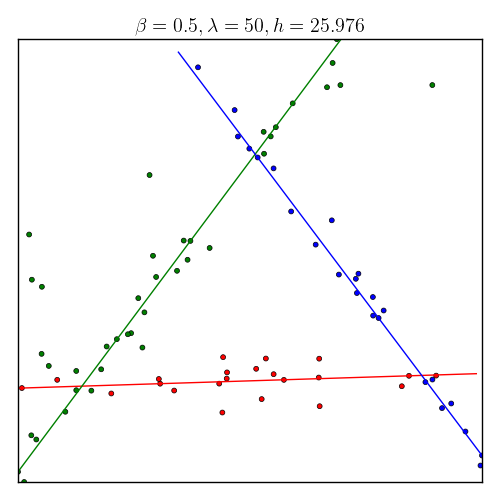
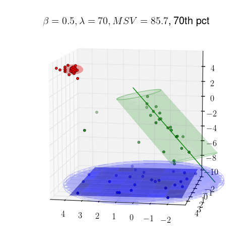

# Prototype Learning: Generalized K-means
---
Wei-Ying Wang and Stuart Geman, 2017

How to learn the inherent structures of data? Especially, they are non-labeled (this makes it unsupervised learning problem). Our algorithm can do it pretty well! In the right plot, after we found 3 structures (AKA prototypes) we summarized the data point according to its nearest structure, and colored it by different colors.

| 
Original data
 | 
Proposed Method: Structures learned
 | 
| ---------------------------- |:----------------------------:| 
| 

 | 

  | 

Another example in 3D:

| 
Original data
 | 
Proposed Method: Structures learned
 | 
| ---------------------------- |:----------------------------:| 
| 

 | 

  | 

Our idea is to generalize the loss function of K-means (minimizing it is an NP-hard problem) and minimize it. However, direct generalizing the idea of K-means algorithm is NOT working. Instead, we characterize a property of the minimizer of the loss function and built an algorithm that approximate it. In nearly all our experiments, the algorithm find the exact minimizer of our loss function.

The traditional way of finding these structures is using EM algorithm with Gaussian model, which is very similar to that of 
K-means, however, it fails horribly once we add some outliers to the data. 

| 
Original data
 | 
EM algorithm
 | 
Proposed Method
 | 
---|---|---
| 

 | 

  | 

 |

Let's look another example, which has more outliers, to demonstrate the robust nature of our method.

| 
Original data
 | 
Proposed Method
 | 
| ---------------------------- |:----------------------------:| 
| 

 |

  | 

How about finding multiple *different*  structures? Our algotihm can do it with some little "twist." The "twist" uses the idea of minimal volume of a cluster. In the following plots, the right one is the structure our algorithm found, we put two circle and a rectangle to give reader the idea of minimum volumes. For example: the volume of a point cluster (cluster that closes to a point structure) is defined as an area of a circle. 

| 
Original data
 | 
Proposed Method
 | 
---|---
| 

 |

  | 

An example in 3D:

| 
Original data
 | 
Proposed Method
 | 
---|---
| 

 |

  | 

By the way, we have a rule of thumb to determine the number of structures.